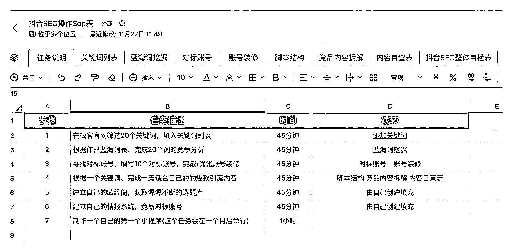
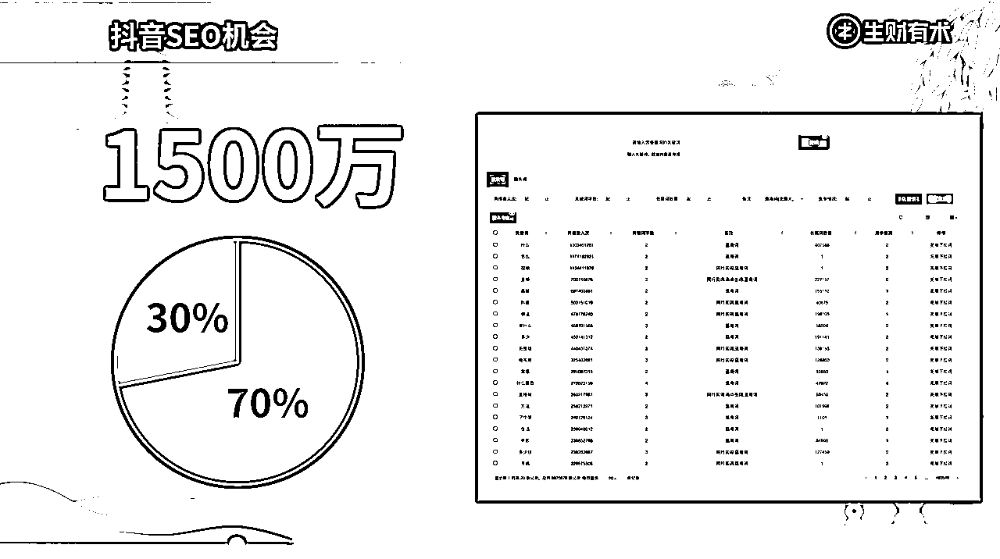
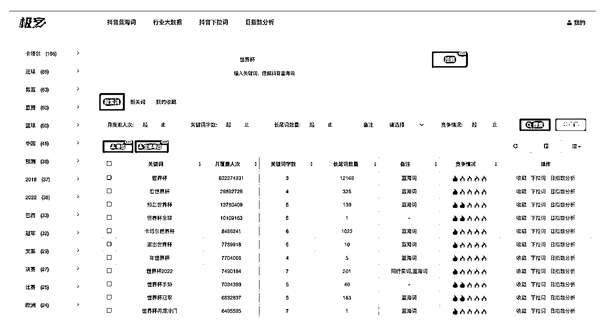
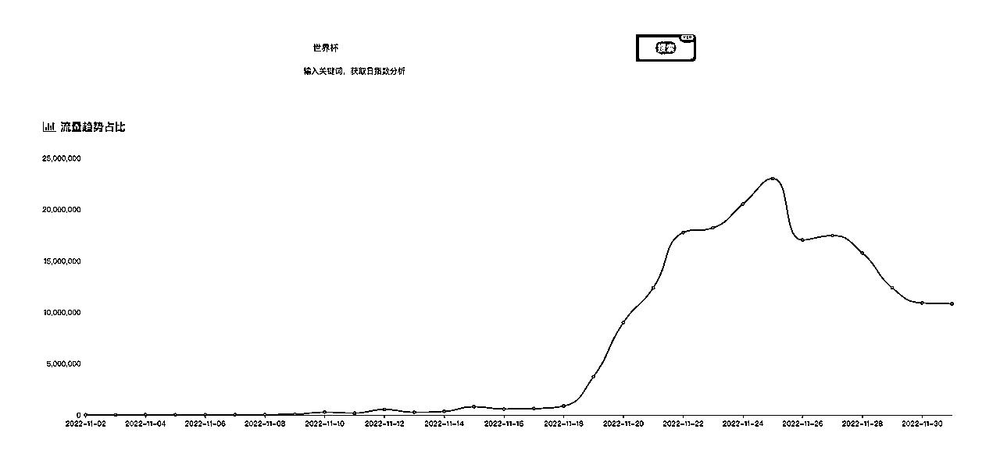
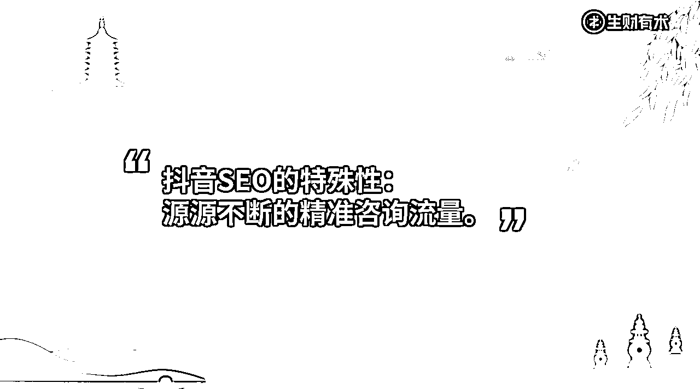
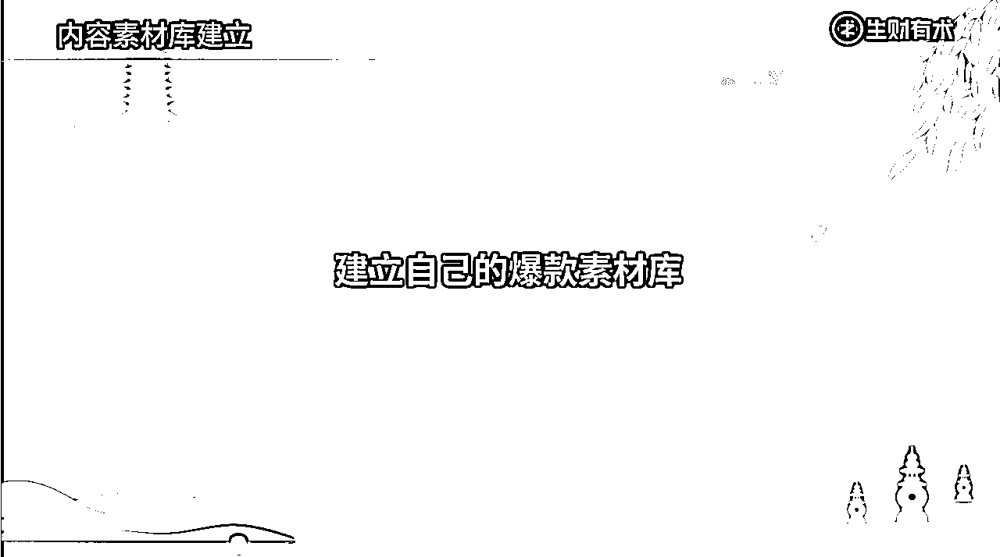
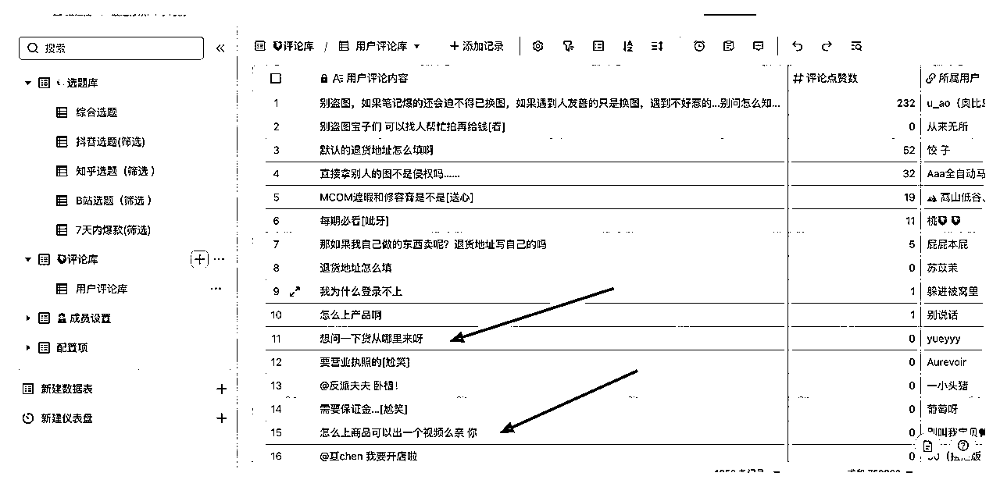
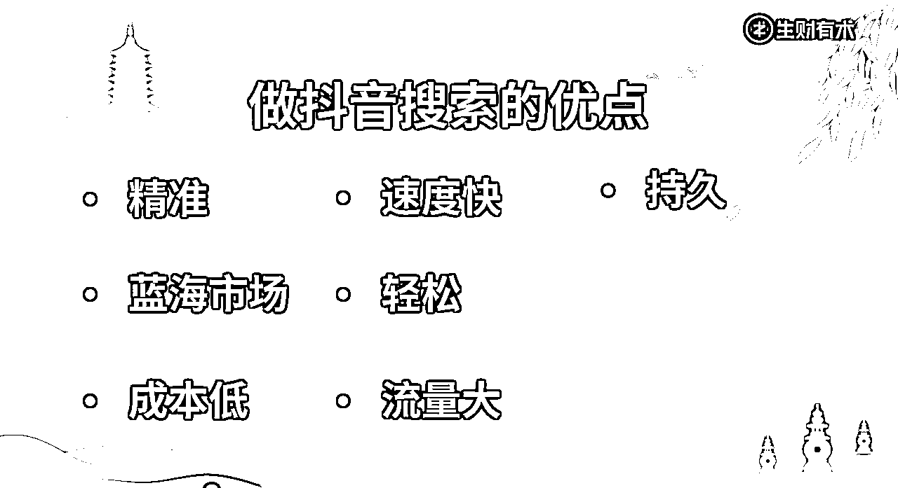

# 「抖音SEO」2天线下大课圆满结束

> 来源：[https://bchje44bsl.feishu.cn/docx/CZPydiVmgo2odMx0nWecf3DTn6e](https://bchje44bsl.feishu.cn/docx/CZPydiVmgo2odMx0nWecf3DTn6e)

很荣幸第一次与「生财有术」合作举办的「抖音SEO陪跑计划」，两天线下课圆满结束，这次效果很好，当场就有老板出了结果！

在我们历史的培训中，学员最快的记录是凌晨开始做，当天晚上出结果，用时18个小时。

然而这次线下课直接突破了记录，结果当场就有老板出结果了！只用了不到8个小时的时间，流量直接起飞。这位老板是做留学的业务，大家都知道留学的流量有多贵吧。

当时的情况是这样的，第二天线下课快结束的时候，我问了一下在场的各位老板，还有没有什么疑问。

有一位做留学业务的老板站出来，问了在场的各位老板：早上做的任务，大家有出结果吗？有没有人反馈一下。

然后接着说：如果大家没有的话，我有一个效果要反馈一下，我早上对已经发布的内容，按照老师的方法做了调整，一个月前的视频突然多了3w+的搜索量，评论区多了几十条客资。

虽然我们一直和老板们在强调，抖音SEO出效果很快，最快只需要一天，但是当这件事情当场发生的时候，大家还是挺震惊的。

虽然只花了5分钟的时间，对已经发布的视频进行SEO的优化，但是截止到昨天，这位老板已经新增了11万播放，2000个点赞，150条潜在客资，我们来看看对比效果图。

## 01 陪跑式：理论+实操结合

很多线下课都是纯理论式，当场的感觉很好，但是二天后已经忘记了80%的干货内容。

所以我们这次的线下课是理论+实操的形式，在了解完抖音SEO的底层原理之后，老板们现场开始完成了6个任务，完整的体验了一遍抖音SEO全部流程。

学完课程后可以拿到了一份专属的Sop，方便老板们在上完线下课之后，可以给到团队去执行。

## 02 选词定生死

做抖音SEO最重要的是选词，找到蓝海词，才能保证90%的成功率，词选的好，靠运气也能获得搜索流量。

目前99%的抖音博主都是不懂抖音SEO逻辑的，所以大家即使选词，也容易出现两种情况：

1.只挑大词，词太泛，加了等于没加。

比如只放行业词，二手车就放二手车，心理就放心理，做宠物关键词就选宠物，而用户压根不会这么搜，即使这么搜，这么大的词，压根也轮不到你。

2.挑了没有流量的长尾词，写了等于没写。

比如，有的老板会从自己专业角度出发，写一些专业的词，但是假如面向的是小白用户，大家根本不懂，也不会搜这个词，那这种词就没有意义，因为无法让用户搜索到你。而从用户的搜索需求我们就可以看出，用户会搜什么，从而避免这个情况。

而通过我们极客抖音seo工具，很好解决了这个问题。

我们1500万个搜索词中，70%是蓝海词，绝大多数一个领域，都可以找到属于自己的蓝海方向。

比如我给大家举一个世界杯的例子，可以快速找到大量与世界杯相关的蓝海词，以及与之对应的月覆盖人数，以及每日关键词的指数的涨势情况

## 03 抖音SEO还是蓝海领域，做好了之后轻松，持久

现场有老板有共同的痛点，做抖音太累了。平常做抖音，有发内容就有流量，没发就没流量。还有老板花大价钱请内容团队，请编导和剪辑，但是做出来数据却不佳，真的心力交瘁。

而老板们的这个痛点，做好抖音SEO，可以解决以上问题。

因为，蓝海之所以是蓝海，是因为流量大，竞争小。而之所以竞争小，是因为99%的抖音达人并不懂搜索逻辑，更别谈运用搜索逻辑，能获得长久流量的，更多是靠运气蹭上的。

这也是各位老板在上完线下课的共同感受：搜索出来的作品，远没有推荐的作品优质，搜索存在大量的机会。

而这一次，老板们不仅仅靠运气，更可以靠实力。

我们课上也举了一个非常强有力的例子，我们一个做APP的用户，就是因为挖掘了别人平常都不会注意到的小需求，专门做这部分内容，就能稳定每个月省下10万+买量费，同时多稳赚10万。而且还不怕竞争对手抄他，毕竟，竞争对手也看不明白。谁也想不到，这样一个不为人知的需求，竟然是用户心中的痛。

而我们抖音SEO课程，就能带你实现这一点。

## 04 精准：你戳中我的痛点了

想要最大发挥抖音SEO的效用，首先是你已经跑通了从0-1。很多老板的痛点，不是缺流量，而是流量来了，也接不住，转化率低，核心原因是，自身业务定位不清晰。

我们现场有位实体店的老板，在Hawli老师的指导下，惊呼：你戳中了我的痛点，我就是这样的。你解决了我一直以来的疑惑。

这位老板与合伙人开了一家店，面向女性群体，走的是高端路线，但是今年疫情严重，迫于压力，操作了一段时间的低价引流，导致吸引来的大量用户转化效果很差。

于是我们结合她的人群定位，建议她与别人做出差异化，做好客户的痛点分析，从用户痛点入手来做内容，避免传统的低价竞争。我们帮助她从用户的搜索量来分析用户痛点，区分用户群体，确定接下来的运营策略。

实体店老板反馈，以前只会凭直觉，现在靠数据支撑，更清晰了。学会用数据分析的方法，从用户的角度看问题，视野真的开阔多了。

你对客户的定位越清晰，你靠内容吸引的客户就越精准。

## 05 细节决定成败

做好抖音SEO，其中关键词的一环就是做好抖音细节。之前我们课程介绍里也有提过，抖音SEO底层原理包含十几项指标，我们在实操的时候，就是要把各项指标都完善好。

而各位有眼光的老板，选择了我们课程，相当于跟专业的人学专业的事，节省了大量自己摸索的时间。有一位老板感慨：单有工具虽然已经很不错了，但是收获一套底层思维才是真的受益匪浅。上完第一天就感觉超值了。

在学课程之前，大家做出的内容很好，但难以被有需求的用户精准搜索到。而上完课程，这个问题解决了。

老板们决定，好好珍惜这波机会，把细节做好，发挥更大的效用。而当场出效果的老板，也就是在原有的内容基础上优化了细节，就立马产生巨大的效果。

## 06 线下课福利：工业级生产，全自动的收集全网爆款素材库

老板们在了解抖音SEO的原理和实操步骤之后，非常关心的一个环节就是制作内容有没有好的办法？

做过抖音的都知道，每天发布什么样的内容是一件头疼的事情

每天找选题要花1~2个小时，这个能不能自动化解决？

我们给出的是工业级的内容生产方式：只需设定关键词，全自动获取选题。

我们把数据全部汇总到飞书文档，只需设定几个关键词关键词，就能够自动收集全网的爆款内容，每日自动收集全网昨天的爆款内容，大大节省人力了。

并且帮助老板们快速建立管理自己的爆款素材，随着自己的爆款素材内容越来越多，制作内容会越来越随心所欲，内容越来越简单，新人也可以快速上手爆款素材。

有一位老板深度理解了做内容过程的辛苦，看到这个素材库的时候两眼放光，毕竟，降本增效，节省时间就是节省成本，真香。

不仅仅能够自动收集选题，也会自动收集选题下的评论，方便深度洞察高点赞数的评论背后的隐形需求，比如下图中，可以快速清晰的挖掘出用户的需求。

最后：

抖音SEO现在存在巨大的蓝海机会，70%的词都是蓝海词，目前上排名还比较容易的。

每个优点的总结：

1.精准：来的用户更精准，转化率会更高

2.蓝海市场：1500万搜索词中，70%的词是蓝海词，大部分行业都有机会

3.成本低：只需要更新3~10条视频，无需日更

4.速度快：最快1天出效果，大部分开始行动后2~3天出效果

5.轻松：可以通过小程序抢占关键词

6.流量大：截止到2021年底月搜索为5.5亿

7.持久：蹭到搜索流量，一年不更新视频，依旧每月流量稳定