# ifttt实现推特用户更新内容后自动推送到邮箱或企业微信或钉钉

> 来源：[https://yq9pu32e9v.feishu.cn/docx/P2XLdJF2yoivV8xUDszcz853nZg](https://yq9pu32e9v.feishu.cn/docx/P2XLdJF2yoivV8xUDszcz853nZg)

前几天，我对象说如果有个工具，能把推特的账号发送的内容在很短的时间之内推到微信就好了，这样就能掌握很多web3圈内大佬的消息，跟着他们的步伐做项目了。

有需求，就能满足。

接着我开始百度找工具，因为推特是国外的平台，国内的很多软件都不能用，最终我找到了个IFTTT这个平台，这个平台就是自动化的，也不需要自己写代码，编辑上一些参数就行了。

这个平台有两个推送方式：

1、推特用户更新内容后，以邮件方式将推特内容推送到指定邮箱

2、推特用户更新内容后，通过企业微信群的机器人将内容推送到企业微信群（钉钉也同理）

这两个方法我都测试了，都是可以的，在这篇文章里我都会写出来。

先把平台注册了，注册连接：点我跳转到注册地址

对了，手机上也是一样的操作，而且手机上还有很多地方是中文的

注册后，点击上面的My Applets

免费用户只能搞2个推送机器人，还有两个付费版本，根据自己的需要购买

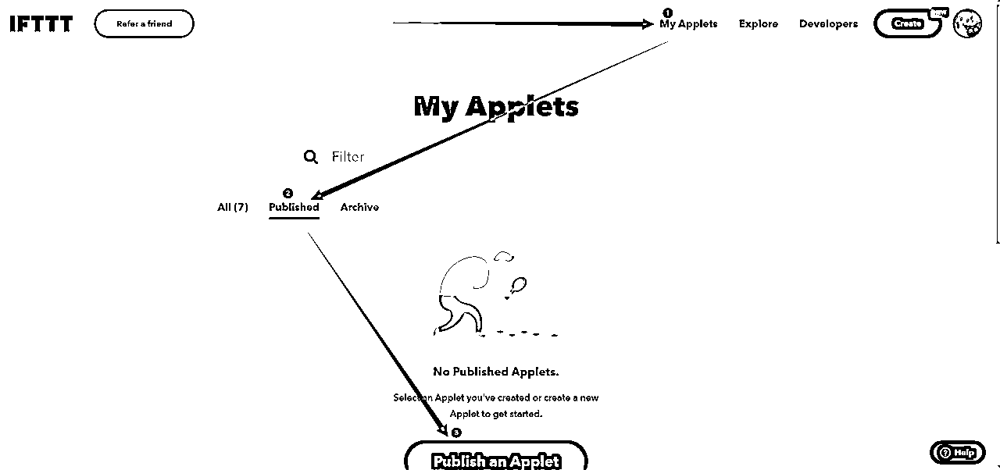

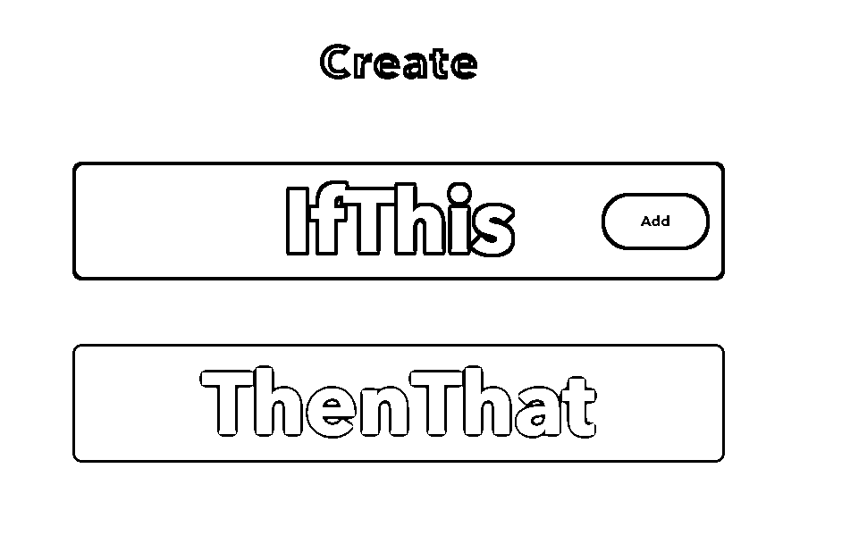

进来之后，会出现这个，第一行的意思是：如果这样 第二行的意思是：就会那样

合起来就是：如果这样了，那就会那样

理解了这句话，在这个工具上就能玩出很多的花样，比如说现在有人通过这个工具自动把微博的内容同步到推特（这些在油管上有教程，看得懂英文的在工具里也可以直接拿别人的用）

## 一、监控推特账号

点击 if this 后面的add 出现下面的界面

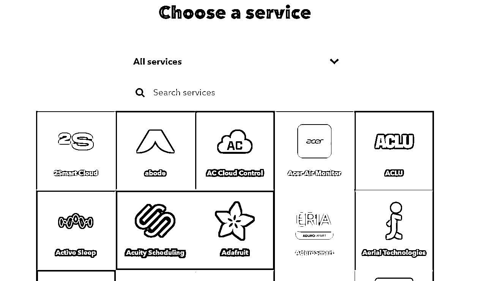

在放大镜后面搜索 twitter 选择推特平台

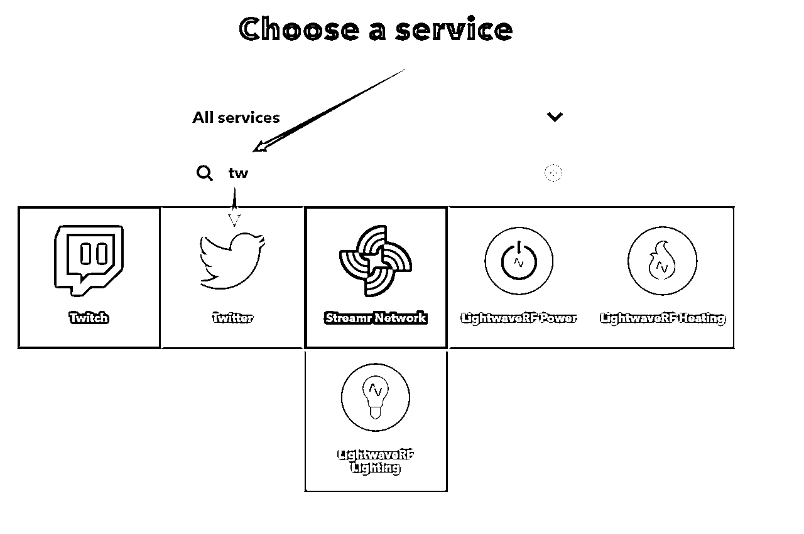

接着会出来很多选项让你选择，用电脑浏览器的话可以自己翻译，我们要用的是“指定用户更新推特触发”，就选择箭头指的那个，如果你有别的需求，就翻译一下选择别的

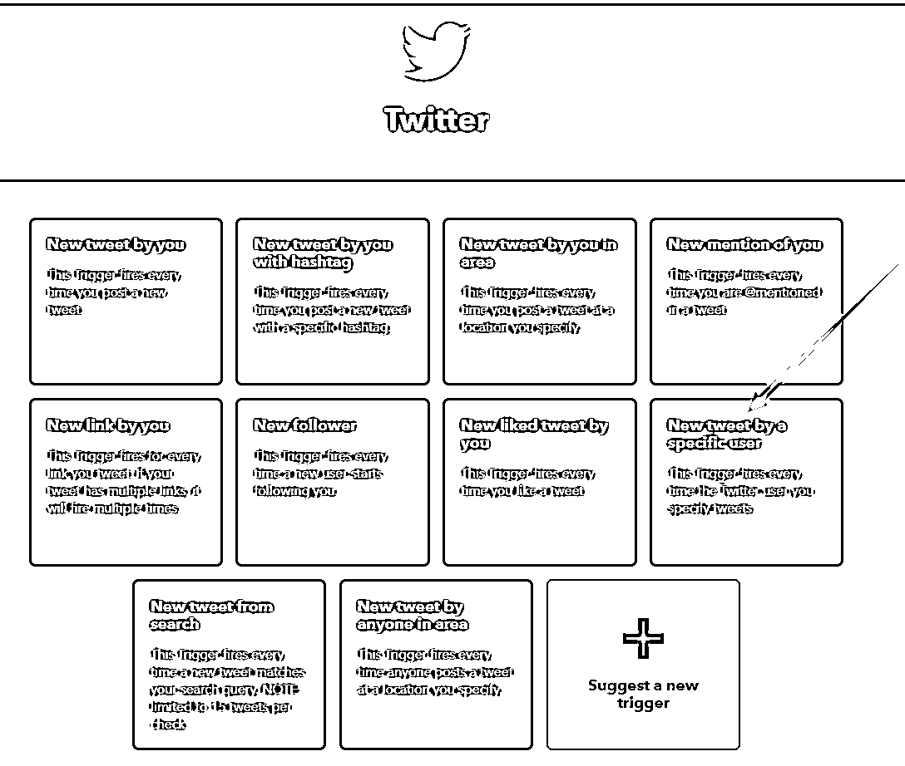

选择后，进入到下一个页面，选择账号

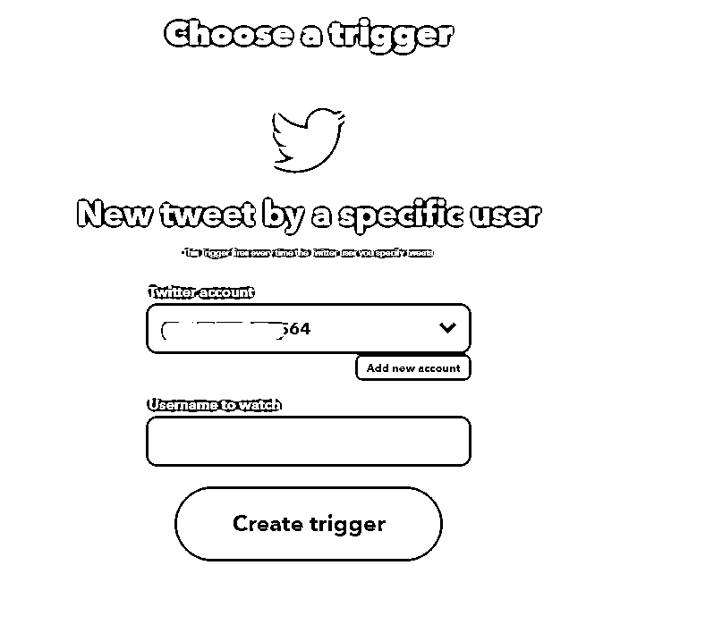

这里要填两个账号，第一行的账号是自己的账号，第二行是要监控的账号。

点击 add new account 会弹出来让你授权

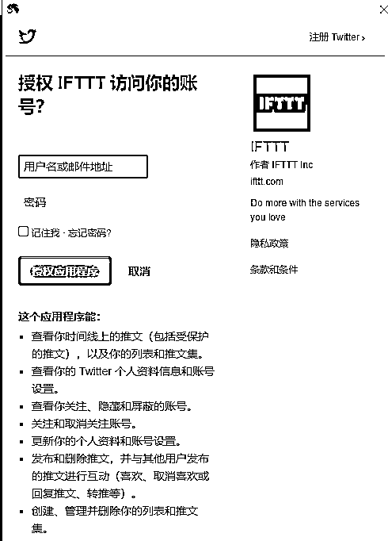

这里输入自己的推特账号密码就行了。

然后在Username to watch 填入你要监控的推特账号

最后点击 Create trigger

提交后，会返回到下面界面

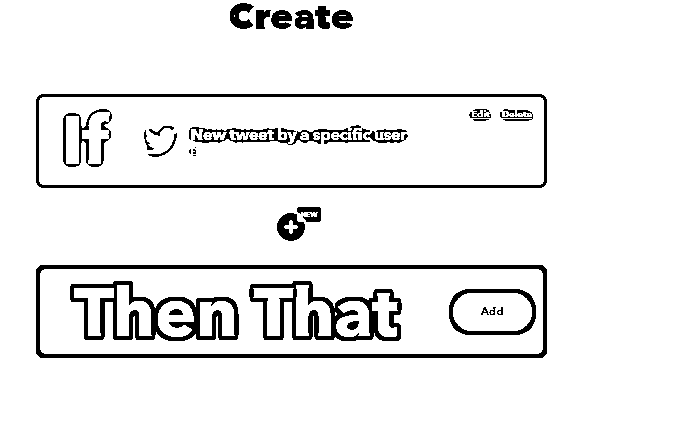

在下面的then that设置触发后的动作，邮箱推送和企业微信推送的区别就是触发后的动作不同。

## 二、邮箱推送

点击 then that 后面的add 进行添加 ，会进入到选择工具的界面，这里输入 email

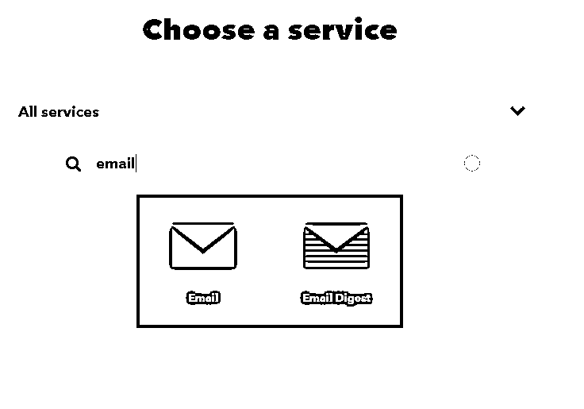

进入到下一个页面，只有一个可选项，这里就选它

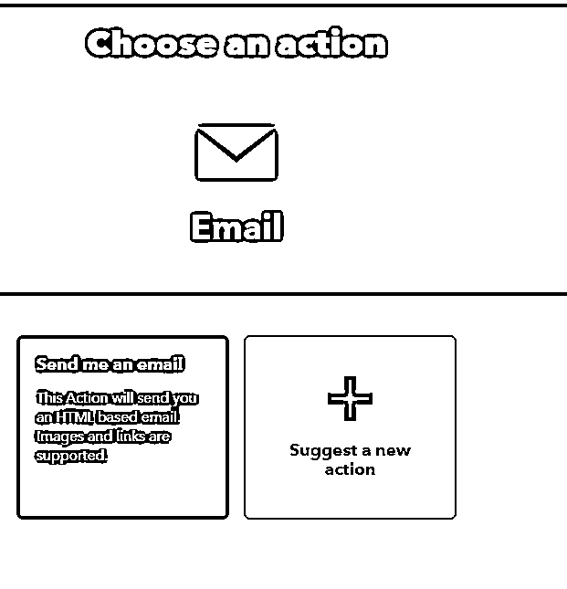

进入到下面这个界面。

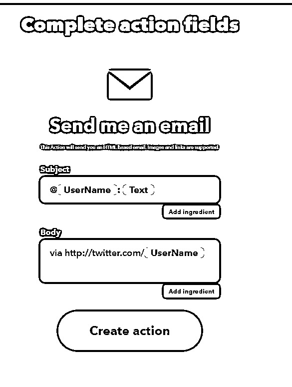

默认的内容就是这样的，如果你还想要推送别的内容到你的邮箱， 那么点击add ingredient 就能添加参数了。

设置好后，点击create action提交就行了。

这里他推送的邮箱是你账号注册的邮箱。

提交之后，这个机器人就完成设置了，当你要监控的推特账号更新内容后，就会发送到你的邮箱了。

## 三、企业微信群推送（钉钉同理）

### 企业微信：配置「Webhook 机器人」接收推送

企业微信 Webhook 官方介绍： 如何使用群机器人

#### 创建一个群聊

把相关的人士拉入群中，即可组成一个群聊。注意包含「外部联系人」的话，不能创建机器人，也就不能实现上述功能。

如果想创建单人群聊，没有钉钉的面对面建群的便捷功能，需要先把人拉进来，然后 T 掉，即可实现单人群聊。

#### 新增一个机器人

在群聊的设置界面中，添加机器人。

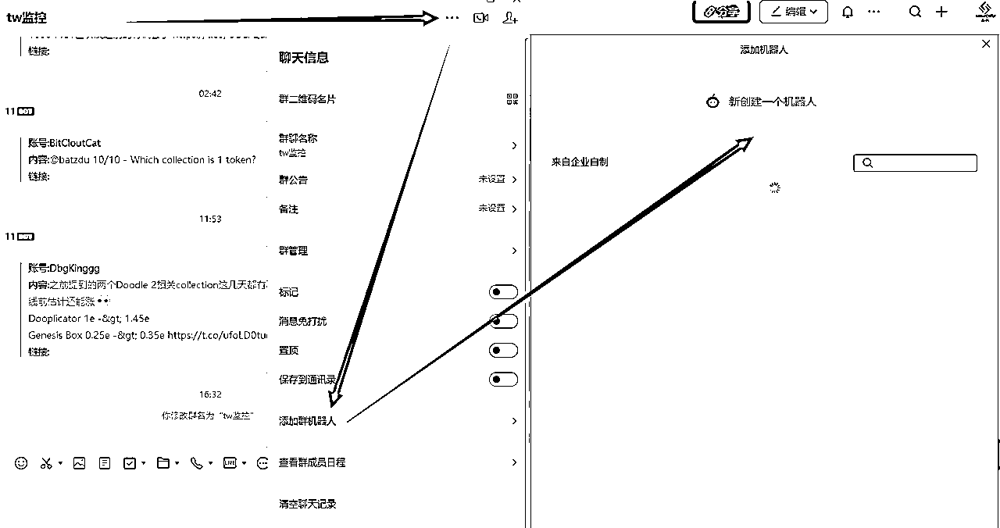

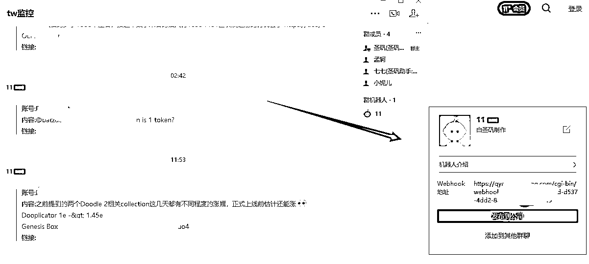

#### 获取调用地址，了解调用内容格式

生成机器人成功后，会获取到一个 Webhook 地址，请记住这个地址。（以后我们简称 {WebhookUrl}）

可以理解为，访问这个 Webhook 地址并以某种方式携带我们需要传递的内容，就能够把我们要传递的内容，推送到企业微信中。

搜索名为「Webhooks」的触发器，选择「Make a web request」动作。

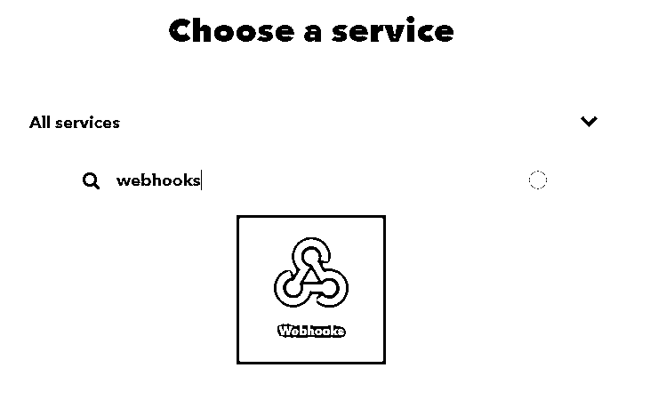

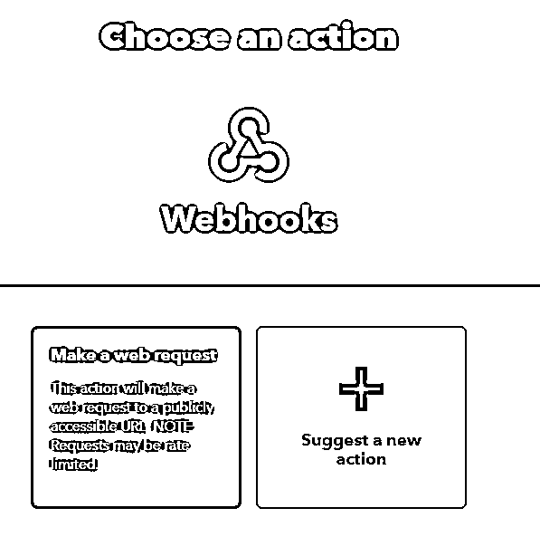

配置数据：

url填写WebhookUrl 其他的按照图中选择，Additional Headers 这个不填（因为我不知道这是啥意思）

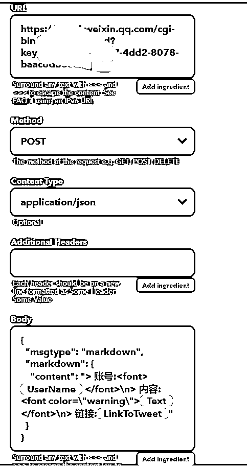

body填写内容(从下面一行的括号开始复制）：

{

"msgtype": "markdown",

"markdown": {

"content": "> 账号:{{UserName}} \n> 内容:{{Text}}\n> 链接:{{LinkToTweet}}"

}

}

配置好上面的内容后，提交就行了。

最后，你就会得到这样的机器人

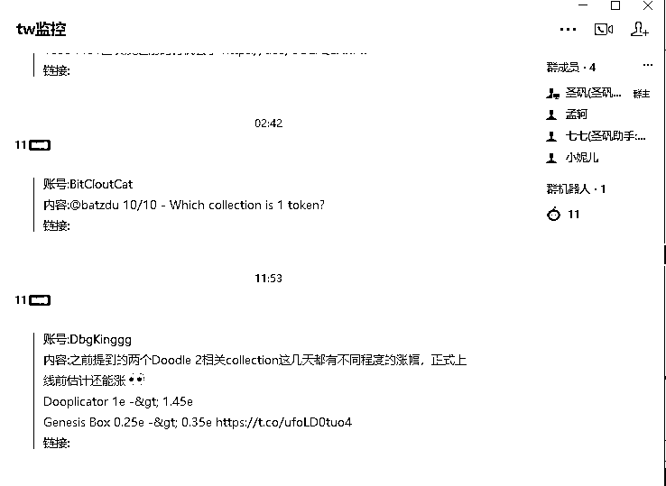

同理，钉钉也是可以这样操作的，只要能获取到webhooks地址的都可以。