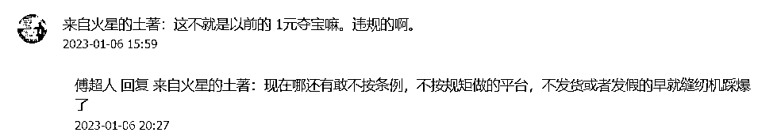
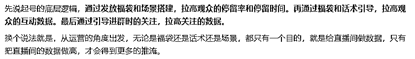
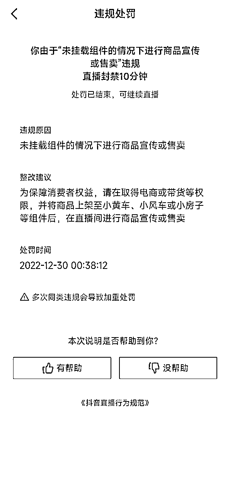
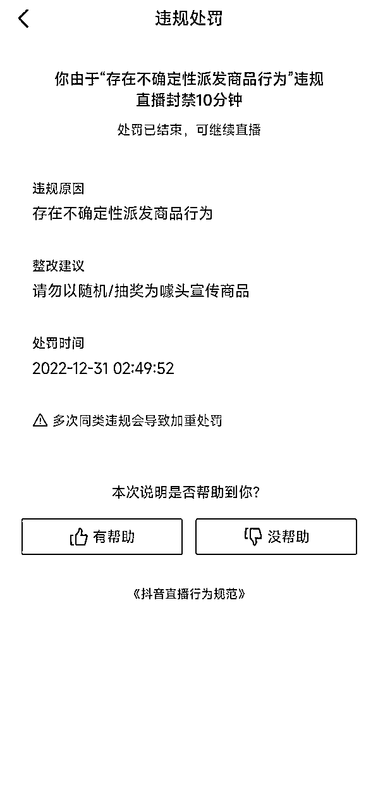
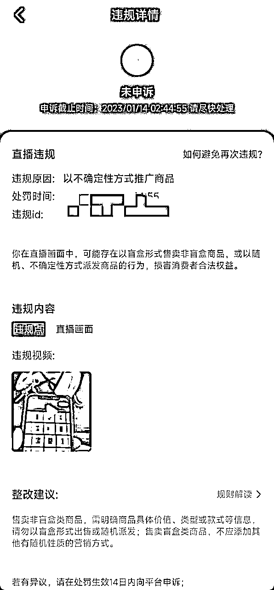
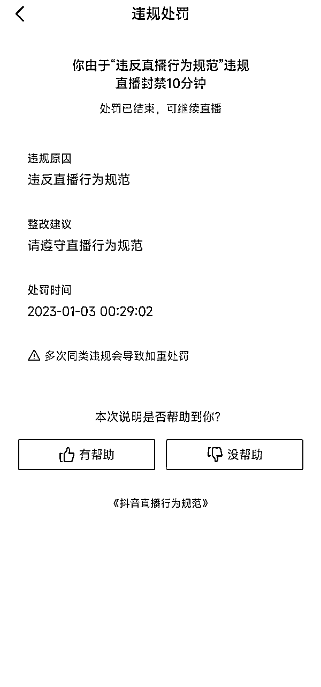
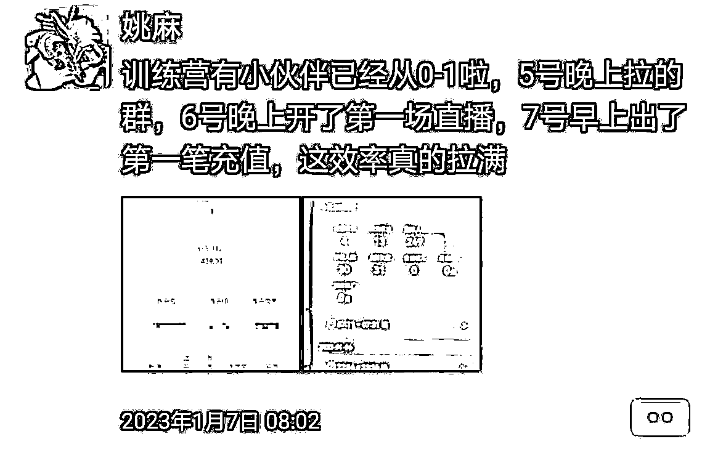

# 盲盒引流常见问题解答

> 来源：[https://fgsd3oxjki.feishu.cn/docx/SvdFdfi3VoAiaRxENHNcncEqnif](https://fgsd3oxjki.feishu.cn/docx/SvdFdfi3VoAiaRxENHNcncEqnif)

最近有很多圈友看了傅超人那篇抖音盲盒项目保姆攻略来咨询，大家的问题基本都差不多。

我干脆把近期比较常见的问题做了个汇总，分为【平台问题】、【账号问题】、【直播内容问题】、【风控问题】。

以及跑通0到1之后【复制与放大的问题】。

我们这边以目前陆续在扩充团队以及跑了两个月的实操经验做个补充，希望对大家能有所帮助。

有具体的方法论，也有对应的底层逻辑。

大家可以打开目录，跳转到自己感兴趣的章节自行阅读。

# 一、平台问题

大家最关心的问题就是，项目的合规问题。

怎么说呢，盲盒这个玩法不违规，但是有的盲盒平台违规（法律层面）。

给平台做推广不违规，但是在抖音快手做引流违规（平台规则）。

现在各类正经在做的平台，都还比较守规矩（通过差价，概率，现金流赚钱），都是看着相关条例搞的，而且也都会做很多相关法律咨询。

具体哪个平台合不合规，需要自己去甄别。

大体来说就是看：公布概率和真实概率是否一致、是否真实发货、会不会发假货等等。

因为整个项目其实真的很简单，基本上明眼人都知道，普通人要入局最大的门槛，无非就是能不能找到一个好的平台拿到推广的资格。

我们这边现在合作的平台目前就两个，一个是认识很久的朋友，另外一个也是生财圈友，还真没怎么自己出去找过平台资源，或者担心过平台到底靠不靠谱的事。

确实有不少圈友问我们具体做的什么平台，能不能带，但毕竟是签了独家，而且现在有在做付费陪跑，所以就不公开了。

就简单给大家说一下，这段时间或主动或被动的接触了大几十家平台，我们这边的一点经验和心得。

首先肯定是大家都关心的佣金比例，最低10%最高45%，这是我们所接触过的范围。

然后大多是在15%-25%这个区间，再低看不上，再高我们个人认为可能就不是很靠谱了。

结算周期的话，有日结有周结有半月结，月结目前还没有遇到过，我们比较倾向于周结，日结太麻烦，半月结又太久。

然后是平台的一些基本情况要了解清楚，比如说平台自己在通过什么方式推广，通过直播在做的有多少，后台和退款那块完不完善，是做的小程序还是APP，平台整个UI做的怎么样等等。

以及一个我们个人认为比较重要的点，平台那边可能不一定会去给你说，但是最好去试探试探。

平台是在市面上买的源码套的壳，还是自己找人做的，以及概率方面是平台自己跑的，还是用的别人现成的，这个真的非常重要。

如果说都是用的别人的，这个平台本身就是套了个壳，大概率是看这段时间这个项目在红利期，想来跟波风，收割一波，这种就很危险。

最后就是，如果能多找几家合作就多找几家，肯定会更为稳妥一些。

跑出一定的数据之后，尽量去聊聊看能不能签个独家，这个肯定是好处多多，大家懂得都懂。

平时和平台方面的接触也可以多一点，在确定稳定合作之后，一定要和老板见一面，这个线上走到线下之后，很多事情又会简单很多。

# 二、账号问题：

先说一个基本的概念：把心态放平，号只是工具，是消耗品。

因为我们们做的是跨平台引流，又是做的盲盒抽奖，这两种都是被抖音平台所抵制的行为，所以号被风控，也就是废号，这是很正常的，这种情况在抖音很正常，熟悉抖音的应该都懂。

我们做任何项目都需要具备财务逻辑。

投多少钱，赚多少钱。

只要创造的收入和号的成本打的正就行。

上面只是战略方向。

具体的战术层面，也不能太过于奔放，什么都不去注意，我们还是需要精细化运营。

毕竟一个号能多播一天，说不定就能多挣多少钱，这个道理应该大家都懂。

而且，一个账号能播的越久，直播间给的推流就越精准，转化也会越好。

所以尽量去保护好每一个号，是非常有必要的。不是说考虑账号成本的问题，而是考虑产值的问题。

我们这边有第一场直播十分钟不到就废了的号，也有播到现在一个多月还坚挺的号，关键还是在于怎么去操作，以及沾那么一点点运气成分。

## 1.账号一定要开橱窗吗？

答：不一定，按一个人5个号算，你弄2-3个橱窗号作为主号就好了，剩下的就用0粉实名号。

前期在账号的准备上，可以找身边的亲戚朋友借实名/账号，如果都是不同的身份信息，那可以都刷个千粉然后开橱窗，毕竟橱窗号比0粉号要抗造很多，橱窗500的保证金是可以退的，无非就是200左右的刷千粉成本。

如果是身边人的身份信息都用过了，那就找渠道去做多实名认证，还是那句话，只要产值和成本打的正就行。

## 2.新号直播间完全不给推流怎么办？

答：注意，这里的新号指的是，之前没有直播过的账号，而非单纯指新注册的账号。

其实这种情况也算正常，确实有的号他就是直播不给推流，怎么弄都解决不了。

这种情况不光我们们有，做其他类目直播的一样会有，这种账号遇着了就只能认栽，没得办法。

但是更多的账号，是因为你新注册之后就直接去直播，或者注册了很久的老号，之前没有怎么使用过，拿去直播，然后直播间不给推流。

这种情况，是被平台风控了，但是不是因为直播内容被风控了，而是因为平台判定账号使用异常风控的，只需要去养2-3天号，每天刷刷视频看看直播，让平台认为你是个正常的用户，再去直播就基本正常了。

总的来说，遇着直播间完全不推流的账号，我们们的处理方法为：

先多播几场，看会不会正常推流。如果每场都不给推流，就在同一个直播设备上，切换其他账号直播，看推流是否正常，判断一下是不是设备/网络的问题。

如果设备和网络没有问题，就把不推流的账号放一放，养几天号再去直播，如果还是没有推流，就直接放弃，不要耽误自己的时间。

## 3.如何判断直播间推流情况？

答：开播2分钟以内有进人，5分钟以内有极速流，就是正常的。开播5分钟了都没有进人也没有极速流，播个十几分钟下播观众数是个位数，这种就是被风控了。

如果是原本正常的号，可能是因为被处罚了。

如果是没直播过的号，按上面的处理方法2去做。

如果出现那种，一两分钟进一个观众，过了5分钟也没有极速流，这种账号不是被风控了，算是正常的账号，可以等一等，一般播到10分钟，会出现极速流。然后下一场再去直播，基本就正常了。

# 三、直播内容问题：

关于直播内容方面，比较常见的有：场观在线拉不起来、接不住极速流、流程话术不熟悉、dou+的使用、转化很差、直播时间和场次等等，基于这么几个问题，分别做一下解答。

## 1.场观在线拉不起来怎么办？

答：先看一下我们们拉场观的一个底层逻辑，可以这么说吧，把这个逻辑捋清楚了，一通百通，你做任何类目的直播，都能用得上，建议大家认真去理解一下。

那么具体该怎么做呢？其实很简单，开播前先充个6块钱抖币，开播第一件事情就是，发福袋，发1/3个可以抢的福袋，设置评论指定内容，时长5/10分钟。

接下来要做的事情，就是只要直播间有进人，就引导他去参与福袋，让他留在你的直播间，并为你做出一条互动数据。福袋开了之后，引导中福袋的观众给点个粉丝团，然后福袋不要停，确保后面进来的人，都有福袋可以抢。

还有一个就是，最好能安排1-2个小号在直播间当托，一个是在必要时刻配合发弹幕做引导，还有一个关键点就是开头抢福袋。

有过直播经验的人就会知道，有个情况很有意思，就是直播间明明也有人，福袋也发了，就是没人会去抢。

在这个时候，只要有人开了这个头，你就会发现后面突然一下，会跟着好几个人都参与了福袋。

同理，我们们有说过引导观众发数字做互动，可能原本就有人看，可你单纯靠话术引导没人理你，这时候小号先开个头，后面自然就有人跟了，这叫从众心理。

在场观在线稳定之前，在推流标签精准之前，真没别的巧，就是用福袋去做留存，用福袋去接极速流。

有人可能会说，场景和直播内容不是本身就自带高停留吗？这话没有错。

但是，这是针对于精准流量而言的，刚开始推流标签都很混杂，说不定进来的都是四五十岁的中老年人，和我们的目标用户根本不搭尬，他们连看都不想看一眼。

## 2.接不住极速流怎么办？

答：上一条其实已经说过了，推流精准的时候，极速流都不用你怎么刻意处理，直播内容就可以把他们留下来了。

初期起号阶段，推流不精准的时候，就是靠福袋去接极速流。

哪怕都是大爷大妈，没有关系，只要能让他们留下来参与福袋，给我们们做个留存和互动的数据，那就够了。

## 3.流程话术不熟悉怎么办？

答：没怎么办，已经开始直播的就多直播，在实践中成长，播个几场就好了。

还没有开始直播的，可以多翻一翻我之前的帖子还有@傅超人 的分享，有比较详细的直播流程和话术参考。

然后每天多刷一刷直播广场，找一找同行的直播看，一天看个十几二十个号，两三天就能刷到很多直播，看多了自然就熟悉了。

一定要看的同时，自己整理出适合自己的话术，逐字稿，然后再慢慢优化。

## 4.dou+的使用问题

答：起号阶段确实可以借助dou+来做突破，但是不建议多用。

原因很简单，dou+会触发人工审核，基本上dou+一场也就跑个几块钱十几块钱就停了，这个倒是无所谓，风险在于可能会因为这个的人工审核，导致账号被判定引流/盲盒抽奖而处罚。

一般dou+的话，开播之前就可以投好，类目选观众互动，18-30岁的男性，兴趣为手机，投放时长6/12小时。

## 5.转化很差怎么办？

答：转化差在我们这分为两种，一种是直播间有流量但是引导进群的转化很差，还有一种就是进群和注册的数量不少，充值的却很少。

进群转化很差的，一般就两个原因，要么是直播氛围做的不好，没有让观众有很强的代入感，或者看起来的效果太假了，信任度太低。

还有一个原因就是，引导进群的流程做的不好，单单是口头引导，没有用另外一个手机演示如何进群，或者演示进群不完整。

充值转化很差的，这个倒是不用急，只要进了群，只要注册了，后面都好说，因为会锁人头。

有的人可能是当天看了直播，当天就注册了，但是他会看好几天直播，突然在某一天就冲动了，然后开始了他的第一笔充值、第二笔充值、第三笔充值...

还有一个方法就是，在粉丝群里已经有一定用户数量的情况下，可以把群禁言解除掉，自己安排几个小号去里面秀成果带节奏，然后主播再顺势引导用户一起冲，搞完了再恢复群禁言。

这个方法我们称之为炒群，现在有不少做了一段时间的老主播每天数据很好，不是因为每场直播数据有多好，而是因为在炒群。

## 6.直播时间和场次的问题

答：原本是跟大家说的，测下来晚上12点-6点的数据比较好。

但这段时间也一直在测其他时段，跑出来的数据其实也还可以，至少比之前测的时候要好很多。

一方面是因为马上过年了，整个项目本身就算是红利期，还有一方面是因为不少人都放假了，白天不用上班/上学。

场次的话，出现断播的号一天一场，没有断播/警告一天两场，号越多播的场次越多，数据就越好，这是个死理。

所以场次安排，更多在于自己这边账号的准备情况。

还有一个就是直播时长，现在我们这边自己的主播，都是要求他们定死了15分钟一场，两个流程走完直接就下，尽量避免被系统断播，以及防一手同行举报。

甚至我们都有让一些不怎么听话的主播，直播的时候定个闹钟，闹钟一响就做最后一次引导进群，然后下播。

# 四、风控问题

这一块会详细的通过图文介绍过程中遇到的各种平台风控问题以及对应的解决办法。

## 1.由于“未挂载组件的情况下进行商品宣传或售卖”被强制断播，禁播10分钟/24小时。

这个是小问题，没开橱窗的号会收到。

开了橱窗之后，直播的时候挂几个苹果手机的链接，就不会出现这种违规了。

算是最常见，也是最轻的处罚了，对账号基本无影响，只要你不是一天内多次被禁播就行。

## 2.由于“存在不确定性派发商品行为”被强制断播，禁播10分钟/24小时。

也是常见违规，一般是因为直播间被举报，可以申诉，但没必要。

这个避免不了，只能在直播过程中尽量避免使用“盲盒、抽奖”这类的说法，然后控制直播时间，不要太贪心，播十几二十分钟就主动撤，不给同行举报的机会。

如果出现了这种违规，当天那个号千万不要再直播了，如果再来一次这样的违规，号很有可能直接就废了。

但如果是隔三差五的来一个，这个影响不大。

## 3.由于“违反直播行为规范”被强制下播，禁播10分钟/24小时。

这个很严重，千万要注意这个东西，如果说出现了这种违规，先等禁播时间过了，然后用被禁播的号去直播，看一下直播间是否还有正常推流，如果推流正常，那就没关系，直接把直播关了然后换号播，这个号当天不要再播了。

但如果说二次直播的时候，直播间完全不给推流，那这个号就直接是废了。

注意，出现了这种情况的话，当天这部用来直播的手机也不要用了，换其他手机登其他号来直播，防止是封设备。

到了白天的时候，注意绑定这个抖音的手机号，有没有来自抖音的电话，如果有抖音打电话过来通知你，绑定的账号因为推广盲盒/违反直播规定被怎么怎么处罚，那么恭喜你，这个设备被封了。

只要用这个设备去直播，播一个封一个，3分钟都熬不过去。直接去刷机吧，刷完机又是一条好汉。

如果白天没有抖音的电话，这时候也不要掉以轻心，晚上过了12点，先用违规的那个号在违规的那台设备上，去直播看看，有没有推流，有的话就万事大吉。

如果还是完全没有推流，换一个试试看，这个号就是纯炮灰，有推流就没问题，只是前面那个号废了，如果播几分钟就被“违反直播行为规范”，那就是确定了封设备，直接刷机。

综合上面的几种情况，要跟大家说的就是，我们直播的时候不要太贪，要学会见好就收和及时止损。

不要觉得没被警告或者断播，就可以一直播一直播，你播下去流量不一定会高，转化也不一定会有，但是号的风险是一定在增加。

还有就是已经被断播被处罚了的号，当天能不再播就不再播，别头铁觉得一个号无所谓，就自己好好想一想，如果被封了24小时，你可能会损失多少收入。

如果设备被封了，甚至导致更多的号直接废了，你又会损失多少。

# 五、复制与扩大规模

由于项目上手比较简单，所以复制起来见效很快。

这一块也没什么太多好说的，无非就是先跑通0到1的模式（有设备，熟悉流程，熟悉话术）

然后加号，加人去铺就好了。

加号这块很简单，能找到人帮忙的就找人帮忙认证，找不到就找渠道做多实名。

重点给大家讲一下怎么加人，聊一下我们这边现在招主播的一个模式，以供大家参考。

首先招人的渠道，就是通过现实圈子去招的，让身边的人去给我们介绍，20-30岁的男生为主。

因为规模现在没有扩很大，而且过年这段时间都在老家，所以没有通过求职APP那些去招。

然后是分成制度，刚招的新人主播，我们这边现在给的是80一天+5%-10%的阶梯式提成，这个80根据所在地方薪资情况而定。

然后要按照要求直播了足够的场次才会给，提成的话是默认5%充值提成，周充值达到5000是6%，周充值1W是8%，周充值3W是10%。

然后新人会给到他们设备、账号、场景布置上的支持，当然了，一般都会找那种本身就是用新款苹果手机的。

播了一段时间之后，感觉人和数据都比较稳定了，就会跟他们聊换一种合作模式，没有底薪，给纯提成。

我们也不会给安排账号，让他们自己去搞定账号，能弄多少我们这边不管。

但是提成比例的话，会提到10%-15%的一个区间，而且可以给到做日结提成，对于每天直播场次和时长也没有要求，纯看自己。

这种模式看似比较懒散，但实际上主播的干劲和奔头反而更足，因为他们觉得这是自己在创业。

但有一个不好的点，就是这样的主播容易被其他平台挖，不过这也正常，只要是在正常播的主播做的还可以的，基本每天都会遇到有平台来问的，这就比较考验情分了，如何让自己和主播之间的羁绊更深一些，这是需要去考虑的东西。

当然了，也有最简单的处理办法，就是钱给到位。

好了，到这里基本就差不多了，感觉也没什么要补充的了，要是还有别的什么问题，可以来找我们聊，对咱们生财圈友，我们向来都是知无不言言无不尽。

现在这个项目确实是在红利期，而且好复制，希望大家在做的、想去做的，都能顺顺利利，踩中这波风口！