# 小说推文进阶玩法，精细化运营所带来的稳定出单

> 来源：[https://m1lpiqj5ed.feishu.cn/docx/ZcEdd0xTCo1K5IxwCyLccKUynOb](https://m1lpiqj5ed.feishu.cn/docx/ZcEdd0xTCo1K5IxwCyLccKUynOb)

大家好，我是今年加入生财的某人周，一名工科出身的英语老师。年中开始就跟着 干小说推文项目：在抖音等平台发布知乎的付费小说，引导观众去知乎开通盐选会员看后续，开通后推文博主获得佣金收益。

目前我运营2个号，每天发布2-4条视频，每天从选文改文到剪辑发布投入的时间不超过1.5小时，单号每周收益在400左右，偶尔爆一篇赚几百上千，此外老视频的长尾流量还能细水长流地出单。

这是我第一次在某个项目中投入这么多的时间，这里分享我通过精细化运营做到稳定出单的心得和理解，希望帮大家更深入全面地了解推文项目，以及给大家提供有价值的实操步骤。

#### 本文主要写给有以下几种情况的小伙伴：

首先讲一下小说推文项目的现状，推文项目已不再如上半年那么蓝海，在不断有个人、工作室进入的前提下，形成了“两个共存”的局面，即知乎、番茄、潇湘等多平台共存；配音、图文、真人等多种推文方式共存。

对个人玩家来说，推文的主要卡点在于前期起号慢、正反馈不稳定，甚至是同一篇文章，别人发爆了我发平平无奇的情况，对心态影响很大。需要结合抖音的推荐机制，不断优化选文改文、剪辑制作和日常运营，不断提高视频爆款的概率；争取有一两篇爆款后，账号标签稳定、视频数据稳定、推流人群稳定，进入平稳阶段，项目体验会有显著改善。

对工作室玩家来说，规模化的运营模式非常适合小说推文，个人运营2~3个号，工作室10个号起步，不仅是收益翻倍，爆文的概率也翻倍。如何把推文项目做得更大更好？发挥规模化的优势，更快铺新文争取爆款，采取更稳定可靠的起号流程，降低试错成本，使用更优质的文章和素材，提高视频平均质量；老号运营维护和新号冷启动两手抓。

下面我将根据配音号的实操流程，从选文改文、剪辑制作、发布运营、日常维护四个方面展开，也可以根据左侧的目录直达想要了解的内容。

## 一、选文改文

### 选文垂直化

如同视频带货的选品，选文是小说推文项目的绝对核心。选文可分为两个步骤，首先是找到充足的、优质的文章来源，其次是筛选出符合账号定位、有爆文潜力的文章。

#### 作者垂直，从优质作者到优质文章

平台上的小说茫茫多，哪怕是借助工具批量筛选都看不过来，更不用提 “有哪些好看的xx文” 这种问题下几千上万个回答，更新频率高但质量良莠不齐，但有个点是不变的：文章都是作者写出来的。

抓住了作者，就可以说抓住了稳定的文章来源。不需要经常去翻阅问题的新回答，把重心从问题上移到回答问题的人身上，作者是最稳定的文章产出。

那么很显然，优质的作者=优质的文章来源，比如知乎上的巧克力阿华甜、白框凉太子、张若妤等等，人家是坐拥几十上百万粉丝专业的作者，对于创作热点、创作套路的理解比我们强，与其在问题回答下大浪淘沙，不如紧跟这些优质作者。

关注8~10个符合账号定位的优质作者，在知乎-动态里可以看到他们每天点赞的文章、关注的问题、发布的回答还有他们关注的作者，顺腾摸瓜挨个找下去，根本缺文章来源，需要做的是对文章内容进行筛选。

关注好作者/专栏后，每天选定几个时间点 “收菜” 就可以了，不仅能直观看到优质作者的最新动态、争取文章首发，还能捕捉盐选专栏动态，抢占关键词先发制人。

#### 专栏垂直，优质文章的同类扩充

作者是优质文章的生产者，而盐选专栏是优质文章的收纳库。专栏收纳的是同一主题或者同一作者的优质文章，相当于知乎的编辑事先帮我们筛选一遍。

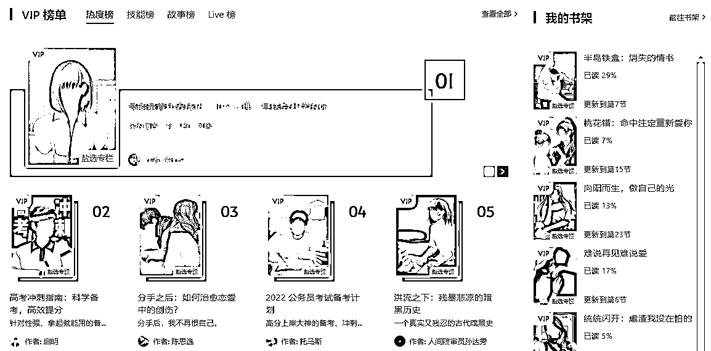

每个专栏都有它的主题，比如下面这个《从校服到婚纱，少女暗恋成真》，看名字就知道专栏里的文章大多是青春校园主题的，而且最终结局还是HE(Happy Ending)，这个专栏就很适合我们筛选校园题材、受众是18~23岁女性的优质文章。

再举个例子，10、11月起新号很好用的专栏《爽文女主她杀疯了》，有些文章发布当天就能上热门爆文，甚至过一周左右再发也能取得不错的市场反响。

爽文就是追求说不敢说的话，做不敢做的事，怎么爽怎么来，从校园打脸到“反杀”亲戚都有，因此它的受众极广，特别是扮猪吃虎的套路百看不腻，大家都喜欢压抑后的打脸情节。

总结，从专栏里选文章对账号的 “垂直” 帮助很大，因为优质作者们很少会死磕某一类文章，我们也不可能只发一个作者的文章，但我们可以瞄准了一个专栏使劲薅。

在我看来，专栏选文是对作者选文的补充：选中了作者的某篇优质文章后，查看该文章所属盐选专栏，再去专栏里筛选同类型的优质文章。

#### 如何判断一篇文章好坏？筛选文章需要考虑哪些因素？

知乎上的小说受限于篇幅、主题、平台等因素，一篇小说只能讲好一件事，其他所有剧情都围绕这个核心情节展开的。此外，知乎的小说通常会将核心剧情的概括及结果前置在小说开头，吸引读者注意。

这里拿一篇家庭教育主题的虐文举例：

我和同学起了冲突，老师叫了家长。

我妈到了学校二话不说先给了我一巴掌，还把楼道里的窗户打开，让我去死。

我没有犹豫，从六楼翻身一跃而下。

我和同桌张雯雯课间操的时候打了起来，我扇了她耳光，她挠了我的脸。

我俩同时被叫了家长。张雯雯的妈来得很快，一听说闺女被打了，

「哎你这孩子怎么回事儿，有没有点教养？」张雯雯的妈松了口气，扭头拧眉看我。

「你怎么能动手打同学啊，有什么事儿好好说不行啊？」

林老师微微皱眉，刚想说话，就见我妈急匆匆地赶了过来。

她穿着一身西装，手上还带着一沓文件，应该是刚开完会。

我妈紧紧锁着眉，见了我的第一句话就是：「你能不能消停点？」

这篇文章在盐选专栏内获得近万赞及1400+条评论互动，在抖音上不只一个号发这篇上热门爆单，不论新号还是老号，那为什么这篇家庭教育虐文能火？它包含了哪些能爆的潜质？

简要分析一下剧情

小说开头是一个非常具有代入感、许多人都经历过的场景，同学打架老师叫家长。犯了大错叫家长来协调，回家指定还有一顿骂；

第二句话直接让人血压飙升，二话不说一巴掌，潜台词就是不分青红皂白，结合叫家长的场景，孩子在大庭广众下被打，不被理解的委屈、不甘、埋怨已经在心中激荡；

紧接着第三句话，打开窗户让我去死，让人不自觉联想到20年一初中生被母亲当众扇耳光后跳楼的悲剧，不好的预感和悲伤到了一个极点；

随后就是，没有犹豫一跃而下，正如那位从走廊一跃而下的男生，这是意料之内的悲剧，更是黄金5s开头的典型。

总结一下，一篇好文章都有哪些特点？

##### 身临其境的代入感

为什么许多架空小说的开头都是穿越？因为穿越能在读者和主角之间创造一种连接：我们都是地球人；为什么知乎小说绝大多数都是第一人称？都是为了增加代入感，代入感是继续阅读的前提条件。

我说某打工人中了彩票大奖挥霍无度能有代入感，因为打工人完全有中彩票的可能性，甚至下一个就是你我；但如果我说某打工人起床去火星救了太阳系公主，然后出走银河系统一宇宙，你只会觉得太离谱太扯淡了。

##### 强有力的情感调度能力

好的小说一定能让读者和文中角色产生共情，随着剧情发展，读者会因为文中角色的遭遇或喜或悲，比如上面提到的家庭虐文，看了个开头我就已经开始生气了，怎么还会有这种妈妈？

调动情绪也是代入感的进一步体现，看别人的流水账也能有代入感，但往往淡而无味阅后即忘；可如果流水账说他今天和女朋友大吵一架后无缝衔接女友闺蜜还和女友他妈暧昧不清，这八卦的情绪不就有了？

##### 扣人心弦的剧情安排

知乎的小说大多在1w~3w之间，如此短的篇幅只能用来讲好一个主题一件事。所以剧情一定要紧凑、合理，交代好事情的起因/结尾，重点写好核心剧情，结尾仓促一些其实无可厚非。

紧凑指文中不能有太多废话，比如对推动剧情毫无贡献的打情骂俏、单纯废话的场景描写、莫名其妙的个人独白，这些可以直接在改文阶段删掉。

合理指剧情发展要符合上下文逻辑，文中人物的行为要有前因后果。还是以上面那篇家庭虐文为例：

妈妈不能真的无缘无故打女儿，这是因为她长期把对丈夫、对家庭的恨转移到了女儿身上；也不能打完一巴掌后立马回心转意开始道歉，那是因为女儿真的选择了跳楼，她在经历了这一切后才道歉。

所以通读全文是很必要的，不仅为了了解情节脉络，更是培养对文章的“文感”，文章好坏、有没有爆款潜力一看便知。

##### 引人回味深思的社会意义

这是小说的额外加分项。文学作品往往来源于现实，在抖音爆过的知乎小说很多，为什么这篇家庭虐文在知乎的成绩这么优异？因为它还能反映一种社会问题，令人看完后深思。

如果我是文中的女儿，我会不会选择跳楼？如果我是文中的家长，我会这样刺激孩子吗？如何防止类似事件再次发生？社会意义能让小说脱离单纯的娱乐性质。

最后，强烈建议大家在选文的同时为账号制作选文表。比如下面是我的一个虐文号的选文表格，从左到右依次是剧情概括、专栏链接、关键词、小说标签、是否提交和发布。

对于每一篇入选的文章，我都会创建单独文件夹，并用编号+关键词+一句话概括命名，这样做一是能构建直观清晰的备选文库，二是加深我对选文改文的印象和理解。

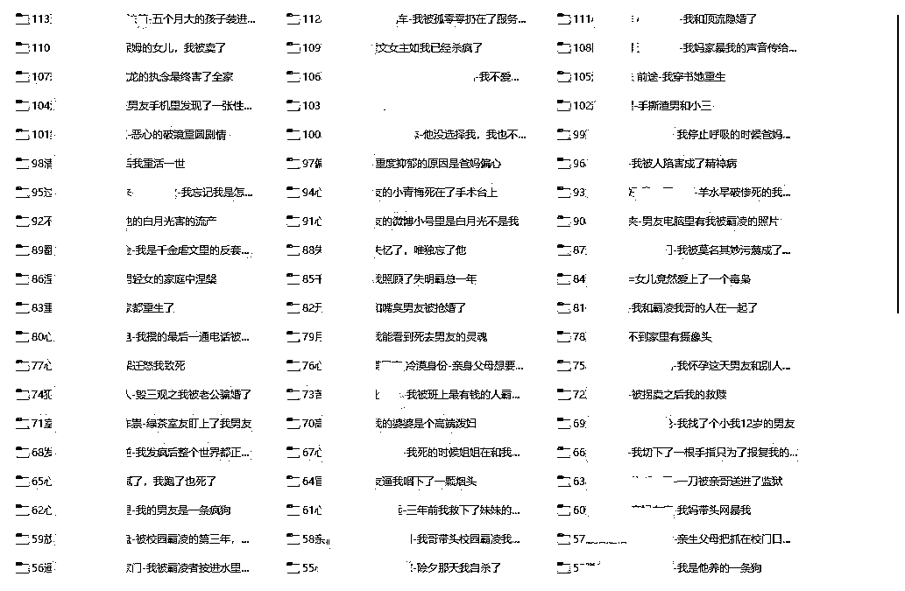

抖音热点宝、跟踪对标账号也是一种选文方法，这里不赘述了。

* * *

### 改文套路化

为什么要改文？尤其是改开头？因为有些文章的开头第一、二句话并没有那么吸引人，只是在陈述一件平淡的事，读到中后期才能体会到它的精彩之处，俗称“中开高走” 或者 “低开高走”。

但观众可没时间管你高不高走不走，刷到一条视频看几秒，不感兴趣直接划走，这样的情况下我们根本没有机会把文章的精彩之处展现给观众；直观体现在5s完播率和文章开单数量上。

那么如何解决这个问题？如何提高5s完播率乃至整体完播率？这些个问题转化一下就是：如何把文章的精彩部分在开头就呈现给观众？

事前通读文章是必须的，在通读的过程中熟悉剧情发展的脉络，然后提炼核心剧情的关键词(如角色、悬念、反差、泪点)，对核心剧情进行再编辑，最后给它放在视频开头。

案例分析

以我八月爆过的一篇文章为例，这篇属于属于盐选专栏《从校服到婚纱，少女暗恋成真》里的一篇脑洞文，正好赶上了高考结束后的学生党热度。我看它的套路比较新，以“我”的身份旁观老妈穿越重生，于是在一众青梅竹马文中选了它。

我高考得了个市状元，美滋滋地等着清华北大来抢我。

结果我妈转手就给我填了一个本市的二本志愿，我整个人都傻了!

我质问我妈为什么这么做。结果她却眼神复杂地对我说道：

[这事说起来匪夷所思，但你别不信，一年后你会被清华劝退，然后患上了严重的抑郁症，后来被人贩子拐卖到小山村，吃猪食，被铁链子拴着，最后只能给人家生了五个娃，一辈子郁郁而终。]

什么情况，我妈重生回来了?我拿着老妈给我改好的志愿单，手一个劲地额抖。

[妈，你认真的? 你女儿可以上清华北大啊，你给我报个二本志愿干啥? ]

我此刻晴天霹雳，脑海里面闪过各种奇葩父母，为了阻止女儿考名校的神操作，

比如贪污孩子的奖学金啊，又如为了让家里弟弟上个好学校啊，见不得女儿好高啊？

#### 提取剧情关键词

文章第一个小冲突“我是高考状元，却被填了个二本志愿”，即“状元”和“二本”的鲜明反差；而后“我质问我妈，她煞有其事说了一大堆我的未来，我怀疑她是重生的”；即我妈匪夷所思的行为让我怀疑她是重生的人，引出文章主要悬念。

而在提取关键词了要着重考虑小说人物、核心情节和地点等要素，还要满足以下几个原则：

##### 准确

关键词要准确反映核心剧情的内容，不能顾左右而言他。比如上文中对话中出现了“人贩子”，但这玩意儿绝对不能作为关键词；但 “我妈重生回来了” 虽然是心里独白，但一定要作为关键词。

##### 简洁

关键词要尽量简洁避免冗长。比如“市状元”简化为“状元”，“本地二本”简化为“二本”，“重生回来了”简化为“重生”。后续修改的时候可以适当为关键词添加修饰。

##### 可读

关键词一定要让自己看得懂，最好看到关键词就能够主动联想出一个大致的故事，能帮我们在脑海中勾勒出核心情节全貌，方便后续创作修改。

所以关键词为：状元、改志愿、二本、未来、我妈、重生。

#### 概括核心剧情

在概括情节时要分清主次，被篡改志愿的套路不少，后妈偏心、继妹作死都可以，但这篇文章的核心悬念在于“我妈到底是不是重生的”，而不是状元和二本的反差。

“我重生”不少，但“妈重生”就比较稀有了，所以接下来修改的时候要把重点放在“妈重生”这个点上，才能从一众篡改志愿文或者重生文中脱颖而出。

所以我们把核心剧情概括为：我是状元却被我妈篡改了志愿，她告诉我未来上清华后悲惨结局，因此我怀疑她是重生的人。

#### 适当改编

将核心剧情提前后，还可以适当添加一些能够调动情绪的修饰词，比如“竟然”、“偏偏”、“非要”等，或者加上直接的情绪描写来带动读者情绪。

结合后续剧情适当改编后就得到了最终版本：

我妈说她是从未来穿越回来的，还说她穿越了不止一次，我和我爸都惊呆了

要知道我可是本市高考状元，本来我美滋滋地等着清华北大来抢我，

结果我妈偏偏给我填了个本市的二本志愿，我整个人都傻了，

我质问我妈为什么这么做......

这当然不是唯一答案，甚至可以更直接 “我妈重生了” “我妈重生了几十次就为了救我”；改文是一种灵活多变的手段，而我们的目标是提高完播率、引发观众兴趣。

#### 精简篇幅

在上文有提到过，对剧情发展毫无贡献的文字完全可以删去用来精简篇幅，谁都不想听一大段啰里啰嗦和核心剧情毫无关系的话。

此外，部分对主线剧情没有作用的回忆也可以删去，这些情节更多是为了与现在形成对比，比如过去爱答不理现在高攀不起；这些闪回很占篇幅，酌情精简，以便尽快让推文视频进入核心情节。

虽然改文有原则和套路，但改文也更需要多加练习，平常刷视频的时候也要多加留意，刷到了改文的同行视频要多留意，看看他们是怎么改的，思考为什么会这么改，尝试迁移类似的改法，最终形成自己的改文思路和模板。

* * *

### 关键词说白话

某种程度上来说，关键词好比文章的“脸面”，对于配音号来说，关键词一般放在视频上、下方醒目位置，或者在发布时添加一个显眼的封面，让观众点进主页的时候能够一眼看到。

#### 组词简单，通俗易懂

关键词不用复杂拼音、不含生僻字、不含需要多次输入的单字。观众输入关键词是为了找书的，从抖音到其他app已经有些繁琐了，不要再给观众添麻烦了。

比如 “宸宸星愁” “氤氲难眠” “流萤渐沉” 等，乍一看蛮文艺，但种词只适合作者给文章起名字，不适合我们用来当关键词。关键词是拿到后切换到另一个app键入搜索的，越简单越容易输入越好，一眼就能记下来最好。

实在没有思路就去晋江文学城看一看，如下图，看看人家职业作者是怎么起名的，或者从里面挑几个关键词拼接一下都可以，挑简单的来。

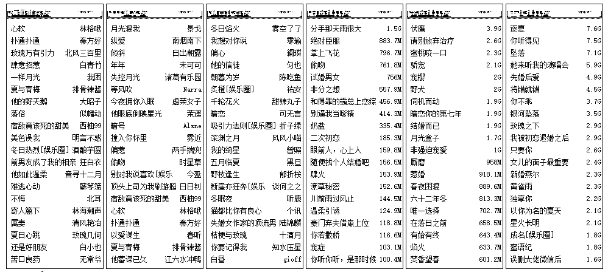

#### 与文章情节有关

关键词最好能够明示、暗含文章核心剧情，如“分手” “千金”，或者包含文中某个重要的道具，比如“信封” “房本” “首饰” 等。

举个例子，今年高考后许多爽文喜欢用重生回到高中的套路：

比如重生后考了高分就叫 “重生高分” “重生状元” “重生第一” 等；

重生后打脸看不起自己的人就可以叫 “重生打脸” “重生反杀” “重生翻盘” 等；

重生后的狗血感情戏可以叫 “重生情缘” “重生前任” “重生复合” 等；

再进一步，还可以用三个字的词组概括文中剧情，拿穿越举例子：

穿越后和渣男分手的，可以叫 “穿越要分手” “穿越不和好” “穿越没缘分” 等；

穿越后经商炒股赚大钱的爽文，可以叫 “穿越当土豪” “穿越不差钱” “穿越当股神” 等；

穿越后脱离原生家庭悲剧的，可以叫 “穿越不回家” “穿越要脱身” “穿越不领情” 等。

以上关键词是我随便乱想的，如有雷同纯属巧合。

中华文化的博大精深不是盖的，关键词的组合千变万化，多组词多看别人关键词找灵感。还可以确定一个前缀(如高中、重生、眼泪)或后缀，专心为它找搭配，减少了组词时间还能做到关键词/标题整齐划一。

#### 避免出现人名、地名、职务等敏感词

有些名称、代号、隐喻是绝对不能碰的底线。

* * *

## 二、剪辑制作

小说推文的剪辑操作并不难，甚至可以简化到“打开剪映-拖入素材-处理素材-智能字幕-导出视频”，熟练后用于剪辑的时间不超过15分钟；第一次剪辑后可复制草稿形成统一模板，后续直接打开在第一条视频的基础上进行删改。

### 文本配音

一篇文章分三集或者一集都可以，但更推荐一篇一集的长视频(8-15分钟)。剪辑操作比较简单，剪三集或者剪一集都是相同重复步骤，就操作时间来说没有太大区别。其次每天发三篇不同文章出爆款的概率会更大，因为一篇文章分三集后如果第一集没有上热门，其他两集上热门概率同样不大(除非改文功力非常深厚，改到三集近乎是独立的故事)；而发三篇不同文章相当于多了两种全新的可能性。最后，长视频也能使观众更加深入剧情，看后续的意愿也会更加强烈。

#### 直接配音

音频少停顿无停顿。以微配音小程序为例，改好一篇文章后，将所有的标点符号替换为逗号，规避小程序识别句号、问号、感叹号等标点造成的长停顿。

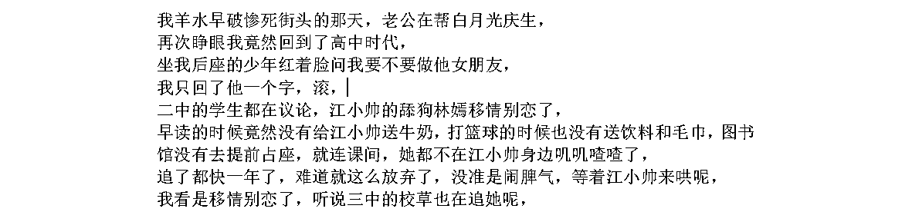

同时要注意文本中的多音字，如果屡次出现一定要用“读音纠正”功能正确配音，偶尔一个问题不大，但听多了一样会影响观感。

在初步配音完成后，可以在文本中手动添加0秒的停顿，抵消配音音频的短停顿，而后在缩短静音选项中缩短大于150~200ms的静音部分，批量处理音频文件生成后的较长停顿。

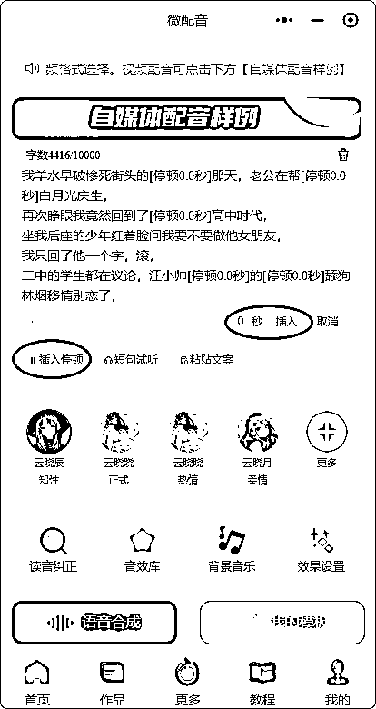

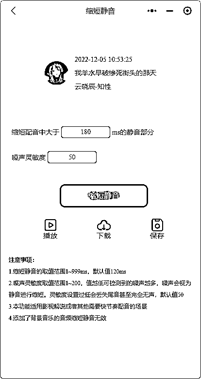

至少要做到前20-30s内无明显、突兀的停顿，这直接关系到5s完播率和对视频的第一印象。换位思考一下，视频的音频磕磕绊绊，多音字发音错得离谱，甚至语调都忽上忽下的，你会给它点赞收藏吗？

#### 拼接配音

也有方法可以做到全文无停顿，在微配音中的更多-拼接配音，每一段音频配350~450个字，一边配音一边插入停顿，确保每一段音频无停顿、无错字。

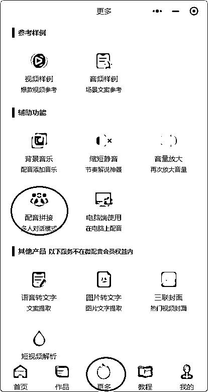

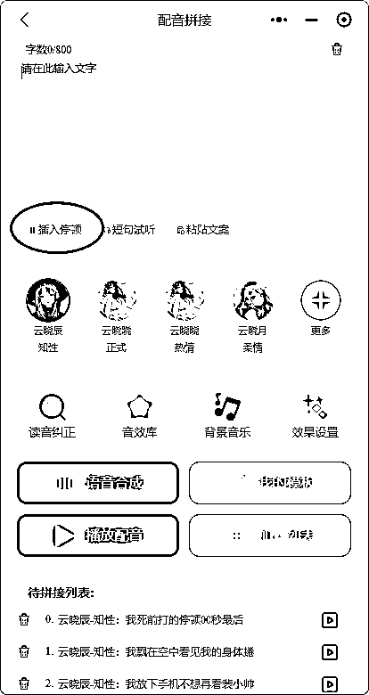

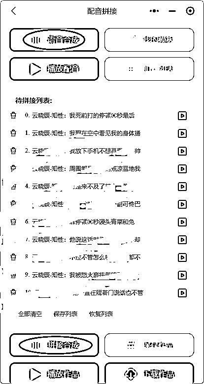

但这样做的缺点也很明显——耗时极其严重。每一段音频至少要听两遍，还要一边听一边修改，对拥有多个配音账号的玩家来说十分不友好，显著降低了剪辑效率。

此外，使用拼接配音的时候，可以根据说话人不同选择不同音色配音，从而区分讲话人、做到差异化，但多人配音更加麻烦，需要考虑旁白、声音1、声音2等多个不同配音员，非常不建议使用。

#### 音色选择

声音影响第一印象。推文声音可以冷门但不能邪门，知乎小说大多为女性第一人称视角讲述，选择一个温和的、说普通话的女声完全足够了，不需要特别选什么播音腔、夹子音等。

我们不是做asmr，只是娓娓道来讲述一个吸引人的故事就足够了，其次我们喜欢听什么不重要，粤语、东北话还是河南话都不重要，让观众听起来正常最重要！正常最重要！

如果文章的5s完播率不大好，可以调整语调，或者更换配音员。

目前用的最广泛的音色是微配音-云晓辰(知性女声)，语速11.2，语调8/15，音量15。

如果要正儿八经给小说配音，音色需要与文中角色的性格、年龄相符；语速要根据文中动作场面快慢确定；语调要根据文中剧情调整，愤怒、悲伤都要用不同语调处理...但我们只是推文的，每个账号选定一种声音完全足够了。

### 背景素材

背景素材影响视频的重复率，不仅针对平台，更是针对观众。去重到位可以过平台这一关，但如果观众刷了十几条视频全是点心甜点，怎么也会有些审美疲劳了。

目前主流的背景素材有这几种：点心甜点、街头小吃、沉浸解压、手工制作、猎奇搞怪、手游录屏，其中个人观感最好的是手游录屏和街头小吃。

先说手游录屏，最火的手游录屏是跑酷游戏，包括但不限于神庙逃亡、地铁跑酷、蜡笔小新跑酷等手游，如下面几张图：

字幕居中靠上，标题/关键词摆上边，一般字幕会置于游戏人物模型上方，看字幕能够引导观众的视线聚焦在游戏内跑道前方，不自觉关注游戏人物的操作。

#### 游戏录屏素材好用的原因

再说街头小吃素材，包括但不限于炒酸奶、砍椰子、做蛋糕等，如下图所示：

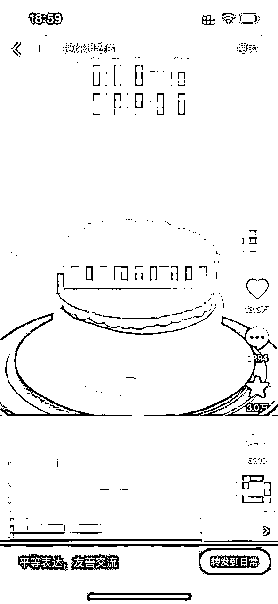

#### 美食素材与早期对比的差异

最后提一下手工素材，通过创造或破坏的方式达到解压效果，如下图一是化妆品修复，图二是刨木头ASMR，图三是制作微缩模型。手工素材的特点在于精致、冷门、解压。

#### 优质素材的特点总结

再比如美食甜点，抖音甜品博主的素材能被不同推文号翻来覆去用几十遍，因为从抖音上扒视频太简单了，但如果换成Youtube上的视频呢？科学上网就能拦住很多人，批量下载油管视频又能够淘汰一部分人。

目前素材的最佳来源还是上油管自己扒。不要买素材，流传的素材库已经不知道被卖了多少遍了。

### 背景音乐

#### 背景音乐的类型

根据视频/文章内容选择合适的背景音乐类型，比如甜文适合歌颂甜蜜爱情的音乐；虐文适合能把人唱哭的、歌颂悲欢离合的歌曲，比如《多远都要在一起》《喜帖街》等。

反过来说，如果小说内容虐得不要不要的，主角死的死残的残，背景音乐却在放《好运来》《今天是个好日子》，谁能看得下去？不会有太强代入感，笑一笑就划走了。

#### 背景音乐的节奏

背景音乐的节奏最好匹配文章节奏。比如剧情紧凑对话密集的文章可以使用节奏轻快的音乐；而古代言情类小说的节奏通常比较慢，就很适合采用A-Lin的《天若有情》。

其实只要不为了整活，BGM都不会出现大问题。能够在抖音传唱的歌，是被广大群众、被市场认可的歌，如果连这些音乐都不行，那还能听什么歌呢？

#### 背景音乐的版权

为了避免版权纠纷，BGM的来源最好是抖音上现有的音乐切片，收藏原声后，在剪映内使用抖音账号登录，可以直接看到抖音上收藏的音频。

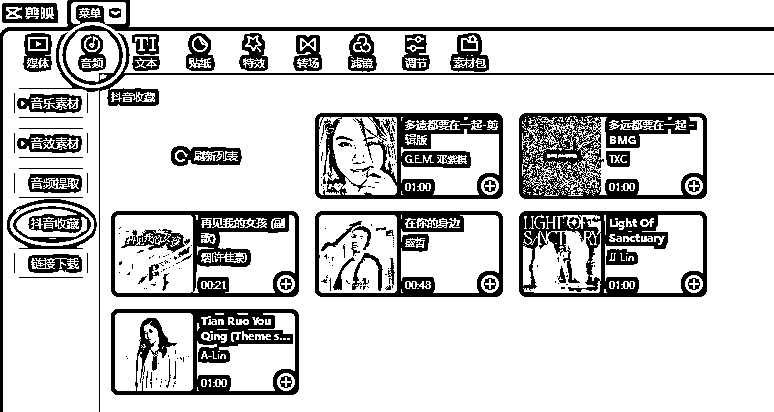

虐文就该用伤感一些的歌曲，比如A-Lin的《天若有情》，邓紫棋的《多远都要在一起》等，爽文可以用一些轻松欢快的bgm，悬疑文就要用偏阴间一些的音乐，既有代入感又能引发吐槽。

图省事可以统一使用林俊杰-《裹着心的光》，音量-10。

### 智能字幕

#### 字幕样式

字幕样式包括字体、颜色、描边、大小等。不要搞花里胡哨的样式和字体，比如什么草书、行楷，比如什么艺术字、阴影，越想搞特色和差异越容易适得其反。

显眼、清晰就可以了。黑字白边和黄字黑边是最常见的两种字体，足够在背景素材中突出，字体用喵魂体或者新青年体足够，字体样式朴素简单有利于观众观看、理解视频内容。

其实剪映预设的前3种字体就挺好用的

#### 字幕位置

把位置单独拎出来讲，是因为字幕位置需要结合背景素材综合考虑。比如在使用跑酷素材中，字幕一般被放在靠上方的位置，一是因为该位置不会遮挡住游戏角色；二是这个位置可以引导观众视线落在游戏内的跑道上，从而导致沉迷。

换个例子，使用画画素材的时候，字幕最好放在画面下方，因为放在正中央会遮挡很大一部分作画内容，非常影响观感。总结一下，字幕的位置选择需要根据视频内容和观众观看习惯综合考虑。

#### 内容是否违规

由于各种各样你懂的原因，匹配好字幕后，我们一定要对字幕的内容进行处理，删除敏感内容或者用同音字和emoji代替。

具体要求根据官方的规范表达沟通手册来，也可以在一些网站上免费检测内容是否涉嫌违规；善用字幕的查找替换功能，一次性修改所有相同敏感词。

字幕匹配完成后，拉动进度条，将字幕对齐开头和结尾画面，拖动进度条检查一遍，尽量做到字幕紧挨连贯，没有明显空档。

剪辑制作的基本要求是：配音顺滑不停顿、素材精美不重复、字幕连贯无空档、内容正面不违规。其次是“追新”，文章要新素材也要新，新奇的玩意儿和新鲜的故事在娱乐平台一定有市场。

* * *

## 三、发布策略

### 发布前

#### 提前上线活跃

抖音并不只是发布视频的工具，发布每一条视频前的5~15分钟就该上线了，开始刷一刷同行视频，给视频点点赞，在同行评论区留言，关注一下同行的引导方式和评论区优质发言。

看一眼热点宝，在热点宝-视频页面搜索推文，尤其关注一下近三天有哪些爆款文章，思考该文章能否进入自己的选文库；点开看看评论区，学习借鉴一下互动率高的热门评论，便于以后自己造互动。

#### 维护评论区

##### 回复评论，增加互动

好数据需要良好的评论区互动支持，及时点赞、回复观众评论，让观众感受到博主的关心和支持；讨论剧情的说两句，吐槽文章角色的表个态，只发表情的咱也回个表情。

对于 “室友临死前想看下一集” 等类似的评论，回复一定要灵性，甚至可以多说两句拉扯一下，比如“让生产队的驴休息一会儿” “让你室友撑一会儿，实在不行我烧给他” 等，就像朋友聊天打趣一样，不要回复个“马上” “尽快” “好的” 就完事了。

##### 主动发起话题，挑起热度

在评论区提出一些有趣的话题，可以是文章相关或者无关的，鼓励观众发表自己的意见看法，带动观众的情绪，增加评论区活跃度。

比如吐槽文中某个角色“真下头，就该xxx，早该xxx” 或者抛出一些离谱的事情吸引观众，如 “邻居家老婆快生了，我姓王，能帮起个名吗” 等，甚至可以适当拱火增加热度。

发个“你们卡不卡”都可以。

##### 清理评论区

清理掉不合适的评论，包括辱骂、广告等违规评论，以免不必要的违规限流。尤其是那些和视频内容无关的引战吵架，互骂几十条评论的情况都有，直接给它删除，酌情拉黑。

还有部分推文博主会开小号来截流，在“在哪看” “叫什么” 等评论下回复他们的关键词，先删除他们的评论，然后在消息通知中点开他主页并拉黑，最后在原评论下引导自己的关键词。

### 发布后

#### 看视频、造互动

开大号小号先把自己发布的视频看完，点赞和收藏安排上。用小号在评论区适当留言，如“尊贵的会员先走一步” “看完回来了，是很好看的xx文”等，为后续可能的互动埋下伏笔。

甚至可以稍微剧透一下，给点进评论区的观众留下悬念吸引观看，比如“结局很好” “这渣男的下场很爽” 等，适当性挑动一下观众对后续剧情的好奇心。

#### 及时引导

##### 主动评论引导

播放量过5k就可以主动引导了，等有一条视频过15w播放量后就可以置顶引导了。不要因为没人问出处就不引导了，评论区空空荡荡是一种病。

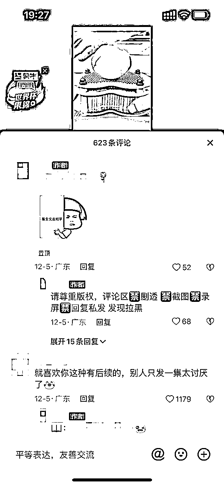

有观众看完了觉得文章不错，但发现没人评论，可能他最多点个赞就划掉了，直接流失一个潜在付费用户；除非文章足够对胃口，他会主动开 “金口” 询问后续。

如果我们开一两个小号在评论区互动一下，再加上置顶一个关键词引导，他就很有可能点开评论区瞄一眼，看看有没有读完和他有同感的评论，之后看到我们发的引导去看后续了。

##### 热门互动下引导

关注评论区，总有些评论能够吸引其他人互动，而且观众点开评论区也更倾向查看这些评论和下面的回复，当然要利用好这种“凑热闹”的心理，在热门评论下面发送关键词+表情包引导，还可以开小号当路人，发送引导词。

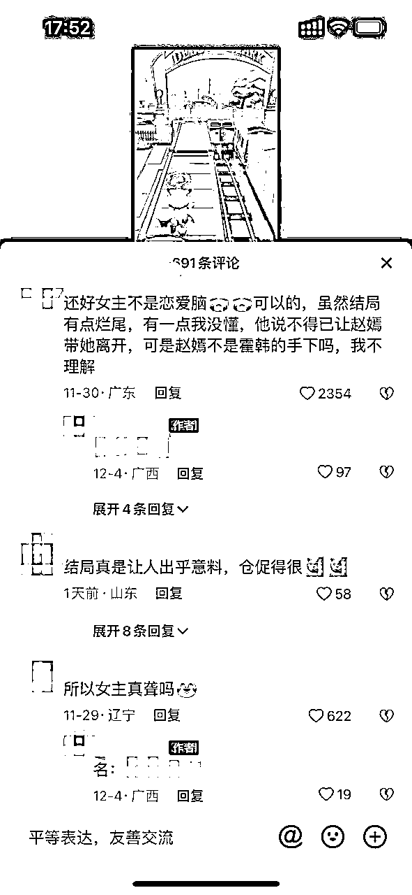

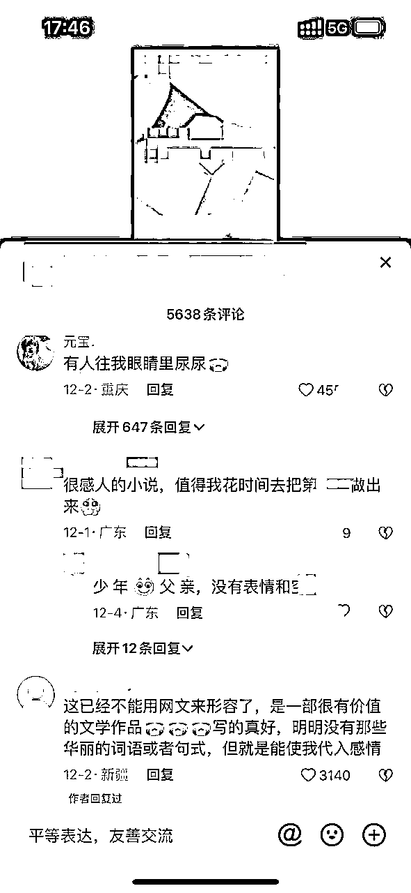

##### 私信引导

如果有观众一直反馈找不到，可以考虑私信引导，但要注意对面是不是来钓鱼的同行，私信引导很容易被举报限流，去他人主页看一看是不是正常的抖音号再决定是否私信引导。

以上三大点就是小说推文的核心操作了，这里讲解一下起新号的流程。

最多投放3次抖加，后续新发视频能够轻松突破二、三次曝光(3k-1w播放量)就算起号成功。但如果起号一个月后还没能突破15w播放量，可以考虑换号重练了，继续闷头发视频不断改进也可以，但正反馈来的会比较慢，容易影响心态。

* * *

## 四、日常维护

### 每日养号

#### 坚持日更

首先，日更能让账号内容保持新鲜和丰富，粉丝也会有更多机会刷到我们的视频，既能够维护粉丝忠诚度还能吸引更多潜在粉丝关注，也能不断提高账号权重。

日更还是一种态度，意味着我们对项目有着高度的认真和投入，愿意每天付出时间和精力去满足观众的需求和自我需求。不要一时半会没出成绩就溜了 ，把前期付出变成经验而不是沉没成本。

#### 活跃账号

抖音不只是发布视频的工具，是一个记录、分享的平台，就算不怎么喜欢刷短视频，也每天时不时打开划一划，进个直播间挂机、偶尔点点赞都行。我们不是机器人，但如果每天只是上线发个视频就下，抖音就不这么认为了。

最好每天能够保证一个半到两个小时的活跃时间，刷到同行视频停下来看一看，人家选的什么文？有没有改开头？评论区引导怎么做的？还可以点个赞再收藏一下，这个活跃时间不久来了么。

“抖音让每一个人看见并连接更大的世界,鼓励表达、沟通和记录，激发创造，丰富人们的精神世界，让现实生活更美好”

### 每日复盘

#### 内容分析

回顾每日发布的内容，根据完播率、播放量、评论量等数据，分析哪些文章更受欢迎，哪些文章不太符合账号定位和粉丝口味，在后续发文的过程中进行调整。

上文中选文改文部分有提到，可以制作一张表格记录选文的多项数据，如文章特色(分手虐渣、重男轻女等)、文章核心剧情(妹妹抢了我男友等)、发布一段时间后的完播率，结合内容分析一起使用。

#### 粉丝分析

每天进数据中心看一看粉丝画像，尤其是粉丝男女占比和年龄分布。可以适当移除一些不符合账号定位的粉丝，比如大龄男粉。

根据不同视频的涨粉效果、粉丝画像反馈选文改文过程，优化选文改文和坚持发视频涨粉是一个动态的、相互影响的过程；说实话，多玩废几个号就知道怎么发文、发哪些文了。

#### 策略分析

记录并回顾每天的发布时间、话题标签、引导方式等，这些是实操的细枝末节，但每个推文号都应该有比较固定的一套流程。

比如视频发布时附带哪几个标签？“小说” “小说推荐” “女生必看” 等，改变标签的排列组合，最终测试得出最适合账号的标签组合。

再比如推文视频的发布时间，早中晚各发一集？下午晚上两集？晚上到凌晨更新？每个时间段的活跃人群、系统推流快慢都不一样，不同文章的受众也不一样，需要通过记录和对比不断优化。

### 保持良好心态

#### 明确定位，放低预期。

期望过高很容易招来焦虑和压力，放低预期能帮我们集中精力稳步推进。此外预期过高很容易导致不健康竞争，不仅分散注意力还会更难取得成绩，形成恶性循环。明确自己的地位，按照教程步骤一步步来，少看同行报喜，你的对手只有自己。

比如我，之前没有做抖音短视频的相关经验，也没有规模化运营的能力，那就跟着教程培训埋头苦干，坚持发视频，遇到问题就问，先跑通后优化各个流程。

#### 不断试错，积攒经验。

我的第一个号直到一个月才堪堪出单，一个半月才有一篇爆款，不少同期小伙伴都重新起号出爆款了，我还在坚持日更3条视频，同时不断学习和琢磨如何优化选文、如何修改开头、编辑标题(现在不起标题了)，从40完播率一路干到 65~70。

不会找文选文就抄同行的，跟踪对标号挨个照着发；改文不熟练就去刷同行的视频听写下来再分析，想想别人为什么这么改，整理多种改文模板并套用到自己选的文上。

没有互动就去同行那儿抄热评，去刷其他视频收集，多开几个小号在评论区给自己造势，这样一套下来终于在第73天爆了第一篇文章。不是有希望才坚持，而是坚持才有希望。

#### 积极分享，持续学习。

玩法是会变的，有新模式、新素材、新文章等等就要赶紧跟上，项目本身也需要不断迭代来保持活力；遇到问题直接提问，有了新点子及时分享，很可能别人已经遇到过并解决了类似问题、思考过类似方向并且有了经验，多交流的效率比闭门造车高得多。

最早没几个人想到用游戏录屏当素材，也没啥人发长视频，都是一篇文章分三集，可平台算法会更新、观众的口味也会变，进入这个赛道的同行也越来越多，需要我们保持步伐跟上节奏，不断测试、分享和测试新玩法新操作，灵感需要不断碰撞才能达到最大的可能性。

# 写在最后

感谢看到最后，如果你对知乎推文感兴趣，我可以提供关键词的授权渠道和基础教程，帮你跑通推文项目的全流程。但看文章和上手操作是两码事，实操中遇到的问题一定比文章中提到的更多。一定要评估自己有没有时间精力投入到推文项目中，如果没有，尽可能减少沉没成本。

我是今年加入生财的小白，一开始完全不知道自己能做什么该做什么，就瞎逛瞎看。看到亦仁大大说从实操干起，正好年中张哥说有个知乎和抖音的项目，我就直接开始抱大腿。再次感谢张哥，同一期的人都出单爆文了我还在40左右的完播率折腾，张哥一直鼓励我让我坚持不放弃，每次有问题都会认真解答；还要感谢芷蓝姐，她分享的写作技巧对我的帮助很大，我从一开始的不敢分享、不知道分享什么到现在的敢分享，并朝着善于分享努力；同时要感谢林蔷七，是七姐领我走进了互联网的大门；最后要感谢生财和亦仁，这是一个谈钱不伤感情的地方，是一个分享利他的地方，是一个谈钱增进感情的地方，现在我也开始分享、试着利他，希望能和圈友们一起持续精进，一起生财有术。

感谢你的阅读，任何与小说推文相关的问题都可以在评论区或者私信和我交流，希望这篇关于推文项目精细化运营的文章能够对你有所启发，甚至帮你拓展一个新的生财渠道，让我们一起生财有术！