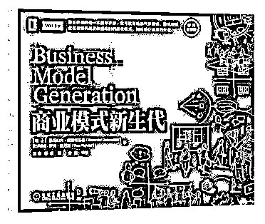
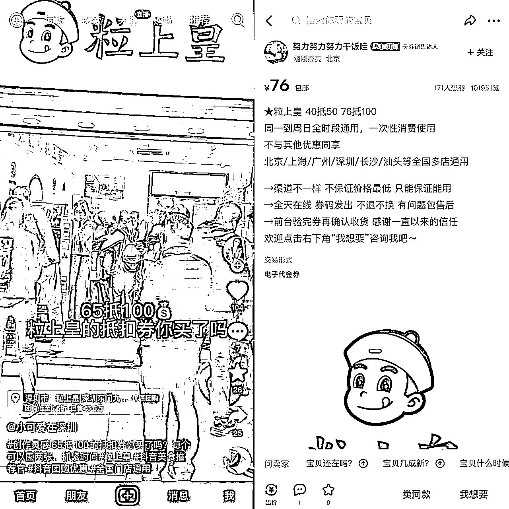
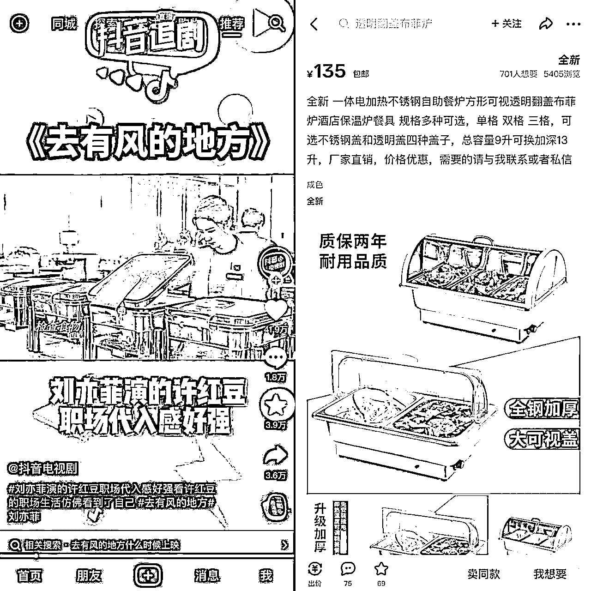

# 230110 龙哥赚钱周报

> 原文：[`www.yuque.com/for_lazy/money/che1vuddgxepuu96`](https://www.yuque.com/for_lazy/money/che1vuddgxepuu96)

# 龙哥赚钱周报 

整理日期：2023 年 1 月 10 号 

赚钱周报来自某年费 3000 多的付费社群资源帖。 

龙哥风向标系列单独用在线文档分享，地址见专属群 q 群消息。 

一些帖子跳转飞书查阅，如需破解复制权限，见这篇文章： 

[解除复制限制！](https://mp.weixin.qq.com/s?__biz=MzI1NjAxOTI0Ng==&mid=2647895304&idx=1&sn=df7e3e36c3bf503a2513f8b4c6636d3d&chksm=f20a1349c57d9a5fccaa92c5068cb3e492ba9e3ebb178584d018892c0211214dc9d112c1f73c&token=37691864&lang=zh_CN#rd) 

往期的赚钱周报合集（含在线版和离线版），见专属群 Q 群文件和群公告。 

希望大家有收获~ 

 

标题加了(精华)的表示精华贴，前面为截至今日的点赞数。 

以下是目录，内容有些多。大家可以挑兴趣的内容阅读。 

# 【目录】 

在线版目录见大纲即可~ 

# 【生财认知】 

## （106 赞）《卓越策略师的五大能力》 

下面内容是我们公司的一个实习生小江，听完案例评选后的一些思考，分享给大家。 

小江原来在飞书团队实习，是传媒大学广告专业大四的学生。 

以下为小江写的全文: 

今天听完公司几位前辈的最佳提案汇报，大为惊叹，深深感受到一个合格的乃至卓越的策略师应该具备的素养和品质是如此综合： 

1.  扎实的调研能力 不管是什么项目，不管你是多少年经验的营销从业者，在面对陌生的行业和客户时，都要下苦工去做充分的调研。 

策略师不是一个白领，而是一个蓝领。“对调研的压倒性投入，就是对客户的负责”。而每一次调研的背后，可能是十几个竞品分析，十几万字的消费者、店长和经销商访谈，不计其数的行业报告等等。 

于是，调研能力的背后是： 

是能深入一线的能力，敢下苦功并与各种各样不同类型的人打交道； 

是搜索能力，从茫茫的信息大海中锁定需要的信息和内容； 

是信息处理能力，加工铺面而来的信息，抽丝剥茧，并清楚的逻辑归纳推理； 

是快速学习能力，对每一个陌生的领域都可以展开充分完整的学习，快速成为甚至比客户还要了解这个行业的专家…… 

2.  清晰逻辑的归纳总结能力 

不同于广告的“头脑风暴”，策略师更加将就基于事实的归纳。 

一句名言非常贴切：“搜尽奇峰打草稿”，这个典故是画家在画山峰时广泛收集各种不同的山峰，并不断练习打草稿。懂得搜奇峰是懂得妙理，多打草图是能用苦功。而想要“获取秒理”，广泛调研之后还要进行大量深入的思考和分析。 

小马宋给很多客户的提案策略，都是在与店长和大量的消费者等多方主题的交流中、以及深入货架和展柜之间观察与归纳总结得来的。比起一堆人坐在办公室里“头脑风暴”，不如深入一线，去针对现象进行总结归纳。 

而同样的信息让不同的人推理会产生不同的方向和结果，这往往也是到达最终策略前最重要也最难的一步，归纳总结、强大的逻辑思考能力显得尤为重要。 

3.  把控全局的项目管理能力 

每一个项目都有着严格的提案时间，什么时候做访谈、什么时候要根据策略推动设计，这些都需要清楚的规划和时间意识。 

同时，项目中涉及多方不同角度的利益主体，有企业高管、地区经销商、门店/淘宝店长、消费者等等，要与不同人打交道，必要时还要管理好客户的预期，不过度承诺，并能与客户建立稳固的信任。 

另外也是营销咨询非常有差异的一点，要能让方案真正落地，这就要求策略师不能只出方案、只写文案，还要让每一个策略细节都落地，所以策略师设计方案时就要考虑设计的难度和成本；要能够清楚地向设计师传递需求并推动交付物产出；要说服客户并全程跟踪，让方案的每一个物料到执行到实处…… 

于是，这不仅仅是一个策略师，还是一个项目管理者，是对最终的交付物负责的全局把控人。 

4.  让人难以怀疑的决断力 

营销咨询和一些广告公司在决定公司品牌符号、话语体系和产品结构层面有很大话语权的差异，甚至许多广告公司完全不会接触这三件事情。如果说广告公司是乙方，那营销咨询更多地充当的是企业外脑的角色。 

策略师能够成为让客户可以依赖的人，而不只是简单的需求执行方。这背后，是以策略师对于行业、实操案例和企业经营本质的深刻经验作为基础，并融合策略师本人的果断自信、清楚逻辑、良好表达和领导力等等的综合集成。 

5.  面向内外部的双重叙事能力 

由于策略师特殊的身份，提案和汇报时会同时兼具面向客户和消费者的两种视角。 

对消费者，要用消费者能听懂的方式，讲清楚他们关心的，并设计面向消费者的一系列品牌触点，要懂文案、懂设计、懂内容等等，要知道如何像消费者讲故事。 

对客户，要能够清楚地告知对方该方案的价值感，明确策略的有效性。在让客户信服的过程中，设计提案 PPT 的结构设计，运用重复和对比等修辞方法；搭建强感知的提案环境，设计提案现场物料、空间和互动环节，让客户更加直接地感受到提案的具体意图和巧思。并在方案的不断地引入和确定感的传递中，告诉对方：“你一定要用这套方案！” 

故事叙事的核心有修辞学的功力、有情绪感染的能力，还有决断力体现出的让人信服的安心感。 

## （157 赞）《对想要入局 web3 的新人小伙伴的一些建议》 

大家好，我是可乐，一枚 80 后老韭菜，随着越来越多的小伙伴布局 web3，在此分享一些小建议，希望对新人朋友们有一点帮助。 

所谓 web3，也就是大家耳熟能详的元宇宙、defi、gamefi、nft 等等等等的统称。 

1.现在的 web3 还非常早期，对普通人非常友好。 

2.入局 web3 之后，不要丢掉场外赚钱的能力。 

3.要对这个行业充满敬畏，机遇和风险并存。 

4.敢于去尝试，用小成本试错。 

5.这个市场有各种各样的机会，别害怕错过。 

6.即使资质很平庸，什么都不会，也能在这个行业赚到大周期的钱。 

7.不要上头，不要上杠杆，不要玩合约。 

8.保护好你的资产，熟练使用硬件钱包。 

9.备份好私钥和助记词，尽量手抄，私钥助记词不要截图。 

10.注重钱包安全，不要随意授权。 

11.永远不要梭哈。 

12.动手去做，动手去做，动手去做，真正的 web3 需要你自己进去看看。 

13.去买一个 NFT 或者做一次交互，从建立钱包开始跑通完整的流程。 

14.不要瞧不起撸毛和撸白，该撸就撸，有时候利润很高。 

15.别对你持有的 nft 小图片抱有感情，极少数除外。 

16.一个好机会重仓的收益，远远大于许多个平庸机会轻仓的收益。 

17.会卖比会买更重要，设立好自己的预期收益，达到止盈线狠心出货。 

18.人声鼎沸的时候一定要跑。 

19.时刻牢记 20 字箴言，见好就收，有利必跑，狠心出货，切勿幻想，变现为王。 

20.某些你认为很困难的问题，在别人那边可能是小问题，多沟通多链接，沟通产生价值和解决方法。 

21.如果有条件，找个朋友带你，会比你自己去摸索效率更高。 

22.千万不要赌，时刻牢记入圈的目的是为了让生活变得更美好。 

23.一定一定要去看一次九神写的《囤比特币》这本书，我看的时候，几度热泪盈眶。 

PS: 你顺手帮我点个赞，可以找我给你发一份《囤比特币》的电子版哈。 

也希望各位大佬能一起补充对新人小伙伴的建议，非常感谢。 

希望这次分享对你有帮助，感谢生财有术，感谢大家。 

# 【生财技能】 

## （114 赞）《商业模式画布，可以从道术器用四个角度讲清楚所有项目》 

1、道的层面： 一句话阐述商业模式：我用一个 XX 产品/服务，解决了 XX 客户的 XX 痛点，赚 XX 钱。 

2、术的层面： ①解决谁的问题，一个企业（产品）想要接触和服务的不同人群或组织； ②解决什么问题，为客户创造价值的系列产品和服务； ③怎么让用户找到，如何接触和沟通客户来传递其价值主张； ④怎么和用户打交道，公司与特定客户群体建立的关系类型； ⑤我是谁，我有什么，商业模式有效运转所必需的最重要因素； ⑥谁能帮我，商业模式有效运作所需的供应商与合作伙伴的网络； ⑦我要做什么，确保其商业模式可行企业必须做的最重要的事情； ⑧我要付出什么，运营商业模式所引发的所有成本； ⑨我能得到什么，从客户群体中获得的收入； 

3、器的层面：承载上述 9 个板块的有没有更便捷的工具； 

4、用的层面：执行力、业务流的迭代； 为了确定这个工具，是否适合生财，花了 6 个小时，看完了《生财有术项目精选》的所有项目，并且将所有项目的商业模式画布都画出来，有需要的自行下载，并且留了作业。 

如果，大家都懂商业模式画布的行文逻辑； 如果，大家分享闭环项目的时候，都用商业模式画布； 那么，不管整体的阅读时间、理解深度以及深度思考下项目是否适合自己，时间都会大大缩短。并且，以后大家都有可能自己出来做项目、创业开公司、考察了解合作公司，商业模式画布，是我用的众多商业工具里面，用得最多的一个，也是帮我赚钱赚最多的一个。 商业模式画布，适合项目篇哈，不适合技能篇。 

懒人备注： 

两份 ppt 小懒已下载： 

商业模式画布-模板 .pptx： 

[https://lazymans.lanzoub.com/ipWUA0kmoc3c](https://lazymans.lanzoub.com/ipWUA0kmoc3c) 

商业模式画布-含生财有术精选项目拆解.pptx： 

[https://lazymans.lanzoub.com/iaENK0kmocyd](https://lazymans.lanzoub.com/iaENK0kmocyd) 

 

 

 

 

 

 

## （46 赞）《普通人可复制的云监工玩法，挑战 3 天读 50 篇生财小报童项目精选+写 5000 多字心得》 

你好呀，我是营销出身，从业 10000+小时的运营，在百度阿里蓝标等公司工作，朋友都叫我丽丽。目前在做私域，从 0 到年入百万级。希望我复盘的这个云监工快闪群玩法能：帮助更多圈友高效地跑 MVP；让群变得更好玩等。 

飞书链接： 

[https://q0hc3k7yqz.feishu.cn/docx/ELHqdhiI5oSQAxxItLJctNAhnah](https://q0hc3k7yqz.feishu.cn/docx/ELHqdhiI5oSQAxxItLJctNAhnah) 

## （30 赞）《闲鱼蓝海不会选？借助抖音平台轻松发散思维》 

大家好，我是饼饼。上一次给大家分享了借助小红平台来选品。这一次给大家带来姐妹篇，跟大家分享另外一个第三方平台也非常好用，那就是抖音。这个平常用来刷短视频娱乐的平台，用来帮助我们发散思维选品相当合适。 

视频的好处在于我们所看到的场景和产品非常的直观，如果你细心留意，半个小时挖出十几个蓝海产品完全是没有问题的，下面我直接用我刷到的一些视频来给大家举例。 

1、电子代金券搬运闲鱼 

 

像我刷到的这个粒上皇的代金券，我在闲鱼一搜索，就有商家直接加利润在卖。这就是妥妥的一个信息差~ 虽然这种利润不大，但品牌代金券流量大，虚拟产品还不需要发货。不受快递影响，春节放假依旧可以做，大家搭配着去销售是很不错的选择。大家可以主动去闲鱼搜索一下，有非常做这种代金券的账号可以参考。 

2、热门影视剧里找产品 

抖音还有非常多的追剧账号，经常会更新热门的电视剧电影。虽然我们作为搞钱人是不怎么煲剧的，但一样可以从一个小片段里找到一些可以借鉴的产品，突破选品的固定思维。 

比如我刷到最近大火的刘亦菲的新剧：去有风的地方。其中这个片段是在一个自助餐厅的场景，神仙姐姐正在检查食品。我就留意到有一大排的保温食品的餐炉，立马就去闲鱼搜索了一下，果然是有需求的。下图是给大家随便截图的例子，大家可以根据关键字自行搜索销量更好的款式进行参考。 

不仅是保温餐炉，餐厅用的商用消毒柜，桌椅，灯具，装饰等等都是可以进一步的挖掘的。 

 

3、特定场景视频选品法（特别好用系列！） 

我每次都很喜欢刷到这样特定场景的视频，因为一个场景可以衍生出不少的产品出来。比如我刷到了这个洗剪吹理发店的广告视频。画面里就有非常多的产品可以直接拿来搜索。 

像映入眼帘的洗头床就是一个现成的品了，还有后面放洗发水的置物架。如果你结合上一篇小红书的搜索方法一起使用，还会挖出理发店用的镜子，放工具的推车，可升降的椅子等等一系列相关联产品。这些都是会触发批发单的产品，值得大家去上架测一测。 

 

4、技能类视频找灵感 

抖音这种技能类的视频也非常多，而且因为创作者经常会实跟热点创作，所以也是可以为我们所用的。像我刷到的这个画兔年灯笼的视频，我就想到春节的相关产品最近在闲鱼肯定也是需求很高，一搜索果然如此。不仅是灯笼，各种挂件装饰都是可以去尝试的，这种节日产品集中吃一波流量是完全没问题的。 

 

好了，今天就给大家举例到这里，再刷下去我怕是会上瘾哈哈哈~大家可以举一反三，抖音的推送也是千人千面的，每个人都可以根据自己刷到的视频都发散思维，更高效的选品。 

## 《自动化工具，记录搭建信息自动化推送到微信过程》 

前几天，我对象说如果有个工具，能把推特的账号发送的内容在很短的时间之内推到微信就好了，这样就能掌握很多 web3 圈内大佬的消息，跟着他们的步伐做项目了。 

有需求，就能满足。 

接着我开始百度找工具，因为推特是国外的平台，国内的很多软件都不能用，最终我找到了个 IFTTT 这个平台，这个平台就是自动化的，也不需要自己写代码，编辑上一些参数就行了。 

这个平台有两个推送方式： 

1、推特用户更新内容后，以邮件方式将推特内容推送到指定邮箱 

2、推特用户更新内容后，通过企业微信群的机器人将内容推送到企业微信群（钉钉也可以） 

 

这两个方法我都测试了，都是可以的，在这篇文章里我都会写出来。 

详细复盘请移步飞书，点击下方链接查看： 

[https://yq9pu32e9v.feishu.cn/docx/P2XLdJF2yoivV8xUDszcz853nZg](https://yq9pu32e9v.feishu.cn/docx/P2XLdJF2yoivV8xUDszcz853nZg) 

## （52 赞）《财务报表篇：微小中创业如何基础合规财税 V1.0》 

#法财税人，创富兵器库# 财务报表篇：微小中创业如何基础合规财税 V1.0 

大家好，新年新气象，金税四期说来就来，你的创业准备做到哪一步、能否应对风险？与球球姐商量后，我们决定从辅导大家建基础财务报表开始，再配套课程做拆解。 

【腾讯文档】财务报表篇：微小中创业如何基础合规财税 V1.0 20230106： 

[https://docs.qq.com/doc/DSkhaSkdCbFNDb1FI](https://docs.qq.com/doc/DSkhaSkdCbFNDb1FI) 

## （40 赞）《如何写年度总结和制定年度目标？》 

场景一：新年第一天，Louis 在朋友圈郑重写下一行字：“让 2022 年的成绩和失败归零，2023 年一切都会是新的开始，今年我的目标：买一辆车！”按下发送键的那一刻，他仿佛看到一辆全新的宝马已经停放在眼前。 

场景二：新年总结与规划会上，陈副总在台上意气风发：“2022 年，在领导的英明带领和全体同事的奋力拼搏之下，公司实现了 3 亿人民币的销量。2023 年，我们的目标是 4.5 亿人民币！”“齐心协力，共创辉煌！”一时之间，台下掌声雷鸣。 

这两个场景，大家眼熟吗？你是不是也是这样许愿的？你们公司是不是也是这样搞的？ 

很遗憾，从科学的角度，这样目标，这样的总结，这样的规划，其实一毛钱意义都没有。 

接下来，我会从如下几个角度进行详细阐述： 

一、合格的总结，得至少拥有这三个要素。 

二、即使并非销售岗位，也必须量化成绩。 

三、除了总结业绩之外，还必须总结能力。 

四、规划不是愿望清单，也不是待办事项。 

五、科学设定目标，需要遵循这六个原则。 

六、目标牵引，路径拆解以及痛苦的坚持。 

<一> 

总结的目的是什么？ 

我认为就是简单四个字：发现问题。（请注意，在这里“问题”并非是一个贬义词） 

为什么这么说？ 

因为完美是不可能存在的，而问题是无处不在的。 

完不成目标有问题，为什么完不成？ 

完成了目标有问题，为什么没办法超额完成？ 

超额完成了目标也有问题，那是不是我们的目标设置得太低？为什么？ 

总结就是为了帮助我们把一个个的问题揪出来，然后逐个逐个做修正。 

从这个角度出发，一次合格的总结必须带有下方三个因素： 

1、总结与目标的比对。 

2、要事实，不要观点。 

3、能够帮助发现问题。 

关于第一点。 

我们来举一个简单的例子。 

我们曾经举办过一场线下活动，到场了 1200 人，很热闹，大家也很 happy，但是我们能够称之为一次成功的活动吗？ 

不能，要是我们的目标是到场 2000 人呢？要是我们最一开始的目标是满意率呢？要是我们的目标是活动后的转化率呢？ 

判断一项工作是否成功，要看一开始设计的目标是什么，没有目标，总结无从谈起。 

从这个角度出发我们可以发现，在日常的总结汇报中，许多人的做法： 

我今年做了 XXX 的业绩； 

我今年开发了 XX 个客户； 

我今年赚了 XX 钱。 

这些统统都不是合格的总结，因为它没有和目标联系起来，仅仅只是在表达一种行为：“我做了什么”。 

目标就是我们工作的锚点或者标准，没有目标，我们永远都不知道自己做的到底是好还是不好，永远都不知道我们是否正在沿着设定的方向前进。 

这是合格总结的第一个要素。 

关于第二点。 

许多人在做总结的时候，一来就是“我今年做得不好，我深刻检讨”，领导一听，咦这个小伙子态度诚恳，不错不错，于是拍拍对方的肩膀，勉励对方继续努力。 

这个时候问题就来了： 

做得不好到底是哪里不好？有多不好？ 

你所认为的“不好”和我认为的“不好”，是同一个概念吗？ 

所谓“继续努力”，到底是努力到什么程度？加班到晚上 9 点的程度，还是加班到晚上 11 点的程度？ 

反正一切就是靠“意会”，你要是领会不到，那证明你这个人悟性不高。 

古老东方玄之又玄的理念在这个场景简直就是发挥得淋漓尽致。 

但基于角度、立场和层次的差异，不同人对于同样一句话的理解是不一样的。 

譬如 10 摄氏度的气温，对于一个常年生活在 0 摄氏度地方的人来说，会觉得“好温暖”；可对于一个常年生活在 20 摄氏度地方的人来说，会觉得“太冷了”。 

此时，假如双方进行辩论的话，就互相会觉得对方在胡说八道。 

我们一定要知道自己和对方说出口的每一句话，到底哪一句是观点，哪一句是事实。 

我今年业绩做的不好，这句话是观点还是事实？----观点！ 

小张我认为你今年还不够努力，这句话是观点还是事实？----观点！ 

只有中性的，能够用数字和证据支撑的才是事实，例如：我今年完成了 83%的年度业绩目标。 

另外，之所以说事实是中性的，就在于事实只有真假，而没有好坏。 

你只有真的完成了 83%的业绩，或者没有完成 83%的业绩。但要判断这个事实到底是一件好事还是一件坏事，要看你基于哪个作为锚点。 

这就是合格总结的第二点要素：一切用事实说话，没有数据、证据的东西，越少越好。 

关于第三点。 

大家认为，问题是怎么产生的？ 

1、期望和现状的差距，就是问题。不管是期望大于现状，还是现状大于期望。 

譬如我期望今年能够成为一个销售高手，从商机到订单的赢率有 30%，每 10 个商机就有 3 个最终成单；可事实上我的谈单成功率却只有 20%，那么中间这 10%就是我们需要去深挖的问题。 

怎么深挖？ 

第一个方法，叫 5WHY 分析法，意思是每当遇到问题时，都可以连续用 5 个 WHY 来探寻其发生的真实原因。 

举个简单的例子：我今天被老板骂了一顿。 

1WHY：为什么老板骂我？因为我今天迟到了。 

2WHY：为什么我会迟到？因为我起床晚了。 

3WHY：为什么会起床晚？因为天杀的闹钟没响。 

4WHY：为什么闹钟没响？因为它没有电了。 

5WHY：为什么闹钟没电？因为我忘记了换电池。