# 公众号追热点复盘：通过行程码一天涨粉4万+，直接变现6K+

> 来源：[https://vo7uy9lyzl.feishu.cn/docx/AmKRdF2Z9oQjDExxxuAc18a5nbb](https://vo7uy9lyzl.feishu.cn/docx/AmKRdF2Z9oQjDExxxuAc18a5nbb)

大家好，我是火火。昨天行程码下线这个热点让很多小伙伴吸引了一波公众号粉丝，我也不例外。截止到15号中午，我全部删除文章之后，统计的数据如下：

总共用12个公众号批量操作来追这个热点，其中3个公众号发文没有上排名没有流量，不统计数据。

9个公众号总共新增97385个粉丝

取消关注52430个粉丝

净增44955个粉丝

流量主总收入6514元

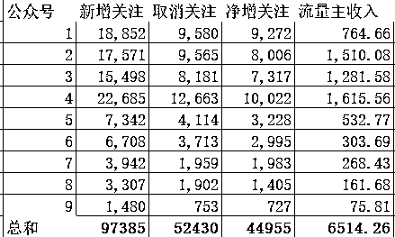

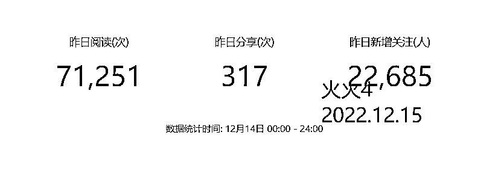

# 一、热点背景：

我最近阅读星球文章比较少，知道行程码热点的时间已经比较晚了，大概是14号早上11点多左右，从朋友圈（论加大佬好友的重要性）以及微信群得知这个热点，并且知道已经有小伙伴做出结果。

我之前追过热点，秋天第一杯奶茶引流了3000多的公众号外卖粉；本身也比较擅长公众号SEO，用SEO知识0元获取过20万左右的公众号粉丝。基于上面的信息以及自身经历，我认为这个热点我可以做；就算这个热点信息我获取的时间晚，但经过我操作的公众号还是能获取到一点点流量。

我吃完中午饭之后，在电脑前噼里啪啦的操作一顿；第一个公众号发布文章的时间是14：47分。那个时候，星球有部分小伙伴已经开始删除文章了，而我才刚刚发布文章。

# 二、如何操作：

我决定要追这个热点之后，把我手头上的公众号挨个登陆，就开始了下面的操作流程。

## 1、找对标账号体验一遍流程

我在微信上搜索行程卡纪念关键词，把排名前面的三个公众号流程都走了一遍，获取到对应的行程卡制作链接地址和话术。

## 2、写一篇符合平台算法的文章

公众号文章内容以及获取行程卡生成链接的流程基本一样，我和大家不同的点是在于细节方面；很多追热点的小伙伴只是复制了我的文案，但是不知道背后的逻辑。附上一篇和我文案完全一样的小伙伴文章，大家参考一下：

追热点文章不是需要文笔写的多好，内容迎合平台算法喜好能被收录就行。我讲一些比较关键的细节，这也是我为啥变现比别人多的原因。

#### 第一点：文章中铺关键词

我们做的是搜索流量，那相关的搜索长尾词、搜索下拉框词语都可以放进来。文章被收录之后，读者搜索相关长尾词会搜到我们这篇文章。为了阅读体验感好一些，我在文章中就把这些关键词的颜色调暗淡一些。

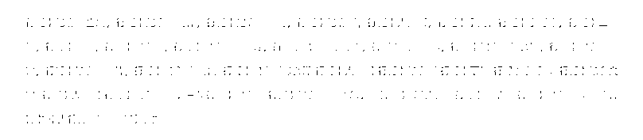

长尾关键词获取方法：

我一般是用到这三种方式来获取长尾关键词，不需要开通会员；基本上获得的长尾关键词也够用了。

1、微信搜一搜下拉词

最直接的就是微信搜索 框下拉词，打开微信搜一搜，输入关键词，会有对应的下拉词弹出；把这些下拉词全部放入文章中。如图所示：

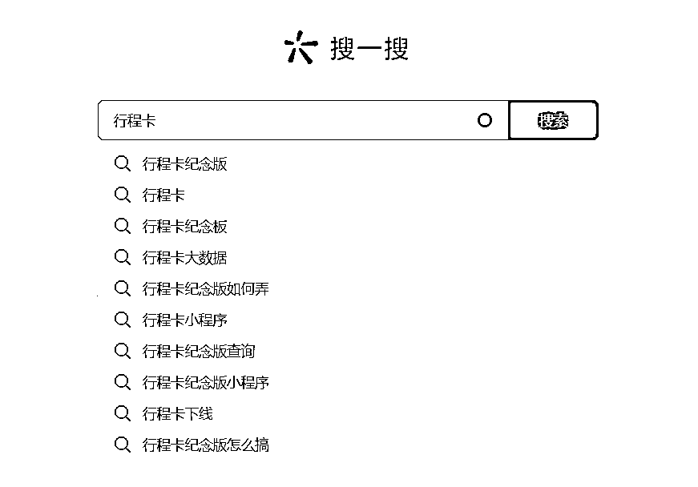

2、微信搜索栏中的相关搜索

这里的相关搜索是根据你搜索的关键词来展示，也是其他用户在搜索时经常用到的词语；是比较精准的关键词和长尾词。

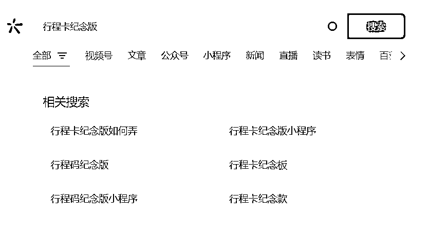

3、5118网站查询长尾词

5118网站有个查询长尾词功能，用这个功能查找相关长尾词。

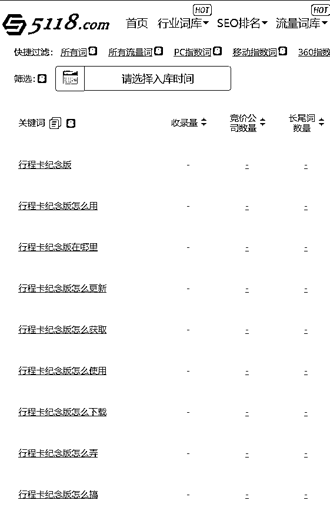

#### 第二点：文章中添加广告

我观察很多追这个热点写的文章，他们绝大部分文章都是三百字左右就说完。整篇文章字数较少导致插不入广告，这就少了一个很好的变现渠道啊。我写追热点文章的时候，我会有意识的把文章内容写到七八百字左右；让文章更加容易被公众号收录，也能符合公众号在文中添加广告的要求。

微信公众号后台设置手动添加广告，然后把广告添加在点击关注下方公众号进入主页 这句话下面，很多读者第一反应就会直接点击广告，稍微带了一些诱导性质；另外平台推荐广告的时候，文中广告位直接就推荐其它公众号，很有误导性。这也是为啥我公众号这次追热点流量主收入那么高的原因。

下图是添加广告的位置：

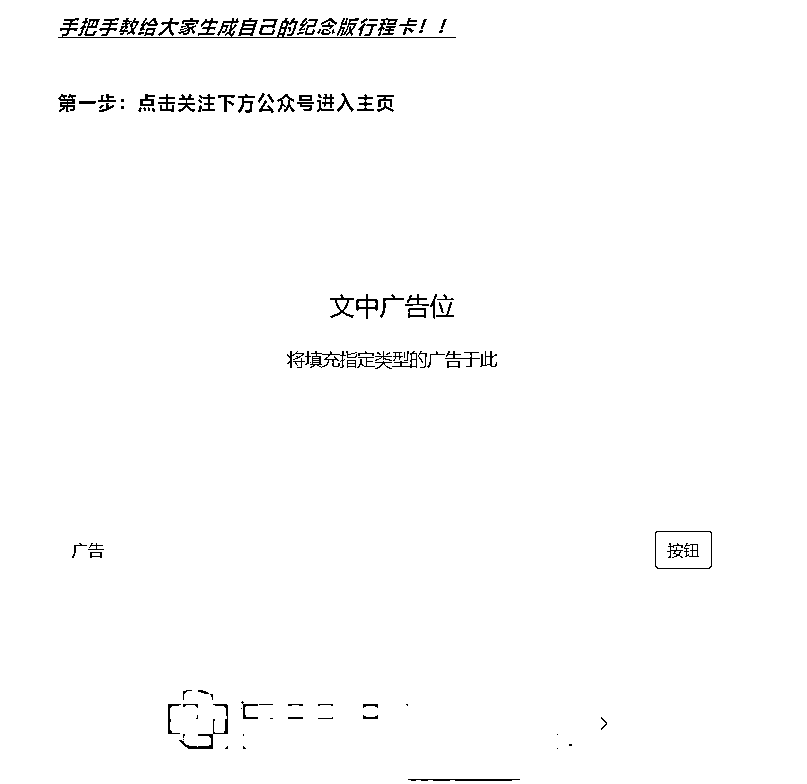

下图是设置公众号手动添加广告的功能，一定是要设置手动添加广告，不要智能插入广告：

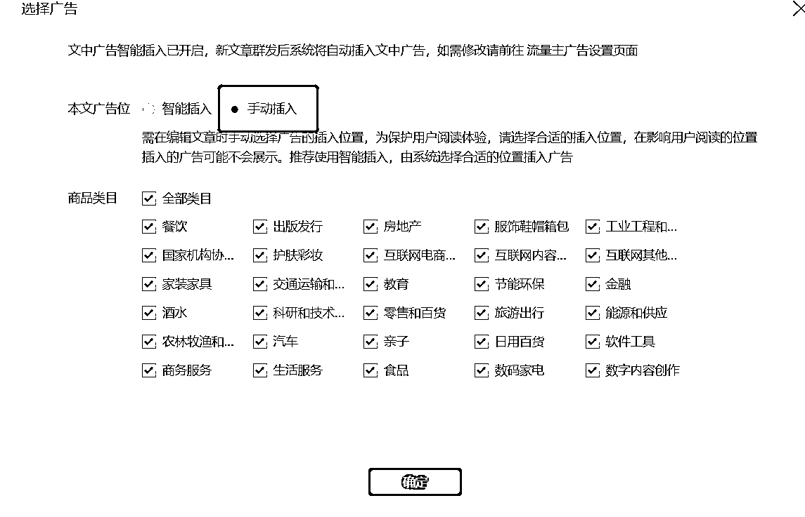

给大家截图3张我这边最好的流量主收益，每一个收益都是破千元，这不挺香的么？

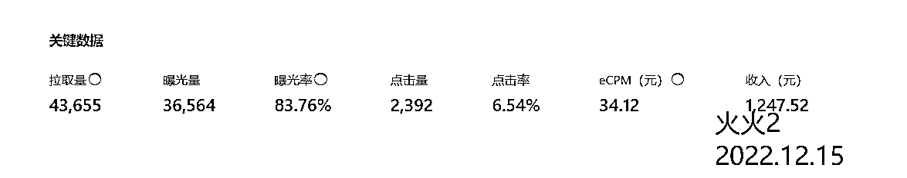

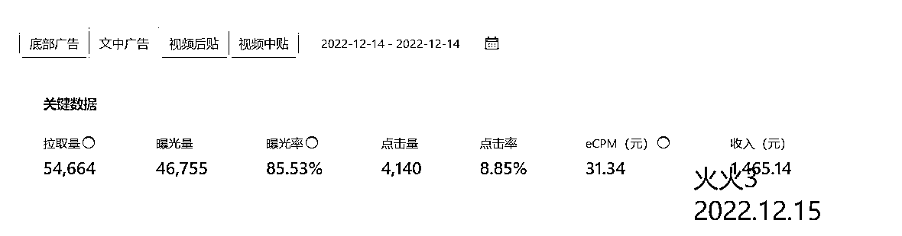

这个小伙伴是完全复制我弄的稿子 ，他这里应该就没有加入广告，减少了一笔收益。

#### 第三点：文章内容伪原创

内容原创最好，其次伪原创；最后到内容简单整合。

这个应该比较好理解，原创内容对于算法来说更容易收录；但是批量发文的话，那就简单粗暴一点，内容简单整合，尽量不要完全复制。为什么我会这么肯定上面的稿子是复制我的呢，因为是我找来的内容简单整合的呀。我第一部分内容先写了如何获取行程卡纪念版生成链接，第二部分内容是在公众号平台/百度平台搜索行程码，把其他相关的文章内容复制加入到后面半段；凑够八百字并且读的还流畅就行。我用12个公众号，每个公众号8篇文章；总共发布了96篇文章，全部是这样子整合内容。

看到这里的小伙伴，如果是需要批量做号发布文章的话，要注意的一点是我96篇文章，每一篇内容都不一样；并且标题都不一样；这样做能够更好的增加被公众号系统收录的概率。如果是一两个号追热点，我建议尽量用自己的话来转述一下文章，变成原创文字；就更容易被微信系统收录。

## 3、给文章起一个爆款标题

#### 方法1：提取关键词自己原创

文章标题我搜关键词行程卡纪念，把排名在前面阅读量比较好的文章标题全部copy下来当参考，找到共同的关键词。我发现有两个关键词是比较热门比较吸引眼球：火爆全网、免费获取；然后再加上关键词个人行程卡 ；我就用这3个关键词组成热门吸引眼球的标题。下方是我给自己文章起的标题：

火爆全网！30秒教你制作行程卡纪念版，快快来收藏哦

免费获取！全网火爆的个人行程码纪念版！以后可能就没了！！

火爆全网！1秒教你生成！个人专属行程卡纪念版来啦！

5秒生成！个人通信行程卡纪念版制作教程，速度收藏

#### 方法2：找爆款标题伪原创

爆款标题有它的牛逼之处，已经用数据证明了它的厉害。那我们就直接用它，就会更加简单暴力。我搜对应关键词，直接把排名在前面的文章标题复制下来，轻微改动；但不能全部一样。举个案例，我现在搜关键词：行程卡纪念版 ；结果如图

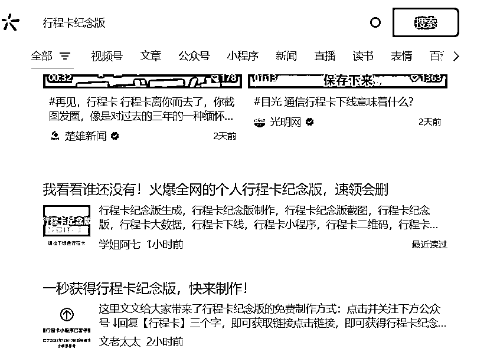

那我就把第一个标题摘录下来，改成：

看谁还没有！火爆全网的个人行程卡纪念版来啦，速度收藏哦

标题更改的原理是在于原创性以及吸引眼球，原创度有助于算法收录文章，吸引眼球有助于读者搜索到第一栏点击进去阅读，点击率提高能让算法把文章排名更好一些。我知道有其他小伙伴是利用微信搜索下拉框词语来起标题，我觉得这个更适合于做长期SEO，就像我之前用公众号SEO获取20万粉丝的玩法一样，是利用微信搜索下拉框词语来起标题。我在追短期热点的时候，会把这个长尾词放进文章内容中。

## 4、设置公众号后台接住流量

我设置好的流程是粉丝关注公众号之后，回复关键词，公众号自动回复行程码生成链接。

很多读者其实不知道如何在公众号后台回复，那就需要我们设置的规则比较完善，衔接比较流畅一些。

我在公众号后台自动回复模块，设置了两部分，分别都有它们的作用：关键词回复和收到消息回复。

## 模块1：设置关键词回复承接住流量

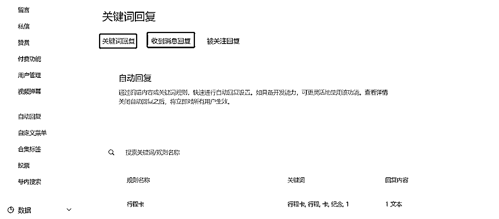

我的设置如下图，关键词回复有一个半匹配功能，意思就是读者回复半匹配中任意一个词语，公众号后台都会自动回复对应链接。文章中让读者回复的关键词是行程卡 三个字，很多读者其实不会回复成完整的3个字，各种各样的回复都有。我为了让读者体验感更好一些，半匹配词语我设置成他们经常回复的文字。

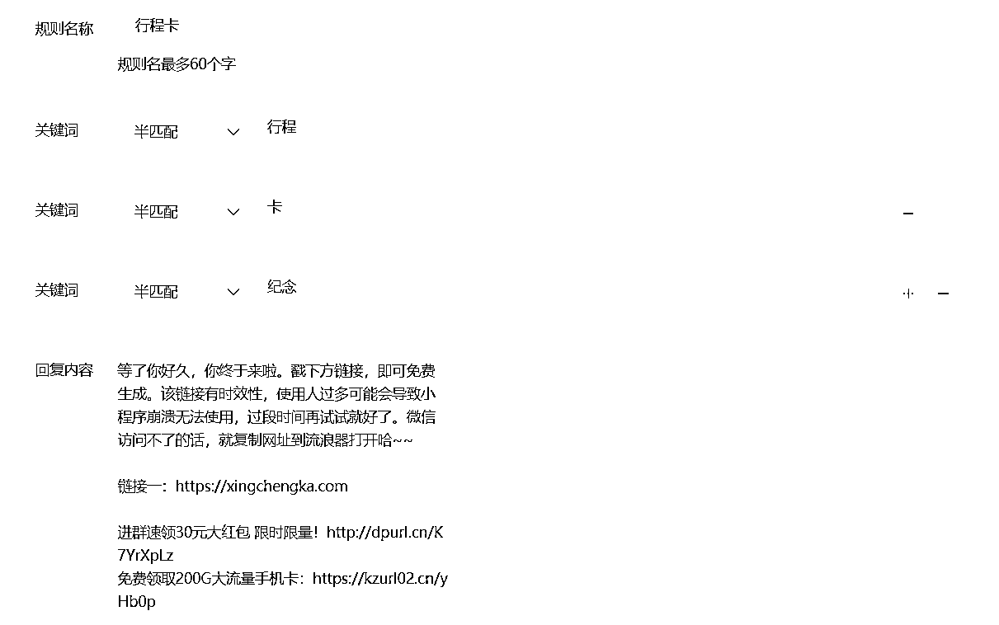

### 模块2：设置收到消息回复减少举报率

我还在收到消息回复这里也设置了文案，这里的作用是让读者不管回复什么消息，都能看到这句话；知道回复哪几个字才能拿到链接。这里其实起到了一点作用啊，就是减少粉丝举报的概率。部分粉丝在公众号如果拿不到行程卡纪念版生成链接，会恼羞成怒愤而举报，让人很心塞。如果是一些小号来做追这个热点，直接在收到消息回复这里设置好回复行程卡生成链接；这样子就更加安全。

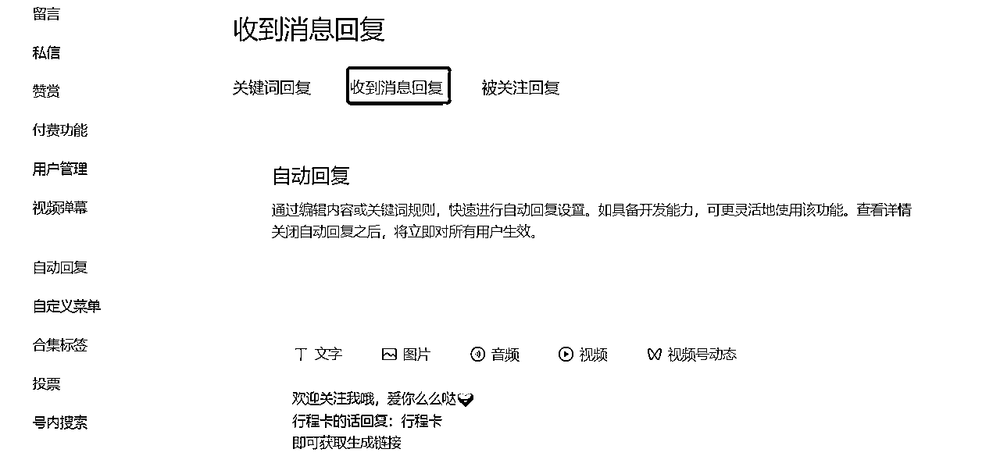

# 三、变现方式

这次追热点大部分小伙伴是为了涨粉，有变现的小伙伴是少之又少。前文已经有提到变现的点，这边归纳总结一下。

## 1、流量主变现

这次追热点最大的变现来源就是流量主，流量主的收入分为两部分：文中广告和底部广告；大家可以对比一下追热点时同一个账号同一天这两个地方的收入差别。如果不是文中广告手动添加的位置找得好，那文中广告的收入就不会远远超出底部广告的收入了。

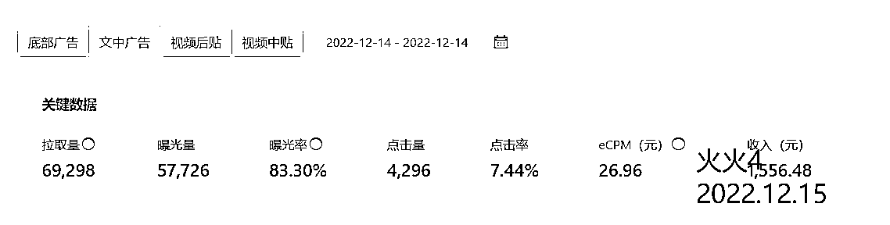

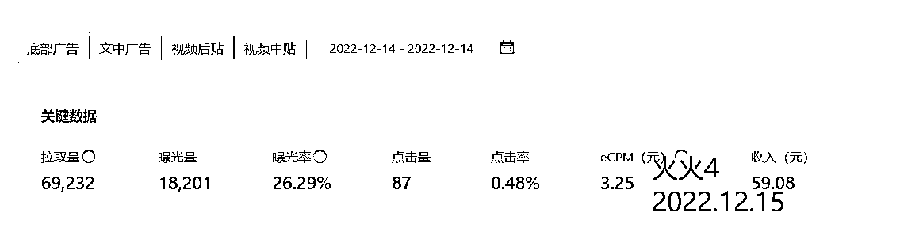

## 2、CPS变现

这个变现的方式，其实也很少人想到；它能放的位置是在自动回复里面。订阅号文章页面放链接不会生效跳转，但是它放在自动回复里面就可以实现。我在这次追热点的过程中，自动回复里放入两个链接；一个是电话卡销售CPS，一个是外卖进群加粉CPA。电话卡总共卖了6张，平均每张70元的佣金；总共四百多佣金。外卖进群路径太长诱惑力度小，导致外卖这一块没有产出，失策了。

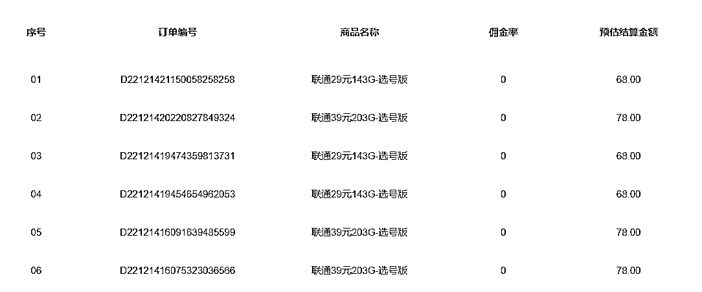

注意，自动回复链接是可以用篮字的方式展示，当时太赶就没有来得及做这个处理。我也附上这个蓝字链接的方式，大家以后追热点的时候可以用得上。

[这里放文字内容](这里放入需要跳转的链接)

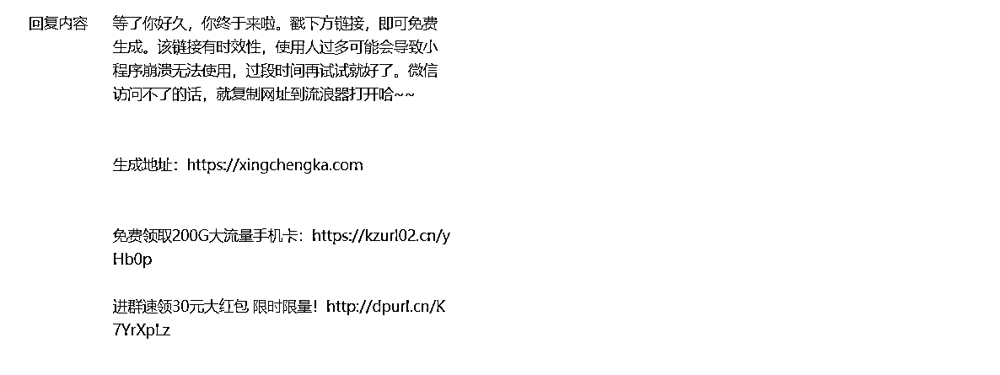

## 3、引流到个人号做淘宝客

我当时有考虑过是否需要引流到个人号，但后面觉得这一块流量我接不住，我的个人号会异常并且我不太擅长泛粉变现；所以我就没有放个人号进去。按照这次追热点新增接近十万粉的流量，也就是大概十万人左右会看到自动回复；转化到个人微信好友也会是一个比较可观的数值。

泛粉也有变现的价值，专业一点的小伙伴一般还会洗粉，筛选出比较高价值的粉丝来变现；简单暴力一些的变现方式就是拉群发单做淘宝客，这一块做淘宝客和吃瓜群的小伙伴比较擅长。我个人是倾向于引流过来的泛粉做淘宝客变现，有精力的话就筛选洗粉二次变现。

## 4、这次追热点的总变现

最后总结这一次追热点的变现；如果四万多粉丝按照单粉一毛钱的价格来算，算价值四千元；然后加上流量主六千元，卖手机卡400元；理论上是我昨天追热点变现一万元。

# 四、个人总结

热点年年有，每个人承接流量的方式不一样；公众号也是一个不可小觑的平台。

希望我这篇复盘能对小伙伴们以后公众号追热点有用啦，感谢大家的阅读。有不清楚的随时问我~~