# 卖空气，需求分析与做局盈利！

> 来源：[https://szzs4fdjd8.feishu.cn/docx/DNGrdODFBowfk2xwkNCc5GGSnRd](https://szzs4fdjd8.feishu.cn/docx/DNGrdODFBowfk2xwkNCc5GGSnRd)

*   分享人：@小千哥

*   日期：2023 年 1 月 9 日

## 开场白

大家好我是小千，老圈友了，简单介绍一下吧：初一辍学,自学编程,未成年时App盈利百万！

比较喜欢研究小而暴利的产品，经历了移动互联网，淘客，私域流量。最近刚失业，目前在调研海外软件尝试入局，难得有空写一篇文章与大家分享卖空气的基本思维。.

多年前写过一篇精华帖：https://t.zsxq.com/097zNVqZG

放心阅读，这不是一篇代码文章，文中只会略微涉及编程知识

# 靠近用户编程

很多人学编程，学了几天都不知道在学啥、不知道有啥用

甚至学了好久，才发现学的是“后台开发”

“后台开发”离用户就更远了，但这是打工标配技术

好多程序员，只会写代码，但不知道做什么

无法站在真正的用户角度上去开发产品，只会站在自己的角度上,分享些使用门槛很高的代码

这是一个软件 Vs 这是一个代码

它的差距是非常大的，在用户眼里：“代码是没有用的”，软件是有用的！

很多人系统化学了一下网页设计，会发现做一个用户端界面真的挺复杂！

是你太正规了

做用户端的产品，根本没有必要做得多复杂！

特别是个人开发者，根本没有必要用代码设计界面

直接用类似PPT的拖拽就行，只要用户能会使用，看着是那么回事就行了，计较专业化有什么意义？

# 软文与软件

多年经验总结一个观点：软件的本质就是软文。

软件开发出来，怎么推广？

还是通过写文章，发广告，介绍你这个软件，软件的最终的展现方式还是软文

所以直接拿软文，最终形式。

反推开发流程，甚至不开发软件，而是寻找类似的软件给客户使用。

想一些根本不现实，或多数人下载不到的软件，但他们觉得应该有这种软件，只需要想到名字即可

写软文的核心是用户看到你这篇文章，内心在想“这次找对了！”，就行了，不管他真找对了还是假找对了。

举例：

就拿看病举例子，医生会问你：“有没有这个症状？有没有那个症状？”

结果你发现：“都是我现在的症状”，所以你认为这个医生懂你的病，这次找对了！

但可能医生仅仅知道你的问题而已，并不代表可以治好!

所以，这就是一种内容策略，用复述问题建立信任基础！

# 趁手的工具

开发软件不是一个简单的事，但是你用对了工具，它就是一个简单的事

使用《中文编程工具》，不会英语也能快速入门，放一个图片：

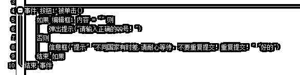

孙悟空没有兵器的时候，每天任务就是找一件趁手的兵器。对于开发软件也一样，找一个趁手的工具，简单又好用的工具是非常重要的

降低沟通成本

当一个想法做出来比表达出来，更快的话，那就没必要说了。

把需求完整的讲出来，又让他理解，本身就是一件不容易的事。沟通成本有时候比开发成本都高，还赶不上有一个趁手的工具，自己先捏一个模型给他看！

或者直接做个模型，上架开卖，卖空气，卖预售。卖不出去就没必要继续做了！

《精益创业》这本书里讲过，科技公司准备接下来做啥产品功能之前，先不要直接开干，而是发个这个产品功能的炫酷视频，看看受众反应如何再决定做不做。

# App的劣势

网页、小程序使用起来，对于用户而言非常方便

App的使用肯定是不方便的，又需要下载，又需要安装

但是正因为App使用不方便，却可以当成优势利用一下

举例：网页、小程序。

它一定要好用，如果不好用

因为用户可以直接打开它，很快就知道是否好用！

如果没有强烈的需求，用户根本不可能去下载安装App

App大多数展示只是看客，下载率极低！

但这时用户看到了App截图和使用方法

用户就会知道，有这么一个App，没有需求的用户不可能去下载。

所以用户觉得：该App“真的具有该功能！”

AppSeo(搜索排名)

App对排名Seo也会有一定的影响

例如：我写一篇文章。

用户在你这个文章的页面停留的时间越长，搜索引擎就会觉得你这个文章更专业，没毛病吧？

要不怎么说下载站的排名还不错呢，因为用户到了这个界面之后，要下载，用户等待这个下载的时间

Seo还有一个更关键的，就是用户访问了你的网页之后，直接就退出了，不访问了，不访问其他的网页，那也就说明你这个网页更专业，也没毛病吧？

下载完App以后，他肯定就关闭网页了，因为他去打开APP了，如果是个网页，他发现不好用，就返回搜索结果，换个网页！

# 有效的噱头，无效的产品

大家总说：“好的产品”就是解决一个需求。

但还有一个观点没说，那就是：“不解决需求”，“也不是好的产品”，并不会影响赚钱的速度！

“评论区”你们可以自己去看，我就不多评论：

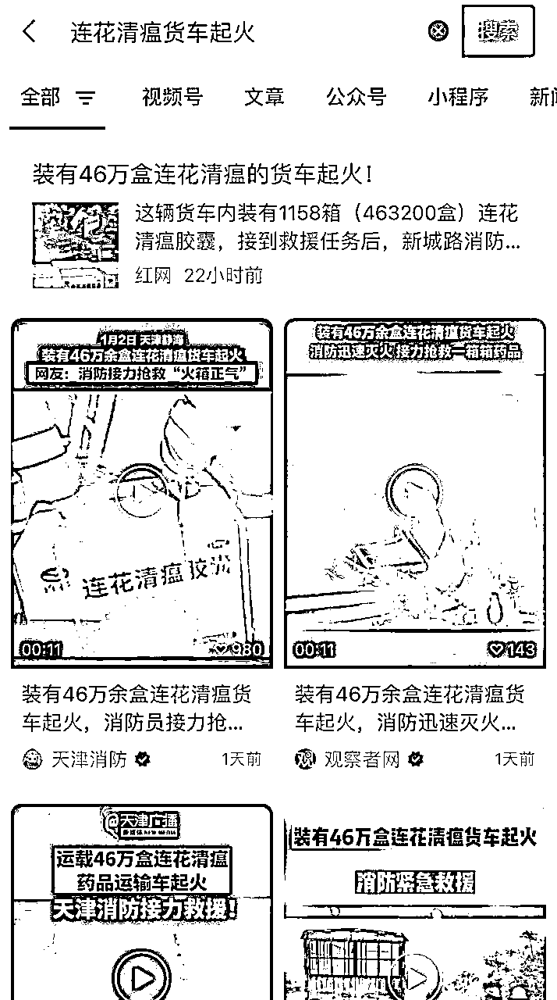

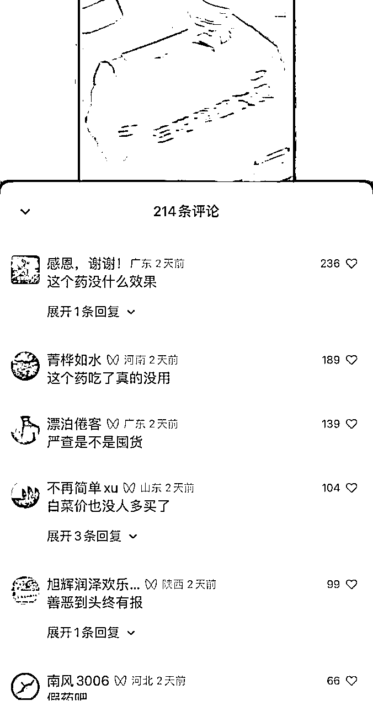

医学上有一种安慰剂效应，说白了就是诈骗效应。

一个糖豆卖的特别贵，就说这是救命药，你吃了也真管用，患者的康复率30%以上！

连花之所以大卖，就是名字取得好，事实证明起个好名字，真的可以改变固有事实！

早些年做个礼包软件，根本领不到礼包，但应用商店评论区："我领到了","是真的我也领到了"

我习以为常，观察人类迷惑的行为：

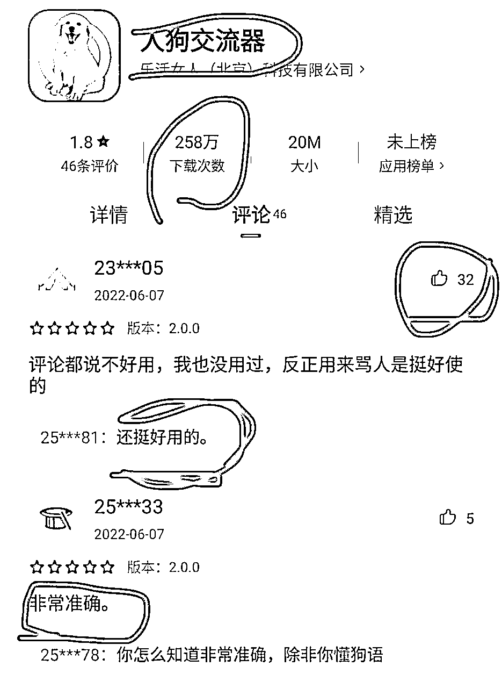

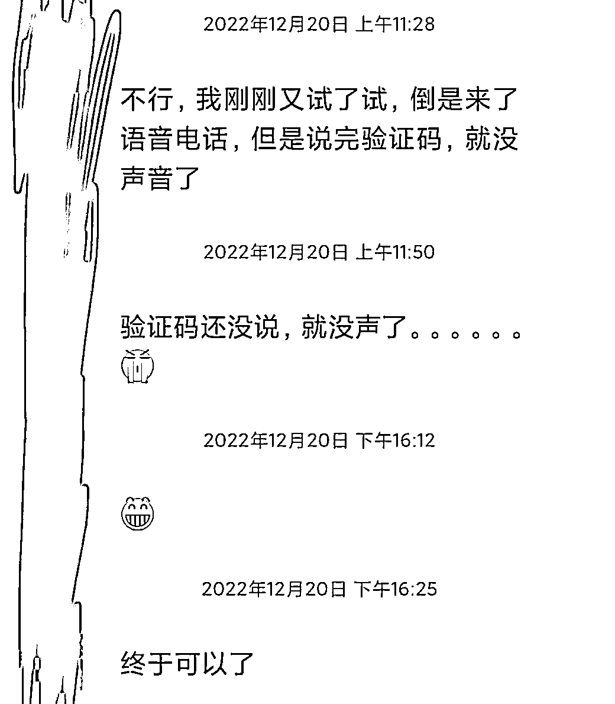

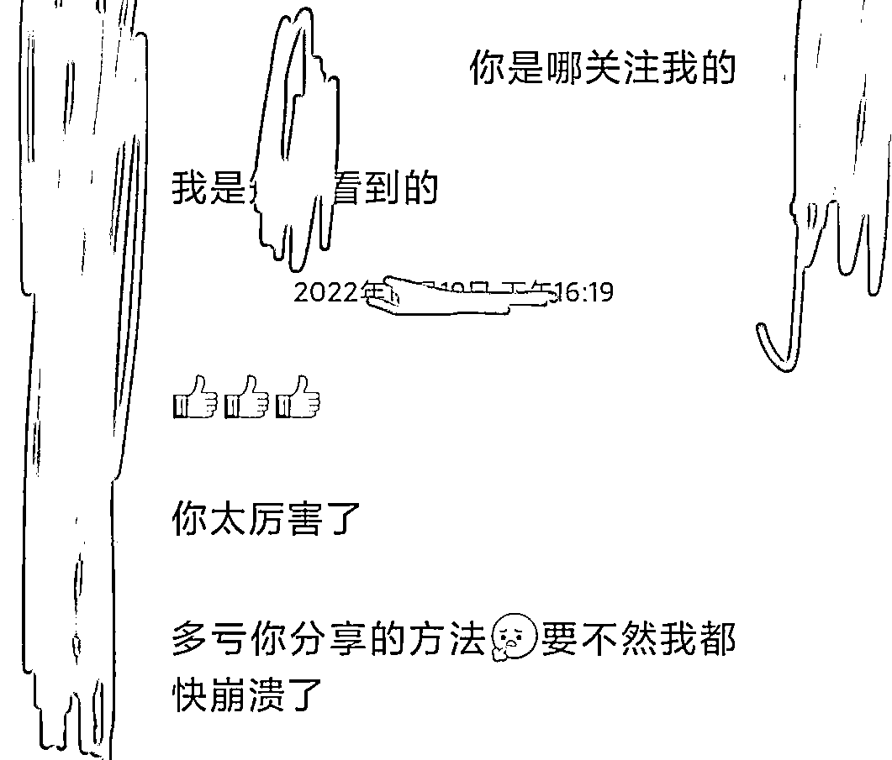

## 碾压软营销

社交媒体的营销派，一点编程都不懂

他们经常写这样的文章，攻略解决xxx软件问题，举例：“微信搜一搜，搜不出来怎么解决？”

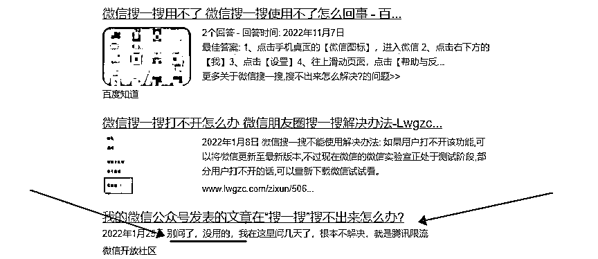

文章写一堆乱七八糟，瞎编的攻略。

世上本没有攻略，瞎编一些就有了！

该类文章特征：写的字长，让你停留时间长，让你照着各种步骤去做，反正你最终也解决不了！

但是你在该文停留时间长，因为你需要照着做，搜索引擎就觉得该文：“长篇大论且专业，排名更靠前了”

比如第一个搜一搜案例：随便找个微信官方的邮件

写文章说给这个邮箱发邮件，发模板，瞎编个特别长的模板，告诉用户照着弄就解封了，这是不用任何App的营销

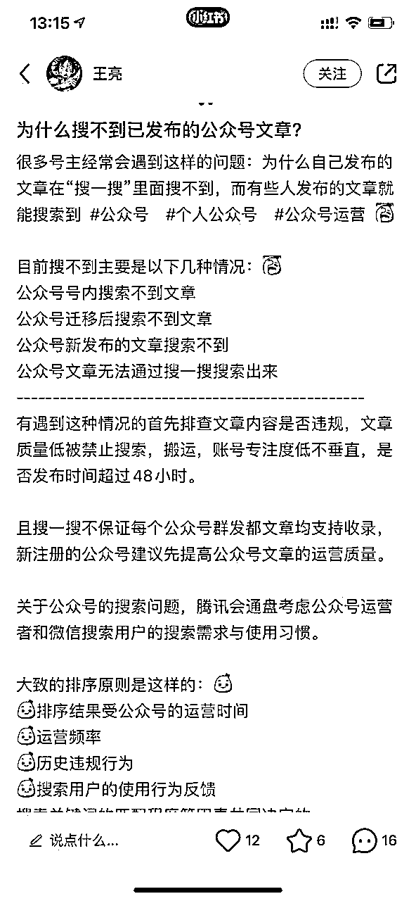

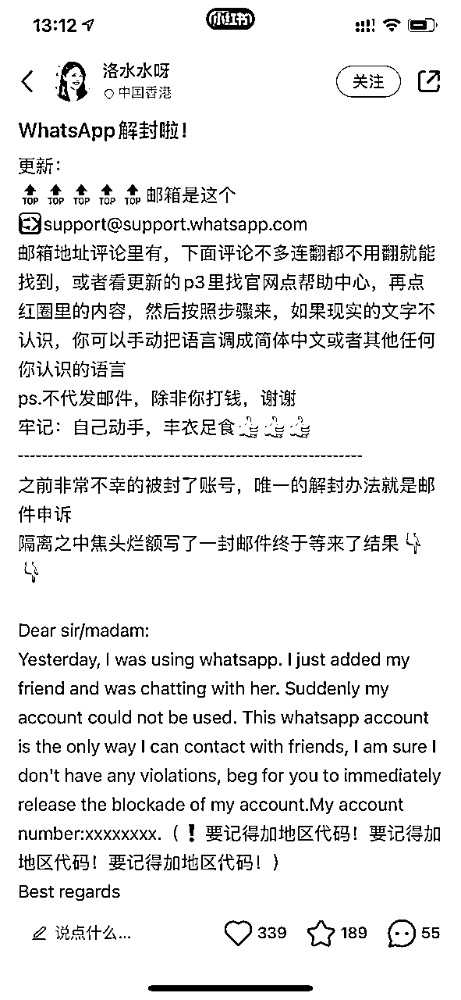

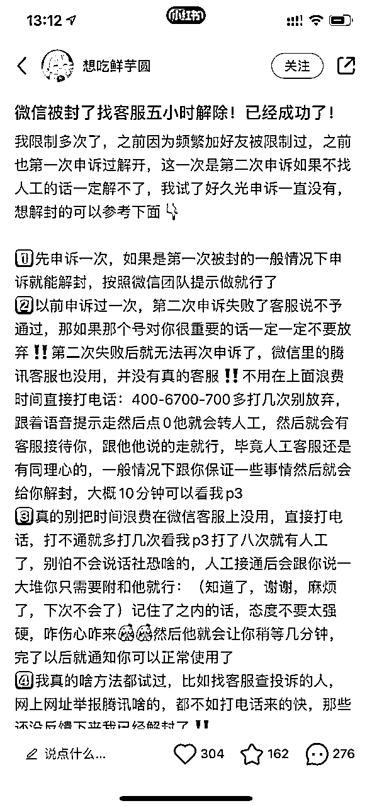

市面上的营销文章大多是：编一些根本不存在的攻略

比如：抖音怎么去引流

教你怎么注册账号，账号多少天，模拟什么真人行为，生成一堆，看似有用，实则长篇大论且无用！

神奇的是，因为超级长的文字，用户也不会去看，用户觉得该文专业，各个互联网群里都有人在转发。

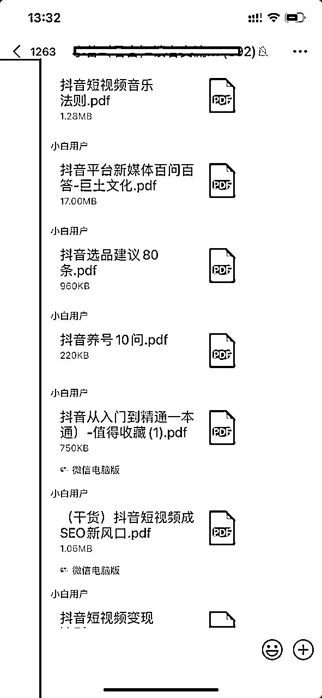

软件营销派

但是呢，如果这种方向的文章上产生了一个软件派，就可以直接碾压他们了

因为软件看起来更逼真了.....

虽然仍然不解决任何问题！

用户会觉得：软件问题就是要用软件解决，用魔法打败魔法，而不是靠攻略解决。

弄一个APP告诉你，你下载这个APP，填上名字，就可以申请解封！

对于这两个版本而言，用户肯定会觉得后一个版本更专业

虽然这两个版本都无法解决你的问题。

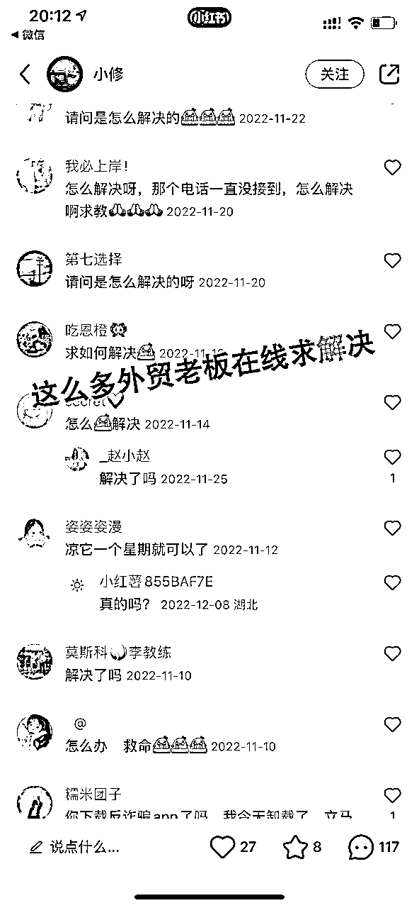

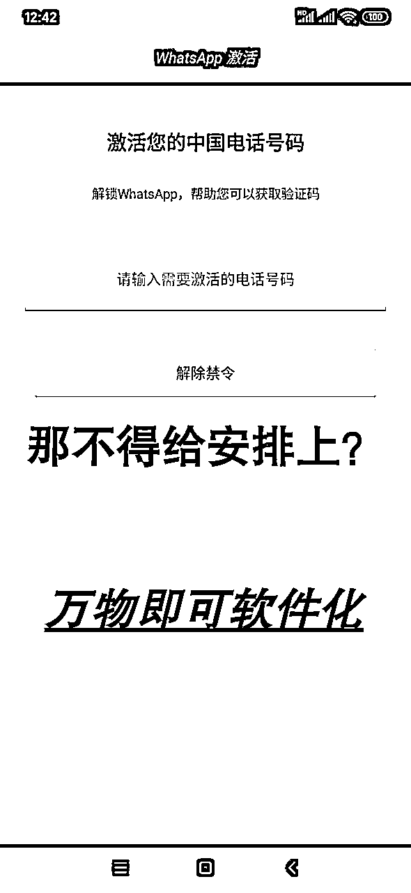

那么，广告呢？

软件营销策略可以设置多种多样！广告不留在表面即可！

骚操作都是动脑子想出来的，我不仅有广告，我还强制你分享给别人后才能使用，这可比软文营销狠：

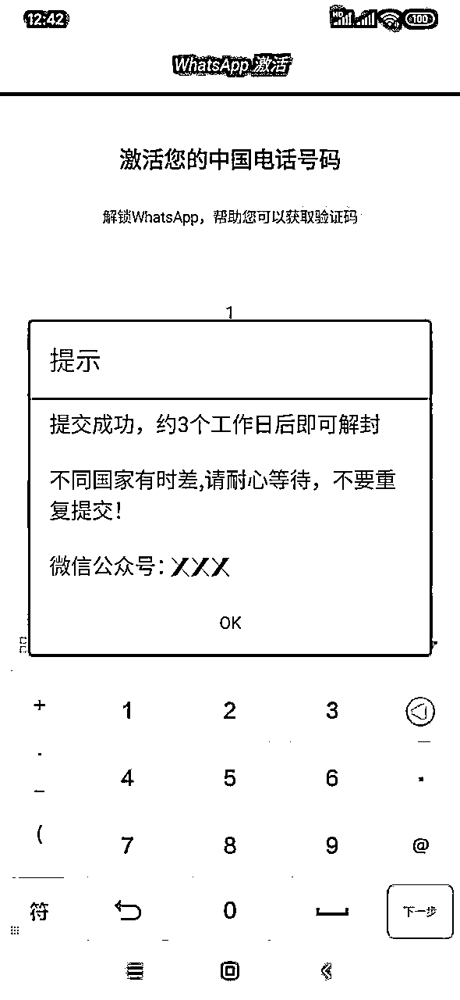

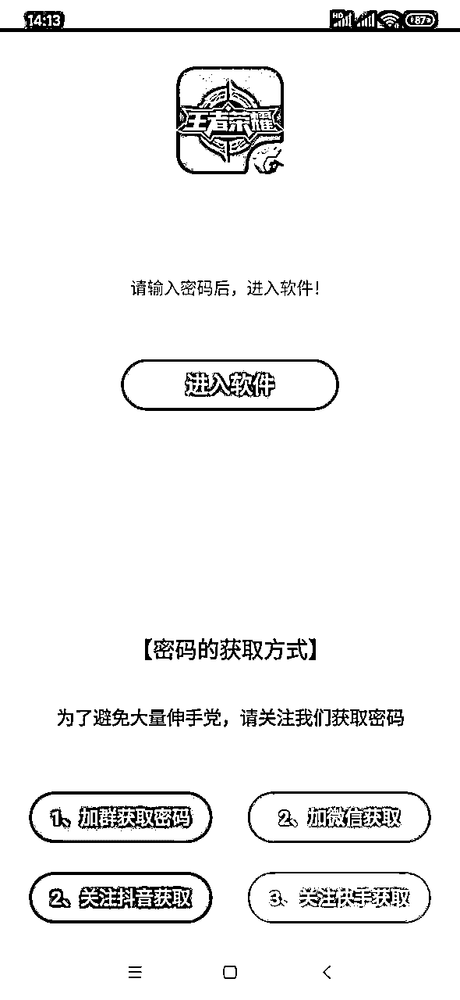

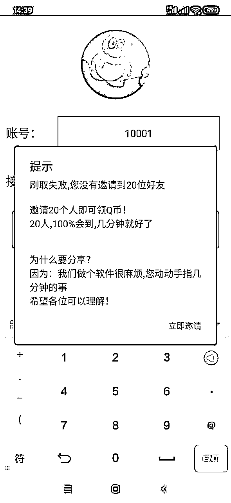

# 过审的艺术

上面我们讲到：没有强烈需求的用户不会下载App

但用户看到这个App后，他会有个印象

当身边有人遇到这种问题，他就可以把这个App转发给别人，但他自己没有体验过这个App

早期在“社交媒体”推广App比较容易的原因之一

“社交媒体”审核员每天看到很多人分享软件，不可能去下载体验，但“社交媒体”审核员会给用户推荐！

如果你的软件表面上都是广告，从截图上就看到各种广告，关注公众号之类的，那就别指望其他人帮你推广了。

所以软文需要有一个干净的截图，只凭软件的截图，没需求用户不会去下载的，调动用户分享精神，也是一种在社交媒体推广软件，过审的技巧！

那么文章怎么过审？？？

文超长，字超多，审核员懒得看，就行了！

可使用：合集、大全、汇总，之类模板，增加文章字数！

之前提交一个证明材料，只提交了2页直接给我拒绝了，后面我乱七八糟提交了15页秒过。

知乎只要是长文，点赞收藏就多。

看到200字有联系方式或者公众号，先加了在说，然后收藏点赞（反正看不完，以后也不会看）

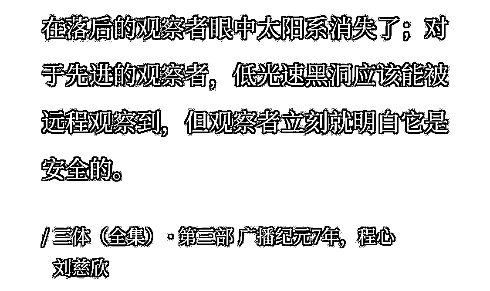

# 居高临下的套话

之前做淘客，刚入门就遇到各种api接口问题无法解决，不知道如何申请，或者说申请了也用不了！

我百度查，怎么查都找不到对应的文章，那干脆我写一篇吧？

我将这个问题用：已经解决的口吻写出来

软文中附加微信号，之后每天都有淘客大佬加我，土豪老板刚通过好用就直接连发几个888转账！

一堆淘客大佬加我问怎么解决？

我特么怎么知道咋解决，我只是知道这个问题。

加我的人足够多了，过了些天，我又反问加我的人“前几天有点忙没来得及回，你们解决了吗？”开始套话，怎么解决的？

总有解决的，也总有没解决的。

把解决的套出来，卖给精准的，没解决的客户，直接盈利几十万！

不懂归不懂，一个外行，也能给你解决问题，外行领导内行也不是不可能，这个套路就叫“做局”，详细对应文章：《讲故事、做局、编瞎话...》《问题本身就是资源，重磅干货》

现在开始做外贸Google也一样，先做着，遇到问题直接用资深大佬的语气写出来，自然而然解决了！

案例、二

羊了个羊刚有点火，立刻就有人P一张分数999999截图

去社交软件用已经开挂的口吻发文，开始吸粉

差不多5天后《羊了个羊》大火🔥

这时他就可以，套话找真正能刷分软件了，直接把粉丝变现！

程序员的思维总是先有东西再推广，不要等什么东西已经有了再去卖！假装已经有了足够！卖空气！

套话为什么能成？

套话之所以能成，主要是因为对方要彰显优越感，“没有你这个事我也能干成”，对方要彰显他自己的优越感

前提是，对方已经觉得“你已解决这个问题了”，所以他要展示这种优越感，也是对心理的一种利用

# 个人独立开发者

个人开发者，主要精力不应该是开发

应该站在用户角度上去调研做什么，之后用一个非常简单的方式把这个东西捏出来！

对于个人开发者来说，就是多想一些不切实际的东西，少想一些复杂的东西。

做些小而简单的软件，站在用户角度上根据需求打造产品

真正的需求，就是用户有求于你

需求是抓住用户遇到问题,用户寻找解决办法产生的行为。

围绕用户可能产生的行为场景，在行为中部署产品！

发现需求的方式也很简单，去应用商店找一些App名字，输入百度、微信、小红书，Google搜索框：

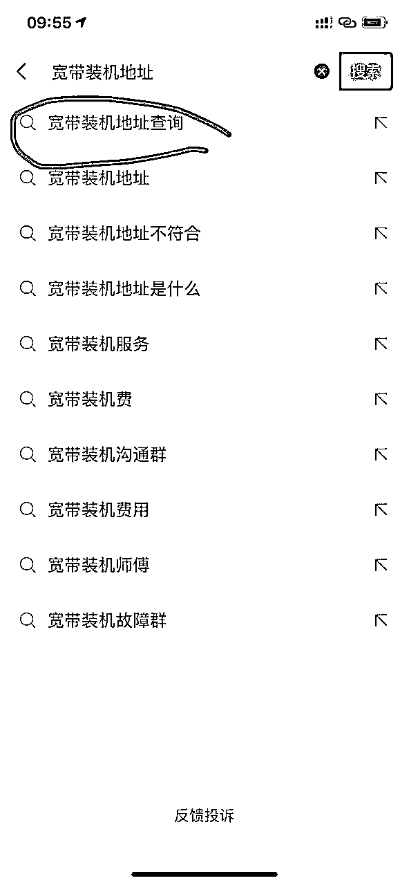

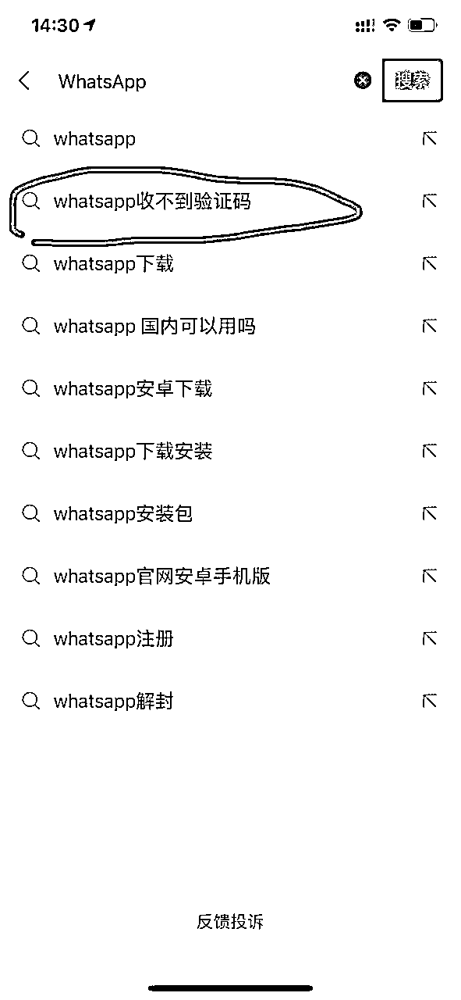

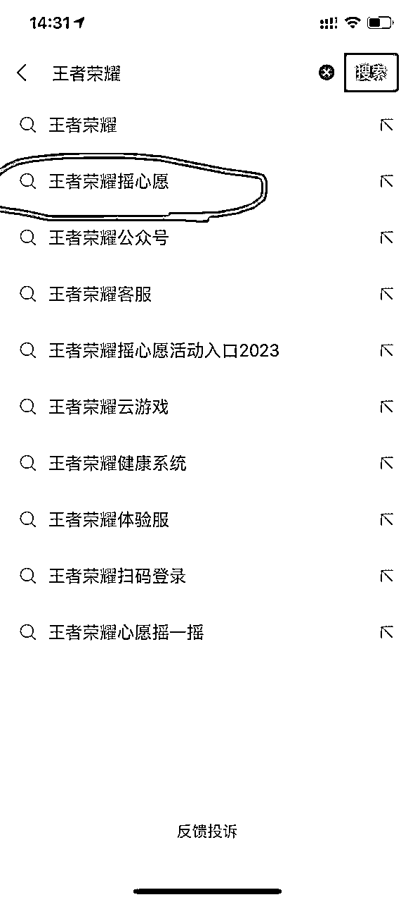

非规范化生产

个人开发者需要的是“非规范化生产”俗称野路子，我就在考虑做个“非规范化编程课”，不知道有多少人感兴趣

非规范化生产的核心是：“降低成本”“提升效率”

有人说：“免费的是最贵的”其理论依据：折腾免费的东西，浪费时间易踩坑，你的时间更值钱。但对于多数人来说时间是不值钱的！

就怕个人开发者“没有正统的命，得了正统的病！”

个人开发者研发一个软件的时间不应超过1周，超过1周的软件产品不适合个人开发者！

软件全球化

目前国内的互联网环境没那么好，软件全球化是大势所趋，甚至可能是唯一的出路！

但文化上的水土不服是常态，经过一段时间的调研，我甚至觉得海外对软件非常友好~

1、网站不需要备案

2、Google投放广告不需要证件，充钱就行

3、软件不需要“软件著作权证书”

4、不需要应用商店审核

无证件的产品也可以上市场，正适合非规范化生产

谁说开发软件一定要有：服务器、登录注册页？再配个UI、产品经理？

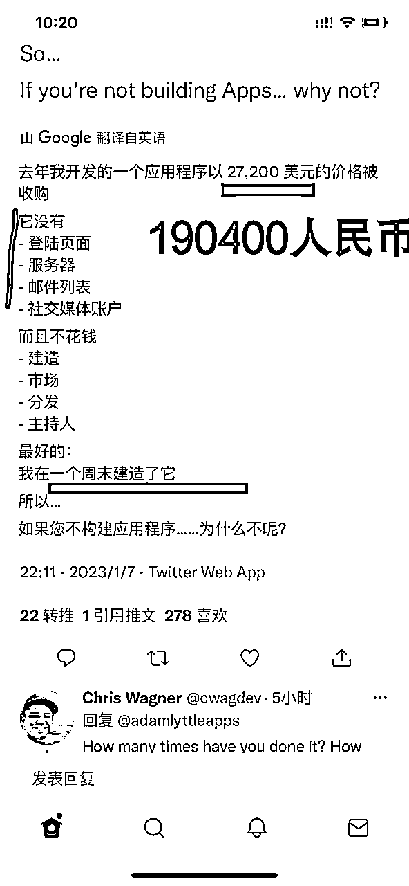

# 最后总结

1、若不是为了找工作而学编程，应考虑：“非规范化编程工具”，靠近用户编程

2、找到趁手的工具，或使用《中文编程》快速入门。研发出模型上架开卖，卖预售，卖空气。

3、软件的最终呈现方式还是软文，直接发布软文，反推研发软件流程，复述用户问题可以建立基础信任

4、App繁琐的使用流程，没需求用户不会下载，精准过滤了需求。用易拉罐嗑瓜子机，演示App爆火的流程，换汤不换药。

5、有效的噱头,无效的产品，不解决需求，也不是好产品，并不会影响赚钱。起个好名字，可以改变固有事实！

6、攻略营销派：世上本没有攻略，瞎编一些就有了！无效的攻略看起来特征：“长篇大论且专业”，超长文的优势：用户看了几百字觉得该文专业就会收藏转发，后半部分不会看！

7、软件营销派：核心是，看起来更逼真、更专业。广告隐藏的更深，更容易用户裂变

8、过审的艺术，套用《三体》观察者看了截图一眼，就知道“他是安全的”，核心就是让自己变得至少看起来是无害的。

9、居高临下的套话，遇到问题用资深大佬已经解决这个问题的语气写出来。让同样遇到问题的人加你，即可解决问题。套话之所以能成是调动对方优越感

10、个人独立开发者，研发周期应不超过一周，通过下拉词寻找需求，使用“非规范化生产”，尽可能降低成本，提升效率

欢迎交流，个人微信：5833487