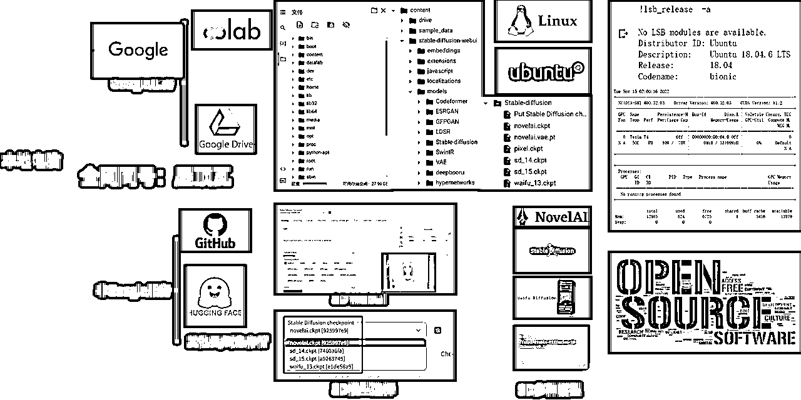
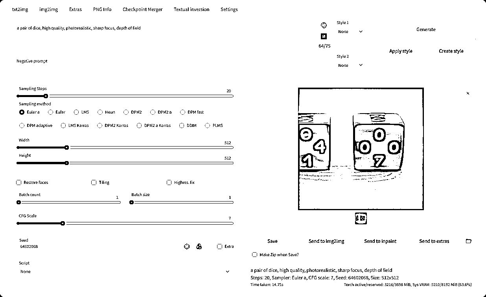
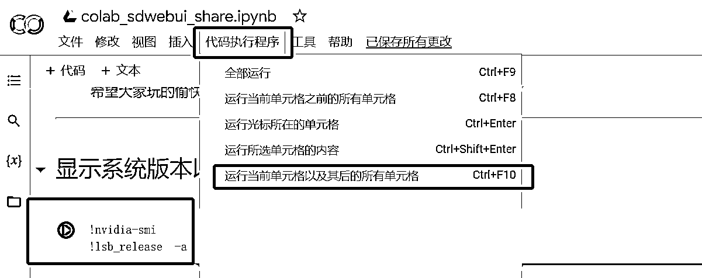
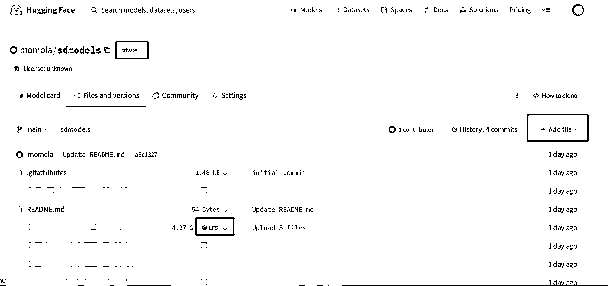

# 【AI绘画】N卡、A卡都不用！最强在线AI绘画教程

> 来源：[https://sg0n3b2id7.feishu.cn/docx/KomqdeUMloO1CkxrgADcqGvDnIe](https://sg0n3b2id7.feishu.cn/docx/KomqdeUMloO1CkxrgADcqGvDnIe)

大家好，我是屋顶瓦，今天带来一期在google colab上快乐玩耍AI绘画的教程，干货满满，看完秒变专业玩家！废话不多说，现在开讲。

注：文中配图、模型下载链接以及脚本的共享地址已经附在文章末尾，需要的小伙伴随意取用。




# 基本概念解释

## colab

colab是google提供的一个云平台，可以理解为一台远程电脑或者云服务器，用户远程连接进去后，可以用其提供的CPU、GPU资源做各种各样的事情。因为数据训练需要较为强大的GPU资源，一般很多个人电脑配置并不能达到要求，所以colab现在在人工智能、机器学习领域用的比较多。

colab本质其实就是linux系统+GPU组成的一台云服务器，系统目前用的是Ubuntu18.04，我们可以在浏览器上执行python代码来完成我们想要做的事情。


Google colab提供了免费与收费服务，免费服务每个账号大概每天可以玩几个小时，免费的配置大概是12G的内存，15G左右的显存以及55G左右的硬盘，同类带有GPU资源的云服务器收费都很贵，Google可以说非常良心了，对于一些尝鲜体验或者简单应用的小伙伴完全够用了。

问题：

如果这几个小时还体验不够，有没有办法延长时间呢？答案是有的，你只需要多注册几个google账号，每个可以玩几小时，多几个账号就可以多玩很多小时- -

## Gdrive


## Github

Github是程序员的天堂，开源精神的集中地，大量优秀的开源代码在这里共享，人们可以轻松的在这里找到感兴趣的项目或是学习对象。其在2018年被微软天价收购。

## Hugging Face

Hugging Face可以看作是人工智能、机器学习界的Github，里边包含了大量机器学习相关的模型、数据集、文档甚至免费教程，也都是开源的，开发人员可以站在巨人的肩膀上，在前人机器学习模型、数据集和 ML 应用程序的基础上不断创建、创新和互相协作，开发出更加优秀的作品。

## stable diffusion

扩散模型是一类新的最先进的生成模型，可以生成多样化的高分辨率图像。而Stable diffusion就是由stability.ai、runway、Laion等几家公司和组织参与整出来的一个文本到图像的扩散模型。简单来说，Stable diffusion就是提供了一整套的文本到图像这种扩散模型的算法和实现。通过这套算法，SD便可以将输入的prompt魔法经过训练后的model文件生成对应风格的图片了。所以说，SD是核心，没有这个的话，也就没有所谓的众多模型文件了。

github的地址：https://github.com/CompVis/stable-diffusion

## stable diffusion WebUI

基于用于stable diffusion开发的一套webui的界面，方便更多人的使用。没有这个的话，要使用stable diffusion的话只能写代码或者敲命令，大多数人使用会很困难，这也是现在AI绘画大火的一个很重要的原因。

github的地址：https://github.com/AUTOMATIC1111/stable-diffusion-webui



## NovelAI、Waifu1.3、Stable Diffusion1.4/1.5等模型文件

这些都是基于stable diffusion的训练生成的模型文件，当然现在网上有更多的模型文件，有自己训练的，也有一些官方组织的。加载不同模型文件生成的对应画风也不尽相同，比如NovelAI以及Waifu这两个模型对应的是动漫画风，Stable Diffusion1.4/1.5，由于它使用来自LAION-5B数据库进行训练，LAION-5B是目前最大的、可免费访问的多模态数据集，所以其画风包含了更多样式。大家也可以根据自己的喜好，进行模型选择或是自己训练。


以上图片从左到右，从上到下，分别是novelai、waifu1.3、sd1.4、sd1.5、midjourney-v4-diffusion、redshift-diffusion模型使用同一个prompt、同样参数生成的图片，可以明显看出novelai以及waifu满满的动漫风、其他模型则更加显得真实一些。

# 开始实操

## 一、申请Google账号


Google主页右上角点击登录，随后根据页面提示创建账号即可，这里比较简单，不再多言。

## 二、访问colab共享脚本

脚本地址：https://colab.research.google.com/drive/1PKF-X2PjTcbrjmpjSk6OU-it6QShL5xM?usp=sharing

该脚本后续我会一直更新，大家使用的时候拷贝一份副本到自己colab执行。下边涉及到一些代码的步骤在脚本里边已经写清楚了，脚本基本只需要填写要下载的文件地址以及自己的token就行。

脚本运行方法：只需要点击脚本中的单元格左边运行按钮就行，每个单元格都可以独立执行，想运行哪个点哪个，但是同时只能运行一个。


小技巧：如果学完本文之后，应该会独立仿写脚本了，之后运行的话可以一键运行整个脚本，点击到脚本文件中的第一个单元格，随后点击菜单代码执行程序->运行当前单元格以及其后的所有单元格，这样整个脚本就会顺序执行了，只要等它执行完最后一条，就可以打开webui页面了。



## 三、设置colab环境

### 修改colab的硬件加速器为GPU

stable diffusion是需要GPU才能运行，所以首先修改colab的配置，将硬件加速器设置为GPU。选择左上角Edit(修改)->Notebook settings (笔记本设置)->Hardware accelerator（硬件加速器）->GPU


### 连接免费云服务器资源

colab服务普通用户是可以免费使用几个小时的，初期开始玩是完全够用的，后续可以考虑选用colab pro等付费服务。选择右上角connect（连接）->就会分配云服务器资源。

### 释放云服务器资源

虽说云colab是可以免费使用的，但是免费用户是有时长以及资源限制的，如果我们不再使用的话，最好释放掉服务器资源。选择右上角connect（连接）->disconnect and delete runtime（断开连接并删除运行时）

* 注意：该操作会将搭建好的环境全部删除清空

## 四、stable diffusion webui环境搭建

*   这一步只要在脚本中点击运行即可

```
# 挂载Google Drive(Google云端硬盘)
from google.colab import drive
drive.mount('/content/drive')

#下载stable diffusion webui最新代码
!git clone https://github.com/AUTOMATIC1111/stable-diffusion-webui.git
%cd stable-diffusion-webui

#安装stable diffusion webui工程所有依赖资源
!COMMANDLINE_ARGS="--exit" REQS_FILE="requirements.txt" python launch.py
```

## 五、下载各种模型

*   底层逻辑

colab环境类似一台拥有GPU资源的云服务器或者简单理解为一台远程电脑，通过上述操作stable diffusion webui环境搭建，已经将sdwebui的环境安装到了该台电脑上，现在需要将模型文件也拷贝到该台电脑上，sdwebui才能加载模型，从而出图。那么如何将模型文件拷贝到该台电脑上呢？主要有以下几种法：

### 加载自己Gdrive中的模型文件

将模型文件放入自己的Gdrive（Google 云端硬盘），然后colab挂载Gdrive，将Gdrive的文件拷贝到Colab中。这种方法优点是模型文件因为是自己的云端硬盘文件，会确保不会丢失，缺点是免费的google账户硬盘空间只有15G，模型文件动辄4G、8G，所以存不了几个模型云端硬盘就会满了，所以只能同时玩1-2个模型。

*   在Gdrive根目录下创建stablediffusion文件夹，然后进入之后再创建models文件夹

*   将所有下载好的模型文件都丢到/stablediffusion/models/这个文件夹里边


*   colab中执行以下拷贝命令，将Gdrive文件拷贝到colab环境中

```
!cp /content/drive/MyDrive/stablediffusion/models/* /content/stable-diffusion-webui/models/Stable-diffusion/
```

### colab中直接下载模型文件

在colab中直接下载模型文件。这种方法优点就是，colab默认有50多G的空间，可以下载很多模型，我最多的时候下载过10个左右的模型文件同时玩。

#### 2.1 gdown下载

gdown（自己或别人分享的Gdrive文件），自己或者他人分享不同的模型，小圈子可以玩，如果人太多，google会屏蔽掉这个文件的访问。

进入网络硬盘，找到想要分享的文件，点击共享->权限为知道链接的任何人->复制链接->下图分享链接红框选中的就是该文件的ID，填入到脚本中的输入框即可


具体代码解释：（其实很简单，稍懂命令的人一看就明白，就是将model_name对应的分享文件，拷贝到colab中的/content/stable-diffusion-webui/models/Stable-diffusion/model.ckpt这个位置，大家想用此方式下载其他的文件也可以）

```
#@markdown model_name就是gdrive model文件分享的ID
model_name = '' #@param {type: 'string'}
!gdown {model_name} --output /content/stable-diffusion-webui/models/Stable-diffusion/model.ckpt

model_vae_name = '' #@param {type: 'string'}
!gdown {model_name} --output /content/stable-diffusion-webui/models/Stable-diffusion/model.vae.pt
```

#### 2.2 huggingface下载

*   注册huggingface账号 https://huggingface.co/join

*   进入主页创建一个新的model，Model name和License随便填，注意，该model选为Private私有的。这里的原因是，有些model是泄露出的，并不是官方开源的，避免一些麻烦，所以你还没玩懂之前，选成私有的自己玩玩。


*   进入到刚才创建好的model中，选择Files and versions选项卡，点击右边的Add files->upload files，随后把自己下载好的模型文件都丢进来上传上去，上传完成之后点左下角的commit，成功之后如下图



*   使用的时候点击上图模型文件名称，进入后右键选择拷贝link地址，就获取到了这个模型文件的下载链接。


*   生成token，进入下方token获取地址，如下图生成一个token，这个token作用就是colab访问huggingface下载文件的时候做权限验证用的。

地址：https://huggingface.co/settings/tokens


*   将上述步骤生成的文件下载链接以及token填入脚本中的输入框，colab运行的时候就可以正常访问并且下载该文件了。


具体代码代码解释，user_token和model_link就是上述步骤从huggingface中获取的。wget就是linux中的网络文件下载命令，代码作用就是用wget从model_link下载文件（user_token是权限验证）到colab的/content/stable-diffusion-webui/models/Stable-diffusion/model.ckpt这个位置，大家要下载其他model也是同理，拷贝下边代码自己改写model_link或是生成位置即可。

```
# @title 3.3 HuggingFace方法

# token获取地址 https://huggingface.co/settings/tokens
user_token = '' #@param {type: 'string'}
model_link = '' #@param {type: 'string'}
model_vae_link = '' #@param {type: 'string'}

user_header = f"\"Authorization: Bearer {user_token}\""
!wget --header={user_header} {model_link} -O /content/stable-diffusion-webui/models/Stable-diffusion/model.ckpt

model_vae_link = f"\"Authorization: Bearer {user_token}\""
!wget --header={user_header} {model_vae_link} -O /content/stable-diffusion-webui/models/Stable-diffusion/model.vae.pt
```

#### 2.3 从其他云存储/对象存储下载

如mega，AWS S3，google Cloud Storage,不管是自己上传得还是别人分享的，只要能拿到模型文件的外网访问地址，或者有提供API的云盘，理论上都可以，这个方法需要对云存储或者云盘有一定的了解，这里就不过多阐述了，原理和从huggingface下载是一样的。

#### 2.4 下载方法推荐

我个人比较推荐使用huggingface，简单易学，综合体验很好。里边也有很多官方开源的模型，大家也可以直接使用。还有一个很重要的点是，我一直建议大家培养自己的动手能力，不要过多使用傻瓜脚本，理解原理后其实很简单，不用靠别人了。后续如果想深入玩的话，Huggingface是必不可少的。

## 六、 运行stable diffusion webUI

以上已经完成了stable diffusion webUI的环境搭建以及model文件的下载，下一步只需要点击运行webUI即可。

```
命令行参数如下:
  - `--share` - 创建一个在线的 gradio.app 链接
  - `--gradio-debug` - 打印输出到控制台
  - `--gradio-auth me:qwerty` - 创建用户，默认 username 为 test, password 为 test，可以自行修改，用作登陆
  - `--deepdanbooru` - 用于安装deepdanbooru，方便使用图片获取prompt
  - `--ckpt` - 用于选择加载默认模型，例如加载以下路径的sd_14模型，可以加入这句 --ckpt /content/stable-diffusion-webui/models/Stable-diffusion/sd_14.ckpt

!COMMANDLINE_ARGS="--deepdanbooru --share --gradio-debug --gradio-auth test:test" REQS_FILE="requirements.txt" python launch.py
```

下边只需要稍做简单的配置，就可以生成漂亮的图片了

参考咒语：

masterpiece,best quality,CG,wallpaper,HDR,high quality,high-definition,extremely detailed,((sea beach)),{beautiful detailed water},{beautiful detailed sky},{beautiful detailed sea},{beautiful detailed eyes},(detailed light),((extremely delicate and beautiful girls)),((blue bubble)),splash, fluttered detailed splashs,{{intricate detail}},{highres},{{ young girl}},Jewel-like eyes,{floating hair},long hair,{flowers},sunlight,{{surrounded_by_floating_petal}},chiaroscuro,swimming ring, splash,waves, coconut trees

Negative prompt: lowres, (bad anatomy, bad hands:1.1), text, error, missing fingers, extra digit, fewer digits, cropped, worst quality, low quality, normal quality, jpeg artifacts, signature, watermark, username, blurry, artist name, b&w, weird colors, (cartoon, 3d, bad art, poorly drawn, close up, blurry:1.5), (disfigured, deformed, extra limbs:1.5)

参考配置：Steps: 50 Sampler: DDIM CFG scale: 10


# 总结

讲到这里，有关在colab上怎么去玩stable diffusion就给大家讲完了，从背景理论知识到具体实操方法基本上都讲的比较全面了，希望大家玩的开心。

如果还有什么相关问题不懂的，欢迎评论区留言，我看到之后都会第一时间进行答复。

另外，创作不易，如果觉得此篇文章对您有所帮助的话，欢迎点赞支持，谢谢。

文中图片共享地址：https://boardmix.cn/app/share?token=rQOvVxMObEWKYKlDd-ECP_wOCux2F2Opapu-CI34W8JMp-P5EJEWdWTH5GiPaAPQx73PUCO9YxQB2pacWD7QPo6MJ8I8YBhguVlRSvpVJto=&inviteCode=p4EZRi

文中脚本共享地址：https://colab.research.google.com/drive/1PKF-X2PjTcbrjmpjSk6OU-it6QShL5xM?usp=sharing

一些模型下载地址：链接：https://pan.baidu.com/s/1uUeCFD_cuLQteTEgf1tndQ?pwd=78jk 提取码：78jk

一个多种模型下载网址：https://rentry.org/sdmodels

注：文中这些链接如果不能正常访问的话，我相信聪明的你应该知道怎么办。