# 创业三年，两年获得天使投资，月入15w+，看我们怎么玩转“0”中介费房屋分享平台！

> 来源：[https://v0ln6e97jg.feishu.cn/docx/PglAdRMiIoVTRyxc4Q3cw8hvnWf](https://v0ln6e97jg.feishu.cn/docx/PglAdRMiIoVTRyxc4Q3cw8hvnWf)

各位生财圈友们大家好，我是秋冬，来自于古都洛阳。加入生财也有两年的时间了，本人从毕业开始从事便利店行业 ，至今已经7-8 年的时间，也算内地比较早入行的一批。

如今行业也进入瓶颈期，于是在2019 年我便提前开始着手转型其他项目———【不一样的个人房屋分享平台】

希望这篇文章给疫情当下的创业者们能提供一些小的思路，我的分享主要包括以下几个方面。全文尽量以干货的形式呈现，总计7738字，请您耐心阅读。

一、项目背景——机遇往往诞生与变革之中

二、胖龟找房1.0——没有中介费的个人房屋分享平台

三、胖龟找房2.0——胖龟+

四、胖龟找房3.0——没有中介费的租房平台

## 一、机遇往往诞生与变革之中

### 1、项目起因

我岳父岳母常年居住在英国伦敦，2019 年有幸去过一次，他们住的地方已经有将近 100 年的历史。

在跟岳父的沟通当中，他给我讲到。如今他和岳母住的这所房子的原主人，是在他 70 岁的时候，想着把房子卖掉，然后准备拿着卖房子的钱回老家养老，最终才愿意出售的。

我当时问岳父，为什么不买新房，而是选择买一套时间这么长的房子。他告诉我说在英国新建房比较少，大家基本上都是在买卖这些老房子。

其实在那一年我去英国也是想考察一些项目，开拓一下眼界，选择一些新的赛道。回国以后我把考察的项目一 一与国内的项目对照分析，最终在经过一年的考察后，选择了和伙计成立一家小公司——胖龟找房。

### 2、项目分析

众所周知，房产市场是国家最为关键的产业支柱，但在近年「房住不炒」的政策方针下，传统的房产中介平台的日子过的越发艰难。

#### （1）行业现状

*   一方面是迎来需求方市场为主，而不再是卖方、出租方市场。

*   一方面则是随着市场环境，传统房产中介及众多房产平台信息越来越透明化。

*   行业内的从业者质量参差不齐，双边吃差价，独家委托套路。

*   假房源钓鱼，及置业顾问的走私单、跑单、撬单等问题其实每天在重演。

从表面来看是开很多家店，规模很大，收的中介费有多高，营收多丰厚，而实际上并没有去从根本上解决这个行业存在的痛点问题。

那么随着政策及疫情的双重压力下，不仅买方市场低迷，房产中介也卖不出去房子。并随着大批量闭店、躺平下，行业则迎来重组洗牌的机会。

#### （2）行业变化

早在 2018 的时候国内的新建楼房已经开始走下坡路，大规模的城镇化建设也接近尾声。加上自 2019 年底疫情开始，老百姓们开始节衣缩食。国内房产销售已经从存量与增量市场并重的方向，开始迈入存量消费时代。

从下面这张表我们能看出，二手房成交金额逐年在升高。 任何一个行业都有其周期性，从萌芽、到高速发展、再到成熟稳固。房产中介和房地产行业是相伴相生。房地产行业正在进入低利率时期，房产中介未来会比较煎熬。

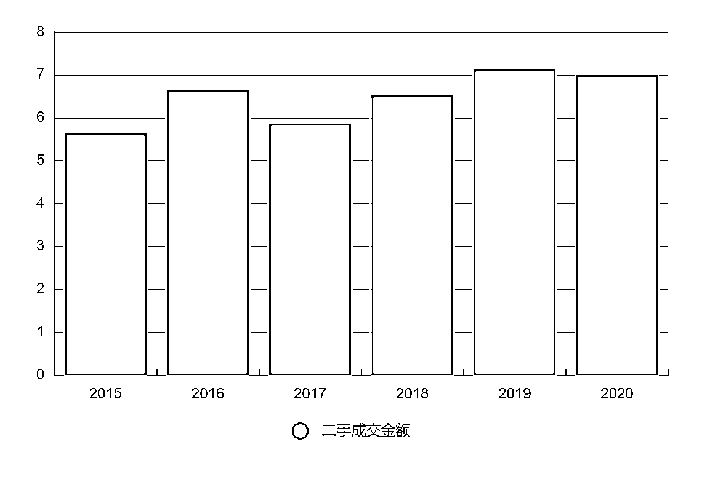

### 3、发现机会

我是怎么发现有这么样的一个机会呢？源于自己的亲身经历及多年的工经历。

#### （1）卖房经历

我本人在19年时卖了一套老房子。当时的房子是委托中介帮我卖的，挂了两个月后有位买家决定购买。之后我们在中介公司见了一次面，过了一段时间他私底下找到我想进行私下交易。

因为我与中介签了独家协议，如果出现跳单的情况，是要赔偿中介费用的。最后我拒绝这位买家私下交易请求，导致了这位买家多付了2个点的中介费。

#### （2）工作经历

在便利店行业工作了7-8年，主要做的工作就是拓展门店，开发新店。前前后后跟大大小小的中介打过很多交道。在开店初期确实给中介掏过中介费，因为二房东将房屋托管给中介公司，中介公司掌握大量的房东资源，导致我们一时难以接触到房东。

后来也出现跳单行为，因为中介所提供的服务并不值那个价格。后来我在带团队的时候，慢慢的将工作重心放到挖掘房东的联系方式上面，并将高额的中介费作为奖金奖励给同事们。

回想一下买房的用户为什么要私下找我成交？我在开发新店的时候为什么愿意跑中介的单子？

其实就是想省掉高额的中介费，中介提供的价值不值得收取这么高的费用。

#### （3）找准行业痛点

有需求的地方就有市场，中介平台公司在房产市场蓬勃发展的10年获得了大量的财富，也产生了大量的问题。

*   虚假低价房源：在这个高房价时代，购房者都想要买到物美价廉的好房子，房产中介正是抓住购房者的这一心理，在对外宣传时往往会以低价房源来吸引购房者。一旦购房者前来咨询，他们就会以各种理由来带购房者看其他房子，并且绝口不提低价房子。

*   变相违规收费：一般来说，房产中介只能收取交易佣金，不得额外收费。但是，在实际生活中，不少房产中介都在变相额外收费。

*   签订阴阳合同：当买卖双方签订购房合同时，有些房产中介会教唆双方签订阴阳合同，以此来规避税费。

*   刻意抬高房价：虽然国家规定禁止房产中介吃差价，但是还有不少房产中介顶风作案，刻意抬高房价，借此来吃差价。

*   子虚乌有的费用：签订合同，继续收割买房者口袋里的钱，高额的代办过户，代办贷款，千分之2的评估费差价，子虚乌有的贷款服务费1%。

#### （4）项目优势及差异

##### 优势：

1.  我们不收中介费，是因为中介费本身就是个伪概念！为什么说是伪概念，因为是智商税，中介费为什么要收？就是因为买房及租房者不知道售房及出租转让业主的联系电话！

1.  如果买房者或者租房者知道房东电话！那么他们还会给中介公司掏中介费吗？nonononon，绝对不会！这叫什么？是不是信息不对等差造成的信息差？

1.  我们没有高额的代办过户费，因为有合作的权证公司，他们只收取相应的跑腿费。

1.  没有评估差价费，我们有合作的专业评估公司进行评估。

1.  没有高额贷款服务费，我们有对接的金融贷款机构，只收取小额的固定的费用。

##### 差异：

我们不是房屋中介公司，因为我们不收取中介费！我们是第三方平台，但是又跟其他的第三方平台不一样，我们做的是个人房屋分享平台。

58同城里面的房源有个人有中介，大多数置顶，首页的房源全是房屋中介的置业顾问发布的房源。安居客，贝壳找房，房天下，里面全是房源，但联系人全是各个房屋中介公司的置业顾问！（伪第三方平台，其实就是网上房屋中介公司，做个平台，网上房屋中介公司，就跟我开个零售实体店，我在网上淘宝京东天猫再开个网店，同样产品，）

1.  因为要打破这个伪概念中介费，那么就应该让更多的人知道这个平台。看到好房源，卖的性价比高，好的商铺位置好，房租不贵，就分享给身边有需要的朋友，分享到朋友圈，让更多的人看到，让更多的需求者不再掏信息差的中介费。

1.  让这个平台下沉到每个人，让想买房想租房，在胖龟找房找到心仪的房子，还不用掏中介费，让那些想售房，想出租转让的业主，上传到平台上，更快速的卖出去租出去。因为平台上的客户全是有需求的，没有需求的客户是不需要来浏览的，那么活跃在胖龟找房里面的客户都是准客户。胖龟找房建立这个第三方平台撮合买方与卖方匹配，互利，解决需求及痛点，产生良性循环。

1.  基于上述就会有一部分赠人玫瑰，手留余香的朋友们，会去分享房源及胖龟找房平台。那么胖龟找房更不会让人白白分享，特推出分享推广奖，每成功分享推广成功一位客户，胖龟找房平台自动奖1800元分享推广奖。又能利他，帮助身边朋友省钱，又能得到胖龟找房平台的奖励。

## 二、胖龟找房 1.0——没有中介费的个人房屋分享平台

在二手房市场里，购房客户群体不懂买卖房屋流程以及房产交易规则。 所以只能通过房产中介行业支付高额的信息差费。

生意的本质就是信息差，在互联网里也存在大量的信息差生意。以这个信息差为市场的切入点我们创办了胖龟找房的 1.0——没有中介费的个人房屋分享平台。

### 1、在第一年里，我们做了什么？

这一年我们将思路理顺以后，开始着手制作我们的小程序，摸排重要的小区信息，整理房源信息，丰富房源库，开始疏通一些物业资源跟事业单位的资源。（后续会告诉大家为什么）

线上整理完毕以后，我们开辟了线下实体门店，做了小区附近的店中店。门店开完以后我们开始推广招商，线上品牌推广。

#### （1）自建小程序

丰富我们的房源系统，平台提供房产相关信息的数据上传与浏览、分析、 客户自主检索、房屋供需快速匹配、智能会员系统相结合的全新服务体系。

自建小程序

#### （2）线下实体门店

门店提供营销服务，房产专业服务，售后服务，帮助客户选房，带看，磋价，以及提供居间方合同签。

线下实体门店

#### （3）联营店中店进行赋能

通过合伙人计划，开设联营店中店，有便利店，社区菜鸟驿站，理发店等各种贴近顾客的地方。我们通过小程序锁码跟踪，为社区业态附能，为合作方增收。

店中店，门店赋能

#### （4）各种推广招商

通过抖音招商推广，招募加盟商，共创财富。在洛阳当地最火的汽车广播频道 106.5 推广，洛阳本地的自媒体平台推广，以达到快速曝光品牌，扩大知名度。

抖音招商推广

汽车音乐广播嘉宾

### 2、在第一年，我们获得了哪些结果？

8 家门店，34 家店中店，新增 12110 名会员。

转换胖龟会员 287 名，营收达 104.7 万元。

帮助 287 名会员省了将近 574 万中介费。

帮购房客户省了代办过户贷款及贷款服务费 143 万。

刚才介绍完我们第一年做了哪些以及获得了一些小成果，下来分享一下这个项目的盈利模式。

盈利模式

### 3、怎么才能帮助客户省掉中介费呢？

用户通过扫描我们在线下门店和合作的店中店设立的小程序二维码，注册信息之后，就可以在小程序上自己寻找合适的房源。

后台员工，电话与用户联系并添加微信了解需求，介绍我们的服务，进而将普通用户转化成为我们的胖龟年费会员。

只要成为我们的年费会员，就会获得十大权益。

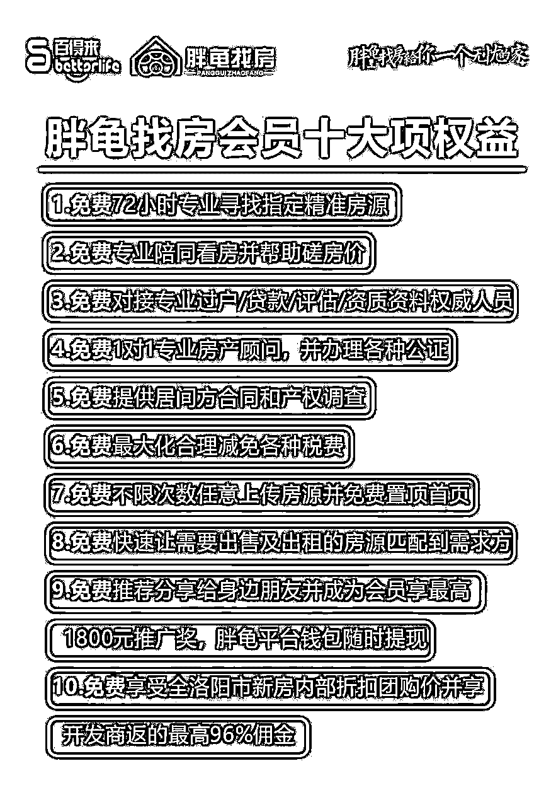

### 4、心仪的房源怎么找？

①、用户可以通过我们的线上小程序选择房源，看中合适房源的时候直接可以拨通房东电话直接沟通。

②、小程序没有合适的房源，可以将需求告诉我们，我们给匹配需求。

③、各种中介手上也有大笔房源，用户可以先行去了解，选中合适的房源以后，用户只需要把小区的名称，单元楼号，房屋号记下来告诉我们即可。

### 5、房东联系方式的获取方式？

物业：通过与物业建立起关系，给予一定的费用，拿到业主电话。

水电费号码：通过水电费号，找到相应的单位人员获取业主电话。

同行转化：传统的中介，房源共享，客户共享，切入同行，获取业主电话。

以上是三种比较常用的方法，有一定难度，只要肯下功夫就能获得想要的结果。

### 6、如何产生盈利及盈利途径？

#### （1）年费会员

年费会员—3650元，帮助顾客买二手房省掉巨额的中介费。

为客户提供想要的房东电话限期一年时间，顾客购买新房，返还开发商佣金90%。

#### （2）开发商返佣

新房开发商返佣，佣金 10%左右。

#### （3）代办过户手续费

提供房产代办过户 500 元，代办贷款 500 元。

#### （4）代办评估费用

代找评估公司评估，评估费的 3%。

#### （5）用户通过分享产生裂变

老用户通过二维码分享新用户，新用户成为会员，老用户还可以获得1800的推广奖。

### 7、避坑指南

#### （1）在搭建小程序的时候，我们白白扔进去 2W 块钱。

最开始我们用的是线上团队，沟通起来的效率比较低下，很多问题反应上去了，但是改起来比较慢。在尝试合作了两个月的时间我们选择了放弃，重新在本地选择外包团队。

在本地选择的时候，一定要深入公司内部去考察，看看外包团队的人员构成，人员数量，还有他们实施过的案例， 这样会对一家公司的了解更加深刻。

开发团队领导的技术，沟通效率和团队的协作能力，也非常重要，这便于后期沟通细节，降低沟通成本，缩短时间。所以在做互联网项目创业的时候，最好的方式吸纳一位优秀的技术开发人员最好。

#### （2）线下运营门店的时候尽量找寻小白，刚毕业的大学生最好。

一开始我们在线下招聘的时候偏向于找寻一些从事过相关房产行业的销售人员，这波人有自己的好处就是对房产板块比较了解。

但是这波人有个严重的问题，固化思维太重，难以改变思维，销售的重点只是推荐房子，而非会员的转化。

后来我们把招聘重点放到了刚毕业的大学生身上，这些大学生可塑性高，只要激励到位，就会是个可用之才的。

#### （3）在营销方面，最好最优的途径就是抖音。

我们在营销推广方面前前后后尝试了三种渠道，从效果来看：

以此 抖音推广>本地自媒体>汽车广播

抖音我们投了大概有 10w+ 包含自媒体板块，其中品牌营销板块占比 60%左右，招商版块占比 40%。

品牌营销这部分营销推广直接带来了 4000+的粉丝，付费会员大概在 100 多名，获客成本大概在 600 左右一名，投产比还不错。

招商版块推广带了 100+的意向客户，最后成交变成加盟客户 5 位，单个加盟商成本在 8000 左右。因为我们有个 1w 左右的利润，所以也是有盈余的。

汽车广播这个板块不建议大家做，薅羊毛的客户比较多~。这个版块我们大概扔进去 2w，水花都看不到。

所以想做营销推广方面，大家还是可以多多考虑抖音，毕竟抖音现在的活跃度真的很高。

还有一点要说明一下，投抖音的时候如果你是做本地项目，一定要投本地一定要投本地，要跟合作公司交代清楚。

ps：2021年杭州上线了“0”中介费的政府平台机构。我们是不是提前了一步？哈哈哈

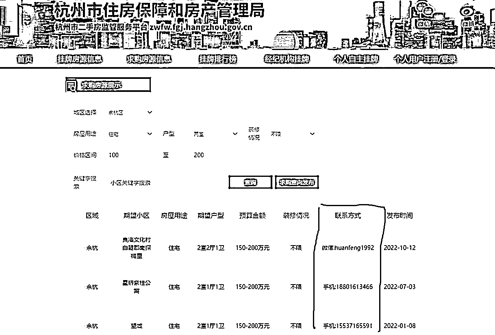

2020 年的结语———因相信，而相见

## 三、胖龟找房 2.0——胖龟+

带着 2020 年的成功，迈入了 2021 年，疫情的第三个年头。各行各业艰难前行，但这也挡不住我们前进蜕变的脚步。

这一年我们只做了三件事情

*   认真打磨发展线下门店

*   胖龟+附能门店

*   会见投资人

### 1、大力打磨发展线下门店

这一年我们关了 4 家店，开了 5 家店。作为实体门店，开店关店很正常。我们设计新的店型， 将店型由原有的 50-60 平方，改为 10-15 平方，减低开店投资成本，打磨建店模型，以做到投资小回报高。

我们将原来的随意开店，改为精准开店。传统的中介店会有大量的客户到店，我们只需要在隔壁开一家小店，很小的一家店，就会有源源不断的客流通过我们店铺门前。只用做好引流跟转化就行了。

用互联网的专有名词，就是蹭，蹭其他中介的流量，然后通过我们的门头标语：买二手房，租房，"0"中介费。 来吸引用户到店，以达到截流的目的。这种手段，在抖音，小红书，知乎等平台经常被人所用。

一个典型的案例，我们这边有个涧西区，涧西区有个中介门店，该门店是整个洛阳市区里的标杆店跟销售冠军门店。

我们在这个店的隔壁开了一家店，门头就是“0 中介费”。自从开了店以后，截流隔壁门店好多顾客，导致这家门店销售额接连下降，店员也不敢带顾客去店里面谈了。因为这件事，隔壁门店不少找我们麻烦。

开在中介堆里的门店

### 2、胖龟+居家生活平台

我们在这一年也开始整合房产后的市场，增加居家生活服务平台，囊括家政，建材，设计，劳务，金融板块。目前这个板块整体的思路与框架正在完善，等待后期投放市场。

为什么要开展这块业务？

①想增加用户使用小程序的粘性。

②建材，设计，劳务（装修工人），金融这些板块，只要买房的人一般都要进行二次装修，在装修的过程中就需要找设计师，装饰公司，建材商，装修工人等。

我们只是将业务延伸，争取做到一站式服务，让用户从租房开始到买房再到装修，都可以在平台上得到解决。

③至于家政板块，在后期的家庭生活当中，是密不可分的。

胖龟+便利店，胖龟+理发店，胖龟+社群，等等。只要有用户的地方，我们就在努力的拓展胖龟的版图，提高胖龟的曝光度，让消费者开始逐渐了解 “0”中介费的买房平台的存在。

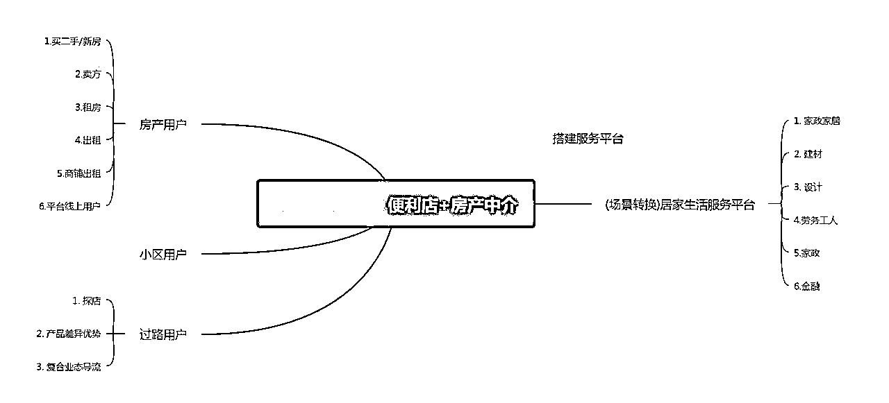

整体框架

### 3、会见投资人

当项目的 1.0 版本的闭环跑通了以后，我们就在想如何快速的发展品牌。我们制作了新版的招商手册白皮书，制作了 2021 的商业计划书。

带着商业计划书，我们跑遍了成都，上海，深圳，西安去会见各种投资人，做项目的路演。这一年走了不少的坑，也花了不少钱。

在这里，对大伙说一下，如果你的公司想去融资，想去找投资人。最好有人推荐，市面上很多打着投融资的旗号的骗子公司，他们让创始团队缴纳各种名义的费用，少则几千多则上万，一定不要盲目缴纳各种费用。

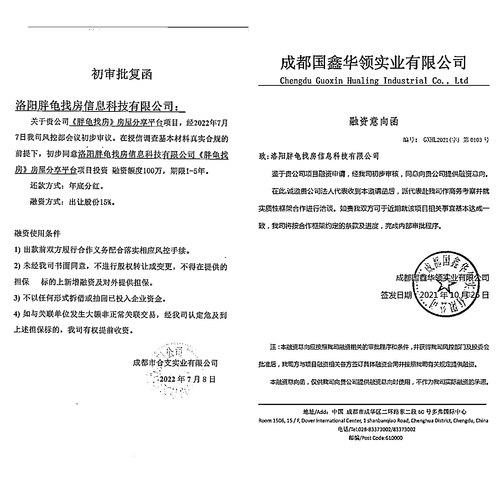

融资意向函

2021 年结语——行动起来，你就成功了一半

## 四、胖龟找房 3.0——没有中介费租房平台

上帝永远不会辜负每一位努力的人。

### 1、获得百万天使投资

经过了将近一年的努力，我们在 2021 年 6 月 13 日，获数百万元天使轮融资，投资方为早行人创投。

早行人创投是一家早期投资机构。重点关注中国互联网相关行业,投资方向包括但不限于移动互联网、电子商务、社交网络平台、消费、文娱、企业服务、商业模式革新及人们生活方式改变的领域。

本轮融资主要用于我们门店建设、团队搭建、系统优化等方面。这对于我们团队来说是历史性的一刻，表明我们的模式已经被资方认可，我们的潜力也正在被释放。

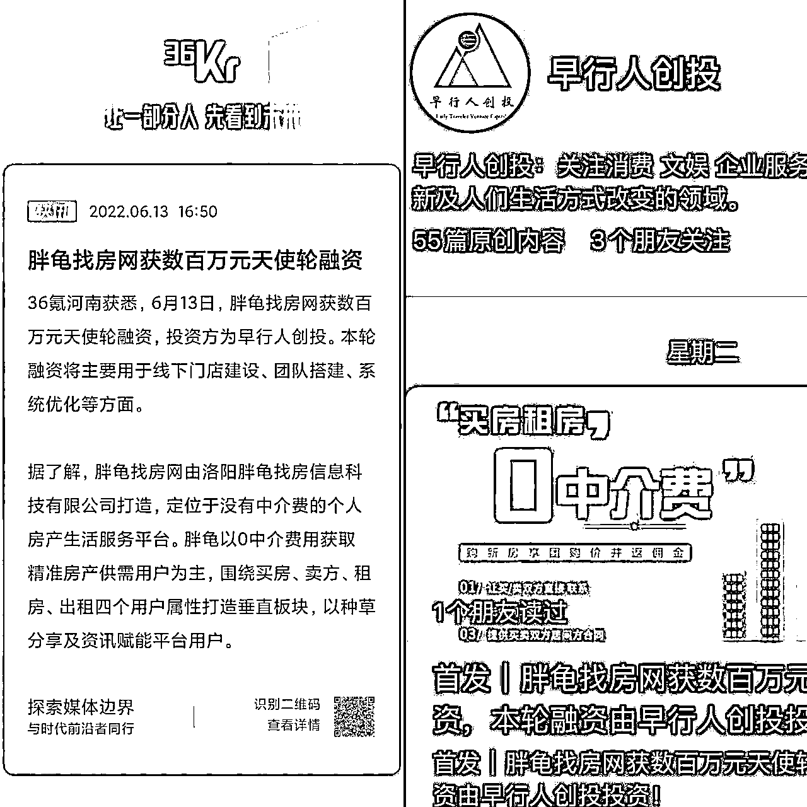

获得了天使投资

### 2、开辟全新的业务增收渠道

我们开辟了全新的业务增收渠道，做到了月入 15w 的小成绩。为了更好的附能加盟商，开辟多元化的业务渠道，巩固品牌的护城河，我们上线了全新的业务板块——“0”中介费租房。

这个业务板块我们从 0 开始摸索，经过了小半年的努力，我们做到了月入 15w 的小成绩。

### 3、拆解一下新业务——“0”中介费租房

“0”中介费租房，大家应该头一次听说。一般我们想找一套好的房子居住，一般会通过中介公司，中介公司会收取我们一个月的房租费用作为中介费。

做“0”中介费租房的初衷，就是因为我们在做“0”中介费卖房的时候，有很多顾客会来咨询我们相关租房业务。我们团队就在思考，既然我们有客户了，我们怎么才能转化？客户不愿意掏中介费，那中介费谁来掏？ 平台？不可能，平台不可能搭着人力成本跟时间成本的。房东？可能么？有可能的。

#### （1）找房东

带着这样的问题，我们就在想怎么让房东们掏这笔中介费用？换位思考，如果我们自己是房东我为什么要通过中介付费而让他们帮助我们招租呢？

可能我的房子空了好久了，需要让资产获得效益；可能我的房子目前房贷比较高，所以要快速把房子租出去；可能我自己本身不是一房东而是二房东，需要快速出手房源，不能空置。

我们推演了很多，也会见了很多房东，最后我们找准了二房东这个渠道。因为二房东手上不单单就一间房子，他需要快速的让自己的房子租出去不能有空置，因为每空置一天， 房租的费用就需要自行来承担。

那二房东又该怎么找呢？

*   58同城上面找房东。

*   美团上有很多公寓型的酒店，过去跟老板谈长租服务。

*   找长租公寓的老板，他们手上有很多公寓等待出租，但是他们的获客渠道过于单一，帮助他们找租客。

各种房东资源

#### （2）找租客

随着现在的自媒体时代丰盈，各种各样的人群都能找到自己喜欢的熟悉的自媒体社交软件，所以也就滋生了很多的商机在其中，当然我们的租客也都在这些平台上，这些软件包括但不限制于我们常用的（抖音，快手，小红书，58，安居客，转转，咸鱼，最右，拼室友，豆瓣，微博，知乎），甚至每个城市还有有关租房的先行者做的本土 APP，比如杭州 19 楼，比如上海芭乐兔等等的一些很优秀的租房平台。

租客怎么找呢？

##### ①抖音，快手，小红书：（PS：操作差不多）

两种方式：

*   一种是自己发帖，带视频或者图片，真实有效的，通过曝光让更多有租房需求的人找到博主去私聊给你转达租房需求。

*   另一种就是自己主动，到各个软件上的这些同行大 V 的帖子下面去发掘有效租客。

PS：打开抖音，搜索 上海租房，找热点回复量最高的几个，点开评论区，找回复 博主：这个多少钱，这个还在吗，徐汇区某某还有房子吗，等等一系列的有租房欲望的人，那就给人私聊，破冰建立联系取得租房需求。

##### ②58，安居客，发布帖子，直接找到拼室友模块，发找室友的帖子

##### ③转转，咸鱼，这些APP比较有意思，在主菜单上直接就有租房的模块，点开租房，找到求租广场，两种方式，一个就是自己发帖，另外就是在求租广场上有一大堆的人在发布自己的租房需求。

##### ④拼室友，这一类的软件，小程序都有直接找室友的模块，很好理解，找到客户需求直接打招呼就好。

##### ⑤豆瓣，微博，知乎，这一类的APP，比如微博，有各地的租房超话，#杭州租房超话#上海租房超话，进入讨论组内，进行发帖，回复，同上操作，只是变成在超话内找，而豆瓣的话有对应的兴趣小组，可以先提升自己的活跃度然后加入小组进行发帖回复。

日常租客聊天

#### （3）配房

由后台人员，根据租户提供的租房需求，按照公司的房源表进行精准匹配房源，每个需求会发对应的 3-5-7 套合适的房子，不满意的接着二配，三配等。每位人员都会有自己相应的客户表，每日要进行总结，每周要进行复盘，了解用户需求，及时清除已经租到房子的用户。

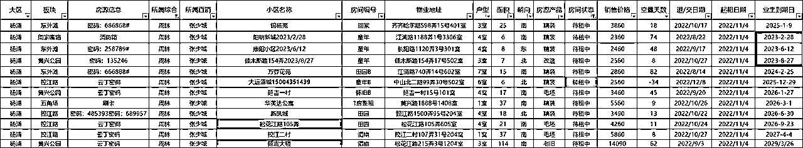

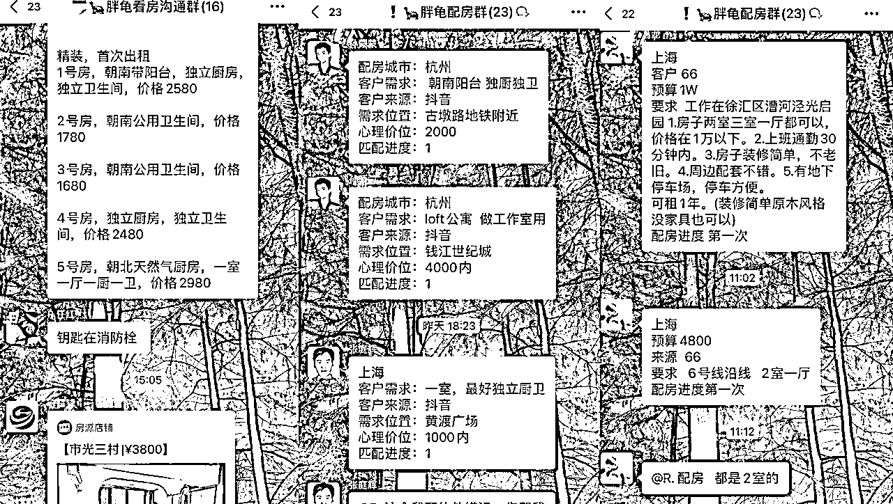

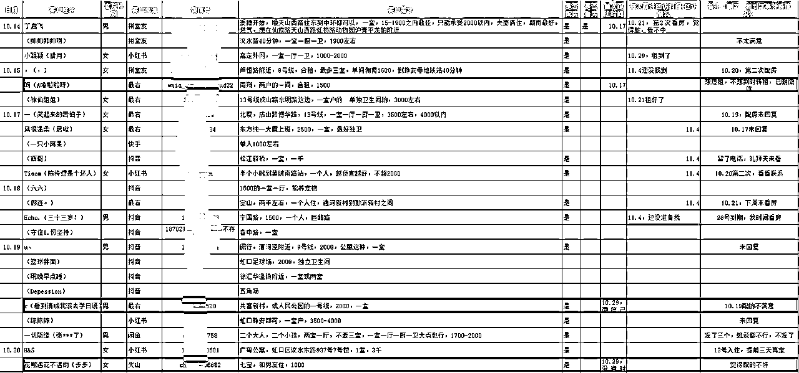

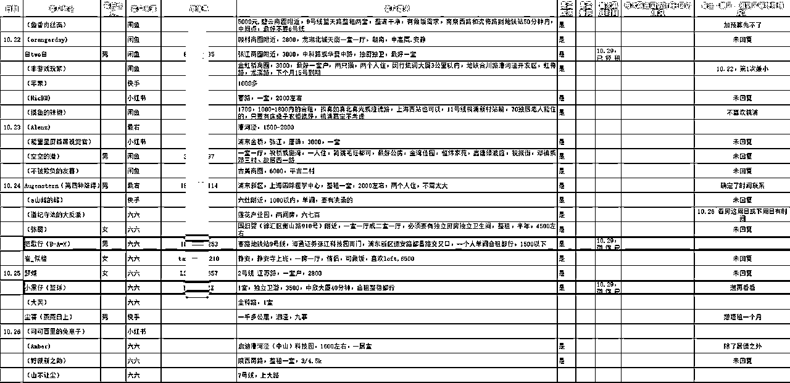

公司内部配房流程

#### （4）看房

客户想看哪个房子，我们会提供这个房子的位置、楼牌号、房间号、密码锁的密码，或者钥匙存放位置。引导客户自己去看房，方便自己，当然我们也有本地的车夫团队可以带看，但一般不用，更多的年轻人喜欢自己看房。

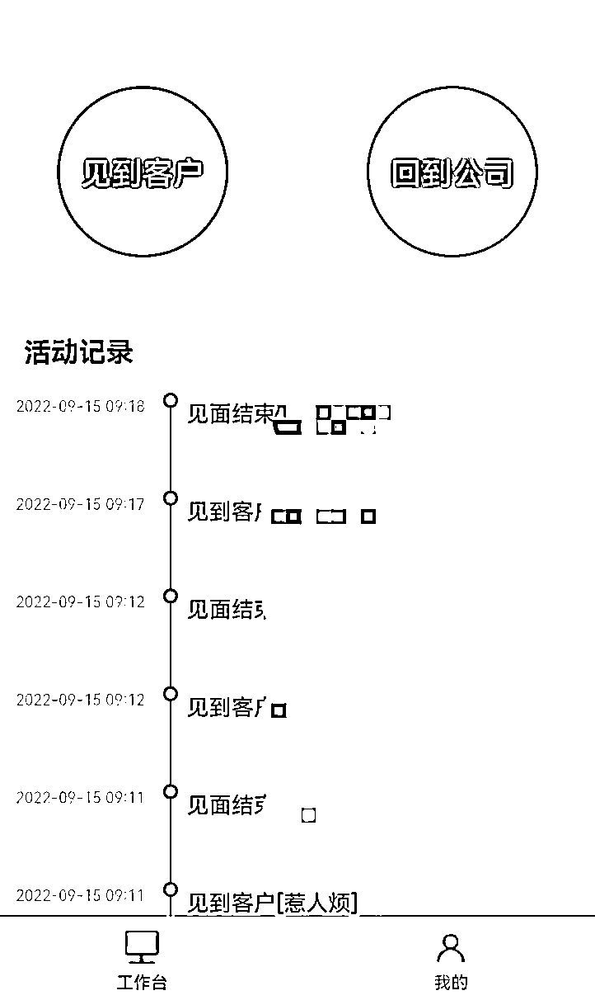

线上带看流程

#### （5）成交

一旦客户看中了，我们会联系房源所属的房东，二房东，管理公司等，在最短的时间内到房间内给客户签署租房合同，当然也有很大一部分都是线上签约。

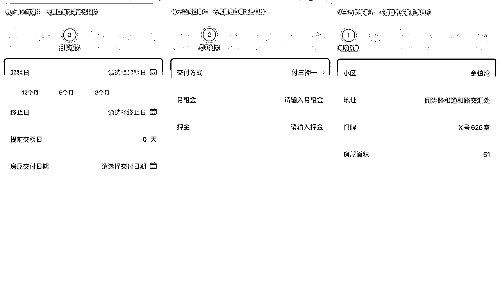

线上签约流程

#### （6）利润

单个房子的租金在我们这个城市大概在 1000-2000，每个基础员工的底薪大概在3000，每月成交两单，就能顾主成本。所以在项目跑通以后我们拓展了客服员工，通过人海战术获取更大的利润。

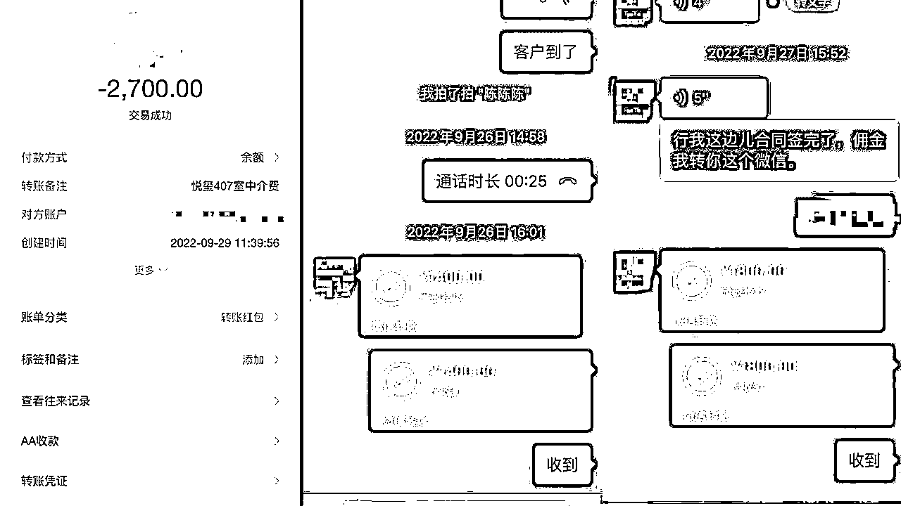

利润

#### （7）裂变

在本地跑通项目以后，我们陷入了瓶颈。因为我们洛阳流动人群过少，房子的转手率与需求量没有那么大，为了把蛋糕做大，我们开通了杭州，上海，深圳等城市。

将上海、杭州、深圳等数十万间合作房源整合到胖龟平台上，房源满足各个阶层租房需求（单间、独卫、宿舍、整租、公寓、1-5 室整租、老洋房、别墅、网红居住小区、短租，长租，月租等）。

那里每年数以万计的毕业生蜂拥而至有庞大的需求市场，存在着各种租赁需求，单个的房子佣金会更高，有高达 1-2w，也有 2000-3000 的总体来说是很不错的。

上海的一些房源

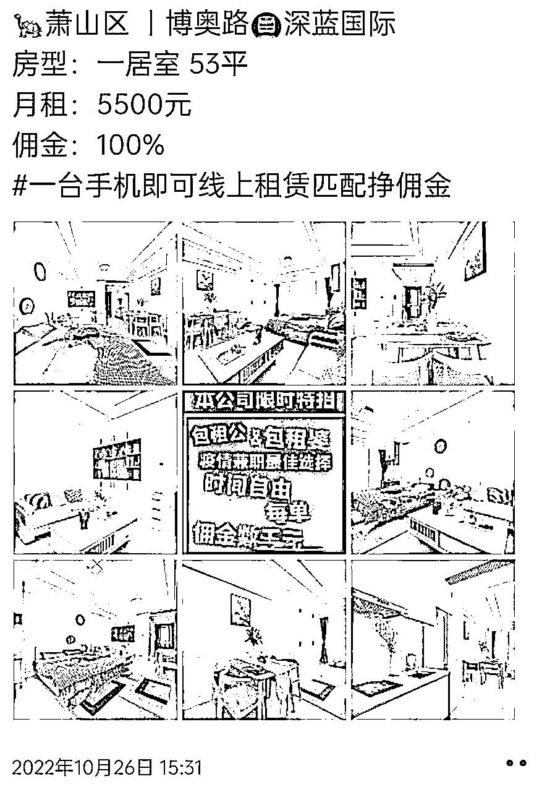

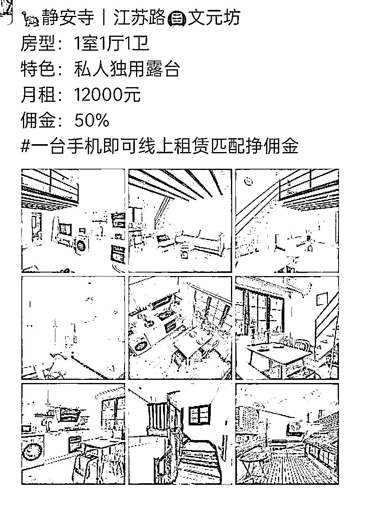

上海房租

在微博指数、微信指数和百度指数上可以查询相对应的搜索指数。

①、微博指数

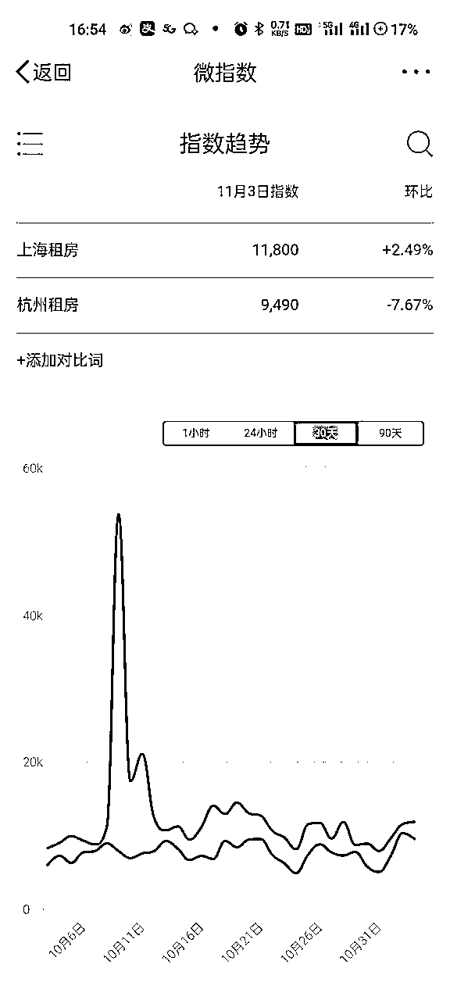

②、微信指数

③、百度指数

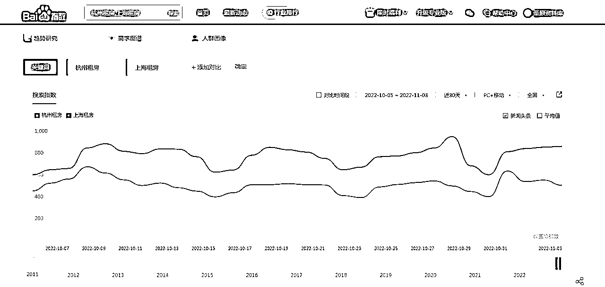

#### （8）扩张

在运作了一段时间后，我们将所有的流程模板化，标准化，我们通过区域合伙人计划——城市管家，快速让合伙人上手。

我们有自己平台，房源库、 配房人员、带看流程、 合伙人只需要维护用户，聊天就行。合伙人可以是单个人，也可以成立一个工作室。

让大家一起在疫情反复的环境下，能通过一个好项目来挣到钱，最低也能多一份无上限的收入。接下来的时间，我们的主要精力会放到租房上，更加精细化的来运作。

当你找到合适的“风口”，all in 进去。

ps：透露一句，杭州的巴乐兔，已经做到B轮了，月销售额达到2000w+

2022 年没有结束，胖龟的蜕变也还没有结束。

创业总是九死一生的，唯独时刻保持清晰的头脑，明白我们在通往成功的道路上遭遇的挫折与苦难是并不可怕的，可怕的是因挫折而产生的负面情绪以及对自我的怀疑。只要我们信念不倒，精神不倒，敢于放手一搏，就有胜利的希望。

因相信，而相见；因坚持，而圆梦。

感谢您的阅读，一起生财有术！