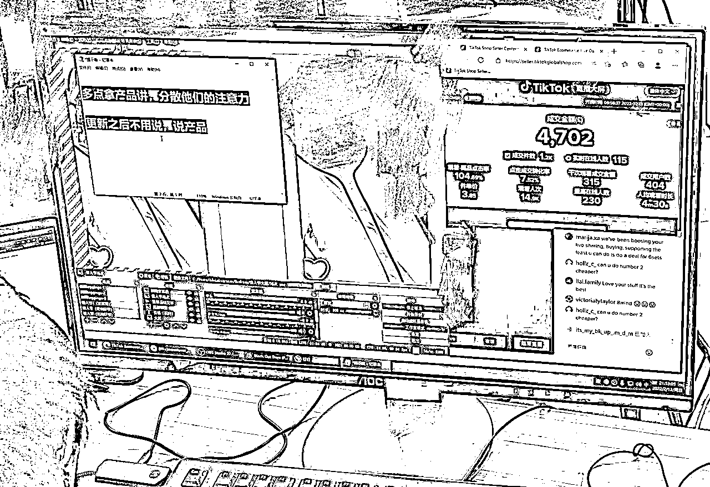
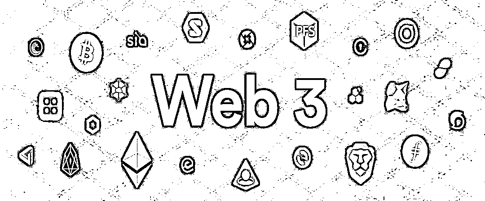
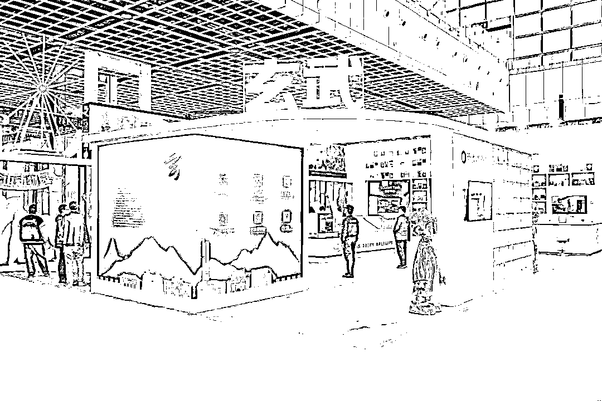
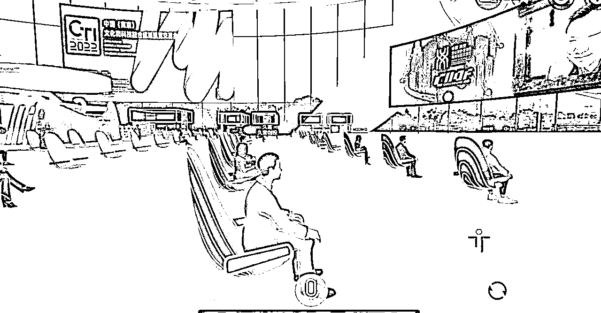
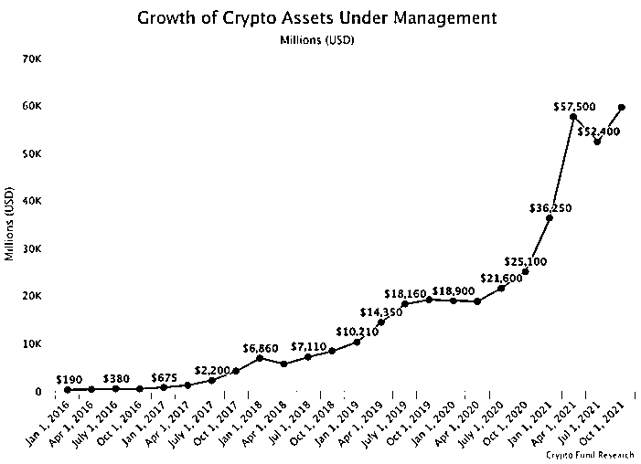

# 传统金融转型Web3，聊聊我的经历

> 来源：[https://otnh7rfhg0.feishu.cn/docx/T1Jad4VhIoPc2hxKJxwcUFPOnTc](https://otnh7rfhg0.feishu.cn/docx/T1Jad4VhIoPc2hxKJxwcUFPOnTc)

各位生财圈友们大家好，我是久富，曾是一名十年金融分析师，2021年转型Web3创业。

第一次在生财上分享内容，请各位多多指教！接下来我会分背景、探索、展望未来三个方面，来聊聊我眼中的Web3。

去年6月，我从十年金融分析师开始转型，正式开启了我的Web3创业。那时候中概股还没完全暴跌，港股也没回到08年金融危机附近，日元汇率更没跌回30年前的水平，而元宇宙概念也还糊不清，NFT更未成为年度热词。

（声明：本次分享涉及到的任何东西，均不构成投资建议。投资有风险，入市需谨慎！）

### 一、 背景

我之前的公司是从事金融、风投以及前沿科技领域的创业，但是2020年疫情开始业务夭折下滑，因为市场的不景气，客户对整个市场流动性并不抱有很大信心，他们宁愿掌握现金流在手上，也不想把真金白银抛入熊市中。

但是也正因为我有金融、科技不同领域的经验，2021年上半年开始，我对市场上的风向标和热度词也特别敏锐，时刻留意研报中各行各业市场的需求性:

#### 1、跨境电商

今年的状况形容，以一个“卷”字来概括，以“Amazon的封店潮”、“Shopee裁员校招生”、“TikTok价格战”为首的迹象表明，已经回不去19年时的辉煌。并不是商家简单的运营就有所收获。经过行业的沉淀，现在更多是精品、品牌的较量。当然也有正向的例子，独角兽SHEIN，以强大的供应链管理受到不少外国人的追捧，未来中国品牌出海会是趋势。

#### 2、VR/AR

今年各大互联网巨头谷歌、腾讯等纷纷巨额研发VR，那为什么VR会火起来？2021年元宇宙概念兴起，VR也相对成为元宇宙的交互入口，能够敲开通向虚拟世界的“门”。而谁能更快的完成技术壁垒，谁就更早掌握Web3的布局。但由于技术层面还在早期，产品重量等难题还未攻破，体验感还不佳。适合对科技感兴趣的各位，结合近年来元宇宙的爆火，不管是VR还是AR(虚拟人、数字人)将会迎来一个爆发期。

#### 3、新能源

今年新能源汽车也出圈了，特斯拉创始人马斯克身价冲向了全球首富，国产品牌蔚来汽车、小鹏也纷纷在纽交所上市。随着生活中新能源越来越普及以及国家政策的偏向，新能源市场都是利好的。也将是未来的一个大趋势，对于技术出身的各位，可以抓住这波红利。

#### 4、Web3

什么是Web3? 是一种基于区块链技术的互联网生态，并且还能实现与现实世界交互的虚拟世界。随着2021年元宇宙、NFT、DiFi等市场热度词的火爆，国内外都掀起了一阵元宇宙热潮。近期马斯克拿下推特营造Web3社区，Meta等各科技巨头布局元宇宙，都可以表明现实与虚拟之间的交互将会成为一种大趋势，同时会制造出更多的就业岗位。

### 二、探索

由于这两年公司的传统金融业务下滑和市场的不景气，公司团队不得不开辟新的赛道，不然只能面临被清算。而在探索Web3时，似乎给我带来了曙光。

2020年货币宽松政策之后，一级市场因为流动性的缺失导致好的项目难以出现，而集资难、烧钱快也困扰着企业的运作。

二级市场的情况更是无法直视，2022年3月加息之后，不管是在大厂拿着期权还是其他中概股的朋友，如今的估值已蒸发了8成，而企业也不得不采取优化和节流的方式渡过“寒冬”。就拿今年秋招来说，怎一个“卷”字了得。

#### 1、尝试跨境电商TIKTOK（GB站）

同时，之前我也尝试过一些势头较火的项目——跨境电商TIKTOK（GB站）。

当TIKTOK直播功能出来时，很多风险投资人VC觉得可以把国内直播玩法搬到欧美市场，可却忽略掉了语言环境、人工高、同行价格内卷等不稳定性因素，导致烧钱快、单价低，盈亏比无法维持。虽然说如今的TK战略布局转移到东南亚站，但我还是保持观望的态度。

#### 2、转战Web3

2020年后因为传统金融的低迷，大量客户流失，公司也不得不寻求新的赛道。因为在早期15年我就了解过Crypto，开始只是关注区块链技术的知识，那时Web3的概念还未成型，而我也一直认为早期存在着一定的泡沫性。

直到我的一个分析师老友跟我讲起了去中心化金融DeFi，对于本身是金融背景的我来说是高度相关的。而且每个季度市场研报，Web3、元宇宙、NFT这些热词也频繁的出现，我不得不重新定义对Web3的理解和产生浓厚的兴趣。

跟两个公司的合伙人说了下我的想法，自己另外去开辟Web3的赛道。然后我用金融圈的资源找到了一些国内Web3的初创团队，以一个初学者的身份参与进去。

因为只有自己参与项目，才能快速的摸透行业的可行性。平时也会积极的参加一些Web3的线下或线上分享会，结识到不少行业VC。了解到很多企业已经开始Web3领域的尝试，国内的基础环境也在逐步完善。

不过市场在收缩的状态，更多企业在探索如何能把NFT和营销、社交以及众创经济结合在一起。各大厂也都开始推出自己平台的NFT和线下结合，而这也符合国内所说的以虚促实的经济趋势。也让我坚信Web行业是未来的趋势。

### 三、展望未来

在这两年的影响下我们的公司也不得不转型Web3创业。虽然依靠以往的金融背景很快拿到Web3项目的启动资金，但是面临着不可避免的难题，我们公司的Web3战略赛道和团队架构该怎么定下来。

有句老话，选择比努力更重要。在看赛道之前，在于你前期资金规模有多大，再决定要关注什么赛道。虽然我在传统金融也经历过了两轮牛熊，但是没有人敢说自己的选择是完全正确，只是用前沿的眼光去搏概率的发生。

#### 1、资本跑步入场，行业资金池大大加深

“钱很多但好项目少，好项目又不缺钱”，这是目前Web3行业的融资现状。

Web3市场在10年内创造了3万亿美元的流动价值，已足以与传统投资基金投资的初创公司的总价值相媲美。大量专精于Web3的基金在数量和增长上都创下纪录。

其中一些基金（比如Multicoin）在这个领域弯道超车，超过了很多传奇基金，成为了有史以来表现最好的投资公司之一，这使得基金们可以毫无压力的获取大量的现金。（下面如图某机构数据）

早年间，DCG在2015年募资2500万美元，还是当时Web3行业中最大的募资之一。如今，市场的私募基金规模已经很恐怖了。Polychain、Paradigm、a16z、Multicoin、3AC以及一些其他专精的公司各自管理着数十亿或数百亿美元的资金。

而红杉、软银、Coatue、老虎、光速等老牌PE和风投也早已进场布局。全球大量对冲基金正计划5年内将其资产的7%投入到web3的市场中，巨无霸养老基金也开始酝酿直投了。无论是新兴资本还是老牌大鳄们，正在持续提高着他们的资产配置效率。这是值得让我们关注的，谁都没法忽视Web3的市场。

#### 2、凛冬将至，如何在熊市活下去

如果前面我的内容让你觉得Web3有多么天花乱坠，那么下面的内容就会瞬间把你拉回现实。因为凡是有“利”与“弊”，Web3市场也不例外。

熊在任何市场里都不可能灭绝，在2022年初整个行业就又开始在全球的加息周期和战火中过冬了。但是可以看到，整个市场在经历过14年和18年的两波过山车熊市，以及2021年直飞冲天的牛市后，市场心态已经远比当年成熟。

大家对利好和利空的回应也不再歇斯底里。大量资金的进场、流动性池的加深，很好得平抑了涨跌曲线，使其变得不再那么骇人心魄。

不过市场还是经历了超过40%的持续暴跌。（被称为“超级蓝筹”的eth在年初12月24日到1月24日的一个月内，跌去了超过46%的市值）我想，任何刚进入这个行业的新人看到这组数字都会心惊肉跳。

然而再看看老鸟们，基本该干啥干啥。因为这和他们所经历过的那种熊市相比，简直就是小菜一碟了。“现在的市场已经很体贴人了，当初一周跌掉80-90%的案例比比皆是。”那些老鸟会笑着和你说。

除了巨大的纸面或实际损失外，你还会看到那些借了债或者用了杠杆的人真的破产了、崩溃了。他们会放弃其他有前景的项目，完全失去对Web3市场的长期预期。这个市场走了一波又一波的人，有人痛骂诅咒，但也有人满怀期待，踏着前人的身体进场，相信他们将不会再犯前人的错，他们将会是在熊市底部进场，伴随着牛市冲天的“幸运儿”。

但是，真的就这么简单如你所愿么？市场如同浩瀚的汪洋，它的温柔和残暴你永远无法预料，更无法掌控。真正活下来能够完成远航的老鸟，都懂一句话：“敬畏它，并且与它共舞”。

而如果你们是一个初次接触并投身于Web3市场的年轻团队领袖，请尽你所能保护你们的团队和成员不受市场崩塌的连锁反应影响，特别是近期FTX事件导致的连环暴雷。而很多团队都在滥用他们的弹药装模做样，而核心工作做得一塌糊涂。

在此温馨提示各位从事Web3的小伙伴：“不要浪费弹药”。如果你是一个有抱负的Web3公司的员工，在签约之前，记得去问招聘人员他们公司的赛道情况以及现金情况。在一个拥有大量资金弹药的“基建公司”工作绝对不是个坏的选择，这在熊市会是更好的选择。

如果你能熬过漫漫长夜，活到太阳升起，那你必将能收获你想要的未来！

### 四、最后

现在的Web3.0风险投资VC不像传统金融的VC,更加偏向于钱+孵化+资源对接一整套的价值系统。

熊市中，我的公司前期在Web3领域即是VC也是项目方，从金融的角度来说，要给自己一定的容错率，如果在早期仅仅是ALL IN在一个方向，风险并不是特别好控制。最后如果各位需要Web3.0资源对接或者相关工作岗位的朋友,欢迎过来找我交流！

由于篇幅限制今天先聊到这里，以后我会不定期在生财，分享更多Web3.0相关的资讯和干货，也希望各位想了解Web3的朋友跟我沟通交流、相互学习。谢谢观看，我们下期再见！