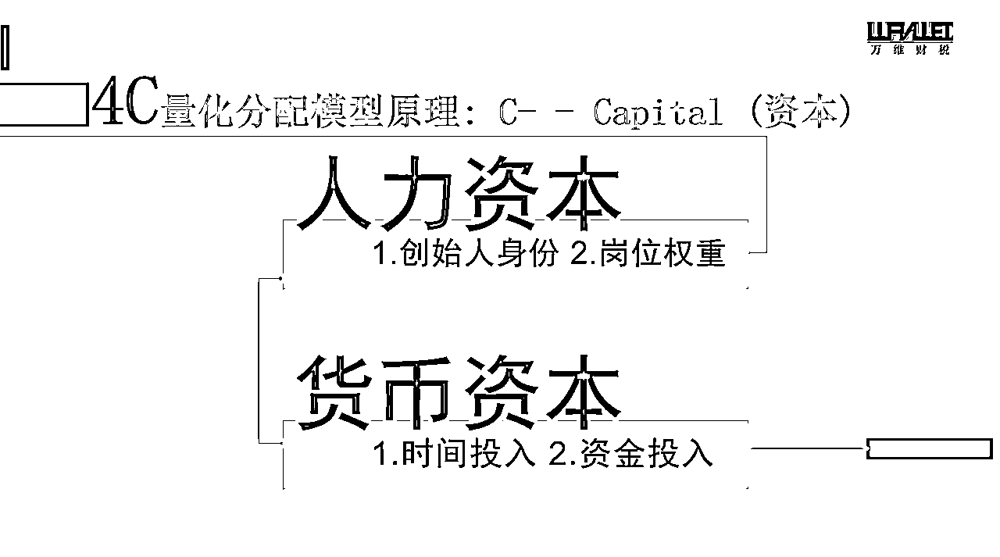
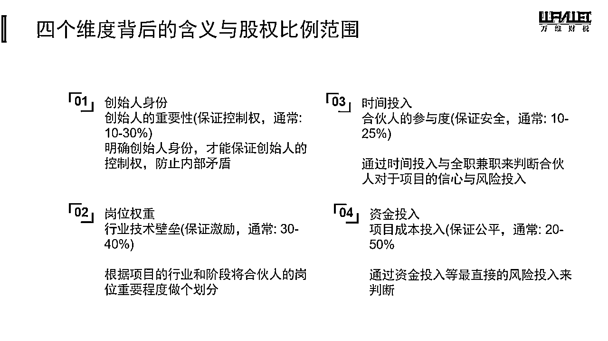
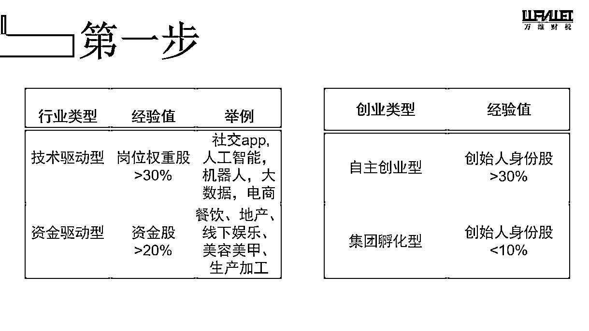
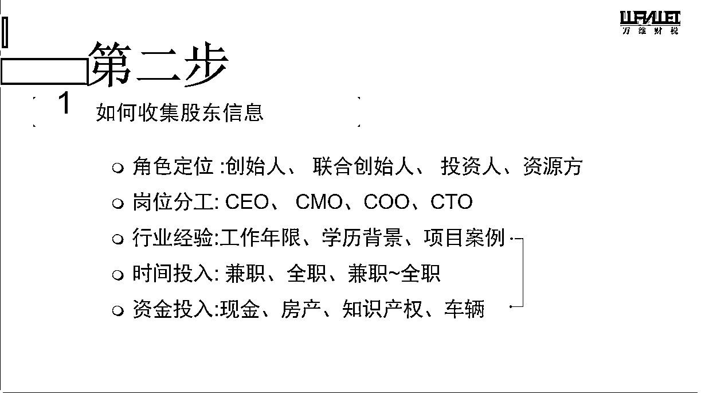
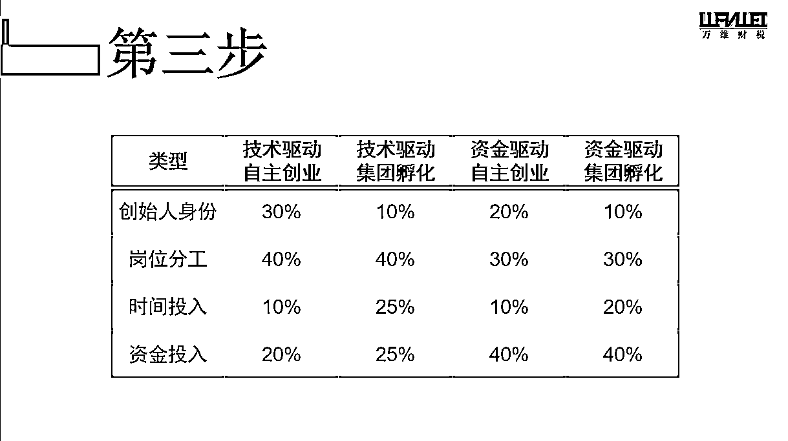
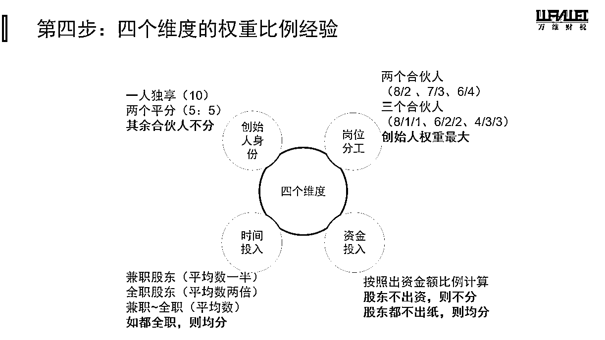
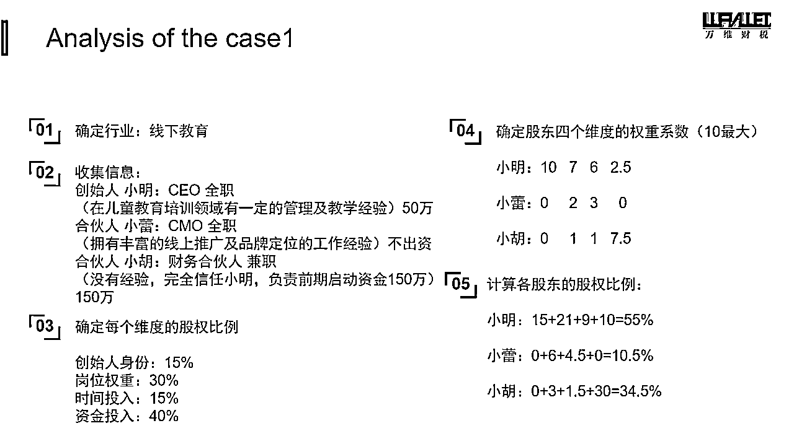

# 初创公司如何科学量化股权分配？股权分配五步法教你不再踩坑！！！

> 来源：[https://ozqj66fvp1.feishu.cn/docx/C0dydiFPCoBI3LxemwWcXpdxn2e](https://ozqj66fvp1.feishu.cn/docx/C0dydiFPCoBI3LxemwWcXpdxn2e)

#### 

哈喽大家好，我是玉斌，在分享之前，我特地去生财精华帖里搜了下，讲股权的很多，但是在如何科学量化股权分配上，我还没有看到有圈友系统的分享过，所以今天我冒昧来给大家分享下如何定性定量的科学的把股权算出来。

生财圈友大多是创业者，很多圈友的企业已经做得非常大，不知道大家在刚创业并且有合伙人的情况下，是用什么方法去做的股权分配呢？比如说是按股东各自的出资比例，还是有一定的方法论？

先抛2个比较普遍的案例问题给大家。

一：假设你准备做一个全国连锁的快餐品牌，其中有一些合伙人需要负责市场运营，有些合伙人有配方，有些合伙人只出钱，如果你是 CEO 你要怎么协调，怎么去分配这个股权？按出资比例分配吗？

二：如果你的团队有四个合伙人，这四个合伙人分别是负责市场的，负责运营的，负责产品的，负责融资的，每个人的能力背景都不一样。你作为创始人，你要怎么平衡好每个合伙人的股权情况？大家激情澎湃的准备一起来搞一个事情，但是每个人负责的板块并不一样，这时候我们要怎么去分配这个股权呢？

对以上2个案例，如果你只是拍脑袋凭感觉决策，就要认真往下看啦~

# 一.4C 动态量化股权分配模型是什么？

今天给大家提供一个工具，这个工具的名称叫 4C 动态量化股权分配模型。实际上我们做股权设计的时候，它会涉及到很多工具，甚至有可能不同的项目，它用到的工具是不一样的。今天和大家分享的4C 动态量化股权分配模型特别适合小白，特别适合一些刚刚开始的初创型的项目，他会给大家非常明确的参考的指引。

先和大家分享下，4C 动态量化股权分配模型中的4C，是什么意思。

4C中的C，就是资本的意思，资本我们分为人力资本和货币资本。再细分成4个维度的话，就是创始人身份、岗位权重、时间投入、资金投入。这四个维度是这个工具里面已经给大家植入的一个参数，这个参数是在一定的范围内波动的。

下图是股权比例范围，我等下会给大家案例，不同的赛道，他的参数比例是完全不同的。

首先，我们要达成以下几个共识：

1.创始人身份它其实是最重要的，我认为谁承担最大的风险，谁就最有控制整个企业的需要。这就是创始人身份的这个比例权重的来源。如果我这个项目黄了，他可能还欠了一些债，他可能还涉及到一些员工工资要发放，谁来最后承担这个兜底的人，那么我会认为这个人他就是发起人和创始人。创始人的身份是要极度明确的，从一开始就要很明确，它是要能控制这个项目的，一家公司最后对外的时候，应该只有一个声音。创始人身份的权重通常在10%-30%。

2.岗位权重，就是这个行业技术壁垒在哪里，那个岗位是最重要的。这个项目里面哪个岗位对这个项目的重要性最高，合伙人一定要对这个达成共识。比如说一个负责产品研发的和一个负责市场的，他们都认为各自的岗位权重在这个项目里面是更为重要的，那这里就会产生一个巨大的分歧。这个分歧在我们前期做股权设计的时候，大家可能不容易发现，但是在公司发展壮大的过程中，越到后面越会产生一些隐患。因为大家从一开始对自己的重要程度的判断就是不一致的，大多数合作伙伴拆伙，就是觉得自己最重要，出力最多，但是分到的钱又不是最多。所以在前期就要聊清楚，公司还没有开始发展的时候，也是最为好聊的时候，因为还没有赚钱，就不会那么计较。岗位权重通常在30%-40%。

3.时间的投入，最简单的划分就是全职还是兼职，投入精力的大小等。时间投入的权重通常在10%-25%。

4.资金的投入。这个比较好理解，所有的项目都会有一个前期资金的投入。比如说我们可能要设立公司，我们要租办公场地等。我们可以通过时间投入和资金投入去判断这个合伙人他对项目的信心和他愿意承担多大的风险。资金投入的权重通常在20%-50%。

需要和大家再解释下，这4个维度的比例并不是固定的，上文给到大家的比例，是成百上千个案例积累下来的一个经验，在实操过程中，最终还是要创始团队一起来做一个锚定，达成共识。在权重比例产生分歧的时候，我们会有一个自评和互评，篇幅有限，就不在这边写了，在下文会给大家一些各个赛道的通用权重比例。

# 二：股权分配五步法

在确认四个维度的权重比例后，我们会按照五步法来计算出各个股东的最终股权比例，下面带大家一起过一个真实案例。

案例分享：有三个朋友合伙，他们准备一起做一个儿童体能训练的项目，这个项目的预期启动资金是 200 万。他们看上了一个购物中心的一个 300 平的商铺，准备先开一个旗舰店。合伙人的背景是这样子的，合伙人一：小明，之前加盟过一个幼儿游泳馆的品牌，他对儿童教育培训是有一定经验的。合伙人二：小磊，他之前一直在大众点评做运营推广，对实体店的品牌包装和运营有经验。合伙人三：小胡，现在在国企上班，家里拆迁户特别有经济实力，他愿意投资 150 万。这个模型比较经典，有人能负责产品，有人有市场渠道资源，还有人能出钱。

现在小明和小磊是准备全职投入这个项目的，但是小胡在国企上班，不差钱，不能全职参与，但他特别看好小明的能力，所以他愿意投资。那小明作为发起人，前期是准备出资 50 万，但是小磊不太愿意出钱了，他就觉得市场为王，能搞定市场，他就不需要出钱了。

那么问题来了，如果你是 CEO ，你认为小明应该占多少股？小磊应该占多少股？然后小胡应该占多少股？

先把答案分享给大家，同时带大家走一遍股权分配五步法流程。

## 第一个步骤：确定行业和赛道

我们要先确定赛道，也就是你所处的行业，不同的赛道，对资金和技术的权重不一样。我们把行业分成2个维度四个类型，分别是技术驱动型/资金驱动型，以及自主创业型/集团孵化型，我们这个案例里面的行业，它就是一个线下教育的项目，是自主创业型，它对标的是集团孵化型，就是后面没有人在支持你。线下教育它对场地有非常重的依赖，所以它是偏向资金驱动，它是靠商业模式和资金驱动来发展壮大，而不是靠某一个技术壁垒。所以我们在这个项目里面，就会把它定位成资金驱动型和自主创业型。

## 第二个步骤：收集创始团队信息

我们要开始收集合伙人的信息，也就是创始人的信息和其他联合创始人的信息。以及这个项目里面谁是全职，谁负责哪个岗位，各自出资额度等。

## 第三个步骤：确定每个维度的权重比例

这是 4C 动态量化股权分配模型里最大的问题，对四个维度的比例分配，再次强调下，相信很多人到这边还是有疑问，不理解为什么这4个维度要按照这个比例去分配，比如说在这个项目里为什么创始人的身份是15%，岗位权重是30%，时间投入是15%，资金投入是40%，这个是谁定的，是怎么来的？这涉及到刚刚说的另一个工具，创始团队之间的自评和互评，从而达成一个共识，股东们要先认可这个赛道的这4个维度就是在这样的一个区间波动微调。这是 4C 工具的一个前置逻辑，非常非常重要。

## 第四个步骤：确定股东四个维度的权重系数

我们确定了每个维度的权重比例之后，就要确定股东四个维度的权重系数，按从 1 到 10 各自去打分，就是每一个维度每一个人、每一个合伙人他要打多少分，这里也是分自评和他评。

这个案子里是怎么评的呢，我们先看第一个维度，创始人身份，实际上创始人这个身份它并不完全代表着荣耀，在我看来，它其实代表着风险承担，就谁最后在兜底。当这个项目不成立或这个项目遇到了极大的风险，谁愿意无条件的去为这个项目兜底，那这个人就是创始人，他对这个项目的付出程度是跟其他的合伙人完全不一样。所以在这个项目里面，很显然发起人是小明，全身心投入，并且也愿意出钱，也为了这个项目去找各种各样的资源。所以在这个维度，小明拿了10分。

资金投入维度，这个比较简单，小胡出 150 万，小明出 50 万，按照投入资金比例划分即可。创始人维度和资金投入维度这两个是不容易有分歧的。特别容易产生分歧的是在岗位分工和时间投入上，借着这个案例，给大家做一个简单的分析。

先讲时间投入，时间投入我们衡量的标准是全职和兼职，但是大家有没有想过，就是其实有 60% 左右的项目，所有的合伙人除了纯财务投资人之外，其实都是全职参与的。只是说你全职参与的这个产出它是不是就能匹配的到这个项目的所有的进展，项目到达的里程碑是不是跟你全职参与有必然关系。所以我们前期在做股权设计的时候，就一定要讲清楚，这个时间投入，它对应的除了是我们投入的时间精力，还有我们愿意引进的资源，愿意为了这个项目付出多少，不单单只是一个全职兼职。

实际上在这个项目里面，小明他是负责主要的商业模式设计，然后做一些产品的迭代。小磊他主要是负责这个项目的包装和怎么做线下门店的运营，负责门店的市场渠道营销。

那我们在做股权设计的时候，前期是要跟这三个创始人去做沟通，要跑通这个商业模式，我们需要设置一些里程碑，比如达到盈亏平衡点之类的。在这些里程碑里面，那么哪个岗位它的权重是最重的，或者说它们各自应该是一个什么样的比例？大家通过自评和互评，最终得出来岗位权重是 7 ：2 ：1。

那么小胡为什么在里面还占有一个比例1呢？因为在这个项目里面，他其实是一个金主，小胡他不仅解决了第一期投入，他还可以解决后面再引进新的投资人的这种资源对接。可以理解成是一个负责融资的岗位，大家能理解吗？

然后小磊他是负责市场开拓的人，而小明他是负责整个商业模式的设计和去落实。所以这个岗位分工在这个项目里面，我们最终通过自评和互评得出来这个平均值最终就是 7 ： 2 ：1，然后时间投入是 6 ： 3 ：1。

## 第五个步骤：计算出各个股东的股权比例。

最后比例就是最早发给大家的图：

# 三：总结

在最后不得不提醒大家的是，这个股权比例分配是最最简单的一个环节，并不是说，按这个比例算出来的，就是最终体现在工商商事主体上的最后结果。在算完初步的股权分配后，我们还会有其他一系列的合同规范和调整，比如一致行动权，期权池，分红奖励，回购权，纯资金方投资的优先清算权，领售权，等等等等。

如果有需要相关的股权合同模板，可以随时找我要~VX：18030219049