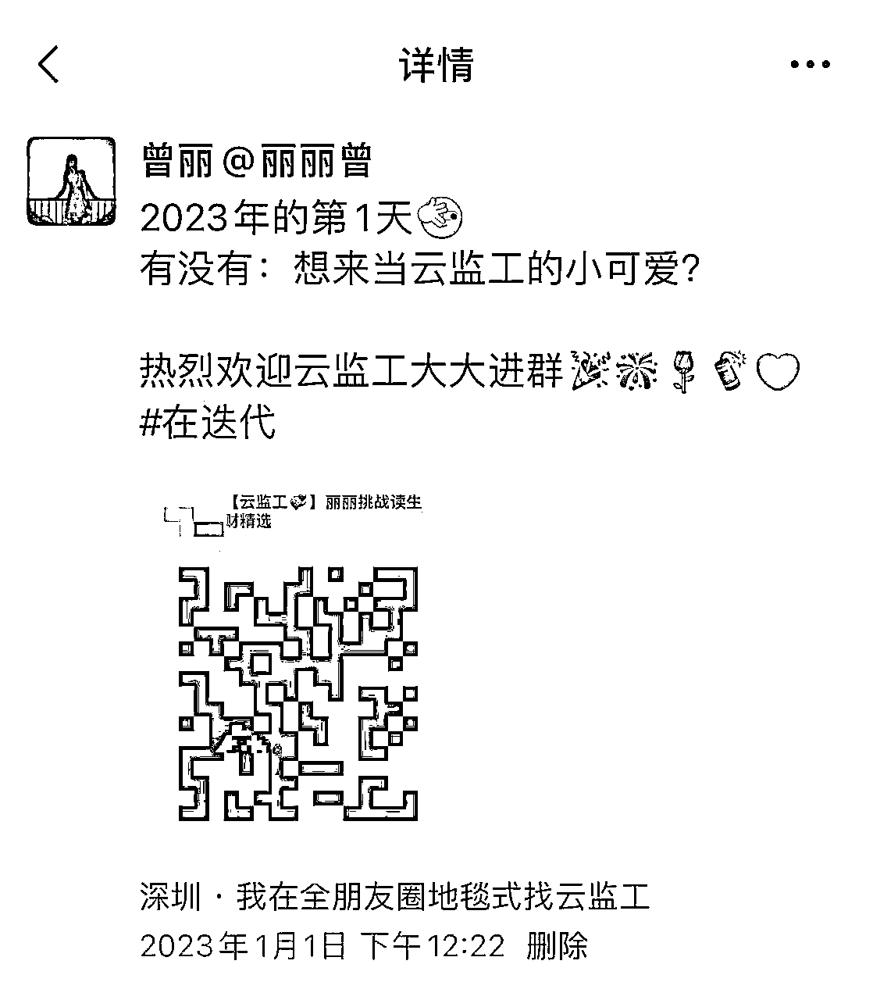
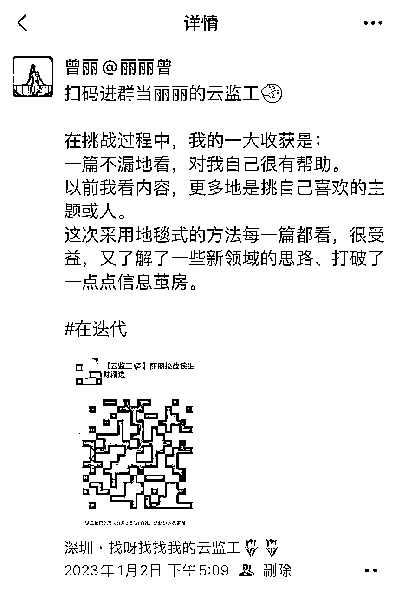
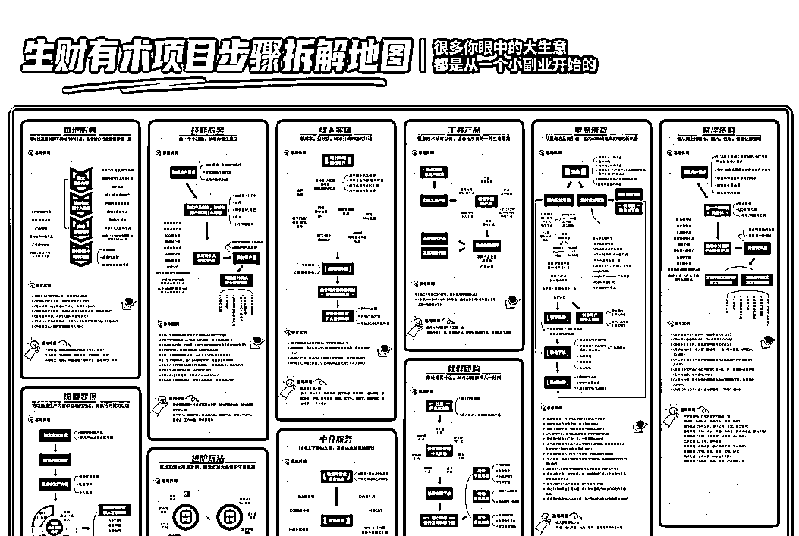
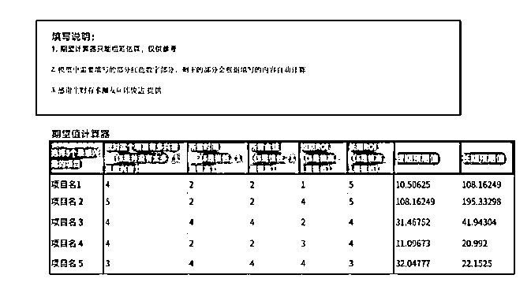
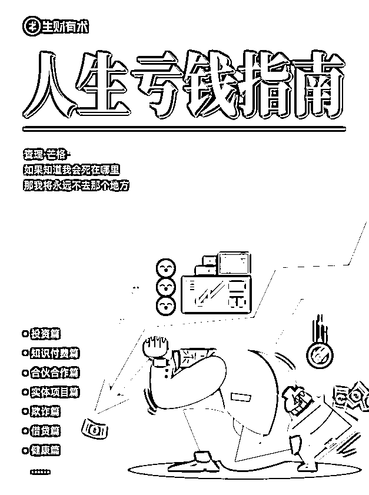
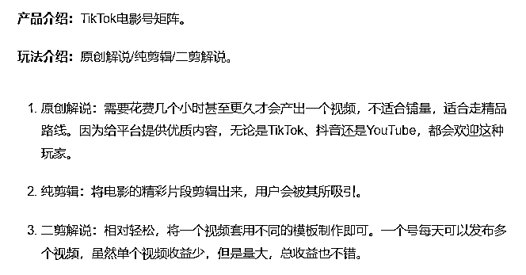
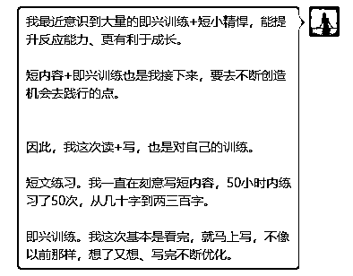

# 【已发部分】普通人可复制的云监工玩法，挑战3天读50篇生财小报童项目精选+写5000多字心得

> 来源：[https://q0hc3k7yqz.feishu.cn/docx/ELHqdhiI5oSQAxxItLJctNAhnah](https://q0hc3k7yqz.feishu.cn/docx/ELHqdhiI5oSQAxxItLJctNAhnah)

2022年12月31日大家都在忙着跨年，我却在想：希望趁3天元旦小长假把《生财有术项目精选》已发布的50篇看完+练习快速输出短文的能力。但下一秒就想到自己一个人做、不如一群人玩+学，同时希望能尽可能完成50篇的小目标，所以就以快闪群的方式招募云监工来监督我的进度。

希望我复盘的这个云监工快闪群玩法，能：

帮助更多圈友高效地跑MVP；

让群变得更好玩，云监工还可以成为社群角色、监督促进复盘文化等；

让云监工们感知、陪伴到群主的成长；

让云监工们加强对群主了解、记忆。

在我花2天多时间，招募102位云监工并完成挑战后，这验证了我此前的想法：云监工玩法特别适合普通人，它简单好操作+可低成本快速进行测试，它的运营模式对群主的要求并没有陪伴群那么高。

### 一、云监工招募筹备

#### 招募文案

招募文案格式基本是正文放招云监工信息，评论区放具体规则。

部分朋友圈正文截图：

#### 具体规则

以前我见过一些目标挑战群，规则一般只是挑战失败后瓜分1000元或XXXX元。

这是不太健康的，这会把群主、群友的利益对立起来。

所以我的规则中设置的是如果我挑战成功了，大家能获得更多。另外规则中挑战失败瓜分的金额设置得很低，这能筛选掉只是被红包吸引的人。

写在朋友圈的详细规则如下：

挑战内容：3天阅读50篇优质的《生财有术项目精选》，并且写完5000字以上学习心得（即每篇100字左右）。

【如果我挑战成功】送你：

️①5000字以上我的学习心得；

️②2023年7折买丽丽的任意产品；

️③随机抽10位小伙伴送新年盲盒，新年盲盒包括：XXX、XXX等随机一样。

（实际过程中也发了些红包，预计200左右吧，具体金额忘记了）

【如果我挑战失败】那么：

️群内人瓜分200元失败基金🧧。

我阅读的内容，是这个xxxx（+生财小报童链接）。

#### 招募方式

发朋友圈。

### 二、阅读前的准备

#### 打开专栏了解概况

《生财有术项目精选》

#### 阅读如何更好地使用

了解显性价值

知道有项目外的隐藏价值

阅读建议：领取10张项目拆解图、缩小项目范围从一类开始看（领取期望值计算器）、列出具体的行动计划

了解领取近10万字的《人生亏钱指南》

了解目录

#### 了解购买付费专栏后，可领取的福利

上述破万读者福利对更好地使用专栏，非常有帮助。我是元旦小长假期间逐类阅读完50篇专栏。第一步是了解专栏后，私聊鱼丸啊哈哈哈。

### 三、产出的心得内容：3天读50篇生财精选+写5000字以上心得

心得在群内的发布格式是标题+链接+话题#丽丽心得+我写的内容。

这样的格式有利于云监工们、我，进行后续搜索阅读。

有时为了便于大家快速理解+规避全是文字的枯燥，我还会在群内配上1张项目简介的截图。如果群里都是买了生财小报童的可以截图完整项目，如果群里有没购买的只建议截图示意一下。

#### 01 社群团购：你经常买什么，就可以拉群找人一起拼

#丽丽心得

举一反三是做项目要练习的基本功。

看完教育人做水果团购后，我首先想到我在生财知识星球发过的这篇文章《才391个小红书粉丝，但引流私域432人成交308单的复盘》https://t.zsxq.com/09aQpKLAT，两者在一些方面逻辑是一致的，之后这类项目都可以借鉴经验；我的另外一个想法是这种拆解项目的思路，也很值得练习。

它一方面是浓缩的精华，能帮助我们快速获取有效信息、节省时间（真是绝绝子），另一方面又帮我们以这个项目为点发散到同类项目、跨类项目（66个666啊哈哈）。

#丽丽心得

用心地精细化对铁粉，获得复利。

一年卖货120W需要运营多少位用户？泳怡的答案是800位。项目逻辑是先广撒网，从各种精准的宝妈流量池积累40位种子用户，在精细化运营前期用户获取信任后，筛选其中的铁粉进行转介绍、转卖，最终实现总购买次数16000+次。

让人惊讶的高粘性社群，离不开用心、执行力。

#丽丽心得

带货更多的是“货的竞争”。

未来随着线上带货的发展，在绝大部分情况下，带货最核心的是货，货是1，运营技巧、人设、平台等都是后面的0。带货竞争的本质是优质供应商资源、商品稀缺性。

好货能找到更好的渠道、带货人等资源。

#### 02 整理资料：会从网上找教程、图片、线报，也能让你变现

#丽丽心得

整理行业资料是一个脏活累活出奇迹的典型代表，有不少垂类社群都是这样发家的，靠整理资料积累首批种子用户后，卖社群、卖单份资料、提升影响力、获得更多合作机会等。

太阳底下没有新鲜事，真正原创的内容很少。同时要注意版权风险，整理资料时注意原资料是否愿意被转载（针对高频资料来源，甚至可以主动去询问是否可授权转载，有些渠道的内容，是很乐意被转载被分发的）、转载最好备注出处（利他是最好的利己）。

#丽丽心得

卖资料是适合新人入门的赚钱项目之一，路径是：做资料包——引流——售卖——领取资料。

很多涉及到考试、整理成本大的内容，都可以售卖资料。但要注意版权风险。

#丽丽心得

通过自动发货能释放人力，做好虚拟电商要有选品敏感度。整体来说虚拟电商入门门槛不高，竞争比较大（蓝海选品除外）。

#丽丽心得

我在十几年前就看到头像表情包生意，这是一个有长期需求、入门门槛低的项目。这个项目的重点在于如何更高效获取流量、变现，再怎么极致地扣细节、扣转化也不过分。

做泛用户和有精准需求的用户是2个思路。精准用户进私域后，转化率比泛用户高。但只要泛用户足够多、SOP化，大力也能出奇迹。

为了在私域卖货或做转化，引流的钩子不一定必须就是出售的产品，只要能引流到产品目标人群的钩子，就是好钩子。相比大众喜闻乐见的内容，特定产品作为钩子时，在公域爆的可能性更小。虽然用泛内容引流的用户没那么精准，但如果用户不进私域，那在私域带货成功的概率为0。

#丽丽心得

某类人的痛点，就是创造价值的机会。

你是业内人，你是很懂你行业痛点的人。

你所在垂直行业从业者的3个痛点是什么？写下来，去想办法满足需求并且团结盟友规模化解决痛点后，赚钱是自然而然的事。

#丽丽心得

哪怕90后已经很少用QQ了，但QQ还是很好的流量入口、转化工具。切入一个细分领域引流，付费社群、淘客群等都是变现方式。

#丽丽心得

社群的发展会像互联网产品那样，从纯免费模式，向付费+免费社群并行的模式转变。

万事万物皆可通过付费群变现。

不论是付费10万还是付费1元的群，健康的、可持续发展模式是群能给用户带来价值。

#### 03 技能服务：会一个小技能，就够你做生意了

分享 生财有术 2022/12/21 14894 53 生财有术项目精选 66个赚到钱的人，分享他们已经跑通的项 目（连载中，已更新50篇，共66篇）。 【重要】添加服务官鱼丸微信 (yuwan750)，领取配套的10张项目步骤拆 解图 【阅读建议】先看拆解图，定位自己擅长 的领域，便于找到更适合自己的项目。 更多权益和规则，请看置顶帖。 读者 内容

#丽丽心得

把自己擅长的小技能放大，也有无限可能。

怎么找到自己擅长的技能？

你喜欢做的、你被人夸的、没有正反馈你也很愿意去做的，这些都是你擅长的技能。

比如我是营销出身的运营，但多年以来，下班后我一天也没断过学习。

比如我因为喜欢养花，在阳台养了上百盆，并且在实干后，写了篇文章。

#丽丽心得

抓住关键节点，能更高效地转化，比如新生儿出生前后的起名、纪念品，都已经是很成熟的业务，而这也是母婴赛道的优质切入点。

为宝宝起名这样的小事，带来的收益并不小。不要被自己的思维框住，看到广告多去淘宝搜索，可以快速了解陌生领域。

#丽丽心得

当新事物出现时，勇猛地去当第一批吃螃蟹的人，并且不断分享。变现模式：1V1付费咨询、训练营、付费专栏、付费社群、接单等。

#丽丽心得

不要害怕满大街人都在卖减肥产品，担心自己是素人无法做减脂营。

每个人的圈子不一样，你可以去触达你圈子里的人、数千万公域里的目标用户。

只要时代依旧是以瘦为美，那线上线下的减脂营就能持续变现。

#丽丽心得

相信坚持的力量，在跑通MVP后SOP化，把一件小事做100次、把1个主题写100篇文章并分享。

哪怕是被绝大部分人认为已经过时了的渠道、内容，也能拿到结果。

#丽丽心得

打卡是普通人很好做的付费社群玩法，打卡的内容也是交付内容之一、参与打卡的用户有参与感、打卡过程中群成员能增加链接、打卡可以培养信任、打卡有利于低转高。

但对新人来说，做好打卡群也不是一件易事，在正式开始运营前，可以通过找对标模仿、建立种子用户试运营群、建立短期快闪群、调研等方式全面筹备。

#丽丽心得

如果新人运营百日XX活动，建议采取收费+收押金模式。如果只用完成打卡全额退费，当群主再次变现能力弱、群主没法通过活动赚到有正反馈的钱时、当群主的策略没法帮助大部分群友们完成打卡时，在一定程度相当于把群主、参与者的利益对立，这不是一种健康的状态，不利于可持续发展。

#丽丽心得

随着知识付费的发展，录课卖课越来越内卷。

建议普通人在投入高成本录制课程前，先用轻量化的单次付费咨询、付费专栏、快闪社群等跑MVP，积累一定粉丝或者有可观流量合作渠道后，再去录课卖课。

#丽丽心得

获取精准用户后，低价或免费提供服务，赚带货服务商工具的佣金。之前港股打新同理。

#### 04 流量变现：可以批量生产内容和变现的方法，有执行力就可以做

#丽丽心得

以前各家冷启动时，一个账号很轻松月入一两万，现在过了前期野蛮生长阶段。

练好内容生产的SOP，不仅能用于未来其他类似产品中赚取流量收益，还能复用到现有平台其他项目，比如为合作产品引流私域粉丝（线索）、涨粉带货（矩阵、蓝海）等。

#丽丽心得

蓝海选品思维不仅仅只能用于带货，也能用于生产更受欢迎的视频、音频、文章或图片。

挖掘蓝海离不开对异常值的敏感度。

#丽丽心得

我是剪辑号的深度用户，看过上万个短视频。我认为剪辑电视剧比剪辑电影的粘性更高，爆一个视频有机会带动其他几十个视频的播放。

看了那么多账号，我记住的是原创解说类账户，甚至会进行口碑传播。

#丽丽心得

我开始以为广告费来源是直接接广子，但没想到竟然只是靠的贴片广告。

在自媒体竞争越来越激烈的时代，满足更垂直细分人群的需求、找蓝海领域生产内容，是新人入场的好方式之一。

#丽丽心得

无人直播能减少人力成本，与之相伴的是风险。

#丽丽心得

这是换一个渠道推广小说，变化的是抖音、小红书、公众号等渠道，不变的是抓住小说用户的需求。

#丽丽心得

对绝大部分人来说，TK小游戏是新领域，如果找不到相关攻略时，可以去看抖音小游戏、快手小游戏、视频号小游戏的前辈们玩法。

#### 05 中介服务：对接上下游的生意，掌握信息差就能赚钱

#丽丽心得

这是一个门槛较高的项目，即便不去实操，了解它的玩法也是很有价值的。

它是赚信息差、资源差的钱。这其中的思路能复用到其他项目。

#丽丽心得

危中有机。抓好危机，也是弯道超车的机会。

之前当面听一些做海外留学中介项目者聊经验时，我一次又一次被上网课留学生数量之多震惊到。

我也问过疫情期间去读研的小伙伴，说很多人都有上网课的需求。

#丽丽心得

如果自己不擅长做交付、长期生产优质自媒体内容，那选择一个垂直细分领域，做媒介也是一种选择。

#### 06 线下实体：低成本，见效快，精准引流到店的打法

#丽丽心得

外包是大趋势，就活动推广来说，如果深耕某一类精准人群，那同时做个人IP促进同一个用户的多重变现可以提高产出。

#丽丽心得

未来私域会成为优质实体店的标配，但私域只是工具，更重要的是如何把运营私域和经营实体店相结合好。

#丽丽心得

线下实体店从线上引流是接下来的刚需。

用户注意力在哪就去哪里引流，长期来看铁打的用户注意力，流水的引流平台。

引流技巧千千万，引流关键是深入研究目标用户的需求。

#丽丽心得

小红书是一个很适合大大方方卖的平台。

小红书是目前自媒体平台中，最适合新人入局的平台，平台规则对新人友好+社区种草氛围浓厚+用户转化率高+用户更友善+用户已经被教育付费。

#### 07 本地服务：可以快速复制到不同城市的打法，各个细分行业都值得做一遍

#丽丽心得

除甲醛不仅仅是除甲醛，还要除掉客户心中误认为是甲醛的异味。

改变人的认知不容易，与其想着改变认知，不如额外赠送能满足用户需求的服务。

#丽丽心得

如果大学生要做校园业务，在组团队前，先自己用最简单的方式跑流程，从最基础的微信点单、微信群接单开始，低成本低风险。

这条经验来自一个多年前，在大学组队做过水果送货上门失败的学姐。

#丽丽心得

当越来越多的年轻人选择不婚不育，宠物经济愈发火热，可以从宠物崽崽们的衣食住行、生老病死切入，为其服务。

#丽丽心得

以大厂为核心，辐散其他公司、同城的相亲，也是一个切入点。

我之前在百度工作时，做过以百度员工为中心的相亲。当时更多地是出于兴趣，做的过程中遇到了很多优秀的同学们，看到了不一样的人生故事。

#丽丽心得

当业内都在卷怎么从C端赚钱的时候，把C端用户“卖”给B端或G端是远离内卷的方式之一。

赚B端或G端钱前，要想清楚各方利益关系，做到多赢才可持续。

#丽丽心得

如果你也很喜欢车，卖车是你可以做的副业之一。

拿没有任何自媒体、运营经验的我爸举个例子，他自从20多年前买了第一辆摩托车后，就自己买卖了几十辆不同车；他的微信好友特别少、没有公域流量，带别人买卖了几十辆新车二手车。

#### 08 电商带货：从蓝海选品到引流，国内和跨境电商的赚钱新机会

#丽丽心得

把热点变成纪念币、其他周边，在国内外都有需求。

#丽丽心得

大部分项目普通后要进一步发展就要体系化、SOP化。比如从在咸鱼做无货源，到成为供应商打造体系，提供代发、培训业务，拿到更大的结果。

#丽丽心得

当一个线索高达几十、几百元，线索就是产品。

#丽丽心得

看案例不要只看这个项目，现在还能不能做。

一个案例的价值：高实效性、同类复制、跨类迁移。

#丽丽心得

我之前对珠宝类的项目了解，包刻意或无意间刷了不少相关短视频和直播；去水贝珠宝城的过程中，一边美滋滋地买买买，一边看到快递不停地被发走；听从业几十年的前辈分享珠宝故事。

看完这篇文章后，增加了对短视频和直播幕后故事的了解。

看到现在，我的一大收获是：

一篇不漏地看，对我自己很有帮助。

以前我看内容，更多地是挑自己喜欢的主题或人。

这次采用地毯式的方法每一篇都看，很受益，又了解了一些新领域的思路、打破了一点点信息茧房。

#丽丽心得

以前我想过国内精细化运营，是否能用于国外产品？如果可以的话，有哪些落地？

这篇文章在帮助我找答案的路上，加了一个大大的助攻啊哈哈。

#丽丽心得

蓝海选品思维不一定只有做电商才能用，我们成长的过程是看到用到—方法论化—复盘分享。

#### 09 工具产品：懂点技术就可以做，适合程序员的一种生意思路

#丽丽心得

站在BATT等巨人的肩上，能看见更美好的风景。

#### 10 进阶玩法：代理加盟*项目复制，把营收放大百倍的生意思路

#丽丽心得

我之前多次看到私域卖书的宝妈，没想到背后的机制这么强大，在如此用心地打磨供应链、顶层设计、影响力。

找宝妈卖童书，具备天然优势，谁还没被其他宝妈种草过几本童书吗？

#丽丽心得

从一个看客，转变成一个好奇家。

当异常值出现时，顺着别人的线索去摸索对方的变现模式、项目思路，而不要只在评论区“哈哈哈哈”。

#丽丽心得

看完分享后，更进一步感知到了无人售货机的点位极其重要，好点位才有好流量。

### 四、复盘

#### 成长收获

被群内的1个问题激发后，我回答中写了一段话：

#### 目标完成情况

3天内成功挑战读50篇生财小报童项目精选+写了5000+字心得。

时间：

过程中我留意了时间，一篇快的话看是10分钟左右，慢的话是1个多小时（去搜了更多相关内容看）。

实实在在在看+整理的时间，总共一共花了接近2天（主要是从第一天晚上到第三天晚上，中间去掉听3小时分享、吃饭、洗漱、偶尔休息的时间，其他时间基本都在看，第二天是到12点、第三天是早上7点多开始）。

花的时间，比想象中多很多，最开始我预估的是整个过程6小时左右，所以第一天只看做了看前的准备+看了3篇写了三篇。

#### 意外收获

这哪里是云监工群？简直是夸夸群~~比如，

有云监工很认真地在算我花的时间：

果然顺利完成了!

3天50篇，一篇10分钟的话，平均下来一天也要花将近3小时了，还有5000字的内容要写。

2023开了个好头，向你学习。

有云监工帮忙汇总了群了解了，还说是2023开年礼物。

还有其他云监工们：

什么时候开始激动

行动力杠杠滴。

执行力太强悍了

厉害！执行力太强了

优秀的太明显，没忍住夸了夸

牛啊执行力，文字能力爆表

三天看50篇，很厉害，还写出来更厉害

记得看一会远眺下休息下眼睛，坐坐拉伸

相信你可以越读越快

期待一下总结

明晚就截止了，加油啊

期待~

等等

非常感谢你花了此生宝贵的几分钟、几十分钟甚至很多个小时，阅读我分享的内容。

如果你对内容有疑问想进一步交流，或想来我朋友圈玩，欢迎来微信找我啊哈哈哈，微信号：

852933973