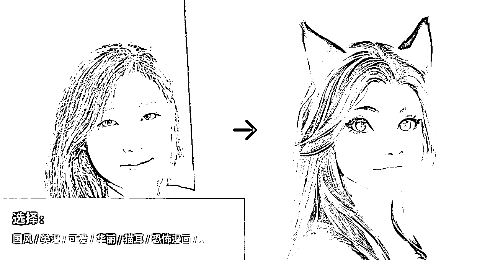

# 画宇宙 API 服务报价方案（客户参考）

> 来源：[https://f8y4v1rln8.feishu.cn/docx/HD2SdKerkoUesVxD4ARc9GGsnIv](https://f8y4v1rln8.feishu.cn/docx/HD2SdKerkoUesVxD4ARc9GGsnIv)

API实际效果：请在 creator.nolibox.com 中体验（电脑端访问）

API文档：https://creator-nolibox.apifox.cn

API自助试用：本文档最下面“API测试和积分购买”部分

2023-04-10 Updated

快速引导（目录）：

接口能力和模式权限一览表

模式一：积分模式

模式二：专机模式

模式三：部署模式

## 接口能力和模式权限一览表

编号

功能

说明

示意图

API文档

积分用户

专机用户

部署用户

通用文生图

输入文本描述，生成符合文本描述的图像，可用于 AI 绘画等场景

https://creator-nolibox.apifox.cn/api-56208288?nav=1

（任务类型：txt2img.sd）

512*704图2积分，中文输入需调用提示词预处理接口，总计2.5积分

使用专机期间内免费无限次使用

客户提供算力和中间件，免费无限次使用

通用图生图

输入图片和文本描述，生成符合图片参考和文本描述的图像，可用于 AI 绘画等场景

https://creator-nolibox.apifox.cn/api-56208288?nav=1

（任务类型：img2img.sd）

512*704图2积分，中文输入需调用提示词预处理接口，总计2.5积分

使用专机期间内免费无限次使用

客户提供算力和中间件，免费无限次使用

文本生成

输入文本，生成文本回复，使用 GPT 模型，可用于聊天对话、文本问答等场景

https://creator-nolibox.apifox.cn/api-63131650?nav=1

按输入和输出的字符数量扣除积分

按输入和输出的字符数量扣除积分

不支持部署，按输入和输出的字符数量扣除积分

商品场景图生成

输入商品照片及场景主题选项或场景描述文本，生成该商品在该场景下的摄影结果

https://creator-nolibox.apifox.cn/api-59337374?nav=1

暂未公开供应

暂未公开供应

不支持部署

人像 AI 绘画

输入人像照片及风格选项，生成该风格的该人像艺术风格化图像

https://creator-nolibox.apifox.cn/api-54025157?nav=1

3积分

使用专机期间内每月每组机器配额5万次免费调用，超过配额需要单独购买

不支持部署

训练艺术人像

输入同一人的多张人像照片，经过模型训练，生成多张该人的多张艺术化肖像

https://creator-nolibox.apifox.cn/api-61594908?nav=1

按「训练图片张数 * 10 + 生成图片张数 * 2」来扣积分，专机用户也需扣积分

按「训练图片张数 * 10 + 生成图片张数 * 2」来扣积分

如需部署请额外联系

Prompt 优化

输入文本，生成优化后的 Prompt，可用于文生图的关键词优化，以生成效果更好的图片

接口完善，但暂未公开上架，如有需要可联系

暂未上架

/

/

抠图（移除背景）

保留图像前景主体，去除图像背景，可用于图片智能编辑等场景

https://creator-nolibox.apifox.cn/api-58019814?nav=1

0.5积分

0.5积分

不支持部署

图像外延

填补图像之外的画面，可用于图片智能编辑等场景

https://creator-nolibox.apifox.cn/api-56208288?nav=1（任务类型：img2img.outpainting）

2积分，中文输入需调用提示词预处理接口，总计2.5积分

使用专机期间内免费无限次使用

客户提供算力和中间件，免费无限次使用

图像局部消除

将图片中指定区域内容去除，并智能补全背景

https://creator-nolibox.apifox.cn/api-56208288?nav=1（任务类型：img2img.inpainting）

2积分

使用专机期间内免费无限次使用

客户提供算力和中间件，免费无限次使用

图像局部替换

将图片中指定区域的画面内容替换为输入的文本所描述的画面内容

https://creator-nolibox.apifox.cn/api-56208288?nav=1（任务类型：txt2img.sd.inpainting）

2积分，中文输入需调用提示词预处理接口，总计2.5积分

使用专机期间内免费无限次使用

客户提供算力和中间件，免费无限次使用

图像高清（超分辨率）

提升低分辨率图像的清晰度

https://creator-nolibox.apifox.cn/api-56208288?nav=1

（任务类型：img2img.sr）

2积分

使用专机期间内免费无限次使用

客户提供算力和中间件，免费无限次使用

AI 绘画模型训练和推理

输入图片样本集和训练参数以模型训练，可得到训练后的模型，并可使用此模型进行推理

-

https://creator-nolibox.apifox.cn/api-62888280?nav=1

暂未上架

更多功能

-

-

-

## 模式一：积分模式

### 积分模式包含的服务内容

如果同时提交的任务超过了「同时提交任务数」 ，那么会报 code=7001 错误，提示 message 为 task limit；此时，需等之前的任务完成以后，再提交新的任务

您提交的任务会和其他调用API的客户、画宇宙产品的用户共同排队

### 积分充值费用方案

购买积分

价格（人民币）

充值折扣换算

同时提交任务数

有效期

2万

1,000

0.05元/积分（原价）

4

1年

10万

4,500

0.045元/积分（9折）

4

1年

25万

10,000

0.04元/积分（8折）

4

1年

60万

21,000

0.035元/积分（7折）

4

1年

120万

36,000

0.03元/积分（6折）

8

1年

300万

75,000

0.025元/积分（5折）

8

1年

单次300万以上

商务对接

注：此价格仅包含普通增值税发票

### 接口功能和消耗积分

#### 画宇宙基础接口

主要接口

详情

消耗积分

提示词（prompt）预处理

https://creator-nolibox.apifox.cn/api-56231826

0.5

提交任务接口（画宇宙系列模型）

https://creator-nolibox.apifox.cn/api-56208288

根据画面尺寸计算，512*704图扣2积分

提交 ControlNet 任务

https://creator-nolibox.apifox.cn/api-68616146

5

#### 画宇宙高级接口

主要接口

详情

消耗积分

人像照片转动漫（AI玩图）

3

商品场景图生成（暂未开放）

/

#### 第三方接口

主要接口

详情

消耗积分

百度文心模型

6积分/一张图

#### 对象存储服务（图床）

对象存储（注释4）

消耗积分

生成的图片在画宇宙 AI 服务器上保留 5 分钟

0

生成的图片在画宇宙 AI 服务器上保留 24 小时

0.2

生成的图片在画宇宙 AI 服务器上保留 1 周

0.6

生成的图片在画宇宙 AI 服务器上保留 1 月

2

注：生成的图片在画宇宙 AI 服务器保留一定时间后自动删除，需在此时间内转存至自有存储，后购买对应时长的图床（或对象存储）服务

## 模式二：专机服务模式（推荐）

### 专机模式包含服务内容

注：人像照片转动漫（AI玩图）接口需调用人脸识别、照片识别、Prompt生成等内部算法，因此只能按次计费

如对人像照片转动漫（AI玩图）有大量需求的用户，可联系工作人员定制商务方案

### 专机模式费用方案

服务

数量规格

说明

价格

专用服务器：( 64核CPU，128GB内存，2颗NVIDIA RTX5000 GPU ) * 2

组

4路算力并行计算，每路算力生成一张512*512的图，时间约在4~6s（不算网络传输），性能是T4显卡2倍以上

18万元/年/组服务器

画宇宙模型部署和运维

/

/

6万元/年/组服务器

专用任务队列

/

/

/

AIGC API

/

/

/

注：每组服务器成本是24万元/年（18w+6w）

服务器报价参考（阿里云官方原价）：

此价格仅包含普通增值税发票，按月租服务器的费用可与客户经理联系

### 主要接口

#### 画宇宙基础接口

主要接口

详情

使用限制

提示词（prompt）预处理

https://creator-nolibox.apifox.cn/api-56231826

赠送，qps20

提交任务接口（画宇宙系列模型）

https://creator-nolibox.apifox.cn/api-56208288

不限制提交

提交 ControlNet 任务

https://creator-nolibox.apifox.cn/api-68616146

消耗5积分

#### 画宇宙高级接口

主要接口

详情

使用限制

人像照片转动漫（AI玩图）

有次数限制，专机模式客户享50,000次人像照片转动漫（AI玩图）接口，如用完，需要使用积分模式，如对人像照片转动漫（AI玩图）有大量需求的用户，可联系工作人员定制商务方案

## 模式三：算法部署模式

### 算法部署模式包含服务内容

### 算法部署模式费用方案

情况

价格

客户提供的GPU服务器来自腾讯云、阿里云、华为云等公有云

100,000元/次起（4台服务器以内）

超过4台服务器的，价格另议

具体费用依服务器环境、系统配置、数量有差异

客户提供的GPU服务器来自私有算力，或非主流公有云

客制（4台服务器以内）

超过4台服务器的，价格另议

具体费用依服务器环境、系统配置、数量有差异

注：此价格仅包含普通增值税发票

客户环境需提供：k8s、kafka、Redis、图床（或对象存储），依客户提供的环境差异，费用不同

* * *

## API测试和积分购买

注：此处注册的账号为open api平台专用账号，与计算美学下的产品图宇宙、画宇宙等产品用户账号无关

