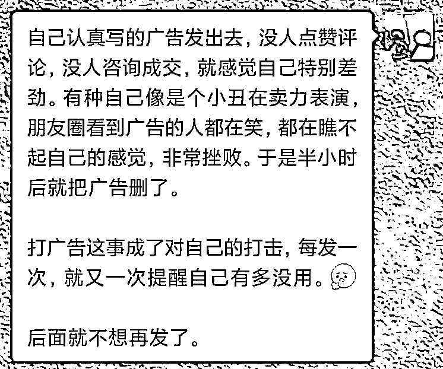
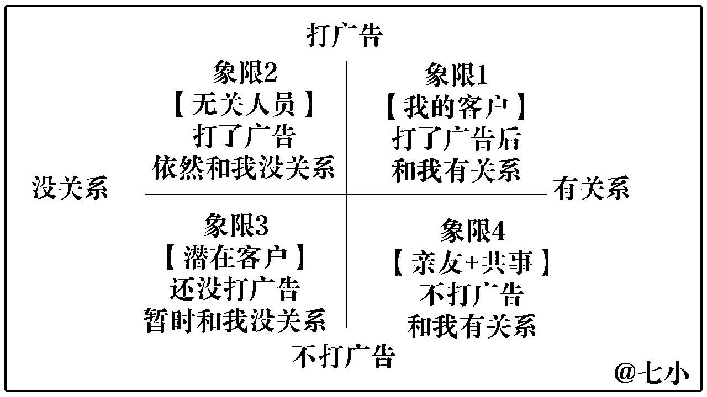
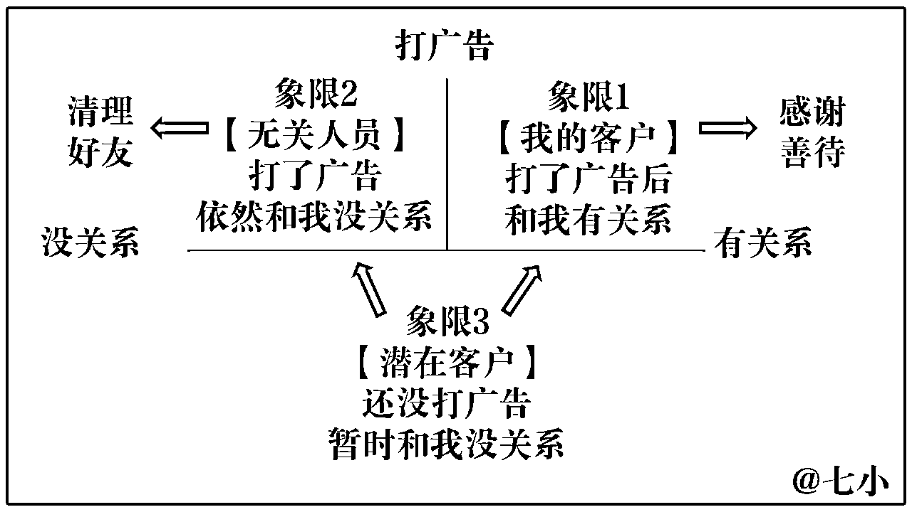
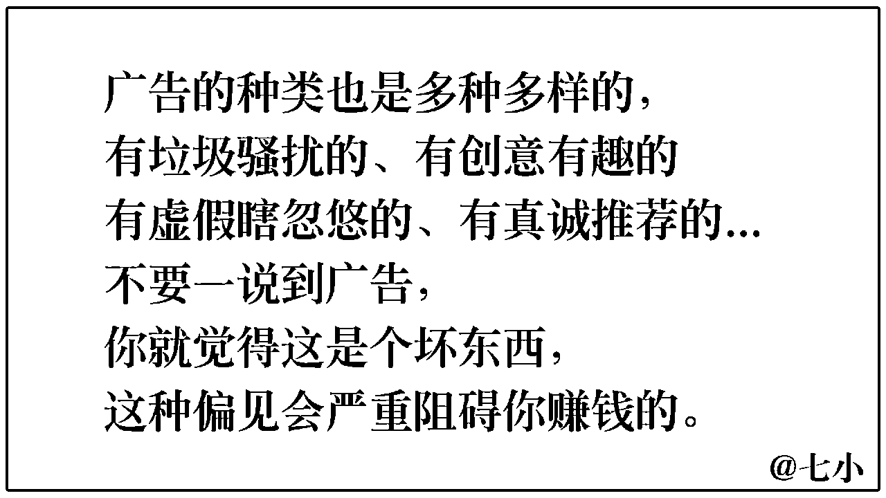
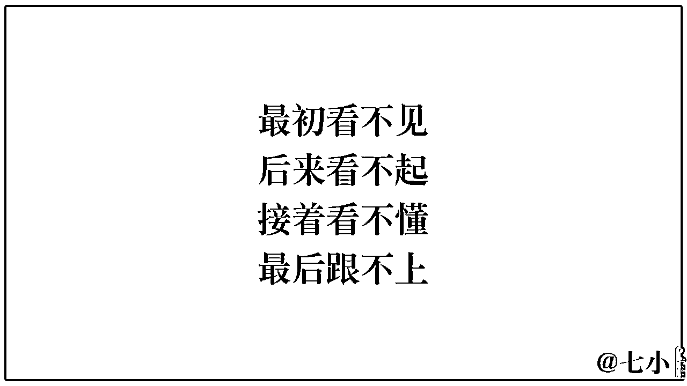
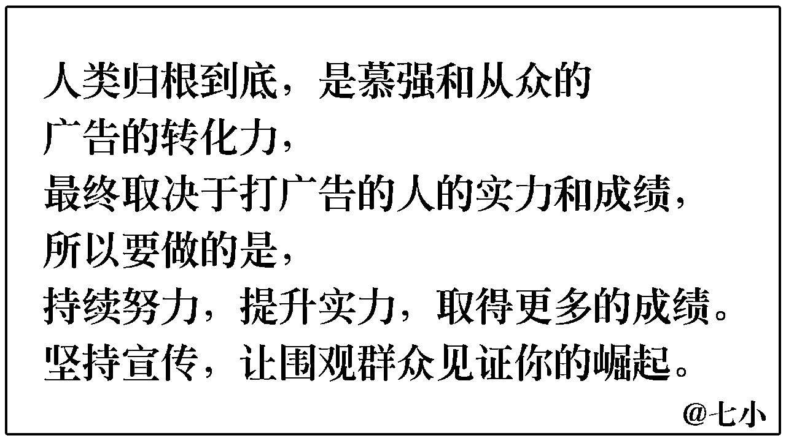
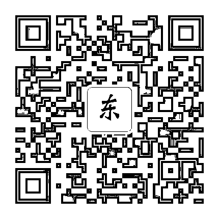

# 心理卡点：不敢打广告，打完广告不出单好自闭，怎么办？

> 来源：[https://mkfwp3u79v.feishu.cn/docx/HfJEd0huioyShvxowVfcOMQYnHb](https://mkfwp3u79v.feishu.cn/docx/HfJEd0huioyShvxowVfcOMQYnHb)

最近和一些朋友聊天，发现许多做自媒体的新手朋友，对于打广告，都有卡点。

包括不敢打广告，怕打扰好友，怕被人屏蔽拉黑。

以及不会打广告，不知道怎么写文案，不知道怎样配图效果才最好。

还有打了广告后没出单，就觉得自己好没用，自闭。

看到大家对于打广告这块，是有挺多问题的，那我这个过来人，就来分享一下，如何破除打广告的一些认知和心态的卡点吧~

# 一、为什么你不敢打广告？

我觉得这个原因有三。

1）你对所卖产品的价值不够认可

2）你对于「人际」的理解不到位

3）你对于「广告」的理解不到位

## 1）你对所卖产品的价值不够认可

这个不难理解。

如果你卖的是别人的东西，帮别人带货，那这个东西你自己用完都没有足够的收获，没有好的体验，你再去推荐给别人，那就会一种“我在欺骗别人”的感觉，打广告像是在犯罪一样，你当然不敢打广告。

如果你卖的是自己的东西，那当你做的东西完成度不够，比如说你卖的是自己的课程，但1.0版本还很粗糙，那你卖出去了，都能预料到一定会被别人挑出一大堆毛病的，这个不行，那个不行... 卖自己的未完成的半吊子产品，像是出去找骂的，你当然也不敢卖呀。

别人的东西，你觉得不够好，那就不卖嘛。

自己的东西，因为觉得还不够好 （确实离市场平均水平都差很多），那你就继续完善，等你完善到自己都有自信了，你再卖就好了。

## 2）你对于「人际关系」的理解不到位

一个刚开始卖东西的新手，在刚开始打广告的时候，心理一定会有这个纠结：啊，我打广告，会不会骚扰别人呀？人家会不会因为我打广告，就嫌我烦、疏远我、屏蔽拉黑我？伤感情呀...

这个问题，咱们得分类讨论呀。

于是我做了这张图。

PS：下面我说的打广告，指的是你花了心思、用心写的软性广告文案，不是那种劣质的、轰炸式，一眼就让人讨厌那种硬广。不要误解我的意思了。

如果我跟你说打广告是不骚扰人的，你信嘛？

当然不信呀，事实上，打广告，让别人掏钱，确实是会打扰别人、伤感情。

但是有个点你要注意： 不是所有的人，你都要照顾他们感受，避免被他们嫌弃的！有些人，其实伤感情就伤感情，无所谓的。

要照顾感受的那批人，是第4象限的那批人。是你的亲朋好友，以及你的领导同事合作方 （如果你有主业，在宣传你的副业的话） 。

这些人，你早晚要见面，抬头不见低头见的，所以要顾及他们对你的看法，避免被他们讨厌。

所以你要打广告，又不想或不能骚扰这批人，那你设置分组可见，屏蔽掉这波人就行。

但是像第2象限的那批人，你在网上加到的好友，平时也不交流，也不见他给你朋友圈、推文点赞评论，不和你产生知识、情绪上的价值交换，那他们除了给你掏钱，和你发生金钱关系外，对你而言，其实也没有别的价值了。

直接一点说就是：这批人，等一段时间还不打钱，就没啥用，可以删了。

对待这些人，你们本就没有感情，一辈子都不会见一面，还谈什么伤感情？在乎他们的看法干什么？

这里再强调一次，我说的这波人是：不点赞、不评论、不聊天、不掏钱，与你在知识、情绪、金钱上没有任何价值交换的人。而不是说，不付费的人，就都该删掉。别误解我的意思。

## 3）你对于「广告」的理解不到位

### ①打广告的本质

然后，我们再来说广告这件事。

打广告这动作，本质是一种「放大」和「筛选」。

让喜欢你的人，更深入的理解你在做的事情，更明白你的能力和价值。

喜欢你的人，更喜欢你；不喜欢你的人，更烦你。 此为「放大」。

喜欢你的人，觉得你的广告，是一个能更好的了解你的窗口，了解完之后，他们会靠近你，购买你的产品，成为你的客户。

不喜欢你的人，觉得你打广告，是又想让他掏钱了，你又打扰他了，看完后更烦你你了，然后屏蔽你、删除你、拉黑你。

此为筛选。

一张图展示，就是这么回事。

对于【无关人员】来说是【打扰】的东西，对于【你的客户】来说是一种【吸引】。如果你不打广告，不去【打扰】无关人员，那么同样的，你就没法【吸引】你的客户。

为了照顾【无关人员】的观感，而舍弃掉了【真正的支持者】，这不是本末倒置吗？

### ②打广告的方式

打广告，也分为很多种方式，有开门见山的硬广，和讲故事的软广。

刺激用户的方式，有贩卖焦虑制造恐惧，以及贩卖梦想刺激欲望这两类。

打广频率和比例，也有一天发5~10条的刷屏式的广告的方式，和每天发1~2条，其他内容都是分享有用有趣的干货的方式。

宣传素材上，有根据自己一张嘴瞎编的方式，也有根据用户的真实好评来宣传的方式。有用软件设计美化过的图片，也有一张

......

我们讨厌的广告，是那种不考虑观众的感受，光自卖自夸，还凭空制造一些不买的危害，暗示你不卖你就是蠢蛋，那种自嗨+夸大宣传+贩卖焦虑+刷屏+不输出价值的垃圾广告。

而那种： 有趣的/适度正能量激发梦想的/克制的/根据真实好评的/提供价值的软广，对于多数人来说，哪怕谈不上喜欢，至少也是不会讨厌的。

你要讨厌的不是打广告这件事，而是应该讨厌打垃圾广告。那些有趣有料且真实的宣传，多发没有问题的。

酒香也怕巷子深呀，你卖的是个好东西，何必藏着掖着呢？大方宣传，让好东西传播出去，为世界做贡献才对嘛。

# 二、打广告之后没成交，感觉挫败怎么办？

## 1）检查用户有没有问题

我先来问你一个问题：

你会在养牛场里，因为没有钓到鱼，然后你就觉得自己的钓鱼技术太差，伤心自卑吗？

不会的，对吧。

那换个例子，比如说你有一个2000好友的微信号，里面都是你从小到大加到的同学、亲人、同事，都是你因为各种机缘巧合，随缘积攒下来的好友。标签挺乱的。

现在你开始有个自己的业务了，你开始给自己打广告，然后打了几次，你发现没有成交，就很怀疑自己的能力和魅力...

这不就是，在养牛场里没有钓到鱼，然后怀疑自己吗...

你现在的精准人群，他们的类型是【鱼】，但你以前从各种场合积累下来的，都是些【牛】【羊】【长颈鹿】【犀牛】【狮子】... 2000好友里，就没有几只你要的【鱼】。

钓不到鱼，那不是再正常不过了吗？

所以呀，当你发现你没钓上几只鱼时，你要想的第一件事，不是怀疑自己，而是思考思考，自己到底是在鱼塘，还是动物园。

要检验自己的钓鱼技术如何，得去鱼塘，才能检验出来呀。

## 2）检查文案有没有问题

当你去到鱼塘了，拿到一批你的目标受众了，你发现还是没法成交，这时候你就要考虑是不是自己的钓鱼技术有问题了？

打广告的时候，得想想：

你的产品讲清楚没有？

你为什么要做这个产品，初心是什么？

这东西的价值点在哪，用于哪些场景，解决哪些问题？

产品服务包含什么，不包含什么？

适合哪些人买，哪些人不适合买？

价格多少？服务期多长？

用哪些平台/工具/方式做交付？

......

东西讲清楚了，价值感传递的够不够？

现在有多少人买你东西了？

买了你东西的人，都有哪些进步？有什么实打实的收益？

买了你东西的人，对你的产品服务是怎样评价的？

有没有哪些圈内大咖帮你做信任背书，为你站台？

上面说的这些东西，你有没有图片、视频素材去证明？

.....

这里的细节很多，包含但不局限于以上内容，需要长期打磨，才能把文案写好，得到不错的转化率。

## 3）检查前期铺垫有没有问题

打广告，是成交前的最后一步，而不是唯一的步骤！

在打广告之前，还有：价值输出、个性展现、信任建立...

有的人，他或许在加你的微信好友的第一天，就已经看过你的代表作，知道你的产品了。

即使他清楚你是做什么的、卖什么的，认可了你很厉害，也不代表他会马上找你买单。

我发现，打动别人，让人下单这事，除了强度之外，还有【有间隔的重复次数】。

以我为例，原本我以为，我已经有几篇很精彩的代表作了，一些新朋友加过来，看了我3篇大作，应该就能买单了。

但实际上，我发现不完全是这样的。也有很多朋友，是看了我几篇大作后初步了解了我，但仍对我的产品无动于衷。后来又刷了我十几篇唠嗑短文后，才来找我下单的。

在和一些用户交流之后，我明白了一些道理：

有些人是在第一次觉得你真牛逼的时候，就会买单的。

而有些人需要3次、5次、10次，觉得你牛逼，才会买单。

有些人，是觉得你牛逼就买单了。

而有些人，是知道你厉害还不够，还要在朋友圈中看到你的生活，了解你的为人后，才会买单的。

有些人会在认识你的第一天就买单。

而有些人会在第10天、第30天、第50天、第100天...

第N次看到你的干货，看到你的生活，了解你这人的性格、三观，第N次被你触动后，才会买单的。

在打广告之前，还需要输出N篇有价值的文章，写N篇生活分享的朋友圈，N次参加活动，和大家交流互动建立信任。

最后才是打广告，完成这临门一脚，开单。

打了广告不出单的时候，回顾一下自己的前期努力做了多少？

想想自己付出的其实还不够多，那没有回报，其实也能心甘情愿的接受了。

如果光是广告打得好，就能赚钱，那钱就来的太容易太随意了，那可能有这种好事呢，对吧。

## 4）理解道路的曲折，持续努力，用实力和成绩拿下质疑的人

人类的骨子里，都是从众和慕强的。

当你的产品只有10个付费用户的，某些围观群众会在心里笑你：

呵，搞这么大阵仗，才招这点人，也太菜了吧。

当你卖了50个人了，他们会被震惊一下，然后安慰自己：

他这也没啥，还是小打小闹，你这上来了，但也没赚多少钱。

当你卖了100人了，他们再震惊一下，不得不承认你有点本事了。自己虽然没法和你比了，但是会拿其他大佬来和你对比：

比起XXX，他这还差的远呢，还不足以让我承认，为他买单。

当你卖了300人了，产品也迭代了两三个版本，像模像样了。同时你也得到圈内一些大佬的认可夸赞了，有些大佬背书了。 他们中的一些人，就开始动摇了：

卧槽，当初是我小看你了，现在再不上车，再晚之后就跟不上了。

于是为你付费了。然而还有一些人在嘴硬。

当你了500份了，事业上取得了更多的成绩，产品再迭代几个版本，开始要来一波涨价了。又一批嘴硬的人坐不住了，被你拿下了。

而还有一些人，继续嘴硬，不承认你。等到你卖了上千份了，已经成为一个大咖了，低价的产品业务要么停了，只剩中高单价业务了。 要么低端产品已经主要交给助理去打理了，买后都不一定能有机会和你交流了。

这时他们会垂头丧气，感慨：

开始看不见你，后来看见了但看不起你，再然后承认你有点本事了但还不是完全信你，等到完全信你的时候已经追不上你了...

当你有了精准粉丝，产品做的还可以，文案写的也不错，有些人依然不为你买单的时候。

归根到底，还是因为，他们觉得你不够强。

你要做的，就是继续努力，坚持宣传。自己在各种事情上拿到成果，自己卖的产品销量越来越高。以前怀疑你的那批人，迟早会被你拿下的。

想想看，自己演一出逆袭的故事，从别人看不见看不起，再成长到让人跟不上，让那些早期对你怀疑，没有入股你的，后期大腿拍断。这不也是挺有趣的吗~

不要因为最开始的挫败就放弃，多想想：前期有点惨，后面的逆袭故事就有多精彩~

最后：

我是七小，99年的深圳靓仔，知识管理专家。

精通搜索、采集、内容整理、关键词挖掘，擅长把碎片化信息整合成体系化的知识产品来变现。

江湖人称生财课代表，专业解决生财新人圈友的各种问题，致力于帮助圈友发挥好生财有术的价值。

微信：rickea1505，添加请备注：生财圈友 。欢迎交流。

公众号：七小的人生游戏攻略

