# 抖音自动化公转私玩法及防封攻略

> 来源：[https://p9rxk6ovll.feishu.cn/docx/QbBKdHvfiofIUNxDlmjceWbfnqh](https://p9rxk6ovll.feishu.cn/docx/QbBKdHvfiofIUNxDlmjceWbfnqh)

抖音公转私的半自动/人工玩法圈友们分享得不少，关于市面上自动转化的玩法也不少，但很多容易导致封号，本文围绕抖音公转私自动化玩法及防封把常见方法进行拆解，一方面便于大家结合自己的情况进行选择合适的玩法，另一方面在筛选一些转化工具时可以参考减少被坑。

以下为本文主体内容：

为了有更直观的了解，先看下相关效果，以导流加微为例

# 加微效果演示

这些都是我们已经跑通的玩法

## 1.评论区跳转加微

评论区顶部-（点击引导图）-点击打开微信-长按加好友

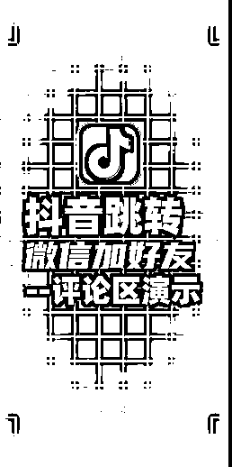

## 2.直播间跳转加微

直播小风车-点击引导图-点击打开微信-长按加好友

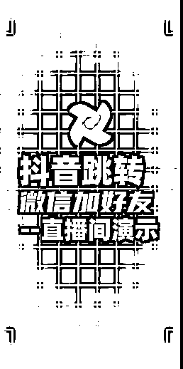

## 3.主页跳转加微

抖音主页-点击引导图-点击打开微信-长按加好友

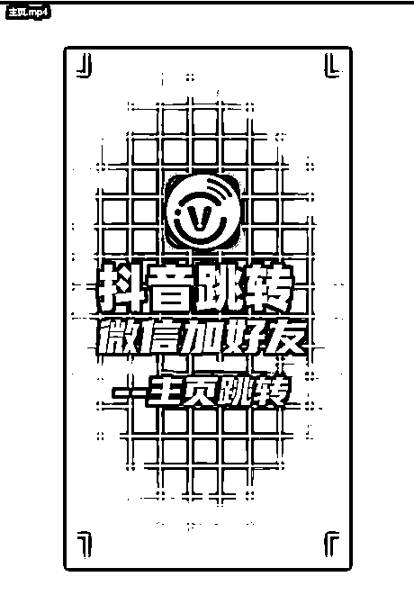

## 4.私信自动回复加微

抖音私信-自动回复卡片+话术-点击引导图-点击打开微信-长按加好友

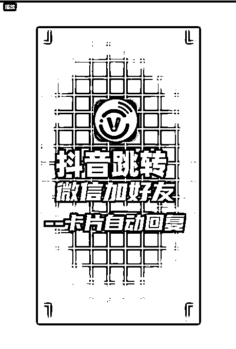

# 适用账号

首先了解下抖音的账号类型：

个人号：普通个人号、员工号

认证号：黄v、蓝v、半蓝（资料已提交，资质已过审，未付费，不显示认证主体）

蓝v：官方蓝v、小店蓝v（小店赠送）、来客蓝v（抖音来客开通，功能不全）

下图为小店蓝v

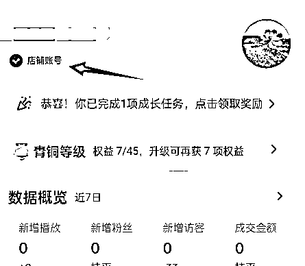

## 1.各类账号适用玩法

跳转微信

认证号

个人号

蓝v

半蓝

员工号

黄v

普通个人

主页跳转

√

√

√

视频自动评论

√

√

私信卡片

√

√

√

直播小风车

√

√

√

抖音群

√

√

√

√

√

说明

小店蓝v、来客蓝v不适用

从适用玩法上看，官方蓝v和半蓝的跳转路径是最丰富的，适合根据不同行业属性，组合成不同的私域转化路径。

员工号可作为矩阵号的延伸，帮助企业节约认证成本，员工号跳转主页

## 2.如何免费开通蓝v和半蓝

抖音蓝v认证页面

半蓝：完成企业身份验证 免费蓝v：点击限时免费审核，

满足500粉，配置商家主页即可免费开通

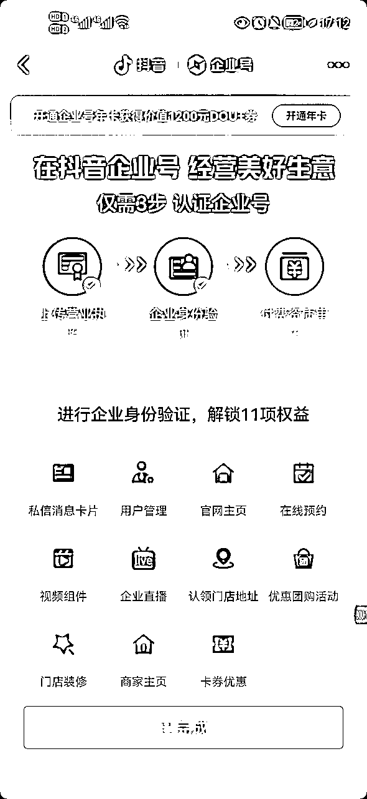

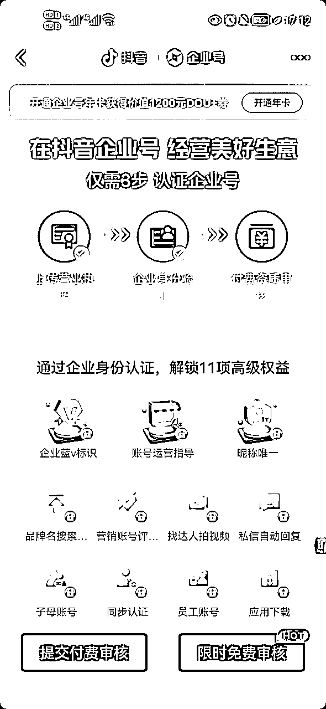

## 3.如何开通员工号

企业号后台-营销矩阵-员工账号申请，申请后，员工激活即可

开通成功员工号享有企业号类似的功能玩法

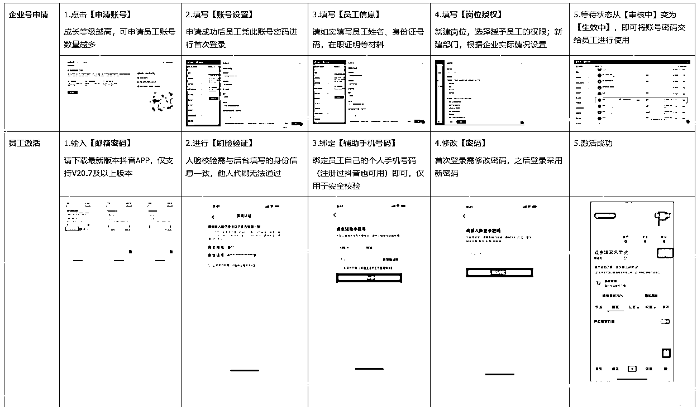

开通后效果

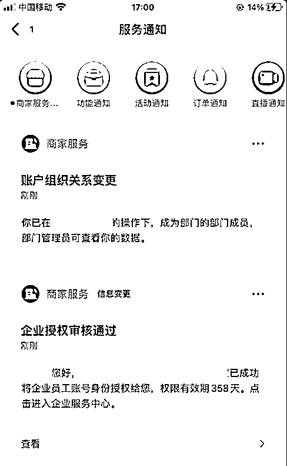

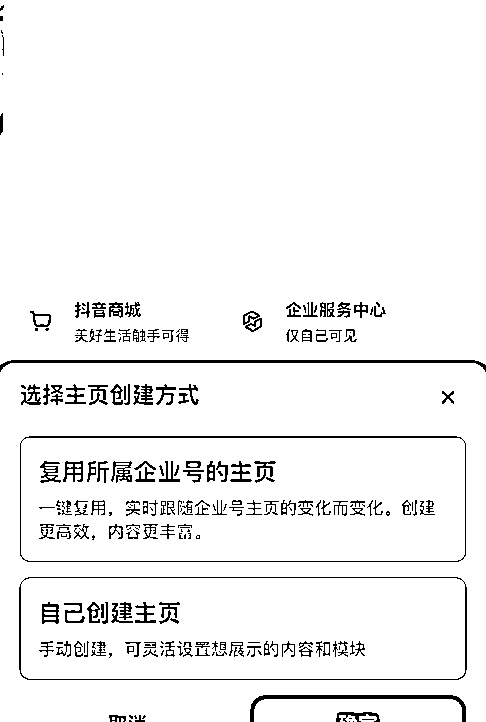

# 转化入口

## 1.主页链接跳转

当用户点击主页-官网主页等黄色超链，实现对应跳转

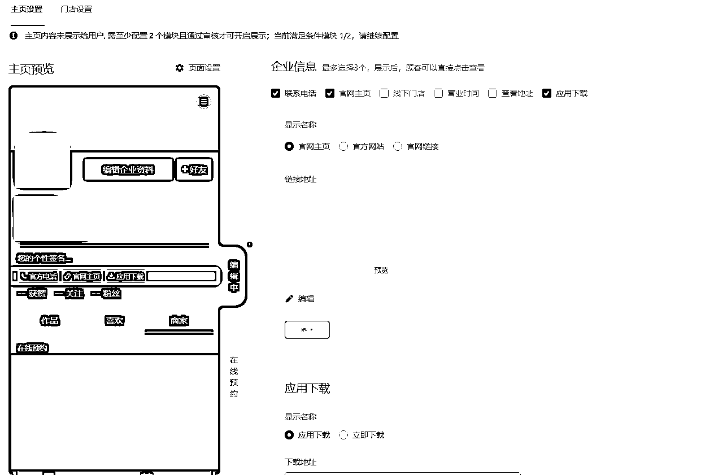

玩法建议

普通玩法：跳转私信、下载app、团购等

升级玩法：通过接口对接，生成带链接的主页，实现页面链接跳转微信，详见上方效果演示

## 2.短视频评论跳转

### 评论自动回复

一样两种玩法：官方后台、接口开发的产品

1.走官方后台，内容需要先过平台审核，回复速度超快且稳定

方法去年就分享过，这里再列一下，便于查看

巨量纵横的官方接口，直接在后台设置即可

适用于抖音蓝V

说下具体步骤：

1.注册巨量纵巨量纵横（也可以让开通了的帮忙绑定，见图1）

2.授权绑定抖音号

3.设置评论关键词和回复内容，完事儿，自动评论速度5秒内

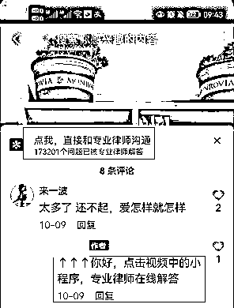

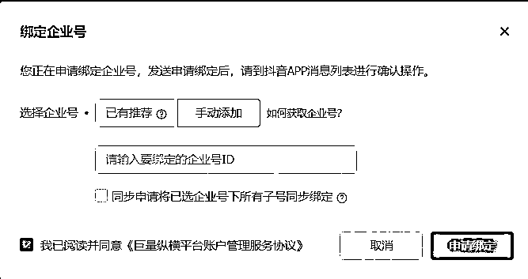

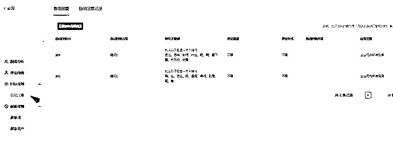

玩法建议

普通玩法：发视频自动关联小程序或poI，评论引导转化；

升级玩法：结合下方评论跳转微信玩法，通过自动回复引导点击

2.接口或对应产品实现

懂技术的可以到抖音开放平台申请相应接口，现在很多短视频矩阵平台都是通过接口实现的

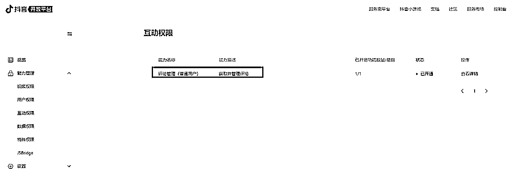

具体的功能可参考

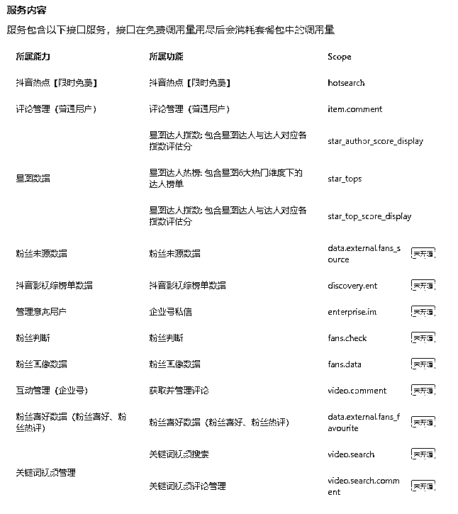

### 评论跳转微信

#### 付费玩法

普通玩法:巨量星图付费投放

星图后台创建任务-短视频-选达人发布任务

至少1050起步，适合人民币玩家，对普通创业者不友好

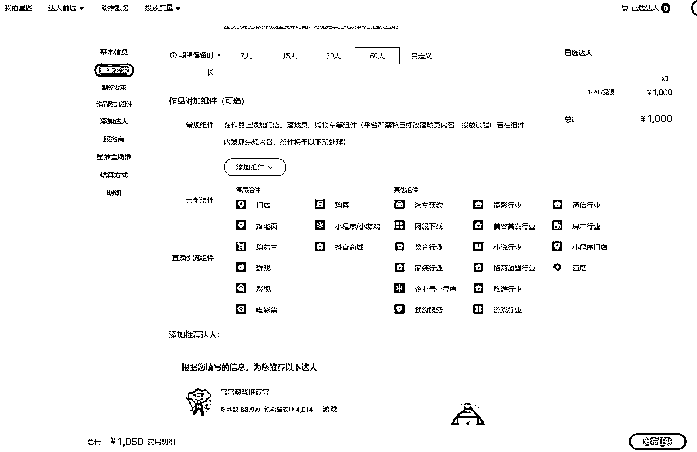

#### 免费玩法

升级玩法：通过接口对接，生成带链接的官网主页，生成后一直免费

企业号后台短视频管理-添加经营工具-官网主页-添加，即可实现评论页链接跳转微信，详见上方效果演示

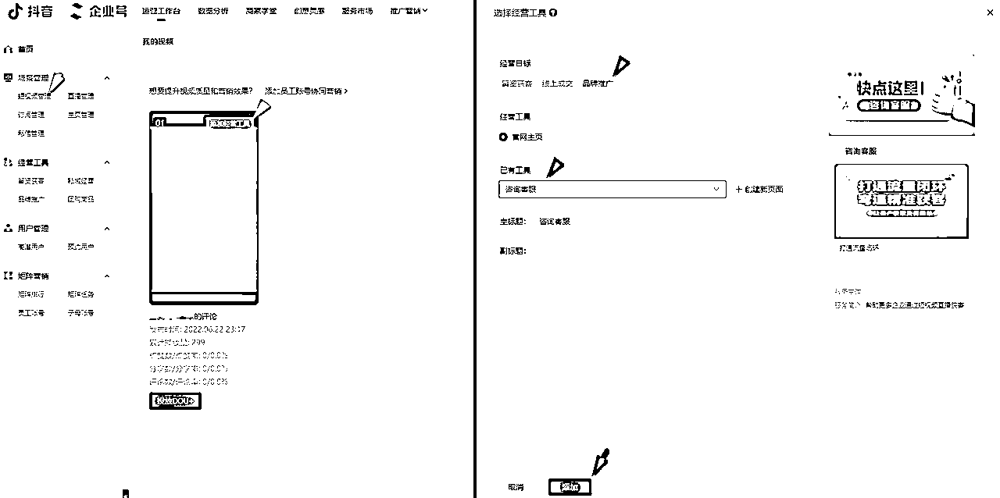

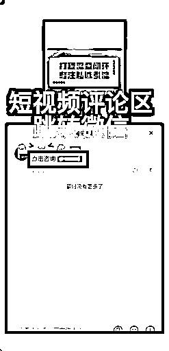

强烈建议做了抖音SEO或者短视频流量不错的圈友，用此类方法把引来的流量吃干抹净。

## 3.私信卡片跳转

### 抖音卡片

在私信或群聊中以卡片样式出现，具备跳转功能，多用来微信私域转化

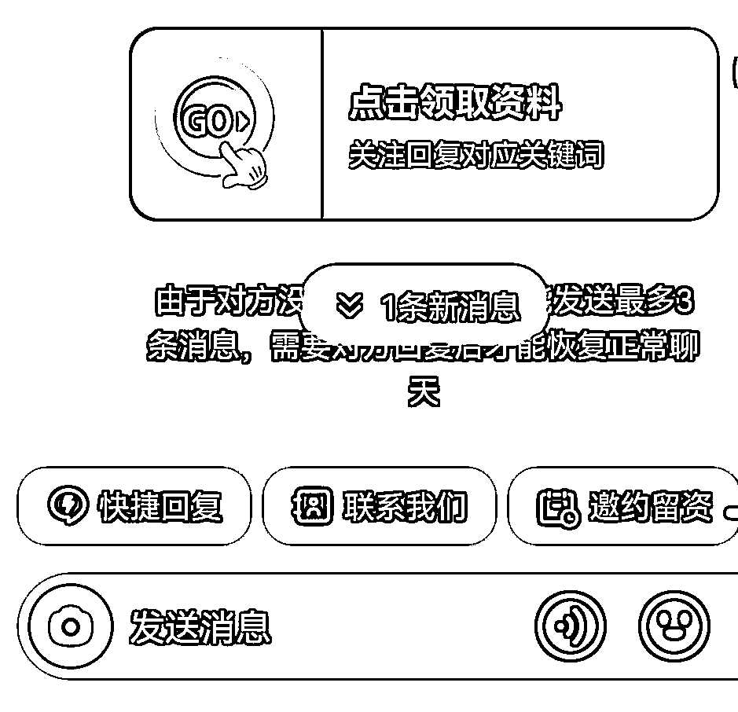

### 抖音卡片类型

市面上出售比较常见的有app、小程序生成，只能手动分享，无法自动回复，抗风险能力弱

卡片类型及生成原理

能否跳转微信

能否自动回复

潜在风险

抖音官方开通

极少部分品牌享有，不对外

√

√

无

抖音接口对接

效果演示中的玩法，通过橙子建站页面跳转，需要多点一次

√

√

无

app生成

卡片封装页面分享至抖音

√

域名拦截

小程序生成

卡片封装页面分享至抖音

√

域名拦截

小程序被封

橙子建站

图标显示橙子建站，无法自定义

√

无

抖音后台订阅通知

支持其他跳转和私信

无

普通玩法：

如果做矩阵号，或者账号风控要求不高，可以用第3-4方式实现跳转微信

升级玩法：

通过接口实现效果演示中，虽然点击步骤多了一步，但由于用的全是官方的功能，安全持久且能实现私信自动回复

## 4.直播小风车

广义上的小风车应该是直播卡片，包含预约，留咨，咨询，团购，跳转微信等功能，只是运营者更多关注的是私域变现传着传着都指的是直播加微的功能

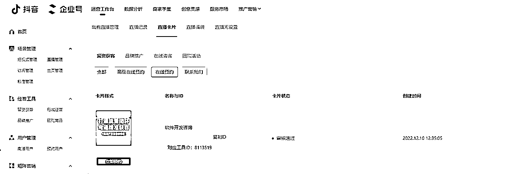

关于跳转加微/微信小程序等，常见的也有两种实现方式

普通玩法：和短视频评论跳转类似，走巨量星图付费投放

星图后台创建任务-直播-选达人发布任务，1000/小时起，适合人民币玩家，对普通创业者不友好

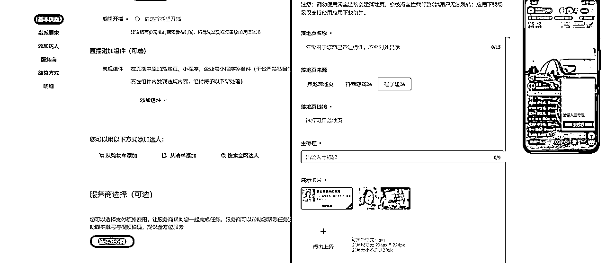

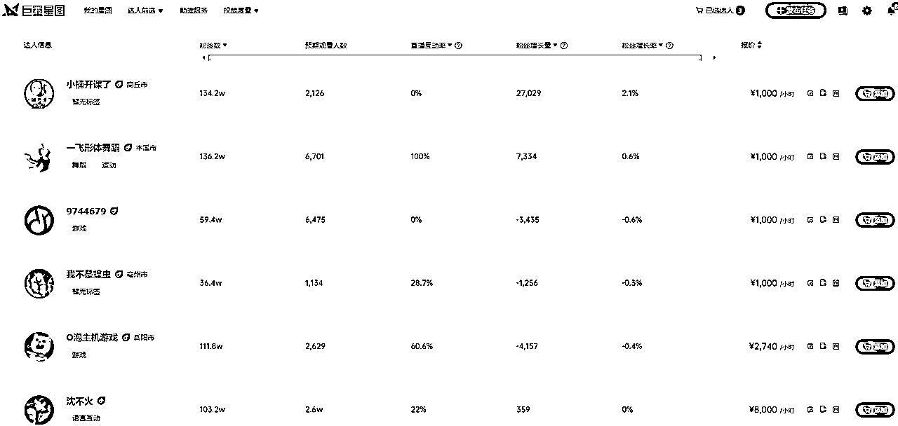

升级玩法：通过接口对接，生成带链接的小风车，生成后一直免费

企业号后台场景管理-添加直播卡片-讲解，即可实现评论页链接跳转微信，详见上方效果演示（手机端直播也可操作设置，这里不再赘述）

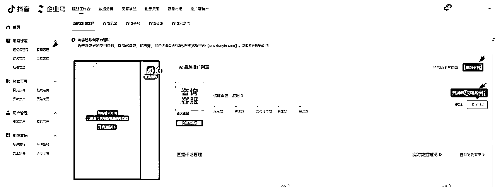

## 5.抖音群

设置进群门槛，如关注才能进群，结合私信自动回复，实现自动化触达

设置进群欢迎语，自动@

采用第三方生成的卡片结合抖音群运营，可以降低封号风险

# 承载与防封

自动化公转私跳微信，转化承载体一般包含两方：抖音号和微信。

所有的防封措施必须同时针对两端考量，否则一方出问题，都会导致转化路径断裂。

## 抖音防封

结合上面的内容，抖音转化通道主要为手动转发，或接口（含官方产品及官方接口），风险最高的在前者。

1.提高账号安全，减少私信频率，群互动代替一对一人工私信

2.提高账号安全，小号为主进行互动，如手动转发抖音卡片

3.提高域名安全，白名单域名代替第三方域名，否则打开会有不定期的安全提示，影响转化

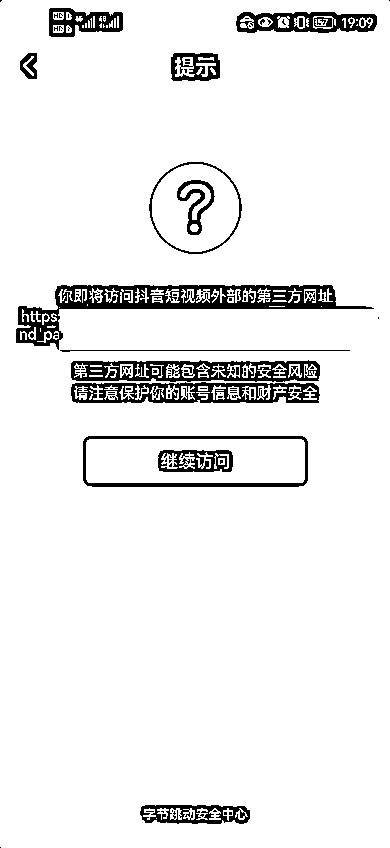

解决方案：这块有相应的抖链转换工具，生成抖音域名网址如https://v.douyin.com/XXX

最高级别防封：

1.认证蓝v/半蓝（推荐，因为不会影响昵称）

2.如有矩阵号，用员工号

3.通过升级玩法，生成卡片和自动回复，避免限制

升级玩法提交工具界面演示：

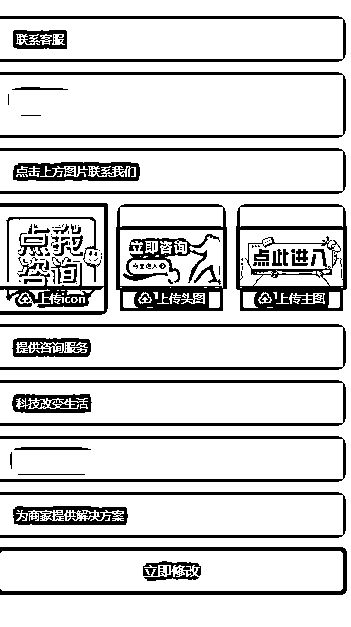

## 微信防封

如果用官方接口或者官方产品跳转微信问题极少，这里主要说说其他玩法的防封

其他玩法跳转微信主要两种方式：小程序、微信客服

小程序支持的跳转形式如下：

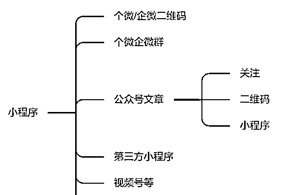

先看几张封禁案例

1.被发现小程序没有实质内容，属于纯引流

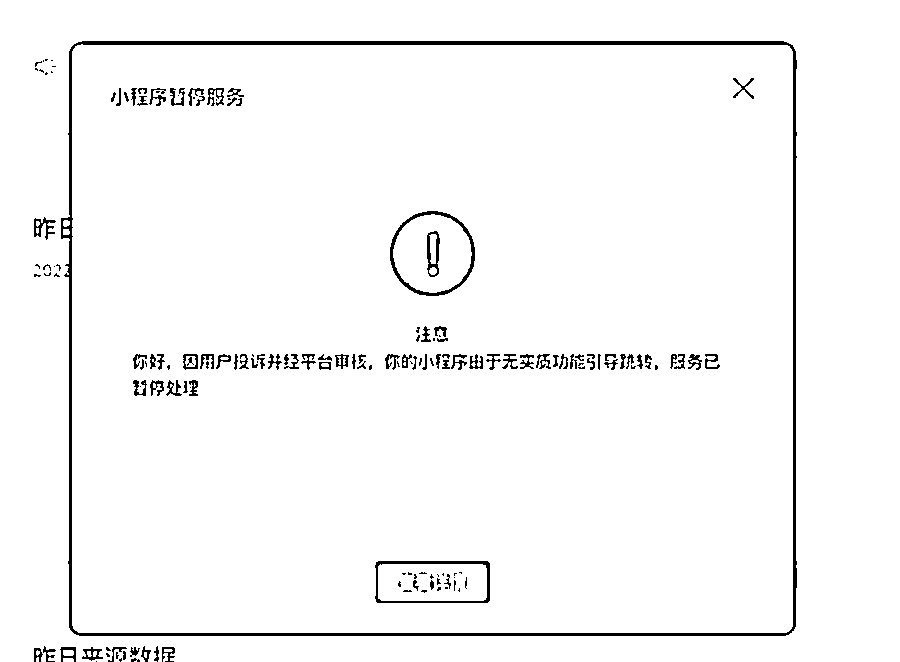

2.被同行举报，轻则封跳转功能，重则直接干废小程序

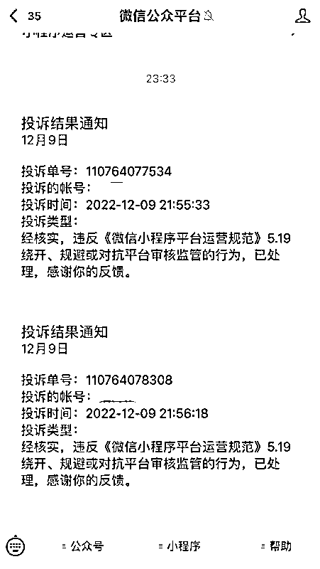

防封建议：

1.保证小程序有一定的自然流量，别全是跳转来的

2.展示内容不建议用小程序页面二维码，改用跳转显示公众号文章文章或第三方小程序

3.让服务商开一个属于自己的独立小程序，别用公用小程序，否则一旦别人的项目出问题，你的跳转也会挂；同时用小程序批量注册工具注册多个小程序备用，一个出问题，马上换上

4.购买小程序或对应跳转服务与服务商沟通，如果小程序出问题，是否更新小程序，以及后续更新费用

最高级别防封：

1.小程序增加防截图举报机制

升级玩法采用的就是这类机制，举报小程序时截图显示不了对应内容

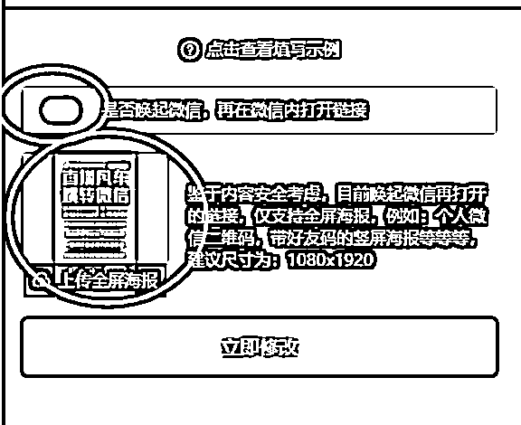

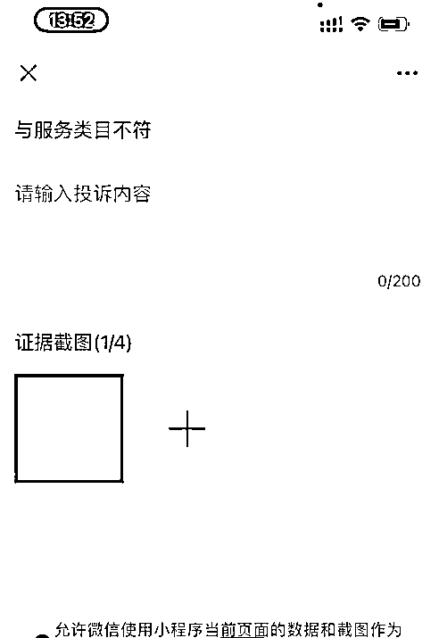

2.微信客服替代小程序

简单说下微信客服，企微衍生的一个支持平台跳转到微信的功能

目前可以直接通过官方后台配置（回复内容及形式单一），也可以通过接口开发的第三方工具，丰富回复内容

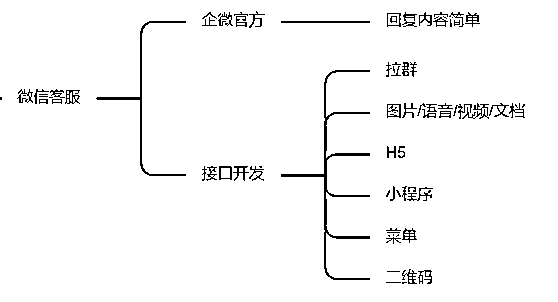

除非微信把自己域名封了，否则这种方式做跳转一直有效

以上就是针对抖音自动化公转私的分享内容，欢迎交流一起探讨，谢谢！