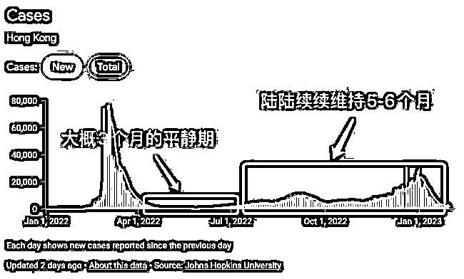

# 230207 懒人生财周报

> 原文：[`www.yuque.com/for_lazy/money/qz8q0cgwkzop9g43`](https://www.yuque.com/for_lazy/money/qz8q0cgwkzop9g43)

# 懒人生财周报 

整理日期：2023 年 2 月 8 号 

懒人专属群的群友大家好。小懒继续给大家带来生财周报～ <ne-quote id="ub4ef74b1" data-lake-id="ub4ef74b1">

生财周报来自某年费 3000 多的付费社群资源帖。 

本文档为懒人专属群内部分享，懒人手动整理。</ne-quote> 

生财风向标系列单独用在线文档分享，地址见专属群 q 群消息。 

一些帖子跳转飞书查阅，如需破解复制权限，见这篇文章： 

[解除复制限制！](https://mp.weixin.qq.com/s?__biz=MzI1NjAxOTI0Ng==&mid=2647895304&idx=1&sn=df7e3e36c3bf503a2513f8b4c6636d3d&chksm=f20a1349c57d9a5fccaa92c5068cb3e492ba9e3ebb178584d018892c0211214dc9d112c1f73c&token=37691864&lang=zh_CN#rd) 

往期的生财周报合集（含在线版和离线版），见专属群 Q 群文件和群公告。 

希望大家有收获~ 

 

标题加了(精华)的表示精华贴，前面为截至今日的点赞数。 

以下是目录，内容有些多。大家可以挑兴趣的内容阅读。 

[懒人专属群更新记录（点此跳转）](https://lazybook.fun/#/blog/record2) 

# 【目录】 

[TOC] 

# 【生财认知】 

## （精华）（364 赞）搞钱的心法 

朋友们，新年好！我是小排，由于工作繁忙，好久没和大家聊了。借开年的机会，补上最近我的感悟。 

很多以“心法”为题的文章，讲的其实是做事的方法论。本文讲的，真的是纯粹心法。 

啥心法呢？ 一言以蔽之： 你需要盲目的自信。 因为盲目的自信和乐观，是创业者的理性选择。 

# 一、观察生财有术里的高手 

不知道大家有没有观察到一个现象： 一些赚到大钱的高手，当他们做分享的时候，对自己认知非常地骄傲。在他们看来，在自己的领域，他自己就是老大，其他人都是弟弟。 

比如静水流深，也就是著名的惰惰。在他的《分享 3 个单人就能做的海外赚钱案例》一文中，行文风格非常自负，大家可以点开链接感受一下。 在文末评论区，我和他探讨过一些问题，他的回复，给人感觉也是“懒得跟你说，我没有义务必须教你什么，我说的就是真理，你爱学不学”的感觉。[https://t.zsxq.com/0arOdzNJq](https://t.zsxq.com/0arOdzNJq) 

再比如盗坤，近半年直播里经常爱说的是“如果有人说做电商需要 xxx、xxxx、，对不起，那你就是弟弟，我才是哥哥”，还有一个口头禅是说别人家教的方法是“花拳绣腿”。 

再比如跨境杨少的帖子《独创：必胜法之四步打造一个百万爆款》，行文风格和静水流深老师极其类似，文章里直言不讳“竟然大言不惭说是必胜法”。 

我是在批评他们吗？ 错了，正好相反！ 我在向他们表达我的钦佩！ 

这样“舍我其谁”“在我的领域，我就是国王”的心态，才是创业者真正需要的心态！ 

我们说一些体育界的案例。 

# 二、体育界的案例 

前几年的国际羽毛球比赛，一直是两个巨星的舞台，一个是我们中国的超级丹林丹，另一位是马来西亚拿督李宗伟。 

有一个现象大家也知道： 李宗伟在决赛的时候总是会输给林丹，尤其是最关键的决赛。 据统计，在两人的职业生涯中，总共交手 37 次，李宗伟输了 25 次，其中两次是奥运会决赛。 

李宗伟的技术比林丹差吗？ 可真不见得，大部分职业羽毛球运动员和教练认为，他俩的技术不分伯仲。甚至还有一些人认为，李宗伟的技术比林丹更加全面。 

这就非常奇怪了。为什么李宗伟总是输呢？ 

其实他不是输给了林丹，他是输给了自己。 

李宗伟与林丹的比赛，是有两个比赛同时在进行，一个是观众能看到的比赛，另一个是李宗伟自己内心和自己的比赛。 如果他的潜意识不相信自己能够打赢林丹，他就输了这场内部比赛，从而也会输掉外部比赛。 

高尔夫球场上一个类似的故事。 

世界上最伟大的高尔夫球运动员老虎伍兹，曾经是个传奇，是不可战胜的世界第一。 

2010 年时，世界著名高尔夫记者、澳大利亚人罗伯特·鲁瑟提奇适时的出了一本名叫《不可打：老虎最狂乱赛季内幕》的书，将伍兹性丑闻的各个关键细节曝光，用他本人的话来讲：“将这个事情拍成电影，那绝对是能和 007 系列媲美的经典大片。” 

紧接着，就是老虎伍兹离婚的新闻。 在性丑闻离婚之后的两个月，他就丢掉了世界第一的头衔，在往后几年，甚至跌出过世界排名前 100，还闹过退役、无限期休赛。 

性丑闻前的老虎伍兹，和性丑闻后的老虎伍兹，他是同一个人吗？怎么差别这么大？ 

在对手看来，他已经不是同一个人了。 

曾经，他光芒四射，是个完美的人。闹了性丑闻以后，他的潜意识和他的对手的潜意识，都不再认为他是一个完美、不可战胜的人。因为性丑闻，老虎伍兹输掉了自己的内在比赛。 

# 三、两个自我，两场比赛 

从上面的小故事里，大家发现了什么吗？ 

没错，这个思路，我是从一本书里得到的启发——《身心合一的奇迹力量》。  这本书英文原名叫 The Inner Game Of Tennis，是一位网球教练写的书。中文书名翻译得很奇怪，让人感觉它是一本讲佛学或者禅修的书，因此被很多人忽略了。 

人，有两个自我，分别是自我一、自我二。自我一，对应着理性，是一般意义上的自我。自我二，对应着感性，或者说对应着潜意识。 

任何一个比赛，实际上是同时进行的两场比赛，内在比赛和外在比赛。 内在比赛，也就是英文书名里的“Inner Game”，这是最容易被人忽视的。 

当我们说“我要怎么怎么样做”“我今年的目标是怎么怎么样”的时候，其实说的是“自我一”。 人们往往容易忽略的是，如果自我二（也就是潜意识），并不认可这个目标的时候， 会输掉内在比赛。一旦输掉内部比赛，外在比赛也会输。 

和很多朋友一样，每年我都会定下通过跑步来减肥的目标。 

仍然和很多朋友一样，我 2022 年的目标，就只是把 2021 年的目标改掉年份而已，再细看 2021 年的目标，原来它只是把 2020 年的目标改掉了年份数字。 

但我在 2022 年真的通过跑步，减肥了 10 斤。  区别是什么呢？ 区别是，在 2021 年以前，这个目标来自“自我一”，“自我一”觉得，今年需要养成跑步的习惯，减肥 10 斤，其实我的“自我二”并不认可它，对它是排斥和抗拒的。 到了 2022 年，我的“自我二”感觉到，自己开始有点喜欢跑步了，我的潜意识愿意去跑步，从此两个自我合一， 我打赢了内在比赛，完成了目标。 

说到这里，大家再回头看看盗坤、静水流深、跨境杨少的行文风格，是不是可以理解了呢？  作为一等一的赚钱高手，他们们早就身心合一了。 大家看到他们言语里的不羁，是源自于他们打赢了自己内在比赛。他们的潜意识里，早就内化了“在我的领域，我就是国王，舍我其谁”的霸气。 

# 四、我怂，我要怎么变得霸气？ 

别急，心理学家是有招的。 

著名心理咨询师武志红说过：你曾经达到的高度，就是你能达到的高度。 

当自己内心很怂、不自信的时候，你需要回顾下自己成功的经历，唤醒自己的成功体验。 

比如，一些优秀的推销员，在开展一天的工作时，会先去找一些优质的客户，或者推销一些容易卖的产品，通过这种方式去制造成功体验。这份体验，会帮助他更好地开展一天的工作。 

失败不是成功之母，成功才是成功之母。 

分享一个我自己的小故事。 

我今天为什么在科技行业做得不错？可能你想不到，这一切都拜我二姨在 1997 年炒股挣了 8000 元。 

在 1997 年，我二姨炒股挣了 8000 元，于是，她买了一台电脑。那时的电脑非常少，而我才小学三年级，就天天霸占着这台电脑打游戏。 

到了小学四年级，学校竟然开设了编程的课程，你猜猜，谁会玩得最溜呢？那当然是唯一一个在小学三年级就开始用电脑打游戏的我。 

到了初中，学校又有编程课程。你猜猜，是谁最强呢？当然是那个在小学时候就学过编程的我。 

到了高中，除了编程课程，还有信息系竞赛。你猜猜，谁会在高中的信息学竞赛中更容易取得好成绩呢？当然是那个初中时候就开始编程的我。 

到了大学，导师要做项目，他会挑选一些能力强的学生来帮忙做。他会选谁呢？那当然也是高中时候编程底子就好、已经有成功案例的我。 

再之后，毕业找工作，谁好找呢？ 那也是大学时候就有大量成功经验的我。 

后面的故事不用再赘述了。 

我时常想，如果 1997 年我二姨没有炒股，或者炒股亏钱了，今天的我可能并不会在科技行业混。一切都是缘分。 

我也没有浪费这个缘分。我一个成功体验，推动一个又一个的成功体验。  成功，才是成功之母。 

你也一定有成功体验，在做新的事情之前，好好回顾回顾，从潜意识里唤醒它，它会帮助你走得更远。 

# 五、打开生财有术的正确方式 

前些天，亦仁发起了一个活动，让大家讨论自己是如何使用生财有术的。 

我看了大家提交的作业，大多是方法层面，不是心态层面。 

从心态层面，如何使用生财有术呢？ 

我的答案是：别跪着学！要俯视！ 你就是国王，把生财有术的帖子，当成奏折来看。 

毛主席说，战略上藐视敌人，战术上重视敌人。跪着学生财有术的人，打不赢内在比赛。 

你什么时候看到盗坤、静水流深去畏畏缩缩地问别人“老师好，我看了您关于 xxx 的文章，很有收获，特来表示感谢，围观您的朋友圈，顺便请教一下什么什么问题，希望能够指点一二，不吝赐教。抱歉打扰了” ？ 他们根本不会这么做。事实上，如果他们这么做了，他们的内心比赛就输了，根本无法取得今天的成绩。 

在战术上，重视敌人。当你学习生财有术的帖子、向别人请教问题的时候，你可以说“老师您好，我想要请教一下您帖子中的某个问题”，这是来自于你的自我一。 

但是在战略上，来自于你的潜意识，你内心相信的应该是“老头儿，刚才你的奏折有一些亮点，朕心甚悦。可是，朕才是这个领域的国王。快！展开给朕讲讲，朕看看怎么让朕的江山更牛逼”。 

创业途中充满了艰难险阻，而盲目的自信和乐观，是创业者的理性选择。常言道，永远不要低估一个高估自己的人。 

学会了吗？别浪费时间了，新的一年开始了，快去翻翻新的奏折吧！ 

祝愿大家在新的一年拥有“舍我其谁”的澎湃内心，打赢内在比赛，从而大展宏兔！ 

## (116 赞 )未来 3 个月，有什么普通人可以抓住的机会？ 

大家好，我是花爷。 

过年那会儿，看到生财已经定好了下场线下会的场地，我也想着，去年线下缺失的遗憾，一定要在今年春天弥补上。 

花爷在新年开工的早会上，对团队小伙伴这么说的： 

反正我相信春天来了，先干个春天再说。 

因为这个春天，可能是今年最重要的 3 个月窗口期。 

这一点可能普通人不容易感知到，但是做生意或者投资的人，基本都有这个共识： 

最近 3~6 个月，是比较确定的疫情平稳期，之后才会迎来第二波疫情的峰值。 

这个平静期到底多久，这个可以参考香港的数据。 

 

香港跟大陆一样，也是第一次大规模疫情感染，就把八九成的居民给感染了。 

之后香港就进入了 2~3 个月的平静期，平静期之后就进入第二波疫情感染。 

香港第二波疫情，没有第一波那么快那么猛，但是陆陆续续维持了 5~6 个月，感染率是第一波的 50%。 

所以我们会有一个共识，至少 2023 年的春天，会是一个比较确定的稳定期。 

再往后的，就不好说了。 

所以很多生意人或者有点想法的人，都非常看重 23 年春天的这个节点。 

花爷这次想简单聊聊，未来 3~6 个月里，普通人有哪些机会可以抓。 

当然我讲的肯定也不全，想到哪里讲到哪里。 

# 1. 

第一个就是旅游行业。 

其实花爷早在 2022 年年底的时候，就已经讲过旅游行业会回暖，还讲了普通人可以做旅游产品的分销。 

当时真的有我们的会员去做了，赚到钱了跑过来给我们报喜。 

2023 年初，旅游行业爆发的概率太大了。 

之前 2003 年非典结束之后，旅游行业也直接反弹爆发，大量人群开始出游。 

再讲一个最近春节的数据。 

今年春节国内旅游人次达到 3 个亿，基本上已经恢复到 2019 年同期的 88.6%了。 

到了春天，基本上就完全恢复到 19 年的水平了。 

可以看一下行业里面的数据。 

出境的机票订单量上涨了 258%，入境的预定量上涨了 632%，国际酒店的预定量同比增长了 177%。 

所以未来 3~6 个月，如果你本身就是干旅游的，开足火力，各个平台赶紧做起来。 

比如抖音直播、小红书图文引流、知乎甚至其他各种平台，全部用上。 

如果你不会，马上去学，马上去动起来，来得及。 

这些景点都是自带热度，你现在去做相关的旅游引流，还是比较容易获取流量的。 

 

如果你本身不是干旅游行业的，但是又想分一杯羹，怎么办？ 

最简单的就是做分销，可以做机票、酒店、旅游景点等等之类的分销。 

大家出来玩，本来就是要买门票、买机票、订酒店的。 

在哪买都是买，在你这买你就赚佣金，等于从大趋势里硬吃了一口。 

还有酒店、旅游套餐的套利，最近几个月都是热门时期。 

# 2. 

第二个是健康行业。 

为什么在疫情稳定的时候，依然看好健康行业？ 

新冠的意义，其实并不是带动多少新冠药的销量，而是让大家明白健康的重要性。 

新冠之后，大家对健康的看重程度，只增不减。 

而且，别忘了啊。 

春季本来就是疾病的高发季节。 

春天本身气候多变，微生物也开始繁殖，又碰上开学人口流动频繁，所以春天其实是特别容易生病的。 

基本上 60%的过敏，都发生在春季。 

在这样的环境下，大家对保健、养生类的需求会旺盛很多。 

像去年有好几个保健品的品牌，在抖音销量都过亿了。 

你觉得现在抖音直播，卖的最多的是什么？ 

化妆品？服装？ 

还得是保健品…… 

诺特兰德的维生素片保健品，连续两个月是抖音直播的单品销量第一了。 

而健康行业，普通人最适合的切口，是保健养生带货。 

我们社群之前带会员做小红书带货打卡的时候，有不少人就是把养生花茶拍个照片，直接发出去，很快就有人去询单了。 

像养生相关的书单，养生茶，推拿的小课程、小产品，都是适合普通人带货的品类。 

还有自己做一些养生馆、健康生意的，赶紧研究线上的渠道吧。 

特别是很多健康类目，客单价也高，利润率也高…… 

不信你就看看自己身边的中药房，春天搞不搞膏方节吧？ 

# 3. 

第三个是餐饮行业。 

其实餐饮行业的爆发，大家应该都能感觉到。