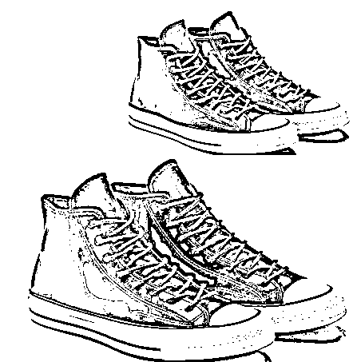
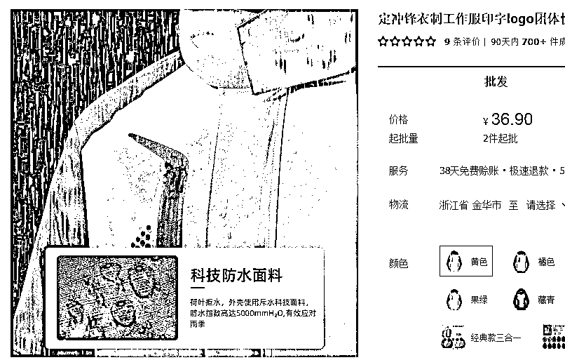

# 230202 懒人生财周报

> 原文：[`www.yuque.com/for_lazy/money/nquzcp7rrlrx2ehh`](https://www.yuque.com/for_lazy/money/nquzcp7rrlrx2ehh)

<ne-h1 id="b77b7823" data-lake-id="b77b7823"><ne-heading-ext><ne-heading-anchor></ne-heading-anchor><ne-heading-fold></ne-heading-fold></ne-heading-ext><ne-heading-content><ne-text id="u7078f43d">懒人生财周报</ne-text></ne-heading-content></ne-h1> <ne-p id="ud32880de" data-lake-id="ud32880de"><ne-text id="u0c2f67a6">整理日期：2023 年 02 月 03 日</ne-text></ne-p> <ne-p id="u5c32eef6" data-lake-id="u5c32eef6"><ne-text id="ue2f34639" ne-italic="true">懒人专属群</ne-text><ne-text id="u7ae38b1f">的群友们好，继续给大家整理分享新一期的《懒人生财周报》，希望可以带来启发，祝大家生财~</ne-text></ne-p> <ne-quote id="u9b859c36" data-lake-id="u9b859c36"><ne-p id="uee023f11" data-lake-id="uee023f11"><ne-text id="u73302452">生财周报来自某年费 3000 多的付费社群资源帖。</ne-text></ne-p> <ne-p id="u7ba28dbd" data-lake-id="u7ba28dbd"><ne-text id="u9c4f2e4a">本文档为</ne-text><ne-text id="u38b546b5" ne-italic="true">懒人专属群</ne-text><ne-text id="u2acaae37">内部分享，懒人手动整理。</ne-text></ne-p></ne-quote> <ne-p id="u8fc5cc35" data-lake-id="u8fc5cc35"><ne-text id="ud75885d8" ne-italic="true">生财风向标</ne-text><ne-text id="u47f1f5c8">系列单独用在线文档分享，地址见专属群 q 群消息。</ne-text></ne-p> <ne-p id="uf59b59e1" data-lake-id="uf59b59e1"><ne-text id="uf73ef552">一些帖子跳转飞书查阅，如需破解复制权限，见这篇文章：</ne-text></ne-p> <ne-p id="ub897e46c" data-lake-id="ub897e46c">[<ne-text id="u5ce6b1e8">解除复制限制！</ne-text>](https://mp.weixin.qq.com/s?__biz=MzI1NjAxOTI0Ng==&mid=2647895304&idx=1&sn=df7e3e36c3bf503a2513f8b4c6636d3d&chksm=f20a1349c57d9a5fccaa92c5068cb3e492ba9e3ebb178584d018892c0211214dc9d112c1f73c&token=37691864&lang=zh_CN#rd)</ne-p> <ne-p id="u1f8488fb" data-lake-id="u1f8488fb"><ne-text id="u3ef382e2">往期的生财周报合集（含在线版和离线版），见专属群 Q 群文件和群公告。</ne-text></ne-p> <ne-p id="ubd4101bf" data-lake-id="ubd4101bf"><ne-text id="udbc12d0e">希望大家有收获~</ne-text></ne-p> <ne-p id="u68787e5c" data-lake-id="u68787e5c"><ne-card data-card-name="image" data-card-type="inline" id="AxNfP" data-event-boundary="card"></ne-card></ne-p> <ne-p id="ueb9a4198" data-lake-id="ueb9a4198"><ne-text id="u97e2d149">果然春节屯的内容，节后都是要还的。</ne-text></ne-p> <ne-p id="ufe765ec9" data-lake-id="ufe765ec9"><ne-text id="u64fff7bb">怎么一口气更新这么多帖，小懒从早上整理到晚上，天都黑了，下班几个小时了。</ne-text></ne-p> <ne-p id="u4e01d80e" data-lake-id="u4e01d80e"><ne-text id="u2aa2fa05">看来不得不完善一下自动化脚本了，不然真的痛苦面具！</ne-text></ne-p> <ne-h2 id="767fa455" data-lake-id="767fa455"><ne-heading-ext><ne-heading-anchor></ne-heading-anchor><ne-heading-fold></ne-heading-fold></ne-heading-ext><ne-heading-content><ne-text id="u5a9430ab">目录</ne-text></ne-heading-content></ne-h2> <ne-p id="u12f403b5" data-lake-id="u12f403b5"><ne-text id="u86b945c2">[TOC]</ne-text></ne-p> <ne-h1 id="07053caa" data-lake-id="07053caa"><ne-heading-ext><ne-heading-anchor></ne-heading-anchor><ne-heading-fold></ne-heading-fold></ne-heading-ext><ne-heading-content><ne-text id="ue08638f9">生财认知</ne-text></ne-heading-content></ne-h1> <ne-h2 id="f962280e" data-lake-id="f962280e"><ne-heading-ext><ne-heading-anchor></ne-heading-anchor><ne-heading-fold></ne-heading-fold></ne-heading-ext><ne-heading-content><ne-text id="udc6e8b95">（88 赞）（精华帖）独创：必胜法之四步打造一个百万爆款</ne-text></ne-heading-content></ne-h2> <ne-p id="u2a236612" data-lake-id="u2a236612"><ne-text id="ufc36a4ef">——新手别着急上架铺货，先变专业一点才是捷径</ne-text></ne-p> <ne-p id="uc436acea" data-lake-id="uc436acea"><ne-text id="u9523ba33">1.我怎么看亚马逊、独立站、Tiktok、速卖通、Etsy、Ozon、Shopee、煤炉</ne-text></ne-p> <ne-p id="udbe4bfa8" data-lake-id="udbe4bfa8"><ne-text id="u7283f5f0">2.第一步【找蓝海】：蓝海市场、蓝海平台、蓝海产品方向</ne-text></ne-p> <ne-p id="uf6790435" data-lake-id="uf6790435"><ne-text id="ue4865685">3.第二步【走捷径】：流量捷径、转化捷径</ne-text></ne-p> <ne-p id="uae7f77f1" data-lake-id="uae7f77f1"><ne-text id="u11373390">4.第三步【加光环】：快速获得品牌力、溢价、复购</ne-text></ne-p> <ne-p id="u2dc78d06" data-lake-id="u2dc78d06"><ne-text id="u4a163eaa">5.第四步【微创新】：获得更长的红利期</ne-text></ne-p> <ne-p id="uc8db33a0" data-lake-id="uc8db33a0"><ne-text id="u462316fa">正文：</ne-text></ne-p> <ne-p id="u4fc5b52f" data-lake-id="u4fc5b52f"><ne-text id="ue02650d8">大家好，我是跨境杨少，13 年跨境电商老卖家，独创《选品四层方法论》，跨行业多项目连续创业者，90%以上的项目年变现百万级别，因为我是蓝海偏执狂。</ne-text></ne-p> <ne-p id="u2ba21c2a" data-lake-id="u2ba21c2a"><ne-text id="u5b96ee88">很多朋友对我的《选品四层方法论》感兴趣，本文是这个方法论的微缩版(完整版是付费课程)，我将选品从底层往上分为四层：</ne-text></ne-p> <ne-p id="u3c0a7fd1" data-lake-id="u3c0a7fd1"><ne-text id="u86236c98">1.套利</ne-text></ne-p> <ne-p id="ucfaf7dd4" data-lake-id="ucfaf7dd4"><ne-text id="u44b3279d">2.流量&转化</ne-text></ne-p> <ne-p id="u12e1501a" data-lake-id="u12e1501a"><ne-text id="u878175dd">3.模式</ne-text></ne-p> <ne-p id="uceaa371b" data-lake-id="uceaa371b"><ne-text id="u27325f76">4.品&品类。</ne-text></ne-p> <ne-p id="u2b39969a" data-lake-id="u2b39969a"><ne-text id="u71a629e6">其中，</ne-text></ne-p> <ne-p id="u04fc5f16" data-lake-id="u04fc5f16"><ne-text id="u407fa217">1 即低成本、信息差和确定性 ——控制风险</ne-text></ne-p> <ne-p id="u15979d5e" data-lake-id="u15979d5e"><ne-text id="u0a283706">2 即每一份钱和时间的花费都必须解决流量&转化两者或其一 ——杜绝自嗨</ne-text></ne-p> <ne-p id="u67e80c02" data-lake-id="u67e80c02"><ne-text id="ue4cc2f1e">3 即选品应进化为选模式 ——长红利期</ne-text></ne-p> <ne-p id="u323b1002" data-lake-id="u323b1002"><ne-text id="u4171e638">4 即要有自己的“选品字典” ——规模复制</ne-text></ne-p> <ne-p id="uf932e6ff" data-lake-id="uf932e6ff"><ne-text id="u3dc5de0f">这些在我以前的精华文中，有过一些解说，本文通过描述一个四步选品范式，来带大家感受一下这个 4 层结构是如何被满足的。文章标题一如既往耸动，竟然大言不惭说是必胜法，但一年多来，我不止一次分享此文，有作为亚马逊官方活动嘉宾的，也有在其他一些线下大会上分享，听众中不乏大卖、大 v、大服务商、大外贸厂老板，基本上大家都承认，他们的成功大多没有脱离这 4 步所在的范畴，其中有一些是做国内电商的朋友，也觉得有启发，有的还真的按这个思路选出了可以在淘宝卖的蓝海产品，有的客单净利高达 200-400，并且红利期还比较长。所以本文正标题就没有再强调跨境电商四个字了。</ne-text></ne-p> <ne-p id="u4dd5b913" data-lake-id="u4dd5b913"><ne-text id="u38dad983">生财有很多大咖大 v，本质是非常成功的流量团队，流量做的好当然就可以成功，甚至一夜暴富，但总有昙花一现的焦虑，最近看到盗坤公众号 po 文反思自己因为没有一个长期可做的好产品，而常常有在打游击之感，这是事实（很欣赏盗坤的自我迭代能力）。生财当然也有做产品水平很顶的大 v，比如 seven，但他的产品大多做白帽流量，相对很多流量团队的打法来说，有点偏冷启动的感觉。试想强流量与强产品如果能合璧，岂不是一个赢面非常大的长期主义的生意。</ne-text></ne-p> <ne-p id="ue8f87d00" data-lake-id="ue8f87d00"><ne-text id="u9f8555fe">讨论怎么做产品是很复杂的，有钱的打法有各种各样，说起怎么做差异化来，也许三天三夜也讲不完，本文试图从没钱的角度来讨论，做产品到底有没有什么成功率比较高的套路和规律，也希望能抛砖引玉，炸出更多的产品达人来分享自己的经验。</ne-text></ne-p> <ne-h3 id="9d55425d" data-lake-id="9d55425d"><ne-heading-ext><ne-heading-anchor></ne-heading-anchor><ne-heading-fold></ne-heading-fold></ne-heading-ext><ne-heading-content><ne-text id="u8c7dbfba">1.我怎么看亚马逊、独立站、Tiktok、速卖通、Etsy、Ozon、Shopee、煤炉</ne-text></ne-heading-content></ne-h3> <ne-p id="uce399f35" data-lake-id="uce399f35"><ne-text id="ucfb14299">会选品的人，在选平台的时候就能看出来，那些选了 1.小语种发达国家，2.人口大于一个亿，3.有本地入驻门槛的头部平台，是不是听上去就比不分青红皂白去做的人赚钱更轻松一点呢</ne-text></ne-p> <ne-p id="u1b499600" data-lake-id="u1b499600"><ne-text id="ufa58bfa5">先记住上面 3 点。</ne-text></ne-p> <ne-h3 id="706c69f3" data-lake-id="706c69f3"><ne-heading-ext><ne-heading-anchor></ne-heading-anchor><ne-heading-fold></ne-heading-fold></ne-heading-ext><ne-heading-content><ne-text id="u47cdde2e">a)亚马逊</ne-text></ne-heading-content></ne-h3> <ne-p id="u35e7a349" data-lake-id="u35e7a349"><ne-text id="u4488f45d">亚马逊怎么样，这问题没办法回答(专业的人容易较真，见谅)，因为亚马逊有欧洲、北美、拉美、日本、澳洲、印度、中东等，都好做吗，那肯定不是，比如澳洲是发达国家呀，客单也高呀竞争也少呀，但人口才两千万，亚马逊市占率甚至还低于 ebay，同样的功夫花下去，出不了几单。</ne-text></ne-p> <ne-p id="ub3ae7875" data-lake-id="ub3ae7875"><ne-text id="u1a76e5cf">我认为欧亚、美亚、日亚还是可以做一做，但也仅限于蓝海选品。</ne-text></ne-p> <ne-p id="u529ab70c" data-lake-id="u529ab70c"><ne-text id="u5e706564">美亚现在风评很不好，似乎很多新手亏了不少钱。但同一套蓝海打法，跑到虾皮毛利润没有，在亚马逊仍然可以客单净利 100 人民+。</ne-text></ne-p> <ne-p id="u6a26924c" data-lake-id="u6a26924c"><ne-text id="uc801df47">新手不懂蓝海，抓不到亚马逊的利基市场，不仅铺货还乱压 fba，一亏十万起，谁的问题。</ne-text></ne-p> <ne-p id="u198a1db5" data-lake-id="u198a1db5"><ne-text id="u6af887f1">fba 好还是 fbm 好，判断标准四个字：客户体验。fba 物流时效快，客户体验更好，产品有竞争的话，客户体验更好的人出单。如果真的抓到蓝海独家产品，只能找你买，你发货慢他也只能等，fbm 也一样出单，所以蓝海选品完全可以 fbm 测品，减小成本风险。</ne-text></ne-p> <ne-p id="u36c12204" data-lake-id="u36c12204"><ne-text id="u99400bda">我听过很多跨境主播的直播间，几乎没人把客户体验以及分产品这个判断依据讲出来。</ne-text></ne-p> <ne-p id="ue30b4619" data-lake-id="ue30b4619"><ne-text id="ue105f898">所以，新手面对 1.亚马逊好不好做 2.fba 还是 fbm，听谁的?听自己的!你要先懂!要知其所以然。讲不出所以然的，大概率镰刀，然后镰刀还告诉你，说可以 fbm 的都是割的不要问为什么，听我的就行，包你赚钱——嗯镰刀的第二个特征就是承诺可以发财。</ne-text></ne-p> <ne-h3 id="043304e4" data-lake-id="043304e4"><ne-heading-ext><ne-heading-anchor></ne-heading-anchor><ne-heading-fold></ne-heading-fold></ne-heading-ext><ne-heading-content><ne-text id="u1b2d3d45">b)独立站</ne-text></ne-heading-content></ne-h3> <ne-p id="u7b46b52f" data-lake-id="u7b46b52f"><ne-text id="u7fef39bf">过去三年我对接服务过 1000 多个独立站(有的老板是站群)，有些品类我一看基本就知道有没有戏，比如两三年前大部分独立站是杂货铺，确实有老板可以一个月赚 100 万，但近两年都死光了，因为杂货铺基本都是靠 fb 测爆款模式，本质上是铺货思维，没有选品，只是铺货形式展现为去 fb 铺广告组了(独立站站内铺货没意义因为没有自然流量)。</ne-text></ne-p> <ne-p id="u1c2b85be" data-lake-id="u1c2b85be"><ne-text id="ua4f17431">现在还活着的是品牌出海站、垂直站、定制站。</ne-text></ne-p> <ne-p id="u3a4dc821" data-lake-id="u3a4dc821"><ne-text id="u7b11fc84">两三年前顾小北强烈推荐的 fb+shopify 模式，现在也只能偃旗息鼓。</ne-text></ne-p> <ne-p id="u960206a4" data-lake-id="u960206a4"><ne-text id="u80090217">所以现在很多人说，独立站不好做了，不行了，这部分人基本都是掉过 fb 测爆款的坑的。</ne-text></ne-p> <ne-p id="u75f39a38" data-lake-id="u75f39a38"><ne-text id="u9cbd8a0b">上一篇文章我谈到流量分两种，人找货和货找人，fb 流量就属于货找人，现在由于模式信息差没了，测的人多，甚至还有很多不发货不对版的，roi 早崩了。</ne-text></ne-p> <ne-p id="u9384acfb" data-lake-id="u9384acfb"><ne-text id="uc0570a5d">但是独立站也有“人找货“这种购物平台式流量来源，这就是 seo（见效慢不推荐）、搜索广告和 google shopping 广告，如果再加上会蓝海选品，这部分独立站玩家目前是容易赚钱的。</ne-text></ne-p> <ne-p id="u527dcd54" data-lake-id="u527dcd54"><ne-text id="ufa9e6849">但目前世面独立站相关课程大多还是 fb+shopify 这个模式的，模式早崩了，就是顾小北亲自来教你，也没用。</ne-text></ne-p> <ne-p id="u49535cb0" data-lake-id="u49535cb0"><ne-text id="uc7442b63">所以说好做，说不好做都对，听谁的?听自己的!自己要懂底层判断依据:1.流量 2.转化。</ne-text></ne-p> <ne-p id="u804d5b5a" data-lake-id="u804d5b5a"><ne-text id="uaeff1aad">让自己稍微多懂一点，专业一点，不是那么难的，不专业咋赚钱呢。</ne-text></ne-p> <ne-h3 id="3c448f1f" data-lake-id="3c448f1f"><ne-heading-ext><ne-heading-anchor></ne-heading-anchor><ne-heading-fold></ne-heading-fold></ne-heading-ext><ne-heading-content><ne-text id="uec2c445e">c)tiktok</ne-text></ne-heading-content></ne-h3> <ne-p id="u27f06cba" data-lake-id="u27f06cba"><ne-text id="u50cfcf8b">又是个跟 fb 一样“货找人“的流量性质，算了，洗洗睡吧</ne-text></ne-p> <ne-p id="u7fa26ec1" data-lake-id="u7fa26ec1"><ne-text id="ubcf0acda">tk 是个娱乐平台，你卖货就要拍产品的视频，产品的短视频咋娱乐别人? 平台为什么要给你这种视频流量?</ne-text></ne-p> <ne-p id="u7c072865" data-lake-id="u7c072865"><ne-text id="u25080f27">tk 又分好多国家的，你选的好吗，不会又选到东南亚去了吧，oh my god。</ne-text></ne-p> <ne-p id="u74901a3f" data-lake-id="u74901a3f"><ne-text id="uad57cfdb">大力出奇迹，每天上 100 个视频，我要 all in~~你的时间不值钱?你 all in 一个月好好打工一万块赚不到?你这样做 tk 跟赌有啥区别?</ne-text></ne-p> <ne-p id="u4bc804b2" data-lake-id="u4bc804b2"><ne-text id="uc1e6e334">我上一篇文章谈到 90%新手做 tk 是两条腿断的在走路，一条就是流量，一条就是选品。另外是不懂得用付费广告解决流量跑的出去和通过投放标签选择相对精准的人群。但目前结合 tk 广告一级代理商的数据来看，tk 广告投放的 roi 极不稳定，即使付费玩家盈利的也不多，何况喜欢蹭蹭就好的玩家呢</ne-text></ne-p> <ne-p id="u4ea6f4bf" data-lake-id="u4ea6f4bf"><ne-text id="ue63c6671">tk 让人心痒的地方就在于，每天都有人自然流量爆单，但让人心碎的是每天爆的都不是你。</ne-text></ne-p> <ne-p id="ua1a49007" data-lake-id="ua1a49007"><ne-text id="u908fb317">成功老板都是抓确定性，只有韭菜财迷爱抓彩票，我接触的大卖，没有一个主战场在 tk。</ne-text></ne-p> <ne-h3 id="6c221bbf" data-lake-id="6c221bbf"><ne-heading-ext><ne-heading-anchor></ne-heading-anchor><ne-heading-fold></ne-heading-fold></ne-heading-ext><ne-heading-content><ne-text id="ufd09ac70">d)速卖通 虾皮</ne-text></ne-heading-content></ne-h3> <ne-p id="u76ddd78f" data-lake-id="u76ddd78f"><ne-text id="ub9b74aac">低价平台。</ne-text></ne-p> <ne-p id="ua5f07481" data-lake-id="ua5f07481"><ne-text id="ue3f34f3e">这两个平台的卖家，都比我厉害，因为我算来算去他们都是亏的，我是真的算不出他们怎么赚钱，那价格真的我只能说 word 妈，我认输，我太菜，我看不懂，再见。</ne-text></ne-p> <ne-p id="u1f2b4a2d" data-lake-id="u1f2b4a2d"><ne-text id="u03688a86">我在速卖通曾有过短暂的成功，大概两年不到，因为我做了一个在国内抢注成功的品牌的山寨，类似的打法还有抢注国外三线商标到手表之类的上面，然后上速卖通，因为速卖通只要有国内商标注册证就合规就可以卖，老外分不清这些，可以蹭流量，高客单高转化。</ne-text></ne-p> <ne-p id="u9137a251" data-lake-id="u9137a251"><ne-text id="u24394b1f">虾皮有一部分赚钱的店群卖家，产品或多或少还是跟侵权沾边，虾皮的现状是仿牌都卖亏本价，这让我们做蓝海选品的怎么玩，虾皮的入驻广告铺天盖地，跨境电商界坑宝妈和副业人群最多的就是虾皮。</ne-text></ne-p> <ne-p id="u1d438b47" data-lake-id="u1d438b47"><ne-text id="ub8eb0c59">Temu 也是低价平台，也不建议新手入。前两年 fanno 出来的时候，跨境界一片欢欣鼓舞，当时我接受一个财经媒体采访，我说不看好，因为 1.低价平台，2.作为字节亲儿子，tiktok 却不导流，底层上流量和转化这两点都是存疑的，半年后果然崩了。</ne-text></ne-p> <ne-h3 id="0faa2144" data-lake-id="0faa2144"><ne-heading-ext><ne-heading-anchor></ne-heading-anchor><ne-heading-fold></ne-heading-fold></ne-heading-ext><ne-heading-content><ne-text id="u8a3fdd84">e)etsy 和 ozon</ne-text></ne-heading-content></ne-h3> <ne-p id="u3547ff06" data-lake-id="u3547ff06"><ne-text id="uabca02f0">相对新兴平台，有一定铺货红利期，估计也快结束了，ozon 也是个低价平台，意思不大。</ne-text></ne-p> <ne-p id="uaffe2145" data-lake-id="uaffe2145"><ne-text id="u6c2b21d9">俄罗斯现在把西方大牌赶走了，将平行进口合法化，因此在 ozon 上卖仿牌有一定红利期窗口，只要你票据全，你懂的，中国卖家这些都能搞定。</ne-text></ne-p> <ne-p id="u654cc344" data-lake-id="u654cc344"><ne-text id="u670a39c5">etsy 有很多设计师产品，在手工艺品这个类目上，迭代的比亚马逊快，跟亚马逊之间有平台搬运红利，有助于亚马逊蓝海选品参考。</ne-text></ne-p> <ne-h3 id="afcc4ced" data-lake-id="afcc4ced"><ne-heading-ext><ne-heading-anchor></ne-heading-anchor><ne-heading-fold></ne-heading-fold></ne-heading-ext><ne-heading-content><ne-text id="u7b6addf1">f)煤炉 fb 商城 c2c</ne-text></ne-heading-content></ne-h3> <ne-p id="uf14bdffb" data-lake-id="uf14bdffb"><ne-text id="u9ff62542">这两个几乎都是店群或者批量账号卖仿牌的，不多讨论了。</ne-text></ne-p> <ne-h3 id="bc52af66" data-lake-id="bc52af66"><ne-heading-ext><ne-heading-anchor></ne-heading-anchor><ne-heading-fold></ne-heading-fold></ne-heading-ext><ne-heading-content><ne-text id="ue4877fbc">2.第一步【找蓝海】：蓝海市场、蓝海平台、蓝海产品方向</ne-text></ne-heading-content></ne-h3> <ne-p id="u1e5fcbec" data-lake-id="u1e5fcbec"><ne-text id="u14e47d47">我将蓝海市场蓝海平台做如下分类：</ne-text></ne-p> <ne-p id="ue28624b9" data-lake-id="ue28624b9"><ne-text id="ue3f7d45d">最蓝的（第一类蓝海）：1.小语种发达国家，2.人口大于一个亿，3.有本地入驻门槛的头部平台 ，比如日本乐天</ne-text></ne-p> <ne-p id="u8283d5d2" data-lake-id="u8283d5d2"><ne-text id="uaf566d54">次蓝的（第二类蓝海）：1.发到国家，2.人口大于一个亿，3.平台仍然有蓝海选品空间， 比如亚马逊欧美日</ne-text></ne-p> <ne-p id="uab443f61" data-lake-id="uab443f61"><ne-text id="ufbf6ccbb">微蓝的（第三类蓝海）：1.新上线的平台 ，2.刚开始开放中国卖家入驻的平台 ，即使是低价平台也有一点铺货红利期</ne-text></ne-p> <ne-p id="ubf6b73d2" data-lake-id="ubf6b73d2"><ne-text id="u8754f150">不蓝的：所有低价平台</ne-text></ne-p> <ne-p id="u5f96e933" data-lake-id="u5f96e933"><ne-text id="u822560a3">只要你有选蓝海市场蓝海平台的意识，你就已经超过了 90%跨境小白和新手。</ne-text></ne-p> <ne-p id="u8b2f459c" data-lake-id="u8b2f459c"><ne-text id="ubbd433b0">然后寻找这个市场的蓝海方向，比如日本我们找到真皮这个方向，美国我们找到户外防风防水科技材料这个方向，有没有一定的方法可以按图索骥的发现这些方向？“海关壁垒”算一个，还有“平台搬运”、“材质升级”等等，更多方法和怎么具体落地在我的付费课程《选品四层方法论》里面。</ne-text></ne-p> <ne-p id="u8e9b6d5f" data-lake-id="u8e9b6d5f"><ne-text id="ue0454359">真皮这个方向属于海关壁垒，详细文章见我第一篇精华帖，里面有详细的筛选过程、落地案例和细节。</ne-text></ne-p> <ne-p id="u1bac4c29" data-lake-id="u1bac4c29"><ne-text id="u51a396e8">简单来说就是，我们通过筛选日本海关关税信息，发现真皮制品在日本的关税非常高，导致真皮制品在日本这个市场的价格长期处于高位，没有被传统外贸倾销过，价格体系没有被打破过，比如真皮的靴子，日本人普遍认为应该卖到 100 多美元以上，而中国工厂出厂价格有的仅有几十人民币。这就是一片广阔的蓝海选品大方向。</ne-text></ne-p> <ne-p id="u7d6720b3" data-lake-id="u7d6720b3"><ne-text id="uf63bcede">蓝海方向不是蓝海品类，真皮或者科技材料，可以做的品类有好几个，比如真皮我们重点选择了鞋类，科技材料我们即做了鞋类也做了服装类。</ne-text></ne-p> <ne-p id="u801288b4" data-lake-id="u801288b4"><ne-text id="u34c0a1c6">蓝海方向虽然有了，但还是很宽泛的，距离落实具体选品，虽然还有一些距离，但这一步，我们已经开始解决精准流量了，因为真皮就是一个相对垂直的关键词，对应的就是对产品有一定要求，并有一定消费力的人群，同样高科技材料也是一样，有自己的搜索量。</ne-text></ne-p> <ne-p id="ubd4a8a38" data-lake-id="ubd4a8a38"><ne-text id="u449d1999">到了这一步，你已经实现了蓝中蓝，基本告别了难中难（比如虾皮），可以说超越了 99%刚入门的小白和新手。</ne-text></ne-p> <ne-h3 id="1b7ecb81" data-lake-id="1b7ecb81"><ne-heading-ext><ne-heading-anchor></ne-heading-anchor><ne-heading-fold></ne-heading-fold></ne-heading-ext><ne-heading-content><ne-text id="u3f654111">3.第二步【走捷径】：流量捷径、转化捷径</ne-text></ne-heading-content></ne-h3> <ne-p id="uf6fca28e" data-lake-id="uf6fca28e"><ne-text id="u3e5b629b">“七分选品，三分运营”？</ne-text></ne-p> <ne-p id="u082302e9" data-lake-id="u082302e9"><ne-text id="u850fb92a">我们认为选品就是运营，运营要解决的问题主要就是两个：流量，转化。</ne-text></ne-p> <ne-p id="uc415a77e" data-lake-id="uc415a77e"><ne-text id="u4937798b">好的选品，在确定具体产品的时候，就已经确定引流方法，和转化方法（卖点）。</ne-text></ne-p> <ne-p id="uc89d876a" data-lake-id="uc89d876a"><ne-text id="ub810452f">即好的选品模式，必须把流量和转化，解决一个，或者两个都解决。</ne-text></ne-p> <ne-p id="u01492521" data-lake-id="u01492521"><ne-text id="u77ff8d41">我们举一个两个都解决的选品模式的案例：</ne-text></ne-p> <ne-p id="u86337d34" data-lake-id="u86337d34"><ne-text id="u508a6daa">合规山寨</ne-text></ne-p> <ne-p id="ub645721e" data-lake-id="ub645721e"><ne-text id="ua4b29b46">很多朋友分不清山寨和仿牌，仿牌是违法的，山寨虽然确实是有一些产品是侵权的，比如侵犯商标权，专利权（外观专利 设计专利 知识产权专利等），但也有大量的山寨产品可以做到合规，为了区分，这类合规产品我们不使用山寨二字，而使用“平替”二字，即：</ne-text></ne-p> <ne-p id="u1c490a58" data-lake-id="u1c490a58"><ne-text id="u5a07f1c9">合规平替</ne-text></ne-p> <ne-p id="u9a588d4a" data-lake-id="u9a588d4a"><ne-text id="u60f340a4">合规平替不仅可以平替具体明星产品，也可以平替高端材质，这两种做产品的方向都是自带流量的，因为明星产品和高端材质，是有相应的搜索流量的，这也是我们可以布局的精准流量，只要产品合规，有自己的品牌，在亚马逊是可以大胆投放竞品品牌的关键词广告的，包括了很多知名大牌，除了品牌词，还有产品系列词等等，都是好用便宜的精准流量词，既可以直接投放付费广告，也可以做关键词优化自然流量。在我们的课程里，这部分提供了 4 个具体的寻找精准词的引流方法，另外还包括平替如何实现合规。</ne-text></ne-p> <ne-p id="u3fb3b5b7" data-lake-id="u3fb3b5b7"><ne-text id="uf14ba4a6">在真皮鞋类，我们给一个合规平替的案例如下图产品</ne-text></ne-p> <ne-p id="u8d6ccafd" data-lake-id="u8d6ccafd"><ne-card data-card-name="image" data-card-type="inline" id="pWhEE" data-event-boundary="card"></ne-card></ne-p> <ne-p id="u8b711021" data-lake-id="u8b711021"><ne-text id="u7da2a6b2">其实这个平替产品选择的很一般，因为背后的明星产品的原价并不是很高，品牌也不是奢侈品品牌，这个带来的影响就是，转化率不太行。之所以举这个例子，是因为这个产品在第四步差异化上我们给他增加了一些确定性热点元素，做出了高客单高利润的产品。</ne-text></ne-p> <ne-p id="u11487882" data-lake-id="u11487882"><ne-text id="u3b0964b5">好的平替，可以打原价的十分之一的价格，净利润还有 200 人民币以上。</ne-text></ne-p> <ne-p id="uf7c61fa5" data-lake-id="uf7c61fa5"><ne-text id="u5fcc3939">这就是为什么我们说这个选品模式把转化也解决的很多，因为它提供了极致性价比。在发达国家市场，平替切忌做低客单的烂货，一则赚不到钱，二则退货会非常多，甚至会倒亏钱。具体标准就是要能达到原产品的客户体验的 90%，但是价格只有五分之一甚至更少。</ne-text></ne-p> <ne-p id="ubf7e3e6c" data-lake-id="ubf7e3e6c"><ne-text id="u4eede0de">材质平替的案例我们看这个产品：</ne-text></ne-p> <ne-p id="u13cdf205" data-lake-id="u13cdf205"><ne-card data-card-name="image" data-card-type="inline" id="xRpPx" data-event-boundary="card"></ne-card></ne-p> <ne-p id="ud034df96" data-lake-id="ud034df96"><ne-card data-card-name="image" data-card-type="inline" id="HwDm8" data-event-boundary="card"></ne-card></ne-p> <ne-p id="ud45f0852" data-lake-id="ud45f0852"><ne-text id="u6d74413f">这个产品可以蹭到的流量是冲锋衣+goretex 这个长尾精准流量。</ne-text></ne-p> <ne-p id="u0922765b" data-lake-id="u0922765b"><ne-text id="udbe1facd">转化优势上，由于它只有 goretex 的成品价格的五分之一，所以具备性价比转化优势。</ne-text></ne-p> <ne-p id="u4fb99636" data-lake-id="u4fb99636"><ne-text id="u773b8c3c">这两个例子我们看到：选品的同时，流量方案和转化方案也是同时就确定了的，留给运营的任务只是一些具体的上架，设置广告等事情，这就对运营的专业度要求要小了不少，甚至实习生也可以做，另外这种选品是有固定参考来源的，本文不详细说，结果就是可以形成查字典一样选品输出，这对负责选品的运营的要求又低了很多，实习生也可以完成，就算 0 起步的一人创业，也可以一个人完全胜任所有选品和运营的工作，因为，套路很固定。</ne-text></ne-p> <ne-p id="ucef63198" data-lake-id="ucef63198"><ne-text id="u75edb97f">合规平替是一个适用绝大部分类目的宝藏选品方向，因为它既有流量捷径，也有转化捷径。</ne-text></ne-p> <ne-p id="u5141052f" data-lake-id="u5141052f"><ne-text id="u23e6d4ee">大多数卖家到这一步，已经获得 1-3 年的蓝海选品产品库，已经够用，如果小语种发达国家，红利期会更长一点。</ne-text></ne-p> <ne-h3 id="d79f3276" data-lake-id="d79f3276"><ne-heading-ext><ne-heading-anchor></ne-heading-anchor><ne-heading-fold></ne-heading-fold></ne-heading-ext><ne-heading-content><ne-text id="u9eea6d6d">4.第三步【加光环】：快速获得品牌力、溢价、复购</ne-text></ne-heading-content></ne-h3> <ne-p id="u2ad52875" data-lake-id="u2ad52875"><ne-text id="uf443e6c4">十年前，我们发现，JEEP、骆驼、CAT 的鞋服，实际上跟美国 JEEP 越野车、骆驼香烟、CAT 重型机械没啥关系，这三个鞋服品牌在国内最早是由中国老板成功抢注下来的。虽然十年后这三个品牌都不同程度的与美国品牌方达成和解或者授权，普通卖家已经不能随便去卖，但是这个骚操作，是值得我们借鉴的。</ne-text></ne-p> <ne-p id="uc2ad9859" data-lake-id="uc2ad9859"><ne-text id="uca544b63">十年前，我们发现日本市场乐天平台和亚马逊平台，对这三个品牌的鞋服都不要求授权备案，也不进行审查，因为这三个品牌的鞋服其实在国外并不存在，由于是知名品牌，也没办法在日本抢注到鞋服类目上。所以对我们中小卖家形成一个几年的搬运倒卖的窗口期。这正是我们第二桶金的来源，我们在日本长期垄断了这三个品牌鞋服的销售，我们还给他们起了个名字，叫做空壳品牌。这也是一种选品模式，虽然只有特定的窗口期。</ne-text></ne-p> <ne-p id="u2d1d91fd" data-lake-id="u2d1d91fd"><ne-text id="u47c6aa96">这个模式到今天仍然是具备可复制性的，例如上文提到的我们在速卖通能做到客单净利润 100+的产品，就是这个模式出来的。而且空壳品牌在速卖通有独有的合规优势，上文已经解释。</ne-text></ne-p> <ne-p id="ue6d5b0f8" data-lake-id="ue6d5b0f8"><ne-text id="ub216dba8">我们把空壳品牌按占便宜程度/境外合规风险程度，分为如下几类：</ne-text></ne-p> <ne-p id="uef424c4b" data-lake-id="uef424c4b"><ne-text id="uaa078639">1.抢注国外品牌，并复制它的全系产品（例如 koolaburra 已被 ugg 收购）</ne-text></ne-p> <ne-p id="ub160b246" data-lake-id="ub160b246"><ne-text id="uecf3a93c">2.抢注国外品牌，并跨类目做新类目产品（速卖通常见套利玩法）</ne-text></ne-p> <ne-p id="uf08e992e" data-lake-id="uf08e992e"><ne-text id="ud47fb637">3.在国外注册品牌，策划国外的品牌故事和品牌形象（国内电商常见品牌捷径）</ne-text></ne-p> <ne-p id="u778b16ff" data-lake-id="u778b16ff"><ne-text id="ub8c69f57">在不同时期，以上 3 种打法均在亚马逊有过窗口期，目前还可以继续做的是第三类。</ne-text></ne-p> <ne-p id="uf51bba83" data-lake-id="uf51bba83"><ne-text id="u54ead9f0">很多老板做品牌出海，或者美亚，老老实实的用自己的中国品牌形象，不是不行，但是更好的方案一定是策划一个空壳品牌，比如我们在日本做一个德国品牌，在东欧做一个日本品牌，在美国做一个欧洲或者日本品牌，这都是可行的，本土客户查不到，故事随便你说。</ne-text></ne-p> <ne-p id="u2034d9dc" data-lake-id="u2034d9dc"><ne-text id="u3c62b0d0">这个打法在淘宝也有非常大的红利，某做渔具的淘系卖家，就把它的渔具包装成日本品牌，做日本独立站官网，反向营销到国内市场，因为日本渔具比较有口碑，直接带来的就是远高于淘宝渔具正常利润的高溢价空间，和复购。</ne-text></ne-p> <ne-p id="uc60f0be5" data-lake-id="uc60f0be5"><ne-text id="uf77ee4b1">按我们的经验来看，成功的空壳品牌，可以做到 10%的复购，可以带来的净利提升最多可以达到 30%，这不仅是一个增加转化的方法，有时候甚至可以单独演变成一个选品模式，低成本、搬运式输出成功产品去跨境市场，这个由于信息差比较大，以后有机会再介绍。</ne-text></ne-p> <ne-h3 id="5b1db9b1" data-lake-id="5b1db9b1"><ne-heading-ext><ne-heading-anchor></ne-heading-anchor><ne-heading-fold></ne-heading-fold></ne-heading-ext><ne-heading-content><ne-text id="u478dcc1d">5.第四步【微创新】：获得更长的红利期</ne-text></ne-heading-content></ne-h3> <ne-p id="uf0f73fdf" data-lake-id="uf0f73fdf"><ne-text id="uad852ad1">前三步基本上都是可以工具化实现，要么花点钱实现，第四步主要是做产品的差异化，这个对人的要求高一些，如果做成功，对应的护城河更深，产品红利期也是更长的。</ne-text></ne-p> <ne-p id="ubcb57638" data-lake-id="ubcb57638"><ne-text id="uc4628923">微创新其实就是不创新。</ne-text></ne-p> <ne-p id="u3913db63" data-lake-id="u3913db63"><ne-text id="ua3bed37c">我们比较推荐新手去做的微创新差异化套路是：材质套利，是上文材质平替的一个延申。</ne-text></ne-p> <ne-p id="u05c66a0d" data-lake-id="u05c66a0d"><ne-text id="u220d0056">新手做差异化，不要去考虑原创设计，痛点迭代，这些方向没有专业积淀，很难拿到成功确定性，新手适合基于大标品，去做升级式的和热点嫁接式的差异化产品。</ne-text></ne-p> <ne-p id="u2b891926" data-lake-id="u2b891926"><ne-text id="u6521ec5b">首先，大标品不愁卖，也不需要买选品软件去分析大标品，但是大标品往往很多是低级材质，或者价格战重灾区，客单非常低，没有利润空间，大多数新手也喜欢一上来就干这个，跨境直播间凡是讲亚马逊热卖产品的，都不乏人气，这在我看来跟路边看人吵架没啥区别，没有任何意义。</ne-text></ne-p> <ne-p id="u7079f268" data-lake-id="u7079f268"><ne-text id="ucda7a806">其次，真正的高端货，中国卖家向来也不去挑战，也挑战不了，那么中端性价比市场就相对空白，我们找出高端材质这个方向，找到可以还原 90%体验的低成本平替材质，去做这个稍稍消费升级的人群，将规避掉大量的竞争，获得长期的蓝海空间，上文的平替的案例可以看到，1688 已经有现成的供应商，甚至投入就在几千块的水平就可以做出差异化产品，这个非常适合新手。</ne-text></ne-p> <ne-p id="u821a4967" data-lake-id="u821a4967"><ne-text id="uf63759f8">我们来看下材质平替套利差异化后的产品在亚马逊的案例：</ne-text></ne-p> <ne-p id="uaaf174ce" data-lake-id="uaaf174ce"><ne-text id="u082e63fb">直接搜索冲锋衣，美亚首页产品是</ne-text></ne-p>  <ne-p id="u1c0bad11" data-lake-id="u1c0bad11"><ne-card data-card-name="image" data-card-type="inline" id="f0Ifq" data-event-boundary="card"><ne-p id="u91d7ca1b" data-lake-id="u91d7ca1b"><ne-text id="u4c9a8854">最低的十几美金，例如</ne-text></ne-p>  <ne-p id="u3bc27712" data-lake-id="u3bc27712"><ne-card data-card-name="image" data-card-type="inline" id="T5nG8" data-event-boundary="card"><ne-p id="u69344fd9" data-lake-id="u69344fd9"><ne-text id="u5bba3853">而搜索冲锋衣+goretex 首页产品为</ne-text></ne-p>  <ne-p id="u4a0f2234" data-lake-id="u4a0f2234"><ne-card data-card-name="image" data-card-type="inline" id="V9fl9" data-event-boundary="card"><ne-p id="ub20d095e" data-lake-id="ub20d095e"><ne-text id="u76218cd5">客单已经 100 多 200 多美金，在这个首页我们也看到有这个产品：</ne-text></ne-p>  <ne-p id="u52e9fab2" data-lake-id="u52e9fab2"><ne-card data-card-name="image" data-card-type="inline" id="WGBve" data-event-boundary="card"><ne-p id="ua5113c26" data-lake-id="ua5113c26"><ne-text id="ua69eb789">销量非常好，在 100-200 多的众多 sku 中，39.99 的它鹤立鸡群，这就是我们说的将比价劣势转化为比价优势，它虽然不是 goretex 的，但是搜索 goretex 它会展示，它功能相同，它足够便宜。</ne-text></ne-p> <ne-p id="ua9270c18" data-lake-id="ua9270c18"><ne-text id="u88f8ac1b">但是如果把它放到与 10 几 20 几的冲锋衣一起展示，它就无法展现它差异化的卖点也没有价格优势，所以这个 sku 干脆放弃标品词，只做长尾词，这样才能获得流量优势，转化优势。这就是差异化产品的优势。</ne-text></ne-p> <ne-p id="u63d05d80" data-lake-id="u63d05d80"><ne-text id="u75b1c8b7">刚才是材质升级、平替套利的差异化。</ne-text></ne-p> <ne-p id="u7bb5922c" data-lake-id="u7bb5922c"><ne-text id="u8fbf10f0">下面我们看一个材质升级+平替套利+热点嫁接的差异化：</ne-text></ne-p>  <ne-p id="ub7302eb1" data-lake-id="ub7302eb1"><ne-card data-card-name="image" data-card-type="inline" id="lPDau" data-event-boundary="card"><ne-p id="u9c239c6a" data-lake-id="u9c239c6a"><ne-text id="uad23b9b9">材质升级：帆布升级到真皮</ne-text></ne-p> <ne-p id="udb74eaea" data-lake-id="udb74eaea"><ne-text id="u392c3531">平替套利：头层皮换成二层皮，成本下降三分之二</ne-text></ne-p></ne-card></ne-p></ne-card></ne-p></ne-card></ne-p></ne-card></ne-p></ne-card></ne-p>