# 230117 懒人生财周报

> 原文：[`www.yuque.com/for_lazy/money/ey3qc91snfvg9ull`](https://www.yuque.com/for_lazy/money/ey3qc91snfvg9ull)

<ne-h1 id="b77b7823" data-lake-id="b77b7823"><ne-heading-ext><ne-heading-anchor></ne-heading-anchor><ne-heading-fold></ne-heading-fold></ne-heading-ext><ne-heading-content><ne-text id="u90ebce22">懒人生财周报</ne-text></ne-heading-content></ne-h1> <ne-p id="u506bdf6c" data-lake-id="u506bdf6c"><ne-text id="u356eb172">整理日期：2023 年 1 月 17 号</ne-text></ne-p> <ne-p id="ubc257f31" data-lake-id="ubc257f31"><ne-text id="u33ddbc25">懒人专属群的群友大家好。小懒继续给大家带来生财周报～</ne-text></ne-p> <ne-quote id="uedd251d2" data-lake-id="uedd251d2"><ne-p id="u2d3e258d" data-lake-id="u2d3e258d"><ne-text id="ua00ee901">生财周报来自某年费 3000 多的付费社群资源帖。</ne-text></ne-p> <ne-p id="u2c7e0656" data-lake-id="u2c7e0656"><ne-text id="uc2fd2931">本文档为</ne-text><ne-text id="u7015cb24" ne-italic="true">懒人专属群</ne-text><ne-text id="u9cc51b69">内部分享，懒人手动整理。</ne-text></ne-p></ne-quote> <ne-p id="u8fb76cda" data-lake-id="u8fb76cda"><ne-text id="ue98e9337" ne-italic="true">生财风向标</ne-text><ne-text id="u6883a536">系列单独用在线文档分享，地址见专属群 q 群消息。</ne-text></ne-p> <ne-p id="u924fdd3a" data-lake-id="u924fdd3a"><ne-text id="ub1e4446f">一些帖子跳转飞书查阅，如需破解复制权限，见这篇文章：</ne-text></ne-p> <ne-p id="u2346f373" data-lake-id="u2346f373">[<ne-text id="u03f16e8d">解除复制限制！</ne-text>](https://mp.weixin.qq.com/s?__biz=MzI1NjAxOTI0Ng==&mid=2647895304&idx=1&sn=df7e3e36c3bf503a2513f8b4c6636d3d&chksm=f20a1349c57d9a5fccaa92c5068cb3e492ba9e3ebb178584d018892c0211214dc9d112c1f73c&token=37691864&lang=zh_CN#rd)</ne-p> <ne-p id="u1ac7628f" data-lake-id="u1ac7628f"><ne-text id="u6280a6af">往期的生财周报合集（含在线版和离线版），见专属群 Q 群文件和群公告。</ne-text></ne-p> <ne-p id="ude9cfe9f" data-lake-id="ude9cfe9f"><ne-text id="u8b1628ef">希望大家有收获~</ne-text></ne-p> <ne-p id="u3bfadb78" data-lake-id="u3bfadb78"><ne-card data-card-name="image" data-card-type="inline" id="M3sOB" data-event-boundary="card">  <ne-p id="u8432f69d" data-lake-id="u8432f69d"><ne-text id="u645a34f3">标题加了(精华)的表示精华贴，前面为截至今日的点赞数。</ne-text></ne-p> <ne-p id="u14a80d9e" data-lake-id="u14a80d9e"><ne-text id="u335ae60e">以下是目录，内容有些多。大家可以挑兴趣的内容阅读。</ne-text></ne-p> <ne-p id="u2e30f8fd" data-lake-id="u2e30f8fd">[<ne-text id="u1231c595">懒人专属群更新记录（点此跳转）</ne-text>](https://lazybook.netlify.app/#/blog/record2)</ne-p> <ne-h1 id="4b94dae3" data-lake-id="4b94dae3"><ne-heading-ext><ne-heading-anchor></ne-heading-anchor><ne-heading-fold></ne-heading-fold></ne-heading-ext><ne-heading-content><ne-text id="u68f0ac1a">【目录】</ne-text></ne-heading-content></ne-h1> <ne-p id="u8d2e2853" data-lake-id="u8d2e2853"><ne-text id="uab49e45b">在线版目录可以见左侧大纲</ne-text></ne-p> <ne-h1 id="83e7ae2d" data-lake-id="83e7ae2d"><ne-heading-ext><ne-heading-anchor></ne-heading-anchor><ne-heading-fold></ne-heading-fold></ne-heading-ext><ne-heading-content><ne-text id="ud59b5697">【生财认知】</ne-text></ne-heading-content></ne-h1> <ne-h2 id="4569ed6d" data-lake-id="4569ed6d"><ne-heading-ext><ne-heading-anchor></ne-heading-anchor><ne-heading-fold></ne-heading-fold></ne-heading-ext><ne-heading-content><ne-text id="uc0189d4f">（130 点赞）（精华帖）《一个千万项目的底层逻辑》</ne-text></ne-heading-content></ne-h2> <ne-p id="u832cea2f" data-lake-id="u832cea2f"><ne-text id="u73e9ec4e">《一个千万项目的底层逻辑》 前两天说了，要开始在生财持续输出，今天带来一篇认知方面的文章。</ne-text></ne-p> <ne-p id="ub3b1a800" data-lake-id="ub3b1a800"><ne-text id="u5aa93b46">完整全文见飞书：</ne-text></ne-p> <ne-p id="u4b70c7aa" data-lake-id="u4b70c7aa">[<ne-text id="ued1a6dde">https://xsej9se9cv.feishu.cn/docx/NxhWdJj3UoPKvmxaBqkcz8wlntf</ne-text>](https://xsej9se9cv.feishu.cn/docx/NxhWdJj3UoPKvmxaBqkcz8wlntf)</ne-p> <ne-h2 id="12d4371c" data-lake-id="12d4371c"><ne-heading-ext><ne-heading-anchor></ne-heading-anchor><ne-heading-fold></ne-heading-fold></ne-heading-ext><ne-heading-content><ne-text id="u1bd0046a">（42 赞）《视频号直播后结合私域的一些数据和感受，真实的 roi 到底是什么？》</ne-text></ne-heading-content></ne-h2> <ne-p id="u9d78dc01" data-lake-id="u9d78dc01"><ne-text id="uc9527228">一直以来我有一个认知，觉得自己是追风少年，今天这个好，我去做一下。明天那个好，又做一下。确实也都挣到钱了，以为是自己厉害，执行力强。其实很多是红利给的钱，深耕进去就不一定干得过别人了。每年还是存在一定的焦虑，因为现在信息传递越来越快了，项目红利期是越来越短的。所以我就在思考，怎么样能长短线结合，又有短期的爆发力，又有长期的基本盘。目前看，视频号直播+私域是有这个属性的。</ne-text></ne-p> <ne-p id="u3b8247cf" data-lake-id="u3b8247cf"><ne-text id="ubb71b666">近期与朋友们交流，让我对投产比又有了进一步的认知，深刻体会到有一帮朋友能交流前沿信息的重要性。</ne-text></ne-p> <ne-p id="ucc149dd2" data-lake-id="ucc149dd2"><ne-text id="u7f96ba46">那么真实的 roi 到底是什么？</ne-text></ne-p> <ne-p id="uc4481702" data-lake-id="uc4481702"><ne-text id="u77276fc5">从品牌角度说，品牌方的直播可以不挣钱甚至亏钱，有了曝光，知名度，从线下挣钱，或从金融渠道挣钱。</ne-text></ne-p> <ne-p id="u9d5b8187" data-lake-id="u9d5b8187"><ne-text id="ucee689c2">从目前抖音的一些运营来说，前端直播猛投，roi 不一定打正，在后端吃商城自然流量挣钱，对供应链要求更深。</ne-text></ne-p> <ne-p id="u90ed8d08" data-lake-id="u90ed8d08"><ne-text id="u8b35073d">其实很多业务都有这种性质，明面不挣钱，挣的不是明面上的钱。</ne-text></ne-p> <ne-p id="ue2cea11a" data-lake-id="ue2cea11a"><ne-text id="u77286112">那么视频号的直播加私域今天来给大家算一算里面的账。</ne-text></ne-p> <ne-p id="uc90d3a53" data-lake-id="uc90d3a53"><ne-text id="uba7e13a4">假设我的产品核算退货后毛利率为 40%，roi2.5 就能打平，再核算人工场地的开支，这种就是平时单做直播时候的算法。</ne-text></ne-p> <ne-p id="u839668f1" data-lake-id="u839668f1"><ne-text id="u60db81e3">但是考虑到私域以后呢，一般我们会从订单，或者在直播的时候弹企业微信去加客户进私域，大概总体的进粉率有 60%。单粉的产值主要看产品，有的产品月产值能到大几十上百，这要靠测。</ne-text></ne-p> <ne-p id="uef2fdb83" data-lake-id="uef2fdb83"><ne-text id="ub5fbd778">我们 150 客单价的产品，进粉率 60%的情况下，月产值只能做到 8（理论上是能做到 15 以上）年产值算完衰减，能到 60。</ne-text></ne-p> <ne-p id="u7bc4e0e3" data-lake-id="u7bc4e0e3"><ne-text id="ufd27f3ea">roi2.5 也就是我 100 万的营业额，需要有 40 万的广告投放，那么在这 40 万的投放算到私域中，我将额外有 100 万</ne-text><ne-text id="u1563053c" ne-italic="true">60%</ne-text><ne-text id="u3bddce11">60/150=24 万的私域营业额，这一块是无需投放的，大头需要考虑销售员的人工成本，一个销售员能维护一两万的客户，从月产值看就是 10 20 万的营收，人工成本核算下来占到 5%左右，也就是 24 万的私域营业额需要 1.2 万的人工成本。</ne-text></ne-p> <ne-p id="uc447acb5" data-lake-id="uc447acb5"><ne-text id="ud8340770">这么一算我的 roi 就从 2.5 提升到了 3.5，非常刺激的是，跟私域前辈了解后，我的月产值 8 和年产 60 这个数据是非常非常保守的数据，正常这个数据翻个倍才是合理的，翻个倍的话 roi 就能提升到 4.5，大多数产品都能打正了。而且合适的品，可能私域卖的都能比直播间还要多。这个年产不代表只有一年，第二年仍然有收益只是有一个衰败周期，但是这个衰败周期越往后越慢，且产品品质好的情况下，转介绍也能有 10%左右。</ne-text></ne-p> <ne-p id="ue5dd602e" data-lake-id="ue5dd602e"><ne-text id="uf07aff12">本来写了很多，我觉得把复杂的东西简单化是我喜欢的做法，可能很多人听我算完帐已经晕了，我可以给大家总结一下。</ne-text></ne-p> <ne-p id="u0677e3f2" data-lake-id="u0677e3f2"><ne-text id="u8104fd1a">做一个公式</ne-text></ne-p> <ne-p id="ud3eb5b14" data-lake-id="ud3eb5b14"><ne-text id="u28b33376">客单价 n 的产品，毛利率如果是 q，投入 y，直播间除去退货后营业额为 z。</ne-text> <ne-text id="ub5286d30">私域进线率 60%为合格，月产值为 p。</ne-text></ne-p> <ne-p id="u229020f7" data-lake-id="u229020f7"><ne-text id="udbc0b075">那么你只做直播间</ne-text> <ne-text id="uab8afa48">纯利润就是 q*z-y</ne-text> <ne-text id="ua9e26edd">做私域后</ne-text> <ne-text id="u878f6145">纯利润就是 q*z-y</ne-text> <ne-text id="ub1c9c944">每个月加上 z/n</ne-text><ne-text id="u933ae36e" ne-italic="true">60%</ne-text><ne-text id="ub5e622c6">p，月递减前 3 个月按 80%算，后面看维护，衰败会越来越低，大概最后到第一个月的 50%能浮动比较久。</ne-text></ne-p> <ne-p id="uf08ee063" data-lake-id="uf08ee063"><ne-text id="uab2990d6">举个例子，我卖 150 元客单价的茶叶，毛利率是 40%，每天我投入 3 万广告费用，退货后营业额 10 万，那么我的直播间毛利润是每天 1 万元。</ne-text> <ne-text id="u3a190725">按这种订单量，每天能有 400 个人进私域，月加粉就是 12000，假设月产值为 15 元，第一个月私域部分能带来 18 万的营收，这部分人第二个月营收估计为 15 万，第三个月营收估计为 12 万，6 个月之后稳定在 9 万左右。年产值就是 100 万到 150 万，成本大头为人工成本占营收 5 到 10%。取中间值，核算下来年利润为 40 万，12 个月都这样，年利润就是 500 个，直播间亏钱都不怕。而且就算直播项目死了，这个项目仍然能发展几年。</ne-text></ne-p> <ne-p id="u807df83f" data-lake-id="u807df83f"><ne-text id="ubd5a8dc6">我的算法相对保守，圈友可以自己去演算，而且这是一个人人都能做项目，几个人的团队就能完成，私域货款现结，主要是直播间的货款和投流费用，如果能谈到产品账期，前期投入就更轻了。</ne-text></ne-p> <ne-p id="u7ac29cee" data-lake-id="u7ac29cee"><ne-text id="u97d23625">有做这块的可以多交流，坚信越交流越有。</ne-text></ne-p> <ne-p id="u27e1014b" data-lake-id="u27e1014b"><ne-text id="u48ef7af2">写到这发现我写的都是算帐，没有太多具体实操的东西，因为具体的东西，比如怎么做直播，怎么加人进私域，怎么私域成交，其实生财里有太多直播，私域的干货了，结合起来就行了。</ne-text></ne-p> <ne-p id="u78d9454f" data-lake-id="u78d9454f"><ne-text id="u79aac4d2">#私域流量#</ne-text><ne-text id="uf264b9ff">#视频号#</ne-text></ne-p> <ne-h2 id="50331430" data-lake-id="50331430"><ne-heading-ext><ne-heading-anchor></ne-heading-anchor><ne-heading-fold></ne-heading-fold></ne-heading-ext><ne-heading-content><ne-text id="ue905f97a">（44 赞）《怎么找到一个可以赚钱的项目，如何判断一个项目适不适合自己做？》</ne-text></ne-heading-content></ne-h2> <ne-p id="u1272f969" data-lake-id="u1272f969"><ne-text id="uc786a0af">我做了几个抖音号，主要是分享，拆解一些互联网上的项目。</ne-text></ne-p> <ne-p id="u3789e731" data-lake-id="u3789e731"><ne-text id="u60d22b12">项目拆解类型的账号吸引的自然都是想要做互联网的创业者，或者是正在创业的人群。</ne-text></ne-p> <ne-p id="u14589011" data-lake-id="u14589011"><ne-text id="u1634dad2">目前做的也还不错，几个账号每天可以引流 300+的创业粉丝到我的微信上。</ne-text></ne-p> <ne-p id="u907121d1" data-lake-id="u907121d1"><ne-text id="ubd478faf">所以每天就会有很多创业粉丝问我，康哥你分享了这么多项目，每个都还附带了做的教程，那么多项目哪些做了可以赚到钱，哪些是赚不到钱的项目呢？</ne-text></ne-p> <ne-p id="u1f1a453c" data-lake-id="u1f1a453c"><ne-text id="ud9c97b94">每天都会有粉丝问这个问题，所以写篇文章和大家讨论下，怎么找项目，如何判断一个项目的真假，是不是割韭菜，自己能不能做。</ne-text></ne-p> <ne-p id="u7d45a12f" data-lake-id="u7d45a12f"><ne-text id="u95e3c357" ne-bold="true">怎么找项目呢？</ne-text></ne-p> <ne-p id="uca4c2d03" data-lake-id="uca4c2d03"><ne-text id="u398341d8">我有点经验，毕竟做了十年的互联网，年营收千万以上的项目也做过两三个。</ne-text></ne-p> <ne-p id="ud9f9f0ca" data-lake-id="ud9f9f0ca"><ne-text id="u54f9bb2a">想找到一个全新的，没人做过的项目，几乎不可能，即使你有方向，也不建议去做。</ne-text></ne-p> <ne-p id="ufd273012" data-lake-id="ufd273012"><ne-text id="u0683b8d9">开发一个全新的项目，需要投入的钱是无底洞，周期很长，也不知道能做成什么样子，风险性太高。 </ne-text></ne-p> <ne-p id="u04bd7d8d" data-lake-id="u04bd7d8d"><ne-text id="uf3e290c2">所以找项目肯定是找有结果的，成熟的项目来做，比如私域直营，抖音这种当下有成熟模式的项目，或者由它们延伸出来的项目。</ne-text></ne-p> <ne-p id="u4ca5a745" data-lake-id="u4ca5a745"><ne-text id="u850735fa">也就是说要做有同行做的很好的项目，同行就是最好的老师，抄同行永远是做项目最快的途径，能避开多数弯路和无用功。</ne-text></ne-p> <ne-p id="ud5c28b4c" data-lake-id="ud5c28b4c"><ne-text id="u437a4b84">我们都知道所有互联网项目的本质就是流量+产品变现这两方面组成。</ne-text></ne-p> <ne-p id="uc8379000" data-lake-id="uc8379000"><ne-text id="u7b2f2853">只要研究清楚同行的流量渠道是从来的，产品变现是如何做的，那么我们跟着模仿即使起步做的不是很好，但赚到钱肯定不是问题。</ne-text></ne-p> <ne-p id="u52295290" data-lake-id="u52295290"><ne-text id="u86dc0652">每个项目都有关键词，通过关键词在各个推广渠道搜索这个项目的关键词就一定可以找到同行。</ne-text></ne-p> <ne-p id="u69e989b4" data-lake-id="u69e989b4"><ne-text id="u4969cef1">举个例子，我们最初做成人用品，就在百度，视频平台，微信各个平台上去搜成人用品这个关键词，自然就可以找到做推广的同行。</ne-text></ne-p> <ne-p id="uacd48a22" data-lake-id="uacd48a22"><ne-text id="ucac63252">找到他们之后加上销售微信，以顾客的身份去和同行聊天，很容易就可以把他们的营销话术，产品套出来。</ne-text></ne-p> <ne-p id="u8b579609" data-lake-id="u8b579609"><ne-text id="u4b609275">他们的流量渠道也是同样的逻辑，我们以客户的角度去思考如果我想要买这个产品，我会在哪去搜关键词，自然也可以找到同行的流量渠道。</ne-text></ne-p> <ne-p id="ucc91ec89" data-lake-id="ucc91ec89"><ne-text id="ud3f0b522">模仿着同行去做，甚至最初销售遇到客户问的问题不知道怎么回答的时候，我们会把这个问题同时问 10 个同行销售，选择一个最好的回答发给我们的客户。</ne-text></ne-p> <ne-p id="u7ef2de73" data-lake-id="u7ef2de73"><ne-text id="u81e501fa">虽然有点不讲武德，但确实很好用。</ne-text></ne-p> <ne-p id="u91828745" data-lake-id="u91828745"><ne-text id="u72eeb795">不要觉得所有人都在做，自己也去做，竞争就会更大，做不好，赚不了太多一类的。</ne-text></ne-p> <ne-p id="uafd52795" data-lake-id="uafd52795"><ne-text id="u3f1abcd4">相反的是，主流人群都在做的项目一定不会差到哪里去。</ne-text></ne-p> <ne-p id="u1f4e8c13" data-lake-id="u1f4e8c13"><ne-text id="uc78376cb">方法，流程都很明确，你需要做的就是测试哪种方法最适合你。</ne-text></ne-p> <ne-p id="ufbfdec4a" data-lake-id="ufbfdec4a"><ne-text id="ua5161509">这样比盲目的去选择一个听起来不错，很小众，不知结果的项目要好太多。</ne-text></ne-p> <ne-p id="u0b2b91ee" data-lake-id="u0b2b91ee"><ne-text id="u9a01f5a2">说的可能有些宽泛，其实做互联网久了你就会知道所有的项目操作的原理，方法几乎都是一样的。</ne-text></ne-p> <ne-p id="ub2ba23b4" data-lake-id="ub2ba23b4"><ne-text id="u0d8eaf51">再举个例，我大一刚接触互联网的时候第一反应是，开个淘宝店，在淘宝上卖衣服挣钱。</ne-text></ne-p> <ne-p id="u0d423b59" data-lake-id="u0d423b59"><ne-text id="u576dfe91">这个想法其实也是对的，毕竟那时候才是 2013 年，做淘宝肯定可以挣钱，但那时候我才 19 岁，很多互联网项目的基础知识不懂，不会店铺运营，也不知道开网店的逻辑是什么。</ne-text></ne-p> <ne-p id="u5540b10c" data-lake-id="u5540b10c"><ne-text id="ua49b79df">当时还教了 790 块钱的学费（相当于我一个月的生活费了）给郑州的一个做淘宝店铺代运营的公司。</ne-text></ne-p> <ne-p id="u647a7799" data-lake-id="u647a7799"><ne-text id="ucdbe5e58">交了钱之后他们发给我一个视频教程，主要内容就是教怎么装修网店，怎么上架宝贝，还给对接了一个代发货的平台，可以从这个平台选择自己想要卖的衣服，把照片上传到店铺就可以了。</ne-text></ne-p> <ne-p id="ud24cc617" data-lake-id="ud24cc617"><ne-text id="u87ea1d78">当时我也是很无知的状态，以为交了学费了，把店装修好就会有人下单，就可以赚到钱了。</ne-text></ne-p> <ne-p id="ub16da8bb" data-lake-id="ub16da8bb"><ne-text id="uf224bf8d">我把他们教的全部学会，把我能做的全部做完之后，才发现按照他们教的是赚不到钱的。</ne-text></ne-p> <ne-p id="u4a46a598" data-lake-id="u4a46a598"><ne-text id="uff9f9f47">也是现在写这篇文章的时候才想到，上传的照片素材都是被人用烂的，在淘宝上根本不会有权重展示。</ne-text></ne-p> <ne-p id="u771a5a29" data-lake-id="u771a5a29"><ne-text id="u6dd3d2b9">那时候的自己是纯互联网小白，完全不懂这些，但能说 13 年的时候做淘宝是一个不挣钱的项目吗？</ne-text></ne-p> <ne-p id="ubbba0b73" data-lake-id="ubbba0b73"><ne-text id="u082624cd">只能说当时的我认知达不到，不懂，自然就没有机会赚到淘宝的钱。</ne-text></ne-p> <ne-p id="ube107e8e" data-lake-id="ube107e8e"><ne-text id="u841c66b7">但通过学习那个没有用的教程，甚至可以说是骗人的教程，我也学会了网店的基础操作，对后期做网站 cpa，做营销单页，做抖店都产生了帮助。</ne-text></ne-p> <ne-p id="u43dc226b" data-lake-id="u43dc226b"><ne-text id="u80d55ee0">因为所有电商类型的平台操作的界面几乎都是一样的。</ne-text></ne-p> <ne-p id="uf7354953" data-lake-id="uf7354953"><ne-text id="ua8d2a37f">后来遇到一个做视频营销培训的老师，跟着他学才慢慢在互联网上赚到钱。具体我互联网创业 10 年的经历，可以看我之前在生财写过的一篇文章《95 后，互联网创业 10 年，用 10w+私域粉丝做到年营收千万的经验》。</ne-text></ne-p> <ne-p id="u6793c3d5" data-lake-id="u6793c3d5"><ne-text id="ufa2a008c">说这段经历的主要目的是想论证一个逻辑，多数情况下没有不赚钱的项目，只有不赚钱的人。</ne-text></ne-p> <ne-p id="u66e7a2e8" data-lake-id="u66e7a2e8"><ne-text id="uf7730f6e">凡是大一些的，能拿出来卖的项目就不会是一个纯坑。因为只有有一部分人操作这个项目挣到过钱，这个项目才会流出来，才会被拿出来卖。</ne-text></ne-p> <ne-p id="u3d17c823" data-lake-id="u3d17c823"><ne-text id="u7e599356">但往往这个时候其实也是项目的末期了。</ne-text></ne-p> <ne-p id="ubffbe740" data-lake-id="ubffbe740"><ne-text id="u134c43f3">回过头来，我们想下卖我淘宝教程的那个公司的运营模式。</ne-text></ne-p> <ne-p id="ubc5c044f" data-lake-id="ubc5c044f"><ne-text id="u162bfe45">17 年的时候，我做互联网已经六年了，也赚了一些钱，我记得那时候做私域直营的同行很多是郑州的。</ne-text></ne-p> <ne-p id="u8946bc13" data-lake-id="u8946bc13"><ne-text id="u89935eb6">和他们聊天的过程中知道，郑州做淘宝代运营的公司几乎都被抓了。那时候才想起来当时卖我淘宝教程的公司也是属于淘宝代运营公司，不出意外，他们肯定也是被抓了。</ne-text></ne-p> <ne-p id="u52d813e9" data-lake-id="u52d813e9"><ne-text id="u8298d981">但他们的运营模式现在依然有很多人在做，只是换了一个方式，比如现在的抖店代运营，抖音好物分享教学。</ne-text></ne-p> <ne-p id="u7fb858c6" data-lake-id="u7fb858c6"><ne-text id="ud6d8f8e0">大家估计也刷到过：不需要你露脸拍视频，不需要开店铺，公司提供好物分享视频，只需要在自己的抖音账号上把视频发出来，有人下单，你就能赚佣金。这种类型的的广告视频。</ne-text></ne-p> <ne-p id="u30a19430" data-lake-id="u30a19430"><ne-text id="u3500fb88">这种公司的运营模式和 10 年前的淘宝代运营模式是一模一样的，把教你开淘宝店，换成了教你做好物分享，只是换了个平台，换了个名字。</ne-text></ne-p> <ne-p id="ud47803ba" data-lake-id="ud47803ba"><ne-text id="ue5dc538c">对应的客户群体仍然是刚想要通过互联网赚钱的小白，其实这也是在中国做生意的优势，客户群体太多了。</ne-text></ne-p> <ne-p id="ub70bbcda" data-lake-id="ub70bbcda"><ne-text id="u22dab183">当时他们做的也很逼真，会和我开视频，让我看他们的公司规模，其他像我一样的小白，通过和他们学习，赚了多少多少钱。</ne-text></ne-p> <ne-p id="u812546f9" data-lake-id="u812546f9"><ne-text id="u01e6666c">和现在的抖音好物分享培训，代运营培训一个路子。</ne-text></ne-p> <ne-p id="ub85dfa83" data-lake-id="ub85dfa83"><ne-text id="u116f2cfb">多数人去做了也是赚不到钱，但并不代表者你学不到东西，把该学的学会，坚持在这条路上，再下一个商业周期也是用的上的。</ne-text></ne-p> <ne-p id="ud7b4011b" data-lake-id="ud7b4011b"><ne-text id="u554340ca">因为市场上的商业模式多数是重复的，不是说十年前做过的项目，10 年后就不能在做了。换个模式依然能做的很好。</ne-text></ne-p> <ne-p id="u22834de2" data-lake-id="u22834de2"><ne-text id="uba6d6e86">10 年前，我十八九岁想要通过互联网创业，不断学习实操各种项目，做了十年取得一点小成绩。</ne-text></ne-p> <ne-p id="u04f87d3a" data-lake-id="u04f87d3a"><ne-text id="ub513d617">十年后的今天，同样出现了更多 10 年前的我。 </ne-text></ne-p> <ne-p id="u3fe121de" data-lake-id="u3fe121de"><ne-text id="u4da1bba0">这也是做互联网行业的机会，商业模式不断的换汤不换药，新的客户群体也不断产生。</ne-text></ne-p> <ne-p id="u89a2cfaf" data-lake-id="u89a2cfaf"><ne-text id="u2ccb22be">这就会导致，玩了很多年的项目，甚至是十年前的项目，现在依然有人做的很好，甚至再过十年，仍然会有人做。 </ne-text></ne-p> <ne-p id="u54599c3a" data-lake-id="u54599c3a"><ne-text id="u48198694">你看，现在在抖音上说商业的那批博主，他们的模式和五六年前的微商模式又有什么太大的区别呢？</ne-text></ne-p> <ne-p id="u5cba5363" data-lake-id="u5cba5363"><ne-text id="udf4aa30b">做互联网不要幻想做一个项目就要暴富，也不要连续做几个项目赚不到钱 就放弃了，再也不做互联网了。</ne-text></ne-p> <ne-p id="u9d156468" data-lake-id="u9d156468"><ne-text id="u652afaf3">目前来说，甚至接下来的 10 年，没有起步资本的普通人，选择互联网创业仍然比实体创业要简单很多倍。</ne-text></ne-p> <ne-p id="u7531bbcd" data-lake-id="u7531bbcd"><ne-text id="ufadf1aec">我们做过的每个项目，不管是赚钱还是不赚钱 ，甚至是掉进去的坑，都是在为我们接下来赚钱的项目积累经验。</ne-text></ne-p> <ne-p id="u987037b4" data-lake-id="u987037b4"><ne-text id="u00ee24c6">那也不能所有的坑都趟一遍，所以如何判断一个项目的真假，能不能做呢？</ne-text></ne-p> <ne-p id="u1baae69e" data-lake-id="u1baae69e"><ne-text id="u6a56d3f0">这个我也有点经验，还是因为毕竟做了很多项目。 </ne-text></ne-p> <ne-p id="uba61b411" data-lake-id="uba61b411"><ne-text id="u6a549be0">首先还是看项目的市场需求，这个市场需求一定是当下就有很大的市场，被验证过的，而不是别人给你虚构一个概念，说未来需求会有多好。 </ne-text></ne-p> <ne-p id="u50a1aa69" data-lake-id="u50a1aa69"><ne-text id="ub5ab4821">当然说未来需求的也不一定全是骗子，但做起来一定会很艰难，毕竟要教育市场，培育客户。 </ne-text></ne-p> <ne-p id="ua77f60fe" data-lake-id="ua77f60fe"><ne-text id="u79a7ced2">所以那些打着，先机，未来需求很大，脱离现有市场，很科幻的项目就尽量不要去碰，假的可能性极大。 </ne-text></ne-p> <ne-p id="ue9641dbe" data-lake-id="ue9641dbe"><ne-text id="uc4b75304">其次判断项目的真假，要看分享项目的人，最起码是你认为很靠谱的，你观察了很长一段时间的。 </ne-text></ne-p> <ne-p id="udb013c8c" data-lake-id="udb013c8c"><ne-text id="u20356299">一般我会从一个人的朋友圈来判断他分享的项目适不适合我做。</ne-text></ne-p> <ne-p id="udc954ef7" data-lake-id="udc954ef7"><ne-text id="u9c1d998b">朋友圈要久，持续更新，最起码翻看他三年以上的动态，来判断他做的结果怎么样，是不是一个有创造力的人。 </ne-text></ne-p> <ne-p id="u29fe1763" data-lake-id="u29fe1763"><ne-text id="u1a27dd4f">一个创业者必须有创造力，有创作的能力才有可能在互联网上走的更远。</ne-text></ne-p> <ne-p id="ue5e53367" data-lake-id="ue5e53367"><ne-text id="ubd79f1a0">如果上面两点都没有问题，项目一般不会有什么问题，最后能不能做成，就是看自己实操能力了。</ne-text></ne-p> <ne-h2 id="30a207e8" data-lake-id="30a207e8"><ne-heading-ext><ne-heading-anchor></ne-heading-anchor><ne-heading-fold></ne-heading-fold></ne-heading-ext><ne-heading-content><ne-text id="u205d80d1">（70 赞）《关于战略的问题：在执行战略的时有个核心的思路，就是要发挥自己的优势》</ne-text></ne-heading-content></ne-h2> <ne-p id="ue19677c1" data-lake-id="ue19677c1"><ne-text id="ub35069d3">比如苏联因为国土面积大，纵深很大，腾挪空间就非常大，二战的时候德国用闪电战可以快速搞定波兰，但苏联就很难打，那苏联就应该有效地运用这个国土面积大的优势，来拖延德国人，拖到冬天，德国人就完了，坦克都会被冻住了。</ne-text></ne-p> <ne-p id="u56de2bae" data-lake-id="u56de2bae"><ne-text id="u88409353">再说一个中国如何运用自己资源和技术优势的事。</ne-text></ne-p> <ne-p id="ude2d58e4" data-lake-id="ude2d58e4"><ne-text id="u6fec7236">中国在交通优势上，虽然海岸线不够长，但因为赶上了全球化，成为制造基地，基于出口和贸易的需求基础，所以成为全球最大的十个深水港，中国有五个。海运能力还不错。</ne-text></ne-p> <ne-p id="u97f6a26c" data-lake-id="u97f6a26c"><ne-text id="u918bf0ee">另外呢，中国有世界上最长的高铁里程，比全世界其他所有国家都多，中国在铁路运输和铁路建设上有非常强大的优势。</ne-text></ne-p> <ne-p id="ua5d6129f" data-lake-id="ua5d6129f"><ne-text id="u8bea72d2">这其实就是中国提出一带一路战略的优势基础。一带一路除了海上丝绸之路，还有两条铁路，贯穿欧亚大陆。这就是用中国擅长的陆运技术和基建能力，打通了一个陆运贸易通道。而这两条铁路贯通的，其实都是过去没有在海运全球化中收益的国家。包括东欧和中亚以及远东地区的国家地区。</ne-text></ne-p> <ne-p id="u4d19a1b6" data-lake-id="u4d19a1b6"><ne-text id="uc785479e">而且，铁路建设里程越长，它分担的成本就越低，铁路运输虽然比海运贵一些，但是它的实效性很强，不会受天气影响，有它的优势，关键的，这是中国占有技术优势的领域。</ne-text></ne-p> <ne-p id="u1caa77d7" data-lake-id="u1caa77d7"><ne-text id="uc598c6cb">所以，国家层面的战略，如果你了解背后的资源运用于博弈，会非常精彩。</ne-text></ne-p> <ne-p id="u60258b3b" data-lake-id="u60258b3b"><ne-text id="u7e8b254d">简单来说，战略就是先审视自己手里的筹码，也就是自己的优势，然后再决定自己怎么打牌，也就是如何运用自己的优势来获得你想要的结果。</ne-text></ne-p> <ne-p id="uf165f2d8" data-lake-id="uf165f2d8"><ne-text id="u54c8c24e">中国优势和劣势都有哪些？简单说一下。</ne-text></ne-p> <ne-p id="ue9e61712" data-lake-id="ue9e61712"><ne-text id="u2de63d01">中国有世界上今天和未来最大的消费市场，这就是与其他国家谈判的筹码。有全球最完整的制造业链条，有全世界最完备的产业结构，基建能力等等。</ne-text></ne-p> <ne-p id="u874384d8" data-lake-id="u874384d8"><ne-text id="u42c1d1a4">中国石油储量只占全球的 3%，所以中国才发现出全球最大最快的电动车制造和消费市场，因为它不想太依赖石油。而且俄乌冲突的结局，中国也很关心，因为它的大量的石油天然气要从这个地区进口。</ne-text></ne-p> <ne-p id="u53fbb5ed" data-lake-id="u53fbb5ed"><ne-text id="u1c1ee2ed">中国的高新技术比较差，芯片，航天，生物等技术上都被美国卡住了脖子，所以它近年来都在努力发展被卡脖子的技术，我有些在国企研究团队同学，团队就整个被调来北京，封闭的做技术攻关。</ne-text></ne-p> <ne-p id="u309036fa" data-lake-id="u309036fa"><ne-text id="u5bef0ede">那在这种简单分析的筹码情况下，你也可以想想，中国在战略上，如何发挥优势，如何补齐短板，如何与欧洲，美国，东亚等地区周旋与合作？</ne-text></ne-p> <ne-p id="u38029f90" data-lake-id="u38029f90"><ne-text id="u7b4fc1e5">当然，国际局势，又涉及到另一个判断，那是另一个话题了。</ne-text></ne-p> <ne-h2 id="b1f5ab69" data-lake-id="b1f5ab69"><ne-heading-ext><ne-heading-anchor></ne-heading-anchor><ne-heading-fold></ne-heading-fold></ne-heading-ext><ne-heading-content><ne-text id="u6c7b7920">（39 赞）《2022 海外工具站的复盘：商业认知篇》</ne-text></ne-heading-content></ne-h2> <ne-p id="uc0f307e5" data-lake-id="uc0f307e5"><ne-text id="ub7104a55">关于商业认知</ne-text></ne-p> <ne-p id="u86665a6f" data-lake-id="u86665a6f"><ne-text id="ue01069b4">2022 年复盘了过去几年的项目经历：很多项目商业都没开始就死了，能商业化闭环 & 能持续一段时间的一只手数量都没有。</ne-text></ne-p> <ne-p id="ua8ba1587" data-lake-id="ua8ba1587"><ne-text id="u2eb1cdfa">从 2022 年几个月陆续复盘中，收获了不少商业相关心得：</ne-text></ne-p> <ne-h3 id="7e37c35a" data-lake-id="7e37c35a"><ne-heading-ext><ne-heading-anchor></ne-heading-anchor><ne-heading-fold></ne-heading-fold></ne-heading-ext><ne-heading-content><ne-text id="uf279fc91" ne-bold="true">心得一：一定要选合适自己方向的项目</ne-text></ne-heading-content></ne-h3> <ne-p id="u6830e464" data-lake-id="u6830e464"><ne-text id="u5a3e27ea">以前我对战略、方向的思考是极少的，很容易陷入达克效应（邓宁-克鲁格效应）的愚昧山峰之巅。</ne-text></ne-p> <ne-p id="ufd5bfae5" data-lake-id="ufd5bfae5"><ne-card data-card-name="image" data-card-type="inline" id="Iiog1" data-event-boundary="card">  <ne-p id="ub6fc303d" data-lake-id="ub6fc303d"><ne-text id="uc9e4bf90">什么是战略呢？就是选择。选择，其最重要的就是不做什么，而不是做什么。</ne-text></ne-p> <ne-p id="ufedb0485" data-lake-id="ufedb0485"><ne-text id="u291f1d4f">决策做什么和不做什么，就需要基于你的方向。</ne-text></ne-p> <ne-p id="u406b122f" data-lake-id="u406b122f"><ne-text id="u37042f3e">这里会有个疑问，到底方向是什么？怎么确定？个人方向的定义很简单：</ne-text><ne-text id="u468ca211" ne-bold="true">好方向 = 想做 & 能做 & 可做的交集</ne-text></ne-p> <ne-oli><ne-oli-i>1</ne-oli-i><ne-oli-c class="ne-oli-content" id="u8c713847" data-lake-id="u8c713847"><ne-text id="ub0dc4e35">想做：热爱（非讨厌）的</ne-text></ne-oli-c></ne-oli> <ne-oli><ne-oli-i>2</ne-oli-i><ne-oli-c class="ne-oli-content" id="u7eeac93c" data-lake-id="u7eeac93c"><ne-text id="ub9b28981">能做：专业能力所在的</ne-text></ne-oli-c></ne-oli> <ne-oli><ne-oli-i>3</ne-oli-i><ne-oli-c class="ne-oli-content" id="uecb202b4" data-lake-id="uecb202b4"><ne-text id="u5dc5709d">可做：花时间能完成的</ne-text></ne-oli-c></ne-oli> <ne-p id="u840b3c5f" data-lake-id="u840b3c5f"><ne-text id="u710287fc" ne-bold="true">我的十年方向就是：出海付费软件</ne-text></ne-p> <ne-p id="uffbfb09b" data-lake-id="uffbfb09b"><ne-text id="ufeed46dd">关于想做，跟热爱有关。但可能绝大部分普通人，一辈子也找不到一件长期热爱的事情。能做热爱方向，已经很奢侈了。所以，先不讨厌就行了，边做不讨厌的边找那件长期热爱的事情。</ne-text></ne-p> <ne-p id="ue17d5f23" data-lake-id="ue17d5f23"><ne-text id="ue74990f1">那我呢？我，技术出身，懂了点产品、增长黑客和谷歌 SEO 流量。如果让我去做个主播直播卖货，我承认第一我不行，第二我非常讨厌。</ne-text></ne-p> <ne-p id="u329cc088" data-lake-id="u329cc088"><ne-text id="u1818d6dd">关于能做，一定要挑自己专业能力所在方向的项目。不然容易成为“巨婴”，很容易达到上面达克效应的愚昧山峰之巅。</ne-text></ne-p> <ne-p id="uccb6434a" data-lake-id="uccb6434a"><ne-text id="u9e244173">比如你擅长做知识付费。那 Web3 赚钱，你就可以卖 Web3 赚钱教程；那视频号短视频带货赚钱，你就可以出短视频带货赚钱的训练营去卖。</ne-text></ne-p> <ne-p id="u063c520f" data-lake-id="u063c520f"><ne-text id="u471951e2">比如你擅长流量。那 Web3 赚钱，你就可以获取这块流量做代理，做 affiliate。视频号带货同理。</ne-text></ne-p> <ne-p id="u4449116f" data-lake-id="u4449116f"><ne-text id="u227d2970">那我呢？我擅长做软件，就可以给淘金者卖铲子。</ne-text></ne-p> <ne-p id="uab32d79d" data-lake-id="uab32d79d"><ne-text id="uc7ec109d">关于可做，就看时间成本，拼时间和精力的就看投入 ROI 了。</ne-text></ne-p> <ne-p id="ua1125957" data-lake-id="ua1125957"><ne-text id="u0166ef3a" ne-bold="true">关于好方向定义，权重还是：能做（硬技能） > 想做（心态） > 可做（体力）。</ne-text></ne-p> <ne-p id="u5fb3592a" data-lake-id="u5fb3592a"><ne-text id="ua21262ab">另外别忘了，长期耕耘这个方向，做一个长期主义者，enjoy 复利 ~</ne-text></ne-p> <ne-hole id="u651ba338" data-lake-id="u651ba338"><ne-card data-card-name="hr" data-card-type="block" id="TtHvG" data-event-boundary="card"><ne-p id="ub509b791" data-lake-id="ub509b791"><ne-text id="u948731e6" ne-bold="true">心得二：Content is King！</ne-text></ne-p> <ne-p id="ue2a5819c" data-lake-id="ue2a5819c"><ne-text id="u10eafde7">如果代码也算内容的一种形式，非常认可这句话：</ne-text><ne-text id="u369a4ec8" ne-bold="true">Content is King！</ne-text></ne-p> <ne-p id="u546ae25a" data-lake-id="u546ae25a"><ne-text id="u2be03937">《纳瓦尔宝典》里面也有一句话记忆犹新：想要获得财富，就必须充分利用杠杆效应。</ne-text><ne-text id="u88fc6f2c" ne-bold="true">商业杠杆来自资本、劳动力和复制边际成本为零的产品（代码和媒体）</ne-text><ne-text id="uae1bc464">。</ne-text></ne-p> <ne-p id="uc4fa4f00" data-lake-id="uc4fa4f00"><ne-card data-card-name="image" data-card-type="inline" id="aPPfb" data-event-boundary="card">  <ne-p id="u44a76c56" data-lake-id="u44a76c56"><ne-text id="u2872450a">比如生财有术社群，其杠杆就是内容。创业内容，或者说副业内容，或者通俗的讲就是赚钱内容。其内容的形式有很多：精华、风向标、航海训练营、龙珠圈友群聊等等。</ne-text></ne-p> <ne-p id="u3c3a0c5a" data-lake-id="u3c3a0c5a"><ne-text id="u8987382a">随着龙珠等机制，让更多圈友的真诚分享。其精华内容生产的边际成本大幅度降低，看 ROI 是非常高的。那就是零边际成本，可以无限复制。</ne-text></ne-p> <ne-p id="u11c9ef2c" data-lake-id="u11c9ef2c"><ne-text id="ucbabb692">那我呢？就要从代码入手，做一款或几款商业化的软件。其软件开发或维护的边际成本会越来越小，其 ROI 会原来越来越高。</ne-text></ne-p> <ne-p id="ue02bf90a" data-lake-id="ue02bf90a"><ne-text id="u7e8c5718">关于内容为王，理解更为深刻了。像我这种新手，没有资本等杠杆，那就选择内容和代码杠杆吧。</ne-text></ne-p> <ne-p id="uc2fdcf84" data-lake-id="uc2fdcf84"><ne-text id="ua011fb91">杠杆带来复利，同样也是长期主义，</ne-text><ne-text id="udaf29dce" ne-bold="true">打算起手不凡写出鸿篇巨作的人，往往坚持不了完成第一章节</ne-text><ne-text id="ue80fa182">。</ne-text></ne-p> <ne-p id="ub8d79340" data-lake-id="ub8d79340"><ne-text id="u21f0924b">圈友们，2023 一起共同富裕，生财有术 ~</ne-text></ne-p> <ne-p id="u294a6a3f" data-lake-id="u294a6a3f"><ne-text id="u1e7cfc8b">欢迎交流，个人微信：qqcode168</ne-text></ne-p> <ne-h2 id="fd47aad5" data-lake-id="fd47aad5"><ne-heading-ext><ne-heading-anchor></ne-heading-anchor><ne-heading-fold></ne-heading-fold></ne-heading-ext><ne-heading-content><ne-text id="ubc4cbf9d">（85 赞）《卖空气，需求分析与做局盈利》</ne-text></ne-heading-content></ne-h2> <ne-p id="u1bfec7fc" data-lake-id="u1bfec7fc"><ne-text id="u575121c6">卖空气，需求分析与做局盈利！  第一次写超长文，作为龙珠圈友，不分享点超长文干货，毫无存在感啊。 目录： -- 靠近用户编程 -- 软文与软件 -- 趁手的工具 -- App 的劣势 -- 有效的噱头，无效的产品 -- 过审的艺术 -- 居高临下的套话 -- 个人非规范化生产</ne-text></ne-p> <ne-p id="u93fec8eb" data-lake-id="u93fec8eb"><ne-text id="u04844990">文章核心围绕：简单有效、直击需求、软文过审、无中生有、做局套话 一句话概括：“不解决问题，也不是好产品”，并不会影响赚钱！  正文移步飞书：</ne-text></ne-p> <ne-p id="u119c381a" data-lake-id="u119c381a">[<ne-text id="uc787a4dd">https://szzs4fdjd8.feishu.cn/docx/DNGrdODFBowfk2xwkNCc5GGSnRd</ne-text>](https://szzs4fdjd8.feishu.cn/docx/DNGrdODFBowfk2xwkNCc5GGSnRd)</ne-p> <ne-h2 id="dd901d04" data-lake-id="dd901d04"><ne-heading-ext><ne-heading-anchor></ne-heading-anchor><ne-heading-fold></ne-heading-fold></ne-heading-ext><ne-heading-content><ne-text id="uaf24ee76">《说一说送礼物和收礼物这件事》</ne-text></ne-heading-content></ne-h2> <ne-p id="u7ba7fd6f" data-lake-id="u7ba7fd6f"><ne-text id="u7dd42495">年底了，又到了收礼物的季节，因为公司礼盒需要提前设计准备，我们决定要不要做公司礼盒时，正是北京疫情最严重的时候，因为考虑快递和担心传染客户的问题，我们决定不做了。结果证明，这个担心毫无必要，但已经来不及了。</ne-text></ne-p> <ne-p id="udb8b6816" data-lake-id="udb8b6816"><ne-text id="u09cf1276">大概因为是自媒体出身，我算是一个收礼物比较多的人，从电动车到沙发，从茅台到茶叶，从日历到新书，从水果到大米，最多的是各种中秋礼盒与过年礼盒，反正各式各样，应有尽有。</ne-text></ne-p> <ne-p id="u5f639ed2" data-lake-id="u5f639ed2"><ne-text id="ud7afc711">最大的问题是，该如何处理这些礼品？因为 95%是我不需要的。</ne-text></ne-p> <ne-p id="u89306d95" data-lake-id="u89306d95"><ne-text id="u7b45a696">我对待礼物的方式有几种，一种是直接感谢，并拒绝。因为我知道，这大部分是大公司在做公关礼品，而绝大部分礼物对我来说都是无用的，快递给我，最终都会在下次搬家的时候扔掉。那就没必要浪费一次快递。</ne-text></ne-p> <ne-p id="u7df8d7d8" data-lake-id="u7df8d7d8"><ne-text id="u5ef4c17a">一种是接受，但我也不使用，而是转送给同事们，或者让同事们一起分享，比如各种水果、零食等等。</ne-text></ne-p> <ne-p id="ue9e5efa8" data-lake-id="ue9e5efa8"><ne-text id="uc287914a">还有一种，我会直接转卖。我没有收藏的癖好，我认为该变现的就该直接变现，也没有什么心理压力，你怎么能把别人送你的礼物变卖呢？比如有人来拜访我，会带一些硬通货，像茅台之类的。我就直接让同事帮我转卖了，我从不喝酒，也不会收藏，我认为处理这类东西最好的方式，就是直接变现。</ne-text></ne-p> <ne-p id="ue27263b1" data-lake-id="ue27263b1"><ne-text id="u3f2b3fc9">人家的心意我心领，但我不会因为心理上觉得不合适，而让这些东西一直放在家里，变现不是挺好的嘛。</ne-text></ne-p> <ne-p id="ueae4af24" data-lake-id="ueae4af24"><ne-text id="uadffdfa3">当然最近两年，我一般就不再给人地址了，因为我真不需要那么多礼物。</ne-text></ne-p> <ne-p id="u98b2782e" data-lake-id="u98b2782e"><ne-text id="ub19c64b6">关于公司送客户的礼盒，附上我写过一篇文章，你可以参考。</ne-text></ne-p> <ne-p id="u11b7379a" data-lake-id="u11b7379a">[<ne-text id="ub29ebbe0">乙方送甲方的新年礼盒，做成啥样？</ne-text>](https://mp.weixin.qq.com/s/lWZWYMncAXjWr7WbFK3u7g)</ne-p> <ne-h2 id="b5ae0776" data-lake-id="b5ae0776"><ne-heading-ext><ne-heading-anchor></ne-heading-anchor><ne-heading-fold></ne-heading-fold></ne-heading-ext><ne-heading-content><ne-text id="u859a3308">（81 赞）《去生财薅了亦仁认知羊毛，12 月营收 60W》</ne-text></ne-heading-content></ne-h2> <ne-p id="u7017900e" data-lake-id="u7017900e"><ne-text id="u564b3bf2">大家好， 我叫刘家齐，齐家治国平天下的家齐，过往在美团有八年的销售及管理经验。</ne-text></ne-p> <ne-p id="u5891b52c" data-lake-id="u5891b52c"><ne-text id="u6234e807">从 11 月末被亦仁哥邀请去生财办公室到回青岛落地执行，刚过去的 12 月美团电商无货源业务营收突破了 60 万。</ne-text></ne-p> <ne-p id="u87259e03" data-lake-id="u87259e03"><ne-text id="u98a89fa0">今天这篇帖子是一篇普通人在面对为数不多可以抓住的时代红利面前，如何让自己获利最大化的一篇分享，更是一篇感谢帖。这里说的获利不仅仅是经济上的，还有影响力方面的。希望能给圈友们一点点启发，在时代红利中可以抓到更多的“钱”。</ne-text></ne-p> <ne-oli><ne-oli-i>1</ne-oli-i><ne-oli-c class="ne-oli-content" id="ub75f6fd5" data-lake-id="ub75f6fd5"><ne-text id="uec7b5f1a" ne-bold="true">缘起：执行力拉满的日拱一卒</ne-text></ne-oli-c></ne-oli> <ne-p id="uaeddebd0" data-lake-id="uaeddebd0"><ne-text id="u63c7d44c">11 月中旬晚上鱼丸告诉我，亦仁哥把这篇</ne-text>[<ne-text id="u4c16f9bf">《</ne-text>](https://t.zsxq.com/09erJ8zFW)[<ne-text id="uab35e1eb">同行一句话让我抓住美团电商红利狂开 30 家店</ne-text>](https://t.zsxq.com/09erJ8zFW)[<ne-text id="uf2cf94f1">》</ne-text>](https://t.zsxq.com/09erJ8zFW)<ne-text id="u17be08be">帖子的加精并推荐到了生财大航海精华共读群，或许真诚的分享总能被青睐，无心插柳柳成荫，为后来的培训奠定了基础。</ne-text></ne-p> <ne-p id="u5c322fc2" data-lake-id="u5c322fc2"><ne-text id="u369e2741">期间跟鱼丸聊到了我坚持了 400 天拆解生财精华并打卡读后感，没成想鱼丸把我跟他的聊天记录发给了亦仁哥，于是有了开头一幕亦仁哥邀请去杭州生财办公室，像拆盲盒一样没有想到这次的见面成了项目的加速器，给业务插上了腾飞的翅膀。11 月末参加完一个电商线下交流会凌晨三点从南京自驾到杭州，休息了四五个小时，上午跟亦仁哥聊了一个多小时就往回赶，整个 12 月真的是争分夺秒，时代的红利流失的每分钟都是钱。</ne-text></ne-p> <ne-p id="u26973b35" data-lake-id="u26973b35"><ne-card data-card-name="image" data-card-type="inline" id="DsqwE" data-event-boundary="card">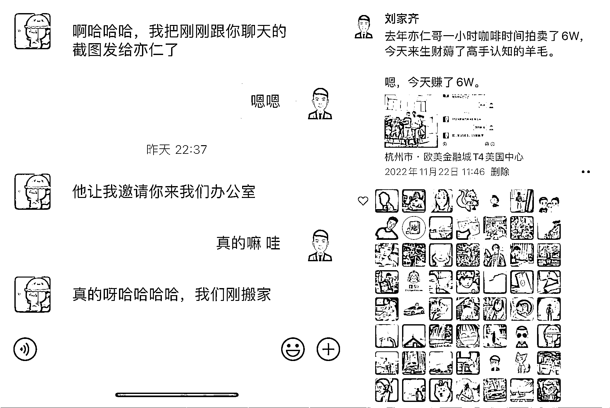  <ne-p id="u90e40455" data-lake-id="u90e40455"><ne-text id="u09abfb7b">写这篇文章的时候想起生财一位宝妈看了亦仁公众号一篇加抖音博主微信变现的帖子，每天在抖音上坚持加抖音博主的微信，亦仁大概花了 7W 买了她坚持 4 个月加了 4000 多好友的微信号（原贴：</ne-text>[<ne-text id="u2ca92216">https://t.zsxq.com/09QS3UiaW</ne-text>](https://t.zsxq.com/09QS3UiaW)<ne-text id="ufcf69e1a">），记得亦仁说</ne-text><ne-text id="ue287c1c3" ne-bold="true">我想告诉大家，执行力是值钱的，执行力是可以变现的，我想奖励执行力</ne-text><ne-text id="u3a25e7e0">；邀请我去生财办公室这何尝不是对我的执行力的一种奖励。</ne-text></ne-p> <ne-oli><ne-oli-i>1</ne-oli-i><ne-oli-c class="ne-oli-content" id="u020085af" data-lake-id="u020085af"><ne-text id="uc112e9a7" ne-bold="true">时代红利下如何获利最大化</ne-text></ne-oli-c></ne-oli> <ne-p id="u1d367ea9" data-lake-id="u1d367ea9"><ne-text id="u70731d7f">抛开前提看个例，很多逻辑和经验将毫无价值。在过往的职场管理中取得一点点成绩我曾错误的以为我个人能力很强，在后来的创业当中被红海项目无情的蹂躏。所以在开始之前，我们先对齐一点认知，可能所有夸张，</ne-text><ne-text id="uceba9434" ne-bold="true">我们所赚的每一百块钱，有九十块钱是时代红利，仅有十块钱是时代对我们个人能力的补偿，英雄只是时势的产物。</ne-text></ne-p> <ne-p id="u6c0e7154" data-lake-id="u6c0e7154"><ne-text id="u3da4ed8b">我充分知晓我所赚的每一分钱都是时代的红利，美团电商在未来终将和淘宝店群、拼多多店群、京东店群一样随着市场的充分竞争，利润回归市场均值。一个多小时时间探讨了两个话题，其中一个话题就是作为普通人，在美团电商这个项目的红利下如何让我的收益最大化？</ne-text></ne-p> <ne-p id="u692a870f" data-lake-id="u692a870f"><ne-text id="u452fd923">亦仁哥现场给我抓了三味药：</ne-text></ne-p> <ne-p id="uf62db163" data-lake-id="uf62db163"><ne-text id="u6b07a228">1、</ne-text><ne-text id="u90ab71f5" ne-bold="true">搞培训</ne-text><ne-text id="u917acbee">，对于我担心未来内卷的问题，亦仁哥抛出了一个问题，美团电商这个事情有没有绝对核心壁垒？我醍醐灌顶般的意识到，目前我们普通人能接触到的互联网项目不是科研项目，本质上讲几乎是没有任何壁垒的，譬如淘宝、抖音、视频号、小红书等等，美团也是如此，每个人窥其根本仅仅只是时间问题，所以市面上所有项目培训的本质就是付费买别人的试错经验和时间。对于培训板块我当下想法，自己不是什么网红微信朋友圈的流量是有限的，佛系出单，重点发力直营和引入外部投资加杠杆走阿米巴。</ne-text></ne-p> <ne-p id="u47320c18" data-lake-id="u47320c18"><ne-text id="uca8a1a22">另一方面前期因为没有及时办理个体执照，公户的钱无法合理避税转出进入个人账户，每天一万多的采购金和几十万的保证金，帐上的钱长期只出不进无法流动起来，导致有一段时间每天靠淘宝店群业务客户确认收货的钱勉强度日，培训收的钱也是一场及时雨解决了直营的采购问题。</ne-text></ne-p> <ne-p id="ua8f1b635" data-lake-id="ua8f1b635"><ne-text id="uc6ddb999">2、</ne-text><ne-text id="u93c080ed" ne-bold="true">直营扩张</ne-text><ne-text id="ub38564e5">，直营是我们美团电商业务重点发力的核心，截止 12 月末直营店铺 50 家（只运营了 26 家），12 月做了 30 多万的毛利润。整个 11 月平台下店收紧被拉黑了两张执照，直到 12 月我们才恢复下店，12 月中旬至今下店的概率蛮高。</ne-text></ne-p> <ne-p id="ud868786e" data-lake-id="ud868786e"><ne-text id="ue523f46d">“打江山提成制，守江山绩效制”，通过合理的薪酬策略运营姑娘们单月工资轻松可以拿到五位数，从 12 月开始至春节，全员自愿无休，配合计件兼职目标春节前把纯直营店铺扩张到 50 家左右，卷到除夕年后弹射起步。</ne-text><ne-text id="u74e4de98" ne-bold="true">美团电商一定要使用兼职，计件兼职一定是这个项目除资金外最大的杠杆。</ne-text></ne-p> <ne-p id="ueb468382" data-lake-id="ueb468382"><ne-text id="ud6131a29">3、</ne-text><ne-text id="u4c65eb4c" ne-bold="true">阿米巴模式</ne-text><ne-text id="uecdf54c3">，自感势能有限没有采用传统阿米巴模式，我把传统的阿米巴模式换汤不换药进行了升级，采用了两种方式:</ne-text></ne-p> <ne-p id="u1b055e4c" data-lake-id="u1b055e4c"><ne-text id="u38f463ed">1）阿米巴执照，身边有闲置执照的朋友把执照拿到公司，通过合理的分红制度，走类似代运营执照的形式，搞出了老家农村废旧手机换不锈钢盆的感觉。</ne-text></ne-p> <ne-p id="u4d0345cb" data-lake-id="u4d0345cb"><ne-text id="u6535ec8d">2）阿米巴团队，昨天刚搬进了新的办公室，我负责技术和日常管理，运营参与持股与两位投资人朋友合伙成立了两只新的小团队。不管直营还是阿米巴模式，我的逻辑是</ne-text><ne-text id="u9c192a7c" ne-bold="true">通过绝对的店铺数量，在平台红利期最大化套利。</ne-text></ne-p> <ne-oli><ne-oli-i>1</ne-oli-i><ne-oli-c class="ne-oli-content" id="ue59523ae" data-lake-id="ue59523ae"><ne-text id="u59f985b5" ne-bold="true">功夫是杀人技</ne-text></ne-oli-c></ne-oli> <ne-quote id="u52aa6e06" data-lake-id="u52aa6e06"><ne-p id="u2d259e8c" data-lake-id="u2d259e8c"><ne-card data-card-name="image" data-card-type="inline" id="rqnay" data-event-boundary="card">  <ne-p id="uc7218b76" data-lake-id="uc7218b76"><ne-text id="u6fef0cd1" ne-bold="true">人与人认知上最大的竞争，其实是信息输入量的竞争——亦仁</ne-text></ne-p> <ne-p id="u0476858d" data-lake-id="u0476858d"><ne-text id="ua125700f">这一年最喜欢的就是生财项目库的挖宝指南板块（这个板块是几百位实战高手的认知结晶，我累计写了超 200 篇打卡）和实战精华帖拆解，这种持续的刻意练习，让我逐渐打造了一种能力，在互联网平台赚钱的成功案例，大脑能很快的拆解出来——他为什么能赚钱。</ne-text></ne-p> <ne-p id="ub69aa1eb" data-lake-id="ub69aa1eb"><ne-text id="ub17cc80b">从美团离职创业一年多时间，坚持了 400 多天打卡案例拆解或者某项技能练习，不曾想一个人上路，打卡的路上遇到青岛数位年入大几百的电商前辈，我们一起组成了案例拆解、业务复盘、反思共进每日打卡的小圈子，亦仁哥给它取了个非常切贴的名字—“城市部落”。这一年见了很多老板，跟很多的创业老鸟聊能够做到认知同频，我逐渐意识到了案列拆解这种刻意练习网感的威力，不再关心那些浮夸不落地的宏观信息，这种日拱一卒般的刻意练习“杀人技”，每天的成功案例拆解打卡像勾到了我的爽点，我把这个动作比作“</ne-text><ne-text id="u757a86c3" ne-bold="true">带着教程去打怪</ne-text><ne-text id="u8fdeb3e2">”，它可以让我的赚钱效率更高，美团电商从发现同行成功案例那一刻我就莫名的笃定这个项目赚钱。</ne-text></ne-p> <ne-p id="u84593e1c" data-lake-id="u84593e1c"><ne-text id="u4e7aec05">大鹏一日同风起，扶摇直上九万里。春节将至，祝圈友们新春快乐，兔飞猛进~~~</ne-text></ne-p> <ne-h1 id="92574d38" data-lake-id="92574d38"><ne-heading-ext><ne-heading-anchor></ne-heading-anchor><ne-heading-fold></ne-heading-fold></ne-heading-ext><ne-heading-content><ne-text id="u394860d0">【生财技能】</ne-text></ne-heading-content></ne-h1> <ne-h2 id="d139cd94" data-lake-id="d139cd94"><ne-heading-ext><ne-heading-anchor></ne-heading-anchor><ne-heading-fold></ne-heading-fold></ne-heading-ext><ne-heading-content><ne-text id="u6730f41c">（95）《有了这两个 AI 机器人，还怕做不好带货短视频?》</ne-text></ne-heading-content></ne-h2> <ne-p id="u69edbe86" data-lake-id="u69edbe86"><ne-text id="ubfe6e45b">有了这两个 AI 机器人,还怕做不好带货短视频?</ne-text></ne-p> <ne-p id="u4892ebe0" data-lake-id="u4892ebe0"><ne-text id="u79bc1c15">好久没分享了...标题党了!哈哈 最近在研究短视频带货+无人直播带货,然后搞号的过程中,在巨量百应后台,刷到了创意中心 其中有两个模块吸引了我的注意 一个是爆款视频,能找到各个行业,不同等级作者,近期的非常实时的最新带货效果最好的短视频. 这个是比抖查查蝉妈妈这些第三方要更准确的行业优秀爆款视频库. 一个是创意搜索.这里可以按照关键词/商品来搜索近期的,非常实时的,同类竞品对标短视频. 对于上不了热榜的来说,这里更容易找到同行的东西. 正好我懂点 rpa,会用影刀这个工具,我就花了一周空余时间做了两个小工具. 能实现这两个的数据采集+视频下载</ne-text></ne-p> <ne-p id="u4124f917" data-lake-id="u4124f917"><ne-text id="u39c97638">文章图片较多,烦请移步飞书：</ne-text></ne-p> <ne-p id="u47dd5aa0" data-lake-id="u47dd5aa0">[<ne-text id="u2554c4cb">https://www.feishu.cn/docx/CGZ4dZq4ZoSFT4xUmFecNpk4nNe</ne-text>](https://www.feishu.cn/docx/CGZ4dZq4ZoSFT4xUmFecNpk4nNe)</ne-p> <ne-h2 id="3c8ba0a0" data-lake-id="3c8ba0a0"><ne-heading-ext><ne-heading-anchor></ne-heading-anchor><ne-heading-fold></ne-heading-fold></ne-heading-ext><ne-heading-content><ne-text id="u025d771e">（44 赞）（精华帖）《如何解决原创视频内容的批量生产？聊聊我的短视频带货矩阵的自动化之路》</ne-text></ne-heading-content></ne-h2> <ne-p id="u450d5e8e" data-lake-id="u450d5e8e"><ne-text id="uece4d750">这篇文章分享一个有意思的项目。 先看下这个视频号里发布的这些短视频：微信视频号搜“视频电商研究社”（下方列举了其中的两个视频） 如果说这个视频号中的视频都是自动生成出来的原创视频内容，而且是自动发布上去的，你有什么想法？</ne-text></ne-p> <ne-p id="u97276853" data-lake-id="u97276853"><ne-text id="u4154f62b">这里不能插入视频，请移步到飞书查看吧：</ne-text></ne-p> <ne-p id="u7e2b0d08" data-lake-id="u7e2b0d08">[<ne-text id="ua81d42bd">https://f2rgk22rcn.feishu.cn/docx/JmBgdr705ovHoyxQknRctRaMnKh</ne-text>](https://f2rgk22rcn.feishu.cn/docx/JmBgdr705ovHoyxQknRctRaMnKh)</ne-p> <ne-h2 id="3cd55d56" data-lake-id="3cd55d56"><ne-heading-ext><ne-heading-anchor></ne-heading-anchor><ne-heading-fold></ne-heading-fold></ne-heading-ext><ne-heading-content><ne-text id="u81667bb1">（60 赞）《初创公司如何科学量化股权分配？股权分配五步法教你不再踩坑》</ne-text></ne-heading-content></ne-h2> <ne-p id="ua347cb7d" data-lake-id="ua347cb7d"><ne-text id="u5d1fb81f">哈喽大家好，我是玉斌，第一次在生财分享，很担心我分享的内容已经有前辈在过去几年里分享过了。所以在分享之前，我特地去生财精华帖里搜了下，讲股权的很多，但是在如何科学量化股权分配上，我还没有看到有圈友系统的分享过，所以今天我冒昧来给大家分享下如何定性定量的科学的把股权算出来。</ne-text></ne-p> <ne-p id="ubf0efc1d" data-lake-id="ubf0efc1d"><ne-text id="ue687efde">请移步飞书查看全文~</ne-text></ne-p> <ne-p id="u2bf404eb" data-lake-id="u2bf404eb">[<ne-text id="u39d83618">https://ozqj66fvp1.feishu.cn/docx/C0dydiFPCoBI3LxemwWcXpdxn2e</ne-text>](https://ozqj66fvp1.feishu.cn/docx/C0dydiFPCoBI3LxemwWcXpdxn2e)</ne-p> <ne-h2 id="d1c2b8ab" data-lake-id="d1c2b8ab"><ne-heading-ext><ne-heading-anchor></ne-heading-anchor><ne-heading-fold></ne-heading-fold></ne-heading-ext><ne-heading-content><ne-text id="u982936a0">（147 赞）（精华帖）《如何写出既能吸金、又能深入人心的心金文案》</ne-text></ne-heading-content></ne-h2> <ne-p id="u236acbb7" data-lake-id="u236acbb7"><ne-text id="u6a7a7bc3">大家好，我是李思念，是一名 9 年的创业老玩家。 我身上被人广为记忆的个人 IP 标签中，首当其冲的应该就是我的文案力。朋友圈坚持更新，累计输出百万字，写的文案在微商圈/创业圈疯狂传播，在小红书上也通过文案吸粉无数，变现超过 7 位数。</ne-text></ne-p> <ne-p id="u3d081d37" data-lake-id="u3d081d37"><ne-text id="u35a64f4a">欢迎大家移步飞书详细阅读→</ne-text></ne-p> <ne-p id="u13a80ebc" data-lake-id="u13a80ebc">[<ne-text id="u5abe9e34">https://b80fa9wrsf.feishu.cn/docx/JPRAdLgGFowUE7xargGc8YNjnzh</ne-text>](https://b80fa9wrsf.feishu.cn/docx/JPRAdLgGFowUE7xargGc8YNjnzh)</ne-p> <ne-h1 id="667d82cf" data-lake-id="667d82cf"><ne-heading-ext><ne-heading-anchor></ne-heading-anchor><ne-heading-fold></ne-heading-fold></ne-heading-ext><ne-heading-content><ne-text id="ud0a2377d">【亦仁问答】</ne-text></ne-heading-content></ne-h1> <ne-h2 id="612de798" data-lake-id="612de798"><ne-heading-ext><ne-heading-anchor></ne-heading-anchor><ne-heading-fold></ne-heading-fold></ne-heading-ext><ne-heading-content><ne-text id="u1bc2b0c7">（323 赞）（精华帖）《副业收入从每月几百到几万，但没有时间陪伴孩子和休息了，怎么办？》</ne-text></ne-heading-content></ne-h2> <ne-p id="u522cdaf0" data-lake-id="u522cdaf0"><ne-text id="u48472ea6" ne-bold="true">提问：</ne-text></ne-p> <ne-p id="u880f4171" data-lake-id="u880f4171"><ne-text id="u1e86ad51">匿名用户 提问：</ne-text></ne-p> <ne-p id="ua9783531" data-lake-id="ua9783531"><ne-text id="u71740ea9">亦人大大，你好 我加入生财已经两年多了，这两年收获了很多， 跑通了项目，也认识了很多很优秀的人，非常感恩生财的平台。副业收入从每月几百到每月几万元，本来是非常值得开心的事情。 但是现在的我却很迷茫、很疲惫…副业越做越好，但消耗了很多时间，没有时间陪伴孩子、没有时间好好休息。主业 副业 家庭 孩子，我觉得我越来越不能平衡了。 1、之前都是利用休息时间来做，但副业占用的时间越来越多，感觉没时间休息，身体非常疲惫； 2、认识了很多优秀的人，非常卷、非常拼，让我压力山大，怕一不小心就掉队了； 3、副业还不足以让我辞职，现在的项目还想继续做。 我知道都想要，可能有点贪心了，但是我真的主业副业都不想放弃。所以很想听听您的建议，希望能得到一些启发。 期待您的回复。</ne-text></ne-p> <ne-p id="uf93d7202" data-lake-id="uf93d7202"><ne-text id="u6e137bbb" ne-bold="true">回答：</ne-text></ne-p> <ne-p id="u05327a0a" data-lake-id="u05327a0a"><ne-text id="ufcb0ec99">恭喜你，通过自己努力，拿到了不错的副业收入，至少超越了身边 90%以上的人。 另外，我还要恭喜你，因为从你问的问题，我感觉到你马上就要突破到下一个阶段。</ne-text></ne-p> <ne-p id="uc0a22e8f" data-lake-id="uc0a22e8f"><ne-text id="u685d0eeb">做副业很疲惫，家庭、健康、休息都被影响，这些我都经历过，身边的很多老板也都经历过，别太焦虑，有解法，你即将走上一条新的路： 招人帮你干活。</ne-text></ne-p> <ne-p id="ub38292f9" data-lake-id="ub38292f9"><ne-text id="u571225c8">拿出你现在收入的一部分，别舍不得，这是必须要花的钱，把重复的基础的活整理出来，安排给其他人，可以是家里的亲戚，可以是同学朋友，让他们开始给你兼职干活。</ne-text></ne-p> <ne-p id="ua879ed3a" data-lake-id="ua879ed3a"><ne-text id="u88ba0869">哪怕你空出来的时间，没有去干更重要的事，休息都可以，休息好了，才有向前更大的突破的力量。</ne-text></ne-p> <ne-p id="u4a552b28" data-lake-id="u4a552b28"><ne-text id="u0e1b9d31">一旦你习惯了这样的方式，不断的通过花钱找人帮你干活，你就开始成为一个老板，赚钱的杠杆就有了，新的天花板将比原来高非常多。 加油，期待你的副业收入乘 10。</ne-text></ne-p> <ne-h2 id="fb78e04a" data-lake-id="fb78e04a"><ne-heading-ext><ne-heading-anchor></ne-heading-anchor><ne-heading-fold></ne-heading-fold></ne-heading-ext><ne-heading-content><ne-text id="u16d8e138">（227 赞）（精华帖）《执行力不够，对赚钱的欲望不强，除了生活压力，还有什么具体动力能让人拼命赚钱？》</ne-text></ne-heading-content></ne-h2> <ne-p id="ud2589bc8" data-lake-id="ud2589bc8"><ne-text id="u4627edb9" ne-bold="true">提问：</ne-text></ne-p> <ne-p id="u2651f975" data-lake-id="u2651f975"><ne-text id="u22f22c33">匿名用户 提问：</ne-text></ne-p> <ne-p id="ua345b1b3" data-lake-id="ua345b1b3"><ne-text id="u2173b535">来生财有 2 年，看了很多实战赚钱的帖子，工作占据了大部分时间，只能挤时间尝试项目搞钱，这个时候每一个机会都出色执行力和意志力才能做成。我发现自己执行力不够强，好像是对赚钱的欲望没有那么强烈，底层的原因是不知道真正赚到钱后能干嘛？能给生活带来具体的变化是什么？除了生活压力，还有什么具体动力能让人拼命赚钱？</ne-text></ne-p> <ne-p id="u1b421796" data-lake-id="u1b421796"><ne-text id="uc8a4c9c6">回答：</ne-text></ne-p> <ne-p id="u8dafa0ed" data-lake-id="u8dafa0ed"><ne-text id="uc39307af">好，问题挺有代表性。</ne-text></ne-p> <ne-p id="u0d36cde7" data-lake-id="u0d36cde7"><ne-text id="uc2a6e7e6">我想先问你一个问题，你的工作有没有充分发挥你的优势？你的工作让你感觉到了热爱吗？你的工作让你有很大的收入增长的空间和机会吗？</ne-text></ne-p> <ne-p id="ubd3f161a" data-lake-id="ubd3f161a"><ne-text id="u411d617e">如果答案是有，那恭喜你，人生的少数赢家之一了，继续保持就好，不需要去额外的思考什么赚钱不赚钱，毕竟不是人生必须选项。 如果答案是没有，那请问，为什么你能坚持住工作，而不能去坚持开拓自己的一份事业？ 所谓的没有执行力，没有意志力，没有欲望，不知道有钱后能干什么，都只是借口而已。</ne-text></ne-p> <ne-p id="ud93794ff" data-lake-id="ud93794ff"><ne-text id="uf0a6fdde">绝大多数在工作上不开心的人，为了逃避真正的去开拓自己的事业，可以一直坚持，直到被老板开除，然后跑到下一份工作上继续坚持。</ne-text></ne-p> <ne-p id="uecb04984" data-lake-id="uecb04984"><ne-text id="ueffbaab2">动脑是很累的，探索是令人恐惧的，用战术上面的勤奋来逃避真正战略上要去探索和突破的事情，用忙碌的工作来麻痹自己，是短期轻松的，长期确是有毒的。</ne-text></ne-p> <ne-p id="ub4f658ad" data-lake-id="ub4f658ad"><ne-text id="ubccf0350">以上言论有一点过激，但希望能够真正的让一些人清醒。</ne-text></ne-p> <ne-h1 id="21fc8d0b" data-lake-id="21fc8d0b"><ne-heading-ext><ne-heading-anchor></ne-heading-anchor><ne-heading-fold></ne-heading-fold></ne-heading-ext><ne-heading-content><ne-text id="u27edec16">【生财项目】</ne-text></ne-heading-content></ne-h1> <ne-h3 id="83d9349e" data-lake-id="83d9349e"><ne-heading-ext><ne-heading-anchor></ne-heading-anchor><ne-heading-fold></ne-heading-fold></ne-heading-ext><ne-heading-content><ne-text id="u7d2e14d8">【抖音】</ne-text></ne-heading-content></ne-h3> <ne-h2 id="37562b63" data-lake-id="37562b63"><ne-heading-ext><ne-heading-anchor></ne-heading-anchor><ne-heading-fold></ne-heading-fold></ne-heading-ext><ne-heading-content><ne-text id="u5d9fd57d">《抖音盲盒项目常见问题汇总》</ne-text></ne-heading-content></ne-h2> <ne-p id="u62882bfe" data-lake-id="u62882bfe"><ne-text id="u93c05b7c">大家好，我是姚麻，前段时间给大家分享过一个近期在做的盲盒项目，聊的都是一些比较基础的东西。后面</ne-text>[<ne-text id="u8123a7ef">@傅超人</ne-text>](https://wx.zsxq.com/dweb2/index/footprint/48812588225218) <ne-text id="ub2bffe56">又来了波大的，整了个保姆级攻略，反响还蛮好的。</ne-text></ne-p> <ne-p id="u6479a2fc" data-lake-id="u6479a2fc"><ne-text id="ub659692e">要不怎么说生财圈友执行力好呢，这俩帖子一发，近期新冒出来做的人明显增多哈哈哈，不过也伴随着很多问题，现在基本每天都会有人问我各种各样问题，而这些问题又有很多是重复的</ne-text><ne-card data-card-name="image" data-card-type="inline" id="lkCUy" data-event-boundary="card">  <ne-p id="ued9046ba" data-lake-id="ued9046ba"><ne-text id="u7e7572d7">而我这段时间，所有重心都放在线上线下盯新人新号，基本上该遇到的问题都遇到过了。索性我就给大家再开一帖，来一个常见问题的汇总，其中也包括一些，我们这段时间摸出来新东西、新玩法，希望对大家能有所帮助。 篇幅不短，劳驾各位移步飞书吧就</ne-text></ne-p> <ne-p id="u816f9239" data-lake-id="u816f9239">[<ne-text id="ufbf46dac">https://fgsd3oxjki.feishu.cn/docx/SvdFdfi3VoAiaRxENHNcncEqnif</ne-text>](https://fgsd3oxjki.feishu.cn/docx/SvdFdfi3VoAiaRxENHNcncEqnif)</ne-p> <ne-h2 id="ee7752ce" data-lake-id="ee7752ce"><ne-heading-ext><ne-heading-anchor></ne-heading-anchor><ne-heading-fold></ne-heading-fold></ne-heading-ext><ne-heading-content><ne-text id="ud37dc7a1">（29 赞）《2023 年如何获得抖音本地生活的十倍增长的红利》</ne-text></ne-heading-content></ne-h2> <ne-p id="u47e6dbbd" data-lake-id="u47e6dbbd"><ne-text id="uc7098274" ne-bold="true">2022 年年末，我们终于迎来了共存时代，搞钱成了每个人的生存基调。当下实体门店价值降到波谷，抖音本地流量性价比接近波峰，赛道将迎来最大增速的一年。不管你有没有入局，还是正在这个赛道里厮杀，都不能错过这最好的机会，在 2023 年放开马力跑。</ne-text></ne-p> <ne-p id="u48cead08" data-lake-id="u48cead08"><ne-text id="u183a7f11" ne-bold="true">——楚川</ne-text></ne-p> <ne-h3 id="c5bb5018" data-lake-id="c5bb5018"><ne-heading-ext><ne-heading-anchor></ne-heading-anchor><ne-heading-fold></ne-heading-fold></ne-heading-ext><ne-heading-content><ne-text id="uc0c6105b">Part 1 本地生活成长的一年</ne-text></ne-heading-content></ne-h3> <ne-h4 id="208e77c1" data-lake-id="208e77c1"><ne-heading-ext><ne-heading-anchor></ne-heading-anchor><ne-heading-fold></ne-heading-fold></ne-heading-ext><ne-heading-content><ne-text id="u5a1dcc94">1、自我介绍</ne-text></ne-heading-content></ne-h4> <ne-p id="ua69dfdba" data-lake-id="ua69dfdba"><ne-text id="ud890c1de">大家好，我是楚川。</ne-text></ne-p> <ne-p id="uda470ac3" data-lake-id="uda470ac3"><ne-text id="u795046e6">一个 10 年的连续创业者，3 年本地生活创业经历，先后分别服务过 4700 个实体商家，覆盖了吃喝玩乐衣食住行的细分类目。</ne-text></ne-p> <ne-p id="u1708c6d3" data-lake-id="u1708c6d3"><ne-text id="ucf860e86">经过 3 年的摸爬打滚，终于建立起”</ne-text><ne-text id="u7120f80f" ne-bold="true">不管平台的变化、市场的恶化，也必须盈利</ne-text><ne-text id="u513f7b39">”的能力，团队也在 2022 年实现净利润破千万。</ne-text></ne-p> <ne-h4 id="98fb5554" data-lake-id="98fb5554"><ne-heading-ext><ne-heading-anchor></ne-heading-anchor><ne-heading-fold></ne-heading-fold></ne-heading-ext><ne-heading-content><ne-text id="u6cb6c323">2、分享的原因和初衷</ne-text></ne-heading-content></ne-h4> <ne-p id="u3bba6f5a" data-lake-id="u3bba6f5a"><ne-text id="ud0172642">我们团队经历了本地生活的加盟 IP 和信息流投放、达人孵化、品牌孵化、供应链、官方服务商、技术服务商等阶段，基本上大家每个过程遇到的问题、踩过的坑都有经历，所以也算是有底气能够给到同行、即将要入局的人一些中肯的建议。</ne-text></ne-p> <ne-p id="u579cc339" data-lake-id="u579cc339"><ne-text id="u8dcb2f45">2020-2021 年的两年，我个人也基本上在一线实战，没有任何时间去思考外出做分享。经历了 2021 年的至暗时刻，我调整了公司的运营体系和结构，把自己释放出来了，逐渐对外做一些个人的行业经验和方法论分享。</ne-text></ne-p> <ne-p id="ue4cc3a1e" data-lake-id="ue4cc3a1e"><ne-text id="uc4a6a97c">我想说一件事就是：</ne-text><ne-text id="ufe7da9f7" ne-bold="true">当下阶段，本地生活最大的坑就是信息差！</ne-text></ne-p> <ne-p id="u1f10f328" data-lake-id="u1f10f328"><ne-text id="u76d92cfe" ne-bold="true">我 2022 年 2 月的分享，不少内容到现在过去一年了，整个市场和平台已经迭代了 n 次，已经跟我年初描述的极不一样。</ne-text></ne-p> <ne-h4 id="cf50f176" data-lake-id="cf50f176"><ne-heading-ext><ne-heading-anchor></ne-heading-anchor><ne-heading-fold></ne-heading-fold></ne-heading-ext><ne-heading-content><ne-text id="u6b5a8578">3、2023 年所有人需要达成的共识点</ne-text></ne-heading-content></ne-h4> <ne-oli><ne-oli-i>1</ne-oli-i><ne-oli-c class="ne-oli-content" id="u70e5fa37" data-lake-id="u70e5fa37"><ne-text id="u5b6c326e" ne-bold="true">IP 内容、电商品牌内容不等于本地生活内容</ne-text><ne-text id="u95068caf">。</ne-text></ne-oli-c></ne-oli> <ne-oli><ne-oli-i>1</ne-oli-i><ne-oli-c class="ne-oli-content" id="uef335d08" data-lake-id="uef335d08"><ne-text id="uca166971">本地生活的人群大部分都是对本区域的吃喝玩乐（轻决策且高频，超级高客单除外）有基本上的认知，所以只需要内容能够做好团购产品信息传播出去就好。</ne-text></ne-oli-c></ne-oli> <ne-p id="ub60bfcf4" data-lake-id="ub60bfcf4"><ne-text id="u37b72b45">很长一段时间探店视频被喷的体无完肤，但是这些看似 low 的视频往往能卖出产品。因此原来的内容刻板印象，牛逼的电商和 IP 内容都没有那么适用，这一块一定需要认清。</ne-text></ne-p> <ne-oli><ne-oli-i>1</ne-oli-i><ne-oli-c class="ne-oli-content" id="uf54fb13c" data-lake-id="uf54fb13c"><ne-text id="uec4c4740" ne-bold="true">短视频的呈现和传播效果高于图文</ne-text><ne-text id="uaeb99ea1">。</ne-text></ne-oli-c></ne-oli> <ne-p id="ub436012f" data-lake-id="ub436012f"><ne-text id="u660fe614">当下阶段做本地生活一定是需要做好抖音，拉新和流量成本最低的平台，传播速度和广度都高于图文平台。那为啥不做好，就先不用去考虑其他平台太多的布局了。</ne-text></ne-p> <ne-p id="u9a7144b9" data-lake-id="u9a7144b9"><ne-text id="u7200e787">我们团队过去 3 年，各个平台都有尝试，发现还是抖音香，坑已经替大家踩过了。</ne-text></ne-p> <ne-oli><ne-oli-i>1</ne-oli-i><ne-oli-c class="ne-oli-content" id="u91a68e7c" data-lake-id="u91a68e7c"><ne-text id="u33c23095" ne-bold="true">本地生活存在一天，视频矩阵就一直在</ne-text></ne-oli-c></ne-oli> <ne-p id="u5e96af11" data-lake-id="u5e96af11"><ne-text id="ue230bd43">抖音本地生活还是基于 3-5 公里的优先推荐，所以传统一条视频流量打满的时代已经过去了。我们现在就是需要 100 条甚至更多的视频，用 1-2 级流量池反复触达 5 公里以内的用户。</ne-text></ne-p> <ne-p id="ufe0c1e74" data-lake-id="ufe0c1e74"><ne-text id="ue01be323">所以只要抖音不完全颠覆算法，改变同城的流量推荐，那矩阵就必须存在。玩矩阵也就意味着是玩本地生活的基本技能！</ne-text></ne-p> <ne-oli><ne-oli-i>1</ne-oli-i><ne-oli-c class="ne-oli-content" id="ud6fcfb80" data-lake-id="ud6fcfb80"><ne-text id="ue168274b" ne-bold="true">做抖音就一定要有抖感</ne-text><ne-text id="uac6fb894">。</ne-text></ne-oli-c></ne-oli> <ne-p id="ub2bbe9ee" data-lake-id="ub2bbe9ee"><ne-text id="u64222c4f">很多人找我要做好抖音本地生活，我基本上要这些人先培养自己的抖感。对从没有做过抖音的小伙伴经常说，没有抖感不要焦虑，去学习，去培养，一切都来得及。</ne-text></ne-p> <ne-p id="uf79146b5" data-lake-id="uf79146b5"><ne-text id="u172d9823">那要怎么做，每天花 2 小时，了解抖音，去刷视频，去别人直播间学，低于这个时间长度大概率是失败的。</ne-text><ne-text id="u736aa446" ne-bold="true">等到你真的能说出抖音当下的生态组成，抖音本地生活的商业闭环就说明初步具备抖感了。没有必败！</ne-text></ne-p> <ne-oli><ne-oli-i>1</ne-oli-i><ne-oli-c class="ne-oli-content" id="u1e25e1d1" data-lake-id="u1e25e1d1"><ne-text id="u233f6872" ne-bold="true">本地生活就是做又脏又累的活，用实操保持体感</ne-text><ne-text id="ua8fde9ba">。</ne-text></ne-oli-c></ne-oli> <ne-p id="ud1d8c68c" data-lake-id="ud1d8c68c"><ne-text id="ucc4eb6da">本地生活实操大于一切，当长期没有实操，你会很陌生，因为更新太快了，千万不能因为其他诱惑脱离实际，脱离实操！</ne-text></ne-p> <ne-p id="ub9656b3a" data-lake-id="ub9656b3a"><ne-text id="u4713f8c2">同时大家要清醒的认识到吃喝玩乐的门槛低，红利大，要想在里面真正掘金，那最后比的是谁愿意去做又脏又累的活，躬身入局的人一定是可以吃到肉的，习惯赚快钱的人很难接受这种节奏。</ne-text></ne-p> <ne-h3 id="b07cfc1b" data-lake-id="b07cfc1b"><ne-heading-ext><ne-heading-anchor></ne-heading-anchor><ne-heading-fold></ne-heading-fold></ne-heading-ext><ne-heading-content><ne-text id="ub9f26804">Part2 2023 年如何破局搞到钱</ne-text></ne-heading-content></ne-h3> <ne-h4 id="be7fb1fb" data-lake-id="be7fb1fb"><ne-heading-ext><ne-heading-anchor></ne-heading-anchor><ne-heading-fold></ne-heading-fold></ne-heading-ext><ne-heading-content><ne-text id="u5dfdf554">1、抖音本地生活还有 10 倍增长空间</ne-text></ne-heading-content></ne-h4> <ne-oli><ne-oli-i>1</ne-oli-i><ne-oli-c class="ne-oli-content" id="u479756df" data-lake-id="u479756df"><ne-text id="u3765a9ae" ne-bold="true">本地生活图文和短视频平台的竞争刚刚开始</ne-text><ne-text id="u4eb2632a">：据美团 2021 年年报披露，美团平台活跃商家数量达到 880 万家，基本覆盖全国全部地级市，而抖音本地生活仅覆盖了一线及新一线全部城市，但在二三线城市覆盖率较低，还有巨大的增长空间。因此并不用担心商家不够做的问题，市场足够大，另外视频号和快手都在虎视眈眈。</ne-text></ne-oli-c></ne-oli> <ne-p id="u4fe51e20" data-lake-id="u4fe51e20"><ne-card data-card-name="image" data-card-type="inline" id="sd7cJ" data-event-boundary="card">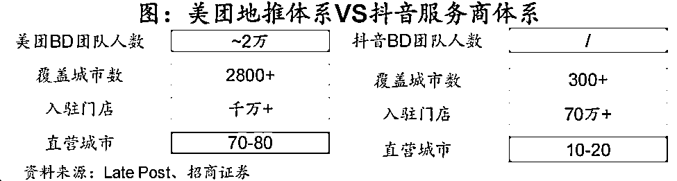  <ne-oli><ne-oli-i>1</ne-oli-i><ne-oli-c class="ne-oli-content" id="uf4e2efba" data-lake-id="uf4e2efba"><ne-text id="u21098d60" ne-bold="true">投放入口全面调为本地推，意味着：直播必须有，GMV 要疯狂爆发</ne-text><ne-text id="u8f7128fe">。</ne-text></ne-oli-c></ne-oli> <ne-p id="u73297972" data-lake-id="u73297972"><ne-text id="u6c2ef6c7">年底了，现在抖音本地生活的投放入口会逐渐全部收缩在本地推，最大加持的地方一定是直播。所以接下来是考验团队投放效率和单场产出，因此短视频的辅助至关重要，直播运营决定最终 ROI。</ne-text></ne-p> <ne-p id="u88fea6e2" data-lake-id="u88fea6e2"><ne-text id="uafc2d09a">同时外卖也会在 2023 年彻底打开，客单价 100 以上的外卖也会疯涨，两大块的组合才能完成 10 倍以上的增长。</ne-text></ne-p> <ne-h4 id="b77ac10b" data-lake-id="b77ac10b"><ne-heading-ext><ne-heading-anchor></ne-heading-anchor><ne-heading-fold></ne-heading-fold></ne-heading-ext><ne-heading-content><ne-text id="u33bd600b">2、用更加系统的思维去理解抖音本地生活</ne-text></ne-heading-content></ne-h4> <ne-oli><ne-oli-i>1</ne-oli-i><ne-oli-c class="ne-oli-content" id="u72aed79f" data-lake-id="u72aed79f"><ne-text id="u497a400e" ne-bold="true">2023 年的抖音本地生活慢慢会开始比拼精细化操作，那必须要清楚生态的组成。</ne-text></ne-oli-c></ne-oli> <ne-oli><ne-oli-i>1</ne-oli-i><ne-oli-c class="ne-oli-content" id="u41a4fc2f" data-lake-id="u41a4fc2f"><ne-text id="u11aca5f1" ne-bold="true">培养和保持抖感是第一步，其次最重要的是对本地生活生态的了解</ne-text><ne-text id="u1fdcd883">。</ne-text></ne-oli-c></ne-oli> <ne-oli><ne-oli-i>1</ne-oli-i><ne-oli-c class="ne-oli-content" id="u9e128207" data-lake-id="u9e128207"><ne-text id="ud42ffe70">  因为抖音本地生活经过 2 年多的发展，商家、达人、服务商的认知都已经完成了 2 轮以上的教育，再次按照初期单纯的收割市场，怼商家数量，纯怼 GMV 的方式已经过时了。</ne-text></ne-oli-c></ne-oli> <ne-oli><ne-oli-i>1</ne-oli-i><ne-oli-c class="ne-oli-content" id="u637342ab" data-lake-id="u637342ab"><ne-text id="ub99260b5">  现在本地生活的商业模式，初期就必须盈利，不然后期不可能维持，因此就需要对生态有足够多的了解。</ne-text></ne-oli-c></ne-oli> <ne-oli><ne-oli-i>1</ne-oli-i><ne-oli-c class="ne-oli-content" id="u592e1521" data-lake-id="u592e1521"><ne-text id="u8f4ae09b" ne-bold="true">在 2022 年 11 月我基于前面 3 年的经历，公司运转和经营 SOP 画出了抖音本地生活运营全景图，个人认为这是接下来从业者需要非常熟悉的一张图，并且在从业一段时间后结合自己的特点，再进行调整和优化</ne-text><ne-text id="ua27f26bf">。</ne-text></ne-oli-c></ne-oli> <ne-oli><ne-oli-i>1</ne-oli-i><ne-oli-c class="ne-oli-content" id="u73d09489" data-lake-id="u73d09489"><ne-text id="ue7098adc">  我会认为这是一个优秀的从业者必须具备的能力，只有充分了解生态每个组成部分，才会知道行业和赛道中的钱在哪里，团队的发展在哪里。</ne-text></ne-oli-c></ne-oli> <ne-oli><ne-oli-i>1</ne-oli-i><ne-oli-c class="ne-oli-content" id="u0b1a89fc" data-lake-id="u0b1a89fc"><ne-text id="u1788db07" ne-bold="true">抖音平台现在就是所有大平台当中流量成本最低的平台，所以我们需要把自己的流量获取入口放在这里。</ne-text><ne-text id="u928ba38c">这就是在全景图当中，强调：拉新-留存的概念。</ne-text></ne-oli-c></ne-oli> <ne-oli><ne-oli-i>1</ne-oli-i><ne-oli-c class="ne-oli-content" id="u1671351c" data-lake-id="u1671351c"><ne-text id="u3dc02031">  本地生活团队现在跑的最凶的服务商是联联周边游、千千惠，这是因为他们具有私域流量，因此我们在起盘的过程是不能忽略本地生活流量的留存。未来谁能抓住这次机会，完成流量转化，谁就是爸爸。</ne-text></ne-oli-c></ne-oli> <ne-oli><ne-oli-i>1</ne-oli-i><ne-oli-c class="ne-oli-content" id="u09457537" data-lake-id="u09457537"><ne-text id="ua895a98f" ne-bold="true">在流量运营端，2023 年一定是要学会短视频和直播的组合拳</ne-text><ne-text id="u3cc4dac7">。</ne-text></ne-oli-c></ne-oli> <ne-oli><ne-oli-i>1</ne-oli-i><ne-oli-c class="ne-oli-content" id="ud961c9be" data-lake-id="ud961c9be"><ne-text id="ua27c8c73">  当下阶段，我接触到 90%以上的服务商要么只做短视频，要么只做直播，其实这一块是不能完全割裂的。短视频是直播的基础，电商的发展过程，前面的阶段也是通过短视频种草或挂车的方式完成增长。</ne-text></ne-oli-c></ne-oli> <ne-oli><ne-oli-i>1</ne-oli-i><ne-oli-c class="ne-oli-content" id="u7733f382" data-lake-id="u7733f382"><ne-text id="u66aeff4a">  因此本地生活中，一样也是需要做好短视频的前期，再做直播，在服务客户的过程是需要组合一起去交付。2023 年，算法会无限加大这一块的化学反应，具体的短视频和直播的组合打法，铁子们可以私下交流。</ne-text></ne-oli-c></ne-oli> <ne-oli><ne-oli-i>1</ne-oli-i><ne-oli-c class="ne-oli-content" id="ua4e311ab" data-lake-id="ua4e311ab"><ne-text id="u3538646e" ne-bold="true">不要神话工具的作用，也不要妖魔化现有的工具</ne-text><ne-text id="u8728f5ed">。</ne-text></ne-oli-c></ne-oli> <ne-oli><ne-oli-i>1</ne-oli-i><ne-oli-c class="ne-oli-content" id="ued6beb58" data-lake-id="ued6beb58"><ne-text id="u8e12a435">  从爆店码、抖音小程序，再到现在的外卖小程序，无论是商家还是服务商都被割到体无完肤。但是我还是想说，做抖音本地生活，终究是一件讲：商家运营、流量运营、用户运营和平台运营的事情，工具只是很少一部分。</ne-text></ne-oli-c></ne-oli> <ne-oli><ne-oli-i>1</ne-oli-i><ne-oli-c class="ne-oli-content" id="ua90a8678" data-lake-id="ua90a8678"><ne-text id="u5155e0d4">  没有工具的加持，并不会让生意停止了，也没有什么工具能让你一本万利实现赚大钱。当下阶段能行之有效的工具依旧是我列举的这几类，爆店码目前就是适用于服务商，不太建议去给商家单独使用；在未来的时间，比拼运营细节就需要大家好好掌握本地推、矩阵管理工具。</ne-text></ne-oli-c></ne-oli> <ne-oli><ne-oli-i>1</ne-oli-i><ne-oli-c class="ne-oli-content" id="u87285a5a" data-lake-id="u87285a5a"><ne-text id="u88674582" ne-bold="true">在本地生活的平台运营层面上看，主阵地一定是抖音，其次就需要整合线上其他平台，以及实体广告</ne-text><ne-text id="u9d5bacf1">。</ne-text></ne-oli-c></ne-oli> <ne-oli><ne-oli-i>1</ne-oli-i><ne-oli-c class="ne-oli-content" id="ue0c373d6" data-lake-id="ue0c373d6"><ne-text id="u892712d3">  虽然有大半年我们没有做过整合营销的全案，但是我们依旧是建议小团队可以尝试做这件事，我们当时在这一块是盈利的状态。一个全案是能够造价百万以上，超出团队能力的部分做外包。</ne-text></ne-oli-c></ne-oli> <ne-oli><ne-oli-i>1</ne-oli-i><ne-oli-c class="ne-oli-content" id="uec060b6b" data-lake-id="uec060b6b"><ne-text id="u55eb644b">  一个团队入局一定也需要了解所有的平台特点和价值，并不是对团队要求高，而是因为本地生活掌握的技能和方法就那么多，多出的时间和精力是需要大家去了解全貌的。谁先走的早，谁就能提前吃到这一块的红利。</ne-text></ne-oli-c></ne-oli> <ne-p id="u77a6f0dd" data-lake-id="u77a6f0dd"><ne-card data-card-name="image" data-card-type="inline" id="LunEw" data-event-boundary="card">  <ne-oli><ne-oli-i>1</ne-oli-i><ne-oli-c class="ne-oli-content" id="uc0363b25" data-lake-id="uc0363b25"><ne-text id="uc468f9ae" ne-bold="true">4700 个商家的服务经历，让我总结出短视频本地生活的热门法则，5 步打爆门店。</ne-text></ne-oli-c></ne-oli> <ne-oli><ne-oli-i>1</ne-oli-i><ne-oli-c class="ne-oli-content" id="uff181d71" data-lake-id="uff181d71"><ne-text id="u8a81df93" ne-bold="true">我今年反复在自己和朋友的社群反复提到这个热门法则，因为这是我们做的过程一直遵循的 SOP</ne-text><ne-text id="u43b7dbb1">。现在有很多人拿去抄，在直播间卖，但是能够帮助到人就好，这张图的 1.0 版本其实是我 2022 年 6 月创作出来的。</ne-text></ne-oli-c></ne-oli> <ne-oli><ne-oli-i>1</ne-oli-i><ne-oli-c class="ne-oli-content" id="u5c72baba" data-lake-id="u5c72baba"><ne-text id="u18e4befb">  现在我在整个流程中加了 4 点说明，帮助大家更深的理解。</ne-text><ne-text id="ube196b11" ne-bold="true">一个门店的从 0 到 1 打爆，保证这个方式，再按照我之前分享到的推广流程，基本上就没太大问题。</ne-text></ne-oli-c></ne-oli> <ne-oli><ne-oli-i>1</ne-oli-i><ne-oli-c class="ne-oli-content" id="u2b9bc384" data-lake-id="u2b9bc384"><ne-text id="u50645d83">  接下来的一年，也会持续把这些做下去，第一是为初入者指明方向，第二是为入局者及时了解自己做的事情，第三是让我自己随时保持清醒，当然我也会持续在这个赛道保持实操，维持这种体感。</ne-text></ne-oli-c></ne-oli> <ne-oli><ne-oli-i>1</ne-oli-i><ne-oli-c class="ne-oli-content" id="u131a630a" data-lake-id="u131a630a"><ne-text id="ud8bcbf53" ne-bold="true">POI 加热是从业者的第一课</ne-text><ne-text id="ub24f16fa">。大家可以理解为我们开一个实体店，开张当天都会邀请朋友过去捧场，充当人气，而 POI 也是一样。当我们开通地址认证，上架产品，也是需要把 POI 烘托成繁荣的场景，这就是 POI 加热，做成热门地址后，转化一切都上来了。</ne-text></ne-oli-c></ne-oli> <ne-oli><ne-oli-i>1</ne-oli-i><ne-oli-c class="ne-oli-content" id="uf4e5c039" data-lake-id="uf4e5c039"><ne-text id="u94b62584" ne-bold="true">没有爆品就别做推广</ne-text><ne-text id="u2bf1ea17">。前面有说到，爆品就是生命，选对品成功 80%。那前期的动作就是选出门店的爆品，做事就事半功倍。</ne-text></ne-oli-c></ne-oli> <ne-oli><ne-oli-i>1</ne-oli-i><ne-oli-c class="ne-oli-content" id="u675c653d" data-lake-id="u675c653d"><ne-text id="udd2fed1b">  一定不能做逆流而上的事情，没有爆品去做强推，转化会一言难尽，甚至适得其反。铁子们这一块就遵循一个原则，没有爆品就不做抖音推广的动作，否则一切动作就是在赌博。</ne-text></ne-oli-c></ne-oli> <ne-oli><ne-oli-i>1</ne-oli-i><ne-oli-c class="ne-oli-content" id="ud12a97b2" data-lake-id="ud12a97b2"><ne-text id="u23fe632d" ne-bold="true">玩转短视频矩阵和直播运营就能发财</ne-text><ne-text id="u21fad001">。在这里还是会强调：短视频矩阵是第一位，一定要学会整套落地流程，再去搞直播。我在 2022 年上半年以前都不会推荐大家做直播，因为行业的生态还处于要先做好短视频的阶段。但是现在已经需要双管齐下，做”1+1＞2”的事情。</ne-text></ne-oli-c></ne-oli> <ne-oli><ne-oli-i>1</ne-oli-i><ne-oli-c class="ne-oli-content" id="u0b603db1" data-lake-id="u0b603db1"><ne-text id="u1742135d" ne-bold="true">好评率的维护极其重要</ne-text><ne-text id="u616ae9af">。抖音流量的速度快，一天可以打出百万级的流量，那一定会面临好评率下降，以及差评，那就需要做好舆情维护，这是持久战。动作路径就是去学习美团和点评的方式，不做转化率会直线下降，退单率成倍增长。</ne-text></ne-oli-c></ne-oli> <ne-oli><ne-oli-i>1</ne-oli-i><ne-oli-c class="ne-oli-content" id="u0c9cad02" data-lake-id="u0c9cad02"><ne-text id="u0f006e3e">这 2 张图就是我站在当下抖音本地生活的视角考虑到的各个流程和环节，大家要做的事情，做了每个环节的拆解，大家可以放心学习。我个人觉得实操久了，能够把这两张图复述出来，一定是真正理解这个生态，并且能拿到结果。</ne-text></ne-oli-c></ne-oli> <ne-p id="u5a10fa92" data-lake-id="u5a10fa92"><ne-card data-card-name="image" data-card-type="inline" id="q0Z0S" data-event-boundary="card">  <ne-h4 id="0a1e9296" data-lake-id="0a1e9296"><ne-heading-ext><ne-heading-anchor></ne-heading-anchor><ne-heading-fold></ne-heading-fold></ne-heading-ext><ne-heading-content><ne-text id="ud15e49df">3、楚川视角下的 8 个必赚的小方向</ne-text></ne-heading-content></ne-h4> <ne-p id="ub2075ad1" data-lake-id="ub2075ad1"><ne-text id="ue42ad2e4">我现在已经有很多次成功预测抖音本地生活必火的行业，成功率做到了 90%。所以每次分享大家都会期待我这样的预测，一些团队有心就会真正去落地，提前部署，然后拿到结果。以下我就站在 2023 年整年的角度来做分析。</ne-text></ne-p> <ne-oli><ne-oli-i>1</ne-oli-i><ne-oli-c class="ne-oli-content" id="u53f07c02" data-lake-id="u53f07c02"><ne-text id="u930b4827">文旅，不要问我怎么爆，组品+大力出奇迹。共存时代来了，明年上半年发酵一下，下半年会疯涨，100 倍增长都有可能。</ne-text></ne-oli-c></ne-oli> <ne-oli><ne-oli-i>1</ne-oli-i><ne-oli-c class="ne-oli-content" id="ueddcd5c4" data-lake-id="ueddcd5c4"><ne-text id="ue19ac317">交友，2023 年依旧是疯狂爆发。3 年的社交封闭，已经让人太渴望交友的感觉了。IP 打造、矩阵推广、私域承接，比较看好，高客单能搞到爆炸。</ne-text></ne-oli-c></ne-oli> <ne-oli><ne-oli-i>1</ne-oli-i><ne-oli-c class="ne-oli-content" id="uebc39846" data-lake-id="uebc39846"><ne-text id="u18420a9a">同城零售，结合达达、顺丰同城、饿了么的运力，做高客单，一切新奇特组合，我们今年已经验证成功，明年系统丝滑后，会给所有团队福音。</ne-text></ne-oli-c></ne-oli> <ne-oli><ne-oli-i>1</ne-oli-i><ne-oli-c class="ne-oli-content" id="ufa22f45c" data-lake-id="ufa22f45c"><ne-text id="u9d364f6c">演出，包括脱口秀，演唱会和电影院。素材质量高并且可以多，混剪可能性多，分发账号多，就是大力出奇迹。</ne-text></ne-oli-c></ne-oli> <ne-oli><ne-oli-i>1</ne-oli-i><ne-oli-c class="ne-oli-content" id="ud36305a6" data-lake-id="ud36305a6"><ne-text id="u0de9d787">live house。长沙在 2022 年已经给所有城市打版了，现场好的歌手，热歌+视频切片传播，基本上就能起飞。</ne-text></ne-oli-c></ne-oli> <ne-oli><ne-oli-i>1</ne-oli-i><ne-oli-c class="ne-oli-content" id="ue5f82118" data-lake-id="ue5f82118"><ne-text id="ud7f9fb3d">小模型的社区店，满足居民的高频刚需餐饮品牌。这也是做到了验证的模式，大有可为，最好的私域入口。</ne-text></ne-oli-c></ne-oli> <ne-oli><ne-oli-i>1</ne-oli-i><ne-oli-c class="ne-oli-content" id="uce0d5f50" data-lake-id="uce0d5f50"><ne-text id="u1ad1569d">实力强劲的服务考虑品牌孵化。目前我已经孵化出 4 个千万级以上的品牌，其中餐饮品牌十三烧跑的最好，已经在 36 氪发文天使轮，年后将完成 A 轮。所以我也希望 2023 年能乘势而为，孵化 2 个以上的品牌。</ne-text></ne-oli-c></ne-oli> <ne-p id="u0f91a756" data-lake-id="u0f91a756"><ne-card data-card-name="image" data-card-type="inline" id="g8xNN" data-event-boundary="card">  <ne-oli><ne-oli-i>1</ne-oli-i><ne-oli-c class="ne-oli-content" id="u1706d6b6" data-lake-id="u1706d6b6"><ne-text id="u7ed67727">垂直类目服务商。一套吃下抖音整块的流量，如鲜花、美业、家政、便利店等，认领 1000 家以上的门店，研究爆品和垂直打法，是能快速搞钱。</ne-text></ne-oli-c></ne-oli> <ne-h4 id="d3e67e42" data-lake-id="d3e67e42"><ne-heading-ext><ne-heading-anchor></ne-heading-anchor><ne-heading-fold></ne-heading-fold></ne-heading-ext><ne-heading-content><ne-text id="uf4908f76">4、我会做什么：复制 70 分的楚川</ne-text></ne-heading-content></ne-h4> <ne-p id="u4a372a15" data-lake-id="u4a372a15"><ne-text id="u8395a768">今年分别在群响、淘客公园、生财有术、中国区域互联网大会、航加、猪八戒网、美团核心高层有做过分享，收到的反馈都是正向的，所以一直想去让一些团队复制我的能力，那就是复制 70 分的楚川。</ne-text></ne-p> <ne-oli><ne-oli-i>1</ne-oli-i><ne-oli-c class="ne-oli-content" id="u041a0c00" data-lake-id="u041a0c00"><ne-text id="uaba27067" ne-bold="true">目前本地生活最大的限制是：信息差。</ne-text></ne-oli-c></ne-oli> <ne-oli><ne-oli-i>2</ne-oli-i><ne-oli-c class="ne-oli-content" id="uef1979f2" data-lake-id="uef1979f2"><ne-text id="ued47f518" ne-bold="true">最大的制约就是：缺乏实操经验。</ne-text></ne-oli-c></ne-oli> <ne-p id="ufaedaecf" data-lake-id="ufaedaecf"><ne-text id="ud0f1f3f0">所以我会今年跟团队互相选择，把我们的经验和能力嫁接到对方身上，从而加速在本地生活的大赛中拿到结果。让有能力的团队尽量在初期减少信息差带来的时间和资金损失，以及实操经验缺乏导致的战略失误。</ne-text></ne-p> <ne-p id="ufd484ed1" data-lake-id="ufd484ed1"><ne-text id="ub1ecec38" ne-bold="true">以上，就是楚川关于 2023 年本地生活的预测和建议，希望大家都有能力去迎接赛道大爆发！</ne-text></ne-p> <ne-p id="uf3d7d9fe" data-lake-id="uf3d7d9fe"><ne-text id="u8f2e1173">有需要链接的团队和个人，可以加我个人微信。【</ne-text><ne-text id="ucc822d64" ne-bold="true">跟对的人，一起在 2023 年拿结果！</ne-text><ne-text id="u9724ddfb">】</ne-text></ne-p> <ne-h3 id="086ada98" data-lake-id="086ada98"><ne-heading-ext><ne-heading-anchor></ne-heading-anchor><ne-heading-fold></ne-heading-fold></ne-heading-ext><ne-heading-content><ne-text id="u8f01aa13">【微信】</ne-text></ne-heading-content></ne-h3> <ne-h2 id="e0c67dd1" data-lake-id="e0c67dd1"><ne-heading-ext><ne-heading-anchor></ne-heading-anchor><ne-heading-fold></ne-heading-fold></ne-heading-ext><ne-heading-content><ne-text id="u1f3d1a43">（34 赞）《分享个近期比较火的小项目-红包封面变现》</ne-text></ne-heading-content></ne-h2> <ne-p id="u0bd5ddba" data-lake-id="u0bd5ddba"><ne-text id="uf356b593">为什么你的红包跟别人的不一样？</ne-text></ne-p> <ne-p id="u09e21af5" data-lake-id="u09e21af5"><ne-text id="u5b79d45d">你想要这样炫酷的红包吗？</ne-text></ne-p> <ne-p id="u9f92313c" data-lake-id="u9f92313c"><ne-text id="u6270a299">如果你想要，那么这单生意，我们就算是做成了。</ne-text></ne-p> <ne-p id="u668abc38" data-lake-id="u668abc38"><ne-text id="ua17a6a97">篇幅有限，我们移步至飞书文档查阅：</ne-text></ne-p> <ne-p id="u78dbb8b0" data-lake-id="u78dbb8b0">[<ne-text id="u3dfb9b90">https://n28vbku1px.feishu.cn/docx/UktHdRPlAoCdMtxgUxRcMztBnrg</ne-text>](https://n28vbku1px.feishu.cn/docx/UktHdRPlAoCdMtxgUxRcMztBnrg)</ne-p> <ne-h2 id="c7355ed2" data-lake-id="c7355ed2"><ne-heading-ext><ne-heading-anchor></ne-heading-anchor><ne-heading-fold></ne-heading-fold></ne-heading-ext><ne-heading-content><ne-text id="uc22ff53f">（147 赞）（精华帖）《企微捡漏社群，做淘客变现月佣 100W+ 的群运营方法论》</ne-text></ne-heading-content></ne-h2> <ne-p id="u6146c87b" data-lake-id="u6146c87b"><ne-text id="u95c4e911">能够用原价的 1-3 折买到超高性价比商品的群，我们叫捡漏群，比如原价 59 的钙片，群里 9.9 就可以买到。</ne-text></ne-p> <ne-p id="u21c5c422" data-lake-id="u21c5c422"><ne-text id="ue2e60357">我们通过免费/付费的方法，将想要捡漏的用户从各大平台引流到企业微信群内，通过售卖超高性价比商品来获取佣金。</ne-text></ne-p> <ne-p id="ue4a1910d" data-lake-id="ue4a1910d"><ne-text id="u7ae79b1b">这也就决定了运营好捡漏社群，需要做好这几个核心要点：稳定的企微主体、靠谱且稳定的流量、精细化的社群运营、社群的规模大小，以及多重变现方式。</ne-text></ne-p> <ne-p id="u6abc61da" data-lake-id="u6abc61da"><ne-text id="u67ab9faa">今年很多同行通过捡漏群和美妆小样群赚得盆满钵满，月佣百 W 的大有人在，我身边还有大的团队社群数量达到万个以上，月佣在几千个 W。</ne-text></ne-p> <ne-p id="u8692c564" data-lake-id="u8692c564"><ne-text id="u1ecc32c9">我们团队入局相对比较晚，4 月开始做美妆小样，6 月转型重点在捡漏群，目前今年新起的盘不到 1000 个群，月佣在 100w+。也算拿到一点结果。</ne-text></ne-p> <ne-p id="ub234e8a5" data-lake-id="ub234e8a5"><ne-text id="u48a84679">我是菜菜爱砸锅，一个不学无术的 985、211 的 90 后硕士，互联网连续创业者，6 年淘客老兵，同时也做过快手电商打榜带货，搞过地推拉新，做过微商潮牌项目，都有拿到一些不错的结果。</ne-text></ne-p> <ne-p id="ue1b7af15" data-lake-id="ue1b7af15"><ne-text id="u72cb35be">有在准备入局跨境私域电商，擅长引流、社群的运营和私域流量的多重变现。</ne-text></ne-p> <ne-p id="ud547ebd5" data-lake-id="ud547ebd5"><ne-text id="u780c6675">今天分享我们正在做的主营项目：淘客企微捡漏群和美妆小样群如何从 0-1 到 1-100。淘客经历了十几年的发展，每年都有不同的模式，今年的主流模式主要就是捡漏群和美妆小样群。</ne-text></ne-p> <ne-p id="uace773b7" data-lake-id="uace773b7"><ne-text id="ubd67d6a5">接下来重点分享捡漏群如何运营。</ne-text></ne-p> <ne-h1 id="62f9b872" data-lake-id="62f9b872"><ne-heading-ext><ne-heading-anchor></ne-heading-anchor><ne-heading-fold></ne-heading-fold></ne-heading-ext><ne-heading-content><ne-text id="u118577b4">一、项目介绍</ne-text></ne-heading-content></ne-h1> <ne-h2 id="fbf594de" data-lake-id="fbf594de"><ne-heading-ext><ne-heading-anchor></ne-heading-anchor><ne-heading-fold></ne-heading-fold></ne-heading-ext><ne-heading-content><ne-text id="ue198c697" ne-bold="true">1、什么是捡漏群？</ne-text></ne-heading-content></ne-h2> <ne-p id="u7fb8b6a5" data-lake-id="u7fb8b6a5"><ne-text id="u2a8993c8">捡漏群：用户在我们的群里可以用原价的 1-3 折买到超高性价比的商品。比如原价 59 的钙片，群里 9.9 就可以买到；原价 129 一瓶的洗发水，群里 39.9 可以买到 3 瓶；129 一盒的面膜，群里 29.9 可以买到 2 盒到手整整 100 片。</ne-text></ne-p> <ne-h2 id="f740c67f" data-lake-id="f740c67f"><ne-heading-ext><ne-heading-anchor></ne-heading-anchor><ne-heading-fold></ne-heading-fold></ne-heading-ext><ne-heading-content><ne-text id="uf4894d6d" ne-bold="true">2、捡漏群的商业闭环</ne-text></ne-heading-content></ne-h2> <ne-p id="u1ca2c8be" data-lake-id="u1ca2c8be"><ne-text id="u1d773587">捡漏群的商业闭环：通过免费/付费的引流，将目标用户从各大平台引流到企业微信，再拉到 500 人大群里，通过售卖商品来产出佣金，实现变现。</ne-text></ne-p> <ne-p id="ua3cd89fb" data-lake-id="ua3cd89fb"><ne-text id="u4b743e97">商品通常以淘宝/天猫的为主。佣金基本在商品售价的 40%-60%不等，有的商品佣金甚至高达 90%！</ne-text></ne-p> <ne-p id="ue2d84890" data-lake-id="ue2d84890"><ne-card data-card-name="image" data-card-type="inline" id="fjl6s" data-event-boundary="card"><ne-card data-card-name="image" data-card-type="inline" id="P2wcE" data-event-boundary="card"><ne-card data-card-name="image" data-card-type="inline" id="YEqo3" data-event-boundary="card">  <ne-h2 id="4563d7cb" data-lake-id="4563d7cb"><ne-heading-ext><ne-heading-anchor></ne-heading-anchor><ne-heading-fold></ne-heading-fold></ne-heading-ext><ne-heading-content><ne-text id="u54c61e3b" ne-bold="true">3、捡漏群的独特运营模式</ne-text></ne-heading-content></ne-h2> <ne-p id="u48eff1f4" data-lake-id="u48eff1f4"><ne-text id="u266c27d5">和以前大家常见的那种优惠券群非常不一样的地方在于，目前捡漏群的运营模式属于精推！精推！精推！</ne-text></ne-p> <ne-p id="u81d19a55" data-lake-id="u81d19a55"><ne-text id="ud05ba1a9">（1）每天只精推一个商品，有的团队甚至 2-3 天才有一个主品。</ne-text></ne-p> <ne-p id="uec859526" data-lake-id="uec859526"><ne-text id="uef12d815">每天推的这个主品，从早上 10 点开始推，一直持续到下午 6 点，然后七八点开始预告第二天要主推的商品。</ne-text></ne-p> <ne-p id="uae5e01c4" data-lake-id="uae5e01c4"><ne-text id="u8aec8bfc">通过长达几十条的精推文案和 4-5 次的催单，以及 30-50 个演员的不定时的晒订单图的不断轰炸下，造成群友们疯狂抢购的氛围，让真实用户觉得捡到非常大的便宜，疯狂下单，来大大的提高社群的产出。</ne-text></ne-p> <ne-p id="ud1e2fe8b" data-lake-id="ud1e2fe8b"><ne-text id="u5fbac34d">目前这种模式不仅能将单品的产出发挥到极致，还不会造成选品的困难。</ne-text></ne-p> <ne-p id="ua8632f35" data-lake-id="ua8632f35"><ne-text id="u03a82610">（2）一个群必须有 20 个以上的演员，确保整个群的发品节奏。</ne-text></ne-p> <ne-p id="ubcd80b40" data-lake-id="ubcd80b40"><ne-text id="ucb7de43a">演员是捡漏群的灵魂，有演员和没演员的情况，社群产出起码相差一半以上，而且社群的演员氛围不好，死气沉沉的话，对社群的生命周期也会造成很大的影响，后续产出会断崖式下降，甚至造成回不了本的风险。</ne-text></ne-p> <ne-h2 id="4d3078f6" data-lake-id="4d3078f6"><ne-heading-ext><ne-heading-anchor></ne-heading-anchor><ne-heading-fold></ne-heading-fold></ne-heading-ext><ne-heading-content><ne-text id="u4dde7f69" ne-bold="true">4、捡漏群的成本以及回本周期</ne-text></ne-heading-content></ne-h2> <ne-p id="u176044b2" data-lake-id="u176044b2"><ne-text id="u2cf4ac7c">单群成本 3500-10000 不等，，回本周期 2-3 个月的居多。</ne-text></ne-p> <ne-p id="ua2861fcb" data-lake-id="ua2861fcb"><ne-text id="u8cb28037">不同的流量渠道，粉丝的成本是不一样的，回本周期也不一样。免费流量这里就不说了，我们主要是通过付费流量来达到一定的量级。</ne-text></ne-p> <ne-p id="u0c4564fa" data-lake-id="u0c4564fa"><ne-text id="u92300008">目前主流的公众号新增单粉成本 5-10 块不等，单个 500 人大群成本 3500-10000 不等，回本周期 2-3 个月的居多，当然也有半年甚至更久才回本的，具体的回本周期跟流量的质量好坏、社群的运营经验和演员的数量都有很大的关系。</ne-text></ne-p> <ne-h1 id="7202bbf5" data-lake-id="7202bbf5"><ne-heading-ext><ne-heading-anchor></ne-heading-anchor><ne-heading-fold></ne-heading-fold></ne-heading-ext><ne-heading-content><ne-text id="u9a5d0a78">二、做捡漏群的几大核心要点</ne-text></ne-heading-content></ne-h1> <ne-p id="ue511a775" data-lake-id="ue511a775"><ne-text id="ua7404f7a">想通过做捡漏群赚到一定体量的钱，以下四个核心要点缺一不可。</ne-text></ne-p> <ne-h2 id="b183b537" data-lake-id="b183b537"><ne-heading-ext><ne-heading-anchor></ne-heading-anchor><ne-heading-fold></ne-heading-fold></ne-heading-ext><ne-heading-content><ne-text id="ua8765a2f" ne-bold="true">1、稳定的企微主体</ne-text></ne-heading-content></ne-h2> <ne-p id="u2e727b9a" data-lake-id="u2e727b9a"><ne-text id="uefb08ecb">目前做捡漏群和美妆小样群，大部分都是用企业微信来做流量的承载。因为如果有稳定的企业主体，一天接几万粉都没事。不稳的主体很容易因为投诉或者进粉量大导致整个主体被限制，短则 3 天，严重的可能导致永久封主体。</ne-text></ne-p> <ne-p id="ub3316875" data-lake-id="ub3316875"><ne-text id="u87bfce5d">所以前期务必把企微主体养好，才能开始后面的操作。稳定的企业主体需要包含以下几个重点：</ne-text></ne-p> <ne-h3 id="58a03f87" data-lake-id="58a03f87"><ne-heading-ext><ne-heading-anchor></ne-heading-anchor><ne-heading-fold></ne-heading-fold></ne-heading-ext><ne-heading-content><ne-text id="u12305895">1.1 企业主体需要认证</ne-text></ne-heading-content></ne-h3> <ne-p id="u2f7be27f" data-lake-id="u2f7be27f"><ne-text id="u8f1e2230">可以用认证过的公众号进行认证，也可以直接认证，一定要认证，不然很容易出现问题。</ne-text></ne-p> <ne-p id="u19205409" data-lake-id="u19205409"><ne-card data-card-name="image" data-card-type="inline" id="BL4YT" data-event-boundary="card">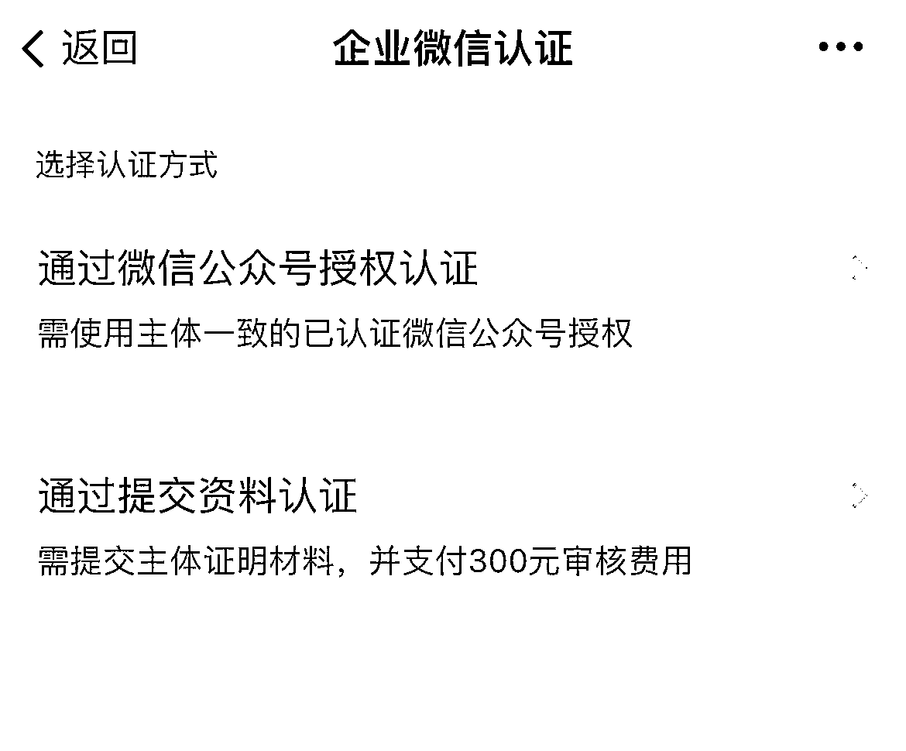  <ne-h3 id="37282088" data-lake-id="37282088"><ne-heading-ext><ne-heading-anchor></ne-heading-anchor><ne-heading-fold></ne-heading-fold></ne-heading-ext><ne-heading-content><ne-text id="u625e75d1">1.2 主体日活要大于 50</ne-text></ne-heading-content></ne-h3> <ne-p id="ub40ed780" data-lake-id="ub40ed780"><ne-text id="u03e9316d">所谓的日活就是这个企业主体每天活跃的企业微信员工号有多少数量。每个主体日活一定要大于 50，当然越多越好！</ne-text></ne-p> <ne-p id="u96e31c39" data-lake-id="u96e31c39"><ne-text id="u90380b7f">目前业内有代养日活的，不一定要自己注册那么多企微来养主体。新的企业主体认证后必须养主体至少一个月才能开始稳定接粉。</ne-text></ne-p> <ne-p id="u819ead57" data-lake-id="u819ead57"><ne-card data-card-name="image" data-card-type="inline" id="XkTBu" data-event-boundary="card">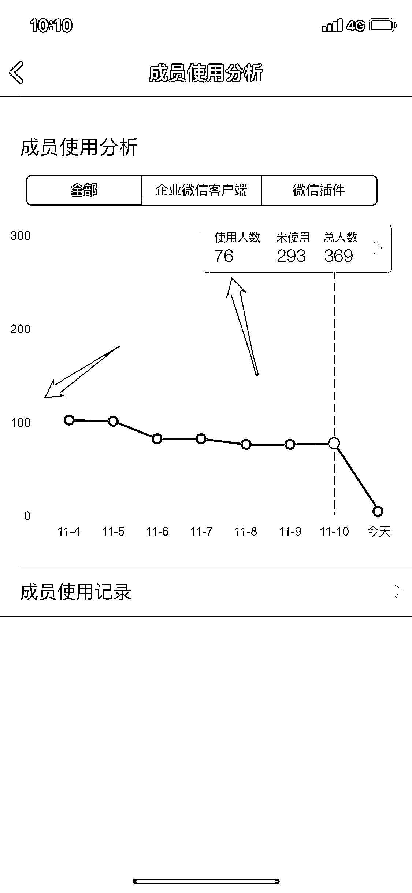  <ne-h3 id="a28d7c01" data-lake-id="a28d7c01"><ne-heading-ext><ne-heading-anchor></ne-heading-anchor><ne-heading-fold></ne-heading-fold></ne-heading-ext><ne-heading-content><ne-text id="ue02ebebc">1.3 养号需要的操作</ne-text></ne-heading-content></ne-h3> <ne-p id="u69a9cd6c" data-lake-id="u69a9cd6c"><ne-text id="ue99aabc9">每天上下班打卡、发发日报周报、员工号之间相互聊聊天等等，模拟一个真实的员工号的日常。最基本的就是要每天打卡。</ne-text></ne-p> <ne-h3 id="8b285221" data-lake-id="8b285221"><ne-heading-ext><ne-heading-anchor></ne-heading-anchor><ne-heading-fold></ne-heading-fold></ne-heading-ext><ne-heading-content><ne-text id="u19e670a3">1.4 企业主体备案</ne-text></ne-heading-content></ne-h3> <ne-p id="ud2c32e5d" data-lake-id="ud2c32e5d"><ne-text id="ua1b42097">新注册的企业主体必须找服务商备案，降低被封风险，增加抗风能力。</ne-text></ne-p> <ne-h3 id="d569c13a" data-lake-id="d569c13a"><ne-heading-ext><ne-heading-anchor></ne-heading-anchor><ne-heading-fold></ne-heading-fold></ne-heading-ext><ne-heading-content><ne-text id="u6d1aca83">1.5 备多个主体</ne-text></ne-heading-content></ne-h3> <ne-p id="ub77d48fb" data-lake-id="ub77d48fb"><ne-text id="u22be93dd">一般需要主体 3-4 个主体，每个主体日活大于 50 以后，不同的主体有不同的功能</ne-text></ne-p> <ne-oli><ne-oli-i>1</ne-oli-i><ne-oli-c class="ne-oli-content" id="u4fb5384b" data-lake-id="u4fb5384b"><ne-text id="u5518f135">有专门用于建群的群主主体</ne-text></ne-oli-c></ne-oli> <ne-oli><ne-oli-i>2</ne-oli-i><ne-oli-c class="ne-oli-content" id="u7f400b55" data-lake-id="u7f400b55"><ne-text id="ub289621b">有专用用于接粉的接粉主体</ne-text></ne-oli-c></ne-oli> <ne-oli><ne-oli-i>3</ne-oli-i><ne-oli-c class="ne-oli-content" id="ufaebdf39" data-lake-id="ufaebdf39"><ne-text id="u114dc0c3">有专门用于发单的发单主体</ne-text></ne-oli-c></ne-oli> <ne-p id="uafd28162" data-lake-id="uafd28162"><ne-text id="ud474a165">这样是为了确保某个主体出现问题，不影响社群的正常运营。接粉主体最好多备一个，以防因投诉或者接粉量大导致的异常，影响后续接粉。当然，如果你的主体日活过千足够牛逼，可忽略此条。单个主体也可使劲造。</ne-text></ne-p> <ne-p id="u475a0dae" data-lake-id="u475a0dae"><ne-text id="u5c932682">主体一般都用个体户营业执照即可，可自行网上办，也可以找人代办，一般几十-一二百不等，我们合作的代办是 70 一张。</ne-text></ne-p> <ne-h2 id="bfb2669d" data-lake-id="bfb2669d"><ne-heading-ext><ne-heading-anchor></ne-heading-anchor><ne-heading-fold></ne-heading-fold></ne-heading-ext><ne-heading-content><ne-text id="u6de6ef59" ne-bold="true">2 、靠谱且稳定的流量</ne-text></ne-heading-content></ne-h2> <ne-h3 id="8b10328b" data-lake-id="8b10328b"><ne-heading-ext><ne-heading-anchor></ne-heading-anchor><ne-heading-fold></ne-heading-fold></ne-heading-ext><ne-heading-content><ne-text id="u485f93eb">2.1 引流渠道</ne-text></ne-heading-content></ne-h3> <ne-p id="u76a3628d" data-lake-id="u76a3628d"><ne-text id="u56f24f31">目前使用较多的付费引流渠道一般都是抖音，快手，微博，朋友圈广告，还有视频号投流，主要引流场景是视频，这种粉丝的质量相对好很多！</ne-text></ne-p> <ne-p id="u16960ced" data-lake-id="u16960ced"><ne-text id="u8bb7b927">这几个渠道的群成本相对贵一些，要 5000-10000 不等，回本周期粉丝质量好的可能 2 个月之内，如果粉丝质量不好，可能 3-6 个月甚至更久。</ne-text></ne-p> <ne-p id="u9ef05a95" data-lake-id="u9ef05a95"><ne-text id="ua932c746">对于捡漏群来说，好的流量一定要是 24-40 岁之间的一-三线女性！这样的粉丝大部分以宝妈为主，粘性高，购买力强。</ne-text></ne-p> <ne-p id="u39b193e9" data-lake-id="u39b193e9"><ne-text id="u2478881b">当然投流有很多坑，一般都有专门的代投公司，找到一个靠谱有经验的代投非常非常重要，粉丝质量好，社群成本低，产出高，回本周期就快。回本后进行不断复投，雪球越滚越大。有需要对接代投的，这边可以免费对接。</ne-text></ne-p> <ne-p id="ub61e3d29" data-lake-id="ub61e3d29"><ne-text id="u853aa5e4">其他的引流渠道，比如包裹粉，小红书粉，闲鱼粉等等，成本相对比较低，基本都在 5000 以内，甚至可以自己免费引，但是批量放大时间成本比较高。</ne-text></ne-p> <ne-p id="ufa9a7783" data-lake-id="ufa9a7783"><ne-text id="u0e9839a8">这种粉的成本相对主流的付费渠道来说便宜小一半，但是由于大部分都是通过文字和图片的形式引流，因此粉丝质量没有视频引流的质量好，回本周期同样也要 2-4 个月不等。</ne-text></ne-p> <ne-h3 id="73727f70" data-lake-id="73727f70"><ne-heading-ext><ne-heading-anchor></ne-heading-anchor><ne-heading-fold></ne-heading-fold></ne-heading-ext><ne-heading-content><ne-text id="u032b6a8c">2.2 引流场景</ne-text></ne-heading-content></ne-h3> <ne-p id="u0d5cc499" data-lake-id="u0d5cc499"><ne-text id="uabc1ed57">主流的引流方式，一般都是引流到公众号，再跳转到企微号，然后企微号自动拉 500 大群，群满后再开群，开群后先发点免单养养群，取得用户的一定信任之后，再开始卖货变现回本。</ne-text></ne-p> <ne-p id="u8a86fb4a" data-lake-id="u8a86fb4a"><ne-text id="uaf0d708f">每个引流渠道的场景不太一样，但基本内容就是低价引流，视频形式引流的则大同小异，大家可以抖音直接搜 【捡漏】，就有很多，一般都是以家居用品，家具一类来低价引流。</ne-text></ne-p> <ne-p id="u3f506f8e" data-lake-id="u3f506f8e"><ne-text id="u3d473e2d">美妆小样群的引流，可以抖音 搜【大牌小样】也有很多主要是以一线大牌的美妆小样来做引流，9.9 之内的，0 元的。</ne-text></ne-p> <ne-p id="u4ad3855e" data-lake-id="u4ad3855e"><ne-text id="udc44e19f">这里以抖音引流为例，大家看下面几图，可以自己去抖音自行搜索，进一些同行群了解一下。</ne-text></ne-p> <ne-p id="u1596e083" data-lake-id="u1596e083"><ne-card data-card-name="image" data-card-type="inline" id="dMrOn" data-event-boundary="card">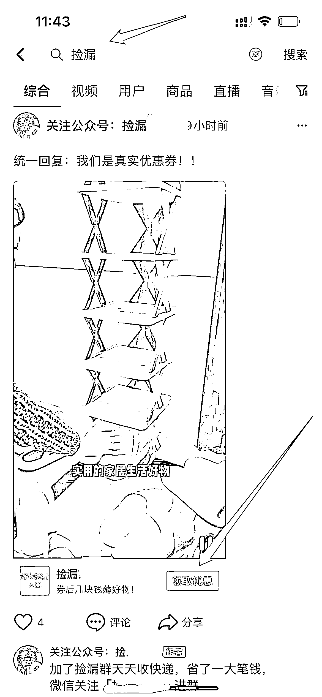<ne-card data-card-name="image" data-card-type="inline" id="MoLXl" data-event-boundary="card"><ne-card data-card-name="image" data-card-type="inline" id="hdD1m" data-event-boundary="card">  <ne-p id="u1e245526" data-lake-id="u1e245526"><ne-card data-card-name="image" data-card-type="inline" id="kavTF" data-event-boundary="card"><ne-card data-card-name="image" data-card-type="inline" id="KE0CF" data-event-boundary="card">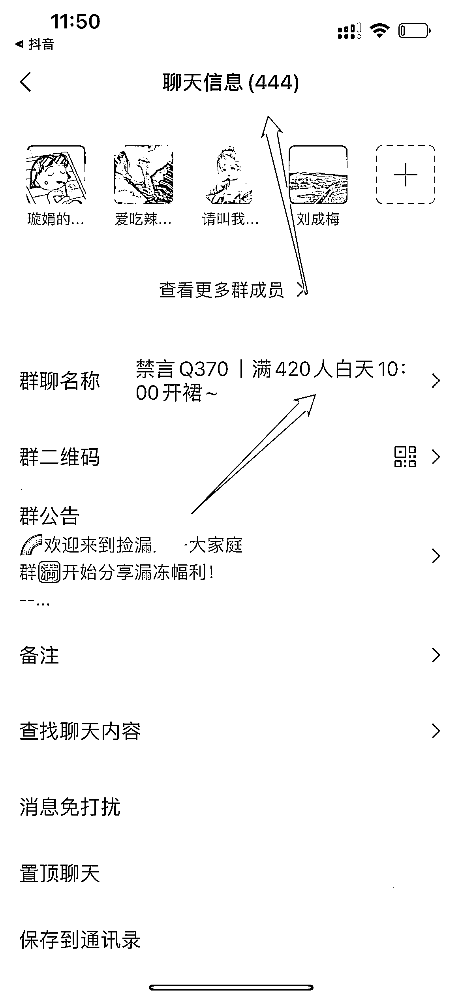  <ne-p id="u837dbbee" data-lake-id="u837dbbee"><ne-text id="u866a961d">其他的引流渠道这里就不一一展开了，有感兴趣的圈友，到时候可以多交流，或者有机会的话再专门做个引流篇。</ne-text></ne-p> <ne-h2 id="fc5d917d" data-lake-id="fc5d917d"><ne-heading-ext><ne-heading-anchor></ne-heading-anchor><ne-heading-fold></ne-heading-fold></ne-heading-ext><ne-heading-content><ne-text id="u55240dae" ne-bold="true">3、精细化的社群运营</ne-text></ne-heading-content></ne-h2> <ne-p id="ucba96755" data-lake-id="ucba96755"><ne-text id="u7fd6c933">企业主体养好了，可承载大量的流量了，也有稳定的流量进来以后，现在要考虑的就是如何高效的变现回本了。在同等的流量成本情况下，不同的运营团队，回本周期可以差 3-5 倍以上，甚至更久！</ne-text></ne-p> <ne-p id="u01ef584a" data-lake-id="u01ef584a"><ne-text id="u3172a783">一般行业内的标准在 2-3 个月，我们基本也差不多在 2 个月内，最快的回本时间在 17 天，当时单群成本 6000 多。当然也有半年也回不了本的时候，跟流量的好坏关系很大。</ne-text></ne-p> <ne-p id="ua73b514d" data-lake-id="ua73b514d"><ne-card data-card-name="image" data-card-type="inline" id="ZMxUk" data-event-boundary="card">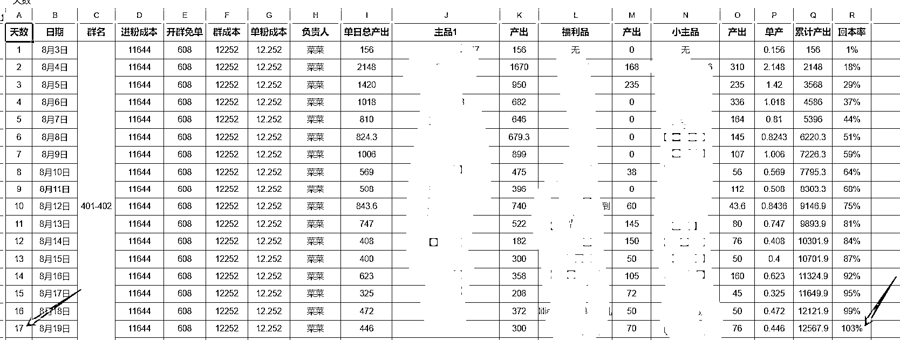  <ne-p id="u8bbbd07d" data-lake-id="u8bbbd07d"><ne-text id="ud9fc1e78">👆 这个是我们 8 月测试的其中 2 个群的数据，精细化的运营涉及到几个核心要点</ne-text></ne-p> <ne-h3 id="0973aca8" data-lake-id="0973aca8"><ne-heading-ext><ne-heading-anchor></ne-heading-anchor><ne-heading-fold></ne-heading-fold></ne-heading-ext><ne-heading-content><ne-text id="u1c98a475">3.1 选品和排品</ne-text></ne-heading-content></ne-h3> <ne-h4 id="96ba8d87" data-lake-id="96ba8d87"><ne-heading-ext><ne-heading-anchor></ne-heading-anchor><ne-heading-fold></ne-heading-fold></ne-heading-ext><ne-heading-content><ne-text id="u44b82826">3.1.1 选品</ne-text></ne-heading-content></ne-h4> <ne-p id="u2a60bb5a" data-lake-id="u2a60bb5a"><ne-text id="ufb44a034">同样一个群，同样的运营方法，发的品不一样，产出天差地别，我们必须选择符合社群用户属性的高佣商品，因为我们的用户群里基本都是 24-40 岁的女性，所以我们选品一般会针对这些用户来选一些好的产品，特别是建群开群以后的前 7 天。</ne-text></ne-p> <ne-p id="u54913036" data-lake-id="u54913036"><ne-text id="ue5a86d1e">决定了这个群多久回本。基本上要回 40%以上，一个月要回 70%，第一个主品单群好的话可以产出 1000-2000，不好的话可能就二三百，这个选品是靠经验，也可以多参考一些同行。</ne-text></ne-p> <ne-p id="u40c71d90" data-lake-id="u40c71d90"><ne-text id="u74de6e59">大部分前 7 天都是固定的品，基本是通过大量的群测试出来表现最好的 7 个爆款来固定发品。7 天以后的品，一般也会按照经验排出至少 1 个月左右的品。</ne-text></ne-p> <ne-p id="u4fa66e9a" data-lake-id="u4fa66e9a"><ne-text id="u333c4151">选品的渠道主要是定向招商群（非常重要），大淘客、好单库等主流的淘客选品网站，还有就是同行群，这个也非常重要，多加一些同行，连他们的演员话术也可以一起抄来。毕竟同行是最好的老师嘛。</ne-text></ne-p> <ne-h5 id="a176a9b7" data-lake-id="a176a9b7"><ne-heading-ext><ne-heading-anchor></ne-heading-anchor><ne-heading-fold></ne-heading-fold></ne-heading-ext><ne-heading-content><ne-text id="udf2147ff">3.1.1.1 定向招商群</ne-text></ne-heading-content></ne-h5> <ne-p id="u844f68df" data-lake-id="u844f68df"><ne-text id="u458fdba6">定向招商群基本上是我们变现最重要的一环，招商群有大量优质的高佣爆品，这些爆品的精推文案和演员文案，招商的同行都已经给我们准备好了，我们只需要拿来用就可以，不需要自己来写精推文案。</ne-text></ne-p> <ne-p id="u6921551e" data-lake-id="u6921551e"><ne-text id="ua79c11a5">同时，招商群大部分都是定向高佣的商品，可以保证我们的佣金，一般都是 40%以上，有的甚至高达 90%。</ne-text></ne-p> <ne-p id="u27ffaa26" data-lake-id="u27ffaa26"><ne-card data-card-name="image" data-card-type="inline" id="LGVEY" data-event-boundary="card">  <ne-h5 id="f2ee7c87" data-lake-id="f2ee7c87"><ne-heading-ext><ne-heading-anchor></ne-heading-anchor><ne-heading-fold></ne-heading-fold></ne-heading-ext><ne-heading-content><ne-text id="u852ec9db">3.1.1.2 选品网站</ne-text></ne-heading-content></ne-h5> <ne-p id="u5b86dece" data-lake-id="u5b86dece"><ne-text id="u34829f24">大淘客、好单库，都是非常好的选品网站，上面有实时销量榜，今日销量榜等等，我们可以根据当前的实时销量榜，就可以知道此时什么卖得最火，一般我们去发，产出也都会不错，会避免很多的坑。</ne-text></ne-p> <ne-p id="u7d9b63f7" data-lake-id="u7d9b63f7"><ne-card data-card-name="image" data-card-type="inline" id="HVL5A" data-event-boundary="card">  <ne-h5 id="edf6ea20" data-lake-id="edf6ea20"><ne-heading-ext><ne-heading-anchor></ne-heading-anchor><ne-heading-fold></ne-heading-fold></ne-heading-ext><ne-heading-content><ne-text id="udda7fbf8">3.1.1.3 同行群</ne-text></ne-heading-content></ne-h5> <ne-p id="u14435d52" data-lake-id="u14435d52"><ne-text id="u4cb6882b">多加一些同行群，看看同行群都在发什么品，看看是否符合我们社群的属性，符合的话再去好单库等选品网站看看今日销量怎么样，如果销量不错，说明产出应该可以，就可以可以直接把同行的发品文案拿过来，链接换成我们自己的就可以了，省时省力。</ne-text></ne-p> <ne-p id="u98e4ee03" data-lake-id="u98e4ee03"><ne-text id="u21e34ca9">这个也是我们主要的选品方法。</ne-text></ne-p> <ne-h4 id="f11ca209" data-lake-id="f11ca209"><ne-heading-ext><ne-heading-anchor></ne-heading-anchor><ne-heading-fold></ne-heading-fold></ne-heading-ext><ne-heading-content><ne-text id="ucf423653">3.1.2 排品</ne-text></ne-heading-content></ne-h4> <ne-p id="ub845eb66" data-lake-id="ub845eb66"><ne-text id="u80660eb8">不同的粉丝渠道，固定品虽然大同小异，但是排品相差也挺大，比如抖音渠道第一个品可能是 AJ 或者洗发水，朋友圈渠道第一个品则可能是面膜，具体排品可以多参考同行，或者自己小范围测试。</ne-text></ne-p> <ne-p id="ue751c2a7" data-lake-id="ue751c2a7"><ne-text id="ua8f5d795">当然，我们也有自己的一套爆品库和排品顺序，这个后面也可以交流。</ne-text></ne-p> <ne-p id="udcc2866f" data-lake-id="udcc2866f"><ne-text id="u90060bc4" ne-bold="true">为什么需要排品</ne-text></ne-p> <ne-p id="ua8efab7d" data-lake-id="ua8efab7d"><ne-text id="ucb9a0b33">因为每天都在进群开群，但是每个群前 7 天的品都是固定的，这样会造成每个群发品的节奏都不一样，但是每天发品的时间基本都在早上 10-11 点之间，这样下来，发品的工作量会变得很大，能不能有效的解决发品问题，也成为这个项目很大的一个难点。</ne-text></ne-p> <ne-p id="u41a5ec62" data-lake-id="u41a5ec62"><ne-text id="u50720107" ne-bold="true">那我们是怎么解决这个排品问题的呢</ne-text></ne-p> <ne-h5 id="6e7dcaa1" data-lake-id="6e7dcaa1"><ne-heading-ext><ne-heading-anchor></ne-heading-anchor><ne-heading-fold></ne-heading-fold></ne-heading-ext><ne-heading-content><ne-text id="u2efe11a5">3.1.2.1 批量进粉</ne-text></ne-heading-content></ne-h5> <ne-p id="u888e0954" data-lake-id="u888e0954"><ne-text id="u5742d355">批量进粉是为了确保一个节奏下面的群越多越好，弱化人工成本。</ne-text></ne-p> <ne-p id="uc0af9f40" data-lake-id="uc0af9f40"><ne-text id="ue1c9fff2">我们可能一天会进 5-10 个群，甚至 15-20 个群，在自己能承接的范围内，越多越好。这样可以确保一个节奏下的群人力成本最低，因为都是人工发品，每个员工发的节奏一般 2-3 个，如果每个节奏下面的群越多，那人工成本也会越低，回本周期会更快。如果你一天就进 1-2 个群，那人工成本就太高了。</ne-text></ne-p> <ne-h5 id="0231b7d7" data-lake-id="0231b7d7"><ne-heading-ext><ne-heading-anchor></ne-heading-anchor><ne-heading-fold></ne-heading-fold></ne-heading-ext><ne-heading-content><ne-text id="u884d33b7">3.1.2.2 用小主品过渡</ne-text></ne-heading-content></ne-h5> <ne-p id="ub4bb0472" data-lake-id="ub4bb0472"><ne-text id="u8c379566">刚开群的前期，我们可能会有的群中间一两天不发固定的大主品，反倒发一些签到品或者小主品来过度，为的是等后面新开的群，最后统一到一个节奏来，让这个节奏下面可能有 30-40 个群，这样对于员工发品来说，工作量就会小不少。</ne-text></ne-p> <ne-h5 id="2d457d17" data-lake-id="2d457d17"><ne-heading-ext><ne-heading-anchor></ne-heading-anchor><ne-heading-fold></ne-heading-fold></ne-heading-ext><ne-heading-content><ne-text id="u6b5c5454">3.1.2.3 固定大主品轮播</ne-text></ne-heading-content></ne-h5> <ne-p id="ubb407730" data-lake-id="ubb407730"><ne-text id="u3de96317">一个群的前 7 天固定品发完以后，就开始进入固定大主品轮播了，开始合并一批群，一般都是 100-150 个群，会统一节奏，然后分配给 2-3 个人来管理。</ne-text></ne-p> <ne-h3 id="266e730e" data-lake-id="266e730e"><ne-heading-ext><ne-heading-anchor></ne-heading-anchor><ne-heading-fold></ne-heading-fold></ne-heading-ext><ne-heading-content><ne-text id="u296c8a3a">3.2、精推文案+精推催单</ne-text></ne-heading-content></ne-h3> <ne-h4 id="ec59343b" data-lake-id="ec59343b"><ne-heading-ext><ne-heading-anchor></ne-heading-anchor><ne-heading-fold></ne-heading-fold></ne-heading-ext><ne-heading-content><ne-text id="u1c546346">3.2.1 精推文案</ne-text></ne-heading-content></ne-h4> <ne-p id="ubb117b9a" data-lake-id="ubb117b9a"><ne-text id="uf5088380">捡漏群的文案和普通的优惠券群，美妆群的文案都不一样，捡漏群的文案重点突出就是在捡漏，所以文案一般都会比较夸张，而且很长，预告文案+秒杀文案+催单文案，一般加起来都要一百多条消息，把产品的细节和优点，性价比等等，通过图片+视频+相对浮夸的文案展现出来，给用户强有力的冲击，才能达到高产出的效果。</ne-text></ne-p> <ne-p id="ud0cfc1c3" data-lake-id="ud0cfc1c3"><ne-text id="u842b4389">下面以雅鹿的一款保暖衣给大家展示下捡漏群精编文案的精髓。</ne-text></ne-p> <ne-p id="u69075d50" data-lake-id="u69075d50"><ne-text id="u4fa27d77">第一张图是预告文案，第二张和第三张图是秒杀文案+几次催单+演员晒单。关于演员氛围，下一步会提到。</ne-text></ne-p> <ne-p id="uee8bb391" data-lake-id="uee8bb391"><ne-text id="u8b217aa9">因为捡漏群一天只有一个主品，要让社群达到一个热闹且有趣的群环境，产品的文案肯定是要饱满且有感染力，一般精推文案都是招商公司的文案组写出来的，基本已经够用了，但是那样全网同质化严重，产出会有一点点影响，所以有条件的话也可以自己来写符合自己社群的文案，让社群更有独特性和人情味。</ne-text></ne-p> <ne-p id="u979a6f64" data-lake-id="u979a6f64"><ne-text id="u683d9525">不断优化，提高社群产出。</ne-text></ne-p> <ne-p id="u86a7183b" data-lake-id="u86a7183b"><ne-card data-card-name="image" data-card-type="inline" id="w8C31" data-event-boundary="card"><ne-card data-card-name="image" data-card-type="inline" id="q5o3f" data-event-boundary="card">  <ne-h4 id="4456f340" data-lake-id="4456f340"><ne-heading-ext><ne-heading-anchor></ne-heading-anchor><ne-heading-fold></ne-heading-fold></ne-heading-ext><ne-heading-content><ne-text id="u0bbae9d1">3.2.2 精推催单</ne-text></ne-heading-content></ne-h4> <ne-p id="ubacafe66" data-lake-id="ubacafe66"><ne-text id="u75deeccb">一个大主品，催单一般 4-6 次不等，根据每天群的节奏来安排</ne-text></ne-p> <ne-p id="u5a8d018d" data-lake-id="u5a8d018d"><ne-text id="ud6eeefb9">一般的发品节奏如下：</ne-text></ne-p> <ne-oli><ne-oli-i>1</ne-oli-i><ne-oli-c class="ne-oli-content" id="u598aaacc" data-lake-id="u598aaacc"><ne-text id="u9d400961">10:00-10:30 大主品秒杀</ne-text></ne-oli-c></ne-oli> <ne-oli><ne-oli-i>2</ne-oli-i><ne-oli-c class="ne-oli-content" id="u9ea5a9ca" data-lake-id="u9ea5a9ca"><ne-text id="ub749e316">11:00-11:05 第一次催单</ne-text></ne-oli-c></ne-oli> <ne-oli><ne-oli-i>3</ne-oli-i><ne-oli-c class="ne-oli-content" id="ua7888a92" data-lake-id="ua7888a92"><ne-text id="u80b81446">11:50-11:55 第二次催单</ne-text></ne-oli-c></ne-oli> <ne-oli><ne-oli-i>4</ne-oli-i><ne-oli-c class="ne-oli-content" id="uce16bd9e" data-lake-id="uce16bd9e"><ne-text id="u5a4ac4f5">14:00-14:05 第三次催单</ne-text></ne-oli-c></ne-oli> <ne-oli><ne-oli-i>5</ne-oli-i><ne-oli-c class="ne-oli-content" id="udfbf09cb" data-lake-id="udfbf09cb"><ne-text id="uc497dd04">16:00-16:05 第四次催单</ne-text></ne-oli-c></ne-oli> <ne-oli><ne-oli-i>6</ne-oli-i><ne-oli-c class="ne-oli-content" id="u48a64164" data-lake-id="u48a64164"><ne-text id="u93764e51">17:55-18:00 第五次催单</ne-text></ne-oli-c></ne-oli> <ne-oli><ne-oli-i>7</ne-oli-i><ne-oli-c class="ne-oli-content" id="ud3a12a5c" data-lake-id="ud3a12a5c"><ne-text id="u5712582e">19:00-20:00  隔天大主品预告</ne-text></ne-oli-c></ne-oli> <ne-p id="u3c4c69a9" data-lake-id="u3c4c69a9"><ne-text id="uc9aab3e8">这个只是一个大概，并不是固定死板的，主要还是要根据经验来确定催单节奏。还有其他的催单方法，比如秒杀发完链接以后，可以发个红包，或者发个群公告，晚上最后一次促单，也可以发个红包等等。</ne-text></ne-p> <ne-p id="u9ca909f3" data-lake-id="u9ca909f3"><ne-text id="ue257c9fe">每次催单的话术，一般都是呈递进式的。</ne-text></ne-p> <ne-p id="u35b0b253" data-lake-id="u35b0b253"><ne-text id="u9240ebb6">比如第一次催单，是抢疯了，第二次催单，是剩最后 300 单了，第三次催单，剩最后 120 单了，每次催单，单量是不断下降。</ne-text></ne-p> <ne-p id="udbee0b94" data-lake-id="udbee0b94"><ne-text id="ub9ec29d8">文案和图片要相互配合。</ne-text></ne-p> <ne-p id="u2a90c1a3" data-lake-id="u2a90c1a3"><ne-text id="ubad06fa0">一般催单的几个要点：限时限量、爆单、售后保障、价格对比、性价比高、好评反馈、产品亮点等等来展开。</ne-text></ne-p> <ne-p id="ue877098f" data-lake-id="ue877098f"><ne-text id="u9516d987">可以看看下面的图，雅鹿的保暖内衣，大概三四次促单，都是围绕上面几个要点来展开的。</ne-text></ne-p> <ne-p id="ucd341f63" data-lake-id="ucd341f63"><ne-card data-card-name="image" data-card-type="inline" id="kFeQ7" data-event-boundary="card">  <ne-h3 id="3fefa07c" data-lake-id="3fefa07c"><ne-heading-ext><ne-heading-anchor></ne-heading-anchor><ne-heading-fold></ne-heading-fold></ne-heading-ext><ne-heading-content><ne-text id="u08fbad18">3.3、 演员氛围</ne-text></ne-heading-content></ne-h3> <ne-p id="ufae34856" data-lake-id="ufae34856"><ne-text id="u8ec15559">捡漏群的灵魂，就是演员！</ne-text></ne-p> <ne-p id="u4946bd4b" data-lake-id="u4946bd4b"><ne-text id="ubf050059">同样的群，同样的粉，同样的文案，同样的品，有无演员，产出起码差一倍以上，因为捡漏群一天只有 一个主品，所以演员的台词和晒单几乎占据了整个社群当天大部分的节奏和篇幅，咱们这个行业有句话说：如果没有演员，基本可以退出捡漏圈了。这个一点不夸张。</ne-text></ne-p> <ne-p id="u553278a4" data-lake-id="u553278a4"><ne-text id="ud744267a">演员目的：提高社群活跃度，可信度，爆单假象！</ne-text></ne-p> <ne-h4 id="e26bd226" data-lake-id="e26bd226"><ne-heading-ext><ne-heading-anchor></ne-heading-anchor><ne-heading-fold></ne-heading-fold></ne-heading-ext><ne-heading-content><ne-text id="u04da591f">3.3.1 演员数量</ne-text></ne-heading-content></ne-h4> <ne-p id="ue271a107" data-lake-id="ue271a107"><ne-text id="u48a72ece">一个群一般都要有 30-50 个托，条件不够的起码也要 20 个左右，才能支撑一天的节奏。演员的话术现在大部分招商文案都会有，不过都不是很全，还要自己做一些加工。</ne-text></ne-p> <ne-h4 id="78e35a98" data-lake-id="78e35a98"><ne-heading-ext><ne-heading-anchor></ne-heading-anchor><ne-heading-fold></ne-heading-fold></ne-heading-ext><ne-heading-content><ne-text id="u9c6e344f">3.3.2 演员话术</ne-text></ne-heading-content></ne-h4> <ne-p id="u1f0ac531" data-lake-id="u1f0ac531"><ne-text id="u4a05a98d">一般演员的话术主要就是围绕产品展开，结合一些生活的实际场景来不断突出产品的特点和优势，不断的给群内真实用户洗脑，促进下单，提高转化。</ne-text></ne-p> <ne-p id="u1fbf80d2" data-lake-id="u1fbf80d2"><ne-text id="ucf2aa34f">当上完秒杀链接以后，演员就是通过不断晒订单图来造成爆单的现象，不断刺激用户下单，提高产出。每隔一段时间群里的发单号就会催一次单，每次催单后都会有新的演员不断晒单，反复洗脑，不断提高产出。</ne-text></ne-p> <ne-p id="u3e6ada3d" data-lake-id="u3e6ada3d"><ne-text id="u3cefe9b6">演员的话术技巧很多，大家可以看看上面的雅鹿保暖衣图的演员文案，基本可以摸清一些玩法，这里简单再讲一下</ne-text></ne-p> <ne-p id="u3206037e" data-lake-id="u3206037e"><ne-text id="u72e6099d">演员：一个时刻关注群的忠实粉丝。</ne-text></ne-p> <ne-h5 id="3b5cfd45" data-lake-id="3b5cfd45"><ne-heading-ext><ne-heading-anchor></ne-heading-anchor><ne-heading-fold></ne-heading-fold></ne-heading-ext><ne-heading-content><ne-text id="u997e3bb6">3.3.2.1 冕箪/签到品情况</ne-text></ne-heading-content></ne-h5> <ne-p id="u63834613" data-lake-id="u63834613"><ne-text id="u8420c9a7">有冕単或者 0-1 亓的签到品，所有托，必上！反馈已拍+商品名，或者晒图，带起群节奏来！</ne-text></ne-p> <ne-h5 id="c820e593" data-lake-id="c820e593"><ne-heading-ext><ne-heading-anchor></ne-heading-anchor><ne-heading-fold></ne-heading-fold></ne-heading-ext><ne-heading-content><ne-text id="ue7edd092">3.3.2.2 大主品情况</ne-text></ne-heading-content></ne-h5> <ne-p id="ubde97095" data-lake-id="ubde97095"><ne-text id="u23b788ff">选品部门发完大主品商品链接以后，上 5-10 个演员。每次催单，必上 3-5 个演员，具体根据自身演员数量来安排。</ne-text></ne-p> <ne-h5 id="444f201a" data-lake-id="444f201a"><ne-heading-ext><ne-heading-anchor></ne-heading-anchor><ne-heading-fold></ne-heading-fold></ne-heading-ext><ne-heading-content><ne-text id="u58f05dce">3.3.2.3 大主品演员技巧</ne-text></ne-heading-content></ne-h5> <ne-p id="u75701217" data-lake-id="u75701217"><ne-text id="ub3aa9608">（以下仅限针对需要花钱的大主品商品）</ne-text></ne-p> <ne-p id="uab5d8b39" data-lake-id="uab5d8b39"><ne-text id="ud193f7a0">（1）晒订单图，显得更加真实</ne-text></ne-p> <ne-p id="u9b0d2f39" data-lake-id="u9b0d2f39"><ne-text id="ub8f3c630">（2）模拟真实用户节奏，</ne-text></ne-p> <ne-quote id="ua9cfab4d" data-lake-id="ua9cfab4d"><ne-p id="u9de71743" data-lake-id="u9de71743"><ne-text id="u363759fa">（3）演员的节奏不能都是一样的，那样太假了</ne-text></ne-p> <ne-quote id="u629e527b" data-lake-id="u629e527b"><ne-p id="ubf807246" data-lake-id="ubf807246"><ne-text id="u292540c6">（4）演员的时间，一定要有一些间隔，不要集中反馈，那样太假了！显得更加真实毕竟用户也不是时刻在看群</ne-text></ne-p> <ne-p id="uffb107f9" data-lake-id="uffb107f9"><ne-text id="ude4ca3f2">（5）互动，带话题，话题往产品上靠</ne-text></ne-p> <ne-quote id="u92a0ebf0" data-lake-id="u92a0ebf0"><ne-h2 id="a9e656ed" data-lake-id="a9e656ed"><ne-heading-ext><ne-heading-anchor></ne-heading-anchor><ne-heading-fold></ne-heading-fold></ne-heading-ext><ne-heading-content><ne-text id="u556879f8" ne-bold="true">4、社群的规模大小</ne-text></ne-heading-content></ne-h2> <ne-h3 id="49fbd2dc" data-lake-id="49fbd2dc"><ne-heading-ext><ne-heading-anchor></ne-heading-anchor><ne-heading-fold></ne-heading-fold></ne-heading-ext><ne-heading-content><ne-text id="u7e28b419">4.1 量变引起质变</ne-text></ne-heading-content></ne-h3> <ne-p id="u31966726" data-lake-id="u31966726"><ne-text id="u53995d10">社群的活跃度是随着时间不断下降的，所以产出也会不断下降，一般 2 个月之后，单个社群的产出单日大概 50-80 左右，然后不断下降，最后基本稳定在单群单日 30-40 左右，当然这个数据只是一个大概，有的同行可能两三月后单群最后只有 5-10 块，有的同行可能两三年了，单群还能保持 100 以上，关键核心还是在社群运营上。</ne-text></ne-p> <ne-p id="u67f4e2cf" data-lake-id="u67f4e2cf"><ne-text id="uda2e684b">按照保守估计来算，回本之后，单群单日产出 30 来讲，假设有 100 个群，一天就是 3000 利润，有 1000 个群，一天就是 30000，那么一个月就是 90W。</ne-text></ne-p> <ne-p id="u91826cd7" data-lake-id="u91826cd7"><ne-text id="ufd79cd47">很多同行月佣百万，都是靠堆量起来的，通过量变引起质变。目前有大团队，社群数量过万了。一个月一两千万佣金。</ne-text></ne-p> <ne-p id="u60cd0ace" data-lake-id="u60cd0ace"><ne-card data-card-name="image" data-card-type="inline" id="SkPmu" data-event-boundary="card"><ne-card data-card-name="image" data-card-type="inline" id="zGNhN" data-event-boundary="card">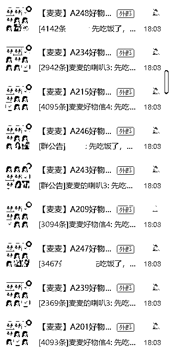  <ne-p id="ue3b85fd1" data-lake-id="ue3b85fd1"><ne-text id="u2e6a2911">核心要点第二点有讲过，靠谱且稳定的流量，一般我们找到一个稳定的流量以后，比如每天进粉 10 个群，那么开群的节奏就能统一，后面发品和排品的节奏才能有条不紊，通过不断进粉开群，积累社群数量。</ne-text></ne-p> <ne-p id="ub432493a" data-lake-id="ub432493a"><ne-text id="ud280ef25">一个社群的生命周期大概 2 年左右，2-3 个月回本后，后面的都是赚的了。</ne-text></ne-p> <ne-p id="u948275ab" data-lake-id="u948275ab"><ne-text id="uf97198e1">假设一个社群 7000 成本，3 个月回本，之后每个月可以产生 1000 的利润，21 个月还能产生 2.1W 的纯利润。投资回报率大概 3-4 倍左右。这是不算私域流量多重变现部分。</ne-text></ne-p> <ne-h2 id="acbdf9b1" data-lake-id="acbdf9b1"><ne-heading-ext><ne-heading-anchor></ne-heading-anchor><ne-heading-fold></ne-heading-fold></ne-heading-ext><ne-heading-content><ne-text id="uea5144d5">5、多重变现</ne-text></ne-heading-content></ne-h2> <ne-p id="ued7da2b9" data-lake-id="ued7da2b9"><ne-text id="udead64bc">因为我们是通过将用户引流到企业微信，实际上这些用户都在我们的私域里面，除了拉捡漏群，我们可以做很多的多重变现，比如拉美妆小样群，拼多多群，京东捡漏群，发朋友圈卖货，或者导返利等等，毕竟用户都在我们手里，广告触达都是免费的，多重变现的部分收益也很可观。</ne-text></ne-p> <ne-p id="uf61d149d" data-lake-id="uf61d149d"><ne-text id="ud327f718">有个 10W 粉的私域流量，基本不愁吃喝了。拥有 1000 个群规模的公司，私域流量起码有 60W 粉了，随便碰到一个机会，随时都可以从 0-1 起盘。</ne-text></ne-p> <ne-p id="u592f3fc5" data-lake-id="u592f3fc5"><ne-text id="u726d8642">所以，囤私域流量，是我们看好捡漏社群项目非常重要的点。捡漏粉一般都是 24-40 岁的宝妈，这种粉质量很好，消费力强，有了这么一批粉，做什么都好做。</ne-text></ne-p> <ne-h1 id="0ba21ae6" data-lake-id="0ba21ae6"><ne-heading-ext><ne-heading-anchor></ne-heading-anchor><ne-heading-fold></ne-heading-fold></ne-heading-ext><ne-heading-content><ne-text id="uc1314ca0">三、需要用到的一些必备工具</ne-text></ne-heading-content></ne-h1> <ne-p id="uad185212" data-lake-id="uad185212"><ne-text id="u5c020e2a">需要的准备工作和工具</ne-text></ne-p> <ne-p id="u308fc1f6" data-lake-id="u308fc1f6"><ne-text id="u4d041457">开始进粉之前，需要把淘宝联盟、企业主体，企业微信，演员微信，自动接粉的工具，演员系统，自动发单工具、群管系统这些都准备好。</ne-text></ne-p> <ne-p id="u43fea0b7" data-lake-id="u43fea0b7"><ne-text id="u6cc1354d">这个阶段涉及到的资源：代高佣和礼金权限的淘宝联盟账号、手机、手机号、个体营业执照、接粉公众号、自动接粉工具、自动发单工具、演员系统、群管系统。</ne-text></ne-p> <ne-h3 id="31d8d2f8" data-lake-id="31d8d2f8"><ne-heading-ext><ne-heading-anchor></ne-heading-anchor><ne-heading-fold></ne-heading-fold></ne-heading-ext><ne-heading-content><ne-text id="u98202514">1、联盟刷高佣和礼金权限</ne-text></ne-heading-content></ne-h3> <ne-p id="u86f987fa" data-lake-id="u86f987fa"><ne-text id="u4f5f6f52">淘宝联盟注册时为初级，需要找代升高佣的服务商升高佣，一般 100 以内，时间 7-10 天，升级高佣后需要刷淘礼金权限，一般刷完次月 2 号生效，这也都是找代刷的。</ne-text></ne-p> <ne-h3 id="301a08f9" data-lake-id="301a08f9"><ne-heading-ext><ne-heading-anchor></ne-heading-anchor><ne-heading-fold></ne-heading-fold></ne-heading-ext><ne-heading-content><ne-text id="u6a315706">2、个体营业执照</ne-text></ne-heading-content></ne-h3> <ne-p id="u75e94790" data-lake-id="u75e94790"><ne-text id="ue58db191">本身如果有公司营业执照或者个体营业执照的，都可以直接拿来用，公司的营业执照可以直接认证企业主体，个体户执照的话则需要先认证微信公众号，认证后可用认证完的公众号来认证企业主体。</ne-text></ne-p> <ne-p id="u3b3a7dc8" data-lake-id="u3b3a7dc8"><ne-text id="u5436e39e">如果没有公司营业执照的，建议直接自己办理个体户或者找代办的办个体户，代办的一般几十-一二百不等。</ne-text></ne-p> <ne-p id="u56746bda" data-lake-id="u56746bda"><ne-text id="uef0fe36f">建议办 3-4 张，备 3-4 个主体，不同主体的用途前面已经讲过。如果有资源想只搞一个主体，主体必须日活够量，起码 200 以上，越多越好，否则主体被限制会造成项目瘫痪。</ne-text></ne-p> <ne-h3 id="5cc1edfb" data-lake-id="5cc1edfb"><ne-heading-ext><ne-heading-anchor></ne-heading-anchor><ne-heading-fold></ne-heading-fold></ne-heading-ext><ne-heading-content><ne-text id="uad2865ec">3、手机</ne-text></ne-heading-content></ne-h3> <ne-p id="u5a3c5890" data-lake-id="u5a3c5890"><ne-text id="u2b9e1826">根据自己要起盘的预期，根据每天要进的粉量来决定需准备的手机数量。如果一天只进 2-3 个 500 人群，起步准备 10-20 台手机即可。群主号 1 个、开群号 2 个、接粉号 10 个，发单号 3-5 个。如果要做大盘的话，可以准备 100 台以上的手机。</ne-text></ne-p> <ne-p id="u25aacfb2" data-lake-id="u25aacfb2"><ne-text id="u55c10add">手机可以买安卓机，也可以苹果机，安卓机买可以自动双开的，可以多开企微，降低成本。也方便用于群控打卡养日活。一台也就几百块。我们团队用的苹果 7，128G 的，一台 630 左右，苹果机的好处是群多，消息多的情况也不会卡，缺点是无法多开，也没法群控养日活。</ne-text></ne-p> <ne-h3 id="65739f36" data-lake-id="65739f36"><ne-heading-ext><ne-heading-anchor></ne-heading-anchor><ne-heading-fold></ne-heading-fold></ne-heading-ext><ne-heading-content><ne-text id="u3b2d1fec">4、手机号</ne-text></ne-heading-content></ne-h3> <ne-p id="uf61b4efd" data-lake-id="uf61b4efd"><ne-text id="ube5e11a0">手机号主要是用于注册企业微信，一个手机号只能注册一个企微，每个身份证三大运营商一共可以办 15 张手机卡，就可以注册 15 个企微。建议用实名的卡注册企微，如果用虚拟卡后面容易出问题。</ne-text></ne-p> <ne-h3 id="88ec8d29" data-lake-id="88ec8d29"><ne-heading-ext><ne-heading-anchor></ne-heading-anchor><ne-heading-fold></ne-heading-fold></ne-heading-ext><ne-heading-content><ne-text id="uc984b486">5、接粉公众号</ne-text></ne-heading-content></ne-h3> <ne-p id="u13e8adfa" data-lake-id="u13e8adfa"><ne-text id="u52c8f265">公众号要用服务号，必须认证，认证是一年 300，公众号的设置参考同行。需要接入自动接粉系统，一般用西皮士，稳定且好用，价格还不贵。每天可承接几万流量不崩。</ne-text></ne-p> <ne-h3 id="ccc8ad2b" data-lake-id="ccc8ad2b"><ne-heading-ext><ne-heading-anchor></ne-heading-anchor><ne-heading-fold></ne-heading-fold></ne-heading-ext><ne-heading-content><ne-text id="udbba1305">6、自动接粉工具</ne-text></ne-heading-content></ne-h3> <ne-p id="u67a0f3d1" data-lake-id="u67a0f3d1"><ne-text id="u29e16e22">每天进粉的量大，不可能手动通过，手动拉群，所以需要用到自动接粉系统，一般用企微宝，也有用箫启灵等其他工具的。</ne-text></ne-p> <ne-p id="u9e230471" data-lake-id="u9e230471"><ne-text id="u26e555ea">接粉量大的一般都用企微宝，优化就是稳定，缺点就是比较贵，一个企微宝只能对应一个接粉号，如果有 20 个号接粉，就要购买 20 个企微宝，企微宝官方一年 800，找代理商一般 700 甚至更低，根据购买数量会有相应浮动。</ne-text></ne-p> <ne-p id="ub92b92c5" data-lake-id="ub92b92c5"><ne-text id="u58144ff9">企微宝可设置自动通过，自动发消息，自动拉群，关键词拉群，自动群发，群管功能等等，功能很强大。</ne-text></ne-p> <ne-h3 id="ae725f6d" data-lake-id="ae725f6d"><ne-heading-ext><ne-heading-anchor></ne-heading-anchor><ne-heading-fold></ne-heading-fold></ne-heading-ext><ne-heading-content><ne-text id="u05fe9b40">7、演员微信</ne-text></ne-heading-content></ne-h3> <ne-p id="u6c5b9468" data-lake-id="u6c5b9468"><ne-text id="u1c820b55">注册个人微信，前期起码准备 20-30 个，越多越好。有条件的都可以自己注册，需要养号起码一个月才能登录演员系统，投入使用。</ne-text></ne-p> <ne-p id="u4cb09969" data-lake-id="u4cb09969"><ne-text id="ue5d31ce4">如果没有条件自己注册的，可以租号，现在很多大团队手里几百上千个演员微信，一半以上也都是租来的，具体租号流程这里就不展开了，租号大概一个月 100 多一个号，一个演员号，大概可以托 100-150 个群。</ne-text></ne-p> <ne-h3 id="935937cc" data-lake-id="935937cc"><ne-heading-ext><ne-heading-anchor></ne-heading-anchor><ne-heading-fold></ne-heading-fold></ne-heading-ext><ne-heading-content><ne-text id="u774015f2">8、演员系统</ne-text></ne-heading-content></ne-h3> <ne-p id="u111869fb" data-lake-id="u111869fb"><ne-text id="u63940b60">这个非常重要，一个群几十个托，几百个群，如果手动一个个托的话，费事费力。想演好一个社群节奏，人工的话基本很难实现，必须借助演员系统，目前主流的用爆品站，发单帝，云中客也都有这个功能。</ne-text></ne-p> <ne-p id="u066af728" data-lake-id="u066af728"><ne-text id="u1151b0bc">一个运营人工可以控制几十上百个演员，管理几百个群都没什么问题。演员系统也不贵，一个演员一个月大概 20 左右，具体不同系统价格不一样。</ne-text></ne-p> <ne-h3 id="96e428f5" data-lake-id="96e428f5"><ne-heading-ext><ne-heading-anchor></ne-heading-anchor><ne-heading-fold></ne-heading-fold></ne-heading-ext><ne-heading-content><ne-text id="u258d5e9f">9、自动发单系统</ne-text></ne-heading-content></ne-h3> <ne-p id="u13336bb5" data-lake-id="u13336bb5"><ne-text id="u7af5435d">群那么多，我们不可能手动去发品，所以一定要用到自动发单系统，目前主流的发单软件有箫启灵，超级淘客助手，淘西西，发单帝等等，自动发单系统非常多，基本功能大同小异，大家自行选择。</ne-text></ne-p> <ne-p id="u92e3f01e" data-lake-id="u92e3f01e"><ne-text id="u6c01e7fe">发单软件有免费的也有收费的，收费的也不贵，一年几百那样。我们只需要设置一个采集群，选品人员往采集群里发一次精推文案就够了，其他的发单号就会自动发了。一般一个发单号管理 15-20 个群。</ne-text></ne-p> <ne-h3 id="f10c31cc" data-lake-id="f10c31cc"><ne-heading-ext><ne-heading-anchor></ne-heading-anchor><ne-heading-fold></ne-heading-fold></ne-heading-ext><ne-heading-content><ne-text id="ubda76f70">10、选品工具、转链工具</ne-text></ne-heading-content></ne-h3> <ne-p id="u174a53ee" data-lake-id="u174a53ee"><ne-text id="uab32d582">选品的网站有很多，选品重点是定向招商群，除此之外，好单库、大淘客、选单网等等都是主流的选品网站。</ne-text></ne-p> <ne-p id="u5e1c0661" data-lake-id="u5e1c0661"><ne-text id="u1ac6b9b7">转链的工具用箫启灵、云中客都可以。</ne-text></ne-p> <ne-h1 id="6c5c78cd" data-lake-id="6c5c78cd"><ne-heading-ext><ne-heading-anchor></ne-heading-anchor><ne-heading-fold></ne-heading-fold></ne-heading-ext><ne-heading-content><ne-text id="u92f0f40f">四、项目存在的一些风险和机会</ne-text></ne-heading-content></ne-h1> <ne-h2 id="22b61108" data-lake-id="22b61108"><ne-heading-ext><ne-heading-anchor></ne-heading-anchor><ne-heading-fold></ne-heading-fold></ne-heading-ext><ne-heading-content><ne-text id="u4e426d39">1、存在的风险</ne-text></ne-heading-content></ne-h2> <ne-p id="uedd4ae5e" data-lake-id="uedd4ae5e"><ne-text id="ucc0995e6">不管哪个项目，都是存在风险的，谁也保证不了哪个项目是一定赚钱的，这里给大家简单说一下项目存在的风险。</ne-text></ne-p> <ne-h3 id="9e99e639" data-lake-id="9e99e639"><ne-heading-ext><ne-heading-anchor></ne-heading-anchor><ne-heading-fold></ne-heading-fold></ne-heading-ext><ne-heading-content><ne-text id="u8d1df147">1.1 企业主体被封</ne-text></ne-heading-content></ne-h3> <ne-p id="u1cf9f055" data-lake-id="u1cf9f055"><ne-text id="u8a410cd4">因为我们所有的流量都用企业微信和企业微信群来承接，包括变现也是通过社群发品卖货。如果企业主体不够稳的话，一旦被客户或者同行投诉多的话，很容易造成主体被封，主体被封是该主体下面的所有企微号都不能用的。</ne-text></ne-p> <ne-p id="u65cfb00a" data-lake-id="u65cfb00a"><ne-text id="u93cb5cbf">所以我们一般都会备多个主体来分担风险，同时把每个企微主体日活养到 50 以上。这个上面有讲到。</ne-text></ne-p> <ne-h3 id="ce0da130" data-lake-id="ce0da130"><ne-heading-ext><ne-heading-anchor></ne-heading-anchor><ne-heading-fold></ne-heading-fold></ne-heading-ext><ne-heading-content><ne-text id="u0e513512">1.2 号和群被封</ne-text></ne-heading-content></ne-h3> <ne-p id="u4eb5db16" data-lake-id="u4eb5db16"><ne-text id="u067cf93d">有的时候只是个别的接粉号或者发单号被封，这种还好，换别的接粉号或者发单号上去替换就可以了。但是如果碰到群被封，就比较麻烦了，损失很大。</ne-text></ne-p> <ne-p id="ub68e8585" data-lake-id="ub68e8585"><ne-text id="u112a8bfb">很多时候群被封，很大原因都是因为主体不稳，那么就要想办法提高主体的抗封性，就是提高日活数量。</ne-text></ne-p> <ne-p id="u0bce0992" data-lake-id="u0bce0992"><ne-text id="udb6d6c66">碰到群被封的情况，挽救的方法，就是重新拉群。因为我们是引流到企微，再拉群，所以大部分用户都还是你的企微好友，我们用工具自动重新发拉群链接，就可以重新把被封的群成员拉到另外的新群，但是一般要损失 30%-40%的人。这样对回本周期也会大大的延长。</ne-text></ne-p> <ne-h3 id="0deee656" data-lake-id="0deee656"><ne-heading-ext><ne-heading-anchor></ne-heading-anchor><ne-heading-fold></ne-heading-fold></ne-heading-ext><ne-heading-content><ne-text id="u623398e1">1.3 运营不善</ne-text></ne-heading-content></ne-h3> <ne-p id="ue5bbb60b" data-lake-id="ue5bbb60b"><ne-text id="u7d812a0d">开群开不好，选品选不好，演员不够或者话术不行，都会对产出造成很大的影响。</ne-text></ne-p> <ne-h4 id="3952278b" data-lake-id="3952278b"><ne-heading-ext><ne-heading-anchor></ne-heading-anchor><ne-heading-fold></ne-heading-fold></ne-heading-ext><ne-heading-content><ne-text id="u22b6539d">1.3.1 开群开不好</ne-text></ne-heading-content></ne-h4> <ne-p id="u389592d7" data-lake-id="u389592d7"><ne-text id="uc07f2c38">开群很考验员工的灵活性，因为开群的时候社群是最活跃的，很多人都会问各种问题，还有捣乱的发广告的也会碰到，所以开群控群好不好决定了社群之后的总体基调，这块多加一些同行群，看看留存高的同行群开群都是怎么开的，把一些好的话术做整理，变成我们自己的开群话术和流量，就可以。</ne-text></ne-p> <ne-p id="u632092e3" data-lake-id="u632092e3"><ne-text id="u99aa98aa">开群最核心的就是留存率，如果留存能大于 90%，这个群的回本周期基本 2 个月之内必回。</ne-text></ne-p> <ne-h4 id="e0c799c6" data-lake-id="e0c799c6"><ne-heading-ext><ne-heading-anchor></ne-heading-anchor><ne-heading-fold></ne-heading-fold></ne-heading-ext><ne-heading-content><ne-text id="u12f54277">1.3.2 选品选不好</ne-text></ne-heading-content></ne-h4> <ne-p id="u0642622b" data-lake-id="u0642622b"><ne-text id="u0563f67c">因为我们的变现主要通过社群卖货来回本，好的品和差的品，产出相差好几倍，特别是前 7 个品，有的同行第一个品发面膜，只能出 200，发洗发水就可以出 1000，发 AJ 可以出 2000。</ne-text></ne-p> <ne-p id="uc77d7e6e" data-lake-id="uc77d7e6e"><ne-text id="ub87c3578">如果选品没有经验，回本周期是会无限延长的，因为社群的活跃度是越来越低的，前面说了，社群到后面，一般一天就 30 左右，一个大几千成本的群，前面不抓紧回本，后面基本是很难了。</ne-text></ne-p> <ne-p id="u16a425ec" data-lake-id="u16a425ec"><ne-text id="u55192b95">这个选品就只能通过小范围测试，或者多参考同行，还有多看招商群。多看好单库的实时销量榜单。</ne-text></ne-p> <ne-h4 id="2f76d4df" data-lake-id="2f76d4df"><ne-heading-ext><ne-heading-anchor></ne-heading-anchor><ne-heading-fold></ne-heading-fold></ne-heading-ext><ne-heading-content><ne-text id="ufb08a8c9">1.3.3 演员不够/话术不行</ne-text></ne-heading-content></ne-h4> <ne-p id="u42508851" data-lake-id="u42508851"><ne-text id="ufe1851fc">之前讲了，如果演员不够，在同样的条件下，产出起码差一半，所以在开始项目前，要做好演员的注册或者找人租号来当演员，总之起码保证社群有 20 个以上的演员。</ne-text></ne-p> <ne-p id="ud1e746bd" data-lake-id="ud1e746bd"><ne-text id="u89dbf1ad">演员话术要学会站在真实用户的角度来思考。如果演员不够，回本也会拉长一倍以上甚至更久。</ne-text></ne-p> <ne-h3 id="072f0d9e" data-lake-id="072f0d9e"><ne-heading-ext><ne-heading-anchor></ne-heading-anchor><ne-heading-fold></ne-heading-fold></ne-heading-ext><ne-heading-content><ne-text id="u5dd2d6cb">1.4 流量不行</ne-text></ne-heading-content></ne-h3> <ne-p id="u36e03c21" data-lake-id="u36e03c21"><ne-text id="u76e5bfa4">流量贵或者不精准，都会延长回本周期，所以要嘛搞免费流量，不管卖多少，都是赚的，要嘛要找靠谱的流量。还有，如果是团队，也要确保有稳定的流量，如果一天就一两个群，社群节奏不一样，节奏太多，产出不足以支撑人工成本，也会造成回本周期延长的情况。</ne-text></ne-p> <ne-p id="u0d67e639" data-lake-id="u0d67e639"><ne-text id="ua3076a2f">总之呢，不管是什么项目，都是靠执行力和细节。一个细节做的比别人好一点，回本就会快一点，那么每个细节都做好了，那么回本自然就快了。然后通过不断的复投，自然项目就做起来了。</ne-text></ne-p> <ne-h2 id="7fe48936" data-lake-id="7fe48936"><ne-heading-ext><ne-heading-anchor></ne-heading-anchor><ne-heading-fold></ne-heading-fold></ne-heading-ext><ne-heading-content><ne-text id="u09ca8d60">2、存在的机会</ne-text></ne-heading-content></ne-h2> <ne-p id="u432fd0ca" data-lake-id="u432fd0ca"><ne-text id="u9a6b74e0">CPS 和私域在众多互联网项目里，算是比较轻资产且回本周期较快的项目了。淘客本身是一个存在十几年的行业了，每年都有很多大佬通过这个行业赚得盆满钵满，不过近几年资本市场进入的多了。</ne-text></ne-p> <ne-p id="u4009591d" data-lake-id="u4009591d"><ne-text id="ufd9b1764">私域是一个长期积累的项目，而淘客的 CPS 只是私域的一种变现方式而已。我们做淘客，其实更多的是在做私域。</ne-text></ne-p> <ne-h3 id="8828b7a6" data-lake-id="8828b7a6"><ne-heading-ext><ne-heading-anchor></ne-heading-anchor><ne-heading-fold></ne-heading-fold></ne-heading-ext><ne-heading-content><ne-text id="u07c7e441">2.1 做私域自由安全，不受限制</ne-text></ne-heading-content></ne-h3> <ne-p id="u5be3d2ca" data-lake-id="u5be3d2ca"><ne-text id="u5684e12d">做私域不用像在公域平台一样限制很多，就像扼住自己的喉咙，命运不可控，一旦违背平台的意愿，直接被打入地牢，想申诉都难如登天。</ne-text></ne-p> <ne-p id="ud2fe3e6b" data-lake-id="ud2fe3e6b"><ne-text id="u87329e54">但是在自己的私域里，只要做好客户的维护和产品的质量就好，根本不用担心一些外来的因素。</ne-text></ne-p> <ne-h3 id="4b051ecb" data-lake-id="4b051ecb"><ne-heading-ext><ne-heading-anchor></ne-heading-anchor><ne-heading-fold></ne-heading-fold></ne-heading-ext><ne-heading-content><ne-text id="u780dd00b">2.2 降低获客成本，省钱</ne-text></ne-heading-content></ne-h3> <ne-p id="u25b45f40" data-lake-id="u25b45f40"><ne-text id="u17fab7d8">现如今公域流量越来越贵，推广成本不断增加，让商家苦不堪言，参考某宝的直通车，京东的快车等，但是私域做起来后，将客户蓄积在自己的流量池内，就能反复利用，大大降低获新客的成本，能省下一笔不小的推广、广告费用。</ne-text></ne-p> <ne-h3 id="06c97207" data-lake-id="06c97207"><ne-heading-ext><ne-heading-anchor></ne-heading-anchor><ne-heading-fold></ne-heading-fold></ne-heading-ext><ne-heading-content><ne-text id="ub5444cdc">2.3 提升销售额，赚钱贼猛</ne-text></ne-heading-content></ne-h3> <ne-p id="u44fa6df1" data-lake-id="u44fa6df1"><ne-text id="u6b03dc79">电商有个“客单价”的概念，而在私域流量运营的思维下，真正值得关注的不是“客单价”，而是“单客价”，就是一个消费者总共贡献了多少销售额。</ne-text></ne-p> <ne-p id="u75eca487" data-lake-id="u75eca487"><ne-text id="u6d5acd85">私域流量将用户生命周期拉长，单个用户复购频率增加，单客价增长，销售额自然增加。</ne-text></ne-p> <ne-h3 id="9108b0d4" data-lake-id="9108b0d4"><ne-heading-ext><ne-heading-anchor></ne-heading-anchor><ne-heading-fold></ne-heading-fold></ne-heading-ext><ne-heading-content><ne-text id="u7b8cafa3">2.4 不用管囤货/发货/售后等</ne-text></ne-heading-content></ne-h3> <ne-p id="u734e23f1" data-lake-id="u734e23f1"><ne-text id="uef2ddc40">我们做捡漏社群，只需要负责卖，，囤货、发货、售后这些，都不需要我们管，所以相对来说，只需要管好卖就行了，基本上成本就是人工成本和房租成本，最多加一些手机和话费成本，一般不会太受目前 yi 情的影响，轻资产运作，碰到新项目的时候，也比较好转型。</ne-text></ne-p> <ne-h1 id="f5e882ad" data-lake-id="f5e882ad"><ne-heading-ext><ne-heading-anchor></ne-heading-anchor><ne-heading-fold></ne-heading-fold></ne-heading-ext><ne-heading-content><ne-text id="uc3c02d10">五、总结</ne-text></ne-heading-content></ne-h1> <ne-p id="ue803696f" data-lake-id="ue803696f"><ne-text id="u5141207a">作为 6 年的淘客老兵，中间也转型做过很多其他的项目，最后发现其实淘客还是比较香且稳的，但是每个项目都是需要经验积累的，对于新人来说，最好一开始，还是尝试着做一些免费流量，新人如果一上来就做付费流量，也最好选择一些比较低成本的流量，如果是直接做比较贵的付费流量，投入的钱是很容易打水漂的。</ne-text></ne-p> <ne-p id="u79fa61e6" data-lake-id="u79fa61e6"><ne-text id="u0a878ec6">最后欢迎生财的小伙伴可以多交流，目前我们团队也开始尝试做跨境 TK 私域玩法，有在做这块的小伙伴，也欢迎评论区交流。</ne-text></ne-p> <ne-h2 id="019876ee" data-lake-id="019876ee"><ne-heading-ext><ne-heading-anchor></ne-heading-anchor><ne-heading-fold></ne-heading-fold></ne-heading-ext><ne-heading-content><ne-text id="u1dea7781">（161 赞）《视频号直播一小时加到 200 人，分享一些细节和优化过程图》</ne-text></ne-heading-content></ne-h2> <ne-p id="uf255f73b" data-lake-id="uf255f73b"><ne-text id="ub61962ae">#涛说#  分享要短，分享要短， 昨天开了个直播，一小时吧， 加到私人微信近 200 人， 生财新年预约人数 51 个， 加曹大星球 49 个， 分享一些细节给大家， 配上我的优化过程图， 我也确实是细致呀， 第一个，用好企业微信， 直播时候点弹出， 引流到私人微信， 带任何链接形式分销， 二维码形式分销， 都是非常是丝滑的， 可以不用跳出直播环境， 直接完成转化， 如图一二三四五， 注意事项就两个， 1，电脑打开企业微信， 从「客户与上下游」里头设置好「欢迎语」， 可以加图片，链接和文字等， 粉丝一加上你，就会收到设置好的一串， 2，在「应用管理」里头「机器人」， 设置好关键词触发自动回复， 双保险， 第二个，都知道 ppt 模式可以让人停留更久， 我优化了一个对大家来说更丝滑的方式， 就是金句卡片， 经过一系列优化， 过程如图四五六七， 通过安卓和苹果，都反复看了， 避开了评论和各种按钮， 优化了几个角的引导， 直到把头像换成醒目蓝色后大功告成， 模板出来几套以后， 提前做好几百张金句卡片， （从亦仁的金句中复制粘贴）， 不仅可以直播用， 朋友圈的传播红利也能吃到， 我做好的模板放在评论区， 自取自改， 祝大家新年快乐， 一年加满 5 万人， 干就得了，418 见，</ne-text></ne-p> <ne-p id="u5ac95637" data-lake-id="u5ac95637"><ne-card data-card-name="image" data-card-type="inline" id="eehkn" data-event-boundary="card">  <ne-p id="u5ce0f8e0" data-lake-id="u5ce0f8e0"><ne-card data-card-name="image" data-card-type="inline" id="n01Mh" data-event-boundary="card">  <ne-p id="u007cab52" data-lake-id="u007cab52"><ne-card data-card-name="image" data-card-type="inline" id="maF0w" data-event-boundary="card">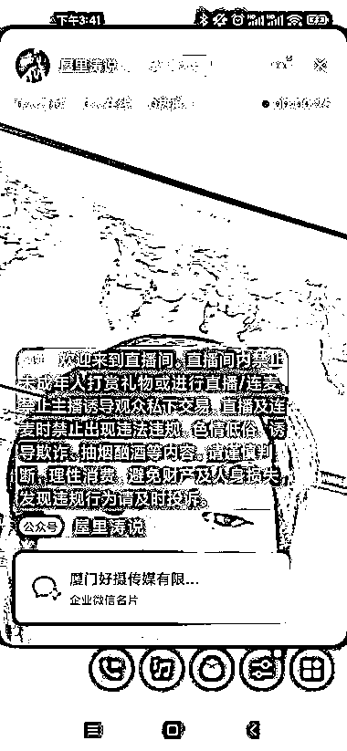  <ne-p id="ub50da774" data-lake-id="ub50da774"><ne-card data-card-name="image" data-card-type="inline" id="sLg0R" data-event-boundary="card">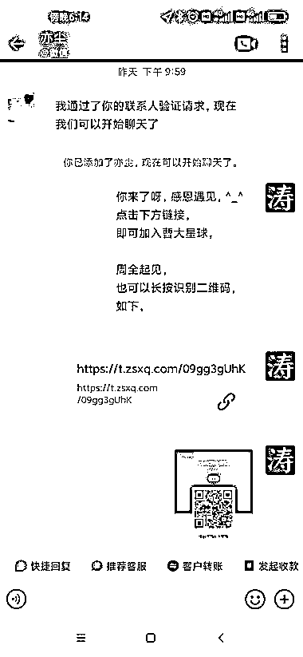  <ne-p id="u8796c21f" data-lake-id="u8796c21f"><ne-card data-card-name="image" data-card-type="inline" id="N7Lc2" data-event-boundary="card">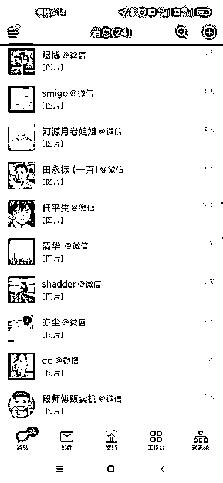  <ne-p id="u24fd30ea" data-lake-id="u24fd30ea"><ne-card data-card-name="image" data-card-type="inline" id="jqFB7" data-event-boundary="card">  <ne-p id="ua07339d4" data-lake-id="ua07339d4"><ne-card data-card-name="image" data-card-type="inline" id="UW45V" data-event-boundary="card">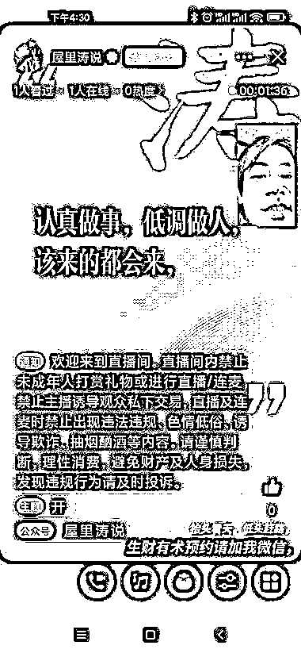  <ne-p id="uda6d3a63" data-lake-id="uda6d3a63"><ne-card data-card-name="image" data-card-type="inline" id="AlsGp" data-event-boundary="card">  <ne-p id="u9e6ea63c" data-lake-id="u9e6ea63c"><ne-card data-card-name="image" data-card-type="inline" id="WIglI" data-event-boundary="card">  <ne-h2 id="5fb7671a" data-lake-id="5fb7671a"><ne-heading-ext><ne-heading-anchor></ne-heading-anchor><ne-heading-fold></ne-heading-fold></ne-heading-ext><ne-heading-content><ne-text id="ucd40acba">（197 赞）（精华帖）《低成本创业，2 万的私域宝妈好友变现超 100 万的思路分享》</ne-text></ne-heading-content></ne-h2> <ne-p id="ud0ed85c6" data-lake-id="ud0ed85c6"><ne-text id="ua4de4fa5">你有在抖音上刷到过胎毛纪念品的视频吗？会不会联想到这是一个低成本创业的项目？</ne-text></ne-p> <ne-p id="uc24939e7" data-lake-id="uc24939e7"><ne-text id="u464d50fe">我也是机缘巧合下发现这款产品市场需求大，网上做的人很少，只有一家淘宝店在做，而且销量很高，从评价上看用户反馈也不错，是一个很好的机会。</ne-text></ne-p> <ne-p id="ua7ea7deb" data-lake-id="ua7ea7deb"><ne-text id="u86abaeb3">而且投资很少，试错成本低，去阿里巴巴采购材料包配件只需要几百元就可以满足需求，大头其实就在包装盒定做，也就只需要几千块钱就可以搞定，所以做这个项目最初总投入不到一万元，我一般比较喜欢做小投资的项目，就立马行动了起来。</ne-text></ne-p> <ne-p id="uf0f20c51" data-lake-id="uf0f20c51"><ne-text id="uac3c1ec2">做胎毛纪念品的用户基本上都是刚生宝宝的宝妈，或者即将生产的宝妈，这个时候的宝妈对胎毛纪念品的兴趣最大，都想给孩子制作一份有意义的纪念品进行长久保存下去，所以人气比较高，一款产品价格 100-200 元，另外包含亲子款、一家三口款等，这样一单的客单价就做到了 400-500 元左右。</ne-text></ne-p> <ne-p id="u5be8a07f" data-lake-id="u5be8a07f"><ne-text id="u2d2123f9">结果从抖音导流 2 万私域的，都是精准的宝妈好友，完成了 7000 单的胎毛纪念品变现。</ne-text></ne-p> <ne-p id="u5b88447c" data-lake-id="u5b88447c"><ne-text id="u0f510e05">再结合私域流量用户分析，刚生宝宝的宝妈基本上都会在家带孩子，没有办法工作，对副业赚钱需求比较高，所以也会带她们一起做副业赚钱，由于之前有过胎毛产品的成交，产品没有质量问题，有一定的信任基础在，所以大大减少了转化成交的成本，完成了 30 万+的变现。</ne-text></ne-p> <ne-p id="uaeab7dff" data-lake-id="uaeab7dff"><ne-text id="u7d4de7cd">对了，我是 11 年毕业的，上班三年，14 年辞职专职做微信公众号，算是赶上风口赚到了人生的第一桶金，投资 3800 元最后收益超过 1000 倍。</ne-text></ne-p> <ne-p id="u85674e7a" data-lake-id="u85674e7a"><ne-text id="u6e7123b3">由于微信公众号做了几年收益开始下降，所以在寻找新的项目来增加收入，正好找到了胎毛纪念品项目。</ne-text></ne-p> <ne-p id="u72ed22be" data-lake-id="u72ed22be"><ne-text id="u3b8d4d34">这个项目的变现思路可以总结为：对于同一类人群，除了提供痛点需求产品，还可以做更多延伸的痛点需求服务。</ne-text></ne-p> <ne-p id="uc70db4ec" data-lake-id="uc70db4ec"><ne-text id="uc0971974">接下来分享的内容主要从胎毛纪念品都有哪些分类，产品从哪里来，用户群体都有哪些，私域流量从哪里来，怎么变现这五个部分进行。</ne-text></ne-p> <ne-p id="u45158280" data-lake-id="u45158280"><ne-text id="uabcfa165" ne-bold="true">1\. 产品都有哪些？</ne-text></ne-p> <ne-p id="u631f4b3a" data-lake-id="u631f4b3a"><ne-text id="u6f9f1532">早期的胎毛纪念品比较单一，市场上提供的都是胎毛笔，需要宝妈们把宝宝的胎毛邮寄给厂家，由厂家制作完成后再发货给客户，但不能确保制作出来的胎毛笔就是自己家宝宝的胎毛，这个也确实是很多宝妈顾虑的地方，胎毛笔制作好也只能收藏保存。</ne-text></ne-p> <ne-p id="ubad1a2bb" data-lake-id="ubad1a2bb"><ne-text id="u7d381d76">银饰品款胎毛纪念品就显得更具优势，宝妈们可以自己亲手 diy 进行制作，享受制作过程的乐趣，也更有纪念意义，可以收藏保存，更重要的是制作完成后可以进行佩戴。</ne-text></ne-p> <ne-p id="ub447e001" data-lake-id="ub447e001"><ne-text id="ud759c08a">我在选择产品款式上，基本上都是参考其他卖家的，首先把他们销量高的产品都做出来，销量高的产品肯定都是经过市场验证的，满足大多数用户的需求，然后再采购一些同行没有的款式做到差异化，价格自然也就可以定的高一些，利润也就随之增加了。</ne-text></ne-p> <ne-p id="u784a6d45" data-lake-id="u784a6d45"><ne-text id="uc470aad1">胎毛纪念品包含项链、戒指、手链手串等，可以组合成情侣款对戒、情侣款手串、一家三口款手链等，另外也有一些车挂、钥匙链等配件，都可以把胎毛放进去进行手工 diy，这些组合搭配都是提高客单价的方法，也提供一些定制款，比如在纯银材质上进行刻字，或者阿里巴巴上 AB 胶的模具也有很多款式，都可以定制出各种类型的纪念品款式。</ne-text></ne-p> <ne-p id="u79cf35b0" data-lake-id="u79cf35b0"><ne-text id="u7ee19da3">如果宝妈没有时间制作，也会有代制作的需求，这里额外增加定制费，制作完成再邮寄给客户就可以了。</ne-text></ne-p> <ne-p id="ue2ea2dd3" data-lake-id="ue2ea2dd3"><ne-text id="u7ed714c3" ne-bold="true">2\. 产品从哪里来？</ne-text></ne-p> <ne-p id="uba9c1395" data-lake-id="uba9c1395"><ne-text id="u2068bb9a">发现这个需求后，就直接去网上买了同行的产品回来进行拆解，产品包装里面有提供详细的制作流程，制作完成发现并不复杂，然后就开始根据里面的材料包去找货源，发现产品基本上都是通过采购组装出来的，比如各种制作工具：银饰品、AB 胶、模具、搅拌棒等等各种配件，都可以在阿里巴巴上进行采购，这样整套产品的材料包就凑齐了，产品包装、手提袋就找到本地的包装厂进行定做，整套产品所需要的材料基本上就这样顺利解决了。</ne-text></ne-p> <ne-p id="ua41cf984" data-lake-id="ua41cf984"><ne-text id="ufd5d7dbf">如何才能把产品款式找的更全面：像材料包中的制作工具，量杯、搅拌棒、打磨棒、模具等等，提供的厂家比较多，都可以很容易采购，像主产品都是纯银材质的半成品，货源厂家也很多，但是同款很少，就可以通过阿里巴巴拍照识图功能进行找同款，如果阿里巴巴没有，再去淘宝上通过这种方式进行查找，基本上就可以全部找出来所有的款式了。</ne-text></ne-p> <ne-p id="ud7eef1fc" data-lake-id="ud7eef1fc"><ne-card data-card-name="image" data-card-type="inline" id="jWh4d" data-event-boundary="card">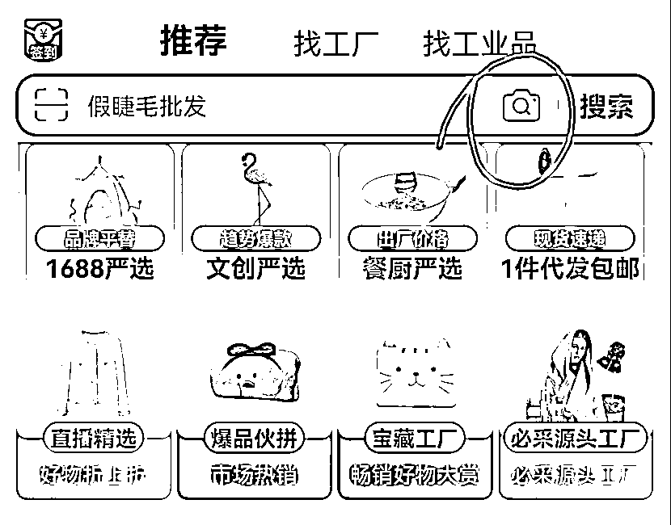  <ne-p id="u35049782" data-lake-id="u35049782"><ne-text id="u36b4c2dd" style="color: rgb(89, 89, 89);">阿里巴巴产品搜索截图</ne-text></ne-p> <ne-p id="u73433297" data-lake-id="u73433297"><ne-text id="u2229404b">注：材料包采购齐全，如果制作样品时，可以网上下单一份假发就可以进行制作，千万别薅自己的头发，哈哈……</ne-text></ne-p> <ne-p id="u8085d07a" data-lake-id="u8085d07a"><ne-text id="u8b18f44f" ne-bold="true">3\. 用户群体都有哪些？</ne-text></ne-p> <ne-p id="uaeaa562f" data-lake-id="uaeaa562f"><ne-text id="u166c625f">做胎毛纪念品的用户基本上都是刚生宝宝的宝妈，或者即将生产的宝妈，这个时候的宝妈对胎毛纪念品的兴趣最大，都想给孩子制作一份有意义的纪念品进行长久保存下去，所以人气比较高，一款产品价格 100-200 元，另外包含亲子款、一家三口款等，这样一单的客单价就做到了 400-500 元左右。</ne-text></ne-p> <ne-p id="u793355fd" data-lake-id="u793355fd"><ne-text id="u327d8af8">如果是宝宝已经几岁的宝妈，可能已经丢失了想要制作的想法，另外宝宝的胎毛可能也已经找不到了，所以找到精准的用户群体很重要。</ne-text></ne-p> <ne-p id="u8f904902" data-lake-id="u8f904902"><ne-text id="u5e6b5335">另外可以和影楼、母婴店进行合作，给他们提供一份产品画册，这里不需要提供纸质版画册，只需要制作一份电子版的画册都可以，基本上没有额外的费用投入，可以供给他们的用户进行选择，这也是增加收入的一种方式。</ne-text></ne-p> <ne-p id="uc801200d" data-lake-id="uc801200d"><ne-text id="u9899c5c8" ne-bold="true">4\. 私域流量从哪里来？</ne-text></ne-p> <ne-p id="u77dd963a" data-lake-id="u77dd963a"><ne-text id="u787d688e" ne-bold="true">①淘宝引流：</ne-text></ne-p> <ne-p id="u01a8477b" data-lake-id="u01a8477b"><ne-text id="ue9cedcc7">产品找到，最初是通过淘宝店铺进行售卖，上面提到同行是把制作流程附带产品一起发给买家，我这里进行了升级，只放一张微信二维码，提示用户添加好友发送制作流程，这样客户收到货，只有扫码添加好友领取制作流程才可以进行制作，每一个订单的用户都不会流失，全部转化到私域流量。</ne-text></ne-p> <ne-p id="u9aa50384" data-lake-id="u9aa50384"><ne-text id="uaffd90b9">注：利用淘宝低价引流，也是一种很不错的方式，我后期设计了一款 38 元的胎毛纪念品，订单很多，可以全部转化到自己的私域里面。</ne-text></ne-p> <ne-p id="u17634df4" data-lake-id="u17634df4"><ne-text id="u83c6acae" ne-bold="true">②抖音引流：</ne-text></ne-p> <ne-p id="u02a2e18a" data-lake-id="u02a2e18a"><ne-text id="u1a941bbe">通过淘宝来的私域流量都是成交的客户，量不会太大，大流量其实是从抖音引流过来的，考虑到抖音的引流方式不同，我就注册了一张个体户工商执照，给抖音开通了企业账号，因为企业号更具有优势，可以添加电话联系方式，这在后面引流有很大的用途。</ne-text></ne-p> <ne-p id="udca2a214" data-lake-id="udca2a214"><ne-text id="ufddfccc0">发布抖音并没有太复杂的东西，每条内容只是简单的发布几张产品图或者录制制作纪念品的过程，抖音给的流量大概是 20-100 万左右，一次引流到私域大概 200-500 人左右，也就是通过抖音引流，让我看到新的机会，后面渐渐的就从淘宝转移到了抖音，把更多的精力投入到抖音引流到微信成交这个流程上面。</ne-text></ne-p> <ne-p id="u88e2ea5d" data-lake-id="u88e2ea5d"><ne-text id="u3f9b92f1" ne-bold="true">更新抖音内容考虑的三点问题：内容+文案+背景音乐+评论互动。</ne-text></ne-p> <ne-p id="ua5d6810a" data-lake-id="ua5d6810a"><ne-text id="ua3e8cab3" ne-bold="true">内容：</ne-text><ne-text id="u5af550da">图片形式，产品图片选择，会拍出来多张图片，从中挑选出来 3-5 张最好的拿出来发布到抖音，图片选的好才能先吸引用户的注意力。视频形式，会录制一个制作纪念品的过程，然后再剪辑发布，让用户看到会觉得很有意思，提高趣味性。</ne-text></ne-p> <ne-p id="u26f058d6" data-lake-id="u26f058d6"><ne-text id="ufce7f6b1" ne-bold="true">文案：</ne-text><ne-text id="ud0754c84">文案有胎毛相关关键词，因为很多第一次接触这些产品的用户，看到款式图可能会觉得这是简单的银饰品，通过文案介绍，可以很直接的让用户了解到这是用胎毛制作的银饰品。</ne-text></ne-p> <ne-p id="u5dd07618" data-lake-id="u5dd07618"><ne-text id="u0de78e72" ne-bold="true">背景音乐：</ne-text><ne-text id="u100d8d4e">热门音乐，母婴类的热门音乐，基本上每次更新都不会落下，都会给用上。</ne-text></ne-p> <ne-p id="udd9f74f1" data-lake-id="udd9f74f1"><ne-text id="u52f1141a" ne-bold="true">评论互动：</ne-text><ne-text id="u2d6c8c27">及时互动，避免用户流失，内容发布后，会随时关注播放量情况，只要抖音给推送流量，起来的特别快，所以只要有用户评论怎么制作，或者怎么联系，都会及时给评论回复让用户关注的表情，这样后来的用户看到，有些人就知道怎么操作了，节约时间提高转化。</ne-text></ne-p> <ne-p id="ufdf42608" data-lake-id="ufdf42608"><ne-card data-card-name="image" data-card-type="inline" id="behCe" data-event-boundary="card">  <ne-p id="u098afc6e" data-lake-id="u098afc6e"><ne-text id="u2d07c911" style="color: rgb(89, 89, 89);">案例截图，播放 110 万</ne-text></ne-p> <ne-p id="uf1e90007" data-lake-id="uf1e90007"><ne-text id="u6171211f" ne-bold="true">（1）抖音具体引流的方式</ne-text></ne-p> <ne-p id="u79cf6fe7" data-lake-id="u79cf6fe7"><ne-text id="uc5c34395">抖音引流基本上都是被动添加的形式，让用户主动添加微信，然后慢慢的验证回复消息就可以了，微信也比较安全不会出问题。有个别好友会回复自己的微信号，我再进行主动添加。</ne-text></ne-p> <ne-p id="ua43206e0" data-lake-id="ua43206e0"><ne-text id="u63f4ae58" ne-bold="true">联系电话：</ne-text><ne-text id="u68deaa91">这个就是上面提到的企业号的好处，企业号添加联系方式，绑定一个好记的手机号，有些用户知道可以通过手机号添加微信，会直接添加微信，这里就节约了很多时间；</ne-text></ne-p> <ne-p id="u0567f05a" data-lake-id="u0567f05a"><ne-card data-card-name="image" data-card-type="inline" id="krwp3" data-event-boundary="card">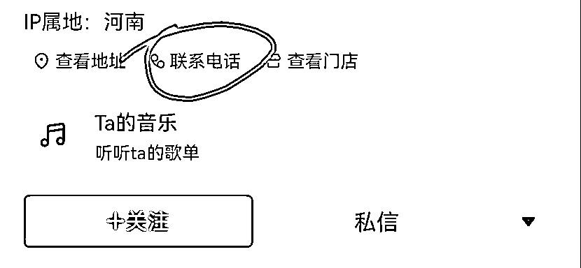  <ne-p id="u3ed8618d" data-lake-id="u3ed8618d"><ne-text id="ufc4a7f9b" style="color: rgb(89, 89, 89);">企业号添加联系电话截图</ne-text></ne-p> <ne-p id="u91d00b09" data-lake-id="u91d00b09"><ne-text id="ufd235316" ne-bold="true">用户私信回复：</ne-text><ne-text id="u1e185fae">第二个就是用户直接私信（这里也有一个很好的话术就是抖音这里没办法发送产品链接，添加微信给你发链接可以挑选款式），我给微信绑定了一个短位的 QQ 账号（如果一个账号加的太多，还可以把这个 QQ 账号绑定到其他的微信号上面，这样也做到了分流），私信回复给用户，方便用户搜索添加；</ne-text></ne-p> <ne-p id="ua3af56ae" data-lake-id="ua3af56ae"><ne-text id="u5c21245d" ne-bold="true">评论区引导：</ne-text><ne-text id="u4a9c5414">第三个就是用户不知道主动添加又没有私信的，只是在评论区怎么购买，怎么联系的，首先是关注对方的账号，让用户看到关注的消息进行回关互动，另外就是回复关注表情引导用户关注，关注后这样就可以给用户私信，让用户添加微信进行挑选产品下单。</ne-text></ne-p> <ne-p id="uee3967d2" data-lake-id="uee3967d2"><ne-text id="ua11bf56e">也就是通过上面这些抖音的操作方法，让我从抖音积累到 2 万个宝妈好友。</ne-text></ne-p> <ne-p id="u88c11a21" data-lake-id="u88c11a21"><ne-text id="u230ed8f3" ne-bold="true">5\. 怎么变现？</ne-text></ne-p> <ne-p id="uefcd2bc2" data-lake-id="uefcd2bc2"><ne-text id="u488aeaa8">关于变现这个问题，里面包含了四个变现方式，一个是纪念品，一个是副业，一个是无货源，还有其他。</ne-text></ne-p> <ne-p id="ud945f444" data-lake-id="ud945f444"><ne-text id="u92e8e947" ne-bold="true">①产品变现：</ne-text></ne-p> <ne-p id="u019f4a06" data-lake-id="u019f4a06"><ne-text id="u88a6a10a">因为提前做好了一个产品链接，里面包含所有产品的款式图以及产品介绍，比如产品是纯银材质的，支持检测，材料包齐全，收到货可以在家手工 diy 进行制作等，在通过好友验证后，就直接把链接转发给客户进行查看，客户在挑选产品款式的同时，也对产品有了一定的了解，这样就节约了很多沟通的时间，聊天过程其实就是挑选款式确认付款，这边给安排发货。</ne-text></ne-p> <ne-p id="u0c995695" data-lake-id="u0c995695"><ne-text id="ua4dd4196">结合朋友圈晒成交图、发货图、客户制作完成后的效果图以及佩戴实拍图，基本上就可以打消一些用户的顾虑问题，加上做一些活动促销，比如满减或者满金额赠送宝宝手脚印泥，又一次满足了宝妈们的需求，很容易出单成交。</ne-text></ne-p> <ne-p id="uc528cd0a" data-lake-id="uc528cd0a"><ne-text id="u149b280f">因为引流用户也比较精准，所以转化率比较高，最终 2 万个好友大概成交了 7000 单。</ne-text></ne-p> <ne-p id="ua45e9496" data-lake-id="ua45e9496"><ne-text id="ue987a696" ne-bold="true">②副业变现：</ne-text></ne-p> <ne-p id="u68ff49c2" data-lake-id="u68ff49c2"><ne-text id="u74751e75">带副业赚钱基本上没有什么资金投入，结合私域流量用户分析，刚生宝宝的宝妈基本上都会在家带孩子，没有办法工作，对副业赚钱需求比较高，但是网上诈骗类信息比较多，宝妈们对副业赚钱比较感兴趣但也会偏谨慎，需要了解清楚做什么，能不能赚到钱，会需要考虑观望一段时间。</ne-text></ne-p> <ne-p id="u96e91f8a" data-lake-id="u96e91f8a"><ne-text id="u56bb2955">所以最初带副业赚钱，学费只要 199 元，先成交一定的用户，用户赚到钱有了反馈，才更利于后面的成交。</ne-text></ne-p> <ne-p id="u19048748" data-lake-id="u19048748"><ne-text id="uaa0732ae">即便只要 199，想要成交一个用户可能也需要介绍很长时间，或者考虑几天才会愿意跟着尝试，然后学费也是阶梯制的，比如限时限量，一周后涨价到 299，或者最后一天只要 10 个名额，下一期继续涨价到 399，这样之前咨询没有成交的可能就会再成交一部分，因为从最初开始只有涨价，从来没有一次优惠过，涨到后来的 799，基本上每次都能成交很多人。</ne-text></ne-p> <ne-p id="u4763f786" data-lake-id="u4763f786"><ne-text id="uc10b9524">当然更重要的是前面跟着做的给的正面反馈，让大家都能真实的赚到钱，一般跟着做的都能赚个几千到几万不等，这是成交的重点。后面也做了新的升级，不赚钱退全款，基本上有些一直在考虑的就没有什么好犹豫的了。</ne-text></ne-p> <ne-p id="uf0c53774" data-lake-id="uf0c53774"><ne-text id="uc6c222d6">上面的成交其实也有一部分来源于购买过胎毛纪念品，有过成交，产品质量又没有问题，所以也有一定的信任基础在。</ne-text></ne-p> <ne-p id="ucc1eb130" data-lake-id="ucc1eb130"><ne-text id="u2c3b4c61">在后来的带第二次，第三次副业赚钱的时候，特别是已经在跟着做副业赚钱的用户，基本上就不需要再浪费时间介绍做什么了，也许之前转化成交需要介绍半小时+考虑一星期，这次就不一样，只需要说有新的赚钱机会可以做，基本上就会直接转账付款，不会再考虑会不会被骗，基本上是已经完全信任的状态。</ne-text></ne-p> <ne-p id="u3b166057" data-lake-id="u3b166057"><ne-text id="u8407308c">在副业赚钱上变现大概有 30 万左右。现在收益也在持续中……</ne-text></ne-p> <ne-p id="uc7582bd1" data-lake-id="uc7582bd1"><ne-card data-card-name="image" data-card-type="inline" id="iCA3i" data-event-boundary="card">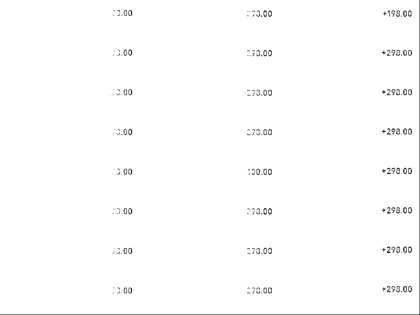  <ne-p id="u5f969399" data-lake-id="u5f969399"><ne-text id="u4f53cb46" style="color: rgb(89, 89, 89);">这是副业赚钱一天的成交图</ne-text></ne-p> <ne-p id="ud8b09eb0" data-lake-id="ud8b09eb0"><ne-text id="u0ea3d219" ne-bold="true">③无货源变现：</ne-text><ne-text id="u7c0cf475">针对自己私域流量的用户人群，找到适合的产品。我是在阿里巴巴上找的货源，通过产品销量数据和买家评价进行挑选判断，销量高，评价用户反馈也不错，这样的就适合我来进行售卖。</ne-text></ne-p> <ne-p id="u7ae4fda6" data-lake-id="u7ae4fda6"><ne-text id="uebd58a7f">我会把产品详情介绍以及用户的买家秀拿过来进行整合，然后发布到朋友圈进行宣传，微信直接下单，因为我自己也有和快递点合作，所以我会卖出一批货之后再去批量采购回来给客户发货。当然也可以做一件代发，让卖家直接给客户发货。</ne-text></ne-p> <ne-p id="ue8ffe758" data-lake-id="ue8ffe758"><ne-text id="ub5b1faa9" ne-bold="true">④其他一些额外增加收益的方法</ne-text><ne-text id="u8ea56a9e">，比如淘客，每到节日促销的时候，都会在朋友圈发布几条内容，告知可以免费领淘宝购物红包，有需要的直接点赞本条朋友圈，这样做到了不群发不打扰，有需求的参与，不给其他用户带来干扰。</ne-text></ne-p> <ne-p id="ue29bc3e0" data-lake-id="ue29bc3e0"><ne-text id="ue85f02a8">多发几条朋友圈就可以积累很多用户参与进来，活动开始的时候制作一个单页面，只要用户打开单页面点击一下领取按钮就自动复制了淘宝客的口令，提示用户打开淘宝就可以去领红包了。</ne-text></ne-p> <ne-p id="u4cb3c61b" data-lake-id="u4cb3c61b"><ne-text id="ufb60d073">整个操作流程很简单，这个页面制作完成后，就可以再发布一条新的朋友圈，把领取红包的链接放在上面，然后去之前发布的朋友圈进行评论，查看我的第一条朋友圈领取红包。</ne-text></ne-p> <ne-p id="ue770ae7c" data-lake-id="ue770ae7c"><ne-text id="u8e5a5f45">这样用户购物消费佣金也就赚到了。另外一些邀请用户下载安装的佣金奖励都可以参与，比如快手极速版，抖音极速版等等，都是一些增加收入的方法。</ne-text></ne-p> <ne-p id="ufd4ba185" data-lake-id="ufd4ba185"><ne-text id="uaf0f267e">以上就是我的本次分享，第一次分享有不足之处请多指教。</ne-text></ne-p> <ne-h3 id="3f91aaac" data-lake-id="3f91aaac"><ne-heading-ext><ne-heading-anchor></ne-heading-anchor><ne-heading-fold></ne-heading-fold></ne-heading-ext><ne-heading-content><ne-text id="u7e9db61d">【线下实体】</ne-text></ne-heading-content></ne-h3> <ne-h2 id="306efc21" data-lake-id="306efc21"><ne-heading-ext><ne-heading-anchor></ne-heading-anchor><ne-heading-fold></ne-heading-fold></ne-heading-ext><ne-heading-content><ne-text id="ud5d9b0f1">（92 赞）《20 天帮助实体书画门店收款 160 万》</ne-text></ne-heading-content></ne-h2> <ne-p id="ub6337f9b" data-lake-id="ub6337f9b"><ne-text id="ud56c3d35">在双十一的时候，我们团队帮助一个之前服务过的老客户，设计了一套转化流程，在 20 天时间，帮助这个济南长清的书画校区做了 160 万的一个收款，在当时口罩那个环境下，在长清彻底把这个机构引爆掉，收款做到当地天花板</ne-text></ne-p> <ne-p id="u97b9cbd3" data-lake-id="u97b9cbd3"><ne-text id="u60c57bae">接下来，给大家复盘一下整个的细节流程，</ne-text></ne-p> <ne-p id="u550c1905" data-lake-id="u550c1905"><ne-text id="uc5205a45">现在很多做门店服务的，上来就是帮助门店做多少粉丝、做多少播放量，个人认为如果不给实体门店带去销售额都是耍流氓，要给实体门店带去销售额来倒推服务，</ne-text></ne-p> <ne-p id="uc904f835" data-lake-id="uc904f835"><ne-text id="ub9545e52">这个 20 天做 160 万的业绩，其主要环节主要分为这几块，</ne-text></ne-p> <ne-p id="ue5ef0811" data-lake-id="ue5ef0811"><ne-text id="ud5c6c663">1、引爆同城流量</ne-text></ne-p> <ne-p id="ub5af543f" data-lake-id="ub5af543f"><ne-text id="u6fd369d4">2、裂变自有流量</ne-text></ne-p> <ne-p id="ua5c751df" data-lake-id="ua5c751df"><ne-text id="u042b105c">3、转化到店流量</ne-text></ne-p> <ne-h2 id="bc6eda1e" data-lake-id="bc6eda1e"><ne-heading-ext><ne-heading-anchor></ne-heading-anchor><ne-heading-fold></ne-heading-fold></ne-heading-ext><ne-heading-content><ne-text id="ub3abc6d7">1、引爆同城流量</ne-text></ne-heading-content></ne-h2> <ne-p id="u7e65eb31" data-lake-id="u7e65eb31"><ne-text id="u89464afc">当时那一家是书画的少儿培训机构，实体门店很清晰，就是需要自己的产品，能持续的触达本城市的精准人群，实体门店的流量重心是在同城，</ne-text></ne-p> <ne-p id="ud9421966" data-lake-id="ud9421966"><ne-text id="u94c8f8c6">同城流量的主阵地主要有两个：</ne-text></ne-p> <ne-p id="uff58b56b" data-lake-id="uff58b56b"><ne-text id="uaa99d2d5">1、微信，微信我们快速触达用户的渠道是在同城群，</ne-text></ne-p> <ne-p id="u1ab918dc" data-lake-id="u1ab918dc"><ne-text id="u482246e7">2、抖音，抖音我们快速触达用户的渠道是在抖音同城，</ne-text></ne-p> <ne-h3 id="8195e1b0" data-lake-id="8195e1b0"><ne-heading-ext><ne-heading-anchor></ne-heading-anchor><ne-heading-fold></ne-heading-fold></ne-heading-ext><ne-heading-content><ne-text id="u3a1d8a19">1、对于同城微信群</ne-text></ne-heading-content></ne-h3> <ne-p id="u50784647" data-lake-id="u50784647"><ne-text id="ub83b77ec" style="color: rgb(216, 57, 49);">一个城市打开率最高是在业主群、村居群、商家群、团购群这三类，这是城市私域流量主阵地</ne-text><ne-text id="uebc493f7">，我们在活动开始前，带着门店的员工先去线下直接加一波同城的微信群，积累 1000 个左右的同城微信群，</ne-text></ne-p> <ne-p id="ucecf49a3" data-lake-id="ucecf49a3"><ne-text id="uae8435ae">积累了 1000 个左右的同城微信群，接下来做了这两个动作，</ne-text></ne-p> <ne-p id="u13f34d2a" data-lake-id="u13f34d2a"><ne-text id="uc333c6dc">1、沉淀同城群的宝妈到自己的群，</ne-text></ne-p> <ne-p id="uda977bb8" data-lake-id="uda977bb8"><ne-card data-card-name="image" data-card-type="inline" id="IRWXt" data-event-boundary="card">  <ne-p id="ud2996577" data-lake-id="ud2996577"><ne-text id="ue582f21a">我们可以设置只要宝妈进群，即可送一个小凳子，再设计邀请 5 个人进群，再送一个保温包；</ne-text></ne-p> <ne-p id="u700a2066" data-lake-id="u700a2066"><ne-card data-card-name="image" data-card-type="inline" id="Yq5nr" data-event-boundary="card">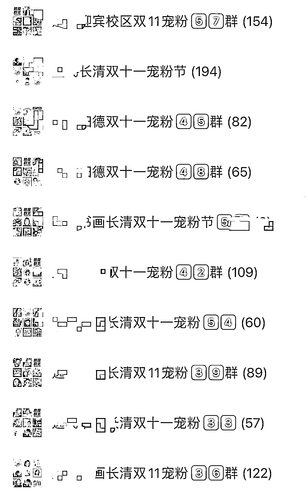  <ne-p id="u08b2a358" data-lake-id="u08b2a358"><ne-text id="u436baeed">通过这样的方式，裂变了 4000 人左右的微信群，95%以上的都是宝妈，也就是说沉淀了将近 4000 多个家庭，但领取礼品有一个要求，需要登记手机号、姓名信息，也就是说一个礼品，不仅完成了微信个人号沉淀、也获得了一个家长的信息；</ne-text></ne-p> <ne-p id="u51b01e53" data-lake-id="u51b01e53"><ne-text id="ub8779a35">2、推送活动链接到这 1000 个同城群，前一阶段已经沉淀了一波宝妈流量，因此我们需要推送我们的活动，完成一波的活动的曝光，推送活动要进行持续的推送，不用担心被 t 的问题，</ne-text></ne-p> <ne-h3 id="99e17444" data-lake-id="99e17444"><ne-heading-ext><ne-heading-anchor></ne-heading-anchor><ne-heading-fold></ne-heading-fold></ne-heading-ext><ne-heading-content><ne-text id="ua5d4dde8">2、对于抖音</ne-text></ne-heading-content></ne-h3> <ne-p id="u6f9adabc" data-lake-id="u6f9adabc"><ne-text id="ube2b0be2">常态化的输出是没问题的，打造 ip 也是没问题的，但是如果一个实体门店没有成熟的抖音，我们是无法借助他引爆同城流量的，我们可以利用涓涓细流汇聚成大江大河，</ne-text></ne-p> <ne-p id="u4eca52a6" data-lake-id="u4eca52a6"><ne-text id="u634d3a03">前面讲到送了大量的小凳子以及保温包，进群的宝妈要到店领礼品，</ne-text></ne-p> <ne-p id="u796bfa57" data-lake-id="u796bfa57"><ne-text id="u80cd8bc7">因此，我们可以利用抖音爆店码，让所有的宝妈进行抖音视频的分发，1000 个宝妈来领礼品，就有 1000 多个视频分发出去，1000 多个宝妈的抖音相对来说权重会高那么一些，看视频的也是身边朋友圈多，</ne-text></ne-p> <ne-p id="udc9b03fc" data-lake-id="udc9b03fc"><ne-text id="u8710cc77">1000 多条素人视频发出去了，这个位置就加热了，如果再提升一下，还可以找 v3-v4 的博主过来再加热一下，</ne-text></ne-p> <ne-p id="u4ccbe358" data-lake-id="u4ccbe358"><ne-text id="u0258ee7a">再挂上引流的团购品，基础团购品，刷刷，短时间内的会在本地形成一定的流量基础，</ne-text></ne-p> <ne-h2 id="386b13ea" data-lake-id="386b13ea"><ne-heading-ext><ne-heading-anchor></ne-heading-anchor><ne-heading-fold></ne-heading-fold></ne-heading-ext><ne-heading-content><ne-text id="u1242ba68">2、裂变自有流量</ne-text></ne-heading-content></ne-h2> <ne-h3 id="2e77561b" data-lake-id="2e77561b"><ne-heading-ext><ne-heading-anchor></ne-heading-anchor><ne-heading-fold></ne-heading-fold></ne-heading-ext><ne-heading-content><ne-text id="u0ff0ea2a">2.1 裂变自有流量</ne-text></ne-heading-content></ne-h3> <ne-p id="uf5e3b754" data-lake-id="uf5e3b754"><ne-text id="u70e8d8d7">外部公域流量已经第一波曝光，还需要进行自有流量的曝光，自有流量价值最大还是个人微信号，在自有流量推送我们的产品下，</ne-text><ne-text id="u834afbb0" style="color: rgb(216, 57, 49);">对于自有的私域流量，其实每一次的推送可以说是一次消耗，如果持续的消耗，其实就是在耗尽我们的用户资产，</ne-text></ne-p> <ne-p id="u054f36d2" data-lake-id="u054f36d2"><ne-text id="u6b145b1b">因此，</ne-text><ne-text id="u023555e0" style="color: rgb(216, 57, 49);">我们在推送产品的情况下，我们要进行一定的裂变，裂变的鼻祖是拼多多，拼团是最好的裂变方式</ne-text><ne-text id="uebf45577">，没有之一</ne-text></ne-p> <ne-p id="udecb98b7" data-lake-id="udecb98b7"><ne-text id="u72391929">因此我们需要进行私域流量的裂变，私域流量的裂变就需要设计裂变品，</ne-text></ne-p> <ne-p id="u60445da3" data-lake-id="u60445da3"><ne-text id="ue57c7e6c">这次是设计了一个 66 元的宠粉节的定金卡裂变品，用户支付 66 元可以抢订价值 3980 的优惠名额，</ne-text></ne-p> <ne-p id="ucb90b789" data-lake-id="ucb90b789"><ne-text id="u03d52b8c">课时福利：全场可以立减 500-3000 元，就是为了在现场进行高价的转化，</ne-text></ne-p> <ne-p id="ufffe8ef0" data-lake-id="ufffe8ef0"><ne-card data-card-name="image" data-card-type="inline" id="pc5lU" data-event-boundary="card">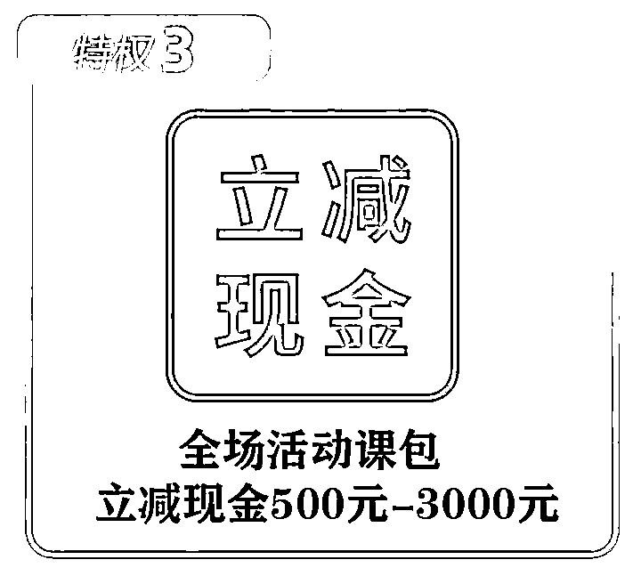  <ne-p id="ue6f97d8c" data-lake-id="ue6f97d8c"><ne-text id="ud5a21deb">礼品福利：礼品也是送的价值比较高的康巴赫锅、骑行拉杆箱等，</ne-text></ne-p> <ne-p id="u9797b420" data-lake-id="u9797b420"><ne-card data-card-name="image" data-card-type="inline" id="qdmRe" data-event-boundary="card">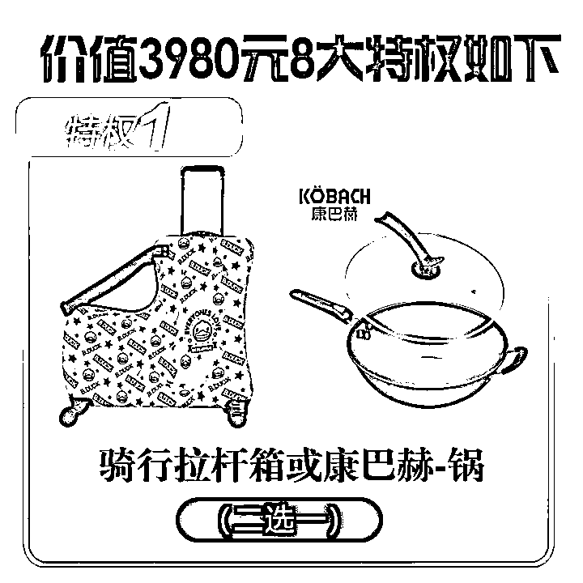  <ne-p id="u599df0ab" data-lake-id="u599df0ab"><ne-text id="u2c8b872b">裂变方面设置 2 人团，拉一个人支付 66 元，得几节课以及礼品</ne-text></ne-p> <ne-p id="u573cce7d" data-lake-id="u573cce7d"><ne-card data-card-name="image" data-card-type="inline" id="Unezy" data-event-boundary="card">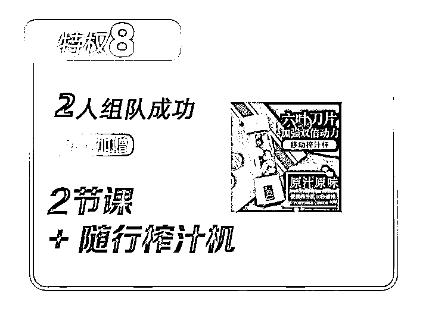  <ne-p id="u358e2d3b" data-lake-id="u358e2d3b"><ne-text id="ue701fd62">通过让老用户购买 66 元定金卡，再通过去裂变的方式，完成私域流量的裂变，</ne-text></ne-p> <ne-h3 id="6b309778" data-lake-id="6b309778"><ne-heading-ext><ne-heading-anchor></ne-heading-anchor><ne-heading-fold></ne-heading-fold></ne-heading-ext><ne-heading-content><ne-text id="u1497de42">2.2 裂变新流量</ne-text></ne-heading-content></ne-h3> <ne-p id="u9a4e1fe5" data-lake-id="u9a4e1fe5"><ne-text id="uf3ff3be4">前面讲了我们有 4000 多位宝妈进群，1000 多名宝妈加微信，符合领礼品的到店领礼品，</ne-text></ne-p> <ne-p id="u6a497c27" data-lake-id="u6a497c27"><ne-text id="uc5fa4a7a">因此，</ne-text></ne-p> <ne-p id="ub80fe7aa" data-lake-id="ub80fe7aa"><ne-text id="u240d1770">1、在群内我们要进行售卖 66 元定金卡，再让购买定金卡的去做裂变；</ne-text></ne-p> <ne-p id="u78730d54" data-lake-id="u78730d54"><ne-text id="u9626be8f">2、新添加微信的进行售卖 66 元定金卡，再让购买定金卡的去做裂变；</ne-text></ne-p> <ne-p id="ub1f35738" data-lake-id="ub1f35738"><ne-text id="u4bd60263">3、到店领小凳子的售卖 66 元定金卡，再让购买定金卡的去做裂变；</ne-text></ne-p> <ne-p id="ud71ae81d" data-lake-id="ud71ae81d"><ne-card data-card-name="image" data-card-type="inline" id="EEUVe" data-event-boundary="card">  <ne-p id="ud90c3d27" data-lake-id="ud90c3d27"><ne-card data-card-name="image" data-card-type="inline" id="q1k3X" data-event-boundary="card">  <ne-h2 id="6969b789" data-lake-id="6969b789"><ne-heading-ext><ne-heading-anchor></ne-heading-anchor><ne-heading-fold></ne-heading-fold></ne-heading-ext><ne-heading-content><ne-text id="u12b851b0">3、转化到店流量</ne-text></ne-heading-content></ne-h2> <ne-p id="ud3764db8" data-lake-id="ud3764db8"><ne-text id="u1ae599c3">前面讲了，我们通过公域流量的同城群流量以及抖音流量，还有自有的私域流量以及私域流量的裂变，带动了 66 元定金卡销售，定金卡的数量在 624 张，</ne-text></ne-p> <ne-p id="ub6dcb34d" data-lake-id="ub6dcb34d"><ne-card data-card-name="image" data-card-type="inline" id="pfv4F" data-event-boundary="card">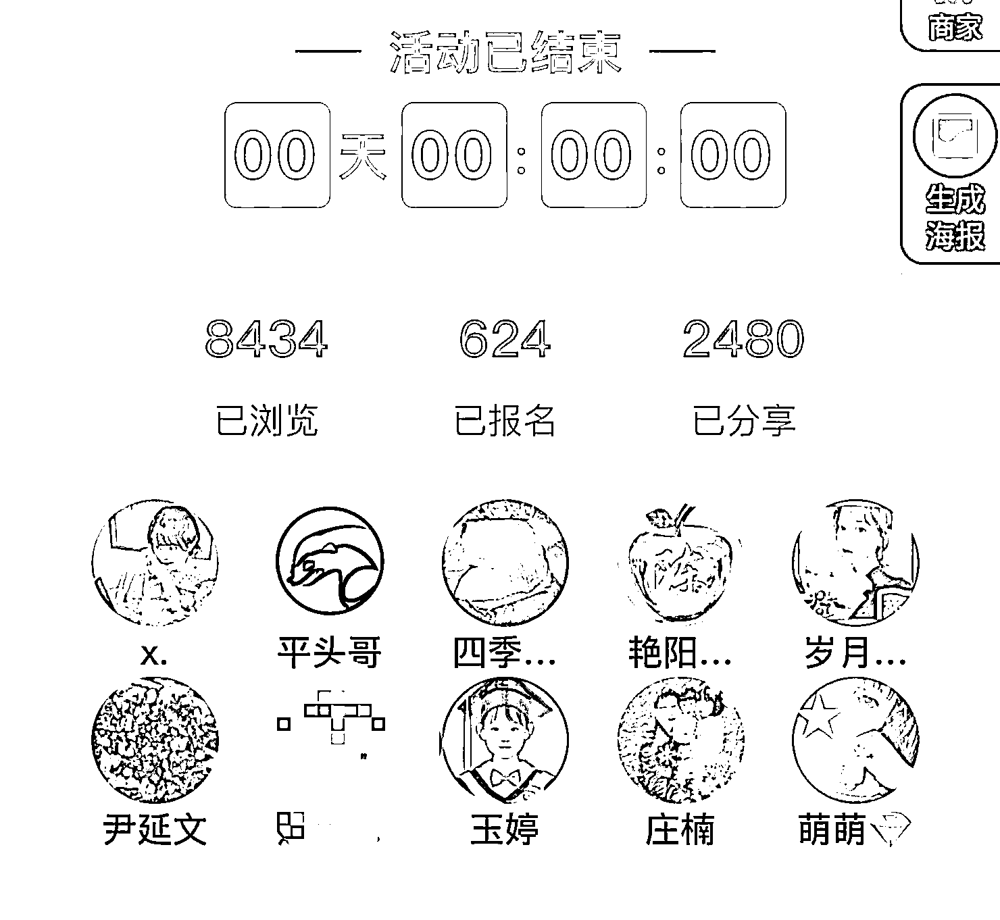  <ne-p id="ud0b0c7d6" data-lake-id="ud0b0c7d6"><ne-text id="ud7214ed5">接下来就是把 624 张卡转化掉，把到店流量转化掉</ne-text></ne-p> <ne-p id="u925b2338" data-lake-id="u925b2338"><ne-text id="u6f464ccc">这时候，门店要进行造节促销，</ne-text></ne-p> <ne-p id="u74b28869" data-lake-id="u74b28869"><ne-text id="uac0c9d14">1、在现场氛围方面，现场要制作的相对来说，要有节日的气氛，</ne-text></ne-p> <ne-p id="uee392dd5" data-lake-id="uee392dd5"><ne-text id="ue3817366">2、在成单速度方面，要设计紧迫的支付速度，用老用户带动新用户，所以设计群接龙，也就是说，只要成单的就进行群接龙，然后相互影响；</ne-text></ne-p> <ne-p id="u0ab18e81" data-lake-id="u0ab18e81"><ne-card data-card-name="image" data-card-type="inline" id="crKfi" data-event-boundary="card">  <ne-p id="u3ef5cc9b" data-lake-id="u3ef5cc9b"><ne-text id="u4be0e57e">3、方案方面，要设计阶梯成交方案，价格阶梯、礼品阶梯，提前买的客户，优先选择礼品、享受更低的价格，通过这样的方式</ne-text></ne-p> <ne-p id="u46315829" data-lake-id="u46315829"><ne-card data-card-name="image" data-card-type="inline" id="a1r1Z" data-event-boundary="card">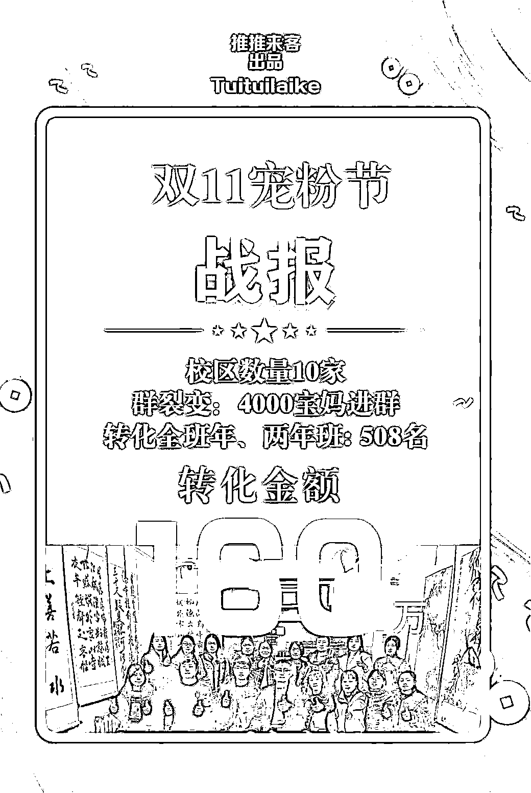  <ne-p id="u212e8769" data-lake-id="u212e8769"><ne-text id="u72f377c8">最终，通过这三步走，转化了 160 万，整个周期 20 多天，其实这套方案比较适合瑜伽呀、水育呀、教培呀、医美呀，复制这套逻辑，做个几十万问题不大。</ne-text></ne-p> <ne-h3 id="342069f8" data-lake-id="342069f8"><ne-heading-ext><ne-heading-anchor></ne-heading-anchor><ne-heading-fold></ne-heading-fold></ne-heading-ext><ne-heading-content><ne-text id="udae373fc">【其他】</ne-text></ne-heading-content></ne-h3> <ne-h2 id="6e13de62" data-lake-id="6e13de62"><ne-heading-ext><ne-heading-anchor></ne-heading-anchor><ne-heading-fold></ne-heading-fold></ne-heading-ext><ne-heading-content><ne-text id="u816e16cd">（71 赞）《谈谈游戏租赁行业》</ne-text></ne-heading-content></ne-h2> <ne-p id="u2f21ec9c" data-lake-id="u2f21ec9c"><ne-text id="u06958ca3">这是一篇分享心得的帖子，进入生财半年多了一直没有好东西可以分享的今天把我一直在做的项目拿出来给大家进行一篇分享。做了五年的账号租赁类目，扒一扒游戏租赁行业的坑。</ne-text></ne-p> <ne-p id="u12268516" data-lake-id="u12268516"><ne-text id="uc43e932c">6.7 年前开始做手游账号租赁的年轻人们，现在应该都实现财富自由了吧。</ne-text></ne-p> <ne-p id="ub4fa81a2" data-lake-id="ub4fa81a2"><ne-text id="uc4d19d48">游戏租赁这个板块很大，项目稳定，市面上能做的长久的游戏有很多。</ne-text></ne-p> <ne-p id="u6dfc3297" data-lake-id="u6dfc3297"><ne-card data-card-name="image" data-card-type="inline" id="aJ7h4" data-event-boundary="card">  <ne-p id="u09a755d0" data-lake-id="u09a755d0"><ne-text id="u64ac5215">17 年-19 年的时候吃了王者和吃鸡的红利期，当时的回报率非常高，账号在 1-2 个月之内可回本，回本之后就都是利润。那个时候基本靠暑假两个月就可以干的盆满钵满，现在回头再来看，其实游戏租赁项目也是一个比较稳定的项目，5 年前能变现的账号现在依旧能变现，只是多与少的区别。</ne-text></ne-p> <ne-p id="u9d9b7e8d" data-lake-id="u9d9b7e8d"><ne-text id="u6eddc6d5">很多人问现在租赁行业还能如吗？</ne-text></ne-p> <ne-p id="uab498437" data-lake-id="uab498437"><ne-text id="u9e34e427">答案是肯定的，不论你在平台上做，还是发展自己的客户圈子，现在账号租赁还是能做的，一个游戏租赁项目，最重要的是看玩这款游戏的群体有多少，拿比较远的游戏，比如穿越火线，英雄联盟等，这几款游戏当年都是火遍大江南北，现在也依旧有他小部分的游戏群体，只要这个游戏没停运，账号就可一直租赁，持续性的变现。</ne-text><ne-card data-card-name="image" data-card-type="inline" id="jCyjq" data-event-boundary="card">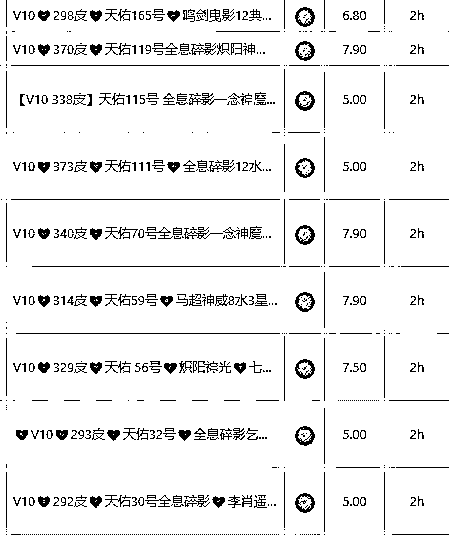  <ne-p id="u58260c6c" data-lake-id="u58260c6c"><ne-text id="u3737c4be">拿近的项目来说，就是王者，和平，火影，飞车。这些游戏几年前的回本周期大概在几个月到一年不等。回本完之后剩余的都是利润，在加上你的账号本身的价值，例如 1w 买的账号，干了一年回本了，在怎么差这账号还是可以卖个几千米的，这个是账号价值。账号是可以长久变现的。回本之后无论以什么价格出租出去的都是利润了。</ne-text></ne-p> <ne-p id="u43156574" data-lake-id="u43156574"><ne-text id="u44aac3d0">还有的人问账号租不出去怎么办？</ne-text></ne-p> <ne-p id="u207401e8" data-lake-id="u207401e8"><ne-text id="ubcd7efd8">租不出去是因为方法有问题，平台有平台的玩法，私域有私域的方法，方法对了账号就好租出去，租号这行从选好买号这步就有的说法吗，比如上哪里去收低价格的账号，账号内要有什么皮肤，什么武器比较好出租，平台的话就是要在什么时间段去上货架热度，标题如何吸引客户，如何让客人在你这里二次消费等等，私域的话也有很多方法，例如从哪些渠道引流，怎么帮客户上号等等。方法能用对的话账号是非常好租赁出去的。例如 100 个账号的店铺能做到每天 80%-90%的账号能够出租的出去，每个月都有稳定的收入。</ne-text></ne-p> <ne-p id="u848b5f83" data-lake-id="u848b5f83"><ne-card data-card-name="image" data-card-type="inline" id="Uu3xb" data-event-boundary="card">  <ne-p id="u706a9e56" data-lake-id="u706a9e56"><ne-text id="ufcaf84ef">管理方面需要大量时间吗？</ne-text></ne-p> <ne-p id="u792f5842" data-lake-id="u792f5842"><ne-text id="u35db98a2">如果是做私域的话是要话时间的，要及时回复消息和引导客人上号。如果是做平台，例如租号玩，u 租号这类平台的话就不需要花大量时间，每天抽空 1-2 小时管理即可。这类平台做到现在都有稳定的脚本，可以做到 24 小时全自动管理账号。所以在平台上做的话是不需要投入大量时间的。</ne-text></ne-p> <ne-p id="u8c6d885d" data-lake-id="u8c6d885d"><ne-card data-card-name="image" data-card-type="inline" id="n6bxE" data-event-boundary="card">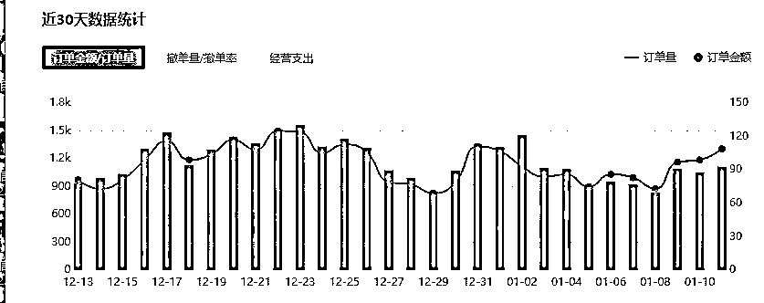  <ne-p id="uf830967b" data-lake-id="uf830967b"><ne-text id="u0d887b83">17 年的时候，想着把自己的王者号租出去赚钱，最开始在 qq 群上找人租，一天也能租出去几单，后来接触到租号玩这个平台，把自己的账号上架在平台之后，租完一单改下密码就继续上架出租，单量也挺稳的，平常 1-2 单，周末 3-5 单都有，后面去了解了下账号的价格，粗略计算下账号的回本周期之后，拿了十来万就买号放在平台上干了，到寒暑假的时候单量就吓人，涨价之后还是天天爆单，然后就去买了软件，软件可以实现自动上架，自动打信誉分等功能，基本上能做到全自动管理。有了软件之后，就又复投了几十万，做的早的话寒暑假两个月内基本就能回本，接下来就靠复制的方法，继续买号将店铺做大，也成为了平台的合伙人，到了 20 年左右，做的人就多了，那时候账号如果不研究怎样提高曝光靠自然流量很难出单，然后那段时间就研究平台的一些机制，总结了很多方法能在平常的时候也能做出不错的出单率，比如在上午 10 点和下午 5 点左右购买置顶货架的效果最好，直到现在我每个月的店铺还有 2-3w 的收益（没有认真管理的情况，因为账号太多了）如果认真管理收益还可以翻 1.5-2 倍。因为我从 17 年开始干，已经赚了一百多个了，现在每个月收益能稳定就好。</ne-text></ne-p> <ne-p id="ud1c987f7" data-lake-id="ud1c987f7"><ne-text id="u75df831b">今天的分享到此结束 作为生财的第一篇帖子有很多写的不到位的地方请大家多多包涵 很开心在此认识到大家</ne-text></ne-p> <ne-h2 id="a6833108" data-lake-id="a6833108"><ne-heading-ext><ne-heading-anchor></ne-heading-anchor><ne-heading-fold></ne-heading-fold></ne-heading-ext><ne-heading-content><ne-text id="uf93fea40">（125 赞）（精华帖）《2 年发布 3000+视频成为 YouTube 法语区教育类的 TOP1 的复盘分享》</ne-text></ne-heading-content></ne-h2> <ne-p id="u2d76918c" data-lake-id="u2d76918c"><ne-text id="u7c8be821">这不是一篇手把手的 how to 指南，也没有黑科技让你一日爆发，但希望 3000+的视频经历可以给你一点启发。</ne-text></ne-p> <ne-p id="ud5f09a1d" data-lake-id="ud5f09a1d"><ne-text id="u1b0ee2ec">我是 Kely，曾在法国 K12 互联网媒体负责视频项目，今天和大家分享一下我们项目从 0 做起的一些心路历程，我们也是在内容覆盖 100%的情况下，花了 2 年上线了 3000+的视频，做到了法国高考期间 YouTube 直播推荐、Google 新闻排名最高第 1 的小成绩。</ne-text></ne-p> <ne-p id="ucbc4d82b" data-lake-id="ucbc4d82b"><ne-text id="u4a3de3f1">整个分享有四个部分，全方位的讨论一下 YouTube 的机会。</ne-text></ne-p> <ne-oli><ne-oli-i>1</ne-oli-i><ne-oli-c class="ne-oli-content" id="udac1ee72" data-lake-id="udac1ee72"><ne-text id="u3367f015">熟悉了解 YouTube</ne-text></ne-oli-c></ne-oli> <ne-oli><ne-oli-i>2</ne-oli-i><ne-oli-c class="ne-oli-content" id="ua197e69b" data-lake-id="ua197e69b"><ne-text id="ufae025b3">入场实战创作</ne-text></ne-oli-c></ne-oli> <ne-oli><ne-oli-i>3</ne-oli-i><ne-oli-c class="ne-oli-content" id="u165b5944" data-lake-id="u165b5944"><ne-text id="ub126e9cb">深耕内容获取更多流量</ne-text></ne-oli-c></ne-oli> <ne-oli><ne-oli-i>4</ne-oli-i><ne-oli-c class="ne-oli-content" id="u14ac57e3" data-lake-id="u14ac57e3"><ne-text id="u2ccfa59b">走前人未走过的路，带来了 10 倍以上收益</ne-text></ne-oli-c></ne-oli> <ne-h2 id="cd139270" data-lake-id="cd139270"><ne-heading-ext><ne-heading-anchor></ne-heading-anchor><ne-heading-fold></ne-heading-fold></ne-heading-ext><ne-heading-content><ne-text id="u27cede2a">一、如何看待 Youtube 平台</ne-text></ne-heading-content></ne-h2> <ne-p id="uf1f49704" data-lake-id="uf1f49704"><ne-text id="u773c6717">YouTube 是什么？B 站国际版，优爱腾视频站？</ne-text></ne-p> <ne-p id="u6c19ca03" data-lake-id="u6c19ca03"><ne-text id="u5bd5704b">它都是，并且它比想象中要更丰富。</ne-text></ne-p> <ne-p id="ueff6024c" data-lake-id="ueff6024c"><ne-card data-card-name="image" data-card-type="inline" id="JbGrd" data-event-boundary="card">  <ne-p id="u88c6b790" data-lake-id="u88c6b790"><ne-text id="ubfe6d327">YouTube 是全球访问量第二大的网站，第一是 Google。百度第六。</ne-text></ne-p> <ne-p id="ue6cf4fcc" data-lake-id="ue6cf4fcc"><ne-card data-card-name="image" data-card-type="inline" id="Z2Z88" data-event-boundary="card">  <ne-p id="u7b8864c9" data-lake-id="u7b8864c9"><ne-text id="u91f95af0">月访问量 26 亿+。每天产生十亿小时的内容消费。人均消费 20 分钟/天。男女比例对半。</ne-text></ne-p> <ne-p id="u67128ed9" data-lake-id="u67128ed9"><ne-card data-card-name="image" data-card-type="inline" id="W9JmT" data-event-boundary="card">  <ne-p id="u2bccce81" data-lake-id="u2bccce81"><ne-text id="udffdc054">截止 2022 年，注册用户超 25 亿，印度拥有者最多的 YouTube 用户，有 4.6 亿人，是美国的 1.8 倍。</ne-text></ne-p> <ne-p id="u5029bdd3" data-lake-id="u5029bdd3"><ne-text id="u5db83931">平台上有 PGC 和 UGC 内容，YouTube Premium、Music 付费用户超 5000 万，2021 年广告收入 280 亿。</ne-text></ne-p> <ne-p id="u9b8b893a" data-lake-id="u9b8b893a"><ne-text id="u3ca11711">2021 年推出了 Shorts，为 TikTok 竞品。Shorts，2022 年 2 季度月活 15 亿。</ne-text></ne-p> <ne-h3 id="58f6ac41" data-lake-id="58f6ac41"><ne-heading-ext><ne-heading-anchor></ne-heading-anchor><ne-heading-fold></ne-heading-fold></ne-heading-ext><ne-heading-content><ne-text id="u18b87e78" ne-bold="true">1\. YouTube 能给你带来什么</ne-text></ne-heading-content></ne-h3> <ne-p id="uddd9604b" data-lake-id="uddd9604b"><ne-text id="u32be18c3">YouTube 是第二大搜索引擎，仔细想想你和朋友现在搜索吃喝玩乐学习会去哪里，机会一样很多。</ne-text></ne-p> <ne-p id="ua7800f08" data-lake-id="ua7800f08"><ne-text id="ucaa03a9d">SEO 权重高，在 Google 搜索里，YouTube 为第三大的搜索关键词。YouTube 里关键词排名做的好会给你在 Google 排名里加成。</ne-text></ne-p> <ne-p id="u9b8275bb" data-lake-id="u9b8275bb"><ne-text id="u4a2a4302">官方合作伙伴计划等着你分成，也可引流到自己的产品变现。</ne-text></ne-p> <ne-oli><ne-oli-i>1</ne-oli-i><ne-oli-c class="ne-oli-content" id="u11c51431" data-lake-id="u11c51431"><ne-text id="ue6ff38c7" ne-bold="true">用户友好：</ne-text><ne-text id="u650ee637">平台上支持高分辨率，真 4K，连接速度快。</ne-text></ne-oli-c></ne-oli> <ne-oli><ne-oli-i>2</ne-oli-i><ne-oli-c class="ne-oli-content" id="u3b50c5ed" data-lake-id="u3b50c5ed"><ne-text id="u483695d0" ne-bold="true">创作者友好：</ne-text><ne-text id="u2a0caa3a">后台分析数据详细，支持外链，嵌入友好。</ne-text></ne-oli-c></ne-oli> <ne-oli><ne-oli-i>3</ne-oli-i><ne-oli-c class="ne-oli-content" id="uf696245c" data-lake-id="uf696245c"><ne-text id="uf5003a00" ne-bold="true">广告主友好：</ne-text><ne-text id="udf0cd512">受众广，日/月活高，粘性大，男女比例适中，这里是虚拟世界里的小地球村，如果你的产品够好，一定能够找到你的受众。</ne-text></ne-oli-c></ne-oli> <ne-h3 id="16dc8169" data-lake-id="16dc8169"><ne-heading-ext><ne-heading-anchor></ne-heading-anchor><ne-heading-fold></ne-heading-fold></ne-heading-ext><ne-heading-content><ne-text id="u4ec3733d">2\. 平台依然以音乐娱乐休闲为主</ne-text></ne-heading-content></ne-h3> <ne-p id="u7e4ee9ab" data-lake-id="u7e4ee9ab"><ne-card data-card-name="image" data-card-type="inline" id="otm5L" data-event-boundary="card">  <ne-p id="u7777168f" data-lake-id="u7777168f"><ne-text id="u649bc35d" ne-italic="true">2022 年 1 月份搜索指数</ne-text></ne-p> <ne-p id="u862faafc" data-lake-id="u862faafc"><ne-text id="u3c8014f4">音乐一如既往是最受欢迎的内容，游戏内容热度不断提升，以前 Twitch 的流量有不少被 YouTube 拿到了。</ne-text></ne-p> <ne-p id="uab771878" data-lake-id="uab771878"><ne-card data-card-name="image" data-card-type="inline" id="Q5nnj" data-event-boundary="card">  <ne-p id="u797770e0" data-lake-id="u797770e0"><ne-text id="u19286fc0">这里是一份全球 16-64 岁用户视频浏览报告的结果，可以看到音乐和搞笑内容还是主流。剩下的有休闲、娱乐、教育、开箱、维修、直播等。</ne-text></ne-p> <ne-p id="ub694a89c" data-lake-id="ub694a89c"><ne-card data-card-name="image" data-card-type="inline" id="zCyqN" data-event-boundary="card"><ne-card data-card-name="image" data-card-type="inline" id="vbnb2" data-event-boundary="card">  <ne-p id="u6a186335" data-lake-id="u6a186335"><ne-text id="u982513e5" ne-italic="true">YouTube 主推的也是这几个大类</ne-text></ne-p> <ne-h3 id="b5ee3572" data-lake-id="b5ee3572"><ne-heading-ext><ne-heading-anchor></ne-heading-anchor><ne-heading-fold></ne-heading-fold></ne-heading-ext><ne-heading-content><ne-text id="u56255971">3\. 分发机制</ne-text></ne-heading-content></ne-h3> <ne-p id="u7234e978" data-lake-id="u7234e978"><ne-text id="uc2dc586a" ne-bold="true">（1）语言区</ne-text></ne-p> <ne-p id="u850c941c" data-lake-id="u850c941c"><ne-text id="u41a49fec">假设今天你做的内容是中文的，平台会自动给你打上中文标签，在用户没有搜索过，没有点击过中文视频之前，你的内容仅仅只会展示给中文用户。</ne-text></ne-p> <ne-p id="uaea9ae0d" data-lake-id="uaea9ae0d"><ne-text id="ue7b006ad">无论用户的位置在哪，只要他是中文用户，一定就有机会展示给他。但不会跑到英文用户的显示区内。</ne-text></ne-p> <ne-p id="u5796e91f" data-lake-id="u5796e91f"><ne-text id="ud28d40c9">像法语内容就会在加拿大，阿尔及利亚，利比亚，等说法语的地区展示。</ne-text></ne-p> <ne-p id="u5db12791" data-lake-id="u5db12791"><ne-text id="uf5373ba5" ne-bold="true">（2）区域性（Geo Only）</ne-text></ne-p> <ne-p id="ua01bc867" data-lake-id="ua01bc867"><ne-text id="uc13ae271">你的账号设置的居住地，比如在法国，你的内容将会主要在法国、欧洲、以及法国海外省展示。当然这里没有中国选项，如果你的内容不是针对特定区域，大部分还是选的美国。</ne-text></ne-p> <ne-p id="udc9eebd9" data-lake-id="udc9eebd9"><ne-text id="u4df537ac">如果机器认为你是对内容感兴趣的人，则会触发兴趣推荐。这个时候内容便会跨区展示。</ne-text></ne-p> <ne-p id="u47f4b5f3" data-lake-id="u47f4b5f3"><ne-text id="u154219a4">取决于你的标签，是否看过相同内容。</ne-text></ne-p> <ne-p id="uf4ef3f56" data-lake-id="uf4ef3f56"><ne-text id="u71268ee5" ne-bold="true">（3）标签性（兴趣、内容属性）</ne-text></ne-p> <ne-p id="u03b2d2a8" data-lake-id="u03b2d2a8"><ne-text id="ufafae3fe">同内容看的越多，推送越精准。同类型的内容里，也会推竞争对手的，优胜劣汰，可以通过优化视频增加自己内容的推荐几率。</ne-text></ne-p> <ne-p id="ub9e55f63" data-lake-id="ub9e55f63"><ne-text id="ubf06bbab" ne-bold="true">（4）机器生成（热度、种类）</ne-text></ne-p> <ne-p id="u5e1b26e6" data-lake-id="u5e1b26e6"><ne-text id="u6e4d49a2">有视频推荐、Playlist 推荐、Live 推荐、趋势等。</ne-text></ne-p> <ne-p id="ua64f5414" data-lake-id="ua64f5414"><ne-card data-card-name="image" data-card-type="inline" id="gvB4s" data-event-boundary="card">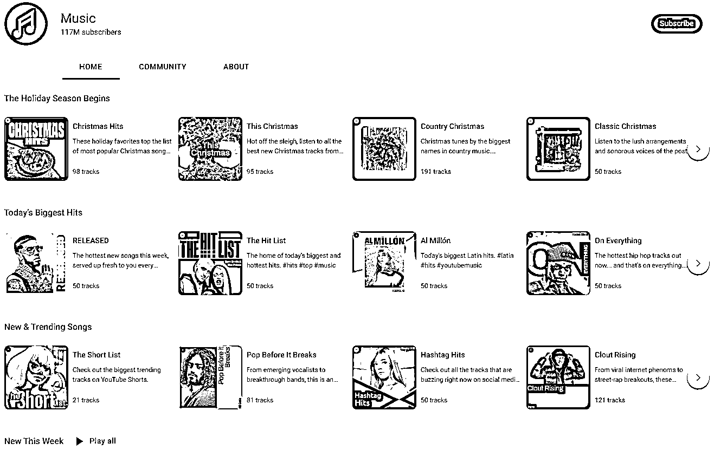  <ne-p id="uaff0f505" data-lake-id="uaff0f505"><ne-text id="u59f1a1d0" ne-italic="true">提前一个月圣诞专辑已经生成了。</ne-text></ne-p> <ne-h3 id="662f2b43" data-lake-id="662f2b43"><ne-heading-ext><ne-heading-anchor></ne-heading-anchor><ne-heading-fold></ne-heading-fold></ne-heading-ext><ne-heading-content><ne-text id="u4a75adee">4\. 盈利模式</ne-text></ne-heading-content></ne-h3> <ne-p id="u178e05d3" data-lake-id="u178e05d3"><ne-text id="u95feaf38" ne-bold="true">（1）官方合作伙伴计划 YouTube Partner Program</ne-text></ne-p> <ne-p id="ucae2c710" data-lake-id="ucae2c710"><ne-text id="u76fc94b0" ne-bold="true">要求</ne-text></ne-p> <ne-oli><ne-oli-i>1</ne-oli-i><ne-oli-c class="ne-oli-content" id="u044d4b91" data-lake-id="u044d4b91"><ne-text id="u2b8df7cb">开启 Google 账号双重验证</ne-text></ne-oli-c></ne-oli> <ne-oli><ne-oli-i>2</ne-oli-i><ne-oli-c class="ne-oli-content" id="u9b39e5f4" data-lake-id="u9b39e5f4"><ne-text id="uad639457">订阅人数 1000+，总浏览时长 4000+</ne-text></ne-oli-c></ne-oli> <ne-oli><ne-oli-i>3</ne-oli-i><ne-oli-c class="ne-oli-content" id="u5d5b2b71" data-lake-id="u5d5b2b71"><ne-text id="u109119fc">居住在合作伙伴区域（美国、欧洲、香港、这些都可）</ne-text></ne-oli-c></ne-oli> <ne-oli><ne-oli-i>4</ne-oli-i><ne-oli-c class="ne-oli-content" id="uf936e6fe" data-lake-id="uf936e6fe"><ne-text id="u7b11eb7a">账号没有违规</ne-text></ne-oli-c></ne-oli> <ne-oli><ne-oli-i>5</ne-oli-i><ne-oli-c class="ne-oli-content" id="u52b4d3c5" data-lake-id="u52b4d3c5"><ne-text id="u3f6e3721">关联 AdSense</ne-text></ne-oli-c></ne-oli> <ne-p id="uacc9ee62" data-lake-id="uacc9ee62"><ne-text id="u25745789">审核期约 1 个月，通过后便可设置广告收入分成。</ne-text></ne-p> <ne-p id="ub65be278" data-lake-id="ub65be278"><ne-text id="u91475ef7">好消息是，2023 年 2 月份，Shorts 也会加入 YPP 广告分成。</ne-text></ne-p> <ne-h4 id="a4d0a39e" data-lake-id="a4d0a39e"><ne-heading-ext><ne-heading-anchor></ne-heading-anchor><ne-heading-fold></ne-heading-fold></ne-heading-ext><ne-heading-content><ne-text id="ue66abf55" ne-bold="true">YPP 创收选项</ne-text></ne-heading-content></ne-h4> <ne-oli><ne-oli-i>1</ne-oli-i><ne-oli-c class="ne-oli-content" id="u5235c6ef" data-lake-id="u5235c6ef"><ne-text id="u502f2fb2">广告</ne-text></ne-oli-c></ne-oli> <ne-oli><ne-oli-i>2</ne-oli-i><ne-oli-c class="ne-oli-content" id="u16e2d5f6" data-lake-id="u16e2d5f6"><ne-text id="u1fb682b7">频道会员</ne-text></ne-oli-c></ne-oli> <ne-oli><ne-oli-i>3</ne-oli-i><ne-oli-c class="ne-oli-content" id="u4b42904e" data-lake-id="u4b42904e"><ne-text id="u95694e4a">购物功能</ne-text></ne-oli-c></ne-oli> <ne-oli><ne-oli-i>4</ne-oli-i><ne-oli-c class="ne-oli-content" id="ua4494a39" data-lake-id="ua4494a39"><ne-text id="uc2747a99">超级留言和超级贴纸</ne-text></ne-oli-c></ne-oli> <ne-oli><ne-oli-i>5</ne-oli-i><ne-oli-c class="ne-oli-content" id="u02eacbc0" data-lake-id="u02eacbc0"><ne-text id="u5e4e16e9">超级感谢</ne-text></ne-oli-c></ne-oli> <ne-oli><ne-oli-i>6</ne-oli-i><ne-oli-c class="ne-oli-content" id="u81bb48d2" data-lake-id="u81bb48d2"><ne-text id="u4703ee37">YouTube Premium</ne-text></ne-oli-c></ne-oli> <ne-p id="uf415dc6b" data-lake-id="uf415dc6b"><ne-text id="ua8222406">广告、商店、打赏和会员费，模式多种多样。</ne-text></ne-p> <ne-h4 id="0804d618" data-lake-id="0804d618"><ne-heading-ext><ne-heading-anchor></ne-heading-anchor><ne-heading-fold></ne-heading-fold></ne-heading-ext><ne-heading-content><ne-text id="u7e27d9d7" ne-bold="true">非官方变现</ne-text></ne-heading-content></ne-h4> <ne-p id="ufd6fc389" data-lake-id="ufd6fc389"><ne-text id="uab8409dd">广告商、私域打赏、独立站、商品带货、CPS、只要你想的到。</ne-text></ne-p> <ne-p id="uc5c1b141" data-lake-id="uc5c1b141"><ne-text id="u31a3c92a" ne-bold="true">广告商</ne-text><ne-text id="u6485e8d6">就是视频合作，也分独家和非独家。</ne-text></ne-p> <ne-oli><ne-oli-i>1</ne-oli-i><ne-oli-c class="ne-oli-content" id="u3229220e" data-lake-id="u3229220e"><ne-text id="uf70c18bd">独家通常会签多少条视频，多少钱，在每个视频里预留多少 s 的广告时间。这个模式在 YouTube 上广为接受，主要集中在 how to 分享里。</ne-text></ne-oli-c></ne-oli> <ne-oli><ne-oli-i>2</ne-oli-i><ne-oli-c class="ne-oli-content" id="u48ffe36b" data-lake-id="u48ffe36b"><ne-text id="u970581e0">非独家，就是独立视频，独立内容。</ne-text></ne-oli-c></ne-oli> <ne-p id="uc6e7826e" data-lake-id="uc6e7826e"><ne-text id="ua7212f67" ne-bold="true">私域打赏</ne-text><ne-text id="u8cdcc785">：直接跳外站，请作者喝杯咖啡。</ne-text></ne-p> <ne-p id="ue28c7d30" data-lake-id="ue28c7d30"><ne-text id="u7861807d" ne-bold="true">私域会员</ne-text><ne-text id="u9e53c309">：Patreon。</ne-text></ne-p> <ne-p id="u3d796cdf" data-lake-id="u3d796cdf"><ne-text id="u31b08635" ne-bold="true">商品带货</ne-text><ne-text id="udd2d2f0a">，比较多的是 Amazon 的，用户信任平台和 KOL，Amazon 点几下就收到。也有第三方网站的。这里可以是实体商品也可以是虚拟商品，想卖课一样可以。还有其他的 CPS 大家自己发挥想象。</ne-text></ne-p> <ne-p id="ua3478db1" data-lake-id="ua3478db1"><ne-card data-card-name="image" data-card-type="inline" id="FkGK2" data-event-boundary="card">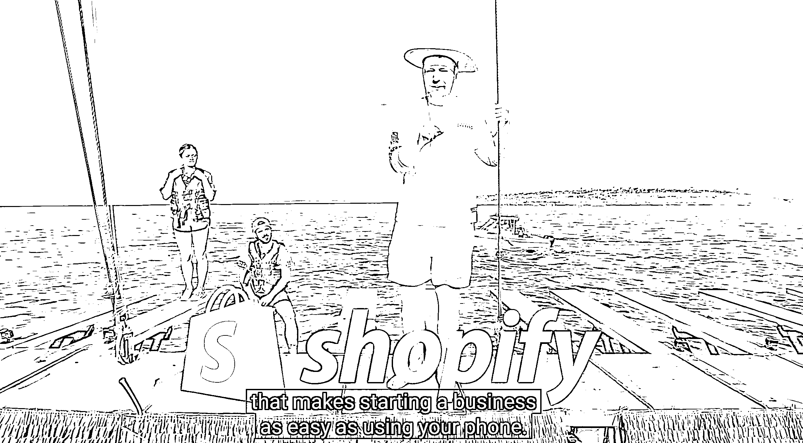  <ne-p id="u89696175" data-lake-id="u89696175"><ne-text id="u64431c4e" ne-italic="true">大 V 商业植入，不便宜</ne-text></ne-p> <ne-p id="ucaedf8d4" data-lake-id="ucaedf8d4"><ne-text id="u6a1f68d8">YouTube 可以是一个赚钱的工具，也可以是一个引流的工具，根据你需求的不同，用法也不一样。</ne-text></ne-p> <ne-h2 id="b706ef98" data-lake-id="b706ef98"><ne-heading-ext><ne-heading-anchor></ne-heading-anchor><ne-heading-fold></ne-heading-fold></ne-heading-ext><ne-heading-content><ne-text id="ufba3a0d7">二、先下场，站着是看不懂的</ne-text></ne-heading-content></ne-h2> <ne-h3 id="9039450f" data-lake-id="9039450f"><ne-heading-ext><ne-heading-anchor></ne-heading-anchor><ne-heading-fold></ne-heading-fold></ne-heading-ext> <ne-heading-content></ne-heading-content></ne-h3> <ne-h3 id="4106490a" data-lake-id="4106490a"><ne-heading-ext><ne-heading-anchor></ne-heading-anchor><ne-heading-fold></ne-heading-fold></ne-heading-ext><ne-heading-content><ne-text id="u155b07f3">1\. 内容创作</ne-text></ne-heading-content></ne-h3> <ne-p id="u7871ba2c" data-lake-id="u7871ba2c"><ne-text id="u99d2d8a8">在 YouTube 上一定是内容为王。内容不一定有深度，但一定要有</ne-text><ne-text id="ue6c74397" ne-bold="true">特点</ne-text><ne-text id="ub142c642">。</ne-text></ne-p> <ne-p id="u6a89d5a8" data-lake-id="u6a89d5a8"><ne-text id="uf89e9942">同样的内容，为什么别人要来看“你”的视频，不是竞争对手的？</ne-text></ne-p> <ne-p id="ube551661" data-lake-id="ube551661"><ne-text id="u81c8a459">可以是内容独特，说话搞笑，人长的好看，教学方法好，思想深刻，球踢的好，稀有特长，画面拍的美，特效做的好，自带光环大 IP 等等。</ne-text></ne-p> <ne-p id="ub638eaf0" data-lake-id="ub638eaf0"><ne-text id="u66c5994a">YouTube 的特性会偏好中长视频，以下内容没有特别说明都以中长视频为基础。</ne-text></ne-p> <ne-h4 id="09154cb5" data-lake-id="09154cb5"><ne-heading-ext><ne-heading-anchor></ne-heading-anchor><ne-heading-fold></ne-heading-fold></ne-heading-ext><ne-heading-content><ne-text id="uacaaf1c0">（1）项目方向</ne-text></ne-heading-content></ne-h4> <ne-p id="u1c8383e7" data-lake-id="u1c8383e7"><ne-text id="u3a8bb1e2">方向错了，通往成功的道路只会更加曲折。</ne-text></ne-p> <ne-p id="uddf1ea64" data-lake-id="uddf1ea64"><ne-text id="uf527e103">根据每个人的资源不同，想做的项目方向不同，选取最优方案来做，大致分为 IP，独立站，引流向。</ne-text></ne-p> <ne-h5 id="9f9d220c" data-lake-id="9f9d220c"><ne-heading-ext><ne-heading-anchor></ne-heading-anchor><ne-heading-fold></ne-heading-fold></ne-heading-ext><ne-heading-content><ne-text id="uad14e15a" ne-bold="true">1）如果是做 IP</ne-text></ne-heading-content></ne-h5> <ne-p id="u2a500c95" data-lake-id="u2a500c95"><ne-text id="u27a26234">一开始就要确定，你的目标人群，语言，地区，消费习惯以及变现模式。</ne-text></ne-p> <ne-p id="u55a837c8" data-lake-id="u55a837c8"><ne-text id="ua6feed7f">同时你给自己定的目标是多久，达到什么量，变现多少，根据不同的项目和方案整体计划，和实操是不一样的。</ne-text></ne-p> <ne-p id="uabf82345" data-lake-id="uabf82345"><ne-text id="u5ef001e3">如果你是通过第三方变现，那有一定几率你不需要广告收入，开启广告只会影响你的用户体验。</ne-text></ne-p> <ne-p id="ub62c25d1" data-lake-id="ub62c25d1"><ne-text id="ub62ff9f5">如果仅仅在 YouTube 积累粉丝，做一个渠道的分发，不用那么复杂，发就完了。</ne-text></ne-p> <ne-p id="u2dcd242e" data-lake-id="u2dcd242e">[<ne-text id="u876f3c51">shuaisoserious</ne-text>](https://youtube.com/@shuaisoserious)<ne-text id="u85dd52b0">，个人健身 IP，坐标美国，100 万粉丝，分享健身内容并自有品牌淘宝店。</ne-text></ne-p> <ne-p id="uac8e1916" data-lake-id="uac8e1916"><ne-text id="u76553154" ne-bold="true">目标人群：</ne-text><ne-text id="u019e5aff">健身爱好者</ne-text></ne-p> <ne-p id="u5a970850" data-lake-id="u5a970850"><ne-card data-card-name="image" data-card-type="inline" id="EY7ct" data-event-boundary="card">  <ne-p id="u555aa0e8" data-lake-id="u555aa0e8"><ne-text id="u746195b7" ne-bold="true">内容语言：</ne-text><ne-text id="u4657fd89">中文</ne-text></ne-p> <ne-p id="u1bebfbcd" data-lake-id="u1bebfbcd"><ne-text id="u978abab8" ne-bold="true">受众地区：</ne-text><ne-text id="ua975729f">全球</ne-text></ne-p> <ne-p id="ub2d42ce2" data-lake-id="ub2d42ce2"><ne-text id="ub7d8f061" ne-bold="true">内容方向：</ne-text><ne-text id="u89398a06">健身类，健身教程，个人经验，训练分享，知识分享。</ne-text></ne-p> <ne-p id="ue92c968b" data-lake-id="ue92c968b"><ne-text id="u6b41a79e" ne-bold="true">变现方式：</ne-text><ne-text id="ufe61ec40">CPS+淘宝店+内容多渠道分发（国内创作补贴）</ne-text></ne-p> <ne-p id="u81bcc9cf" data-lake-id="u81bcc9cf"><ne-text id="u403ae1b9">CPS 变现，Myprotein 供应链全球都有，提供了中国区和外区的购物码。</ne-text></ne-p> <ne-p id="u5e5a1463" data-lake-id="u5e5a1463"><ne-text id="ub6a697f5">淘宝店，针对中国地区的粉丝。</ne-text></ne-p> <ne-p id="ud0c1afe5" data-lake-id="ud0c1afe5"><ne-card data-card-name="image" data-card-type="inline" id="UMmjN" data-event-boundary="card">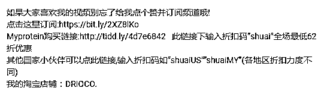  <ne-p id="u97d870ac" data-lake-id="u97d870ac"><ne-text id="ud19e39e7">其内容在国内 B 站知乎新浪都发布，同时获取创作收益。</ne-text></ne-p> <ne-p id="ua4737a5e" data-lake-id="ua4737a5e"><ne-text id="ua8fbb82f">这一套闭环的背后，给大家</ne-text><ne-text id="ubd9bdd57" ne-bold="true">提供有用的知识内容，建立信任</ne-text><ne-text id="u763508d9">。</ne-text></ne-p> <ne-p id="u27a51f1e" data-lake-id="u27a51f1e"><ne-text id="u854dfca0">碰巧我能提供有折扣的产品，有需求你就买。</ne-text></ne-p> <ne-p id="u319e1615" data-lake-id="u319e1615"><ne-text id="u1004bfd1">更喜欢我的粉丝，我也有淘宝店，可以买到我的品牌的产品。</ne-text></ne-p> <ne-h5 id="5dcbdd04" data-lake-id="5dcbdd04"><ne-heading-ext><ne-heading-anchor></ne-heading-anchor><ne-heading-fold></ne-heading-fold></ne-heading-ext><ne-heading-content><ne-text id="u544be727" ne-bold="true">2）如果是做独立站</ne-text></ne-heading-content></ne-h5> <ne-p id="ue5805289" data-lake-id="ue5805289"><ne-text id="u9a4f8283">定好你的目标人群，地区，内容方向。选取最适合你受众的内容形式，可以更快触达这一部分用户。</ne-text></ne-p> <ne-p id="u50357c20" data-lake-id="u50357c20">[<ne-text id="u5f5f9ee1">DigitalRev TV</ne-text>](https://www.youtube.com/@DigitalrevTV)<ne-text id="uc851d80a">，独立站，坐标香港，商城售卖相机镜头产品。</ne-text></ne-p> <ne-p id="u2a0e9f9f" data-lake-id="u2a0e9f9f"><ne-text id="u8784c01b" ne-bold="true">目标人群：</ne-text><ne-text id="u2644756e">摄影爱好者，专业摄影师，休闲娱乐爱好者，无人机爱好者。</ne-text></ne-p> <ne-p id="ue7ad3247" data-lake-id="ue7ad3247"><ne-card data-card-name="image" data-card-type="inline" id="bXiu8" data-event-boundary="card">  <ne-p id="u78f1f0b5" data-lake-id="u78f1f0b5"><ne-text id="u38135299" ne-bold="true">受众</ne-text><ne-text id="u12a903ab">：几乎全球都配送（没有中国大陆）。</ne-text></ne-p> <ne-p id="u6b13273d" data-lake-id="u6b13273d"><ne-card data-card-name="image" data-card-type="inline" id="Rj1MH" data-event-boundary="card">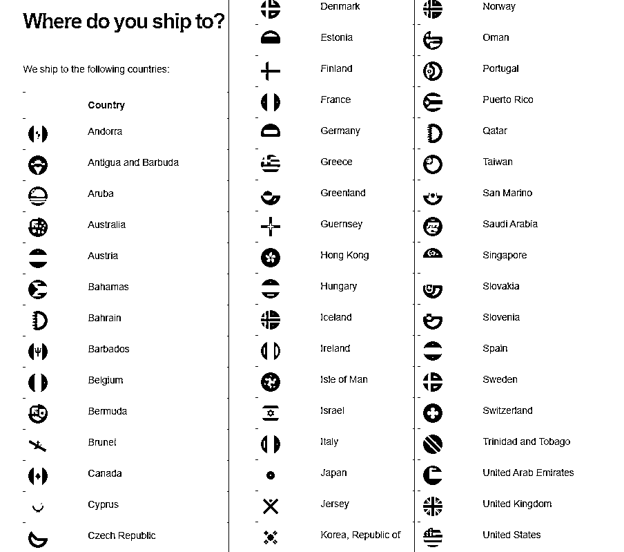  <ne-p id="uc4650b95" data-lake-id="uc4650b95"><ne-text id="u97b3aef6">可以看到这是</ne-text><ne-text id="ud2498c34" ne-bold="true">一个面向全球摄影爱好者的 IP 兼独立站</ne-text><ne-text id="u98413ea6">。它的目标自然是在摄影社区建立一定影响力，并引流到独立站进行销售。由于不配送中国大陆，中文摄影爱好者并不是其主要用户。</ne-text></ne-p> <ne-p id="u668ef272" data-lake-id="u668ef272"><ne-text id="ud5cdaa43" ne-bold="true">内容语言：</ne-text><ne-text id="u1a57c663">英文</ne-text></ne-p> <ne-p id="u47bbd216" data-lake-id="u47bbd216"><ne-card data-card-name="image" data-card-type="inline" id="BUbnO" data-event-boundary="card">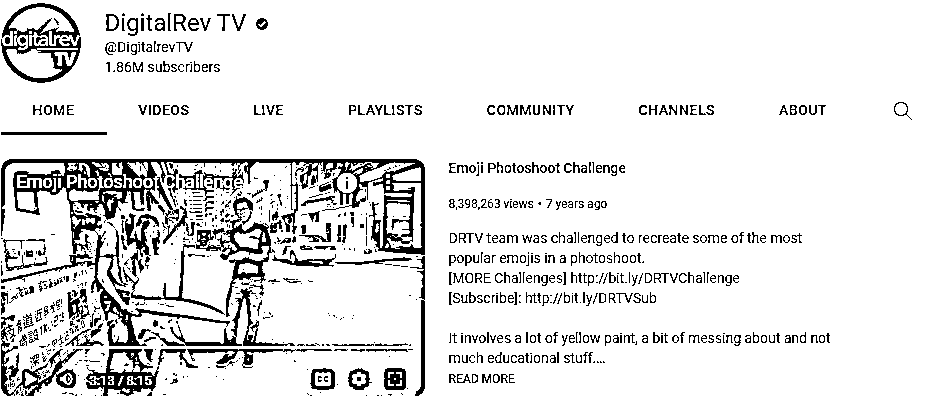  <ne-p id="u42cffebb" data-lake-id="u42cffebb"><ne-text id="u282a8807" ne-bold="true">内容方向：</ne-text><ne-text id="uf4775eb2">摄影类，开箱，对比，测试，教程。</ne-text></ne-p> <ne-p id="u9c399030" data-lake-id="u9c399030"><ne-card data-card-name="image" data-card-type="inline" id="ppqce" data-event-boundary="card">  <ne-p id="u0c2ef437" data-lake-id="u0c2ef437"><ne-text id="ucf6553bf" ne-bold="true">变现方式：</ne-text><ne-text id="uc16a3710">独立站</ne-text></ne-p> <ne-p id="u18621473" data-lake-id="u18621473"><ne-card data-card-name="image" data-card-type="inline" id="aGlug" data-event-boundary="card">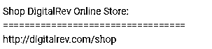  <ne-p id="u772c83b6" data-lake-id="u772c83b6"><ne-text id="ub21323bc" ne-bold="true">互动评价</ne-text><ne-text id="ubf4333c5">，Top Gear 是一档英国高质量汽车节目，粉丝心里比肩 Top Gear 那评价确实很高。</ne-text></ne-p> <ne-p id="ue49c10f7" data-lake-id="ue49c10f7"><ne-card data-card-name="image" data-card-type="inline" id="sFqI6" data-event-boundary="card">  <ne-p id="u504d0180" data-lake-id="u504d0180"><ne-text id="ucd424cea" ne-bold="true">Trustpilot 口碑</ne-text><ne-text id="ud936092e">，确认有国际用户订单，整个引流变现闭环完成。</ne-text></ne-p> <ne-p id="ub43efbde" data-lake-id="ub43efbde"><ne-card data-card-name="image" data-card-type="inline" id="NJQOC" data-event-boundary="card">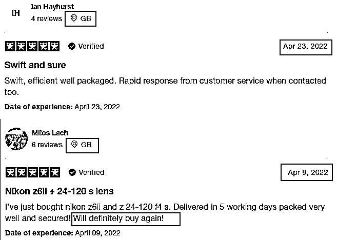  <ne-p id="u6a07bfc0" data-lake-id="u6a07bfc0"><ne-text id="u01aea410">这一套闭环的背后，看看独立站的逻辑，</ne-text><ne-text id="ue93c6d42" ne-bold="true">商品可控，有差价</ne-text><ne-text id="ub7f347ff">。</ne-text></ne-p> <ne-p id="ufa67a7e5" data-lake-id="ufa67a7e5"><ne-text id="uc68a41b2">香港免税能做到价格优势，国际物流中心发哪里都方便，电子 3C 类目欧美用户日常都是网上购买，符合用户消费习惯。只要能</ne-text><ne-text id="u34d4a115" ne-bold="true">建立信任</ne-text><ne-text id="u8d62262f">，让用户来自己网站下单就可以了。</ne-text></ne-p> <ne-h5 id="a8a4a3db" data-lake-id="a8a4a3db"><ne-heading-ext><ne-heading-anchor></ne-heading-anchor><ne-heading-fold></ne-heading-fold></ne-heading-ext><ne-heading-content><ne-text id="udb49a64b" ne-bold="true">3）如果是做引流</ne-text></ne-heading-content></ne-h5> <ne-p id="u3d1787b1" data-lake-id="u3d1787b1"><ne-text id="uc55c35b3">你要确定你是做品牌，还是产品开箱，展示，用户反馈等等。这一类的视频要引起用户兴趣，建立信任，甚至是互动客服的角色，从而转化用户至第三方网站。</ne-text></ne-p> <ne-p id="ue04e8364" data-lake-id="ue04e8364"><ne-text id="u7ec771ca">同时可以做一个广告主，通过合作模式找到 KOL 帮你一起引流。</ne-text></ne-p> <ne-p id="u78178fab" data-lake-id="u78178fab">[<ne-text id="ub956350b">NikkieTutorials</ne-text>](https://www.youtube.com/@nikkietutorials) <ne-text id="uc1175942">是一个专注化妆技巧教程的频道，坐标荷兰，1 千 4 百万粉丝，一年前推出了自己的美妆品牌 Nimya。</ne-text></ne-p> <ne-p id="u0668d060" data-lake-id="u0668d060"><ne-card data-card-name="image" data-card-type="inline" id="U8Jfv" data-event-boundary="card">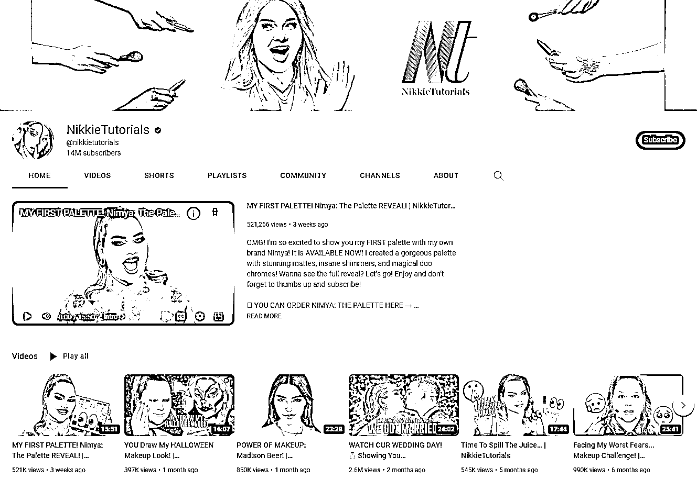  <ne-p id="u4dc1ec7e" data-lake-id="u4dc1ec7e"><ne-text id="u31efe12b" ne-bold="true">受众：</ne-text><ne-text id="u50f66ec5">欧美地区，对化妆感兴趣的年轻女性，消费能力有限。</ne-text></ne-p> <ne-p id="uf627715c" data-lake-id="uf627715c"><ne-card data-card-name="image" data-card-type="inline" id="COuTg" data-event-boundary="card">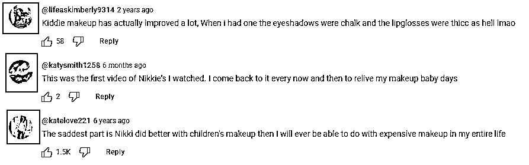  <ne-p id="u08fb5485" data-lake-id="u08fb5485"><ne-card data-card-name="image" data-card-type="inline" id="BWxG1" data-event-boundary="card">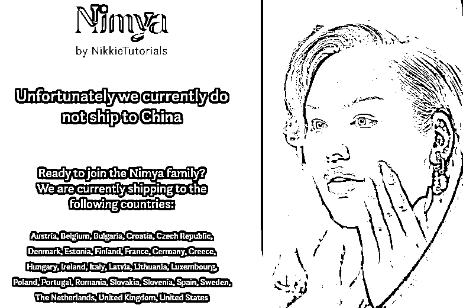  <ne-p id="ua82e24f0" data-lake-id="ua82e24f0"><ne-text id="u6d39a776" ne-bold="true">内容语言：</ne-text><ne-text id="u31f2c2a5">英文</ne-text></ne-p> <ne-p id="u247cf6a4" data-lake-id="u247cf6a4"><ne-text id="u5f57bc2a" ne-bold="true">内容方向：</ne-text><ne-text id="ue61b1356">教程类，化妆，仿妆，生活挑战，节日专辑，产品，明星上妆（Adele、KIM 卡戴珊）</ne-text></ne-p> <ne-p id="u2b1fc5e1" data-lake-id="u2b1fc5e1"><ne-text id="u979834fc" ne-bold="true">变现方式</ne-text><ne-text id="u27008c69">：前期引流 CPS + 后期独立站</ne-text></ne-p> <ne-p id="ub31721e3" data-lake-id="ub31721e3"><ne-text id="u3cb3cdaf">前期做引流 CPS 的方式，在不同的视频里给不同商家带货。即使后期做了自己的品牌，这边依然会有持续收益。</ne-text></ne-p> <ne-p id="ucd676dc2" data-lake-id="ucd676dc2"><ne-card data-card-name="image" data-card-type="inline" id="nN71o" data-event-boundary="card">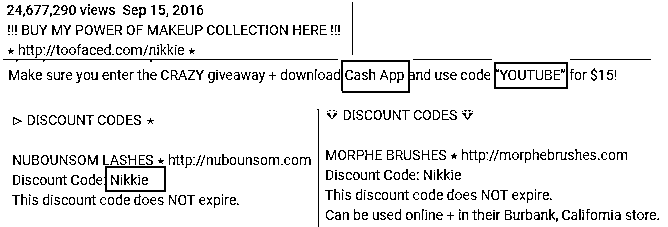  <ne-p id="u055258a2" data-lake-id="u055258a2"><ne-text id="ub1040baa" ne-bold="true">互动评价</ne-text><ne-text id="u7a90b378">，可见其 IP 形象深受粉丝喜爱，且有重复内容消费（潜在复购）。</ne-text></ne-p> <ne-p id="u5637e93d" data-lake-id="u5637e93d"><ne-card data-card-name="image" data-card-type="inline" id="Uq1eN" data-event-boundary="card">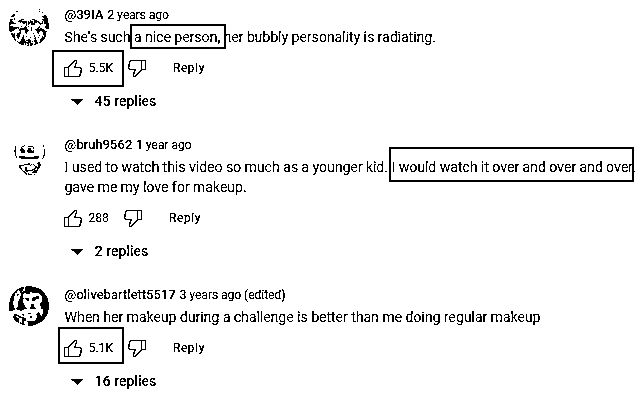  <ne-p id="ubede0046" data-lake-id="ubede0046"><ne-text id="u2366fa9e">这一套闭环的背后，就是</ne-text><ne-text id="u0a0d7228" ne-bold="true">信任</ne-text><ne-text id="u17d1e4c9">。</ne-text></ne-p> <ne-p id="u60c8fc11" data-lake-id="u60c8fc11"><ne-text id="ubf02a8f0">你展示的产品好看好用，价格合适，我就愿意通过你的链接买。只需要不断做内容，展示产品和效果就好了。</ne-text></ne-p> <ne-p id="u6410c157" data-lake-id="u6410c157"><ne-text id="uea2bcefc">我们项目主做</ne-text><ne-text id="u66aa3bb3" ne-bold="true">引流</ne-text><ne-text id="u04072247">。</ne-text></ne-p> <ne-p id="u2b99fb05" data-lake-id="u2b99fb05"><ne-text id="u880ffddc">之前在用户积累阶段开启了广告收入后，浏览量直接下降了 30%，然而收益微乎其微。</ne-text></ne-p> <ne-p id="u3528cbab" data-lake-id="u3528cbab"><ne-text id="u12a82b12">老板的想法很简单：</ne-text><ne-text id="u960eb051" ne-bold="true">增加收入渠道，多多益善</ne-text><ne-text id="ueb3a4c47">。</ne-text></ne-p> <ne-p id="u7a75f1ba" data-lake-id="u7a75f1ba"><ne-text id="uce6f380e">然而现实情况是，在你的数据足够好之前，开启广告只有反效果。</ne-text></ne-p> <ne-p id="uf5e7ac1a" data-lake-id="uf5e7ac1a"><ne-text id="u8074a793">根据 K12 项目特性，整体内容不像娱乐搞笑类别的视频，看看广告再回来继续之前的视频。如果还要等待广告时间，瞬间就会失去用户的注意力。</ne-text></ne-p> <ne-p id="u2abb238a" data-lake-id="u2abb238a"><ne-text id="u8c93c2dd" ne-bold="true">失败的经验：验证了 3 个月，看了数据，老板同意关闭广告。</ne-text></ne-p> <ne-p id="u53a8f8f9" data-lake-id="u53a8f8f9"><ne-text id="ua7fb75e5">这里需要你自己，对于整个项目的定位，发展阶段有清楚的认识，在什么阶段就做什么事。达到 YPP 门槛以前，先想着如何提高粉丝量，观看时长。</ne-text></ne-p> <ne-h4 id="d873799c" data-lake-id="d873799c"><ne-heading-ext><ne-heading-anchor></ne-heading-anchor><ne-heading-fold></ne-heading-fold></ne-heading-ext><ne-heading-content><ne-text id="ua1e5a2e5">（2）项目成本</ne-text></ne-heading-content></ne-h4> <ne-p id="uace3a69e" data-lake-id="uace3a69e"><ne-text id="u7f0a681a" ne-bold="true">1）生产成本</ne-text></ne-p> <ne-p id="u243bc21d" data-lake-id="u243bc21d"><ne-text id="u6ab96af8">生产包括你的设备，房租，水电，人员费用，第三方合作费用，服务器，推广费用等。随着时间点推移，设备成本是最低的，人员成本是最高的。其他弹性成本根据项目大小会有变化。</ne-text></ne-p> <ne-p id="u6a891ab2" data-lake-id="u6a891ab2"><ne-text id="u731f856b">小项目：拍摄剪辑后期=1 人。</ne-text></ne-p> <ne-p id="ua37d17f0" data-lake-id="ua37d17f0"><ne-text id="u3bc3b2ca">有条件的：文案脚本、拍摄剪辑、后期=3 人可以高效地保证更新频率的创作了。</ne-text></ne-p> <ne-p id="u9cb67c87" data-lake-id="u9cb67c87"><ne-text id="u229d33f6" ne-bold="true">2）时间成本</ne-text></ne-p> <ne-p id="u5a02b630" data-lake-id="u5a02b630"><ne-text id="uca308e9b">生产一条视频的时间，拍摄，剪辑，后期，是否做直播等。</ne-text></ne-p> <ne-p id="u4a530b77" data-lake-id="u4a530b77"><ne-text id="ueb207605">每个项目的视频类型不同，生产时间也不同，除了拍摄剪辑，项目准备时间都要算在内。</ne-text></ne-p> <ne-p id="u349dabdb" data-lake-id="u349dabdb"><ne-text id="u00ddb8d7" ne-bold="true">3）快速开始</ne-text></ne-p> <ne-p id="u5ca6bf7b" data-lake-id="u5ca6bf7b"><ne-card data-card-name="image" data-card-type="inline" id="ono2o" data-event-boundary="card">  <ne-p id="uee759aa6" data-lake-id="uee759aa6"><ne-text id="u77807ab8" ne-italic="true">你并不需要最专业的设备来做一个开箱视频</ne-text></ne-p> <ne-p id="u233b675b" data-lake-id="u233b675b"><ne-text id="u576121e1">现在只要有手机就可以完成拍摄，剪辑，上传。你并不需要在一开始就采购很贵的相机，灯光，麦克风，绿幕。</ne-text></ne-p> <ne-p id="u0ecf1d84" data-lake-id="u0ecf1d84"><ne-text id="uacc69450">如果你有充足的预算，当然效果会更好。</ne-text></ne-p> <ne-p id="u044afaa9" data-lake-id="u044afaa9"><ne-text id="u4747a4c3">开始，其实并没有那么难。</ne-text></ne-p> <ne-p id="u50f8ba71" data-lake-id="u50f8ba71"><ne-text id="ub4d7e277">如果是单兵和小团队，你的成本是最优的。在满足基本生产条件下，时间成本是你唯一的消耗，适合快速试错。</ne-text></ne-p> <ne-p id="u40503175" data-lake-id="u40503175"><ne-text id="u71c8710d">如果是中型团队，压力可能就大一些，这个时候你的人员成本会大幅盖过其他支出，环节越多耗费的时间就越长。</ne-text></ne-p> <ne-p id="u32bc4b30" data-lake-id="u32bc4b30"><ne-text id="ud148503c">这也是为什么在 YouTube 上，我们看到的 KOL 大多都是小团队及个人制作，中大型机构看不上 YouTube 的体量，多是利用 YouTube 当作一个分发渠道，建立品牌形象。</ne-text></ne-p> <ne-p id="u3fd5e5d7" data-lake-id="u3fd5e5d7"><ne-text id="uaef2ce4b">一开始我们的设备只有一台摄影机，一个麦克风，两盏灯光，一个 10 平米的房间，一台可以剪辑的电脑。随着内容形式的升级，后面慢慢采购了投影，直播的电脑，无线麦克风，360 相机。</ne-text></ne-p> <ne-h4 id="11240172" data-lake-id="11240172"><ne-heading-ext><ne-heading-anchor></ne-heading-anchor><ne-heading-fold></ne-heading-fold></ne-heading-ext><ne-heading-content><ne-text id="u29a63c89">（3）项目启动时间</ne-text></ne-heading-content></ne-h4> <ne-h5 id="a8883dcf" data-lake-id="a8883dcf"><ne-heading-ext><ne-heading-anchor></ne-heading-anchor><ne-heading-fold></ne-heading-fold></ne-heading-ext><ne-heading-content><ne-text id="u21ba30ae">1）普通人</ne-text></ne-heading-content></ne-h5> <ne-p id="u7d10730d" data-lake-id="u7d10730d"><ne-text id="u478834f8">进入 YouTube 之后，你的项目平均启动周期在</ne-text><ne-text id="u48c4d026" ne-bold="true">三个月到六个月</ne-text><ne-text id="u4e2d92c1">。</ne-text></ne-p> <ne-p id="u31affed8" data-lake-id="u31affed8"><ne-text id="u90b1a8af">较于抖音这种爆发式增长，YouTube 的增长曲线会更加平滑。</ne-text></ne-p> <ne-p id="u0e1f17ea" data-lake-id="u0e1f17ea"><ne-text id="u72ad12d0">前期你几乎没有几个用户，进入流量池后，完全靠你的标签和描述给你推送，如果你做的内容是大众领域，那竞争将会非常激烈。</ne-text></ne-p> <ne-p id="u58e05d05" data-lake-id="u58e05d05"><ne-text id="u7bdbd063">如果是小众领域，我朋友发视频一周就有精准用户留言互动。</ne-text></ne-p> <ne-p id="u326652d9" data-lake-id="u326652d9"><ne-card data-card-name="image" data-card-type="inline" id="DZZMn" data-event-boundary="card"><ne-card data-card-name="image" data-card-type="inline" id="loMZY" data-event-boundary="card">  <ne-h5 id="d6df8282" data-lake-id="d6df8282"><ne-heading-ext><ne-heading-anchor></ne-heading-anchor><ne-heading-fold></ne-heading-fold></ne-heading-ext><ne-heading-content><ne-text id="u185c96d3">2）自带光环</ne-text></ne-heading-content></ne-h5> <ne-p id="uecfce131" data-lake-id="uecfce131"><ne-text id="ue9ff7270">那你的周期会更短。比如你已经有其他领域的粉丝了，你的启动时间会更少。</ne-text></ne-p> <ne-p id="ue8e26428" data-lake-id="ue8e26428"><ne-text id="u59e5d4c0">汤质老师的 YouTube 账号运营 2 年（停更 9 个月），24 个视频，150W 观看，5.5w 的粉丝。</ne-text></ne-p> <ne-p id="u3fa00ce6" data-lake-id="u3fa00ce6"><ne-card data-card-name="image" data-card-type="inline" id="MxKF9" data-event-boundary="card">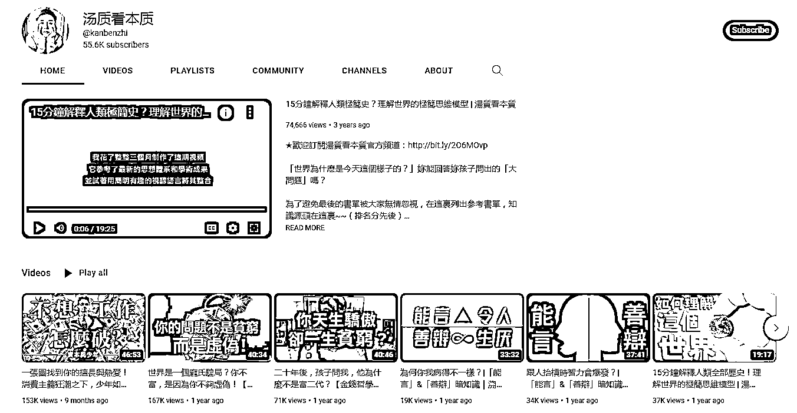  <ne-p id="u38c9f6a3" data-lake-id="u38c9f6a3"><ne-text id="udd54a3ba">你会发现，他的频道全部是长视频，长，就是他的特点之一。</ne-text></ne-p> <ne-p id="ubecb4fe7" data-lake-id="ubecb4fe7"><ne-text id="u9d08c8e1">他的作品往往能够引起人们的思考，这又是一个特点。</ne-text></ne-p> <ne-p id="u856b60ac" data-lake-id="u856b60ac"><ne-text id="u69518cdd">但 YouTube 只是他的分发渠道之一，他还有公众号，B 站，星球等。在不靠 YouTube 变现的情况下，对于分发基本没有多余的生产成本和时间成本。</ne-text></ne-p> <ne-p id="u90ec4b72" data-lake-id="u90ec4b72"><ne-text id="uc61d7b54">我们项目订阅用户从 0~1000 最少花了</ne-text><ne-text id="u7f4d0f84" ne-bold="true">三个月以上</ne-text><ne-text id="ue22cf687">。</ne-text></ne-p> <ne-p id="u43f7b929" data-lake-id="u43f7b929"><ne-text id="uafc41d98">前期做的是偏向媒体采访类、时事结合类。在这个阶段，内容上没有很强的独有性。用户今天看一个新闻频道和看一个我们的视频，本质上是一样的，只是说我们的内容更聚焦。</ne-text></ne-p> <ne-p id="u6fdf0a56" data-lake-id="u6fdf0a56"><ne-text id="u4099d14c">视频发布后，根据话题热点，浏览量大概只有几百一千。 此时几乎没有同类型的媒体做视频类项目，更多的是文字版，这一块没有大的起伏，还是一直坚持在做。</ne-text></ne-p> <ne-p id="u0a2956a8" data-lake-id="u0a2956a8"><ne-text id="ucf3d938c">接着启动了 K12 内容计划，以为流量会很好，实际上前三个月依然流量只有 100 左右。想了半天想不通，内容是没有问题的，为什么没流量。</ne-text></ne-p> <ne-p id="u4a96bf1c" data-lake-id="u4a96bf1c"><ne-text id="uf14278a1">后面开始一步步的优化，慢慢有了起色。</ne-text></ne-p> <ne-h3 id="17a6d1e9" data-lake-id="17a6d1e9"><ne-heading-ext><ne-heading-anchor></ne-heading-anchor><ne-heading-fold></ne-heading-fold></ne-heading-ext><ne-heading-content><ne-text id="u6980556f">2\. 内容运营</ne-text></ne-heading-content></ne-h3> <ne-p id="u914bbdd1" data-lake-id="u914bbdd1"><ne-text id="u687ed742">前期运营，如果你不知道如何去做，就在看竞争对手在做什么，对手才是你最好的老师。</ne-text></ne-p> <ne-p id="u475089ed" data-lake-id="u475089ed"><ne-text id="u552f4191">找到对标账号也不能全模仿，你们的阶段是不一样的。同样的事情他做有效果，你做不一定有效果。</ne-text></ne-p> <ne-h4 id="e532de20" data-lake-id="e532de20"><ne-heading-ext><ne-heading-anchor></ne-heading-anchor><ne-heading-fold></ne-heading-fold></ne-heading-ext><ne-heading-content><ne-text id="ue9c46ad9">（1）多渠道分发助力启动</ne-text></ne-heading-content></ne-h4> <ne-quote id="ua7911663" data-lake-id="ua7911663"><ne-p id="u7561e800" data-lake-id="u7561e800"><ne-text id="ued216248">最好把 Facebook、Twitter 等社交账号都顺手开了。在前期你是没有浏览量的，你可以将视频分享到 FB，Twitter 等其他社交媒体或者专业论坛上，增加视频的展示几率。</ne-text></ne-p> <ne-h5 id="70736a13" data-lake-id="70736a13"><ne-heading-ext><ne-heading-anchor></ne-heading-anchor><ne-heading-fold></ne-heading-fold></ne-heading-ext><ne-heading-content><ne-text id="u24458b04" ne-bold="true">1）自主媒体</ne-text></ne-heading-content></ne-h5> <ne-p id="uf903e3f8" data-lake-id="uf903e3f8"><ne-text id="u0a40a99c">包括不限于网站、App，Facebook 等其他社交媒体软件，在这里你有控制内容的全部能力，保证你发布的是想看到的。</ne-text></ne-p> <ne-p id="u9f87b87a" data-lake-id="u9f87b87a"><ne-text id="ua79924f4">我们有自己的网站，YouTube 视频直接内嵌到网页里了，在用户浏览网页的时候直接就可以免跳转观看，体验顺滑同时又增加了浏览量。</ne-text></ne-p> <ne-p id="u5f94944e" data-lake-id="u5f94944e"><ne-text id="u6291201f">同时也会在各个社交媒体发布视频信息，尽最大可能的增加初期浏览量。</ne-text></ne-p> <ne-p id="u4c34de44" data-lake-id="u4c34de44"><ne-text id="u88a89cad">YouTube 在视频破特定播放量的时候会检查流量来源，我们之前是 300（可能随时变化）。它会看浏览数据是否有异常，以保证不是通过作弊手段在刷量。</ne-text></ne-p> <ne-p id="uda00e4aa" data-lake-id="uda00e4aa"><ne-card data-card-name="image" data-card-type="inline" id="ICfVn" data-event-boundary="card">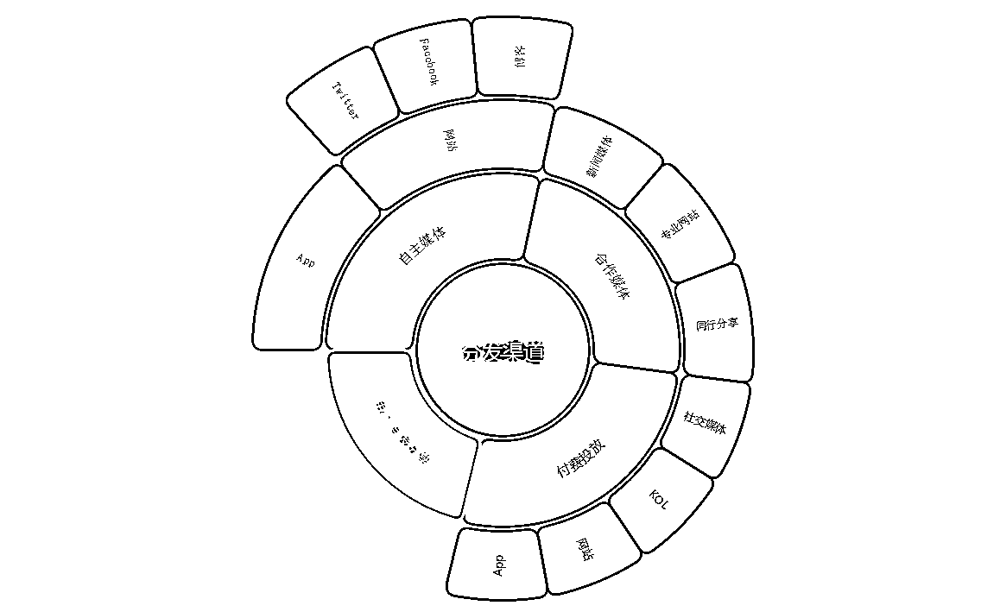  <ne-h5 id="2cfd2a95" data-lake-id="2cfd2a95"><ne-heading-ext><ne-heading-anchor></ne-heading-anchor><ne-heading-fold></ne-heading-fold></ne-heading-ext><ne-heading-content><ne-text id="u071d7bcb" ne-bold="true">2）合作媒体</ne-text></ne-heading-content></ne-h5> <ne-p id="u0edf0cde" data-lake-id="u0edf0cde"><ne-text id="ucb2699b8">如果你做产品类的，可以和新闻站，科技站，自媒体投稿联系，让他们来报道你的产品。别人的报道会让你的 IP 和产品更加生动，更加丰满。</ne-text></ne-p> <ne-p id="u7691238d" data-lake-id="u7691238d"><ne-text id="ub4b03900">往往同行的推荐，开箱，比你自己的视频更有说服力，同行也可以是从业者，专业人士。</ne-text></ne-p> <ne-p id="ue9bdd064" data-lake-id="ue9bdd064"><ne-text id="ud427ac28">如果有传统媒体对你的 IP 进行报道，影响力更大，后面会说。</ne-text></ne-p> <ne-h5 id="a2166611" data-lake-id="a2166611"><ne-heading-ext><ne-heading-anchor></ne-heading-anchor><ne-heading-fold></ne-heading-fold></ne-heading-ext><ne-heading-content><ne-text id="u0f4c26da" ne-bold="true">3）付费投放</ne-text></ne-heading-content></ne-h5> <ne-p id="u74650990" data-lake-id="u74650990"><ne-text id="ua0606b9a">通常用于销售类产品，只要投产比够高你就可以一直投。</ne-text></ne-p> <ne-p id="u3db064c7" data-lake-id="u3db064c7"><ne-text id="u0ff76dc5">可以投社交媒体，或者付费让 KOL 替你推广，根据不同内容效果各异。</ne-text></ne-p> <ne-p id="u4f284d5e" data-lake-id="u4f284d5e"><ne-text id="u811d369e">这不完全算 YouTube 创作内容主线，毕竟广告的投放时间更短，或者 gif 图片模式更多。</ne-text></ne-p> <ne-p id="u691300eb" data-lake-id="u691300eb"><ne-text id="u6d9246f7">具体看你的目标路径，如果你是投放增加视频的点击量，转化为 IP 粉丝，再转化到产品，也许不如直接投产品来的简单粗暴。</ne-text></ne-p> <ne-h4 id="6f6e7583" data-lake-id="6f6e7583"><ne-heading-ext><ne-heading-anchor></ne-heading-anchor><ne-heading-fold></ne-heading-fold></ne-heading-ext><ne-heading-content><ne-text id="uf0b59076">（3）数据分析</ne-text></ne-heading-content></ne-h4> <ne-p id="u5dc886bc" data-lake-id="u5dc886bc"><ne-text id="ue969c2fe">YouTube 的 Analytics 是众多视频端后台最详细最精准的，里面甚至有很多大部分人用不上的细节，比如连你的 OS 都知道，当然对于喜欢知道更多细节的朋友，这也是最友好的数据分析工具。</ne-text></ne-p> <ne-p id="u8060ab9b" data-lake-id="u8060ab9b"><ne-card data-card-name="image" data-card-type="inline" id="Hpzzl" data-event-boundary="card">  <ne-p id="uc66c699e" data-lake-id="uc66c699e"><ne-text id="u3e2daf8f">Analytics 里最直观的几个点：</ne-text></ne-p> <ne-p id="ua6219ee6" data-lake-id="ua6219ee6"><ne-text id="uf36e0e28" ne-bold="true">①浏览时长</ne-text></ne-p> <ne-p id="u5426271b" data-lake-id="u5426271b"><ne-text id="u1df03473">YouTube 在判断一个视频好坏的最重要的因素就是视频的浏览时长。因为整体都会是中长视频。浏览总时长比完播率会更重要。（还记得申请 YPP 需要的 4000 时长的要求吗？)</ne-text></ne-p> <ne-p id="ua4257455" data-lake-id="ua4257455"><ne-text id="ue3326ec7" ne-bold="true">②浏览数</ne-text></ne-p> <ne-p id="u8e76335a" data-lake-id="u8e76335a"><ne-text id="u31ab27eb">浏览数的增加，直接影响账号的权重，前期拼的就是浏览数，中后期更看中浏览时长。</ne-text></ne-p> <ne-p id="u01788bee" data-lake-id="u01788bee"><ne-text id="ue8f078b0" ne-bold="true">③用户量</ne-text></ne-p> <ne-p id="uecfc011b" data-lake-id="uecfc011b"><ne-text id="u31a92a40">对 YouTube 来说很简单，如果你没有足够的用户关注，证明你的内容不够优质。用户量也是保证基础推送的底线。</ne-text></ne-p> <ne-p id="u423b7f6d" data-lake-id="u423b7f6d"><ne-text id="u8cb87ffb">数据分析，它将会贯穿我们整个运营的周期，学会如何去看分析数据将是你必修课之一。</ne-text></ne-p> <ne-p id="uf7ff9a3c" data-lake-id="uf7ff9a3c"><ne-text id="u4b6a2488">今天一个视频好，一个视频浏览量高，一个视频的互动率高，我们要知道是为什么？什么人喜欢看？</ne-text></ne-p> <ne-p id="u6c5dca91" data-lake-id="u6c5dca91"><ne-text id="u62a26608">在前期对你优化视频有非常大的作用，你可以通过看到视频的浏览时间，知道在哪里出了问题。</ne-text></ne-p> <ne-p id="u861a58f0" data-lake-id="u861a58f0"><ne-card data-card-name="image" data-card-type="inline" id="eOgDr" data-event-boundary="card">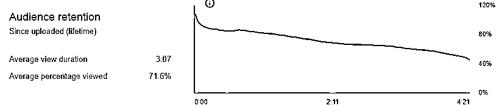  <ne-p id="u81412eef" data-lake-id="u81412eef"><ne-text id="uc4297506">4 分半的视频看了 3 分，平滑的下降曲线，和同类型的比还算正常。</ne-text></ne-p> <ne-p id="u2e8905c4" data-lake-id="u2e8905c4"><ne-card data-card-name="image" data-card-type="inline" id="D5jX0" data-event-boundary="card">  <ne-p id="ue91936bb" data-lake-id="ue91936bb"><ne-text id="u4068dc5d">多少人回头来看你的视频，多少人加关注了？</ne-text></ne-p> <ne-quote id="u70902399" data-lake-id="u70902399"><ne-p id="ue75c9765" data-lake-id="ue75c9765"><ne-card data-card-name="image" data-card-type="inline" id="mj8wB" data-event-boundary="card">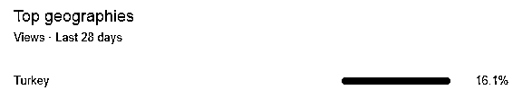  <ne-p id="u5cc8bcf5" data-lake-id="u5cc8bcf5"><ne-text id="ue8c7323a" ne-italic="true">测试视频，我都没想到会在土耳其有这么多观众看。</ne-text></ne-p> <ne-p id="u1b034146" data-lake-id="u1b034146"><ne-card data-card-name="image" data-card-type="inline" id="UIXwY" data-event-boundary="card">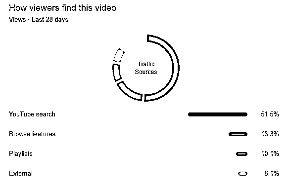  <ne-p id="u4ee18885" data-lake-id="u4ee18885"><ne-text id="u013749b7">50%以上的搜索，16%的推荐，10%的播放列表。</ne-text></ne-p> <ne-p id="u17aeafa4" data-lake-id="u17aeafa4"><ne-text id="ufdd7ec01">只要基础内容做好，即使没有怎么优化的情况下，搜索流量也算是比较精准的，流量分布也是健康的。</ne-text></ne-p> <ne-p id="ub03e481f" data-lake-id="ub03e481f"><ne-card data-card-name="image" data-card-type="inline" id="e668F" data-event-boundary="card">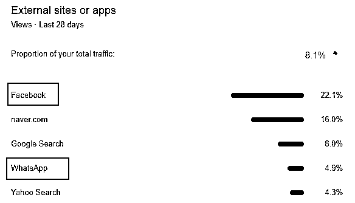  <ne-p id="u461136b5" data-lake-id="u461136b5"><ne-text id="ude2bf4fb">看看社交媒体带来的流量里，谁的贡献比较大。你就会对视频的整个状态有比较清晰的认识，是否有话题性。</ne-text></ne-p> <ne-p id="u0896b9bd" data-lake-id="u0896b9bd"><ne-text id="uea5cdd0b">简单来说，数据最好的就是你做的做好的地方，稍微差一点的，并不代表不好，根据你需要的方向来。</ne-text></ne-p> <ne-p id="u607ab1b9" data-lake-id="u607ab1b9"><ne-text id="u9db5192f">假设你自己外站流量很大，全部是自己的流量，搜索占比太小，那也是不健康的，成了流量反哺。</ne-text></ne-p> <ne-h5 id="f3843154" data-lake-id="f3843154"><ne-heading-ext><ne-heading-anchor></ne-heading-anchor><ne-heading-fold></ne-heading-fold></ne-heading-ext><ne-heading-content><ne-text id="u637106a6" ne-bold="true">1）对手的数据分析</ne-text></ne-heading-content></ne-h5> <ne-p id="u46d7c256" data-lake-id="u46d7c256"><ne-text id="u5e83ce98">最简单的方法，你去到对手的频道直接按播放量，从高往低排。你把前 10 的视频筛出来，你就知道什么视频是同领域最火的了。</ne-text></ne-p> <ne-p id="u12e6ed14" data-lake-id="u12e6ed14"><ne-text id="u7701964d">统计一下对方的用户量，平均视频观看量，发视频的频率，整体视频的质量，评论留言内容。</ne-text></ne-p> <ne-p id="u084b0c1f" data-lake-id="u084b0c1f"><ne-card data-card-name="image" data-card-type="inline" id="GlCN9" data-event-boundary="card">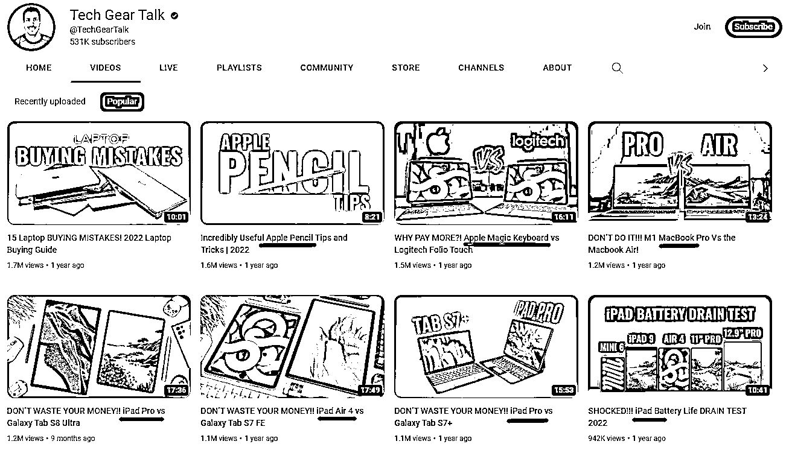  <ne-p id="uef1292ab" data-lake-id="uef1292ab"><ne-text id="u5c81dcb5">比如这个账号，最受欢迎的视频里，7 个都是苹果的。流量密码是 iPad 还是 MacBook？</ne-text><ne-text id="u1ed8c6d4" ne-bold="true">都是！</ne-text></ne-p> <ne-p id="u9d5eb497" data-lake-id="u9d5eb497"><ne-text id="u72b331e9">保持周更频率，精美画面，平均时长 9 分钟。发布 2 天视频 8K 观看，1 小时视频 700 观看。</ne-text></ne-p> <ne-p id="u2096d3b4" data-lake-id="u2096d3b4"><ne-card data-card-name="image" data-card-type="inline" id="XB6it" data-event-boundary="card">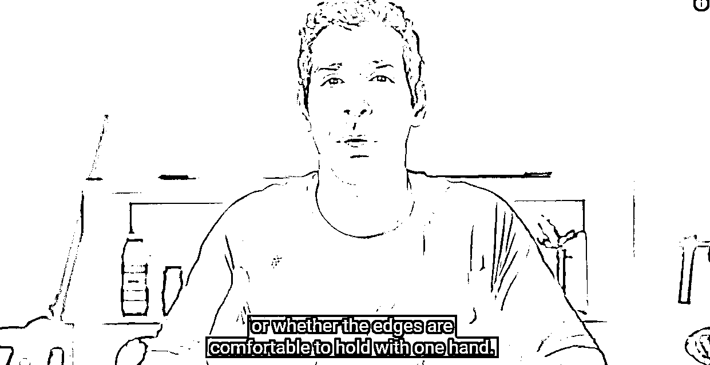  <ne-p id="uca50e2e7" data-lake-id="uca50e2e7"><ne-card data-card-name="image" data-card-type="inline" id="HI7aL" data-event-boundary="card">  <ne-p id="u4ddb6fcf" data-lake-id="u4ddb6fcf"><ne-card data-card-name="image" data-card-type="inline" id="HiYmG" data-event-boundary="card">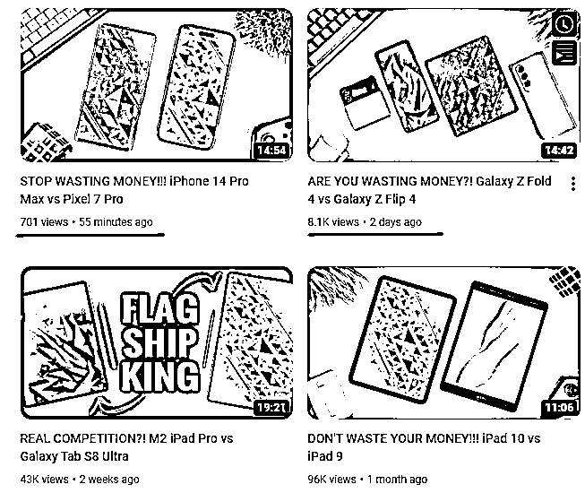  <ne-p id="u12470a73" data-lake-id="u12470a73"><ne-text id="u89a7c00d">数据拆完了之后还要分析对方的内容。</ne-text></ne-p> <ne-p id="udf84473c" data-lake-id="udf84473c"><ne-text id="ufcb10a7c">你要看到对方的内容形式，是口播还是动画，开头是怎么表现的，怎么制造悬念，有没有让粉丝给他点赞点关注？</ne-text></ne-p> <ne-p id="u318b0f8a" data-lake-id="u318b0f8a"><ne-card data-card-name="image" data-card-type="inline" id="EKmOC" data-event-boundary="card">  <ne-p id="u4ad9265c" data-lake-id="u4ad9265c"><ne-text id="u03e3eb05">感受一下视频的节奏，如果跳出了广告，你还愿不愿意继续看？</ne-text></ne-p> <ne-p id="uc620b67a" data-lake-id="uc620b67a"><ne-text id="ufa15395e">看他的主页，是怎么进行内容的规划的。</ne-text></ne-p> <ne-p id="ud5672f84" data-lake-id="ud5672f84"><ne-card data-card-name="image" data-card-type="inline" id="R72yK" data-event-boundary="card">  <ne-p id="u7b443f0f" data-lake-id="u7b443f0f"><ne-text id="ub07e0427" ne-bold="true">变现方式：</ne-text><ne-text id="ua26cd000">赞助+CPS+请喝咖啡</ne-text></ne-p> <ne-p id="u60ecb2ea" data-lake-id="u60ecb2ea"><ne-card data-card-name="image" data-card-type="inline" id="RDASP" data-event-boundary="card">  <ne-p id="u2a3e11d8" data-lake-id="u2a3e11d8"><ne-text id="u6930811d">如果这是你的竞争对手，做到整体印象心中有数不算太难。</ne-text></ne-p> <ne-h4 id="f1179a9a" data-lake-id="f1179a9a"><ne-heading-ext><ne-heading-anchor></ne-heading-anchor><ne-heading-fold></ne-heading-fold></ne-heading-ext><ne-heading-content><ne-text id="u3c114adc">（4）基础优化</ne-text></ne-heading-content></ne-h4> <ne-p id="uac30582f" data-lake-id="uac30582f"><ne-text id="u0aae8c71" ne-bold="true">YouTube 开头黄金三秒法则</ne-text></ne-p> <ne-p id="u977f44c9" data-lake-id="u977f44c9"><ne-text id="u70f903c4">如果说前三秒你吸引不到用户，后面的内容再精彩也白搭。</ne-text></ne-p> <ne-p id="u14615522" data-lake-id="u14615522"><ne-text id="u4c53d3f4">我们通常会用</ne-text><ne-text id="u6075afa2" ne-bold="true">结果前置或者观点优先</ne-text><ne-text id="u99526a7b">。先说出让用户感兴趣的结果，或者是让用户惊讶的结果。让用户一秒钟就知道我们这个视频在讲什么。</ne-text></ne-p> <ne-p id="ue2230ce3" data-lake-id="ue2230ce3"><ne-text id="u5c67fd2d">当你前面成功吸引了用户的注意力，剩下的就是你自己根据内容的特点来进行展示。</ne-text></ne-p> <ne-p id="u663993be" data-lake-id="u663993be"><ne-text id="u4493d31f">你可以开头展示华丽的画面，你也可以开头留悬念。选择最适合你内容的开头和最有你特色的开头是非常重要的。</ne-text></ne-p> <ne-p id="u9c8b0441" data-lake-id="u9c8b0441"><ne-text id="u386e84d2">K12 的内容强调的是一个逻辑性和整体性，这一个知识点过了之后，我知道下一个知识点是什么，整体的结构非常的清晰明了。</ne-text></ne-p> <ne-p id="ud37e2e31" data-lake-id="ud37e2e31"><ne-text id="u0d442a13">我们项目从一开始单一 IP 到后期变为多个 IP 的模式，每个老师都是独立 IP，每个自我介绍里，一定会有 IP 名字，加上品牌名字，强关联。</ne-text></ne-p> <ne-p id="u283d6280" data-lake-id="u283d6280"><ne-text id="u6bd6826d">以至于在现实生活中，老师们经常会被问到，你是不是和那个 XX 那边有合作。或者被认出来，哎我在 XX 的视频那里看到过你，你是不是 XXX。</ne-text></ne-p> <ne-p id="u62b26e16" data-lake-id="u62b26e16"><ne-text id="ubccc9efc">某种程度上来说，也算是一点点小成绩，证明整个策略是成功的。</ne-text></ne-p> <ne-h5 id="c1eff22e" data-lake-id="c1eff22e"><ne-heading-ext><ne-heading-anchor></ne-heading-anchor><ne-heading-fold></ne-heading-fold></ne-heading-ext><ne-heading-content><ne-text id="u62f0ada4" ne-bold="true">1）优化标题描述</ne-text></ne-heading-content></ne-h5> <ne-p id="u7a86e68c" data-lake-id="u7a86e68c"><ne-text id="u718192eb">写标题和描述的时候，尽量用简洁的语言说清楚，而不要为了堆砌关键词把一个句子复杂化。</ne-text></ne-p> <ne-p id="u98863e89" data-lake-id="u98863e89"><ne-text id="uc78de06e">简洁而精准的描述往往就是最有效的。</ne-text></ne-p> <ne-h5 id="7616cbbc" data-lake-id="7616cbbc"><ne-heading-ext><ne-heading-anchor></ne-heading-anchor><ne-heading-fold></ne-heading-fold></ne-heading-ext><ne-heading-content><ne-text id="u89172e54" ne-bold="true">2）优化你的封面</ne-text></ne-heading-content></ne-h5> <ne-p id="u8dde8634" data-lake-id="u8dde8634"><ne-text id="u52028aa1" ne-bold="true">封面</ne-text><ne-text id="u900a30c6">是你和用户连接的第一步。</ne-text></ne-p> <ne-p id="uc684ec74" data-lake-id="uc684ec74"><ne-text id="u798f1ff4">在 YouTube 上一个视频会不会被点击，你的封面，有的时候甚至比你的标题更重要。</ne-text></ne-p> <ne-p id="u209f5715" data-lake-id="u209f5715"><ne-text id="u2f65f50a">封面在提高点击的同时，也是你的品牌形象展示。在这一步花一些时间是非常有必要的。</ne-text></ne-p> <ne-p id="uf4a8025c" data-lake-id="uf4a8025c"><ne-text id="ue928133e">封面的设计应该要反映你的品牌形象，搭配你的个人风格。显然你不会用水彩画去描述硬核的登山技巧。</ne-text></ne-p> <ne-p id="u0d0596b2" data-lake-id="u0d0596b2"><ne-card data-card-name="image" data-card-type="inline" id="nhBug" data-event-boundary="card">  <ne-h5 id="5867c2fe" data-lake-id="5867c2fe"><ne-heading-ext><ne-heading-anchor></ne-heading-anchor><ne-heading-fold></ne-heading-fold></ne-heading-ext><ne-heading-content><ne-text id="u9def397a" ne-bold="true">3）Call to Action</ne-text></ne-heading-content></ne-h5> <ne-p id="u4e96e9bf" data-lake-id="u4e96e9bf"><ne-text id="ucc2760be">看 YouTube 你会发现大部分博主都会在开头或者是结尾说给我一个赞，给我一个支持，给我一个转发。</ne-text></ne-p> <ne-p id="u247a3b17" data-lake-id="u247a3b17"><ne-text id="u7fc849a6">如果说你希望用户订阅你的频道你一定要告诉他，就像现在大家看到在 B 站很多人都说欢迎三连和投币，因为很多用户你不和他说，他不知道要去做这个事。</ne-text></ne-p> <ne-p id="u1506c071" data-lake-id="u1506c071"><ne-card data-card-name="image" data-card-type="inline" id="wGZrL" data-event-boundary="card">  <ne-p id="u37822c00" data-lake-id="u37822c00"><ne-text id="u6b6c4547">记得一定要让用户订阅你的频道，这样更新会有推送，可以保证基础的播放量。</ne-text></ne-p> <ne-p id="ufa58a264" data-lake-id="ufa58a264"><ne-text id="ubb9dda21">当你有了一定的粉丝量之后，为了整体的观感你可以不说，但是你在前期一定得喊。</ne-text></ne-p> <ne-h5 id="d1179012" data-lake-id="d1179012"><ne-heading-ext><ne-heading-anchor></ne-heading-anchor><ne-heading-fold></ne-heading-fold></ne-heading-ext><ne-heading-content><ne-text id="u275cf1bf" ne-bold="true">4）增加你的互动率</ne-text></ne-heading-content></ne-h5> <ne-p id="ue7ed11dd" data-lake-id="ue7ed11dd"><ne-text id="u37505c4e">如果你有留言，一定要回复，不要放过每一次互动的机会。哪怕对方给你发的只是一个 emoji。</ne-text></ne-p> <ne-p id="u9f779d2a" data-lake-id="u9f779d2a"><ne-card data-card-name="image" data-card-type="inline" id="u7Ier" data-event-boundary="card">  <ne-h3 id="270ca265" data-lake-id="270ca265"><ne-heading-ext><ne-heading-anchor></ne-heading-anchor><ne-heading-fold></ne-heading-fold></ne-heading-ext><ne-heading-content><ne-text id="u56bc5e0b">3\. 定期复盘，做好下一步计划</ne-text></ne-heading-content></ne-h3> <ne-p id="u663294b8" data-lake-id="u663294b8"><ne-text id="uc6f03719">当你做完上面几步之后，你应该也经营账号有一段时间了，你对整个项目应该有一个宏观的感受。</ne-text></ne-p> <ne-p id="u8aac87ba" data-lake-id="u8aac87ba"><ne-text id="u245cfda8">你应该可以清晰的看到，你花了多长时间，花了多少成本，做了多少视频，数据量又是怎样？整体的数据是否在增长？</ne-text></ne-p> <ne-p id="u0c9d5877" data-lake-id="u0c9d5877"><ne-text id="ua81fee3d">根据前期定下来的目标，比如在一个月，两个月，三个月，要做到多少粉丝多少观看量有没有达到？</ne-text></ne-p> <ne-p id="u574472cd" data-lake-id="u574472cd"><ne-text id="ue8e0e67a">如果没有达到，是什么原因没有达到？那目前的成本开销是否支持你做下去？你是否有其他的盈利的业务来支撑你前期的投入？</ne-text></ne-p> <ne-p id="u1d5101b6" data-lake-id="u1d5101b6"><ne-text id="uc4ce1e86">如果三个月没有做起来，六个月也没有做起来，你是否能够接受整体的损失？</ne-text></ne-p> <ne-p id="u22aa7601" data-lake-id="u22aa7601"><ne-text id="u700d6176">如果项目有增长，但是增长比你的想象比你的预期要低很多，还有什么方法没有试过，还有什么渠道没有用上的？</ne-text></ne-p> <ne-p id="ua4c675a3" data-lake-id="ua4c675a3"><ne-text id="u1a608112">这些问题我相信在日常其实你都会思考。但是通过定期的复盘，你会有一些更精准的数据支撑。</ne-text></ne-p> <ne-p id="ua3f4e5a6" data-lake-id="ua3f4e5a6"><ne-text id="udce7496b">不同的项目不同的情况，如果你只是用 YouTube 作为一个分发平台，那对你来说其他的都不太重要，闭着眼睛直接发就可以了。</ne-text></ne-p> <ne-p id="u3d72ffdb" data-lake-id="u3d72ffdb"><ne-text id="uad6c38fd">我们的项目因为产品架构不同，我们并不通过 YouTube 进行 IP 变现，我们做视频是为了引流到后端，所以发现广告不能带来收益后，直接就关掉了。</ne-text></ne-p> <ne-p id="u2f82ce32" data-lake-id="u2f82ce32"><ne-text id="u637a8c73">从一开始，我们的目标就是在教育板块占一个重要的媒体位。</ne-text></ne-p> <ne-h2 id="4c6167c9" data-lake-id="4c6167c9"><ne-heading-ext><ne-heading-anchor></ne-heading-anchor><ne-heading-fold></ne-heading-fold></ne-heading-ext><ne-heading-content><ne-text id="uc749e104">三、提升你的内容种类和形式，获取更多流量</ne-text></ne-heading-content></ne-h2> <ne-p id="uaff42a37" data-lake-id="uaff42a37"><ne-text id="u0796e8b5">如果决定要继续深耕，我们需要不断优化，继续找到更多的提升点，去获取更多的流量。</ne-text></ne-p> <ne-p id="uc3ca51e8" data-lake-id="uc3ca51e8"><ne-text id="u69b0b4bc">这个时候我们要对整个内容和运营有质的提升，本质上，你是在和全球最优秀的创作者竞争。</ne-text></ne-p> <ne-p id="ud508f3ab" data-lake-id="ud508f3ab"><ne-text id="ueade648d">此时我们不单单满足做一个好视频，而是要做一个优质的视频。</ne-text></ne-p> <ne-quote id="u87c712a7" data-lake-id="u87c712a7"><ne-h3 id="7ad98884" data-lake-id="7ad98884"><ne-heading-ext><ne-heading-anchor></ne-heading-anchor><ne-heading-fold></ne-heading-fold></ne-heading-ext><ne-heading-content><ne-text id="uda1ec083">1\. 多样化内容形式</ne-text></ne-heading-content></ne-h3> <ne-p id="ub7e1d245" data-lake-id="ub7e1d245"><ne-card data-card-name="image" data-card-type="inline" id="Psopk" data-event-boundary="card">  <ne-p id="u0b96a8fc" data-lake-id="u0b96a8fc"><ne-text id="ubb3d1397">作为教育新媒体，前期我们做新闻类视频的时候，单纯就是主持人对新的政策内容进行解读。</ne-text></ne-p> <ne-p id="u1f3efa20" data-lake-id="u1f3efa20"><ne-text id="u86f4c542">接着开始做人物采访，同时还有线下论坛的采访。这个时候，作为活跃度非常高的自媒体，已经能够接到高校的合作商务了。</ne-text></ne-p> <ne-p id="u7c5b0c11" data-lake-id="u7c5b0c11"><ne-text id="u337b7b3f">我们会在采访视频里，植入合作方的内容，给到更多的展示，甚至是单独给他们出一个视频。虽然钱不够支付整个的生产成本，但为后期其他项目打下了良好的基础，比如采购网站的广告位，商务推广合作。</ne-text></ne-p> <ne-p id="u9665ea99" data-lake-id="u9665ea99"><ne-text id="u145af2b1">曾经尝试在活动现场做 360 度视频的直播，但因为效果太差，收音和画面都达不到优质的水平，取消。</ne-text></ne-p> <ne-h3 id="b08eeae1" data-lake-id="b08eeae1"><ne-heading-ext><ne-heading-anchor></ne-heading-anchor><ne-heading-fold></ne-heading-fold></ne-heading-ext><ne-heading-content><ne-text id="u24b46862">2\. 深挖不同内容种类</ne-text></ne-heading-content></ne-h3> <ne-p id="u4da1c9f3" data-lake-id="u4da1c9f3"><ne-text id="uaec38db3">当你开始有一定经验之后，你对你的内容一定要有更高的要求。我们可以在视频的深度和广度上进行提升。</ne-text></ne-p> <ne-p id="u5c79421f" data-lake-id="u5c79421f"><ne-text id="u1e6bcef8" ne-bold="true">深度</ne-text><ne-text id="u19a8e030">上你可以对内容进行深挖。做别人没有做过的角度。</ne-text></ne-p> <ne-p id="ubc4ba91d" data-lake-id="ubc4ba91d"><ne-text id="u34eb6171">比如大家都在说手机性能多么好，摄像头像素多么高的时候，你谈手机的使用体验。找到你所擅长的角度，去做有自己特点的内容。</ne-text></ne-p> <ne-p id="uc8264220" data-lake-id="uc8264220"><ne-text id="u3651b7f6" ne-bold="true">广度</ne-text><ne-text id="u42e8a5a2">上是开拓更多的内容。比如你今天是做体育的，专门做足球的。在临近世界杯的时候，除了做正在发生的事情。</ne-text></ne-p> <ne-p id="u4d9397de" data-lake-id="u4d9397de"><ne-text id="ua73edaa4">你是否可以做关于每个球队的专题，人物的专题。甚至是赞助商的专题。如果你能提前一个月把内容做好，那大概率你会有很好的流量。</ne-text></ne-p> <ne-p id="u1ddfb4ff" data-lake-id="u1ddfb4ff"><ne-text id="u4199aaca">比如说你一开始是做创业内容的口播。这个时候找来 10 个创业者来讲他们成功和失败的经验。</ne-text></ne-p> <ne-p id="uc9d51764" data-lake-id="uc9d51764"><ne-text id="udbe6697a">当你采访完这 10 个创业者之后，你是不是能够总结出一个创业避坑指南。</ne-text></ne-p> <ne-p id="u8d53df52" data-lake-id="u8d53df52"><ne-text id="u5e23e200">整体内容瞬间就丰满了，就像填坑一样，填到后期，你就造出了一个高楼大厦。</ne-text></ne-p> <ne-p id="u076a16ae" data-lake-id="u076a16ae"><ne-text id="u3714add3">我们的项目就是这样做的。</ne-text></ne-p> <ne-p id="u89362a34" data-lake-id="u89362a34"><ne-text id="u6e79ae93">我们前期通过对新的教育政策的分析和解释，帮大家做出更好的选择，做</ne-text><ne-text id="ua68fb3ff" ne-bold="true">时事类的解说</ne-text><ne-text id="u8146715f">。</ne-text></ne-p> <ne-p id="u38d80e4f" data-lake-id="u38d80e4f"><ne-text id="u3ad75636">接着做了特殊院校</ne-text><ne-text id="u6a65cebd" ne-bold="true">学生的采访</ne-text><ne-text id="u6f212afe">。</ne-text></ne-p> <ne-p id="u8705a0ec" data-lake-id="u8705a0ec"><ne-text id="u469e9cd6">比如说一些日常你不太常见的职业，面包师等，让你知道这个职业学习的过程会经历什么，给你一个未来的方向。</ne-text></ne-p> <ne-p id="ud9f1bfe9" data-lake-id="ud9f1bfe9"><ne-text id="uda006a0b" ne-bold="true">创业学生</ne-text><ne-text id="uad648e1f">的专辑，他们为什么要创业？在什么时间点做了什么决定，过程是什么样？失败还是成功？</ne-text></ne-p> <ne-p id="u175d68b8" data-lake-id="u175d68b8"><ne-text id="uad6398ad" ne-bold="true">合作伙伴</ne-text><ne-text id="u8f8cafaf">的采访，他们有一些什么新的项目可以给到学生什么样的帮助。</ne-text></ne-p> <ne-p id="uedf1167d" data-lake-id="uedf1167d"><ne-text id="uedfac9bd" ne-bold="true">How to 视频</ne-text><ne-text id="uc90db256">，怎么领取补贴。当地政府对学生政策上有一些补贴，满足要求的同学可以领取。这一条主线把学生校外生活的信息填充的非常饱满。</ne-text></ne-p> <ne-p id="ub6d80d23" data-lake-id="ub6d80d23"><ne-card data-card-name="image" data-card-type="inline" id="oHSi9" data-event-boundary="card">  <ne-p id="u4760bb5b" data-lake-id="u4760bb5b"><ne-text id="u695fd4c9">另一条线是，K12 教育内容。除了校外，我们决定把内容延伸到校内。</ne-text></ne-p> <ne-p id="u4a995d55" data-lake-id="u4a995d55"><ne-text id="u42dfbf79">我们找来了在职的教师。日常的教学内容他们都已经有了，我们只负责录制、剪辑和上线。当然有一个同事会负责将他们的稿件数字化方便拍摄和剪辑。</ne-text></ne-p> <ne-p id="u0cb249b7" data-lake-id="u0cb249b7"><ne-text id="ucc2df76d">每个老师的教育方法不同，有的人 1 分钟可以说清楚，有的人要铺垫 2，3 分钟。</ne-text></ne-p> <ne-p id="u0302f69d" data-lake-id="u0302f69d"><ne-text id="u9e5e196e">当我们测试了上百条视频后，根据数据显示，5 分钟的视频，大家只看 3 分钟。3 分钟的视频，大家只看 1，2 分钟。后期对于大多数视频，我们都力求不要超过 5 分钟，能简单说清楚就不要过度铺垫。</ne-text></ne-p> <ne-p id="u33d19888" data-lake-id="u33d19888"><ne-text id="u113754b4">这一块就是持续输出，做到 100%内容覆盖，花了 2 年上线了 3000+的视频，实际数量还多一点点。</ne-text></ne-p> <ne-h3 id="7d5f8303" data-lake-id="7d5f8303"><ne-heading-ext><ne-heading-anchor></ne-heading-anchor><ne-heading-fold></ne-heading-fold></ne-heading-ext><ne-heading-content><ne-text id="ufe553581">3\. 运营技巧提升形象，获取更多流量</ne-text></ne-heading-content></ne-h3> <ne-p id="u00a581e4" data-lake-id="u00a581e4"><ne-text id="u338fa319">之前航海有讲过如何建立自己的频道，设置基本内容，这里就不过多的重复。</ne-text></ne-p> <ne-h5 id="083b1d3e" data-lake-id="083b1d3e"><ne-heading-ext><ne-heading-anchor></ne-heading-anchor><ne-heading-fold></ne-heading-fold></ne-heading-ext><ne-heading-content><ne-text id="ua4ba73df" ne-bold="true">（1）YouTube 频道搭建</ne-text></ne-heading-content></ne-h5> <ne-p id="u7f6b9b6f" data-lake-id="u7f6b9b6f"><ne-text id="u0f249f4a">这就相当于你商店的门面。一定要展示你的</ne-text><ne-text id="u64f5fe96" ne-bold="true">专业性</ne-text><ne-text id="u2b704fbc">和你的</ne-text><ne-text id="ue939f273" ne-bold="true">独有属性</ne-text><ne-text id="uc8fe36c0">。</ne-text></ne-p> <ne-p id="uca5baa1a" data-lake-id="uca5baa1a"><ne-card data-card-name="image" data-card-type="inline" id="kVIei" data-event-boundary="card">  <ne-h5 id="cd94c580" data-lake-id="cd94c580"><ne-heading-ext><ne-heading-anchor></ne-heading-anchor><ne-heading-fold></ne-heading-fold></ne-heading-ext><ne-heading-content><ne-text id="u6f73779a" ne-bold="true">（2）账号包装</ne-text></ne-heading-content></ne-h5> <ne-p id="u26ae5b19" data-lake-id="u26ae5b19"><ne-text id="u8b338797">账号的包装非常重要，包括你整个的画面风格。你是走明亮的画面还是。更有质感的暗调。</ne-text></ne-p> <ne-p id="u38f4b140" data-lake-id="u38f4b140"><ne-text id="ud87ef41e">你的字体用哪一款？你的整个颜色的基调是什么色？你的风格是内敛还是夸张还是严肃？</ne-text></ne-p> <ne-p id="u1eb11d29" data-lake-id="u1eb11d29"><ne-text id="u3009d52f">很简单，一个做搞笑内容的账号，它的字体它的颜色风格大概率会是夸张明亮高对比度的。</ne-text></ne-p> <ne-p id="ufcb524c9" data-lake-id="ufcb524c9"><ne-text id="u6eef468b">一个做法律的账号大概率会是工整严肃冷静的颜色。</ne-text></ne-p> <ne-p id="ubb4c27bf" data-lake-id="ubb4c27bf"><ne-card data-card-name="image" data-card-type="inline" id="iDCxU" data-event-boundary="card">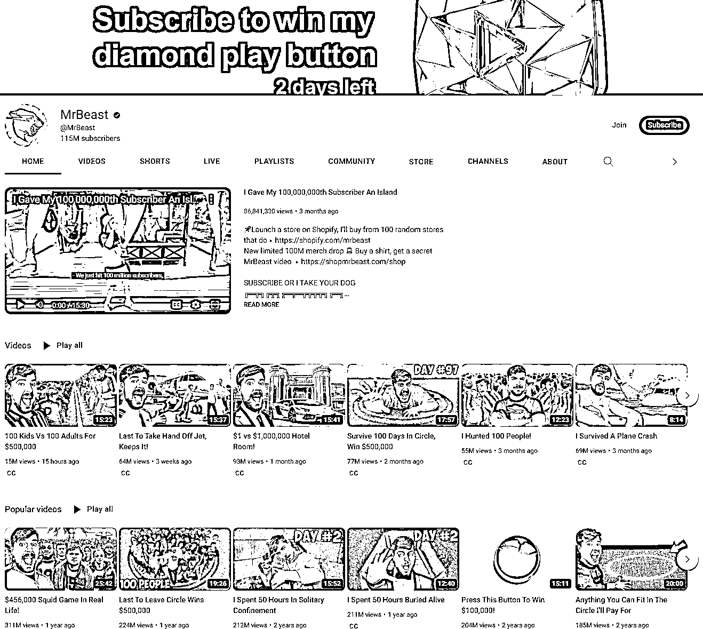  <ne-p id="ubfce254d" data-lake-id="ubfce254d"><ne-text id="u5d25cae3">光看图大家就可以感觉出来和搞笑、创意有关系。</ne-text></ne-p> <ne-p id="uf6e71968" data-lake-id="uf6e71968"><ne-card data-card-name="image" data-card-type="inline" id="o4fTP" data-event-boundary="card">  <ne-p id="u8619a52b" data-lake-id="u8619a52b"><ne-text id="ubdfa392f">在你的频道最上方有一个广告位，这个地方是你最好的宣传，一定要去认真设计。</ne-text></ne-p> <ne-p id="ud02c891d" data-lake-id="ud02c891d"><ne-text id="u10623455">如果是品牌可以挂品牌的 slogan。</ne-text></ne-p> <ne-p id="u0f6faacb" data-lake-id="u0f6faacb"><ne-text id="u3e150035">在这里的技巧是，你可以根据不同的时间段来进行变化，如果有你有那个精力去设计的话。</ne-text></ne-p> <ne-p id="ub0d9e593" data-lake-id="ub0d9e593"><ne-card data-card-name="image" data-card-type="inline" id="vwLsf" data-event-boundary="card">  <ne-p id="u8e3292ac" data-lake-id="u8e3292ac"><ne-text id="u1d1354cb" ne-italic="true">不看视频直接就可以点击购买</ne-text></ne-p> <ne-p id="u95735bd2" data-lake-id="u95735bd2"><ne-text id="u270bbfb6">在首页同时还有一个置顶的视频。这个视频对于不认识你的人是一个非常好的了解途径。</ne-text></ne-p> <ne-p id="u7633e2f8" data-lake-id="u7633e2f8"><ne-text id="uf40a5929">品牌通常都会放自己的宣传片。但是做内容的你，可以放最近的一部片子，或者是你数据最好的一个片子。</ne-text></ne-p> <ne-p id="ubeb73c3c" data-lake-id="ubeb73c3c"><ne-text id="ue2d1f957">进入频道之后，这个片子是自动播放的，因此也可以用来拉一个视频的数据。</ne-text></ne-p> <ne-h5 id="6e85b224" data-lake-id="6e85b224"><ne-heading-ext><ne-heading-anchor></ne-heading-anchor><ne-heading-fold></ne-heading-fold></ne-heading-ext><ne-heading-content><ne-text id="u2110118f" ne-bold="true">（3）互动模块</ne-text></ne-heading-content></ne-h5> <ne-p id="u1030ef01" data-lake-id="u1030ef01"><ne-text id="u7b03e5d6">随着内容做的越多，我们慢慢的有了自己的风格。我们会在内容中穿插其他视频的内容。</ne-text></ne-p> <ne-p id="ue4de5881" data-lake-id="ue4de5881"><ne-text id="uf044a225">通过互动模块，将其他的视频加入到这个视频里面。</ne-text></ne-p> <ne-p id="ub587d318" data-lake-id="ub587d318"><ne-card data-card-name="image" data-card-type="inline" id="mI1Gr" data-event-boundary="card">  <ne-p id="u9abe45dc" data-lake-id="u9abe45dc"><ne-text id="u8aef845e">不同类型视频互动点击率大概在</ne-text><ne-text id="u37dfa788" ne-bold="true">3~7%</ne-text><ne-text id="u61920f76">浮动，不能说好，只能说有就是增加。</ne-text></ne-p> <ne-p id="u9ace4f50" data-lake-id="u9ace4f50"><ne-text id="ua413f6de">举个例子</ne-text></ne-p> <ne-p id="ua23d51cb" data-lake-id="ua23d51cb"><ne-text id="ua8d21597">这一个视频讲“小马在医院里醒来发生了什么事“。如果你没有看到他如何摔倒的，你可以去看一下之前的那个视频。</ne-text></ne-p> <ne-p id="ud1a4762a" data-lake-id="ud1a4762a"><ne-text id="ub68b8a1e">这也是 K12 内容结构清晰的好处。我在录制之前就知道这个视频，可能和上一个视频讲的是有关联的。那在视频的录制优化的过程中，我就会要求老师带到另外一个视频知识。</ne-text></ne-p> <ne-p id="u876bf6a8" data-lake-id="u876bf6a8"><ne-text id="u7fa13d72">同时你在做标题简介的 SEO 的时候，记得把上一个视频带进来。</ne-text></ne-p> <ne-p id="uac0b98d9" data-lake-id="uac0b98d9"><ne-text id="u6fa67a68">做了这个动作之后，我们增加了</ne-text><ne-text id="uba288293" ne-bold="true">8%左右的点击率</ne-text><ne-text id="u2149e01d">。</ne-text></ne-p> <ne-h5 id="47606483" data-lake-id="47606483"><ne-heading-ext><ne-heading-anchor></ne-heading-anchor><ne-heading-fold></ne-heading-fold></ne-heading-ext><ne-heading-content><ne-text id="u9e375d09" ne-bold="true">（4）SEO 标题简介优化</ne-text></ne-heading-content></ne-h5> <ne-p id="ua7651e0b" data-lake-id="ua7651e0b"><ne-text id="uf08dde38">如果你日常熟悉谷歌的 SEO，YouTube 上手会非常的快，大体上他们是一套逻辑。</ne-text></ne-p> <ne-p id="ud1d7b572" data-lake-id="ud1d7b572"><ne-text id="u6e672d26">几个重点 SEO，</ne-text></ne-p> <ne-oli><ne-oli-i>1</ne-oli-i><ne-oli-c class="ne-oli-content" id="u4afb9efb" data-lake-id="u4afb9efb"><ne-text id="u2e8dc94d" ne-bold="true">一定要简洁精准</ne-text></ne-oli-c></ne-oli> <ne-oli><ne-oli-i>2</ne-oli-i><ne-oli-c class="ne-oli-content" id="ud910755f" data-lake-id="ud910755f"><ne-text id="u416b57ea" ne-bold="true">不要堆砌关键词</ne-text></ne-oli-c></ne-oli> <ne-oli><ne-oli-i>3</ne-oli-i><ne-oli-c class="ne-oli-content" id="u1ee601ef" data-lake-id="u1ee601ef"><ne-text id="ue30e7a03" ne-bold="true">说人话</ne-text></ne-oli-c></ne-oli> <ne-p id="u2d07039a" data-lake-id="u2d07039a"><ne-text id="uc48d989c">在标题里可以把你的系列名字写上，也可以在末尾用 1，2，3 来表示。</ne-text></ne-p> <ne-p id="u6d909d76" data-lake-id="u6d909d76"><ne-text id="u1ef606a3">比如说。张三笔记。张三杂谈。张三语录。</ne-text></ne-p> <ne-p id="u26f0591e" data-lake-id="u26f0591e"><ne-text id="u821fb01e">这样的好处是机器可以自动识别出你这些视频是属于一个系列的。</ne-text></ne-p> <ne-p id="u8463679e" data-lake-id="u8463679e"><ne-text id="ubbdb55e3">简介里的内容要精准，同时也要丰富。</ne-text></ne-p> <ne-oli><ne-oli-i>1</ne-oli-i><ne-oli-c class="ne-oli-content" id="u35e3834b" data-lake-id="u35e3834b"><ne-text id="ueb39bc40">首先用一句话说明，你这个视频讲什么</ne-text></ne-oli-c></ne-oli> <ne-oli><ne-oli-i>2</ne-oli-i><ne-oli-c class="ne-oli-content" id="u117ae831" data-lake-id="u117ae831"><ne-text id="u6af086b2">后面可以补充视频的背景，链接到上一个视频</ne-text></ne-oli-c></ne-oli> <ne-oli><ne-oli-i>3</ne-oli-i><ne-oli-c class="ne-oli-content" id="ufb440b91" data-lake-id="ufb440b91"><ne-text id="u3e007cf6">如果你有一个独立站的页面对应着这个视频，把链接也写上</ne-text></ne-oli-c></ne-oli> <ne-oli><ne-oli-i>4</ne-oli-i><ne-oli-c class="ne-oli-content" id="u268c4888" data-lake-id="u268c4888"><ne-text id="u29e72bbf">最后也可以写上你社交媒体的联系方式，在哪里可以找到你</ne-text></ne-oli-c></ne-oli> <ne-oli><ne-oli-i>5</ne-oli-i><ne-oli-c class="ne-oli-content" id="u20095b3c" data-lake-id="u20095b3c"><ne-text id="u2eda0eb8">特别长的视频，可以通过分段导航的方式做一个目录，方便跳到对应的段落，直接看内容。</ne-text></ne-oli-c></ne-oli> <ne-p id="u3fd99e4c" data-lake-id="u3fd99e4c"><ne-card data-card-name="image" data-card-type="inline" id="Wfy9h" data-event-boundary="card">  <ne-p id="u29a37ca9" data-lake-id="u29a37ca9"><ne-text id="uf1dfcdae" ne-italic="true">比较标准干净的 SEO 友好标题描述</ne-text></ne-p> <ne-h5 id="fc903ab8" data-lake-id="fc903ab8"><ne-heading-ext><ne-heading-anchor></ne-heading-anchor><ne-heading-fold></ne-heading-fold></ne-heading-ext><ne-heading-content><ne-text id="uf690e4ec" ne-bold="true">（5）关键词优化</ne-text></ne-heading-content></ne-h5> <ne-p id="u7154a817" data-lake-id="u7154a817"><ne-text id="u920233ad">比如在搜索框里输入你的目标关键词，看一看效果和数据。</ne-text></ne-p> <ne-p id="ub4359c4f" data-lake-id="ub4359c4f"><ne-card data-card-name="image" data-card-type="inline" id="TMFG1" data-event-boundary="card">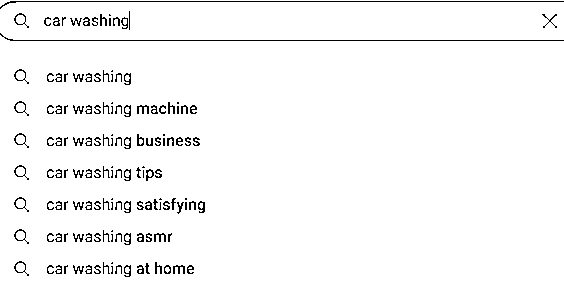  <ne-p id="u1b31d6e1" data-lake-id="u1b31d6e1"><ne-text id="u4a4338c7">把你的关键词输入到谷歌里，看出来的结果是什么？</ne-text></ne-p> <ne-p id="u18fe2a59" data-lake-id="u18fe2a59"><ne-card data-card-name="image" data-card-type="inline" id="M8dII" data-event-boundary="card">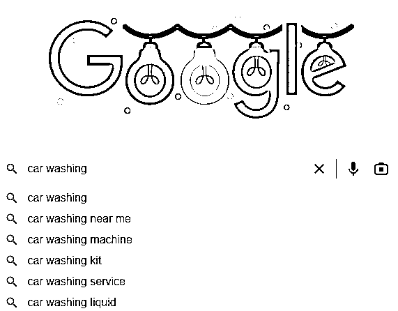  <ne-p id="ua2ac83be" data-lake-id="ua2ac83be"><ne-text id="u5a64eef2">相信大家都看出点东西来了。</ne-text></ne-p> <ne-p id="udc9b04e3" data-lake-id="udc9b04e3"><ne-text id="u735df591">根据内容选择合适的关键词，不是越多越好。</ne-text></ne-p> <ne-p id="ueee04613" data-lake-id="ueee04613"><ne-text id="u4813d0d6">比如你做数码的领域，都在做 iPad 开箱的情况下，没办法，你还是得和别人写一样的关键词，这种情况就是拼内容质量。</ne-text></ne-p> <ne-h5 id="7ebc22c0" data-lake-id="7ebc22c0"><ne-heading-ext><ne-heading-anchor></ne-heading-anchor><ne-heading-fold></ne-heading-fold></ne-heading-ext><ne-heading-content><ne-text id="u541f53a8" ne-bold="true">（6）字幕</ne-text></ne-heading-content></ne-h5> <ne-p id="uc9439974" data-lake-id="uc9439974"><ne-text id="ub391ed29">字幕的作用不仅仅是为了让人更好的阅读。同时他还是读给机器看的。有这个时间还是把字幕做一下，对视频的权重是有提高的。</ne-text></ne-p> <ne-p id="u4dafec92" data-lake-id="u4dafec92"><ne-card data-card-name="image" data-card-type="inline" id="iQtsC" data-event-boundary="card">  <ne-h5 id="6fccae7d" data-lake-id="6fccae7d"><ne-heading-ext><ne-heading-anchor></ne-heading-anchor><ne-heading-fold></ne-heading-fold></ne-heading-ext><ne-heading-content><ne-text id="u08fda33e" ne-bold="true">（7）播放列表</ne-text></ne-heading-content></ne-h5> <ne-p id="ud8f2d270" data-lake-id="ud8f2d270"><ne-text id="u07e858e3">播放列表不仅可以用来做合辑，而且可以用来做 SEO，它的描述方式和你的视频描述方式基本一致。大多数人都会忽略这里。</ne-text></ne-p> <ne-p id="u59c62218" data-lake-id="u59c62218"><ne-card data-card-name="image" data-card-type="inline" id="mFcMC" data-event-boundary="card">  <ne-h5 id="955de818" data-lake-id="955de818"><ne-heading-ext><ne-heading-anchor></ne-heading-anchor><ne-heading-fold></ne-heading-fold></ne-heading-ext><ne-heading-content><ne-text id="u75b2a816" ne-bold="true">（8）视频章节</ne-text></ne-heading-content></ne-h5> <ne-p id="u4400abc8" data-lake-id="u4400abc8"><ne-text id="u4ba2cde0">方便用户快速找到自己需要的内容。</ne-text></ne-p> <ne-p id="u74848fc0" data-lake-id="u74848fc0"><ne-card data-card-name="image" data-card-type="inline" id="D0Myp" data-event-boundary="card">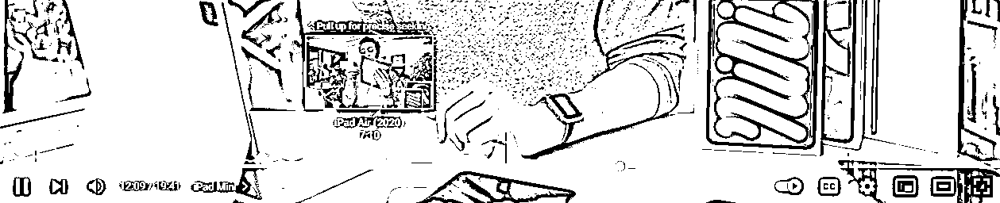  <ne-h5 id="848ed150" data-lake-id="848ed150"><ne-heading-ext><ne-heading-anchor></ne-heading-anchor><ne-heading-fold></ne-heading-fold></ne-heading-ext><ne-heading-content><ne-text id="u424e0c70" ne-bold="true">（9）结尾引导</ne-text></ne-heading-content></ne-h5> <ne-p id="ufd4f85f1" data-lake-id="ufd4f85f1"><ne-text id="u3a563044">在视频的结尾，最好在制作的时候就做一个模板结尾。这个样子，视频浏览完后，你可以推荐其他的视频给到这个用户。</ne-text></ne-p> <ne-p id="u1cfb8946" data-lake-id="u1cfb8946"><ne-card data-card-name="image" data-card-type="inline" id="stvsF" data-event-boundary="card">  <ne-p id="udb1b1a0d" data-lake-id="udb1b1a0d"><ne-text id="ufd3b6d13">否则让机器来推荐的下一个视频，可能就不是你的视频了。</ne-text></ne-p> <ne-p id="u2a297b9d" data-lake-id="u2a297b9d"><ne-text id="ub9ecd7b2">这里还可以加关注，一定要做。</ne-text></ne-p> <ne-p id="ua84f5e6e" data-lake-id="ua84f5e6e"><ne-text id="u3de92152">我们的点击率在</ne-text><ne-text id="uf234dc10" ne-bold="true">5~10%。</ne-text></ne-p> <ne-h5 id="30a3cdb6" data-lake-id="30a3cdb6"><ne-heading-ext><ne-heading-anchor></ne-heading-anchor><ne-heading-fold></ne-heading-fold></ne-heading-ext><ne-heading-content><ne-text id="u622e9e98" ne-bold="true">（10）稳定发布频率</ne-text></ne-heading-content></ne-h5> <ne-p id="u18d5d1d7" data-lake-id="u18d5d1d7"><ne-text id="u9d0ff460">如果可以，最好保持一个固定时间发布，比如一月一更，每个月 1 号，15 号等。</ne-text></ne-p> <ne-p id="u3ee2497a" data-lake-id="u3ee2497a"><ne-text id="u395f387f">一周一更，你可以固定在周三，周五，或者其他日子。</ne-text></ne-p> <ne-p id="u59d44b5d" data-lake-id="u59d44b5d"><ne-text id="u6afcef63">我们测试出来，有些日子视频观看量就是低，在前期的时候避免那几天发视频。在你能接触到最多用户的那天发视频，对前期播放量影响是巨大的。</ne-text></ne-p> <ne-h5 id="b45d8251" data-lake-id="b45d8251"><ne-heading-ext><ne-heading-anchor></ne-heading-anchor><ne-heading-fold></ne-heading-fold></ne-heading-ext><ne-heading-content><ne-text id="u1e41ceb0" ne-bold="true">（11）直播加成</ne-text></ne-heading-content></ne-h5> <ne-p id="uaf74903e" data-lake-id="uaf74903e"><ne-text id="u719fac0e">在 YouTube 上直播非常重要。直播对你账号的权重的提升不止一点点。</ne-text></ne-p> <ne-p id="uef013f36" data-lake-id="uef013f36"><ne-text id="u8892d085">如果有时间有精力有能力做直播的，我是非常建议大家做直播的。</ne-text></ne-p> <ne-p id="u6a6b57ee" data-lake-id="u6a6b57ee"><ne-text id="u4aad1f04">直播在 YouTube 上流量挺大的，特别是游戏直播，近期世界杯体育内容也有流量加成。</ne-text></ne-p> <ne-p id="u42b04b51" data-lake-id="u42b04b51"><ne-card data-card-name="image" data-card-type="inline" id="zZe5T" data-event-boundary="card">  <ne-p id="u6d836a03" data-lake-id="u6d836a03"><ne-text id="ub62a99b3">直播有几个板块，但凡你上了一个推荐，你的权重就会大幅提升。</ne-text></ne-p> <ne-p id="u94abcccf" data-lake-id="u94abcccf"><ne-text id="ud3223a28">看数据这个账号几乎每天都在播，它占据了 3 个板块的第一位置，流量加成不是一点点。</ne-text></ne-p> <ne-p id="u96835d80" data-lake-id="u96835d80"><ne-card data-card-name="image" data-card-type="inline" id="dWlG9" data-event-boundary="card">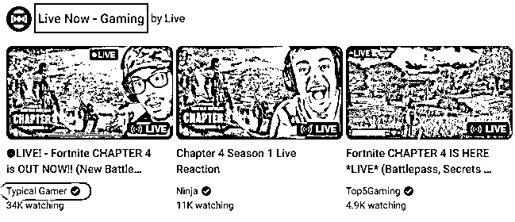  <ne-p id="uc459c5a3" data-lake-id="uc459c5a3"><ne-text id="u8d9e5f6b">还没说完，正在直播里还有小分类，游戏区他也是第一。</ne-text></ne-p> <ne-p id="u346a889e" data-lake-id="u346a889e"><ne-text id="u6aeb7bf4">之前我们项目就是这个效果，正在，过去，将来直播里都是推荐，教育区也是第一。</ne-text></ne-p> <ne-h2 id="567ee583" data-lake-id="567ee583"><ne-heading-ext><ne-heading-anchor></ne-heading-anchor><ne-heading-fold></ne-heading-fold></ne-heading-ext><ne-heading-content><ne-text id="u64ed78cd">四、走前人未走过的路</ne-text></ne-heading-content></ne-h2> <ne-p id="u37eec8ac" data-lake-id="u37eec8ac"><ne-text id="ufd74d35a">做这个项目的时候，没有竞品可以对标，K12 没有那么火，国内巨头也没火。很多时候都需要自己去思考能做些什么，下面两个都是探索性项目，结果带来了 10 倍以上的收益。</ne-text></ne-p> <ne-h4 id="16a46879" data-lake-id="16a46879"><ne-heading-ext><ne-heading-anchor></ne-heading-anchor><ne-heading-fold></ne-heading-fold></ne-heading-ext><ne-heading-content><ne-text id="u4498469b">1\. 发掘市场空白-填补空白-360 度驾考实录</ne-text></ne-heading-content></ne-h4> <ne-p id="u1cb8aa44" data-lake-id="u1cb8aa44"><ne-text id="u260c5611">在我们覆盖的 K12 的内容和校外生活的内容之后，频道保持着稳定的增长。同时也在思考怎么将视频的经验复制到其他技能内容上。</ne-text></ne-p> <ne-p id="u76af992f" data-lake-id="u76af992f"><ne-text id="u89bd71f5">法国路考是上路驾驶 20 分钟，每一个路口遇到的情况都是不可预见的。你要在不同的情况做出正确的操作，没有经历过的都会有未知的恐惧。</ne-text></ne-p> <ne-p id="u187a1d40" data-lake-id="u187a1d40"><ne-text id="u5c41241c">在我看别人跳伞视频的时候想到，能不能通过 360 度的视频来展示整个路考的过程？这样用户可以直接看到整个考试过程中发生了什么？为什么会这样做？如果一遍没明白，还可以回头不停地看。</ne-text></ne-p> <ne-p id="u357d5eb8" data-lake-id="u357d5eb8"><ne-text id="uaa8893e6">提出想法之后领导也表示非常感兴趣，直接开始测试。</ne-text></ne-p> <ne-quote id="u2df61ab1" data-lake-id="u2df61ab1"><ne-p id="u47826fad" data-lake-id="u47826fad"><ne-text id="uf1037e0e">对于这种测试项目，通常都是没有太多预算的。先买了市面上当时为数不多的 360 度相机，能用，但是效果一般，只是为了先看一看可行性。</ne-text></ne-p> <ne-p id="u480fda6d" data-lake-id="u480fda6d"><ne-text id="u8446f677" ne-bold="true">难点</ne-text><ne-text id="ueedcb14c">：要解决的安装摄像机的问题。</ne-text></ne-p> <ne-p id="u1783a675" data-lake-id="u1783a675"><ne-text id="ucb6f3ecb">相机装在车外，虽然能够看清楚所有的路况，但是看不到个人的反应，无法看到考官是如何作出准确的判断和对应的操作。</ne-text></ne-p> <ne-p id="uc821efc8" data-lake-id="uc821efc8"><ne-text id="ubcbf0770">相机装在车内。如何固定缓震，收音都是问题。用的都是私人的车，没有办法给车进行内部的改造。</ne-text></ne-p> <ne-p id="u4191c098" data-lake-id="u4191c098"><ne-text id="uee65f893">后来收音使用了另一套系统，后期制作的时候再加进去，经过一番折腾测试得到了可用的结果。</ne-text></ne-p> <ne-p id="u5df9e32b" data-lake-id="u5df9e32b"><ne-text id="u202383b2">拿着可用的结果，找领导批了新的预算，买了一个品质好一点的 360 相机，开启了疯狂录制模式。</ne-text></ne-p> <ne-p id="u487d330a" data-lake-id="u487d330a"><ne-card data-card-name="image" data-card-type="inline" id="TIgvc" data-event-boundary="card">  <ne-p id="u4ed8730a" data-lake-id="u4ed8730a"><ne-text id="u570a4840">最后的结果是，我们是市场上</ne-text><ne-text id="u658a7bde" ne-bold="true">第一个也是唯一一个</ne-text><ne-text id="u0365c363">做到 360 度驾考视频实操内容的。直接将其他竞争对手甩在了身后。</ne-text></ne-p> <ne-p id="u5651f76a" data-lake-id="u5651f76a"><ne-text id="ufa1996e6">这个视频在我们的网站和 APP 都做了内嵌。用户在浏览视频的时候，直接给 YouTube 反向增加流量，提升视频权重。</ne-text></ne-p> <ne-p id="u4bca8204" data-lake-id="u4bca8204"><ne-text id="uac8a2c3a">Google Play 的产品经理看到我们 App 更新时，觉得这个内容非常棒。直接给我们做了</ne-text><ne-text id="u288c5bac" ne-bold="true">6 周的首页推荐</ne-text><ne-text id="u6efff954">。</ne-text></ne-p> <ne-p id="u4ae6ea49" data-lake-id="u4ae6ea49"><ne-text id="u50d5466f">App Store 也有推荐，力度小于 Google Play。</ne-text></ne-p> <ne-p id="u10a5fba4" data-lake-id="u10a5fba4"><ne-text id="udf1a022c">App 的下载量大幅的提高，注册用户激增，比我们在 Facebook 投广告换来的用户要便宜的多。</ne-text></ne-p> <ne-p id="u9f3d2431" data-lake-id="u9f3d2431"><ne-text id="u956ea855">除开人力成本，这个项目单独采购设备的费用只花了不到 1 万块，其他都是现成的设备。</ne-text></ne-p> <ne-p id="u41d19396" data-lake-id="u41d19396"><ne-text id="uaf6eaad2">最后的成品视频最少有 20 条，每一条的成本只有 500 块。</ne-text></ne-p> <ne-p id="u762dec3a" data-lake-id="u762dec3a"><ne-text id="u5f0aa3d7">现在回头看在制作上还有不少问题需要改进，但在当时我们完全是瞎子过河，边做边优化，没有案例参考，也不知道是否会成功。</ne-text></ne-p> <ne-h4 id="e13277f4" data-lake-id="e13277f4"><ne-heading-ext><ne-heading-anchor></ne-heading-anchor><ne-heading-fold></ne-heading-fold></ne-heading-ext><ne-heading-content><ne-text id="u942a411f" ne-bold="true">2\. 法国高考直播助力、媒体联合</ne-text></ne-heading-content></ne-h4> <ne-p id="u55f0e53a" data-lake-id="u55f0e53a"><ne-text id="u31f8fd56">前面不是说我们覆盖了 K12 的教育内容。当时发现一个问题，就是很多学生来看了之后，他也不说话，他看了就走了，视频有浏览量但是没有互动。</ne-text></ne-p> <ne-p id="uce499125" data-lake-id="uce499125"><ne-text id="ufe611813">为了提高互动率，让整体的数据更好看，我们就开了几期直播。</ne-text></ne-p> <ne-quote id="u767d9812" data-lake-id="u767d9812"><ne-p id="uedcfc706" data-lake-id="uedcfc706"><ne-text id="ua61d19df">直播的流程非常简单，我们会提前放出预告给大家，说我们周几几点会上线，请大家预约。</ne-text></ne-p> <ne-p id="u6f9a05e8" data-lake-id="u6f9a05e8"><ne-text id="u8d07a02c">这里就是一个重点了，你可以提前把你的直播预告给放上，让人预约。从你直播放上去的那一刻，它就已经进入了 SEO 的环节了。</ne-text></ne-p> <ne-p id="u06fe650e" data-lake-id="u06fe650e"><ne-text id="u4c3a63b8">它会在 YouTube Live 里面进行登记。如果你的 SEO 做的好，账号权重高的话，你是可以直接在机器生成的 LIVE 推荐里面看见你的直播预告的。</ne-text></ne-p> <ne-p id="u420fcb5f" data-lake-id="u420fcb5f"><ne-card data-card-name="image" data-card-type="inline" id="UO1XG" data-event-boundary="card">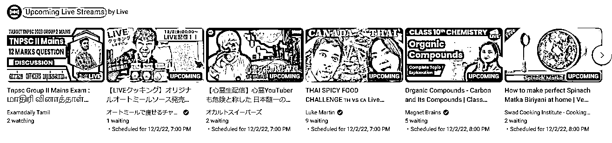  <ne-p id="u2f4793e1" data-lake-id="u2f4793e1"><ne-text id="u8b5a5db9" style="color: rgb(89, 89, 89);">最高的时期，6 个里面有 5 个都是我们账号的直播。</ne-text></ne-p> <ne-p id="uea3861e5" data-lake-id="uea3861e5"><ne-text id="udeb203b0">开播初期我们固定在周三下午 3~5 点，这个时候是学生没有课的。</ne-text></ne-p> <ne-p id="uf80b7d95" data-lake-id="uf80b7d95"><ne-text id="u46741a18">在前期数据确实一般，因为大家都偏向于出去玩，没有课的时候你肯定是不会想着说来上网课的。</ne-text></ne-p> <ne-p id="u2fc0eec2" data-lake-id="u2fc0eec2"><ne-text id="u60af9e45">随着考试期的临近，我们的数据越来越好。</ne-text></ne-p> <ne-p id="u3c3448b4" data-lake-id="u3c3448b4"><ne-text id="uc87430ef">每一门课设定的内容只会播一个小时，老师大概会讲 30 分钟到 40 分钟左右的内容。</ne-text></ne-p> <ne-p id="ufcf91b16" data-lake-id="ufcf91b16"><ne-text id="u7bb9f99d">中间会穿插一两个提问。最后会收集大家的问题，统一进行回答，慢慢的互动率就上来了。</ne-text></ne-p> <ne-p id="uef19d762" data-lake-id="uef19d762"><ne-text id="u3324a987">到后期在线人多了，开播已经没办法看清留言，必须得安排一个人筛选问题来回答。</ne-text></ne-p> <ne-p id="uf848084c" data-lake-id="uf848084c"><ne-text id="u403a26ad">直播人员配备不是很多，一个负责技术。一个人负责收集提问，回答问题，社交媒体的运营。</ne-text></ne-p> <ne-p id="ua57ff774" data-lake-id="ua57ff774"><ne-text id="uf0f603d6">项目负责人负责对整体节奏的把控，数据的分析，人员的调度。</ne-text></ne-p> <ne-p id="uee92af87" data-lake-id="uee92af87"><ne-text id="u9ca950a0">整个项目从考试日期的前两个月就开始执行了，考前一个月，电视台有一个记者在做关于新媒体教育的内容。说想要到我们公司来采访，看一看我们的运作模式。</ne-text></ne-p> <ne-p id="u808cf9c5" data-lake-id="u808cf9c5"><ne-text id="u3f4a06ef">于是我们就接受了法国电视台的采访，一不小心热度又上去了，带来了新一批的流量。</ne-text></ne-p> <ne-p id="u2b1638bf" data-lake-id="u2b1638bf"><ne-text id="u48273724">后面接到了电视台的合作计划，互做推广，流量置换，外加他们的媒体报道。这个合作是双赢，双方没有太多的额外支出，但电视台给我们带来了平日没有触达的传统媒体流量，我们也给电视台形象做了提升。</ne-text></ne-p> <ne-p id="u5240eaa3" data-lake-id="u5240eaa3"><ne-text id="u1c86dbc8" ne-bold="true">3\. 前面讲到了要深耕，要做到你在的领域的最好。</ne-text></ne-p> <ne-p id="uac21c7d6" data-lake-id="uac21c7d6"><ne-text id="u712509e6">可能看到这个地方觉得说高考前的直播复习就已经结束了，但实际上并没有。作为媒体，我们的目标是获取考试期间所有的流量。</ne-text></ne-p> <ne-p id="ua2703324" data-lake-id="ua2703324"><ne-text id="ub71044db">于是继续加码，和传统媒体竞争。</ne-text></ne-p> <ne-p id="ub192070c" data-lake-id="ub192070c"><ne-text id="ub237a212">考试当天安排有一队人直接在学校外面对学生进行采访。11:30 结束内容 12 点 30-13：00 就上线。获取第一批流量。下午 4 点半重复一遍。</ne-text></ne-p> <ne-p id="uaf07392a" data-lake-id="uaf07392a"><ne-text id="u705df518">这一块就是直击考试当天的内容，做实时报道的报道。因为团队小的优势，内容上线比电视台还要快。</ne-text></ne-p> <ne-p id="u175e7aa6" data-lake-id="u175e7aa6"><ne-text id="uc98ad8fe">合作的老师直接远程改卷子，能来直播间的，当天下午的科目考完后直接开直播解答。</ne-text></ne-p> <ne-p id="ufa8be7d9" data-lake-id="ufa8be7d9"><ne-text id="ud1b7088c">解答完了之后，又会有第 2 天的考前科目重点复习。做到了整个考试辅导前中后的闭环。</ne-text></ne-p> <ne-p id="u46679b60" data-lake-id="u46679b60"><ne-card data-card-name="image" data-card-type="inline" id="odBAf" data-event-boundary="card">  <ne-p id="u9637150d" data-lake-id="u9637150d"><ne-text id="u18b70d4e">小成绩就是，做到了整个考试期间 YouTube 直播推荐，Google 新闻排名前 3（最高第 1，基本没掉出前 5），我们牢牢的掌握了流量的入口。</ne-text></ne-p> <ne-p id="u98307ed5" data-lake-id="u98307ed5"><ne-text id="u49d8e8a6">只要你搜 K12 的内容，复习的，解答的，基本上就是我们的内容，甚至在 Google 搜索里 YouTube 直播的排名比我们网站的还要高。</ne-text></ne-p> <ne-p id="ubfa73d0f" data-lake-id="ubfa73d0f"><ne-card data-card-name="image" data-card-type="inline" id="vkwsm" data-event-boundary="card">  <ne-p id="u9a21fefc" data-lake-id="u9a21fefc"><ne-text id="u26b8148a" ne-italic="true">Google 新闻栏的位置排序更高</ne-text></ne-p> <ne-p id="u2506679f" data-lake-id="u2506679f"><ne-text id="u9e3c2d41">纯靠自然流量完成了霸榜，过去所有的积累都在这个流量高峰期兑现。</ne-text></ne-p> <ne-p id="u541e4d59" data-lake-id="u541e4d59"><ne-text id="uf3c40ca6">回顾这一段经历的时候我发现每一次大的突破，都源于做了之前没有人做的事，在做之前，并没有人知道结果会是怎样。</ne-text></ne-p> <ne-p id="u517a67a1" data-lake-id="u517a67a1"><ne-text id="u95ac9e27">那个时候心很静，就是把每一步都做好，边做边学习，边做边优化，做着自己能做到的最好，自然结果也不会差。</ne-text></ne-p> <ne-p id="uf19be235" data-lake-id="uf19be235"><ne-text id="uffc8361d">对于我们的目标而言，慢就是快。</ne-text></ne-p> <ne-p id="uc9abb670" data-lake-id="uc9abb670"><ne-text id="ufd4f8a58">希望我的这一段经历对你能有一点点的启发。</ne-text></ne-p> <ne-h1 id="25f9c7fa" data-lake-id="25f9c7fa"><ne-heading-ext><ne-heading-anchor></ne-heading-anchor><ne-heading-fold></ne-heading-fold></ne-heading-ext><ne-heading-content><ne-text id="u40309b59">总结</ne-text></ne-heading-content></ne-h1> <ne-p id="u524fac0a" data-lake-id="u524fac0a"><ne-text id="ubf083d85">本周的生财周报精华帖比较多，大家可以根据目录里点击直达跳转。</ne-text></ne-p> <ne-p id="uf5c703df" data-lake-id="uf5c703df"><ne-text id="u36347b67">说实话小懒手动整理得快吐了，下次周报小懒要写个脚本自动整理了。</ne-text></ne-p> <ne-p id="u7945b8a0" data-lake-id="u7945b8a0"><ne-text id="u29a1fa4a">本来想整理的时候也是顺便让自己去看看项目，不过这种重复性操作会要了小懒的耐心。</ne-text></ne-p> <ne-p id="u4a372dfc" data-lake-id="u4a372dfc"><ne-text id="udfe74b11">早上给大家更新了 80 多条生财风向标，加上之前的也有近三百条风向标资源了。</ne-text></ne-p> <ne-p id="ue9b40c23" data-lake-id="ue9b40c23"><ne-text id="ue4264463">希望大家从中找到商机，赚到钱~</ne-text></ne-p> <ne-p id="u9afcfe8d" data-lake-id="u9afcfe8d"><ne-card data-card-name="image" data-card-type="inline" id="lZEeq" data-event-boundary="card">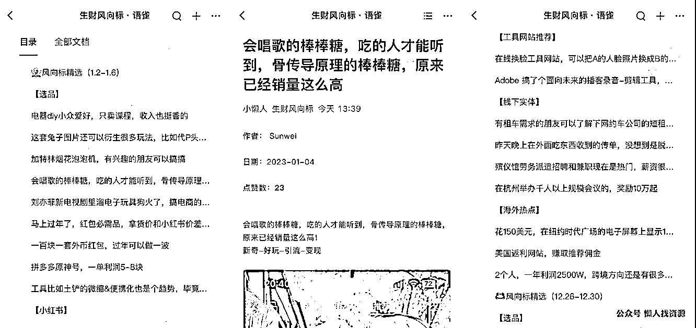  <ne-p id="uc8d25358" data-lake-id="uc8d25358"><ne-text id="u6445624c">本周生财周报除了离线版，小懒也会整理到在线版合集里，方便大家检索和手机上查看。</ne-text></ne-p> <ne-p id="uec34aa54" data-lake-id="uec34aa54"><ne-text id="u8f9fea76">更多内容，见咱们</ne-text><ne-text id="u4da1aa8d" ne-italic="true">懒人专属群</ne-text><ne-text id="u7716fcef">的群文件和群公告！</ne-text></ne-p> <ne-p id="u54967660" data-lake-id="u54967660"><ne-text id="uf7be5747">小懒爱你们！</ne-text></ne-p> <ne-p id="udba828ee" data-lake-id="udba828ee"><ne-card data-card-name="image" data-card-type="inline" id="KPTHX" data-event-boundary="card"></ne-card></ne-p></ne-card></ne-p></ne-card></ne-p></ne-card></ne-p></ne-card></ne-p></ne-quote></ne-card></ne-p></ne-quote></ne-card></ne-p></ne-card></ne-p></ne-card></ne-p></ne-card></ne-p></ne-card></ne-p></ne-card></ne-p></ne-card></ne-p></ne-card></ne-p></ne-card></ne-p></ne-card></ne-p></ne-card></ne-p></ne-card></ne-p></ne-card></ne-p></ne-card></ne-p></ne-card></ne-p></ne-card></ne-p></ne-quote></ne-card></ne-p></ne-card></ne-p></ne-card></ne-p></ne-card></ne-p></ne-card></ne-p></ne-card></ne-p></ne-card></ne-p></ne-card></ne-p></ne-card></ne-p></ne-card></ne-p></ne-card></ne-p></ne-card></ne-p></ne-card></ne-p></ne-quote></ne-card></ne-p></ne-card></ne-p></ne-card></ne-p></ne-card></ne-p></ne-quote></ne-card></ne-p></ne-card></ne-card></ne-p></ne-card></ne-p></ne-card></ne-p></ne-card></ne-p></ne-card></ne-p></ne-card></ne-p></ne-card></ne-p></ne-card></ne-p></ne-card></ne-p></ne-card></ne-p></ne-card></ne-p></ne-card></ne-p></ne-card></ne-p></ne-card></ne-p></ne-card></ne-p></ne-card></ne-p></ne-card></ne-p></ne-card></ne-p></ne-card></ne-card></ne-p></ne-card></ne-p></ne-card></ne-p></ne-card></ne-p></ne-card></ne-p></ne-card></ne-p></ne-card></ne-p></ne-card></ne-p></ne-card></ne-p></ne-card></ne-p></ne-card></ne-p></ne-card></ne-p></ne-card></ne-p></ne-card></ne-p></ne-card></ne-p></ne-card></ne-p></ne-card></ne-p></ne-card></ne-p></ne-card></ne-p></ne-card></ne-p></ne-card></ne-p></ne-card></ne-p></ne-card></ne-p></ne-card></ne-p></ne-card></ne-p></ne-card></ne-p></ne-card></ne-p></ne-card></ne-p></ne-card></ne-p></ne-card></ne-p></ne-card></ne-p></ne-card></ne-p></ne-card></ne-p></ne-card></ne-card></ne-p></ne-quote></ne-quote></ne-quote></ne-card></ne-p></ne-card></ne-card></ne-p></ne-card></ne-p></ne-card></ne-p></ne-card></ne-p></ne-card></ne-card></ne-p></ne-card></ne-card></ne-card></ne-p></ne-card></ne-p></ne-card></ne-p></ne-card></ne-card></ne-card></ne-p></ne-card></ne-p></ne-card></ne-p></ne-card></ne-p></ne-card></ne-p></ne-card></ne-p></ne-card></ne-p></ne-quote></ne-card></ne-p></ne-card></ne-p></ne-card></ne-hole></ne-card></ne-p></ne-card></ne-p>