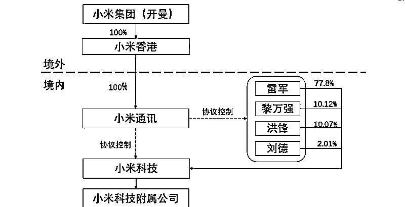
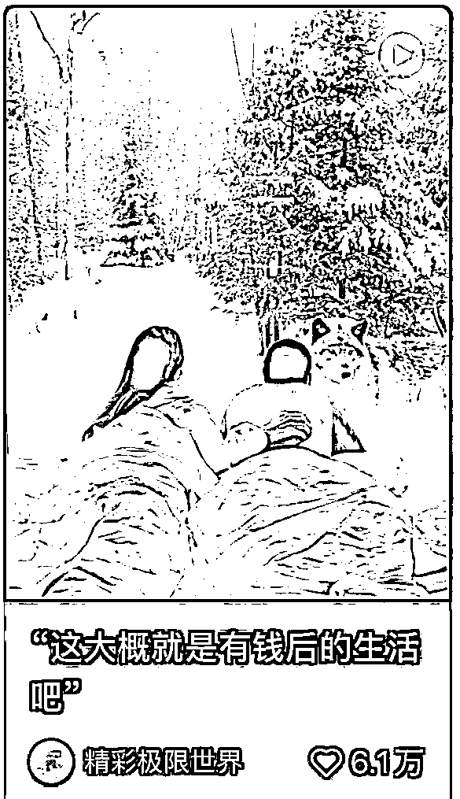
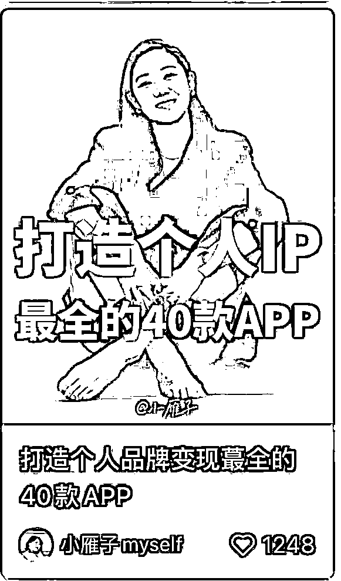

# 230104 懒人生财周报

> 原文：[`www.yuque.com/for_lazy/money/efgciaa7settwksk`](https://www.yuque.com/for_lazy/money/efgciaa7settwksk)

# 懒人生财周报 

整理日期：2023 年 1 月 04 号 

懒人专属群的群友大家好。小懒继续给大家带来生财周报～ 

生财周报来自某年费 3000 多的付费社群资源帖。 

本文档为懒人专属群内部分享，懒人手动整理。 

一些帖子跳转飞书查阅，如需破解复制权限，见这篇文章： 

[解除复制限制！](https://mp.weixin.qq.com/s?__biz=MzI1NjAxOTI0Ng==&mid=2647895304&idx=1&sn=df7e3e36c3bf503a2513f8b4c6636d3d&chksm=f20a1349c57d9a5fccaa92c5068cb3e492ba9e3ebb178584d018892c0211214dc9d112c1f73c&token=37691864&lang=zh_CN#rd) 

往期的生财周报合集（含在线版和离线版），见专属群 Q 群文件和群公告。 

希望大家有收获~ 

 

标题加了(精华)的表示精华贴，前面为截至今日的点赞数。 

以下是目录，内容有些多。大家可以挑兴趣的内容阅读。 

[懒人专属群更新记录（点此跳转）](https://lazybook.netlify.app/#/blog/record2) 

# 【目录】 

在线版目录见左侧大纲 

# 【生财认知】 

## （262 赞）《 送你我有感触的 10 句话，告别 2022》 

今年是 2022 年的最后一天了，这一年真的有点一言难尽。 我不知道说些什么好，就送你我有感触的 10 句话，来告别它吧。 

第一句：进化论是地球上唯一可靠的成功学。 今天的小马宋，和一年前的小马宋已经不同了，因为 2022 我们的生存环境发生了变化，如果不能进化，我们就会被新环境消灭。 所以我特别同意王立铭老师讲的这句话：进化论是地球上唯一可靠的成功学。同时也向你推荐王立铭老师的《王立铭进化论讲义》。 我说过一个更通俗的比喻，如果海水干涸，最强的鱼也活不下来，但能进化出肺的鱼会活下来。 

第二句：真正的乐观是全然地接受事实和真相。——周航 我很喜欢周航说的这句话，也表达了我自己的看法。 乐观不是对前景永远看好，而是接受事实和真相，如果 2023 年真的也没想象中那么好，那我们依然接受它。 过去 40 年，我们这个国家一直保持高速发展，但我们不能认为这是永远会持续下去的，保持乐观，但要接受现实。祝你勇敢，坚毅，乐观，积极。 

第三句：世界上只有一种真正的英雄主义，就是在认清生活的真相后，依然热爱生活。 这一句，是上一句话的延续，被广为传颂，我就不多解释了。 

第四句：只有创新才能获得超额利润，如果没有创新，你就只能获得平均的企业经营利润，勉强活下去而已。 经济学家熊彼特道出了成功的真相，那些活得好的企业，一定是有创新的企业。 创新不止于技术创新，产品设计、渠道开发、投放方法、传播思路等等都可以做到创新，而只要创新且适合社会需求，你就会获得生存的优势。 

第五句：无论你做什么工作，只要竭尽全力就可以，竭尽全力是最轻松的工作方式。 我是在华楠的公号上偶然读到他记录的一件小事，由此写了一段文字。 其实我们几乎所有的人，做事都很难做到竭尽全力。想想看，你今年的工作，是不是都有可改进的空间？或者说让另一个更厉害的人做，他会比你做得更好？ 有时候我们不必去拼天分，我们在很多事情上，只要够勤奋、够用心就可以了。相关文章：人生的差距，就这么拉开了 

第六句：不要羞于提出那些答案似乎显而易见的问题。 关于提问，我有很多看法。 王慧文说的，是关于创新的话题，答案显而易见的问题，有可能就是创新的机会。 而我想说的另一个态度是，不要羞于提出那些会让自己显得很白痴的问题。 很多人碍于面子，提问的时候总想表现自己很厉害很懂，其实在真正的行家面前，这不仅会让你显得不懂，还显得很虚伪。 不懂就问，你才会逐渐成长。假装很懂，你会越来越不懂。 还有一种是，大部分人在会议上的发言，仅仅是为了表示自己还在，他们根本不理解自己提了什么问题，也不明白自己在说什么。 不要做这种人。 

第七句：做什么事，不能基于美好的愿望，而是要基于能力和资源，老鹰可以吃到兔子，鲨鱼却吃不到，但鲨鱼不应该羡慕老鹰，而是应该努力捕捉更多的鱼。 这是我的新书《营销笔记》在得到电子书上被划线最多的一句话，目前有 2512 位读者标注了这句话。 其实中国古人早就说过，叫做不外慕。 曾经有朋友问我，你为啥不去做一个品牌？其实这里就犯了两个思考的错误。第一个，他觉得咨询公司的品牌不是品牌。第二个，他觉得你什么都可以干。其实我就擅长干咨询，我的能力并不能让我去经营好一家实体企业。 我们每个人，都要审视自己的能力和资源，先确定自己适合做什么，能不能给社会带来价值。然后就倾注一生的精力和实力，把这件事做好就是了，你做的时间（本质在于有效和创新）越长，别人就越干不过你。 最怕的是，看到某人在哪里赚到钱了，然后就不笃定了，又想去干别的，最后啥事都干不好。 

第八句：一个问题的解决，总是依赖于与问题相邻的更高一级的问题的解决。 第九句：营销的营，首先是经营的营。 这两句话，我放在一起来聊。 我举一个简单的例子，比如我买了一件很酷的衣服，但我穿上它根本就不好看，那是衣服的问题吗？不是。因为我长得不够好看，这就是更高一个层级的问题，跟衣服没关系。 我如果想变成一个很帅的人，可能需要锯腿增高，可能需要整容。 企业的问题也是一样的。看起来似乎是销售不力，但本质上可能是产品技术不足，产品技术不足，本质上可能是过去十年一直不重视技术研发，而只重视销售。 我们虽然是营销咨询，但我一直提醒我们同事的是，营销问题上一个层级是企业经营问题，你首先要理解经营的逻辑才可以。 比如有个餐饮品牌找我们，第一次见面我就知道了，因为它是一个特别地域性的产品，在外地不能被接受，所以它走不出一个地方，不是别的，是产品选择问题。 

你要深刻理解企业的经营，才能从更高一个层级上去看营销。 第十句：现场有神明 很多人听说过这句话，但是，仅仅是听说而已。 我们的产品，其实是在销售和消费的现场，但有多少产品经理是在自我意淫中创造产品的呢？太多了。他们从不去看顾客使用中发生了什么。 卖场发生了什么？工厂发生了什么？工人宿舍里发生了什么？旅客洗澡的时候发生什么？ 我在某酒店洗澡的时候，那个按钮不能调节水量，我在 12 级暴风雨中洗了个澡。 

但真的没有人关心。 据说过去微软的工程师都是最好的电脑配置，但是，他们在发新版的时候，就没有考虑过更差的电脑配置能不能流畅运行？这就是没有到达现场，看顾客。 如果我们同事不去南城乡北京南站那家店做服务员，他就不会发现，顾客最想知道的是几分钟能出餐，因为坐火车的顾客会赶时间。 

稻盛和夫今年去世，但他的管理思想朴素而伟大。 最后，祝大家 2023 新年快乐。 

## （107 赞）《真传一句话，假传万卷书！读生财精华帖整理出来的 50 条认知思维》 

前两天看到亦仁老哥谈到一个问题：现在星球的文章普遍都太长了，动辄就上万字，作者写的很累，用户看的也很累，读的多了确实深同感受。 

而且会劝退一些，本来很有干货，但是并不善于长篇大论的作者，看别人都是上万字，自己写个千把字，都不好意思发出来。 

本来生财的第一篇文章，我也是打算以万字干货长文跟大家见面，结果写了 6000 多字就夭折了，对于一个从来没有写过文章的人来说，5000 字都是一个不小的门槛（后面会将内容浓缩重写后再发布）。 

“真传一句话，假传万卷书” 

一般看到好的文章我都会思考后做精华总结，争取做到看到这一两句话，就能想到整个文章的内容框架。 

毕竟学习不是为了饱读诗书，而是当你遇到这个问题的时候能快速拿出来用，能做到学以致用的内容才是好内容。 

下面这 50 多条认知思维，都是思考大量优质文章中，浓缩出来的一两句话，可谓是精华中的精华！ 

1.把精力投入到解决具体的目标上，钱能解决的问题，尽量不要亲力亲为，避免精力被浪费在低价值的事情上！ 

2.给自己做减法：从今天起，试着想一下“还能减掉什么”。 

3.不要追求完美，用最快速度跑通盈利模型。（先用最简单的方式去验证商业模式是否正确，也就是完成第一单） 

4.学以致用！知识一定要转化为生产力，要根据自己现阶段的情况，来学习当下最需要的知识（边学习，边思考，边实战！） 

5.致富途径：寻找需求，解决需求，并实现规模化。 

6.要从第一个粉丝就开始变现，流量就像是一张门票，有效期内你不用掉，就会变成一张废纸。能够变现的流量才叫流量，不能变现的流量只能叫做数据。 

7.把 1 个号做到月入 10 万很难，但是把月入 3000 的号复制 30 多遍不难，把盈利的事情重复做。找到一点点能够获利的机会，再通过放大，将它变成个大生意，哪怕只能赚一元钱，只要他可以无限放大，那他就是一个年赚百万的项目！ 

8.项目不重要，流量才重要。找到“产品”以后，每天应该花 90%的精力去引流和成交。 

9.员工无法替代的部分，别人短时间无法超越的地方，就是你的壁垒。 

10.成年人的世界只有筛选，不教育。不要做教育客户的事情，吃力不讨好！ 

11.做有沉淀的事情，不然永远都是从 0~1。 

12.赚钱，就是在确定目标后，在实践中解决问题，你的所有行动都要以目标为导向，带着问题去找答案。 

13.只要满足用户需求，就能赚到钱，你需要做的就是选谁作为付款者，以及怎么打动付款者，这个需求可以是物质需求，也可以是精神需求。 

14.赚钱的本质是交易，交易的本质是满足用户需求。 

15.想要达到一个目的，一定要做和这个目的指向性一致的事情，然后疯狂的堆执行力，快速试错。 

16.专注于一个平台，一个定位，快速试错，努力做到极致，千万别什么都想要！ 

17.低门槛意味着人人都可以做，基本就是见光死，如果随便找个人都能做，那你的优势又在哪里？有门槛是好事，至少可以过滤一半的人，需要买样品就要买，该花的就要花！ 

18.不要做大而全，而要做小而精，一定要做垂直细分领域，不然用户来了，你都不知道用户有什么需求，那你怎么变现？ 

19.以结果为导向，逆向思维需要的步骤，拆解出最小行动单元。正常流程：定位→内容→流量→产品→变现，我们可以以结果倒推内容：变现→定位→产品→内容→流量。先找买家，再找产品！（也可以理解为先找需求），一定要先考虑好怎么变现，然后再去开展业务，一定会事半功倍。 

20.产品的价格，取决于产品在客户心中的价值，与其降价，不如多想想客户为什么不愿意给你付钱？想办法让客户觉得产品值。 

21.你觉得有价值≠用户觉得有价值，要先验证最小 MVP 

22.爆过的内容一定是可以再爆的，内容创作不要靠灵感，要靠爆款模板！ 

23.要想持续输出内容，就得考虑如何降低内容生产的时间成本与金钱成本，不然再厉害的人也会被掏干。 

24.依靠出租自己的时间是很难致富的，要想获得财富，就要充分利用杠杆效应，比如劳动力，自媒体（无限放大自己的影响力），和复制边际成本几乎为零的产品（软件，课程，虚拟产品等） 

25.跟着千万赚百万，谁挣钱就向谁学习，谁赚钱就抄谁！ 

26.资产指的是在你睡觉时仍能为你赚钱的财产，学会让钱为你赚钱！ 

27.互联网引流核心就两个字：免费！免费提供用户所需要的，无论是内容还是其他，免费一定是最有效的方法。 

28.找到属于自己的杠杆，才能利用有限的时间和精力，产生巨大的影响，比如个人 IP。 

29.把时间花在哪里，结果就会出在哪里，制定一个日常任务清单，先从养成习惯开始。 

30.一个人的时间精力有限，要把精力放在关键的 20%事情上！ 

31.人都是利益驱动的动物，动力不足的时候，就要看这件事背后可以给你带来价值。 

32.再好的产品都不能讨好所有人，只要讨好肯掏钱的就好了。 

33.不要总想着长期主义，钱不是靠一辈子去赚的，而是抓住机会，一两年就赚到一辈子花不完的钱。 

34.想的多了全是问题，做的多了全是答案。把精力投入到解决具体的事情上，少想一些过于宏大抽象的事。 

35.提炼客户群体最需要解决的 10 个大问题，并把每个大问题拆解为 10 个小问题，得到 100 个问题，你和你的团队，最该花时间的地方，就是这 100 个小问题。 

36.在没有产品的时候，快速找到几个渠道去做代理，别人的产品就相当于自己的产品，用来快速的验证项目的逻辑。 

37.信息差永远存在，你需要做的就是把 A 平台的产品，通过 B 平台展示给需要的人！ 

38.设立一个真正能激发你动力的目标，兴趣是行动的第一驱动力！ 

39.爆款内容+新的展现方式=原创，就好比鸡尾酒一样，本身是不生产酒的，但是把各种酒混合在一起，就变成了鸡尾酒，价格也翻了好几倍。 

40.玩法可能过时，但是内容是永远不会过时，要想走的长远，我们就要抓住那些永远不会变得东西：内容！ 

41.时间成本永远是最贵的成本，钱可以再赚，人生不能重来，今年没了，那就是没了。 

42.大部分‮的真‬不需要很极‮的端‬努力和天赋，只需要每天比‮人别‬努力一点，就可以超过 80%的对手。 

43.适合自己的才是最好的！大家都在说 XX 的赚钱时候，你就一定适合做 XX 吗？ 

44.会技术的人太多了，我们没必要把时间浪费在学习技术上面，专业的事情交给专业的人去做就行了！ 

45.赚大钱和赚小钱需要付出的时间和精力，其实是没多大区别的，内容、引流、成交，该有的步骤一个都少不了，那何不直接做更有价值的事情呢？ 

46.要站在巨人的肩膀上成长：无论做什么领域，不要上来就想着创新，想着颠覆，国内用户过亿的手机软件，有几个不是模仿的？就像做短视频一样，你不需要去刻意创新什么，同样的内容，你只需要换一种展示方式即可。 

47.成交的核心：需求、信任、购买力。成交的前提是信任，信任的前提是你能提供用户需要的价值，解决用户的需求！ 

48.想赚多少钱，就要找到能赚多少钱的需求，想赚 100 万，就要找到能赚 100 万的需求，想赚 1000 万就要找到能赚 1000 万的需求！ 

49.大道至简，越简单的东西越容易成功，赚钱就是锁定一个需求，锁定一个流量渠道，单点循环，做到极致。 

50.放在最后：真诚是最好的必杀技！ 

阅读不是为了记住文章中所有的知识，只要有几个观点能够引发自身思考，能让自己发生实际行动就足够了，不然会永远停留在“懂得很多道理，却依然过不好这一生”的焦虑里。 

这 50 条思维，每一条都可以单独拿出来单独写一篇万字长文，但是真的有必要吗？ 

还是那句话：“真传一句话，假传万卷书” 

ps：衷心感谢大家无私的输出，才有了这篇“鸡尾酒”文章。 

# 【生财技能】 

## （41 赞）《 以小米集团为例：海外布局之红筹架构与 VIE 架构 V1.0》 

#法财税人，创富兵器库# 商业案例库 4# 

以小米集团为例：海外布局之红筹架构与 VIE 架构 V1.0 一家企业何时走向成熟？解决每个阶段的核心任务，是趋向成熟的标志。 

无论是基于财税的业务合规，还是服务于战略的顶层架构合规，架构都不可或缺。 这一篇重新梳理了小米架构背后的逻辑，穿透架构往往能理清商业布局背后的股权、税务与业务版图。 

【腾讯文档】创业兵器库：海外布局之红筹架构与 VIE 架构（以小米公司为例）V1.0 20221226： 

[https://docs.qq.com/doc/DSmthVHdmd1daa0l2](https://docs.qq.com/doc/DSmthVHdmd1daa0l2) 

 

## （70 赞）《做内容要做渣男》 

哈喽大家好，我是劲猫，曾经 20 分钟做出过 10 万赞藏大爆文，1 万粉丝变现 20 万。 

听生财小伙伴说大家在共读我之前写过的一篇文章 

[《自媒体小白做小红书 3 个月，从 0 涨粉 8000 粉，变现 5 万》](https://articles.zsxq.com/id_cie8wcuzjswl.html) 

还有点不好意思。有种丑媳妇见公婆的感觉，哈哈。 

话不多说，今天开始我们的分享《做内容要做渣男》 

为什么会想要分享这个主题呢，有两个理由。 

第一个，在现实生活中，我发现我的那些拥有渣男思维的女生朋友，感情生活都一般都比较愉悦，她们不会为一个人停留太久，如果另一半有伤害她的苗头，她会立马终止这段感情，丝毫不拖泥带水。 

拜拜就拜拜，下一个更乖。 

而另外那些为感情生活付出全部，一心一意为了另一半，甚至放弃很多的朋友，却总是遇到渣男，一次次被伤害。 

第二个理由呢，在自媒体世界里，我同样也发现了很多认真做内容的小伙伴，但他们的内容总是不温不火，花费三四个小时甚至一整天的时间，用心做出一条内容，结果点赞只有几个。 

而有些小伙伴，随手一发的内容，结果就爆了几千甚至几万的点赞。 

这就有点像，你花一整天的时间为你的对象准备了一个丰盛的烛光晚餐，甚至连场景布置，晚餐吃什么都准备好了， 结果你对象觉得你俗套，反而更喜欢中午花 10 分钟给她点了杯星巴克的人。 

怎么样，是不是很气。 

凭什么别人随随便便就几万点赞，暴涨几千粉丝，而你始终停留在原地呢？ 

没关系，不用生气，今天我来分享渣男思维做内容，让你们变成自媒体世界的渣男！ 

# 做渣男第一点：撩完就跑。 

## 戳痒点，意犹未尽 

撩完就跑，只展示结果，要的就是你的目标用户意犹未尽。 

有个定律，叫做峰终定律： 

如果在一段体验的高峰和结尾，体验是愉悦的，那么对整个体验的感受就是愉悦的。 

这就说明，如果我们让目标用户在看我们的内容的开头和结尾（中间内容无所谓），体验愉悦，那么她对我们的内容就会产生好感。 

比如这一篇，展示了有钱人的生活，无边泳池，高楼远望，封面很吸引人，这是第一个开头愉悦点。 

 

结尾的时候也顺利用美妙的画面收尾了。 

尽管中间的内容剪辑很垃圾，甚至模糊不清，但这些都不重要。 

重要的就是开头和结尾的感觉。 

咱们撩到用户的痒点就停，峰终定律，在情绪最高点停止，才能让人意犹未尽，印象最好。 

## 戳痛点，产生追随 

再比如这一篇，做个人 ip 的 40 个 APP。 

 

现在大家都想要做 ip，但是怎么做呢，这就是一个痛点。 

咱们撩完就跑，除了戳痒点之外，还有一个就是戳痛点。 

不过，戳中就要撤，不能拖泥带水。，戳中就要撤，不能拖泥带水。 

这篇内容，就是戳中了“做个人 ip”这个痛点，并且展示了 40 个 APP 的名字。 

注意，只有 APP 名字 

并没有告诉你 APP 怎么用，怎么下载，怎么用 APP 去做个人 ip。 

如果你这时候长篇大论，苦口婆心去阐述到底怎么用 APP 做个人 ip，步骤 123，方法 123，效果就会适得其反，因为太长了，用户根本不会给你这么多时间。 

这就是戳中痛点就撤，让别人感觉到了痛，好像给了些解决方法，但其实并没有什么作用。 

这时候目标用户就会有产生一种：你不仅会做“个人 ip”，而且还给了我一些资料和方法。 

这种戳中痛点的感觉，就会让别人对你产生兴趣，从而关注你。 

# 做渣男第二点：广撒网 

渣男怎么养鱼的？当然是混多个圈子，他们不止在一个圈子里寻找自己的猎物。 

所以，咱们做内容也需要广撒网，提高自己的内容命中率。 

有同学就会问，咱们不是一直说做内容要垂直吗？为什么现在要广撒网呢，这不就不垂直了嘛。 

要注意，咱们垂直，并不是垂直内容，不是说你做母婴领域，你就天天发育儿相关的内容。 

咱们垂直垂的是人群。