# 221220 懒人生财周报

> 原文：[`www.yuque.com/for_lazy/money/pq0m5uiknu5l8e19`](https://www.yuque.com/for_lazy/money/pq0m5uiknu5l8e19)

<ne-h1 id="b77b7823" data-lake-id="b77b7823"><ne-heading-ext><ne-heading-anchor></ne-heading-anchor><ne-heading-fold></ne-heading-fold></ne-heading-ext><ne-heading-content><ne-text id="u5532b9b9">懒人生财周报</ne-text></ne-heading-content></ne-h1> <ne-p id="u94a3575f" data-lake-id="u94a3575f"><ne-text id="u7eeb55df">整理日期：2022 年 12 月 20 号</ne-text></ne-p> <ne-p id="u3fc60298" data-lake-id="u3fc60298"><ne-text id="ucfa41ddd">专属群的群友大家好。小懒继续给大家带来生财周报～</ne-text></ne-p> <ne-quote id="ua3f4e6c9" data-lake-id="ua3f4e6c9"><ne-p id="u50dd6b85" data-lake-id="u50dd6b85"><ne-text id="u14f71081">生财周报来自某年费 3000 多的付费社群资源帖。</ne-text></ne-p> <ne-p id="uf6b2659a" data-lake-id="uf6b2659a"><ne-text id="u46bea371">本文档为</ne-text><ne-text id="ua3e353d4" ne-italic="true">懒人专属群</ne-text><ne-text id="u0c281b9a">内部分享，懒人手动整理。</ne-text></ne-p></ne-quote> <ne-p id="uf7753ab5" data-lake-id="uf7753ab5"><ne-text id="u6eff090a">一些帖子跳转飞书查阅，如需破解复制权限，见这篇文章：</ne-text></ne-p> <ne-p id="ucd4571eb" data-lake-id="ucd4571eb">[<ne-text id="u7888a246">解除复制限制！</ne-text>](https://mp.weixin.qq.com/s?__biz=MzI1NjAxOTI0Ng==&mid=2647895304&idx=1&sn=df7e3e36c3bf503a2513f8b4c6636d3d&chksm=f20a1349c57d9a5fccaa92c5068cb3e492ba9e3ebb178584d018892c0211214dc9d112c1f73c&token=37691864&lang=zh_CN#rd)</ne-p> <ne-p id="u83c097b7" data-lake-id="u83c097b7"><ne-text id="ufeb6223c">往期的生财周报合集和精华，见专属群 Q 群文件和群公告。</ne-text></ne-p> <ne-p id="uaaace776" data-lake-id="uaaace776"><ne-text id="ub69cc419">希望大家有收获~</ne-text></ne-p> <ne-p id="u91551a0c" data-lake-id="u91551a0c"><ne-card data-card-name="image" data-card-type="inline" id="zGSSg" data-event-boundary="card">  <ne-p id="uf1cacd00" data-lake-id="uf1cacd00"><ne-text id="u0d04e30d">标题加了(精华)的表示精华贴，前面为截至今日的点赞数。</ne-text></ne-p> <ne-p id="ud55e355f" data-lake-id="ud55e355f"><ne-text id="u09ece061">以下是目录，内容有些多。大家可以挑兴趣的内容阅读。</ne-text></ne-p> <ne-p id="uafb90013" data-lake-id="uafb90013">[<ne-text id="u6badbd46">懒人专属群更新记录（点此跳转）</ne-text>](https://lazybook.netlify.app/#/blog/record2)</ne-p> <ne-h1 id="4b94dae3" data-lake-id="4b94dae3"><ne-heading-ext><ne-heading-anchor></ne-heading-anchor><ne-heading-fold></ne-heading-fold></ne-heading-ext><ne-heading-content><ne-text id="u82c596ff">【目录】</ne-text></ne-heading-content></ne-h1> <ne-p id="u1f5a598a" data-lake-id="u1f5a598a"><ne-text id="u4b537f1b">在线版目录查看右侧大纲</ne-text></ne-p> <ne-h1 id="83e7ae2d" data-lake-id="83e7ae2d"><ne-heading-ext><ne-heading-anchor></ne-heading-anchor><ne-heading-fold></ne-heading-fold></ne-heading-ext><ne-heading-content><ne-text id="uf2fe3056">【生财认知】</ne-text></ne-heading-content></ne-h1> <ne-h2 id="7ff850d1" data-lake-id="7ff850d1"><ne-heading-ext><ne-heading-anchor></ne-heading-anchor><ne-heading-fold></ne-heading-fold></ne-heading-ext><ne-heading-content><ne-text id="u6ba3a579">（21 赞）《 单日获得 1000 个有效咨询背后：总结对流量的 4 个发现》</ne-text></ne-heading-content></ne-h2> <ne-p id="u442ce874" data-lake-id="u442ce874"><ne-text id="u764b8d97" style="color: rgb(0, 0, 0); background-color: rgb(255, 255, 255);">在上一本书里，我花了一个完整的章节来写流量，所以当时的取名叫：重新理解流量，最近我和一些不同行业的跨平台流量操盘手交流，包括抖音、小红书、视频号、知乎、电商平台的。</ne-text></ne-p> <ne-p id="u00616b9e" data-lake-id="u00616b9e"><ne-text id="udbe68be5" style="color: rgb(0, 0, 0); background-color: rgb(255, 255, 255);">在今天的环境下，我可以让我们的 C 端业务单日获得 1000 个有效咨询，一直以来，我对流量的理解深度和把握效率应该是比较自信的。</ne-text></ne-p> <ne-p id="u0a6b9184" data-lake-id="u0a6b9184"><ne-text id="ufe3450c9" style="color: rgb(0, 0, 0); background-color: rgb(255, 255, 255);">很多人业务做不好，其实是对流量理解的深度不够，只会看流量数字，看不到流量背后的东西，颗粒度不够细，所以没有打法、缺少策略。</ne-text></ne-p> <ne-p id="u193a5e85" data-lake-id="u193a5e85"><ne-text id="uc29f84fc" ne-bold="true">1.从 UV 里看到细节</ne-text></ne-p> <ne-p id="u42f61c1b" data-lake-id="u42f61c1b"><ne-text id="uc53468f3" style="color: rgb(0, 0, 0); background-color: rgb(255, 255, 255);">UV 和 PV 是结果，是代表一个用户来过，在今天的手机屏幕时代，有时候来过并不代表什么，我们每个人每天在手机上会接触很多信息，但有多少是“雁过无痕”、什么也没有留下的？</ne-text></ne-p> <ne-p id="u6affd9d5" data-lake-id="u6affd9d5"><ne-text id="uc18246f5" style="color: rgb(0, 0, 0); background-color: rgb(255, 255, 255);">所以，从交易目的来看，单纯的页面曝光是没有太大价值的，如果是内容页面，有曝光无反馈反而是负价值。</ne-text></ne-p> <ne-p id="uced73a9a" data-lake-id="uced73a9a"><ne-text id="u40978027" style="color: rgb(0, 0, 0); background-color: rgb(255, 255, 255);">为什么？</ne-text></ne-p> <ne-p id="u1cad3a7a" data-lake-id="u1cad3a7a"><ne-text id="ua9160db5" style="color: rgb(0, 0, 0); background-color: rgb(255, 255, 255);">没有互动就没有价值，平台不给流量。</ne-text></ne-p> <ne-p id="u529384a3" data-lake-id="u529384a3"><ne-text id="u5a4437c6" ne-bold="true">“让该来的来，让该走的走，多不重要，合适就好，我们的目的是交易”</ne-text></ne-p> <ne-p id="ua127cddb" data-lake-id="ua127cddb"><ne-text id="u8d3a9e04" style="color: rgb(0, 0, 0); background-color: rgb(255, 255, 255);">这个观点不是今天才有，四五年前我在携程的时候，下面的同学向我汇报营销数据，会提到主题活动的曝光， 我会发问：然后呢？</ne-text></ne-p> <ne-p id="uf875b00f" data-lake-id="uf875b00f"><ne-text id="u447ac750" style="color: rgb(0, 0, 0); background-color: rgb(255, 255, 255);">面对习惯花钱但不拿到交易的营销人员，关于流量效果的问题问多了，这个问题最后就变得不礼貌了。</ne-text></ne-p> <ne-p id="ub464b6ff" data-lake-id="ub464b6ff"><ne-text id="u173cb946" style="color: rgb(0, 0, 0); background-color: rgb(255, 255, 255);">继续说 UV/PV。</ne-text></ne-p> <ne-p id="ub38e8052" data-lake-id="ub38e8052"><ne-text id="u0b94f167" style="color: rgb(0, 0, 0); background-color: rgb(255, 255, 255);">很多电商和内容的平台给到的是个关于流量的具体结果，比如 200UV。</ne-text></ne-p> <ne-p id="u3bc3bd5f" data-lake-id="u3bc3bd5f"><ne-text id="u1c5d4581" style="color: rgb(0, 0, 0); background-color: rgb(255, 255, 255);">请问面对 200UV 的结果，你能做点啥？有哪些可跟上的运营动作？</ne-text></ne-p> <ne-p id="uf70f3cdf" data-lake-id="uf70f3cdf"><ne-text id="u143baa5d" ne-bold="true">很难。</ne-text></ne-p> <ne-p id="u7406bfbf" data-lake-id="u7406bfbf"><ne-text id="uf41fd200" style="color: rgb(0, 0, 0); background-color: rgb(255, 255, 255);">如果要从业务角度输出运营策略，会发现只看这个数据是不够的。</ne-text></ne-p> <ne-p id="u04280365" data-lake-id="u04280365"><ne-text id="ue65a94c3" ne-bold="true">你还要看什么？</ne-text></ne-p> <ne-p id="ud15c6f47" data-lake-id="ud15c6f47"><ne-text id="uccaf5ab5" ne-bold="true">横向你要看</ne-text><ne-text id="ubc9880ca" style="color: rgb(0, 0, 0); background-color: rgb(255, 255, 255);">：这 200 个 UV 从哪里来？有哪些渠道？哪些涨了？哪些跌了？趋势如何？原因是什么？可干预的运营动作是什么？</ne-text></ne-p> <ne-p id="u02ad72d7" data-lake-id="u02ad72d7"><ne-text id="u3f6f5efb" ne-bold="true">纵向你要看</ne-text><ne-text id="u0002788d" style="color: rgb(0, 0, 0); background-color: rgb(255, 255, 255);">：UV 的背后是用户，这个用户来到页面前经历了什么？有着怎样的需求？为什么要来？停留了多久？去向了哪里？离开的时候和刚进来有什么不同？能不能形成业务价值？</ne-text></ne-p> <ne-p id="ue3a8effa" data-lake-id="ue3a8effa"><ne-text id="u9575f1a6" ne-bold="true">流量要切成片来看，才有可优化的空间，才能形成可执行的运营干预动作。</ne-text></ne-p> <ne-p id="u7f605d28" data-lake-id="u7f605d28"><ne-text id="ub6a4b0ef" style="color: rgb(0, 0, 0); background-color: rgb(255, 255, 255);">UV 的背后是有情绪、有需求的真实</ne-text><ne-text id="uf7a806f6" style="color: rgb(0, 0, 0);">的</ne-text><ne-text id="u0172bd05" style="color: rgb(0, 0, 0); background-color: rgb(255, 255, 255);">人，只看 UV 的时代一去不返了。</ne-text></ne-p> <ne-p id="u83759946" data-lake-id="u83759946"><ne-text id="u45fcb704" ne-bold="true">2.流量价值=流量规模*交易相关性*信任度</ne-text></ne-p> <ne-p id="u7f99f862" data-lake-id="u7f99f862"><ne-text id="uf54f5b0d" style="color: rgb(0, 0, 0); background-color: rgb(255, 255, 255);">有时候我们面对一篇阅读量很高的文章、一篇赞藏很高的小红书笔记、一个很火的抖音视频，会感到困惑或焦虑。</ne-text></ne-p> <ne-p id="uc62f5c06" data-lake-id="uc62f5c06"><ne-text id="uf5108fd3" style="color: rgb(0, 0, 0); background-color: rgb(255, 255, 255);">因为我们只看到了表层的流量规模，有些慌张，但流量规模只解决连接的问题，不解决交易的问题。</ne-text></ne-p> <ne-p id="u2b8e73fc" data-lake-id="u2b8e73fc"><ne-text id="u82747dc9" style="color: rgb(0, 0, 0); background-color: rgb(255, 255, 255);">比流量规模更重要的是流量相关性，我之前专门写过一篇《永远只做 5%的生意》，即：你要找你想要的人。</ne-text></ne-p> <ne-p id="ue12e725f" data-lake-id="ue12e725f"><ne-text id="u71a514f7" ne-bold="true">信任度怎么看？</ne-text></ne-p> <ne-p id="u33660854" data-lake-id="u33660854"><ne-text id="u2362b5d0" style="color: rgb(0, 0, 0); background-color: rgb(255, 255, 255);">有的连接带来的价值有限，这和</ne-text><ne-text id="u12c4e477" ne-bold="true">连接给 UV 带来的感受有关。</ne-text></ne-p> <ne-p id="u2aa3e3f7" data-lake-id="u2aa3e3f7"><ne-text id="ub78633dc" style="color: rgb(0, 0, 0); background-color: rgb(255, 255, 255);">比如看一篇写新闻讯息的公众号和一篇写思考观点的公众号，一个习惯标题党哗众取宠和一个安静客观的思考表达，前者连接数量多，后者连接数量少，但后者的价值显然更大。</ne-text></ne-p> <ne-p id="u89ddeb0d" data-lake-id="u89ddeb0d"><ne-text id="u1cec6b9e" style="color: rgb(0, 0, 0); background-color: rgb(255, 255, 255);">用户不会记住新闻是从哪来的，用户关注观点是谁表达的，背后的价值观是什么。</ne-text></ne-p> <ne-p id="u51911caf" data-lake-id="u51911caf"><ne-text id="ud8f6a59b" style="color: rgb(0, 0, 0); background-color: rgb(255, 255, 255);">我们看内容连接的价值，要判断这个文章用户看完了，是不是更有收获、更有好感、对你更加信任，如果没有，那就别吸引用户过来了，我就不要这次"连接“了。</ne-text></ne-p> <ne-p id="ucf9bd63d" data-lake-id="ucf9bd63d"><ne-text id="u06a33d4c" ne-bold="true">不轻易连接，但连接必有价值。</ne-text></ne-p> <ne-p id="u9d66a8c5" data-lake-id="u9d66a8c5"><ne-text id="u89c5dd39" ne-bold="true">3.流速的秘诀是不快不慢</ne-text></ne-p> <ne-p id="u4afc5a1d" data-lake-id="u4afc5a1d"><ne-text id="u49437197" style="color: rgb(0, 0, 0); background-color: rgb(255, 255, 255);">前几天在路边，看到马路上车来车往，我发现这和线上很像，车/线上用户都在网络时间里不断地移动，一辆车就是一个 UV，但是车的流速太快了，你无法和每辆车形成有效连接，所以尽管流量大、但流速一旦很快，连接就无法形成，没有连接没有停留没有交互就无法达成商业交易。</ne-text></ne-p> <ne-p id="u668a1375" data-lake-id="u668a1375"><ne-text id="u06e0b064" style="color: rgb(0, 0, 0); background-color: rgb(255, 255, 255);">所以高速公路上只能做品牌广告，按照千次曝光量化价值。</ne-text></ne-p> <ne-p id="ua9e4073a" data-lake-id="ua9e4073a"><ne-text id="u34694f17" style="color: rgb(0, 0, 0); background-color: rgb(255, 255, 255);">但是堵车时不一样了（产生停留），堵车 10 分钟有人给你擦车窗了，高速上赌 1 小时，就有人卖鸡蛋了。</ne-text></ne-p> <ne-p id="u134eaa57" data-lake-id="u134eaa57"><ne-text id="ue8fb3521" style="color: rgb(0, 0, 0); background-color: rgb(255, 255, 255);">但是，堵太久了也不行。</ne-text></ne-p> <ne-p id="uf836bc2e" data-lake-id="uf836bc2e"><ne-text id="u7d6e5c17" style="color: rgb(0, 0, 0); background-color: rgb(255, 255, 255);">因为堵了太久， 你没有持续的新流量（新用户）。</ne-text></ne-p> <ne-p id="u71ba9184" data-lake-id="u71ba9184"><ne-text id="u92730807" style="color: rgb(0, 0, 0); background-color: rgb(255, 255, 255);">所以流量的经营核心是要给用户均匀的流速，</ne-text><ne-text id="u4cbc8d9e" ne-bold="true">有且不快不慢、持续不断。</ne-text></ne-p> <ne-p id="u55ca6ba3" data-lake-id="u55ca6ba3"><ne-text id="uf2945b24" style="color: rgb(0, 0, 0); background-color: rgb(255, 255, 255);">这可能不是用户想怎样就怎样，作为操盘手是要有意控制的。</ne-text></ne-p> <ne-p id="u695abff4" data-lake-id="u695abff4"><ne-text id="u4fbaca98" style="color: rgb(0, 0, 0); background-color: rgb(255, 255, 255);">线上呢？</ne-text></ne-p> <ne-p id="u74642ddf" data-lake-id="u74642ddf"><ne-text id="u70867288" style="color: rgb(0, 0, 0); background-color: rgb(255, 255, 255);">增加用户的停留时间。</ne-text></ne-p> <ne-p id="u061eb21c" data-lake-id="u061eb21c"><ne-text id="u23d1ff40" style="color: rgb(0, 0, 0); background-color: rgb(255, 255, 255);">无论抖音、小红书、知乎都已经是算法判断内容的价值，算法抽样的是关键指标，停留时间和互动行为，就是衡量价值的关键指标。</ne-text></ne-p> <ne-p id="ue9dc2aa6" data-lake-id="ue9dc2aa6"><ne-text id="ua9d1b5d9" style="color: rgb(0, 0, 0); background-color: rgb(255, 255, 255);">所以：流量的速度太快、没有停留、规模再大也没有用，流量一直停留不动也不行，等于没有了规模。</ne-text></ne-p> <ne-p id="ud25102fa" data-lake-id="ud25102fa"><ne-text id="ubce3c9f8" style="color: rgb(0, 0, 0); background-color: rgb(255, 255, 255);">流量的核心是流和量，就要流动也要停留、不快不慢、持续不断，这样的流量价值才是最大的。</ne-text></ne-p> <ne-p id="u333c4857" data-lake-id="u333c4857"><ne-text id="uf588c654" ne-bold="true">4.流量合并</ne-text></ne-p> <ne-p id="u20f94e3a" data-lake-id="u20f94e3a"><ne-text id="ubfdcced2" ne-bold="true">不为我所有，但为我所用</ne-text></ne-p> <ne-p id="u8b8b8658" data-lake-id="u8b8b8658"><ne-text id="u4597f6fc" style="color: rgb(0, 0, 0); background-color: rgb(255, 255, 255);">这是周末看到阿里的国平老师的流量方法论，带给我的重要启发。</ne-text></ne-p> <ne-p id="u3f2664f3" data-lake-id="u3f2664f3"><ne-text id="ufd1c24f3" style="color: rgb(0, 0, 0); background-color: rgb(255, 255, 255);">“我自己认为世界上流量按照所有权分类只有两类：一个是自己建团队获取流量，还有一类是整合别人的流量。”</ne-text></ne-p> <ne-p id="u0e243212" data-lake-id="u0e243212"><ne-text id="uc30e2588" style="color: rgb(0, 0, 0); background-color: rgb(255, 255, 255);">谁能让流量主赚更多的钱，谁就拥有了这个流量主的流量。</ne-text></ne-p> <ne-p id="u22fecc8d" data-lake-id="u22fecc8d"><ne-text id="u720bc842" style="color: rgb(0, 0, 0); background-color: rgb(255, 255, 255);">我们假设有一个 KOL，积累了四五年的流量，他现在的流量变现一个月的利润是十万。但是现在如果我能想一个办法出来，让他卖我的货，一个月能赚二十万，那这个人四五年积累的流量就会为我服务。</ne-text></ne-p> <ne-p id="uee0066f0" data-lake-id="uee0066f0"><ne-text id="ufc142b2d" style="color: rgb(0, 0, 0); background-color: rgb(255, 255, 255);">很多时候，你只要让别人赚更多的钱，他所有的积累都是你的，因为这个世界并不缺流量，真正缺少的是把流量价值最大化的方法。</ne-text></ne-p> <ne-p id="u55d439d0" data-lake-id="u55d439d0"><ne-text id="uc2ef5c04" style="color: rgb(0, 0, 0); background-color: rgb(255, 255, 255);">在今天这样一个流量碎片化、粉末化、甚至是雾化的流量形式里，除了自己起流量很厉害，更高效率的方法是</ne-text><ne-text id="u9ccd92f1" ne-bold="true">合并流量：即流量不为我所有，但为我所用。</ne-text></ne-p> <ne-p id="u233931b8" data-lake-id="u233931b8"><ne-text id="u32808def" style="color: rgb(0, 0, 0); background-color: rgb(255, 255, 255);">实际上，我们今天目光所及看到的很多商业流量，都是经过合并的二手甚至是三手流量。</ne-text></ne-p> <ne-p id="uc3523254" data-lake-id="uc3523254"><ne-text id="u4d222db2" style="color: rgb(0, 0, 0); background-color: rgb(255, 255, 255);">比如你朋友圈看到的某个人分享的海报扫码进入听课或购买，比如你看到的口令分享链接到飞猪交易。</ne-text></ne-p> <ne-p id="ud35fe4d5" data-lake-id="ud35fe4d5"><ne-text id="uf72f75bc" style="color: rgb(0, 0, 0); background-color: rgb(255, 255, 255);">比如你通过这篇这篇文章下方的公众号广告点击进入某个页面，这个 UV 流量就是这篇文章带去的。</ne-text></ne-p> <ne-p id="ub0075a79" data-lake-id="ub0075a79"><ne-text id="ua7e29e65" ne-bold="true">5.最后总结</ne-text></ne-p> <ne-p id="u677d87d5" data-lake-id="u677d87d5"><ne-text id="u427298a6" style="color: rgb(0, 122, 170); background-color: rgb(255, 255, 255);">“让该来的来，让该走的走，多不重要，合适就好，我们的目的是交易”。</ne-text></ne-p> <ne-p id="uccf9d011" data-lake-id="uccf9d011"><ne-text id="ubda729ae" style="color: rgb(0, 122, 170); background-color: rgb(255, 255, 255);">流量要切成片来看，才有可优化的空间，才能形成可执行的运营干预动作。</ne-text></ne-p> <ne-p id="u07656c65" data-lake-id="u07656c65"><ne-text id="u394a735f" style="color: rgb(0, 122, 170); background-color: rgb(255, 255, 255);">流量价值=流量规模*交易相关性*信任度</ne-text></ne-p> <ne-p id="uf2c3c985" data-lake-id="uf2c3c985"><ne-text id="u7d5ea156" style="color: rgb(0, 122, 170); background-color: rgb(255, 255, 255);">信任度和连接给 UV 带来的感受有关。</ne-text></ne-p> <ne-p id="u4abdfb45" data-lake-id="u4abdfb45"><ne-text id="u0bf89709" style="color: rgb(0, 122, 170); background-color: rgb(255, 255, 255);">流速的秘诀是不快不慢、持续不断。</ne-text></ne-p> <ne-p id="u2debae5e" data-lake-id="u2debae5e"><ne-text id="ua5ad20aa" style="color: rgb(0, 122, 170); background-color: rgb(255, 255, 255);">除了自己高效地起流量，还可以流量合并：不为我所有，但为我所用</ne-text></ne-p> <ne-p id="u6dcba66e" data-lake-id="u6dcba66e"><ne-text id="u123f965c" style="color: rgb(0, 0, 0); background-color: rgb(255, 255, 255);">以上，是最近关于流量的一些思考。</ne-text></ne-p> <ne-h2 id="a86f34fa" data-lake-id="a86f34fa"><ne-heading-ext><ne-heading-anchor></ne-heading-anchor><ne-heading-fold></ne-heading-fold></ne-heading-ext><ne-heading-content><ne-text id="u45e20b9e" style="color: rgb(47, 48, 52); background-color: rgb(255, 255, 255);">（50 赞）《 财富积累和人生四个阶段的一些建议》</ne-text></ne-heading-content></ne-h2> <ne-p id="u0ac238a0" data-lake-id="u0ac238a0"><ne-text id="u8764dd5a" style="color: rgb(47, 48, 52); background-color: rgb(255, 255, 255);">不管处于什么状态，只要活着，就跟钱脱不了关系。可是，有很大一部分人对于赚钱其实是有恐惧的。所以接下来我分享的内容有两个部分，第一部分，财富积累，第二部分，人生阶段。这篇文章包含一部分财商思维，只是给一个思路，并不代表具体做法，更不是解决方案。</ne-text></ne-p> <ne-p id="u175de3d9" data-lake-id="u175de3d9"><ne-text id="ud142ad8b" style="color: rgb(47, 48, 52); background-color: rgb(255, 255, 255);">在分享之前，请大家思考一个问题，就是买卖、生意和商业的区别。其实现实中大部分人充其量是在做买卖，但是自己认为是在做生意，但是做一段时间发现做不大，或者发展不起来，其实本质上还是在贩卖时间。所以，可能靠自己的人品、时代的红利、口碑等让你赚到了一点钱。但是过去三年，包括现在的放开，随时的大变化，已经让你不知道该怎么办了，对赚钱有恐惧，但是又想多赚一些钱。其实这种现象很正常，因为中国改革开放才三四十年，往上数三代，都是农民，商业这个东西对于绝大部分中国人来说太高维了，真的不是谁都能懂的。</ne-text></ne-p> <ne-p id="u480334ab" data-lake-id="u480334ab"><ne-text id="uaf841cbe" style="color: rgb(47, 48, 52); background-color: rgb(255, 255, 255);">商业对于中国来说是最近 30 年才有的东西。中国已经上下 5000 年了，最近 30 年了商业才比较好一点。我们之前顶多是算做生意，而且在以前生意人是被人瞧不起的，是被人打压的。所以说大家对于赚钱是有恐惧的这件事情特别特别正常。但是没有几个人是不想赚钱的。</ne-text></ne-p> <ne-p id="u8198b33e" data-lake-id="u8198b33e"><ne-text id="u1e3320a0" style="color: rgb(47, 48, 52); background-color: rgb(255, 255, 255);">如果说没有财商思维，对钱没有正确的认知，对于自己也没有清晰的认知，那你也不知道怎么发展，在不同阶段要做什么。你就是永远在现有的这个误区里面，或者说不断的去打转，你只能这样子。</ne-text></ne-p> <ne-p id="ucd33c569" data-lake-id="ucd33c569"><ne-text id="u5fae51c9" style="color: rgb(47, 48, 52); background-color: rgb(255, 255, 255);">这个世界上有两件事情是最难的。第一件事情是从别人口袋里面拿钱。第二是把你自己的思想装进别人的脑袋里面，这个是比较难的，所以，如果说你能做到这件事情，你是一个聪明人，那聪明人其实是不太好管理的，因为中国人太多了。所以不论什么情况，我们唯一能做的事情是什么？我们要理解它的规则，理解天道，理解社会真相。理解了之后，我们如何在规则之下能够去最大化的让自己过得相对的很好。</ne-text></ne-p> <ne-p id="u498a9daf" data-lake-id="u498a9daf"><ne-text id="uf3310958" style="color: rgb(47, 48, 52); background-color: rgb(255, 255, 255);">学过财商思维的都听过财富积累的四个阶段，我会从我的角度来跟大家分享大家都希望赚到钱，那在你赚钱之前你得知道怎么赚钱，你得知道钱是怎么回事，你才知道怎么赚钱。</ne-text></ne-p> <ne-p id="u9ced9d53" data-lake-id="u9ced9d53"><ne-text id="u9b5c530b" style="color: rgb(47, 48, 52); background-color: rgb(255, 255, 255);">所有人都逃不出财富积累的四个阶段，就像有很多人炒股亏的，其实就是因为没有符合这个规律。</ne-text></ne-p> <ne-p id="u0b11c0b6" data-lake-id="u0b11c0b6"><ne-text id="uf9eae541" style="color: rgb(47, 48, 52); background-color: rgb(255, 255, 255);">财富积累分为四个阶段，第一：出卖劳动力；第二：一份时间多次卖；第三：购买他人时间；第四：钱生钱。</ne-text></ne-p> <ne-p id="u3a93f812" data-lake-id="u3a93f812"><ne-text id="u5807470d" style="color: rgb(47, 48, 52); background-color: rgb(255, 255, 255);">第一阶段，出卖劳动力，大部分人，或者说 90%+的人都是在这个阶段的。什么意思呢？就是打工。那唯一的区别是什么？有的人打工的工资高一点，有的人打工的工资低一点。所以我们可能很多人还在这个维度去努力，然后怎么样去换一个工资高一点的工作。甚至有的人连这个出卖劳动力、怎么把自己的单位时间内价格更高一点都没有想过，都不敢去想，因为不敢跳槽，一条道走到黑。就像我曾经看到一个人写的复盘，说非什么顶尖大学一定要考公务员，这种就很容易被自己的执念给害了。大部分人处于第一个阶段，这一阶段中又有一大部分完全被困住在里面了。</ne-text></ne-p> <ne-p id="u13ca4ab4" data-lake-id="u13ca4ab4"><ne-text id="u4ef3493d" style="color: rgb(47, 48, 52); background-color: rgb(255, 255, 255);">第二个阶段是一份时间多次卖。很多人是没有到达这个阶段的。比如说刘慈欣，《三体》的作者，现实中他就是某一个国企单位里的一个非常普通的员工。他在平时的业余时间写书，也就是《三体》。从《三体》火了以后，他是一直可以拿到版权费用的。他就靠这本书就赚了几千万。只要有卖，他就能收到钱。现在《三体》还被拍成了电影，那他又可以收到版权费，如果拍电影的时候要他去当编剧，那他又可以收编剧的钱。</ne-text></ne-p> <ne-p id="u69e4320c" data-lake-id="u69e4320c"><ne-text id="u77717c45" style="color: rgb(47, 48, 52); background-color: rgb(255, 255, 255);">这是一份时间多次卖的一种方式——写书。然后还有一种是什么？卖课，比如说你自己有网课，你可以多次卖，就是你出了一份时间做的事情，然后可以不断的去卖，也就是说你可以做到边际成本为零，这基本上就是互联网的特色。到了第二个阶段的人其实是很少很少很少的。</ne-text></ne-p> <ne-p id="u0e8f20d3" data-lake-id="u0e8f20d3"><ne-text id="ud3841dda" style="color: rgb(47, 48, 52); background-color: rgb(255, 255, 255);">要特别说的是，一对一咨询不算，一对一咨询其实还是在出卖你的劳动力。又或者那些自己开个小店，或者小机构，还需要自己去天天讲课那种，本质上都是在出卖自己的劳动力。</ne-text></ne-p> <ne-p id="u572427fc" data-lake-id="u572427fc"><ne-text id="u5276d374" style="color: rgb(47, 48, 52); background-color: rgb(255, 255, 255);">把一份时间卖了多份，这就是商业的本质。商业的本质是什么？其实就是卖卖卖，就是你能给别人创造价值，而创造得这个价值只要是客户所需要的就可以不断的去卖。</ne-text></ne-p> <ne-p id="u0da1a752" data-lake-id="u0da1a752"><ne-text id="u55daf0e9" style="color: rgb(47, 48, 52); background-color: rgb(255, 255, 255);">第三个阶段是什么？购买他人时间。你可能是老板或者创业者，就是你购买他人的时间来帮你赚钱。好，这个其实是比较难的。比如说自己开一个培训机构，不是自己去交付，而是请几个老师来交付，然后给老师发工资，那这就属于到第三个阶段了。再比如说我现在是一个老板，我有三个项目，分别是不同的方向的，作为老板，我只要在背后指挥指点，把握方向，员工做完项目后我就会分钱。那像这种我不用自己去做各种事，我只需要动动我的脑子出谋划策就可以了。</ne-text></ne-p> <ne-p id="u5467c6b5" data-lake-id="u5467c6b5"><ne-text id="ufe88fe70" style="color: rgb(47, 48, 52); background-color: rgb(255, 255, 255);">到第三个阶段你做到了的话，也就是当老板，你才会变得相对来说你有钱。所以第一个阶段是不会让你去财富自由的，第二个阶段就是基本上的天花板是几百万，这是我了解到的最好的成果，也是不能实现财富自由。</ne-text></ne-p> <ne-p id="u667fb8a5" data-lake-id="u667fb8a5"><ne-text id="u5d097655" style="color: rgb(47, 48, 52); background-color: rgb(255, 255, 255);">在这个问题上，讲一下中间商赚差价这个事，首先你要清楚的是买卖、生意、商业是三件事情，所以你做的事是需要自己去做所有事，那就是第一个阶段——靠出卖劳动力赚钱。如果你像段永平那样，有很多代理商，然后通过代理商让自己赚个几百亿，那就是代理商赚差价的天花板级别了。但是大部分顶层的代理商是想去跟段永平去学投资，代理商只是一个媒介而已。</ne-text></ne-p> <ne-p id="u3de62cb1" data-lake-id="u3de62cb1"><ne-text id="uaf7a0b87" style="color: rgb(47, 48, 52); background-color: rgb(255, 255, 255);">第四个阶段，就是去钱生钱了，让钱来帮我们赚钱。你自己都不用工作，也不用做管理，也不用搞设计、搞产品等等，其实就是投资。比如说我做房产投资，我买第一套房子的时候涨个一百万，然后我再买一套房子又涨了两百万，这就是钱生钱。</ne-text></ne-p> <ne-p id="udc12f326" data-lake-id="udc12f326"><ne-text id="u0216585f" style="color: rgb(47, 48, 52); background-color: rgb(255, 255, 255);">这就是我对于财富积累的一个思路。现在很多老板觉得在打工，原因是什么呢？原因是时代发展太快了，不懂得成本，不懂得管理，不懂得人才，不懂的趋势，所以才会是这个样子。但是所有有钱的人一定是在购买他人时间这个阶段才赚到的钱。但不能说到了这个阶段你就一定会赚钱的，这是两个概念。</ne-text></ne-p> <ne-p id="u9606cc06" data-lake-id="u9606cc06"><ne-text id="ube0e0fb0" style="color: rgb(47, 48, 52); background-color: rgb(255, 255, 255);">我见过太多老板，就是前期胆子比较大，或者说有趋势，或者是有资源，然后就赚了钱，但是他们根本不懂商业的规律，然后就被限制住了，在之后就赚不到钱，或者是赔钱的。</ne-text></ne-p> <ne-p id="u5f8302ad" data-lake-id="u5f8302ad"><ne-text id="u955fda1c" style="color: rgb(47, 48, 52); background-color: rgb(255, 255, 255);">可以毫不夸张的说，现在很多老板不懂人才，不懂怎么用人，不懂经济规律，不懂人性，也不懂商业规律那他就是给别人打工的，别说不赚钱，他一定是亏钱的。</ne-text></ne-p> <ne-p id="u5cc9e75e" data-lake-id="u5cc9e75e"><ne-text id="ufab86538" style="color: rgb(47, 48, 52); background-color: rgb(255, 255, 255);">也见过一些把房子卖了或者抵押出去，甚至借钱创业的。不是说你知道购买他人时间才可以去赚钱然后就借个 100 万就开始创业当老板就稳赢，答案是 nonono。我想说不要只听表面的一些思路，你更要知道背后怎么做。现在只是在捋顺思路，让你知道方向在哪里，摆脱混混沌沌的状态。</ne-text></ne-p> <ne-p id="u2dc0a941" data-lake-id="u2dc0a941"><ne-text id="u5ee294a1" style="color: rgb(47, 48, 52); background-color: rgb(255, 255, 255);">还要提一点就是到第四个阶段，第四个阶段就是投资，比如投资房产，投资股票，但如果说你看到这里就马上就搞了，那我跟你讲你会必死无疑。这就是为什么很多人什么做代理、做微商，然后就建群开店，然后就死的很惨。原因就是因为他根本就没有理解我说的这些思路背后你要付出什么样的努力。你连每个阶段的规律你都不知道，只能说是凭运气在赚钱，但它是暂时的，不可能让你持久。</ne-text> <ne-text id="u56e26aa6" style="color: rgb(47, 48, 52); background-color: rgb(255, 255, 255);">那说到这里，很多人会问，怎么一级一级的跃迁呢？其实我想说这个世界上有太多太多有能力的穷人了。反问一下，自己以及身边是不是有很多有能力的人？一定有很多有能力的穷人。</ne-text></ne-p> <ne-p id="u3e427333" data-lake-id="u3e427333"><ne-text id="u8dc11891" style="color: rgb(47, 48, 52); background-color: rgb(255, 255, 255);">举个例子：同样付出价值去做同样的事情。在企业里面待一天也就百八十个人，但在外面做一场演讲，可能一下就一千一万甚至有十万人听。那既然有能力帮助到更多的人，干嘛不去做？再一个，有能力了之后一定让自己更值钱。同样是做事情，同样是创造价值，你为什么不同时给 100 万人创造，而待在那里同时给那百八十号人创造？这就是你能不能一分时间卖多份。比如说你写一篇文章就 1000 个人看，但是在公司里面可能就几个下属看，哪种价值创造更多很明了。这就是互联网思维，也是第二层的思维。</ne-text></ne-p> <ne-p id="uae12b6d7" data-lake-id="uae12b6d7"><ne-text id="u8fc7d498" style="color: rgb(47, 48, 52); background-color: rgb(255, 255, 255);">关于投资，我想说普通散户千万千万千万不要玩。很多公司在融资前在股市就会放出消息，说公司要扩张要并购，又怎么怎么样，用特别高大上的词给你描绘一副巨大蓝图，也就是画大饼。然后散户看到一小波的上涨以后就觉得这个好就开始买买买，等资金到他们手里后再告诉你并购失败，然后你的钱就打水漂了。但是你不知道这背后的东西，所以不要拿自己的血汗钱去玩。投资一定是有钱人才能做的事情。你一个没钱人想靠这个来实现财富自由，别做梦，千万不要打这个算盘，你只会给有钱人去送钱。</ne-text></ne-p> <ne-p id="uf86c2821" data-lake-id="uf86c2821"><ne-text id="u5ca87caa" style="color: rgb(47, 48, 52); background-color: rgb(255, 255, 255);">如果你没有财商思维，不懂市场规律那就不要去想投资的事。投资是什么，投资投资的是人性，你懂人性吗？你懂 guojizhengzhi 吗？你懂背后的 ct 之间的事情吗？你懂不懂？不懂就不要投资。投资和投机是两回事儿。很多所谓投资的玩法是短期先让你赚点钱，后面帮你做大的，然后血本无归，这不是投机（赌博）的逻辑吗？千万不要羡慕别人短线赚了多少钱，别人亏的时候根本没有告诉你。</ne-text></ne-p> <ne-p id="u59b803e5" data-lake-id="u59b803e5"><ne-text id="u868b1ef7" style="color: rgb(47, 48, 52); background-color: rgb(255, 255, 255);">所以要想积累财富，想要收入翻倍，就不要钻空子，要根据规律来办事儿，一定要理解钱是怎么来的，怎么赚钱。在不同的阶段要做什么样你才能赚到钱，而不要去听风就是雨。就听要不要持续赚钱。看自己有没有价值。没有思维，没有认知，你怎么会赚到钱？一定要尊重规律，千万不要被这些表象迷惑了。</ne-text></ne-p> <ne-p id="u09d97924" data-lake-id="u09d97924"><ne-text id="uf33a3ada" style="color: rgb(47, 48, 52); background-color: rgb(255, 255, 255);">本质上投资是有钱人玩的，他身价过亿，所以他才能玩儿，你没有过亿之前你不要玩这个，如果真的要玩，拿下弄清楚他投资标的决策模型是什么？他的心态是什么？他的判断依据是什么？如果你不知道或者他不告诉你真实的情况，那你的钱基本回不来。所以说千万千万不要只看人家的结果。你不知道人家背后付出了多少努力，你更不知道他亏钱的时候有多惨。这些东西都是经验，只有摔倒过的人才知道有多疼。</ne-text></ne-p> <ne-p id="uc41a70eb" data-lake-id="uc41a70eb"><ne-text id="u32900375" style="color: rgb(47, 48, 52); background-color: rgb(255, 255, 255);">在人生不同的阶段要一步一步往上走，按照规律来，没有人可以跳过去。</ne-text> <ne-text id="u10339d3f" style="color: rgb(47, 48, 52); background-color: rgb(255, 255, 255);">人生四个阶段，第一阶段：初入职场（30 岁以前），第二阶段：中年危机（30 岁以后），第三阶段：第二曲线（可代替主业），第四阶段：复制商业、放大（钱生钱、投资）</ne-text></ne-p> <ne-p id="uef1b5f8c" data-lake-id="uef1b5f8c"><ne-text id="u8e23d840" style="color: rgb(47, 48, 52); background-color: rgb(255, 255, 255);">第一个阶段是初入职场。在这个阶段你要不断的长见识，要不断的去尝试不同的行业、不同的岗位、不同的职业。为什么？因为在这个阶段，要让自己值钱，也就是要让自己有价值。见识和理性是财富的起点。这个就是你在这个起点打基础的阶段。很多人在这个阶段其实就守着一份工作耗着，跳槽对很多人来说是想都不敢想的。</ne-text></ne-p> <ne-p id="ubec5ee6b" data-lake-id="ubec5ee6b"><ne-text id="u8c1e6c86" style="color: rgb(47, 48, 52); background-color: rgb(255, 255, 255);">第二个阶段，中年危机，在这个阶段一定要去做管理。为什么要做管理？因为做管理让你看到的风景是不一样的。而这个风景是什么？你要考虑上传下达，你要考虑如何让别人去创造价值，你要让别人把你的能力复制给别人，然后以及怎么把资源去整合。也就是说第一阶段你要把你的广度给扩出来。第二阶段你要做你的高度，你的认知和格局都要拉大。现实是很多人是没有做过管理的。解决了别人解决不了的问题，才能赚到比别人多的钱，在第二个阶段，你要开始去预防中年危机，让自己在一个企业里面有核心竞争力，有不被淘汰的资本。</ne-text></ne-p> <ne-p id="uc0889dc0" data-lake-id="uc0889dc0"><ne-text id="uad91e142" style="color: rgb(47, 48, 52); background-color: rgb(255, 255, 255);">第三个阶段的话，其实我就是你要开始在你的主业以外，你要去寻找自己的第二曲线。为什么？因为其实到了这个阶段，你是有一些见识的，然后也有一些高度了，这时候你就要开始做精了。你要找到一个定位，找到一条线，然后去寻找第二选项。也就是你可能要做副业，它可能是你的喜欢的事情，它可能是你想做的事情。但是不管怎么样，就是一定要去尝试。</ne-text></ne-p> <ne-p id="uc77bbb28" data-lake-id="uc77bbb28"><ne-text id="u884ffcc1" style="color: rgb(47, 48, 52); background-color: rgb(255, 255, 255);">如果说主业是保命的，那第二曲线可能是你改命的机会。因为第二曲线，其实就是你可能到了财富的第二个阶段了。需要说明的就是第二曲线是没有准确概念的。所以你要去探索，你要去看，你要为自己准备，一定要拿出一部分时间精力，一天 8 小时以外的时间。不确定自己找的是不是不确定，那就去尝试，尝试了你就知道了。赚钱的本质是胆子大，要敢于去尝试，而且尝试也有捷径，那就是向多次成功做过的人去付费学习，这也是学习的意义。成为强者的前提是要有强者思维，也就是遇到困难不害怕，遇到问题解决问题。然后让你的第二曲线去代替你的主业。</ne-text></ne-p> <ne-p id="u8d0231dc" data-lake-id="u8d0231dc"><ne-text id="uca3ef88f" style="color: rgb(47, 48, 52); background-color: rgb(255, 255, 255);">第四个阶段其实就是你在第二曲线找到了一个 MVP，找到一个模型，找到一个可以赚钱的路径，并且可以把它放大。也就是你开始去做商业了，然后组建团队给它放大。然后等你有钱了就给你钱生钱了。</ne-text></ne-p> <ne-p id="ub9b99fc2" data-lake-id="ub9b99fc2"><ne-text id="u3e44ecb3" style="color: rgb(47, 48, 52); background-color: rgb(255, 255, 255);">没有哪个人的成功是一帆风顺的。一定要学会思考，因为思考是逆人性的。在互联网时代，有一个概念叫水样组织，就是我们每个人的能力、价值都不一样。但是因为我们的价值观想通，认可某一个个项目，然后一起来做，几个人做自己适合的角色（各司其职），等项目完成了把拿到的钱分给每一个参与的人。这样每个人拿到的钱，相对来说打工是很难实现。</ne-text></ne-p> <ne-p id="ue265a8fa" data-lake-id="ue265a8fa"><ne-text id="uf46e95f4" style="color: rgb(47, 48, 52); background-color: rgb(255, 255, 255);">在不同的阶段要去做不同的规划，而不要说你在第一个阶段就去做第三阶段的事，那是不现实的。而且每个阶段遇到问题怎么解决都是有方法论的。所有的事情没有一步到位的，都是需要找到一个方向，然后再去学相对应的方法。</ne-text> <ne-text id="u6d24f2c7" style="color: rgb(47, 48, 52); background-color: rgb(255, 255, 255);">也就是你得有规划，有了规划以后，你还得知道自己有什么样的天赋。你有天赋或者一技之长，还要知道你的一技之长要用在什么样的位置，能够在什么地方创造什么样的价值。你同样要知道的是你的人生要活成什么样子。</ne-text></ne-p> <ne-p id="u6b252588" data-lake-id="u6b252588"><ne-text id="ub36b78fb" style="color: rgb(47, 48, 52); background-color: rgb(255, 255, 255);">这个过程一定是要循序渐进的，先把自己的错误思维给去掉，然后遵循规律根据方向一步步往前走。</ne-text></ne-p> <ne-p id="u10bc271c" data-lake-id="u10bc271c"><ne-text id="ua7fbb732" style="color: rgb(47, 48, 52); background-color: rgb(255, 255, 255);">分享到此为止，希望对坚持读完的你有所帮助。</ne-text></ne-p> <ne-h2 id="f74d2cbc" data-lake-id="f74d2cbc"><ne-heading-ext><ne-heading-anchor></ne-heading-anchor><ne-heading-fold></ne-heading-fold></ne-heading-ext><ne-heading-content><ne-text id="u9397390c">（89 赞）《 不是刚需的项目真的别做》</ne-text></ne-heading-content></ne-h2> <ne-p id="u5a7fb7e6" data-lake-id="u5a7fb7e6"><ne-text id="u9cdeb8ab">迟迟才来很抱歉，生财其实有很多老朋友，也不敢显摆，就非常真诚的聊一聊这两年创业的心得吧，我现在的理念就是非刚需的项目都不做了，我现在手上在循环的项目，也只有副业和减肥两个事情。</ne-text></ne-p> <ne-p id="ufab5b424" data-lake-id="ufab5b424"><ne-text id="u632e18b2">本人创业 10 年创业失败 4 次，负债百万靠自媒体上的岸，平时做做商业自媒体，外加自己搞些小项目，比不上很多高材生的分享，内容有点土，见谅。</ne-text></ne-p> <ne-p id="ua5e8181e" data-lake-id="ua5e8181e"><ne-text id="uecadee5b">不够刚需的事情现在一律不敢做了，文艺青年的心早早收回去了，天天只输出和钱和财富有关的内容，为什么呢？因为你不聊这些，没人看你，更不会有人给你付费，一定要相信所谓又干净又好做的市场根本不存在，我们也去尝试过很多不同类型的项目，看似很美好最后都以失败收场了。</ne-text></ne-p> <ne-p id="u7cf19640" data-lake-id="u7cf19640"><ne-text id="ud604eb36">其中的原因就是不够刚需，链条太长了，你认为你推的动，结果就是挣不到钱，每个生意其实都有一个生意的密码，如果不能够驱动那个关键环节，钱就和你没啥关系，我仔细梳理了自己做项目能够挣钱的几个关键。</ne-text></ne-p> <ne-p id="u82701381" data-lake-id="u82701381"><ne-text id="u7dcba9b8">1.因为别人买过你的低价产品，所以对你的是信任的，所以你去推什么东西都好推，所以不断的做体验，反反复复的体验，是挣钱的必要方式，且不可以懒惰。</ne-text></ne-p> <ne-p id="u02b5cf17" data-lake-id="u02b5cf17"><ne-text id="ub153dc26">2.因为你手里的东西是刚需的，比如副业为什么刚需，因为想赚钱的人多，你只要证明你会挣钱，有具体的项目能够挣钱，别人就会给你付费，哪怕你是卡通头像，比起构建所谓庞大知识体系的个人品牌，赚钱 IP 永远是最正确的 IP，所以不管干啥一定要直击本质，只讲别人愿意付费的东西，只做别人会付费的动作，其他没用的动作越少越好。</ne-text></ne-p> <ne-p id="u8c669902" data-lake-id="u8c669902"><ne-text id="u43c6c30e">3.一定是轻资产，然后不断的循环一个有效的方式，如果一种方法有效，就不要去思考它是不是存在什么问题，比如最有效的成交就是拉群，或者是会销，你就得必须回这些看家本领，一旦你绕开了这些非常有效的环节，销量就会下滑，一定要记住没有非常舒服又高转化的模式，都是非常玩命的做最狠的转化动作，重复到烂。</ne-text></ne-p> <ne-p id="ud952c5c9" data-lake-id="ud952c5c9"><ne-text id="u47eae71e">4.创业有很多的幻觉，很容易被很多欲望勾着走，经常走错一步就亏钱了，所以还是要时刻清醒的认识自己，保持大量的输出，保持流量的增长，逼问自己今天的目标是否达成了，永远用财务逻辑不断的拷打自己，不然就会陷入数据的骄傲，忽略了增长的重要性，点赞没用，变现才有用，我有些账号一个点赞都没有，就是一天能变现好几万，所以不够直接也是一种病。</ne-text></ne-p> <ne-p id="uca73a941" data-lake-id="uca73a941"><ne-text id="u070e659c">5.为什么选副业和减肥赛道，因为我知道，如果不是刚需的事情，根本推不起来，最终是项目的本性成就人，而不是人去推动一个不够刚需的项目。</ne-text></ne-p> <ne-p id="u0198bada" data-lake-id="u0198bada"><ne-text id="u7641367e">我的第一篇生财分享完毕，还请各位老板多多点赞。</ne-text></ne-p> <ne-h2 id="73b4341f" data-lake-id="73b4341f"><ne-heading-ext><ne-heading-anchor></ne-heading-anchor><ne-heading-fold></ne-heading-fold></ne-heading-ext><ne-heading-content><ne-text id="ud624409e">（129 赞）《 踩坑经验：生财团队 OKR 设定和执行中出现的共性问题》</ne-text></ne-heading-content></ne-h2> <ne-p id="u54476e45" data-lake-id="u54476e45">[<ne-text id="u5aefbda5">@兰卡</ne-text>](https://wx.zsxq.com/dweb2/index/footprint/141455811842)</ne-p> <ne-p id="u8db22404" data-lake-id="u8db22404"><ne-text id="u0ad82aca">【OKR 的制定要注意的问题】</ne-text></ne-p> <ne-p id="u45ab7d55" data-lake-id="u45ab7d55"><ne-text id="u7c3a9211">1、战略坚定是最底层的成功要素。</ne-text> <ne-text id="ue83f6935">战略坚定了，大家才能毫不犹豫往前走。而坚定的前提是想清楚聊清楚，确认这个目标一定要做，一定要做成，而不是做成也可以，不做成试试也行。</ne-text></ne-p> <ne-p id="ue7d239dc" data-lake-id="ue7d239dc"><ne-text id="u4b8309cb">2、增加对 OKR 的审视和回顾。</ne-text> <ne-text id="u7a7bedc5">这一季度，我们的普遍问题是，精力都关注在项目和 KR 上，而不是 O 上，所以做了很多事，但是 O 没有什么突破和进展。</ne-text></ne-p> <ne-p id="u775b0a04" data-lake-id="u775b0a04"><ne-text id="u68d5535e">作为 KR 的负责人，重点关注的是 O，不是 KR。KR 一定要能对 O 产生直接推动，不要只盯着 KR，要盯着达成 O 的策略是什么。因为有可能 KR 设置得就有问题，结果做了一堆事，KR 看上去有进展，但是 O 没有。</ne-text></ne-p> <ne-p id="u8ac88f8b" data-lake-id="u8ac88f8b"><ne-text id="u783f2597">O 的负责人，更应该多思考和把控 O ，而不是投入在某一个具体的 KR，否则可能花了很多时间做事情，但是对整个 O 的推动不够。</ne-text></ne-p> <ne-p id="udb2776a2" data-lake-id="udb2776a2"><ne-text id="u1b7ed530">所以要思考，自己做的事情到底有没有什么意义？没有意义就停掉，做点其他有价值的事情。</ne-text></ne-p> <ne-p id="u2121509d" data-lake-id="u2121509d"><ne-text id="u744ba040">3、O 不是愿景，KR 不是计划或 to do，OKR 是策略，通过达成哪几个目标，怎么达成，来实现战略意图。</ne-text></ne-p> <ne-p id="u64bb7628" data-lake-id="u64bb7628"><ne-text id="u67005dc2">而判断重点、出策略是团队比较缺乏的能力，需要在实践中不断磨炼和加强。</ne-text></ne-p> <ne-p id="u41625999" data-lake-id="u41625999"><ne-text id="u38657b0b">4、一定要明确 O 如何衡量，即什么事情发生了，O 就会达成。如果这一点不明确，这个 O 就是有问题的。</ne-text></ne-p> <ne-p id="ub0136e78" data-lake-id="ub0136e78"><ne-text id="ueaa6f959">5、还是要再聚焦，对自己和大家的精力有一个合理的预估。把一两件事做出重大突破，做得卓越，好过把一百件事情做得平庸。</ne-text></ne-p> <ne-p id="u8416373b" data-lake-id="u8416373b"><ne-text id="u36d2287f">6、要判断这件事有没有哪些关键限制因素，比如重要产品的设计一定要高度卷入亦仁参与，如果多件事情都是这样，那就要考虑有没有其他方法规避，如果没有，就要取舍。</ne-text></ne-p> <ne-p id="u63636e9d" data-lake-id="u63636e9d"><ne-text id="u531fd28a">7、定目标，要从最终的产出角度考量，生财有术的工作最终产出一定和用户强相关，所以就要判断这件事给多少用户创造了多大价值，创造多少价值，可以直接按钱来换算。</ne-text></ne-p> <ne-p id="ud0c7973a" data-lake-id="ud0c7973a"><ne-text id="u547eb60f">【OKR 的执行要注意的问题】</ne-text></ne-p> <ne-p id="uf58572ae" data-lake-id="uf58572ae"><ne-text id="uc4c428f5">8、要让自己养成精益思维，用最小成本验证那些最不确定的因素，先有一个假设，然后设计一个 MVP 测试。不是做一件小事情就叫 MVP 测试，而是在整体的全局的思考之后，才确定出一个最小的 MVP。</ne-text></ne-p> <ne-p id="ue2d98627" data-lake-id="ue2d98627"><ne-text id="uf7d46a50">比如最重要的是先卖产品的想法，而不是做产品。如果聊了 100 个人，只有几个人买，肯定有问题；如果 20-30 个人购买，交了预售金，那这个不确定因素就解决了。</ne-text></ne-p> <ne-p id="uf8376a44" data-lake-id="uf8376a44"><ne-text id="u859664bb">这样我们就能够在短时间内测试几十个产品，最后得出一个正确选项，这是最好的验证方式。因为筛选大于培养，尝试次数多了就知道哪个是比较好的方案。</ne-text></ne-p> <ne-p id="ub44632e2" data-lake-id="ub44632e2"><ne-text id="ucefdfcbe">再比如设计一个产品的能力要求比较高，那大部分人可以通过和用户对话或者发一篇文章来验证产品的价值。在假设被充分验证的基础上，再上线产品。</ne-text></ne-p> <ne-p id="u24e73bcd" data-lake-id="u24e73bcd"><ne-text id="u4785d3ec">在这个过程中，我们允许犯错，关键是速度要快，才能在多次犯错后拿到进度。</ne-text></ne-p> <ne-p id="ud39c2d64" data-lake-id="ud39c2d64"><ne-text id="ubdeb9a2b">9、一定要和关键角色高频同步，比如 KR 就要和亦仁高频同步想法、进展，如果不主动汇报，就容易走偏。</ne-text></ne-p> <ne-p id="ud9e5417f" data-lake-id="ud9e5417f"><ne-text id="u0defbb2f">10、团队的协作上需要齐心协力，而不是各自为政。关键在于目标的统一、分工和进度信息的同步、利益的绑定、坦诚直接的氛围。</ne-text></ne-p> <ne-p id="u5ab2fb17" data-lake-id="u5ab2fb17"><ne-text id="u69a8f5f6">11、所有核心假设的验证，业务负责人一定要去一线自己做，才能有手感，才能得出更准确的结论。</ne-text></ne-p> <ne-p id="uf59ace2c" data-lake-id="uf59ace2c"><ne-text id="ue1498f2d">12、增加问题暴露的场景，和问题暴露的勇气。</ne-text></ne-p> <ne-p id="u05ec3e5f" data-lake-id="u05ec3e5f"><ne-text id="u98905e99">这一次复盘的普遍表现是，就是做了很多事，和 O 没有直接关系。</ne-text></ne-p> <ne-p id="u4e7f2679" data-lake-id="u4e7f2679"><ne-text id="uabfd0073">可能的原因是，我们对提出“我在做的事情，和目标没有关系”这一点有压力，因为对“每周 KR 都要有进度”这个要求有压力，所以即使已经意识到目标已经偏移，或者感觉怪怪的，也不敢提出来，觉得会被责问，或者觉得提出来就会发现真的没有进度了。</ne-text></ne-p> <ne-p id="uf89d2ebc" data-lake-id="uf89d2ebc"><ne-text id="uab414157">另外一个表现是，团队同学可能对业务有一些疑问和想法，但是不知道该怎么说，或者觉得说了也不会有改变，反而会让自己多一些任务，所以产生压力。</ne-text></ne-p> <ne-p id="u586e0d8a" data-lake-id="u586e0d8a"><ne-text id="ud8dd520f">这两个表现都暴露出一个问题，就是我们仍然需要增加沟通反馈的场景，以及带动坦诚直接沟通的氛围。</ne-text></ne-p> <ne-h1 id="92574d38" data-lake-id="92574d38"><ne-heading-ext><ne-heading-anchor></ne-heading-anchor><ne-heading-fold></ne-heading-fold></ne-heading-ext><ne-heading-content><ne-text id="u7d30a74a">【生财技能】</ne-text></ne-heading-content></ne-h1> <ne-h2 id="1c1c45f6" data-lake-id="1c1c45f6"><ne-heading-ext><ne-heading-anchor></ne-heading-anchor><ne-heading-fold></ne-heading-fold></ne-heading-ext><ne-heading-content><ne-text id="u7c2b19ca">（38 赞）《 财税合规下篇·如何筹划创业财富&平衡企业与家业》</ne-text></ne-heading-content></ne-h2> <ne-p id="ub188482f" data-lake-id="ub188482f"><ne-text id="u30f8dbcd">#法财税人，创富兵器库# 财税合规下篇·如何筹划创业财富&平衡企业与家业 大家好，我是球球。税的本质，国内是地方政府与国家的资源分配，国际则是国与国/地区之间的税收资源掠夺。微观企业与个人，该如何应对呢？ 上篇主讲国内创业，以短视频为切口；中篇讲到最难做策划的跨境电商企业，下篇重点关注顶层架构的全球应用。 我们用法财税人团队+律师团队打磨完三篇财税筹划的文章，希望能帮到圈友解决眼前的财税合规问题，也希望树立税务筹划的思路与理念。</ne-text></ne-p> <ne-p id="u01e649d5" data-lake-id="u01e649d5"><ne-text id="u90bff905">【腾讯文档】下篇：如何筹划创业财富&平衡企业与家业：</ne-text></ne-p> <ne-p id="u562e0980" data-lake-id="u562e0980">[<ne-text id="u749fb3b2">https://docs.qq.com/doc/DSnlFQnJWelpBR011</ne-text>](https://docs.qq.com/doc/DSnlFQnJWelpBR011)</ne-p> <ne-h2 id="321fdb9c" data-lake-id="321fdb9c"><ne-heading-ext><ne-heading-anchor></ne-heading-anchor><ne-heading-fold></ne-heading-fold></ne-heading-ext><ne-heading-content><ne-text id="u2342d592">（29 赞）《 2022 关于中国人开美国公司的问题指南》</ne-text></ne-heading-content></ne-h2> <ne-p id="u7fa5b686" data-lake-id="u7fa5b686"><ne-text id="u90b5b82e">我自己是一个跨境电商卖家，通过开美国公司做亚马逊套利批发，还有独立站，外贸生意。</ne-text></ne-p> <ne-p id="u9269feb3" data-lake-id="u9269feb3"><ne-text id="u00b9e479">这篇文章的目的是，</ne-text></ne-p> <ne-p id="ufa15b511" data-lake-id="ufa15b511"><ne-text id="u62678b88">分享给任何人谁想要了解更多关于如何开美国公司，但不知道如何办的朋友。</ne-text></ne-p> <ne-p id="ua1abc5e1" data-lake-id="ua1abc5e1"><ne-card data-card-name="image" data-card-type="inline" id="GjMWI" data-event-boundary="card">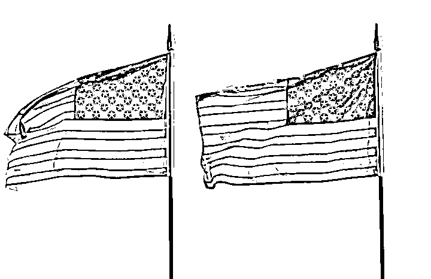  <ne-p id="u8e89c782" data-lake-id="u8e89c782"><ne-text id="u32e4f1f9" ne-bold="true">感谢提供相关资料的一些博主和一些朋友的更正。</ne-text></ne-p> <ne-p id="u22841414" data-lake-id="u22841414"><ne-text id="u35100e89">下面我将介绍:</ne-text></ne-p> <ne-oli><ne-oli-i>1</ne-oli-i><ne-oli-c class="ne-oli-content" id="u76c71215" data-lake-id="u76c71215"><ne-text id="ud41f1edd">Benefits of a US LLC 美国有限责任公司的好处</ne-text></ne-oli-c></ne-oli> <ne-oli><ne-oli-i>2</ne-oli-i><ne-oli-c class="ne-oli-content" id="u984a367d" data-lake-id="u984a367d"><ne-text id="u54606151">LLC Formation 有限责任公司成立</ne-text></ne-oli-c></ne-oli> <ne-oli><ne-oli-i>3</ne-oli-i><ne-oli-c class="ne-oli-content" id="ufae82761" data-lake-id="ufae82761"><ne-text id="u4cc50ad7">Best State to form an LLC In 成立有限责任公司的最好的州</ne-text></ne-oli-c></ne-oli> <ne-oli><ne-oli-i>4</ne-oli-i><ne-oli-c class="ne-oli-content" id="u3d478208" data-lake-id="u3d478208"><ne-text id="u8fce732c">US Address 美国地址</ne-text></ne-oli-c></ne-oli> <ne-oli><ne-oli-i>5</ne-oli-i><ne-oli-c class="ne-oli-content" id="ua4c77496" data-lake-id="ua4c77496"><ne-text id="ucb977e10">US Phone Number 美国电话号码</ne-text></ne-oli-c></ne-oli> <ne-oli><ne-oli-i>6</ne-oli-i><ne-oli-c class="ne-oli-content" id="uc642e9c7" data-lake-id="uc642e9c7"><ne-text id="u69a3af38">US Banking 美国银行开会</ne-text></ne-oli-c></ne-oli> <ne-oli><ne-oli-i>7</ne-oli-i><ne-oli-c class="ne-oli-content" id="uecd4153b" data-lake-id="uecd4153b"><ne-text id="u88df7751">Getting an EIN 获取 EIN</ne-text></ne-oli-c></ne-oli> <ne-oli><ne-oli-i>8</ne-oli-i><ne-oli-c class="ne-oli-content" id="u20ab68a1" data-lake-id="u20ab68a1"><ne-text id="u7b6de4b9">Stripe vs PayPal</ne-text></ne-oli-c></ne-oli> <ne-oli><ne-oli-i>9</ne-oli-i><ne-oli-c class="ne-oli-content" id="ud3d0534f" data-lake-id="ud3d0534f"><ne-text id="uc5d52fc6">US Tax Filing Requirements 美国税务申报要求</ne-text></ne-oli-c></ne-oli> <ne-p id="uaebd5522" data-lake-id="uaebd5522"><ne-card data-card-name="image" data-card-type="inline" id="kCEux" data-event-boundary="card">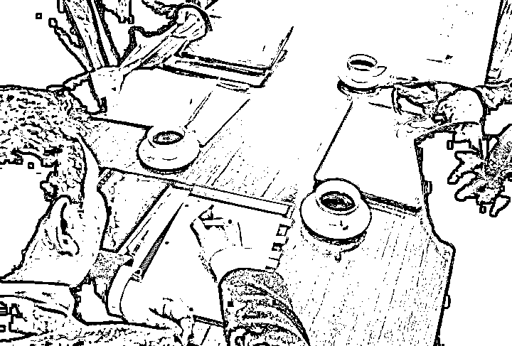  <ne-h2 id="73596d54" data-lake-id="73596d54"><ne-heading-ext><ne-heading-anchor></ne-heading-anchor><ne-heading-fold></ne-heading-fold></ne-heading-ext><ne-heading-content><ne-text id="u973dddc6" style="color: rgb(18, 18, 18); background-color: rgb(255, 255, 255);">选择美国创业的好处</ne-text></ne-heading-content></ne-h2> <ne-p id="u89cd86ed" data-lake-id="u89cd86ed"><ne-text id="u7c6f44a3">美国在商业友好方面享有世界上最好的声誉之一，即使对非美国公民也是如此！美国还有一个非常具有竞争力的公司税制和一个相对容易的有限责任公司形成制度。其中最大的好处之一就是与其他许多国家相比创业成本较低，而且公司总部设在美国以外的声望也很高。</ne-text></ne-p> <ne-h2 id="94ce2b36" data-lake-id="94ce2b36"><ne-heading-ext><ne-heading-anchor></ne-heading-anchor><ne-heading-fold></ne-heading-fold></ne-heading-ext><ne-heading-content><ne-text id="ufe838b44" style="color: rgb(18, 18, 18); background-color: rgb(255, 255, 255);">非美国居民（我们外国人）是否可以 开美国有限责任公司呢？</ne-text></ne-heading-content></ne-h2> <ne-p id="ud2e2e01d" data-lake-id="ud2e2e01d"><ne-text id="ub93f598d">关于开美国公司的一个常见误解是，你必须是美国公民才能创建一家公司，并拥有美国 SSN (社会安全号码)。而且我碰到很多中国代理说，你要有美国人一起陪着你成立公司。要护照，要中国公司执照信息。我也不想口吐芬芳了。</ne-text></ne-p> <ne-p id="u97215661" data-lake-id="u97215661"><ne-text id="uebdb0a05">正常答案是，你不必是美国公民，不必是美国居民(即“绿卡持有人”) ，也不必拥有美国 SSN。</ne-text></ne-p> <ne-p id="u5bc33029" data-lake-id="u5bc33029"><ne-text id="u2fd97e89">这意味着，你可以以非居民身份、在线身份、外国人身份开办一家美国有限责任公司，然后获得:</ne-text></ne-p> <ne-oli><ne-oli-i>1</ne-oli-i><ne-oli-c class="ne-oli-content" id="u223f4d59" data-lake-id="u223f4d59"><ne-text id="u3b0535f5">A U.S LLC 美国有限责任公司</ne-text></ne-oli-c></ne-oli> <ne-oli><ne-oli-i>2</ne-oli-i><ne-oli-c class="ne-oli-content" id="u86427fed" data-lake-id="u86427fed"><ne-text id="ua57154c0">A U.S bank account 一个美国银行账户</ne-text></ne-oli-c></ne-oli> <ne-oli><ne-oli-i>3</ne-oli-i><ne-oli-c class="ne-oli-content" id="u54bfe062" data-lake-id="u54bfe062"><ne-text id="uba374d20">Access to U.S payments 获取美国支付</ne-text></ne-oli-c></ne-oli> <ne-p id="uab97501d" data-lake-id="uab97501d"><ne-text id="ucb38de78">成为一个美国的云居民还是很有意思的。</ne-text></ne-p> <ne-p id="u9b219015" data-lake-id="u9b219015"><ne-text id="u2bd2f261">非美国居民开办美国有限责任公司的最大好处之一是，有限责任公司是一个“可以穿透实体”pass-through entity，这意味着税收可以传递给所有者。这意味着，只要你的有限责任公司符合以下情况。你就不用报税了。</ne-text></ne-p> <ne-oli><ne-oli-i>1</ne-oli-i><ne-oli-c class="ne-oli-content" id="u6e4c00c4" data-lake-id="u6e4c00c4"><ne-text id="u08fe1b90">由非美国税务居民(自然人或法人)100% 拥有</ne-text></ne-oli-c></ne-oli> <ne-oli><ne-oli-i>2</ne-oli-i><ne-oli-c class="ne-oli-content" id="ubc915788" data-lake-id="ubc915788"><ne-text id="ua33a62fc">没有美国的存在或经济实质</ne-text></ne-oli-c></ne-oli> <ne-oli><ne-oli-i>3</ne-oli-i><ne-oli-c class="ne-oli-content" id="u700a27fa" data-lake-id="u700a27fa"><ne-text id="uf02d59ab">收入没有“有效连接”</ne-text></ne-oli-c></ne-oli> <ne-p id="u6dc4c76b" data-lake-id="u6dc4c76b"><ne-text id="u4c169237">简单一句话，你注册美国公司，但是你做欧洲生意，你是中国人，你对美国没有纳税义务，因为你的钱来自欧洲。</ne-text></ne-p> <ne-p id="u409ce033" data-lake-id="u409ce033"><ne-card data-card-name="image" data-card-type="inline" id="wIc10" data-event-boundary="card">  <ne-h2 id="3045a24a" data-lake-id="3045a24a"><ne-heading-ext><ne-heading-anchor></ne-heading-anchor><ne-heading-fold></ne-heading-fold></ne-heading-ext><ne-heading-content><ne-text id="u1e66f2a9" style="color: rgb(18, 18, 18); background-color: rgb(255, 255, 255);">什么是有限责任公司 LLC？</ne-text></ne-heading-content></ne-h2> <ne-p id="u781a3cfa" data-lake-id="u781a3cfa"><ne-text id="u897187ea">有限责任公司给你一个商业实体，然后建立一个银行账户，接受付款，名称“有限公司”就是说，这个公司是有限责任的，就是公司破产，破产的只是公司，不是你个人。这个形式保护你免于“责任!”</ne-text></ne-p> <ne-p id="u4d9a510e" data-lake-id="u4d9a510e"><ne-text id="u2ac2b9c8">对于有限责任公司，只有以有限责任公司名义拥有的资产才受到企业债权人的索赔，包括针对企业的诉讼。有限责任公司成员的个人资产不能用来偿还企业债务。对大多数人来说，这是成立有限责任公司的最重要原因。</ne-text></ne-p> <ne-h2 id="bfa8a4cc" data-lake-id="bfa8a4cc"><ne-heading-ext><ne-heading-anchor></ne-heading-anchor><ne-heading-fold></ne-heading-fold></ne-heading-ext><ne-heading-content><ne-text id="u822ca9e2" style="color: rgb(18, 18, 18); background-color: rgb(255, 255, 255);">我应该成立有限责任公司 LLC 还是 C 公司？</ne-text></ne-heading-content></ne-h2> <ne-oli><ne-oli-i>1</ne-oli-i><ne-oli-c class="ne-oli-content" id="u6c0fb1d4" data-lake-id="u6c0fb1d4"><ne-text id="u74d190ba">如果你正在寻找责任保护和灵活性(有限的行政维护，税务灵活性)有限责任公司是一个开启新业务不错的选择。有限责任公司 LLC，更容易启动和维护。</ne-text></ne-oli-c></ne-oli> <ne-oli><ne-oli-i>2</ne-oli-i><ne-oli-c class="ne-oli-content" id="u3858aa4c" data-lake-id="u3858aa4c"><ne-text id="uf8493231">如果您目前正在筹集或将要筹集美国风险资本，并让一家公司上市**C Corporation **  是个不错的选择**风投一般要你是 C-copration</ne-text></ne-oli-c></ne-oli> <ne-oli><ne-oli-i>3</ne-oli-i><ne-oli-c class="ne-oli-content" id="u657f622b" data-lake-id="u657f622b"><ne-text id="u01665ccf">注意 C-copration 有几种同意词，INC,C-corp.都是讲一个东西。</ne-text></ne-oli-c></ne-oli> <ne-h2 id="5e0dbd84" data-lake-id="5e0dbd84"><ne-heading-ext><ne-heading-anchor></ne-heading-anchor><ne-heading-fold></ne-heading-fold></ne-heading-ext><ne-heading-content><ne-text id="u48055ac1" style="color: rgb(18, 18, 18); background-color: rgb(255, 255, 255);">在哪个州成立 LLC 呢？</ne-text></ne-heading-content></ne-h2> <ne-p id="u9bd0fb90" data-lake-id="u9bd0fb90"><ne-text id="u2c68a391">成立有限公司 LLC 一般大家都选择自己的家乡。这是因为你的公司主要是在那个州做生意，无论是实体业务还是在线业务。但是我们都是外国人，选择就更多元化了。</ne-text></ne-p> <ne-p id="uc9ff27d8" data-lake-id="uc9ff27d8"><ne-text id="u24c8e623">我翻阅了很多资料。</ne-text></ne-p> <ne-p id="u5918752b" data-lake-id="u5918752b"><ne-text id="u39c8054a">CO 科罗拉多州是注册最多，也是比较快的。</ne-text></ne-p> <ne-p id="u1442ae60" data-lake-id="u1442ae60"><ne-text id="uf357ea60">WY 怀俄明是很多人推荐的州。</ne-text></ne-p> <ne-p id="u53060e4d" data-lake-id="u53060e4d"><ne-text id="ud72c3fa9">也有很多提及 DE 特拉华州。</ne-text></ne-p> <ne-p id="u0471eb3f" data-lake-id="u0471eb3f"><ne-text id="u7b55df94">沟通了很多代理来讲。注册哪里要看业务长短和有费用问题。</ne-text></ne-p> <ne-h3 id="c988049d" data-lake-id="c988049d"><ne-heading-ext><ne-heading-anchor></ne-heading-anchor><ne-heading-fold></ne-heading-fold></ne-heading-ext><ne-heading-content><ne-text id="u69ba7462" style="color: rgb(18, 18, 18); background-color: rgb(255, 255, 255);">Colorado</ne-text></ne-heading-content></ne-h3> <ne-h3 id="c4b41bcf" data-lake-id="c4b41bcf"><ne-heading-ext><ne-heading-anchor></ne-heading-anchor><ne-heading-fold></ne-heading-fold></ne-heading-ext><ne-heading-content><ne-text id="ubbf8a9af" style="color: rgb(18, 18, 18); background-color: rgb(255, 255, 255);">科多拉多州</ne-text></ne-heading-content></ne-h3> <ne-p id="ue4ed74ac" data-lake-id="ue4ed74ac"><ne-text id="ud35c0790">如果短期做几年的生意，注册独立站的，建议直接挂 CO 科罗拉多州，成立比较快。问了不同家的代理，这个州的税务+年审成本居然还是挺便宜，比 WY 和 DE 还便宜些。看来注册的多，有成本优势在。</ne-text></ne-p> <ne-p id="u060120f5" data-lake-id="u060120f5"><ne-text id="ueb932882">如果注册准备长期做的话。可以注册 WY 怀俄明和 DE 特拉华州。</ne-text></ne-p> <ne-p id="u1ff41675" data-lake-id="u1ff41675"><ne-text id="u7eac16d1">这里主要讲下两个州的差别。</ne-text></ne-p> <ne-h3 id="09a781dd" data-lake-id="09a781dd"><ne-heading-ext><ne-heading-anchor></ne-heading-anchor><ne-heading-fold></ne-heading-fold></ne-heading-ext><ne-heading-content><ne-text id="u0a6089f2" style="color: rgb(18, 18, 18); background-color: rgb(255, 255, 255);">Wyoming</ne-text></ne-heading-content></ne-h3> <ne-h3 id="25b1f26c" data-lake-id="25b1f26c"><ne-heading-ext><ne-heading-anchor></ne-heading-anchor><ne-heading-fold></ne-heading-fold></ne-heading-ext><ne-heading-content><ne-text id="u2992a538" style="color: rgb(18, 18, 18); background-color: rgb(255, 255, 255);">怀俄明州</ne-text></ne-heading-content></ne-h3> <ne-p id="ue82a79e0" data-lake-id="ue82a79e0"><ne-text id="u18d0ff8d">怀俄明州提供低税率，不收取所得税或特许经营税，这使其成为对创办新企业最有利的州之一。他们的销售税率也低于全国平均水平 4% 。</ne-text></ne-p> <ne-p id="u7c4e841c" data-lake-id="u7c4e841c"><ne-text id="ufbae9321">怀俄明州是最受非居民（也就是我们外国人）企业家欢迎的州，这些企业家经营在线业务、电子商务业务，或者是企业主，他们希望以一种简单易行的方式组建和管理自己的公司。</ne-text></ne-p> <ne-h3 id="b028e7fd" data-lake-id="b028e7fd"><ne-heading-ext><ne-heading-anchor></ne-heading-anchor><ne-heading-fold></ne-heading-fold></ne-heading-ext><ne-heading-content><ne-text id="u37ec4716" style="color: rgb(18, 18, 18); background-color: rgb(255, 255, 255);">Delaware</ne-text></ne-heading-content></ne-h3> <ne-h3 id="2437adb0" data-lake-id="2437adb0"><ne-heading-ext><ne-heading-anchor></ne-heading-anchor><ne-heading-fold></ne-heading-fold></ne-heading-ext><ne-heading-content><ne-text id="u255f0d82" style="color: rgb(18, 18, 18); background-color: rgb(255, 255, 255);">特拉华州</ne-text></ne-heading-content></ne-h3> <ne-p id="ub4b1a25c" data-lake-id="ub4b1a25c"><ne-text id="ubf747c29">与怀俄明州一样，特拉华州也提供了更多的隐私保护，同时也比其他州拥有更好的法律保护。事实上，有许多在特拉华州成立的有限责任公司的例子。他们有一套被称为“特拉华州衡平法院”的制度，专门用于处理公司法律问题。公司案件在没有陪审团在场的情况下进行审理，因此被认为对企业更为有利。</ne-text></ne-p> <ne-p id="u933f1dc4" data-lake-id="u933f1dc4"><ne-text id="uef34c924">特拉华州只有当你有计划在未来将你的 LLC 有限责任公司转变为 C 公司(从美国投资者那里筹集风险资本)</ne-text></ne-p> <ne-h3 id="ea20fdc7" data-lake-id="ea20fdc7"><ne-heading-ext><ne-heading-anchor></ne-heading-anchor><ne-heading-fold></ne-heading-fold></ne-heading-ext><ne-heading-content><ne-text id="u69b57971" style="color: rgb(18, 18, 18); background-color: rgb(255, 255, 255);">税务对比：</ne-text></ne-heading-content></ne-h3> <ne-p id="u86a8ef7e" data-lake-id="u86a8ef7e"><ne-text id="ucd15f295">Wyoming 怀俄明无特许经营税</ne-text></ne-p> <ne-p id="ub0477564" data-lake-id="ub0477564"><ne-text id="u2582a258">Delaware 特拉华有特许经营税，每年 300USD</ne-text></ne-p> <ne-p id="ufc3c38e7" data-lake-id="ufc3c38e7"><ne-card data-card-name="image" data-card-type="inline" id="U6lrr" data-event-boundary="card">  <ne-h2 id="1e4cb705" data-lake-id="1e4cb705"><ne-heading-ext><ne-heading-anchor></ne-heading-anchor><ne-heading-fold></ne-heading-fold></ne-heading-ext><ne-heading-content><ne-text id="u3d0e8f4e" style="color: rgb(18, 18, 18); background-color: rgb(255, 255, 255);">开办跨境电商业务，注册 LLC 有限责任公司，选那个州？</ne-text></ne-heading-content></ne-h2> <ne-p id="u671ae4ab" data-lake-id="u671ae4ab"><ne-text id="uec97e479">如果你的业务完全基于互联网，而且你的客户来自美国各地或全世界，像我们中国人，选择那里都是可以，唯一的需要注意的。</ne-text></ne-p> <ne-p id="ua2bf26cd" data-lake-id="ua2bf26cd"><ne-text id="uc8af325a">1.注册成本（短期注册成本差异）</ne-text></ne-p> <ne-p id="ue3636997" data-lake-id="ue3636997"><ne-text id="uf6ebc8b2">2.税务成本（长期税务成本）</ne-text></ne-p> <ne-p id="ue9188f66" data-lake-id="ue9188f66"><ne-text id="u13f96bf0">具体你要沟通替你注册的代理才有答案，毕竟他们收你的钱。</ne-text></ne-p> <ne-h2 id="cbb1e71f" data-lake-id="cbb1e71f"><ne-heading-ext><ne-heading-anchor></ne-heading-anchor><ne-heading-fold></ne-heading-fold></ne-heading-ext><ne-heading-content><ne-text id="u56bcd4ad" style="color: rgb(18, 18, 18); background-color: rgb(255, 255, 255);">开美国公司的选择</ne-text></ne-heading-content></ne-h2> <ne-p id="ufe46c51d" data-lake-id="ufe46c51d"><ne-text id="uedec756a">1.Stripe 的 Atlas (他们不接收非美国公民开户)</ne-text></ne-p> <ne-p id="u98f0c9e8" data-lake-id="u98f0c9e8"><ne-text id="ua39202c0">2.中国代理 （不太建议，除非他们是美国的中国分部，这样他们业务会懂很多）</ne-text></ne-p> <ne-h3 id="f37460f2" data-lake-id="f37460f2"><ne-heading-ext><ne-heading-anchor></ne-heading-anchor><ne-heading-fold></ne-heading-fold></ne-heading-ext><ne-heading-content><ne-text id="u19849489">美国代理推荐</ne-text></ne-heading-content></ne-h3> <ne-p id="u5b4e6c45" data-lake-id="u5b4e6c45">[<ne-text id="u0dff8ab6">华人代理机构</ne-text>](https://www.acompanyinus.com/)</ne-p> <ne-p id="u4711a1b5" data-lake-id="u4711a1b5">[<ne-text id="u2bb18a0e">老外税务代理（略贵）</ne-text>](https://gwcarter.com/)</ne-p> <ne-p id="uec79c6b1" data-lake-id="uec79c6b1"><ne-text id="u1f1e0744">3.自己申请</ne-text></ne-p> <ne-p id="udbaf0570" data-lake-id="udbaf0570"><ne-text id="u3ac39ebd">需要租用对应州的美国地址，一般一个地址费用就是 20-30 美元一年，而且需要长期使用，因为会有很多信件过来。一年下来成本就 240-360USD，还要交州里注册费用。对比找代理 290 到 390USD，还是非常不划算的。</ne-text></ne-p> <ne-p id="uc9110ff4" data-lake-id="uc9110ff4"><ne-text id="u7bc88370">如果你在美国，注册自己的州的公司，自己注册还是略便宜的。但是花了时间，依然是一个成本。毕竟是做一个自己不熟悉的事情。</ne-text></ne-p> <ne-p id="u82639c63" data-lake-id="u82639c63"><ne-card data-card-name="image" data-card-type="inline" id="ZmlBE" data-event-boundary="card">  <ne-h2 id="12a2f392" data-lake-id="12a2f392"><ne-heading-ext><ne-heading-anchor></ne-heading-anchor><ne-heading-fold></ne-heading-fold></ne-heading-ext><ne-heading-content><ne-text id="u3d9dccb1" style="color: rgb(18, 18, 18); background-color: rgb(255, 255, 255);">如何获得 EIN</ne-text></ne-heading-content></ne-h2> <ne-p id="u63733b72" data-lake-id="u63733b72"><ne-text id="u5d6bcf09">申请人必须有 SSN  ，方可在网上申请 EIN。</ne-text></ne-p> <ne-p id="u575fec2d" data-lake-id="u575fec2d"><ne-text id="u12996108">如果你没有社会安全号码，那么你必须邮寄申请为你的美国公司获得一个 EIN。</ne-text></ne-p> <ne-p id="u37975d3b" data-lake-id="u37975d3b"><ne-text id="ufd7bc9c6">不在美国的人，一般找代理来做。</ne-text></ne-p> <ne-h2 id="bd22d097" data-lake-id="bd22d097"><ne-heading-ext><ne-heading-anchor></ne-heading-anchor><ne-heading-fold></ne-heading-fold></ne-heading-ext><ne-heading-content><ne-text id="ufb34b94c" style="color: rgb(18, 18, 18); background-color: rgb(255, 255, 255);">拿到一个 EIN 需要多长时间？</ne-text></ne-heading-content></ne-h2> <ne-p id="u2cbc9382" data-lake-id="u2cbc9382"><ne-text id="u61c84ef5">我问了很多家，大家的答案就是 2 周左右。</ne-text></ne-p> <ne-h2 id="8c203e68" data-lake-id="8c203e68"><ne-heading-ext><ne-heading-anchor></ne-heading-anchor><ne-heading-fold></ne-heading-fold></ne-heading-ext><ne-heading-content><ne-text id="u57c17527" style="color: rgb(18, 18, 18); background-color: rgb(255, 255, 255);">如何确认自己的 EIN</ne-text></ne-heading-content></ne-h2> <ne-p id="u1920d85a" data-lake-id="u1920d85a"><ne-text id="u596ccb46">1.找代理要 SS-4 信件。就是国税局 IRS 发的信件。上面有自己的 EIN 的信息。</ne-text></ne-p> <ne-p id="u029d877a" data-lake-id="u029d877a"><ne-text id="ufa0b16ab">2.打国税局电话</ne-text></ne-p> <ne-p id="u742a3654" data-lake-id="u742a3654"><ne-text id="u49ad4c05">致电 800-829-4933</ne-text></ne-p> <ne-p id="u7b8fc018" data-lake-id="u7b8fc018"><ne-text id="u3bc527ea">当地时间上午 7:00-下午 7:00，周一至周五</ne-text></ne-p> <ne-p id="u23e9a913" data-lake-id="u23e9a913"><ne-text id="uca73f975">国税局在奥斯丁，用美国中部时间。</ne-text></ne-p> <ne-h2 id="41979041" data-lake-id="41979041"><ne-heading-ext><ne-heading-anchor></ne-heading-anchor><ne-heading-fold></ne-heading-fold></ne-heading-ext><ne-heading-content><ne-text id="uba6faa71" style="color: rgb(18, 18, 18); background-color: rgb(255, 255, 255);">什么是 EIN，ITIN,SSN？</ne-text></ne-heading-content></ne-h2> <ne-p id="u963de59a" data-lake-id="u963de59a"><ne-text id="u0fe2813e" ne-bold="true">EIN</ne-text> <ne-text id="u31599b9b">stands for</ne-text> <ne-text id="u1491eee7" ne-bold="true">*Employer Identification Number*</ne-text><ne-text id="u406295c0">.</ne-text></ne-p> <ne-p id="u0edc6d1f" data-lake-id="u0edc6d1f"><ne-text id="u41a3b4ec">EIN 代表雇主识别号码。</ne-text></ne-p> <ne-p id="udab72a19" data-lake-id="udab72a19"><ne-text id="u89c9c42b">美国国税局向企业发出 EIN，以满足税务申报要求，而且一旦你开立了有限责任公司，你还需要 EIN 来开立美国商业银行账户。</ne-text></ne-p> <ne-p id="ubbb58cd3" data-lake-id="ubbb58cd3"><ne-text id="u663ffa5f" ne-bold="true">SSN</ne-text> <ne-text id="uc9c9e98f">stands for</ne-text> <ne-text id="u9936fb59" ne-bold="true">*Social Security Number*</ne-text><ne-text id="ue9fdcbea">.</ne-text></ne-p> <ne-p id="u243a3191" data-lake-id="u243a3191"><ne-text id="u65fa12e7">SSN 代表社会保障号码。也叫社安号。</ne-text></ne-p> <ne-p id="u43d7d931" data-lake-id="u43d7d931"><ne-text id="ue723bea5">美国社会保障局(SSA)发 SSN 给美国公民、永久居民或临时非移民工人。</ne-text></ne-p> <ne-p id="u95830681" data-lake-id="u95830681"><ne-text id="uddde9721">如果你学生，在校打工也可以获得 SSN。</ne-text></ne-p> <ne-p id="ufe0d9434" data-lake-id="ufe0d9434"><ne-text id="u48f0b1cf" ne-bold="true">ITIN</ne-text> <ne-text id="u39e43ec9">stands for</ne-text> <ne-text id="u1cab3ac2" ne-bold="true">*Individual Taxpayer Identification Number*</ne-text><ne-text id="ue6d62559">.</ne-text></ne-p> <ne-p id="u54be39a8" data-lake-id="u54be39a8"><ne-text id="uf313d62b">ITIN 代表个人纳税识别号码。</ne-text></ne-p> <ne-p id="u5a140bc6" data-lake-id="u5a140bc6"><ne-text id="u5de96bf1">美国国税局向那些拥有美国税务申报(或信息报告要求)并且没有资格获得 SSN 的人颁发 ITIN。</ne-text></ne-p> <ne-p id="ua9ac94b7" data-lake-id="ua9ac94b7"><ne-text id="u4f7606c2">这个号码是我们能够获得最有价值的号！</ne-text></ne-p> <ne-p id="u1d2ff0e7" data-lake-id="u1d2ff0e7"><ne-card data-card-name="image" data-card-type="inline" id="kMdun" data-event-boundary="card">  <ne-h2 id="5a529c68" data-lake-id="5a529c68"><ne-heading-ext><ne-heading-anchor></ne-heading-anchor><ne-heading-fold></ne-heading-fold></ne-heading-ext><ne-heading-content><ne-text id="u89e87ca4" style="color: rgb(18, 18, 18); background-color: rgb(255, 255, 255);">如何获得 ITIN？</ne-text></ne-heading-content></ne-h2> <ne-p id="u7c181794" data-lake-id="u7c181794"><ne-text id="u16c286fe">ITIN 可以参考这篇文章。</ne-text>[<ne-text id="ucd28ec35">什么是美国税号（TIN）？SSN、EIN、ITIN 分别有什么区别？</ne-text>](https://mp.weixin.qq.com/s?__biz=Mzg2MjY2NzU4Mw==&mid=2247489652&idx=1&sn=67bb6c9749d1323c0c88141c104dbfc3&chksm=ce050e24f97287322b0ef4f5593a99e3166f98819f3502a331c74da615a7bc5d263e3bd30aac&token=1027523717&lang=zh_CN&scene=21#wechat_redirect)[<ne-text id="u60564688" ne-bold="true">原创</ne-text>](https://mp.weixin.qq.com/s?__biz=Mzg2MjY2NzU4Mw==&mid=2247489652&idx=1&sn=67bb6c9749d1323c0c88141c104dbfc3&chksm=ce050e24f97287322b0ef4f5593a99e3166f98819f3502a331c74da615a7bc5d263e3bd30aac&token=1027523717&lang=zh_CN&scene=21#wechat_redirect)</ne-p> <ne-p id="u09cdbb30" data-lake-id="u09cdbb30"><ne-text id="uf5bb730a">简单方法，就是找代理解决。</ne-text></ne-p> <ne-h2 id="ac39990e" data-lake-id="ac39990e"><ne-heading-ext><ne-heading-anchor></ne-heading-anchor><ne-heading-fold></ne-heading-fold></ne-heading-ext><ne-heading-content><ne-text id="u6f714dee" style="color: rgb(18, 18, 18); background-color: rgb(255, 255, 255);">如何获得美国电话号码？</ne-text></ne-heading-content></ne-h2> <ne-p id="u0d371c20" data-lake-id="u0d371c20"><ne-text id="ud7608332">您将需要一个美国电话号码申请一个美国银行帐户，并设置您的 Stripe 帐户。以下是美国电话号码重要的一些主要原因:</ne-text></ne-p> <ne-oli><ne-oli-i>1</ne-oli-i><ne-oli-c class="ne-oli-content" id="u7ddead4d" data-lake-id="u7ddead4d"><ne-text id="u9cae1eae">业务验证: 申请银行账户、 Stripe/PayPal 账户、 Amazon Seller 账户等时，需要一个美国电话号码</ne-text></ne-oli-c></ne-oli> <ne-oli><ne-oli-i>2</ne-oli-i><ne-oli-c class="ne-oli-content" id="u9e7f3db7" data-lake-id="u9e7f3db7"><ne-text id="ucbc40311">地址证明: 许多服务需要水电费账单作为办理业务的位置证明。</ne-text></ne-oli-c></ne-oli> <ne-oli><ne-oli-i>3</ne-oli-i><ne-oli-c class="ne-oli-content" id="u79cf0ace" data-lake-id="u79cf0ace"><ne-text id="u765c4310">客户支持: 有时候客户希望与人交谈，而不是发邮件。</ne-text></ne-oli-c></ne-oli> <ne-oli><ne-oli-i>4</ne-oli-i><ne-oli-c class="ne-oli-content" id="u1c30d662" data-lake-id="u1c30d662"><ne-text id="u66fdd08f">专业性本土化: 给你的有限责任公司增加一个专业元素，使用美国商务电话号码，而不是国际电话号码。</ne-text></ne-oli-c></ne-oli> <ne-p id="u46a7e206" data-lake-id="u46a7e206"><ne-text id="u0f757f0b">大部分的情况下，你可以使用 google voice,目前淘宝上已经不再卖这个了。</ne-text></ne-p> <ne-p id="u44abeb20" data-lake-id="u44abeb20"><ne-text id="u5c088e2d">依然有渠道可以去买，现在行情价格大概到 50 人民币一个。</ne-text></ne-p> <ne-h2 id="52dd14f1" data-lake-id="52dd14f1"><ne-heading-ext><ne-heading-anchor></ne-heading-anchor><ne-heading-fold></ne-heading-fold></ne-heading-ext><ne-heading-content><ne-text id="u01081105" style="color: rgb(18, 18, 18); background-color: rgb(255, 255, 255);">如何开设美国商业银行账户</ne-text></ne-heading-content></ne-h2> <ne-p id="uca0ef387" data-lake-id="uca0ef387"><ne-text id="ud9603b2f">不幸的是，银行业的选择非常有限:</ne-text></ne-p> <ne-p id="u8dd3ab2d" data-lake-id="u8dd3ab2d"><ne-text id="u8af090b5">因为我们是，Non US residents 非美国居民 。</ne-text></ne-p> <ne-p id="uca8372d3" data-lake-id="uca8372d3"><ne-text id="uf862e284">如果要真的开到实体银行公司账号。是需要飞到美国去的。</ne-text></ne-p> <ne-p id="u9e4a0395" data-lake-id="u9e4a0395"><ne-text id="u4947a100">或者找代理开户。</ne-text></ne-p> <ne-p id="u96861255" data-lake-id="u96861255"><ne-text id="u8b0aab95">华美公司户是大家常用的，但是成本还是很高，1000USD 的开户费，1000USD 服务商收费费，</ne-text></ne-p> <ne-p id="u38b9bc13" data-lake-id="u38b9bc13"><ne-text id="u8b1351ef">还要存 10000 刀，如果低于 10000 刀的存款，要收 150 刀的月管理费用。</ne-text></ne-p> <ne-p id="u7e8458ad" data-lake-id="u7e8458ad"><ne-text id="u1b2fd9df">这是官方的说明。</ne-text></ne-p> <ne-p id="u2748f09c" data-lake-id="u2748f09c"><ne-text id="u1bda58ac">我在的公司，找了美国代理开了一个 Capital one ,C1 账号，没有开户费，使用好了，再和大家分享。</ne-text></ne-p> <ne-p id="ub9d20337" data-lake-id="ub9d20337"><ne-text id="ue21a792d">不急的话，就是等飞美国再开。</ne-text></ne-p> <ne-p id="u8288537f" data-lake-id="u8288537f"><ne-text id="u54dde1fd">急的话，就是尽可能找美国当地代理开。</ne-text></ne-p> <ne-p id="u0e3d4219" data-lake-id="u0e3d4219"><ne-text id="ub2f59cfd">其他银行也想办法找代理开：</ne-text></ne-p> <ne-oli><ne-oli-i>1</ne-oli-i><ne-oli-c class="ne-oli-content" id="u4a0d7cf8" data-lake-id="u4a0d7cf8"><ne-text id="uc3096765">Bank of America 美国银行</ne-text></ne-oli-c></ne-oli> <ne-oli><ne-oli-i>2</ne-oli-i><ne-oli-c class="ne-oli-content" id="u49e67166" data-lake-id="u49e67166"><ne-text id="ub5c20fbf">Wells Fargo 富国银行</ne-text></ne-oli-c></ne-oli> <ne-oli><ne-oli-i>3</ne-oli-i><ne-oli-c class="ne-oli-content" id="u00517ed0" data-lake-id="u00517ed0"><ne-text id="u134f993c">Silicon Valley Bank 硅谷银行</ne-text></ne-oli-c></ne-oli> <ne-oli><ne-oli-i>4</ne-oli-i><ne-oli-c class="ne-oli-content" id="u70f2f85e" data-lake-id="u70f2f85e"><ne-text id="uf8224018">First Republic 第一共和国</ne-text></ne-oli-c></ne-oli> <ne-p id="u63991b98" data-lake-id="u63991b98"><ne-card data-card-name="image" data-card-type="inline" id="BUPsr" data-event-boundary="card">  <ne-h2 id="a066fd28" data-lake-id="a066fd28"><ne-heading-ext><ne-heading-anchor></ne-heading-anchor><ne-heading-fold></ne-heading-fold></ne-heading-ext><ne-heading-content><ne-text id="u0cd7ecf5" style="color: rgb(18, 18, 18); background-color: rgb(255, 255, 255);">美区 PayPal 的问题。</ne-text></ne-heading-content></ne-h2> <ne-h3 id="85e07263" data-lake-id="85e07263"><ne-heading-ext><ne-heading-anchor></ne-heading-anchor><ne-heading-fold></ne-heading-fold></ne-heading-ext><ne-heading-content><ne-text id="ud794055d" style="color: rgb(18, 18, 18); background-color: rgb(255, 255, 255);">如何设立美国贝宝 PAYPAL 帐户？</ne-text></ne-heading-content></ne-h3> <ne-p id="u8e11d49a" data-lake-id="u8e11d49a"><ne-text id="ua0a2ea04">要创建一个商业贝宝账户，你需要:</ne-text></ne-p> <ne-oli><ne-oli-i>1</ne-oli-i><ne-oli-c class="ne-oli-content" id="uf6870d89" data-lake-id="uf6870d89"><ne-text id="u1f1894b0">一个 LLC 有限责任公司</ne-text></ne-oli-c></ne-oli> <ne-oli><ne-oli-i>2</ne-oli-i><ne-oli-c class="ne-oli-content" id="u5a8cde63" data-lake-id="u5a8cde63"><ne-text id="u1c5562e5">一个 EIN 号码</ne-text></ne-oli-c></ne-oli> <ne-oli><ne-oli-i>3</ne-oli-i><ne-oli-c class="ne-oli-content" id="u2afe996a" data-lake-id="u2afe996a"><ne-text id="ub7f6f9d0">一个美国地址</ne-text></ne-oli-c></ne-oli> <ne-oli><ne-oli-i>4</ne-oli-i><ne-oli-c class="ne-oli-content" id="u7e5af471" data-lake-id="u7e5af471"><ne-text id="u722c5d75">美国的电话号码</ne-text></ne-oli-c></ne-oli> <ne-oli><ne-oli-i>5</ne-oli-i><ne-oli-c class="ne-oli-content" id="u880d1484" data-lake-id="u880d1484"><ne-text id="u9fde5bff">社安号码(SSN)或个人纳税识别号码（ITIN)</ne-text></ne-oli-c></ne-oli> <ne-p id="u2db5da1c" data-lake-id="u2db5da1c"><ne-text id="u8b9be4e1">美区 Paypal 不稳定，唯一的解决方案是 ITIN.</ne-text></ne-p> <ne-p id="u2d6a2f5d" data-lake-id="u2d6a2f5d">[<ne-text id="u2797bbc7">2022 美区商业</ne-text>](https://mp.weixin.qq.com/s?__biz=Mzg2MjY2NzU4Mw==&mid=2247489168&idx=1&sn=b9ee2cb33be386972f402e51ce57ab15&chksm=ce0500c0f97289d60d6c4ce7b6941ec5427c915a871d62270764e25ff9c4b5ef066f3ccea5cd&token=1027523717&lang=zh_CN&scene=21#wechat_redirect)[<ne-text id="u6db311af" ne-italic="true">Paypal</ne-text>](https://mp.weixin.qq.com/s?__biz=Mzg2MjY2NzU4Mw==&mid=2247489168&idx=1&sn=b9ee2cb33be386972f402e51ce57ab15&chksm=ce0500c0f97289d60d6c4ce7b6941ec5427c915a871d62270764e25ff9c4b5ef066f3ccea5cd&token=1027523717&lang=zh_CN&scene=21#wechat_redirect) [<ne-text id="u8cbbc28f">账号注册和使用保姆教程</ne-text>](https://mp.weixin.qq.com/s?__biz=Mzg2MjY2NzU4Mw==&mid=2247489168&idx=1&sn=b9ee2cb33be386972f402e51ce57ab15&chksm=ce0500c0f97289d60d6c4ce7b6941ec5427c915a871d62270764e25ff9c4b5ef066f3ccea5cd&token=1027523717&lang=zh_CN&scene=21#wechat_redirect) [<ne-text id="udba43430" ne-bold="true">原创</ne-text>](https://mp.weixin.qq.com/s?__biz=Mzg2MjY2NzU4Mw==&mid=2247489168&idx=1&sn=b9ee2cb33be386972f402e51ce57ab15&chksm=ce0500c0f97289d60d6c4ce7b6941ec5427c915a871d62270764e25ff9c4b5ef066f3ccea5cd&token=1027523717&lang=zh_CN&scene=21#wechat_redirect)</ne-p> <ne-h2 id="6a8a6323" data-lake-id="6a8a6323"><ne-heading-ext><ne-heading-anchor></ne-heading-anchor><ne-heading-fold></ne-heading-fold></ne-heading-ext><ne-heading-content><ne-text id="uffe8dc98" style="color: rgb(18, 18, 18); background-color: rgb(255, 255, 255);">如何设置 US Stripe 帐户</ne-text></ne-heading-content></ne-h2> <ne-p id="uc149c4bc" data-lake-id="uc149c4bc"><ne-text id="u6699ca7a">要开一个美国条纹帐户，你需要</ne-text></ne-p> <ne-oli><ne-oli-i>1</ne-oli-i><ne-oli-c class="ne-oli-content" id="u507e09f3" data-lake-id="u507e09f3"><ne-text id="ufeb6d32c">一个 LLC 有限责任公司</ne-text></ne-oli-c></ne-oli> <ne-oli><ne-oli-i>2</ne-oli-i><ne-oli-c class="ne-oli-content" id="u4c4c714b" data-lake-id="u4c4c714b"><ne-text id="u5cc282e9">一个 EIN 号码</ne-text></ne-oli-c></ne-oli> <ne-oli><ne-oli-i>3</ne-oli-i><ne-oli-c class="ne-oli-content" id="u3b524c33" data-lake-id="u3b524c33"><ne-text id="u2c2ae32a">一个美国地址</ne-text></ne-oli-c></ne-oli> <ne-oli><ne-oli-i>4</ne-oli-i><ne-oli-c class="ne-oli-content" id="u39a393dd" data-lake-id="u39a393dd"><ne-text id="udf6f4620">美国的电话号码</ne-text></ne-oli-c></ne-oli> <ne-oli><ne-oli-i>5</ne-oli-i><ne-oli-c class="ne-oli-content" id="u733a3d9e" data-lake-id="u733a3d9e"><ne-text id="uefa1b9ae">任何国家的政府身份件</ne-text></ne-oli-c></ne-oli> <ne-p id="uf87129f1" data-lake-id="uf87129f1"><ne-card data-card-name="image" data-card-type="inline" id="i4xv8" data-event-boundary="card">  <ne-h2 id="ec758591" data-lake-id="ec758591"><ne-heading-ext><ne-heading-anchor></ne-heading-anchor><ne-heading-fold></ne-heading-fold></ne-heading-ext><ne-heading-content><ne-text id="uada10b2a" style="color: rgb(18, 18, 18); background-color: rgb(255, 255, 255);">如何报税和遵守国税局 IRS 的规定</ne-text></ne-heading-content></ne-h2> <ne-p id="ue65d1364" data-lake-id="ue65d1364"><ne-text id="u66ed591c">1.如果你拥有一个外国单一成员有限责任公司，你不被认为是“从事美国贸易或商业”，你不需要提交 1040NR 或支付个人所得税。</ne-text></ne-p> <ne-p id="u87d4c3bb" data-lake-id="u87d4c3bb"><ne-text id="u02c08de2">比如你是中国人，用美国公司在欧洲做生意，那么不用美国的交税。</ne-text></ne-p> <ne-p id="uce773849" data-lake-id="uce773849"><ne-text id="ub95528ca">具体例子：开一个美国公司在亚马逊欧洲站销售。</ne-text></ne-p> <ne-p id="u8ec72449" data-lake-id="u8ec72449"><ne-text id="u96771052">2.作为一个“非居民外国人”(又名外国人,就是我们在大陆的中国人) ，如果你有，有效地连接到美国贸易或企业的收入</ne-text><ne-text id="u68d05694" ne-bold="true">effectively connected income</ne-text> <ne-text id="u1baca6b3">with</ne-text> <ne-text id="uca2e1cb5" ne-bold="true">US Trade or Business.</ne-text><ne-text id="u6a3be283">。</ne-text></ne-p> <ne-p id="u02352711" data-lake-id="u02352711"><ne-text id="ub98cd65b">那么你要报美国的税。</ne-text></ne-p> <ne-p id="u7bdf8049" data-lake-id="u7bdf8049"><ne-text id="u67cd9509">如，你在美国亚马逊上销售，或者独立站有美国收入。这个都是需要报税的，</ne-text></ne-p> <ne-p id="ube4465ae" data-lake-id="ube4465ae"><ne-text id="u3007fc4d">依据第 1.6038A-1 条款，所有外国人持有的美国公司，未能提交或填写不正确将招致 25,000 元的最低罚款。</ne-text></ne-p> <ne-p id="u4ceb0897" data-lake-id="u4ceb0897"><ne-text id="u02f8db08">这里是对于我们这样的外国人持有的美国公司，是否是应税实体的定义。</ne-text></ne-p> <ne-p id="ub6c11193" data-lake-id="ub6c11193"><ne-text id="u933b2f21">（</ne-text><ne-text id="u1786166f" ne-bold="true">1)</ne-text><ne-text id="u39f353c6" ne-bold="true">In general.</ne-text> <ne-text id="u202561d5">For purposes of section 6038A, a reporting corporation is either a domestic corporation that is 25-percent foreign-owned as defined in paragraph (c)(2) of this section, or a foreign corporation that is 25-percent foreign-owned and engaged in trade or business within the United States. After November 4, 1990, a foreign corporation engaged in a trade or business within the United States at any time during a taxable year is a reporting corporation. See section 6038C. A domestic business entity that is wholly owned by one foreign person and that is otherwise classified under § 301.7701-3(b)(1)(ii) of this chapter as disregarded as an entity separate from its owner is treated as an entity separate from its owner and classified as a domestic corporation for purposes of section 6038A.</ne-text> <ne-text id="u54dec944" ne-italic="true">See</ne-text> <ne-text id="u19ce04c6">§ 301.7701-2(c)(2)(vi) of this chapter.</ne-text></ne-p> <ne-p id="u5b56e81f" data-lake-id="u5b56e81f"><ne-text id="u1dc41076">(1)一般而言。就第 6038A 条而言，提交报告的公司要么是本节(c)(2)段所定义的拥有 25% 外资股份的国内公司，要么是拥有 25% 外资股份并在美国境内从事贸易或商业的外国公司。1990 年 11 月 4 日以后，在应纳税年度的任何时候在美国境内从事贸易或商业活动的外国公司即为报告公司。见 6038C 节。由一名外国人全资拥有的本地商业实体，如在其他方面被归类为本章第 301.7701-3(b)(1)(ii)条所指的被忽视为独立于其所有人的实体，则视为独立于其所有人的实体，并为第 6038A 条的目的被归类为本地法团。见本章第 301.7701-2(c)(2)(vi)。）</ne-text></ne-p> <ne-p id="u94177cb7" data-lake-id="u94177cb7"><ne-text id="u998bdb8b">我的建议，自己不懂的，不要瞎琢磨。我看他们法条定义，我已经崩了。</ne-text></ne-p> <ne-p id="ucc3077cd" data-lake-id="ucc3077cd"><ne-text id="u0ed089f5">专业的事情，找专业人做，交钱解决问题。</ne-text></ne-p> <ne-p id="u5ba0f451" data-lake-id="u5ba0f451"><ne-text id="uba1a4226">否则这个世界上，会计和律师岂不是要被我们这样看一点文章，就会做的人取代了。人家读了 10 年 8 年的书岂不是白读。</ne-text></ne-p> <ne-p id="uf31c729e" data-lake-id="uf31c729e"><ne-text id="ub5c01368">我们知道一些基础就可以，可以甄别一些代理是否靠谱合规。</ne-text></ne-p> <ne-h2 id="bf61c660" data-lake-id="bf61c660"><ne-heading-ext><ne-heading-anchor></ne-heading-anchor><ne-heading-fold></ne-heading-fold></ne-heading-ext><ne-heading-content><ne-text id="ub5a1b1ff" style="color: rgb(18, 18, 18); background-color: rgb(255, 255, 255);">总结</ne-text></ne-heading-content></ne-h2> <ne-p id="u156f1cf7" data-lake-id="u156f1cf7"><ne-text id="u87b78e52">我们中国人可以注册美国公司，以美国实体来参与美国的竞争。</ne-text></ne-p> <ne-p id="u9a574d4a" data-lake-id="u9a574d4a"><ne-text id="ud48f45a1">解决收款问题，开 PayPal 有个 ITIN 比较方便。</ne-text></ne-p> <ne-p id="ua5db9286" data-lake-id="ua5db9286"><ne-text id="u584ef8a7">税务问题，知道如何合股，找代理就可以。</ne-text></ne-p> <ne-p id="ubdfd75b8" data-lake-id="ubdfd75b8"><ne-text id="u4abb751e">以上！</ne-text></ne-p> <ne-p id="u503030ec" data-lake-id="u503030ec"><ne-text id="ub73f3933">是不是感觉很干，分享给你认为不错的小伙伴吧，分享高质量的内容，显示自己的认知水平，优质的内容帮你结交和处理好关系。建立自己进步的小社区。</ne-text></ne-p> <ne-p id="u879b6666" data-lake-id="u879b6666"><ne-text id="u3424c2f6" ne-bold="true">懒人备注</ne-text><ne-text id="ub7b3242d">：你说写文章就写文章，不换行不会写？这么多换行，看的人都翻得心累，难怪没人点赞！</ne-text></ne-p> <ne-h2 id="c671da4d" data-lake-id="c671da4d"><ne-heading-ext><ne-heading-anchor></ne-heading-anchor><ne-heading-fold></ne-heading-fold></ne-heading-ext><ne-heading-content><ne-text id="ued1d3473">（28 赞）《 公司顶层治理那些事：三会一层+组织架构+顶层股权》</ne-text></ne-heading-content></ne-h2> <ne-p id="u280f57b1" data-lake-id="u280f57b1"><ne-text id="u82c64de9" style="color: rgb(38, 38, 38); background-color: rgb(255, 255, 255);">哈喽，我叫刘宁培，长期在深圳，龙凤胎奶爸，</ne-text><ne-text id="ud20b734d" style="color: rgb(38, 38, 38);">主业企业咨询：股权设计、企业经营管理、商业模式板块。</ne-text></ne-p> <ne-p id="u39be9bc1" data-lake-id="u39be9bc1"><ne-text id="u00c0b0e5">前几天在群里面分享了《公司顶层治理那些事：三会一层+组织架构+顶层股权》，来这里在分享一遍。</ne-text></ne-p> <ne-p id="u6e8ee4b3" data-lake-id="u6e8ee4b3"><ne-text id="u15c6f399" ne-bold="true">经营企业是有方法论的，不用这么累的。</ne-text></ne-p> <ne-p id="u6af3f6a2" data-lake-id="u6af3f6a2"><ne-card data-card-name="image" data-card-type="inline" id="gxHCt" data-event-boundary="card">  <ne-p id="u69d8d615" data-lake-id="u69d8d615"><ne-text id="uac3ddf5d" ne-bold="true">先放主图，有个概念</ne-text></ne-p> <ne-h2 id="9039450f" data-lake-id="9039450f"><ne-heading-ext><ne-heading-anchor></ne-heading-anchor><ne-heading-fold></ne-heading-fold></ne-heading-ext> <ne-heading-content></ne-heading-content></ne-h2> <ne-h3 id="65e4315b" data-lake-id="65e4315b"><ne-heading-ext><ne-heading-anchor></ne-heading-anchor><ne-heading-fold></ne-heading-fold></ne-heading-ext><ne-heading-content><ne-text id="uaacd8635">一、三会一层</ne-text></ne-heading-content></ne-h3> <ne-p id="ued1e24e1" data-lake-id="ued1e24e1"><ne-text id="u7a22239b" style="color: rgb(0, 0, 0);">做企业咨询这几年，接触上百个企业家老板，我以为创始人、联合创始人应该了解三会一层这个概念，实际沟通交流下来：了解“三会一层”概念，比例大概有 60%左右；了解“三会一层”并按照三会一层顶层治理执行的，比例大概只有 20%。</ne-text></ne-p> <ne-p id="ud1a4f5fb" data-lake-id="ud1a4f5fb"><ne-card data-card-name="image" data-card-type="inline" id="A99hZ" data-event-boundary="card">  <ne-p id="u52776a11" data-lake-id="u52776a11"><ne-text id="ue85887fc" style="color: rgb(61, 167, 66);">老规矩，还是用黄金圈的方法进行讲解</ne-text></ne-p> <ne-h4 id="481b151b" data-lake-id="481b151b"><ne-heading-ext><ne-heading-anchor></ne-heading-anchor><ne-heading-fold></ne-heading-fold></ne-heading-ext><ne-heading-content><ne-text id="u375c0870" ne-bold="true">1.why：</ne-text> <ne-text id="u3a9c6bc3" style="color: rgb(0, 0, 0);">为什么，做事情的目的和理念；</ne-text></ne-heading-content></ne-h4> <ne-p id="u4c38c0f7" data-lake-id="u4c38c0f7"><ne-text id="u34c9eaec" style="color: rgb(0, 0, 0);">三会一层：股东（大）会、董事会/执行董事、监事会、高管层；</ne-text></ne-p> <ne-p id="ub521b450" data-lake-id="ub521b450"><ne-text id="uf4060a74" style="color: rgb(0, 0, 0);">底层逻辑是公司法赋予的权利，也是股东们发生了矛盾打官司的法律凭据；</ne-text></ne-p> <ne-p id="u5b739bbd" data-lake-id="u5b739bbd"><ne-text id="ud7758d98" ne-bold="true">1.1 股东（大）会：是公司最高的权利机构，决定公司的经营方针计划，选举和更换董监、决定董监报酬等；</ne-text></ne-p> <ne-quote id="u90dfe7f5" data-lake-id="u90dfe7f5"><ne-p id="u7f57c677" data-lake-id="u7f57c677"><ne-text id="u45db7063" ne-bold="true">1.2 董事会/执行董事：是公司的决策机构，对股东会负责，决定聘任或解聘经理及其报酬等；</ne-text></ne-p> <ne-quote id="uc8f1a4cc" data-lake-id="uc8f1a4cc"><ne-p id="u04c29e5b" data-lake-id="u04c29e5b"><ne-text id="u0e72e932" ne-bold="true">1.3 监事会：公司监管机构，对董事会、高管层执行职务进行监管，向股东会报告。</ne-text></ne-p> <ne-quote id="u6c65fbff" data-lake-id="u6c65fbff"><ne-p id="ubfaaf65b" data-lake-id="ubfaaf65b"><ne-text id="u827a6de1" ne-bold="true">1.4 高管层：公司的执行机构，对董事会负责，经理可聘任或解聘公司副经理、财务负责人等</ne-text></ne-p> <ne-quote id="u391d765c" data-lake-id="u391d765c"><ne-h2 id="9039450f-1" data-lake-id="9039450f-1"><ne-heading-ext><ne-heading-anchor></ne-heading-anchor><ne-heading-fold></ne-heading-fold></ne-heading-ext> <ne-heading-content></ne-heading-content></ne-h2> <ne-h4 id="28424c11" data-lake-id="28424c11"><ne-heading-ext><ne-heading-anchor></ne-heading-anchor><ne-heading-fold></ne-heading-fold></ne-heading-ext><ne-heading-content><ne-text id="uc0a0c29d" ne-bold="true">2.how：</ne-text> <ne-text id="ud735fdca" style="color: rgb(0, 0, 0);">怎么做，用什么方法、措施去做这件事情；</ne-text></ne-heading-content></ne-h4> <ne-p id="u22048e6e" data-lake-id="u22048e6e"><ne-text id="uf7b65e00" style="color: rgb(0, 0, 0);">股东会选任董事会成员/执行董事，董事会/执行董事对股东会负责；</ne-text></ne-p> <ne-p id="u743d9592" data-lake-id="u743d9592"><ne-text id="uf6365c8b" style="color: rgb(0, 0, 0);">董事会/执行董事选任高管层经理，高管层经理对董事会/执行董事负责；</ne-text></ne-p> <ne-p id="u6af3d4e2" data-lake-id="u6af3d4e2"><ne-text id="udbcc93e3" style="color: rgb(0, 0, 0);">股东会选任监事会成员，监事会监督董事会/执行董事、监督高管层经理，向股东会负责汇报。</ne-text></ne-p> <ne-quote id="u1e2f3518" data-lake-id="u1e2f3518"><ne-p id="u869e8cc4" data-lake-id="u869e8cc4"><ne-card data-card-name="image" data-card-type="inline" id="ximUC" data-event-boundary="card">  <ne-h4 id="f5ab8616" data-lake-id="f5ab8616"><ne-heading-ext><ne-heading-anchor></ne-heading-anchor><ne-heading-fold></ne-heading-fold></ne-heading-ext><ne-heading-content><ne-text id="u88a9b5d3" ne-bold="true">3.what：</ne-text> <ne-text id="u1b10f565" style="color: rgb(0, 0, 0);">是什么，事情的现象，呈现的成果。</ne-text></ne-heading-content></ne-h4> <ne-p id="ucc2e408c" data-lake-id="ucc2e408c"><ne-card data-card-name="image" data-card-type="inline" id="sdB4K" data-event-boundary="card">  <ne-p id="uf776d071" data-lake-id="uf776d071"><ne-text id="uf1c3d514" style="color: rgb(0, 0, 0);">举个例子，会比较清晰：</ne-text></ne-p> <ne-p id="uc936eb3c" data-lake-id="uc936eb3c"><ne-text id="ue7c778e6" ne-bold="true">案例：悦刻股东们决定是否起盘新项目（如有雷同，纯属巧合）</ne-text></ne-p> <ne-p id="u96334214" data-lake-id="u96334214"><ne-text id="uc554802f" ne-bold="true">股东会：权利机构</ne-text></ne-p> <ne-p id="ua8e0cc32" data-lake-id="ua8e0cc32"><ne-text id="uf3838f30" ne-bold="true">抽过电子烟的，应该都知道悦刻，电子烟市场份额 80%+</ne-text></ne-p> <ne-p id="u71848db4" data-lake-id="u71848db4"><ne-text id="u6fda6608" style="color: rgb(0, 0, 0);">悦刻公司的股东们知道自己的电子烟市场受政策环境的影响</ne-text></ne-p> <ne-p id="u6de669c9" data-lake-id="u6de669c9"><ne-text id="u15695dff" style="color: rgb(0, 0, 0);">历来的政策环境：</ne-text></ne-p> <ne-p id="ud6b29e93" data-lake-id="ud6b29e93"><ne-text id="u1d0e08e5" style="color: rgb(0, 0, 0);">（1）先是网上不可销售电子烟；</ne-text></ne-p> <ne-p id="ub93c753f" data-lake-id="ub93c753f"><ne-text id="u190e80d2" style="color: rgb(0, 0, 0);">（2）再到线下不准新开新的专卖店，从工商层面限制增加“电子雾化器销售”的经营许可范围，所以开不了新店；</ne-text></ne-p> <ne-p id="ub0f74acd" data-lake-id="ub0f74acd"><ne-text id="ubbe32556" style="color: rgb(0, 0, 0);">（3）最后在 2022 年 10 月 1 日后，不可再销售水果口味的电子烟，之前水果口味的市场销售份额占悦刻销售份额的 90%+，剩下的烟草味电子烟，没什么人抽；</ne-text></ne-p> <ne-p id="u559533b2" data-lake-id="u559533b2"><ne-text id="uc3c9acc1" style="color: rgb(0, 0, 0);">公司账上有上百亿的现金流，如果继续投到电子烟的产品开发、市场扩张，也不会给公司带来巨大的利润，股东们讨论，是否将公司现金流的一部分，起盘新项目（甚至讨论，是否大规模裁员）</ne-text></ne-p> <ne-p id="u14090134" data-lake-id="u14090134"><ne-text id="u61f2a26b" style="color: rgb(0, 0, 0);">所有股东们约好时间开股东会，议题——《是否要将公司现金流的 X%起盘新赛道项目》，</ne-text></ne-p> <ne-p id="uf7d3327d" data-lake-id="uf7d3327d"><ne-text id="u104c774e" style="color: rgb(0, 0, 0);">股东会上，经过激烈的讨论跟投票表决，结果——《要将公司现金流的 X%起盘新赛道项目》，</ne-text></ne-p> <ne-p id="udf675edc" data-lake-id="udf675edc"><ne-text id="u6b4c0b21" style="color: rgb(0, 0, 0);">股东会结束，形成书面决议，公司留档，抄送所有股东邮箱，并将决议下发董事会；</ne-text></ne-p> <ne-p id="uc764acf7" data-lake-id="uc764acf7"><ne-text id="ua0daf054" ne-bold="true">董事会/执行董事：决策机构</ne-text></ne-p> <ne-p id="u8694e0e9" data-lake-id="u8694e0e9"><ne-text id="ufb42dda3" style="color: rgb(0, 0, 0);">董事会收到股东会的决议——《要将公司现金流的 X%起盘新赛道项目》，</ne-text></ne-p> <ne-p id="u86ca8a18" data-lake-id="u86ca8a18"><ne-text id="u9c803dac" style="color: rgb(0, 0, 0);">悦刻本就擅长连锁管理，在中国有上万家专卖店，就继续做擅长的事情，</ne-text></ne-p> <ne-p id="u070a84d1" data-lake-id="u070a84d1"><ne-text id="u7f07afed" ne-bold="true">（1）选择某产品做试点——董事会/执行董事要做决策，涉及到未来规模的天花板以及利润；</ne-text></ne-p> <ne-p id="u064c80df" data-lake-id="u064c80df"><ne-text id="uc2755ca2" style="color: rgb(0, 0, 0);">（2）打通单店盈利模型——董事会/执行董事不用做决策，公司有现成体系；</ne-text></ne-p> <ne-p id="u2ff9532a" data-lake-id="u2ff9532a"><ne-text id="u4e804b1f" style="color: rgb(0, 0, 0);">（3）全国连锁复制——董事会/执行董事不用做决策，公司有现成体系；</ne-text></ne-p> <ne-p id="ub37c6c0f" data-lake-id="ub37c6c0f"><ne-text id="u1670153e" style="color: rgb(0, 0, 0);">董事会/执行董事安排公司市场人员收集市场上刚需、痛点、高频、规模大的可以做连锁的产品，最后筛选剩下 4 款产品：①咖啡；②奶茶；③水果；④口腔护理；</ne-text></ne-p> <ne-p id="udb5268d4" data-lake-id="udb5268d4"><ne-text id="u43e386d2" style="color: rgb(0, 0, 0);">董事会们拿到详细的市场数据，并进行详细的投入产出比计算：</ne-text></ne-p> <ne-p id="u3a7f5011" data-lake-id="u3a7f5011"><ne-text id="ub635d50f" ne-bold="true">①咖啡店：</ne-text><ne-text id="uc7850e97" style="color: rgb(0, 0, 0);">目前市面上耳熟能详的的咖啡连锁就是星巴克、瑞幸，咖啡赛道还有市场空间；咖啡跟电子烟一样有成瘾性，有确定的复购率；店内操作简单，咖啡机+咖啡豆+熟练店长即可......</ne-text></ne-p> <ne-p id="u4cef36f3" data-lake-id="u4cef36f3"><ne-text id="u4501941c" ne-bold="true">②奶茶店：</ne-text><ne-text id="u0280cbb5" style="color: rgb(0, 0, 0);">高端连锁店有一点点、奈雪，低端连锁店有蜜雪冰城，中端连锁店有古茗、益禾堂、茶百道等一堆竞争对手，太卷......</ne-text></ne-p> <ne-p id="uf50439a2" data-lake-id="uf50439a2"><ne-text id="udd45a32b" ne-bold="true">③水果店：</ne-text><ne-text id="u3803a09b" style="color: rgb(0, 0, 0);">目前市面上比较知名的水果连锁是百果园，水果赛道还有市场空间，做水果连锁店需要有强大的供应链资源，用供应链资源来覆盖产品成本，可能要招聘上百个采购到全国各地集采，时间周期成本高，且水果的保质期比电子烟更短，需要更加精细化运营的团队，整体 ROI 低......</ne-text></ne-p> <ne-p id="ub50a8432" data-lake-id="ub50a8432"><ne-text id="u81c87296" ne-bold="true">④口腔护理门店：</ne-text><ne-text id="ue607e5f9" style="color: rgb(0, 0, 0);">中国人有 22 亿颗蛀牙，市场规模巨大；现有上万家悦刻加盟店老板大部分是甩手掌柜，雇佣店员看店卖货，口腔护理涉及到更多的口腔专业知识，对于雇佣的人员需要重培训，不利于现有悦刻加盟店老板的直接转化......</ne-text></ne-p> <ne-p id="ud5b4558b" data-lake-id="ud5b4558b"><ne-text id="u9835c9cb" style="color: rgb(0, 0, 0);">董事会成员们最后根据投入产出比的详细计算，最后①咖啡连锁店票数最多，于是出了决策结果——《要将公司现金流的 X%起盘新赛道项目-连锁咖啡店》，形成书面决议，公司留档，抄送所有董事会成员邮箱，并将决议下发高管层；</ne-text></ne-p> <ne-p id="u95a38e80" data-lake-id="u95a38e80"><ne-text id="u9475831c" ne-bold="true">高管层：执行机构</ne-text></ne-p> <ne-p id="u5aaedc27" data-lake-id="u5aaedc27"><ne-text id="uf9b2feac" style="color: rgb(0, 0, 0);">公司 CEO 收到董事会的决议文件——《要将公司现金流的 X%起盘新赛道项目-连锁咖啡店》CEO 安排公司所有的高管开会，同步告知公司的最新战略消息——起盘连锁咖啡店。</ne-text></ne-p> <ne-p id="u8bd2da22" data-lake-id="u8bd2da22"><ne-text id="uaa574cd0" style="color: rgb(0, 0, 0);">安排财务总监做详细的资金用途计划，确保各地城市开直营样板店时不要出现资金链断裂；</ne-text></ne-p> <ne-p id="u9629bdf3" data-lake-id="u9629bdf3"><ne-text id="u6900cf5b" style="color: rgb(0, 0, 0);">安排市场部的选址部门，在全国范围内选择部分城市，做样板店打造；</ne-text></ne-p> <ne-p id="uabde0566" data-lake-id="uabde0566"><ne-text id="ub844955f" style="color: rgb(0, 0, 0);">安排市场部的供应链部门，在全国范围内找咖啡机、咖啡豆的渠道，找出性价比最优的几家；</ne-text></ne-p> <ne-p id="ud99223d0" data-lake-id="ud99223d0"><ne-text id="uc2f51ba9" style="color: rgb(0, 0, 0);">安排品牌部门和市场收集数据，两部门协同配合，根据市面上最受欢迎的咖啡店设计整体门店的 VI、SI、logo、slogan 等;</ne-text></ne-p> <ne-p id="u832ca5d6" data-lake-id="u832ca5d6"><ne-text id="u63b0ee9e" style="color: rgb(0, 0, 0);">安排 XX 部门......</ne-text></ne-p> <ne-p id="u2d76b095" data-lake-id="u2d76b095"><ne-card data-card-name="image" data-card-type="inline" id="tLApf" data-event-boundary="card" style="color: rgb(73, 73, 73);">  <ne-p id="u6396c506" data-lake-id="u6396c506"><ne-text id="u97f176be" style="color: rgb(61, 167, 66);">悦刻在成都首店咖啡店——醒刻</ne-text></ne-p> <ne-p id="u80e7869e" data-lake-id="u80e7869e"><ne-text id="u913fb6d2" ne-bold="true">监事会：监管机构，一直存在，参加各类重要会议</ne-text></ne-p> <ne-p id="ue25a21f6" data-lake-id="ue25a21f6"><ne-text id="uda293ff7" style="color: rgb(0, 0, 0);">悦客股东们选任的监事会成员，会一起参加董事会、重要的高管层会议，并记录好会议内容，向股东会汇报；对违反法律、行政法规、公司章程或者股东会决议的董事、高级管理人员可以提出罢免的建议；</ne-text></ne-p> <ne-p id="u752ed430" data-lake-id="u752ed430"><ne-text id="u4e0f39f2" style="color: rgb(0, 0, 0);">这也就是为什么有的公司股东在外旅游一年半载的，没有直接管理公司，公司也不会出什么大纰漏。</ne-text></ne-p> <ne-p id="uf37825db" data-lake-id="uf37825db"><ne-text id="u9a3f4671" ne-bold="true">讲到这里，大家有没有想起华为的故事：</ne-text></ne-p> <ne-p id="u893f9bad" data-lake-id="u893f9bad"><ne-text id="ub09c62ec" style="color: rgb(0, 0, 0);">一个北大毕业的才子，刚来到华为工作的时候，感觉华为的经营战略有很大的问题，他觉得自己作为一个新员工，有必要把这个问题提出来。于是就写了一篇“万字长文”交给了任正非！这篇“万言书”中写的全是华为的弊病以及自己觉得正确的改进方法。写完看了一遍后，他很满意。本以为自己这种独特的见解应该可以打动领导，但是让人没想到的是，任正非看到后，只回了一句话：“这个人如果有精神病，那就去医院治病，如果没病，建议辞退！”</ne-text></ne-p> <ne-p id="u479cbfdf" data-lake-id="u479cbfdf"><ne-text id="u8a4b6b78" style="color: rgb(0, 0, 0);">不管是大公司，还是初创的小公司，一线员工负责执行，可以向上反馈市场信息，但是不要插手公司战略层面的事情，因为一线员工的信息量跟股东会的</ne-text><ne-text id="u091151b8" ne-bold="true">信息量</ne-text><ne-text id="u0ed692c3" style="color: rgb(0, 0, 0);">，天差地别；</ne-text></ne-p> <ne-p id="uddaa1b3f" data-lake-id="uddaa1b3f"><ne-text id="u8a67840c" style="color: rgb(0, 0, 0);">当然，从另一个角度出发，股东会、董事会做出公司的战略方针时，要绘制地图、要选择路径、要制定当下一步的计划、要抬头看路，要慎之又慎，不要朝令夕改，见过很多小公司的战略，每个月变一次，一年变几次，这样内部频繁的战略环境变化，只会消耗员工的积极性，员工觉得自己像个无头苍蝇一样。</ne-text></ne-p> <ne-p id="ua56b7e24" data-lake-id="ua56b7e24"><ne-text id="ue2a18a58" style="color: rgb(0, 0, 0);">战略，既不是一朝一夕的事，也不是朝令夕改的事。</ne-text></ne-p> <ne-p id="u568a1da3" data-lake-id="u568a1da3"><ne-text id="u9e3bfddd" style="color: rgb(0, 0, 0);">战略，是三会一层要做的事。</ne-text></ne-p> <ne-p id="ua604a361" data-lake-id="ua604a361"><ne-text id="uc999a599" style="color: rgb(0, 0, 0);">所以，公司如果经营不善或者倒闭，更多的原因，不是下面的管理层、执行层，而是治理层“三会一层”。</ne-text></ne-p> <ne-quote id="u2e2fb774" data-lake-id="u2e2fb774"><ne-p id="u341f7709" data-lake-id="u341f7709"><ne-card data-card-name="image" data-card-type="inline" id="QavlY" data-event-boundary="card"><ne-card data-card-name="image" data-card-type="inline" id="Ri025" data-event-boundary="card">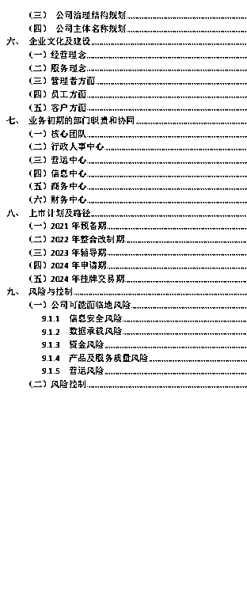  <ne-h4 id="84318ca9" data-lake-id="84318ca9"><ne-heading-ext><ne-heading-anchor></ne-heading-anchor><ne-heading-fold></ne-heading-fold></ne-heading-ext><ne-heading-content><ne-text id="uaaf45ffa" ne-bold="true">三会一层小结：</ne-text></ne-heading-content></ne-h4> <ne-p id="uf8b103f0" data-lake-id="uf8b103f0"><ne-text id="u84f12a86" style="color: rgb(0, 0, 0);">很多初创公司，前期主要是先跑通最小 MVP 模型，让公司先活下来。</ne-text></ne-p> <ne-p id="uabbfe27e" data-lake-id="uabbfe27e"><ne-text id="u9f6401bb" style="color: rgb(0, 0, 0);">或者对三会一层没概念，或者有概念但没执行，创业前期这么操作没问题，但当公司最小 MVP 模型跑通之后准备扩张，三会一层的顶层治理机制就要及时用上，否则就会出现以下情况：</ne-text></ne-p> <ne-p id="uc9811791" data-lake-id="uc9811791"><ne-text id="u73aa6215" ne-bold="true">·</ne-text> <ne-text id="u8855d976" style="color: rgb(0, 0, 0);">公司高管的经营会议，开着开着吵起来了，变成了股东会，我股权多，听我的；</ne-text></ne-p> <ne-p id="u280a067f" data-lake-id="u280a067f"><ne-text id="u3603e22b" ne-bold="true">·</ne-text> <ne-text id="u5c422a60" style="color: rgb(0, 0, 0);">公司越来越赚钱了，所有股东都觉得自己贡献很大，得到的股权分红少，要更多的股权分红；</ne-text></ne-p> <ne-p id="u2d689dfa" data-lake-id="u2d689dfa"><ne-text id="uf7b1ffc4" ne-bold="true">·</ne-text> <ne-text id="u8373f277" style="color: rgb(0, 0, 0);">公司的小股东频繁提出召开股东会，各位股东提出各种议题，徒增内耗；</ne-text></ne-p> <ne-p id="u997d5b47" data-lake-id="u997d5b47"><ne-text id="u160ea4ad" ne-bold="true">·</ne-text> <ne-text id="u9290f8e0" style="color: rgb(0, 0, 0);">公司在某个阶段/某个项目亏钱了，股东们之间各种扯皮，一个个事后诸葛亮；</ne-text></ne-p> <ne-p id="u6a125fa8" data-lake-id="u6a125fa8"><ne-text id="u6238675d" ne-bold="true">·</ne-text> <ne-text id="ud87ba61d" style="color: rgb(0, 0, 0);">公司内部自成一套管理体系，换一个 CEO 就换了一套管理体系；</ne-text></ne-p> <ne-p id="u01926f47" data-lake-id="u01926f47"><ne-text id="ubc5f0e6d" ne-bold="true">·</ne-text> <ne-text id="ua4fe22e1" style="color: rgb(0, 0, 0);">公司里面好多领导，都是领导，随便一个小股东对一个部门负责人都可以吆五喝六的；</ne-text></ne-p> <ne-p id="u7e808615" data-lake-id="u7e808615"><ne-text id="ucea8b7b5" ne-bold="true">· ......</ne-text></ne-p> <ne-p id="udad7e1c7" data-lake-id="udad7e1c7"><ne-text id="uedf597a5" style="color: rgb(0, 0, 0);">（你们能想到的，都可以补充罗列上）</ne-text></ne-p> <ne-h3 id="90f93934" data-lake-id="90f93934"><ne-heading-ext><ne-heading-anchor></ne-heading-anchor><ne-heading-fold></ne-heading-fold></ne-heading-ext><ne-heading-content><ne-text id="ud98eddf7" style="color: rgb(38, 38, 38);">二、组织架构图（初创公司三个部门的基本盘梳理）</ne-text></ne-heading-content></ne-h3> <ne-h4 id="a3f3355d" data-lake-id="a3f3355d"><ne-heading-ext><ne-heading-anchor></ne-heading-anchor><ne-heading-fold></ne-heading-fold></ne-heading-ext><ne-heading-content><ne-text id="u07ce744d" ne-bold="true">第一层：治理层，也就是三会一层</ne-text></ne-heading-content></ne-h4> <ne-p id="u69cab13e" data-lake-id="u69cab13e"><ne-text id="ud6f66c3d" style="color: rgb(0, 0, 0);">股东（大）会——董事会/执行董事——总经理；</ne-text></ne-p> <ne-p id="u7e8a3701" data-lake-id="u7e8a3701"><ne-text id="u5873da98" style="color: rgb(0, 0, 0);">股东（大）会——监事会，监事会只向股东（大）会负责汇报，不归属董事会/执行董事；</ne-text></ne-p> <ne-p id="u25cec8a2" data-lake-id="u25cec8a2"><ne-card data-card-name="image" data-card-type="inline" id="uxXce" data-event-boundary="card">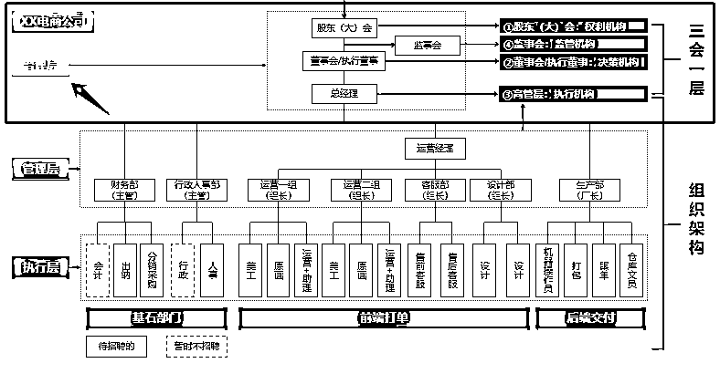  <ne-p id="ub4b1fe92" data-lake-id="ub4b1fe92"><ne-text id="u10caabeb" style="color: rgb(61, 167, 66);">治理层</ne-text></ne-p> <ne-h2 id="9039450f-2" data-lake-id="9039450f-2"><ne-heading-ext><ne-heading-anchor></ne-heading-anchor><ne-heading-fold></ne-heading-fold></ne-heading-ext> <ne-heading-content></ne-heading-content></ne-h2> <ne-h4 id="91e5953e" data-lake-id="91e5953e"><ne-heading-ext><ne-heading-anchor></ne-heading-anchor><ne-heading-fold></ne-heading-fold></ne-heading-ext><ne-heading-content><ne-text id="u513a9d7e" style="color: rgb(0, 0, 0);">第二层：管理层</ne-text></ne-heading-content></ne-h4> <ne-h4 id="173de2ad" data-lake-id="173de2ad"><ne-heading-ext><ne-heading-anchor></ne-heading-anchor><ne-heading-fold></ne-heading-fold></ne-heading-ext><ne-heading-content><ne-text id="u94cc8412" style="color: rgb(0, 0, 0);">第三层：执行层</ne-text></ne-heading-content></ne-h4> <ne-p id="u8a935812" data-lake-id="u8a935812"><ne-text id="ufdb08233" style="color: rgb(0, 0, 0);">初创企业的部门设置不用复杂，就三个部门：</ne-text></ne-p> <ne-p id="u5011ee0f" data-lake-id="u5011ee0f"><ne-text id="u3d70c6ee" style="color: rgb(0, 0, 0);">1、基石部门：财务部、行政人事部等，也有人叫成本部门；</ne-text></ne-p> <ne-p id="ubfb63fda" data-lake-id="ubfb63fda"><ne-text id="u196c4d64" style="color: rgb(0, 0, 0);">2、前端打单部门：负责流量端+转化率端；</ne-text></ne-p> <ne-p id="u5d5d120f" data-lake-id="u5d5d120f"><ne-text id="u1ca65b71" style="color: rgb(0, 0, 0);">3、后端交付部门：负责交付，间接提高公司的客单价+复购率/转介绍；</ne-text></ne-p> <ne-p id="u418ace76" data-lake-id="u418ace76"><ne-card data-card-name="image" data-card-type="inline" id="Zl7sE" data-event-boundary="card">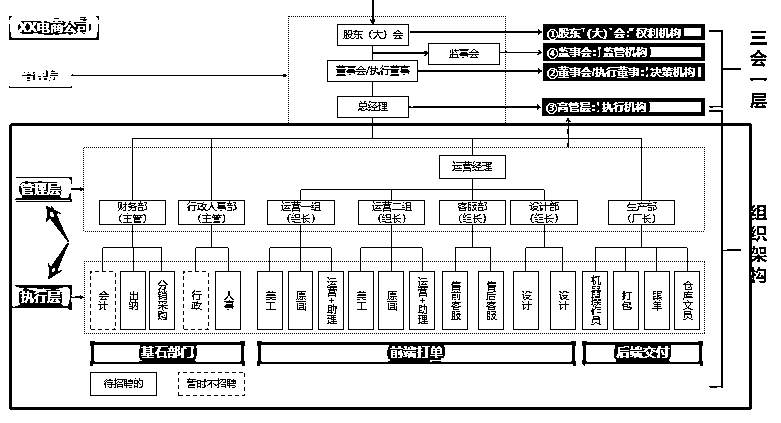  <ne-p id="ud092df08" data-lake-id="ud092df08"><ne-text id="u88afa38e" style="color: rgb(61, 167, 66);">管理层+执行层</ne-text></ne-p> <ne-p id="ubf37c985" data-lake-id="ubf37c985"><ne-text id="u12af6a95" style="color: rgb(0, 0, 0);">注意事项：</ne-text></ne-p> <ne-p id="u12ce4788" data-lake-id="u12ce4788"><ne-text id="uf61da459" style="color: rgb(0, 0, 0);">1、这三个部门（基石部门、前端打单部门、后端交付部门）的领导，直接对接总经理，看过有公司的组织架构图把财务部主管、行政人事部主管放在其他部门经理下，一个公司三大权利，人权、财权、经营管理权，总经理直接把“财权”放在其他部门经理名下，不担心被卷款跑路吗？不担心公司的钱转给诈骗犯吗？如果真的把钱转给了诈骗犯，部门经理能担得了责任吗？</ne-text></ne-p> <ne-p id="u34ad7d44" data-lake-id="u34ad7d44"><ne-text id="u77258c30" style="color: rgb(0, 0, 0);">2、业绩=流量×转化率×客单价×复购率/转介绍；</ne-text></ne-p> <ne-p id="u4eb3e46b" data-lake-id="u4eb3e46b"><ne-text id="u5968221a" style="color: rgb(0, 0, 0);">业绩的五个组成子因素，也就是公司业务流 SOP 的设计，前端打单部门跟后端交付部门一定要分开，如果不分开，要么用股权绑定了高管，有把握高管不会离职；要么就是在把高管培养成老板、培养成竞争对手。大家可以看看自己公司的组织架构图，看有没有在培养老板。</ne-text></ne-p> <ne-p id="u73e0bcb4" data-lake-id="u73e0bcb4"><ne-card data-card-name="image" data-card-type="inline" id="BYbXY" data-event-boundary="card">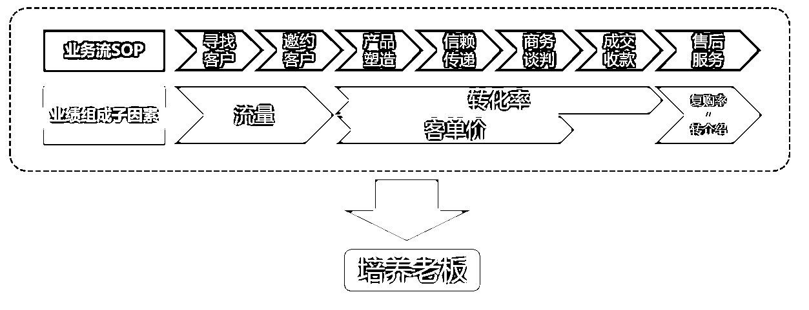  <ne-p id="u77702ba2" data-lake-id="u77702ba2"><ne-text id="u921f9b40" style="color: rgb(61, 167, 66);">业务流 SOP</ne-text></ne-p> <ne-p id="u41b0ca86" data-lake-id="u41b0ca86"><ne-text id="ub2b4affd" style="color: rgb(0, 0, 0);">3、总经理要懂点财务知识：</ne-text></ne-p> <ne-p id="ue17148f3" data-lake-id="ue17148f3"><ne-text id="ubea780e0" style="color: rgb(0, 0, 0);">3.1、平衡好基石部门跟前端打单+后端交付部门之间的投入产出关系。</ne-text></ne-p> <ne-p id="u4c0a0238" data-lake-id="u4c0a0238"><ne-text id="u307bd75f" style="color: rgb(0, 0, 0);">不要在公司的初创期，请一堆的行政、人事、会计、出纳、仓管、前台......前期人不用多，一人多岗，能兼着都先兼着，减少成本；</ne-text></ne-p> <ne-p id="u6767d059" data-lake-id="u6767d059"><ne-text id="u4327811e" style="color: rgb(0, 0, 0);">不要在公司的发展扩张阶段，财务还是外包给财税公司来做，一到年底算账，多交 40%的税都不知道；</ne-text></ne-p> <ne-p id="u6f61784d" data-lake-id="u6f61784d"><ne-text id="udc08f9f5" style="color: rgb(0, 0, 0);">3.2、要平衡好前端打单部门、后面交付部门之间的投入产出关系，</ne-text><ne-text id="ue7f5064b" ne-bold="true">避免大量的人力闲置成本。</ne-text></ne-p> <ne-p id="uda671f07" data-lake-id="uda671f07"><ne-text id="u1948eebf" style="color: rgb(0, 0, 0);">不要公司一群人在前端搞流量、搞成交，后端交付团队交付只有几个人，接不过来；</ne-text></ne-p> <ne-p id="ub57468e7" data-lake-id="ub57468e7"><ne-text id="uab3969a5" style="color: rgb(0, 0, 0);">不要公司一群人在后端等着交付，前端团队没抓取到多少流量，也没有多少成交；</ne-text></ne-p> <ne-p id="uaeb2fd55" data-lake-id="uaeb2fd55"><ne-card data-card-name="image" data-card-type="inline" id="vOKwp" data-event-boundary="card">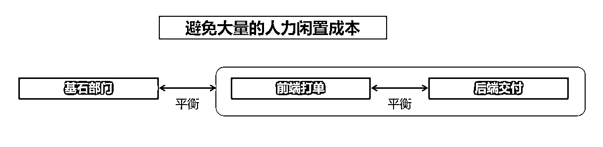  <ne-p id="u2456fa8d" data-lake-id="u2456fa8d"><ne-text id="u1fe38aba" style="color: rgb(61, 167, 66);">这是个技术活</ne-text></ne-p> <ne-h4 id="aad24466" data-lake-id="aad24466"><ne-heading-ext><ne-heading-anchor></ne-heading-anchor><ne-heading-fold></ne-heading-fold></ne-heading-ext><ne-heading-content><ne-text id="u890a4de6" ne-bold="true">组织架构小结：</ne-text></ne-heading-content></ne-h4> <ne-p id="uf65eb29a" data-lake-id="uf65eb29a"><ne-text id="u06fb9830" style="color: rgb(0, 0, 0);">公司的组织架构图分为三层；</ne-text></ne-p> <ne-p id="u1eb953ca" data-lake-id="u1eb953ca"><ne-text id="u55c2a0f1" style="color: rgb(0, 0, 0);">第一层三会一层几乎是恒定的，无非就是在不同发展阶段，增减董事会成员；</ne-text></ne-p> <ne-p id="u94cb679a" data-lake-id="u94cb679a"><ne-text id="ua0302b3b" style="color: rgb(0, 0, 0);">第二层管理层、第三层执行层不是恒定的，随着公司不同的发展阶段、不同项目的参与度、不同项目的角色，管理层、执行层的组织架构图都会随之变化。</ne-text></ne-p> <ne-p id="ub2195e35" data-lake-id="ub2195e35"><ne-text id="uf906e431" style="color: rgb(0, 0, 0);">作为一名合格的总经理，要随着公司战略方针的改变，实时绘制最新的组织架构图以及各部门人员数量安排，编写新的岗位职责，根据投入产比计算新的薪酬体系，达到最优的人效。</ne-text></ne-p> <ne-p id="ub2b02c95" data-lake-id="ub2b02c95"><ne-text id="ub921bc29" style="color: rgb(0, 0, 0);">（有美业公司为了激励销售团队，设置阶梯式提成制度，标的本要设置利润提成，最后设置成了销售额提成，月底一算账，公司还亏钱了。）</ne-text></ne-p> <ne-h3 id="9039450f-3" data-lake-id="9039450f-3"><ne-heading-ext><ne-heading-anchor></ne-heading-anchor><ne-heading-fold></ne-heading-fold></ne-heading-ext> <ne-heading-content></ne-heading-content></ne-h3> <ne-h3 id="3674f738" data-lake-id="3674f738"><ne-heading-ext><ne-heading-anchor></ne-heading-anchor><ne-heading-fold></ne-heading-fold></ne-heading-ext><ne-heading-content><ne-text id="ub38c3cd3" style="color: rgb(38, 38, 38);">三、股权顶层设计，杠杠工具，内部整合高管，外部整合资源</ne-text></ne-heading-content></ne-h3> <ne-p id="u2fe5478b" data-lake-id="u2fe5478b"><ne-text id="u5ab8e5af" style="color: rgb(0, 0, 0);">这个板块的内容，之前在生财广州见面会分享过，也写过精华帖，1 万多字，亦仁大哥也说太长了，没完全看完，有兴趣的可以看下之前的帖子，</ne-text></ne-p> <ne-p id="ub2e18baf" data-lake-id="ub2e18baf"><ne-text id="u891b88de" style="color: rgb(0, 0, 0);">股权激励：</ne-text>[<ne-text id="ub1bae38a">https://t.zsxq.com/05iMB2Zfu</ne-text>](https://t.zsxq.com/05iMB2Zfu)</ne-p> <ne-p id="u03bff2f4" data-lake-id="u03bff2f4"><ne-text id="ub316c7de" style="color: rgb(0, 0, 0);">这里就做个简单的总结，正确的做法以及常见的 16 个坑，这 16 个坑规避了，剩下的坑都是边角料，不用太担心。</ne-text></ne-p> <ne-h4 id="b5442fa0" data-lake-id="b5442fa0"><ne-heading-ext><ne-heading-anchor></ne-heading-anchor><ne-heading-fold></ne-heading-fold></ne-heading-ext><ne-heading-content><ne-text id="uaacb90e5" style="color: rgb(0, 0, 0);">1、顶层控制权</ne-text></ne-heading-content></ne-h4> <ne-p id="u4f38479c" data-lake-id="u4f38479c"><ne-text id="ub01f424d" ne-bold="true">√：有操盘能力、有责任心的好人拥有公司的控制权，让公司按照股东们集体意志向前走，不要被资本稀释抢走盘子，那种过老板瘾的傻逼就不要来了，其实当一把手很累，能做二把手我都不做一把手......</ne-text></ne-p> <ne-p id="uc187971e" data-lake-id="uc187971e"><ne-text id="u42d1be4a" style="color: rgb(0, 0, 0);">×：平均主义，股权均分，雨露均沾，前期没有主要话事人，容易内耗；</ne-text></ne-p> <ne-p id="ude2844a8" data-lake-id="ude2844a8"><ne-text id="u2ae68a2f" style="color: rgb(0, 0, 0);">×：创始人前期股权过度稀释，易失去控制权，进入内耗状态；</ne-text></ne-p> <ne-p id="u04da3c36" data-lake-id="u04da3c36"><ne-text id="u9af84d02" style="color: rgb(0, 0, 0);">×：大股东被小股东绑架，49%：49%：2%，小股东说了算；</ne-text></ne-p> <ne-p id="u0d49ce77" data-lake-id="u0d49ce77"><ne-text id="u2864eef3" style="color: rgb(0, 0, 0);">×：员工直接持股，员工享有表决权，后期不适合要退出，变更手续繁杂；</ne-text></ne-p> <ne-h4 id="e4498c13" data-lake-id="e4498c13"><ne-heading-ext><ne-heading-anchor></ne-heading-anchor><ne-heading-fold></ne-heading-fold></ne-heading-ext><ne-heading-content><ne-text id="u846e2a70" style="color: rgb(0, 0, 0);">2、进入机制</ne-text></ne-heading-content></ne-h4> <ne-p id="ud733d89b" data-lake-id="ud733d89b"><ne-text id="u63708d3f" ne-bold="true">√：资金型股东溢价进入，资源型股东对赌进入，技术型股东专利进入，顾问型股东成果进入，高管团队全职进入（绩效、入职时间为考核因素）</ne-text></ne-p> <ne-p id="u085d8390" data-lake-id="u085d8390"><ne-text id="u92ee3560" style="color: rgb(0, 0, 0);">×：前期资源占股，没拿业绩对赌，空口白牙不要信；</ne-text></ne-p> <ne-p id="ub1cc52fb" data-lake-id="ub1cc52fb"><ne-text id="ud0c99c85" style="color: rgb(0, 0, 0);">×：兼职创业占股，九死一生的创业路，兼职进入，创业之路更难；</ne-text></ne-p> <ne-p id="u010f2181" data-lake-id="u010f2181"><ne-text id="u9afae4e5" style="color: rgb(0, 0, 0);">×：老板想给，员工不想要，没有阐述好股权未来的短期价值、长期价值，员工认为是 PUA;</ne-text></ne-p> <ne-p id="u34b2ea1f" data-lake-id="u34b2ea1f"><ne-text id="u5f58dda9" style="color: rgb(0, 0, 0);">×：股权白送员工，免费，不珍惜；</ne-text></ne-p> <ne-h4 id="15289676" data-lake-id="15289676"><ne-heading-ext><ne-heading-anchor></ne-heading-anchor><ne-heading-fold></ne-heading-fold></ne-heading-ext><ne-heading-content><ne-text id="u35d6ab3a">3</ne-text><ne-text id="ud9e2134f" style="color: rgb(0, 0, 0);">、分配机制</ne-text></ne-heading-content></ne-h4> <ne-p id="ucf03c12f" data-lake-id="ucf03c12f"><ne-text id="u3f779818" ne-bold="true">√：静态分配（企业类型、股东类型权重、各项贡献比求和），</ne-text></ne-p> <ne-p id="uc6f0418b" data-lake-id="uc6f0418b"><ne-text id="u78312594" ne-bold="true">动态调整（股东类型权重调整、股东退出、分红动态调整），</ne-text></ne-p> <ne-p id="udaabd289" data-lake-id="udaabd289"><ne-text id="u301eb98b" ne-bold="true">底层考核因素，对公司的贡献值；</ne-text></ne-p> <ne-p id="ue7e1e0cb" data-lake-id="ue7e1e0cb"><ne-text id="u76c7f120" style="color: rgb(0, 0, 0);">×：按出资额分配股权，对公司出力最多的人，分钱少，心理不平衡，易另起炉灶；</ne-text></ne-p> <ne-p id="uf90e0c66" data-lake-id="uf90e0c66"><ne-text id="u115060fc" style="color: rgb(0, 0, 0);">×：天使投资占大股，同上，对公司出力最多的人，分钱少，心理不平衡，易另起炉灶；</ne-text></ne-p> <ne-p id="u070c47a3" data-lake-id="u070c47a3"><ne-text id="u4818bd88" style="color: rgb(0, 0, 0);">×：股权一股独大，家族企业可以，合伙创业的企业，小股东没激情，1%的分红有什么用；</ne-text></ne-p> <ne-p id="ued944fcd" data-lake-id="ued944fcd"><ne-text id="u9152790b" style="color: rgb(0, 0, 0);">×：不知道怎么分，容易将“员工-经营权”“股东-所有权”混为一谈；</ne-text></ne-p> <ne-h4 id="a263ac4d" data-lake-id="a263ac4d"><ne-heading-ext><ne-heading-anchor></ne-heading-anchor><ne-heading-fold></ne-heading-fold></ne-heading-ext><ne-heading-content><ne-text id="u5d29480b" style="color: rgb(0, 0, 0);">4、退出机制</ne-text></ne-heading-content></ne-h4> <ne-p id="u333df3a0" data-lake-id="u333df3a0"><ne-text id="u6ef9ebf0" ne-bold="true">√：退出时间约束（不到时间不给退，强退一元回购甚至赔偿）、约定回购原则（项目亏损退出一元回购，公司股东有优先购买权）、约定回购价格（项目盈利约定好市盈率估值、净资产估值、最近一次融资金额的 1-3 折估值等计算方式，提前约定，适合所有股东）</ne-text></ne-p> <ne-p id="u404051d4" data-lake-id="u404051d4"><ne-text id="u6ba482f2" style="color: rgb(0, 0, 0);">×：人走股走，后期公司赚钱要给走的人分，后期公司亏损离开的人要背债务；</ne-text></ne-p> <ne-p id="u8cc25e3a" data-lake-id="u8cc25e3a"><ne-text id="ub440120b" style="color: rgb(0, 0, 0);">×：创始人淡出运营不退股，小股东做多分少，没激情继续做；</ne-text></ne-p> <ne-p id="uaff8b368" data-lake-id="uaff8b368"><ne-text id="ufd826174" style="color: rgb(0, 0, 0);">×：退出回购价格无约定，没有约定，就会扯皮，公司陷入内耗；</ne-text></ne-p> <ne-p id="u43c9c3fe" data-lake-id="u43c9c3fe"><ne-text id="uc1dfb4aa" style="color: rgb(0, 0, 0);">×：竞争对手持有公司的股权，没有约定好公司股东有优先购买权；</ne-text></ne-p> <ne-p id="ue6263bd6" data-lake-id="ue6263bd6"><ne-card data-card-name="image" data-card-type="inline" id="Mmvij" data-event-boundary="card">  <ne-p id="ubbe99424" data-lake-id="ubbe99424"><ne-text id="u0b2bd7c4">股权顶层</ne-text></ne-p> <ne-h4 id="0c3223ac" data-lake-id="0c3223ac"><ne-heading-ext><ne-heading-anchor></ne-heading-anchor><ne-heading-fold></ne-heading-fold></ne-heading-ext><ne-heading-content><ne-text id="ua1d74fce" style="color: rgb(0, 0, 0);">5、内部整合高管</ne-text></ne-heading-content></ne-h4> <ne-p id="ue5c2fc70" data-lake-id="ue5c2fc70"><ne-text id="u5571ffb3" style="color: rgb(0, 0, 0);">①KPI 等各种绩效考核方式，高管他们能分多少钱，他们是算得到天花板的。</ne-text></ne-p> <ne-p id="u87e00127" data-lake-id="u87e00127"><ne-text id="u80f60f0b" style="color: rgb(0, 0, 0);">②项目 MVP 已经跑通，可以持续赚钱，如果后期不想操心太多，就要把股权分给总经理管辖的几个部门高管。股权分红联动所有的部门高管，分红金额的天花板是很高的，按照公司的战略方针，公司未来的三年规划，完成对应的业绩，10%股权分红的高管综合收入能高达 100 万，可以拿到百万收入的高管，是不会有心情去市面上找副业的。</ne-text></ne-p> <ne-p id="u7b9a1caa" data-lake-id="u7b9a1caa"><ne-text id="u1672e4c8" style="color: rgb(0, 0, 0);">股权的短期分红、长期溢价的收益，对于员工的激励杠杆，是 KPI 等绩效考核方式无法比拟的。一句很俗也很现实的话，钱在哪，人在哪。</ne-text></ne-p> <ne-h4 id="0c6b05a6" data-lake-id="0c6b05a6"><ne-heading-ext><ne-heading-anchor></ne-heading-anchor><ne-heading-fold></ne-heading-fold></ne-heading-ext><ne-heading-content><ne-text id="u2d0c0aae" style="color: rgb(0, 0, 0);">6、外部整合资源</ne-text></ne-heading-content></ne-h4> <ne-p id="uc82959bf" data-lake-id="uc82959bf"><ne-text id="u809a23d0" style="color: rgb(0, 0, 0);">想一想，如果你现在重新启动一个项目：</ne-text></ne-p> <ne-p id="uad504a53" data-lake-id="uad504a53"><ne-text id="ub8e51e75" style="color: rgb(0, 0, 0);">你手上有资金、有资源（上游渠道、下游渠道）、有技术、有外部顾问型人才、有内部高管型人才，创业成功的概率是不是高了很多，要绑住这五类资源，就用股权绑定，一起把盘子做大，分一起分未来大盘子里面的钱，而不是自己持大股，分小盘子里面的大份收益。</ne-text></ne-p> <ne-h2 id="8df6fbcc" data-lake-id="8df6fbcc"><ne-heading-ext><ne-heading-anchor></ne-heading-anchor><ne-heading-fold></ne-heading-fold></ne-heading-ext> <ne-heading-content></ne-heading-content></ne-h2> <ne-h4 id="941ec151" data-lake-id="941ec151"><ne-heading-ext><ne-heading-anchor></ne-heading-anchor><ne-heading-fold></ne-heading-fold></ne-heading-ext><ne-heading-content><ne-text id="udc59f192" style="color: rgb(0, 0, 0);">股权顶层小结：</ne-text></ne-heading-content></ne-h4> <ne-p id="ue76b32d0" data-lake-id="ue76b32d0"><ne-text id="u70c36e1d" style="color: rgb(0, 0, 0);">不同公司、不同的资源、不同的战略方针、企业的不同阶段，股权顶层设计都不一样，没有放之四海而皆准的股权方案，之前给亦仁大哥设计过一稿股权方案，盘子很大，但也只有亦仁大哥的资源能玩得转。</ne-text></ne-p> <ne-p id="u1ac24568" data-lake-id="u1ac24568"><ne-text id="ufe3b9ebd" style="color: rgb(0, 0, 0);">虽没有放之四海而皆准的方案，但做股权顶层设计时考虑的核心因素，还是顶层控制权、进入机制、分配机制、退出机制。内部不乱，才能更好的打市场，不要让自己奋斗的果实，被别人捡了。</ne-text></ne-p> <ne-h3 id="105e22d0" data-lake-id="105e22d0"><ne-heading-ext><ne-heading-anchor></ne-heading-anchor><ne-heading-fold></ne-heading-fold></ne-heading-ext><ne-heading-content><ne-text id="ua9c24dc3" ne-bold="true">四、一二三总结</ne-text></ne-heading-content></ne-h3> <ne-p id="u39cbeafb" data-lake-id="u39cbeafb"><ne-text id="uf97e71e4">看完上面内容，再看这张图，是不是更有感觉了...</ne-text></ne-p> <ne-p id="ub2666858" data-lake-id="ub2666858"><ne-card data-card-name="image" data-card-type="inline" id="nHCQh" data-event-boundary="card">  <ne-h1 id="28fbfc61" data-lake-id="28fbfc61"><ne-heading-ext><ne-heading-anchor></ne-heading-anchor><ne-heading-fold></ne-heading-fold></ne-heading-ext><ne-heading-content><ne-text id="ubd8c5e96">【生财心态】</ne-text></ne-heading-content></ne-h1> <ne-h2 id="b9c5628e" data-lake-id="b9c5628e"><ne-heading-ext><ne-heading-anchor></ne-heading-anchor><ne-heading-fold></ne-heading-fold></ne-heading-ext><ne-heading-content><ne-text id="uea293c13">（22 赞）《 心理卡点：不敢打广告，打完广告不出单好自闭，怎么办？》</ne-text></ne-heading-content></ne-h2> <ne-p id="uf738d947" data-lake-id="uf738d947"><ne-text id="u600e7092">最近和一些朋友聊天，发现许多做自媒体的新手朋友，对于打广告，都有心理卡点。</ne-text> <ne-text id="u0b33f47e">主要包括不敢打广告，怕打扰好友，怕被人屏蔽拉黑。以及打了广告后没出单，就觉得自己好没用，自闭。</ne-text> <ne-text id="u85891059">看到大家对于打广告这块，是有挺多问题的，那我这个过来人，就来分享一下，如何破除打广告的一些认知和心态的卡点吧~</ne-text></ne-p> <ne-p id="uc8c2b771" data-lake-id="uc8c2b771"><ne-text id="u52847b47">目录如下：</ne-text> <ne-text id="u09969c71">一、为什么你不敢打广告？</ne-text> <ne-text id="u7db8f000">1）你对所卖产品的价值不够认可</ne-text> <ne-text id="uecee0604">2）你对于「人际关系」的理解不到位</ne-text> <ne-text id="u70f4b95a">3）你对于「广告」的理解不到位</ne-text></ne-p> <ne-p id="u059a8118" data-lake-id="u059a8118"><ne-text id="u49c41556">二、打广告之后没成交，感觉挫败怎么办？</ne-text> <ne-text id="u21ab2ca8">1）检查用户有没有问题</ne-text> <ne-text id="uc70efee8">2）检查文案有没有问题</ne-text> <ne-text id="u73897227">3）检查前期铺垫有没有问题</ne-text> <ne-text id="u30248bbe">4）理解道路的曲折，持续努力，用实力和成绩拿下质疑的人</ne-text></ne-p> <ne-p id="u7e74e2cb" data-lake-id="u7e74e2cb"><ne-text id="uebeb5827">正文移步飞书：</ne-text></ne-p> <ne-p id="ubb8a72cf" data-lake-id="ubb8a72cf">[<ne-text id="u26f2699a">https://mkfwp3u79v.feishu.cn/docx/HfJEd0huioyShvxowVfcOMQYnHb</ne-text>](https://mkfwp3u79v.feishu.cn/docx/HfJEd0huioyShvxowVfcOMQYnHb)</ne-p> <ne-h2 id="3b2a5910" data-lake-id="3b2a5910"><ne-heading-ext><ne-heading-anchor></ne-heading-anchor><ne-heading-fold></ne-heading-fold></ne-heading-ext><ne-heading-content><ne-text id="u1a56b4b5">（54 赞）《 生财有术一条信息，5 天时间让我赚回 3 倍生财门票》</ne-text></ne-heading-content></ne-h2> <ne-p id="u1125aa29" data-lake-id="u1125aa29"><ne-text id="ue9ec0483">五天时间靠出售 GPT 账号，赚回了</ne-text><ne-text id="ue2d4b1cc" ne-bold="true">3 倍</ne-text><ne-text id="u08bc4bcc">生财有术门票，收获</ne-text><ne-text id="ub5426f1f" ne-bold="true">百位微信好友</ne-text><ne-text id="uf51f6760">，两个群聊，又积累一次</ne-text><ne-text id="u864875bd" ne-bold="true">实战经验</ne-text><ne-text id="u3644b63d">。</ne-text></ne-p> <ne-p id="u4ed89ebd" data-lake-id="u4ed89ebd"><ne-text id="u98597c9b">这个在淘宝成就一般，最开始上线的一家单店利润估计在 10 万+。</ne-text></ne-p> <ne-p id="u3a2dbe92" data-lake-id="u3a2dbe92"><ne-text id="ufa33eb59">小成就有小成就的复盘。</ne-text></ne-p> <ne-h4 id="fc7bbb71" data-lake-id="fc7bbb71"><ne-heading-ext><ne-heading-anchor></ne-heading-anchor><ne-heading-fold></ne-heading-fold></ne-heading-ext><ne-heading-content><ne-text id="ud9631019" ne-bold="true">一、我是怎么发现这个机会？</ne-text></ne-heading-content></ne-h4> <ne-p id="u8767e756" data-lake-id="u8767e756"><ne-text id="u4dca690f">1\. 日常观察</ne-text></ne-p> <ne-p id="u95be8f4c" data-lake-id="u95be8f4c"><ne-text id="u51e27ee6">女票 iOS 开发，刷即刻看到，有点感兴趣，问我要不要试一下。购买后发现，这 TMD 是个机会啊。</ne-text></ne-p> <ne-p id="u50ea5033" data-lake-id="u50ea5033"><ne-text id="u62a93a83">此刻，只是上架商品，还没大动作。</ne-text></ne-p> <ne-p id="u405790c0" data-lake-id="u405790c0"><ne-text id="u46194654">2.付费圈子</ne-text></ne-p> <ne-p id="ua973efaf" data-lake-id="ua973efaf"><ne-text id="ue8c73ee8">亦仁老板在星球发了消息（知识星球一定要开 plus 提醒！），我突然有了紧迫感，生财的人肯定会上。</ne-text></ne-p> <ne-p id="u161a367c" data-lake-id="u161a367c"><ne-text id="ue42cb5f9">然后坚定信心，亦仁老板为此发通知了，这件事是非常不错的机会，</ne-text><ne-text id="u96ea5852" ne-bold="true">加大力度搞</ne-text><ne-text id="ue18b360f">。</ne-text></ne-p> <ne-h4 id="9ddb5e8f" data-lake-id="9ddb5e8f"><ne-heading-ext><ne-heading-anchor></ne-heading-anchor><ne-heading-fold></ne-heading-fold></ne-heading-ext><ne-heading-content><ne-text id="u341e02b4">二、我是怎么做的？</ne-text></ne-heading-content></ne-h4> <ne-p id="u20d58fc9" data-lake-id="u20d58fc9"><ne-text id="u703b3639">拿一个淘宝店，上三个商品，当天补 20 多单。此刻有商品付款人数已过上百，要搞差异化。</ne-text></ne-p> <ne-p id="u669a35d7" data-lake-id="u669a35d7"><ne-text id="uf2597018" ne-bold="true">1\. 价格差异化：</ne-text></ne-p> <ne-p id="u5752c88e" data-lake-id="u5752c88e"><ne-text id="ube735fae">某宝上大部分是独享账号。我分为两个商品：一个低客单价（定义为：体验号），一个高客单高利润（定义为：个人邮箱号）</ne-text></ne-p> <ne-p id="u4abaa318" data-lake-id="u4abaa318"><ne-text id="u708ed461" ne-bold="true">2\. 体验号：</ne-text><ne-text id="uc7d9e91a">价格更低</ne-text></ne-p> <ne-p id="u7abc676b" data-lake-id="u7abc676b"><ne-text id="u888079fe">需要和别人共享，但我保证可以上去交流体验，提供一个月质保。（如果不能用，直接发新号）</ne-text></ne-p> <ne-p id="ufeebd09e" data-lake-id="ufeebd09e"><ne-text id="uc288db73" ne-bold="true">3</ne-text><ne-text id="u27700452" ne-bold="true">. 个人邮箱号：</ne-text><ne-text id="u24d6b2d9">高客单</ne-text></ne-p> <ne-p id="u4de183cf" data-lake-id="u4de183cf"><ne-text id="u7220ee33">打造安全感（怎么安全呢？邮箱是你的，密码也是你设置的，我只提供个手机号和验证码）</ne-text></ne-p> <ne-p id="u6837224e" data-lake-id="u6837224e"><ne-text id="u0cc261bf">保护隐私（自己独享）</ne-text></ne-p> <ne-p id="ua8abaddb" data-lake-id="ua8abaddb"><ne-text id="u118027dd">因为心理作用，不少人会选择这种。</ne-text></ne-p> <ne-p id="uc6afd14b" data-lake-id="uc6afd14b"><ne-text id="u6a6f5307" ne-bold="true">4\. 关键词差异化：</ne-text></ne-p> <ne-p id="ua51f1355" data-lake-id="ua51f1355"><ne-text id="u59419f1a">补单关键词 ChatGPT 和 OpenAI，有不少人想玩 GPT，却只知道 OpenAI。</ne-text></ne-p> <ne-p id="u8aaa2f76" data-lake-id="u8aaa2f76"><ne-text id="uaeae594b" ne-bold="true">5\. 话术差异化：</ne-text></ne-p> <ne-p id="u342c588a" data-lake-id="u342c588a"><ne-text id="u7f6906d0">专业性。在他还没开口前，我就回答他的疑问。</ne-text></ne-p> <ne-p id="u72b7c2ca" data-lake-id="u72b7c2ca"><ne-text id="ue5699ac3" ne-bold="true">6\. 朋友圈的需求：</ne-text></ne-p> <ne-p id="u0ea46c01" data-lake-id="u0ea46c01"><ne-text id="ue572b5b0">朋友圈也有购买账号需求。通过免费送账号找人补，权重更高。</ne-text></ne-p> <ne-h4 id="f20b02e3" data-lake-id="f20b02e3"><ne-heading-ext><ne-heading-anchor></ne-heading-anchor><ne-heading-fold></ne-heading-fold></ne-heading-ext><ne-heading-content><ne-text id="u83f4e34a" ne-bold="true">三、出单但没有产品，怎么办？</ne-text></ne-heading-content></ne-h4> <ne-h4 id="4fe8b9dd" data-lake-id="4fe8b9dd"><ne-heading-ext><ne-heading-anchor></ne-heading-anchor><ne-heading-fold></ne-heading-fold></ne-heading-ext><ne-heading-content></ne-heading-content></ne-h4><ne-h4 id="461a6239" data-lake-id="461a6239"><ne-heading-ext><ne-heading-anchor></ne-heading-anchor><ne-heading-fold></ne-heading-fold></ne-heading-ext><ne-heading-content><ne-text id="u7fd1e20c" ne-bold="true">1.找竞品买</ne-text></ne-heading-content></ne-h4> <ne-p id="u8ac09824" data-lake-id="u8ac09824"><ne-text id="u69a69101">每单亏 5 元，没关系。后期回来就行。要的是速度。</ne-text></ne-p> <ne-p id="u30490e7e" data-lake-id="u30490e7e"><ne-text id="u8a94eaf9">过程中发现一个邮箱可以同时登录。</ne-text></ne-p> <ne-p id="udc39c428" data-lake-id="udc39c428"><ne-text id="u6ce34814">ok，买两个就够用了。在不能用前，研究好自己注册</ne-text></ne-p> <ne-p id="u64b41243" data-lake-id="u64b41243"><ne-text id="u3ca417b1" ne-bold="true">2.自己注册（供应链要把握自己手里，可控）</ne-text></ne-p> <ne-p id="u986fe3e4" data-lake-id="u986fe3e4"><ne-text id="ue848cee2">面临解决手机号、邮箱两大问题？</ne-text></ne-p> <ne-p id="u5c86b720" data-lake-id="u5c86b720"><ne-text id="u8d830613" ne-bold="true">手机号</ne-text><ne-text id="u8bcb1475">，全网找了一圈能用的一个都没有（此刻还没有免费注册攻略），但是在生财风向标里居然让我找到了！！！让我比别人快一步</ne-text></ne-p> <ne-p id="u87405740" data-lake-id="u87405740"><ne-text id="ub44153b8" ne-bold="true">批量邮箱</ne-text><ne-text id="u7ae67b2c">，参加生财 TikTok 大航海，记得有这样的工具，但是有点遗忘。此处感谢 R 神、Sky 老思。</ne-text></ne-p> <ne-h4 id="bb7550c1" data-lake-id="bb7550c1"><ne-heading-ext><ne-heading-anchor></ne-heading-anchor><ne-heading-fold></ne-heading-fold></ne-heading-ext><ne-heading-content><ne-text id="u63e0fb79" ne-bold="true">四、过程中遇到哪些问题？</ne-text></ne-heading-content></ne-h4> <ne-p id="u75992d18" data-lake-id="u75992d18"><ne-text id="u6d3ab4be" ne-bold="true">1.价格太高->见人定价</ne-text></ne-p> <ne-p id="u975571d0" data-lake-id="u975571d0"><ne-text id="ue31cea7e">有的人觉得价格高，你提一嘴“如果帮忙收藏加购关注店铺，可以给您便宜 xxx 元”</ne-text></ne-p> <ne-p id="u5432581c" data-lake-id="u5432581c"><ne-text id="u757f56d8">这样他得到优惠，你也提高了权重。最重要的是他觉得这个是付出得来的，这个优惠券是有分量的，不是随随便便领的优惠券。</ne-text></ne-p> <ne-p id="u06cbf55f" data-lake-id="u06cbf55f"><ne-text id="u3a74098d" ne-bold="true">2.用不了->红包补偿</ne-text></ne-p> <ne-p id="u2832eca3" data-lake-id="u2832eca3"><ne-text id="u23513ceb">有些东西不能教，只要提到不会弄的，直接发红包让他确认收货。</ne-text></ne-p> <ne-p id="u912890f6" data-lake-id="u912890f6"><ne-text id="u82bdb4bf" ne-bold="true">3.不满意->红包补偿</ne-text></ne-p> <ne-p id="ua1ac4074" data-lake-id="ua1ac4074"><ne-text id="u644888cd">解决他的不满意，大不了发红包补偿</ne-text></ne-p> <ne-p id="u7ad6e421" data-lake-id="u7ad6e421"><ne-text id="udf610b41" ne-bold="true">4.申请退款->红包补偿</ne-text></ne-p> <ne-p id="ud612f2d7" data-lake-id="ud612f2d7"><ne-text id="u6e90307f">不要让他退，直接先发红包，然后确认收货（相当于补一单）</ne-text></ne-p> <ne-p id="u9fa4f9e9" data-lake-id="u9fa4f9e9"><ne-text id="u631141c0">目前还没遇到发了红包，还继续申请退款的。就算有，比例不大，可忽略</ne-text></ne-p> <ne-p id="u6d9a8005" data-lake-id="u6d9a8005"><ne-text id="uc9cc12f6" ne-bold="true">以上操作，在淘宝关键词流量下滑同时我的利润是上升的。</ne-text></ne-p> <ne-p id="uaa8e97be" data-lake-id="uaa8e97be"><ne-card data-card-name="image" data-card-type="inline" id="qgY0j" data-event-boundary="card">  <ne-p id="udc6a6c5e" data-lake-id="udc6a6c5e"><ne-card data-card-name="image" data-card-type="inline" id="gjrNz" data-event-boundary="card">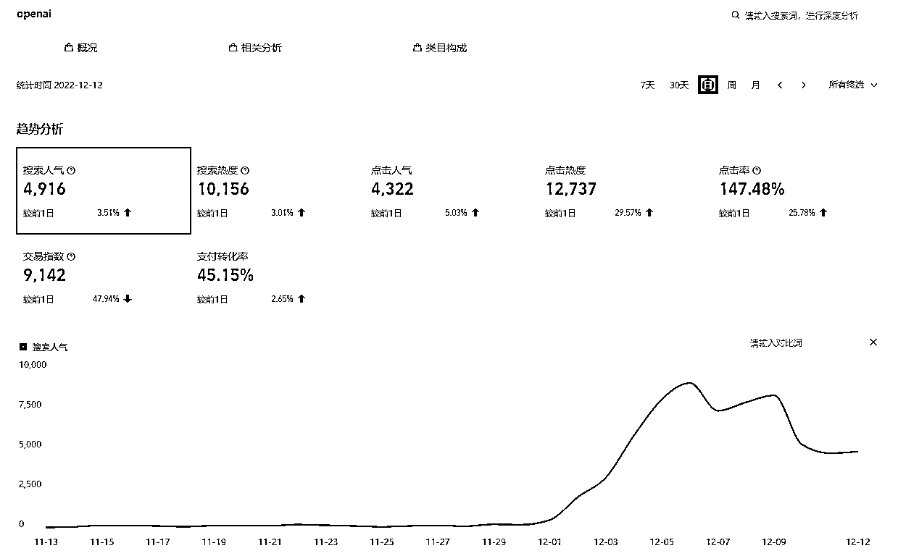  <ne-h4 id="26bee1a2" data-lake-id="26bee1a2"><ne-heading-ext><ne-heading-anchor></ne-heading-anchor><ne-heading-fold></ne-heading-fold></ne-heading-ext><ne-heading-content><ne-text id="ua43f6227">五、之后怎么做？</ne-text></ne-heading-content></ne-h4> <ne-p id="uf6cdd763" data-lake-id="uf6cdd763"><ne-text id="u8b7b9fe8">不久，淘宝上相关商品全部被下架一波。我也没在做了，反正这次行动圆满成功！</ne-text></ne-p> <ne-p id="u1b9de378" data-lake-id="u1b9de378"><ne-text id="u43177e3f" ne-bold="true">解决用户登录难的问题</ne-text></ne-p> <ne-p id="ucf77ec3f" data-lake-id="ucf77ec3f"><ne-text id="uaba88d88">微信好友部署（容易封号不长久）</ne-text></ne-p> <ne-p id="u9816627c" data-lake-id="u9816627c"><ne-text id="uac61bd74" ne-bold="true">公众号/网站部署</ne-text><ne-text id="u3ec01981">（目前还在迭代中，后续</ne-text><ne-text id="u1551ec22" ne-bold="true">考虑替别人部署变现</ne-text><ne-text id="ue9f001f4">）</ne-text></ne-p> <ne-p id="u4445a6d8" data-lake-id="u4445a6d8"><ne-text id="ubb034990">目前已实现功能：基础对话能力、敏感词过滤、简易化部署服务等。</ne-text></ne-p> <ne-h4 id="9039450f-4" data-lake-id="9039450f-4"><ne-heading-ext><ne-heading-anchor></ne-heading-anchor><ne-heading-fold></ne-heading-fold></ne-heading-ext> <ne-heading-content></ne-heading-content></ne-h4> <ne-h4 id="b4daec2f" data-lake-id="b4daec2f"><ne-heading-ext><ne-heading-anchor></ne-heading-anchor><ne-heading-fold></ne-heading-fold></ne-heading-ext><ne-heading-content><ne-text id="ucdac0661">六、心得：</ne-text></ne-heading-content></ne-h4> <ne-p id="u90e01c2e" data-lake-id="u90e01c2e"><ne-text id="uf0bfa412">没啥太难的东西，就是</ne-text><ne-text id="u33757b70" ne-bold="true">速度快</ne-text><ne-text id="ue80b0208">，先上再说</ne-text></ne-p> <ne-p id="u9339ce0a" data-lake-id="u9339ce0a"><ne-text id="ua51f360a">用心持续优化，每个地方比别人更好一点点</ne-text></ne-p> <ne-p id="u4b7e7078" data-lake-id="u4b7e7078"><ne-text id="u4bfac2cd" ne-bold="true">开拓视野</ne-text><ne-text id="u0a60d098">。平时多参与航海，看看有哪些小工具小技巧小商机是你不知道的</ne-text></ne-p> <ne-p id="u9d4499af" data-lake-id="u9d4499af"><ne-text id="u56b55066" ne-bold="true">够狠</ne-text><ne-text id="ue30192c9">。当时如果拿多个淘宝店上，利润应该翻好几倍。（没店，另外是低估单店利润）</ne-text></ne-p> <ne-h2 id="69a02612" data-lake-id="69a02612"><ne-heading-ext><ne-heading-anchor></ne-heading-anchor><ne-heading-fold></ne-heading-fold></ne-heading-ext><ne-heading-content><ne-text id="ud4470d97">（85 赞）《 一个从未做过销售的纯粹的 HR，如何靠私域变现副业年纯利润达 7 位数》</ne-text></ne-heading-content></ne-h2> <ne-p id="u8d4a57e7" data-lake-id="u8d4a57e7"><ne-text id="u3d427e53">我是莫掌柜，出生在豫西地区的一个小村庄，人生前 17 年经历平淡无奇，唯一成就是考上吉林大学远赴东北读书，从此家乡成为远方。 2008 年参加工作至今 14 年，我有几个标签。 我是经历过互联网公司从 0-1-上市的公司核心骨干，2018 年开始担任公司人力行政负责人，直接向 CEO 汇报。 我是社交电商每日一淘万人团队长（副业），短短 5 个月时间招商到 3 万会员，因擅长培训担任公司商学院院长。</ne-text></ne-p> <ne-p id="u846bea90" data-lake-id="u846bea90"><ne-text id="u277febe1">我 2020 转战大健康微商，把过往职场的运营经验迁移至微商，如今是年营收几百万的微商团队长，同时也在做实体门店私域变现咨询业务。 去年加入生财以后在这里认识了很多新朋友。很多人觉得我的经历跨度很大，很好奇我一个从未做过销售的纯粹的 HR，是如何蜕变成靠私域变现纯利润达 7 位数的微商团队长的，一直怂恿我写个帖子分享一下，拖延症重度患者终于决定行动起来，今天我来分享一下。</ne-text></ne-p> <ne-p id="u373e3668" data-lake-id="u373e3668"><ne-text id="uaa146d64">文章较长，请移步链接：</ne-text></ne-p> <ne-p id="ubfcf01e0" data-lake-id="ubfcf01e0">[<ne-text id="uf5bbc78b">https://shimo.im/docs/WDi7TI5GF68Kqqy8/read</ne-text>](https://shimo.im/docs/WDi7TI5GF68Kqqy8/read)</ne-p> <ne-h2 id="916e5959" data-lake-id="916e5959"><ne-heading-ext><ne-heading-anchor></ne-heading-anchor><ne-heading-fold></ne-heading-fold></ne-heading-ext><ne-heading-content><ne-text id="u92c28e60">（68 赞）《 我在精华共读航海找到了副业项目，月入 1 万+》</ne-text></ne-heading-content></ne-h2> <ne-p id="u277229a9" data-lake-id="u277229a9"><ne-text id="u3da8dc26">Hi，我是可可陶，</ne-text><ne-text id="uc307cacf" ne-bold="true">一个不安于现状，不断折腾的二宝妈妈。刚开始做在小说推文的项目一个多月，现在可以有 1 万+的副业收入啦！</ne-text></ne-p> <ne-p id="ube888d7b" data-lake-id="ube888d7b"><ne-text id="ub9209e26">我从事幼儿音乐启蒙教育 15 年+，但是疫情原因，线下课总是被动停课，加上我一直在思考如何不被外界因素干扰解决收入问题（如生病，想周末多陪家人，年老退休等），原本坚持只开线下课的我，也开始看线上的机会。</ne-text></ne-p> <ne-h4 id="6447c25d" data-lake-id="6447c25d"><ne-heading-ext><ne-heading-anchor></ne-heading-anchor><ne-heading-fold></ne-heading-fold></ne-heading-ext><ne-heading-content><ne-text id="u52ffdbec">一、初入自媒体，入局知识付费无果</ne-text></ne-heading-content></ne-h4> <ne-p id="u2a7b0b2d" data-lake-id="u2a7b0b2d"><ne-text id="u02b2f29e">你们看我的从业经历，是不是觉得特别适合做知识付费？我一开始也是这么想的，而且刚好撞在知识付费的风口。今年初，我决定尝试设计规划“线上音乐启蒙课”的课程体系。而且通过数据分析， 我发现这是一门蓝海市场的课程，目前几乎没有头部。而我的音乐启蒙课在声乐，舞蹈，乐器等等领域都适用。</ne-text></ne-p> <ne-p id="u28da7d0a" data-lake-id="u28da7d0a"><ne-text id="uf0c569a0">这半年，我经历了非常大工作量的录课，剪辑，PPT 课程制作，然后开始投入转化，结果却不尽人意！</ne-text></ne-p> <ne-p id="ud0bd6b48" data-lake-id="ud0bd6b48"><ne-text id="uc911fea6">转化期间，我依次做过短期的直播→转“短视频”→后调整方向重新直播，每一次的转变都是因为效果不好，但又找不到好的解决方案，以心态崩溃而收场。</ne-text></ne-p> <ne-oli><ne-oli-i>1</ne-oli-i><ne-oli-c class="ne-oli-content" id="ucfe4c496" data-lake-id="ucfe4c496"><ne-text id="u43dbdc1e">6 月第一次直播：直播一周数据不好，找不到解决办法，崩溃。</ne-text></ne-oli-c></ne-oli> <ne-oli><ne-oli-i>2</ne-oli-i><ne-oli-c class="ne-oli-content" id="ua7c53fd2" data-lake-id="ua7c53fd2"><ne-text id="u5aa085e9">7 月尝试做短视频：每天花近一小时的录制，花 2 小时剪辑为了最后 10 分钟左右的视频，播放量不高，还是失败</ne-text></ne-oli-c></ne-oli> <ne-oli><ne-oli-i>3</ne-oli-i><ne-oli-c class="ne-oli-content" id="u0efe0787" data-lake-id="u0efe0787"><ne-text id="ud1e7782b">8 月重新调整直播搞：冷启动还是打不开，再次崩溃。</ne-text></ne-oli-c></ne-oli> <ne-p id="u3495cb41" data-lake-id="u3495cb41"><ne-text id="u4a2a5fd3">迟迟得不到正反馈的我，有点不知道怎么办了，于是我开始看生财里的精华帖，来寻找适合自己解决方式。</ne-text></ne-p> <ne-h4 id="dc8fe766" data-lake-id="dc8fe766"><ne-heading-ext><ne-heading-anchor></ne-heading-anchor><ne-heading-fold></ne-heading-fold></ne-heading-ext><ne-heading-content><ne-text id="uccdee7d9">二、本想参加精华共读只是为了提升认知</ne-text><ne-text id="u75c52fda" style="color: rgb(222, 120, 2);">（无心插柳）</ne-text><ne-text id="ud3a2c13b">，结果遇到了适合的副业项目</ne-text><ne-text id="u297e41a1" style="color: rgb(222, 120, 2);">（柳成阴）</ne-text></ne-heading-content></ne-h4> <ne-p id="u574d2f93" data-lake-id="u574d2f93"><ne-text id="u4b60548d">——</ne-text><ne-text id="u7edab0ff" ne-bold="true">本想这个只是作为副业，结果可能快变成主业了~</ne-text><ne-text id="u69c0688b" ne-bold="true">（众里寻他千百度。蓦然回首，那人却在，灯火阑珊处）</ne-text></ne-p> <ne-p id="ucbdc6de8" data-lake-id="ucbdc6de8"><ne-text id="uf38cab10">我在今年初入生财时，面对几千篇的精华帖，说实话真的是看的目不暇接，越看越乱。当我迷茫该如何选择时，刚好在 9 月的航海公告里出现了：精华共读项目——感谢老天的眷顾。</ne-text></ne-p> <ne-p id="u14a7a738" data-lake-id="u14a7a738"><ne-text id="u703f1835">之所以参加了精华共读航海，是因为我发现认知限制了我的想象，我也永远赚不到认知以外的钱，我希望可以摆脱这种迷茫的感觉，提升认知，所以在国庆后正式上船了~</ne-text></ne-p> <ne-p id="u8c5e31cc" data-lake-id="u8c5e31cc"><ne-text id="uf19404ea">航海要求我们一周三篇读的是指定精华帖，其余可以自己选择。不得不说生财团队太有心了，挑选出几乎是近期热门项目里的顶级精华帖。如果自己想要找到这些，你需要能力，时间，精力缺一不可。</ne-text></ne-p> <ne-p id="u1382b8a0" data-lake-id="u1382b8a0"><ne-text id="u4ec194f5" ne-bold="true">在航海期间，我根据帖子的内容情况，分两种读帖的方式（如有更好的，非常欢迎来互相学习探讨）：</ne-text></ne-p> <ne-oli><ne-oli-i>1</ne-oli-i><ne-oli-c class="ne-oli-content" id="u207f93e0" data-lake-id="u207f93e0"><ne-text id="uc154b99c">特别感兴趣，门槛低适合自己的，收藏后安排时间细读。</ne-text></ne-oli-c></ne-oli> <ne-oli><ne-oli-i>2</ne-oli-i><ne-oli-c class="ne-oli-content" id="u65fa66a8" data-lake-id="u65fa66a8"><ne-text id="u29b25100">自己没兴趣，或者项目太大，粗略看一遍学习思维提高认知，收藏。</ne-text></ne-oli-c></ne-oli> <ne-p id="u35a0f9d7" data-lake-id="u35a0f9d7"><ne-text id="ucab8ec1e" ne-bold="true">第一周 ：想尝试“地推拉新”，但没能开始</ne-text></ne-p> <ne-p id="u3d87a8ca" data-lake-id="u3d87a8ca"><ne-text id="ub9a7eb50">第一周我读到的精华篇里有一篇是关于“地推拉新”，感觉门槛较低，我想试试，就马上联系了作者老师。当我联系完老师，TA 说现在已经不做这个项目了。因为互联网里的有些项目红利期非常快，是赚一个时间段的收益，过了这个时期，做项目的成本和难度就会增加。</ne-text></ne-p> <ne-p id="u571d765f" data-lake-id="u571d765f"><ne-text id="u600c1f32" ne-underline="true">所以我的总结是：如果有些精华篇是几个月前发布的，现在可能不受用了，但是学习的思路、底层逻辑是可以互通的。</ne-text></ne-p> <ne-p id="uf5e438bf" data-lake-id="uf5e438bf"><ne-text id="ua70e7328" ne-bold="true">第二周：看完“小说推文”精华帖，我决定选择这个项目</ne-text></ne-p> <ne-p id="uc8fa2e6a" data-lake-id="uc8fa2e6a"><ne-text id="u54e96258">第二周的精华帖里，有一篇特别吸引我，就是@Seven 老师的小说推文，读完后我就跃跃欲试。</ne-text></ne-p> <ne-p id="u9d4b189c" data-lake-id="u9d4b189c"><ne-text id="ude929a4d">当时读完后，对这个项目的一些感受是：</ne-text></ne-p> <ne-oli><ne-oli-i>1</ne-oli-i><ne-oli-c class="ne-oli-content" id="u9726b098" data-lake-id="u9726b098"><ne-text id="u392aa663">小说推文是最适合新手的项目，没有之一；几乎没有门槛，唯一的门槛就是执行力。</ne-text></ne-oli-c></ne-oli> <ne-oli><ne-oli-i>2</ne-oli-i><ne-oli-c class="ne-oli-content" id="ue17f4142" data-lake-id="ue17f4142"><ne-text id="u422d3ab3">不要怀疑项目，要学会变通；不要抱怨，要拥抱变化。有些时候不是项目不行，是你不行。</ne-text></ne-oli-c></ne-oli> <ne-oli><ne-oli-i>3</ne-oli-i><ne-oli-c class="ne-oli-content" id="u9aa4571c" data-lake-id="u9aa4571c"><ne-text id="ud9d9e51f">如果想到进阶，就要认真做复盘。小说推文是一个细致的工作，需要不断打磨每个流程，数据才会提高。</ne-text></ne-oli-c></ne-oli> <ne-p id="u9ddbc970" data-lake-id="u9ddbc970"><ne-text id="u5102fb4f" style="color: rgb(222, 120, 2);">最后我决定跟着做这个小说推文的项目，原因有二：</ne-text></ne-p> <ne-p id="u74874301" data-lake-id="u74874301"><ne-text id="u21371a5c" ne-bold="true">1、适合个人做副业</ne-text></ne-p> <ne-p id="ubd56ab44" data-lake-id="ubd56ab44"><ne-text id="udc53b695">因为这个项目正反馈快，个人很容易坚持下来，门槛低，一个人就能操作，不需要搭建系统，会发抖音就可以。</ne-text><ne-text id="uf107c150" ne-bold="true">我的音乐启蒙课还在路上，我得找个副业，维持疫情期的经济状况，并且要承受着随时会停工停课的压力。</ne-text></ne-p> <ne-p id="u243ff0cf" data-lake-id="u243ff0cf"><ne-text id="u1fa25fc1" ne-bold="true">2、适合作为创业项目去做</ne-text></ne-p> <ne-p id="ud7ede6a7" data-lake-id="ud7ede6a7"><ne-text id="ue2a25e5e">这个项目的 sop 流程简单，适合从 0 搭建初始团队。不需要启动资金，没有什么成本，容易放大。</ne-text></ne-p> <ne-p id="u82f0e05a" data-lake-id="u82f0e05a"><ne-text id="ub9e5987d">决定要投入到这个项目之后，我马上开始行动。我首先准备了：</ne-text></ne-p> <ne-p id="u6510ecf4" data-lake-id="u6510ecf4"><ne-text id="u3d8f3f3e">手机号：3-5 个</ne-text></ne-p> <ne-p id="u2e82b1bb" data-lake-id="u2e82b1bb"><ne-text id="u19ddad06">抖音号：3-5 个（新注册的就行）</ne-text></ne-p> <ne-p id="u9825f4c9" data-lake-id="u9825f4c9"><ne-text id="uf129e108">空闲时间：（每天 2 个小时以上）</ne-text></ne-p> <ne-p id="ufe278da2" data-lake-id="ufe278da2"><ne-text id="u4eee0edc" ne-underline="true">（空间时间 2 小时以上，这是老师说的，刚开始的一周我每天至少花半天的时候，学习课程；找对标分析；版面制作等。)</ne-text></ne-p> <ne-p id="u50986ba6" data-lake-id="u50986ba6"><ne-text id="u38f5ad3d">(具体可以参考 SEVEN 老师的帖子)</ne-text></ne-p> <ne-p id="ua9bf697b" data-lake-id="ua9bf697b"><ne-text id="u124fec4c" ne-bold="true">这一个月做项目的时间里，我不断的碰到问题，不断的找办法解决。从模仿、到注销重开，再到持续的运作，似乎每一周都在突破之前的自己。</ne-text></ne-p> <ne-p id="u324a8209" data-lake-id="u324a8209"><ne-text id="u0c9b2c7d" ne-bold="true">第一周：</ne-text></ne-p> <ne-p id="ua263e103" data-lake-id="ua263e103"><ne-text id="ub4c3f964">当我兴冲冲的找到老师想学习时，却发现已经停止招生了，可是我好不容易找到了合适的项目，正跃跃欲试呢，还没开始怎么能就这样放弃呢？所以我和老师沟通让我插班进去。不出意外，群里有同学是之前做过，有同学已熟悉完整个流程。我真的很着急，担心跟不上队伍，于是开始反复的听课做笔记，每天起码有半天时间学习研究对标，有问题就私信轰炸老师，终于在这周完成了整个流程，赶上了进度。</ne-text></ne-p> <ne-p id="uf8406cd5" data-lake-id="uf8406cd5"><ne-text id="ucc9a2e00">而且我还发现自己对书的内容都不熟悉，那怎么推荐给别人呢？愁了很久，还是决定先做，开始做最重要，质量可以慢慢优化，先模仿再说。</ne-text></ne-p> <ne-p id="u2e34b4f4" data-lake-id="u2e34b4f4"><ne-text id="uca5c7cda" ne-bold="true">第二周</ne-text><ne-text id="ue39d15ba">：</ne-text></ne-p> <ne-p id="u057b4e2e" data-lake-id="u057b4e2e"><ne-text id="u306467cd">刚开始做这个项目，还是需要 3-5 个手机号做替换。我还不知道能赚到第一个 100 元吗？能走多远呢？所以我想能省既省，那怕需要花 50-80 块钱的手机号月租，我也不太舍得。身边的年轻朋友、亲戚几乎都下载了小红书、抖音；父母年纪大了，怕我要手机号万一被骗不肯给...</ne-text></ne-p> <ne-p id="ub9032594" data-lake-id="ub9032594"><ne-text id="u50f12644">我又去万能的某宝搜，由于缺乏经验，买了个虚拟号不能用。在问了老师、同学后终于办上了两个性价比较高的手机号，算是解决了前期的“设备、账号问题”。</ne-text></ne-p> <ne-p id="u0c7b3fde" data-lake-id="u0c7b3fde"><ne-text id="u0a639277" ne-bold="true">第三周</ne-text><ne-text id="uf21e55bf">：</ne-text><ne-text id="u77c9c7f5" style="color: rgb(230, 115, 0);">号码搞定，运作正常，开始爆单。</ne-text></ne-p> <ne-p id="u7a3060fe" data-lake-id="u7a3060fe"><ne-text id="u8254eddd">号码搞定，松了口气，继续出发。新的困难又来袭：两台手机 5 个手机号登陆。初出茅庐的我，被这么多的手机号以及各自发出的帖子，搞得头昏脑涨。导致最后，哪个号是配对哪个手要号注册的，全部混乱。这样没有固定的情况下，很容易被风控。</ne-text></ne-p> <ne-p id="u31caa353" data-lake-id="u31caa353"><ne-text id="udf911d62">还是需要合理的制定文案来管理，于是就有了下面的表格初稿。</ne-text></ne-p> <ne-p id="u3b2ad298" data-lake-id="u3b2ad298"><ne-text id="uf8b8bc30">（附上我的表格：烂开始，比较简单粗暴。如果您有更好的管理文案，欢迎大神们多多指教！）</ne-text></ne-p> <ne-p id="u3a300ae0" data-lake-id="u3a300ae0"><ne-card data-card-name="image" data-card-type="inline" id="iS3VO" data-event-boundary="card">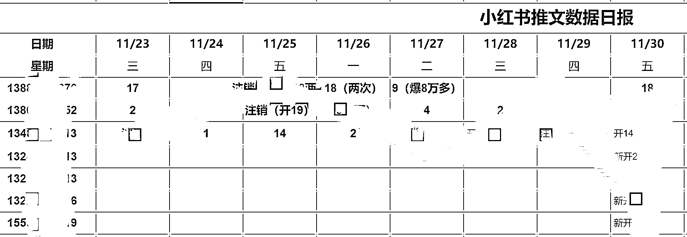  <ne-p id="ud250c4d0" data-lake-id="ud250c4d0"><ne-text id="u92e0c855">有工作有两娃的我，需要增加投入时间，也许才能让这项副业起色起来，所以我经常睡得比猪晚，起得比鸡早。有时，忙了一天后，实在太困太累想睡觉。万般挣扎后，决定：咬咬牙，跟自己打气：其实最多也就再晚睡半个小时而已，挺住哦，万一发完就爆贴了呢..（事实证明：真的是这样哦。有时发完去睡了，第二天起床就会给我一个大惊喜）...</ne-text></ne-p> <ne-p id="u31af5b9e" data-lake-id="u31af5b9e"><ne-text id="u5d947c72" ne-bold="true">第四周：</ne-text></ne-p> <ne-p id="ub4f8a999" data-lake-id="ub4f8a999"><ne-text id="u71707c58">发多了帖子被平台限流，是再正常不过的原因了。群里有些同学会发愁：怎么办，要不再等等...再看看...再发几篇...</ne-text></ne-p> <ne-p id="u132c80b6" data-lake-id="u132c80b6"><ne-text id="u251b88a3">我的想法是：我不想守株待兔，多等一天就多耽误一天的收入（时间=收入）。而刚好当时几天老师又特别忙，急性子的我，不想把问题堆积起来等好几天。于是，我要主动去做测试，哪种方法更有效：于是我的重复动作就是：</ne-text><ne-text id="u2b35a0fe" ne-bold="true">注销，开，注销，开。</ne-text><ne-text id="u68d424f3">同时又厚着脸皮去各渠道去逮专家老师咨询，并且再深入研究对标。（在生财里看到出现频率最多的词就是“像素级模仿”）</ne-text></ne-p> <ne-p id="uf1c458e4" data-lake-id="uf1c458e4"><ne-text id="u4cc36d2c">seven 老师在帖子里说到：</ne-text></ne-p> <ne-p id="ua88a797b" data-lake-id="ua88a797b"><ne-card data-card-name="image" data-card-type="inline" id="wKNaF" data-event-boundary="card">  <ne-p id="u7c064f33" data-lake-id="u7c064f33"><ne-text id="u9480bb1a">所以我想，那我就坚持做下去吧，没想到很幸运的是，第一周我就突破了 0-1，这个被称为最困难的阶段（80%的人倒在 0-1 的阶段）</ne-text></ne-p> <ne-p id="u23fbe888" data-lake-id="u23fbe888"><ne-text id="u9e88278f">我的单数也在逐渐的增加：</ne-text></ne-p> <ne-oli><ne-oli-i>1</ne-oli-i><ne-oli-c class="ne-oli-content" id="u1f1faea5" data-lake-id="u1f1faea5"><ne-text id="ufb5481d6">第一周出 26 单 （很欣慰的起步，很多同学第一周是 0)</ne-text></ne-oli-c></ne-oli> <ne-oli><ne-oli-i>2</ne-oli-i><ne-oli-c class="ne-oli-content" id="u34d28341" data-lake-id="u34d28341"><ne-text id="udc2c1e21">第二周 67 单（已完成一开始定的目标——99 单）</ne-text></ne-oli-c></ne-oli> <ne-oli><ne-oli-i>3</ne-oli-i><ne-oli-c class="ne-oli-content" id="ueea44fc5" data-lake-id="ueea44fc5"><ne-text id="u75c338e8">第三周 120 单，收入 1000+</ne-text></ne-oli-c></ne-oli> <ne-oli><ne-oli-i>4</ne-oli-i><ne-oli-c class="ne-oli-content" id="ue262f72b" data-lake-id="ue262f72b"><ne-text id="u5d23f2e0">第四周：已经熟悉了基本流程，决定逐步扩号</ne-text></ne-oli-c></ne-oli> <ne-oli><ne-oli-i>5</ne-oli-i><ne-oli-c class="ne-oli-content" id="ue9127b6d" data-lake-id="ue9127b6d"><ne-text id="u6009b517">一月之后：稳步发展并逐步扩大；由于我的执行力和认知思维的提升，很荣幸得到老师的认可，并收我为徒，外加兼职助理。我的目标：短期内（1-2 月）：月收入突然：2-3 万；中长期（6 个月-1 年）有自己的团队。</ne-text></ne-oli-c></ne-oli> <ne-p id="u5ed642e7" data-lake-id="u5ed642e7"><ne-text id="uc5241926">至此，小说推文已经给了我迈出更多步的正反馈，所以后来在读精华帖时，我又发现一个适合自己的项目——小红书私域引流变现。</ne-text></ne-p> <ne-p id="uf55129ca" data-lake-id="uf55129ca"><ne-text id="u385d6bd7">考虑到自己的音乐启蒙课，我还是想要尝试一下引流转化的变现路径，所以咨询了精华帖的作者，也报名参加了小红书资料引流航海，准备开启新项目的探索，迎接更大的挑战。</ne-text></ne-p> <ne-p id="u37d25b7d" data-lake-id="u37d25b7d"><ne-text id="uc4dc5d4a">P.S:这里可参考星球帖：《普通人如何提升"赚钱的技能"：用好 3 个新杠杆》</ne-text>[<ne-text id="u616a0559">https://t.zsxq.com/08UazF0kR</ne-text>](https://t.zsxq.com/08UazF0kR)</ne-p> <ne-h4 id="673a370b" data-lake-id="673a370b"><ne-heading-ext><ne-heading-anchor></ne-heading-anchor><ne-heading-fold></ne-heading-fold></ne-heading-ext><ne-heading-content><ne-text id="u7ed96339">三、这段时间的感悟</ne-text></ne-heading-content></ne-h4> <ne-p id="u77bab774" data-lake-id="u77bab774"><ne-text id="ue05c8b7b" ne-bold="true">1\. 喜欢和擅长（这是看了涛哥直播，对我印象最深的两个关键词）</ne-text></ne-p> <ne-p id="u91a6e534" data-lake-id="u91a6e534"><ne-text id="u82f8ab7e">喜欢和擅长，就是一个找到天赋并且兑现天赋的这样一个过程。很多人就是到 35 到 40 岁，也可能还找不到自己的那个天赋，这就比较消耗。而我发现，自己喜欢创新，喜欢每天都不同的挑战，很刺激，不喜欢每天一成不变的流水线工作。</ne-text></ne-p> <ne-p id="u6b5dcb41" data-lake-id="u6b5dcb41"><ne-text id="uecbd881c" ne-bold="true">2\. 耐受（能成事的人耐受能力非常强）</ne-text></ne-p> <ne-p id="u8e8c622a" data-lake-id="u8e8c622a"><ne-text id="uedc06e12">我认为，耐受就是在那种混沌和迷茫中去摸索去寻找的那个光。我们要相信光，然后看到光的那种能力非常的牛逼。我在做的时候碰到帐号起不了号、限流等困难时，我就尽力找各种途径解决，比如多多请教老师，老师如果太忙没回复，我就会看生财文章，或研究对标账号，自己不停的测试。</ne-text></ne-p> <ne-p id="u6a6c81b8" data-lake-id="u6a6c81b8"><ne-text id="uc355f5f1" ne-bold="true">3\. 读书和精华帖，给了我很多认知上的启示</ne-text></ne-p> <ne-p id="uf7a5452c" data-lake-id="uf7a5452c"><ne-text id="uba6dc340">下面这两句话，是我记录下来的金句，告诉我坚持行动的重要性：</ne-text></ne-p> <ne-oli><ne-oli-i>1</ne-oli-i><ne-oli-c class="ne-oli-content" id="u63f030fb" data-lake-id="u63f030fb"><ne-text id="u455168c2">赚钱路上，没有笨人，只有懒人。</ne-text></ne-oli-c></ne-oli> <ne-oli><ne-oli-i>2</ne-oli-i><ne-oli-c class="ne-oli-content" id="u6bde39b4" data-lake-id="u6bde39b4"><ne-text id="uf8c09265">人与人之间智力的差距真的不大，主要就是在于后天的认知、学习能力、韧性、决心。 我个人认为决心是最重要的，如果决心不足，很容易放弃。</ne-text></ne-oli-c></ne-oli> <ne-p id="u8c5745e1" data-lake-id="u8c5745e1"><ne-text id="u7a86b76c" ne-bold="true">《纳瓦尔宝典》给我的启示，一方面要努力行动，另一方面，要正确看待自己的努力：</ne-text></ne-p> <ne-oli><ne-oli-i>1</ne-oli-i><ne-oli-c class="ne-oli-content" id="ua1cf4df0" data-lake-id="ua1cf4df0"><ne-text id="u96b7028c">取得成功的秘诀：我们可以听课，可以学习，但是听课和学习带给我们的只是一个启发，让我们开阔眼界，找到一个机会。最终能不能够成功，取决于你自己的大脑有没有起反应，以及你有没有努力 。只有努力只够，才有机会碰上一次好运。</ne-text></ne-oli-c></ne-oli> <ne-oli><ne-oli-i>1</ne-oli-i><ne-oli-c class="ne-oli-content" id="ud6386da6" data-lake-id="ud6386da6"><ne-text id="u6fd63782">人生当中 99%的努力都是被浪费的，这很正常，我们很多人没有耐心，觉得创业好艰难，干不下去了。这是幂次法则的典型特征，如果理解了这个法则，你才能更有耐心。</ne-text></ne-oli-c></ne-oli> <ne-p id="u4526bf54" data-lake-id="u4526bf54"><ne-text id="u9cde2264">最后附一下我认为对我挺有帮助的几篇精华帖（如果大家感兴趣，可以自行去搜），希望大家也阅有所获，和我交流~</ne-text></ne-p> <ne-p id="u8fb7e870" data-lake-id="u8fb7e870"><ne-card data-card-name="image" data-card-type="inline" id="RItvM" data-event-boundary="card">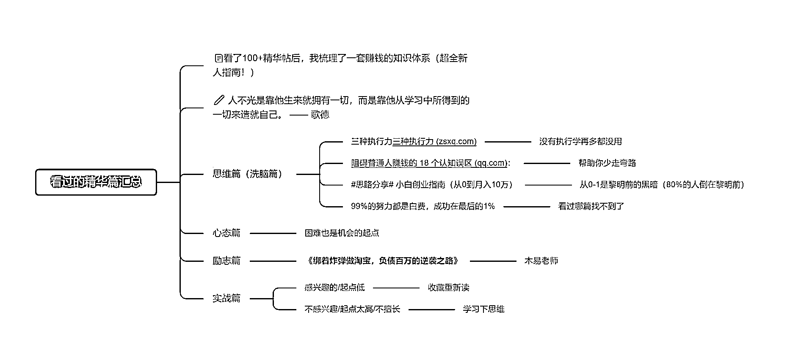  <ne-h4 id="1c0f7b7e" data-lake-id="1c0f7b7e"><ne-heading-ext><ne-heading-anchor></ne-heading-anchor><ne-heading-fold></ne-heading-fold></ne-heading-ext><ne-heading-content><ne-text id="u0d5b534b">尾声——遇见即美好!</ne-text></ne-heading-content></ne-h4> <ne-p id="ub61e7809" data-lake-id="ub61e7809"><ne-text id="u4ae67885">感恩：生财如此精英、卓越的平台汇集这么多优秀的老师，提供给大家创业的机会，甚至能改变生               活、重启事业高峰的转折点。</ne-text></ne-p> <ne-p id="ue33545c9" data-lake-id="ue33545c9"><ne-text id="u22fa2388">感恩：特别感恩生财里帮助过我的老师@seven，帮我推荐了一位非常大爱的陪跑老师。</ne-text></ne-p> <ne-p id="u240557d0" data-lake-id="u240557d0"><ne-text id="u9a9b8bb3">还有未曾有链接或“TA 的一句话”启发到我的老师@亦仁@涛哥@拱卒@刘小排@柠柠@梨云@七小等等，精华贴大航海      里分享过的每位大咖老师。</ne-text></ne-p> <ne-p id="ud13d6c79" data-lake-id="ud13d6c79"><ne-text id="ub1a700e2">感恩：@静伟 @肉松不厌其烦得辅助我，让我这个“写作困难症患者”能在生财里完成第一篇帖子。</ne-text></ne-p> <ne-h1 id="21fc8d0b" data-lake-id="21fc8d0b"><ne-heading-ext><ne-heading-anchor></ne-heading-anchor><ne-heading-fold></ne-heading-fold></ne-heading-ext><ne-heading-content><ne-text id="u8bc74f91">【生财项目】</ne-text></ne-heading-content></ne-h1> <ne-h3 id="83d9349e" data-lake-id="83d9349e"><ne-heading-ext><ne-heading-anchor></ne-heading-anchor><ne-heading-fold></ne-heading-fold></ne-heading-ext><ne-heading-content><ne-text id="uc367b18f">【抖音】</ne-text></ne-heading-content></ne-h3> <ne-h2 id="5d69593d" data-lake-id="5d69593d"><ne-heading-ext><ne-heading-anchor></ne-heading-anchor><ne-heading-fold></ne-heading-fold></ne-heading-ext><ne-heading-content><ne-text id="ud0ef3ae8">《 抖音做一个设计师账号，B 端+C 端一起 2 年成交 200W+的经历复盘》</ne-text></ne-heading-content></ne-h2> <ne-p id="u2b61b12d" data-lake-id="u2b61b12d"><ne-text id="uf3b56b1e">如何做一个设计账号，既能给 B 端客户通过视觉做出 10 倍客单的可能，又可以面向 C 端设计师卖课程变现。</ne-text></ne-p> <ne-p id="ua3bd4d57" data-lake-id="ua3bd4d57"><ne-text id="uc150a2c2">大家好。我是一名 11 年电商视觉工作从业者，目前有两个团队，分别在杭州&长春，主要做围绕电商的一系列视觉服务，服务过各个大厂（视觉外包），以及多个品类的 top 卖家。</ne-text></ne-p> <ne-p id="uee8426ae" data-lake-id="uee8426ae"><ne-text id="uec746016">后来一直这么做，感觉既赚不到钱、规模也做不大、客户的圈层也无法迭代，就不是很有兴趣和信心了。</ne-text></ne-p> <ne-p id="u10054b0d" data-lake-id="u10054b0d"><ne-text id="ub958306b">2020 年开始投入更多的时间精力去做抖音，通过内容引流成交项目金额 200w+，也通过带货（主要是书和工具类的广告）大约收入几十万吧，具体没细算过。</ne-text></ne-p> <ne-p id="u7d549e53" data-lake-id="u7d549e53"><ne-text id="u7f63a0b2">之前因为精力没在带货这块，当时虽然也出了带货爆款，但对付费认识不足，感觉错失了一个亿哈哈哈。</ne-text></ne-p> <ne-p id="u67734d33" data-lake-id="u67734d33"><ne-text id="u6a2d41cc">让我发生质变的也是在 2020 年之后开始做了自己的内容，我摸索了一套适合自己的，且能多个维度变现的内容形式（同一内容的 b 端和 c 端思维），通过设计内容产生的商业价值放大了自己的价值。</ne-text></ne-p> <ne-p id="u6d5b563e" data-lake-id="u6d5b563e"><ne-text id="u404619a2">通过这么多年的沉淀，我复盘了一下我能在这个行业活了十年的基本功：</ne-text></ne-p> <ne-p id="u820b239f" data-lake-id="u820b239f"><ne-text id="ucfc035ad">1）通过数据复盘视觉，优化视觉达到数据提升。</ne-text></ne-p> <ne-p id="u85cc470f" data-lake-id="u85cc470f"><ne-text id="uedfa28d1">（电商就是卖图、卖视频）</ne-text></ne-p> <ne-p id="ude07b681" data-lake-id="ude07b681"><ne-text id="ude70b4cb">2）设计咨询、视觉定位。</ne-text></ne-p> <ne-p id="u7fc26c41" data-lake-id="u7fc26c41"><ne-text id="u2fbd058c">（超饱和的消费市场如何通过视觉匹配产品定价，如何用视觉触达目标用户，10 倍定价的视觉玩法）</ne-text></ne-p> <ne-p id="u57f549e3" data-lake-id="u57f549e3"><ne-text id="u12484fd3">3）营销和曝光自己。这个是从做了抖音之后，才被打开了任督二脉。</ne-text></ne-p> <ne-p id="ud483e69f" data-lake-id="ud483e69f"><ne-text id="udd9a5860">第一次梳理运营经验分享给大家，这也是自我复盘的过程，很值得！</ne-text></ne-p> <ne-h1 id="80106f16" data-lake-id="80106f16"><ne-heading-ext><ne-heading-anchor></ne-heading-anchor><ne-heading-fold></ne-heading-fold></ne-heading-ext><ne-heading-content><ne-text id="ue0dede88" ne-bold="true">一、好的 ip 变现不应该受限</ne-text></ne-heading-content></ne-h1> <ne-p id="ubda9b40b" data-lake-id="ubda9b40b"><ne-text id="uca406e53">我的变现主要分为三个板块：业务端（主要）、带货、课程。</ne-text></ne-p> <ne-p id="ubafd61c1" data-lake-id="ubafd61c1"><ne-text id="u16fbf89c">因为我自己本身是有团队的，因为要靠项目养团队，所以我重点的部分就放在业务转化这块了，后面带货和课程都是被粉丝催化出来的。</ne-text></ne-p> <ne-p id="ud056ae42" data-lake-id="ud056ae42"><ne-text id="u40175684">业务端这部分的成交逻辑是：用干货——换业务。</ne-text></ne-p> <ne-p id="u60e10249" data-lake-id="u60e10249"><ne-text id="u3d581de4" ne-bold="true">这里面有一个核心，成交业务的干货不是设计，而是设计产生的商业价值。</ne-text></ne-p> <ne-p id="u852d0003" data-lake-id="u852d0003"><ne-text id="ub64905c6">这是一个非常重要的点，我是一个设计博主，如果我分享的内容全部都是跟设计相关的，那么吸引的粉丝将都是设计师，那么我的变现就跟 b 端的成交没什么关系了。</ne-text></ne-p> <ne-p id="uc46c06c5" data-lake-id="uc46c06c5"><ne-text id="ub0cff9ce">所以我会从一些设计的商业表现上来吸引到 b 端的关注，比如一些话题：</ne-text></ne-p> <ne-p id="ucc6e89f4" data-lake-id="ucc6e89f4"><ne-text id="uf1119f23" style="color: rgb(143, 149, 158);">1）这么设计，你的点击率蹭蹭的。</ne-text></ne-p> <ne-p id="u2b810114" data-lake-id="u2b810114"><ne-text id="u430eaa96" style="color: rgb(143, 149, 158);">2）请到这样的设计师，你的客单价高 10 倍。</ne-text></ne-p> <ne-p id="u934b71ff" data-lake-id="u934b71ff"><ne-text id="u85ba2c41" style="color: rgb(143, 149, 158);">3）同样一个产品，不同的设计风格精准的卖给不同的人。</ne-text></ne-p> <ne-p id="ubf00bb44" data-lake-id="ubf00bb44"><ne-text id="ua571f979">我放一个案例，大家体会下</ne-text></ne-p> <ne-p id="u1802a11a" data-lake-id="u1802a11a">[<ne-text id="uf3935b78">https://www.douyin.com/user/MS4wLjABAAAAOF3ZwbpYmSVE5NvFm-o0Dt0IiSNpvDgkhhiMwM2PAOI?modal_id=7145097989449714951</ne-text>](https://www.douyin.com/user/MS4wLjABAAAAOF3ZwbpYmSVE5NvFm-o0Dt0IiSNpvDgkhhiMwM2PAOI?modal_id=7145097989449714951)</ne-p> <ne-p id="u943b0d50" data-lake-id="u943b0d50"><ne-card data-card-name="image" data-card-type="inline" id="axCuX" data-event-boundary="card">  <ne-p id="u5b9d26d7" data-lake-id="u5b9d26d7"><ne-text id="u360c6f54">我通过展示设计对产品的改变能力，阐述了设计的重要性：</ne-text></ne-p> <ne-p id="u5357317a" data-lake-id="u5357317a"><ne-text id="u387e9c6b">1）同样的产品可以通过不同的视觉包装，改变产品的定价能力。</ne-text></ne-p> <ne-p id="ued4de65b" data-lake-id="ued4de65b"><ne-text id="u68b52843">2）同样的产品可以通过不同的视觉包装，去触达不同的目标人群。</ne-text></ne-p> <ne-p id="u38c78eeb" data-lake-id="u38c78eeb"><ne-text id="u2954558e">3）设计可以赋能商业。</ne-text></ne-p> <ne-p id="u675691f8" data-lake-id="u675691f8"><ne-text id="u1f7b3dbc">这几个角度都是比较偏运营和营销思维的了，且案例比较浅显易懂，所以会有不少运营来关注我。</ne-text></ne-p> <ne-p id="u005a126d" data-lake-id="u005a126d"><ne-text id="u98233adb">运营现在也很卷的，如果运营没有好的审美，那么就失去了对爆款和趋势的一个判断维度，那么天花板就会相对低了一些。</ne-text></ne-p> <ne-p id="u7a02d793" data-lake-id="u7a02d793"><ne-text id="ua7486c91">有一个有趣的现象就是：很多运营会发我的内容给他们的美工、设计师看，也会向公司推荐我，这样就会促成我 b 端的业务成交部分。</ne-text></ne-p> <ne-p id="uc183340c" data-lake-id="uc183340c"><ne-text id="u8226fcbf">大部分设计师同行的账号都在分享设计技巧，账号内容看起来更像一个工具书，所以他们吸引来的都是设计师，真正的商家和企业主是不会对你如何打开 ps 感兴趣的。</ne-text></ne-p> <ne-p id="u11a63d6a" data-lake-id="u11a63d6a"><ne-text id="u21343941">上面这些话题就将设计跟商业价值做了关联，b 端的用户会认为你是一个懂数据、懂运营、懂商业的设计师。他们就会愿意和你成交。</ne-text></ne-p> <ne-p id="u1cef2d40" data-lake-id="u1cef2d40"><ne-text id="u84161652">而带货和课程纯属是个意外，那会刚开始带货的时候，粉丝是非常反感这些行为的，而恰好因为我是一个知识博主，就经常会有粉丝问有没有好书推荐一些之类的问题，我就尝试做了几次。</ne-text></ne-p> <ne-p id="u5aef43cd" data-lake-id="u5aef43cd"><ne-text id="uf8a50ca9">很意外，当时就有一条视频爆了，大概卖了两千本的样子，单价 130 多的话，我那条视频应该有个 9w 多的佣金。其他的书，大多都是销量平平。</ne-text></ne-p> <ne-p id="u8f968135" data-lake-id="u8f968135"><ne-text id="ud7d4849d">卖课这件事一直都不是很重视，因为平时投到项目的时间比较多，课程录制确实也没有主动推动，有个运营看到我的账号，就一直说服我做一套课程卖，这样课程做出来以后，运营和我这边一起在卖。</ne-text></ne-p> <ne-p id="u906a574e" data-lake-id="u906a574e"><ne-text id="u5ed2a4ce">因为前面提到我的内容是 b 端和 c 端都适合的，所以一套课程也卖了两类人群。</ne-text></ne-p> <ne-p id="u743cc1af" data-lake-id="u743cc1af"><ne-text id="u0541ac1e">但课程的话就比较偏 c 端了，大多是一些技术类的实操，这样的课时看起来也比较多，内容拉出来也好看的多。这个端口的变现方式就非常好理解了，和大部分博主一样，就是输出干货、技能，来卖课程。</ne-text></ne-p> <ne-h1 id="f7576dd4" data-lake-id="f7576dd4"><ne-heading-ext><ne-heading-anchor></ne-heading-anchor><ne-heading-fold></ne-heading-fold></ne-heading-ext><ne-heading-content><ne-text id="ucc6f0c90" ne-bold="true">二、如何通过内容打开 b 端 c 端市场</ne-text></ne-heading-content></ne-h1> <ne-p id="uc6e9dda8" data-lake-id="uc6e9dda8"><ne-text id="u822aef82">这个问题听起来就很有争议，也经常会有人跟我说你这样做内容不够垂直，流量不够精准。</ne-text></ne-p> <ne-p id="u208f33e6" data-lake-id="u208f33e6"><ne-text id="uc3d63ee4">我始终认为，好的内容就应该适合大部分人听，而且一个人的账号就是一个人的特色，我并不想按照别人的方式。</ne-text></ne-p> <ne-p id="udfbced02" data-lake-id="udfbced02"><ne-text id="u8ebf9da7">这个问题的核心是：从设计师的角度看世界，维度不一样了。设计就变成社交工具了。</ne-text></ne-p> <ne-p id="u933aee9e" data-lake-id="u933aee9e"><ne-text id="u3b3c5bdb">如果你仅仅认为自己是一个设计师，那么你就是一个设计师，你设计一些好看好玩的东西罢了，为自己的情怀付出，一点毛病都没有。</ne-text></ne-p> <ne-p id="u0c83d539" data-lake-id="u0c83d539"><ne-text id="ub658ede9">但我定位我是一个懂互联网、懂营销，甚至略懂一点点商业的设计师。</ne-text></ne-p> <ne-p id="ua005a7ee" data-lake-id="ua005a7ee"><ne-text id="u85873414">我在运营、创业者、互联网的圈子里去分享设计的价值，一个好的设计可以带来的商业意义，这个时候设计就是社交工具了。</ne-text></ne-p> <ne-p id="ufd4943cd" data-lake-id="ufd4943cd"><ne-text id="u96ec9088">就比如，一个运营，每天磨数据，调付费。你给一套好的视觉，卷出行业壁垒，那么运营就可以用比较轻松的运营方式，也可以花更少的钱拿到现在的 roi。</ne-text></ne-p> <ne-p id="ue507095b" data-lake-id="ue507095b"><ne-text id="ucfeffcdf">我见过很多老古董的电商运营，宁可单词付费多给 10 快，也不愿意在视觉上多花一万，这是典型的认知洼地，这样的人不在少数。</ne-text></ne-p> <ne-p id="ue19180c1" data-lake-id="ue19180c1"><ne-text id="u758210eb">类似这样的还有很多，就比如同一件商品，卖出千千万万种价格，凭什么你就可以定价那么高，凭什么你还卖的出去，这里面有关视觉定位、视觉营销的内容，想要做好电商是一定要了解的。</ne-text></ne-p> <ne-p id="ua584311d" data-lake-id="ua584311d"><ne-text id="u4408d7bf">不然你只能去卷价格战。</ne-text></ne-p> <ne-p id="u3c93896d" data-lake-id="u3c93896d"><ne-text id="udb8dca68" ne-bold="true">b 端需要的设计</ne-text><ne-text id="u2b6c0ec0">：</ne-text></ne-p> <ne-p id="u00709a01" data-lake-id="u00709a01"><ne-text id="ufec5f985">是可以产生商业价值的设计，可以赋能商品、或者帮助销售转化的。</ne-text></ne-p> <ne-p id="udbbba550" data-lake-id="udbbba550"><ne-text id="u3b2b300b">内容从这个点接入，就会比较容易拿到 b 端客户。</ne-text></ne-p> <ne-p id="u01224f98" data-lake-id="u01224f98"><ne-text id="udd4df866">这里的重要是要考虑，如何以 b 端用户听的语言去讲设计。</ne-text></ne-p> <ne-p id="ue22c859c" data-lake-id="ue22c859c"><ne-text id="u0ccfabf9" ne-bold="true">c 端需要的设计</ne-text><ne-text id="ude765291">：</ne-text></ne-p> <ne-p id="ud19f1448" data-lake-id="ud19f1448"><ne-text id="u5c2beddd">技法类。设计师首先是技术工种，然后才是审美和思维方式的层面。</ne-text></ne-p> <ne-p id="u16c71602" data-lake-id="u16c71602"><ne-text id="uc299161e">就大部分设计师而言，首先关注的都是技法，而技法类的表现恰好是容易通过屏幕演示的（思维类的则多为口播）。</ne-text></ne-p> <ne-p id="u7c18adb8" data-lake-id="u7c18adb8"><ne-text id="u7bde1134">较硬的设计干货（类似教程）特别容易被收藏点赞。</ne-text></ne-p> <ne-p id="u266e2c63" data-lake-id="u266e2c63"><ne-text id="u52e0da5c">这两类内容，我用我之前拍过的一个【卫生巾】的内容来解释一下：</ne-text></ne-p> <ne-p id="u5c10a295" data-lake-id="u5c10a295"><ne-text id="u56705957">首先是 b 端，链接我放在下面了：</ne-text></ne-p> <ne-p id="u7fe0f4a5" data-lake-id="u7fe0f4a5"><ne-text id="u62f94a28" ne-bold="true">6.94 daa:/ 刷到就是赚到！设计师开脑洞，运营找商机# 新消费 # 品类 # 电商 # 品牌</ne-text> [<ne-text id="ueca6d200" ne-bold="true">https://v.douyin.com/MpdxV5y/</ne-text>](https://v.douyin.com/MpdxV5y) <ne-text id="u0c4aab52" ne-bold="true">复制此链接，打开 Dou 音搜索，直接观看视频！</ne-text></ne-p> <ne-p id="u06223348" data-lake-id="u06223348"><ne-card data-card-name="image" data-card-type="inline" id="xxpN1" data-event-boundary="card">  <ne-p id="ua6eb0110" data-lake-id="ua6eb0110"><ne-text id="u359f5de0">上面这条就是偏商业思维的，我从产品的差异化、人群和市场定位来讲。</ne-text></ne-p> <ne-p id="uad303922" data-lake-id="uad303922"><ne-text id="uccc66d7b">分享给了商家如何把一个标品——卫生巾，做的跟别人不同。</ne-text></ne-p> <ne-p id="uf1b075dd" data-lake-id="uf1b075dd"><ne-text id="ud577761f">洞察人群的需求，重新给卫生巾一个新的购买理由，比如大家都在卖卫生巾，这类标品新品牌是很难找到土壤存活下来的。</ne-text></ne-p> <ne-p id="u0ba70eb7" data-lake-id="u0ba70eb7"><ne-text id="u37ec9233">因为竞争太激烈，太考验品牌力了。</ne-text></ne-p> <ne-p id="uaa753019" data-lake-id="uaa753019"><ne-text id="u88b373c3">那么就要重新发现一个痛点，从一个新的细分切进去。</ne-text></ne-p> <ne-p id="u70a37ade" data-lake-id="u70a37ade"><ne-text id="u0d6959d6">其实我这条视频的内容其实是跟设计师没什么关系的，但是跟我所处在的行业（电商行业）是密切相关的，所以依然能精准的覆盖到我想要的目标用户，也就是 b 端的电商卖家。</ne-text></ne-p> <ne-p id="uf2f3a7cd" data-lake-id="uf2f3a7cd"><ne-text id="u5094f715">然后是 c 端，链接我放在下面了：</ne-text></ne-p> <ne-p id="u96de39b3" data-lake-id="u96de39b3"><ne-text id="ueef91a5d">同样还是卫生巾，我又从了另外一个角度来拆解设计表现</ne-text></ne-p> <ne-p id="u6683fe49" data-lake-id="u6683fe49"><ne-text id="u7162f248" ne-bold="true">1.25 ZMJ:/ 如何表现卫生巾吸水# 卖点可视化 # 电商 # 设计</ne-text> [<ne-text id="ub0dcaed7" ne-bold="true">https://v.douyin.com/MpRFBtW/</ne-text>](https://v.douyin.com/MpRFBtW) <ne-text id="ub067e7b4" ne-bold="true">复制此链接，打开 Dou 音搜索，直接观看视频！</ne-text></ne-p> <ne-p id="ub9c2a72d" data-lake-id="ub9c2a72d"><ne-card data-card-name="image" data-card-type="inline" id="BfvZU" data-event-boundary="card">  <ne-p id="u7e5fe00b" data-lake-id="u7e5fe00b"><ne-text id="u07e3d5a7">这条就是典型的设计师思路分享了，专业偏向型。</ne-text></ne-p> <ne-p id="uc558d7d3" data-lake-id="uc558d7d3"><ne-text id="u07b2e65c">但是我并没有完完全全去讲怎么打开 ps 怎么操作，更偏设计思维一些，这样的内容设计师和运营都可以看得懂，这条视频刷到的用户，大比重是设计师。</ne-text></ne-p> <ne-p id="u981bd0c8" data-lake-id="u981bd0c8"><ne-text id="u7ae1f184">上面我通过一个产品向大家展示了同一个内容，如何用不用的视角去向不同的用户说，设计就变成了我的社交和内容货币，向下可以指导设计师，分享设计思维，向上可以衔接商家，跟企业主讨论如何赋能商业，如果用设计卖货。</ne-text></ne-p> <ne-p id="uf8d261f7" data-lake-id="uf8d261f7"><ne-text id="u0192f5e9" ne-bold="true">其实我认为，任何专业性很强的领域，也就是我们说的非常垂直的领域，它都应该有至少两个商业闭环，第一个闭环指向你的专业性，第二个闭环在你升维或者降维的领域。</ne-text></ne-p> <ne-p id="u0d034499" data-lake-id="u0d034499"><ne-text id="u7435f0b4" ne-bold="true">再举个例子：</ne-text></ne-p> <ne-p id="u6732e26a" data-lake-id="u6732e26a"><ne-text id="u82af1701">假设我们有一个品牌需要重新定位、策划，再落地出来。</ne-text></ne-p> <ne-p id="u24baaaf7" data-lake-id="u24baaaf7"><ne-text id="uf1c9bab3" ne-bold="true">B 端，也就是企业主</ne-text><ne-text id="uf0b77dac">，他们最在意的是什么？</ne-text></ne-p> <ne-p id="ue2e6442d" data-lake-id="ue2e6442d"><ne-text id="u6857dd5b">是你如何用视觉来包装显得他品牌很有价值，或者是用合适的设计风格让产品更容易被用户接受。</ne-text></ne-p> <ne-p id="ua5bc795c" data-lake-id="ua5bc795c"><ne-text id="u80d03fa7">这个时候用我的视角来分析，我就会输出有关：视觉/设计赋能商业的内容，比如当下的目标用户喜欢的产品风格，设计风格，流行风格应该是什么样的。</ne-text></ne-p> <ne-p id="u3cd161b8" data-lake-id="u3cd161b8"><ne-text id="u1ccec722">我这样做是因为能和我们的目标用户的审美和喜好同频。</ne-text></ne-p> <ne-p id="u388445d2" data-lake-id="u388445d2"><ne-text id="u1fe1bb28">同时，好的视觉表现也能提升产品价值，比如成本只有 9.9 的产品，我会让他看起来像 39.9 的，保持一定的视觉溢价，来提高产品的竞争力。</ne-text></ne-p> <ne-p id="u9529690a" data-lake-id="u9529690a"><ne-text id="ued8146aa">这样的思路去套不同的商业案例，设计就变成了赋能，提高营收的工具，b 端的用户就很喜欢听你讲：有用（有价值）的设计。</ne-text></ne-p> <ne-p id="u0fadc48b" data-lake-id="u0fadc48b"><ne-text id="ua0783357" ne-bold="true">那么，c 端，也就是设计师端</ne-text><ne-text id="u6d7fbe55">，就是不一样的视角了。</ne-text></ne-p> <ne-p id="u3160b178" data-lake-id="u3160b178"><ne-text id="u70b8f719">设计师是一个非常拧巴且挑剔的人群，他们喜欢追逐潮流、趋势、小众，任何能带来视觉超前体验的表现方式，都足够吸引他们。</ne-text></ne-p> <ne-p id="ub3b8a528" data-lake-id="ub3b8a528"><ne-text id="uaf695fb7">设计和其他产业一样，也有流行趋势，比如不同的配色，不同的板式，不同的风格，更新的元素，更新的组合方式等等。</ne-text></ne-p> <ne-p id="u4daee675" data-lake-id="u4daee675"><ne-text id="udd054f33">要么可以在专业技能上输出一些理论知识，要么分享一些流行趋势，超前的设计，或者还可以分享我在项目中的设计思路，都可以吸引设计师。</ne-text></ne-p> <ne-p id="u62ceca45" data-lake-id="u62ceca45"><ne-text id="u043e4a7e">任何一个项目，一个案例，都可以换不同的视角去输出，然后用设计把这件事窜连起来，这样我的账号就形成了两类粉丝群体的变现。一类是企业主的商业需求，一类是设计师的带货变现。</ne-text></ne-p> <ne-p id="ub9cc0bbf" data-lake-id="ub9cc0bbf"><ne-text id="u3bbfbd7c">我的内容配比大概会随着我们团队的业务量、近期的工作量、或者我接下来的一些计划做调整。</ne-text></ne-p> <ne-p id="u66dd7514" data-lake-id="u66dd7514"><ne-text id="ue9796826">前期在快速涨粉的时候，是遵循 8:2 的原则，80%设计干货，20%思维分享，后面粉丝基础起来以后，到了要做账号深度和业务转化的时候，这个配比调整过到 6:4，所以现在账号里面是会有很多运营和电商老板的，他们也会推荐我的内容给他们自己的设计师看。</ne-text></ne-p> <ne-h1 id="0e64ef78" data-lake-id="0e64ef78"><ne-heading-ext><ne-heading-anchor></ne-heading-anchor><ne-heading-fold></ne-heading-fold></ne-heading-ext><ne-heading-content><ne-text id="u603a52fc" ne-bold="true">三、值得给大家分享的一些经验</ne-text></ne-heading-content></ne-h1> <ne-p id="u24e372c3" data-lake-id="u24e372c3"><ne-text id="u5cd4b9f2">我这种账号的类型应该算作半个 ip 吧哈哈，但我还是比较佛系、随性一点。</ne-text></ne-p> <ne-p id="udf43adb5" data-lake-id="udf43adb5"><ne-text id="uf8596aeb">做账号的过程中我有两个核心分享给大家：</ne-text></ne-p> <ne-p id="ua852f1b8" data-lake-id="ua852f1b8"><ne-text id="ufd86d2cb">1）账号的内容配比。</ne-text></ne-p> <ne-p id="u31988632" data-lake-id="u31988632"><ne-text id="uad99a125">这个跟你的变现方式非常有关，做当下需要变现的内容，而且账号的变现方式尽量多元化。</ne-text></ne-p> <ne-p id="ua895fc04" data-lake-id="ua895fc04"><ne-text id="ueac401e4">之前有一个生财有术的道友分享过一个说法叫：抗脆弱性，大家可能对企业的抗脆弱性了解的比较多，我认为账号也是这样的。</ne-text></ne-p> <ne-p id="u0d831797" data-lake-id="u0d831797"><ne-text id="ub2b2e6a7">如果只有一个路径，一是容易把流量越做越小，二是变现越来越难，因为你总是需要不停的迭代、迭代、迭代，去创造 2 次、3 次消费。通过迭代内容换来的复购消费，通常会比较难。</ne-text></ne-p> <ne-p id="u8bdb7b0f" data-lake-id="u8bdb7b0f"><ne-text id="ua459c3ae">2）同一内容的 b 端和 c 端思维。</ne-text></ne-p> <ne-p id="ucf67dcdc" data-lake-id="ucf67dcdc"><ne-text id="u3dff60e2">内容是一样的，看你从什么角度去讲这件事。</ne-text></ne-p> <ne-p id="uf9723c7a" data-lake-id="uf9723c7a"><ne-text id="ud0fbc941">比如你在网上卖瓜，你家的瓜特别大，你不仅可以卖很大的瓜，也可以教别人怎么把瓜种的这么大，哈哈哈！</ne-text></ne-p> <ne-p id="u08703f4b" data-lake-id="u08703f4b"><ne-text id="u29c69343">就这样，祝大家，日复亿日！</ne-text></ne-p> <ne-h2 id="c8a26104" data-lake-id="c8a26104"><ne-heading-ext><ne-heading-anchor></ne-heading-anchor><ne-heading-fold></ne-heading-fold></ne-heading-ext><ne-heading-content><ne-text id="ue7a9b748">（58 赞）《 小说推文进阶玩法，精细化运营所带来的稳定出单》</ne-text></ne-heading-content></ne-h2> <ne-p id="ue2654f7d" data-lake-id="ue2654f7d"><ne-text id="ucb60c07f">小说推文进阶玩法，精细化运营所带来的稳定出单 大家好，我是某人周，从年中开始着手小说推文项目，从零基础开始到现在运营两个号，每天投入 1.5 小时不到，单号每周收益 400。</ne-text></ne-p> <ne-p id="u05190f06" data-lake-id="u05190f06"><ne-text id="u3af448de">今天分享我通过精细化运营做到稳定出单的心得和理解，将从选文改文、剪辑制作、发布策略和日常维护四个方面展开，涵盖我在各方向的侧重点和实操案例，希望能对你有所帮助。#抖音#</ne-text></ne-p> <ne-p id="uddac911b" data-lake-id="uddac911b"><ne-text id="u862b857f">正文请大家移步飞书：</ne-text></ne-p> <ne-p id="u859984c7" data-lake-id="u859984c7">[<ne-text id="u17d7ac54">https://m1lpiqj5ed.feishu.cn/docx/ZcEdd0xTCo1K5IxwCyLccKUynOb</ne-text>](https://m1lpiqj5ed.feishu.cn/docx/ZcEdd0xTCo1K5IxwCyLccKUynOb)</ne-p> <ne-h2 id="1469f5c6" data-lake-id="1469f5c6"><ne-heading-ext><ne-heading-anchor></ne-heading-anchor><ne-heading-fold></ne-heading-fold></ne-heading-ext><ne-heading-content><ne-text id="u8038cbad">（157 赞）《 复盘：通过抖音带货，月入稳定在 3W+，十月 21 天共赚了 11W》</ne-text></ne-heading-content></ne-h2> <ne-p id="u0acca0df" data-lake-id="u0acca0df"><ne-text id="u79c06e53">生财有术的圈友大家好，我是半年，在生财呆了三年的小透明。现在主业是独立站站长，副业做短视频带货。</ne-text><ne-text id="u0f49dbd7" ne-bold="true">今天主要分享的是， 我在生财有术这三年，从一个月薪五千被看不起的人，如何做到能够抓住三天赚八万的机会。</ne-text></ne-p> <ne-p id="u65462896" data-lake-id="u65462896"><ne-text id="u4afa9aee">三年来第一次在生财做分享，主要总觉得自己没有什么拿的出手的东西。但这次我要勇于突破自己，希望对大家有帮助。这三年来，生财有术对我的帮助非常大，让我得以在 XM 这座城市买了房买了车。(虽然首付还是有家里人资助的，但因为自己有底气了，才敢上车）。</ne-text></ne-p> <ne-p id="ua3f9b5f9" data-lake-id="ua3f9b5f9"><ne-text id="uc9960793">我近期取得的一些成绩：</ne-text></ne-p> <ne-p id="u724993a7" data-lake-id="u724993a7"><ne-text id="u0d822298">1、这半年来通过抖音带货，月入稳定在 3w+</ne-text></ne-p> <ne-p id="u40523995" data-lake-id="u40523995"><ne-text id="u26a1b898">2、十月份 21 天共赚了 11w，其中 8w 是三天赚到的（剩下的 10 天因为个人原因住院了，感觉错过了好几个亿哈哈）</ne-text></ne-p> <ne-p id="u228b866d" data-lake-id="u228b866d"><ne-text id="u421cf91f">我主要做的是抖音中老年人带货方向，这个方向至少未来两年还有很大的机会，因为全国 60 岁以上老年人口达 2.64 亿人，占全国总人口的 18.7%，且现在大家都关注自己的身体状况。</ne-text></ne-p> <ne-p id="u33980d85" data-lake-id="u33980d85"><ne-text id="uba81ad6f">现在因只是我的副业，所以我暂时专注在抖音上，计划明年全职做，同时兼顾抖音和视频号这领域的带货。以下是我的经历与感悟，希望对圈友有所帮助。</ne-text></ne-p> <ne-h3 id="d7ca8f6e" data-lake-id="d7ca8f6e"><ne-heading-ext><ne-heading-anchor></ne-heading-anchor><ne-heading-fold></ne-heading-fold></ne-heading-ext><ne-heading-content><ne-text id="ufda01e21" ne-bold="true">一、先聊聊我是如何抓住了三天赚八万的机会？</ne-text></ne-heading-content></ne-h3> <ne-p id="u944a3c3d" data-lake-id="u944a3c3d"><ne-text id="u1128a249">我在十月份抖音带货总 GMV23w，佣金有 10w+。生财里已有很多伙伴分享了干货，我主要分享下我是如何赚到这十万的一些过程与感想。</ne-text></ne-p> <ne-p id="uf90cf544" data-lake-id="uf90cf544"><ne-card data-card-name="image" data-card-type="inline" id="UW913" data-event-boundary="card">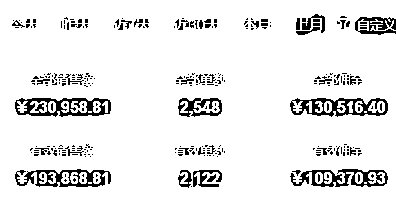  <ne-h3 id="22fd2058" data-lake-id="22fd2058"><ne-heading-ext><ne-heading-anchor></ne-heading-anchor><ne-heading-fold></ne-heading-fold></ne-heading-ext><ne-heading-content><ne-text id="u98bff7ef" ne-bold="true">1.</ne-text><ne-text id="u92baa7cb" ne-bold="true">爆单经过与思考</ne-text></ne-heading-content></ne-h3> <ne-p id="u04acf0a9" data-lake-id="u04acf0a9"><ne-text id="u9bd1c31d">我平时下班地铁上都会刷刷抖音，因为我有一个抖音号专门刷中老年人类目视频的。所以刷出来的视频都比较精准，一般近期比较火比较爆的视频都能刷到。</ne-text></ne-p> <ne-p id="u2329c698" data-lake-id="u2329c698"><ne-text id="u955b827f">我会把近三天数据比较突出的流量视频和带货视频收藏下来，如连天点赞几千，产品一天销量几百。接下来就是</ne-text><ne-text id="u01a3b1d9" ne-bold="true">像素级模仿</ne-text><ne-text id="uac5f6590">。不需要产品的就是根据视频和文案，像素级重新剪辑一次。需要产品的我会直接模仿拍摄，一样的呈现效果进行剪辑。</ne-text></ne-p> <ne-p id="u1f102e65" data-lake-id="u1f102e65"><ne-text id="u2e02cef2">十月中旬，我就是刷到了不错的视频和品。剪辑先后发布了三个号，网感告诉我，这视频肯定会爆。事实证明，三个号都爆了！</ne-text></ne-p> <ne-p id="udcb3b636" data-lake-id="udcb3b636"><ne-text id="u697a2d09">A 账号：视频开始爆的时候，我立马重新拍了新的视频，一摸一样内容的视频，在电脑上把这两个视频设置为一组，结果是，第一条的流量部分引导第二条视频，带爆第二条视频。这两条视频让我日入 1.8W；遗憾的是，我没有立即创作第 3、第 4···第 n 个视频，测试能否继续带爆，且没有立即开直播！！！</ne-text></ne-p> <ne-p id="u0695a612" data-lake-id="u0695a612"><ne-text id="u3b1fbaa6">B 账号：这个账号是新号，还没有带货权限，我发的是流量视频。起初发的时候流量一般，直到第二天，视频大爆到千粉，我立马开通橱窗。经验告诉我，要马上直播。辛亏我之前参加过抖音直播大航海，锻炼了一些直播技能，虽然大航海没有拿到结果，但是却为我这次爆单做足了准备。连续直播了三四天，每天至少十个小时，最高日佣 3W。</ne-text></ne-p> <ne-p id="u90fdb28d" data-lake-id="u90fdb28d"><ne-card data-card-name="image" data-card-type="inline" id="y5GRi" data-event-boundary="card">  <ne-p id="u61c4c906" data-lake-id="u61c4c906"><ne-text id="u4932da75" ne-bold="true">以上的爆单经历，我总结了几个做视频技巧：</ne-text></ne-p> <ne-oli><ne-oli-i>1</ne-oli-i><ne-oli-c class="ne-oli-content" id="ub1e7b484" data-lake-id="ub1e7b484"><ne-text id="ud3fbab08">视频一爆，立马上传同内容的视频，并创建合集，大概率能把新的视频带爆，每隔一段时间继续上传继续加入合集，移除表现不好的视频；</ne-text></ne-oli-c></ne-oli> <ne-oli><ne-oli-i>2</ne-oli-i><ne-oli-c class="ne-oli-content" id="u66c79f66" data-lake-id="u66c79f66"><ne-text id="udcb100d6">同款产品流量视频与带货视频都要发，相辅相成。若流量视频爆了，新拍一个下单引导视频置顶，并与流量视频创建合集，合集名称引导下单；</ne-text></ne-oli-c></ne-oli> <ne-oli><ne-oli-i>3</ne-oli-i><ne-oli-c class="ne-oli-content" id="u5d5be101" data-lake-id="u5d5be101"><ne-text id="ueae9f7d8">视频一爆，立马开直播，双频共振；</ne-text></ne-oli-c></ne-oli> <ne-h3 id="6dc6ab8e" data-lake-id="6dc6ab8e"><ne-heading-ext><ne-heading-anchor></ne-heading-anchor><ne-heading-fold></ne-heading-fold></ne-heading-ext><ne-heading-content><ne-text id="u055eae2c">2\. 我是如何选品的</ne-text></ne-heading-content></ne-h3> <ne-p id="u4855f48c" data-lake-id="u4855f48c"><ne-text id="u581e9eb6" ne-bold="true">第一种：</ne-text><ne-text id="u023a2f6b">专门一个号刷对应品类的视频。每天空闲时间，不断的刷视频，选出近三天火爆的视频或产品</ne-text></ne-p> <ne-p id="u7266742b" data-lake-id="u7266742b"><ne-text id="u7e38859e" ne-bold="true">第二种：</ne-text><ne-text id="u88ffe2b1">第三方平台，如考古加查找近期比较火的视频和产品</ne-text></ne-p> <ne-p id="u0c950ca0" data-lake-id="u0c950ca0"><ne-text id="u5d5250cb">1)</ne-text> [<ne-text id="u5590062b">www.kaogujia.com</ne-text>](http://www.kaogujia.com)</ne-p> <ne-p id="u58bbd1ff" data-lake-id="u58bbd1ff"><ne-text id="u306609de">2)点击找视频-搜索栏目搜索带货的类目，如搜索“中医”，会跳出内容视频和电商视频，这两个模块都要看</ne-text></ne-p> <ne-p id="u9fcabf2b" data-lake-id="u9fcabf2b"><ne-text id="u1183e42f">3）内容视频可以选取近七天点赞几千的视频，进行像素级模仿；带货视频，选择 48 小时内销量或点赞数高的视频和品（第三方平台数据并不准确，只作为参考）</ne-text></ne-p> <ne-p id="ubbc09a20" data-lake-id="ubbc09a20"><ne-card data-card-name="image" data-card-type="inline" id="Zb8ZQ" data-event-boundary="card">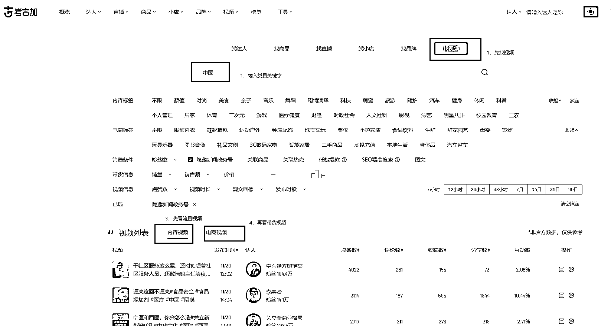<ne-card data-card-name="image" data-card-type="inline" id="aL5hg" data-event-boundary="card">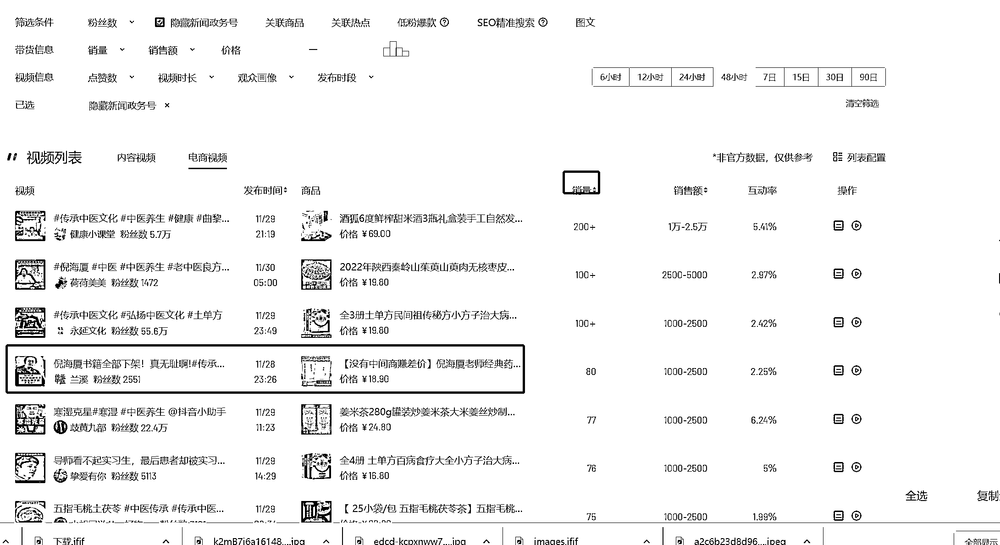  <ne-p id="ub71a900a" data-lake-id="ub71a900a"><ne-text id="uaa1b1f85" ne-bold="true">第三种：</ne-text><ne-text id="ufe7130a8">通过精选联盟选品</ne-text></ne-p> <ne-p id="u1a79ac8b" data-lake-id="u1a79ac8b"><ne-text id="u00966880">1）精选联盟-首页，会推荐一些近期比较好的品</ne-text></ne-p> <ne-p id="ue171f94a" data-lake-id="ue171f94a"><ne-card data-card-name="image" data-card-type="inline" id="Pfjak" data-event-boundary="card">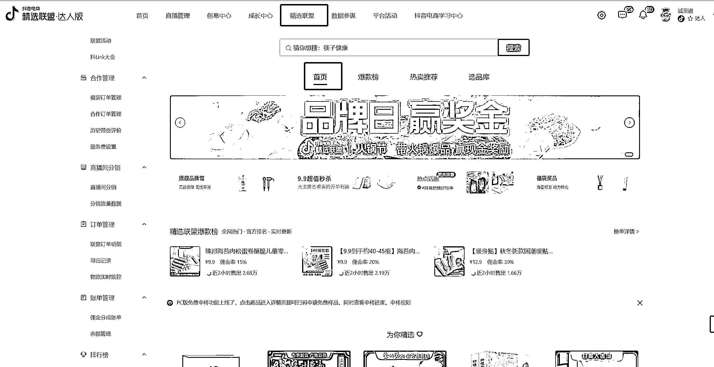  <ne-p id="ue9a795d1" data-lake-id="ue9a795d1"><ne-text id="ua2fd8cc9">2）选择近期销量比较高的品，点进去，查看这三天的销量情况，如果销量不错，说明应该有视频带爆了。</ne-text></ne-p> <ne-p id="u416a91fe" data-lake-id="u416a91fe"><ne-card data-card-name="image" data-card-type="inline" id="wpvzA" data-event-boundary="card">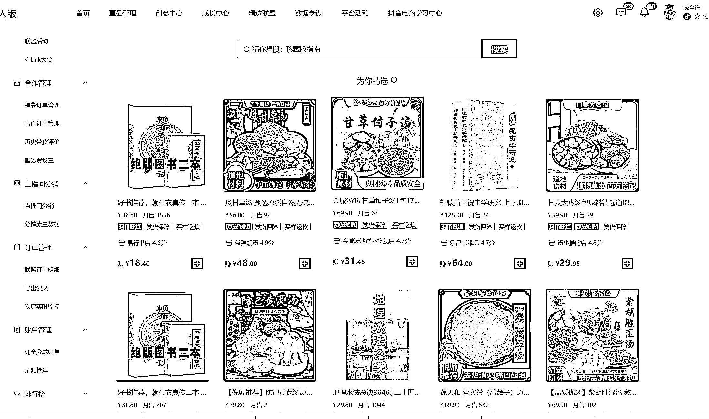  <ne-p id="uc5be8677" data-lake-id="uc5be8677"><ne-text id="u323f9373">3）回到考古加，点击（找商品），将刚才找到的品的标题输入。找到刚才的品，点击关联视频，就能查到近期带该品的视频。</ne-text></ne-p> <ne-p id="u5fe86dfc" data-lake-id="u5fe86dfc"><ne-card data-card-name="image" data-card-type="inline" id="nPPhn" data-event-boundary="card">  <ne-p id="u2ea5aeb4" data-lake-id="u2ea5aeb4"><ne-text id="uf7844757">4）选择近期日内，点赞数最高或者视频销量最高的视频。最好是用手机抖音搜索你找到的视频的账号去验证下数据是否正确。</ne-text></ne-p> <ne-p id="uaccf74eb" data-lake-id="uaccf74eb"><ne-card data-card-name="image" data-card-type="inline" id="PR8K9" data-event-boundary="card">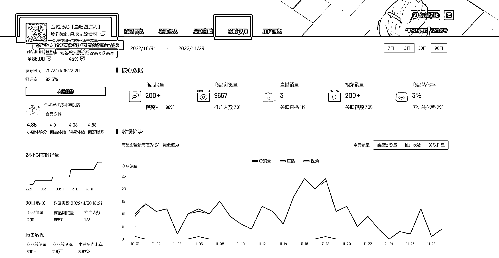  <ne-p id="uae7dc92f" data-lake-id="uae7dc92f"><ne-card data-card-name="image" data-card-type="inline" id="ukhNo" data-event-boundary="card">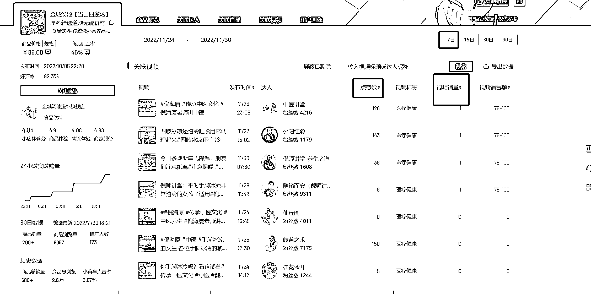  <ne-p id="u21b4de7a" data-lake-id="u21b4de7a"><ne-text id="uc077b7a0" ne-bold="true">第四种：巨量百应创意中心选品</ne-text></ne-p> <ne-p id="u0136db4e" data-lake-id="u0136db4e"><ne-text id="u441be43f">1）进入巨量百应，点击创意中心-爆款视频</ne-text></ne-p> <ne-p id="uf3639de7" data-lake-id="uf3639de7"><ne-card data-card-name="image" data-card-type="inline" id="mpdaO" data-event-boundary="card">  <ne-p id="uc0604339" data-lake-id="uc0604339"><ne-text id="ub2b48eee">2）选择对应的品类，我选择视频饮料-传统滋补品。选择近一周的新增销售额</ne-text></ne-p> <ne-p id="ub2779e9f" data-lake-id="ub2779e9f"><ne-card data-card-name="image" data-card-type="inline" id="kAfNq" data-event-boundary="card">  <ne-p id="u973ebe77" data-lake-id="u973ebe77"><ne-text id="ucf30ad78">3）看数据，如果数据不错，那这个品可以尝试一下（参考作用）</ne-text></ne-p> <ne-p id="uaa9509b9" data-lake-id="uaa9509b9"><ne-card data-card-name="image" data-card-type="inline" id="p1O2e" data-event-boundary="card">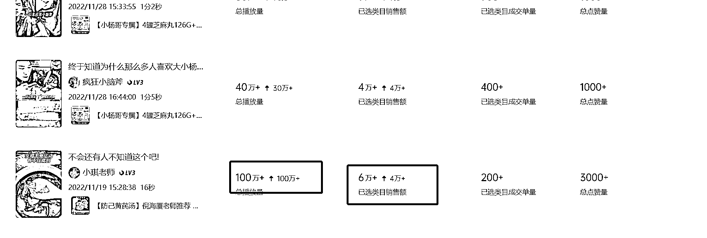  <ne-h2 id="ef6d473f" data-lake-id="ef6d473f"><ne-heading-ext><ne-heading-anchor></ne-heading-anchor><ne-heading-fold></ne-heading-fold></ne-heading-ext><ne-heading-content><ne-text id="u0b519bb5">二、聊聊个人成长：我是</ne-text><ne-text id="u019d3182" ne-bold="true">如何从一个月薪 5000，做到到稳定月入 3W+的？</ne-text></ne-heading-content></ne-h2> <ne-h3 id="b9caae35" data-lake-id="b9caae35"><ne-heading-ext><ne-heading-anchor></ne-heading-anchor><ne-heading-fold></ne-heading-fold></ne-heading-ext><ne-heading-content><ne-text id="ub6c68449" ne-bold="true">1.</ne-text><ne-text id="u51b63cb4" ne-bold="true">选择真的很重要！！！</ne-text></ne-heading-content></ne-h3> <ne-p id="u113613e2" data-lake-id="u113613e2"><ne-text id="u1275d1e5">记得 17 年毕业的时候，我非常的迷茫，完全不知道该做什么工作。本来有机会进入市邮电局的，可以“安享晚年”，后因错误的选择进入了一家传统贸易公司，没想到一呆就是三年，工资从两千多到五千，几乎没有任何质的成长。每次和同学出来总特别的自卑，因为我工资是最低的，混的最差的。他们有的人已经存款好几个 W 了，我是负几个 W 的。</ne-text></ne-p> <ne-p id="uef37546b" data-lake-id="uef37546b"><ne-text id="uce7c73bc">回想以前的自己，为什么一直停滞不前，大概踩了几个坑：</ne-text></ne-p> <ne-p id="uae46e957" data-lake-id="uae46e957"><ne-text id="u734563f7">1）</ne-text><ne-text id="u3467bc1c" ne-bold="true">把自己困在了环境的牢笼中。</ne-text><ne-text id="u98ba8063">把自己固定在了一个圈子里面</ne-text><ne-text id="uc25d2d83" ne-bold="true">，</ne-text><ne-text id="u786e5844">每天所见所闻的有限的东西，没有接触外面更新鲜的世界。缺乏与优秀的人连接、交流和学习。</ne-text></ne-p> <ne-p id="uf4e6c85d" data-lake-id="uf4e6c85d"><ne-text id="uf9809748">2）</ne-text><ne-text id="u10bb5a52" ne-bold="true">过分迷恋确定性。</ne-text><ne-text id="ubae48449">舒适圈呆习惯了，会害怕灯光外的黑暗世界，不知道自己能做什么，就这样一直耗下去</ne-text><ne-text id="u85b90cf3" ne-bold="true">。</ne-text><ne-text id="ueb6c8755">让自己处于这样的状态，明知道现状很差劲，却不敢于去做些变化。</ne-text></ne-p> <ne-p id="u9a7e3042" data-lake-id="u9a7e3042"><ne-text id="u4e2084a3">3）</ne-text><ne-text id="u7c118cce" ne-bold="true">认知不够。</ne-text><ne-text id="u397c06dc">我曾经为什么会这样选择，导致自己停滞不前，本质原因还是自己的认知不够，所见所闻的太少了，缺乏对社会、商业运行规律的认识，所以只能盲选。</ne-text></ne-p> <ne-h3 id="39b3a20f" data-lake-id="39b3a20f"><ne-heading-ext><ne-heading-anchor></ne-heading-anchor><ne-heading-fold></ne-heading-fold></ne-heading-ext><ne-heading-content><ne-text id="uce762e9b" ne-bold="true">2.</ne-text><ne-text id="u19b99470" ne-bold="true">加入生财有术后的锐变</ne-text></ne-heading-content></ne-h3> <ne-p id="ua61a718f" data-lake-id="ua61a718f"><ne-text id="u7ef16f2f">20 年是我最低谷的时候，也是我最幸运的时候。19 年到 20 年一直计划离职，明知道自己现状很难，却一直不敢跳出来。来自家庭、对象的种种压力，觉得自己真没出息，又不知道该怎么办。直到有一天，我刷公众号，生财有术这个名字第一次映入我的眼帘，起初我还在怀疑是不是割韭菜的，但最后我抱着试试的态度还是加入了，我犹豫了 3 天，那时候兜里只剩下 100 块，我到处借钱凑到了 1500 块，忐忑把钱付了。</ne-text></ne-p> <ne-oli><ne-oli-i>1</ne-oli-i><ne-oli-c class="ne-oli-content" id="u6a217672" data-lake-id="u6a217672"><ne-text id="u759e5291" ne-bold="true">先干再说：借钱参加 TikTok 训练营，克服困难成功变现 7000 美金</ne-text></ne-oli-c></ne-oli> <ne-p id="uc0e88b07" data-lake-id="uc0e88b07"><ne-text id="u59d97e8a">记得 20 年参加 TikTok 训练营的时候，我是借钱付了押金参加的，过程中也遇到了种种困难，建立梯子、注册邮箱、手机刷机、注册 paypal、注册独立站、独立站装修、选品等等，我当时真的慌了，什么都不会。</ne-text></ne-p> <ne-p id="uf655c5d5" data-lake-id="uf655c5d5"><ne-text id="ue8c86488">但是，为什么要怕不会呢？生财给提供这么详细的操作教程，我一步一步按照教程一个问题一个问题的解决，生财没有的我还学会了如何去搜索其他的教程。最终我完全的跑通了闭环，最后我成功在 TikTok 变现了 7000 美金，还获得了奖学金哈哈。</ne-text></ne-p> <ne-p id="u3de85e72" data-lake-id="u3de85e72"><ne-text id="ub372e220">所以我一直认为想要</ne-text><ne-text id="uaaa91d05" ne-bold="true">克服困难达到目标，要先解决最小的问题，然后一路不断升级打怪。</ne-text><ne-text id="u83a6bf34">把一个大问题，拆解成多个小问题，一个一个的去解决，到最后大问题就解决了。</ne-text></ne-p> <ne-oli><ne-oli-i>1</ne-oli-i><ne-oli-c class="ne-oli-content" id="u3bfa3c68" data-lake-id="u3bfa3c68"><ne-text id="u86d9b582" ne-bold="true">再战抖音 IP 大航海：没成绩不要紧，继续坚持认真对待，这一切都将成为你最宝贵的财富</ne-text></ne-oli-c></ne-oli> <ne-p id="uba5e6fc4" data-lake-id="uba5e6fc4"><ne-text id="u6a0b8155">雷军在 2022 年度演讲的总结语是：你经历的所有的挫折和失败，甚至那些看似毫无意义消磨时间的事情，都将成为你最重要的、最宝贵的财富。</ne-text></ne-p> <ne-p id="u4a5995da" data-lake-id="u4a5995da"><ne-text id="u5433d000">参加抖音 IP 大航海的时候，我面对镜头是非常恐惧的，直到训练营结束，我的直播场观还是个位数。所幸我坚持下来了，坚持了一个月，按要求每天直播至少一个半小时，每周至少直播三场，要知道，我当时真的没几个人再看，几乎没成绩。</ne-text></ne-p> <ne-p id="uef39728c" data-lake-id="uef39728c"><ne-text id="uf512c31d">这次的航海经历，让我学会了在镜头面前不再恐惧了、直播的各种技巧、如何去去准备一场一直播等等。</ne-text><ne-text id="u698abaed" ne-bold="true">这也为我十月份视频爆了，马上能用直播承接打下了基础。</ne-text><ne-text id="ued522d7e">这些没有成绩的经历，成为了我宝贵的财富。</ne-text></ne-p> <ne-h2 id="cd4de98b" data-lake-id="cd4de98b"><ne-heading-ext><ne-heading-anchor></ne-heading-anchor><ne-heading-fold></ne-heading-fold></ne-heading-ext><ne-heading-content><ne-text id="ue9007706">三、在生财有术的三年，我学到的三个道理</ne-text></ne-heading-content></ne-h2> <ne-p id="u1d572868" data-lake-id="u1d572868"><ne-text id="u60e31db6">加入生财后，太后悔了，后悔为啥没有早点加入。生财 17 年成立，但我为什么这三年来一直都不知道这个社群！不还得怪自己把自己关在牢笼里面了。</ne-text></ne-p> <ne-p id="ucf5427fa" data-lake-id="ucf5427fa"><ne-text id="u19e33fe0">加入后，真的打开了我的认知大门，我不停地看了以前的帖子，拍案叫绝，原来赚钱还可以这么赚，原来对事物的理解还能从这样的维度来思考等等。毫不夸张的说，在生财有术一个月的成长，顶我前三年的成长。认知得到了飞跃的提升，在生财有术的三年里，我学会了：</ne-text></ne-p> <ne-p id="u2eebf5c3" data-lake-id="u2eebf5c3"><ne-text id="u81295f28" ne-bold="true">1）不要想太多，先行动</ne-text></ne-p> <ne-p id="ub0cb66cc" data-lake-id="ub0cb66cc"><ne-text id="u96979616">生财里有太多太多项目了，老实说，精华看太多了也很焦虑。TiKTok、小红书、知乎好物等等，当时一度怀疑自己的能力不及，想的特别多，怕这怕那。</ne-text></ne-p> <ne-p id="uafd65a01" data-lake-id="uafd65a01"><ne-text id="u0b10a095">后来我告诉自己，反正先行动就对了，</ne-text><ne-text id="ua660360c" ne-bold="true">行动才是解决一切焦虑的最好办法</ne-text><ne-text id="u8f69fa9d" style="color: rgb(46, 161, 33);">。</ne-text><ne-text id="u50f67d13">行动起来后，我也拿到了一些成果，也更进一步的认识到了自己并不差！我现在也一度认为，人与人之间的智商和能力都差不多，真正拉开差距的是行动力！</ne-text></ne-p> <ne-p id="ueba91d5c" data-lake-id="ueba91d5c"><ne-text id="u650231ef" ne-bold="true">2）应该有强烈的赚钱欲望</ne-text></ne-p> <ne-p id="u5d52d8b5" data-lake-id="u5d52d8b5"><ne-text id="ud0c4f346">亦仁曾分享，人有两种驱动力，一个是愿景驱动力，一个是痛苦驱动力。真正实现愿景驱动力的人很少，痛苦才是最能促使一个人有驱动力的。</ne-text></ne-p> <ne-p id="u6c1dbe89" data-lake-id="u6c1dbe89"><ne-text id="u11c867fb">回想曾经自己，即使收入不高，还一直躺平着。后来我决定在 XM 买房，让自己绑着炸弹赚 100W。事实证明，买房后，我对钱的欲望更加强烈，也不敢懒散，每天的冲劲就是提升自己并研究如何赚钱。这炸弹也促使了我赚到了一些钱。如果大家觉得自己很懒散，可以尝试让自己绑着炸弹，这炸弹有很多种方式，要量力而行。</ne-text></ne-p> <ne-p id="u79f45854" data-lake-id="u79f45854"><ne-text id="ub035094c" ne-bold="true">3）利他等于利己</ne-text></ne-p> <ne-p id="ud1d803ae" data-lake-id="ud1d803ae"><ne-text id="u93b9dcaa">我在生财学会了喜欢把好东西，好信息，不藏私的分享给别人。</ne-text><ne-text id="u1440ffdc" ne-bold="true">利他等于利己，越分享越幸运。</ne-text></ne-p> <ne-p id="ua065b436" data-lake-id="ua065b436"><ne-text id="ufd196f05">曾有朋友反问我，你就不怕你把赚钱的信息分享出去，别人抢了你的蛋糕？我笑着道，我们人正常思维确实会这么思考，害怕别人倒回来跟你竞争。但事实证明，你越利他，你得到的回报会更大。现在最稀缺的就是信息，如果你很乐意把你知道的信息分享给别人，别人也会非常乐意且主动的把你不知道的东西分享给你。而且，这市场这么大，蛋糕分的完吗？</ne-text></ne-p> <ne-p id="uf3d3f084" data-lake-id="uf3d3f084"><ne-text id="ub8e91183">以上是我今天的分享，主要是我自己的成长经历，比起生财很多优秀的人那真的不值一提。做抖音出的成绩也几乎是我自己一个人摸索和不断收集零碎的信息，可能一些方式方法已经很落后。这样的现象很不好，我更应该去寻找同频的人一起交流，学习的。如果有同样在做抖音视频带货的圈友，可以一起交流交流哈！</ne-text></ne-p> <ne-p id="ue137b88b" data-lake-id="ue137b88b"><ne-text id="ub987f562">未来的路还很长，这只是我的起点，得更加把劲了~</ne-text></ne-p> <ne-h2 id="1eee3487" data-lake-id="1eee3487"><ne-heading-ext><ne-heading-anchor></ne-heading-anchor><ne-heading-fold></ne-heading-fold></ne-heading-ext><ne-heading-content><ne-text id="ua302e0c2">（40 赞）《 如何通过抖音卖几百万非遗拓片，抖音非遗篆刻拓片类高客单 Top1，直播带货收益 500W 的分享》</ne-text></ne-heading-content></ne-h2> <ne-p id="u45c597ed" data-lake-id="u45c597ed"><ne-text id="u0a6085b2">如何通过抖音卖 7 位数的非遗拓片，抖音非遗篆刻拓片类高客单 Top1，直播带货收益 500W 的分享。</ne-text></ne-p> <ne-p id="uecea9a08" data-lake-id="uecea9a08"><ne-text id="ued1843f4">大家好，我是烨子。大家平时看做互联网的项目多一些，做产品的很少，今天和大家分享一点关于我做非遗传拓产品的心得，一个文化属性的产品怎么在抖音卖高客单的，我从平台思维、产品定位、人群定位几个方面给大家阐述我的理解，希望给大家带来不同高客单产品的思路。</ne-text></ne-p> <ne-p id="u54a18fe1" data-lake-id="u54a18fe1">[<ne-text id="u6c8f42d9">https://wppopmriov.feishu.cn/docx/XuOgdT9o8ongKPxfSMlcfgLbngf</ne-text>](https://wppopmriov.feishu.cn/docx/XuOgdT9o8ongKPxfSMlcfgLbngf)</ne-p> <ne-h2 id="ec1e9308" data-lake-id="ec1e9308"><ne-heading-ext><ne-heading-anchor></ne-heading-anchor><ne-heading-fold></ne-heading-fold></ne-heading-ext><ne-heading-content><ne-text id="u650eaf57">（41 赞）《 抖音自动化公转私玩法及防封攻略》</ne-text></ne-heading-content></ne-h2> <ne-p id="udf05fcb6" data-lake-id="udf05fcb6"><ne-text id="u5c91dd4a">抖音自动化公转私玩法及防封攻略 抖音公转私的半自动/人工玩法圈友们分享得不少，关于市面上自动转化的玩法也不少，但很多容易导致封号，本文围绕抖音公转私自动化玩法及防封把常见方法进行拆解，一方面便于大家结合自己的情况进行选择合适的玩法，另一方面在筛选一些转化工具时可以参考减少被坑。 以下为本文主体内容：</ne-text></ne-p> <ne-p id="ue37e0edd" data-lake-id="ue37e0edd">[<ne-text id="u6e7bf6a8">https://p9rxk6ovll.feishu.cn/docx/QbBKdHvfiofIUNxDlmjceWbfnqh</ne-text>](https://p9rxk6ovll.feishu.cn/docx/QbBKdHvfiofIUNxDlmjceWbfnqh)</ne-p> <ne-h3 id="fc21e800" data-lake-id="fc21e800"><ne-heading-ext><ne-heading-anchor></ne-heading-anchor><ne-heading-fold></ne-heading-fold></ne-heading-ext><ne-heading-content><ne-text id="uc853eccc">【抖音风向标】</ne-text></ne-heading-content></ne-h3> <ne-h2 id="bacde964" data-lake-id="bacde964"><ne-heading-ext><ne-heading-anchor></ne-heading-anchor><ne-heading-fold></ne-heading-fold></ne-heading-ext><ne-heading-content><ne-text id="u58949c08">（13 赞）抖音搜索流量来了</ne-text></ne-heading-content></ne-h2> <ne-p id="udbc30ea9" data-lake-id="udbc30ea9"><ne-text id="ua3f9bcaa">#风向标# 抖音搜索流量来了</ne-text></ne-p> <ne-p id="u33ed474a" data-lake-id="u33ed474a"><ne-card data-card-name="image" data-card-type="inline" id="GKsic" data-event-boundary="card">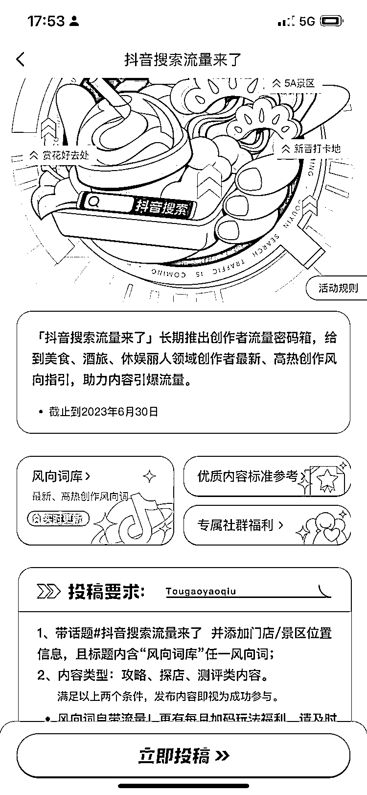  <ne-h2 id="8d93d323" data-lake-id="8d93d323"><ne-heading-ext><ne-heading-anchor></ne-heading-anchor><ne-heading-fold></ne-heading-fold></ne-heading-ext><ne-heading-content><ne-text id="u96e9fe74">（12 赞）抖音搜索赚金币活动发力搜索业务，每天可做</ne-text></ne-heading-content></ne-h2> <ne-p id="u2bafc90f" data-lake-id="u2bafc90f"><ne-text id="u37de4cc6">#风向标# 抖音搜索赚金币活动，每天都可以做。盲猜应该是发力搜索业务。具体作用还不太清楚。</ne-text></ne-p> <ne-p id="u11ef3dd2" data-lake-id="u11ef3dd2"><ne-card data-card-name="image" data-card-type="inline" id="lsA3m" data-event-boundary="card">  <ne-h2 id="4b608510" data-lake-id="4b608510"><ne-heading-ext><ne-heading-anchor></ne-heading-anchor><ne-heading-fold></ne-heading-fold></ne-heading-ext><ne-heading-content><ne-text id="uc5be21e4">（19 赞）抖音低成本房产账号，可复制的低成本视频生产案例</ne-text></ne-heading-content></ne-h2> <ne-p id="uc6fa1d9a" data-lake-id="uc6fa1d9a"><ne-text id="ua6aedb26">#风向标# 抖音低成本房产账号，可复制的低成本视频生产案例，做视频内容生产的朋友可以借鉴一下（搜索这个账号去看看吧，就能理解成本有多低了） 1、拍摄大量的小区门口空镜头、小区内部空镜头 2、文案标注：xx 区 xx 板块 xx 平米 3、口述文案：准备好文案，录音就可以了 做好这些准备，生产一条视频的时间就 5-10 min。一天生产 5-10 个视频，获取 5k-10k 的本地流量，就超过本地 99% 的房产销售了 普通人不是销售怎么办呢？找一个销售合作，先跑起来呀 对卖房子不感兴趣怎么办？用这种低成本生产内容的方式卖别的东西呗</ne-text></ne-p> <ne-p id="uc041a4d1" data-lake-id="uc041a4d1"><ne-card data-card-name="image" data-card-type="inline" id="WfLzE" data-event-boundary="card">  <ne-h2 id="651b567d" data-lake-id="651b567d"><ne-heading-ext><ne-heading-anchor></ne-heading-anchor><ne-heading-fold></ne-heading-fold></ne-heading-ext><ne-heading-content><ne-text id="u100e5040">（11 赞）抖音直播间姓氏玩法</ne-text></ne-heading-content></ne-h2> <ne-p id="u94556fd8" data-lake-id="u94556fd8"><ne-text id="ud52fb249">#风向标# 抖音直播间姓氏玩法。一个墨镜（9.9 抖币）帮你查出你的姓所在人数最多的省份以及历史名人。反正看着是一直有人刷礼物</ne-text></ne-p> <ne-p id="u32ca6877" data-lake-id="u32ca6877"><ne-card data-card-name="image" data-card-type="inline" id="K4Olf" data-event-boundary="card">  <ne-h2 id="03279122" data-lake-id="03279122"><ne-heading-ext><ne-heading-anchor></ne-heading-anchor><ne-heading-fold></ne-heading-fold></ne-heading-ext><ne-heading-content><ne-text id="ua1416cba">（10 赞）手势舞教学的课程卖了快 500 万</ne-text></ne-heading-content></ne-h2> <ne-p id="u96c370c9" data-lake-id="u96c370c9"><ne-text id="u0617f62f">#风向标# 手势舞教学的课程卖了快 500 万，抖音手势舞教学，一个非常小众的群体，受众都是 50 岁、60 岁以上的女性，她们对互联网了解有限，但购买能力很强，一个课程就变现了这么多。</ne-text></ne-p> <ne-p id="u45035f4b" data-lake-id="u45035f4b"><ne-card data-card-name="image" data-card-type="inline" id="RJk4d" data-event-boundary="card">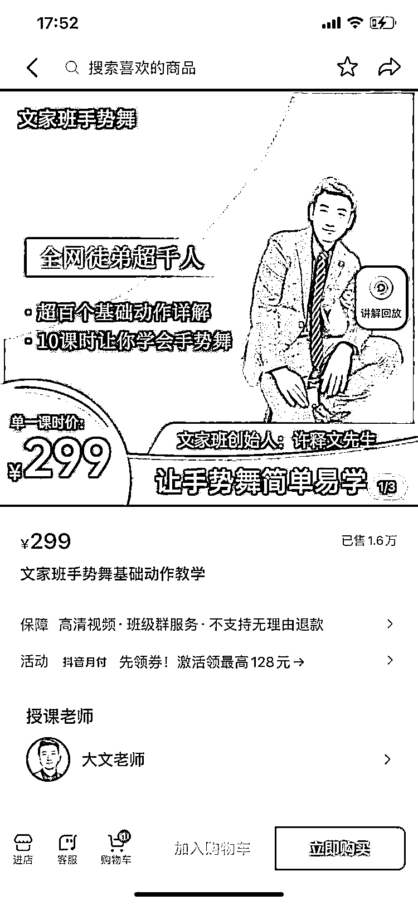  <ne-h2 id="ce11dfca" data-lake-id="ce11dfca"><ne-heading-ext><ne-heading-anchor></ne-heading-anchor><ne-heading-fold></ne-heading-fold></ne-heading-ext><ne-heading-content><ne-text id="u50abecff">（8 赞）节奏感十足的 DJ 音乐+温柔女主播，卖电子版直播话术资料及直播设备</ne-text></ne-heading-content></ne-h2> <ne-p id="u6f28f6c1" data-lake-id="u6f28f6c1"><ne-text id="ua975e9ed">#风向标#  节奏感十足的 DJ 音乐+温柔女主播 卖的电子版直播话术资料（69.9）及直播设备。 账号 11 月 12 号开播的，现在都已经有优质电商达人标签了，至少 Gmv10w➕了</ne-text></ne-p> <ne-p id="ud87f81f9" data-lake-id="ud87f81f9"><ne-card data-card-name="image" data-card-type="inline" id="QAsHj" data-event-boundary="card">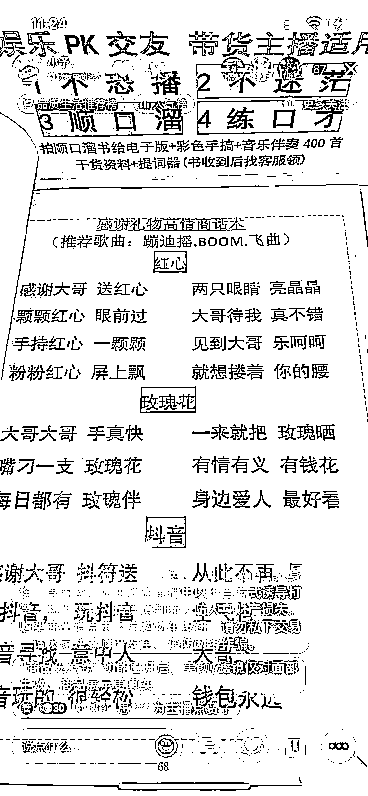  <ne-h2 id="e4dc50c7" data-lake-id="e4dc50c7"><ne-heading-ext><ne-heading-anchor></ne-heading-anchor><ne-heading-fold></ne-heading-fold></ne-heading-ext><ne-heading-content><ne-text id="u560d71df">（13 赞）外面摆个摊直播关注抖音，在抖音买卖洗鞋剂</ne-text></ne-heading-content></ne-h2> <ne-p id="ud1f932ec" data-lake-id="ud1f932ec"><ne-text id="u4184ee89">#风向标# 这个账号在外面直播摆个摊，让他们关注抖音，在抖音买卖洗鞋剂，账号粉丝目前四五万。</ne-text></ne-p> <ne-p id="u4a1a4dc3" data-lake-id="u4a1a4dc3"><ne-card data-card-name="image" data-card-type="inline" id="LOZ7d" data-event-boundary="card">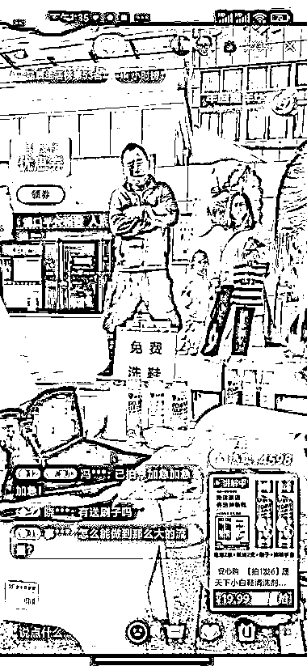  <ne-p id="u60449c0e" data-lake-id="u60449c0e"><ne-card data-card-name="image" data-card-type="inline" id="FS2VD" data-event-boundary="card">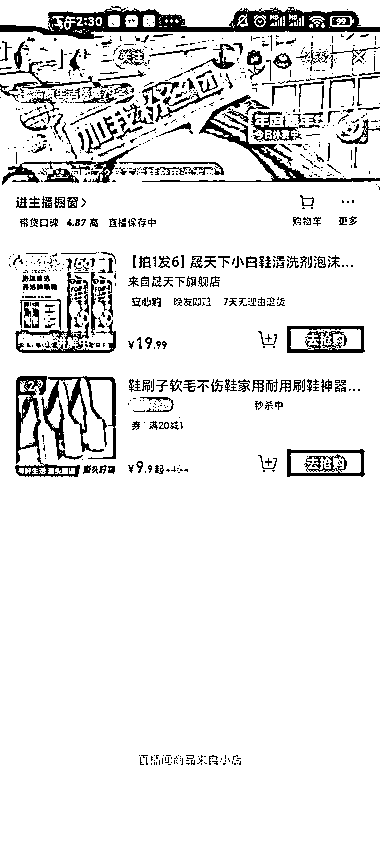  <ne-h3 id="086ada98" data-lake-id="086ada98"><ne-heading-ext><ne-heading-anchor></ne-heading-anchor><ne-heading-fold></ne-heading-fold></ne-heading-ext><ne-heading-content><ne-text id="uf6a5d91f">【微信】</ne-text></ne-heading-content></ne-h3> <ne-h2 id="dc76c055" data-lake-id="dc76c055"><ne-heading-ext><ne-heading-anchor></ne-heading-anchor><ne-heading-fold></ne-heading-fold></ne-heading-ext><ne-heading-content><ne-text id="uedc8885f">（46 赞）《 复盘我如何通过行程码引流公众号一天涨粉 4 万多，流量主变现 6 千元》</ne-text></ne-heading-content></ne-h2> <ne-p id="ub8426a91" data-lake-id="ub8426a91"><ne-text id="u8f109ec5">大家好，我是火火。昨天行程码下线这个热点让很多小伙伴追热点吸引了一波公众号粉丝，我也不例外。截止到今天（15 号）中午，我删除全部文章之后，统计的数据如下：</ne-text></ne-p> <ne-p id="u029f12f9" data-lake-id="u029f12f9"><ne-text id="u66c4847e">总共净增粉 4 万多，流量主收入 6 千多：</ne-text></ne-p> <ne-p id="uf9c52559" data-lake-id="uf9c52559">[<ne-text id="ufe94983a">https://vo7uy9lyzl.feishu.cn/docx/AmKRdF2Z9oQjDExxxuAc18a5nbb</ne-text>](https://vo7uy9lyzl.feishu.cn/docx/AmKRdF2Z9oQjDExxxuAc18a5nbb)</ne-p> <ne-h2 id="0e90dbf0" data-lake-id="0e90dbf0"><ne-heading-ext><ne-heading-anchor></ne-heading-anchor><ne-heading-fold></ne-heading-fold></ne-heading-ext><ne-heading-content><ne-text id="ue83e75f8">（25 赞） 《 分享个微私域背后，流量转化的细节》</ne-text></ne-heading-content></ne-h2> <ne-p id="u359c7a11" data-lake-id="u359c7a11"><ne-text id="u78f519c3">之前在生财发过两篇微信内的骚操作[</ne-text>[<ne-text id="uc8debdf2">第一篇</ne-text>](https://articles.zsxq.com/id_dfswl5lh61wh.html)<ne-text id="uc96e9e3c">]、[</ne-text>[<ne-text id="udb76ff46">第二篇</ne-text>](https://articles.zsxq.com/id_gjg69ws83c8p.html)<ne-text id="u33edffc3">]，都拿了龙珠，其实都是我在平时做产品写代码看案例过程中做过的见过的玩过的，摘取一两个小点来给大家分享，类似的内容还有很多, 未来慢慢给大家分享，今天给大家分享一个小点，就是个微私域背后，流量转化的细节，下面进入正题</ne-text></ne-p> <ne-hole id="u55066c06" data-lake-id="u55066c06"><ne-card data-card-name="hr" data-card-type="block" id="zh2wp" data-event-boundary="card"><ne-p id="u54483367" data-lake-id="u54483367"><ne-text id="uaf0aee40">子曾经曰过：微信是一切私域的终点</ne-text><ne-text id="u15de41a7" ne-bold="true">——鲁树人</ne-text></ne-p> <ne-p id="u2b97fbe6" data-lake-id="u2b97fbe6"><ne-card data-card-name="image" data-card-type="inline" id="Bk0Q3" data-event-boundary="card">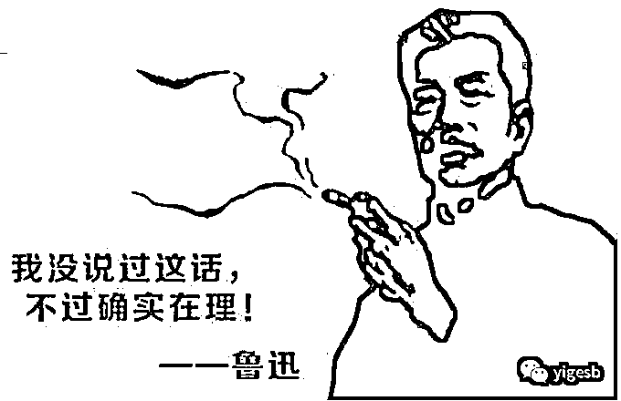  <ne-h2 id="151937fe" data-lake-id="151937fe"><ne-heading-ext><ne-heading-anchor></ne-heading-anchor><ne-heading-fold></ne-heading-fold></ne-heading-ext><ne-heading-content><ne-text id="u5bfcbe3b" ne-bold="true">YigeSB</ne-text><ne-text id="ua8ef91d8" ne-bold="true">1.两点之间直线最短，直达终点的路并不平坦</ne-text></ne-heading-content></ne-h2> <ne-h4 id="5c7b3eb7" data-lake-id="5c7b3eb7"><ne-heading-ext><ne-heading-anchor></ne-heading-anchor><ne-heading-fold></ne-heading-fold></ne-heading-ext><ne-heading-content><ne-text id="u22737b6b" ne-bold="true">1.合作方非公开接口</ne-text></ne-heading-content></ne-h4> <ne-p id="u1118270d" data-lake-id="u1118270d"><ne-text id="u6eee51f1">微信是个极度封闭的系统，无论是域内到域外，还是域外到域内，都极度封闭，默认情况下，只有部分白名单上的合作产品才能域内外跳转自如</ne-text></ne-p> <ne-p id="uf94d0cb5" data-lake-id="uf94d0cb5"><ne-text id="u7858608c">因此，早年域外 App 想要直接跳转进入微信 App 域内，只能通过合作方的非公开接口的漏洞，最常用的就是京东</ne-text></ne-p> <ne-p id="uddae4e30" data-lake-id="uddae4e30"><ne-card data-card-name="image" data-card-type="inline" id="tNC40" data-event-boundary="card">  <ne-p id="u24e1f7b4" data-lake-id="u24e1f7b4"><ne-text id="u1dd23b32">来自 Aladdin 的万能收藏夹</ne-text></ne-p> <ne-p id="u8d80b3f4" data-lake-id="u8d80b3f4"><ne-text id="u818b07b4">京东曾经给服务商提供了一个接口，该接口的能力是可以给开发者生成动态微信协议 URL Scheme，如</ne-text></ne-p> <ne-p id="u2d36bbf2" data-lake-id="u2d36bbf2"><ne-text id="ucd9329fe">可以从域外唤起微信，并直达京东商家的 h5 店铺</ne-text></ne-p> <ne-p id="ub9dd347d" data-lake-id="ub9dd347d"><ne-text id="ua30b9a23">有了这个接口之后，增长骇客们又找到了京东产品线内某实习生写的活动跳转页，没有限制跳转仅限 jd 域内，这样一结合，对 jd 跳转漏洞的利用就完成了，微信域外跳入微信域内任意 url 的 h5 页面即可实现</ne-text></ne-p> <ne-p id="u91b13715" data-lake-id="u91b13715"><ne-card data-card-name="image" data-card-type="inline" id="bk3eY" data-event-boundary="card">  <ne-p id="u3002d50e" data-lake-id="u3002d50e"><ne-text id="u5a36ef3d">4 年半前跟踪一个黑产利用漏洞的抓包文件</ne-text></ne-p> <ne-p id="u3d23e7d4" data-lake-id="u3d23e7d4"><ne-text id="ubf20a126">由此而衍生了大量的付费跳转链接生成服务</ne-text></ne-p> <ne-p id="u7702dee0" data-lake-id="u7702dee0"><ne-card data-card-name="image" data-card-type="inline" id="LYddT" data-event-boundary="card">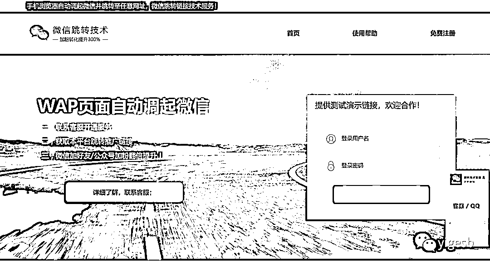  <ne-p id="uf4145036" data-lake-id="uf4145036"><ne-text id="ua2486612">web archive 上的存档</ne-text></ne-p> <ne-p id="ua2b76599" data-lake-id="ua2b76599"><ne-text id="u8ccaf65d">在 2017~2018 年间，像京东这样的合作产品中的跳转漏洞被利用来域外流量导入微信的情况，并不鲜见，就我本人所见的，还有同程网的类似接口被同样的手段利用</ne-text></ne-p> <ne-h4 id="33faa83d" data-lake-id="33faa83d"><ne-heading-ext><ne-heading-anchor></ne-heading-anchor><ne-heading-fold></ne-heading-fold></ne-heading-ext><ne-heading-content><ne-text id="ua009e8d3" ne-bold="true">2.公开接口</ne-text></ne-heading-content></ne-h4> <ne-p id="ua72548f4" data-lake-id="ua72548f4"><ne-text id="u19890d04">随着微信开放能力的不断增强，微信小程序板块先后开放了 URL Link，URL Scheme，Short Link 等能力，用于在微信外或微信内环境直接跳转到小程序；此外，在微信环境内网页 Jssdk 中还提供了开放标签用于在微信 H5 环境跳转到小程序；除此之外，开放平台移动应用的支持还提供了移动端 SDK 用于 App 拉起小程序；只不过个人认为最值得一提的还要数微信客服能力在这个方向的应用，下面我们来一一分解</ne-text></ne-p> <ne-h5 id="8dc76631" data-lake-id="8dc76631"><ne-heading-ext><ne-heading-anchor></ne-heading-anchor><ne-heading-fold></ne-heading-fold></ne-heading-ext><ne-heading-content><ne-text id="u7cd4b292" ne-bold="true">URL Link/URL Scheme/Short Link</ne-text></ne-heading-content></ne-h5> <ne-p id="u9947b360" data-lake-id="u9947b360"><ne-text id="ua60fe63e">这三者的能力和使用场景不尽相同，具体的使用方法技术细节微信开发文档写的很详细，我就不赘述了，简单讲讲这 3 者的使用场景和相关限制</ne-text></ne-p> <ne-p id="uf8a7742b" data-lake-id="uf8a7742b"><ne-text id="u6d672282">1\. URL Link 和 URL Scheme 这两者本质上是一样的，只不过主要区别在于 Android 和 iOS 对 URL Scheme 的支持度不一致以及微信内外不同环境的兼容</ne-text></ne-p> <ne-p id="u47105378" data-lake-id="u47105378"><ne-card data-card-name="image" data-card-type="inline" id="q3lV8" data-event-boundary="card">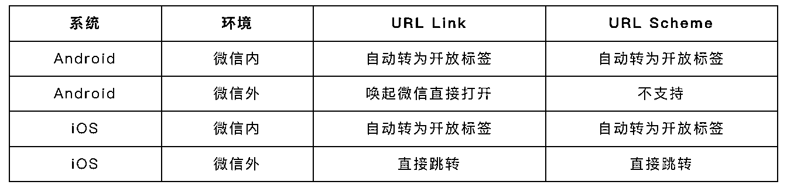<ne-text id="u6a8da59e">2\. Short URL 是用于在微信环境内调起小程序的业务场景，并且限定了电商类目，所以这个能力的应用更多是在私域内的转化环节</ne-text>  <ne-p id="u0916107c" data-lake-id="u0916107c"><ne-text id="ue3914174">值得给大家分享的是，官方接口生成的短链形式如下</ne-text></ne-p> <ne-p id="u1da5802b" data-lake-id="u1da5802b"><ne-text id="u1625cafd">那么第一次看到这种短链的时候，直觉告诉我(也许是梦里</ne-text><ne-text id="u009caa95" style="color: rgb(58, 58, 58);">张小龙</ne-text><ne-text id="u26f100a7">给我开小灶的)，试试 mp://，果然，在微信</ne-text><ne-text id="u8cc6a393" ne-bold="true">对话环境</ne-text><ne-text id="uff31376c">内实现了一个 mp 协议，可以将上述 URL 简化如下</ne-text></ne-p> <ne-p id="uc9e1d34e" data-lake-id="uc9e1d34e"><ne-text id="uf9ac2bd0">简化后的字符数大大减少，甚是赏心悦目，注意，仅限微信对话环境，对话环境包括哪些场景？这是今天的作业题，可以在本文留言交作业</ne-text></ne-p> <ne-p id="u91038fc4" data-lake-id="u91038fc4"><ne-text id="uffd5da74">值得一提的是，URL Link 和 URL Scheme 的能力在今年初遭到了非常大的弱化，核心调整有：</ne-text></ne-p> <ne-oli><ne-oli-i>1</ne-oli-i><ne-oli-c class="ne-oli-content" id="uadd322c5" data-lake-id="uadd322c5"><ne-text id="uea35b8f7">每个 URL Scheme 或 URL Link 有效期最长 30 天，均不再支持永久有效的链接、不再区分短期有效链接与长期有效链接；</ne-text></ne-oli-c></ne-oli> <ne-oli><ne-oli-i>2</ne-oli-i><ne-oli-c class="ne-oli-content" id="u58459ffb" data-lake-id="u58459ffb"><ne-text id="ubd6ae575">链接生成后，若在微信外打开，用户可以在浏览器页面点击进入小程序。每个独立的链接被用户访问后，仅此用户可以再次访问并打开对应小程序，其他用户无法再次通过相同链接打开该小程序；</ne-text></ne-oli-c></ne-oli> <ne-oli><ne-oli-i>3</ne-oli-i><ne-oli-c class="ne-oli-content" id="u46a16905" data-lake-id="u46a16905"><ne-text id="u7da989d2">单个小程序每天生成链接数（URL Scheme 和 URL Link 总数）上限为 50 万条。</ne-text></ne-oli-c></ne-oli> <ne-p id="ub0ba3fc6" data-lake-id="ub0ba3fc6"><ne-text id="u0d7b15ec">这样的调整主要还是由于微信开发者对这两项开放能力的滥用，产生了大量以私域转化为目的小程序，专门用来承接外域流量的跳转，此后微信也开始持续整顿，大批此类小程序被封，</ne-text>[<ne-text id="ue6ce2c44">我也曾经撰文写过</ne-text>](http://mp.weixin.qq.com/s?__biz=MzA4NjU0NTAzNw==&mid=2447674373&idx=1&sn=45ddea6a0b39378f5a87bdf5b2d34a4c&chksm=8bd72be7bca0a2f17f2b4b0cc6e53696a16f4dd51fd8d392086620c84eea123a00b44a8416d9&scene=21#wechat_redirect)</ne-p> <ne-h5 id="5d193f39" data-lake-id="5d193f39"><ne-heading-ext><ne-heading-anchor></ne-heading-anchor><ne-heading-fold></ne-heading-fold></ne-heading-ext><ne-heading-content><ne-text id="u94c3e635" ne-bold="true">开放标签</ne-text></ne-heading-content></ne-h5> <ne-p id="u47e40712" data-lake-id="u47e40712"><ne-text id="uc121a882">开放标签是微信环境内 h5 页面提供的跳转到小程序或者 App 的能力，不过我们本章节主要讨论的是从外域进入微信域的能力，而开放标签单独来看主要是提供从微信域进入外域的能力和微信 H5 进入小程序的能力</ne-text></ne-p> <ne-p id="u0c3c4185" data-lake-id="u0c3c4185"><ne-text id="udc64cc47">所以开放标签在私域转化中的应用可见于微信内的 h5 裂变流量落地到小程序进行私域转化或者 h5 能力增加比如导入小程序申请获取用户手机号等场景</ne-text></ne-p> <ne-h5 id="7a4f540f" data-lake-id="7a4f540f"><ne-heading-ext><ne-heading-anchor></ne-heading-anchor><ne-heading-fold></ne-heading-fold></ne-heading-ext><ne-heading-content><ne-text id="uf8ae29bf" ne-bold="true">App 唤起小程序</ne-text></ne-heading-content></ne-h5> <ne-p id="u42667a0a" data-lake-id="u42667a0a"><ne-text id="u1de1fce0">这个能力主要是提供给开放平台的移动应用，认证过的账号应用可以跳转至任意小程序且不限数量</ne-text></ne-p> <ne-p id="u7a3add48" data-lake-id="u7a3add48"><ne-text id="u8e475651">微信开放的这个能力带来的价值数以百亿计，一个很典型的应用场景，大型流量平台的广告落地渠道，比如抖音、快手等广告平台，广告主去投放广告，广告内容是微信小游戏，就需要广告平台的客户端来调用这个能力，从抖音、快手等直接跳转到微信小游戏来完成流量的变现</ne-text></ne-p> <ne-p id="ua5ed204c" data-lake-id="ua5ed204c"><ne-text id="uf10a77a0">此外，一些自有 App 产品，如果需要和用户建立直接触达的渠道，这个开放能力也是不二之选，直接跳到微信小程序带二维码的落地页，用户扫码加到私域，持续运营，持续变现，毕竟，微信私域的精华之一是：</ne-text><ne-text id="u600029cf" ne-bold="true">用户永远在线</ne-text><ne-text id="u7f71424f">，并且能</ne-text><ne-text id="u9b588c27" ne-bold="true">永远免费无限触达</ne-text><ne-text id="uabd85a07">，当然只是理论上的无限，风控也是不可忽略的，否则就不会有那么多“养号”教程了，不在本文讨论范围暂且按住不表</ne-text></ne-p> <ne-h5 id="7b92bf2f" data-lake-id="7b92bf2f"><ne-heading-ext><ne-heading-anchor></ne-heading-anchor><ne-heading-fold></ne-heading-fold></ne-heading-ext><ne-heading-content><ne-text id="ud30a7650" ne-bold="true">微信客服</ne-text></ne-heading-content></ne-h5> <ne-p id="uf7909446" data-lake-id="uf7909446"><ne-text id="u14e61e2e">微信客服可以说几乎是一个王炸，微信客服和企业微信产品是强关联的，从产品域名上看，应该是企业微信旗下团队的一个产品，鉴于近年来整个微信生态对企业微信资源的倾斜是优于其他产品线的</ne-text></ne-p> <ne-p id="u22c1a17f" data-lake-id="u22c1a17f"><ne-text id="ue9d5157c">个人经验+不负责的猜测，微信客服相应的风控力度相对来说是要松一些的</ne-text></ne-p> <ne-p id="u0354dc44" data-lake-id="u0354dc44"><ne-text id="u94d74c1d">上文中提到以利用 URL link 能力接收外域流量落地微信为主要功能的小程序大批量被封禁，那么剩下的唯一合规解决方案就是微信客服，无论是从抖音快手还是小红书微博亦或是知乎手百，所有能访问网络的移动端如果没有做白名单限制的情况下，</ne-text><ne-text id="u129a6b63" ne-bold="true">几乎都可以直达微信域内，进入微信客服聊天界面</ne-text></ne-p> <ne-p id="u9e21370d" data-lake-id="u9e21370d"><ne-text id="ue21a16bf">然后再利用微信客服的</ne-text><ne-text id="u6713dc3c" ne-bold="true">欢迎语</ne-text><ne-text id="u27efb70e">功能，可以自动提示给用户需要的信息，配合菜单消息，无论是给用户二维码加为微信好友，还是导入小程序抑或付费链接，都无比丝滑</ne-text></ne-p> <ne-p id="uc230edee" data-lake-id="uc230edee"><ne-text id="u8de841aa">所以现在我们经常能看到，抖音直播的小风车、知乎答题的小卡片等等，点击后能够直接打开微信将用户导入到微信客服，进而转化到私域</ne-text></ne-p> <ne-p id="ubaae85f7" data-lake-id="ubaae85f7"><ne-text id="uaa1d01cb">类似微信生态内视频号小店这样的当红炸子鸡，也将客服渠道改成默认接入微信客服，可见这个王炸产品的重要程度，而我早年在生财有术社群提过的类似“腾讯云智服”之类的早期产品，虽然目前已经用在了颇多的内部产品线诸如微信 mp 平台，但是在腾讯内部注定不会有太多资源倾斜上去了，唯一略显遗憾的是，微信客服的接入，还不支持桌面端环境，不然的话就没企业 QQ 什么事了</ne-text></ne-p> <ne-p id="u9ab6d9f0" data-lake-id="u9ab6d9f0"><ne-text id="u510b78d1">此外，如果你有一定的开发能力，通过微信客服提供的 API，你也完全可以做到类似关键词回复之类的功能，那么你在视频号、视频号小店等入口，就能够在客户互动的过程中提供更强的能力，比如发送客户的订单，给客户打标签，甚至接入这几天火到爆表的 ChatGPT 机器人(明天我来写写 ChatGPT 风靡全网之后，我做了什么)，更甚者，利用垂直行业语料训练专属的行业模型，接入微信客服来打造真正的 AI 智能客服</ne-text></ne-p> <ne-h2 id="77fbe72b" data-lake-id="77fbe72b"><ne-heading-ext><ne-heading-anchor></ne-heading-anchor><ne-heading-fold></ne-heading-fold></ne-heading-ext><ne-heading-content><ne-text id="ue5d9b239" ne-bold="true">YigeSB</ne-text><ne-text id="u27c88f75" ne-bold="true">2.不能直达终点，曲径通幽依然有技巧可循</ne-text></ne-heading-content></ne-h2> <ne-p id="u890ad9f0" data-lake-id="u890ad9f0"><ne-text id="u709b0b3f">上一章讲了直达私域终点的路径，即便有一定的接入门槛，至少也能让大家知道“</ne-text><ne-text id="uf8399d8f" ne-bold="true">原来可以这样干</ne-text><ne-text id="u72d036ab">”，那么这一章，我们来探讨一下非直达微信的方式方法</ne-text></ne-p> <ne-p id="ua95528bf" data-lake-id="ua95528bf"><ne-text id="u61aa86a2">首先我们定义一下什么叫非直达，上面的直达，其实是微信外</ne-text><ne-text id="u8c4297bf" ne-bold="true">自动</ne-text><ne-text id="u44ac868d">唤起微信进入特定页面，那么非直达，其实就是</ne-text><ne-text id="uf49e1666" ne-bold="true">手动</ne-text><ne-text id="ua0fb737b">唤起微信，手动输入内容后进入特定页面，对于引导进私域而言，这个动作其实就是加好友</ne-text></ne-p> <ne-p id="u1ae3e648" data-lake-id="u1ae3e648"><ne-text id="uc5bc5b18">我们回想一下，站在用户角度，在微信外想加一个好友有哪些路径？</ne-text></ne-p> <ne-oli><ne-oli-i>1</ne-oli-i><ne-oli-c class="ne-oli-content" id="u46d47187" data-lake-id="u46d47187"><ne-text id="u43d87f27">搜索手机号</ne-text></ne-oli-c></ne-oli> <ne-oli><ne-oli-i>2</ne-oli-i><ne-oli-c class="ne-oli-content" id="ubba56fa1" data-lake-id="ubba56fa1"><ne-text id="u07ac8e19">搜索微信号</ne-text></ne-oli-c></ne-oli> <ne-oli><ne-oli-i>3</ne-oli-i><ne-oli-c class="ne-oli-content" id="uc8fdbc59" data-lake-id="uc8fdbc59"><ne-text id="u76094468">搜索 QQ 号</ne-text></ne-oli-c></ne-oli> <ne-oli><ne-oli-i>4</ne-oli-i><ne-oli-c class="ne-oli-content" id="udbf18b7e" data-lake-id="udbf18b7e"><ne-text id="u58bfada4">扫描二维码</ne-text></ne-oli-c></ne-oli> <ne-oli><ne-oli-i>5</ne-oli-i><ne-oli-c class="ne-oli-content" id="u799e096a" data-lake-id="u799e096a"><ne-text id="u795d680a">摇一摇</ne-text></ne-oli-c></ne-oli> <ne-oli><ne-oli-i>6</ne-oli-i><ne-oli-c class="ne-oli-content" id="u8dc703d9" data-lake-id="u8dc703d9"><ne-text id="u9d676e31">...</ne-text></ne-oli-c></ne-oli> <ne-p id="u1c9478d0" data-lake-id="u1c9478d0"><ne-text id="u44aadeaf">目前最主流的就是前 4 种，他们的共同点是，要从微信外记录信息，然后手动打开微信，再把信息输入给微信，到达用户页面，提交加好友申请</ne-text></ne-p> <ne-p id="ue0ffa73c" data-lake-id="ue0ffa73c"><ne-text id="u729f1093">不过这些操作不必细说，中国十几亿微信用户，这样的操作至少 10 亿用户都能操作自如</ne-text></ne-p> <ne-p id="u79cbbcad" data-lake-id="u79cbbcad"><ne-text id="u6e22fecb">目前的中文互联网环境，各个超级 App 之间依然是各自封闭的环境，你在抖音账号信息中留个微信号，在知乎简介留个手机号，小红书私信回复个二维码，都可能违规，所以市面上有了各种各样的奇技淫巧来留下蛛丝马迹让用户去加微信，诸如抖音专辑名称、小红书置顶笔记，知乎私信图片水印，甚至连藏头诗都大行其道，叹为观止，这些是传统非直达手段都会遇到的问题，也不再赘述</ne-text></ne-p> <ne-p id="u7fb45cce" data-lake-id="u7fb45cce"><ne-text id="u97cf5015">在域外非直达微信的方式中，其实我想给大家分享的只有一点，那就是</ne-text><ne-text id="u703ef3c0" ne-bold="true">活码</ne-text><ne-text id="ubffa1f32">思维</ne-text></ne-p> <ne-p id="u5800b7fc" data-lake-id="u5800b7fc"><ne-text id="ufea27928">众所周知，微信好友数有上限，如果你在微信外流量平台留下的手机号、微信号、qq 号(俗称钩子)等对应的微信号好友达到了好友数上限，新用户想加你却加不上，这样就白白浪费了流量</ne-text></ne-p> <ne-p id="ud60bc93d" data-lake-id="ud60bc93d"><ne-text id="u15e5ef1c">有没有办法让一个号好友加满了自动加另外一个号呢，其实很简单，当好友加满之后，你再把留下的钩子重新绑定到新的微信号即可</ne-text></ne-p> <ne-p id="u0a2d6966" data-lake-id="u0a2d6966"><ne-text id="ufbdd743d">对比手机号、微信号、qq 号这 3 种钩子，手机号通常比另外两个更难留；微信号一年才能改一次；qq 号是相对较优的方案，最短的 qq 号只有 5 位，记忆成本也更低，只不过需要注意的是，2016 年 6 月 17 日之后注册的 QQ 号不再支持绑定微信</ne-text></ne-p> <ne-p id="u8450b02d" data-lake-id="u8450b02d"><ne-text id="uf0a8f53d">至于二维码这种钩子，市面上就有更多的解决方案了，比如我最常用的草料二维码</ne-text></ne-p> <ne-p id="ua997d511" data-lake-id="ua997d511"><ne-text id="uf774818e">有了活码思维，你就不至于在流量爆发的时候，眼睁睁的看着流量涌来却无法承接，早年流行的群裂变，是活码思维利用的绝佳体现</ne-text></ne-p> <ne-p id="ub9e2e39e" data-lake-id="ub9e2e39e"><ne-text id="u3a5dc86f">最后再说一句，如果一个用户愿意从别的平台手动复制下你留的钩子内容，手动切换到微信，一共点了七八十几下操作，加上了你，这样的流量何其精准啊，一定要好好珍惜</ne-text></ne-p> <ne-h3 id="afee9304" data-lake-id="afee9304"><ne-heading-ext><ne-heading-anchor></ne-heading-anchor><ne-heading-fold></ne-heading-fold></ne-heading-ext><ne-heading-content><ne-text id="uc1d30045">【微信风向标】</ne-text></ne-heading-content></ne-h3> <ne-h2 id="7aa84231" data-lake-id="7aa84231"><ne-heading-ext><ne-heading-anchor></ne-heading-anchor><ne-heading-fold></ne-heading-fold></ne-heading-ext><ne-heading-content><ne-text id="u96746675">（22 赞）朋友圈广告投放，群里每天更新精选好物，添加客服低价上车</ne-text></ne-heading-content></ne-h2> <ne-p id="u52228d95" data-lake-id="u52228d95"><ne-text id="uf54f8d07">#风向标# 朋友圈广告投放（捡漏），群里每天更新精选好物，添加客服低价上车。</ne-text></ne-p> <ne-p id="u03dbe7fa" data-lake-id="u03dbe7fa"><ne-card data-card-name="image" data-card-type="inline" id="CduMx" data-event-boundary="card">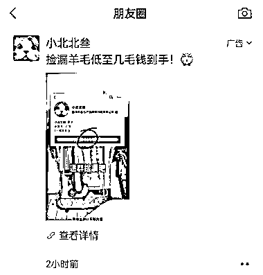  <ne-p id="uda58cc4a" data-lake-id="uda58cc4a"><ne-card data-card-name="image" data-card-type="inline" id="Hw1Ml" data-event-boundary="card">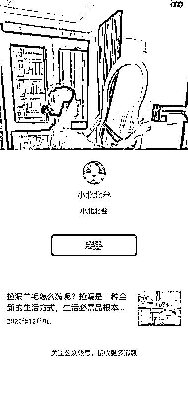  <ne-p id="ue7124917" data-lake-id="ue7124917"><ne-card data-card-name="image" data-card-type="inline" id="U53Pm" data-event-boundary="card">  <ne-p id="uace69c93" data-lake-id="uace69c93"><ne-card data-card-name="image" data-card-type="inline" id="loj5I" data-event-boundary="card">  <ne-h2 id="870f2bf0" data-lake-id="870f2bf0"><ne-heading-ext><ne-heading-anchor></ne-heading-anchor><ne-heading-fold></ne-heading-fold></ne-heading-ext><ne-heading-content><ne-text id="ue82d467f">（22 赞）朋友圈广告推广公众号 6 元寄快递，这个可是刚需应该收益可观</ne-text></ne-heading-content></ne-h2> <ne-p id="u441c8537" data-lake-id="u441c8537"><ne-text id="u3aebfd8e">微信朋友圈广告推广公众号，引流公众号号推广 6 元寄快递，这个可是刚需应该收益可观，有广告的地方就有机会，有懂的圈友可以继续深挖一下，可能是个不错的项目#风向标#</ne-text></ne-p> <ne-p id="udf1a6aab" data-lake-id="udf1a6aab"><ne-card data-card-name="image" data-card-type="inline" id="lwtLu" data-event-boundary="card">  <ne-h2 id="f56d6605" data-lake-id="f56d6605"><ne-heading-ext><ne-heading-anchor></ne-heading-anchor><ne-heading-fold></ne-heading-fold></ne-heading-ext><ne-heading-content><ne-text id="u5b4be252">视频号投流弹窗，引流目标用户关注公众号+微信群</ne-text></ne-heading-content></ne-h2> <ne-p id="ucb30a2d8" data-lake-id="ucb30a2d8"><ne-text id="u727429b1">#风向标# 视频号投流弹窗，引流目标用户关注公众号➕微信群，全程在微信一个 app 完成，更加丝滑， 还可以投流弹窗下其他应用，</ne-text></ne-p> <ne-p id="u7356eb83" data-lake-id="u7356eb83"><ne-card data-card-name="image" data-card-type="inline" id="Ui7zu" data-event-boundary="card">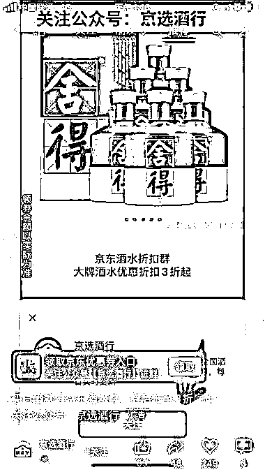  <ne-p id="ufa00a1de" data-lake-id="ufa00a1de"><ne-card data-card-name="image" data-card-type="inline" id="x4Yrw" data-event-boundary="card">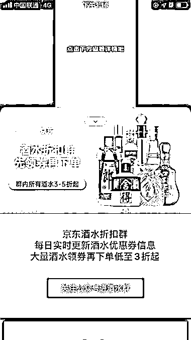  <ne-p id="ufd84a695" data-lake-id="ufd84a695"><ne-card data-card-name="image" data-card-type="inline" id="pn6va" data-event-boundary="card">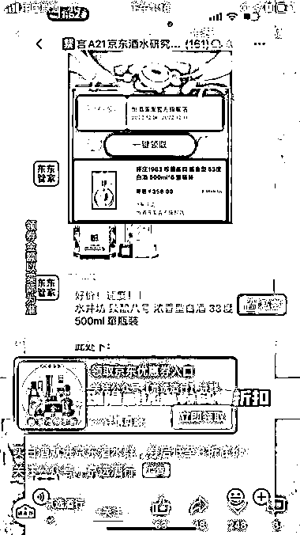  <ne-h2 id="1f1b8824" data-lake-id="1f1b8824"><ne-heading-ext><ne-heading-anchor></ne-heading-anchor><ne-heading-fold></ne-heading-fold></ne-heading-ext><ne-heading-content><ne-text id="ud6cfb6c6">（31 赞）付费群搭建工具，给卖付费资料的提供工具</ne-text></ne-heading-content></ne-h2> <ne-p id="u8e01fd9d" data-lake-id="u8e01fd9d"><ne-text id="u3bb73086">#风向标# 付费群搭建工具 给卖付费资料的提供工具，这个收费 300，源码 99➕搭建 50➕服务器 150，如果自己懂点技术的话，根本用不到 300。</ne-text></ne-p> <ne-p id="u203fce50" data-lake-id="u203fce50"><ne-card data-card-name="image" data-card-type="inline" id="LNsEQ" data-event-boundary="card">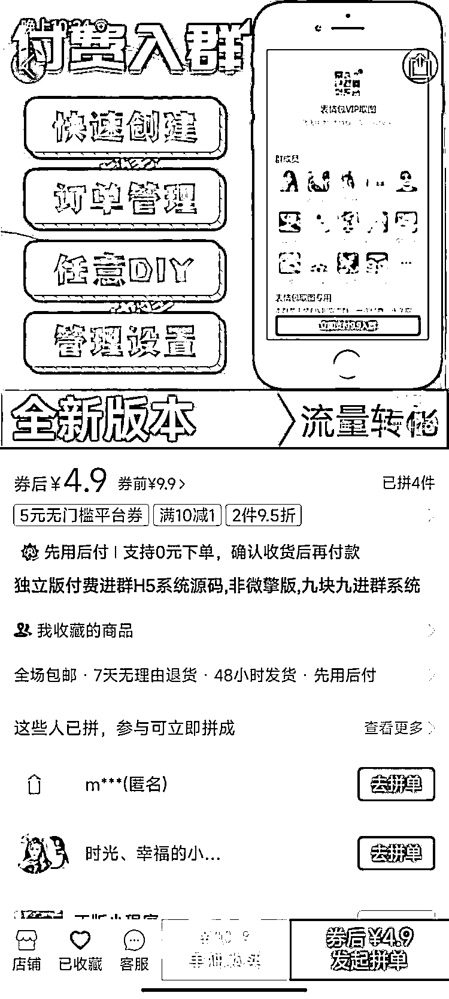  <ne-h2 id="f34cf70f" data-lake-id="f34cf70f"><ne-heading-ext><ne-heading-anchor></ne-heading-anchor><ne-heading-fold></ne-heading-fold></ne-heading-ext><ne-heading-content><ne-text id="u03e7dd27">（9 赞）这两个产品的热度非常高，做视频带货的关注</ne-text></ne-heading-content></ne-h2> <ne-p id="u70a07fbd" data-lake-id="u70a07fbd"><ne-text id="uc2a619d7">#风向标# 这两个产品的热度非常高，做视频带货的关注 1）上海迪士尼乐园开园门票卖了 17 万份➕了，销量还在增加 2）阿凡达 2 门票的预售，也已经卖了上亿了。</ne-text></ne-p> <ne-p id="u90285238" data-lake-id="u90285238"><ne-card data-card-name="image" data-card-type="inline" id="uT5R1" data-event-boundary="card">  <ne-p id="ub95cca93" data-lake-id="ub95cca93"><ne-card data-card-name="image" data-card-type="inline" id="XewzJ" data-event-boundary="card">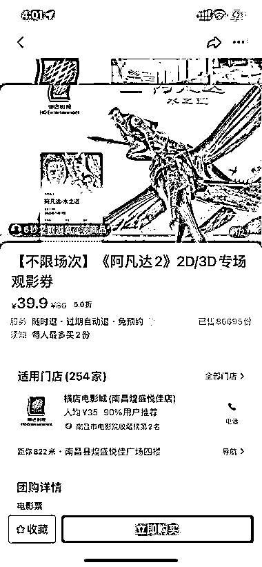  <ne-h1 id="b2d1e051" data-lake-id="b2d1e051"><ne-heading-ext><ne-heading-anchor></ne-heading-anchor><ne-heading-fold></ne-heading-fold></ne-heading-ext><ne-heading-content><ne-text id="ud6a0b28c">【小红书】</ne-text></ne-heading-content></ne-h1> <ne-h2 id="71582b94" data-lake-id="71582b94"><ne-heading-ext><ne-heading-anchor></ne-heading-anchor><ne-heading-fold></ne-heading-fold></ne-heading-ext><ne-heading-content><ne-text id="ud39dd6b1">（145 赞）《 小红书一周涨粉 6000+ 变现 3w 复盘》</ne-text></ne-heading-content></ne-h2> <ne-p id="u0294c0ac" data-lake-id="u0294c0ac"><ne-text id="uc6d2bd5d">小红书：一周涨粉 6000+ 变现 3w 复盘 没有复杂的工具，没有高难度操作 只有朴实无华的有效动作！ 亮点 一、方便新人理解概念 讲了几个小故事 二、内容均为自己实操过的，保证可落地 三、文章内容新鲜可口、 前辈们分享过的干货我留下了传送口 四、有关资料号，划重点的章节： 笔记连爆技术：批量生产爆款 简单粗暴 制作勾魂钩子：一周生产 7.8 篇评论 500+ ，20 多篇评论 100+笔记的方法论</ne-text></ne-p> <ne-p id="u64f0621d" data-lake-id="u64f0621d"><ne-text id="u6ba20605">详情移步飞书</ne-text></ne-p> <ne-p id="uafd2e99a" data-lake-id="uafd2e99a">[<ne-text id="u969ad620">https://giwb0zv0cv.feishu.cn/docx/IpCcdJ9NAoAt4pxKKV5c5sfenZc</ne-text>](https://giwb0zv0cv.feishu.cn/docx/IpCcdJ9NAoAt4pxKKV5c5sfenZc)</ne-p> <ne-h2 id="f7bf59d3" data-lake-id="f7bf59d3"><ne-heading-ext><ne-heading-anchor></ne-heading-anchor><ne-heading-fold></ne-heading-fold></ne-heading-ext><ne-heading-content><ne-text id="uf7895cfb">（73 赞）《 我在小红书给别人“算姻缘”，一个月稳定变现 3 万+》</ne-text></ne-heading-content></ne-h2> <ne-p id="u8799b41a" data-lake-id="u8799b41a"><ne-text id="ub2f12b5f">我在小红书给别人“算姻缘”，一个月稳定变现 3 万+；小红书玄学领域引流和变现玩法大揭秘。 玄学门类太广，由于会涉及很多红线，所以看到的机会不多，今天一股脑全分享给大家了。#小红书# ：</ne-text></ne-p> <ne-p id="u921aefad" data-lake-id="u921aefad">[<ne-text id="u78af07aa">https://docs.qq.com/doc/DTldBdFRQbHV4Q0ZE</ne-text>](https://docs.qq.com/doc/DTldBdFRQbHV4Q0ZE)</ne-p> <ne-h2 id="63342daa" data-lake-id="63342daa"><ne-heading-ext><ne-heading-anchor></ne-heading-anchor><ne-heading-fold></ne-heading-fold></ne-heading-ext><ne-heading-content><ne-text id="u251e1288">（78 赞）《 小红书资料引流，12 种爆款封面案例拆解》</ne-text></ne-heading-content></ne-h2> <ne-p id="u70a77037" data-lake-id="u70a77037"><ne-text id="uae4a0700">做小红书，几乎可以说是封面定生死，虽然也不至于这么夸张</ne-text></ne-p> <ne-p id="u7123903e" data-lake-id="u7123903e"><ne-text id="u52d673b8">但是在其他变量（标题、内容）确定的情况下，不同的封面，带来的数据反馈会千差万别</ne-text></ne-p> <ne-p id="u4ad4eacc" data-lake-id="u4ad4eacc"><ne-text id="ud86cfb15">所以用心打磨好自己的封面内容至关重要</ne-text></ne-p> <ne-p id="u4369556a" data-lake-id="u4369556a"><ne-text id="u83b09c83">已我们做的一个赛道（法考）为例</ne-text></ne-p> <ne-p id="u51dc06e5" data-lake-id="u51dc06e5"><ne-text id="ua9dc9031">先分享下哪些内容容易爆</ne-text></ne-p> <ne-p id="u90c2fdae" data-lake-id="u90c2fdae"><ne-text id="u559ec474" ne-bold="true">1、资料功能性强，小资料，大作用</ne-text></ne-p> <ne-p id="ub202eb3a" data-lake-id="ub202eb3a"><ne-text id="u1c3f9808">找到目标客户群的痛点，让他觉得，你的资料能躺着解决他的困难问题，满足人的期待</ne-text></ne-p> <ne-p id="u2cf7ca76" data-lake-id="u2cf7ca76"><ne-text id="u8632d32a">让用户觉得看了你这个简单几兆的资料，就能解决我法考主观题、客观题的困难，就会去下单</ne-text></ne-p> <ne-p id="uce3bc353" data-lake-id="uce3bc353"><ne-text id="udcbc0b81">比如：《22 法考，考点才 283 页，不背后悔！》</ne-text></ne-p> <ne-p id="u0af88919" data-lake-id="u0af88919"><ne-text id="u08f25317">《只学 4 个月过法考！掌握以下几点暴涨 50 分！》</ne-text></ne-p> <ne-p id="u4ce7419c" data-lake-id="u4ce7419c"><ne-text id="u734d5e7c">《22 法考高分通过，全靠这份 420 页笔记！》</ne-text></ne-p> <ne-p id="u4a14fda6" data-lake-id="u4a14fda6"><ne-text id="u1af154a8">学会在封面、标题中刺激用户期待、强化用户期待</ne-text></ne-p> <ne-p id="ucb434de3" data-lake-id="ucb434de3"><ne-text id="u9562e7ae">在评论区中“转移”用户期待，让她觉得加了你的微信就能满足自己的期待</ne-text></ne-p> <ne-p id="u427895a3" data-lake-id="u427895a3"><ne-text id="u6e8f95a2">此处的“刺激用户期待”，主要靠强调资料的优质性，其他方面不要过分夸大</ne-text></ne-p> <ne-p id="uc29a2865" data-lake-id="uc29a2865"><ne-text id="u9bf5b7a4" ne-bold="true">2、一眼看见，逻辑性强，好看的资料</ne-text></ne-p> <ne-p id="u9e088e03" data-lake-id="u9e088e03"><ne-text id="u3ed76676">比如思维导图，教案、多色笔记、手写笔记等，都属于这个范畴，用山东话讲，叫“咋呼人”</ne-text></ne-p> <ne-p id="uf6de01df" data-lake-id="uf6de01df"><ne-text id="u785fcaa4" ne-bold="true">3、什么样的资料内容值钱？（举个例子）</ne-text></ne-p> <ne-p id="u5fa49c7b" data-lake-id="u5fa49c7b"><ne-text id="u0f7cf287">让人觉得付出很少的工作就能过考试！这样的最值钱！</ne-text></ne-p> <ne-p id="uab3d7e69" data-lake-id="uab3d7e69"><ne-text id="uf292c986">《22 法考，考点才 283 页，不背后悔！》《1 天内搞定法理学！💥（文档直接背诵！🍍）》</ne-text></ne-p> <ne-p id="u5bf83f63" data-lake-id="u5bf83f63"><ne-text id="u94773696">一来数据最能刺激感官，二来数据限制了数量，让用户潜意识里觉得</ne-text></ne-p> <ne-p id="ud15dce38" data-lake-id="ud15dce38"><ne-text id="u79803058">学会这 283 页，就能过考试，满足了他们想躺着把难办的事办完的需求</ne-text></ne-p> <ne-p id="u209efbb0" data-lake-id="u209efbb0"><ne-text id="uf3718570" ne-bold="true">二、12 种爆款封面案例拆解</ne-text></ne-p> <ne-p id="u5e7bed67" data-lake-id="u5e7bed67"><ne-text id="u0e92a965" style="color: rgb(38, 38, 38);">ok，下面进入爆款封面案例拆解，这是我们在众多赛道实战</ne-text></ne-p> <ne-p id="u89c2576c" data-lake-id="u89c2576c"><ne-text id="uc73a3e3a" style="color: rgb(38, 38, 38);">以及大量的总结分享后，整理的一些</ne-text></ne-p> <ne-p id="ucf258911" data-lake-id="ucf258911"><ne-text id="ucd5ff430" ne-bold="true">（以法考资料内容举例）</ne-text></ne-p> <ne-h4 id="ed806e26" data-lake-id="ed806e26"><ne-heading-ext><ne-heading-anchor></ne-heading-anchor><ne-heading-fold></ne-heading-fold></ne-heading-ext><ne-heading-content><ne-text id="u9dc05a25">1、组队打卡式</ne-text></ne-heading-content></ne-h4> <ne-p id="u7bd96098" data-lake-id="u7bd96098"><ne-text id="ucb5fd64c">首图：分享自己的经历，或者直接要求组队打卡</ne-text></ne-p> <ne-p id="u9e1c6ced" data-lake-id="u9e1c6ced"><ne-text id="u0cbe4e8c">封面：参考同类别即可，吸引人就行</ne-text></ne-p> <ne-p id="u2acfc409" data-lake-id="u2acfc409"><ne-text id="u0e68d8b0">效果：这个效果超级好，很多人都想一起报团取暖，亲测特别容易火，不过不能一直用，和其他内容一起用比较好</ne-text></ne-p> <ne-p id="u3e13e6ac" data-lake-id="u3e13e6ac"><ne-card data-card-name="image" data-card-type="inline" id="cohf2" data-event-boundary="card">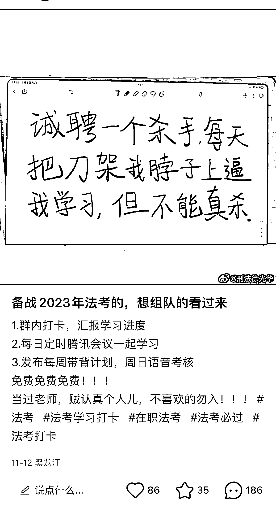  <ne-p id="uf7b3871f" data-lake-id="uf7b3871f"><ne-card data-card-name="image" data-card-type="inline" id="lQt8y" data-event-boundary="card"><ne-card data-card-name="image" data-card-type="inline" id="kHCEF" data-event-boundary="card">  <ne-h4 id="8bb87458" data-lake-id="8bb87458"><ne-heading-ext><ne-heading-anchor></ne-heading-anchor><ne-heading-fold></ne-heading-fold></ne-heading-ext><ne-heading-content><ne-text id="u4432f7e1">2、百科资料式</ne-text></ne-heading-content></ne-h4> <ne-p id="u3bff6ffc" data-lake-id="u3bff6ffc"><ne-text id="uaa144ef9">首图：资料拼图+显眼外框文字</ne-text></ne-p> <ne-p id="ua4e0135a" data-lake-id="ua4e0135a"><ne-text id="u89069d7a">内页：具体资料内页+边框，能有多色笔记部分最好</ne-text></ne-p> <ne-p id="u044f0909" data-lake-id="u044f0909"><ne-card data-card-name="image" data-card-type="inline" id="LxOzG" data-event-boundary="card">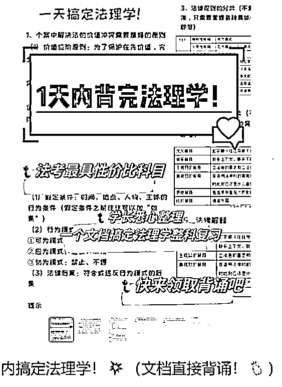<ne-card data-card-name="image" data-card-type="inline" id="LINmW" data-event-boundary="card">  <ne-h4 id="55420025" data-lake-id="55420025"><ne-heading-ext><ne-heading-anchor></ne-heading-anchor><ne-heading-fold></ne-heading-fold></ne-heading-ext><ne-heading-content><ne-text id="u800d2bae">3、彩印笔记换背景拍照式</ne-text></ne-heading-content></ne-h4> <ne-p id="u154140a1" data-lake-id="u154140a1"><ne-text id="u84c3a9f1">彩色笔记打印出来，加个文件夹，反复换背景拍照（如下图）即可</ne-text></ne-p> <ne-p id="u70bf8f60" data-lake-id="u70bf8f60"><ne-text id="ufa3c98a2">一套内容，换背景，可以产出好多篇笔记</ne-text></ne-p> <ne-p id="u48e89f4d" data-lake-id="u48e89f4d"><ne-text id="u1ce5868b">最好不要加很多花里胡哨的文字，下图图片里的文字不显眼，显得很杂乱</ne-text></ne-p> <ne-p id="u1a2f954f" data-lake-id="u1a2f954f"><ne-text id="u34082fef">这种拍照的，最好包装的像素人账号随手拍资料分享，账号定位也最好是素人</ne-text></ne-p> <ne-p id="ud0f63904" data-lake-id="ud0f63904"><ne-text id="u4a566815">这类照片拍出来后，一定要用【醒图 APP】修图【调节】板块中的【智能优化】功能</ne-text></ne-p> <ne-p id="u4804d1ac" data-lake-id="u4804d1ac"><ne-text id="u28b23aca">调节色差调整图片比例接近 3:4，用美图秀秀可调节</ne-text></ne-p> <ne-p id="ucb3bbac8" data-lake-id="ucb3bbac8"><ne-card data-card-name="image" data-card-type="inline" id="XT9Nz" data-event-boundary="card">  <ne-p id="uc9c353d8" data-lake-id="uc9c353d8"><ne-card data-card-name="image" data-card-type="inline" id="ZE9nB" data-event-boundary="card"><ne-card data-card-name="image" data-card-type="inline" id="pZ9C6" data-event-boundary="card"><ne-card data-card-name="image" data-card-type="inline" id="ehQJA" data-event-boundary="card">  <ne-h4 id="3f9df4ea" data-lake-id="3f9df4ea"><ne-heading-ext><ne-heading-anchor></ne-heading-anchor><ne-heading-fold></ne-heading-fold></ne-heading-ext><ne-heading-content><ne-text id="ucaf5ba28">4、仿手写笔记式</ne-text></ne-heading-content></ne-h4> <ne-p id="u8a6dfdf9" data-lake-id="u8a6dfdf9"><ne-text id="uf78f9c87">利用既有资料，组合出仿写的手写笔记，可见中标</ne-text></ne-p> <ne-p id="u18efd2e1" data-lake-id="u18efd2e1">[<ne-text id="uf2aac29a">https://t.zsxq.com/09ebyWwLu</ne-text>](https://t.zsxq.com/09ebyWwLu)</ne-p> <ne-p id="u7881ad05" data-lake-id="u7881ad05"><ne-text id="ubfe99963">猜测使用 goodnotes 或 noteability 或 noteful 制作</ne-text></ne-p> <ne-p id="uc0dede0b" data-lake-id="uc0dede0b"><ne-text id="ue0b1894b">模拟好的手机笔记，可以加上荧光笔划重点，更有吸引力</ne-text></ne-p> <ne-p id="u34c2f527" data-lake-id="u34c2f527"><ne-text id="ub559594d">调整图片比例接近 3:4，用美图秀秀可调节</ne-text></ne-p> <ne-p id="u36d0a9a5" data-lake-id="u36d0a9a5"><ne-card data-card-name="image" data-card-type="inline" id="YHId6" data-event-boundary="card">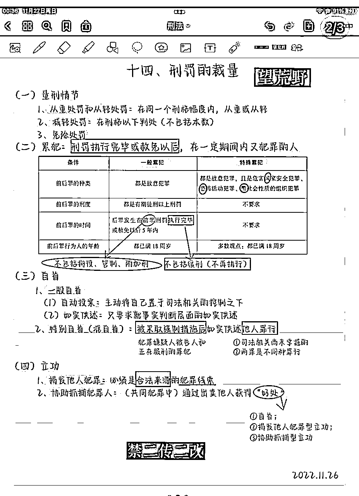<ne-card data-card-name="image" data-card-type="inline" id="vVM9e" data-event-boundary="card">  <ne-h4 id="be71ba2f" data-lake-id="be71ba2f"><ne-heading-ext><ne-heading-anchor></ne-heading-anchor><ne-heading-fold></ne-heading-fold></ne-heading-ext><ne-heading-content><ne-text id="u8a59bfd2">5、考试成绩单/职业资格证（效果很好，很容易传递信任）</ne-text></ne-heading-content></ne-h4> <ne-p id="ud9760d50" data-lake-id="ud9760d50"><ne-text id="u095034b7">晒成绩单/职业资格证，会有很大的人设加持</ne-text></ne-p> <ne-p id="ubcd28ec9" data-lake-id="ubcd28ec9"><ne-text id="u343b11cd">也可分享通过的经验</ne-text></ne-p> <ne-p id="u40822f27" data-lake-id="u40822f27"><ne-card data-card-name="image" data-card-type="inline" id="u7Qlb" data-event-boundary="card">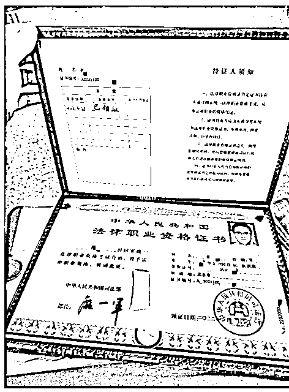  <ne-p id="u3cf822c9" data-lake-id="u3cf822c9"><ne-card data-card-name="image" data-card-type="inline" id="kM2bn" data-event-boundary="card">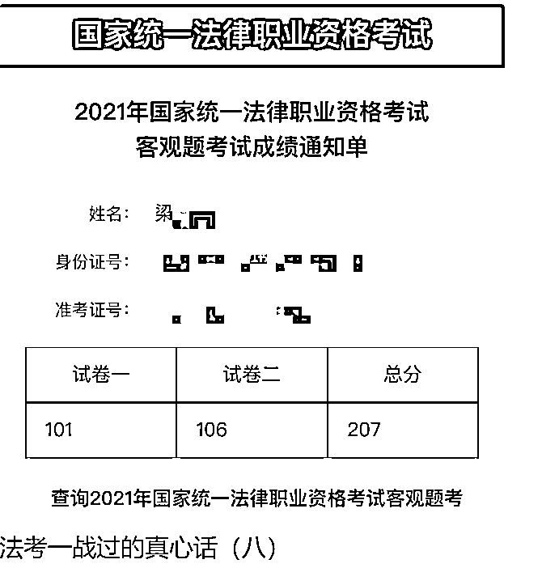<ne-card data-card-name="image" data-card-type="inline" id="qqqp0" data-event-boundary="card">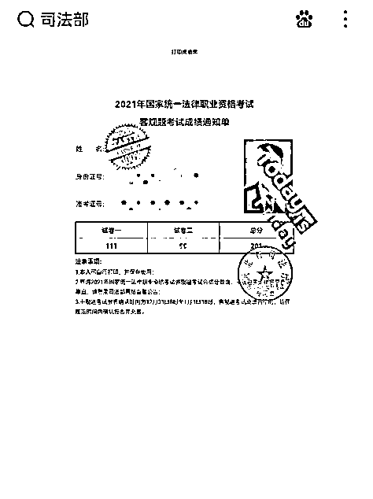<ne-card data-card-name="image" data-card-type="inline" id="tLxHB" data-event-boundary="card">  <ne-h2 id="9039450f-5" data-lake-id="9039450f-5"><ne-heading-ext><ne-heading-anchor></ne-heading-anchor><ne-heading-fold></ne-heading-fold></ne-heading-ext> <ne-heading-content></ne-heading-content></ne-h2> <ne-h4 id="19a6bbf2" data-lake-id="19a6bbf2"><ne-heading-ext><ne-heading-anchor></ne-heading-anchor><ne-heading-fold></ne-heading-fold></ne-heading-ext><ne-heading-content><ne-text id="ud3b82af4">6、初级版：封面模版改文字+资料内页式</ne-text></ne-heading-content></ne-h4> <ne-p id="ua018343c" data-lake-id="ua018343c"><ne-text id="uba5dd688">模版元素可以适当换一下，除此之外每次更换文字内容即可</ne-text></ne-p> <ne-p id="u70edb52c" data-lake-id="u70edb52c"><ne-text id="u4f2d37c8">资料内页建议用荧光笔类似的内容形式标画重点后发布，更具有爆款属性</ne-text></ne-p> <ne-p id="u16a7cd06" data-lake-id="u16a7cd06"><ne-text id="u35dcdaf4">调整图片比例接近 3:4，用美图秀秀可调节</ne-text></ne-p> <ne-p id="u6e08d19a" data-lake-id="u6e08d19a"><ne-card data-card-name="image" data-card-type="inline" id="hxwJl" data-event-boundary="card">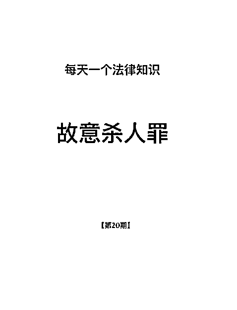<ne-card data-card-name="image" data-card-type="inline" id="ebEJL" data-event-boundary="card">  <ne-p id="u55aee783" data-lake-id="u55aee783"><ne-card data-card-name="image" data-card-type="inline" id="D2Jhe" data-event-boundary="card">  <ne-p id="u3ca0efc1" data-lake-id="u3ca0efc1"><ne-card data-card-name="image" data-card-type="inline" id="O4qiC" data-event-boundary="card">  <ne-p id="ube659bf5" data-lake-id="ube659bf5"><ne-text id="u2540ba12" ne-bold="true">高级版：封面模版放不同资料+资料内页</ne-text></ne-p> <ne-p id="u8cccabde" data-lake-id="u8cccabde"><ne-text id="u65108615">资料文字提取出来，套模版制作就好</ne-text></ne-p> <ne-p id="u6503882c" data-lake-id="u6503882c"><ne-text id="ube4fcaa4">可能做不到下图这么漂亮，但可以把核心内容换成多色笔记，不突兀即可</ne-text></ne-p> <ne-p id="u494fb5a0" data-lake-id="u494fb5a0"><ne-text id="u54f17bfe">制作版手写笔记+荧光笔标记处理制作内页，把图片套进类似下图的模版里即可</ne-text></ne-p> <ne-p id="ufa06629a" data-lake-id="ufa06629a"><ne-text id="u0cb15b4f">调整图片比例接近 3:4，用美图秀秀可调节</ne-text></ne-p> <ne-p id="u18d51188" data-lake-id="u18d51188"><ne-card data-card-name="image" data-card-type="inline" id="fLyBy" data-event-boundary="card">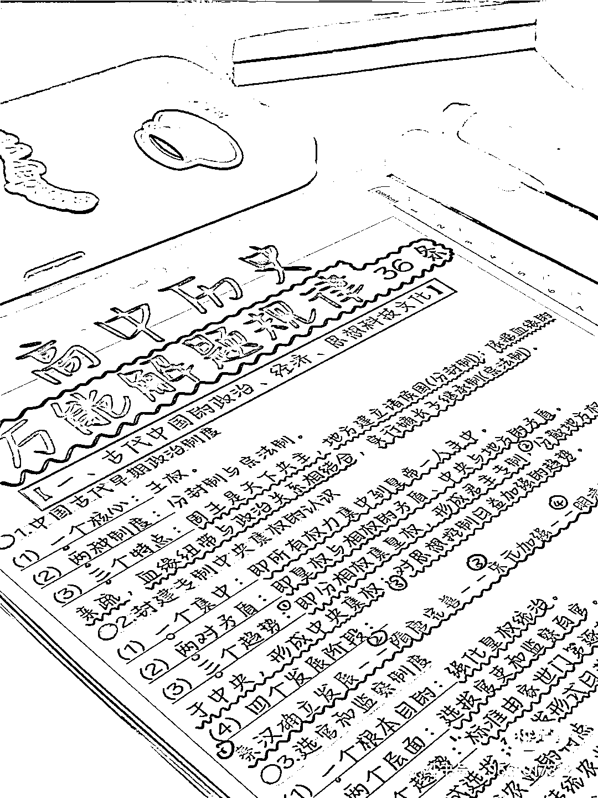<ne-card data-card-name="image" data-card-type="inline" id="xX2Mb" data-event-boundary="card">  <ne-p id="uf71b94ae" data-lake-id="uf71b94ae"><ne-card data-card-name="image" data-card-type="inline" id="hsRFE" data-event-boundary="card">  <ne-p id="u94c6f197" data-lake-id="u94c6f197"><ne-card data-card-name="image" data-card-type="inline" id="pOenE" data-event-boundary="card">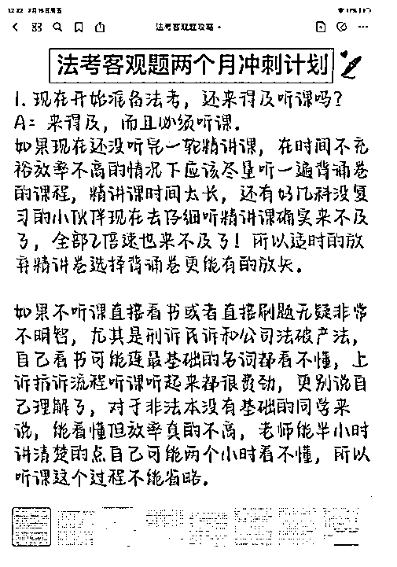  <ne-h4 id="6d7fda59" data-lake-id="6d7fda59"><ne-heading-ext><ne-heading-anchor></ne-heading-anchor><ne-heading-fold></ne-heading-fold></ne-heading-ext><ne-heading-content><ne-text id="u808e1e3c">7、真实学习照片+资料展示</ne-text></ne-heading-content></ne-h4> <ne-p id="uafd0fda7" data-lake-id="uafd0fda7"><ne-text id="ub5f45b3b">一般是真实学习照+资料展示，数据很好</ne-text></ne-p> <ne-p id="u5552d39c" data-lake-id="u5552d39c"><ne-text id="u627f23f2">调整图片比例接近 3:4，用美图秀秀可调节</ne-text></ne-p> <ne-p id="u61446a33" data-lake-id="u61446a33"><ne-card data-card-name="image" data-card-type="inline" id="fUyRQ" data-event-boundary="card">  <ne-p id="u560ed1b5" data-lake-id="u560ed1b5"><ne-text id="u1c4df22d"><ne-card data-card-name="image" data-card-type="inline" id="EbdEb" data-event-boundary="card">图片加载失败 <ne-text id="u2cb24e67"><ne-p id="u13531093" data-lake-id="u13531093"><ne-card data-card-name="image" data-card-type="inline" id="qDvS8" data-event-boundary="card"><ne-card data-card-name="image" data-card-type="inline" id="KQwg1" data-event-boundary="card">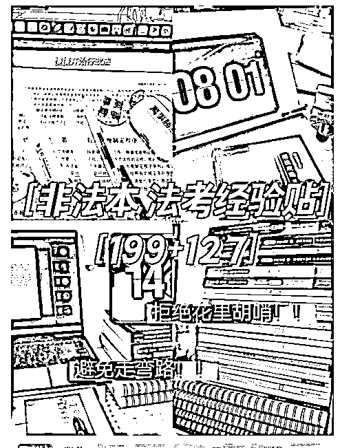  <ne-h4 id="c663b831" data-lake-id="c663b831"><ne-heading-ext><ne-heading-anchor></ne-heading-anchor><ne-heading-fold></ne-heading-fold></ne-heading-ext><ne-heading-content><ne-text id="ud7b57532">8、资料手写混合式</ne-text></ne-heading-content></ne-h4> <ne-p id="u91ac4138" data-lake-id="u91ac4138"><ne-text id="ude3487ac">可以把笔记/题目打印出来，多色笔写完之后，再用扫描全能王拍成如下的这种形式</ne-text></ne-p> <ne-p id="ua984b63e" data-lake-id="ua984b63e"><ne-text id="u8607ce99">对比更强烈，也可以用处理手写笔记的方法处理试卷，打上荧光笔标签</ne-text></ne-p> <ne-p id="u59e2ba9a" data-lake-id="u59e2ba9a"><ne-text id="uc9e35f1f">调整图片比例接近 3:4，用美图秀秀可调节</ne-text></ne-p> <ne-p id="u1504794e" data-lake-id="u1504794e"><ne-card data-card-name="image" data-card-type="inline" id="JRW2c" data-event-boundary="card"><ne-card data-card-name="image" data-card-type="inline" id="pz5Ab" data-event-boundary="card">  <ne-h4 id="7e07721b" data-lake-id="7e07721b"><ne-heading-ext><ne-heading-anchor></ne-heading-anchor><ne-heading-fold></ne-heading-fold></ne-heading-ext><ne-heading-content><ne-text id="ub499aceb">9、手抄笔记换不同背景拍摄</ne-text></ne-heading-content></ne-h4> <ne-p id="u466f4db0" data-lake-id="u466f4db0"><ne-text id="ud150040a">多色手抄笔记内容，换背景拍摄不同图片</ne-text></ne-p> <ne-p id="u1868809e" data-lake-id="u1868809e"><ne-text id="u377d7d88">这种拍照的，最好包装的像素人账号随手拍资料分享，账号定位也最好是素人</ne-text></ne-p> <ne-p id="u7861e4fa" data-lake-id="u7861e4fa"><ne-text id="u0702f86a">这类照片拍出来后，一定要用【醒图 APP】修图【调节】板块中的【智能优化】功能，调节色差</ne-text></ne-p> <ne-p id="ud9489b71" data-lake-id="ud9489b71"><ne-card data-card-name="image" data-card-type="inline" id="Ofvd2" data-event-boundary="card"><ne-card data-card-name="image" data-card-type="inline" id="xtyeW" data-event-boundary="card"><ne-card data-card-name="image" data-card-type="inline" id="x5erP" data-event-boundary="card">  <ne-h4 id="1c911743" data-lake-id="1c911743"><ne-heading-ext><ne-heading-anchor></ne-heading-anchor><ne-heading-fold></ne-heading-fold></ne-heading-ext><ne-heading-content><ne-text id="ufc6653db">10、备忘录式笔记</ne-text></ne-heading-content></ne-h4> <ne-p id="uc07e85e9" data-lake-id="uc07e85e9"><ne-text id="u8a552aa9">用备忘录记录经验等、数据很好</ne-text></ne-p> <ne-p id="u1f474cdb" data-lake-id="u1f474cdb"><ne-card data-card-name="image" data-card-type="inline" id="Aa0xY" data-event-boundary="card"><ne-card data-card-name="image" data-card-type="inline" id="k8KVJ" data-event-boundary="card">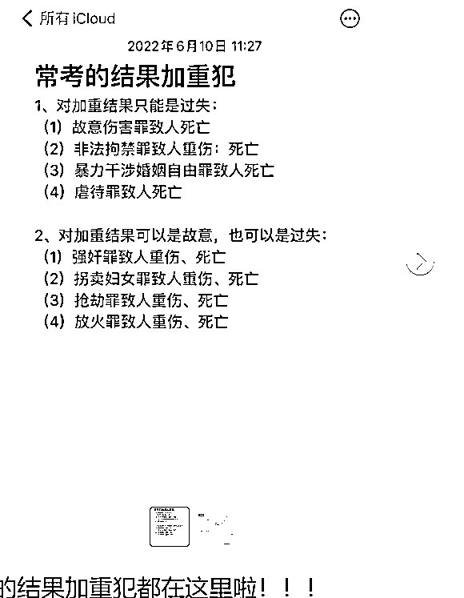  <ne-h4 id="58a91065" data-lake-id="58a91065"><ne-heading-ext><ne-heading-anchor></ne-heading-anchor><ne-heading-fold></ne-heading-fold></ne-heading-ext><ne-heading-content><ne-text id="u8f76a272">11、封面（我资料多）+展示概览+一点内页展示</ne-text></ne-heading-content></ne-h4> <ne-p id="u24e7fd6a" data-lake-id="u24e7fd6a"><ne-text id="u7d49e9c3">制作方法与百科资料式内容类似</ne-text></ne-p> <ne-p id="u1bbbe063" data-lake-id="u1bbbe063"><ne-text id="uceb6f4f8">调整图片比例接近 3:4，用美图秀秀可调节</ne-text></ne-p> <ne-p id="u2ad2a2c5" data-lake-id="u2ad2a2c5"><ne-card data-card-name="image" data-card-type="inline" id="pRxyL" data-event-boundary="card"><ne-card data-card-name="image" data-card-type="inline" id="dugZt" data-event-boundary="card">  <ne-h4 id="50457502" data-lake-id="50457502"><ne-heading-ext><ne-heading-anchor></ne-heading-anchor><ne-heading-fold></ne-heading-fold></ne-heading-ext><ne-heading-content><ne-text id="u4b0a0bf7">12、夸张首图+资料引流，巧用微信聊天记录（可以改微信聊天背景批量生产）</ne-text></ne-heading-content></ne-h4> <ne-p id="u8fceb5ce" data-lake-id="u8fceb5ce"><ne-text id="u1eea416e">法考和下面图片同理：</ne-text></ne-p> <ne-p id="ud4985690" data-lake-id="ud4985690"><ne-text id="udd68d1aa">明天考的，抓紧看！！！</ne-text></ne-p> <ne-p id="u9ff9da2d" data-lake-id="u9ff9da2d"><ne-text id="u4ab5a9c3">明天考的，抓紧看！！！</ne-text></ne-p> <ne-p id="uc0160a17" data-lake-id="uc0160a17"><ne-text id="u0b19edbc">明天考的，抓紧看！！！</ne-text></ne-p> <ne-p id="u34234180" data-lake-id="u34234180"><ne-text id="u8ca42bb2">调整图片比例接近 3:4，用美图秀秀可调节</ne-text></ne-p> <ne-p id="ucfffbeba" data-lake-id="ucfffbeba"><ne-card data-card-name="image" data-card-type="inline" id="BKa4D" data-event-boundary="card"><ne-card data-card-name="image" data-card-type="inline" id="WYa93" data-event-boundary="card">  <ne-h2 id="0fb30fbe" data-lake-id="0fb30fbe"><ne-heading-ext><ne-heading-anchor></ne-heading-anchor><ne-heading-fold></ne-heading-fold></ne-heading-ext><ne-heading-content><ne-text id="u277fb3c8">（119 赞）《 小红书 60 天用原创拿下 20 多篇 10w+，如何流程化创作爆款内容？》</ne-text></ne-heading-content></ne-h2> <ne-p id="u81a834a0" data-lake-id="u81a834a0"><ne-text id="u4f8ea26f">生财圈友们好，我是梨云，一个内容创业的自媒体人。</ne-text></ne-p> <ne-p id="u8c9ac079" data-lake-id="u8c9ac079"><ne-text id="u90907540">在小红书红利未减的今天，不知道你有没有发现，自己发的笔记，越来越难脱颖而出。</ne-text></ne-p> <ne-p id="udfac7440" data-lake-id="udfac7440"><ne-text id="uc7e6abb0">其中一个主要原因，是大批玩家的突然涌入，而自己并没有建立足够强的竞争优势。</ne-text></ne-p> <ne-p id="u9600020b" data-lake-id="u9600020b"><ne-text id="u62522fba">竞争优势的建立，有两个方向：</ne-text></ne-p> <ne-p id="udd2ec307" data-lake-id="udd2ec307"><ne-text id="u9044d12c">硬实力：在一机一号的标准下，配置 10 个以上的手机，用批量矩阵荡平赛道。</ne-text></ne-p> <ne-p id="u5d7a4c5f" data-lake-id="u5d7a4c5f"><ne-text id="u41aa2afc">软实力：仅需产出高于平均水平的内容，直接在大量同质化笔记中脱颖而出。</ne-text></ne-p> <ne-p id="ue9120bf3" data-lake-id="ue9120bf3"><ne-text id="u10cb9e3f">对于普通人来说，0 成本最快建立竞争优势的方法，就是提升内容竞争力。</ne-text></ne-p> <ne-p id="uff1ef27d" data-lake-id="uff1ef27d"><ne-text id="ub9df098a">接下来，我会以在小红书做 IP 号，60 天用原创拿下 20 多篇 10w+，跃升教育赛道图文头部的实战经验，向你分享内容高效创作的方法论。</ne-text></ne-p> <ne-p id="u54403806" data-lake-id="u54403806"><ne-text id="uca899a17">一、内容为何成为竞争底牌</ne-text></ne-p> <ne-p id="u5eed97bf" data-lake-id="u5eed97bf"><ne-text id="u7ae13353">二、挖掘如何赋能爆款内容</ne-text></ne-p> <ne-p id="uae86fc9d" data-lake-id="uae86fc9d"><ne-text id="u7a6e3abb">三、如何才能高效创作内容</ne-text></ne-p> <ne-h2 id="4875782c" data-lake-id="4875782c"><ne-heading-ext><ne-heading-anchor></ne-heading-anchor><ne-heading-fold></ne-heading-fold></ne-heading-ext><ne-heading-content><ne-text id="ue95f831c" ne-bold="true">一、内容为何成为竞争底牌</ne-text></ne-heading-content></ne-h2> <ne-p id="u82157379" data-lake-id="u82157379"><ne-text id="uda5ee682">大量玩家的入局让赛道更加拥挤，批量化工具快速降低了生产成本，爆款选题成为万众瞩目的对标，当同质化越来越严重，选题、排版难以再出色时，内容成了全村的希望。</ne-text></ne-p> <ne-p id="u949c72ba" data-lake-id="u949c72ba"><ne-text id="uf93332f5">思维决定行为，行为决定结果。如果想要用内容进行突围，首先一定要在认知层面打破偏见，即不重视和太重视。</ne-text></ne-p> <ne-p id="u6b268c70" data-lake-id="u6b268c70"><ne-text id="u8a58ec46" ne-bold="true">不重视</ne-text><ne-text id="uf95f4056">：认为用了爆款模板，或者搬运了爆款内容，自己的数据就会起飞。</ne-text></ne-p> <ne-p id="uee0adddf" data-lake-id="uee0adddf"><ne-text id="u4bf95745" ne-bold="true">太重视</ne-text><ne-text id="u67f5672f">：有原创情结还自嗨，完全不管读者喜不喜欢，太想写好内容却没有方法论而难产。</ne-text></ne-p> <ne-p id="u39a421da" data-lake-id="u39a421da"><ne-text id="u3eb49ce0">对内容的态度两个极端，怎么办？接下来我就帮你打破这道认知枷锁。</ne-text></ne-p> <ne-p id="ue35c44f0" data-lake-id="ue35c44f0"><ne-text id="udc423c24">梨云绿这套爆款模板拿下的战绩，大家都有目共睹，但你有没有遇见过这种情况：即使用了爆款模板，笔记数据起来的也有些艰难。</ne-text></ne-p> <ne-p id="uf5b3369b" data-lake-id="uf5b3369b"><ne-text id="u9244126c">同时，你在刷大量笔记的时候，也会遇见另一种反直觉的爆款笔记：排版很烂甚至没有排版，竟然还能爆款！</ne-text></ne-p> <ne-p id="uc9ec114f" data-lake-id="uc9ec114f"><ne-text id="u8fac9cff">这里起到决定性的，就是内容，为什么？因为小红书的笔记推荐逻辑。</ne-text></ne-p> <ne-p id="ub7dd9014" data-lake-id="ub7dd9014"><ne-text id="u1103c763">一篇笔记发出去，小红书也不知道这篇笔记好不好哇，怎么办呢？交给用户去判断，赞藏评粉就是分数，分数越高，系统就会认为这是好笔记，进而推荐给更多的人，你就获得了更多的曝光。</ne-text></ne-p> <ne-p id="u98bf8323" data-lake-id="u98bf8323"><ne-text id="u105ed48e" ne-bold="true">是这套算法，决定了我们做内容，必须围绕数据出发。</ne-text></ne-p> <ne-p id="u20e4ce66" data-lake-id="u20e4ce66"><ne-text id="u18341174">爆款封面和爆款标题，完成的是把曝光量转化为小眼睛的任务，用户点击进来后，发现内容一点不好，他就不会给你点赞，于是，你会看到小眼睛和赞的比例远远大于 20:1，那就和爆款无缘了。</ne-text></ne-p> <ne-p id="u15a4b326" data-lake-id="u15a4b326"><ne-text id="u26940fee">当我们抱怨数据不好的时候，本质上是在抱怨用户：你为什么没有把最宝贵的不可再生资源——时间，给一个素不相识的博主我呢。</ne-text></ne-p> <ne-p id="u52d30802" data-lake-id="u52d30802"><ne-text id="u9b062758" ne-bold="true">为啥？因为存在一条永恒不变的法则：价值交换。</ne-text></ne-p> <ne-p id="u49b9b39e" data-lake-id="u49b9b39e"><ne-text id="ufeadb12f">我们用有价值的内容，去交换用户的注意力、信任、行动成本，进而是金钱。</ne-text></ne-p> <ne-p id="u22086a7f" data-lake-id="u22086a7f"><ne-text id="ua612fae7">要想写出有价值的内容，首先我们要知道，哪些内容，是有价值的。</ne-text></ne-p> <ne-p id="u58a08677" data-lake-id="u58a08677"><ne-text id="u0188494e">这就得搬出你梨云历时半年时间，做了 16 个小红书账号，经验总结出来的内容价值金字塔了。</ne-text></ne-p> <ne-p id="ua75b36b9" data-lake-id="ua75b36b9"><ne-text id="u68487a41" ne-bold="true">内容价值金字塔</ne-text></ne-p> <ne-p id="u6a4c0803" data-lake-id="u6a4c0803"><ne-card data-card-name="image" data-card-type="inline" id="eu0LN" data-event-boundary="card">  <ne-h3 id="c7a983d5" data-lake-id="c7a983d5"><ne-heading-ext><ne-heading-anchor></ne-heading-anchor><ne-heading-fold></ne-heading-fold></ne-heading-ext><ne-heading-content><ne-text id="ud86aebea" ne-bold="true">①给娱乐</ne-text></ne-heading-content></ne-h3> <ne-p id="u1f9c66b4" data-lake-id="u1f9c66b4"><ne-text id="u84e1b225">搞笑号、剧情号，他们的数据很好，用情绪价值交换了用户的注意力，但是很难变现。</ne-text></ne-p> <ne-p id="u29a41d0a" data-lake-id="u29a41d0a"><ne-text id="ua7de8458">为什么难？因为你吸引来的粉丝，不是垂类受众，美食、美妆、游戏、母婴，非常杂乱。</ne-text></ne-p> <ne-p id="u98bbe620" data-lake-id="u98bbe620"><ne-text id="uea0f0ac9">当你想要转化这些受众的时候，却发现，自己的娱乐内容，讲不清楚产品，于是，要买手机的用户还是更相信手机博主，要买化妆品的女生还是去找美妆博主。</ne-text></ne-p> <ne-p id="uc2548dfe" data-lake-id="uc2548dfe"><ne-text id="u764d8be5">这里也要注意，泛娱乐不是一条赛道，而是一种对内容的呈现，哪怕你选具体的赛道，比如美食赛道，都有可能做成泛娱乐，而不是垂类，如何避免呢，我会在下文讲金字塔的顶层告诉你。</ne-text></ne-p> <ne-h3 id="9468a762" data-lake-id="9468a762"><ne-heading-ext><ne-heading-anchor></ne-heading-anchor><ne-heading-fold></ne-heading-fold></ne-heading-ext><ne-heading-content><ne-text id="ua60dc268" ne-bold="true">②给工具</ne-text></ne-heading-content></ne-h3> <ne-p id="u0024b0ac" data-lake-id="u0024b0ac"><ne-text id="u9934c94f">给工具满足更加实用性的需求，在价值层和变现层会比给娱乐更高一些。</ne-text></ne-p> <ne-p id="uc261caa0" data-lake-id="uc261caa0"><ne-text id="ub2918ea6">最常见的是给整合资料，帮用户节省时间，作为价值交换，就是要用户付出加微信等行动成本，并且成为未来转化的潜在客户。</ne-text></ne-p> <ne-p id="u29a4a61c" data-lake-id="u29a4a61c"><ne-text id="ud3c7139a">这就是当下很火的虚拟资料项目。</ne-text></ne-p> <ne-p id="ue0096a7f" data-lake-id="ue0096a7f"><ne-text id="u8833bd85">这类玩法在内容上，就是贴部分资料，如果手动嫌累，可以试下我和圈友开发的自动排版器：</ne-text>[<ne-text id="ucd5eb96d">https://liyuns.com/pptx</ne-text>](https://liyuns.com/pptx)</ne-p> <ne-p id="u35edb052" data-lake-id="u35edb052"><ne-text id="ubce50bbf">在评论区引导“关注+领取”，这就导致在内容上没有太大的优化空间，只要拿到资料，就能发。</ne-text></ne-p> <ne-p id="ub8a57e82" data-lake-id="ub8a57e82"><ne-text id="uba6d2677">最后只能拼硬实力：看谁号多，谁发的笔记多。</ne-text></ne-p> <ne-p id="ufb45fa55" data-lake-id="ufb45fa55"><ne-text id="u5de98f57">如果是做个人 IP 账号，想要用资料引流，那么有更高阶的操作——亲自编写资料，把自己融入其中，别人看你的内容，就是一边认可你的牛逼，一边在被你转化的路上。</ne-text></ne-p> <ne-p id="u3f65d4f2" data-lake-id="u3f65d4f2"><ne-text id="uaf2712c7">这是一道很强的护城河，一旦筑起，即使别人拿你的资料去引流，也是在帮你做推广。</ne-text></ne-p> <ne-p id="ub662d66a" data-lake-id="ub662d66a"><ne-text id="ue618c65e">这是我当时用 Illustrator 编排的用于引流的电子资料。</ne-text></ne-p> <ne-p id="u41b9b0cd" data-lake-id="u41b9b0cd"><ne-card data-card-name="image" data-card-type="inline" id="adpPW" data-event-boundary="card">  <ne-h3 id="09156e40" data-lake-id="09156e40"><ne-heading-ext><ne-heading-anchor></ne-heading-anchor><ne-heading-fold></ne-heading-fold></ne-heading-ext><ne-heading-content><ne-text id="ue67086e8" ne-bold="true">③给方法</ne-text></ne-heading-content></ne-h3> <ne-p id="uc9f00169" data-lake-id="uc9f00169"><ne-text id="u5ad40ddf">前面说到，即使选赛道，也有可能做成泛娱乐，那么如何才能避免，从而做出垂类呢？</ne-text></ne-p> <ne-p id="uaa0520f2" data-lake-id="uaa0520f2"><ne-text id="udbb0f207">答案就是给方法，通过给方法，解决问题，抢占专业认知，打造个人 IP。</ne-text></ne-p> <ne-p id="ucac21811" data-lake-id="ucac21811"><ne-text id="u19319df1">同样是做穿搭赛道，如果你发变装美美哒，那你就是泛娱乐，如果你发如何穿搭才更美，那你就是垂直账号。</ne-text></ne-p> <ne-p id="u641e5dbe" data-lake-id="u641e5dbe"><ne-text id="ub7eff774">同样是做宠物赛道，如果你发猫猫萌萌哒，那你就是泛娱乐，如果你发如何用宠物用品，那你就是垂直账号。</ne-text></ne-p> <ne-p id="ude890441" data-lake-id="ude890441"><ne-text id="u58ea51bb">泛娱乐只提供情绪价值，垂直账号解决用户问题，但并不意味着，它们对立。</ne-text></ne-p> <ne-p id="u590d7777" data-lake-id="u590d7777"><ne-text id="ud3504625">很多人看了我那 18w 粉的小红书，认为我做的是娱乐泛粉号，其实我做的是难度更高的 ip 号：情绪价值与解决问题相结合。</ne-text></ne-p> <ne-p id="u7bb40472" data-lake-id="u7bb40472"><ne-text id="u5c887e0d" ne-bold="true">以前，有干货的内容胜出，现在，有干货且有趣的内容更胜一筹。</ne-text></ne-p> <ne-p id="u983f8fdb" data-lake-id="u983f8fdb"><ne-card data-card-name="image" data-card-type="inline" id="ZizpV" data-event-boundary="card">  <ne-p id="ucd180bcd" data-lake-id="ucd180bcd"><ne-text id="u49650c8f">我写学习时间安排表，是普通干货，但我把它包装成卷王计划表，竞争的情绪就被调动起来了。</ne-text></ne-p> <ne-p id="u098c03eb" data-lake-id="u098c03eb"><ne-text id="uac50112a">我写你要认真听老师讲课，这是说教，但我写你要像公主一样，把老师当大臣，把上课当听政，好玩的情绪就被调动起来了。</ne-text></ne-p> <ne-p id="u6d3f1c07" data-lake-id="u6d3f1c07"><ne-text id="uc0ecb02e">很多人可能还停留在梨云的方法只能用在学习赛道，但事实上，这套方法，已经被心理赛道和理财赛道实践了。</ne-text></ne-p> <ne-p id="u0a5bcbef" data-lake-id="u0a5bcbef"><ne-text id="ufbb606db">它的底层逻辑和梨云绿一样，是可以各个赛道开花的。</ne-text></ne-p> <ne-p id="ue7d39bd1" data-lake-id="ue7d39bd1"><ne-card data-card-name="image" data-card-type="inline" id="gWeme" data-event-boundary="card">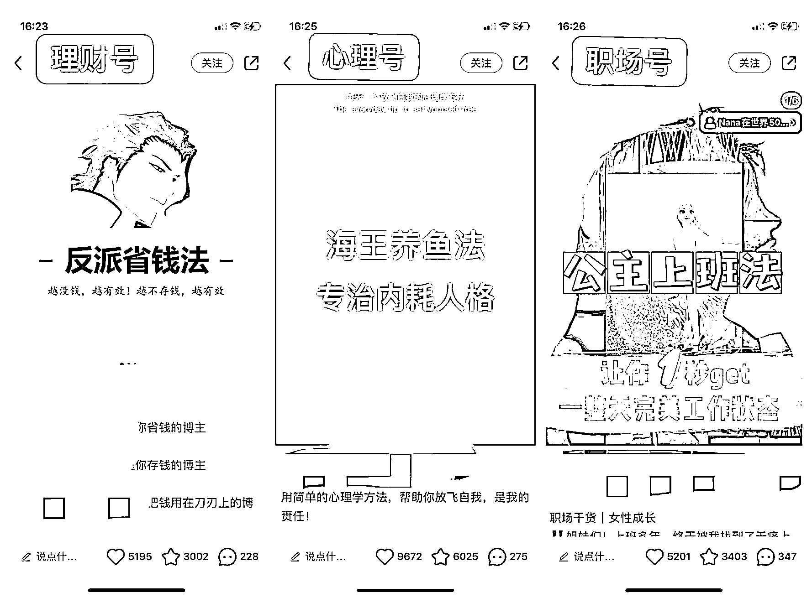  <ne-p id="u8adf5b4d" data-lake-id="u8adf5b4d"><ne-text id="u7b6ebd67">有人说，我写角色代入，和学习方法不沾边，其实我写的不是学习方法，而是学习状态，运用的是心理学中的潜意识催眠。</ne-text></ne-p> <ne-p id="u758789be" data-lake-id="u758789be"><ne-text id="ua893807e">其实不仅仅是学生，每个人都有这样的“自我意向”：你把自己想象成什么人，你就会按照那种人的行为方式行事。</ne-text></ne-p> <ne-p id="u3861ba94" data-lake-id="u3861ba94"><ne-text id="uc78b1062">把自己想象成失败者，你就会选择性地接收“我很差劲、我是废物”的负面信息，把自己想象成成功者，就会接收到“这是挑战、我可以做的更好”的正面信息。</ne-text></ne-p> <ne-p id="ue890af8b" data-lake-id="ue890af8b"><ne-text id="u10305999">有时候，一个优质内容的诞生，往往是把心理学运用到了极致。（梨云绿也绕不开心理学）</ne-text></ne-p> <ne-p id="uc19577be" data-lake-id="uc19577be"><ne-text id="u470458ca">我这真不是没有依据写着好玩，正因为有心理学的融入，才让它没有成为泛娱乐。</ne-text></ne-p> <ne-p id="uc20fa80e" data-lake-id="uc20fa80e"><ne-text id="u9ee2047c">可能有些人觉得，有趣加有料，叠出这样的双 buff（增益效果）太难了，其实不难，你只要掌握一套高效的内容创作方法，在保证有料的基础上，加入一些有趣，这样，增大爆款概率，同时能强化你的 IP 专业度，还能提升亲和力。</ne-text></ne-p> <ne-h2 id="cbffd674" data-lake-id="cbffd674"><ne-heading-ext><ne-heading-anchor></ne-heading-anchor><ne-heading-fold></ne-heading-fold></ne-heading-ext><ne-heading-content><ne-text id="u3c0b276b" ne-bold="true">二、挖掘如何赋能爆款内容</ne-text></ne-heading-content></ne-h2> <ne-p id="u9106f71c" data-lake-id="u9106f71c"><ne-text id="u520bb330">让内容有料是爆款的核心基因，体现的依然是“价值交换”。</ne-text></ne-p> <ne-p id="ub9d0e9cf" data-lake-id="ub9d0e9cf"><ne-text id="u64de02c7">这里的料，不是你自己觉得有料，否则就会陷入到这样的痛苦：“老子内容写的这么牛逼，你们怎么不看呢！”</ne-text></ne-p> <ne-p id="uae933033" data-lake-id="uae933033"><ne-text id="u863b5442" ne-bold="true">这里的料，不仅仅是用户要觉得有料，也要让平台觉得有料，做个人 IP 号的博主，一定要追求实现三方共赢。</ne-text></ne-p> <ne-p id="u542febb9" data-lake-id="u542febb9"><ne-text id="ueff16946">什么叫让平台觉得有料呢？就是在规则内，你的内容，能拉长用户的停留时间。</ne-text></ne-p> <ne-p id="u6b6542ee" data-lake-id="u6b6542ee"><ne-text id="ucc043c21">怎么理解规则内？有人说，保险、副业这些很赚钱但很难做，是的，因为平台不提倡，它就很容易对你的内容进行限流。</ne-text></ne-p> <ne-p id="ua4aff5cd" data-lake-id="ua4aff5cd"><ne-text id="u5ff3bac0">对于副业两个词，小红书只是不提倡，再看看抖音，已经全面打击，知乎也把这个词打入了黑名单。</ne-text></ne-p> <ne-p id="uee2118ac" data-lake-id="uee2118ac"><ne-text id="ue02e59b8">又有人说，我发资料，也是满足用户的需求，为什么平台还要限流，因为你在把平台的用户往外引，并且没有做到“拉长用户停留时长”。</ne-text></ne-p> <ne-p id="u66799515" data-lake-id="u66799515"><ne-text id="u340258c0">并且资料号的同质化，会影响平台的内容生态，于是就陷入到了花式降重和审核机制的零和博弈中。</ne-text></ne-p> <ne-p id="u55853327" data-lake-id="u55853327"><ne-text id="ue176451a">而拉长用户停留，是每一个 APP 竞争的根本：你在刷小红书笔记，就不能同时看抖音小姐姐。</ne-text></ne-p> <ne-p id="u50b220fb" data-lake-id="u50b220fb"><ne-text id="u6d1f0861">其实，无论我们是在小红书也好，抖音、视频号也好，做自媒体的，都要理解，平台的本质，是人与内容的动态循环。</ne-text></ne-p> <ne-p id="uc94995a3" data-lake-id="uc94995a3"><ne-text id="u4d44da17">内容创作者生产内容，内容吸引用户，用户的反馈激励内容创作者继续生产，平台在这个过程中，发挥调控作用。</ne-text></ne-p> <ne-p id="uf19e4151" data-lake-id="uf19e4151"><ne-text id="u790adebc">那么什么叫让用户觉得有料呢？就是你深深的明白他的痛，并且给到了解决方案。</ne-text></ne-p> <ne-p id="u2e6316ad" data-lake-id="u2e6316ad"><ne-text id="uf482ff03" ne-bold="true">那么问题来了，如何才能知道你的用户痛点呢？两个方法：需求挖掘、理解人性。</ne-text></ne-p> <ne-h3 id="fa386309" data-lake-id="fa386309"><ne-heading-ext><ne-heading-anchor></ne-heading-anchor><ne-heading-fold></ne-heading-fold></ne-heading-ext><ne-heading-content><ne-text id="ud4311c49" ne-bold="true">①需求挖掘</ne-text></ne-heading-content></ne-h3> <ne-p id="ue3b93b7e" data-lake-id="ue3b93b7e"><ne-text id="ue78c81d0">挖掘需求，不是一来就上采集工具，而是要先分析，我要的需求，分布在哪里，然后才是采集。</ne-text></ne-p> <ne-p id="u434209d9" data-lake-id="u434209d9"><ne-text id="u7acc39e9">这里很多新手会有一个误区，认为只要自己采集的数据足够多，就可以做出爆款，而我想说，这毫无关系。</ne-text></ne-p> <ne-p id="u2ae74cdd" data-lake-id="u2ae74cdd"><ne-text id="ucd2a392a">首先，你得收集正确的数据，然后是对数据进行分析，得出可以指导行动的关键信息。</ne-text></ne-p> <ne-p id="ucb36ea59" data-lake-id="ucb36ea59"><ne-text id="u738f52bd">采集在这里充当的，是提速的作用，手动复制粘贴采集也没问题呀，不就是费时间嘛，丝毫不影响我 4 月份起号时篇篇爆款。</ne-text></ne-p> <ne-p id="uc75d3955" data-lake-id="uc75d3955"><ne-text id="u09c41c09">背后的分析思维才是最重要的，而我接下来，将会把这个做爆款的方法论教会你。</ne-text></ne-p> <ne-h4 id="43984cec" data-lake-id="43984cec"><ne-heading-ext><ne-heading-anchor></ne-heading-anchor><ne-heading-fold></ne-heading-fold></ne-heading-ext><ne-heading-content><ne-text id="u8e78a0aa" style="color: rgb(222, 120, 2);">1、爬取爆款的标题做词频分析</ne-text></ne-heading-content></ne-h4> <ne-p id="u486b9c56" data-lake-id="u486b9c56"><ne-text id="u5ad1db18">为什么爬取爆款标题，并做词频分析，背后的选择逻辑是这样的：</ne-text></ne-p> <ne-p id="ue912affb" data-lake-id="ue912affb"><ne-text id="u4c44fce7">小红书不同于抖音的全屏滑动推荐，让你没的选，相反，双瀑布流，让你更多选择。</ne-text></ne-p> <ne-p id="ua6b6ae5d" data-lake-id="ua6b6ae5d"><ne-text id="u05a93fe2">这不是什么好事，我在坐回程广州的地铁时，看到对面前座的一个妹子，小红书一直主页往下刷，20 篇笔记只点击 1 篇。</ne-text></ne-p> <ne-p id="u45092aa9" data-lake-id="u45092aa9"><ne-text id="ua27f50cf">一块手机屏可以同时容纳 4 片笔记，竞争激烈程度就提高了 4 倍，爆款凭什么能吸引用户点击。</ne-text></ne-p> <ne-p id="ud1374552" data-lake-id="ud1374552"><ne-text id="ua063725a">因为标题击中了用户的需求，不对，更确切的说，应该是标题中特定的字眼！</ne-text></ne-p> <ne-p id="u3e33bab3" data-lake-id="u3e33bab3"><ne-text id="u4029d1de">我在</ne-text>[<ne-text id="u1552dab6">梨云黑</ne-text>](https://t.zsxq.com/072Ei5Pqg)<ne-text id="u79c406c2">这篇精华帖讲过具体操作，这里就不再赘述。</ne-text></ne-p> <ne-p id="u90b2214d" data-lake-id="u90b2214d"><ne-text id="u22d5a707" ne-bold="true">①爬取标题</ne-text><ne-text id="ub51b7308">：在任意数据平台，输入赛道关键词，导出表格。</ne-text></ne-p> <ne-p id="u40597f21" data-lake-id="u40597f21"><ne-text id="ue9ef64aa" ne-bold="true">②数据分类</ne-text><ne-text id="udee849b2">：复制所有标题放入微词云分析：</ne-text>[<ne-text id="u5ea81b91" ne-underline="true">https://fenci.weiciyun.com/cn/</ne-text>](https://fenci.weiciyun.com/cn/)</ne-p> <ne-p id="uf906ca55" data-lake-id="uf906ca55"><ne-text id="u52a586fc" ne-bold="true">③高频筛选</ne-text><ne-text id="udafd42f2">：找到特征词汇列表，里面有高频出现的关键词，这些就是该赛道用来吸引特定用户的核心词。</ne-text></ne-p> <ne-p id="ufd7d3446" data-lake-id="ufd7d3446"><ne-text id="u2239fb67">拟写标题的时候，一定要带上这些核心词，吸引来的粉丝，才能更精准。</ne-text></ne-p> <ne-p id="u13616417" data-lake-id="u13616417"><ne-text id="u7b3a5c9b">根据这些词，我就收集了：学习、学霸、逆袭、方法等，到时候结合选题来拟写。</ne-text></ne-p> <ne-p id="u6be12cb8" data-lake-id="u6be12cb8"><ne-text id="u039cb184">有了词汇还不够，标题不是分散的词，而是一条短句，所以进入到下一步。</ne-text></ne-p> <ne-p id="u5a67f4f0" data-lake-id="u5a67f4f0"><ne-text id="u9a049b45">我在刷小红书的时候，看到了很多爆款的清单体、合集类笔记，这背后体现的就是贪婪，一次收藏，百把内容，恨不得越多越好。</ne-text></ne-p> <ne-p id="ua8f3f207" data-lake-id="ua8f3f207"><ne-text id="ubdf52143">人的贪婪在于，喜欢少付出甚至不付出，就得到更多，轻轻松松，就能变得更强，这些就需要我们以效果的形式呈现。</ne-text></ne-p> <ne-p id="u36afeb77" data-lake-id="u36afeb77"><ne-text id="ud24df339">比如我讲怎么写作业，就突出速度很快这个强大效果，于是拟题《卷王的绝招，3 倍速写作业》</ne-text></ne-p> <ne-p id="u5e817060" data-lake-id="u5e817060"><ne-text id="ufad38150">比如我讲学习习惯，就突出习惯很多，列一个清单体，于是拟题《学霸不为人知的 25 个学习习惯》</ne-text></ne-p> <ne-h4 id="0b47da3d" data-lake-id="0b47da3d"><ne-heading-ext><ne-heading-anchor></ne-heading-anchor><ne-heading-fold></ne-heading-fold></ne-heading-ext><ne-heading-content><ne-text id="uca2be8b8" style="color: rgb(222, 120, 2);">2、爬取评论区评论做情感分析</ne-text></ne-heading-content></ne-h4> <ne-p id="u13a99e45" data-lake-id="u13a99e45"><ne-text id="u45442279">在所有的互动数据中，最能发现需求、最有参考价值的，就是评论区留言了。</ne-text></ne-p> <ne-p id="u74815626" data-lake-id="u74815626"><ne-text id="uee925004">那是用户第一视角最直接的表达，因为互联网马甲的保护壳，她们会展露出更真实的需求。</ne-text></ne-p> <ne-p id="ubce80414" data-lake-id="ubce80414"><ne-text id="u48c044e2">我们一定要关注评论区里的负面言论，尤其是抱怨，那是共鸣之下，用户亲自把痛点告诉了你，它的价值，不会亚于长尾关键词。</ne-text></ne-p> <ne-p id="u598f9f5c" data-lake-id="u598f9f5c"><ne-text id="u76f89c9c" ne-bold="true">获取数据</ne-text></ne-p> <ne-p id="uac808eee" data-lake-id="uac808eee"><ne-text id="u3023235a">我们如何获取评论区内容呢？有 3 个方法，各有优劣，最好结合起来用。</ne-text></ne-p> <ne-p id="u04725bf3" data-lake-id="u04725bf3"><ne-text id="ubc055aea" style="color: rgb(222, 120, 2);">数据平台</ne-text><ne-text id="u4fccccb9">：输入关键词，找到爆款笔记，快速导出全部评论，不足，只能获取单篇全部评论，想要特定笔记的评论区，可能出现未收录的情况。</ne-text></ne-p> <ne-p id="u0300a5d3" data-lake-id="u0300a5d3"><ne-text id="ud45447b2">另外，要拉好友薅或者氪金。</ne-text></ne-p> <ne-p id="u871c7b03" data-lake-id="u871c7b03"><ne-text id="u1aaf1024">适用范围：极具代表性的爆款笔记，比如低粉爆款，评论数量非常多。</ne-text></ne-p> <ne-p id="ue31c6159" data-lake-id="ue31c6159"><ne-card data-card-name="image" data-card-type="inline" id="BSO3U" data-event-boundary="card">  <ne-p id="ue967f6e7" data-lake-id="ue967f6e7"><ne-card data-card-name="image" data-card-type="inline" id="CB6ZB" data-event-boundary="card">  <ne-p id="uaa97d906" data-lake-id="uaa97d906"><ne-text id="u8e7685c0" style="color: rgb(222, 120, 2);">后裔采集器</ne-text><ne-text id="ub567fee5">：可以批量采集爆款笔记的评论，不足，受小红书网页的限制，每篇笔记最多只能采集 5 条，采集多了没开 vip 速度慢。</ne-text></ne-p> <ne-p id="u98cf7ac2" data-lake-id="u98cf7ac2"><ne-text id="u5988c0dc">适用范围：快速了解一个赛道标签下的大致需求。</ne-text></ne-p> <ne-p id="u065c6df8" data-lake-id="u065c6df8"><ne-text id="ubc6f9f27">怎么爬取呢？两个步骤。首先，获取小红书标签链接。</ne-text></ne-p> <ne-p id="u0640f467" data-lake-id="u0640f467"><ne-card data-card-name="image" data-card-type="inline" id="LUchX" data-event-boundary="card">  <ne-p id="u2b5128d9" data-lake-id="u2b5128d9"><ne-text id="uf81b3824">获取到链接之后，反手甩进后羿采集器，点击开始。</ne-text></ne-p> <ne-p id="ua5252642" data-lake-id="ua5252642"><ne-card data-card-name="image" data-card-type="inline" id="WmwYr" data-event-boundary="card">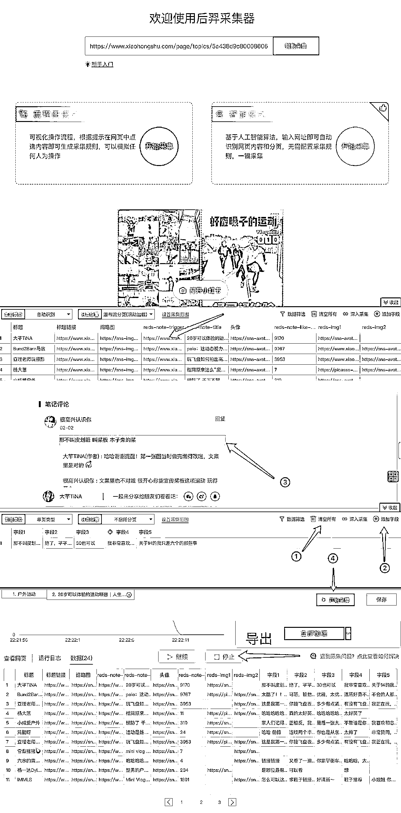  <ne-p id="uf572fe06" data-lake-id="uf572fe06"><ne-text id="u8630cd9e" style="color: rgb(222, 120, 2);">手动收集</ne-text><ne-text id="ud3a81e3b">：在小红书主页刷到爆款，然后下拉看评论区，你可以看到全貌，不仅仅是每条评论，还有评论的点赞量、一条评论下面的回复内容，不足，耗时。</ne-text></ne-p> <ne-p id="ucb7a7d3b" data-lake-id="ucb7a7d3b"><ne-text id="u21624d3b">适用范围：是对数据平台的一个补充。</ne-text></ne-p> <ne-p id="uc713e329" data-lake-id="uc713e329"><ne-card data-card-name="image" data-card-type="inline" id="tdwLs" data-event-boundary="card">  <ne-p id="u45b0d34f" data-lake-id="u45b0d34f"><ne-text id="u5ae23065" ne-bold="true">分析数据</ne-text></ne-p> <ne-p id="u83c41de8" data-lake-id="u83c41de8"><ne-text id="u3c88575b">很多人收集到一大把评论之后，无从下手，很大原因，就是没有构建分析模型。</ne-text></ne-p> <ne-p id="ub5b4d3b9" data-lake-id="ub5b4d3b9"><ne-text id="u2fd50af3">对我们有效的评论，有三类，分别是正面积极认可的、负面消极抱怨的、疑问句。</ne-text></ne-p> <ne-p id="ua1e9e090" data-lake-id="ua1e9e090"><ne-text id="uae36d3e7">通过分析，我们可以知道他们喜欢什么、讨厌什么、哪些需求没有被解决。</ne-text></ne-p> <ne-p id="u2bebef89" data-lake-id="u2bebef89"><ne-text id="u17cd2eac">批量分析可以借助数据工具实现，具体方法上面已经说过了。</ne-text></ne-p> <ne-p id="u314e3dd2" data-lake-id="u314e3dd2"><ne-card data-card-name="image" data-card-type="inline" id="jnxvw" data-event-boundary="card">  <ne-p id="u5ece7bd6" data-lake-id="u5ece7bd6"><ne-text id="u9b813293">我想和你讲讲更绝的操作，很多人好奇我是怎么做到极致洞察，魔鬼细节的，其实就是不仅仅用大数据辅助，同时还愿意花时间真正泡在评论区去思考和分析。</ne-text></ne-p> <ne-p id="u7c47c1f2" data-lake-id="u7c47c1f2"><ne-text id="u08be47a5">宏观与微观相结合，客观与判断相佐证，才得以让爆款诞生。</ne-text></ne-p> <ne-p id="u13e824d3" data-lake-id="u13e824d3"><ne-text id="u26d93f41">具体操作，我们依然借助数据工具，快速得到评论的分类，然后就是思考评论背后的需求。</ne-text></ne-p> <ne-p id="u3446022e" data-lake-id="u3446022e"><ne-text id="uf47b659d">这是一篇 18w 赞的《7 天卷王计划表》的评论区。</ne-text></ne-p> <ne-p id="u90a10af1" data-lake-id="u90a10af1"><ne-card data-card-name="image" data-card-type="inline" id="aeCOC" data-event-boundary="card">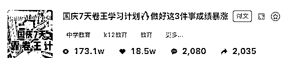  <ne-p id="u2bedc321" data-lake-id="u2bedc321"><ne-card data-card-name="image" data-card-type="inline" id="xEUU1" data-event-boundary="card">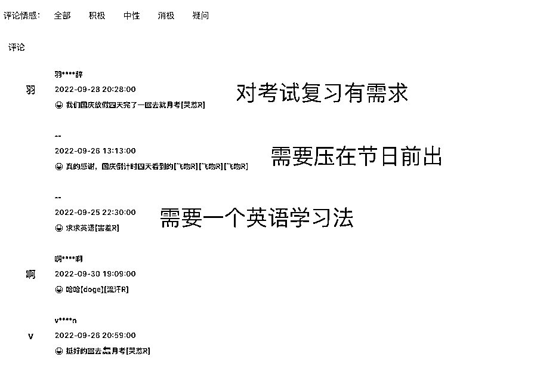  <ne-p id="u1fcbd5cb" data-lake-id="u1fcbd5cb"><ne-card data-card-name="image" data-card-type="inline" id="gbMAV" data-event-boundary="card">  <ne-p id="u4ff322f6" data-lake-id="u4ff322f6"><ne-text id="u54583dd7">我们快速可以看到积极和消极评论背后对应的需求。</ne-text></ne-p> <ne-p id="ud89d8f7e" data-lake-id="ud89d8f7e"><ne-text id="ud1aaa8d8">总结一下就是：</ne-text></ne-p> <ne-p id="u7a3563e1" data-lake-id="u7a3563e1"><ne-text id="uea536825">马上就要考试了如何复习</ne-text></ne-p> <ne-p id="ue18fcbd9" data-lake-id="ue18fcbd9"><ne-text id="u77aa556d">如何及时看到这么有用的笔记</ne-text></ne-p> <ne-p id="u1273e999" data-lake-id="u1273e999"><ne-text id="uad93444e">如何学习英语</ne-text></ne-p> <ne-p id="uc491567c" data-lake-id="uc491567c"><ne-text id="u7b447dab">假期太少只有两三天如何安排</ne-text></ne-p> <ne-p id="u63a6dcf9" data-lake-id="u63a6dcf9"><ne-text id="u6205269c">如何高速 1 天写完 7 天作业</ne-text></ne-p> <ne-p id="uf10bdde3" data-lake-id="uf10bdde3"><ne-text id="ue9f13bff">如何摆脱拖延症</ne-text></ne-p> <ne-p id="u9fa1dc87" data-lake-id="u9fa1dc87"><ne-text id="u8eed2ccf">这是我们通过评论分析得出来的需求，这时候，我们根据这些需求来做选题，来写笔记，以此验证分析是否有效。</ne-text></ne-p> <ne-p id="u40eafd9f" data-lake-id="u40eafd9f"><ne-text id="u5eb7abfd" ne-bold="true">验证数据</ne-text></ne-p> <ne-p id="uc848fd95" data-lake-id="uc848fd95"><ne-text id="uf5435588">全部千赞爆款，这个方法是经得起实践的。</ne-text></ne-p> <ne-p id="ue299e6fd" data-lake-id="ue299e6fd"><ne-card data-card-name="image" data-card-type="inline" id="ZJgSz" data-event-boundary="card">  <ne-h4 id="4a0977d1" data-lake-id="4a0977d1"><ne-heading-ext><ne-heading-anchor></ne-heading-anchor><ne-heading-fold></ne-heading-fold></ne-heading-ext><ne-heading-content><ne-text id="uce040df1" style="color: rgb(222, 120, 2);">3、找到对应人群的产品看广告</ne-text></ne-heading-content></ne-h4> <ne-p id="u46058557" data-lake-id="u46058557"><ne-text id="ua44961c7">如果说，评论分析还要自己找痛点，那么，通过看广告，是直接把痛点告诉你了，拿过来用就行。</ne-text></ne-p> <ne-p id="u106bed90" data-lake-id="u106bed90"><ne-text id="uee7e88bd">爆款产品的广告文案是怎么写出来的？经历了大量的市场调研，把需求提取出来，由专业的广告人撰写文案。</ne-text></ne-p> <ne-p id="u3fa2d9a6" data-lake-id="u3fa2d9a6"><ne-text id="u63200134">他们不仅有 KPI 考核的鞭策，投流烧钱更会倒逼他们精益求精做这件事。</ne-text></ne-p> <ne-p id="u408cdde2" data-lake-id="u408cdde2"><ne-text id="u13dc8e70">你看啊，别人都投入一大把的成本来验证这些需求和痛点了，我们站在他们的肩膀上前行，才能起步更快呀。</ne-text></ne-p> <ne-p id="u8c853661" data-lake-id="u8c853661"><ne-text id="u996ec12d">依然以学生群体为例，首先你要知道，他们会买什么产品，才能倒推产品广告，对吧？</ne-text></ne-p> <ne-p id="u50e73aeb" data-lake-id="u50e73aeb"><ne-text id="u737ef8d6">点开</ne-text>[<ne-text id="ub2785187">买购网</ne-text>](https://www.maigoo.com/)<ne-text id="u09b40817">，找到教育/母婴这一栏，就可以快速看到产品，我们选最能解决学习痛点的：学习机、教辅。</ne-text></ne-p> <ne-p id="u9134efa5" data-lake-id="u9134efa5"><ne-card data-card-name="image" data-card-type="inline" id="iYgAe" data-event-boundary="card">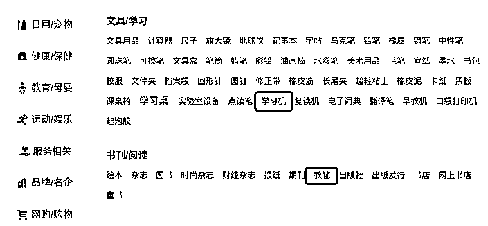  <ne-p id="ue4110e11" data-lake-id="ue4110e11"><ne-text id="ud25e3463">点进去之后，就是品牌排行榜，可以直达每一个品牌的旗舰店，接下来，就是看广告了。</ne-text></ne-p> <ne-p id="u92c6a04a" data-lake-id="u92c6a04a"><ne-card data-card-name="image" data-card-type="inline" id="FWpQp" data-event-boundary="card">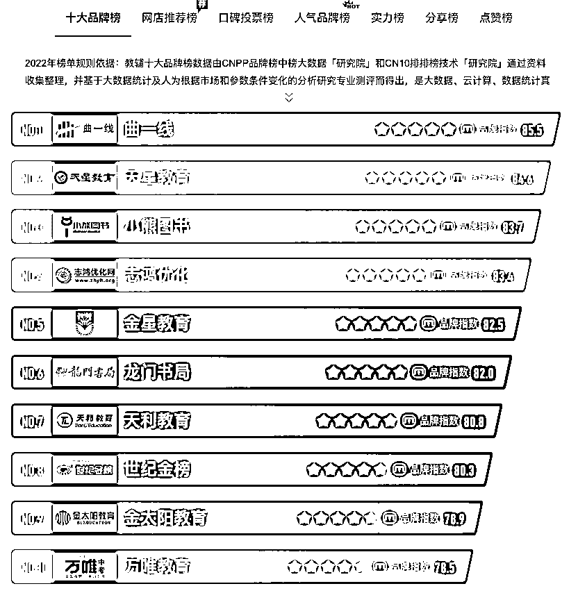  <ne-p id="uf4f95337" data-lake-id="uf4f95337"><ne-text id="u91d5938e">在广告里面捉被验证的痛点，多么的一目了然。</ne-text></ne-p> <ne-p id="ud40c1921" data-lake-id="ud40c1921"><ne-card data-card-name="image" data-card-type="inline" id="JdiGL" data-event-boundary="card">  <ne-p id="u29e57ba9" data-lake-id="u29e57ba9"><ne-text id="ue5b1aba2">提取痛点，拿去写笔记，大号梨云绿&小号梨云黑，数据可观。</ne-text></ne-p> <ne-p id="u4b2564f1" data-lake-id="u4b2564f1"><ne-card data-card-name="image" data-card-type="inline" id="jQnpx" data-event-boundary="card">  <ne-p id="u5ec2a978" data-lake-id="u5ec2a978"><ne-text id="u09edfb38">具体如何围绕痛点去写内容，我放在后面的第三部分。</ne-text></ne-p> <ne-h3 id="b412e9b3" data-lake-id="b412e9b3"><ne-heading-ext><ne-heading-anchor></ne-heading-anchor><ne-heading-fold></ne-heading-fold></ne-heading-ext><ne-heading-content><ne-text id="u41b2d41b" ne-bold="true">②理解人性</ne-text></ne-heading-content></ne-h3> <ne-p id="ua2acf18e" data-lake-id="ua2acf18e"><ne-text id="u70f0d089">内容一定要让用户自发看完，只有他们看完了，你的内容才能影响他们的心智，或点赞你、或转粉你，或找你买单。</ne-text></ne-p> <ne-p id="u45ebec89" data-lake-id="u45ebec89"><ne-text id="u58b82214">那什么样的内容才能让用户看完？四个字，顺应人性。</ne-text></ne-p> <ne-p id="u418c8021" data-lake-id="u418c8021"><ne-text id="uabdfb331">我在《梨云绿》和《梨云黑》已经展现了视觉层面对人性的顺应，接下来，我和你分享内容层面对人性的 12 种顺应，并且我已经用实践验证了一遍。</ne-text></ne-p> <ne-p id="ud2cc71f9" data-lake-id="ud2cc71f9"><ne-card data-card-name="image" data-card-type="inline" id="GxrJ1" data-event-boundary="card">  <ne-p id="u38f0c3ad" data-lake-id="u38f0c3ad"><ne-card data-card-name="image" data-card-type="inline" id="ezm60" data-event-boundary="card">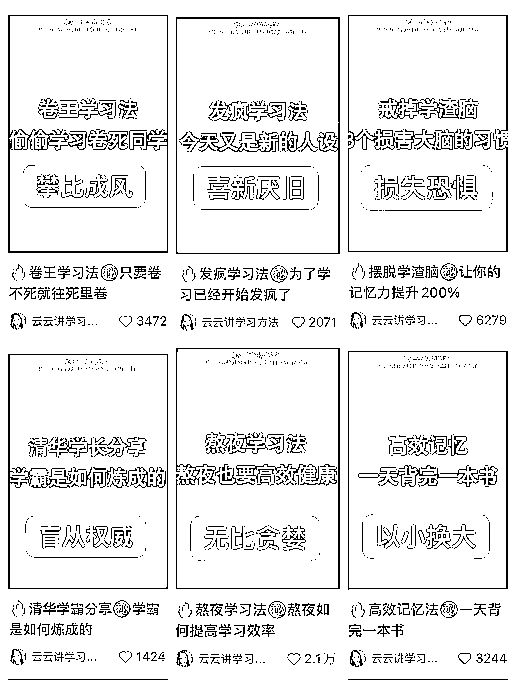  <ne-p id="u7161adf1" data-lake-id="u7161adf1"><ne-text id="u3cdaaa45">理解人性的同时，也要理解自己，自己的痛点，也代表了一类人的痛点。</ne-text></ne-p> <ne-p id="u216029ae" data-lake-id="u216029ae"><ne-text id="u1093591f">冬天来了，我准备买个泡脚盆，在网上找的时候，突然发现一个宝藏足浴盆，它是那种有一个水龙头，把桶里面的热水抽上来，从膝盖往下浇。</ne-text></ne-p> <ne-p id="ue603a725" data-lake-id="ue603a725"><ne-text id="u02017fbd">我看到那一刻，突然想到自己的一大痛点：泡脚的温暖，总想着水面不断往上涨，最好没过膝盖，这个水龙头，满足了！</ne-text></ne-p> <ne-p id="ubd52a418" data-lake-id="ubd52a418"><ne-text id="u6373b2ad">我想，这应该痛点，应该也是绝大多数的痛，于是，我去小红书测试了一下，几秒的视频，就吸引了好几个问链接的人。</ne-text></ne-p> <ne-p id="u98a08d65" data-lake-id="u98a08d65"><ne-text id="ufe2d77c6">当然这里我用了一个骚操作，就是视频只有短短的 4 秒，完播率直接拉到 73%。</ne-text></ne-p> <ne-p id="uf168b45b" data-lake-id="uf168b45b"><ne-card data-card-name="image" data-card-type="inline" id="E96Bc" data-event-boundary="card">  <ne-p id="ua75257c1" data-lake-id="ua75257c1"><ne-text id="u25654480">我又又又新起了一个带货号，如果只是晒衣服，很难新号出爆款。</ne-text></ne-p> <ne-p id="u47371c75" data-lake-id="u47371c75"><ne-text id="ubbccd166">我是怎么快速起新号的呢？</ne-text></ne-p> <ne-p id="u96a051d3" data-lake-id="u96a051d3"><ne-text id="u9e169d15">增加互动，拉满新奇，我说只要你滑动图片够快，我就能转起来，结果她们就会来回滑动，无意间，不仅增加了停留时间，而且在来回滑动的时候，过快会导致双击，从而获得让素人穿搭号在一开始就获得大曝光。</ne-text></ne-p> <ne-p id="uec6834a8" data-lake-id="uec6834a8"><ne-text id="u400305f4">直接 0 粉出爆文。</ne-text></ne-p> <ne-p id="u7e641ed2" data-lake-id="u7e641ed2"><ne-text id="u91c276d2">我的衣服不多，出现爆款后，要立马其他笔记跟上，蹭自己的爆款，也能拿到不少曝光。</ne-text></ne-p> <ne-p id="u8add3d2a" data-lake-id="u8add3d2a"><ne-card data-card-name="image" data-card-type="inline" id="Dcil1" data-event-boundary="card">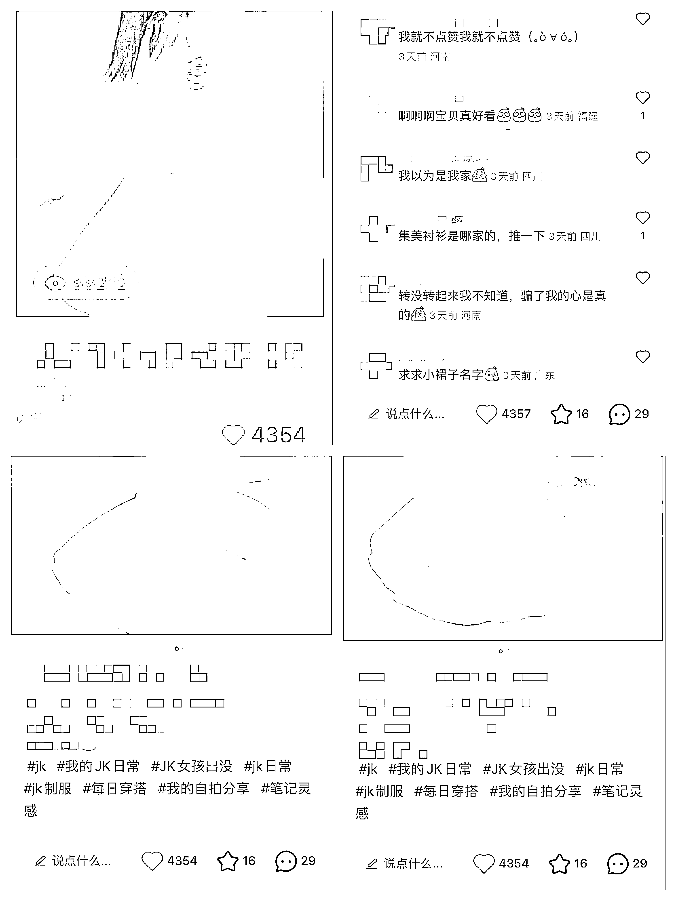  <ne-h2 id="122a05c5" data-lake-id="122a05c5"><ne-heading-ext><ne-heading-anchor></ne-heading-anchor><ne-heading-fold></ne-heading-fold></ne-heading-ext><ne-heading-content><ne-text id="u27d623d3" ne-bold="true">三、如何进行高效创作内容</ne-text></ne-heading-content></ne-h2> <ne-p id="u2359bc51" data-lake-id="u2359bc51"><ne-text id="u6f43867f">小红书是一个种草平台，种草的本质，是改变心智。</ne-text></ne-p> <ne-p id="u4ca80922" data-lake-id="u4ca80922"><ne-text id="u7fac7e0c">意思就是，通过你的内容，构建用户对你的认知，当他们遇到困难需要解决的时候，第一个想起的是你，而不是其他人。</ne-text></ne-p> <ne-p id="u98249524" data-lake-id="u98249524"><ne-text id="u15ca302d">就像一提到空调，你就想到格力，一提到赚钱项目，你就想到生财有术，一提到做小红书，你就想到梨云。</ne-text></ne-p> <ne-p id="uc2eedb5f" data-lake-id="uc2eedb5f"><ne-text id="u447cba89">这里的关键，就有三个因素，第一，内容专业能解决问题，第二，内容要吸引用户完成心智影响，第三，内容要持续输出巩固记忆。</ne-text></ne-p> <ne-h3 id="86bb23fb" data-lake-id="86bb23fb"><ne-heading-ext><ne-heading-anchor></ne-heading-anchor><ne-heading-fold></ne-heading-fold></ne-heading-ext><ne-heading-content><ne-text id="u5e2d0f1b" ne-bold="true">①内容专业</ne-text></ne-heading-content></ne-h3> <ne-p id="uc662abf1" data-lake-id="uc662abf1"><ne-text id="uebf9807d">很多创作者对内容专业有误解，以为写的像百度百科、学术论文，才叫专业，结果就导致很多在领域里特别有积累的人，来到自媒体平台，根本做不起来。</ne-text></ne-p> <ne-p id="u6b445674" data-lake-id="u6b445674"><ne-text id="u89884a08">什么叫内容专业？就是用通俗易懂的表达，解决用户的问题。</ne-text></ne-p> <ne-p id="ue31be3f6" data-lake-id="ue31be3f6"><ne-text id="uc940c0b1">因为用户不是内行人，他问你怎么做爆款封面，你一张口就是色相色彩饱和度，单色明度群体化，他会直接因为看不懂，而跳出你的内容。</ne-text></ne-p> <ne-p id="uce31f6e7" data-lake-id="uce31f6e7"><ne-text id="u014e8105">但如果你像《梨云绿》这样抽丝剥茧、大白话说出来，不仅好理解，而且用了真的能出效果，那么专业的认知就构建起来了。</ne-text></ne-p> <ne-p id="u98b4cfec" data-lake-id="u98b4cfec"><ne-text id="ue7a8d9f9">小红书这个短快平的平台，更是如此，所以在给方法的时候，一定要注意这 3 点。</ne-text></ne-p> <ne-p id="ueb704776" data-lake-id="ueb704776"><ne-text id="u401e9555">方法要流程化，可落地，并且简单有效。</ne-text></ne-p> <ne-p id="u3ef52c13" data-lake-id="u3ef52c13"><ne-text id="uad490e3b">方法表达过程中极其简短，能用一句话说清楚的绝不用两句</ne-text></ne-p> <ne-p id="u352e7203" data-lake-id="u352e7203"><ne-text id="ubadb1a78">复杂的、1000 以内讲不清楚的内容，不适合放在小红书上创作，这也是为什么你公众号、知乎写的牛逼，来到小红书就不行的核心原因。</ne-text></ne-p> <ne-p id="u1a74ea4e" data-lake-id="u1a74ea4e"><ne-text id="u4e529ab0">像我在小红书上写方法论，基本一行半完成。</ne-text></ne-p> <ne-p id="u589d5acb" data-lake-id="u589d5acb"><ne-card data-card-name="image" data-card-type="inline" id="zj7m2" data-event-boundary="card">  <ne-p id="u9b61057e" data-lake-id="u9b61057e"><ne-text id="uaa808dbd">其他赛道，也一样通用。</ne-text></ne-p> <ne-p id="uae7c538d" data-lake-id="uae7c538d"><ne-card data-card-name="image" data-card-type="inline" id="vPILB" data-event-boundary="card">  <ne-p id="uc934722d" data-lake-id="uc934722d"><ne-text id="u956fa34d" ne-bold="true">内容专业还有一个体现，是选题垂直。</ne-text></ne-p> <ne-p id="ud49d99d7" data-lake-id="ud49d99d7"><ne-text id="u40769163">你想想，一个用户被当下这篇笔记吸引，然后点击到你的主页，发现你的其他笔记乱七八糟，东讲一下，西说一下，那么对你的专业认可度就会大大降低。</ne-text></ne-p> <ne-p id="u11f84c5c" data-lake-id="u11f84c5c"><ne-text id="u8be65a6f">因为在大众的认知里，专业等于专一，你就是专门做这个的，所以才这么牛逼。</ne-text></ne-p> <ne-p id="u85a0d2f5" data-lake-id="u85a0d2f5"><ne-text id="ua65761dc">为了顺应这个认知，我们在做内容的时候，一定要垂直输出。</ne-text></ne-p> <ne-p id="u0472d59a" data-lake-id="u0472d59a"><ne-text id="ub4dbfd53">怎么垂直？不是用标签链接去爬爆款笔记了，而要改成爬对标博主的全部笔记。</ne-text></ne-p> <ne-p id="u16fd12ee" data-lake-id="u16fd12ee"><ne-text id="u29974911">为什么？因为对标博主，已经发了很多内容，形成了垂直账号，并且哪些是爆款，已经帮我们验证了。</ne-text></ne-p> <ne-p id="ufa76d623" data-lake-id="ufa76d623"><ne-text id="u3b13a2e0">我们只需要从中参考，对不同博主的选题进行相互补充，就能快速形成更强大而完整的垂直内容库。</ne-text></ne-p> <ne-p id="ue95a3816" data-lake-id="ue95a3816"><ne-text id="u188ab3e2" style="color: rgb(222, 120, 2);">对标博主怎么找？</ne-text></ne-p> <ne-p id="uc33746b2" data-lake-id="uc33746b2"><ne-text id="u37b66680">第一种，直接在小红书主页的检索框，输入该领域的关键词。</ne-text></ne-p> <ne-p id="uc043e559" data-lake-id="uc043e559"><ne-text id="u804860b9">比如你要做心理学账号，你就检索心理学。</ne-text></ne-p> <ne-p id="u61ec2897" data-lake-id="u61ec2897"><ne-text id="ue2584bd3">然后在【综合】和【最热】里面，从前往后取 20~50 位博主，进行筛选对标。</ne-text></ne-p> <ne-p id="ud58628a2" data-lake-id="ud58628a2"><ne-card data-card-name="image" data-card-type="inline" id="ZXjfd" data-event-boundary="card">  <ne-p id="ue18c6dda" data-lake-id="ue18c6dda"><ne-text id="u9c25a959">第二种，在小红书二级导航里面，点击对应领域的频道，也可以找到靠前的博主。</ne-text></ne-p> <ne-p id="ubd1049a0" data-lake-id="ubd1049a0"><ne-text id="u53d0793e">这里就属于大领域中的细分赛道，能让你找到更精准的定位。</ne-text></ne-p> <ne-p id="ue234bb37" data-lake-id="ue234bb37"><ne-card data-card-name="image" data-card-type="inline" id="covmc" data-event-boundary="card">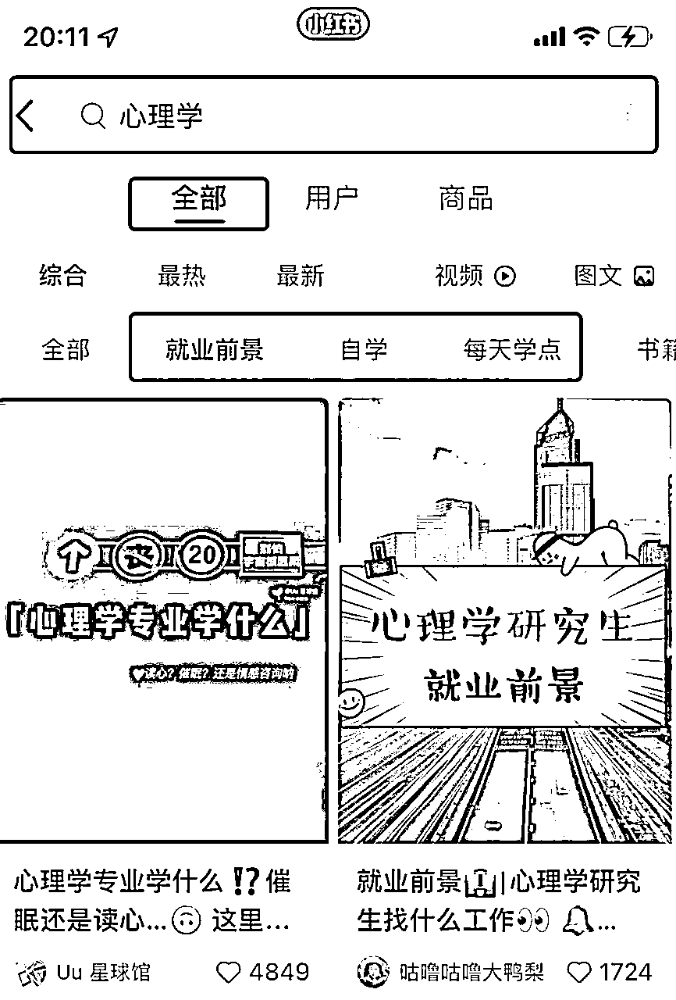  <ne-p id="u37f9a9ee" data-lake-id="u37f9a9ee"><ne-text id="u5e0cb9a7">第三种，直接用数据平台找。</ne-text></ne-p> <ne-p id="u74827fe6" data-lake-id="u74827fe6"><ne-card data-card-name="image" data-card-type="inline" id="fcYCp" data-event-boundary="card">  <ne-p id="u1bce8e7d" data-lake-id="u1bce8e7d"><ne-text id="u61ebfb76" style="color: rgb(222, 120, 2);">怎么爬取对标博主的全部笔记？</ne-text></ne-p> <ne-p id="u15da1ae7" data-lake-id="u15da1ae7"><ne-text id="u3af52056">这里要用到我们生财航海的实战工具包中的</ne-text>[<ne-text id="ue276041e">小红书批量下载器</ne-text>](https://pan.baidu.com/s/1InqLChZe4HM7-RlUMfK95w?pwd=ca4g)<ne-text id="u334b86b5"> （附耳轻声：真的是你能想到的想不到的工具都汇总在这里了，不去看一遍真的亏大了！）</ne-text></ne-p> <ne-p id="ub23eaeb6" data-lake-id="ub23eaeb6"><ne-card data-card-name="image" data-card-type="inline" id="HkQyI" data-event-boundary="card">  <ne-p id="u98ffc747" data-lake-id="u98ffc747"><ne-text id="uc902ea6f" style="color: rgb(222, 120, 2);">怎么相互补充构建？</ne-text></ne-p> <ne-p id="u3a0f4f02" data-lake-id="u3a0f4f02"><ne-text id="ud8b50e74">导出对标博主的笔记，按点赞量排序，取 500 赞以上的爆款。</ne-text></ne-p> <ne-p id="u6f99c68d" data-lake-id="u6f99c68d"><ne-card data-card-name="image" data-card-type="inline" id="Ue2FZ" data-event-boundary="card">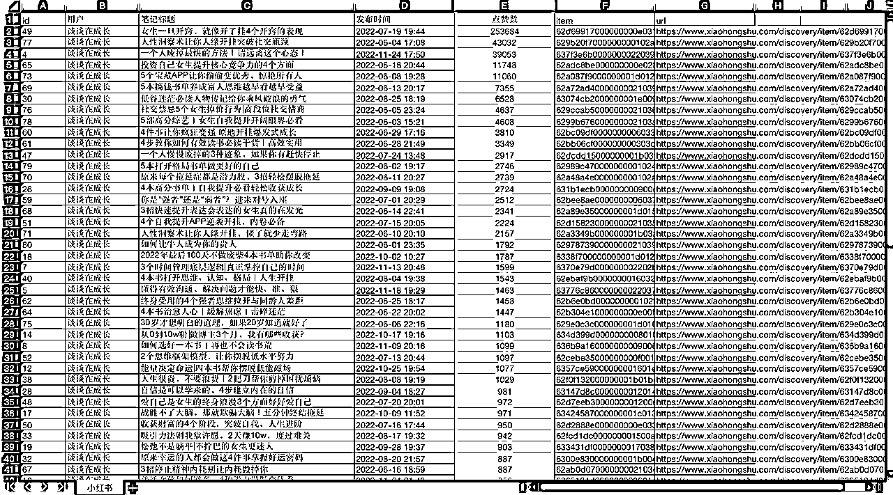  <ne-p id="uda82b76e" data-lake-id="uda82b76e"><ne-text id="u813e0b00">然后对这些数据进行归类整合，一个垂直内容库就出来了，这意味着整个账号的规划也大致出来了。</ne-text></ne-p> <ne-p id="uc96c91e6" data-lake-id="uc96c91e6"><ne-card data-card-name="image" data-card-type="inline" id="trywG" data-event-boundary="card">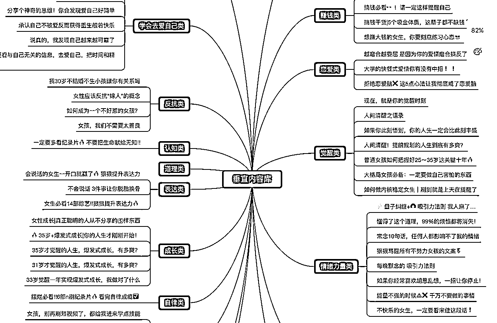  <ne-h3 id="e672c659" data-lake-id="e672c659"><ne-heading-ext><ne-heading-anchor></ne-heading-anchor><ne-heading-fold></ne-heading-fold></ne-heading-ext><ne-heading-content><ne-text id="u36720b9f" ne-bold="true">②吸引用户</ne-text></ne-heading-content></ne-h3> <ne-p id="uc58a626a" data-lake-id="uc58a626a"><ne-text id="u902d829a">很多人方法论也遵循了奥卡姆剃刀原理，即方法论简洁有效，但曝光还是不行，为啥？</ne-text></ne-p> <ne-p id="u03d068af" data-lake-id="u03d068af"><ne-text id="uccade435">因为一上来就丢方法了！他少了一个让用户看下去的理由！这就像没告诉病情直接给你药，你会接受吗？</ne-text></ne-p> <ne-p id="u0ac26c75" data-lake-id="u0ac26c75"><ne-text id="u00b8fe94">你只有让用户意识到了，噢！我确实遇到了这个问题，现在我需要解决它，请给我方法！</ne-text></ne-p> <ne-p id="u286d3442" data-lake-id="u286d3442"><ne-text id="ub2a0922e">如此，他才会自发的把文章看下去、看完它，三个常用的爆款开头方法，分享给你。</ne-text></ne-p> <ne-p id="ucc597c24" data-lake-id="ucc597c24"><ne-text id="u722ae66e" style="color: rgb(222, 120, 2);">共情开头法</ne-text><ne-text id="ue60ae732">：写共鸣的、真相的句子，把用户没有说出来的话、有体验但是找不到文字表达的话，你替他们说出来。</ne-text></ne-p> <ne-p id="ucb73cef8" data-lake-id="ucb73cef8"><ne-text id="u74119f8b" style="color: rgb(222, 120, 2);">场景开头法</ne-text><ne-text id="u7e9ed7b3">：假设一个场景，让用户看文字的时候，仿佛置身其中，这里有一个写作技巧，多用名词和动词，少用形容词和副词。</ne-text></ne-p> <ne-p id="ubcf512e3" data-lake-id="ubcf512e3"><ne-text id="u53c74902" style="color: rgb(222, 120, 2);">恐吓开头法</ne-text><ne-text id="u6057da09">：比起正面的，人对负面的信息更敏感，通过描述负面切中对方的痛处，从而激起他们渴望改变的心理需求。</ne-text></ne-p> <ne-p id="u9bc27229" data-lake-id="u9bc27229"><ne-text id="u4ada216b">这些方法的底层逻辑是，让他们瞬间代入：没错，我就是这样，你太懂我了，然后呢，我该怎么办？</ne-text></ne-p> <ne-p id="u000d64ca" data-lake-id="u000d64ca"><ne-card data-card-name="image" data-card-type="inline" id="x4KHA" data-event-boundary="card">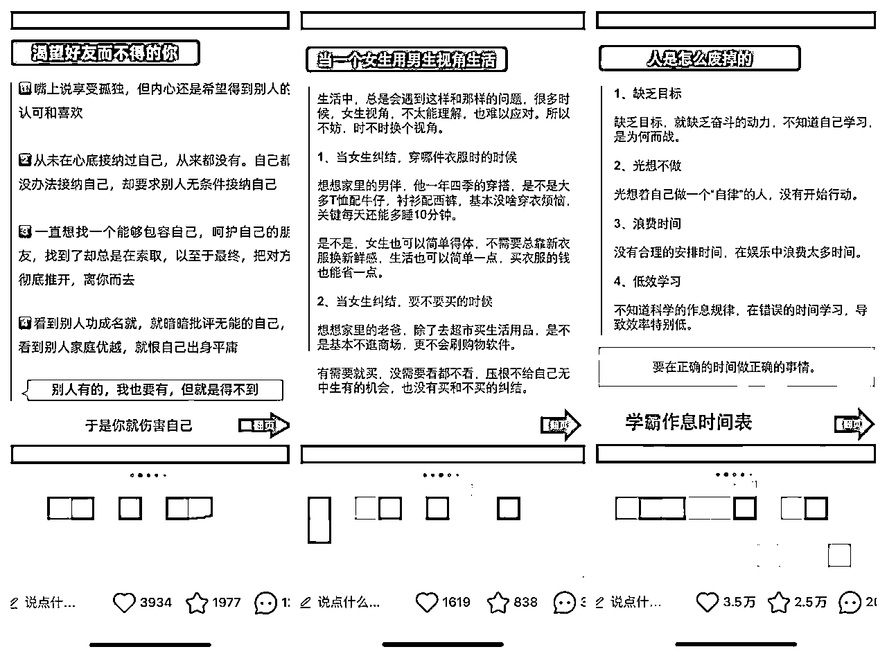  <ne-p id="u2d0708fc" data-lake-id="u2d0708fc"><ne-text id="u7cc3096d">吸引用户，除了让其把文章看完，也要埋下钩子，促进他们转粉，就拿我之前梨云黑的号来说：</ne-text></ne-p> <ne-p id="u40f85a67" data-lake-id="u40f85a67"><ne-card data-card-name="image" data-card-type="inline" id="JelCw" data-event-boundary="card">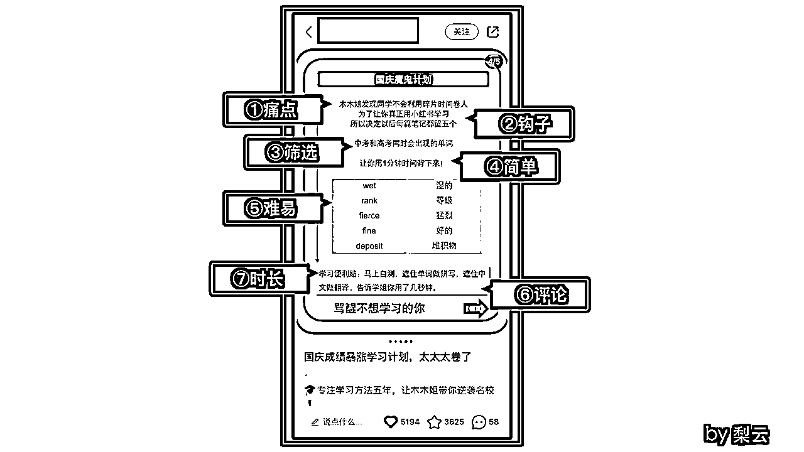  <ne-p id="u5aaa8a5e" data-lake-id="u5aaa8a5e"><ne-text id="u050b2a50" ne-bold="true">①痛点：</ne-text><ne-text id="u1c977a4d">很多人不会用碎片时间学习，你看，现在你刷小红书，用的就是碎片时间，要不趁机多记几个单词？这是让用户看下去和去做的理由。</ne-text></ne-p> <ne-p id="u4770a116" data-lake-id="u4770a116"><ne-text id="u8c3f6006" ne-bold="true">②钩子</ne-text><ne-text id="ue003ad8e">：接着，留下一个转粉钩子：“以后每篇笔记”这和“明天预告”异曲同工，一来告诉你持续更新，二来告诉你刷到我都可以背 5 个单词，把价值感拉满！</ne-text></ne-p> <ne-p id="uf0b69c0e" data-lake-id="uf0b69c0e"><ne-text id="ue99cfdad" ne-bold="true">③筛选</ne-text><ne-text id="u40f9525c">：前面说了特定的文字会吸引特定的人群，一句“中考和高考同时出现的单词”把中学生群体一网打尽。</ne-text></ne-p> <ne-p id="ua368bfd2" data-lake-id="ua368bfd2"><ne-text id="u1ec0ae84" ne-bold="true">④简单</ne-text><ne-text id="ue57d3f43">：1 分钟背 5 个单词，让你觉得很轻松，愿意去做这件事情。</ne-text></ne-p> <ne-p id="u3a367c76" data-lake-id="u3a367c76"><ne-text id="u15cf6e61" ne-bold="true">⑤难易</ne-text><ne-text id="u0dfbdb6c">：5 个单词的挑选和搭配也有设计，一般 3 个超简单，2 个中等难度，开头第一个是最简单的，循序渐进，不要第一个单词就把人吓跑了。</ne-text></ne-p> <ne-p id="u702c364b" data-lake-id="u702c364b"><ne-text id="u0a5cf414" ne-bold="true">⑥评论</ne-text><ne-text id="u68abf429">：在便利贴模块，详细说了背单词的步骤，让他们更好操作，同时加了一句“告诉学姐你用了几秒钟”引导评论区评论，而每一个留言的人，我都会直接问单词背了多久，培养用户的粘性和习惯。</ne-text></ne-p> <ne-p id="u9d6174a4" data-lake-id="u9d6174a4"><ne-text id="u599e2c71" ne-bold="true">⑦时长</ne-text><ne-text id="u59587e2e">：因为这一页的存在，极大的拉升了阅读时长，而这，正是官方提倡的，因为所有平台的竞争，本质上都是在争夺用户的不可再生资源——时间，谁有本事让用户停留越久，平台就越喜欢谁。</ne-text></ne-p> <ne-h3 id="d261ceaa" data-lake-id="d261ceaa"><ne-heading-ext><ne-heading-anchor></ne-heading-anchor><ne-heading-fold></ne-heading-fold></ne-heading-ext><ne-heading-content><ne-text id="u231efdcf" ne-bold="true">③持续输出</ne-text></ne-heading-content></ne-h3> <ne-p id="u4225662b" data-lake-id="u4225662b"><ne-text id="u57f334b2">能输出一篇爆款不厉害，能持续输出爆款才厉害。</ne-text></ne-p> <ne-p id="ue4c6e5aa" data-lake-id="ue4c6e5aa"><ne-text id="ucc6eba1d">我在小红书上输出 20 多篇 10w+笔记的经验和你分享如何高效稳定的输出内容。</ne-text></ne-p> <ne-p id="u27585f40" data-lake-id="u27585f40"><ne-text id="u7a618aa3">很多人在开始做小红书的时候，都会有一个疑问：要不要日更。</ne-text></ne-p> <ne-p id="u88cfb435" data-lake-id="u88cfb435"><ne-text id="ua7f9c127">日更当然有红利啦，尤其是当你的号发第一篇笔记的时候，系统会给你新号助力，也就是出爆款的概率会更大。</ne-text></ne-p> <ne-p id="uae1503b8" data-lake-id="uae1503b8"><ne-text id="u5dea027a">这个时间大概在半个月到一个月，也就是说，只要在这个期间更新的篇数足够多，那么就能享受更多的助力。</ne-text></ne-p> <ne-p id="u050747b0" data-lake-id="u050747b0"><ne-text id="ub42b0a4f">我日更出爆款的其中一个东风，就是它，但，这只是一个理想状态。</ne-text></ne-p> <ne-p id="u143db901" data-lake-id="u143db901"><ne-text id="u80585596">因为我们会受到能力和精力的制约。</ne-text></ne-p> <ne-p id="u99b80c35" data-lake-id="u99b80c35"><ne-text id="u68b2c7e9" style="color: rgb(222, 120, 2);">对于能力</ne-text><ne-text id="ubeda33d6">，矩阵号对笔记质量要求低，一天日更几条压力都不是很大，但如果你是要精品 IP 号，就要考虑你创作笔记的能力了，是否能支持你在日更的情况下，还能保证质量。</ne-text></ne-p> <ne-p id="u7e9de7f3" data-lake-id="u7e9de7f3"><ne-text id="uc5dd708b">很多人进入日更之后，心态会发生微妙的变化，为了日更而日更，质量下降，系统更不会给你推，其实也就失去了我们原本的目的：借助日更吃到更多新号助力。</ne-text></ne-p> <ne-p id="ua35aacdc" data-lake-id="ua35aacdc"><ne-text id="u636ca752" style="color: rgb(222, 120, 2);">对于精力</ne-text><ne-text id="u0d556628">，一般新手认真做笔记，单篇耗时在 40 分钟左右，你是否每天能分配这个时间。</ne-text></ne-p> <ne-p id="u57ef071e" data-lake-id="u57ef071e"><ne-text id="u73d8529a">虽然有制约，但并不意味着我们没有办法提高笔记创作的速度，因为任何事情，一旦流程化，效率就会得到极大的提升。</ne-text></ne-p> <ne-p id="ue7abfa69" data-lake-id="ue7abfa69"><ne-text id="u8be6ae26">那么接下来，我就和你说说，怎么流程化输出小红书笔记。</ne-text></ne-p> <ne-p id="u37525efe" data-lake-id="u37525efe"><ne-text id="ua4642ae2">首先，我们对整个笔记创作流程进行拆解。</ne-text></ne-p> <ne-p id="u4f95e10e" data-lake-id="u4f95e10e"><ne-text id="uc1fc535c">选题、标题、内容、排版，就四个环节。</ne-text></ne-p> <ne-p id="ud13d3bb1" data-lake-id="ud13d3bb1"><ne-text id="u80c8dd89">回忆一下，我们是如何创作出第一篇笔记的？是不是先看大量的爆款选题，然后模仿他们的爆款标题和内容，最后进行排版。</ne-text></ne-p> <ne-p id="ude6c24aa" data-lake-id="ude6c24aa"><ne-text id="ub933f83a">模仿很多时候，就是对内容的重组和重述，那么，只要我们有足够多的素材存量，就可以让四个环节不断重组，进而工业化的生产笔记。</ne-text></ne-p> <ne-p id="u96d856ad" data-lake-id="u96d856ad"><ne-text id="u21280cc9">前面，我们搭建知识体系，其实就同步完成了选题库和标题库的搭建。</ne-text></ne-p> <ne-p id="ue6d4c1d4" data-lake-id="ue6d4c1d4"><ne-text id="ue3d13682">排版，我们有圈友开发的自动排版器一键搞定。</ne-text></ne-p> <ne-p id="u7b79ccfa" data-lake-id="u7b79ccfa"><ne-text id="u227cd0b4">那接下来，就是剩下内容了，还记得前面说过，内容的核心就是问题开头+解决方法。</ne-text></ne-p> <ne-p id="u37647493" data-lake-id="u37647493"><ne-text id="u7cc5c7e6">因此，我们只需要把大量笔记归类，构建开头痛点库和解决方法库就可以了，前期数据库越完善，后期创作就会越轻松。</ne-text></ne-p> <ne-p id="ud83ff2fd" data-lake-id="ud83ff2fd"><ne-text id="u33779265">我喜欢手动收集，虽然费时间，但是在这个过程中，我可以同步思考关于融合与创新的事情，如果你想要批量化和提高速度，可以直接用航海实战工具包里面的</ne-text><ne-text id="u4b158dd8" style="color: rgb(222, 120, 2);">小红书图片批量下载</ne-text><ne-text id="ubca306f7">：Chrome 插件「Fake Fatkun」和</ne-text> <ne-text id="ue46b66c5" style="color: rgb(222, 120, 2);">图片提取文字</ne-text><ne-text id="ue5e2e6d4">：白描、wps、扫描全能王、微信图片识别。</ne-text></ne-p> <ne-p id="u59408f1e" data-lake-id="u59408f1e"><ne-text id="u2904e51f">再夸一句，航海实战包真的是生财人的哆啦 A 梦！</ne-text></ne-p> <ne-p id="u5c098aa3" data-lake-id="u5c098aa3"><ne-card data-card-name="image" data-card-type="inline" id="ndK9q" data-event-boundary="card">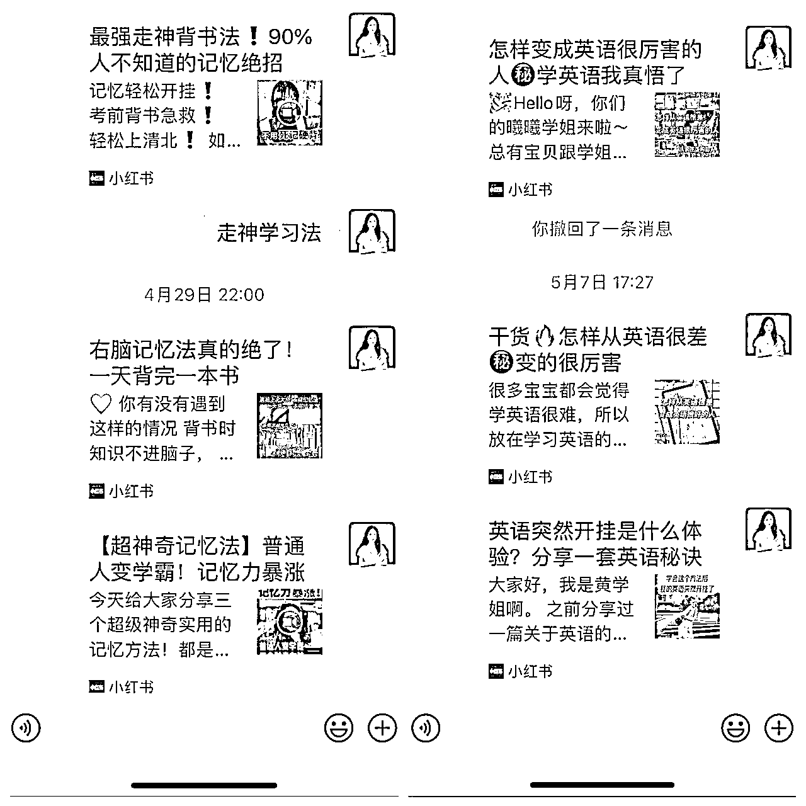  <ne-p id="u317b748d" data-lake-id="u317b748d"><ne-card data-card-name="image" data-card-type="inline" id="msaHH" data-event-boundary="card">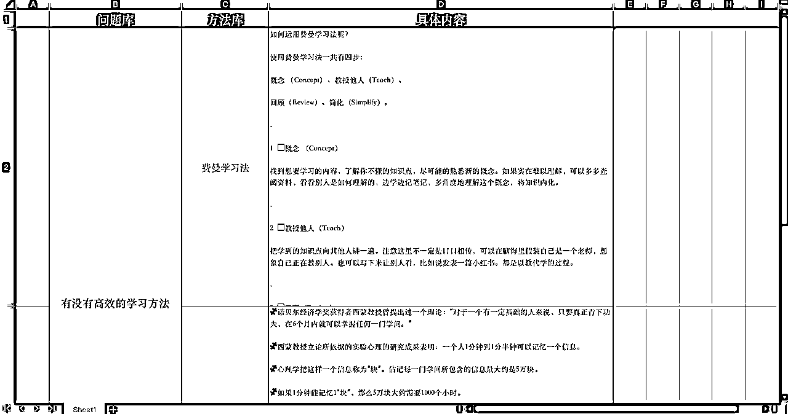  <ne-p id="u8a47efb6" data-lake-id="u8a47efb6"><ne-text id="u886dae58">比如提高学习效率，方法很多，有费曼学习法、西蒙学习法、刻意练习、思维导图、SQ3R 阅读法……你既可以单独拎出一个方法来讲一篇笔记，也可以挑四个组合起来写成一篇笔记。</ne-text></ne-p> <ne-p id="ub0174de0" data-lake-id="ub0174de0"><ne-text id="uac099779">又比如要提升记忆力，有很多种方法，你就可以每周写一个提升记忆力的。</ne-text></ne-p> <ne-p id="u0f9830c3" data-lake-id="u0f9830c3"><ne-text id="uee427ede">减肥、育儿、女性成长等赛道又何尝不是如此？</ne-text></ne-p> <ne-p id="u87c36490" data-lake-id="u87c36490"><ne-text id="u60ac2dc0">痛点一直都在，你只不过是换了一种方法来解决它。</ne-text></ne-p> <ne-p id="ub708a0de" data-lake-id="ub708a0de"><ne-text id="ua9b64a9e">而我就是用这个方法，让自己创作的时间，快速压缩到 15 分钟。</ne-text></ne-p> <ne-p id="u5e8511b6" data-lake-id="u5e8511b6"><ne-card data-card-name="image" data-card-type="inline" id="EzQfs" data-event-boundary="card">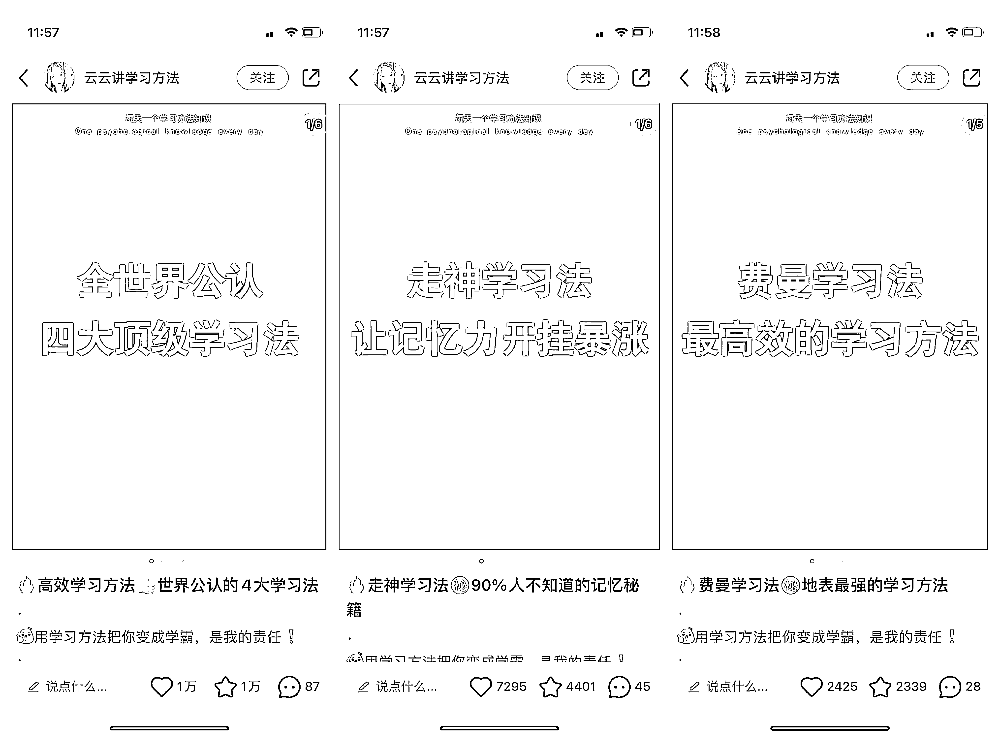  <ne-p id="udf8c06fb" data-lake-id="udf8c06fb"><ne-text id="u16b661b0">今天的小红书分享就到这里，内容很干，希望能给到大家一些启发和帮助，坚持下去，你一定会有所收获。有帮助的话，记得点个赞哦~</ne-text></ne-p> <ne-p id="uf9bb6903" data-lake-id="uf9bb6903"><ne-card data-card-name="image" data-card-type="inline" id="rEKMD" data-event-boundary="card">  <ne-h2 id="3513935c" data-lake-id="3513935c"><ne-heading-ext><ne-heading-anchor></ne-heading-anchor><ne-heading-fold></ne-heading-fold></ne-heading-ext><ne-heading-content><ne-text id="u48650e2e">（130 赞）《 实操复盘：小红书资料号新玩法，深度运营月入 5w+》</ne-text></ne-heading-content></ne-h2> <ne-p id="udbb1a0a9" data-lake-id="udbb1a0a9"><ne-text id="u4dca3f62">各位圈友好，我是九京，</ne-text><ne-text id="u24c321cd" style="color: rgb(73, 73, 73);">轻资产创业玩家</ne-text><ne-text id="u9194d288">，目前深耕 7 年私域变现。</ne-text></ne-p> <ne-p id="uba3bf258" data-lake-id="uba3bf258"><ne-text id="u5da7cfa3">我从 2015 年开始在微信变现，前后经历过多个玩法，关于个人的具体介绍就不讲了，感兴趣的朋友可以看我前几期的文章。</ne-text></ne-p> <ne-p id="u920167e8" data-lake-id="u920167e8"><ne-text id="u09c164a4" style="color: rgb(73, 73, 73);">今天我所分享的小红书资料号玩法，可以说是未来十年的轻创业指南，无论你是副业新手、自由职业者，还是企业老板，接下来的内容都可以听得懂、学得会、用得上、赚得到。</ne-text></ne-p> <ne-p id="u348d3234" data-lake-id="u348d3234"><ne-text id="u64d0fd66">想象一下：</ne-text></ne-p> <ne-oli><ne-oli-i>1</ne-oli-i><ne-oli-c class="ne-oli-content" id="u07e5bb13" data-lake-id="u07e5bb13"><ne-text id="uf544dffe" style="color: rgb(73, 73, 73);">假如你搭建了一个自动盈利系统，每天源源不断现金入账，是怎样一个场景？</ne-text></ne-oli-c></ne-oli> <ne-oli><ne-oli-i>2</ne-oli-i><ne-oli-c class="ne-oli-content" id="u8eec9d57" data-lake-id="u8eec9d57"><ne-text id="u9820e5aa" style="color: rgb(73, 73, 73);">假设你每天有超级多的精准流量，早上一睁眼，就是上百人主动添加微信，是怎样一个场景？</ne-text></ne-oli-c></ne-oli> <ne-oli><ne-oli-i>3</ne-oli-i><ne-oli-c class="ne-oli-content" id="ue5c6d98c" data-lake-id="ue5c6d98c"><ne-text id="u61d5aa45" style="color: rgb(73, 73, 73);">假如你的客户主动给你付钱，并且推荐自己的亲朋好友都来买单，又是怎样一个场景？</ne-text></ne-oli-c></ne-oli> <ne-p id="ub1fbeba4" data-lake-id="ub1fbeba4"><ne-text id="u7bb030a8" style="color: rgb(73, 73, 73);">如果你在经验不足、资金不多、时间很少的情况下，做到了上面 3 点，是不是一个令人激动的事情？</ne-text></ne-p> <ne-p id="u42a5866f" data-lake-id="u42a5866f"><ne-text id="u51e56086" style="color: rgb(73, 73, 73);">OK。如果你愿意的话，那我接下来分享的小红书玩法落地指南，或许可以帮助你。</ne-text></ne-p> <ne-p id="ub15cbd0f" data-lake-id="ub15cbd0f"><ne-text id="ueea00702" style="color: rgb(73, 73, 73);">早在 2021 年 9 月，我们团队就开始实操小红书流量变现，当时就可以做到单账号单月纯利润 10000+，关键每天也就花 1-2 小时操作。</ne-text></ne-p> <ne-p id="u5643c9e8" data-lake-id="u5643c9e8"><ne-card data-card-name="image" data-card-type="inline" id="tF4vW" data-event-boundary="card">  <ne-p id="uc64c2dbf" data-lake-id="uc64c2dbf"><ne-text id="uff3f373c" style="color: rgb(73, 73, 73);">为了验证这套方法，是否对更多普通人有用，我在 2022 年 5 月开启了内测，有 10 个信任的老朋友，参与报名，其中 8 个人都轻松做到了单日盈利 300 以上……</ne-text></ne-p> <ne-p id="u321bf849" data-lake-id="u321bf849"><ne-text id="uad245fc7" style="color: rgb(73, 73, 73);">很多人在抱怨现在大环境不好，但是我认为，现在正处在人类历史上最好的时代，这个时代崇尚创业，不问出身，给很多草根创业者，提供了无数的机会。</ne-text></ne-p> <ne-p id="ue65a0e5d" data-lake-id="ue65a0e5d"><ne-text id="ude14fd0a" style="color: rgb(73, 73, 73);">尤其是像生财有术这样的平台，涵盖了市场上绝大多数项目的一线玩法。并且领先市面上 1~2 年，可以说是普通人创业搞钱的藏经阁。</ne-text></ne-p> <ne-p id="u252a7254" data-lake-id="u252a7254"><ne-text id="u45b1d7de" style="color: rgb(73, 73, 73);">其实在去年，我们刚开始操作小红书玩法，当时对规则不了解，各种各样的疯狂测试，导致封了很多账号，但是我们没有放弃，直到今天单日可以做到很不错的收益，这中间离不开埋头苦干，日夜探索，好在我把它整理成一套系统的方法，可以帮你少走弯路。</ne-text></ne-p> <ne-p id="u7d5b7a64" data-lake-id="u7d5b7a64"><ne-card data-card-name="image" data-card-type="inline" id="PpIZL" data-event-boundary="card"> <ne-text id="ufe5868df"><ne-p id="ude6287d1" data-lake-id="ude6287d1"><ne-text id="u82410ad1">下面是我分享的大纲：</ne-text></ne-p> <ne-p id="u6d1c83ae" data-lake-id="u6d1c83ae"><ne-text id="ud17fd27e">一、玩法定位</ne-text></ne-p> <ne-p id="u09a04768" data-lake-id="u09a04768"><ne-text id="uda4fef17">二、玩法准备</ne-text></ne-p> <ne-p id="u99502acb" data-lake-id="u99502acb"><ne-text id="u291903fc">三、账号注册、养号与信息完善</ne-text></ne-p> <ne-p id="u3c2333dc" data-lake-id="u3c2333dc"><ne-text id="u17955d9b">四、内容获取</ne-text></ne-p> <ne-p id="u7c155d8a" data-lake-id="u7c155d8a"><ne-text id="u3b9e0a05">五、图文制作</ne-text></ne-p> <ne-p id="u6356ec56" data-lake-id="u6356ec56"><ne-text id="ub70ef9cd">六、上传分发</ne-text></ne-p> <ne-p id="u50c22ba6" data-lake-id="u50c22ba6"><ne-text id="u8bbf65c3">七、获客策略</ne-text></ne-p> <ne-p id="ud74bad4e" data-lake-id="ud74bad4e"><ne-text id="ue812b49a">八、转化成交</ne-text></ne-p> <ne-p id="u631c0df1" data-lake-id="u631c0df1"><ne-text id="uf84cf586">九、后端盈利模式</ne-text></ne-p> <ne-hole id="u7d0ae74b" data-lake-id="u7d0ae74b"><ne-card data-card-name="hr" data-card-type="block" id="ZbTcm" data-event-boundary="card"><ne-h1 id="fe918bd9" data-lake-id="fe918bd9"><ne-heading-ext><ne-heading-anchor></ne-heading-anchor><ne-heading-fold></ne-heading-fold></ne-heading-ext><ne-heading-content><ne-text id="u97fa558f">一、玩法定位</ne-text></ne-heading-content></ne-h1> <ne-p id="uc44480ff" data-lake-id="uc44480ff"><ne-text id="ubceb2546">我们具体做的是什么玩法呢？</ne-text></ne-p> <ne-p id="u85e11a82" data-lake-id="u85e11a82"><ne-text id="u917c7a5e">简单讲，就是通过在小红书发布内容，吸引潜在客户添加微信领取资料，单份资料依据行业不同 19.9-199 不等，转化率 30%-40%，小红书的客户消费能力很强，另外后端其他变现也极为可观。</ne-text></ne-p> <ne-p id="udbba434f" data-lake-id="udbba434f"><ne-card data-card-name="image" data-card-type="inline" id="PNqGf" data-event-boundary="card">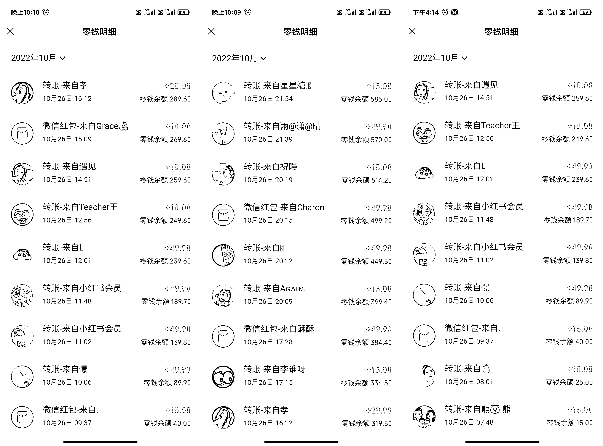 <ne-text id="u16f12150"><ne-h2 id="1ccd2efa" data-lake-id="1ccd2efa"><ne-heading-ext><ne-heading-anchor></ne-heading-anchor><ne-heading-fold></ne-heading-fold></ne-heading-ext><ne-heading-content><ne-text id="u003c0b86">1、核心商业导图</ne-text></ne-heading-content></ne-h2> <ne-p id="u92b597e1" data-lake-id="u92b597e1"><ne-card data-card-name="image" data-card-type="inline" id="Tywtq" data-event-boundary="card">  <ne-p id="ucd030646" data-lake-id="ucd030646"><ne-text id="u4f804767">这 7 年创业，其实我们就做的一件事情，从公域平台引流获客，导入微信私域反复多次成交，上面这张图是我们 7 年创业的核心商业导图总结，也是今天这篇文章的指导思想。</ne-text></ne-p> <ne-p id="u3cc87bbf" data-lake-id="u3cc87bbf"><ne-text id="u70b9e8a5">以我们正在实操的幼师/小学领域玩法来看，通过小红书/抖音/快手/视频号/知乎/微博/b 站/西瓜视频等平台，发布潜在客户感兴趣的内容，当对方产生兴趣之后，通过多种隐蔽且相对安全的引流手法导入微信，在微信端销售资料，并且通过后端盈利模式反复成交。</ne-text></ne-p> <ne-p id="ua13b28f2" data-lake-id="ua13b28f2"><ne-text id="ueeda395c">整个项目的 5 句核心心法：</ne-text></ne-p> <ne-oli><ne-oli-i>1</ne-oli-i><ne-oli-c class="ne-oli-content" id="uaa8a1d5f" data-lake-id="uaa8a1d5f"><ne-text id="u7c8ca954">定位即人群</ne-text></ne-oli-c></ne-oli> <ne-oli><ne-oli-i>2</ne-oli-i><ne-oli-c class="ne-oli-content" id="u642fc11c" data-lake-id="u642fc11c"><ne-text id="u89d5d088">人群即内容</ne-text></ne-oli-c></ne-oli> <ne-oli><ne-oli-i>3</ne-oli-i><ne-oli-c class="ne-oli-content" id="u6fe0cdab" data-lake-id="u6fe0cdab"><ne-text id="u4ad0be82">内容即流量</ne-text></ne-oli-c></ne-oli> <ne-oli><ne-oli-i>4</ne-oli-i><ne-oli-c class="ne-oli-content" id="u940bc4fe" data-lake-id="u940bc4fe"><ne-text id="uf4692382">流量即转化</ne-text></ne-oli-c></ne-oli> <ne-oli><ne-oli-i>5</ne-oli-i><ne-oli-c class="ne-oli-content" id="u84553a38" data-lake-id="u84553a38"><ne-text id="ue33fa92d">转化即模式</ne-text></ne-oli-c></ne-oli> <ne-p id="ud1a67013" data-lake-id="ud1a67013"><ne-text id="u67fc67f9">什么样的定位，决定了你的潜在客户人群；潜在客户群决定了你输出什么样的内容；输出内容决定了你吸引来的人群层次；人群层次决定了转化效果；转化方法又决定了整套商业模式。</ne-text></ne-p> <ne-p id="uf664082c" data-lake-id="uf664082c"><ne-text id="ud0ae06b2">以上心法不止应用于小红书，可以说是整个内容商业模式的底层逻辑和核心。</ne-text></ne-p> <ne-p id="udd917903" data-lake-id="udd917903"><ne-text id="u84decd2e">好了，在达成基础逻辑共识后，接下来我将百分百拆解我们的核心玩法，毫无保留，直接照着我的流程 1:1 操作，保证你可以拿到结果。</ne-text></ne-p> <ne-h2 id="003235cf" data-lake-id="003235cf"><ne-heading-ext><ne-heading-anchor></ne-heading-anchor><ne-heading-fold></ne-heading-fold></ne-heading-ext><ne-heading-content><ne-text id="ud15f796e">2、为什么选择小红书？</ne-text></ne-heading-content></ne-h2> <ne-p id="u37eb1b90" data-lake-id="u37eb1b90"><ne-text id="u63a61948">互联网流量平台这么多，比如抖音、快手、视频号等等，为什么我们重点操作小红书？主要是因为小红书有 4 大明显优势：</ne-text></ne-p> <ne-h3 id="533c4b22" data-lake-id="533c4b22"><ne-heading-ext><ne-heading-anchor></ne-heading-anchor><ne-heading-fold></ne-heading-fold></ne-heading-ext><ne-heading-content><ne-text id="ud75b35ee">⑴女性流量聚集地，付费能力强。</ne-text></ne-heading-content></ne-h3> <ne-p id="uedb880a7" data-lake-id="uedb880a7"><ne-text id="u165ca350">美团的创始人王兴曾经表达过这样一个概念：“按照付费能力排名，女性，大于狗，大于男人。”</ne-text></ne-p> <ne-p id="u133ef449" data-lake-id="u133ef449"><ne-text id="uf55f1e39">小红书 70%的客户都是女性，所以决定了它的购买力非常强，经过实测，成交转化率能够达到 40%。这个数据相比于其他同类型平台来讲非常高，相当于有 100 个人加你微信，40 个人都会付费。</ne-text></ne-p> <ne-h3 id="273531ac" data-lake-id="273531ac"><ne-heading-ext><ne-heading-anchor></ne-heading-anchor><ne-heading-fold></ne-heading-fold></ne-heading-ext><ne-heading-content><ne-text id="uba9ddea1">⑵不露脸出镜、不囤货拉人头</ne-text></ne-heading-content></ne-h3> <ne-p id="ub6440b76" data-lake-id="ub6440b76"><ne-text id="uec5046ba">小红书账号的打造，不需要你做 IP，也不需要出镜露脸，单纯只是制作素材，发内容，同时也不需要注重粉丝数量的积累，可以从第 1 个粉丝就开始变现。</ne-text></ne-p> <ne-p id="u7b6cc9fe" data-lake-id="u7b6cc9fe"><ne-text id="u6b17cdfd">与传统的社交电商、微商等项目相比，这个玩法并不需要你引导身边的亲戚朋友，也不需要拉人入伙，只需要自己闷声做就可以。</ne-text></ne-p> <ne-h3 id="1dd35994" data-lake-id="1dd35994"><ne-heading-ext><ne-heading-anchor></ne-heading-anchor><ne-heading-fold></ne-heading-fold></ne-heading-ext><ne-heading-content><ne-text id="u13755dc5">⑶难度小、成本低、上手快</ne-text></ne-heading-content></ne-h3> <ne-p id="ub36b32fe" data-lake-id="ub36b32fe"><ne-text id="uc06e21c1">相比于其他项目，小红书资料号玩法难度低很多，只需要一个手机起步，账号无异常的情况下，1~2 周就会开始进账，不限制能力，也不限制学历。</ne-text></ne-p> <ne-p id="u7c7ae3d1" data-lake-id="u7c7ae3d1"><ne-text id="ud0e90a52">其他项目动辄上万甚至几十万的前期投入，这个玩法堪称零成本，不需要做什么大的投资。</ne-text></ne-p> <ne-h3 id="5e1773cf" data-lake-id="5e1773cf"><ne-heading-ext><ne-heading-anchor></ne-heading-anchor><ne-heading-fold></ne-heading-fold></ne-heading-ext><ne-heading-content><ne-text id="ua1572848">⑷后端变现空间可观，可放大</ne-text></ne-heading-content></ne-h3> <ne-p id="u3365a916" data-lake-id="u3365a916"><ne-text id="ub08a4109">目前市面上的竞争对手，基本都是靠资料盈利，模式单一领域窄，而我接下来讲的玩法，拓展了全品类的选品方法，同时打磨出多种后端盈利模式，可以全方位帮助你提升整体营业额和收入。</ne-text></ne-p> <ne-p id="u5b5c4ca2" data-lake-id="u5b5c4ca2"><ne-text id="u30049b0e">另外，在你起步之后可以从账号、流程等多角度拆分放大，让你的后端利润拓展 5~10 倍以上。</ne-text></ne-p> <ne-hole id="u4b8d1f42" data-lake-id="u4b8d1f42"><ne-card data-card-name="hr" data-card-type="block" id="kM4my" data-event-boundary="card"><ne-h1 id="cefee1bc" data-lake-id="cefee1bc"><ne-heading-ext><ne-heading-anchor></ne-heading-anchor><ne-heading-fold></ne-heading-fold></ne-heading-ext><ne-heading-content><ne-text id="u6ab5c036">二、玩法准备</ne-text></ne-heading-content></ne-h1> <ne-p id="u4aa41b69" data-lake-id="u4aa41b69"><ne-text id="u505b3556">这个项目的成本非常低，只需要准备手机、卡、微信号就可以。</ne-text></ne-p> <ne-h2 id="59911b91" data-lake-id="59911b91"><ne-heading-ext><ne-heading-anchor></ne-heading-anchor><ne-heading-fold></ne-heading-fold></ne-heading-ext><ne-heading-content><ne-text id="u647214b8">1、手机</ne-text></ne-heading-content></ne-h2> <ne-p id="uc781c057" data-lake-id="uc781c057"><ne-text id="u3ef81fd6" style="color: rgb(73, 73, 73);">安卓或者苹果，新机或者二手都可以，根据自己的情况选择，我们会在手机上下载抖音、快手、小红书等平台，所以建议最低 32G 内存，否则会比较卡。</ne-text></ne-p> <ne-p id="u4fe3f043" data-lake-id="u4fe3f043"><ne-text id="uc14ab04a" style="color: rgb(73, 73, 73);">关于手机的具体购买渠道，可以去闲鱼或者当地市场，生财内部也有很多专门做手机的朋友。</ne-text></ne-p> <ne-h2 id="dc98fbf8" data-lake-id="dc98fbf8"><ne-heading-ext><ne-heading-anchor></ne-heading-anchor><ne-heading-fold></ne-heading-fold></ne-heading-ext><ne-heading-content><ne-text id="u507562fe" style="color: rgb(73, 73, 73);">2、准备手机卡</ne-text></ne-heading-content></ne-h2> <ne-p id="u2bb50c61" data-lake-id="u2bb50c61"><ne-text id="u593adadc" style="color: rgb(73, 73, 73);">小红书平台，属于一机一卡一账号，所以每一个手机要对应一张手机卡，不要连 WiFi（并不是连接 WiFi 一定会封号，而是一个违规可能会连累其他号）直接去营业厅办卡就可以，每个人可以办 15 张卡，移动，联通，电信各 5 张。</ne-text></ne-p> <ne-p id="ua0574376" data-lake-id="ua0574376"><ne-text id="u58a3c025" style="color: rgb(73, 73, 73);">具体买什么资费套餐？这个不限制，可以同时办理主卡+副卡，单卡的月流量 10G 以上就可以，实操中流量不够再升级。</ne-text></ne-p> <ne-h2 id="7f8745ef" data-lake-id="7f8745ef"><ne-heading-ext><ne-heading-anchor></ne-heading-anchor><ne-heading-fold></ne-heading-fold></ne-heading-ext><ne-heading-content><ne-text id="u431c9c33" style="color: rgb(73, 73, 73);">3、收款的微信</ne-text></ne-heading-content></ne-h2> <ne-p id="u99eede89" data-lake-id="u99eede89"><ne-text id="uda13ff28" style="color: rgb(73, 73, 73);">前期准备 1 个就够了，具体账号的设置和专业人设打造，会在后面部分详细讲。</ne-text></ne-p> <ne-hole id="ue1f0a361" data-lake-id="ue1f0a361"><ne-card data-card-name="hr" data-card-type="block" id="MwlY0" data-event-boundary="card"><ne-h1 id="50f8bde0" data-lake-id="50f8bde0"><ne-heading-ext><ne-heading-anchor></ne-heading-anchor><ne-heading-fold></ne-heading-fold></ne-heading-ext><ne-heading-content><ne-text id="u35d4a1dc">三、账号相关</ne-text></ne-heading-content></ne-h1> <ne-h2 id="7bc60438" data-lake-id="7bc60438"><ne-heading-ext><ne-heading-anchor></ne-heading-anchor><ne-heading-fold></ne-heading-fold></ne-heading-ext><ne-heading-content><ne-text id="uac91070a">1、小红书注册</ne-text></ne-heading-content></ne-h2> <ne-p id="u211f2fb2" data-lake-id="u211f2fb2"><ne-text id="ud04f05ba">注册本身非常简单，直接去应用市场下载“小红书”app，手机号注册。</ne-text></ne-p> <ne-p id="ub2a47349" data-lake-id="ub2a47349"><ne-text id="u69cd27f0">我单独说一下注册中的细节：</ne-text></ne-p> <ne-oli><ne-oli-i>1</ne-oli-i><ne-oli-c class="ne-oli-content" id="u18f81918" data-lake-id="u18f81918"><ne-text id="u88b1d94a">不要用 170、171 等虚拟号段注册</ne-text></ne-oli-c></ne-oli> <ne-oli><ne-oli-i>2</ne-oli-i><ne-oli-c class="ne-oli-content" id="uc4c175d1" data-lake-id="uc4c175d1"><ne-text id="ud86d6bcc">一机一号一 ip，不要频繁切换</ne-text></ne-oli-c></ne-oli> <ne-oli><ne-oli-i>3</ne-oli-i><ne-oli-c class="ne-oli-content" id="u6a8896b1" data-lake-id="u6a8896b1"><ne-text id="u7f92ca2b">注册新账号，如果之前有老账号，老账号作为观察账号研究同行</ne-text></ne-oli-c></ne-oli> <ne-oli><ne-oli-i>4</ne-oli-i><ne-oli-c class="ne-oli-content" id="u9f615944" data-lake-id="u9f615944"><ne-text id="u9089d676">尽量不要用虚假人设，比如是男生用女生性别</ne-text></ne-oli-c></ne-oli> <ne-h2 id="ababd2f9" data-lake-id="ababd2f9"><ne-heading-ext><ne-heading-anchor></ne-heading-anchor><ne-heading-fold></ne-heading-fold></ne-heading-ext><ne-heading-content><ne-text id="u89456149">2、小红书养号</ne-text></ne-heading-content></ne-h2> <ne-p id="uc33ceba3" data-lake-id="uc33ceba3"><ne-text id="u83ec612b">注册完账号后，不建议直接发作品，建议养号以增加权重。</ne-text></ne-p> <ne-p id="uf8cc66ae" data-lake-id="uf8cc66ae"><ne-text id="ua290c27b" ne-bold="true">小红书最新养号 sop 流程：</ne-text></ne-p> <ne-p id="ueee1f87c" data-lake-id="ueee1f87c"><ne-text id="u106dff7b">第一天：养号 1 次</ne-text></ne-p> <ne-p id="u74dec32d" data-lake-id="u74dec32d"><ne-text id="ua708c68b">第二天：养号 1 次</ne-text></ne-p> <ne-p id="ub0df2e7d" data-lake-id="ub0df2e7d"><ne-text id="u0cfb6d0a">第三天：养号 2 次</ne-text></ne-p> <ne-p id="ud39489fb" data-lake-id="ud39489fb"><ne-text id="u9924e0c4">第四天：养号 2 次</ne-text></ne-p> <ne-p id="uf16ecf63" data-lake-id="uf16ecf63"><ne-text id="ueadd7d2d">第五天：养号 2 次</ne-text></ne-p> <ne-p id="u0d80a402" data-lake-id="u0d80a402"><ne-text id="u1e233cd4">第六天：养号 2 次，发布 1 个图文笔记</ne-text></ne-p> <ne-p id="u711b9375" data-lake-id="u711b9375"><ne-text id="u9f282046">第七天：养号 2 次，发布 2 个图文笔记</ne-text></ne-p> <ne-p id="u10780fd0" data-lake-id="u10780fd0"><ne-text id="u045ca415">第七天后：每天发布 2 条图文笔记</ne-text></ne-p> <ne-p id="uf0b594f1" data-lake-id="uf0b594f1"><ne-text id="u24eae7b6">养号的定义：</ne-text><ne-text id="u6d01557b" ne-italic="true">随意刷内容 20-30 分钟</ne-text></ne-p> <ne-p id="ue0a8e44b" data-lake-id="ue0a8e44b"><ne-text id="ue0ccf134">养号的最高境界就是不养号。什么意思呢？在操作小红书的时候，不要把它作为营销任务一样完成，而是完全忘记养号这件事，正常用就是最好的养号。</ne-text></ne-p> <ne-p id="ufd899c6d" data-lake-id="ufd899c6d"><ne-text id="u51f79d5b" style="color: rgb(223, 42, 63);">有的老师说，养号期间必须刷相关领域内容，比如你做公考资料，就只刷公考，关于这一点我持不同意见。</ne-text></ne-p> <ne-p id="u8f824305" data-lake-id="u8f824305"><ne-text id="u369ade52">平台体系中，内容生产者和内容消费者是两个维度，刷相关领域内容，只会用大数据给你推荐更多类似内容，对于后期账号流量爆发，没有一点用处。那我天天刷好看的小姐姐，是不是我发美女视频就一定上热门？</ne-text></ne-p> <ne-p id="u987ccb59" data-lake-id="u987ccb59"><ne-text id="ud57fdec9">所以，关于养号，建议平常心看待，不要人云亦云，也不要把它的作用神化。</ne-text></ne-p> <ne-h2 id="91843bc8" data-lake-id="91843bc8"><ne-heading-ext><ne-heading-anchor></ne-heading-anchor><ne-heading-fold></ne-heading-fold></ne-heading-ext><ne-heading-content><ne-text id="uc126bf19">3、小红书信息完善</ne-text></ne-heading-content></ne-h2> <ne-p id="ub9479f59" data-lake-id="ub9479f59"><ne-text id="ud90970dd">小红书的信息设置包括头像、名字、简介等，最好的方式就是参考同行，同行是最好的老师。</ne-text></ne-p> <ne-h3 id="679931ca" data-lake-id="679931ca"><ne-heading-ext><ne-heading-anchor></ne-heading-anchor><ne-heading-fold></ne-heading-fold></ne-heading-ext><ne-heading-content><ne-text id="u4b93a6ee">⑴头像</ne-text></ne-heading-content></ne-h3> <ne-p id="ub1423b31" data-lake-id="ub1423b31"><ne-text id="uf4caec50">头像比较简单，直接百度搜索：卡通头像。</ne-text></ne-p> <ne-p id="u4c66dfc8" data-lake-id="u4c66dfc8"><ne-text id="u08f986cd">选择一个比较高清的换上就行。</ne-text></ne-p> <ne-p id="u7e62301f" data-lake-id="u7e62301f"><ne-card data-card-name="image" data-card-type="inline" id="dAaej" data-event-boundary="card">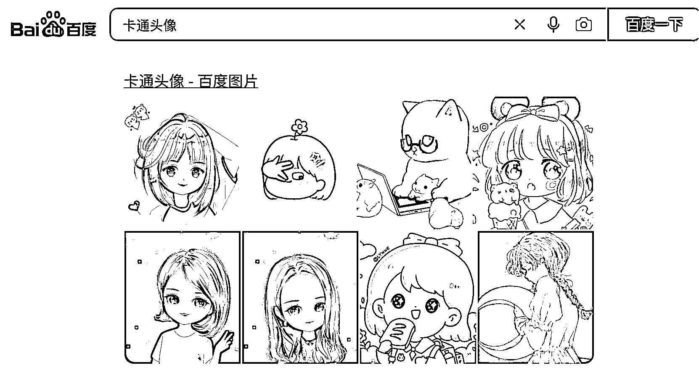  <ne-h3 id="e2341e81" data-lake-id="e2341e81"><ne-heading-ext><ne-heading-anchor></ne-heading-anchor><ne-heading-fold></ne-heading-fold></ne-heading-ext><ne-heading-content><ne-text id="ude6e0ba6">⑵名字</ne-text></ne-heading-content></ne-h3> <ne-p id="uaf5b26f3" data-lake-id="uaf5b26f3"><ne-text id="u7dce9503">名字建议设置：昵称+领域。假设你做公考资料，名字就可以设置为：琳琳公考资源。假设你做 ppt 资源，名字可以叫娟姐 ppt 资源等等。</ne-text></ne-p> <ne-h3 id="90da55ea" data-lake-id="90da55ea"><ne-heading-ext><ne-heading-anchor></ne-heading-anchor><ne-heading-fold></ne-heading-fold></ne-heading-ext><ne-heading-content><ne-text id="u5ebf2e8c">⑶简介</ne-text></ne-heading-content></ne-h3> <ne-p id="u95170f8b" data-lake-id="u95170f8b"><ne-text id="u7e456f6d">简介可以参考同行，设置 3-4 行就可以</ne-text></ne-p> <ne-p id="udda9b559" data-lake-id="udda9b559"><ne-text id="ub1a196c2">内容中有一句万能语分享给你：“所有内容均有电子版/完整版”</ne-text></ne-p> <ne-p id="uf94156ca" data-lake-id="uf94156ca"><ne-text id="u4dfae1d8">这句话的目的，是通过暗示的手法，告诉客户：我的资料很多，你看的只是一部分，想要完整的来私信我。</ne-text></ne-p> <ne-p id="u9c2e4b32" data-lake-id="u9c2e4b32"><ne-card data-card-name="image" data-card-type="inline" id="hHcGz" data-event-boundary="card">  <ne-p id="u402bd1d5" data-lake-id="u402bd1d5"><ne-text id="ubd5f6cd9">其他的生日、地区、职业随意填写，并不重要。</ne-text></ne-p> <ne-h2 id="51d96da4" data-lake-id="51d96da4"><ne-heading-ext><ne-heading-anchor></ne-heading-anchor><ne-heading-fold></ne-heading-fold></ne-heading-ext><ne-heading-content><ne-text id="udceb3921">4、微信注册与养号</ne-text></ne-heading-content></ne-h2> <ne-p id="u25efd9f5" data-lake-id="u25efd9f5"><ne-text id="u172f6103">接下来说下微信养号的细节，因为在实操中会频繁用到微信收款，所以一个无风控的微信很关键。当然，持续用微信收款会收到风控，建议使用小鹅通、快团团、支付宝等多个渠道收。</ne-text></ne-p> <ne-p id="u9c03ce38" data-lake-id="u9c03ce38"><ne-text id="uc41f5983">具体微信注册方法就不说了，注册完成后完成实明认证和银行 ka 绑定，目前一个人可以实明 5 个微信。</ne-text></ne-p> <ne-p id="u9fa4a693" data-lake-id="u9fa4a693"><ne-text id="uf0e8a658">细节：</ne-text></ne-p> <ne-oli><ne-oli-i>1</ne-oli-i><ne-oli-c class="ne-oli-content" id="uedb6067a" data-lake-id="uedb6067a"><ne-text id="u44b2d1eb">手机号码不要选择：170、171 这些虚拟号段，选择正常手机实卡号段</ne-text></ne-oli-c></ne-oli> <ne-oli><ne-oli-i>2</ne-oli-i><ne-oli-c class="ne-oli-content" id="uc2f20199" data-lake-id="uc2f20199"><ne-text id="u49dca96b">手机卡一定要实明卡，选择大流量套餐，不建议使用 WiFi，多用流量</ne-text></ne-oli-c></ne-oli> <ne-oli><ne-oli-i>3</ne-oli-i><ne-oli-c class="ne-oli-content" id="u195806d6" data-lake-id="u195806d6"><ne-text id="uec884889">一机一卡一号</ne-text></ne-oli-c></ne-oli> <ne-oli><ne-oli-i>4</ne-oli-i><ne-oli-c class="ne-oli-content" id="ud997e9fe" data-lake-id="ud997e9fe"><ne-text id="u94334b58">注册不要用 WiFi，使用流量</ne-text></ne-oli-c></ne-oli> <ne-h3 id="f5d722af" data-lake-id="f5d722af"><ne-heading-ext><ne-heading-anchor></ne-heading-anchor><ne-heading-fold></ne-heading-fold></ne-heading-ext><ne-heading-content><ne-text id="u4b001c1d">⑴基本信息设置</ne-text></ne-heading-content></ne-h3> <ne-p id="ud4dfc7fb" data-lake-id="ud4dfc7fb"><ne-text id="u12bb5bb0">头像设置有 3 种方式：真人出镜、淘宝手绘、卡通头像</ne-text></ne-p> <ne-p id="u3ad2ab8b" data-lake-id="u3ad2ab8b"><ne-text id="ua171aa08">名字：常见的名字是昵称+业务。比如：杨杨｜小学资料、桃子｜幼师资料等</ne-text></ne-p> <ne-p id="ubd0cd60b" data-lake-id="ubd0cd60b"><ne-text id="u3a15b0ca">签名有 3 种选择：展示核心价值、新客户引导、传递价值观</ne-text></ne-p> <ne-p id="u043b9c7d" data-lake-id="u043b9c7d"><ne-card data-card-name="image" data-card-type="inline" id="f1DHc" data-event-boundary="card">  <ne-p id="ucffcae38" data-lake-id="ucffcae38"><ne-card data-card-name="image" data-card-type="inline" id="qklxs" data-event-boundary="card">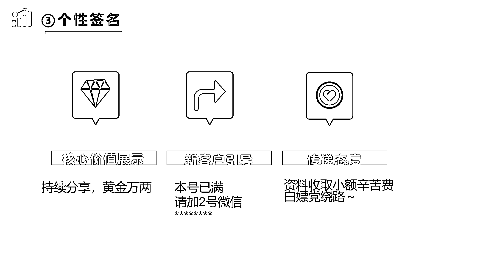  <ne-h3 id="fbb3d730" data-lake-id="fbb3d730"><ne-heading-ext><ne-heading-anchor></ne-heading-anchor><ne-heading-fold></ne-heading-fold></ne-heading-ext><ne-heading-content><ne-text id="u03f71000">⑵养号细节</ne-text></ne-heading-content></ne-h3> <ne-p id="uc73559a1" data-lake-id="uc73559a1"><ne-text id="u501ebe54">微信号是私域从业者最大的资产。</ne-text></ne-p> <ne-p id="ud6d8d61f" data-lake-id="ud6d8d61f"><ne-text id="u144c2e16">刚注册的微信权重比较低，如果频繁加人，很容易被限制，所以我们需要用 1-2 周来养号，具体养号方式，我整理了“7 做 5 不做”</ne-text></ne-p> <ne-p id="u8e40d1f0" data-lake-id="u8e40d1f0"><ne-text id="uea213234">7 做：</ne-text></ne-p> <ne-oli><ne-oli-i>1</ne-oli-i><ne-oli-c class="ne-oli-content" id="ue48ec9ad" data-lake-id="ue48ec9ad"><ne-text id="u0a45e9ef">完整填写资料</ne-text></ne-oli-c></ne-oli> <ne-oli><ne-oli-i>2</ne-oli-i><ne-oli-c class="ne-oli-content" id="u0a162974" data-lake-id="u0a162974"><ne-text id="ua3f52c77">跟老号/朋友/微信群聊天</ne-text></ne-oli-c></ne-oli> <ne-oli><ne-oli-i>3</ne-oli-i><ne-oli-c class="ne-oli-content" id="uaefa8f2c" data-lake-id="uaefa8f2c"><ne-text id="ucca67e0c">平均三天 1 条原创朋友圈（生活、随笔、感想等等）</ne-text></ne-oli-c></ne-oli> <ne-oli><ne-oli-i>4</ne-oli-i><ne-oli-c class="ne-oli-content" id="uf07710f1" data-lake-id="uf07710f1"><ne-text id="uafbf1837">公众号文章·阅读、点赞、评论、转发</ne-text></ne-oli-c></ne-oli> <ne-oli><ne-oli-i>5</ne-oli-i><ne-oli-c class="ne-oli-content" id="ubd5ce1d2" data-lake-id="ubd5ce1d2"><ne-text id="uaa266334">绑定银行卡，适当收发红包购物</ne-text></ne-oli-c></ne-oli> <ne-oli><ne-oli-i>6</ne-oli-i><ne-oli-c class="ne-oli-content" id="u3122bac1" data-lake-id="u3122bac1"><ne-text id="ue7de636c">开启定位，多带微信出去转转</ne-text></ne-oli-c></ne-oli> <ne-oli><ne-oli-i>7</ne-oli-i><ne-oli-c class="ne-oli-content" id="ufce97887" data-lake-id="ufce97887"><ne-text id="u187fc00f">多使用微信功能（视频号、搜一搜、看一看、直播、购物、游戏、小程序、手机充值、生活缴费、腾讯公益、医疗健康、火车票机票、滴滴出行、酒店）</ne-text></ne-oli-c></ne-oli> <ne-p id="u890290a0" data-lake-id="u890290a0"><ne-text id="u78726e66">5 不做：</ne-text></ne-p> <ne-oli><ne-oli-i>1</ne-oli-i><ne-oli-c class="ne-oli-content" id="ue9eb0c08" data-lake-id="ue9eb0c08"><ne-text id="u78d28d03">不能使用第三方软件</ne-text></ne-oli-c></ne-oli> <ne-oli><ne-oli-i>2</ne-oli-i><ne-oli-c class="ne-oli-content" id="u22a92167" data-lake-id="u22a92167"><ne-text id="uc5508650">不做任何的营销操作</ne-text></ne-oli-c></ne-oli> <ne-oli><ne-oli-i>3</ne-oli-i><ne-oli-c class="ne-oli-content" id="u4cf64a35" data-lake-id="u4cf64a35"><ne-text id="u3a0404be">多设备不要来回切换</ne-text></ne-oli-c></ne-oli> <ne-oli><ne-oli-i>4</ne-oli-i><ne-oli-c class="ne-oli-content" id="ued9336f8" data-lake-id="ued9336f8"><ne-text id="uc526f2ee">聊天不发违法违禁词</ne-text></ne-oli-c></ne-oli> <ne-oli><ne-oli-i>5</ne-oli-i><ne-oli-c class="ne-oli-content" id="u0a9fc8fe" data-lake-id="u0a9fc8fe"><ne-text id="u0f31c6d7">养号期不要大量加人</ne-text></ne-oli-c></ne-oli> <ne-p id="u712c63c4" data-lake-id="u712c63c4"><ne-text id="u4cf0ccfa">关于快速养号，给你分享一个独家小妙招，带着手机去菜市场买菜（不是超市），你买不同的菜就可以扫不同的二维码支付，同时避免了微信放在一个地方不动弹，权重上涨很快。</ne-text></ne-p> <ne-hole id="ub13188f7" data-lake-id="ub13188f7"><ne-card data-card-name="hr" data-card-type="block" id="aGQFP" data-event-boundary="card"><ne-h1 id="9ccab03a" data-lake-id="9ccab03a"><ne-heading-ext><ne-heading-anchor></ne-heading-anchor><ne-heading-fold></ne-heading-fold></ne-heading-ext><ne-heading-content><ne-text id="u5238c4d5">四、内容获取</ne-text></ne-heading-content></ne-h1> <ne-p id="u6478b7b9" data-lake-id="u6478b7b9"><ne-text id="u20f905a8">小红书资料号前两层变现模式就是卖资料、卖会员。既然要卖，你肯定要准备好货源和渠道，那具体从哪里获取资源呢？九京提供两种方法：</ne-text></ne-p> <ne-h2 id="a6c0913c" data-lake-id="a6c0913c"><ne-heading-ext><ne-heading-anchor></ne-heading-anchor><ne-heading-fold></ne-heading-fold></ne-heading-ext><ne-heading-content><ne-text id="u1b976d52">1、找同行购买</ne-text></ne-heading-content></ne-h2> <ne-p id="ub0ad4d15" data-lake-id="ub0ad4d15"><ne-text id="u3bfd9eda">在小红书平台找到同行之后，最简单的方式就是直接买同行的资料，然后拿过来复制，价格一般在几十块钱不等，我们做的小学和幼师资源没有版权，如果你做的是其他领域，要注意这个问题。</ne-text></ne-p> <ne-h2 id="fe2d99cb" data-lake-id="fe2d99cb"><ne-heading-ext><ne-heading-anchor></ne-heading-anchor><ne-heading-fold></ne-heading-fold></ne-heading-ext><ne-heading-content><ne-text id="ue657ea0d">2、淘宝拼多多购买</ne-text></ne-heading-content></ne-h2> <ne-p id="u4fbb4ffd" data-lake-id="u4fbb4ffd"><ne-text id="uf17948a3">除了找同行购买之后，还可以直接在淘宝和拼多多搜索，买过来放在自己的百度网盘就可以了，如果资料太多放不下可以考虑开超级会员</ne-text></ne-p> <ne-p id="ucafc9d4e" data-lake-id="ucafc9d4e"><ne-card data-card-name="image" data-card-type="inline" id="Y3DPB" data-event-boundary="card">  <ne-hole id="u8109bd7a" data-lake-id="u8109bd7a"><ne-card data-card-name="hr" data-card-type="block" id="Gjljo" data-event-boundary="card"><ne-h1 id="606f9e01" data-lake-id="606f9e01"><ne-heading-ext><ne-heading-anchor></ne-heading-anchor><ne-heading-fold></ne-heading-fold></ne-heading-ext><ne-heading-content><ne-text id="uf5f1f450">五、图文制作</ne-text></ne-heading-content></ne-h1> <ne-p id="u834cc0fb" data-lake-id="u834cc0fb"><ne-text id="u8d4ba4b6">小红书的内容有两种形式，视频和图文，因为视频容易查重，制作较为繁琐且对新手不友好，所以我们重点做的是图文。具体制作的方法也比较多，比如：ppt、ps、美图秀秀、黄油相机、创客贴等等。关于软件的具体操作就不写了，这都比较基础。</ne-text></ne-p> <ne-h2 id="8e700a40" data-lake-id="8e700a40"><ne-heading-ext><ne-heading-anchor></ne-heading-anchor><ne-heading-fold></ne-heading-fold></ne-heading-ext><ne-heading-content><ne-text id="u3944c0e6">1、引流类</ne-text></ne-heading-content></ne-h2> <ne-p id="u84c9fcaa" data-lake-id="u84c9fcaa"><ne-text id="u31acdaad">引流类内容是最核心的部分，因为我们运营小红书的目的就是为了引流到微信，对不对？所以采用发一半留一半的方式，暗示手法告诉客户：这只是一部分。想要完整版，加我微信。注意是暗示，不是明示。</ne-text></ne-p> <ne-p id="u6c162780" data-lake-id="u6c162780"><ne-text id="ucdf93f59">看一下常见的形式：</ne-text></ne-p> <ne-p id="u859f7d96" data-lake-id="u859f7d96"><ne-card data-card-name="image" data-card-type="inline" id="NeVYf" data-event-boundary="card"><ne-card data-card-name="image" data-card-type="inline" id="mSj7r" data-event-boundary="card">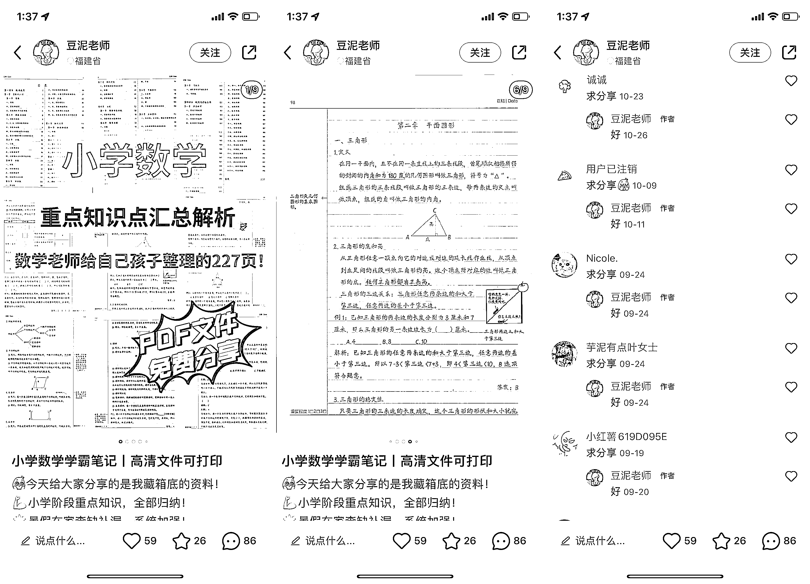  <ne-p id="u8e3b2ebc" data-lake-id="u8e3b2ebc"><ne-text id="u36902caa">注意看截图中，露出百度网盘截图、pdf 完整版文件，引导客户私信评论获取，这是小红书资料号引流最常见的形式。</ne-text></ne-p> <ne-h2 id="8d520398" data-lake-id="8d520398"><ne-heading-ext><ne-heading-anchor></ne-heading-anchor><ne-heading-fold></ne-heading-fold></ne-heading-ext><ne-heading-content><ne-text id="u0f68c080">2、干货类</ne-text></ne-heading-content></ne-h2> <ne-p id="uf8bf2a1c" data-lake-id="uf8bf2a1c"><ne-text id="u72777a26">干货类内容，其实对于我们引流没有太大帮助，因为用户只会点赞收藏，并不会来私信你，那为什么还要发呢？核心原因是每个人都有收藏的底层心理需求，看到好东西就想要，尽管拿回去也不看。</ne-text></ne-p> <ne-p id="u09f9d18e" data-lake-id="u09f9d18e"><ne-text id="u58beacb0">通过发布干货类内容，可以在短时间增加账号的“获赞和收藏”，提高账号的权威感和权重。</ne-text></ne-p> <ne-p id="ufb57cd51" data-lake-id="ufb57cd51"><ne-card data-card-name="image" data-card-type="inline" id="jJ6pK" data-event-boundary="card">  <ne-hole id="ud3687bce" data-lake-id="ud3687bce"><ne-card data-card-name="hr" data-card-type="block" id="dPZQM" data-event-boundary="card"><ne-h1 id="bc7ab921" data-lake-id="bc7ab921"><ne-heading-ext><ne-heading-anchor></ne-heading-anchor><ne-heading-fold></ne-heading-fold></ne-heading-ext><ne-heading-content><ne-text id="u9472d36b">六、上传分发</ne-text></ne-heading-content></ne-h1> <ne-h2 id="9039450f-6" data-lake-id="9039450f-6"><ne-heading-ext><ne-heading-anchor></ne-heading-anchor><ne-heading-fold></ne-heading-fold></ne-heading-ext> <ne-heading-content></ne-heading-content></ne-h2> <ne-h2 id="93c85204" data-lake-id="93c85204"><ne-heading-ext><ne-heading-anchor></ne-heading-anchor><ne-heading-fold></ne-heading-fold></ne-heading-ext><ne-heading-content><ne-text id="u0f07dd88">1、发布时间</ne-text></ne-heading-content></ne-h2> <ne-p id="u6e17f945" data-lake-id="u6e17f945"><ne-text id="u2354f6f3">具体的发布时间，可以定在上午 12:00~1:00，下午 5:00~7:00，晚上 8:00~10:00，这都是潜在客户刷小红书的时间，按照正确的时间发布，内容上热门的概率会提高。</ne-text></ne-p> <ne-h2 id="0e6e2a28" data-lake-id="0e6e2a28"><ne-heading-ext><ne-heading-anchor></ne-heading-anchor><ne-heading-fold></ne-heading-fold></ne-heading-ext><ne-heading-content><ne-text id="u6a7b0871">2、发布数量</ne-text></ne-heading-content></ne-h2> <ne-p id="u238c4ab6" data-lake-id="u238c4ab6"><ne-text id="u04220312">那每个账号每天发几条呢？我个人建议是两条，最多不超 3 条，如果超过 3 条有可能会被判断为营销号，影响整体的权重，如果发布一条又会浪费很多流量。</ne-text></ne-p> <ne-h2 id="c9698d04" data-lake-id="c9698d04"><ne-heading-ext><ne-heading-anchor></ne-heading-anchor><ne-heading-fold></ne-heading-fold></ne-heading-ext><ne-heading-content><ne-text id="udcb94dd1">3、发布细节</ne-text></ne-heading-content></ne-h2> <ne-p id="uce1a9755" data-lake-id="uce1a9755"><ne-text id="u2dfe4d6d">下面看一下发布过程中的具体细节。</ne-text></ne-p> <ne-p id="uacae1939" data-lake-id="uacae1939"><ne-text id="uf4c9915c">首先看标题，我找了几个幼师领域的案例，你可以作为参考：</ne-text></ne-p> <ne-h3 id="7e01a2b9" data-lake-id="7e01a2b9"><ne-heading-ext><ne-heading-anchor></ne-heading-anchor><ne-heading-fold></ne-heading-fold></ne-heading-ext><ne-heading-content><ne-text id="u10a1201e">⑴标题</ne-text></ne-heading-content></ne-h3> <ne-quote id="ubaacd4be" data-lake-id="ubaacd4be"><ne-h3 id="4a2a4db9" data-lake-id="4a2a4db9"><ne-heading-ext><ne-heading-anchor></ne-heading-anchor><ne-heading-fold></ne-heading-fold></ne-heading-ext><ne-heading-content><ne-text id="uad1d6cde">⑵正文</ne-text></ne-heading-content></ne-h3> <ne-p id="u9927d10c" data-lake-id="u9927d10c"><ne-text id="u9f034741">正文一般包括：活动目标、活动准备、活动过程、活动重点和难点。具体的内容在幼师资料里面教案中都有，直接复制粘贴拿过来就好</ne-text></ne-p> <ne-p id="ud9be41f6" data-lake-id="ud9be41f6"><ne-card data-card-name="image" data-card-type="inline" id="Yl5Jf" data-event-boundary="card">  <ne-h3 id="0d6821b5" data-lake-id="0d6821b5"><ne-heading-ext><ne-heading-anchor></ne-heading-anchor><ne-heading-fold></ne-heading-fold></ne-heading-ext><ne-heading-content><ne-text id="u5484313d">⑶标签</ne-text></ne-heading-content></ne-h3> <ne-p id="ued36be22" data-lake-id="ued36be22"><ne-text id="uf9c94745">我整理了一些常用标签，同样直接送给你：</ne-text></ne-p> <ne-quote id="uc97373fe" data-lake-id="uc97373fe"><ne-p id="u7f28d458" data-lake-id="u7f28d458"><ne-text id="ue87ac546">其实这些内容都很简单，最好的方法就是对标同行，根据你所做的领域，寻找适合的同行对标。</ne-text></ne-p> <ne-hole id="u9f64aaa6" data-lake-id="u9f64aaa6"><ne-card data-card-name="hr" data-card-type="block" id="uoLGN" data-event-boundary="card"><ne-h1 id="c88c3f9c" data-lake-id="c88c3f9c"><ne-heading-ext><ne-heading-anchor></ne-heading-anchor><ne-heading-fold></ne-heading-fold></ne-heading-ext><ne-heading-content><ne-text id="u33e91015">七、获客策略</ne-text></ne-heading-content></ne-h1> <ne-h2 id="490b5d49" data-lake-id="490b5d49"><ne-heading-ext><ne-heading-anchor></ne-heading-anchor><ne-heading-fold></ne-heading-fold></ne-heading-ext><ne-heading-content><ne-text id="u2351401f">1、公域流量和私域流量</ne-text></ne-heading-content></ne-h2> <ne-p id="ue33eff3f" data-lake-id="ue33eff3f"><ne-text id="u344588a5">公域流量是指通过入驻各大平台获取的用户关注，比如：抖音、知乎、小红书、豆瓣、微博、贴吧、b 站等等，而私域流量是指沉淀在个人微信渠道的、可以实现一对一精准运营的流量。</ne-text></ne-p> <ne-p id="u25812399" data-lake-id="u25812399"><ne-text id="ue3b99b04">那公域和私域有什么区别呢？</ne-text></ne-p> <ne-p id="uee45dee3" data-lake-id="uee45dee3"><ne-text id="ud4e9d624">核心区别是：公域流量属于平台；私域流量属于自己。小红书大 v 的流量本质上属于平台，可以给你曝光，也可以不给你曝光，所以我们整套商业模式的目的只有一个：把所有公域平台的流量导入微信私域。</ne-text></ne-p> <ne-p id="uc05432cd" data-lake-id="uc05432cd"><ne-card data-card-name="image" data-card-type="inline" id="JyxYx" data-event-boundary="card">  <ne-h2 id="f9c11cec" data-lake-id="f9c11cec"><ne-heading-ext><ne-heading-anchor></ne-heading-anchor><ne-heading-fold></ne-heading-fold></ne-heading-ext><ne-heading-content><ne-text id="u9b179aa7">2、如何选择流量平台？</ne-text></ne-heading-content></ne-h2> <ne-p id="u290cd8ac" data-lake-id="u290cd8ac"><ne-text id="u713de3fb">互联网公域流量平台很多，如何判断重点操作哪个平台呢？经过长期实战，我总结了四个核心关键点：</ne-text><ne-text id="uf13f54ae" ne-bold="true">流量精准度、对手竞争度、内容生产难度、平台容忍度。</ne-text></ne-p> <ne-p id="udbdeb64e" data-lake-id="udbdeb64e"><ne-text id="u7fe7fc8a">流量精准度，是指平台上有没有匹配的潜在客户。比如你会去天涯发布小学资料干货引流家长粉吗？你会去虎扑发布幼儿园公开课引流幼师群体吗？可能上面也有潜在客户，但是付出同样的成本，小红书的回报一定大于天涯和虎扑。</ne-text><ne-text id="u2c3d97f7" style="color: rgb(223, 42, 63);">钓鱼的核心法则，就是去有鱼的地方钓鱼。</ne-text></ne-p> <ne-p id="u084d5798" data-lake-id="u084d5798"><ne-text id="u553e8036">对手竞争度，是指平台上有没有现存的竞争对手。如果一个平台上没有竞争对手，那我觉得这个平台不值得入手，如果你非要做，要么成为先驱，要么成为先烈。多段创业过程中，我认为同行是最好的伙伴，有竞争的地方才会有市场。</ne-text></ne-p> <ne-p id="u162265aa" data-lake-id="u162265aa"><ne-text id="u725fb709">内容生产难度。内容引流的本质是通过发布内容获取精准客户，考核的是内容生产的效率和成本，如果无法用低成本、高效率的方式完成内容生产，那么引流难度会非常大。比如抖音知识 IP，为什么成才率非常低，核心原因就是内容成本问题。</ne-text></ne-p> <ne-p id="u07de89c3" data-lake-id="u07de89c3"><ne-text id="u0c2e44d1">平台容忍度。每个平台成立初期，都需要大量内容生产者贡献内容，建设社区，所以都会有一定的规则弱化和引流容忍度。但是随着同质内容的饱和，平台对于引流的管控也会越来越严格。</ne-text></ne-p> <ne-h2 id="cd334484" data-lake-id="cd334484"><ne-heading-ext><ne-heading-anchor></ne-heading-anchor><ne-heading-fold></ne-heading-fold></ne-heading-ext><ne-heading-content><ne-text id="uc7100dfb">3、10 种引流方法</ne-text></ne-heading-content></ne-h2> <ne-p id="uebfd7c45" data-lake-id="uebfd7c45"><ne-text id="ua6ce1e1d">正常情况下，我们发完内容之后，会有人在评论区发送“求分享”之类的，而我们的目标是把他们引流到微信上，那具体要怎么操作呢？</ne-text></ne-p> <ne-p id="u42f42640" data-lake-id="u42f42640"><ne-text id="u07379b73">下面分享 10 种引流方法，帮你顺利通过小红书平台获取精准客户。</ne-text></ne-p> <ne-p id="u56cbf611" data-lake-id="u56cbf611"><ne-text id="ufafe90f2">讲策略之前，首先明确一点：</ne-text><ne-text id="u7444eebf" ne-bold="true">没有 100%安全的引流方法。</ne-text></ne-p> <ne-p id="uf3d9c63d" data-lake-id="uf3d9c63d"><ne-text id="ua3bd4bd1">从平台的角度出发，小红书也不希望自己的流量被导微信，所以任何形式的导流/引流行为，都不被平台鼓励。</ne-text></ne-p> <ne-p id="u53c21d41" data-lake-id="u53c21d41"><ne-text id="u6d67bbaa">对于账号的安全性，保持平常心态就好。把账号直接作为消耗品，没了就换，没什么大不了，我们当年做闲鱼流量，封了几百上千个账号，封了就总结经验，最后高峰期一天能做上万粉。</ne-text></ne-p> <ne-h3 id="8bf2f3a1" data-lake-id="8bf2f3a1"><ne-heading-ext><ne-heading-anchor></ne-heading-anchor><ne-heading-fold></ne-heading-fold></ne-heading-ext><ne-heading-content><ne-text id="u6ad648b9">①小红书号引流</ne-text></ne-heading-content></ne-h3> <ne-p id="u787bb431" data-lake-id="u787bb431"><ne-text id="u5d0b795b">小红书号引流是指直接把小红书号设置为微信号，当潜在客户私信你的时候，你就可以说：茄我小红书号。</ne-text></ne-p> <ne-p id="u5c92dec0" data-lake-id="u5c92dec0"><ne-card data-card-name="image" data-card-type="inline" id="s5Un0" data-event-boundary="card">  <ne-h3 id="ad3d7f04" data-lake-id="ad3d7f04"><ne-heading-ext><ne-heading-anchor></ne-heading-anchor><ne-heading-fold></ne-heading-fold></ne-heading-ext><ne-heading-content><ne-text id="ud13f4671">②邮箱号引流</ne-text></ne-heading-content></ne-h3> <ne-p id="u9323a256" data-lake-id="u9323a256"><ne-text id="u9bcb4971">这种方式有两种操作方法，第一种是在邮箱中设置自动回复，当有人给你发邮件，直接自动回复发话术引导加微信，不过路径比较长；第二种方法是留 qq，然后把 qq 绑定微信。</ne-text></ne-p> <ne-p id="u2432e0f6" data-lake-id="u2432e0f6"><ne-card data-card-name="image" data-card-type="inline" id="apjaT" data-event-boundary="card"> <ne-text id="u3d532de2"><ne-h3 id="bdf1ce03" data-lake-id="bdf1ce03"><ne-heading-ext><ne-heading-anchor></ne-heading-anchor><ne-heading-fold></ne-heading-fold></ne-heading-ext><ne-heading-content><ne-text id="u49028e62">③全网同名引流</ne-text></ne-heading-content></ne-h3> <ne-p id="u4a537f74" data-lake-id="u4a537f74"><ne-text id="u4270c89c">这种方法适合于后期做大之后使用，比如知乎、抖音、微博等多渠道矩阵化操作。潜在客户可以去其他平台找你</ne-text></ne-p> <ne-h3 id="d4bd6cc2" data-lake-id="d4bd6cc2"><ne-heading-ext><ne-heading-anchor></ne-heading-anchor><ne-heading-fold></ne-heading-fold></ne-heading-ext><ne-heading-content><ne-text id="u9dbf08f1">④简介艾特小号引流</ne-text></ne-heading-content></ne-h3> <ne-p id="u3b0d2494" data-lake-id="u3b0d2494"><ne-text id="u2e800b50">首先用小号直接发引流信息，直接大号在简介中艾特小号，引导潜在客户关注小号，进而添加微信。</ne-text></ne-p> <ne-p id="uef2cabab" data-lake-id="uef2cabab"><ne-card data-card-name="image" data-card-type="inline" id="lhqOb" data-event-boundary="card">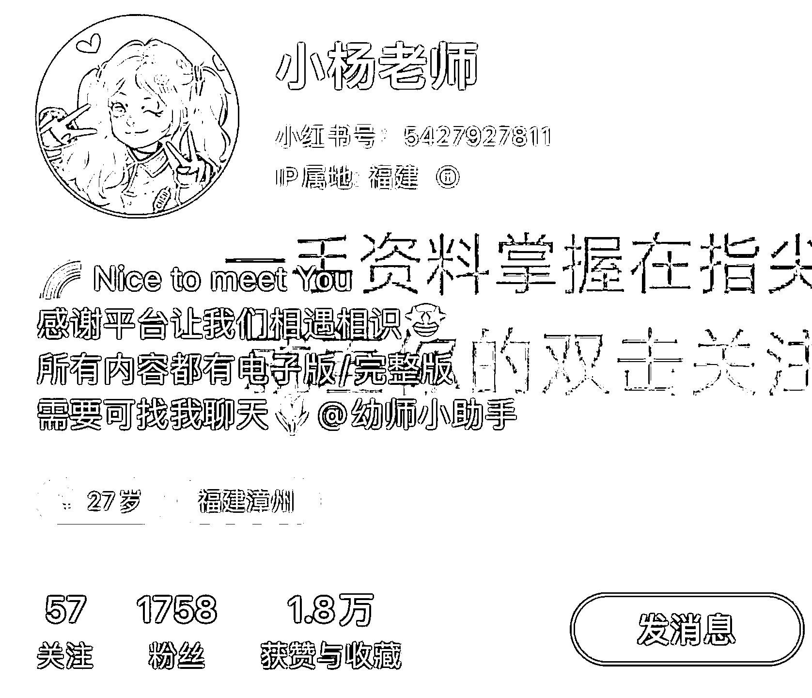  <ne-h3 id="9e629c31" data-lake-id="9e629c31"><ne-heading-ext><ne-heading-anchor></ne-heading-anchor><ne-heading-fold></ne-heading-fold></ne-heading-ext><ne-heading-content><ne-text id="u16124bf6">⑤瞬间引流</ne-text></ne-heading-content></ne-h3> <ne-p id="u7fc6a515" data-lake-id="u7fc6a515"><ne-text id="u146bf75d">瞬间引流是把微信号拆分，然后通过打卡的形式引导客户添加微信。当然，不建议新账号这样操作，容易被平台风控。</ne-text></ne-p> <ne-p id="u3d0acb6a" data-lake-id="u3d0acb6a"><ne-card data-card-name="image" data-card-type="inline" id="CEvXf" data-event-boundary="card">  <ne-h3 id="94862cf5" data-lake-id="94862cf5"><ne-heading-ext><ne-heading-anchor></ne-heading-anchor><ne-heading-fold></ne-heading-fold></ne-heading-ext><ne-heading-content><ne-text id="u87b96f71">⑥评论区小号互动</ne-text></ne-heading-content></ne-h3> <ne-p id="uea24f91f" data-lake-id="uea24f91f"><ne-text id="ude60bfb9">评论区小号互动，是指当有潜在客户在评论区回复“想要”、“求分享”这样字眼时，通过小号引导他私信或者添加微信。这种方法有比较大的封号风险，需要多准备小号。</ne-text></ne-p> <ne-p id="u3b16aa30" data-lake-id="u3b16aa30"><ne-card data-card-name="image" data-card-type="inline" id="EGeqP" data-event-boundary="card">  <ne-h3 id="e0791c94" data-lake-id="e0791c94"><ne-heading-ext><ne-heading-anchor></ne-heading-anchor><ne-heading-fold></ne-heading-fold></ne-heading-ext><ne-heading-content><ne-text id="uc561d1e6">⑦钩子引流</ne-text></ne-heading-content></ne-h3> <ne-p id="ua5594294" data-lake-id="ua5594294"><ne-text id="u904364c6">钩子引流法，是指通过发布秘诀、绝招、干货、文档、集合等形式的内容，暗示的手法告诉客户我有“好东西”，想要这个好东西，你来私信我。</ne-text></ne-p> <ne-p id="u5305225b" data-lake-id="u5305225b"><ne-card data-card-name="image" data-card-type="inline" id="V8HCU" data-event-boundary="card">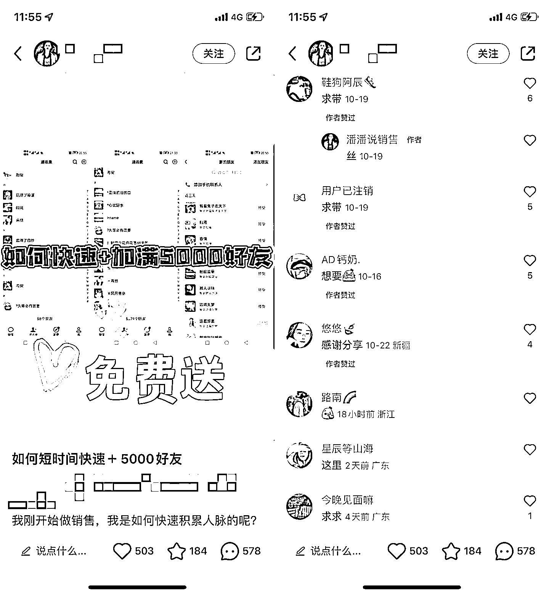  <ne-h3 id="f3fdc799" data-lake-id="f3fdc799"><ne-heading-ext><ne-heading-anchor></ne-heading-anchor><ne-heading-fold></ne-heading-fold></ne-heading-ext><ne-heading-content><ne-text id="ub0800f23">⑧私信引流</ne-text></ne-heading-content></ne-h3> <ne-p id="ub5791a73" data-lake-id="ub5791a73"><ne-text id="u6ac35909">私信引流是指引导客户后台私信，当客户私信时，发送引流话术。比如：领取完整版，+\/ 123456</ne-text></ne-p> <ne-p id="ue0c9db3a" data-lake-id="ue0c9db3a"><ne-text id="u1987f3f5">这种方法需要规避敏感词，采用谐音的方式，常见的敏感词：加、私信、私聊、微信、公众号等。</ne-text></ne-p> <ne-h3 id="f64da82b" data-lake-id="f64da82b"><ne-heading-ext><ne-heading-anchor></ne-heading-anchor><ne-heading-fold></ne-heading-fold></ne-heading-ext><ne-heading-content><ne-text id="ucfd58b8d">⑨群聊引流</ne-text></ne-heading-content></ne-h3> <ne-p id="u43f57c13" data-lake-id="u43f57c13"><ne-text id="u963ef68e">群聊引流相对比较宽松，直接留微信的容忍度大。具体如何建群呢？进入小红书后，点击选择“消息”、然后点击“开启聊天”、“创建群聊”就可以了。</ne-text></ne-p> <ne-p id="u7eb1b8e5" data-lake-id="u7eb1b8e5"><ne-card data-card-name="image" data-card-type="inline" id="djWk8" data-event-boundary="card">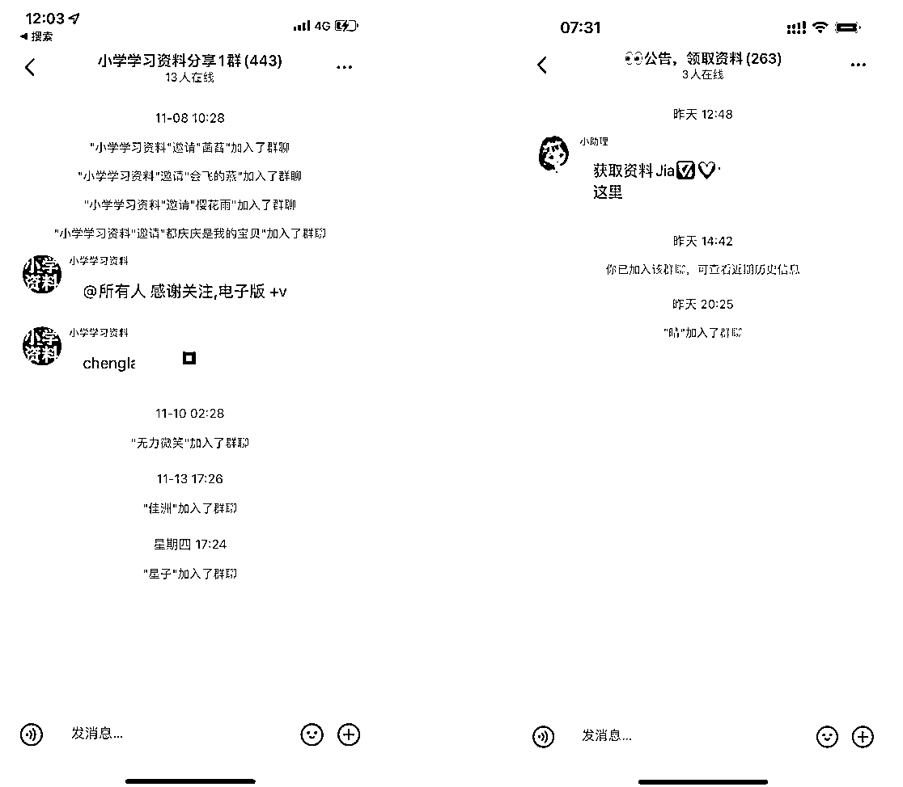<ne-card data-card-name="image" data-card-type="inline" id="zHWfs" data-event-boundary="card">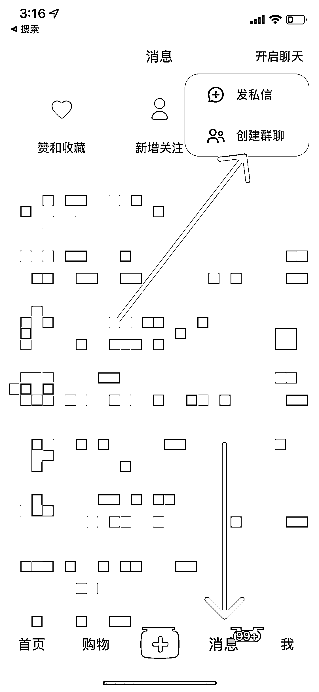  <ne-h3 id="a24d3e55" data-lake-id="a24d3e55"><ne-heading-ext><ne-heading-anchor></ne-heading-anchor><ne-heading-fold></ne-heading-fold></ne-heading-ext><ne-heading-content><ne-text id="u4ebe7261">⑩收藏夹引流</ne-text></ne-heading-content></ne-h3> <ne-p id="ucef3f8d7" data-lake-id="ucef3f8d7"><ne-text id="u5a4a1662">收藏夹引流，是指大号通过收藏小号发布的广告帖，达到引流的目的。当有客户私信时，你可以说“看我收藏”</ne-text></ne-p> <ne-p id="u4035fea5" data-lake-id="u4035fea5"><ne-card data-card-name="image" data-card-type="inline" id="P6A6V" data-event-boundary="card">  <ne-p id="ueaa293e6" data-lake-id="ueaa293e6"><ne-text id="u0f2029b3">以上 10 种方法，可以单独使用，也可以组合灵活使用，对于新手比较推荐的方法是：1、4、7、8、9、10</ne-text></ne-p> <ne-hole id="ud6f36fee" data-lake-id="ud6f36fee"><ne-card data-card-name="hr" data-card-type="block" id="HZMxe" data-event-boundary="card"><ne-h1 id="df869fba" data-lake-id="df869fba"><ne-heading-ext><ne-heading-anchor></ne-heading-anchor><ne-heading-fold></ne-heading-fold></ne-heading-ext><ne-heading-content><ne-text id="uc1d6cc1d">八、转化成交</ne-text></ne-heading-content></ne-h1> <ne-p id="u06bd0570" data-lake-id="u06bd0570"><ne-text id="u4eec85c9" style="color: rgb(73, 73, 73);">获取到精准客户，下一步就是通过私域成交转化，真正把流量变成钱。</ne-text></ne-p> <ne-p id="u04e03dda" data-lake-id="u04e03dda"><ne-card data-card-name="image" data-card-type="inline" id="F1s76" data-event-boundary="card">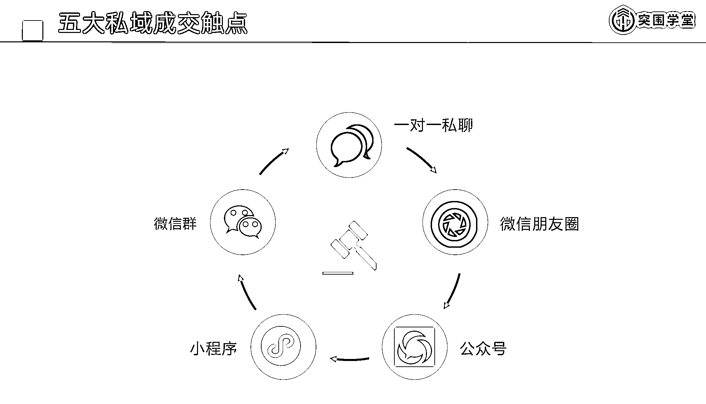  <ne-p id="ua054430a" data-lake-id="ua054430a"><ne-text id="u0ff526e5" style="color: rgb(73, 73, 73);">私域成交的场景就是微信，所以微信的每一个触点，都是成交机会。包括：一对一私聊、微信朋友圈、公众号、视频号、直播、微信群等，因为这个玩法太过于简单，也根本用不了这么大的系统，有点高射炮打蚊子。</ne-text></ne-p> <ne-p id="ud6b52c09" data-lake-id="ud6b52c09"><ne-text id="ud1472719" style="color: rgb(73, 73, 73);">所以我们只讲一对一私聊极限成交。</ne-text></ne-p> <ne-h2 id="613917ad" data-lake-id="613917ad"><ne-heading-ext><ne-heading-anchor></ne-heading-anchor><ne-heading-fold></ne-heading-fold></ne-heading-ext><ne-heading-content><ne-text id="u849da66c" style="color: rgb(73, 73, 73);">1、成交 3 问</ne-text></ne-heading-content></ne-h2> <ne-p id="u12b5c3df" data-lake-id="u12b5c3df"><ne-text id="u33695221" style="color: rgb(73, 73, 73);">7 年互联网创业过程中，我们操盘过很多玩法，一直实战在私域一线，积累了大量的销售转化经验，其实多数犹豫不决的客户，究其根本都是因为三个原因：</ne-text></ne-p> <ne-p id="u595512e3" data-lake-id="u595512e3"><ne-text id="u68ef18be" ne-bold="true">为什么必须买？</ne-text></ne-p> <ne-p id="ua259fdac" data-lake-id="ua259fdac"><ne-text id="u7bd74e6f" ne-bold="true">为什么跟你买？</ne-text></ne-p> <ne-p id="u3afe41e2" data-lake-id="u3afe41e2"><ne-text id="uc8252ea0" ne-bold="true">为什么现在买？</ne-text></ne-p> <ne-p id="u9aefecb6" data-lake-id="u9aefecb6"><ne-text id="ubbd3386a" style="color: rgb(73, 73, 73);">潜在客户虽然没有直接问这几个问题，但是实际上，阻碍他们下单的都是这三个原因。如果你没解决这三个问题，他们就很难下单</ne-text></ne-p> <ne-h3 id="3d6f050f" data-lake-id="3d6f050f"><ne-heading-ext><ne-heading-anchor></ne-heading-anchor><ne-heading-fold></ne-heading-fold></ne-heading-ext><ne-heading-content><ne-text id="u5463aca6">⑴为什么必须买？</ne-text></ne-heading-content></ne-h3> <ne-p id="u6cd5df23" data-lake-id="u6cd5df23"><ne-text id="u473a7121" style="color: rgb(73, 73, 73);">先思考第一个问题：客户为什么必须买你的产品？</ne-text></ne-p> <ne-p id="ud5a6902d" data-lake-id="ud5a6902d"><ne-text id="u4f4e31a8" style="color: rgb(73, 73, 73);">你提供的资料或者服务，对她来说，有什么具体的作用？能把她解决什么实际的问题？因为赚钱的本质是帮助客户解决问题，解决的问题越多越大，赚到的钱也就越多。对吧？</ne-text></ne-p> <ne-p id="ud5eaf7c7" data-lake-id="ud5eaf7c7"><ne-text id="uac5de828" style="color: rgb(73, 73, 73);">不过，既然她已经从小红书加到你的微信，就已经证明了她有这个需求，所以不要浪费一个精准流量。</ne-text></ne-p> <ne-h3 id="d0458e10" data-lake-id="d0458e10"><ne-heading-ext><ne-heading-anchor></ne-heading-anchor><ne-heading-fold></ne-heading-fold></ne-heading-ext><ne-heading-content><ne-text id="u0bb34cb2">⑵为什么跟你买？</ne-text></ne-heading-content></ne-h3> <ne-p id="u42f535c7" data-lake-id="u42f535c7"><ne-text id="u995a41eb">市面上做的资料号的同行也有不少，那这个客户为什么非要找你买？而不是找其他人买呢？在你这里买，有什么打动她的点吗？</ne-text></ne-p> <ne-p id="uf47e6376" data-lake-id="uf47e6376"><ne-text id="u9c7802d4">是你的价格更优惠？服务更到位？还是效果更好？想明白这个问题，你才能抓住客户的心。</ne-text></ne-p> <ne-h3 id="55f54597" data-lake-id="55f54597"><ne-heading-ext><ne-heading-anchor></ne-heading-anchor><ne-heading-fold></ne-heading-fold></ne-heading-ext><ne-heading-content><ne-text id="u9cb9af41">⑶为什么现在买？</ne-text></ne-heading-content></ne-h3> <ne-p id="uaf7913f7" data-lake-id="uaf7913f7"><ne-text id="uc978ceaf">解决前两个问题后，就迎来了最后一个问题：为什么现在买？</ne-text></ne-p> <ne-p id="u19595907" data-lake-id="u19595907"><ne-text id="u03a0aab3">想解决这个问题，就要思考：客户现在买和以后买，有什么不同？现在买会获得什么？以后买会损失什么？</ne-text></ne-p> <ne-p id="u5819b93c" data-lake-id="u5819b93c"><ne-text id="u929eb08c">心理学领域，有一个专业的名词“损失厌恶”。损失厌恶是指人们面对同样数量的收益和损失时，失去的损失要大于得到的快乐。</ne-text></ne-p> <ne-p id="u671ad9c2" data-lake-id="u671ad9c2"><ne-text id="uc9a160ad">想象一下，你捡到 1000 块钱更快乐，还是损失 1000 更痛苦？</ne-text></ne-p> <ne-p id="u7981f900" data-lake-id="u7981f900"><ne-text id="u2f101298">从这个角度来看，在产品宣传上，多突出「现在不买的痛苦」，会比宣传「现在买的收获」更有效。</ne-text></ne-p> <ne-p id="ubf051443" data-lake-id="ubf051443"><ne-text id="ue7183ca1">其实，以上这三个问题，可以总结为：产品价值、渠道价值、机会价值。</ne-text></ne-p> <ne-h2 id="7bceba25" data-lake-id="7bceba25"><ne-heading-ext><ne-heading-anchor></ne-heading-anchor><ne-heading-fold></ne-heading-fold></ne-heading-ext><ne-heading-content><ne-text id="u49e0d200">2、五位一体成交飞轮</ne-text></ne-heading-content></ne-h2> <ne-p id="u3927e533" data-lake-id="u3927e533"><ne-text id="u3162fa05">私域成交有逻辑、有章法，并不是看天吃饭、也不是随缘成交。</ne-text></ne-p> <ne-p id="ue3e46a39" data-lake-id="ue3e46a39"><ne-text id="ub59363a3">我把整套成交逻辑整理成了五位一体成交飞轮：</ne-text></ne-p> <ne-p id="uacae81db" data-lake-id="uacae81db"><ne-card data-card-name="image" data-card-type="inline" id="UcYpi" data-event-boundary="card">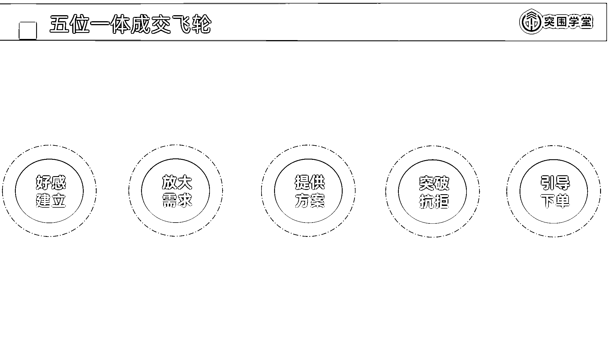  <ne-h3 id="f9350aa0" data-lake-id="f9350aa0"><ne-heading-ext><ne-heading-anchor></ne-heading-anchor><ne-heading-fold></ne-heading-fold></ne-heading-ext><ne-heading-content><ne-text id="u80cbf89b">①破冰——好感建立</ne-text></ne-heading-content></ne-h3> <ne-p id="u8db571a5" data-lake-id="u8db571a5"><ne-text id="uf8d8e848">加客户第一件事，首先是破冰，而不是上来就报价。就像两个人初次见面，是不是应该先有个简单的了解，对方怎么称呼？大概的基本情况等等。把客户当朋友就是成交的核心。</ne-text></ne-p> <ne-p id="uc409f9cb" data-lake-id="uc409f9cb"><ne-text id="u712a6f8a">参考话术：</ne-text></ne-p> <ne-p id="u070ba2ce" data-lake-id="u070ba2ce"><ne-text id="u1dce8371">你好，我是多多，专注**资料收集整理。很高兴认识你，请问您需要哪个？</ne-text></ne-p> <ne-h3 id="b4e31119" data-lake-id="b4e31119"><ne-heading-ext><ne-heading-anchor></ne-heading-anchor><ne-heading-fold></ne-heading-fold></ne-heading-ext><ne-heading-content><ne-text id="u35b4bb9b">②诊断——放大需求</ne-text></ne-heading-content></ne-h3> <ne-p id="ud0c45470" data-lake-id="ud0c45470"><ne-text id="ue0684d49">了解完基础信息后，下一步就是挖掘客户的需求并且进行放大，因为赚钱的本质就是帮助客户解决需求，如果连客户的需求都不明确，怎么成交呢？</ne-text></ne-p> <ne-p id="u7f073fcb" data-lake-id="u7f073fcb"><ne-card data-card-name="image" data-card-type="inline" id="Td7gX" data-event-boundary="card">  <ne-h3 id="8fdd1971" data-lake-id="8fdd1971"><ne-heading-ext><ne-heading-anchor></ne-heading-anchor><ne-heading-fold></ne-heading-fold></ne-heading-ext><ne-heading-content><ne-text id="uae2781eb">③方案——成交铺垫</ne-text></ne-heading-content></ne-h3> <ne-p id="ub00c62b5" data-lake-id="ub00c62b5"><ne-text id="u7632ecc6">我常说一句话：价值不到，价格不报。</ne-text></ne-p> <ne-p id="u77d12dc1" data-lake-id="u77d12dc1"><ne-text id="u155139ed">了解完客户的需求，下一步就是提供解决方案，并且塑造方案的好处，告诉客户能帮他解决什么具体的问题。</ne-text></ne-p> <ne-p id="ue1dbd7bd" data-lake-id="ue1dbd7bd"><ne-card data-card-name="image" data-card-type="inline" id="JPtvK" data-event-boundary="card">  <ne-h3 id="4479a832" data-lake-id="4479a832"><ne-heading-ext><ne-heading-anchor></ne-heading-anchor><ne-heading-fold></ne-heading-fold></ne-heading-ext><ne-heading-content><ne-text id="u08d52688">④信任——突破抗拒</ne-text></ne-heading-content></ne-h3> <ne-p id="ua2322760" data-lake-id="ua2322760"><ne-text id="uaea50f96">提供完解决方案后，就是最重要的一点，很多人容易在这里掉以轻心，导致辛苦获取的客户跑单。客户听完你的解决方案后，其实并不会马上下单，因为他心中还有抗拒，在这部分的聊天中，最重要的就是解除客户的防御心理。</ne-text></ne-p> <ne-p id="uafdb04fa" data-lake-id="uafdb04fa"><ne-text id="u5cce5898">那具体如何解除呢？方案很多，但是最好的方法就是晒之前付款的客户的截图以及对方的反馈和感谢。</ne-text></ne-p> <ne-h3 id="1e12f081" data-lake-id="1e12f081"><ne-heading-ext><ne-heading-anchor></ne-heading-anchor><ne-heading-fold></ne-heading-fold></ne-heading-ext><ne-heading-content><ne-text id="u0a203a0d">⑤成交——引导下单</ne-text></ne-heading-content></ne-h3> <ne-p id="ubf4bc091" data-lake-id="ubf4bc091"><ne-text id="u2dcfeb44">最后一部分是临门一脚，有些人也会卡在这里成交不了，明明客户的问题都帮他解决了，为什么她还不付款呢？我一般会用 3 个方法搞定：</ne-text></ne-p> <ne-p id="u73ac5e49" data-lake-id="u73ac5e49"><ne-text id="u9fd4b773">利用限时福利或者赠品</ne-text></ne-p> <ne-p id="u4450b72c" data-lake-id="u4450b72c"><ne-text id="u5310f518">提供零风险承诺</ne-text></ne-p> <ne-p id="u9315f5da" data-lake-id="u9315f5da"><ne-text id="u544f7225">清晰明确的下单指令</ne-text></ne-p> <ne-p id="u9e7875c1" data-lake-id="u9e7875c1"><ne-text id="u8939d5bb">具体话术参考图片</ne-text></ne-p> <ne-p id="ud7e7eb1a" data-lake-id="ud7e7eb1a"><ne-card data-card-name="image" data-card-type="inline" id="nzIw9" data-event-boundary="card">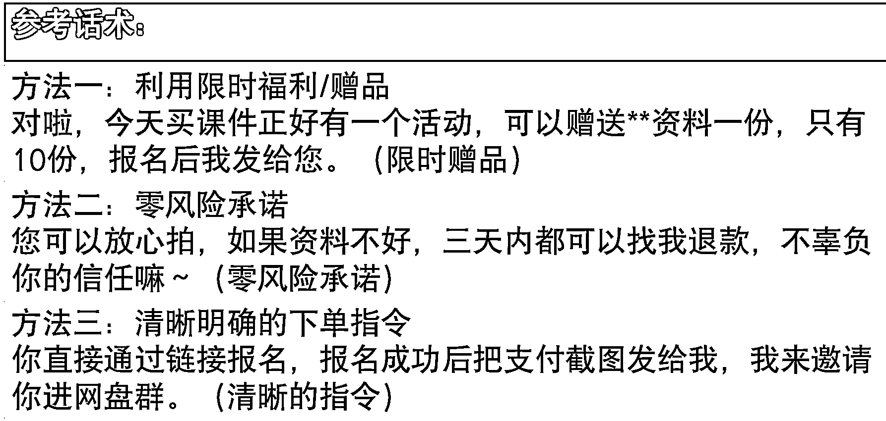  <ne-hole id="ua1518f49" data-lake-id="ua1518f49"><ne-card data-card-name="hr" data-card-type="block" id="xqfOc" data-event-boundary="card"><ne-h1 id="5bcd2ee0" data-lake-id="5bcd2ee0"><ne-heading-ext><ne-heading-anchor></ne-heading-anchor><ne-heading-fold></ne-heading-fold></ne-heading-ext><ne-heading-content><ne-text id="u1600c5a2">九、如何把玩法放大 10-100 倍？</ne-text></ne-heading-content></ne-h1> <ne-p id="ud4d042d0" data-lake-id="ud4d042d0"><ne-text id="u0084c1a1">市面上的大多数从业者，到上面其实就已经结束了，说实话，这样操作卖资料/教程/素材也能赚一些钱，但是是辛苦钱，而且赚的不是太多，一天也就五六百块钱，最多 1000-2000，很难突破天花板……</ne-text></ne-p> <ne-p id="ue12873ec" data-lake-id="ue12873ec"><ne-text id="udd1f8f8f">那具体如何把这个玩法放大 10-100 倍呢？九京提供以下思路供各位圈友参考：</ne-text></ne-p> <ne-h2 id="7a31f66f" data-lake-id="7a31f66f"><ne-heading-ext><ne-heading-anchor></ne-heading-anchor><ne-heading-fold></ne-heading-fold></ne-heading-ext><ne-heading-content><ne-text id="uc6855171">1、搭建后端收入模式</ne-text></ne-heading-content></ne-h2> <ne-p id="u9db98a60" data-lake-id="u9db98a60"><ne-card data-card-name="image" data-card-type="inline" id="o0m4j" data-event-boundary="card">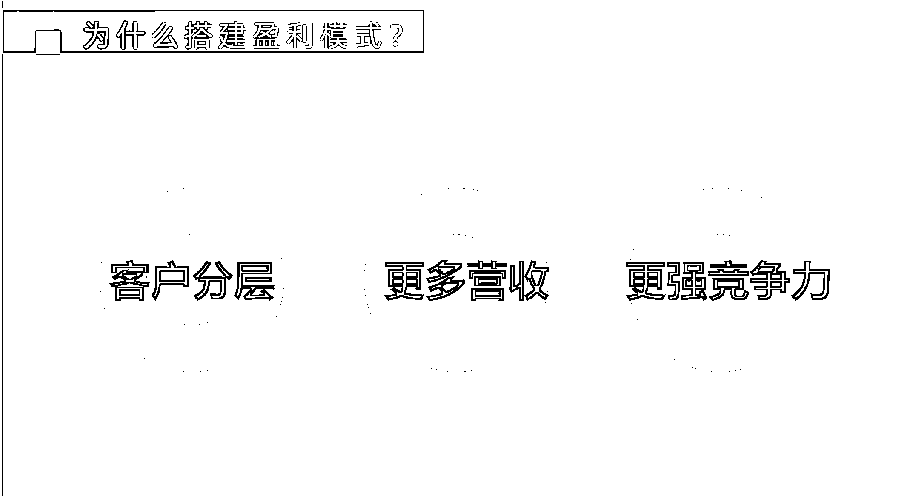  <ne-p id="u33d967e0" data-lake-id="u33d967e0"><ne-text id="u286eadfa">为什么要搭建后端盈利模式呢？</ne-text></ne-p> <ne-p id="u57ebce16" data-lake-id="u57ebce16"><ne-text id="u99cf0a7f">同样的产品或者服务，不同的客户支付意愿/支付能力不同，有的人愿意花 9.9、有的人愿意花 99、有的人愿意花 990、有的人愿意花 9900、有的人愿意花 99000……当然，还有人想白嫖。</ne-text></ne-p> <ne-p id="u6da7a49e" data-lake-id="u6da7a49e"><ne-text id="ufd0dc569">通过搭建后端模式，就可以按照客户的不同需求及支付能力进行分成，最大化提高营业额。</ne-text></ne-p> <ne-p id="u003724c1" data-lake-id="u003724c1"><ne-text id="u03f5045d">下面我讲解一下基本的逻辑：</ne-text></ne-p> <ne-p id="u6df83c49" data-lake-id="u6df83c49"><ne-text id="ufeaeea43">首先看“信任-价格模型”，横坐标代表客户对我们的信任，从左往后逐渐增强；纵坐标代表产品的单价，从下往网逐渐提高。</ne-text></ne-p> <ne-p id="u780610bb" data-lake-id="u780610bb"><ne-card data-card-name="image" data-card-type="inline" id="Ey0ev" data-event-boundary="card">  <ne-p id="u2953a606" data-lake-id="u2953a606"><ne-text id="u4f64c0b7">然后分析 4 种情况：</ne-text></ne-p> <ne-p id="u5e87a755" data-lake-id="u5e87a755"><ne-text id="uc6ab1da9">情况 1：弱信任高价格。比如客户刚加你微信，你告诉她“我们又一款售价 10 万的私董会产品挺适合你”，你觉得客户会加入吗？</ne-text></ne-p> <ne-p id="u79752315" data-lake-id="u79752315"><ne-text id="u4d2ba0f0">情况 2：弱信任低价格。这种情况符合基本的逻辑。</ne-text></ne-p> <ne-p id="u37111644" data-lake-id="u37111644"><ne-text id="u4f834bac">情况 3：强信任低价格。客户已经成为了你的死忠粉，你卖什么她都买，而且推荐亲朋好友都来买，但是你的最高客单价只有 9.9……是不是有种暴殄天物的感觉？</ne-text></ne-p> <ne-p id="ue25a096c" data-lake-id="ue25a096c"><ne-text id="u48fb9700">情况 4：强信任高价格。这种情况是所有私域运营的最高追求，高价值客户、超优质产品/服务、超预期交付。</ne-text></ne-p> <ne-p id="uc0dc4337" data-lake-id="uc0dc4337"><ne-card data-card-name="image" data-card-type="inline" id="Tw8Xd" data-event-boundary="card">  <ne-p id="uf1825879" data-lake-id="uf1825879"><ne-text id="uafd6ddb4">了解了以上逻辑后，就可以搭建完善的产品体系模型：</ne-text></ne-p> <ne-p id="u1b8cadae" data-lake-id="u1b8cadae"><ne-text id="u3ae05ea2">1、针对刚加入的客户，赠送免费的资料或者售卖低价资料，先建立基本的信任。</ne-text></ne-p> <ne-p id="u396811d8" data-lake-id="u396811d8"><ne-text id="u711a9f58">2、建立第一次“金钱关系”后，转化中低客单价产品，比如单价 70-200 的资料会员，进一步建立信任</ne-text></ne-p> <ne-p id="u38caa9be" data-lake-id="u38caa9be"><ne-text id="u7c82e1d7">3、建立中度信任后，销售实物 u 盘、招代理、卖 3000-8000 元正价课等等</ne-text></ne-p> <ne-p id="u093d7777" data-lake-id="u093d7777"><ne-text id="u5459ad5c">4、建立铁杆信任后，考虑分公司、加盟商、合伙人模式，实现深度利益绑定</ne-text></ne-p> <ne-p id="ubc176460" data-lake-id="ubc176460"><ne-card data-card-name="image" data-card-type="inline" id="GmReB" data-event-boundary="card">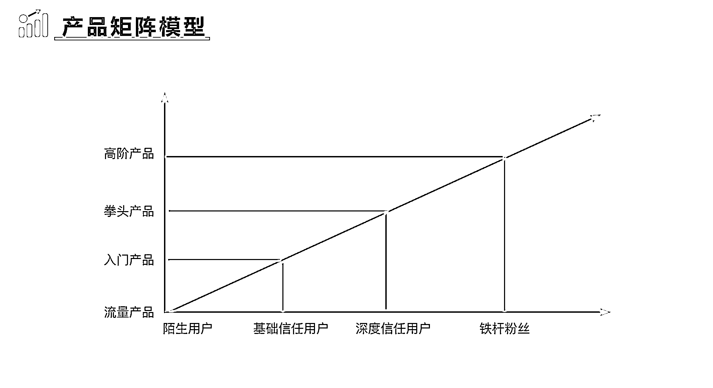<ne-card data-card-name="image" data-card-type="inline" id="qENT9" data-event-boundary="card">  <ne-p id="u0566dfdf" data-lake-id="u0566dfdf"><ne-text id="u5b38ed38">私域万能掘金公式：</ne-text></ne-p> <ne-p id="u460411ef" data-lake-id="u460411ef"><ne-text id="u52c42a53" ne-bold="true">销售额=流量*客单价*转化率</ne-text></ne-p> <ne-p id="uec29b081" data-lake-id="uec29b081"><ne-text id="u7c2ba041">在总进粉数量不变的情况下，要想每个月扩大 10 倍收入，就必须在客单价和转化率上下功夫，而转化率其实整个行业比较平均，没有太大提升空间，所以只能在拓展不同客单价产品上面下功夫。</ne-text></ne-p> <ne-h2 id="009e9209" data-lake-id="009e9209"><ne-heading-ext><ne-heading-anchor></ne-heading-anchor><ne-heading-fold></ne-heading-fold></ne-heading-ext><ne-heading-content><ne-text id="u7fefbf8f">2、挖掘更多蓝海产品</ne-text></ne-heading-content></ne-h2> <ne-p id="u61d0caa7" data-lake-id="u61d0caa7"><ne-text id="uf478c030">我们目前主要操作的有幼师资料、小学教辅、中医资料等领域，看完今天的复盘之后，大家不必要都去做这两个领域，而是可以拓展自己的思维，挖掘更多蓝海产品。</ne-text></ne-p> <ne-p id="ub9b4ea59" data-lake-id="ub9b4ea59"><ne-text id="u2e69c820">那具体如何拓展更多选品呢？我想先给你讲透玩法的逻辑，只有深刻理解玩法的底层逻辑，才能做到举一反三，拓展更多的选品，看到更到更多的可能性。</ne-text></ne-p> <ne-p id="uda7b2816" data-lake-id="uda7b2816"><ne-text id="u3004cf6e">在生活中很多人每天都在想着赚大钱，但是费了很多心思，依旧没有如愿，为什么呢？因为他们都不理解一句话：钱不是赚来的，而是满足市场需求之后，市场给你的馈赠。</ne-text></ne-p> <ne-p id="u73c6334e" data-lake-id="u73c6334e"><ne-text id="ufaac869e">假如你在公司上班，那你的价值就来自于帮助老板解决问题，解决多大的问题，拿到多少的钱。</ne-text></ne-p> <ne-p id="ua95b63d8" data-lake-id="ua95b63d8"><ne-text id="u39b9d5a8">假如你是自己创业，那你的价值就在于帮助客户解决问题，帮客户解决的问题越多越大，能够获得的市场回馈也就越多。</ne-text></ne-p> <ne-p id="u1ec59f3d" data-lake-id="u1ec59f3d"><ne-text id="u96276ba9">赚钱的核心是解决客户的需求，那如何去挖掘客户需求呢？</ne-text></ne-p> <ne-p id="u4ed0326a" data-lake-id="u4ed0326a"><ne-text id="u09c55140">这里就需要提到马斯洛需求层次理论，这套经典理论从下到上，列举了人的 5 大需求层次。生理需求，安全需求，归属需求，尊重需求，自我实现需求。</ne-text></ne-p> <ne-p id="u3994d5b6" data-lake-id="u3994d5b6"><ne-card data-card-name="image" data-card-type="inline" id="nyBmp" data-event-boundary="card">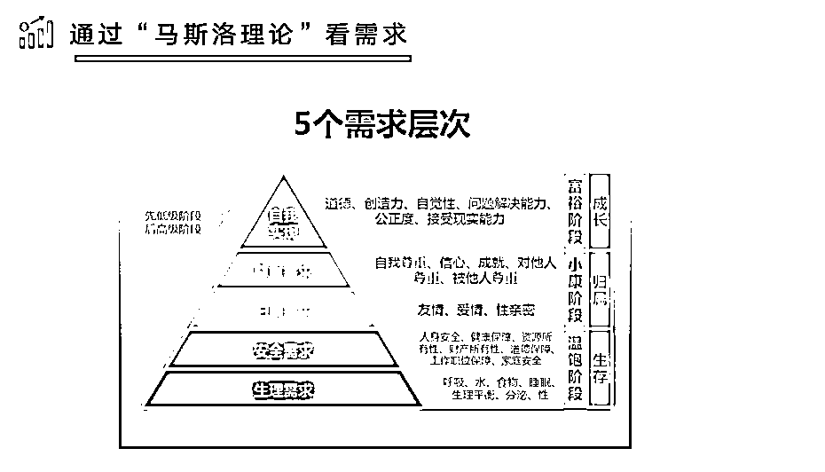  <ne-p id="u5bfc32aa" data-lake-id="u5bfc32aa"><ne-text id="u91397bdb">无论社会发展到什么样的程度，市场中总会存在未被满足的需求，而一个合格的商人，就是嗅到这些需求，然后找到对应的解决方案，在帮助客户解决问题的同时赚到钱。</ne-text></ne-p> <ne-p id="u32804ac4" data-lake-id="u32804ac4"><ne-text id="u32388c57" style="color: rgb(223, 42, 63);">赚钱=通过……方案，帮助……客户，解决……问题。</ne-text></ne-p> <ne-p id="u65c6a78d" data-lake-id="u65c6a78d"><ne-text id="u9722610f">比如：</ne-text></ne-p> <ne-p id="ubfbfd433" data-lake-id="ubfbfd433"><ne-text id="u7f4dc193">科学育儿课程，满足了新手家长育儿方面的生理需求；</ne-text></ne-p> <ne-p id="u49b150c7" data-lake-id="u49b150c7"><ne-text id="u63ac8fa4">保险理财，满足了中产阶级财产增值保值的安全需求；</ne-text></ne-p> <ne-p id="u54bece22" data-lake-id="u54bece22"><ne-text id="u3a833124">情感挽回，满足了饮食男女对情感维护的归属需求；</ne-text></ne-p> <ne-p id="u6d905c5a" data-lake-id="u6d905c5a"><ne-text id="u8a15d867">考试考证培训，满足了自我提升成长的需求</ne-text></ne-p> <ne-p id="u3848a447" data-lake-id="u3848a447"><ne-text id="ub18ec6b0">360 行都存在未被满足的需求，所以本质上都可以通过小红书重新做一遍。关于虚拟资料选品，我们实操了 7 年，总结了不少经验，如果大家确实感兴趣，可以给本篇复盘点个赞，过百赞的话，我会另开一篇文章，专门分享虚拟方向选品全攻略。</ne-text></ne-p> <ne-p id="u72b6e08e" data-lake-id="u72b6e08e"><ne-text id="u3592e330" ne-bold="true">写在最后：</ne-text></ne-p> <ne-p id="ucb21a585" data-lake-id="ucb21a585"><ne-text id="u419f9a08">我个人认为这个玩法的底层逻辑是通用的，</ne-text><ne-text id="u0d3bcaa3" ne-bold="true">“公域引流，私域变现”</ne-text><ne-text id="u82540736">，能把这个玩法玩明白，其实可以延伸到各行各业，所以它是一个极度长期的玩法，至少未来 10 年不会过时，丝毫不夸张。</ne-text></ne-p> <ne-p id="ue574e266" data-lake-id="ue574e266"><ne-text id="u5c97fa1c">OK，关于这个玩法我就分享到这里，其实像现在红利期依旧非常大，所以如果你看到这篇文章对这个玩法感兴趣，可以按照我的完整复盘直接 1:1 去操作就可以，实操过程中遇到问题，欢迎留言讨论交流。</ne-text></ne-p> <ne-h3 id="e5e585a4" data-lake-id="e5e585a4"><ne-heading-ext><ne-heading-anchor></ne-heading-anchor><ne-heading-fold></ne-heading-fold></ne-heading-ext><ne-heading-content><ne-text id="u74f968e8">【小红书风向标】</ne-text></ne-heading-content></ne-h3> <ne-h2 id="e9ba9a77" data-lake-id="e9ba9a77"><ne-heading-ext><ne-heading-anchor></ne-heading-anchor><ne-heading-fold></ne-heading-fold></ne-heading-ext><ne-heading-content><ne-text id="u471e88d8">（51 赞）小红书 11 月份行业月报，3C、家居、美妆、宠物、母婴等行业</ne-text></ne-heading-content></ne-h2> <ne-p id="ubd365531" data-lake-id="ubd365531"><ne-text id="uac49680d">小红书 11 月份最新的行业月报，大家可以按需下载，每个行业月报中给出的数据和案例都是非常具备参考价值的。</ne-text></ne-p> <ne-p id="u3b7c5b95" data-lake-id="u3b7c5b95"><ne-text id="u0790ee86">小懒已经手动帮大家上传到蓝奏了，复制链接到浏览器打开：</ne-text></ne-p> <ne-p id="u63f31871" data-lake-id="u63f31871"><ne-text id="u58f5529e">小红书·2022 年 3C 行业月报-11 月.pdf：</ne-text></ne-p> <ne-p id="u77ca2879" data-lake-id="u77ca2879">[<ne-text id="u942a6d19">https://lazyman.lanzoul.com/iJYH50j1uqmj</ne-text>](https://lazyman.lanzoul.com/iJYH50j1uqmj)</ne-p> <ne-p id="u5adbe8fe" data-lake-id="u5adbe8fe"><ne-text id="ua63ce846">小红书 2022 年教育行业 11 月月报-11 月.pdf：</ne-text></ne-p> <ne-p id="u94fb4e8a" data-lake-id="u94fb4e8a">[<ne-text id="ue3c86f61">https://lazyman.lanzoul.com/ihB7y0j1uqob</ne-text>](https://lazyman.lanzoul.com/ihB7y0j1uqob)</ne-p> <ne-p id="uf5682944" data-lake-id="uf5682944"><ne-text id="ud43c4ea0">小红书-2022 年汽车行业月报-11 月.pdf：</ne-text></ne-p> <ne-p id="uca74073f" data-lake-id="uca74073f">[<ne-text id="u2e71ac66">https://lazyman.lanzoul.com/iw3MP0j1uqsf</ne-text>](https://lazyman.lanzoul.com/iw3MP0j1uqsf)</ne-p> <ne-p id="ua3470816" data-lake-id="ua3470816"><ne-text id="udc88f850">小红书-2022 年食品饮料行业月报-11 月.pdf：</ne-text></ne-p> <ne-p id="u8c6c3e4c" data-lake-id="u8c6c3e4c">[<ne-text id="ua25100ec">https://lazyman.lanzoul.com/i3sVT0j1uqtg</ne-text>](https://lazyman.lanzoul.com/i3sVT0j1uqtg)</ne-p> <ne-p id="ue887fbfe" data-lake-id="ue887fbfe"><ne-text id="u50219c75">小红书-2022 年母婴行业月报-11 月.pdf：</ne-text></ne-p> <ne-p id="u5b25efc8" data-lake-id="u5b25efc8">[<ne-text id="u00afebef">https://lazyman.lanzoul.com/ihwOP0j1uqwj</ne-text>](https://lazyman.lanzoul.com/ihwOP0j1uqwj)</ne-p> <ne-p id="u85f1edf1" data-lake-id="u85f1edf1"><ne-text id="u239abefb">小红书·2022 年内衣行业月报-11 月.pdf：</ne-text></ne-p> <ne-p id="u26f80925" data-lake-id="u26f80925">[<ne-text id="u51dc108d">https://lazyman.lanzoul.com/i9PxV0j1uqxa</ne-text>](https://lazyman.lanzoul.com/i9PxV0j1uqxa)</ne-p> <ne-p id="u50c31bfb" data-lake-id="u50c31bfb"><ne-text id="udcb3247a">小红书-2022 年宠物行业月报-11 月.pdf：</ne-text></ne-p> <ne-p id="u3af4bb52" data-lake-id="u3af4bb52">[<ne-text id="ue2a54ac2">https://lazyman.lanzoul.com/izn950j1uqzc</ne-text>](https://lazyman.lanzoul.com/izn950j1uqzc)</ne-p> <ne-p id="ufc1e9ccd" data-lake-id="ufc1e9ccd"><ne-text id="ub8cbc4f7">小红书·2022 年家居家装行业月报-11 月.pdf：</ne-text></ne-p> <ne-p id="ub50e65b9" data-lake-id="ub50e65b9">[<ne-text id="u5ae4b6bf">https://lazyman.lanzoul.com/imkld0j1ur0d</ne-text>](https://lazyman.lanzoul.com/imkld0j1ur0d)</ne-p> <ne-p id="ua8d3a476" data-lake-id="ua8d3a476"><ne-text id="u2ee32e1b">小红书·2022 年美妆个护月报-11 月.pdf：</ne-text></ne-p> <ne-p id="u75634f87" data-lake-id="u75634f87">[<ne-text id="uf6b3b603">https://lazyman.lanzoul.com/iOzkK0j1ur2f</ne-text>](https://lazyman.lanzoul.com/iOzkK0j1ur2f)</ne-p> <ne-h2 id="d23810df" data-lake-id="d23810df"><ne-heading-ext><ne-heading-anchor></ne-heading-anchor><ne-heading-fold></ne-heading-fold></ne-heading-ext><ne-heading-content><ne-text id="ub5ccd1b6">（24 赞）小红书百分百获得“笔记关键群聊”功能的方法</ne-text></ne-heading-content></ne-h2> <ne-p id="u26fc9b03" data-lake-id="u26fc9b03"><ne-text id="u1f4e3bd8">#风向标# 小红书百分百获得“笔记关键群聊”功能的方法 小红书“笔记关键群聊”这个功能的导流效果，用过的人都知道导流有多厉害。</ne-text></ne-p> <ne-p id="u6982c29b" data-lake-id="u6982c29b"><ne-text id="ud31a563c">今天在小红书上搜索一个东西，被内测到了，弹窗“是否参与内测”，选择同意后，几秒后，再打开小红书，就有了“笔记关键群聊”功能。 随后有一个想法，尝试后的 2 个新号也全部有了这个功能！</ne-text></ne-p> <ne-p id="u41dc26a3" data-lake-id="u41dc26a3"><ne-text id="u30d2da75">方法如下：新号➕活跃(刷笔记或发笔记）➕搜索几次➕无违规记录➕同意内测(一个手机里的小红书账号有了这个功能后，直接用这个手机去注册新账号，百分百有) 账号直接用手机号验证码注册，注册成功后立刻新建群聊，一般马上就有。</ne-text></ne-p> <ne-p id="u16871e2a" data-lake-id="u16871e2a"><ne-text id="uc8d34a47">如果没有，那就注销掉，过两天再试。(我今天有的 3 个号之前都注册过，没有被内测到就注销了。今天重新注册就有了)</ne-text></ne-p> <ne-p id="u12555125" data-lake-id="u12555125"><ne-card data-card-name="image" data-card-type="inline" id="he7Gu" data-event-boundary="card">  <ne-p id="uf7021cba" data-lake-id="uf7021cba"><ne-card data-card-name="image" data-card-type="inline" id="zEJJk" data-event-boundary="card">  <ne-p id="u2086cd3c" data-lake-id="u2086cd3c"><ne-card data-card-name="image" data-card-type="inline" id="On17q" data-event-boundary="card">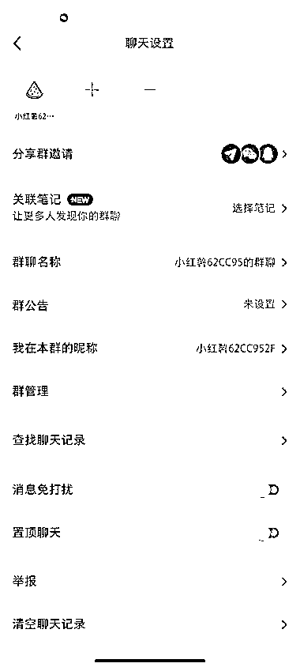  <ne-h2 id="10cf29b4" data-lake-id="10cf29b4"><ne-heading-ext><ne-heading-anchor></ne-heading-anchor><ne-heading-fold></ne-heading-fold></ne-heading-ext><ne-heading-content><ne-text id="ua0a85e31">（12 赞）在小红书刷到好几个云电影</ne-text></ne-heading-content></ne-h2> <ne-p id="uc5ebbdd5" data-lake-id="uc5ebbdd5"><ne-text id="u77c88452">#风向标# 在小红书今天刷到好几个云电影 通过腾讯会议共享，最近比较多的名侦探柯南，也有很多是老电影，都写的是免费参加 截图这个是做得比较正式，很有影院选场次的感觉，很多人留言报名</ne-text></ne-p> <ne-p id="u24af7a16" data-lake-id="u24af7a16"><ne-card data-card-name="image" data-card-type="inline" id="dblgU" data-event-boundary="card">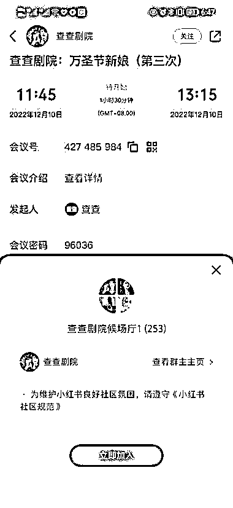  <ne-p id="uf7537013" data-lake-id="uf7537013"><ne-card data-card-name="image" data-card-type="inline" id="Bzo69" data-event-boundary="card">  <ne-h2 id="2e313e57" data-lake-id="2e313e57"><ne-heading-ext><ne-heading-anchor></ne-heading-anchor><ne-heading-fold></ne-heading-fold></ne-heading-ext><ne-heading-content><ne-text id="ud0cb9053">【闲鱼风向标】</ne-text></ne-heading-content></ne-h2> <ne-h2 id="52971fad" data-lake-id="52971fad"><ne-heading-ext><ne-heading-anchor></ne-heading-anchor><ne-heading-fold></ne-heading-fold></ne-heading-ext><ne-heading-content><ne-text id="u22c26a41">（15 赞）玩闲鱼流量的可以试着去申请这些圈主，申请通过率很高</ne-text></ne-heading-content></ne-h2> <ne-p id="ued258549" data-lake-id="ued258549"><ne-text id="u1222261e">#风向标# 玩闲鱼流量的可以试着去申请下方这些圈主，我统计了下这些目前圈主都是闲置的，申请通过率很高，亲测有效，已经拿到一个 xx 万粉丝的圈主。表格还在持续更新。 闲鱼圈主的玩法我就不多说了，可变现的方式太多了，卖货，引流和广告都可以跑得很顺利。</ne-text></ne-p> <ne-p id="u38212a0a" data-lake-id="u38212a0a"><ne-card data-card-name="image" data-card-type="inline" id="e9KLA" data-event-boundary="card">  <ne-h3 id="036dc101" data-lake-id="036dc101"><ne-heading-ext><ne-heading-anchor></ne-heading-anchor><ne-heading-fold></ne-heading-fold></ne-heading-ext><ne-heading-content><ne-text id="ue4adbeb5">【Ai 绘画】</ne-text></ne-heading-content></ne-h3> <ne-h2 id="f710ce75" data-lake-id="f710ce75"><ne-heading-ext><ne-heading-anchor></ne-heading-anchor><ne-heading-fold></ne-heading-fold></ne-heading-ext><ne-heading-content><ne-text id="u46663d97">(85 赞)《 新人小白 30 天利用 Ai 作画技巧，让我的作品快速变现的经验分享》</ne-text></ne-heading-content></ne-h2> <ne-p id="u8c80c867" data-lake-id="u8c80c867"><ne-text id="u5a54b4f9" style="color: rgb(51, 51, 51);">哈喽~大家好，我是本次 AI 绘画入门航海的船员饼公子。毕业之后一直都在江西南昌的保险公司就职，主要是负责公司的某一条线产品管理和设计。</ne-text></ne-p> <ne-p id="u6418caa2" data-lake-id="u6418caa2"><ne-text id="ufcba915e" style="color: rgb(51, 51, 51);">加入生财 8 个月，很幸运今年在 11 月读了天辉教练的精华帖，于是去链接天辉老师。在天辉老师的教导和指点下终于有了一点点小成绩。</ne-text></ne-p> <ne-p id="u5c9e4a1f" data-lake-id="u5c9e4a1f"><ne-text id="u4800c9f9" style="color: rgb(51, 51, 51);">目前是"</ne-text><ne-text id="uda08787c" style="color: rgb(47, 48, 52); background-color: rgb(255, 255, 255);">智慧之星</ne-text><ne-text id="ud9efa115" style="color: rgb(51, 51, 51);">"星球的联合创始人，AI 绘画关键词小群主讲人之一，接触 AI 绘画一个月，一周时间通过教学、关键词、定制画赚了小四位数，相比各位大佬的水平，还是略有不足，我相信能赚到第一块钱，那么未来有无限的机会。</ne-text></ne-p> <ne-p id="ud564e367" data-lake-id="ud564e367"><ne-text id="u0ef64c6b" style="color: rgb(51, 51, 51);">随着航海一天天进行，我相信大家都已经对 AI 绘画有了尝试，最为基础的出图门槛都已经踏过了。渐渐的大家都从直接复制粘贴，开始转向对如何制作一个精美的图片和按照自己的想法出图的研究了。</ne-text></ne-p> <ne-p id="u81e4c7bf" data-lake-id="u81e4c7bf"><ne-text id="u69ef96cb" style="color: rgb(51, 51, 51);">那你有没有这样的疑问：提示词 prompt（以下均称为提示词）到底应该怎么写才好？如何才能达到自己想要的结果？为啥人家写的可以出好看的图，我不能呢？今天就分享一下好的提示词基本的书写方式和如何改写。</ne-text></ne-p> <ne-p id="u8b2e1e6a" data-lake-id="u8b2e1e6a"><ne-text id="u99a3b2cf" style="color: rgb(51, 51, 51);">本文主要围绕以下几个方面来写，目录详看下图：</ne-text></ne-p> <ne-p id="uddfdf4fe" data-lake-id="uddfdf4fe"><ne-card data-card-name="image" data-card-type="inline" id="hvuPQ" data-event-boundary="card">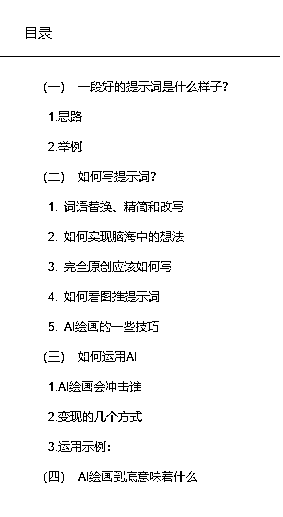  <ne-h1 id="470b9b51" data-lake-id="470b9b51"><ne-heading-ext><ne-heading-anchor></ne-heading-anchor><ne-heading-fold></ne-heading-fold></ne-heading-ext> <ne-heading-content></ne-heading-content></ne-h1> <ne-h2 id="e846837c" data-lake-id="e846837c"><ne-heading-ext><ne-heading-anchor></ne-heading-anchor><ne-heading-fold></ne-heading-fold></ne-heading-ext><ne-heading-content><ne-text id="ua653696a" ne-bold="true">（一） 一段好的提示词是什么样子？</ne-text></ne-heading-content></ne-h2> <ne-h3 id="4fe8b9dd-1" data-lake-id="4fe8b9dd-1"><ne-heading-ext><ne-heading-anchor></ne-heading-anchor><ne-heading-fold></ne-heading-fold></ne-heading-ext><ne-heading-content></ne-heading-content></ne-h3><ne-h3 id="a5ed0ae8" data-lake-id="a5ed0ae8"><ne-heading-ext><ne-heading-anchor></ne-heading-anchor><ne-heading-fold></ne-heading-fold></ne-heading-ext><ne-heading-content><ne-text id="u44931aba" ne-bold="true">1.思路</ne-text></ne-heading-content></ne-h3> <ne-p id="u49a4f851" data-lake-id="u49a4f851"><ne-text id="u3ce3862e" style="color: rgb(51, 51, 51);">首先，我们要明白 AI 绘画是能将你脑海中的画面呈现出来的工具。那么你脑海中的那副画面是要描述？那是怎么样子的一幅画？画中具体有什么？是一个人嘛？是人的话，是一个怎么样的人？人的具体情况是如何的？TA 长的什么模样？穿的什么服装？在做什么？</ne-text></ne-p> <ne-p id="u19ff52e3" data-lake-id="u19ff52e3"><ne-text id="u2fcddcc0" style="color: rgb(51, 51, 51);">你可以把它理解为你在拍写真照是拍古风?动漫?现代?民国?描述词，就是围绕拍照的这个人来由你给他穿衣服，化妆。</ne-text></ne-p> <ne-p id="u08b7f994" data-lake-id="u08b7f994"><ne-text id="u687a8b51" style="color: rgb(51, 51, 51);">设定好了主体人物人物，接下来，画面有没有背景？背景长什么样子呢？背景中有城堡?湖泊？还是其他？有什么特点呢？是黄昏下的海边，还是夜晚的森林?</ne-text></ne-p> <ne-p id="ua3a9b153" data-lake-id="ua3a9b153"><ne-card data-card-name="image" data-card-type="inline" id="w2Ieq" data-event-boundary="card">  <ne-p id="ucd90cbf0" data-lake-id="ucd90cbf0"><ne-text id="ub8be26ea" style="color: rgb(51, 51, 51);">总结起来，每一个画面中的每样东西都可以找到一个规律：</ne-text><ne-text id="u647f6b49" ne-bold="true">由整体到具体，大框架——主体内容——细节</ne-text><ne-text id="u39437d02" style="color: rgb(51, 51, 51);">。</ne-text></ne-p> <ne-quote id="u7da53df4" data-lake-id="u7da53df4"><ne-p id="u88f7d7c2" data-lake-id="u88f7d7c2"><ne-text id="u7ab41684" style="color: rgb(51, 51, 51);">一个画面，包含了主体，客体，背景等，而它们都又有自己的细节，</ne-text></ne-p> <ne-quote id="ube94d7e3" data-lake-id="ube94d7e3"><ne-p id="ufb47e742" data-lake-id="ufb47e742"><ne-text id="u78196e0f" style="color: rgb(51, 51, 51);">通过这样的方法可以将所有元素都细分。</ne-text></ne-p> <ne-p id="ue93e09b9" data-lake-id="ue93e09b9"><ne-text id="ub3aa0654" style="color: rgb(51, 51, 51);">你在脑子里想到一个场景，要用 AI 看得懂的语言表述出来，就像是你要说“落霞与孤鹜齐飞，秋水共长天一色”，而不要说“卧槽，好美”。</ne-text></ne-p> <ne-p id="ubf6faa5e" data-lake-id="ubf6faa5e"><ne-text id="u6af8cf61" style="color: rgb(51, 51, 51);">通过上述思路再简化，在脑海里思考一个大概的画面，然后通过公式来写提示词，可以简化为：</ne-text></ne-p> <ne-p id="u1622c2a9" data-lake-id="u1622c2a9"><ne-text id="u2816ac1e" style="color: rgb(51, 51, 51);">主体指的是画面中的主要部分，可以是动植物，人物，建筑，景物，幻想生物等。</ne-text></ne-p> <ne-p id="u989d331e" data-lake-id="u989d331e"><ne-text id="uf9f3de02" style="color: rgb(51, 51, 51);">对主体部分进行丰富的描述，就可以更精准的获得你想要的图片。</ne-text></ne-p> <ne-p id="u3596bef0" data-lake-id="u3596bef0"><ne-text id="u508326c9" style="color: rgb(51, 51, 51);">如：</ne-text></ne-p> <ne-quote id="u20f47983" data-lake-id="u20f47983"><ne-p id="uac84701f" data-lake-id="uac84701f"><ne-card data-card-name="image" data-card-type="inline" id="uOU61" data-event-boundary="card">  <ne-p id="u56155c93" data-lake-id="u56155c93"><ne-text id="ua016dfb3" style="color: rgb(51, 51, 51);">环境指的是画面中的背景、场景等。用来讲述，谁，什么物体，在哪里，周围是什么样子。</ne-text></ne-p> <ne-quote id="uefc4d992" data-lake-id="uefc4d992"><ne-p id="ubdf756af" data-lake-id="ubdf756af"><ne-card data-card-name="image" data-card-type="inline" id="PUKkz" data-event-boundary="card">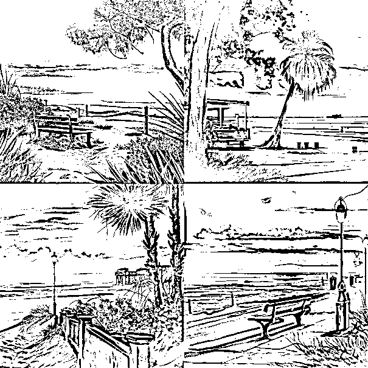  <ne-p id="u4d3b21ed" data-lake-id="u4d3b21ed"><ne-text id="u25551613" style="color: rgb(51, 51, 51);">前后缀指的是对画风要求词，对引擎使用词，对整体效果的要求词，是用来用于确定图片的总体生成质量。</ne-text></ne-p> <ne-p id="u628f3140" data-lake-id="u628f3140"><ne-text id="ueed94c06" style="color: rgb(51, 51, 51);">比如：8K，CG，masterpiece，by PabloPicasso，等等。</ne-text></ne-p> <ne-p id="u634f5c8f" data-lake-id="u634f5c8f"><ne-card data-card-name="image" data-card-type="inline" id="CT0B2" data-event-boundary="card">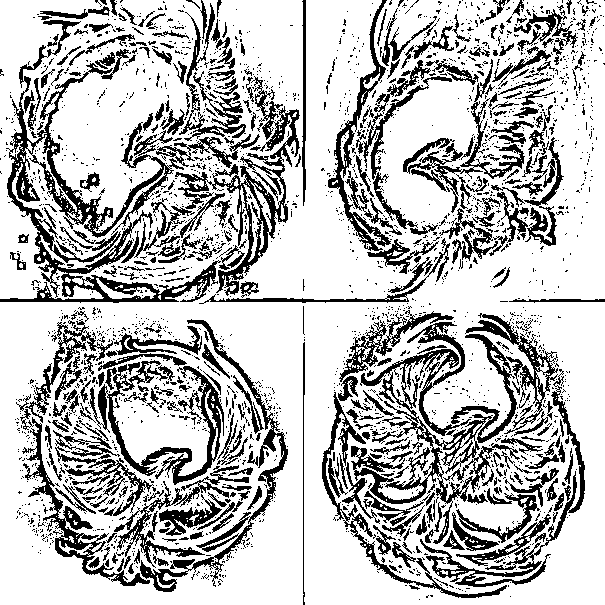  <ne-p id="u9fbc12d9" data-lake-id="u9fbc12d9"><ne-card data-card-name="image" data-card-type="inline" id="BlHoZ" data-event-boundary="card">  <ne-p id="ue58853a3" data-lake-id="ue58853a3"><ne-text id="u5b5624fe" style="color: rgb(51, 51, 51);">当然了，如果你没有对这些细节进行描述，那么 AI 就会帮你补全画面，只是这样的补全是随机的，出图的效果就像是开盲盒，有可能会出极为精美的图片，还有可能出效果很差的图片，但是绝大部分都是效果一般的图片，属于是没啥掌控感了。</ne-text></ne-p> <ne-h3 id="4e81694a" data-lake-id="4e81694a"><ne-heading-ext><ne-heading-anchor></ne-heading-anchor><ne-heading-fold></ne-heading-fold></ne-heading-ext><ne-heading-content><ne-text id="uea3d702c" ne-bold="true">2.举例</ne-text></ne-heading-content></ne-h3> <ne-p id="udd8008f1" data-lake-id="udd8008f1"><ne-text id="u3ba2da16" style="color: rgb(51, 51, 51);">接下来就用举个栗子吧，方便大家理解。</ne-text></ne-p> <ne-p id="u808d9d8f" data-lake-id="u808d9d8f"><ne-text id="u2b3ee83b" style="color: rgb(51, 51, 51);">网上复制一个抖音爆款图片的提示词：</ne-text></ne-p> <ne-quote id="ud679633d" data-lake-id="ud679633d"><ne-p id="ud69b9319" data-lake-id="ud69b9319"><ne-text id="ud3564931" style="color: rgb(51, 51, 51);">成品图效果是这样的：</ne-text></ne-p> <ne-p id="u66eb41c7" data-lake-id="u66eb41c7"><ne-card data-card-name="image" data-card-type="inline" id="B7gcN" data-event-boundary="card">  <ne-p id="u77568b3f" data-lake-id="u77568b3f"><ne-text id="u3b257c6c" style="color: rgb(51, 51, 51);">我们来看下分析一下这段提示词，我把他扔微信进行翻译，方便大家理解。</ne-text></ne-p> <ne-p id="uebf2ab87" data-lake-id="uebf2ab87"><ne-card data-card-name="image" data-card-type="inline" id="rfqNR" data-event-boundary="card">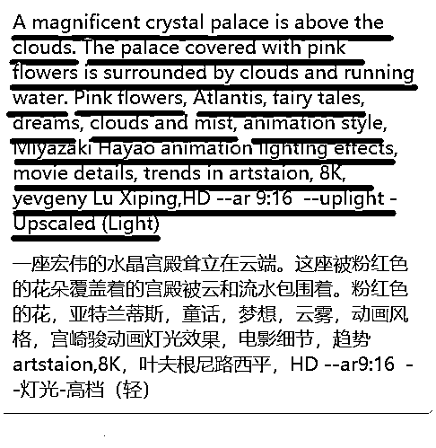  <ne-p id="u71c4ee77" data-lake-id="u71c4ee77"><ne-text id="u7192e9cc" style="color: rgb(51, 51, 51);">这里我通过划线的模式去帮助大家理解。</ne-text></ne-p> <ne-p id="u20b06564" data-lake-id="u20b06564"><ne-text id="u57868fd8" style="color: rgb(51, 51, 51);">粉色划线部分是这段话中的描述“主体”的部分，告诉 AI 主体是个水晶宫殿，在哪里，还有粉色花是次要主体。</ne-text></ne-p> <ne-p id="u67f17d21" data-lake-id="u67f17d21"><ne-text id="u688243d7" style="color: rgb(51, 51, 51);">蓝色划线部分是描述“环境”，告诉 AI 这宫殿是被云和流水包围。</ne-text></ne-p> <ne-p id="u3d3d771a" data-lake-id="u3d3d771a"><ne-text id="u66f5bfd5" style="color: rgb(51, 51, 51);">黑色划线部分是“前后缀”，告诉 AI 整体的风格的趋向，灯光效果，图片质量。</ne-text></ne-p> <ne-p id="ubf71f95d" data-lake-id="ubf71f95d"><ne-text id="u802d7f16" style="color: rgb(51, 51, 51);">通过运用这样简单的公式结构去分析别人的爆款、好看的关键词，是不是就简单多了？</ne-text></ne-p> <ne-p id="uc0cdbca5" data-lake-id="uc0cdbca5"><ne-text id="u740a5510" style="color: rgb(51, 51, 51);">那么接下来就讲讲改写关键词的思路。</ne-text></ne-p> <ne-h2 id="4f794c7d" data-lake-id="4f794c7d"><ne-heading-ext><ne-heading-anchor></ne-heading-anchor><ne-heading-fold></ne-heading-fold></ne-heading-ext><ne-heading-content><ne-text id="u94a2f765" ne-bold="true">（二） 如何写提示词？</ne-text></ne-heading-content></ne-h2> <ne-h3 id="4fe8b9dd-2" data-lake-id="4fe8b9dd-2"><ne-heading-ext><ne-heading-anchor></ne-heading-anchor><ne-heading-fold></ne-heading-fold></ne-heading-ext><ne-heading-content></ne-heading-content></ne-h3><ne-h3 id="459ef3ea" data-lake-id="459ef3ea"><ne-heading-ext><ne-heading-anchor></ne-heading-anchor><ne-heading-fold></ne-heading-fold></ne-heading-ext><ne-heading-content><ne-text id="u394d1183" ne-bold="true">1. 词语替换、精简和改写</ne-text></ne-heading-content></ne-h3> <ne-p id="ufe1fc636" data-lake-id="ufe1fc636"><ne-text id="u05724d87" style="color: rgb(51, 51, 51);">从朋友那里得到了一段提示词，如下：</ne-text></ne-p> <ne-quote id="u358cb58a" data-lake-id="u358cb58a"><ne-p id="u2240da39" data-lake-id="u2240da39"><ne-text id="u0fe578bb" style="color: rgb(51, 51, 51);">把它扔进软件里，出图的效果是这样的：</ne-text></ne-p> <ne-p id="ue50248f5" data-lake-id="ue50248f5"><ne-card data-card-name="image" data-card-type="inline" id="ZlvN0" data-event-boundary="card">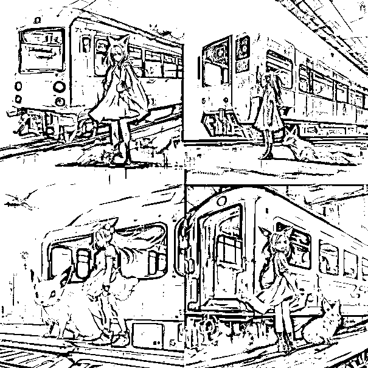  <ne-p id="u05270abd" data-lake-id="u05270abd"><ne-text id="u89ab6201" style="color: rgb(51, 51, 51);">我进行一个小幅度改动：</ne-text></ne-p> <ne-p id="u645fe7cb" data-lake-id="u645fe7cb"><ne-text id="ucf939e75" style="color: rgb(51, 51, 51);">首先是对主体进行保留，保留穿着白色连衣裙的小女孩和狐狸，</ne-text></ne-p> <ne-p id="ue6f32cb7" data-lake-id="ue6f32cb7"><ne-text id="u6e314779" style="color: rgb(51, 51, 51);">接着环境的废弃站台上的地铁车厢，和方位是在地铁车厢旁边保留，</ne-text></ne-p> <ne-p id="uc265811c" data-lake-id="uc265811c"><ne-text id="ubed3d2f2" style="color: rgb(51, 51, 51);">将前后缀中的日本动画风格改为水彩画，得到的一段提示词如下：</ne-text></ne-p> <ne-quote id="uda094ae6" data-lake-id="uda094ae6"><ne-p id="u89c914de" data-lake-id="u89c914de"><ne-text id="ub78ab042" style="color: rgb(51, 51, 51);">扔进软件里，出图的效果是这样的：</ne-text></ne-p> <ne-p id="ub5feede1" data-lake-id="ub5feede1"><ne-card data-card-name="image" data-card-type="inline" id="N74vl" data-event-boundary="card">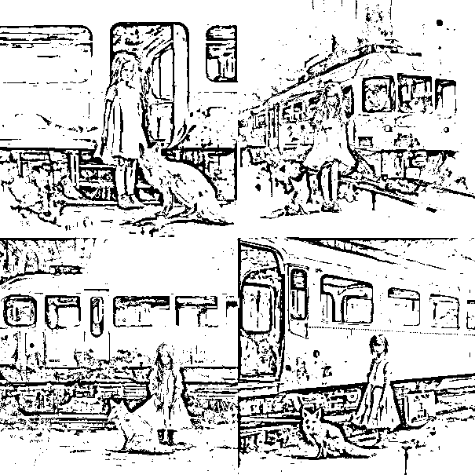  <ne-p id="u86a865cc" data-lake-id="u86a865cc"><ne-text id="ufae181e2" style="color: rgb(51, 51, 51);">接下来我觉得我想再做一个变化，变得更简单一些，只想保留一个主体。</ne-text></ne-p> <ne-p id="u00eb0539" data-lake-id="u00eb0539"><ne-text id="u2c409931" style="color: rgb(51, 51, 51);">那么我在上面的提示词又进行了精简，得到的提示词如下：</ne-text></ne-p> <ne-quote id="u2d543260" data-lake-id="u2d543260"><ne-p id="ufddbb548" data-lake-id="ufddbb548"><ne-text id="u5aae31d4" style="color: rgb(51, 51, 51);">依旧是符合之前的公式，这里主体只有 可爱的白狐狸，环境是 街道，前后缀是 水彩画和 v4。</ne-text></ne-p> <ne-p id="uabb51b20" data-lake-id="uabb51b20"><ne-text id="u608fdb17" style="color: rgb(51, 51, 51);">扔进软件里，出图的效果是这样的：</ne-text></ne-p> <ne-p id="ue77f7994" data-lake-id="ue77f7994"><ne-card data-card-name="image" data-card-type="inline" id="hjQ4n" data-event-boundary="card">  <ne-p id="u800ff5fa" data-lake-id="u800ff5fa"><ne-text id="u31167de8" style="color: rgb(51, 51, 51);">通过上述的改写，你觉得否称之为是自己原创了一段提示语？</ne-text></ne-p> <ne-p id="ua1be7f54" data-lake-id="ua1be7f54"><ne-text id="ucc7249af" style="color: rgb(51, 51, 51);">再来引申一下，我只觉得画面中的水彩画是我想要的怎么办，我想通过水彩画来做一个有冲突的画面感的图怎么搞？那么就只保留水彩画好了，其他都改写掉。</ne-text></ne-p> <ne-p id="ucc09ef3c" data-lake-id="ucc09ef3c"><ne-text id="u62592c97" style="color: rgb(51, 51, 51);">简单按公式修改一下提示词：</ne-text></ne-p> <ne-quote id="ua3c10233" data-lake-id="ua3c10233"><ne-p id="uca138b4d" data-lake-id="uca138b4d"><ne-text id="u65dfdbad" style="color: rgb(51, 51, 51);">主体：赛博朋克城市；环境：夜晚和街道；前后缀：水彩和 v 4</ne-text></ne-p> <ne-p id="u9a1b75ef" data-lake-id="u9a1b75ef"><ne-text id="u7097ac14" style="color: rgb(51, 51, 51);">扔进软件里，出图的效果是这样的：</ne-text></ne-p> <ne-p id="u8dfc1fac" data-lake-id="u8dfc1fac"><ne-card data-card-name="image" data-card-type="inline" id="q4ALr" data-event-boundary="card">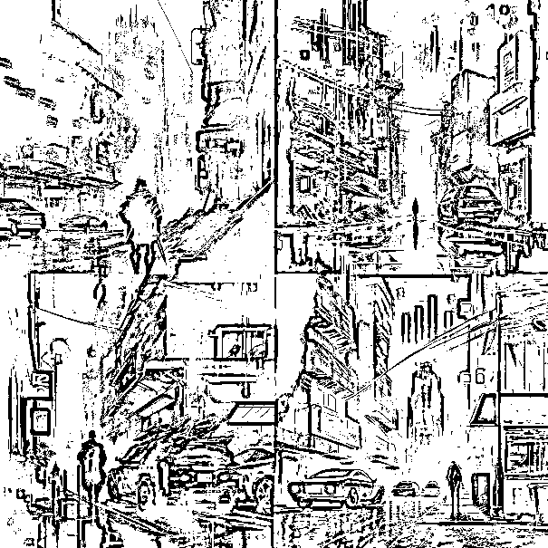  <ne-p id="uc1e77750" data-lake-id="uc1e77750"><ne-text id="uae2d825f" style="color: rgb(51, 51, 51);">好像挺不错的，但是效果感觉没有达到啊，水彩的感觉没有出来。</ne-text></ne-p> <ne-p id="u235b647a" data-lake-id="u235b647a"><ne-text id="uf5974f7c" style="color: rgb(51, 51, 51);">这时候怎么办？我的答案是</ne-text><ne-text id="u43d3175d" ne-bold="true">增加权重</ne-text><ne-text id="u2284047a" style="color: rgb(51, 51, 51);">，告诉 AI 你不要瞎搞，我这是一副水彩画，强调水彩画的重要性。</ne-text></ne-p> <ne-p id="ud83c973f" data-lake-id="ud83c973f"><ne-text id="u9cc1e1c7" style="color: rgb(51, 51, 51);">提示语再次修改为：</ne-text></ne-p> <ne-quote id="uc2754036" data-lake-id="uc2754036"><ne-p id="u309f992d" data-lake-id="u309f992d"><ne-text id="u88d85baf" style="color: rgb(51, 51, 51);">扔进软件里在测试一下，出图的效果是这样的：</ne-text></ne-p> <ne-p id="ud6462cff" data-lake-id="ud6462cff"><ne-card data-card-name="image" data-card-type="inline" id="RFroc" data-event-boundary="card">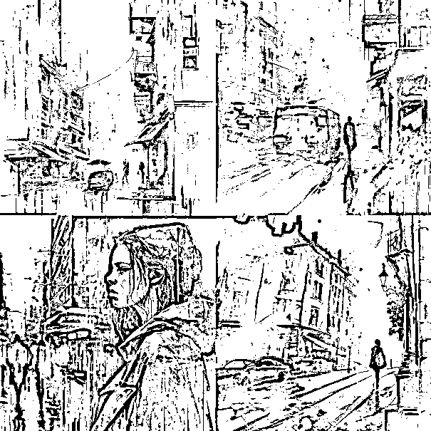  <ne-p id="ucbf9668e" data-lake-id="ucbf9668e"><ne-text id="uf942aee5" style="color: rgb(51, 51, 51);">是不是水彩画和赛博朋克的冲突就体现出来了呢？</ne-text></ne-p> <ne-p id="u032245f3" data-lake-id="u032245f3"><ne-text id="u60365ff9" ne-bold="true">引申：关于权重的问题</ne-text></ne-p> <ne-p id="u721c0be5" data-lake-id="u721c0be5"><ne-text id="u5ca3394c" style="color: rgb(51, 51, 51);">权重的控制，这关系到你想要的东西是否获得了 AI 足够的重视，根据基础 AI 的基础逻辑，越靠前的词汇越受到重视。同时还可以通过其他形式来调整权重。</ne-text></ne-p> <ne-p id="uf43a898e" data-lake-id="uf43a898e"><ne-text id="uab43e50e" style="color: rgb(51, 51, 51);">在这里用 Midjourney 举例，根据官方的使用指南。</ne-text></ne-p> <ne-p id="ua4b82e06" data-lake-id="ua4b82e06"><ne-text id="u4deaa39c" style="color: rgb(51, 51, 51);">在一段词之后加上"：：数字"即可调整权重，基础权重是 1。</ne-text></ne-p> <ne-p id="u2a15c541" data-lake-id="u2a15c541"><ne-text id="u6862633c" style="color: rgb(51, 51, 51);">经询问天辉教练，给出的答案是：</ne-text></ne-p> <ne-p id="uf2d57534" data-lake-id="uf2d57534"><ne-text id="u509aecd1" style="color: rgb(51, 51, 51);">数字的取值范围一般是在 0~5 之间，0~1 之间（如 0.5）会降低权重，1~5 之间（如 2.5）的会增加词语的权重，超过 5 依旧会显示 5 的效果。</ne-text></ne-p> <ne-p id="uadd80080" data-lake-id="uadd80080"><ne-text id="u9b1f4bb0" style="color: rgb(51, 51, 51);">对了，官方给出的解释中，当你使用"--no farms"和"farms：：-0.5"会让这词语不出现在画面中。运用这个可以控制你不想出东西的。</ne-text></ne-p> <ne-p id="ue6d76744" data-lake-id="ue6d76744"><ne-card data-card-name="image" data-card-type="inline" id="dsITy" data-event-boundary="card"><ne-card data-card-name="image" data-card-type="inline" id="HB9Re" data-event-boundary="card">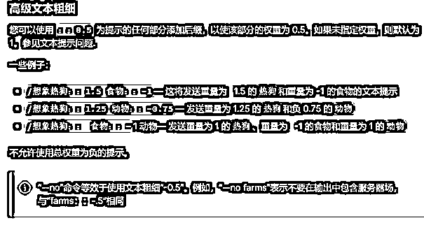  <ne-h3 id="5862f26d" data-lake-id="5862f26d"><ne-heading-ext><ne-heading-anchor></ne-heading-anchor><ne-heading-fold></ne-heading-fold></ne-heading-ext><ne-heading-content><ne-text id="u433ede89" ne-bold="true">2. 如何实现脑海中的想法</ne-text></ne-heading-content></ne-h3> <ne-p id="ua0671051" data-lake-id="ua0671051"><ne-text id="u60cf8501" style="color: rgb(51, 51, 51);">我在群里/抖音/小红书，看到一张好看的图片，也找到了相应的提示语，我要怎么变成我想要的图呢？</ne-text></ne-p> <ne-p id="ubae93040" data-lake-id="ubae93040"><ne-text id="u1f4117e3" style="color: rgb(51, 51, 51);">举个栗子：</ne-text></ne-p> <ne-p id="u49710ec2" data-lake-id="u49710ec2"><ne-card data-card-name="image" data-card-type="inline" id="NnpVB" data-event-boundary="card">  <ne-p id="u08aab6f1" data-lake-id="u08aab6f1"><ne-text id="u7a1ad8f4" style="color: rgb(51, 51, 51);">这是我看到木木在群里分享的一张图，然后她也把提示词贴了出来：</ne-text></ne-p> <ne-quote id="udad07dce" data-lake-id="udad07dce"><ne-p id="ub1ceb9c2" data-lake-id="ub1ceb9c2"><ne-text id="u416ddfb9" style="color: rgb(51, 51, 51);">我感觉不错，但是又有点和我想要的图不太一样。</ne-text></ne-p> <ne-p id="u0864a0b8" data-lake-id="u0864a0b8"><ne-text id="ube24d8fd" style="color: rgb(51, 51, 51);">我想要的是一张图片的左右两边是对称的，还要有中间被分割开来感觉。于是进行分析和改写。</ne-text></ne-p> <ne-p id="u109e9bfc" data-lake-id="u109e9bfc"><ne-text id="u99360f6f" style="color: rgb(51, 51, 51);">分析：</ne-text></ne-p> <ne-p id="ud87c40ef" data-lake-id="ud87c40ef"><ne-text id="u0f1b4734" style="color: rgb(51, 51, 51);">主体：水上的船和水下的章鱼；环境：日出；前后缀：分屏、摄影、电影灯光、创意--ar 2:3--v 4</ne-text></ne-p> <ne-p id="u3a744e9a" data-lake-id="u3a744e9a"><ne-text id="u74eac05b" style="color: rgb(51, 51, 51);">可以看到能让画面分开的是"分屏"这个词语，但是分屏明显不能达到我想要的左右对称的感觉，于是首先要替换的就是这个词，这里我想到的词语是“mirror image”，中文为“镜像”。这个词在牛津词典的释义是可以让你的画面左右对称。</ne-text></ne-p> <ne-p id="u354fcac2" data-lake-id="u354fcac2"><ne-text id="ud42e5cba" style="color: rgb(51, 51, 51);">那么这个词可能会达到我想要达到“对称”的效果。</ne-text></ne-p> <ne-p id="u2bf7d0ad" data-lake-id="u2bf7d0ad"><ne-text id="uea3fb63f" style="color: rgb(51, 51, 51);">那么就只对这个词进行替换，改写后为：</ne-text></ne-p> <ne-quote id="uf4d626b0" data-lake-id="uf4d626b0"><ne-p id="u69334e94" data-lake-id="u69334e94"><ne-text id="u2b70a95a" style="color: rgb(51, 51, 51);">扔进软件里在测试一下，出图的效果是这样的：</ne-text></ne-p> <ne-p id="u390a0b83" data-lake-id="u390a0b83"><ne-card data-card-name="image" data-card-type="inline" id="zfzlb" data-event-boundary="card">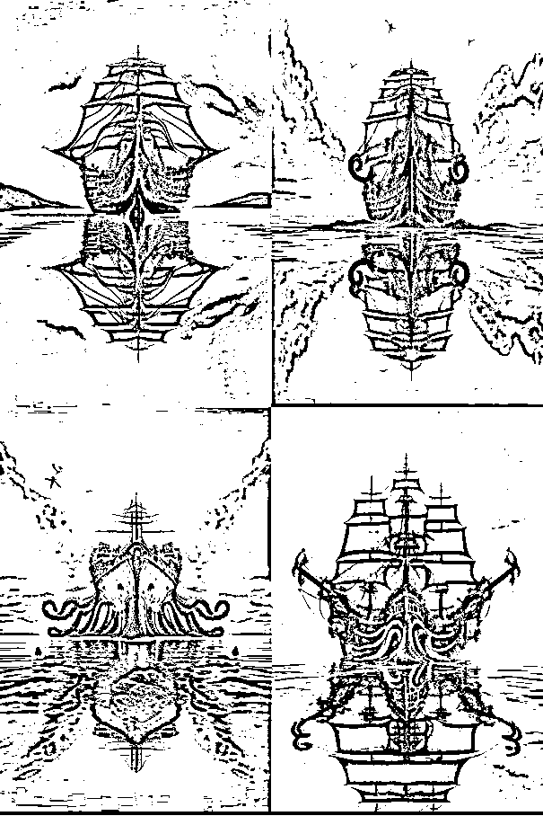  <ne-p id="u606ff4f1" data-lake-id="u606ff4f1"><ne-text id="ud708274e" style="color: rgb(51, 51, 51);">效果还不错，但是我还想要的左右割裂的效果没有达到。</ne-text></ne-p> <ne-p id="u1d255948" data-lake-id="u1d255948"><ne-text id="ub6b4c7de" style="color: rgb(51, 51, 51);">于是再思考一下，什么样子的图即是对称，又是中间割裂呢？如何割裂呢？</ne-text></ne-p> <ne-p id="u292673f5" data-lake-id="u292673f5"><ne-text id="uf0f8ad48" style="color: rgb(51, 51, 51);">我想到了颜色的冲突，对，让画面的左边和右边颜色表现不一致，但是画面保持镜像，是不是又对称又割裂呢？</ne-text></ne-p> <ne-p id="u196fe895" data-lake-id="u196fe895"><ne-text id="ueae0e70a" style="color: rgb(51, 51, 51);">于是对提示词进行添加，使用"half XX and half XX"的写法。</ne-text></ne-p> <ne-p id="u363e97cf" data-lake-id="u363e97cf"><ne-text id="uf2e7d824" style="color: rgb(51, 51, 51);">修改后的提示词：</ne-text></ne-p> <ne-quote id="u92206b0a" data-lake-id="u92206b0a"><ne-p id="u8cdfbdb2" data-lake-id="u8cdfbdb2"><ne-text id="u517568fc" style="color: rgb(51, 51, 51);">扔进软件里在测试一下，出图的效果是这样的：</ne-text></ne-p> <ne-p id="u0ee94a1e" data-lake-id="u0ee94a1e"><ne-card data-card-name="image" data-card-type="inline" id="p2ZrX" data-event-boundary="card">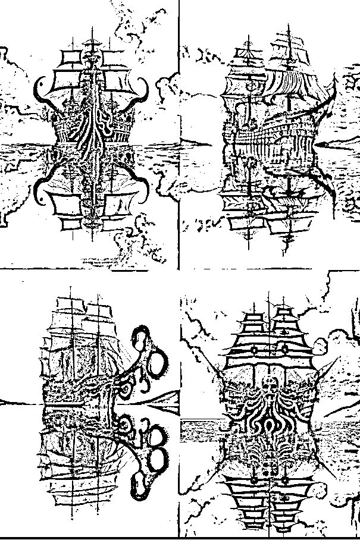  <ne-p id="ue8159166" data-lake-id="ue8159166"><ne-text id="u86966266" style="color: rgb(51, 51, 51);">成功达到了我想要的效果，以上就是如何通过修改别人的提示词来实现自己脑海中的想法的举例。</ne-text></ne-p> <ne-p id="ufd4b3a88" data-lake-id="ufd4b3a88"><ne-text id="u04194b68" style="color: rgb(51, 51, 51);">总结一下就是：根据公式去分析原来的结构，然后提取其中自己想要的效果，接着加入自己的想法，进行测试。</ne-text></ne-p> <ne-p id="u0d1235b9" data-lake-id="u0d1235b9"><ne-text id="u81a32f94" style="color: rgb(51, 51, 51);">我相信很快大家都能够写出令自己满意的关键词来。</ne-text></ne-p> <ne-h3 id="ac965b4d" data-lake-id="ac965b4d"><ne-heading-ext><ne-heading-anchor></ne-heading-anchor><ne-heading-fold></ne-heading-fold></ne-heading-ext><ne-heading-content><ne-text id="uc5621df4" ne-bold="true">3. 完全原创应该如何写</ne-text></ne-heading-content></ne-h3> <ne-p id="u335d548f" data-lake-id="u335d548f"><ne-text id="ua15ef58c" style="color: rgb(51, 51, 51);">当你熟悉了上面 2 个方式之后，对于提示词一定是有了不少的理解了，但是还是会想，所有的都是基于别人的提示词，怎么能够满足自己的需求呢？不能完全原创的话，那就是只能够"有什么用什么"，而不是"用什么有什么"。</ne-text></ne-p> <ne-p id="ub7f3a9f6" data-lake-id="ub7f3a9f6"><ne-text id="u523cfb53" ne-bold="true">接下来就是要告诉大家如何从零开始写一个好的提示词。</ne-text></ne-p> <ne-p id="u2bf69f9f" data-lake-id="u2bf69f9f"><ne-text id="ubf553f23" style="color: rgb(51, 51, 51);">首先复习一下基本的公式： 主体+环境+前后缀</ne-text></ne-p> <ne-p id="ub6df94f4" data-lake-id="ub6df94f4"><ne-text id="ub2618dd6" style="color: rgb(51, 51, 51);">基于这个公式，写下脑海中初步的构想的提示词：</ne-text></ne-p> <ne-p id="u01f34f2e" data-lake-id="u01f34f2e"><ne-text id="u3b2b740c" style="color: rgb(51, 51, 51);">①一个女孩，站一个赛博朋克城市中</ne-text></ne-p> <ne-quote id="u43cd0282" data-lake-id="u43cd0282"><ne-p id="u80fee465" data-lake-id="u80fee465"><ne-text id="u990e3686" style="color: rgb(51, 51, 51);">扔进软件里在测试一下，出图的效果是这样的：</ne-text></ne-p> <ne-p id="u7a5ff94b" data-lake-id="u7a5ff94b"><ne-card data-card-name="image" data-card-type="inline" id="OydOo" data-event-boundary="card" style="color: rgb(51, 51, 51);">  <ne-p id="ue9d15b79" data-lake-id="ue9d15b79"><ne-text id="ue9f341de" style="color: rgb(51, 51, 51);">接着是按照扩句的思路把每一个元素都扩展，让画面随着你的思路来，加强掌控感。</ne-text></ne-p> <ne-p id="ud28218a2" data-lake-id="ud28218a2"><ne-text id="uc839e620" style="color: rgb(51, 51, 51);">②画面很真实，一个女孩，白色长头发，上身穿着黑色棒球服，衣服上有很多金属饰品，双手插在兜里，背对着观众，夜晚的赛博朋克城市正在下雨，街道上还有积水，电影照明效果，</ne-text></ne-p> <ne-quote id="uede3b5a3" data-lake-id="uede3b5a3"><ne-p id="u02743650" data-lake-id="u02743650"><ne-text id="u895841f8" style="color: rgb(51, 51, 51);">扔进软件里在测试一下，出图的效果是这样的：</ne-text></ne-p> <ne-p id="u777c3c7a" data-lake-id="u777c3c7a"><ne-card data-card-name="image" data-card-type="inline" id="fq1Qg" data-event-boundary="card" style="color: rgb(51, 51, 51);">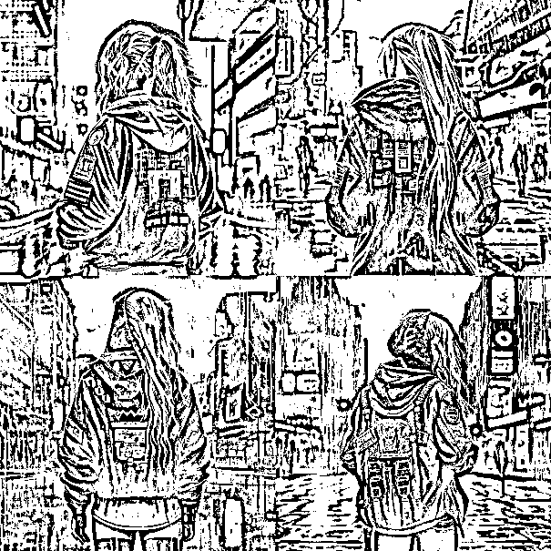  <ne-p id="u15a897ab" data-lake-id="u15a897ab"><ne-text id="ucfbef11d" style="color: rgb(51, 51, 51);">再来一个栗子：如何做一个可爱的头像？</ne-text></ne-p> <ne-p id="u7fc73e92" data-lake-id="u7fc73e92"><ne-text id="ub614241a" style="color: rgb(51, 51, 51);">首先，确定主体，在这里做一个可爱的女孩头像</ne-text></ne-p> <ne-p id="u56e30afd" data-lake-id="u56e30afd"><ne-text id="ue5fe459a" style="color: rgb(51, 51, 51);">①一个女孩，白色的背景，水彩画，上半身</ne-text></ne-p> <ne-quote id="ud0416bdc" data-lake-id="ud0416bdc"><ne-p id="udb3d3b36" data-lake-id="udb3d3b36"><ne-text id="u63a82945" style="color: rgb(51, 51, 51);">扔进软件里在测试一下，出图的效果是这样的：</ne-text></ne-p> <ne-p id="ue407c089" data-lake-id="ue407c089"><ne-card data-card-name="image" data-card-type="inline" id="VELK2" data-event-boundary="card">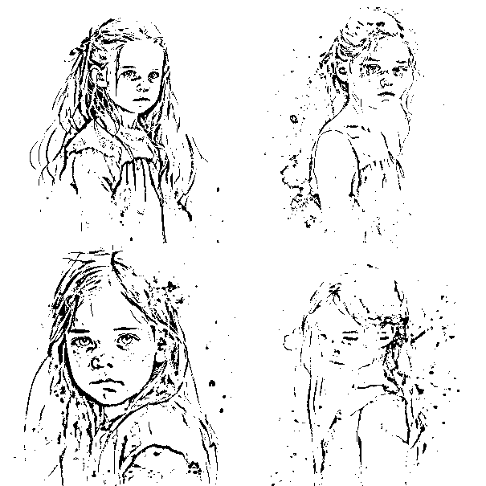  <ne-p id="u2c38f5c8" data-lake-id="u2c38f5c8"><ne-text id="ua743836f" style="color: rgb(51, 51, 51);">结果并不是我想要，那么再来扩句</ne-text><ne-text id="u8b6fedb0" style="color: rgb(73, 73, 73);">。既然是头像那么精致的脸庞必不可少，于是我还想要对五官和发型进行指定，上身的衣服我也想要指定。</ne-text></ne-p> <ne-p id="u051e7be0" data-lake-id="u051e7be0"><ne-text id="u1e996f10" style="color: rgb(51, 51, 51);">②一个女孩，白色的背景，水彩画，上半身，精致的眼睛和脸，蓝色的眼睛，精细的头发纹理，凌乱黑色的头发，戴着一个红色蝴蝶发卡，穿着 T 恤</ne-text></ne-p> <ne-quote id="u7c34cca3" data-lake-id="u7c34cca3"><ne-p id="u6e4979f0" data-lake-id="u6e4979f0"><ne-text id="u27487bf6" style="color: rgb(51, 51, 51);">扔进软件里在测试一下，出图的效果是这样的：</ne-text></ne-p> <ne-p id="u4b0e9e44" data-lake-id="u4b0e9e44"><ne-card data-card-name="image" data-card-type="inline" id="S3mZU" data-event-boundary="card">  <ne-p id="uefada7d6" data-lake-id="uefada7d6"><ne-text id="uc6f96d6a" style="color: rgb(51, 51, 51);">以上就是制作一个头像的思路。</ne-text></ne-p> <ne-p id="ub31bc33e" data-lake-id="ub31bc33e"><ne-text id="u29e93941" style="color: rgb(51, 51, 51);">注：以上测试出图均来自"画了个画"小程序，目前的 AI 绘画技术主要是基于 Diffusion 这个技术来的，只是框架和源码模型不同。各种工具的玩法其实差不多，大同小异。基础的写作理论都是通用的，你既可以用于 画了个画，也可以用于 SD，还可以用于</ne-text><ne-text id="ucd9cec57" style="color: rgb(0, 0, 0);">Midjourney、Nijidjourney，当然也可以用于 Novel AI。</ne-text></ne-p> <ne-p id="u1792f0ff" data-lake-id="u1792f0ff"><ne-text id="u9c489089" ne-bold="true">总结：根据公式  主体+环境+前后缀</ne-text></ne-p> <ne-p id="u48535961" data-lake-id="u48535961"><ne-text id="u1556b4f1" style="color: rgb(51, 51, 51);">然后将你想要的内容套进公式里，每一项都进行丰富，就可以得到一个好的提示词</ne-text></ne-p> <ne-h3 id="db3f2eb4" data-lake-id="db3f2eb4"><ne-heading-ext><ne-heading-anchor></ne-heading-anchor><ne-heading-fold></ne-heading-fold></ne-heading-ext><ne-heading-content><ne-text id="u3dd3bddd" ne-bold="true">4. 如何看图推提示词</ne-text></ne-heading-content></ne-h3> <ne-p id="u735898d6" data-lake-id="u735898d6"><ne-text id="u9c473c33" style="color: rgb(51, 51, 51);">很多人都遇见过一个问题，我只是在抖音/小红书等平台看到一张图，觉得很好看，但是找不到它的关键词要怎么办？</ne-text></ne-p> <ne-p id="u2a92e97f" data-lake-id="u2a92e97f"><ne-text id="u5cb619ab" style="color: rgb(51, 51, 51);">①根据图片中的画面去“画廊”中寻找类似的图片，运气好可以直接找到原图。</ne-text></ne-p> <ne-p id="u98cb5413" data-lake-id="u98cb5413"><ne-text id="ue8729fd4" style="color: rgb(51, 51, 51);">②“画廊”中也找不到，那么试试 AI 识图，反推提示词。</ne-text></ne-p> <ne-p id="u3c54bfaf" data-lake-id="u3c54bfaf"><ne-text id="u806040d3" style="color: rgb(51, 51, 51);">③我没有现成的工具怎么办？那就自己来“看图猜话”吧！</ne-text></ne-p> <ne-p id="u3226808e" data-lake-id="u3226808e"><ne-text id="ufa0a2a89" style="color: rgb(51, 51, 51);">怎么做？还是基于公式</ne-text> <ne-text id="u925f2cfe" ne-bold="true">主体+环境+前后缀</ne-text></ne-p> <ne-p id="u7c5b73e6" data-lake-id="u7c5b73e6"><ne-text id="u0d83c7e9" style="color: rgb(51, 51, 51);">先去观察画面中什么是最主要的部分，有什么特征，先写下来。接着去观察整体画面的环境、背景中有什么内容，接着是加上识别的画风和一些常用提示优质画风的词语。</ne-text></ne-p> <ne-p id="ufdd270b0" data-lake-id="ufdd270b0"><ne-text id="u74982c69" style="color: rgb(51, 51, 51);">举个栗子：</ne-text></ne-p> <ne-p id="u6d7d5579" data-lake-id="u6d7d5579"><ne-text id="u869386e2" style="color: rgb(51, 51, 51);">航海过程中，有圈友发出一张图片问应该如何拆解：</ne-text></ne-p> <ne-p id="uc4a532d5" data-lake-id="uc4a532d5"><ne-card data-card-name="image" data-card-type="inline" id="qF1b9" data-event-boundary="card">  <ne-p id="u02fdcfcb" data-lake-id="u02fdcfcb"><ne-text id="u8318ce00" style="color: rgb(51, 51, 51);">点开大图是这样的：</ne-text></ne-p> <ne-p id="u982a7986" data-lake-id="u982a7986"><ne-card data-card-name="image" data-card-type="inline" id="DH73Q" data-event-boundary="card">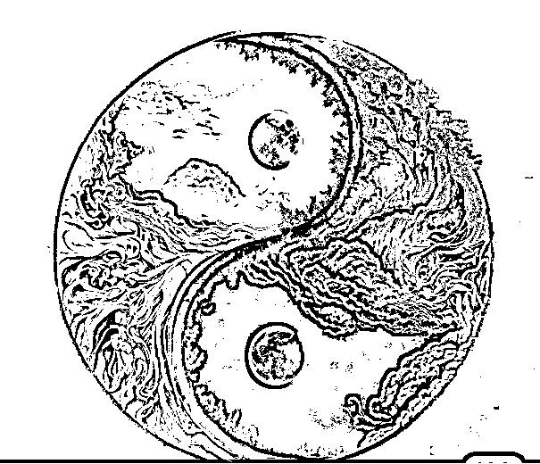  <ne-p id="ue8c79dd7" data-lake-id="ue8c79dd7"><ne-text id="u96d13bf1" style="color: rgb(51, 51, 51);">那么首先根据公式：主体是个太极，次要的有两个月亮，环境是云海，前后缀先只加一个环，对称，用 v4 引擎。</ne-text></ne-p> <ne-p id="u22bdd904" data-lake-id="u22bdd904"><ne-text id="u01de9ce6" style="color: rgb(51, 51, 51);">整合起来就是：</ne-text></ne-p> <ne-quote id="uaabf3ed1" data-lake-id="uaabf3ed1"><ne-p id="u165465e6" data-lake-id="u165465e6"><ne-text id="u8ffb179b" style="color: rgb(51, 51, 51);">扔进软件里试试看：</ne-text></ne-p> <ne-p id="u4d8b14d7" data-lake-id="u4d8b14d7"><ne-card data-card-name="image" data-card-type="inline" id="b5X9H" data-event-boundary="card" style="color: rgb(51, 51, 51);"><ne-card data-card-name="image" data-card-type="inline" id="lePB7" data-event-boundary="card">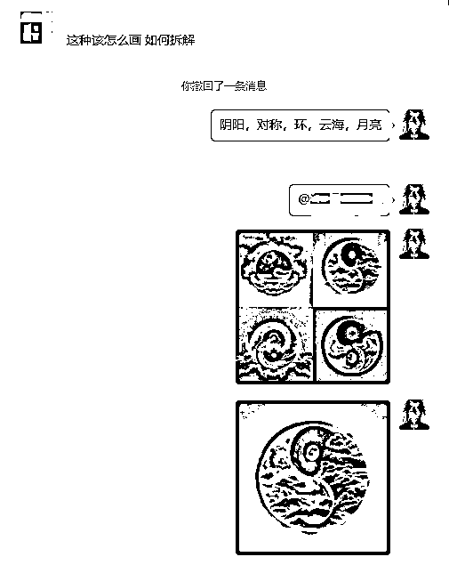  <ne-p id="u8ecc9277" data-lake-id="u8ecc9277"><ne-text id="u35ea5a47" style="color: rgb(51, 51, 51);">基本上有 70%-80%相似了，接下来就是细化和改造的问题了。</ne-text></ne-p> <ne-p id="u4c5cd84d" data-lake-id="u4c5cd84d"><ne-text id="uae3719ec" style="color: rgb(51, 51, 51);">但是我没有继续细化，因为我想要的是和别人相似，而不是一模一样，一模一样会出现抄袭问题。但是 70%-80%没什么关系，学习整个框架，剩下自己来改造，生成属于你自己的图片。</ne-text></ne-p> <ne-p id="u6c2bbc12" data-lake-id="u6c2bbc12"><ne-text id="u1ab949c6" style="color: rgb(51, 51, 51);">④运用“黑科技”chatGPT</ne-text></ne-p> <ne-p id="u4e17bd12" data-lake-id="u4e17bd12"><ne-text id="u70b8fa1b" style="color: rgb(51, 51, 51);">比如这样的：</ne-text></ne-p> <ne-p id="u82819982" data-lake-id="u82819982"><ne-card data-card-name="image" data-card-type="inline" id="vGwRv" data-event-boundary="card">  <ne-p id="u8c369ede" data-lake-id="u8c369ede"><ne-text id="u7b847d02" style="color: rgb(51, 51, 51);">把你看到的画面描述出来，让 chatGPT 帮助你写提示词，用 AI+AI。</ne-text></ne-p> <ne-h3 id="b608878c" data-lake-id="b608878c"><ne-heading-ext><ne-heading-anchor></ne-heading-anchor><ne-heading-fold></ne-heading-fold></ne-heading-ext><ne-heading-content><ne-text id="ua84981bc" ne-bold="true">5. AI 绘画的一些技巧</ne-text></ne-heading-content></ne-h3> <ne-p id="u2f0b693e" data-lake-id="u2f0b693e"><ne-text id="u226d41ce" style="color: rgb(51, 51, 51);">①优先符合“常识”</ne-text></ne-p> <ne-p id="u43615833" data-lake-id="u43615833"><ne-text id="u357211a3" style="color: rgb(51, 51, 51);">AI 在识别并生成图片的时候，会根据你的提示词优先去匹配是否符合“常识”逻辑，</ne-text></ne-p> <ne-p id="u5cc2f842" data-lake-id="u5cc2f842"><ne-text id="u2bfa6fe9" style="color: rgb(51, 51, 51);">当你的提示词不符合常识逻辑，那么 AI 就将其强行融合到一起，变成一种“怪图”</ne-text></ne-p> <ne-p id="u1d3a47cc" data-lake-id="u1d3a47cc"><ne-text id="uc3a3714a" style="color: rgb(51, 51, 51);">这里的常识包括生活、幻想、电影等等。</ne-text></ne-p> <ne-p id="uf18de1b2" data-lake-id="uf18de1b2"><ne-text id="u08608d9c" style="color: rgb(51, 51, 51);">比如，要在一张图里看见“三视图”这个角度，就不符合常识，但是 AI 为了满足你的需求，就会强行融合。比如这样的</ne-text></ne-p> <ne-quote id="ua5bdb0a7" data-lake-id="ua5bdb0a7"><ne-p id="u01cf45d7" data-lake-id="u01cf45d7"><ne-card data-card-name="image" data-card-type="inline" id="wzUEX" data-event-boundary="card">  <ne-p id="u8898148d" data-lake-id="u8898148d"><ne-text id="udbc5e4a6" style="color: rgb(51, 51, 51);">AI 确实给我出了个三视图，三个视角都看见了，但是图就很奇怪。</ne-text></ne-p> <ne-p id="u264fc98b" data-lake-id="u264fc98b"><ne-text id="u29014ac1" style="color: rgb(51, 51, 51);">那么在不违背常事的情况下，什么时候有三视图呢？</ne-text></ne-p> <ne-p id="u6d73a5be" data-lake-id="u6d73a5be"><ne-text id="uf91598f0" style="color: rgb(51, 51, 51);">设计图，reference sheet，组合到一起提示词：</ne-text></ne-p> <ne-quote id="u04388f02" data-lake-id="u04388f02"><ne-p id="ua92b330f" data-lake-id="ua92b330f"><ne-text id="u16e4a32f" style="color: rgb(51, 51, 51);">扔进软件测试 如下：</ne-text></ne-p> <ne-p id="uf56d6140" data-lake-id="uf56d6140"><ne-card data-card-name="image" data-card-type="inline" id="fw0KF" data-event-boundary="card">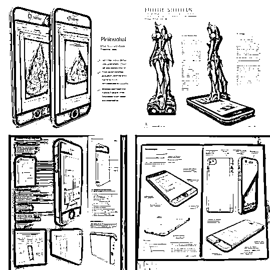  <ne-p id="u96b17fba" data-lake-id="u96b17fba"><ne-text id="u2ebf5ea8" style="color: rgb(51, 51, 51);">非常合情合理，没问题。</ne-text></ne-p> <ne-p id="u59caa0d4" data-lake-id="u59caa0d4"><ne-text id="u02d4c914" style="color: rgb(51, 51, 51);">②主体与场景的比例</ne-text></ne-p> <ne-p id="u3ab76f1e" data-lake-id="u3ab76f1e"><ne-text id="u2528e45d" style="color: rgb(51, 51, 51);">通过对主体和场景的权重进行调整，可以调整主体的大小和占比（权重的控制见上面的引申内容）；另外对主体加强细节描写也可以调整主体的显示范围；还可以调整视角运用“特写镜头”，</ne-text></ne-p> <ne-p id="u3ded2537" data-lake-id="u3ded2537"><ne-text id="uef8c7bdb" style="color: rgb(51, 51, 51);">③画风对出图效果影响巨大</ne-text></ne-p> <ne-p id="u2ec6d18a" data-lake-id="u2ec6d18a"><ne-text id="ud7aa5e7f" style="color: rgb(51, 51, 51);">画风对出图的效果影响巨大，直接影响画面整体效果</ne-text></ne-p> <ne-p id="ue3a51406" data-lake-id="ue3a51406"><ne-card data-card-name="image" data-card-type="inline" id="O2NE3" data-event-boundary="card" style="color: rgb(51, 51, 51);">  <ne-p id="u45cae759" data-lake-id="u45cae759"><ne-text id="ua6b20f4b" style="color: rgb(51, 51, 51);">图源自网络，by suzakiz</ne-text></ne-p> <ne-p id="u13976896" data-lake-id="u13976896"><ne-text id="u4f1fef41" style="color: rgb(51, 51, 51);">④为何我的画不好看？</ne-text></ne-p> <ne-p id="uba2651b5" data-lake-id="uba2651b5"><ne-text id="uebd452dc" style="color: rgb(51, 51, 51);">第一种情况，运用的模型不理想。</ne-text></ne-p> <ne-p id="u11ab0297" data-lake-id="u11ab0297"><ne-text id="ue8ed903a" style="color: rgb(51, 51, 51);">第二种情况，也是最多的情况。是你没有定义清晰，描述不够具体。比如只告诉 AI 你要画一只猫，很可能效果不好。但是你告诉 AI 是一只可爱毛茸茸的布偶猫，有着蓝色眼睛，戴着红色小帽子，蹲坐在地上。这样的效果肯定会好很多。</ne-text></ne-p> <ne-h2 id="794e798f" data-lake-id="794e798f"><ne-heading-ext><ne-heading-anchor></ne-heading-anchor><ne-heading-fold></ne-heading-fold></ne-heading-ext><ne-heading-content><ne-text id="ua271c356" ne-bold="true">（三） 如何运用 AI</ne-text></ne-heading-content></ne-h2> <ne-h3 id="4fe8b9dd-3" data-lake-id="4fe8b9dd-3"><ne-heading-ext><ne-heading-anchor></ne-heading-anchor><ne-heading-fold></ne-heading-fold></ne-heading-ext><ne-heading-content></ne-heading-content></ne-h3><ne-h3 id="c7a80799" data-lake-id="c7a80799"><ne-heading-ext><ne-heading-anchor></ne-heading-anchor><ne-heading-fold></ne-heading-fold></ne-heading-ext><ne-heading-content><ne-text id="ud57a68af" ne-bold="true">1.AI 绘画会冲击谁</ne-text></ne-heading-content></ne-h3> <ne-p id="ud75d8781" data-lake-id="ud75d8781"><ne-text id="u575df1ed" style="color: rgb(51, 51, 51);">①低端画师</ne-text></ne-p> <ne-p id="u6462255d" data-lake-id="u6462255d"><ne-text id="u14f8e208" style="color: rgb(51, 51, 51);">②创意素材</ne-text></ne-p> <ne-p id="u47f68e67" data-lake-id="u47f68e67"><ne-text id="ub1de55c6" style="color: rgb(51, 51, 51);">③低端广告设计师</ne-text></ne-p> <ne-p id="u3c0909fa" data-lake-id="u3c0909fa"><ne-text id="ud181e0e0" style="color: rgb(51, 51, 51);">低端的一些简单的头像定制、人物图、同人图、创意素材，平面广告设计肯定是会受到冲击的，还有之前流行过的照片转手绘，随着 AI 绘画越来越强大注定是要被取代，这也是倒逼画师们、设计师们精进自己，越来越强，否则只能是被 AI 劝退。</ne-text></ne-p> <ne-h3 id="7eaa360b" data-lake-id="7eaa360b"><ne-heading-ext><ne-heading-anchor></ne-heading-anchor><ne-heading-fold></ne-heading-fold></ne-heading-ext><ne-heading-content><ne-text id="u22e5dca0" ne-bold="true">2.变现的几个方式</ne-text></ne-heading-content></ne-h3> <ne-p id="ud0c99971" data-lake-id="ud0c99971"><ne-text id="u7f415153" style="color: rgb(51, 51, 51);">①卖关键词</ne-text></ne-p> <ne-p id="u0c96ef02" data-lake-id="u0c96ef02"><ne-text id="u25f8afb9" style="color: rgb(51, 51, 51);">卖关键词已经在淘宝、咸鱼等平台屡见不鲜了，虽然价格低，但是量大依旧能赚不少钱。</ne-text></ne-p> <ne-p id="uc879c345" data-lake-id="uc879c345"><ne-text id="ue0650bb5" style="color: rgb(51, 51, 51);">②做教学课程、做社群</ne-text></ne-p> <ne-p id="u916a49c8" data-lake-id="u916a49c8"><ne-text id="ud396d347" style="color: rgb(51, 51, 51);">当你有了一定的技巧和稳定的输出能力，那么做教学和课程也是能够赚到钱的，卖铲子一直都会是门好生意。</ne-text></ne-p> <ne-p id="u793be5f6" data-lake-id="u793be5f6"><ne-text id="ua80a7451" style="color: rgb(51, 51, 51);">③接定制</ne-text></ne-p> <ne-p id="uc08a712c" data-lake-id="uc08a712c"><ne-text id="u25e9423f" style="color: rgb(51, 51, 51);">定制头像、图片、壁纸，SD 工具上的私人模型，都是可行的。</ne-text></ne-p> <ne-p id="uabeddba3" data-lake-id="uabeddba3"><ne-text id="uc8fa73bb" style="color: rgb(51, 51, 51);">④做平台</ne-text></ne-p> <ne-p id="u04717e01" data-lake-id="u04717e01"><ne-text id="uba405f24" style="color: rgb(51, 51, 51);">程序员做好前端，把已有的平台通过 API 的形式去接好，做平台也是可以的。这一块我没有这个技术，只能是说个大概。</ne-text></ne-p> <ne-p id="u361eda71" data-lake-id="u361eda71"><ne-text id="ubf4cb03b" style="color: rgb(51, 51, 51);">⑤我自己做了什么</ne-text></ne-p> <ne-p id="u58cf2167" data-lake-id="u58cf2167"><ne-text id="u9aaca60c" style="color: rgb(51, 51, 51);">刘润老师说，所有的生意都是把“人”（消费者）和“货”（商品）连接在一起，同时你要知道“场”在哪里。我个人选择的场是小红书，货就是我制作的画。</ne-text></ne-p> <ne-p id="ud4603390" data-lake-id="ud4603390"><ne-text id="ub1989bd7" style="color: rgb(51, 51, 51);">我从来也没有弄过小红书，纯粹小白一个，什么都不懂，我也不知道观众喜欢什么，我也并不最清楚是否会有人喜欢我的画，我能做的就是对标，找到我自己感兴趣的号主，看看别人的思路，保持一直发。</ne-text></ne-p> <ne-p id="u03e0b757" data-lake-id="u03e0b757"><ne-text id="uea2b1bf9" style="color: rgb(51, 51, 51);">一开始发了两周也一直都没有流量，小眼睛基本不过百，点赞也只有个位数，评论根本没有。其实挺丧气的，也去问过天辉。告诉我在没有爆发前，号都是属于在泛流量的小池子里，没有平台不知道谁喜欢你的，没有流量很正常。要么蹭热度，要么保持一直发。</ne-text></ne-p> <ne-p id="u0596dae4" data-lake-id="u0596dae4"><ne-text id="u642a9b2d" style="color: rgb(51, 51, 51);">我自己倒是觉得先试试看，反正边学边做边思考，于是就一直坚持发。直到有一篇小红书点赞过百了，突然觉得挺有趣了，正向反馈总算是来了，更有动力去坚持了。</ne-text></ne-p> <ne-p id="ub102b732" data-lake-id="ub102b732"><ne-text id="ue470093e" style="color: rgb(51, 51, 51);">同时也开始了想要做原创的念头，于是精心制作了 poker 系列， 但是效果很不理想。</ne-text></ne-p> <ne-p id="ua2f55d3d" data-lake-id="ua2f55d3d"><ne-text id="u5fcd7225" style="color: rgb(51, 51, 51);">因为平台的规则，它是一个流量池一个流量池向上逐级递增的，刚开始的小号，粉丝基数少平台也不知道把你推给谁，这个时候的推送就是泛粉，点开某个标签进来看看的粉。他们不并定喜欢你的作品，不看你的作品也是正常事情。但是我初期突破不了小流量池，无法获得大的推送流量，主打的原创系列，直接就被这个随机性被埋没了。</ne-text></ne-p> <ne-p id="u0a47bc14" data-lake-id="u0a47bc14"><ne-text id="u7e923545" style="color: rgb(51, 51, 51);">天辉告诉我，前期这个阶段就是要追着流量走，哪里流量大，哪里有热点，就往哪个方向追，也就是要去蹭热点。先把粉丝基数堆起来，把曝光几率拉高，让第一时间看到你笔记的人，有更多想要点进来看的欲望，快速去突破初级的流量池。这样我的笔记才会有更大几率被更多的人看到，人多了，自然就会有喜欢你的人，形成一个良性循环。</ne-text></ne-p> <ne-p id="u813d0771" data-lake-id="u813d0771"><ne-text id="u28af0088" style="color: rgb(51, 51, 51);">在无人关注的阶段，要先追寻热点，快速起流量。</ne-text></ne-p> <ne-p id="uec1a79e9" data-lake-id="uec1a79e9"><ne-text id="u732fbf53" style="color: rgb(51, 51, 51);">当你出现爆款时，追着爆款发，积累起垂直粉丝。</ne-text></ne-p> <ne-p id="u359212a6" data-lake-id="u359212a6"><ne-text id="u950cee84" style="color: rgb(51, 51, 51);">当你的粉丝多起来后，之前的爆款不新鲜了，这个时候再求变化。</ne-text></ne-p> <ne-p id="u181f73df" data-lake-id="u181f73df"><ne-text id="ua17e3e8e" style="color: rgb(51, 51, 51);">同时还有一点要注意的，不是哪个爆款就要追哪个，而是与长期规划要有关联。找寻到爆款中爆款因子，想一想这个爆款图与其他的笔记之间有什么不同，将之运用起来。</ne-text></ne-p> <ne-p id="ubf2dff26" data-lake-id="ubf2dff26"><ne-text id="u8c7a0b94" style="color: rgb(51, 51, 51);">于是在这个没有流量的阶段，我停下了发 poker 系列的脚步，转头去寻找属于我自己的“爆款因子”。去寻找先让自己火起来的方式，等待之后爆发再去继续我的 poker 系列。</ne-text></ne-p> <ne-p id="u2db5fa50" data-lake-id="u2db5fa50"><ne-text id="u2a459002" style="color: rgb(51, 51, 51);">慢慢的在小红书上开始有人想和我学习技术，也有人找我定制头像。渐渐地到和小伙伴们组建社群，做关于思考、拆解的分享。我自己做社区，并不是只分享关键词，而是拆解，告诉大家如何去做一张这样的图。大家在学习之后能够自己动手、修改形成新的头脑风暴，让大家脑海中的画面呈现出来，让每一个人都变得更优秀。</ne-text></ne-p> <ne-p id="u0439bfce" data-lake-id="u0439bfce"><ne-card data-card-name="image" data-card-type="inline" id="E2JlV" data-event-boundary="card">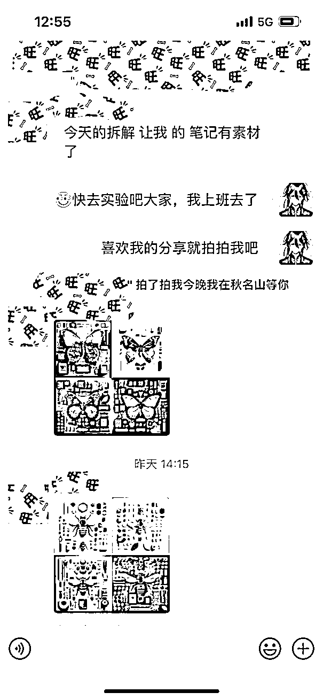  <ne-p id="u1bd8b536" data-lake-id="u1bd8b536"><ne-card data-card-name="image" data-card-type="inline" id="LO8QB" data-event-boundary="card">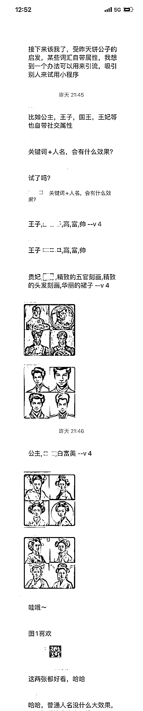  <ne-h3 id="4a27c9bc" data-lake-id="4a27c9bc"><ne-heading-ext><ne-heading-anchor></ne-heading-anchor><ne-heading-fold></ne-heading-fold></ne-heading-ext><ne-heading-content><ne-text id="u27a63110" ne-bold="true">3.运用示例：</ne-text></ne-heading-content></ne-h3> <ne-h5 id="4fe8b9dd-4" data-lake-id="4fe8b9dd-4"><ne-heading-ext><ne-heading-anchor></ne-heading-anchor><ne-heading-fold></ne-heading-fold></ne-heading-ext><ne-heading-content></ne-heading-content></ne-h5><ne-h5 id="08e4796f" data-lake-id="08e4796f"><ne-heading-ext><ne-heading-anchor></ne-heading-anchor><ne-heading-fold></ne-heading-fold></ne-heading-ext><ne-heading-content><ne-text id="uc18eee98" ne-bold="true">l 三视图</ne-text></ne-heading-content></ne-h5> <ne-p id="u59e6f392" data-lake-id="u59e6f392"><ne-card data-card-name="image" data-card-type="inline" id="xpfNZ" data-event-boundary="card">  <ne-h5 id="0680a74c" data-lake-id="0680a74c"><ne-heading-ext><ne-heading-anchor></ne-heading-anchor><ne-heading-fold></ne-heading-fold></ne-heading-ext><ne-heading-content><ne-text id="uc8187d0a" ne-bold="true">l 拆解图</ne-text></ne-heading-content></ne-h5> <ne-p id="u0a284b3b" data-lake-id="u0a284b3b"><ne-card data-card-name="image" data-card-type="inline" id="Oa3Tg" data-event-boundary="card">  <ne-h5 id="ed58005c" data-lake-id="ed58005c"><ne-heading-ext><ne-heading-anchor></ne-heading-anchor><ne-heading-fold></ne-heading-fold></ne-heading-ext><ne-heading-content><ne-text id="ue3ecac3e" ne-bold="true">l 设计蓝图</ne-text></ne-heading-content></ne-h5> <ne-p id="ufb516638" data-lake-id="ufb516638"><ne-card data-card-name="image" data-card-type="inline" id="vePqV" data-event-boundary="card">  <ne-h5 id="8189f0fa" data-lake-id="8189f0fa"><ne-heading-ext><ne-heading-anchor></ne-heading-anchor><ne-heading-fold></ne-heading-fold></ne-heading-ext><ne-heading-content><ne-text id="u166f33a9" ne-bold="true">l 人物设定图</ne-text></ne-heading-content></ne-h5> <ne-p id="uebe81f33" data-lake-id="uebe81f33"><ne-card data-card-name="image" data-card-type="inline" id="u0QUV" data-event-boundary="card">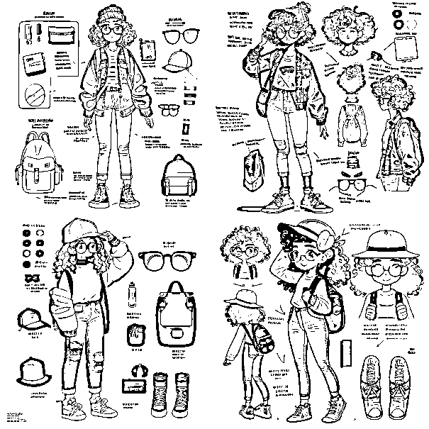  <ne-h5 id="255d146c" data-lake-id="255d146c"><ne-heading-ext><ne-heading-anchor></ne-heading-anchor><ne-heading-fold></ne-heading-fold></ne-heading-ext><ne-heading-content><ne-text id="uc8d181a0" ne-bold="true">l UI 图</ne-text></ne-heading-content></ne-h5> <ne-p id="ud58d0d16" data-lake-id="ud58d0d16"><ne-card data-card-name="image" data-card-type="inline" id="w7haL" data-event-boundary="card">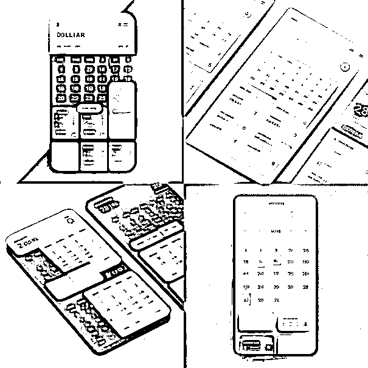  <ne-p id="u1bc6328e" data-lake-id="u1bc6328e"><ne-text id="uf842f07e" style="color: rgb(51, 51, 51);">图源自@刘楚宾</ne-text></ne-p> <ne-h5 id="bdffa11a" data-lake-id="bdffa11a"><ne-heading-ext><ne-heading-anchor></ne-heading-anchor><ne-heading-fold></ne-heading-fold></ne-heading-ext><ne-heading-content><ne-text id="uff73f6de" ne-bold="true">l 渲染图</ne-text></ne-heading-content></ne-h5> <ne-p id="ub1604a89" data-lake-id="ub1604a89"><ne-card data-card-name="image" data-card-type="inline" id="XSGnv" data-event-boundary="card">  <ne-h5 id="6b52954c" data-lake-id="6b52954c"><ne-heading-ext><ne-heading-anchor></ne-heading-anchor><ne-heading-fold></ne-heading-fold></ne-heading-ext><ne-heading-content><ne-text id="u6494925c" ne-bold="true">l 广告创意图</ne-text></ne-heading-content></ne-h5> <ne-p id="uf3e1c297" data-lake-id="uf3e1c297"><ne-card data-card-name="image" data-card-type="inline" id="u1TE9" data-event-boundary="card">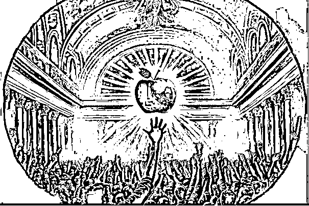  <ne-p id="u1e1aaf4e" data-lake-id="u1e1aaf4e"><ne-text id="udc51bc68" style="color: rgb(51, 51, 51);">图源自小红书</ne-text></ne-p> <ne-h5 id="b59f1d87" data-lake-id="b59f1d87"><ne-heading-ext><ne-heading-anchor></ne-heading-anchor><ne-heading-fold></ne-heading-fold></ne-heading-ext><ne-heading-content><ne-text id="ua2a4e34f" ne-bold="true">l 产品 kv 图</ne-text></ne-heading-content></ne-h5> <ne-p id="u4ec5b939" data-lake-id="u4ec5b939"><ne-card data-card-name="image" data-card-type="inline" id="I1aJ4" data-event-boundary="card">  <ne-p id="u9ebbc8c8" data-lake-id="u9ebbc8c8"><ne-text id="ub1c90158" style="color: rgb(51, 51, 51);">图源自小红书</ne-text></ne-p> <ne-h5 id="5b6208fa" data-lake-id="5b6208fa"><ne-heading-ext><ne-heading-anchor></ne-heading-anchor><ne-heading-fold></ne-heading-fold></ne-heading-ext><ne-heading-content><ne-text id="u8e5fb723" ne-bold="true">l 投放效果图</ne-text></ne-heading-content></ne-h5> <ne-p id="u1f92172a" data-lake-id="u1f92172a"><ne-card data-card-name="image" data-card-type="inline" id="c2roq" data-event-boundary="card">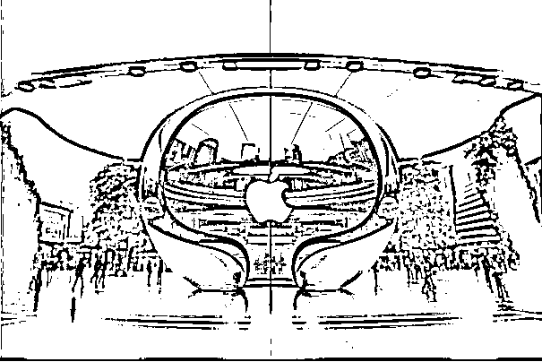  <ne-p id="u37f36e1b" data-lake-id="u37f36e1b"><ne-text id="uac318574" style="color: rgb(51, 51, 51);">图源自小红书</ne-text></ne-p> <ne-h5 id="2b135245" data-lake-id="2b135245"><ne-heading-ext><ne-heading-anchor></ne-heading-anchor><ne-heading-fold></ne-heading-fold></ne-heading-ext><ne-heading-content><ne-text id="ub1caf8b3" ne-bold="true">l 环境建筑效果图</ne-text></ne-heading-content></ne-h5> <ne-p id="u5b7e82a7" data-lake-id="u5b7e82a7"><ne-card data-card-name="image" data-card-type="inline" id="vhYQ3" data-event-boundary="card">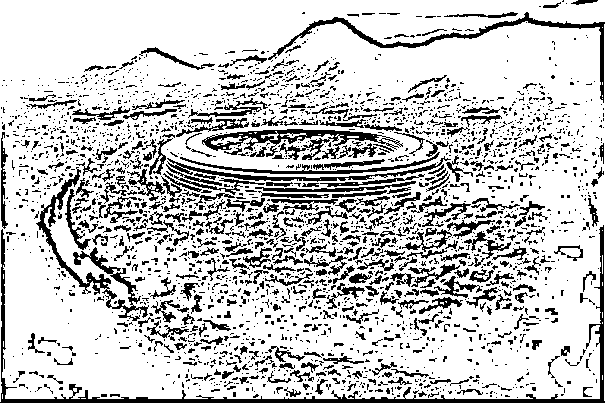  <ne-p id="u7229af3d" data-lake-id="u7229af3d"><ne-text id="ud9273287" style="color: rgb(51, 51, 51);">图源自小红书</ne-text></ne-p> <ne-h3 id="470b9b51-1" data-lake-id="470b9b51-1"><ne-heading-ext><ne-heading-anchor></ne-heading-anchor><ne-heading-fold></ne-heading-fold></ne-heading-ext> <ne-heading-content></ne-heading-content></ne-h3> <ne-h2 id="82b1e339" data-lake-id="82b1e339"><ne-heading-ext><ne-heading-anchor></ne-heading-anchor><ne-heading-fold></ne-heading-fold></ne-heading-ext><ne-heading-content><ne-text id="u22af73f1" ne-bold="true">（四） AI 绘画到底意味着什么</ne-text></ne-heading-content></ne-h2> <ne-p id="ufa2ad374" data-lake-id="ufa2ad374"><ne-text id="ube3cd3cc" style="color: rgb(51, 51, 51);">AI 绘画终究是一个工具，并不能完全取代画师，但是起码可以帮助普通人，用较低的成本去描绘出脑海中浮现的画面。</ne-text></ne-p> <ne-p id="ud5fec47c" data-lake-id="ud5fec47c"><ne-text id="u83798a3e" style="color: rgb(51, 51, 51);">同时，他在高级创意人员的手中，成为了创意辅助者，可以快速的开启头脑风暴，生成草图，极大的加快了整个设计进度。</ne-text></ne-p> <ne-p id="u036dbe99" data-lake-id="u036dbe99"><ne-text id="u4d96e4a2" style="color: rgb(51, 51, 51);">还意味着一个“内卷”的时代开启，普通人也拥有了一般画师、设计师的水平，倒逼从业人员研究新的生存方向。</ne-text></ne-p> <ne-p id="u2c6b37cd" data-lake-id="u2c6b37cd"><ne-text id="ubf3de6da" style="color: rgb(51, 51, 51);">说到底，个人觉得 AI 绘画本质就是光影的艺术，到了最后比拼的还是基本功和创意思路。比如艺术鉴赏能力，分析组合能力，对工具的掌握熟练程度。AI 只不过是帮你快速把脑海中的图像呈现出来，然后给出很多方案去选择。现在有了 chatGPT，有很多差距更可以被抹平。或许，AI 这个工具不是用来追一张图的效果，而是从一张图拿到灵感去创作属于自己的作品。</ne-text></ne-p> <ne-p id="ua9f4f591" data-lake-id="ua9f4f591"><ne-text id="u55f61f8a" style="color: rgb(51, 51, 51);">大家现在要做的就是掌握这门技巧，平台软件有很多，但是基础底层逻辑是一致的，掌握了就一通百通，不必为了挑选工具而去浪费过多的时间。快速去熟悉一个工具，运用最省力原则，怎么简单怎么来，先上手，先做起来才是重点。就像是你会用 office，还能不会 wps 吗。学会了驾驶技能之后，驾驶大众和宝马其实难度都差不多不是吗？</ne-text></ne-p> <ne-p id="u3201cc79" data-lake-id="u3201cc79"><ne-text id="u3261f2cf" style="color: rgb(51, 51, 51);">风口刚刚开启，腾讯和微博也才刚起步入场，未来的想象空间也很大。希望每个小伙伴都能在这里赚到属于自己的那一份财富。</ne-text></ne-p> <ne-p id="uc81b8990" data-lake-id="uc81b8990"><ne-text id="ub1c2eb3e" style="color: rgb(51, 51, 51);">最后感谢生财可以给到一个让我发光发亮的平台，感谢从人群中发现我的天辉教练，给我帮助的有饭助教，豆子小姐姐，筑梦大佬。感谢几位一起努力的小伙伴：木木｜终身成长践行者、阿狸、诗农、刘楚宾。没有大家的帮助我一个人也难以行进下去。</ne-text></ne-p> <ne-p id="u4c1d1e75" data-lake-id="u4c1d1e75"><ne-text id="ue9f32f0d" style="color: rgb(51, 51, 51);">感谢大家抽出宝贵的时间观看，谢谢！</ne-text></ne-p> <ne-h1 id="4d43527c" data-lake-id="4d43527c"><ne-heading-ext><ne-heading-anchor></ne-heading-anchor><ne-heading-fold></ne-heading-fold></ne-heading-ext><ne-heading-content><ne-text id="uf3f2b531">【其他项目】</ne-text></ne-heading-content></ne-h1> <ne-h2 id="3c27cf14" data-lake-id="3c27cf14"><ne-heading-ext><ne-heading-anchor></ne-heading-anchor><ne-heading-fold></ne-heading-fold></ne-heading-ext><ne-heading-content><ne-text id="u72501819">（48 赞）《 ChatGPT 火爆海内外，我做了什么》</ne-text></ne-heading-content></ne-h2> <ne-p id="u5e8a3ffd" data-lake-id="u5e8a3ffd"><ne-text id="ue3041850">ChatGPT 毫无疑问是 12 月初互联网圈子的当红炸子鸡，它是由 OpenAI 开发的一个人工智能聊天机器人程序，上线 5 天就达到 1M 用户</ne-text></ne-p> <ne-h2 id="a0233b36" data-lake-id="a0233b36"><ne-heading-ext><ne-heading-anchor></ne-heading-anchor><ne-heading-fold></ne-heading-fold></ne-heading-ext><ne-heading-content><ne-text id="u32884b0e" ne-bold="true">1.被忽略的信息</ne-text></ne-heading-content></ne-h2> <ne-p id="u0ca3030a" data-lake-id="u0ca3030a"><ne-text id="u2664e5fd">ChatGPT 火了之后，我在我的所有信息源里面检索了一下，发现最早的是来自</ne-text><ne-text id="uaf7bb8b5" ne-underline="true">@壹树的出海研习社微信群</ne-text><ne-text id="uc361b8cc">，</ne-text><ne-text id="u06b4b92c" ne-bold="true">12 月 1 号</ne-text><ne-text id="u49d1f123">，壹树老板在日常的分享中，发了 OpenAI 官网关于 ChatGPT 的介绍，当时简单看了下截图并没有深入把玩，更没可能知道后面在国内也风靡起来</ne-text></ne-p> <ne-p id="ue8cd0a15" data-lake-id="ue8cd0a15"><ne-card data-card-name="image" data-card-type="inline" id="wKtpC" data-event-boundary="card">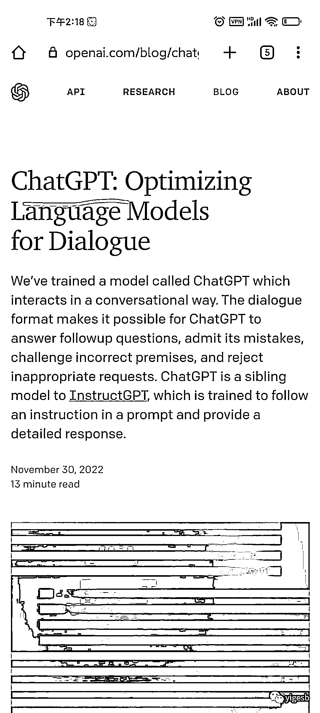  <ne-h2 id="392bc81d" data-lake-id="392bc81d"><ne-heading-ext><ne-heading-anchor></ne-heading-anchor><ne-heading-fold></ne-heading-fold></ne-heading-ext><ne-heading-content><ne-text id="u3d72af76" ne-bold="true">YigeSB</ne-text><ne-text id="uec348d64" ne-bold="true">2.艰难的注册账号之旅</ne-text></ne-heading-content></ne-h2> <ne-p id="u6578af51" data-lake-id="u6578af51"><ne-text id="u860e2332" ne-bold="true">12 月 2 号</ne-text><ne-text id="uc947b31b">下午，群里有朋友截图了 ChatGPT 的记录，我一看卧槽牛逼，代码都能写然后就开始去注册账号，结果卡在了账号注册上....直到 4 号凌晨都没解决这问题</ne-text></ne-p> <ne-p id="u21244668" data-lake-id="u21244668"><ne-card data-card-name="image" data-card-type="inline" id="TP5eE" data-event-boundary="card">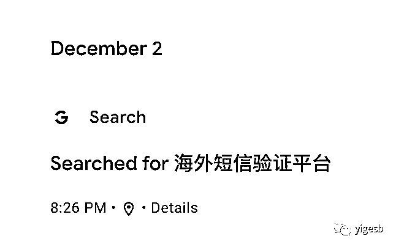  <ne-p id="u18613f03" data-lake-id="u18613f03"><ne-text id="u424d2c07">12.2 搜索记录</ne-text></ne-p> <ne-p id="u27e35b70" data-lake-id="u27e35b70"><ne-card data-card-name="image" data-card-type="inline" id="O3oXM" data-event-boundary="card">  <ne-p id="u51937d7b" data-lake-id="u51937d7b"><ne-text id="u0eae422e">12.4 搜索记录</ne-text></ne-p> <ne-p id="u6dd7fbbb" data-lake-id="u6dd7fbbb"><ne-text id="u074534e1">期间我还去淘宝用关键词</ne-text><ne-text id="udfc0d340" ne-bold="true">办理海外手机号</ne-text><ne-text id="u3a44a417">搜索了相关服务，依然没有解决问题</ne-text></ne-p> <ne-p id="u11c8f49a" data-lake-id="u11c8f49a"><ne-text id="uf79f77ff">直到</ne-text><ne-text id="ucecac4f5" ne-bold="true">4 号</ne-text><ne-text id="ufc8e8206">中午，灵机一动，又去淘宝直接搜索了关键词“ChatGPT”，这才把账号注册下来(当时已经注意到淘宝店销量可观)</ne-text></ne-p> <ne-p id="u671cf5e2" data-lake-id="u671cf5e2"><ne-card data-card-name="image" data-card-type="inline" id="evSID" data-event-boundary="card">  <ne-p id="u088a77a9" data-lake-id="u088a77a9"><ne-text id="ua8997363">然后开始了玩到停不下来的节奏</ne-text></ne-p> <ne-h2 id="fd2a15a1" data-lake-id="fd2a15a1"><ne-heading-ext><ne-heading-anchor></ne-heading-anchor><ne-heading-fold></ne-heading-fold></ne-heading-ext><ne-heading-content><ne-text id="u05fbd69b" ne-bold="true">3.注册公众号</ne-text></ne-heading-content></ne-h2> <ne-p id="ueb4ec043" data-lake-id="ueb4ec043"><ne-text id="u7d8d764d">5 号，朋友圈开始有更多人截图 ChatGPT 的对话记录，意识到热度一定是上来了，于是又看了百度关键词规划师、腾讯广告关键词工具、微信指数等</ne-text></ne-p> <ne-p id="ubf389f7f" data-lake-id="ubf389f7f"><ne-card data-card-name="image" data-card-type="inline" id="l00Vq" data-event-boundary="card">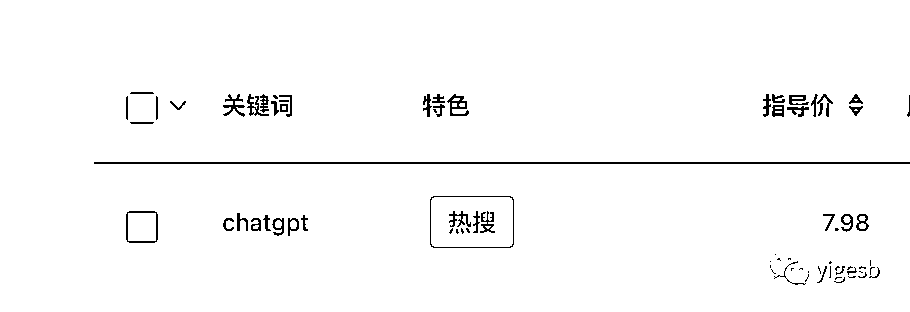  <ne-p id="uede1b027" data-lake-id="uede1b027"><ne-text id="uaab2ce10">关键词规划师已经打上了热搜标签</ne-text></ne-p> <ne-p id="u00ad0a6e" data-lake-id="u00ad0a6e"><ne-text id="uca123c7e">微信指数也极速上涨，不过量级还没有非常恐怖(6 位数)</ne-text></ne-p> <ne-p id="u11ee1837" data-lake-id="u11ee1837"><ne-text id="u66047e7d">看了这些数据后，出于职业嗅觉，就立刻去看了微信搜索关键词“</ne-text><ne-text id="u932f825f" ne-bold="true">ChatGPT</ne-text><ne-text id="u15f1ba02">”搜索结果，</ne-text><ne-text id="uf6ee5aea" ne-underline="true">公众号注册量：0，小程序注册量：2</ne-text><ne-text id="uac1ea0c8">（分别是 ChatGPT、ChatGPT 中文）</ne-text></ne-p> <ne-p id="u0492e23b" data-lake-id="u0492e23b"><ne-text id="u70bb143f">完全匹配的名字已经被注册了小程序，所以我第一时间去注册了公众号：</ne-text><ne-text id="u3a12da85" ne-bold="true">ChatGPT 中文版</ne-text><ne-text id="u45c8fdfb">，只不过，因为关键词“中文版”，导致审核没过，直到傍晚才看到拒绝通知，之后改名通过，截止到发文，大部分人搜索核心关键词，我的公众号依然排在第一(每个人的搜索结果并不一致)</ne-text></ne-p> <ne-h2 id="48d044fb" data-lake-id="48d044fb"><ne-heading-ext><ne-heading-anchor></ne-heading-anchor><ne-heading-fold></ne-heading-fold></ne-heading-ext><ne-heading-content><ne-text id="u8c52a55b" ne-bold="true">4.接入 openai 的 chat 模型 API</ne-text></ne-heading-content></ne-h2> <ne-p id="u7992a62f" data-lake-id="u7992a62f"><ne-text id="u5e061b72">openai 提供了大量的模型封装成 API 对外公开使用，包括文本补全，文本修改，图形生成等等，其中有一个基于 GPT 的文本补全模型 text-davinci-003，能达到和 ChatGPT 接近的聊天效果</ne-text></ne-p> <ne-p id="ufdb4c0d5" data-lake-id="ufdb4c0d5"><ne-text id="u859f8fec">于是我灵机一动，花了十几分钟，写了几十行代码，成了</ne-text><ne-text id="u0828a576" ne-bold="true">全网首个把“ChatGPT”集成到公众号</ne-text><ne-text id="u2b1d13f1">的人</ne-text></ne-p> <ne-p id="u39386055" data-lake-id="u39386055"><ne-card data-card-name="image" data-card-type="inline" id="CN0Ir" data-event-boundary="card">  <ne-p id="uaac9636f" data-lake-id="uaac9636f"><ne-text id="u8f750399">只不过这个公众号我并没有公开，只是小范围发给朋友们体验，对于完成度不高的产品，我是羞于推给大家的</ne-text><ne-text id="u14d758fe" style="color: rgb(58, 58, 58);">，也感谢多位朋友私下的建议和提醒</ne-text><ne-text id="u490da3af">，当时考虑的点比较多</ne-text></ne-p> <ne-oli><ne-oli-i>1</ne-oli-i><ne-oli-c class="ne-oli-content" id="ub0f6854b" data-lake-id="ub0f6854b"><ne-text id="u31ead0f0">接口是收费的，收费按照（输入+输出）的 token 数，token 转化为字符是某种压缩算法，1000 个 token 大约对应 750 个英文单词，对应中文字符，并没有明确，新账号只有 18 美金的额度，如果不想花钱，需要多准备账号，那么我的代码里面就要加上账号切换的逻辑，这块也要花一些精力</ne-text></ne-oli-c></ne-oli> <ne-oli><ne-oli-i>2</ne-oli-i><ne-oli-c class="ne-oli-content" id="ud9c8bbcc" data-lake-id="ud9c8bbcc"><ne-text id="ud37ebcbd">第一个推出该功能，并且第一名的名字在手里，必然会拿到最多的搜索流量(公众号 Tab 下)，那么了解微信生态开发的朋友一定知道，想要系统稳定，一定是需要处理好微信服务器的大量回调的，这块也要花一些精力</ne-text></ne-oli-c></ne-oli> <ne-oli><ne-oli-i>3</ne-oli-i><ne-oli-c class="ne-oli-content" id="ud9bae068" data-lake-id="ud9bae068"><ne-text id="u364a532c">openai 机器人响应的内容，并没有针对国内互联网环境做特殊处理，接入到公众号的应答内容，如果需要公开，毫无疑问需要接入内容审核接口，这也要花一些精力</ne-text></ne-oli-c></ne-oli> <ne-oli><ne-oli-i>4</ne-oli-i><ne-oli-c class="ne-oli-content" id="u4b37e42b" data-lake-id="u4b37e42b"><ne-text id="ue8aa1dcc">这个 GPT3.0 的接口，毕竟比起 ChatGPT 还是差点意思，尤其是在上下文语境的问题上，因为这个接口一次调用最多只能在 4096 个 token，那么 ChatGPT 的能力是远远超过这个的，这个问题并没法解决</ne-text></ne-oli-c></ne-oli> <ne-p id="u2a6e99cb" data-lake-id="u2a6e99cb"><ne-text id="ueea2468b">值得一提的是，有位好友@码叔和我截然相反，我在群里分享了我接入 Chat 接口的公众号后，他也开发了一个</ne-text></ne-p> <ne-p id="ua51d5497" data-lake-id="ua51d5497"><ne-card data-card-name="image" data-card-type="inline" id="FrXQw" data-event-boundary="card">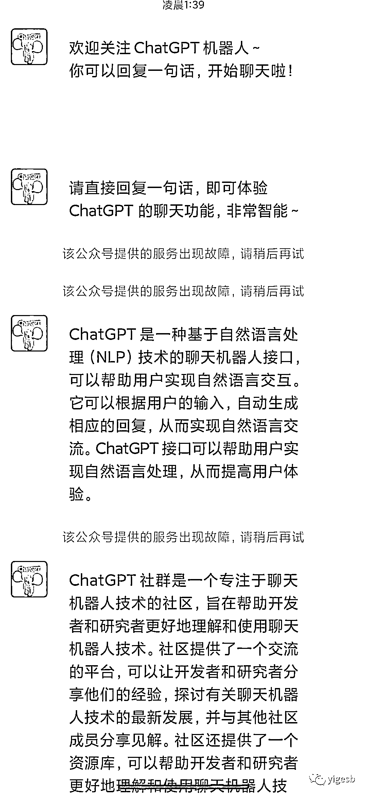  <ne-p id="u6b77499f" data-lake-id="u6b77499f"><ne-text id="u8ee5a8ba">虽然问题还挺多，但是他能够第一时间就发到 3 个微信号的朋友圈宣传起来，并且直接向号主销售这个能力开始变现，当然，后来我也教了码叔怎么解决这个报错问题，后续码叔变现也颇为可观</ne-text></ne-p> <ne-h2 id="f7c6625f" data-lake-id="f7c6625f"><ne-heading-ext><ne-heading-anchor></ne-heading-anchor><ne-heading-fold></ne-heading-fold></ne-heading-ext><ne-heading-content><ne-text id="u0e5c158d" ne-bold="true">5.发现反代方式的镜像站点</ne-text></ne-heading-content></ne-h2> <ne-p id="u68a49245" data-lake-id="u68a49245"><ne-text id="ue797abea">7 号中午，caoz 的群里有人发了</ne-text>[<ne-text id="u1824d5bf">gpt.chartapi.art</ne-text>](http://gpt.chartapi.art)<ne-text id="u43291a9e">这个站点，这是 ChatGPT 的一个镜像站点，这立刻吸引了我的注意力</ne-text></ne-p> <ne-p id="u8d82f108" data-lake-id="u8d82f108"><ne-text id="ue6533167">因为这个镜像站点，不仅仅是做了 ChatGPT 的整站镜像，他还集成了账号认证密钥</ne-text></ne-p> <ne-p id="u84641c20" data-lake-id="u84641c20"><ne-text id="uc29ff3fc">用户访问这个站的时候，他会作为用户的代理去访问真正的 ChatGPT，同时，他会带上自己准备好的账号密钥，这样就能让用户无需注册登录即可使用 ChatGPT 的服务，让被 ChatGPT 限制访问的国家和地区的用户，也能无障碍体验这个星球上最强大的对话 AI</ne-text></ne-p> <ne-h2 id="99093068" data-lake-id="99093068"><ne-heading-ext><ne-heading-anchor></ne-heading-anchor><ne-heading-fold></ne-heading-fold></ne-heading-ext><ne-heading-content><ne-text id="u3f50dbe1" ne-bold="true">6.镜像了 ChatGPT 的镜像</ne-text></ne-heading-content></ne-h2> <ne-p id="uc9c0dd07" data-lake-id="uc9c0dd07"><ne-text id="u79add556">看到镜像站的第一个念头是去看了下镜像站架在哪里，用 ping 工具看了下，是在 cloudflare 上，常见的就是利用 cloudflare 的 works 来做反向代理，works 可以理解成我们常听到的“边缘计算”，“函数计算”</ne-text></ne-p> <ne-p id="u957bf6fa" data-lake-id="u957bf6fa"><ne-text id="u1a2a450b">第二个念头是 h5 在微信内访问体验不如小程序来的好，比如转发和使用体验，虽然当时已经有了一些小程序，但是都是没有实际功能只是为了占位的小程序，那我就来做第一个吧</ne-text></ne-p> <ne-p id="u6851834d" data-lake-id="u6851834d"><ne-text id="u97f302b1">想要最快速上线，只需 webview 一行代码，唯一需要处理的是需要一个备过案的域名作为业务域名(因为我没有阿里云的备案域名，这里 ssl 证书和域名都是小张同志贡献的，就是你们今天看到火遍全网的 xingchengka.com 作者)，于是我又花了十几分钟，做了一个 ChatGPT 的镜像的镜像（套娃），托管在阿里云的函数计算上，然后包在小程序的壳子里上线了，似乎又成了</ne-text><ne-text id="u79e459ca" ne-bold="true">全网第一个真正集成 ChatGPT 能力的小程序</ne-text></ne-p> <ne-p id="u539008e9" data-lake-id="u539008e9"><ne-card data-card-name="image" data-card-type="inline" id="HKGlR" data-event-boundary="card">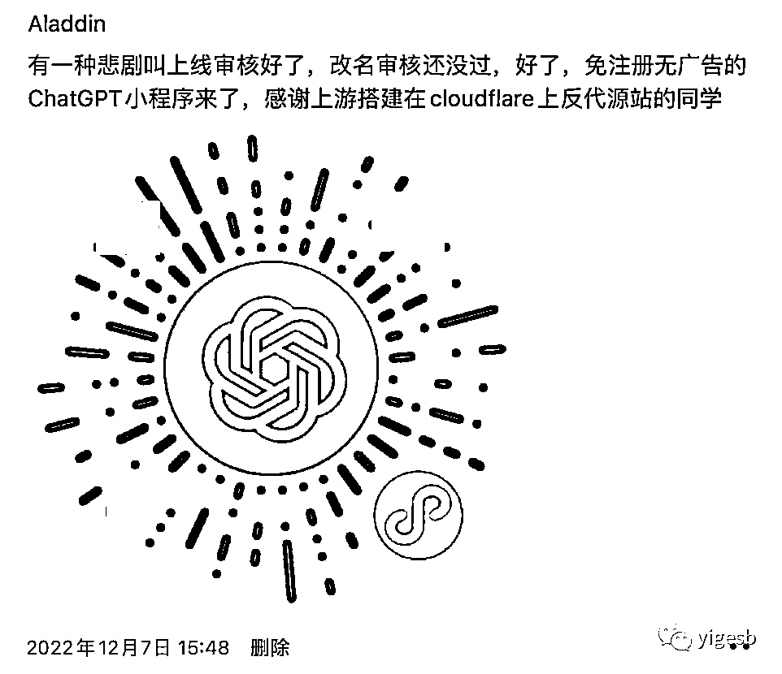  <ne-p id="u46462927" data-lake-id="u46462927"><ne-text id="uc834df03">不过惭愧的是，我镜像了那哥们的镜像，意味着我所有的流量都要从他的服务过(实际上可以优化但是我懒)，这就意味着他的 CF 要被我消耗掉不少额度，一个免费账号每个月有 10w 次免费请求额度，超出后付费 5 美元有 1000w 次，好在，并不贵，希望未来有给他发个红包的机会，目前消耗接近 50w 次请求，好在后面眼见着也没什么热度了</ne-text></ne-p> <ne-p id="u53e8d90c" data-lake-id="u53e8d90c"><ne-card data-card-name="image" data-card-type="inline" id="wpM3e" data-event-boundary="card">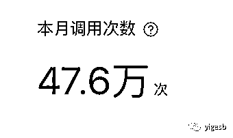  <ne-h2 id="8398dba3" data-lake-id="8398dba3"><ne-heading-ext><ne-heading-anchor></ne-heading-anchor><ne-heading-fold></ne-heading-fold></ne-heading-ext><ne-heading-content><ne-text id="ue0509f89" ne-bold="true">YigeSB</ne-text><ne-text id="u6b61706f" ne-bold="true">7.发现增强插件以及镜像站改造</ne-text></ne-heading-content></ne-h2> <ne-p id="ue56c08b8" data-lake-id="ue56c08b8"><ne-text id="u1779d6c7">那几天群里讨论极其火热，ChatGPT 各种对话案例、各种变现的方向讨论、</ne-text>[<ne-text id="uad8795c6" ne-bold="true" ne-underline="true">哥飞总结的十几条变现路径</ne-text>](http://mp.weixin.qq.com/s?__biz=MjM5OTIzMzYyMA==&mid=2650079038&idx=1&sn=e54b2cb86c828e433aed388c732734f0&chksm=bf3ece0588494713d46dd3b5541d6a13e79151541670211bd182854b868245b17e65911c5a99&scene=21#wechat_redirect)<ne-text id="ua1b6f319">@哥飞，在即刻火，在推特火，在各个微信群和知识星球社群被大量引用或者抄袭</ne-text></ne-p> <ne-p id="u8cd3a1f5" data-lake-id="u8cd3a1f5"><ne-text id="u4efc4baa">他提到一个需求，就是想把和 ChatGPT 的对话保存下来，可以分享给别人也可以自己持久化，然后有人分享了一个插件 </ne-text><ne-text id="ub6471f68" ne-bold="true">ShareGPT</ne-text><ne-text id="ucf903903">，我试用过后，也觉得非常巴适</ne-text></ne-p> <ne-p id="u1d5deb6f" data-lake-id="u1d5deb6f"><ne-card data-card-name="image" data-card-type="inline" id="RzBMJ" data-event-boundary="card">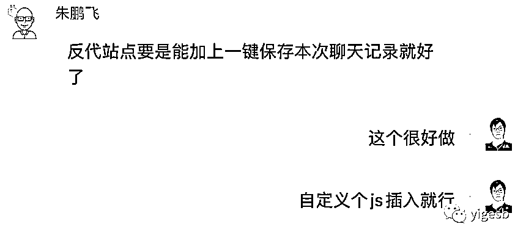  <ne-p id="u2bf1b8c2" data-lake-id="u2bf1b8c2"><ne-text id="u520dc076">不过飞哥又遇到个痛点，手机浏览器上，没法装插件，我说这个简单，无非是把这个插件集成一下呗，也是一行代码的事儿</ne-text></ne-p> <ne-p id="u7297ecef" data-lake-id="u7297ecef"><ne-text id="u00a04487">然后我就干脆，稍微调整了一下镜像站的前端页面，去掉了侧边栏，把主体内容居中，把没什么卵用的提示文字去掉，整的像极了一个搜索引擎，同时镜像了 ShareGPT 插件的会话保存服务</ne-text></ne-p> <ne-p id="u42474966" data-lake-id="u42474966"><ne-card data-card-name="image" data-card-type="inline" id="Re35u" data-event-boundary="card">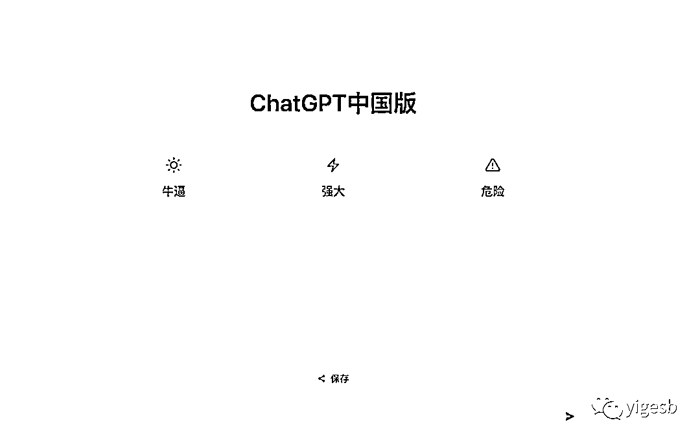  <ne-p id="u33f2f56b" data-lake-id="u33f2f56b"><ne-text id="ucbb5312a">点击</ne-text>[<ne-text id="u06cdb4c2" ne-underline="true">这里</ne-text>](https://chatgpt.snsxiong.com/d/sTgybnN)<ne-text id="u79729511">可以看到持久化保存的对话记录案例</ne-text></ne-p> <ne-p id="u3e93b3d1" data-lake-id="u3e93b3d1"><ne-text id="udddf31a4">不过，就在第二天，openai 升级了风控加入了 cf 的防火墙，最开始我镜像的那个镜像站，做个几轮调整之后，还能勉强使用，后来防火墙进一步升级，所有反代站点</ne-text><ne-text id="ud334c6ee" ne-bold="true">卒</ne-text></ne-p> <ne-h2 id="11fdd8d9" data-lake-id="11fdd8d9"><ne-heading-ext><ne-heading-anchor></ne-heading-anchor><ne-heading-fold></ne-heading-fold></ne-heading-ext><ne-heading-content><ne-text id="ub5abe6ad" ne-bold="true">8.一点点思考</ne-text></ne-heading-content></ne-h2> <ne-p id="ufe8d567e" data-lake-id="ufe8d567e"><ne-text id="ubb780ca9">做这些东西，真正意义上的执行没花太多时间，但是持续的关注和参与讨论却一定程度上打乱了自己原本在进行的项目节奏，颇是受到些影响，更别提我也完全是在为爱发电完全没考虑太多变现的事情</ne-text></ne-p> <ne-p id="u8bb6597a" data-lake-id="u8bb6597a"><ne-text id="u7db04fc6">那么热点的东西年年有、月月有甚至天天有，我觉得有敏锐度的技术人应该做些什么呢(假设是技术驱动、能主导决策的)，最重要的是要打造好自己的或者团队的技术基础设施，这样可以用最短的时间来迎接风口，才能不被风口牵着鼻子走，而是笑看风口来来往往，处变不惊</ne-text></ne-p> <ne-p id="uc29d42af" data-lake-id="uc29d42af"><ne-text id="ucb131807">所以每次风口过后，你的技术基础设施是否得到了进一步的完善，这是值得复盘的点</ne-text></ne-p> <ne-p id="u76e77f58" data-lake-id="u76e77f58"><ne-text id="u915c76e4">其次，从运营层面，风口的流量如何得到最大化最高效的利用？我觉得有两个方向可以去做，一个是不放弃每个流量的裂变机会，第二个是，及时找到对口的后端产品进行变现，比如卖号(技术人自己就不要去干这事了，做成自动化交给机器倒是可以)</ne-text></ne-p> <ne-p id="u514d58d0" data-lake-id="u514d58d0"><ne-text id="uf8472ea6">最后就是，从风口中，找到可能的值得做长期的方向，做下去，比如上文中提到的，会话保存的插件，这个完全是可以做成一个付费产品的，而且核心功能也并不用花太多时间，借助风口的流量，完成第一轮的 pmf， 岂不乐哉，这个会话保存的插件，我手上有本葵(合)花(适)宝(域)典(名)，你如果想做，我愿意倾囊相售，哈哈哈哈</ne-text></ne-p> <ne-p id="u79f95f7c" data-lake-id="u79f95f7c"><ne-card data-card-name="image" data-card-type="inline" id="iY6qz" data-event-boundary="card">  <ne-p id="u4a83e1da" data-lake-id="u4a83e1da"><ne-text id="u75369634" style="color: rgb(58, 58, 58);">BTW，</ne-text><ne-text id="u2aeffd52">现在我写代码已经离不开 ChatGPT 了，debug 贼高效，人类真可怕，我们下个流量风口见~</ne-text></ne-p> <ne-p id="u156f33e5" data-lake-id="u156f33e5"><ne-text id="u2add5ead">下一篇，写写今天的行程卡纪念版的故事，没错，可能又是各种全网第一个~</ne-text></ne-p> <ne-h1 id="25f9c7fa" data-lake-id="25f9c7fa"><ne-heading-ext><ne-heading-anchor></ne-heading-anchor><ne-heading-fold></ne-heading-fold></ne-heading-ext><ne-heading-content><ne-text id="u21d4f67f">总结</ne-text></ne-heading-content></ne-h1> <ne-p id="u542f3768" data-lake-id="u542f3768"><ne-text id="u4303fff2">以上就是本周周报，还有几个零星的风向标小懒感觉没啥实操空间，就懒得复制粘贴过来了。</ne-text></ne-p> <ne-p id="u3f5a5d1f" data-lake-id="u3f5a5d1f"><ne-text id="u12f536d1">内容实在有点多，9W 字了，小懒从早上整理到中午，手动复制粘贴，一个字：累。</ne-text></ne-p> <ne-p id="ud7def5e8" data-lake-id="ud7def5e8"><ne-text id="u7d5741f2">希望对大家有帮助~</ne-text></ne-p> <ne-p id="u41564071" data-lake-id="u41564071"><ne-text id="ud12c967e">除了离线版，小懒也会整理到在线版合集里，方便大家检索和手机上查看。</ne-text></ne-p> <ne-p id="u5da4b807" data-lake-id="u5da4b807"><ne-text id="u045d9577">更多内容，见咱们</ne-text><ne-text id="u5f070b66" ne-italic="true">懒人专属群</ne-text><ne-text id="u736c7944">的群文件和群公告！</ne-text></ne-p> <ne-p id="u83b10156" data-lake-id="u83b10156"><ne-card data-card-name="image" data-card-type="inline" id="ymHBq" data-event-boundary="card"></ne-card></ne-p></ne-card></ne-p></ne-card></ne-p></ne-card></ne-p></ne-card></ne-p></ne-card></ne-p></ne-card></ne-p></ne-card></ne-p></ne-card></ne-p></ne-card></ne-p></ne-card></ne-p></ne-card></ne-p></ne-card></ne-p></ne-card></ne-p></ne-card></ne-p></ne-card></ne-p></ne-card></ne-p></ne-card></ne-p></ne-card></ne-p></ne-card></ne-p></ne-card></ne-p></ne-card></ne-p></ne-card></ne-p></ne-card></ne-p></ne-card></ne-p></ne-card></ne-p></ne-card></ne-p></ne-quote></ne-card></ne-p></ne-quote></ne-card></ne-p></ne-card></ne-card></ne-p></ne-quote></ne-card></ne-p></ne-card></ne-p></ne-card></ne-p></ne-quote></ne-card></ne-p></ne-quote></ne-card></ne-p></ne-quote></ne-card></ne-p></ne-quote></ne-card></ne-p></ne-quote></ne-card></ne-p></ne-quote></ne-quote></ne-card></ne-p></ne-card></ne-card></ne-p></ne-card></ne-p></ne-quote></ne-card></ne-p></ne-quote></ne-card></ne-p></ne-quote></ne-card></ne-p></ne-quote></ne-card></ne-p></ne-quote></ne-card></ne-p></ne-card></ne-p></ne-quote></ne-card></ne-p></ne-card></ne-p></ne-card></ne-p></ne-quote></ne-card></ne-p></ne-quote></ne-quote></ne-quote></ne-card></ne-p></ne-card></ne-p></ne-card></ne-p></ne-card></ne-p></ne-card></ne-p></ne-card></ne-p></ne-card></ne-p></ne-card></ne-p></ne-card></ne-p></ne-card></ne-card></ne-p></ne-card></ne-p></ne-card></ne-p></ne-card></ne-p></ne-card></ne-hole></ne-card></ne-p></ne-card></ne-p></ne-card></ne-p></ne-card></ne-p></ne-card></ne-p></ne-card></ne-hole></ne-card></ne-p></ne-card></ne-card></ne-p></ne-card></ne-p></ne-card></ne-p></ne-card></ne-p></ne-card></ne-p></ne-text></ne-card></ne-p></ne-card></ne-p></ne-card></ne-p></ne-card></ne-hole></ne-quote></ne-card></ne-p></ne-quote></ne-card></ne-hole></ne-card></ne-p></ne-card></ne-card></ne-p></ne-card></ne-hole></ne-card></ne-p></ne-card></ne-hole></ne-card></ne-p></ne-card></ne-p></ne-card></ne-p></ne-card></ne-p></ne-card></ne-hole></ne-card></ne-hole></ne-card></ne-p></ne-text></ne-card></ne-p></ne-card></ne-hole></ne-text></ne-card></ne-p></ne-card></ne-p></ne-card></ne-p></ne-card></ne-p></ne-card></ne-p></ne-card></ne-p></ne-card></ne-p></ne-card></ne-p></ne-card></ne-p></ne-card></ne-p></ne-card></ne-p></ne-card></ne-p></ne-card></ne-p></ne-card></ne-p></ne-card></ne-p></ne-card></ne-p></ne-card></ne-p></ne-card></ne-p></ne-card></ne-p></ne-card></ne-p></ne-card></ne-p></ne-card></ne-p></ne-card></ne-p></ne-card></ne-p></ne-card></ne-p></ne-card></ne-p></ne-card></ne-p></ne-card></ne-p></ne-card></ne-p></ne-card></ne-p></ne-card></ne-p></ne-card></ne-p></ne-card></ne-p></ne-card></ne-p></ne-card></ne-p></ne-card></ne-p></ne-card></ne-p></ne-card></ne-p></ne-card></ne-card></ne-p></ne-card></ne-card></ne-p></ne-card></ne-card></ne-p></ne-card></ne-card></ne-card></ne-p></ne-card></ne-card></ne-p></ne-card></ne-card></ne-p></ne-text></ne-card></ne-text></ne-p></ne-card></ne-p></ne-card></ne-p></ne-card></ne-p></ne-card></ne-card></ne-p></ne-card></ne-p></ne-card></ne-p></ne-card></ne-card></ne-p></ne-card></ne-card></ne-card></ne-p></ne-card></ne-p></ne-card></ne-card></ne-p></ne-card></ne-card></ne-card></ne-p></ne-card></ne-p></ne-card></ne-card></ne-p></ne-card></ne-card></ne-p></ne-card></ne-p></ne-card></ne-p></ne-card></ne-p></ne-card></ne-p></ne-card></ne-p></ne-card></ne-p></ne-card></ne-p></ne-card></ne-p></ne-card></ne-p></ne-card></ne-p></ne-card></ne-p></ne-card></ne-p></ne-card></ne-p></ne-card></ne-p></ne-card></ne-p></ne-card></ne-p></ne-card></ne-p></ne-card></ne-hole></ne-card></ne-p></ne-card></ne-p></ne-card></ne-p></ne-card></ne-p></ne-card></ne-p></ne-card></ne-p></ne-card></ne-p></ne-card></ne-p></ne-card></ne-p></ne-card></ne-p></ne-card></ne-p></ne-card></ne-p></ne-card></ne-p></ne-card></ne-p></ne-card></ne-p></ne-card></ne-p></ne-card></ne-card></ne-p></ne-card></ne-p></ne-card></ne-p></ne-card></ne-p></ne-card></ne-p></ne-card></ne-p></ne-card></ne-p></ne-card></ne-p></ne-card></ne-p></ne-card></ne-p></ne-card></ne-p></ne-card></ne-p></ne-card></ne-p></ne-card></ne-p></ne-card></ne-p></ne-card></ne-p></ne-card></ne-p></ne-card></ne-card></ne-p></ne-quote></ne-card></ne-p></ne-card></ne-p></ne-card></ne-p></ne-quote></ne-quote></ne-quote></ne-quote></ne-quote></ne-card></ne-p></ne-card></ne-p></ne-card></ne-p></ne-card></ne-p></ne-card></ne-p></ne-card></ne-p></ne-card></ne-p></ne-card></ne-p></ne-card></ne-p></ne-card></ne-p></ne-card></ne-p>