# 221206 懒人生财周报

> 原文：[`www.yuque.com/for_lazy/money/kiy2wp62cxg703cb`](https://www.yuque.com/for_lazy/money/kiy2wp62cxg703cb)

<ne-h1 id="b77b7823" data-lake-id="b77b7823"><ne-heading-ext><ne-heading-anchor></ne-heading-anchor><ne-heading-fold></ne-heading-fold></ne-heading-ext><ne-heading-content><ne-text id="u41f0f614">懒人生财周报</ne-text></ne-heading-content></ne-h1> <ne-p id="u69abf1bd" data-lake-id="u69abf1bd"><ne-text id="uf87a4b1a">整理日期：2022 年 12 月 06 号</ne-text></ne-p> <ne-p id="u8addd32d" data-lake-id="u8addd32d"><ne-text id="u715d75c6">专属群的群友大家好。小懒继续给大家带来生财周报～</ne-text></ne-p> <ne-p id="u0d63f533" data-lake-id="u0d63f533"><ne-text id="ud999e732">本文档为</ne-text><ne-text id="u0d9b02f9" ne-italic="true">懒人专属群</ne-text><ne-text id="u9e0790f0">内部分享，懒人手动整理。</ne-text></ne-p> <ne-p id="ubee97721" data-lake-id="ubee97721"><ne-text id="u02e1a00a">一些帖子跳转飞书查阅，如需破解复制权限，见这篇文章：</ne-text></ne-p> <ne-p id="u55ccf0be" data-lake-id="u55ccf0be">[<ne-text id="ud0f4a410">解除复制限制！</ne-text>](https://mp.weixin.qq.com/s?__biz=MzI1NjAxOTI0Ng==&mid=2647895304&idx=1&sn=df7e3e36c3bf503a2513f8b4c6636d3d&chksm=f20a1349c57d9a5fccaa92c5068cb3e492ba9e3ebb178584d018892c0211214dc9d112c1f73c&token=37691864&lang=zh_CN#rd)</ne-p> <ne-p id="uf37334f3" data-lake-id="uf37334f3"><ne-text id="u599d7323">往期的生财周报合集和精华，见专属群 Q 群文件和群公告。</ne-text></ne-p> <ne-p id="u8605fa0a" data-lake-id="u8605fa0a"><ne-text id="u70031230">希望大家有收获~</ne-text></ne-p> <ne-p id="u4f3a94d2" data-lake-id="u4f3a94d2"><ne-card data-card-name="image" data-card-type="inline" id="He4Q6" data-event-boundary="card">  <ne-p id="u51c39ef9" data-lake-id="u51c39ef9"><ne-text id="u6be83b2e">标题加了(精华)的表示精华贴，前面为截至今日的点赞数。</ne-text></ne-p> <ne-p id="u8dc449ec" data-lake-id="u8dc449ec"><ne-text id="u9a0a909e">以下是目录，内容有些多。大家可以挑兴趣的内容阅读。</ne-text></ne-p> <ne-p id="u5ca766d0" data-lake-id="u5ca766d0">[<ne-text id="uad8a3791">懒人专属群更新记录（点此跳转）</ne-text>](https://lazybook.netlify.app/#/blog/record2)</ne-p> <ne-h1 id="4b94dae3" data-lake-id="4b94dae3"><ne-heading-ext><ne-heading-anchor></ne-heading-anchor><ne-heading-fold></ne-heading-fold></ne-heading-ext><ne-heading-content><ne-text id="u59660d36">【目录】</ne-text></ne-heading-content></ne-h1> <ne-p id="u012350af" data-lake-id="u012350af"><ne-text id="u9b7c5dcf">[TOC]</ne-text></ne-p> <ne-h1 id="6cadaaf2" data-lake-id="6cadaaf2"><ne-heading-ext><ne-heading-anchor></ne-heading-anchor><ne-heading-fold></ne-heading-fold></ne-heading-ext><ne-heading-content><ne-text id="u08e293f1">一、生财认知&技能</ne-text></ne-heading-content></ne-h1> <ne-h2 id="81db7010" data-lake-id="81db7010"><ne-heading-ext><ne-heading-anchor></ne-heading-anchor><ne-heading-fold></ne-heading-fold></ne-heading-ext><ne-heading-content><ne-text id="uf3fee66b">（43 赞）《正确签署劳动合同，让你少赔钱》</ne-text></ne-heading-content></ne-h2> <ne-p id="u7ca144d8" data-lake-id="u7ca144d8"><ne-text id="u14e62cbd">生财有术的圈友们好，我是老严。</ne-text></ne-p> <ne-p id="u0702f4cc" data-lake-id="u0702f4cc"><ne-text id="uf9a5c061">大家有没有被员工仲裁赔过钱？这跟合同设计、绩效设计、裁员处理、纠纷处理息息相关，这方面宅男是行家，上次我邀请他到我的干货群做过一期分享，我整理了一下，共享出来。</ne-text></ne-p> <ne-p id="ub5b18d94" data-lake-id="ub5b18d94"><ne-text id="u2b2cf069">我按下面 5 个要点进行展开</ne-text></ne-p> <ne-p id="ud6639fa6" data-lake-id="ud6639fa6"><ne-text id="u80339c8a">1\.  如何签署有效的劳动合同，降低公司安全风险？</ne-text></ne-p> <ne-p id="ud04a95db" data-lake-id="ud04a95db"><ne-text id="uec0f1dca">2. 公司赔偿约 3W+的劳动纠纷经验？</ne-text></ne-p> <ne-p id="u531e4bd4" data-lake-id="u531e4bd4"><ne-text id="u836a772f">3. 被公司辞退的员工，如何处理让损失最小化？</ne-text></ne-p> <ne-p id="u0385bc17" data-lake-id="u0385bc17"><ne-text id="u1bac5fe9">4. 员工申请仲裁后，公司如何维护自己的权益？</ne-text></ne-p> <ne-p id="u87c85571" data-lake-id="u87c85571"><ne-text id="uf9f0d9f7">5. 处理员工劳动纠纷问题时，我们应该注意哪些？</ne-text></ne-p> <ne-p id="u4b94b381" data-lake-id="u4b94b381"><ne-text id="u2910dad0">在分享之前，我想先让各位老板反思几句话：</ne-text></ne-p> <ne-p id="ub1ca1c2e" data-lake-id="ub1ca1c2e"><ne-text id="u28d4f5b5">老板，你公司有签署劳动合同吗？</ne-text></ne-p> <ne-p id="u9c51dc67" data-lake-id="u9c51dc67"><ne-text id="u86d3afa1">你们公司签署的劳动合同有法律效应吗？</ne-text></ne-p> <ne-p id="ue9c77475" data-lake-id="ue9c77475"><ne-text id="u56231cb7">为什么签了劳动合同，还赔了好多钱？有没有分析劳动合同里面的漏洞问题？</ne-text></ne-p> <ne-p id="ud38e1b8a" data-lake-id="ud38e1b8a"><ne-text id="u3880441f" ne-bold="true">一、如何签署有效的劳动合同，降低公司安全风险？</ne-text></ne-p> <ne-p id="u0f065c20" data-lake-id="u0f065c20"><ne-text id="ue4202e49">一份有效的劳动合同，不止只是劳动合同，而是一定是包含了岗位考核表、公司规章制度、廉洁自律协议、员工保密协议等附件。劳动合同就等于是一把枪，而这些附件，就是子弹。你的枪再好，没有子弹也是无济于事。</ne-text></ne-p> <ne-p id="u6fae5168" data-lake-id="u6fae5168"><ne-text id="ubab2c7a6" ne-bold="true">1.一份完善的劳动合同，应该包括这些附件？</ne-text></ne-p> <ne-p id="u87ecd524" data-lake-id="u87ecd524"><ne-text id="uc06dca15">①、岗位考核表</ne-text></ne-p> <ne-p id="u652d6c8e" data-lake-id="u652d6c8e"><ne-text id="u012a55c6">明确好员工的考核目标，无论是新老员工都需要签这份表。当员工考核不达标时，公司有权单方面解除劳动关系，且可以不给予赔偿。但是如果没有签这份表，你没有证据辞退员工，会被要求双倍赔偿金。</ne-text></ne-p> <ne-p id="u71040cde" data-lake-id="u71040cde"><ne-text id="ub4c2b3c2">②、公司规章制度</ne-text></ne-p> <ne-p id="uf3419ec3" data-lake-id="uf3419ec3"><ne-text id="u5ad6be1a">规章制度是保护公司的武器，更是公司的防火墙。公司规章制度一定要符合公司业务属性以及一些重要条款，学会未雨绸缪。并且让每位员工阅读完公司规章制度后，要签名按手印，证明他已知晓制度内容</ne-text><ne-text id="u308107da" ne-bold="true">。</ne-text></ne-p> <ne-p id="u1290fff2" data-lake-id="u1290fff2"><ne-text id="ubd09ad31">③、廉洁自律协议。</ne-text></ne-p> <ne-p id="u2538717f" data-lake-id="u2538717f"><ne-text id="u0d5bd45f">可能你会认为这份协议没什么用，但是要知道，人在利益面试都是渺小的，防人之心不可无</ne-text><ne-text id="ubdb16d23" ne-bold="true">。</ne-text></ne-p> <ne-p id="u79c8bd5e" data-lake-id="u79c8bd5e"><ne-text id="ubc2de476">④、员工保密协议</ne-text></ne-p> <ne-p id="u1634bdf3" data-lake-id="u1634bdf3"><ne-text id="u1d4722bd">这份协议是一定要签署的，有些员工可能白天在你这里工作完，晚上就把你的机密给泄露出去或者是自己单干。而这份协议能更好的保护公司利益，只要他泄露了公司就能开除他，严重可以追究责任以及赔偿。</ne-text></ne-p> <ne-p id="ud344c28b" data-lake-id="ud344c28b"><ne-text id="u661de84c" ne-bold="true">想要降低公司安全风险，不单单只是一份劳动合同，还需要以上 4 份附件一起配合使用。</ne-text></ne-p> <ne-p id="ua4445603" data-lake-id="ua4445603"><ne-text id="uf5556431" ne-bold="true">2.一般我们在签署劳动合同时，我们应该注意哪些细节？</ne-text></ne-p> <ne-p id="uf17193fd" data-lake-id="uf17193fd"><ne-text id="u45f886b2">①、在签署的劳动合同，按试工第一天开始算起进行签署。这一点好多的小伙伴 ，都不重视 ，而且还认为不重要</ne-text></ne-p> <ne-p id="u553cec1f" data-lake-id="u553cec1f"><ne-text id="u44babea5">②、签署的劳动合同地点，建议一定要具体到区级，如果工作地方会调动，在员工手册上面写好。</ne-text></ne-p> <ne-p id="u9a7d8570" data-lake-id="u9a7d8570"><ne-text id="u3f800576">③、 实习期员工，是不用签署劳动合同，只需要签署实习协议。</ne-text></ne-p> <ne-p id="u8bdb164d" data-lake-id="u8bdb164d"><ne-text id="u4dab99a5">④、在签署时一定要去录音，不要怕麻烦，超级重要。</ne-text></ne-p> <ne-p id="u8da29145" data-lake-id="u8da29145"><ne-text id="u7853c95c">⑤、员工入职一个月内，一定要去签劳动合同，重大节假日，提前去签不要忘记。</ne-text></ne-p> <ne-p id="ufd6dce17" data-lake-id="ufd6dce17"><ne-text id="u3f34038d">⑥、试工三个月第一次要签署三年，第二次可以也签一年，但第三次，就要签永久。</ne-text></ne-p> <ne-p id="u9d6cbcba" data-lake-id="u9d6cbcba"><ne-text id="u18f1c509">⑦、劳动合同中，一定有履行义务及重大事情，关于补偿情况说明，制定好后让律师核对下。</ne-text></ne-p> <ne-p id="uf91e30ae" data-lake-id="uf91e30ae"><ne-text id="uae0c0c17">⑧、劳动合同到期后，一个月内一定要去进行签署。</ne-text></ne-p> <ne-p id="ue37934ee" data-lake-id="ue37934ee"><ne-text id="uf3a93c57" ne-bold="true">二、案例解析：公司赔偿约 3 万+的劳动纠纷经验？</ne-text></ne-p> <ne-p id="u4671ba6e" data-lake-id="u4671ba6e"><ne-text id="ucfd0d37e">给大家分享我们公司近两年，三件不同的劳动纠纷问题，赔偿了约 3 万+的血泪经验。</ne-text></ne-p> <ne-p id="u4f10035e" data-lake-id="u4f10035e"><ne-text id="u2bfe6cb3">先上图，有图有真图</ne-text></ne-p> <ne-p id="uc8cf2bc2" data-lake-id="uc8cf2bc2"><ne-card data-card-name="image" data-card-type="inline" id="R7yTC" data-event-boundary="card">  <ne-p id="u2261284c" data-lake-id="u2261284c"><ne-card data-card-name="image" data-card-type="inline" id="nfkq5" data-event-boundary="card">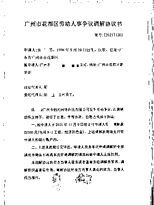  <ne-p id="u3c3a9018" data-lake-id="u3c3a9018"><ne-card data-card-name="image" data-card-type="inline" id="aZmuo" data-event-boundary="card">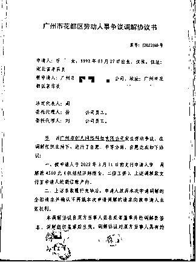  <ne-p id="u0a747943" data-lake-id="u0a747943"><ne-text id="uf8e923b8">这些经验，大家一定要重视，可能下一次，就到你身上了。希望有的时候，我们是不想，但不想没有办法，该来的，总会来的。</ne-text></ne-p> <ne-p id="u34705de7" data-lake-id="u34705de7"><ne-text id="u44265e19" ne-bold="true">案例一：品牌部张先生劳动纠纷事件</ne-text></ne-p> <ne-p id="u804039a9" data-lake-id="u804039a9"><ne-card data-card-name="image" data-card-type="inline" id="w0X3X" data-event-boundary="card">  <ne-p id="ud88be437" data-lake-id="ud88be437"><ne-text id="ufdeeceb1">入职时间: 2017 年 3 月 6 日</ne-text></ne-p> <ne-p id="u452ad9fe" data-lake-id="u452ad9fe"><ne-text id="u1c8c0704">离职时间:2021 年 10 月 15 日</ne-text></ne-p> <ne-p id="u88f593e8" data-lake-id="u88f593e8"><ne-text id="u5c808d48">入职时间:4 年 6 个多月</ne-text></ne-p> <ne-p id="u42ca5e46" data-lake-id="u42ca5e46"><ne-text id="u0c8944d1">优化原因:最初入职时，工作不错，后面受其他人影响，而他就慢慢变成职场老油条，仗着自己是老员工，经常顶撞上司，在公司传播负能量，业绩慢慢变差，不接受调岗。</ne-text></ne-p> <ne-p id="uedcaefe5" data-lake-id="uedcaefe5"><ne-text id="ue3be7163">协商结果:赔付了 22500 元（平均工资 4500）</ne-text></ne-p> <ne-p id="u213b130b" data-lake-id="u213b130b"><ne-text id="u22d21f78">补偿要求:因为入职了 4 年 6 个多月，按 N+1 进行赔偿，4 年就是 4 个月，而且又满了 6 个月不满一年，按 1 个月进行补偿。</ne-text></ne-p> <ne-p id="u4d76c4c9" data-lake-id="u4d76c4c9"><ne-text id="ube89fa8a" ne-bold="true">这一次，让我们收获到的经验：</ne-text></ne-p> <ne-p id="ud38b7a43" data-lake-id="ud38b7a43"><ne-text id="ub8f4d17b" ne-bold="true">有一些人不行，就是不行，一定要及时优化，留着一定是定时炸弹，可能会造成更重要的后果，同时这一次，我也完善了公司的劳动合同体系！</ne-text></ne-p> <ne-p id="uba25c75f" data-lake-id="uba25c75f"><ne-text id="u47f1be6b" ne-bold="true">案例二：运营部徐女士劳动纠纷事件</ne-text></ne-p> <ne-p id="ufd5ffa7a" data-lake-id="ufd5ffa7a"><ne-card data-card-name="image" data-card-type="inline" id="xwJb9" data-event-boundary="card">  <ne-p id="u60f81789" data-lake-id="u60f81789"><ne-text id="ubee40811">入职时间:2021 年 10 月 15 日</ne-text></ne-p> <ne-p id="u224d2a7b" data-lake-id="u224d2a7b"><ne-text id="uce67a4d4">离职时间:2022 年 3 月 6 日</ne-text></ne-p> <ne-p id="u75d272cb" data-lake-id="u75d272cb"><ne-text id="u2f8b0bd4">入职时间:约 5 个月左右</ne-text></ne-p> <ne-p id="u9d7c7062" data-lake-id="u9d7c7062"><ne-text id="u7672cbf3">优化原因:春节回来之后，状态太差，公司一直未签署劳动合同，员工诉求合理，《劳动法》规定劳动合同入职超过一个月未签，需按照双倍工资赔偿。</ne-text></ne-p> <ne-p id="u1ac7a05e" data-lake-id="u1ac7a05e"><ne-text id="u8b1d988f">协商结果:赔付了 4500 元，每月平均工资是 4500，入职 3 个月不满 6 个月，按半个月工资赔付，因为没有签劳动合同，所以按 2 倍赔付。</ne-text></ne-p> <ne-p id="uc87a4c7c" data-lake-id="uc87a4c7c"><ne-text id="u1ffb8a9f" ne-bold="true">这一次，让我们收获到的经验：</ne-text></ne-p> <ne-p id="u38eab951" data-lake-id="u38eab951"><ne-text id="uf71aa173" ne-bold="true">劳动合同一定要及时去签，特别是遇到一些节假日时，同时一定要安排人去监督，落实到个人，更不要说说而已，不然东窗事发，才知道后悔莫及。</ne-text></ne-p> <ne-p id="u45af0051" data-lake-id="u45af0051"><ne-text id="u67c116e4" ne-bold="true">案例三：短视频部李女士劳动纠纷事件</ne-text></ne-p> <ne-p id="u4020b6cf" data-lake-id="u4020b6cf"><ne-card data-card-name="image" data-card-type="inline" id="xilqt" data-event-boundary="card">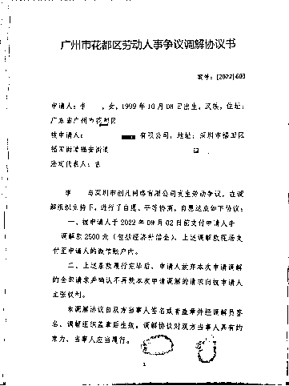  <ne-p id="u5a6ebc2a" data-lake-id="u5a6ebc2a"><ne-text id="u37e906af">入职时间: 2021 年 11 月 2 日</ne-text></ne-p> <ne-p id="u9d272826" data-lake-id="u9d272826"><ne-text id="ub2880b26">离职时间:2022 年 8 月 23 日</ne-text></ne-p> <ne-p id="u45c49861" data-lake-id="u45c49861"><ne-text id="u804e31ca">入职时间:约 9 个月左右</ne-text></ne-p> <ne-p id="ub7a11f07" data-lake-id="ub7a11f07"><ne-text id="u4b2ba1a5">优化原因:工作态度消级，不会创新，传播负能量，员工之间有矛盾，而且还相互举报工作推广内容，多次考核不通过。</ne-text></ne-p> <ne-p id="ub747a223" data-lake-id="ub747a223"><ne-text id="u931ed79a">协商结果:赔付了 2500 元</ne-text></ne-p> <ne-p id="ufc823ddc" data-lake-id="ufc823ddc"><ne-text id="u7fac6fab">补偿要求:如果签了周考核表，就不用补偿，因为上级没有及时去签，然后就直接优化了，所以她要求补偿，原本是比较多，协商后就 2500 元。</ne-text></ne-p> <ne-p id="ud9b09096" data-lake-id="ud9b09096"><ne-text id="ufcd09431" ne-bold="true">这一次，让我们收获到的经验：</ne-text></ne-p> <ne-p id="u96c7cfba" data-lake-id="u96c7cfba"><ne-text id="ue923b1a0" ne-bold="true">员工一定要考核，同时一定要建立周考核表，不要光说，一定要规定，安排人监督，责任分配到个人，而且你的考核表一定要有法律效应，找律师校对。</ne-text></ne-p> <ne-p id="uf6af4df6" data-lake-id="uf6af4df6"><ne-text id="u0a481b1a" ne-bold="true">三、被公司辞退的员工，如何处理让损失最小化？</ne-text></ne-p> <ne-p id="u9ed03148" data-lake-id="u9ed03148"><ne-text id="u1e969516">如果不会处理，很容易造成劳动纠纷的问题，而且辞退不管是哪一种，只要员工一告，一个准，而且一定是要赔钱的？</ne-text></ne-p> <ne-p id="u124faa07" data-lake-id="u124faa07"><ne-text id="ucb76ef58">如何让公司辞退的员工，如何处理，让损失最少化呀。我们只能尽量减少最少化，而不能完全避免，因为没有办法</ne-text></ne-p> <ne-p id="u8d784326" data-lake-id="u8d784326"><ne-text id="u12b1ade5" ne-bold="true">1\. 安排会表达的人去谈</ne-text></ne-p> <ne-p id="ud4eaa77d" data-lake-id="ud4eaa77d"><ne-text id="u5921836b">我们之前就吃过这个亏，直属上级不会说话，直接跟辞退员工说“你的业务能力太差，每次都不达标，你明天不用来公司了”，人家转身就是一个仲裁。</ne-text></ne-p> <ne-p id="udcf64606" data-lake-id="udcf64606"><ne-text id="u488071f7">所以一定要安排会表达，会说话的人去谈。打感情牌，说出公司的苦衷和不舍，这样能避免争吵，好聚好散。</ne-text></ne-p> <ne-p id="uce5b2985" data-lake-id="uce5b2985"><ne-text id="u264ef086" ne-bold="true">2\. 引导签署员工离职表</ne-text></ne-p> <ne-p id="ue665470b" data-lake-id="ue665470b"><ne-text id="u12c9dabc">无论员工公司主动离职还是被辞退，一定要引导他签署离职表。</ne-text></ne-p> <ne-p id="uf29b4be0" data-lake-id="uf29b4be0"><ne-text id="u525eb36a">离职原因最好是写“个人原因”或者“其它”，签了这份表，就代表他是主动离职，并非是被辞退。在离职表上，公司不要盖章和签名，如果公司盖章了，那么这份离职申请则是协商意思，并不是员工自愿离职意思。</ne-text></ne-p> <ne-p id="ueb41f175" data-lake-id="ueb41f175"><ne-text id="uc9208b43" ne-bold="true">3\. 及时去结算工资情况</ne-text></ne-p> <ne-p id="u50912f5f" data-lake-id="u50912f5f"><ne-text id="uca1600c1">工资建议在离职当天就给他结算完，千万不要拖，非常重要。我们之前优化了一个员工，当然谈的时候是周六，直属经理刚好放假，算不了提成给他，就说下周一的时候给他结算，其次离职表也还没签。</ne-text></ne-p> <ne-p id="u1a7c48e3" data-lake-id="u1a7c48e3"><ne-text id="uac870075">等过了几天到结算时，他就说要赔偿，因为公司是辞退他的。</ne-text></ne-p> <ne-p id="ua5a5a385" data-lake-id="ua5a5a385"><ne-text id="ue67df5d8">如果当天谈完，立马签离职表，及时结算工资，就不会有后面这些麻烦事了。</ne-text></ne-p> <ne-p id="ueb85ba98" data-lake-id="ueb85ba98"><ne-text id="u83e65a5d" ne-bold="true">4\. 收集证据备不时之需</ne-text></ne-p> <ne-p id="u79e5801e" data-lake-id="u79e5801e"><ne-text id="uf8e8605d">辞退员工一定要有原因，像一般我们辞退员工，多半是业绩太差，人品问题，这些都是常见情况。</ne-text></ne-p> <ne-p id="ua8e96db4" data-lake-id="ua8e96db4"><ne-text id="u120415aa">如果他是业绩差，那我们要用考核表去证明他业绩差；如果他在公司传播负能量，那我们就录音，或者录像下来；如果他在上班时间做与工作无关的事情，就保留那些证据。</ne-text></ne-p> <ne-p id="uedf02564" data-lake-id="uedf02564"><ne-text id="uf7a55836">当我们去仲裁时，就算你有千张嘴都没用，法官只看证据，有图有真相，没证据靠口述，啥也不是。</ne-text></ne-p> <ne-p id="uf761d311" data-lake-id="uf761d311"><ne-text id="u66734ecf" ne-bold="true">四、员工申请仲裁后，公司如何维护自己的权益？</ne-text></ne-p> <ne-p id="u8c9b9470" data-lake-id="u8c9b9470"><ne-text id="u43b0fec7" ne-bold="true">1、有些老板可能不知道，即使是员工主动离职的，只要在离职 1 年内，都可以进行劳动仲裁。遇到主动离职的员工，申请劳动仲裁，该如何处理？</ne-text></ne-p> <ne-p id="ua5b628aa" data-lake-id="ua5b628aa"><ne-text id="uf0c861dd">先明确他的意图，做好应对打算，尽量协调解决，总结经验教训，不断优化完善。比如他是以没买社保要求补偿，他的意图很明确是想要钱。如果他去仲裁的话，我们除了要给他补缴完社保之外，他也要出自己那部分的社保钱，这样他的支出一下就会很大。</ne-text></ne-p> <ne-p id="u580d3fae" data-lake-id="u580d3fae"><ne-text id="u40514716">那我们就私下尽量和他去协商解决，给他说他自己也要补缴那部分社保的成本，公司给他几百作为补偿，就不补缴社保，好好谈。然后总结这次的教训，如何去完善的更好，避免下次出现类似情况。</ne-text></ne-p> <ne-p id="u2813b1a9" data-lake-id="u2813b1a9"><ne-text id="ufbbacc12" ne-bold="true">2.遇到公司辞退的员工，申请劳动仲裁，该如何处理？</ne-text></ne-p> <ne-p id="u58976457" data-lake-id="u58976457"><ne-text id="u53c591a9">①、把员工证据收集好</ne-text></ne-p> <ne-p id="ua8b82e61" data-lake-id="ua8b82e61"><ne-text id="u018abb0b">当时开除他的原因及证据一定要搜集好，比如他考核不达标的考核表，上班摸鱼的监控录像，传播负能量的证据等。</ne-text></ne-p> <ne-p id="ue04e61ea" data-lake-id="ue04e61ea"><ne-text id="u57451ebe">②、做好自我心态处理</ne-text></ne-p> <ne-p id="u31ad3924" data-lake-id="u31ad3924"><ne-text id="ub5d518a2">调整好自己的心态，不要太慌，一定要冷静去处理，凡事都有第一次。一慌的话，容易被员工给带节奏，打乱自己的思路。</ne-text></ne-p> <ne-p id="ued43f731" data-lake-id="ued43f731"><ne-text id="u2221ce00">③、提前了解仲裁流程</ne-text></ne-p> <ne-p id="u96e1ed88" data-lake-id="u96e1ed88"><ne-text id="uc90bf871">一定要提前了解，这种情况如果按照国家规定，应该赔多少，以及你的心理预期最多是赔多少，可以先找律师咨询，或者在网上查询以往案例。</ne-text></ne-p> <ne-p id="uca3fa75b" data-lake-id="uca3fa75b"><ne-text id="u4864118f">如果在你的证据很足的情况下，可以强势一些，安排会表达会说话的去人谈，这样就不会怯场。无论是遇到哪种情况，在处理仲裁时，一定不要过于冲动，要学会冷静的去处理，当处理完后，我们一定要去不断总结、不断完善，因为每一次仲裁都能让公司进一大步！</ne-text></ne-p> <ne-p id="u5a6d1eba" data-lake-id="u5a6d1eba"><ne-text id="uc67515e0" ne-bold="true">五、处理员工劳动纠纷问题时，我们应该注意哪些？</ne-text></ne-p> <ne-p id="ue2ba9169" data-lake-id="ue2ba9169"><ne-text id="u67bbd894">①、能让员工主动离职，就不要主动辞退他，因为辞退对公司来讲是最不利的，尤其是老员工，是 N+1 的赔偿，所以能私了就私了，好好协商。</ne-text></ne-p> <ne-p id="u5a793501" data-lake-id="u5a793501"><ne-text id="u1564d38c">②、当员工离职走的时候，一定要签署离职表，离职原因填写“个人原因”或“其它”，并且要签名按手印，切记公司不能盖章和签名，离职表公司保存好，不要给员工带走。</ne-text></ne-p> <ne-p id="u25ba3e4b" data-lake-id="u25ba3e4b"><ne-text id="u3b25bbc5">③、建议老板不要去处理劳动纠纷问题，这样会让你心累，人也累，可以让一个负责人或人事去处理，甚至可以委托律师去处理。其次公司法人电话可以换成管理层的，不然一有纠纷劳动局就轰炸你，也会心烦。</ne-text></ne-p> <ne-p id="ubf78bdc2" data-lake-id="ubf78bdc2"><ne-text id="uab6d05ed">④、有些员工怎么培养能力都不行，或是刺头员工，你真的想把他干掉，就尽早干掉，最好是在他入职未满半年前干掉。未满半年给半个月补偿就可以了，不要舍不得出这个钱，留在公司成本会更大，把他干掉后，也方便规划部门的业务。</ne-text></ne-p> <ne-p id="u0785a238" data-lake-id="u0785a238"><ne-text id="ufed22cdb">另外一定要完善劳动合同，提前规避风险，才能更好的保障公司利益！</ne-text></ne-p> <ne-p id="u285d17ef" data-lake-id="u285d17ef"><ne-text id="u41e1fb1f">在这个 00 后整顿职场的时代，劳动合同是每位老板必须要重视，也必然要重视的之一，不然只会赔的更多！</ne-text></ne-p> <ne-p id="u608160c2" data-lake-id="u608160c2"><ne-text id="u6f570533">现在各个方面，都在让 00 后的人，更懂劳动法。不仅是媒体炒作，还是短视频等平台。</ne-text></ne-p> <ne-p id="uc756be4f" data-lake-id="uc756be4f"><ne-text id="u1bef0ff3" ne-bold="true">作为老板，一定要重视，重视，重视，超级重要！</ne-text></ne-p> <ne-h2 id="32c61966" data-lake-id="32c61966"><ne-heading-ext><ne-heading-anchor></ne-heading-anchor><ne-heading-fold></ne-heading-fold></ne-heading-ext><ne-heading-content><ne-text id="udc906452">（46 赞）《IP 如何风骨体面和年入千万》</ne-text></ne-heading-content></ne-h2> <ne-p id="u11bf47f9" data-lake-id="u11bf47f9"><ne-text id="u8bdb3332">《IP 如何风骨体面和年入千万》-落地实操版 发给几个朋友测试了一下内容如何，一致好评，强烈推荐所有在做 IP 的朋友们看一下。 这篇文章的优势有三：1、这是 IP 底层逻辑和顶层设计都有的，区别于市场上只讲经验的，毕竟经验的可普适复用性不高；2、只要想做跨周期的 IP，无论 S 级还是小白都需要看的，毕竟谁也不想被骂是臭割韭菜的不是；3、有非常明晰的步骤和大量的注解，基本上可以立刻迁用~大大方方坦坦荡荡的先挣第一个千万 话不多说，上链接：</ne-text></ne-p> <ne-p id="u4cce4a8c" data-lake-id="u4cce4a8c">[<ne-text id="u5cded2d2">https://z5uufnsl6h.feishu.cn/docx/HiVkdfBYJo2H5xxWIemcMcMQnLc</ne-text>](https://z5uufnsl6h.feishu.cn/docx/HiVkdfBYJo2H5xxWIemcMcMQnLc)</ne-p> <ne-h2 id="9d2e7d47" data-lake-id="9d2e7d47"><ne-heading-ext><ne-heading-anchor></ne-heading-anchor><ne-heading-fold></ne-heading-fold></ne-heading-ext><ne-heading-content><ne-text id="uf492e086">（30 赞）《如何为高净值客户诊断需求》</ne-text></ne-heading-content></ne-h2> <ne-p id="u9c8a6103" data-lake-id="u9c8a6103"><ne-text id="u5f44e359">   大家好，我是忻忻，生财有术首席高净值客户官（亦仁可能未必同意）。</ne-text></ne-p> <ne-p id="ue816781f" data-lake-id="ue816781f"><ne-text id="ubf3f5aac">   时间捐赠局我讲了如何诊断高净值客户需求，卖大单。以下将文字稿重新整理出来，供大家参考。</ne-text></ne-p> <ne-p id="u84e6787f" data-lake-id="u84e6787f"><ne-text id="u747aeb0e">   这个话题说得更通俗一点，如果不用装逼的说法的话，就是我们怎么去跟大客户进行沟通，怎么样在大客户手里做下大单。</ne-text></ne-p> <ne-p id="u8f5fc78f" data-lake-id="u8f5fc78f"><ne-text id="ub263f11c">   很多人在开始做大客户的时候，有一个最大的困惑就是——大客户是不是特别难搞啊？其实我的经验是，如果你有一次成功的机会去搞定一个大客户，以后你其实会喜欢搞小客户了。为什么呢？因为大客户很简单，</ne-text><ne-text id="u11ecd6b1" ne-bold="true">我们提供价值，为他解决问题，然后他付我们钱。</ne-text></ne-p> <ne-p id="u9ad48bd1" data-lake-id="u9ad48bd1"><ne-text id="u7cec6c5f">   我会从三个方向去讲：</ne-text></ne-p> <ne-p id="u01ce4d02" data-lake-id="u01ce4d02"><ne-text id="u0ec1b137" ne-bold="true">一．如何快速让对方信任你的价值</ne-text></ne-p> <ne-p id="u265f4987" data-lake-id="u265f4987"><ne-text id="u5a512c89" ne-bold="true">二．怎么在对方的经验中占据优势</ne-text></ne-p> <ne-p id="ued5a97d1" data-lake-id="ued5a97d1"><ne-text id="ud0f83269" ne-bold="true">三．获得长久依赖感形成 IP 的方法</ne-text></ne-p> <ne-p id="u2a956d27" data-lake-id="u2a956d27"><ne-text id="u3bc8588c" ne-bold="true">第一部分：如何快速让大客户信任你的价值</ne-text></ne-p> <ne-p id="ua6a915c6" data-lake-id="ua6a915c6"><ne-text id="ub5c10459">       越是大客户，他越是依赖于某一类销售，很多事情习惯性地找你找帮他解决问题。但许多人没法利用这种依赖感，甚至发觉自己最后主动被白嫖了，客户用你的服务，你的建议，但是没有买产品。</ne-text></ne-p> <ne-p id="u1f6a0a93" data-lake-id="u1f6a0a93"><ne-text id="u8ae0c23b">       为什么销售这么难呢？我们先来拆解一下一个很牛的系统。</ne-text></ne-p> <ne-p id="u11ff668b" data-lake-id="u11ff668b"><ne-card data-card-name="image" data-card-type="inline" id="xp7l6" data-event-boundary="card">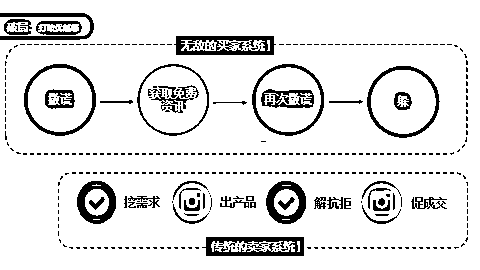  <ne-p id="u7c91e730" data-lake-id="u7c91e730"><ne-text id="u32bd4c62">   早在二十年前，有一个词叫 NBSS，大家也可以戏称为牛逼闪闪的销售系统。</ne-text></ne-p> <ne-p id="ua5d3d720" data-lake-id="ua5d3d720"><ne-text id="u8636c928">   它其实全称是</ne-text><ne-text id="u2f5a5e31" ne-bold="true">“以需求为导向的客户销售体系” ，Necessity Based Sales System。</ne-text></ne-p> <ne-p id="ue8006461" data-lake-id="ue8006461"><ne-text id="u16f4b865">    这其实是个不错的概念，我们想要把一样东西卖出去的话，不能只推产品，要去挖掘客户的需求。当客户的需求出现了以后，把产品拿到他面前。听起来很是那么一回事，而且逼格很高，非常专业。然而真实地做过销售的朋友们就会发觉，即便觉得客户的需求已经抓到位了，也把满足他需求的产品送到面前，客户还是会有很多的问题。</ne-text></ne-p> <ne-p id="uf4d07010" data-lake-id="uf4d07010"><ne-text id="uc5afe692">    接着，我们就来进行异议处理，解开客户的抗拒，最后再是限时、折扣、买赠等等各种各样的方式去促成交。</ne-text></ne-p> <ne-p id="u0248c2e7" data-lake-id="u0248c2e7"><ne-text id="udec14d20">这种模式我们把它称之为是卖家系统，是以销售为一个剧本的主导方。初衷是很好的，但在实际的过程中我们会发觉，哪怕再牛的销售，使用这个招数的过程中还是会卡。尤其是在面对大客户的时候，很多人第一招用起来就不是特别顺畅。</ne-text></ne-p> <ne-p id="u1812cb76" data-lake-id="u1812cb76"><ne-text id="u1b98cf3e">   为什么呢？因为大客户他有身份资历和经济上的威严，使得我们在挖掘需求的时候放不开，而更关键的是，他有一个使用得非常纯熟的买家系统。其实所有客户都会这招，只不过高净值客户用得更顺畅。</ne-text></ne-p> <ne-p id="u4531f0b0" data-lake-id="u4531f0b0"><ne-text id="u62cddb3a">   买家系统是一个什么概念呢？通常当一个人你知道他是销售，你出现在他面前的时候，他有一些举动好像是想吸引你的注意，或者是有一些你觉得疑似销售的动作，我们会开始自我保护起来。甚至这种自我保护不是有意识的。</ne-text></ne-p> <ne-p id="ucb4f4bcc" data-lake-id="ucb4f4bcc"><ne-text id="ue627d881">给大家举一个最常见的例子。我们去逛商场，是不是经常会有一些销售或者很热情的店员跑过来问你，我可以为你做些什么？那个时候大家会说什么话呢？，我通常就是两个字看看。</ne-text></ne-p> <ne-p id="uf22c550e" data-lake-id="uf22c550e"><ne-text id="uc2f333a6">   公域引流私域的打招呼，也是类似。</ne-text></ne-p> <ne-p id="ue1d45528" data-lake-id="ue1d45528"><ne-text id="u57de07d5">   我们通常会说你好亦仁（或者其他大佬），我想围观一下你的朋友圈，向你学习。</ne-text></ne-p> <ne-p id="u5b6cc758" data-lake-id="u5b6cc758"><ne-text id="u441b5b47">   这些行为在买家系统里就是一个本能，叫撒谎。我们没有把自己最真实的情感或者是最真实的诉求直接开放给疑似销售人员。</ne-text></ne-p> <ne-p id="u4f16000c" data-lake-id="u4f16000c"><ne-text id="u8f6e2741">   看看？我心里话可能是你不要烦着。</ne-text></ne-p> <ne-p id="ua3977875" data-lake-id="ua3977875"><ne-text id="u7afdd080">   想围观你的朋友圈？说白了就是我担心你问我收费。我想先白嫖你一下。</ne-text></ne-p> <ne-p id="ufa385351" data-lake-id="ufa385351"><ne-text id="ubab63107" ne-bold="true" ne-underline="true">为什么要撒谎呢？就是为了获得免费的资讯。</ne-text></ne-p> <ne-p id="u63d2c472" data-lake-id="u63d2c472"><ne-text id="u32fa53f5">   我们思考一下，一个大客户，一旦对我们撒谎，我们敢怀疑他吗？几乎不会！他能理我已经很开心了。</ne-text></ne-p> <ne-p id="u3a3d1c84" data-lake-id="u3a3d1c84"><ne-text id="uf7c65072">   还是拿亦仁来举个例子。我加到了他的微信，亦仁说忻忻我想进你的群，帮你看一看你做的销售训练，是不是有什么方法可以提升。不管亦仁真实的想法是什么，一旦他这么说，我肯定麻溜地把他拉进我的群里。虽然可能这个群本身就要收费的。</ne-text></ne-p> <ne-p id="u1c6d31e3" data-lake-id="u1c6d31e3"><ne-text id="u1191d21e">   高净值客户在撒谎的条件下，他可以获取很多免费的资讯，甚至这些资讯是普通人本来就要花一个不错的价钱可以去获得的。并且我们没有办法去判断客户说的是真话假话，我们只能选择相信。因为一旦你不相信转身走了，那客户就跟你拜拜了，他好难约的。</ne-text></ne-p> <ne-p id="u83822b2f" data-lake-id="u83822b2f"><ne-text id="uf7ff7fdc">   接下来他会给你一个希望，我把它称之为有希望没有承诺。就是客户渣你。</ne-text></ne-p> <ne-p id="u258fb2f4" data-lake-id="u258fb2f4"><ne-text id="u81ad0c93">当沉没成本已经很高，我们到底是相信这个高净值客户还是不相信呢？你只能一路被他牵着鼻子走。很多人刚开始做大客户销售的时候，都有一个共通的痛点——招之即来，挥之即去非常痛苦。但是你必须经历这个阶段。我之前那篇文里面说，我们向高净值客户提供六大价值，其中有一点就是情绪价值。没有办法，这是我们能接触到客户之前要做的事情。</ne-text></ne-p> <ne-p id="uce172de5" data-lake-id="uce172de5"><ne-text id="ue5186a2a">   最后客户用一招躲起来，尤其是高净值客户 PUA 我们的能力和情境天然有优势，当他躲起来，甚至我们很多销售会自己找理由来安慰，他真的很忙。</ne-text></ne-p> <ne-p id="u8670c42e" data-lake-id="u8670c42e"><ne-text id="u642ee7b4">   所以我们要破局的话，我们一定要从一开始自己心里打破这个固化思维。</ne-text></ne-p> <ne-p id="u8f879ba6" data-lake-id="u8f879ba6"><ne-text id="u154c24e9">   他虽然是一个高净值客户，但是他使用的招数没有比普通客户高明多少，只不过他演技好。</ne-text></ne-p> <ne-p id="u927ceecf" data-lake-id="u927ceecf"><ne-text id="u355a06f7">我给大家一个小小的经验之谈，因为知道双方通常会甩什么剧本，一开始我们就引起客户的好奇心，他觉得这个销售好像和我想象的不一样。一旦对你感兴趣了，后面机会就来了。</ne-text></ne-p> <ne-p id="u011610f1" data-lake-id="u011610f1"><ne-text id="u1b58685f" ne-bold="true" ne-underline="true">引起好奇的方法，我通常先反问或者是先给客户布置功课。</ne-text></ne-p> <ne-p id="u85b297ba" data-lake-id="u85b297ba"><ne-text id="uaa144f6f">   像我们金融行业，高净值客户基本上就是来挑产品。银行，保险公司，你们过去的历史回报率怎么样，你们这个利率是不是比别人高？很多人到这时忙不迭地介绍产品，我不这样，因为我一旦这样的话就进入了买家系统，被客户整得团团转。</ne-text></ne-p> <ne-p id="u848e4a65" data-lake-id="u848e4a65"><ne-card data-card-name="image" data-card-type="inline" id="XsYBY" data-event-boundary="card">  <ne-p id="u15f9f354" data-lake-id="u15f9f354"><ne-text id="u2656921b">   一般来说，金融给人的感觉就是搞钱，所以我就对高净值客户说，我要和你谈的不是钱的问题，是一个趣味性的问题和价值的问题。</ne-text></ne-p> <ne-p id="u417bfba7" data-lake-id="u417bfba7"><ne-text id="ubeeeb904">   钱在高净值客户心目中，是一个工具。我一开始就把这件事情和客户掰扯清楚。我会问客户，您觉得钱是拿来用的还是拿来数的？很多时候客户听到我这句问题，第一反应就是你是什么意思？他会思考一下。那个时候他就从他自己很熟悉的买家系统里面被我带出来了。</ne-text></ne-p> <ne-p id="u8f224a36" data-lake-id="u8f224a36"><ne-text id="u3ede3970">   我们能想到的钱拿来数的人是谁呢？比如说像巴菲特，或者现在已经不见的那位马爸爸等等，大部分人的钱是拿来用的，就连那位王健林，他的钱也是拿来用的。比如要再买一块地，比如要再买三套别墅，要帮那个儿子填他去做直播间的亏损。</ne-text></ne-p> <ne-p id="u2f5fa287" data-lake-id="u2f5fa287"><ne-text id="u2f0df64f">   当客户开始跟我一起思考的时候，我就知道我第一步 OK ，我们回到了我熟悉的领域。大家如果觉得有用的话也可以在你自己适合的行业里面去试试。大概三到四个问题，就是让客户思考一下，给他布置功课这种。</ne-text></ne-p> <ne-p id="ucb245394" data-lake-id="ucb245394"><ne-text id="u79e7aca9">当客户开始认同和配合我的功课，我就建立了在这个领域的权威了。</ne-text></ne-p> <ne-p id="u28f919ba" data-lake-id="u28f919ba"><ne-text id="u4c90ece1">   接下来还要重塑一个概念，就是为了让我的销售越来越简单。</ne-text></ne-p> <ne-p id="u7c7c711e" data-lake-id="u7c7c711e"><ne-text id="u5ff8590e">   我告诉客户，金融的本质其实就是一笔钱在什么时候给谁用。</ne-text></ne-p> <ne-p id="u786325fb" data-lake-id="u786325fb"><ne-text id="u85b87e00">   传统对金融的理解是钱生钱，我现在投 100 万可能希望他半年一年变成 120 万，150 万，就是 20%或者 50%的收益。其他的行业大家也可以去做这样一个定义。</ne-text></ne-p> <ne-p id="u134e028a" data-lake-id="u134e028a"><ne-text id="u0d3ab0c4">   钱在什么时候给谁用？就把客户拉到具体的场景下。</ne-text></ne-p> <ne-p id="uc17e1525" data-lake-id="uc17e1525"><ne-text id="u66f9b457" ne-bold="true" ne-underline="true">总之就是把你熟悉的领域做一个听起来很有逼格的定义，把客户注意力再拉到你面前。因为超出了他以前习惯的很熟悉的那个领域，他就要花一点点的时间和精力过来跟我们一起沟通，这都是客户的沉没成本，这件事情就会显得非常的重要。</ne-text></ne-p> <ne-p id="u8222c541" data-lake-id="u8222c541"><ne-text id="ud4d94055" ne-bold="true">第二部分：怎么在对方的经验中占据优势</ne-text></ne-p> <ne-p id="uf3551c5f" data-lake-id="uf3551c5f"><ne-text id="u8ba49df4">   有参与感以后，我们就可以显示自己的专业程度了。用大家熟悉的概念，你的生态位和别人不一样的地方。</ne-text></ne-p> <ne-p id="uc8557a29" data-lake-id="uc8557a29"><ne-text id="ud7133c4a">大家要知道一个有钱人，同一个领域至少有你能数得出来的一只手或者两只手的人在一起追他。那为什么他要跟你买产品呢？这个时候还没有进入到产品和方案的时候，显示专业度，不是说你把一个东西讲得多好，而是让他觉得你有差异感，就在于其他人都是跟客户挖需求，而我们要做的是把需求上升成痛点。</ne-text></ne-p> <ne-p id="ufaf24d6d" data-lake-id="ufaf24d6d"><ne-text id="u74d2df70">   一个人有需求跟他下决定购买不是必然的，甚至他有一个非常漫长的过程。有时候你帮客户发掘了一个需求，但是他最终没有在你这里买，甚至你教育了他然后他到别人那里去做了一个购买的决定。这个有时候是有一些缘分的。但是我觉得大部分的情况下，尤其是高净值客户发生这种事情，还是怪我们销售自己没有把他抓住，为什么没有把他抓住呢？就是因为前面吸引客户注意以及体现专业性差异性这件事情，我们没有找到好的方法。</ne-text></ne-p> <ne-p id="u29b349c6" data-lake-id="u29b349c6"><ne-text id="u3b5351bc">客户有需求，他那个时候的感觉是你的任务已经完成，好的我知道了。于是他又会回到买家系统里。一个人但凡 30 岁，就有近 20 年买家系统的经验。你做销售都没有 2 年，你怎么斗得过人家？何况你的大客户大部分都四五十岁，你怎么跟他去 PK ？</ne-text></ne-p> <ne-p id="uafc948b6" data-lake-id="uafc948b6"><ne-text id="u56fdc1ff">   一个被销售的人本能就是启动自己的买家系统，你前面让他有点觉得挺有意思，慢慢地感觉不对了，他又开始开启那个屏障，自我保护，开始对你撒谎。所以在这种情况下，我们一定要快速地把需求变成痛点。那这样的话客户才会一直跟我们的节奏来。</ne-text></ne-p> <ne-p id="u20866375" data-lake-id="u20866375"><ne-card data-card-name="image" data-card-type="inline" id="pXde4" data-event-boundary="card">  <ne-p id="u3974f723" data-lake-id="u3974f723"><ne-text id="ub9c0c549">   需求和痛点的差别在什么呢？</ne-text></ne-p> <ne-p id="ub8b5d05d" data-lake-id="ub8b5d05d"><ne-text id="ub373aa9c">   我以为我需要这个东西，它没有什么情绪的动力。比如说我现在碰到一个客户，我跟他聊，你看现在我们的市场可能马上要涨起来了，所以如果你现在进入市场，你可能可以赚 50% 甚至 100%。客户觉得挺有道理的，说我可以考虑一下。</ne-text></ne-p> <ne-p id="u1a0ed98c" data-lake-id="u1a0ed98c"><ne-text id="u33f90186">   是不是大部分的人听到这种情况就觉得好像有戏。而且我这个客户考虑买的是 100 万，200 万。但是这一两百万你都不知道什么时候能收回来，问题在哪里，因为客户感觉你说的有道理，但是我没有情绪的点，为什么我现在买？除非你能证明现在是历史最低点，你错过了这个点位就一路涨上去，你就再也没有机会了。</ne-text></ne-p> <ne-p id="u8159ff45" data-lake-id="u8159ff45"><ne-text id="ubfe3c770">   所以大家会发觉投资者为什么经常追高杀跌，就是因为那个时候情绪动力被市场教育出来了，别人在 20 块的时候进的，然后涨到了 25 块，别人已经赚了 20% 了，这个情绪动力就非常的牛。老太太炒股的时候就是天呐我一下子用一个礼拜赚到了一年买菜的钱，那个情绪动力是很强的，就可以叫痛点了。</ne-text></ne-p> <ne-p id="u7e1dce74" data-lake-id="u7e1dce74"><ne-text id="u9deee44f" ne-bold="true" ne-underline="true">当客户很平静的时候，都是需求，不是痛点。</ne-text><ne-text id="u048f0ef1">所以在那个情况下，请大家不要放走你的客户，一旦你把他放走，他的情绪在谁那里得到了绽放，他就变成谁那里花钱的人了。所以因为没有情绪，他会觉得一点不迫切，不迫切就会有可能被替代。</ne-text></ne-p> <ne-p id="u635396ad" data-lake-id="u635396ad"><ne-text id="uc02f6e37">   这个就是我们很多做大客户销售的人不愿意去碰大客户的问题。觉得谈大客户永远在为别人做嫁衣赏，时间周期又长，成本又高。</ne-text></ne-p> <ne-p id="u5aa46ee1" data-lake-id="u5aa46ee1"><ne-text id="u271b3cf2">   问题不是出在客户，是你见客户的时候都没有抓住客户的痛点，都是在他需求那里绕。你丢了一个 5 万块钱的单子不心疼，但是你丢了一个 500 万的单子，自己就会很痛，那个情绪就上来，你才会给自己一个潜意识不断地心理暗示，大客户很难谈。</ne-text></ne-p> <ne-p id="u1c38f747" data-lake-id="u1c38f747"><ne-text id="u4674abf0">   这期我报了一个小红书资料引流的小航海，有一个宣传说的是，你以为那种免费资料把没有价值公域粉丝吸引过来了吗？不是，如果你想真的做 IP 你一定要去学。突然之间有点神秘，我会好奇这个航海到底是做什么事情的？</ne-text></ne-p> <ne-p id="uc07f9d98" data-lake-id="uc07f9d98"><ne-text id="u3cf4a90e">说这句话的人已经在做销售了，因为有隐性的一个痒痒的痛痛的地方，然后客户就会主动。越是隐性，客户觉得别人没有看出来，你懂我那种心照不宣的感觉。销售和客户之间但凡能做到一点点心照不宣，他基本上就离痛点很近了。</ne-text></ne-p> <ne-p id="ud346598a" data-lake-id="ud346598a"><ne-text id="ubc01ca83">   当然这一点还不够。客户总会有一个方案，对那个方案他很得意。我们不能因为想卖产品，说客户的方案有问题，尤其当他是大客户。比如我如果想拉亦仁去做别的事情，说亦仁你的生财有术，你的航海我觉得有一点问题，那基本上很可能会被怼得不行，甚至他身边会有很多的人，专家顾问来帮着他一起说你不懂。客户以为的方案一般是他很熟悉的，你在他熟悉的领域，你又不知道他怎么想，他撒一个谎，你就很难去 PK 掉。</ne-text></ne-p> <ne-p id="ua8d6e6f7" data-lake-id="ua8d6e6f7"><ne-text id="u6be7e163">   我该怎么办呢？比如我知道，生财有术是一个谈钱不伤感情的社群，根源就是带着社群的成员一起赚到钱。我可能就问亦仁，你有没有发觉现在我们有很多的圈友好像赚不到钱，问题到底出在哪里？我们一起来聊一聊。这样就会比别人有一个差异度，至少客户愿意向你敞开，他觉得有点东西。</ne-text></ne-p> <ne-p id="u440e1f1e" data-lake-id="u440e1f1e"><ne-text id="u3d93fce8">   再来就是</ne-text><ne-text id="ufe0d7d7e" ne-underline="true">我们要有一个很强烈的情绪，所有的销售其实都是在情绪迫使下使得我们花钱出去的。真正的销售就是两个原因，一个叫解决问题</ne-text><ne-text id="u5a3f2a52">，就是这个问题真的很痛了，我现在牙疼，讲不出话来了，我要吃止疼片。</ne-text><ne-text id="u64120bca" ne-underline="true">另一个层面也是一个情绪叫愉悦的感觉。</ne-text><ne-text id="uf8d9d5d1">秋天的第一杯奶茶，女生为什么要喝奶茶？又长胖又长痘，毛孔又粗大，但是快乐无价对不对？</ne-text></ne-p> <ne-p id="uc7e49746" data-lake-id="uc7e49746"><ne-text id="uf8e5ba08">   所以其实你会发觉解决问题和愉悦的感觉都是情绪。一个人在没有情绪波动的情况下，他很少会花钱。</ne-text></ne-p> <ne-p id="uaa19c648" data-lake-id="uaa19c648"><ne-text id="u22ab4247">   情绪动力是客户花钱的最根本的点，大客户也逃不掉。好多大客户花钱花得比我们还没有道理，很多弱智的开销都是大客户花的。没有调查清楚，就投一片厂房几个亿下去了。为什么？因为情绪动力。你不要觉得他是大客户，他就多厉害，他也是个人。请大家一定记住，把你的大客户先当个人，不要把他当成一个被神化的对象，没有人愿意变成一个被标签，他希望自己是在别人眼中活生生。因为有情绪动力，所以很多东西就迫切起来，并且最关键的他不是没有替代，其实每一个大客户都可以把你换掉，我的客户也可以把我换掉。但是他为什么没有把我换掉？因为跟忻忻聊天很爽，她根本就想不到去找那个替代品，也没有那个时间精力去寻找替代品，所以你变得无可替代。</ne-text></ne-p> <ne-p id="u81cf5570" data-lake-id="u81cf5570"><ne-text id="uf4f280a5">来给大家举一个例子，什么叫需求，什么叫痛点。</ne-text></ne-p> <ne-p id="u73bb5540" data-lake-id="u73bb5540"><ne-text id="u90df4f59">   我站在一家汉堡店的门口，如果汉堡店的销售人员看到我的小孩，他问小孩你想不想吃汉堡？你作为母亲，你可能有各种各样的理由说汉堡不健康，说不要吃汉堡，我们去吃点别的东西。但是孩子已经饿得走不动了，就在汉堡店门口，我把汉堡卖出去就非常的容易。这就是想吃汉堡和我饿之间的差别。</ne-text></ne-p> <ne-p id="uf49cc4e6" data-lake-id="uf49cc4e6"><ne-text id="ufc752e7f">   那么我们怎么去诊断痛呢？其实问几个问题就可以了，比如说你是什么感觉啊？你有没有分析过这个原因？在这个背景下你持续了多长时间？所以痛点和需求里边最大的差别在于就是他是不是足够有情绪在里边。</ne-text></ne-p> <ne-p id="u3d570bc5" data-lake-id="u3d570bc5"><ne-text id="uc191c17d">   那么我们来看看对于一个高净值客户来说，最大的痛点在什么呢？你不用学那么多，你只要知道他最大的痛点就是失去掌控权，恐惧源于未知。</ne-text></ne-p> <ne-p id="uc03eefa6" data-lake-id="uc03eefa6"><ne-card data-card-name="image" data-card-type="inline" id="WyP3i" data-event-boundary="card">  <ne-p id="uf9ce8db3" data-lake-id="uf9ce8db3"><ne-text id="ub9ae00a9">   因为我们碰到的大部分的高净值客户都是富一代，创一代或者是创二代，很少有那种一出生就不差钱，而且永远不差钱的这种人。你看现在口罩事件以后的这两年，很多有钱人比普通的中产还要焦虑。为什么呢？不是因为他们缺钱，他们卖掉两套房子什么都有了，但是他们还是很焦虑。焦虑的问题在于他们人生的这 30 年，40 年里边从来没有碰到过失控这件事情，他不知道发生了什么。放开了以后，很多人想移民。他们为什么要移民，出去会更好吗？不一定，但是他只知道我留在这里，我无法想象接下来一切，我是被政策引导着走的。</ne-text></ne-p> <ne-p id="u88b2e201" data-lake-id="u88b2e201"><ne-text id="ude863378">   像我在上海，十个月之前你说我会没饭吃没菜吃，这件事情我绝对不可能想象。但是后来我们发觉不知道什么时候出门，不知道什么时候能吃到新鲜的蔬菜，我的快递什么时候到，我不知道……这种失去掌控权对普通人来说已经很可怕了。</ne-text></ne-p> <ne-p id="u3cd89e65" data-lake-id="u3cd89e65"><ne-text id="u9d9e0d44">   而对一个一直拥有掌控权的人来说更可怕。因为由奢入俭难。</ne-text></ne-p> <ne-p id="u3eab843c" data-lake-id="u3eab843c"><ne-text id="u6a3545f4">   普通人决定不了房价涨还是跌，我们决定不了股票涨还是跌，我们决定不了，就算了吧。但是一个一直在决定甚至是握有对别人生杀大权的人，突然之间他自己发觉他也不过是蝼蚁，事情就很可怕。</ne-text></ne-p> <ne-p id="ua6c669ee" data-lake-id="ua6c669ee"><ne-text id="u3fc03319">   我们在自己金融、保险行业一直说生老病死，那对于客户来说，高净值客户来说，他能掌控自己出生吗？不能，大部分人就是穷出生，他为什么要努力？就是因为他想改变自己的命运，所以对自己的孩子有很多的要求。</ne-text></ne-p> <ne-p id="u64ea5fc3" data-lake-id="u64ea5fc3"><ne-text id="u338639a1">把自己搞生病或者是把自己搞得半死不活当然是可以做到的，我们指的掌控它是有双向的选择，一个人能把自己弄死了，再把自己弄活？一个人能把自己弄病了弄残了，再把自己弄好？不能。只有老，很漫长的一个过程中，我们能做很多事情。</ne-text></ne-p> <ne-p id="ua38b8bf7" data-lake-id="ua38b8bf7"><ne-text id="u1f34b3ce">   大家看到这个人性，你就知道生意怎么做了。因为在老去的过程中会有很多的可能性，我们能掌控。</ne-text></ne-p> <ne-p id="u663da2dc" data-lake-id="u663da2dc"><ne-text id="u3ea9482f">你看女人的钱为什么好赚？对一个女性来说，控制自己的容貌，控制自己的身材，我可以有少女感，我也可以有成熟的感觉，这个太诱惑了。所以这就是高净值客户最大的痛点。当你抓住了他的这个痛点以后，他第一感觉就是我得找你帮我解决这个事情，别人没发觉。</ne-text></ne-p> <ne-p id="u211c6f99" data-lake-id="u211c6f99"><ne-text id="u35b29ab9">   第二个话他会觉得你懂我。金融行业见得最多的就是各种装逼，销售在装逼，客户本人也在装逼，他不想表现他的脆弱和恐惧感，你要懂得他然后告诉他，我帮你做的事情，就是让你依然拥有对一切的掌控权。这就让客户觉得虽然你没我赚得多，虽然你比我年轻，但是我需要你给我的方案，你为我做的这件事情是对我有价值的。</ne-text></ne-p> <ne-p id="u00c81737" data-lake-id="u00c81737"><ne-card data-card-name="image" data-card-type="inline" id="QCuIO" data-event-boundary="card">  <ne-p id="ub928ab77" data-lake-id="ub928ab77"><ne-text id="u8f0951be">   金融行业碰到最多的客户痛点，做一个傻瓜式的归纳，客户解决不了的一个问题是自己的未来，他不知道自己的公司将来会怎么样，他不知道自己的枕边人将来会怎么样，他不知道自己的身体将来会怎么样，所以我们把它称之为自己未来。如果是卖金融产品，卖保险，卖基金或者是一些长期持有的产品的时候，我们就把它称之为退休享受。退休的概念其实引到我们大客户很有趣。我之前跟一个客户谈过他 35 岁退休，因为我们传统的人会觉得退休这件事情要 50 岁 60 岁。想让一个人产生退休的痛点痛——谁愿意上班，没有人愿意上班打工，我可以只工作不上班。</ne-text></ne-p> <ne-p id="ud3779907" data-lake-id="ud3779907"><ne-text id="u30ed5206">   对我们高净值客户来说，让你的退休依然能享受到很好的掌控权，对他来说就非常的有诱惑力。另一个痛点就是他的子女，而且高净值客户通常子女通常不单一。富一代创一代，不只有一任婚姻，哪怕他有一个太太而已或者是一位先生而已，他们也会支持国家的政策，因为他们养得起他们，可能有两个三个小孩。一旦选择多了，失控的可能性又大了对吧？就是为什么高净值客户我特别喜欢跟他们聊这种话题，他们的失控的可能性比我们还多。</ne-text></ne-p> <ne-p id="u8c2c6fc3" data-lake-id="u8c2c6fc3"><ne-text id="u7cb1e067">   普通人的目标就一个——赚钱，但对有钱人来说，钱安排给谁，到底给他钱还是不给他钱好？自己的公司是不是能够顺利的扩大规模？……真的有钱人的烦恼太多了，特别喜欢有钱人的烦恼，他越多失控的点，我们就越多的机会。</ne-text></ne-p> <ne-p id="u04f46495" data-lake-id="u04f46495"><ne-text id="uebdd23fe" ne-bold="true">第三部分：获得长久依赖形成 IP 的方法</ne-text></ne-p> <ne-p id="u19bbeecf" data-lake-id="u19bbeecf"><ne-text id="ufc695af1">   我们做大客户销售，产品就是你的底牌，除非你的牌好到不需要你去有技术。但事实上我们为什么要做销售，就是因为这产品没有那么好，所以给我们足够的佣金，我们才要去卖这个产品。这个时候你就不要先出产品，要让客户自己觉得好像你的产品是能帮我解决问题的，我们就用提问的方式。</ne-text></ne-p> <ne-p id="u7dd1d873" data-lake-id="u7dd1d873"><ne-text id="u7a518f9a">   问也有套路。给大家三个案例，这三个案例我们把人性搞明白以后，我想接下来事情就好办多了。</ne-text></ne-p> <ne-p id="u52142445" data-lake-id="u52142445"><ne-text id="u96f2da62" ne-bold="true">第一个是聊聊他的小孩这件事情。</ne-text></ne-p> <ne-p id="uab24cf18" data-lake-id="uab24cf18"><ne-card data-card-name="image" data-card-type="inline" id="qY77W" data-event-boundary="card">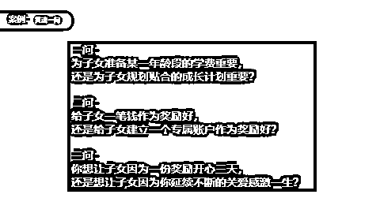  <ne-p id="u43bf8034" data-lake-id="u43bf8034"><ne-text id="u587f8518">   逻辑很重要。第一问，比如说我们想卖一个年金给客户，我们会先问她给孩子准备教育，是某一个阶段的学费比较重要，还是整个的成长计划比较重要？高净值客户对自己的小孩有一种很神奇的执念，很多人他如果自己以前没有受过什么良好的教育的话，他会希望孩子补偿，从小就给他安排一个很好的教育途径。那如果有一些他其实是可能从农村通过自己学历，进入了一个阶层的跨越，他就希望孩子能复制。</ne-text></ne-p> <ne-p id="u780314db" data-lake-id="u780314db"><ne-text id="ubf0f4770">   学费不是关键。很多客户最买什么教育金保险，其实仔细算算回报率非常的低，但是我能把他卖到几百万，就在于我跟她聊的是她对孩子教育这件事情怎么定义的。</ne-text></ne-p> <ne-p id="u4f9e6332" data-lake-id="u4f9e6332"><ne-text id="u83f088e5">   到底是学费重要，还是整个成长计划很重要？你的计划是什么？我这句话问出来，但凡如果是个母亲的话，她就开始滔滔不绝地讲。父亲的话，会稍微矜持一点，但是也会稍微有一点点敞开。接下来我要让他去思考，如果孩子表现优秀，你觉得要不要给孩子奖励呢？理论上肯定要有的，正反馈很重要。所以我们生财一直说你就听话照做，你先赚到第一块钱。对不对？孩子你一定要给他奖励，你没有正反馈，这个孩子就不想学。那么问题来了，你是想考好了再给他一笔奖励，还是把游戏规则跟他讲明白比较好？我们为什么航海里面保姆级的实操很重要，我不能说你先做，到时候帮你看看你卡在哪里。因为有游戏规则，高净值客人，大客户有钱人，他们也在自己熟悉的游戏规则里边，有自己的心得，他对孩子也不会拍脑袋，也有游戏规则。比如说你当时考到什么分数，还是你考到什么学校还是一个什么比例。就像航海里什么叫正反馈，你涨粉了没有？你的这个小眼睛有没有多？你的阅读量有没有起来？或者是你有没有引流到私域？就是总有一个规则，你不能随机。</ne-text></ne-p> <ne-p id="u4b92025a" data-lake-id="u4b92025a"><ne-text id="u12938e07">   当我们开始进入到这个环节的时候，客户他就开始跟我们在同一战线了。再来就是我们回到核心就是痛点在哪里，前面都是需求，痛点是你帮孩子准备教育这件事情难道是默默付出的吗？我其实不太相信有这样一句话说，父母对孩子的爱是无私的。我不知道大家认不认可，我不认可。只不过我们为什么觉得父母对孩子的爱是无私的呢？因为他要求回报的东西是无形。不是说我给孩子花了 500 万，我希望孩子是我的投资，他给我花 5000 万还回来。但是我给孩子花了 500 万做教育，我希望得到的是什么？孩子他对我的感恩心，他至少有点良心，他给我的这个回馈至少值个 500 万。我投了 500 万孩子去读书，孩子给我一句轻飘飘的谢谢还不值人家五块钱。那你想想看父母能心甘情愿吗？很难。所以人性这个事情大家研究一下，就是最终的那个痛点，前面花多少钱不是关键，还是看你花得值不值。那么当我跟客户讨论你用什么方案来做更值的时候，别人就很难 pk 我了。</ne-text></ne-p> <ne-p id="uc09db14e" data-lake-id="uc09db14e"><ne-text id="uecdf9cca" ne-bold="true">第二，谈自己。</ne-text><ne-text id="uf29e3678">其实高净值客户不缺钱，那他未来缺的是什么呢？就是我们站在另一个自己的立场上去跟他聊一聊。这句话也很土了，都说有家的男人多幸福，不知养家的男人多辛苦。当时这句话那么土，为什么戳到人？就是因为我们站在另一个他的立场去思考这件事情。</ne-text></ne-p> <ne-p id="u8a467f4b" data-lake-id="u8a467f4b"><ne-card data-card-name="image" data-card-type="inline" id="gRo0C" data-event-boundary="card">  <ne-p id="u6c34d560" data-lake-id="u6c34d560"><ne-text id="u588c1a47">   高净值客户最大的痛点或者是他们最大的情绪脆弱点在哪里呢？就是因为他最能干，所有的人都觉得他是应该的，或者是第一反应就是希望他来解决问题。人都是有脆弱的时候。我经常跟大家说一句话，就是没有人喜欢被神化，我不是个神，先请你把我当一个人。这就是为什么女神容易被屌丝追到，因为屌丝把她当一个人。没有办法了，我也没有钱，我也没有什么别的，我只能付出我自己的情绪价值。我非常勤快地跟在你屁股后面召之即来挥之即去。我想对你好，你是我的女神，我不是要求你什么，我就想对你好，我不知道怎么办了。那个时候一个人对另外一个人很无助的那种把自己心掏出来的感觉，对方会有特别有温度的感受。我们要让客户觉得，在我眼里你就是你，我不会因为你赚得多，就把你当成一个神话一样的人，我知道你也有困难，你也有需要解决的问题，我来帮你解决问题。当然了你付出我相应的价值。</ne-text></ne-p> <ne-p id="ua538ff93" data-lake-id="ua538ff93"><ne-text id="u58a57999">   我经常就会跟客户聊这个话题，就是我们这么努力地打拼，你为自己准备了什么？有没有人提醒你和关心你？我之前碰到一个高管，大概年薪三四百万，那他也是有老板，算是顶尖打工人了。我举个例子，比如说亦仁家的鱼丸，如果我抓着鱼丸说你看你这么忙，大家都叫你鱼丸，那么多个鱼丸，谁记得你自己的名字吗？有人提醒你说航海其实鱼丸最累，要不然亦仁每年航海结束都给你放个假，并且拿钱给你说鱼丸你去休息一下。如果有这样的老板，是不是你就会觉得非常非常的贴心，还得想给他打工，挖都挖不走。</ne-text></ne-p> <ne-p id="u9ecffd32" data-lake-id="u9ecffd32"><ne-text id="u8d05c0e1">   为什么大客户很多人拿不下来，因为他被大客户这三个字标签了。大客户也有脆弱的地方，你把它挖出来就会很爽。很多人跟我说什么大客户不缺钱，养老这个事情没法聊。但是我最喜欢卖的就是大客户的养老金，因为只有养老金是对客户自己的，他缺的不是钱，是那个仪式感，就是你给未来的自己发过工资吗？</ne-text></ne-p> <ne-p id="u363527f7" data-lake-id="u363527f7"><ne-text id="uf7897372">有时候客户就会跟我说，你怎么知道我没有，我给自己准备了 5 套房，10 套房收租，我的股份我每年能拿多少？那个时候我就得到了特别多的信息，你还会知道你的客户是一个乐观的还是悲观的人，你会知道你的客户是在为别人付出里得到成就感的，还是在自己获得里得到成就感。因为每个人真的都不一样，有钱人很有意思，单纯又可爱。所以在这种情况下我们就能得到很多的信息，我称之为价值观。</ne-text></ne-p> <ne-p id="ub344aebd" data-lake-id="ub344aebd"><ne-text id="u91666fb7">   当你知道一个人的价值观的时候，你就几乎什么都能卖出去给他了。他自私，你把你卖的所有的东西就包装成对自己好，他无私，你就把所有东西包装成，那是你的功德。为什么很多人会做慈善，就是功德这件事情是他的情绪嗨点。</ne-text></ne-p> <ne-p id="u4d38b9c6" data-lake-id="u4d38b9c6"><ne-text id="u27544796" ne-bold="true">最后一个是传承。</ne-text></ne-p> <ne-p id="u28079dcc" data-lake-id="u28079dcc"><ne-card data-card-name="image" data-card-type="inline" id="xsr30" data-event-boundary="card">  <ne-p id="u4eca8816" data-lake-id="u4eca8816"><ne-text id="u5053b162">   跟有钱人谈的最多的话题就是他的下一代，不光是教育，还有生命的延续这件事情。我不知道大家碰到的大客户，有多少二代是愿意接他班的，现在越来越少了。当二代不能接班的时候，其实客户面临的一个很大的心理上缺口是他自己的公司，他自己的事业其实是另一个孩子。不是接不接班的问题，是他两个孩子之间的认可度不一样的问题。</ne-text></ne-p> <ne-p id="ua4850f68" data-lake-id="ua4850f68"><ne-text id="ubef296c9">   很多客户心里有一个最大的坎，他不是因为孩子要不要接班。有点像他两个小孩本来互相不认识，突然直接认祖归宗了。其中一个小孩不认可另一个小孩，问题出在哪里？不是那个孩子出了问题，是这个小孩不认可那个小孩是我爸爸辛辛苦苦把他带出来，他也很优秀。孩子不能接班的最大的问题是他觉得自己的心血不被另外一个孩子认可，这才是他最大的情绪的缺口。接不接班怕什么？找个职业经理人公司不就没问题了吗？不是的，这个卡点大家不解决的话，你永远不懂大客户，他到底在想什么，越大他越不接班，他的失落感就越大。</ne-text></ne-p> <ne-p id="u526e3fcf" data-lake-id="u526e3fcf"><ne-text id="ub6c912e0">   在这种情况下我们去引导传承，一定跟客户谈到最核心的点，传承钱这件事情一点也不重要，是你想传承的内核到底是什么东西。这件事情跟客户一起想明白，他无论是有一个公司有一块地，有一个生财有术想要传承下去，本质都是一样的，就是接手的那一方，对他传承过来的东西，心怀感恩并且认可你的智慧和成果。</ne-text></ne-p> <ne-p id="u932dc07d" data-lake-id="u932dc07d"><ne-text id="u7135d22d">   这个问题能解决我们什么产品都能卖出去，你就把你的产品往那个上面去包装就可以了。</ne-text></ne-p> <ne-p id="u947f1a27" data-lake-id="u947f1a27"><ne-text id="u9a0aa53e" ne-bold="true" ne-underline="true">灵魂三问，它就是一个递进，第一你是怎么想的？第二的话是在想的过程中我们做了哪些准备？那你会发觉卡住了吗？这个卡点怎么解决？你想不想再多一点点？</ne-text><ne-text id="ubc123220">想不想再多一点点就是我们的产品和方案，那就是客户的痛点，没有人跟他讲得这么深，我们就不可替代。所以最后我们就强化啦，就是我懂你我给你出产品。</ne-text></ne-p> <ne-p id="u213029ee" data-lake-id="u213029ee"><ne-text id="udeb5a67a">   我经常说风险不是需求，就是你想让客户做的那件事情不是需求。那我们在什么情况下能让客户下决定购买呢？就是你要让客户去想象，如果不做这件事情，他在乎的人和事会发生一些他不能接受的后果。就客户在想象力的空间下，我们就会拥有更多的机会。但大家看生财很牛的一个地方在于对人性的拿捏，我们什么时候想行动，就是每一次航海告诉你你能赚到多少钱。很多人刚开始还不行动，但是你是看到人家上一期参加了小航海，从一个零粉一下子涨到了 10 万粉，从一个这个月薪 5000 块钱的普通的白领，爆了一个账号之后一天能赚几千块钱，你看到了，好像你不做你损失了几千块钱一样，这就是痛，这个后果我们不能承受。</ne-text></ne-p> <ne-p id="u607775dd" data-lake-id="u607775dd"><ne-text id="u92599c17">   我今天跟大家聊完这些，大家都知道大客户他也是个正常的人，而且他比普通人还简单一点。他的时间和精力都是花着去搞他的钱，搞他的生意对象以及他各种家人们去了。我碰到一个大客户，除了搞钱以外，剩下所有的时间都在搞他的钱，一任、两任、三任和好几个小孩，很多时候是我们自己跟客户说我的产品有什么优势，那他第一个本能的反应就是要么我再比一比。对，又回到了买家系统他很熟悉的这个部分。但是如果我们把他拉出来，就是你在乎的人和事，这件事情我帮你去解决，你看他那么多在乎的人和事，你一个一个帮他解决一辈子，一辈子的生意都在你手里了。所以真的大客户没有那么难做。</ne-text></ne-p> <ne-p id="u586e9156" data-lake-id="u586e9156"><ne-text id="ua286e5ab">   第一我们自己想通。第二的话有一点小招数，大道至简。我们把这些事情解决掉的话，我相信无论大家从事的是什么行业，其实人性是一样的，而且如果你卖的是一些实体的能看得到的东西的话，你能讲故事的空间会更多。</ne-text></ne-p> <ne-p id="u51cecd4d" data-lake-id="u51cecd4d"><ne-text id="ua8d5b072">祝大家都能搞定大客户，生财有术。</ne-text></ne-p> <ne-h2 id="a222d551" data-lake-id="a222d551"><ne-heading-ext><ne-heading-anchor></ne-heading-anchor><ne-heading-fold></ne-heading-fold></ne-heading-ext><ne-heading-content><ne-text id="u8711afc7">（198 赞）《我以前在阿里巴巴的流量方法论》</ne-text></ne-heading-content></ne-h2> <ne-p id="ucd403963" data-lake-id="ucd403963"><ne-text id="u08fc572e">懒人注：</ne-text></ne-p> <ne-p id="uabe1e9f7" data-lake-id="uabe1e9f7"><ne-text id="u42ffbd28">这是一篇公众号文章，点击直接跳转：</ne-text></ne-p> <ne-p id="uab228826" data-lake-id="uab228826">[<ne-text id="u1b6cee14">https://mp.weixin.qq.com/s/WOC1f8MuoY-hyV4znJ8DKg</ne-text>](https://mp.weixin.qq.com/s/WOC1f8MuoY-hyV4znJ8DKg)</ne-p> <ne-h2 id="54f990e1" data-lake-id="54f990e1"><ne-heading-ext><ne-heading-anchor></ne-heading-anchor><ne-heading-fold></ne-heading-fold></ne-heading-ext><ne-heading-content><ne-text id="u5423ac07">（129 赞）《创业底层思维逻辑认知手册》</ne-text></ne-heading-content></ne-h2> <ne-p id="u612fd4f7" data-lake-id="u612fd4f7"><ne-text id="ucad9d6e8">一个普通人创业到底应该是什么样子的？为什么现在普通人创业难如登天？</ne-text></ne-p> <ne-p id="ub79b12f7" data-lake-id="ub79b12f7"><ne-text id="udad3ab52">沉浸生财半年有余，将生财里大大小小的帖子翻了个遍，最后总结出一点——这些帖子并不适用于普通人。</ne-text></ne-p> <ne-p id="u13af7494" data-lake-id="u13af7494"><ne-text id="u64a7b45a">普通人创业可以。但是你想单单只靠生财里这些帖子就能做出什么成绩来，难。为什么？因为这些帖子根本不适用于任何一个普通人。</ne-text></ne-p> <ne-p id="uf9059f0a" data-lake-id="uf9059f0a"><ne-text id="u916968a3">生财的初心我们都看得到，龙珠激励机制，大小航海齐上阵，为的就是让你们这些普通人得到更多的资源。但是，这些东西极少有触及到本质层面的东西，大多都是一些“技术论”，让你往打工的方向走；要么就是哪里都适用的万金油，竟全是空话大话，实际上没有任何意义。</ne-text></ne-p> <ne-p id="ude5f9485" data-lake-id="ude5f9485"><ne-text id="u3bce7813">普通人想创业到底应该怎么干？你们有没有想过一个问题，你一个要啥没啥甚至刚入门的普通人，凭什么和千万创业者去争？凭什么别人没赚点钱你却能赚到钱？</ne-text></ne-p> <ne-p id="u59f97a5d" data-lake-id="u59f97a5d"><ne-text id="u479ab444">普通人直接来创业，你们差的太多了。哪怕是生财里保姆级的小航海，可依旧难以让每一个普通人真正的踏上创业这条路。因为几乎没有人懂创业的本质，再好的项目交给你们去做，最后你们依旧会给做成打工的样子。这里</ne-text>[<ne-text id="u8144dfeb">@亦仁</ne-text>](https://wx.zsxq.com/dweb2/index/footprint/552158581144) <ne-text id="u50fae36d">大大，希望大大能够看到这篇内容，实属荣幸，这是整个生财里 80%的人所需要的东西。</ne-text></ne-p> <ne-p id="u4d3bfdee" data-lake-id="u4d3bfdee"><ne-text id="u14137a74">从来没有任何人没有任何一篇帖子能给你讲创业最本质最贴地的东西，所有关于创业的内容，仔细分析皆是空话大话万金油，对于普通人没有任何实际意义。两万字大长篇，送给生财每一个人的《创业手册》，我们坐下来好好聊一聊，到底什么才叫创业，创业者到底应该干什么。</ne-text></ne-p> <ne-p id="u81b5ae8c" data-lake-id="u81b5ae8c"><ne-text id="u94467378">请相信，这会是你创业若干年来走到现在，第一篇真正给你讲创业本质的文章。这一篇文章将会彻底颠覆你对创业的认知，请不要惊呼，因为创业本就应该是这样的。接下来的时间交给各位，建议反复阅读反复思考。</ne-text></ne-p> <ne-p id="u2b0e237c" data-lake-id="u2b0e237c"><ne-text id="u24679017">《创业底层思维逻辑认知手册》 在线查看地址：</ne-text></ne-p> <ne-p id="ud253257b" data-lake-id="ud253257b">[<ne-text id="ub65164e9">https://ta9c03bm0x.feishu.cn/docx/NQAudoUzsoXAAwxKJeFcjvhZn4d</ne-text>](https://ta9c03bm0x.feishu.cn/docx/NQAudoUzsoXAAwxKJeFcjvhZn4d)</ne-p> <ne-p id="ua473e287" data-lake-id="ua473e287"><ne-text id="u660d3a53">懒人 pdf 下载地址：</ne-text>[<ne-text id="u3e8c47fb">https://lazyman.lanzoul.com/iG8wz0hxm4da</ne-text>](https://lazyman.lanzoul.com/iG8wz0hxm4da)</ne-p> <ne-h2 id="465e322e" data-lake-id="465e322e"><ne-heading-ext><ne-heading-anchor></ne-heading-anchor><ne-heading-fold></ne-heading-fold></ne-heading-ext><ne-heading-content><ne-text id="u134f79b1">（25 赞）《能让用户付费的 IP 也能叫 IP》</ne-text></ne-heading-content></ne-h2> <ne-p id="ub9510db4" data-lake-id="ub9510db4"><ne-text id="u1fc466a0">“不能让用户付费的 IP 也能叫 IP？” 大家好，我是佩奇，主业是樊登读书的 IP 孵化运营，副业是 IP 孵化变现咨询，一年来已帮助过 6 位 IP 成功解决变现的问题。 最近有几位 IP 问我流量还行但变现差怎么办？围绕这个问题我将自己的运营经验做了总结真诚地分享给大家。 希望可以帮助到做 IP 的伙伴们！内容详情点击链接移步飞书文档哦～ 没有一位 IP 操盘手爸爸们不对 IP 变现这件事情苦恼过？ 有流量却变现差？有流量但是不知道产品是什么？IP 本人不想降低身价去转化产品……</ne-text></ne-p> <ne-p id="u47334dbe" data-lake-id="u47334dbe">[<ne-text id="ueeba91b9">https://h9f4zz91q9.feishu.cn/docx/VsXidpyDFo96KkxXCjPcAaGTnMh</ne-text>](https://h9f4zz91q9.feishu.cn/docx/VsXidpyDFo96KkxXCjPcAaGTnMh)</ne-p> <ne-h2 id="6af4109b" data-lake-id="6af4109b"><ne-heading-ext><ne-heading-anchor></ne-heading-anchor><ne-heading-fold></ne-heading-fold></ne-heading-ext><ne-heading-content><ne-text id="u5b52c248">（85 赞）《我们去创业，不能仅仅有一个美好的愿望，而是应该做好充分的准备》</ne-text></ne-heading-content></ne-h2> <ne-p id="ua409e11b" data-lake-id="ua409e11b"><ne-text id="u7a80fb8e">周一又到了，虽然我们公司已经居家办公一周，并没有上班，分享还是继续。 这段日子，还是会接到一些朋友咨询去创业做事的话题，比如要做奶茶，要开茶馆，好做抖音，要做直播电商等等。 虽然时局艰难，但我很敬佩大家，还有奋斗的愿望。但是，我想唠叨的是，我们去创业，不能仅仅有一个美好的愿望，而是应该做好充分的准备。</ne-text></ne-p> <ne-p id="u9469c452" data-lake-id="u9469c452"><ne-text id="u48574bd7">尤其是跨领域创业，失败率太高，因为你以外行的身份观察，和你下手亲自干是两回事。不管你做一个小店，还是想去做一番伟大事业，都应该做好充分的调研工作。比如你想开个茶馆，如果你以前没做过，那你最好的调研方式就是去茶馆打工干几个月，这才能深入了解这个行业的道道。 我们做咨询，为什么第一次甜是 3 个月之后？那就是因为，很多行业是我们之前没有接触过的，我们需要非常深入的研究调研，才能了解这个行业。</ne-text></ne-p> <ne-p id="ueb973c9c" data-lake-id="ueb973c9c"><ne-text id="u8c901501">如果你对这个行业一无所知，谁给你创业的勇气呢？是不是。 当你了解一个行业之后，你还要思考一个创业的终极问题：为什么是你？ 有些行业，是可以容得下很多小公司的，这个市场比较分散。有些行业，最后就只能剩下几个大玩家，小公司会最终会被市场竞争最清理出局。 如果你没太大理想，建议你去一个分散型的市场，做几个小店也能满足，比如烟酒店，杂货店，农村里的农资店，城市里的废品店。</ne-text></ne-p> <ne-p id="u6aaaf150" data-lake-id="u6aaaf150"><ne-text id="u48a816f2">餐饮行业里，像普通的沙县小吃、包子店，小炒店等等，但是像奶茶店这种，你自己是干不起来的，竞争门槛太高，你除了加盟一家大品牌之外，别无他途。 一定要记住：不熟不做。 一定要清醒：成功都是艰难的。而且这个艰难是超过你想象的。 一定要有冗余备份：就算失败了，还有一定的家底和找到工作的硬技术。</ne-text></ne-p> <ne-h2 id="0900d987" data-lake-id="0900d987"><ne-heading-ext><ne-heading-anchor></ne-heading-anchor><ne-heading-fold></ne-heading-fold></ne-heading-ext><ne-heading-content><ne-text id="ua922fa81">（23 赞）《职场人如何通过商业拆解，挖掘并复制副业项目》</ne-text></ne-heading-content></ne-h2> <ne-p id="ud8541dbd" data-lake-id="ud8541dbd"><ne-text id="u3b279e4d">在不确定的大环境下，职场人如果只依靠工资收入，安全感太低。相信咱们星球中也有很多小伙伴早就开始了副业尝试，但怎么找副业、通过副业怎么高效率赚钱、对于不少人来说依然是个痛点。</ne-text></ne-p> <ne-p id="u99ed2714" data-lake-id="u99ed2714"><ne-text id="uf768220b">各位圈友大家好，我是秦汉唐，一个 7 年私域老兵，擅长私域运营、商业项目拆解&复制。</ne-text></ne-p> <ne-p id="ubfea37d0" data-lake-id="ubfea37d0"><ne-text id="u0c26c5b0">相信大家平时都有刷小红书、抖音、豆瓣、快手这些平台，平时没事的时候我也喜欢刷各种抖音刷快手刷小红书，这时算法就开始主动给我反馈，于是我就看到很多自己感兴趣的商业的项目，一些不起眼的小项目。这个时候我就很好奇，就会去尝试拆解他们从前端的内容生产，再到后端的导流私域及之后转化成交的整个流程。</ne-text></ne-p> <ne-p id="u2b1cf57c" data-lake-id="u2b1cf57c"><ne-text id="uf3ee7347">拆下来之后，我就发现很多时候有些项目是完全可以复制的，是不需要投入几十万也可以复制的。复制了之后，用跟他一样的内容生产方式、转化链路，你也能拿到一定的结果。这些结果就成了你变现的收入，哪怕只有他的 1/10，那也是一笔不菲的业余收入。</ne-text></ne-p> <ne-p id="uac604f06" data-lake-id="uac604f06"><ne-text id="u5929eda7">事实证明，我们通过拆解各个内容平台的作品，也可以找到很好的商业项目实现副业变现。今天跟大家分享的主要就是</ne-text><ne-text id="u7397304b" ne-bold="true">运营人如何通过商业拆解挖掘并复制副业项目?</ne-text></ne-p> <ne-p id="u0731560f" data-lake-id="u0731560f"><ne-card data-card-name="image" data-card-type="inline" id="hG7dr" data-event-boundary="card">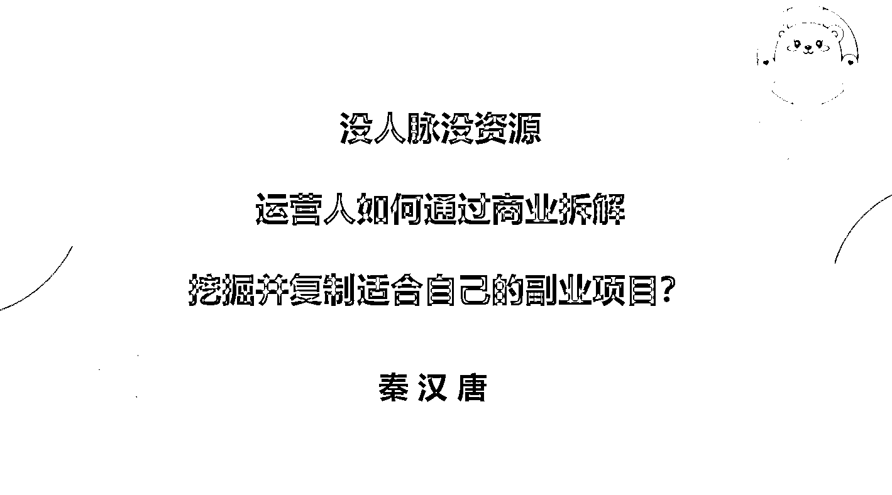  <ne-quote id="ub7d065fa" data-lake-id="ub7d065fa"><ne-h1 id="6e308707" data-lake-id="6e308707"><ne-heading-ext><ne-heading-anchor></ne-heading-anchor><ne-heading-fold></ne-heading-fold></ne-heading-ext><ne-heading-content><ne-text id="uf8fe0458" ne-bold="true">01 实操案例分享</ne-text></ne-heading-content></ne-h1> <ne-p id="u5432ba09" data-lake-id="u5432ba09"><ne-text id="u2fa50057">先跟大家分享几个我觉得比较典型的案例。</ne-text></ne-p> <ne-p id="u4785c5f7" data-lake-id="u4785c5f7"><ne-card data-card-name="image" data-card-type="inline" id="U7DjM" data-event-boundary="card">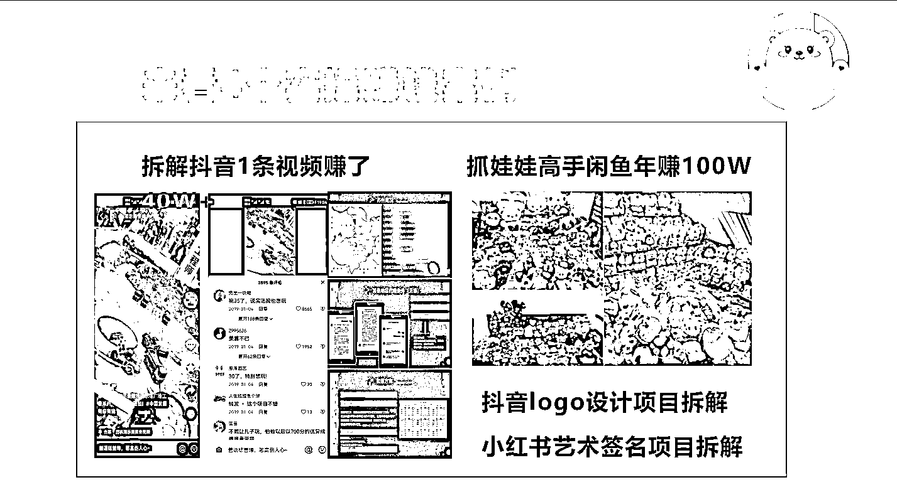  <ne-p id="uf8dbe83d" data-lake-id="uf8dbe83d"><ne-text id="ufbeab7b2" ne-bold="true">第一个案例是几年前我通过拆解 1 个儿童游乐的爆款视频，通过复制对方的模式，三个月变现 40 万。</ne-text></ne-p> <ne-p id="u5ca43ac0" data-lake-id="u5ca43ac0"><ne-text id="uaaba6628">当时是在老家过年，晚上没事刷抖音，突然发现一个视频，是一个商场中庭里搭建的场地，场地中是模拟工地施工，几个合金挖掘机、塔吊、翻斗车在跑着，周围环绕了一堆小朋友和大人，有几个拿着遥控器一直在挖土卸土。看到这儿，我内心中潜藏很久的挖掘机梦开始熊熊燃烧了起来，我在页面上足足停留了好几分钟，说实话，如果这是在我家附近商场开的话，我也会选择去玩。</ne-text></ne-p> <ne-p id="ue8af38b0" data-lake-id="ue8af38b0"><ne-text id="u3dbca52f">好奇之下注意到了这个视频的数据，8.4w 赞，1.1w 转发，3000 多条评论！估计播放量得有 1000w+了。好奇之下点开了评论区，看看是不是只有我一个幼稚鬼。结果发现了新大陆，在评论区里除了看到很多人跟我同感之外，还有很多咨询的线索：「苏州有吗？」「可以加盟吗？」「我也想在我这的万达搞一个，怎么加入？」......</ne-text></ne-p> <ne-p id="ub55ef5cf" data-lake-id="ub55ef5cf"><ne-text id="ud168f3d0">作为一个敏感的互联网人，几乎是下意识地在所有跟他们建联的触点上做了操作：</ne-text></ne-p> <ne-p id="ud5407a58" data-lake-id="ud5407a58"><ne-text id="u76ea226e">1\. 模仿上面的咨询语气在评论区留了言。</ne-text></ne-p> <ne-p id="u8af7eafc" data-lake-id="u8af7eafc"><ne-text id="u66b38baa">2\. 关注账号，假装很急的样子私信了他们。</ne-text></ne-p> <ne-p id="u906c200a" data-lake-id="u906c200a"><ne-text id="uad2a37bb">3\. 拨打了他们主页的官方电话。</ne-text></ne-p> <ne-p id="ub1888fe6" data-lake-id="ub1888fe6"><ne-text id="uf1b3545e">不出意外，2 个小时后（估计是流量太大接不过来），私信窗口给我发了一个微信号，成功加上了微信。加上微信后，给我发了 2 个文件：《已被加盟的城市地图》&《代理政策》。他们分为市代和区代，加盟费用总共在 4w 左右，市代可以发展代理拿返点。我看到文件中已经有 130 多个城市被拿下了市代，我当时想咨询苏州市代的，已经晚了一步。</ne-text></ne-p> <ne-p id="u34373441" data-lake-id="u34373441"><ne-text id="u5ab9a50e">于是我就想我可不可以复制一下，我不要赚 500 多万，我赚 50 万行不行？那这个时候就由因此产生了后面的事情。</ne-text></ne-p> <ne-p id="u16acb024" data-lake-id="u16acb024"><ne-text id="u4f0bd263">我就找了一个我的技术的小伙伴搜索这家公司全网的信息，发现就是他们这家公司是一个广州的贸易公司。它不是源头的厂家，也不是终端的门店，它就是拿货卖赚的差价的，所以可以得出结论——货源不在它。另外，我们发现这家公司开的淘宝店铺、京东店铺、拼多多店铺等全网的各个店铺，产品销量卖得并不好。还有他之前做的所有的事情，其实都是把他们的这个当成把他把这种的产品当成货来卖。而这条视频爆了是因为他们把卖货改成了卖门票。而这样的消费场景，一下子就打到人的这个心里面，特别是男生的心里。</ne-text></ne-p> <ne-p id="uc9643dba" data-lake-id="uc9643dba"><ne-text id="ud2779f5c">分析完上述内容后，我基本上判断这个项目是可以复制的。首先，这个视频爆得偶然；其次，他货源不是他自己的，也就是说我可以通过别的方式找到他的货源；最后，这个消费场景经过验证是证明是有需求的，而且需求量还不小。</ne-text></ne-p> <ne-p id="u74bba0a0" data-lake-id="u74bba0a0"><ne-text id="u07a0cf73">于是我们就做了后面的几件事。搭了一个小团队，三个人，我，一个技术伙伴，还有一个商务伙伴。</ne-text></ne-p> <ne-p id="u3ece1d47" data-lake-id="u3ece1d47"><ne-text id="ucdfe4d3c">商务小伙伴去跑到深圳去找厂家货源，拿到了极低的成本价，同时还拿到了一年的保修。 接着，我自己定产品，对方是 4.5 万 1 个加盟费，我们直接定 2 万。</ne-text></ne-p> <ne-p id="u2ffa4c01" data-lake-id="u2ffa4c01"><ne-text id="u7ba27a1f">定完产品定引流渠道，我觉得做生意需要确定性，我不需要偶然性，所以我就设计了两个渠道，两条腿走路。</ne-text></ne-p> <ne-p id="u47decae1" data-lake-id="u47decae1"><ne-text id="ub59dfc7a">第一个渠道是通过我们投放抖音作品找流量。只要视频下面评论区有人评论有效的信息，那我们就立马去投放。当时搞了三个账号，每天基本上都投放，这是第一条路。</ne-text></ne-p> <ne-p id="u275c4260" data-lake-id="u275c4260"><ne-text id="u4b41813c">第二条路就是我们去找了私域上面有很多公众号，就是教大家怎么去做副业的，或者是还有教大家怎么去做生意的等等这些公众号。我们找到公众号跟他们合作，就是说我这边有这样的一个项目，推荐成功之后我给你分润。</ne-text></ne-p> <ne-p id="u5cd8a879" data-lake-id="u5cd8a879"><ne-text id="u3699b955">定下来之后，三个月时间内我们招了 40 多个加盟商，2 万一个就是 80 多万，刨去各种成本费用，基本上半个月我们赚了 40 万。就这样，把事儿做成了。</ne-text></ne-p> <ne-p id="ua365f21e" data-lake-id="ua365f21e"><ne-text id="u4cae45d3">这个项目的详细复盘帖之前已经在生财发表过，详情可戳>></ne-text>[<ne-text id="u08166c46">https://t.zsxq.com/08PFn1JbN</ne-text>](https://t.zsxq.com/08PFn1JbN)</ne-p> <ne-p id="u190cec12" data-lake-id="u190cec12"><ne-text id="ud438d860" ne-bold="true">第二个案例是抖音上的一个账号：文川手写。</ne-text></ne-p> <ne-p id="u2d2a4ae5" data-lake-id="u2d2a4ae5"><ne-text id="u9c35d075">这是一个帮别人设计 logo 的账号，他是通过手写的方式把一个 logo 从创意到产出的过程呈现出来的，让人眼前一亮。我当时刷到时候，粉丝量不多，但是下方评论区有一堆人评论：怎么找你设计 logo，你设计一个多少钱，我这边开了一个奶茶店，怎么设计 logo 你能帮我设计吗……这类有效的客资信息。</ne-text></ne-p> <ne-p id="ubffd5bcd" data-lake-id="ubffd5bcd"><ne-text id="u697f0d5f">当时我就想就是这样的一个项目其实也是可以复制的，为什么呢？</ne-text></ne-p> <ne-p id="u4d4e6ce4" data-lake-id="u4d4e6ce4"><ne-text id="u75fbc0be">首先，它这个创意生产的方式是固定的，那对我们来说无非就是找一个这样的软件，或者是找一个设计师把它做出来。</ne-text></ne-p> <ne-p id="uafbf4f41" data-lake-id="uafbf4f41"><ne-text id="u7a101bc0">其次，流量端我们通过发这些内容就可以稳定了，每个月能来个几百个意向咨询。接下来搞定转化交付端就行。</ne-text></ne-p> <ne-p id="udb32f68a" data-lake-id="udb32f68a"><ne-text id="u0f62fb40">有人说我不会设计 logo 怎么办？我怎么做这个生意？那我们可以去找大学里面的设计专业的大学生帮我们做设计，我们找 50 个这样的大学生，给他派单，我每个月有几百个咨询，比如说我收一个 599 设计价格，我们给他大学生 200 或者 250 费用，我们中间赚一半，那这个这个项目又成了。</ne-text></ne-p> <ne-p id="u336c558f" data-lake-id="u336c558f"><ne-text id="ue4cc27c5">就是这样一种方式——通过刷抖音或者刷小红书的过程发现商业案例，再拆解复制这样的案例去形成一个商业模式，去发展自己的副业。</ne-text></ne-p> <ne-p id="uba9ebac6" data-lake-id="uba9ebac6"><ne-text id="u67727beb">这样的案例其实有很多，再举个类似例子，大家有没有看过抖音和小红上面帮你设计艺术签名的？在小红书上面和抖音上面其实有很多这样的账号，你去做这样的一个账号其实也很容易起量，持续发内容很多人会来咨询你。</ne-text></ne-p> <ne-p id="u8f5f63c4" data-lake-id="u8f5f63c4"><ne-text id="ub1e99d7e">比如说有人问：我这个名字秦汉唐应该怎么写，能帮我设计一个吗？</ne-text></ne-p> <ne-p id="u0ded820a" data-lake-id="u0ded820a"><ne-text id="ube9f2f3f">你这个时候就可以私信他，让他加你微信 9.9 一个，然后去找那种专门设计艺术签名的网站。对你来说是免费的，但是对他来说他是要付费，这样做一天成交个几十个客户，每月赚点零花钱是可以的。</ne-text></ne-p> <ne-p id="u05956bc0" data-lake-id="u05956bc0"><ne-text id="ud5ae25d7">设计艺术签名的免费素材全网有很多。而且经过我们验证，通过这个艺术签名的这样的一个在小红书里面的笔记爆的概率是比较大。就这样的一个小项目，它不能让你发大财，但是能让你每个月都挣小几千块钱是没问题的。</ne-text></ne-p> <ne-p id="u63bc2693" data-lake-id="u63bc2693"><ne-text id="u27fb9054" ne-bold="true">更多内容由于长度过长，星球发不出来，</ne-text><ne-text id="ubb279716" ne-bold="true">请移步飞书文档👇</ne-text></ne-p> <ne-p id="u044fb59f" data-lake-id="u044fb59f">[<ne-text id="ub17d3ea2" ne-underline="true">https://evs6m7y1q3.feishu.cn/docx/I9OAdzzs2oBliNxsmPjcHnBUnzf</ne-text>](https://evs6m7y1q3.feishu.cn/docx/I9OAdzzs2oBliNxsmPjcHnBUnzf)</ne-p> <ne-p id="u6d78ba4d" data-lake-id="u6d78ba4d"><ne-text id="u367d7a87">如果文章对您有帮助，可以点个赞</ne-text></ne-p> <ne-p id="u861b6c09" data-lake-id="u861b6c09"><ne-text id="u3dbb9894">如果文章您有疑问，评论区留言，知无不言言无不尽~</ne-text></ne-p> <ne-h1 id="941ad9c9" data-lake-id="941ad9c9"><ne-heading-ext><ne-heading-anchor></ne-heading-anchor><ne-heading-fold></ne-heading-fold></ne-heading-ext><ne-heading-content><ne-text id="u104c0908">二、生财项目</ne-text></ne-heading-content></ne-h1> <ne-h3 id="1459b48f" data-lake-id="1459b48f"><ne-heading-ext><ne-heading-anchor></ne-heading-anchor><ne-heading-fold></ne-heading-fold></ne-heading-ext><ne-heading-content><ne-text id="u770e78f4">1、国内平台 - 字节系</ne-text></ne-heading-content></ne-h3> <ne-h2 id="bd0d52ef" data-lake-id="bd0d52ef"><ne-heading-ext><ne-heading-anchor></ne-heading-anchor><ne-heading-fold></ne-heading-fold></ne-heading-ext><ne-heading-content><ne-text id="ue8ece21f">（精华帖）（171 赞）《不用 OBS 推流做无人直播，与商家合作录制真实直播间，单场销售额超百万的实操分享》</ne-text></ne-heading-content></ne-h2> <ne-p id="u774eb410" data-lake-id="u774eb410"><ne-text id="ud829fbc6">嗨，我是黄小刀。今天来和大家分享一点关于我做无人直播的一些思考和心得，希望能给大家带来不同的视角与有使用价值的操作。</ne-text></ne-p> <ne-p id="ue9ed80ca" data-lake-id="ue9ed80ca"><ne-text id="u12a33030">做无人直播风险比较大有 2 个点：被系统检测封控和被人工举报。</ne-text></ne-p> <ne-p id="u0985c798" data-lake-id="u0985c798"><ne-text id="u39966252">我们是自己研发的硬件，是一个黑色的盒子，插在电脑上会被电脑识别为“摄像头”，这个硬件的直播实现路径是：打开直播伴侣--添加摄像头--选中盒子--开播。开播内容就是你拷贝在盒子上的内容，这个方法可以防止系统检测。</ne-text></ne-p> <ne-p id="ub2432a2f" data-lake-id="ub2432a2f"><ne-text id="u0602f9c4">然后在准备直播素材的过程中，我们用的最多的方法是直接去店里私聊客服，和他们合作录制真实直播间场景进行带货，商家很乐意帮他卖出去货，买家肉眼上也无法判断我在无人直播。</ne-text></ne-p> <ne-p id="u13f9ff5f" data-lake-id="u13f9ff5f"><ne-text id="u3275b266">我在无人直播赛道的成绩单：</ne-text></ne-p> <ne-p id="u52c1f314" data-lake-id="u52c1f314"><ne-text id="u52fe2c5d">今天我的分享主要通过以下三个部分：</ne-text></ne-p> <ne-oli><ne-oli-i>1</ne-oli-i><ne-oli-c class="ne-oli-content" id="u80d7895f" data-lake-id="u80d7895f"><ne-text id="u948e60a2">无人直播的定义和机遇</ne-text></ne-oli-c></ne-oli> <ne-oli><ne-oli-i>2</ne-oli-i><ne-oli-c class="ne-oli-content" id="u12f5d2c0" data-lake-id="u12f5d2c0"><ne-text id="u871996a1">无人直播的操作方法</ne-text></ne-oli-c></ne-oli> <ne-oli><ne-oli-i>3</ne-oli-i><ne-oli-c class="ne-oli-content" id="u961b1127" data-lake-id="u961b1127"><ne-text id="u9672c567">无人直播的问题和风险</ne-text></ne-oli-c></ne-oli> <ne-h1 id="bd22b025" data-lake-id="bd22b025"><ne-heading-ext><ne-heading-anchor></ne-heading-anchor><ne-heading-fold></ne-heading-fold></ne-heading-ext><ne-heading-content><ne-text id="u222974b7">一、无人直播的定义和机遇</ne-text></ne-heading-content></ne-h1> <ne-p id="u9725fdf7" data-lake-id="u9725fdf7"><ne-text id="u665d1b11">【这个部分没入行的小白可以看，已经有基础的同学直接跳至第 2 部分】</ne-text></ne-p> <ne-h2 id="43de348d" data-lake-id="43de348d"><ne-heading-ext><ne-heading-anchor></ne-heading-anchor><ne-heading-fold></ne-heading-fold></ne-heading-ext><ne-heading-content><ne-text id="u0ee41cff" ne-bold="true">1.选择无人直播的原因</ne-text></ne-heading-content></ne-h2> <ne-p id="u96c300c3" data-lake-id="u96c300c3"><ne-text id="u3c094a63">我是个懒人，不喜欢干体力活，也不喜欢做重运营。</ne-text></ne-p> <ne-p id="u1b7f2b9b" data-lake-id="u1b7f2b9b"><ne-text id="udf3b90fe">18-20 年搭建了几个真人直播的账号，我自己的最大的感受是：累。真的是累。</ne-text></ne-p> <ne-p id="u9fb2378c" data-lake-id="u9fb2378c"><ne-text id="u7f7813fc">抛掉直播间的沉重运营成本不谈，最大的问题还是主播发挥不稳定，播 3 个小时就会累，直播间人少就没状态，遇到不好的评论不会控制情绪..</ne-text><ne-text id="u4e7372af" ne-bold="true">.这些人的因素，都会降低最终成交</ne-text><ne-text id="uef231bb3">。</ne-text></ne-p> <ne-p id="u6057a849" data-lake-id="u6057a849"><ne-text id="ua6c0bad7">（什么人不会累？机器人！现在也真的有 ai 来完成短视频和直播，感兴趣的可以搜索“数字人”）</ne-text></ne-p> <ne-p id="u52e5a7c9" data-lake-id="u52e5a7c9"><ne-text id="u30158aab">再加上时不时发生的口罩原因，场地封控，主播、运营、场控等工作人员无法顺利工作，我迫切地想要一个“在家就能赚钱”的工作方式。</ne-text></ne-p> <ne-p id="u1c9f68d0" data-lake-id="u1c9f68d0"><ne-text id="u0fb2da20">无人直播，恰好是我在电脑前呆着就能完成的赚钱方式。</ne-text></ne-p> <ne-p id="u0d0f7e68" data-lake-id="u0d0f7e68"><ne-text id="u676e7d5d">而且，</ne-text><ne-text id="u5c54c86c" ne-bold="true">它有一个非常大的优点：天花板高</ne-text><ne-text id="u6d9c16f6">。</ne-text></ne-p> <ne-p id="u42d8f3c8" data-lake-id="u42d8f3c8"><ne-text id="uf02d823b">不同于一个月赚几百几千的小项目，无人直播属于直播赛道，比如我在抖音的一场直播，7 月 16 号一天卖了 116.8 万，无人直播能拉到的销售额，甚至比大多数真人直播都要高。</ne-text></ne-p> <ne-p id="uf116ab98" data-lake-id="uf116ab98"><ne-text id="u5390ac50">无人直播的典型特征：进入成本低、天花板高。</ne-text></ne-p> <ne-h2 id="4223dd66" data-lake-id="4223dd66"><ne-heading-ext><ne-heading-anchor></ne-heading-anchor><ne-heading-fold></ne-heading-fold></ne-heading-ext><ne-heading-content><ne-text id="uc46371c9" ne-bold="true">2.什么是无人直播？</ne-text></ne-heading-content></ne-h2> <ne-p id="ub13cd80a" data-lake-id="ub13cd80a"><ne-text id="u6e8b36c6">我们现在看到的主播，都是有真实主播、现在真实直播间，对粉丝进行实时的直播内容。</ne-text></ne-p> <ne-p id="uaac0172f" data-lake-id="uaac0172f"><ne-text id="u1454278b">就好像我们观看的春节晚会，一切都是实时的，主持人、演员、工作人员都现场呈现。</ne-text></ne-p> <ne-p id="u5eaf4446" data-lake-id="u5eaf4446"><ne-text id="u03148940" ne-bold="true">无人直播，则是提前录制好直播素材</ne-text><ne-text id="ueec29029">，只需要让素材循环播放就可以。</ne-text></ne-p> <ne-p id="u2aeb5ee0" data-lake-id="u2aeb5ee0"><ne-text id="ue87c56ed">就好像我们在电视上看甄嬛传，孙俪并不需要真的站在那里对你现场演戏。</ne-text></ne-p> <ne-p id="ubb586db5" data-lake-id="ubb586db5"><ne-text id="uf64fdcb4">无人直播里，也分录播/实时转播/真实场景不出人等形式。</ne-text></ne-p> <ne-h2 id="3aa1e062" data-lake-id="3aa1e062"><ne-heading-ext><ne-heading-anchor></ne-heading-anchor><ne-heading-fold></ne-heading-fold></ne-heading-ext><ne-heading-content><ne-text id="u66ba18ae" ne-bold="true">3.无人直播是怎么赚钱的？</ne-text></ne-heading-content></ne-h2> <ne-p id="udc9cb263" data-lake-id="udc9cb263"><ne-text id="ucc7b650c">本质上是带货，传统的方式是通过挂小黄车售卖精选联盟的商品来赚取佣金，或者直播自己的商品来赚钱。</ne-text></ne-p> <ne-p id="u7dda0c90" data-lake-id="u7dda0c90"><ne-text id="u81c62bfa">这样的佣金现在也越来越难赚，大家手里没钱导致购物欲望下降，同时多地快递停发，这导致带货难度上升，拿到佣金的难度也上升，结算时间为用户确认收货后 7 天。</ne-text></ne-p> <ne-p id="u745cdf6f" data-lake-id="u745cdf6f"><ne-text id="ueb638f18">另一种无人直播是做人气打赏的，比如最近，一直是小众玩法的“</ne-text><ne-text id="ueef696bf" ne-bold="true">撸音浪</ne-text><ne-text id="ue9e62a8a">”突然爆火，出现了各种各样的新形式，我也分出来了 1/3 工作室资源来做撸音浪/互动游戏。</ne-text></ne-p> <ne-p id="ua15c6807" data-lake-id="ua15c6807"><ne-text id="u77faf7f9">作为撸音浪大军中的一员，这里也给大家拆解一下这个项目。</ne-text></ne-p> <ne-p id="u9d22c0bc" data-lake-id="u9d22c0bc"><ne-text id="u6cb05066" ne-bold="true">首先聊聊什么是撸音浪，为什么撸音浪会火？</ne-text></ne-p> <ne-p id="u16c92e4d" data-lake-id="u16c92e4d"><ne-text id="u1db27fe8">撸音浪，顾名思义，赚的是抖音上用户打赏礼物的钱。不用挂车、不用卖商品，收用户打赏即可。</ne-text></ne-p> <ne-p id="u9dc17c74" data-lake-id="u9dc17c74"><ne-text id="ub1335d85">一万音浪=1000 元，一场一结，你下播后可以直接提现，再也没有退货、没有等待期。</ne-text></ne-p> <ne-p id="uadd53c03" data-lake-id="uadd53c03"><ne-text id="ua0767773">例如这一场，音浪 25 万，抖音扣除 50%，也就是 1.25 万到手。</ne-text></ne-p> <ne-p id="ua900b904" data-lake-id="ua900b904"><ne-card data-card-name="image" data-card-type="inline" id="Q3HEj" data-event-boundary="card">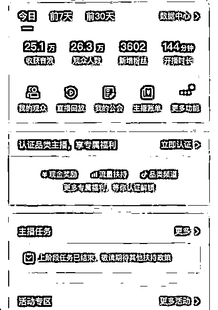  <ne-p id="ubc4da365" data-lake-id="ubc4da365"><ne-text id="u1f6ef718">既然撸音浪这么香，那音浪都是怎么撸出来的呢？</ne-text></ne-p> <ne-p id="ue029c625" data-lake-id="ue029c625"><ne-text id="u8212b671">撸音浪这件事的核心本质只有一句话：</ne-text><ne-text id="u4d41be36" ne-bold="true">骗音浪</ne-text><ne-text id="u574944aa">。</ne-text></ne-p> <ne-p id="u418d6c7a" data-lake-id="u418d6c7a"><ne-text id="ufdbbd28d" ne-bold="true">具体都有哪些类型呢，我们来一一拆解。</ne-text></ne-p> <ne-p id="udba8a773" data-lake-id="udba8a773"><ne-text id="uefb08afa" ne-bold="true">1\. 利用人们同情心，乞讨型</ne-text></ne-p> <ne-p id="uaaa83a4a" data-lake-id="uaaa83a4a"><ne-card data-card-name="image" data-card-type="inline" id="fWUxH" data-event-boundary="card">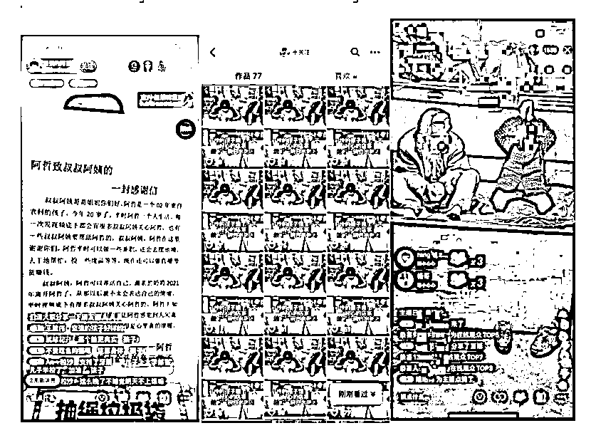  <ne-p id="uf72b9612" data-lake-id="uf72b9612"><ne-text id="ud21b3ee7">这样的直播间相信很多人刷到过，就和我们以前在天桥上遇到的乞丐一样，会有善心大发的给施舍给他们，这是一种新形式的网络乞讨，把线下的乞讨场景搬到了线上。</ne-text></ne-p> <ne-p id="u65283222" data-lake-id="u65283222"><ne-text id="u7d4f9e44" ne-bold="true">素材来源：</ne-text><ne-text id="u53c654bc">老人的素材基本有团队去农村找人拍，拍一条 200 块钱，拍完卖素材，再由主播进行无人直播，前者励志大学生的素材更简单，短视频只是一个学生吃饭，随便在哪个学校都可以偷拍到很多这样的画面，直播内容是一张打印出来的纸，男孩不断在直播间感谢人。活灵活现给大家演绎了一出“开局一张图，故事全靠编。”</ne-text></ne-p> <ne-p id="u1e680be5" data-lake-id="u1e680be5"><ne-text id="u981e1ee0">封号原因：录播、利用不正常手段诱导打赏</ne-text></ne-p> <ne-p id="u77677fc3" data-lake-id="u77677fc3"><ne-text id="u2b2b6487">封号几率：高</ne-text></ne-p> <ne-p id="u86b61153" data-lake-id="u86b61153"><ne-text id="u9051ba5a">违背道德指数：4 颗星</ne-text></ne-p> <ne-p id="u1b06dc9d" data-lake-id="u1b06dc9d"><ne-text id="u778ca508" ne-bold="true">2\. 利用 lsp 的心态，搞涩涩</ne-text></ne-p> <ne-p id="ucd3a8fc3" data-lake-id="ucd3a8fc3"><ne-text id="u36a679b0">这个涩涩的项目最近遍地开花，很多人看到这么短平快且无成本的事，都选择了上手实操。</ne-text></ne-p> <ne-p id="u7e1c0806" data-lake-id="u7e1c0806"><ne-text id="ub916b42c">这类的直播间有个特点：画面一般都是提前准备好的马赛克、诱惑剪影、黑屏，音频则是羞羞的声音，首先画面停留就做好了，进来的用户起码会停留一段时间，来搞懂这个直播间在做什么。</ne-text></ne-p> <ne-p id="ubca3c257" data-lake-id="ubca3c257"><ne-text id="ueb45393f" ne-bold="true">那怎么骗音浪呢？</ne-text></ne-p> <ne-p id="u36b62929" data-lake-id="u36b62929"><ne-text id="u7cfd957e">技巧就在左上角的“入口”标志，这个标识是在直播伴侣内，设置的投票玩法，如投票标题为：入口（暗示通过这个入口可以获取涩涩的资源），pk 两边一个是“成人入口”，一个是“未成年勿进”，设置 pk 金额（从 1 抖币到 99 抖币不等），如果直播间人少，就设置 1 抖币的 pk，人多就设置更多抖币的 pk。</ne-text></ne-p> <ne-p id="ud24a2e23" data-lake-id="ud24a2e23"><ne-text id="uaefc4c51">骗音浪路径有了，但是话术上还不够，需要再给那些犹犹豫豫的用户添把柴。</ne-text></ne-p> <ne-p id="u5926b10b" data-lake-id="u5926b10b"><ne-text id="u92d72630" ne-bold="true">怎么添？</ne-text></ne-p> <ne-p id="u8a69da94" data-lake-id="u8a69da94"><ne-text id="u7f7c1c73">自己的小号在直播间当水军带节奏，比如上图中的“啊啊好白”“点了 8 次终于进来了”，前一句的评论是引诱你这里真的有好东西，后一句是为了安抚那些被骗了一抖币结果发现什么都没有的人，“你再多打赏几块钱就能刷出来了”，妥妥的骗术。</ne-text></ne-p> <ne-p id="u4629d807" data-lake-id="u4629d807"><ne-card data-card-name="image" data-card-type="inline" id="DP8TA" data-event-boundary="card">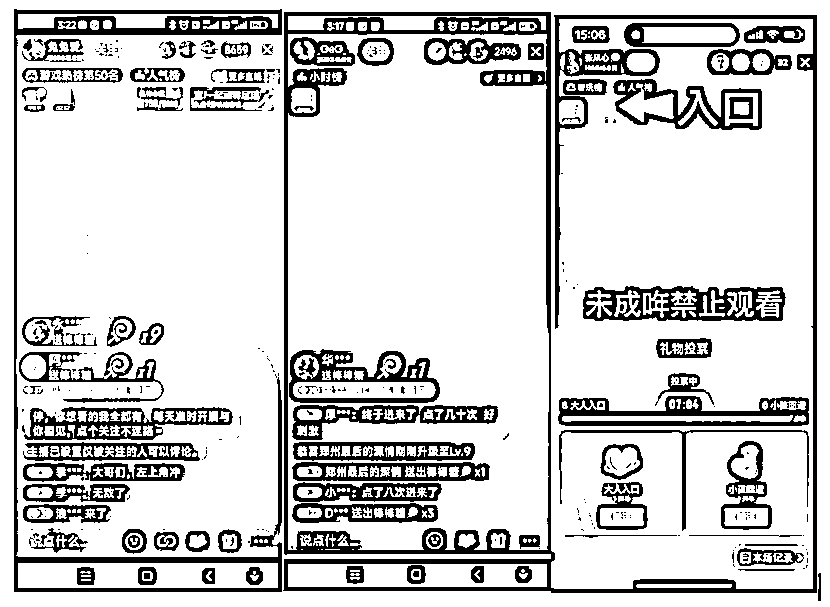  <ne-p id="uced83f40" data-lake-id="uced83f40"><ne-text id="u006d7618">封号原因：色情、利用不正常手段诱导打赏</ne-text></ne-p> <ne-p id="u95b2e5d1" data-lake-id="u95b2e5d1"><ne-text id="u3b3e6805">封号几率：高</ne-text></ne-p> <ne-p id="ua790fc25" data-lake-id="ua790fc25"><ne-text id="u6d8d70d9">违背道德指数：4 颗星</ne-text></ne-p> <ne-p id="uca531b4e" data-lake-id="uca531b4e"><ne-text id="u9b6cb6af" ne-bold="true">3\. 利用贪婪的心态，搞赌博</ne-text></ne-p> <ne-p id="u502cf084" data-lake-id="u502cf084"><ne-text id="uc73ae0d7">最近正在世界杯，全球热度最高，球迷群体避免不了的一个词是：</ne-text><ne-text id="u1299a8b6" ne-bold="true">买球！</ne-text></ne-p> <ne-p id="u54d0f99e" data-lake-id="u54d0f99e"><ne-text id="u23eb7512">比如沙特对阿根廷的比赛，让无数押注了梅西的人走上了天台，怎么利用世界杯的热度来撸音浪呢？</ne-text></ne-p> <ne-p id="ue6321819" data-lake-id="ue6321819"><ne-text id="u0502f0e1">（1）准备要直播的比赛素材（已经比赛过有热度的比赛视频就可以）</ne-text></ne-p> <ne-p id="u9ee50594" data-lake-id="u9ee50594"><ne-text id="u7578c562">（2）开播，随便挂在一个游戏推广的小程序</ne-text></ne-p> <ne-p id="u87aac5a6" data-lake-id="u87aac5a6"><ne-text id="u305775dd">（3）把人气拉到 260</ne-text></ne-p> <ne-p id="uc1c9c538" data-lake-id="uc1c9c538"><ne-text id="uf7f7b0db">（4）开启投票 pk，pk 内容是当前正在或即将比赛的两只队伍的胜负</ne-text></ne-p> <ne-p id="u6c0db91b" data-lake-id="u6c0db91b"><ne-text id="u28d77efc">（5）自己的水军入驻直播间，发布评论，暗示“自己上一场押对了，赚到了多少抖币”</ne-text></ne-p> <ne-p id="u6554963b" data-lake-id="u6554963b"><ne-text id="u1db09145">事实上，抖音直播间的投票机制则根本不像斗鱼虎牙一样支持押注。</ne-text></ne-p> <ne-p id="u6eaf62db" data-lake-id="u6eaf62db"><ne-text id="ud98244b3">这个玩法说到底，就是利用球迷对足球的热爱，又想 du 球的心理，来骗取音浪。</ne-text></ne-p> <ne-p id="u60a3576a" data-lake-id="u60a3576a"><ne-text id="ub4ffcb20">封号原因：赌博、利用不正常手段诱导打赏</ne-text></ne-p> <ne-p id="u7c8f83f7" data-lake-id="u7c8f83f7"><ne-text id="u2669f87c">封号几率：低</ne-text></ne-p> <ne-p id="uebdfbbfd" data-lake-id="uebdfbbfd"><ne-text id="u98f25a17">违背道德指数：2 颗星</ne-text></ne-p> <ne-p id="u340dd2c6" data-lake-id="u340dd2c6"><ne-card data-card-name="image" data-card-type="inline" id="yFAiw" data-event-boundary="card">  <ne-p id="u4b1ed61d" data-lake-id="u4b1ed61d"><ne-text id="ude66d26c" ne-bold="true">4\. 利用对美好愿望的期待，搞祝福类</ne-text></ne-p> <ne-p id="uec6fedfd" data-lake-id="uec6fedfd"><ne-text id="u2a3b33ec">这类的直播间大家都不陌生，算是“定制祝福类”，形式也多种多样，如：非洲小伙送祝福、奥特曼送祝福、财神送祝福、雪地上写字、沙滩上写字、制作表白场景帮表白等。</ne-text></ne-p> <ne-p id="u9488f6ca" data-lake-id="u9488f6ca"><ne-text id="u999aaaa3">这类的直播间，只需要真人语音聊天，照着话术口播就能实现一个直播间的搭建。</ne-text></ne-p> <ne-p id="ud5ce2080" data-lake-id="ud5ce2080"><ne-text id="ud2a54e84">这个类型的直播间的优点是门槛低，容易搭建，缺点是门槛低，入局的人多，太卷了，不好出头。</ne-text></ne-p> <ne-p id="u2f33e0e0" data-lake-id="u2f33e0e0"><ne-text id="u930fb317">而且在直播的时候，需要一直说话，对主播的体力、普通话甚至音色都有要求。</ne-text></ne-p> <ne-p id="u07a235ac" data-lake-id="u07a235ac"><ne-text id="ub38aef01">封号原因：几乎不封</ne-text></ne-p> <ne-p id="u558f7f0a" data-lake-id="u558f7f0a"><ne-text id="u1c5e2f54">封号几率：低</ne-text></ne-p> <ne-p id="uf508886f" data-lake-id="uf508886f"><ne-text id="ud7b4fc60">违背道德指数：无</ne-text></ne-p> <ne-p id="u3d814986" data-lake-id="u3d814986"><ne-card data-card-name="image" data-card-type="inline" id="JZ0ox" data-event-boundary="card">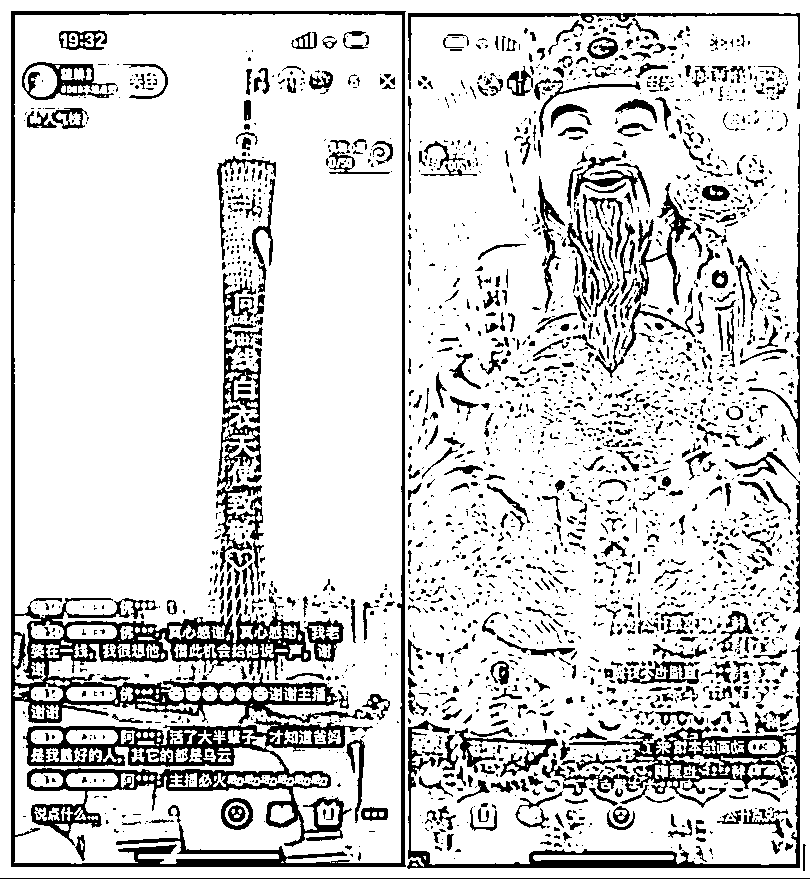  <ne-p id="uec44c4e5" data-lake-id="uec44c4e5"><ne-text id="u5a5b8f95" ne-bold="true">5\. 利用虚荣心，搞互动游戏</ne-text></ne-p> <ne-p id="ua010807d" data-lake-id="ua010807d"><ne-text id="ud62b84bf">撸音浪，是互动游戏的盈利方式，传统的游戏，需要用户进行下载、注册、试玩、观看广告、充值，主播才会有收益，因为这些游戏载体大多数是独立的 app 或小程序，但是互动游戏不同，互动游戏是在直播间里就能完成的游戏，例如我们常见的挤地铁、云蹦迪等。</ne-text></ne-p> <ne-p id="u378895d5" data-lake-id="u378895d5"><ne-text id="ub71d4da1">这种游戏往往分为两大类：红蓝对决、休闲参与。</ne-text></ne-p> <ne-p id="u98f4a02f" data-lake-id="u98f4a02f"><ne-text id="ub149b979">这种游戏是怎么来实现互动呢？</ne-text><ne-text id="ub486d87b" ne-bold="true">----弹幕</ne-text><ne-text id="u551e6aa0">。技术层面的步骤是这样的：</ne-text></ne-p> <ne-p id="u8577b0e6" data-lake-id="u8577b0e6"><ne-text id="u32bdd5ea">（1）安装游戏在电脑上</ne-text></ne-p> <ne-p id="u92f6d538" data-lake-id="u92f6d538"><ne-text id="u05238bc0">（2）开播</ne-text></ne-p> <ne-p id="ub2497009" data-lake-id="ub2497009"><ne-text id="u675fa465">（3）通过借口，获取直播间弹幕、id、头像</ne-text></ne-p> <ne-p id="u8ab054e2" data-lake-id="u8ab054e2"><ne-text id="u4066850d">（4）把获取到的信息、指令，自动填入游戏</ne-text></ne-p> <ne-p id="ufd5a2f1f" data-lake-id="ufd5a2f1f"><ne-text id="u894511cf">（5）实现弹幕操控游戏</ne-text></ne-p> <ne-p id="udb55100a" data-lake-id="udb55100a"><ne-text id="u178c1082">（6）游戏投屏到直播间</ne-text></ne-p> <ne-p id="ue5af4c10" data-lake-id="ue5af4c10"><ne-text id="u8b6331ec">红蓝对决：场景各有不同，本质上都是让用户加入双方阵营，通过弹幕进行互动，利用诱导打赏来获取收益。用户为了满足自己的胜负欲，争相打赏。</ne-text></ne-p> <ne-p id="u49f03120" data-lake-id="u49f03120"><ne-text id="u79b18e7d">这个场景的营利性在新鲜感过去后，已经开始下滑，所以开发者不得不制作更多的场景来“换皮”，比如红蓝对决改成三国对战，四国风云、修仙升仙、上古战场、红色警戒、武林争霸等。</ne-text></ne-p> <ne-p id="u74adcc6b" data-lake-id="u74adcc6b"><ne-card data-card-name="image" data-card-type="inline" id="iJ8XU" data-event-boundary="card">  <ne-p id="ucb3a9141" data-lake-id="ucb3a9141"><ne-text id="u82e10895">休闲参与：场景也多种多样，比如一起上自习室、一起做体操、一起逛街、一起泡脚等。利用新鲜感诱惑用户参与其中，打赏来获得 c 位。</ne-text></ne-p> <ne-p id="u7d3fb924" data-lake-id="u7d3fb924"><ne-text id="u874b50e0">这种类型的优点就在于可以实现全无人，封号率也极低，反正是挂机纯赚，就看赚多赚少的区别了。</ne-text></ne-p> <ne-p id="u66a710f9" data-lake-id="u66a710f9"><ne-card data-card-name="image" data-card-type="inline" id="sDkub" data-event-boundary="card">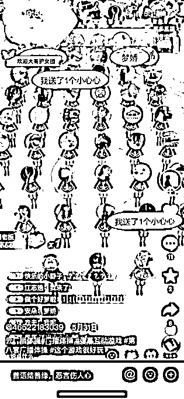  <ne-p id="u91d0f0ac" data-lake-id="u91d0f0ac"><ne-text id="u8c058941">下面说说我对互动游戏直播的预测：</ne-text></ne-p> <ne-p id="uadd73784" data-lake-id="uadd73784"><ne-text id="u76925c5b">（1）开播门槛低，会有更多人入局；</ne-text></ne-p> <ne-p id="u630b0dc2" data-lake-id="u630b0dc2"><ne-text id="u4fc3587b">（2）达人们 28 定律，只有 2 成是有流量能赚到钱的；</ne-text></ne-p> <ne-p id="uee473c4a" data-lake-id="uee473c4a"><ne-text id="ufaa32f97">（3）互动游戏工作室会赚钱。</ne-text></ne-p> <ne-p id="u41e694a2" data-lake-id="u41e694a2"><ne-text id="u0c82a9ba">以我现在的游戏小组为例：</ne-text></ne-p> <ne-p id="u16ce357d" data-lake-id="u16ce357d"><ne-text id="ue52caf69" ne-bold="true">人员配置：</ne-text><ne-text id="u639353e7">4 人（2 个产品、1 个技术、1 个玩法打板）</ne-text></ne-p> <ne-p id="ufd89f881" data-lake-id="ufd89f881"><ne-text id="ub5eefbca" ne-bold="true">实际产出</ne-text><ne-text id="u51846cc0">：每周出一款新互动游戏（大多数是换皮）</ne-text></ne-p> <ne-p id="uc682acb3" data-lake-id="uc682acb3"><ne-text id="u1bff860e" ne-bold="true">收益构成：</ne-text></ne-p> <ne-p id="ub51f3d6d" data-lake-id="ub51f3d6d"><ne-text id="u8171c110">（1）自有账号批量直播，获取打赏收益；</ne-text></ne-p> <ne-p id="u4963809e" data-lake-id="u4963809e"><ne-text id="ud1c78f45">（2）游戏接口卖给要开播的达人，一个游戏的月费基本在 399-599 不等；</ne-text></ne-p> <ne-p id="ue5505b86" data-lake-id="ue5505b86"><ne-text id="u4a5ac54a">（3）与渠道方合作（如网吧、多电脑闲置的公司），把账号挂在工会内，矩阵开播获取收益。</ne-text></ne-p> <ne-p id="uefe102bc" data-lake-id="uefe102bc"><ne-text id="u659f5806" ne-bold="true">适合入局的人：</ne-text></ne-p> <ne-p id="u37cf5d96" data-lake-id="u37cf5d96"><ne-text id="u8f76c064">（1）居家隔离有电脑的</ne-text></ne-p> <ne-p id="ueceff4a9" data-lake-id="ueceff4a9"><ne-text id="u1fa074b4">（2）已经和生活妥协开始摆烂的</ne-text></ne-p> <ne-h2 id="a5dcfeca" data-lake-id="a5dcfeca"><ne-heading-ext><ne-heading-anchor></ne-heading-anchor><ne-heading-fold></ne-heading-fold></ne-heading-ext><ne-heading-content><ne-text id="u22bb9bd4" ne-bold="true">4.无人直播前景怎么样？</ne-text></ne-heading-content></ne-h2> <ne-p id="u7a715d45" data-lake-id="u7a715d45"><ne-text id="u4cf2a4ab">无人直播最终还是要走回正道。这种形式说白了就是在与平台规则抗衡，非是正道。</ne-text></ne-p> <ne-p id="u7fae75f4" data-lake-id="u7fae75f4"><ne-text id="u8f067c6d">但是在当下这样的情境下，那种时间久、成本重的项目，并不适合咱们老百姓。</ne-text></ne-p> <ne-p id="u1e4e63b5" data-lake-id="u1e4e63b5"><ne-text id="uf28a0a00">先做点投机取巧的，比如无人直播、比如在线课程、虚拟游戏等来赚钱，等经济和形式都平稳了，可以拿着积累的钱，去正经的做真人直播、去做品牌 、做 IP、做整长久且有生命力的事。</ne-text></ne-p> <ne-p id="u7c6a8ed4" data-lake-id="u7c6a8ed4"><ne-text id="ucee67dc9">那个时候，我们也将有更强的抗风险能力。</ne-text></ne-p> <ne-h1 id="f1ca1062" data-lake-id="f1ca1062"><ne-heading-ext><ne-heading-anchor></ne-heading-anchor><ne-heading-fold></ne-heading-fold></ne-heading-ext><ne-heading-content><ne-text id="u1cc550a0">二、无人直播的操作方法</ne-text></ne-heading-content></ne-h1> <ne-h2 id="55de78c3" data-lake-id="55de78c3"><ne-heading-ext><ne-heading-anchor></ne-heading-anchor><ne-heading-fold></ne-heading-fold></ne-heading-ext><ne-heading-content><ne-text id="u88ee5d7f">1.准备工具</ne-text></ne-heading-content></ne-h2> <ne-p id="u9581cb28" data-lake-id="u9581cb28"><ne-text id="ub9e41e0b">为了更轻松地实现“无人”，我们小团队自己研发了一个硬件，是个黑色的盒子（如图），这个盒子插在电脑上，就会被电脑识别为“摄像头”（欺骗的是电脑），算是个货真价实的硬件，在直播伴侣里显示的也是摄像头硬件。</ne-text></ne-p> <ne-p id="u4c40d89c" data-lake-id="u4c40d89c"><ne-card data-card-name="image" data-card-type="inline" id="XOpKR" data-event-boundary="card">  <ne-p id="u703d08db" data-lake-id="u703d08db"><ne-card data-card-name="image" data-card-type="inline" id="EiiL6" data-event-boundary="card">  <ne-p id="uc3ae0b12" data-lake-id="uc3ae0b12"><ne-text id="u9db27895">直播伴侣是完全干净的，不会被系统检测到。</ne-text></ne-p> <ne-p id="ua53a18b1" data-lake-id="ua53a18b1"><ne-text id="ub1f3aec6">【由于替换的是摄像头，原则上只要支持电脑开播的平台都能使用这个办法，我自己目前在播的是抖音快手】</ne-text></ne-p> <ne-p id="ubd669af0" data-lake-id="ubd669af0"><ne-text id="u5d4ba8b9">这个硬件的直播实现路径是：打开直播伴侣--添加摄像头--选中盒子--开播。开播内容就是你拷贝在盒子上的内容。</ne-text></ne-p> <ne-p id="u7ecf068c" data-lake-id="u7ecf068c"><ne-text id="u06dd2729">盒子技术原理是：</ne-text></ne-p> <ne-p id="ub8862694" data-lake-id="ub8862694"><ne-text id="u2cb3fd03">摄像头的成像原理是光信号转为电信号，传输给电脑。而盒子是把光信号给拦截掉，把视频伪装成光信号，传输给电脑。就实现了盒子替换摄像头。</ne-text></ne-p> <ne-p id="ue60657f3" data-lake-id="ue60657f3"><ne-text id="u54d1f1cd">这个方法没有多技术壁垒，也不太难实现。但是这种方法仅仅是能防止系统检测，没办法杜绝人工举报。</ne-text></ne-p> <ne-h2 id="433db252" data-lake-id="433db252"><ne-heading-ext><ne-heading-anchor></ne-heading-anchor><ne-heading-fold></ne-heading-fold></ne-heading-ext><ne-heading-content><ne-text id="uf8e5a550">2.准备直播素材</ne-text></ne-heading-content></ne-h2> <ne-p id="u79e23539" data-lake-id="u79e23539"><ne-text id="ub2383e5c">准备直播素材就是准备你直播时需要循环的视频，这包括视频和音频。一场直播的成功与否，素材的优劣就占了半壁江山。</ne-text></ne-p> <ne-p id="u1ee10a60" data-lake-id="u1ee10a60"><ne-text id="u356e2fe2" ne-bold="true">（1）录播别人的内容</ne-text></ne-p> <ne-p id="ua572f19d" data-lake-id="ua572f19d"><ne-text id="u66b96038" ne-bold="true">优点</ne-text><ne-text id="u1735e883">：最简单。</ne-text></ne-p> <ne-p id="u3d07ab65" data-lake-id="u3d07ab65"><ne-text id="u73aff282" ne-bold="true">缺点</ne-text><ne-text id="u1a368d0f">：你录的时候别人可能也在录，你用的时候别人也在用。就会被平台检测“多人直播”，从而限制直播间。</ne-text></ne-p> <ne-p id="uac74c8ad" data-lake-id="uac74c8ad"><ne-text id="u8032449e">使用直播间录制软件，输入对方主页地址后即可自动完成录播。可以监测对方直播间，只要开播了就自动录制。</ne-text></ne-p> <ne-p id="u3ff0e2da" data-lake-id="u3ff0e2da"><ne-text id="u9be18728">录制好的素材，经过人工审核（主要是再过一遍是否出现违禁词、平台名、直播名、提到时间等），再使用去重方法输出为 mp4 文件即可。</ne-text></ne-p> <ne-p id="uc7912cf2" data-lake-id="uc7912cf2"><ne-text id="u60c89aa1" ne-bold="true">这里要注意：</ne-text><ne-text id="u211eff5c">绝对不能录制带有明显品牌标识的素材，如带有 Adidas，就会造成品牌侵权，直接被封禁账号，你看到类似的账号可以直接举报侵权，不出一天就会封号。</ne-text></ne-p> <ne-p id="u6d787a5b" data-lake-id="u6d787a5b"><ne-card data-card-name="image" data-card-type="inline" id="XHqWI" data-event-boundary="card">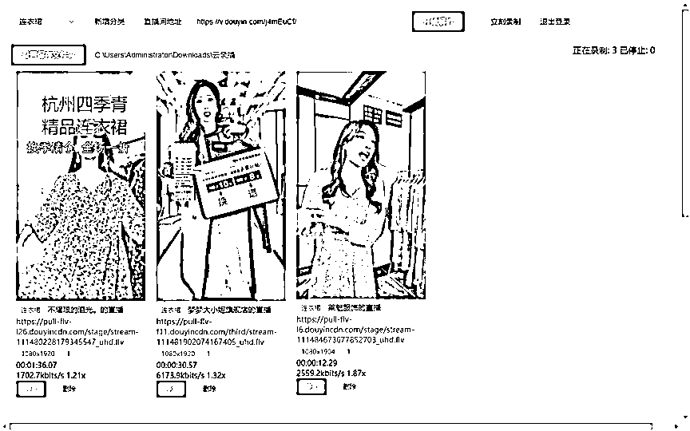  <ne-p id="u8696aaae" data-lake-id="u8696aaae"><ne-text id="ubb8b02e1">最开始的时候，我们都是根据标准（有一套自己的直播间录制要求）去筛选直播间，偷偷录下来自己就去用。</ne-text></ne-p> <ne-p id="u7b887755" data-lake-id="u7b887755"><ne-text id="u3495d1e4">后来逐渐出现一个问题：70%的我们看上的直播间，都是蓝 V，售卖的也是本店的自有商品。</ne-text></ne-p> <ne-p id="ue1d93b94" data-lake-id="ue1d93b94"><ne-text id="u8734789b">这就很惆怅，要么他在精选联盟压根不上架，要么上架了佣金是 1%。这么好的一颗白菜我没办法卖、没办法拱，这多难受。</ne-text></ne-p> <ne-p id="u1236365e" data-lake-id="u1236365e"><ne-text id="u6b5cb408">我们怎么解决的呢？直接去这个品的小店，私聊客服。</ne-text></ne-p> <ne-p id="uece45cfa" data-lake-id="uece45cfa"><ne-text id="u0c5de5fc">问：店主你好，我是一名主播，很喜欢你的这款商品，可以去 KS 带你的货么？</ne-text></ne-p> <ne-p id="ub7cd3b70" data-lake-id="ub7cd3b70"><ne-text id="ufa0549f1">这个时候店主一般会有 3 种回答：</ne-text></ne-p> <ne-p id="uecd6f644" data-lake-id="uecd6f644"><ne-text id="u300ba9b2">A.不可以/不回复。</ne-text></ne-p> <ne-p id="udfcf6781" data-lake-id="udfcf6781"><ne-text id="u2515749f">B.可以，我在 KS 开个小店，你直接带我小店的同款就行。</ne-text></ne-p> <ne-p id="u226afc9b" data-lake-id="u226afc9b"><ne-text id="ua5a89727">C.可以，我不但在快手给你开个小店，还会每天告知你我们主播几点播、哪个品卖的好，你什么时候录制合适，还有其他我们主播的素材一并给你。</ne-text></ne-p> <ne-p id="u467d9081" data-lake-id="u467d9081"><ne-text id="ubf798178">在实际的沟通中，大多数都是 B 回答。这些店主因为精力有限、主播人力有限，无暇分身去运营其他平台。但是顺手给你开个店，让你去推广都乐意之至。</ne-text></ne-p> <ne-p id="u4b3569d4" data-lake-id="u4b3569d4"><ne-text id="u4d6c0c5c">甚至有一些本身就是在做大供应链做货盘的，还会给你提供大量的精美的原创的视频素材，供你在无人直播间使用。对于这类商家而言，谁卖、用什么方式卖，都无所谓，只要你能卖出去，就是我的好伙伴。</ne-text></ne-p> <ne-p id="u387ee443" data-lake-id="u387ee443"><ne-text id="ue61c8c4c">这个方法是我用的最多的方法，我一般会录制真实直播间（有真实的场景、有真人且激情的主播），这样在我开播的时候，是无法从肉眼上来判断我在无人直播，直播间非常“拟真”。</ne-text></ne-p> <ne-p id="u74194d88" data-lake-id="u74194d88"><ne-text id="u28f684db">这个方法录制的素材，需要几天就更换，不能长时间重复使用。尤其是在直播间当天卖爆以后（卖爆的标准，gmv 大于 10 万），需要立刻调整素材。也可以蹲守这个主播，录制他的其他场次来进行更换。</ne-text></ne-p> <ne-p id="u972b839b" data-lake-id="u972b839b"><ne-text id="uac4ba184" ne-bold="true">（2）自制内容</ne-text></ne-p> <ne-p id="u192fee99" data-lake-id="u192fee99"><ne-text id="u44ff6327">适合：自己有产品、有店铺的人。</ne-text></ne-p> <ne-p id="uc549f633" data-lake-id="uc549f633"><ne-text id="uceb64072">优点：制作的素材更贴合产品，原创性高。</ne-text></ne-p> <ne-p id="u9fdb0685" data-lake-id="u9fdb0685"><ne-text id="ucc6eb22f">缺点：制作麻烦，对场景/话术要求高。</ne-text></ne-p> <ne-p id="u837d1679" data-lake-id="u837d1679"><ne-text id="uf3163802">这里的素材制作要根据自己的产品定位来区分，看自己是单品直播间，还是多品直播间。</ne-text></ne-p> <ne-p id="u22c4267b" data-lake-id="u22c4267b"><ne-text id="u7a7a5ee4">操作方式如下：</ne-text></ne-p> <ne-p id="u92068e05" data-lake-id="u92068e05"><ne-text id="ua2ca982a">【单品】对着单品拍摄、加拍细节，音频话术对单品进行叙述。</ne-text></ne-p> <ne-p id="u1d48b52c" data-lake-id="u1d48b52c"><ne-text id="ub3886a6e">【多品】镜头拉到全场，展示商品多且全，不对单品细节做展示，音频上重点击诱导商品曝光、诱导点关注送灯牌、重促销活动，对产品讲解要轻。</ne-text></ne-p> <ne-p id="u02bd14ba" data-lake-id="u02bd14ba"><ne-text id="u31c18b83">为什么要这样设置？因为你多品又讲产品的话，5 分钟过一个品，你弹窗讲解就要跟着调整，软件自动化无法实现，人盯着又耗费比较高，就违背无人直播“轻”的初衷了。</ne-text></ne-p> <ne-p id="u12ba3f0d" data-lake-id="u12ba3f0d"><ne-text id="uc21c6fcb" ne-bold="true">搞定素材，去精选联盟找到相应的商品，直接上架到自己橱窗即可。</ne-text></ne-p> <ne-p id="u2801f818" data-lake-id="u2801f818"><ne-text id="u9b93c5b6" ne-bold="true">当然有时候也会使用相反的路径，先看中一个正在上升的品类，根据品类去找素材、制作素材，再开播。</ne-text></ne-p> <ne-p id="u956cf5b1" data-lake-id="u956cf5b1"><ne-text id="u22233327" ne-bold="true">我们很多卖的很好的账号就是因为发现了小蓝海，立刻复制了多个直播间去操作。自己抄自己的爆品，是最快速实现利益倍增的方法。</ne-text></ne-p> <ne-p id="ub848ffee" data-lake-id="ub848ffee"><ne-text id="u445695b0" ne-bold="true">你自己不复制，也会有别人来偷你的内容去复制。</ne-text></ne-p> <ne-h2 id="dbd5fadb" data-lake-id="dbd5fadb"><ne-heading-ext><ne-heading-anchor></ne-heading-anchor><ne-heading-fold></ne-heading-fold></ne-heading-ext><ne-heading-content><ne-text id="u6c985445">3.选品</ne-text></ne-heading-content></ne-h2> <ne-p id="u149f9124" data-lake-id="u149f9124"><ne-text id="u3aec0713">选品就是选择你直播间带货销售的商品。</ne-text></ne-p> <ne-p id="u2e3c7d70" data-lake-id="u2e3c7d70"><ne-text id="udd9aa51a">选品是一场直播中，非常重要的环节。比如你有流量卖不动，就是品选择的有问题。很多时候你凑巧选到了一款爆品，你随便播播就能卖爆，就好像前阵子谁在直播间播羊了个羊都会有流量。</ne-text></ne-p> <ne-p id="u30a7f455" data-lake-id="u30a7f455"><ne-text id="u1e6e7954" ne-bold="true">选品首先</ne-text><ne-text id="u3f840068">要谈谈选品的定位。</ne-text></ne-p> <ne-p id="u99b1cad0" data-lake-id="u99b1cad0"><ne-text id="u9a3fd376">互联网、广告从业者应该都看过特劳特的《定位》这本书，我觉得这本书的运用十分之广泛，从行业、产业、公司、品牌，到现在一个小小的直播间，都需要“定位”。</ne-text></ne-p> <ne-p id="u5a59aad7" data-lake-id="u5a59aad7"><ne-text id="u3ae151ff">定位定的是什么？定的是你的出境主播是什么样的人，你的售卖商品或方向是什么，你的购买用户画像是什么。这三定一致，才是一个好的直播间定位。</ne-text></ne-p> <ne-p id="u9ad1753a" data-lake-id="u9ad1753a"><ne-text id="uee750a9a">比如我要做大码女装，从人、货、场上我的定位方式是：</ne-text></ne-p> <ne-p id="u0ef645fe" data-lake-id="u0ef645fe"><ne-text id="u33f9ffb2" ne-bold="true">我要的流量：</ne-text><ne-text id="u1d4ab91f">20-35 岁女性，120-180 斤，消费客单价 50-190 元</ne-text></ne-p> <ne-p id="uc1209788" data-lake-id="uc1209788"><ne-text id="ub5d20f5d" ne-bold="true">我的直播间画面：</ne-text><ne-text id="u07f258c1">胖胖的女孩，穿大码女装，穿上明显显瘦。所有大码 mm 的诉求只有一个：显瘦。其次才是“很潮”“穿着舒适”等标签。</ne-text></ne-p> <ne-p id="u6255937d" data-lake-id="u6255937d"><ne-text id="u922d05c6" ne-bold="true">我的选品：全部是大码女装。</ne-text></ne-p> <ne-p id="u2186ddcb" data-lake-id="u2186ddcb"><ne-text id="u064a9ecb" ne-bold="true">我的原则是：</ne-text><ne-text id="ua4405889">不要泛流量，只要垂直流量。你给我 1000 个泛的，不如给我 10 个垂直的。这个垂直流量，就是定位。</ne-text></ne-p> <ne-p id="u379534ba" data-lake-id="u379534ba"><ne-text id="u462a6559">有人说直播间排品需要用到钩子品、福利品呀，那我放个 9 块 9 包邮 3 双的袜子行不行？答案是不行。</ne-text></ne-p> <ne-p id="u6c6b3eb8" data-lake-id="u6c6b3eb8"><ne-text id="uc38664a7">有人来到我直播间，看到了袜子觉得实惠，买了。</ne-text></ne-p> <ne-p id="uffadf5ac" data-lake-id="uffadf5ac"><ne-text id="u9daf7252">这笔成交对直播间流量是有好处还是坏处？</ne-text></ne-p> <ne-p id="u6bbcb38d" data-lake-id="u6bbcb38d"><ne-text id="u7830a224">肯定是坏处，因为我无法判断穿这双袜子的用户，到底是不是个胖子。</ne-text></ne-p> <ne-p id="ude9c5bb0" data-lake-id="ude9c5bb0"><ne-text id="u1f36721b">如果不是，那这次的小成交会给我带来更多这样不是我目标用户的人，我只卖袜子算了！</ne-text></ne-p> <ne-p id="u36e62b9f" data-lake-id="u36e62b9f"><ne-text id="u32f8ef27">那我用什么作为钩子或福利？</ne-text></ne-p> <ne-p id="ue131e15f" data-lake-id="ue131e15f"><ne-text id="u677782ce">可以使用大码内裤。胖 mm 对大码内裤的需求是“好看舒适合身”，只要满足这些转化就会好。</ne-text></ne-p> <ne-p id="ud5216ef6" data-lake-id="ud5216ef6"><ne-text id="u9ca06ef5">内裤是不是大码小姐姐的刚需？是！</ne-text></ne-p> <ne-p id="ub1029b2b" data-lake-id="ub1029b2b"><ne-text id="u38f3b390">买大码内裤的人是不是我要的流量？是！</ne-text></ne-p> <ne-p id="ud12e4c00" data-lake-id="ud12e4c00"><ne-text id="u1869bf49">所以，我认为当你在开通一个直播间的时候，第一个问题就是搞清楚你的定位，上来先问 3 个问题：</ne-text></ne-p> <ne-p id="u4c58c9bb" data-lake-id="u4c58c9bb"><ne-text id="u7e6a4148">我要卖什么产品？它有什么属性？</ne-text></ne-p> <ne-p id="ub1b5c849" data-lake-id="ub1b5c849"><ne-text id="u699af586">它的用户是什么样的人？</ne-text></ne-p> <ne-p id="ua2f5ae76" data-lake-id="ua2f5ae76"><ne-text id="uea1bc339">什么样的宣传可以吸引来这样的用户？</ne-text></ne-p> <ne-p id="ua4727639" data-lake-id="ua4727639"><ne-text id="uc042b6e0">这三个问题回答好了，流量和成交就来了。</ne-text></ne-p> <ne-p id="uaef5e0a5" data-lake-id="uaef5e0a5"><ne-text id="uae60afb9">例如我们最近卖的不错的直播间，定位是：灰指甲涂了药水变成健康的指甲（视频素材）、灰指甲药水（商品）、有灰指甲的人（用户）。加上隐晦的疗效话术，转化很不错。</ne-text></ne-p> <ne-p id="u1fb18b61" data-lake-id="u1fb18b61"><ne-text id="ua137dea1">除了定位上的选品，对人的选品能力要求也是比较高的。</ne-text></ne-p> <ne-p id="u5b202671" data-lake-id="u5b202671"><ne-text id="u9d87e8a9">比如我同事，开始负责中老年女装这个赛道后，狂看了一周才勉强分清楚到底哪些是“中老年穿的”。</ne-text></ne-p> <ne-p id="u1ccc7279" data-lake-id="u1ccc7279"><ne-text id="ua11cc7d9">才明白“小香风外套”原来是个垂直标签。更别要求上来就能选到一个爆品，这是需要行业积累和时间的。</ne-text></ne-p> <ne-h2 id="e85d96f9" data-lake-id="e85d96f9"><ne-heading-ext><ne-heading-anchor></ne-heading-anchor><ne-heading-fold></ne-heading-fold></ne-heading-ext><ne-heading-content><ne-text id="u5d61de10">4.做流量</ne-text></ne-heading-content></ne-h2> <ne-p id="u1eb7125e" data-lake-id="u1eb7125e"><ne-text id="u6c1c0bbb">这个模块我经常被问到的相关的问题，我回复一波：</ne-text></ne-p> <ne-p id="u02073fd1" data-lake-id="u02073fd1"><ne-text id="u707ee0fd" ne-bold="true">（1）做不做付费？</ne-text></ne-p> <ne-p id="u61cb7c19" data-lake-id="u61cb7c19"><ne-text id="uff36be96">你问我为什么不做付费流，因为付费的时候要经历一次广告审核，我本身就是录播内容，审核的时候要多加一次审核可能会翻车。无疑是自己跑到对面水晶送人头的行为。</ne-text></ne-p> <ne-p id="ud66d6b60" data-lake-id="ud66d6b60"><ne-text id="ue917acdb">而且，经过多账号的付费测试，如果你使用了付费行为并且有成交，系统会认为你是一个付费达人，以后给你推荐的自然流越来越少，让你依赖上付费流的成交。</ne-text></ne-p> <ne-p id="u2228a7c6" data-lake-id="u2228a7c6"><ne-text id="u366e7d77" ne-bold="true">【如果是稳定真人直播间，ROI 是正向的，就完全可以一直赚一直投。】</ne-text></ne-p> <ne-p id="u894a314e" data-lake-id="u894a314e"><ne-text id="ucf7c8f62" ne-bold="true">（2）做不做短视频引流</ne-text></ne-p> <ne-p id="ua0ff29a6" data-lake-id="ua0ff29a6"><ne-text id="uff0a4971">短视频和直播的关系是互相哺育的，你短视频有流量，别人可以通过呼吸灯进直播间。你直播间有流量，又能反哺短视频的播放量。</ne-text></ne-p> <ne-p id="uccb8e077" data-lake-id="uccb8e077"><ne-text id="ue57e9c95">那我为什么不做短视频？那太麻烦了，性价比不高。</ne-text></ne-p> <ne-p id="uefde0173" data-lake-id="uefde0173"><ne-text id="u355274de" ne-bold="true">（3）养不养鱼</ne-text></ne-p> <ne-p id="u0174416f" data-lake-id="u0174416f"><ne-text id="ue0a68e79">首先，鱼对直播间的流量提升是绝对有帮助的。如果你自己不养鱼而去买鱼的话，一般分为 3 种鱼：</ne-text></ne-p> <ne-p id="u9ee91341" data-lake-id="u9ee91341"><ne-text id="u3fda862f">A.广场鱼</ne-text></ne-p> <ne-p id="ubdef1241" data-lake-id="ubdef1241"><ne-text id="uf737c066">鱼从广场刷，直到刷到你直播间，进去活跃，呆一个小时。</ne-text></ne-p> <ne-p id="u821a72df" data-lake-id="u821a72df"><ne-text id="u0ff5b977">收费：6 块/人/小时</ne-text></ne-p> <ne-p id="u99abe2a4" data-lake-id="u99abe2a4"><ne-text id="u853bc3b7">B.鱼塘鱼</ne-text></ne-p> <ne-p id="u81e7df01" data-lake-id="u81e7df01"><ne-text id="ud1918e0c">和你直播间标签属性一致的账号。20 块一条鱼，一次性最低买 210 条，这 210 条会根据你的类目分开在 7 天内，完成活跃。也就是一次性 4200。</ne-text></ne-p> <ne-p id="ufe83c749" data-lake-id="ufe83c749"><ne-text id="u6fbf7e9e">C.补单鱼</ne-text></ne-p> <ne-p id="u55c68b7b" data-lake-id="u55c68b7b"><ne-text id="u3d3505e3">鱼在你指定的位置下单（如直播间 35 号链接），帮你完成直播的螺旋和成交用户画像，一单费用根据单价 7-15 元不等。</ne-text></ne-p> <ne-p id="u4be91673" data-lake-id="u4be91673"><ne-text id="u6ca17ad7">我自己没养鱼，偶尔会采购一点鱼，自己养太累了。</ne-text></ne-p> <ne-p id="uef60a4cf" data-lake-id="uef60a4cf"><ne-text id="ueffcba64">Tips（我自用的实用小技巧）:</ne-text></ne-p> <ne-p id="u6bf5df10" data-lake-id="u6bf5df10"><ne-text id="uf7446b43">我有成熟的 a 直播间，就会倒流给新号 b 直播间，就好像驱赶 a 的鱼群游到 b，完成 b 直播间的冷启动和快速打标签。</ne-text></ne-p> <ne-p id="u77b0fcd0" data-lake-id="u77b0fcd0"><ne-text id="uc8237f6e">这里要求 a 和 b 的用户画像需求是完全一致的，爱喝酱香酒的，无论在哪里买，总会买的。</ne-text></ne-p> <ne-p id="uc38326c8" data-lake-id="uc38326c8"><ne-text id="u849d6371">我要做的就是多开几家酱香酒的店，让</ne-text><ne-text id="u86f7331e" ne-bold="true">他们怎么消费都是在我家。</ne-text></ne-p> <ne-p id="u0b62504b" data-lake-id="u0b62504b"><ne-text id="u6fd5f136" ne-bold="true">驱赶鱼的方式也有很多。</ne-text></ne-p> <ne-p id="u630555af" data-lake-id="u630555af"><ne-text id="uabf9bcdc" ne-bold="true">（4）憋单么？</ne-text></ne-p> <ne-p id="u3cdac9bb" data-lake-id="u3cdac9bb"><ne-text id="u7f93841b">不憋，直接准备好小黄车开播！</ne-text></ne-p> <ne-p id="uc6757930" data-lake-id="uc6757930"><ne-text id="uc0ac4f32">现在的憋单非常容易触碰到内容违规（如诱导、不上架小黄车等），你流量还没憋起来，你直播间已经违规降权了，人死了，钱没花了。</ne-text></ne-p> <ne-p id="u8c782dc5" data-lake-id="u8c782dc5"><ne-text id="u0be31608">使用这个方式的一定要检查好自己的话术。</ne-text></ne-p> <ne-p id="u0ca016dc" data-lake-id="u0ca016dc"><ne-text id="ud15c2f06" ne-bold="true">（5）卡广场么？</ne-text></ne-p> <ne-p id="ua07d1679" data-lake-id="ua07d1679"><ne-text id="ue7b2f625">通常的卡广场，会使用较为吸引人的画面来作为直播拉人气的素材。这个方法我现在已经不再用，这种泛流量不好转化，也不好洗标签。</ne-text></ne-p> <ne-p id="u8604838f" data-lake-id="u8604838f"><ne-text id="ud33e4ff3" ne-bold="true">你这也不弄那也不弄，那你的流量从哪儿来？</ne-text></ne-p> <ne-p id="uc441edbe" data-lake-id="uc441edbe"><ne-text id="u310a32c3" ne-bold="true">我先说以下我的个人观点，我认为，流量差只有 3 个原因：账号权重低、直播内容差、直播转化差。</ne-text></ne-p> <ne-p id="u9eee0e64" data-lake-id="u9eee0e64"><ne-text id="u30418ceb">A.账号本身权重</ne-text></ne-p> <ne-p id="ue9eb39b3" data-lake-id="ue9eb39b3"><ne-text id="uc6a6d4de">比如你的账号是全新的账号，你的账号活跃度低，你的账号幸运值低，这些都影响着账号本身的权重。为了使我们拥有一个健康的账号，前期我们需要根据类目来进行养号。养一周后再进行开播。</ne-text></ne-p> <ne-p id="u8fa12da8" data-lake-id="u8fa12da8"><ne-text id="u0680fe97">B.直播内容</ne-text></ne-p> <ne-p id="uaa3f2dd3" data-lake-id="uaa3f2dd3"><ne-text id="u53411b63">如果你的素材吸引人，直播间互动指数高，系统自然会给你更多的流量。</ne-text></ne-p> <ne-p id="ueb0a647d" data-lake-id="ueb0a647d"><ne-text id="uf21f72f9">别人在广场看到封面但是不进来、别人进来了直接走，也就是直播间曝光进入率低、进入停留时间短的话，在互动层流量就会差。</ne-text></ne-p> <ne-p id="u4181a4f2" data-lake-id="u4181a4f2"><ne-text id="u6787d876">在这个时候，我们一般需要优化直播封面、改善内容素材。</ne-text></ne-p> <ne-p id="u020f3bda" data-lake-id="u020f3bda"><ne-text id="u7cb21fa0">C.UV 值较低</ne-text></ne-p> <ne-p id="u1d8f2670" data-lake-id="u1d8f2670"><ne-text id="ua8aca48b">你的直播间进 1000 个人，但是 1000 个都不成交，那用户的 UV 价值就会低，UV 价值=销售金额/场观人数。</ne-text></ne-p> <ne-p id="u927daffc" data-lake-id="u927daffc"><ne-text id="u452cb9a5">要是你是抖音，肯定谁给你赚钱你推谁。</ne-text></ne-p> <ne-p id="uebef9ea6" data-lake-id="uebef9ea6"><ne-text id="u1e94b19e" ne-bold="true">直播间的流量漏斗</ne-text></ne-p> <ne-p id="ua25b0b24" data-lake-id="ua25b0b24"><ne-text id="uaf1576d9">初级：直播间互动（点赞、评论、关注等）（泛流量）</ne-text></ne-p> <ne-p id="ub9ddf675" data-lake-id="ub9ddf675"><ne-text id="u9f5ec8fb">中级：商品曝光、商品点击（交易标签的流量）</ne-text></ne-p> <ne-p id="ud7db6db8" data-lake-id="ud7db6db8"><ne-text id="u91acb362">高级：商品成交（精准标签流量）</ne-text></ne-p> <ne-p id="uefeda7dc" data-lake-id="uefeda7dc"><ne-text id="uba04a123">这三个流量漏斗，我觉得也可以叫：</ne-text></ne-p> <ne-p id="u0f425e1f" data-lake-id="u0f425e1f"><ne-text id="ud24e9a60" ne-bold="true">互动层</ne-text><ne-text id="u15515950">（广场曝光进入率）；</ne-text></ne-p> <ne-p id="uc4332484" data-lake-id="uc4332484"><ne-text id="ud4909a09" ne-bold="true">曝光层（</ne-text><ne-text id="u8b3b0dd2">小黄车的点击次数、商品曝光次数、商品点击次数）；</ne-text></ne-p> <ne-p id="ucffdde82" data-lake-id="ucffdde82"><ne-text id="u78f554b6" ne-bold="true">成交层</ne-text><ne-text id="u00c8134c">（成交数量、成交金额、场观人均价值）。</ne-text></ne-p> <ne-p id="u6953e285" data-lake-id="u6953e285"><ne-text id="ufb52bf03">当你挂上小黄车，你就进入了后两个赛道，你的直播间是否推人、持续推人、是否精准，都取决于上面那些数据。</ne-text></ne-p> <ne-h1 id="db71e384" data-lake-id="db71e384"><ne-heading-ext><ne-heading-anchor></ne-heading-anchor><ne-heading-fold></ne-heading-fold></ne-heading-ext><ne-heading-content><ne-text id="u6f4ba7bd">三、无人直播的问题和风险</ne-text></ne-heading-content></ne-h1> <ne-h2 id="7832bd7f" data-lake-id="7832bd7f"><ne-heading-ext><ne-heading-anchor></ne-heading-anchor><ne-heading-fold></ne-heading-fold></ne-heading-ext><ne-heading-content><ne-text id="u66a2e107" ne-bold="true">1.最常见的问题：流量差</ne-text></ne-heading-content></ne-h2> <ne-p id="ue1612ac8" data-lake-id="ue1612ac8"><ne-text id="ude3b812c">因为互联网出身，我非常相信一句话：数据是冰冷的，但是数据是不会出错的。你的所有问题都会体现在数据上，同样的，你也可以从数据上找到解决办法。</ne-text></ne-p> <ne-p id="u6d7f8ee1" data-lake-id="u6d7f8ee1"><ne-text id="u4da93302" ne-bold="true">观看人数：商品曝光：商品点击=1：10：0.5</ne-text></ne-p> <ne-p id="u590f1a36" data-lake-id="u590f1a36"><ne-text id="ua3582716">我们实测的数据是，如果没有达到这个，系统后续就不推流。</ne-text><ne-text id="u11b18df4" ne-bold="true">这就是直播间的数据的及格线。</ne-text></ne-p> <ne-p id="u82a1653f" data-lake-id="u82a1653f"><ne-text id="u29c56f7f">那我们来找一下你没有到达及格线的原因：</ne-text></ne-p> <ne-p id="ubed6ef58" data-lake-id="ubed6ef58"><ne-text id="u694a5bac">观看人数少：内容不行，不吸引人；</ne-text></ne-p> <ne-p id="u1841dc49" data-lake-id="u1841dc49"><ne-text id="u89f4d8a5">商品曝光低：话术差，没勾引别人打开你的小黄车；</ne-text></ne-p> <ne-p id="u7033b4c8" data-lake-id="u7033b4c8"><ne-text id="u8d555673">商品点击差：选品不行，大家点开了但是没兴趣。</ne-text></ne-p> <ne-p id="u5304fc4a" data-lake-id="u5304fc4a"><ne-text id="u46deb7a2" ne-bold="true">如何解决呢？</ne-text></ne-p> <ne-p id="u9d648600" data-lake-id="u9d648600"><ne-text id="uc2970889">（1）观看人数少</ne-text></ne-p> <ne-p id="ua73b757c" data-lake-id="ua73b757c"><ne-text id="uf323fdba">A.优化直播标题、封面</ne-text></ne-p> <ne-p id="u6ea8c23d" data-lake-id="u6ea8c23d"><ne-text id="uc20f4f2c">系统在直播广场给你推荐 100 次，点进来的人寥寥无几，谁的错？你的错！</ne-text></ne-p> <ne-p id="ua793aad7" data-lake-id="ua793aad7"><ne-text id="ua0751ac6">是你没有成功勾引到别人来你家做客！</ne-text></ne-p> <ne-p id="u818da553" data-lake-id="u818da553"><ne-text id="u08d518e5">B.优化直播间内容</ne-text></ne-p> <ne-p id="u068fcac6" data-lake-id="u068fcac6"><ne-text id="ue04cbda1">别人来了，板凳还没坐热就走了，为啥？</ne-text></ne-p> <ne-p id="u0aced9fc" data-lake-id="u0aced9fc"><ne-text id="ua195207c">你没有满足他的期待！有可能是系统给你的流量比较泛，也可能是因为你留客能力不强。</ne-text></ne-p> <ne-p id="u98f16462" data-lake-id="u98f16462"><ne-text id="u830dfb01" ne-bold="true">那怎么提升留客能力？</ne-text></ne-p> <ne-p id="uf462ab01" data-lake-id="uf462ab01"><ne-text id="uc4940288">我觉得都写在《七宗罪》里的，满足人的某些情感需求则可。</ne-text></ne-p> <ne-p id="u6ec237ad" data-lake-id="u6ec237ad"><ne-text id="u3088218c">比如我们有个女鞋的直播间，流量平平，我们怎么解决的呢？</ne-text></ne-p> <ne-p id="u50fde6c5" data-lake-id="u50fde6c5"><ne-text id="ucd2eb0fc">找了个男同事，一腿毛，穿上黑色丝袜，再穿上 40 码的高跟鞋，配上动感的音乐，摇曳多姿，恨不得给你整上一段广场舞。</ne-text></ne-p> <ne-p id="u921e105a" data-lake-id="u921e105a"><ne-text id="u5a9a173b">你就说是你，来了你不得看一会儿？性别互换，流量过半！</ne-text></ne-p> <ne-p id="uf6a334ca" data-lake-id="uf6a334ca"><ne-text id="ucb9edc98">品还是那个品，受众也是那个受众，但是你成功刺激到了你的用户。</ne-text></ne-p> <ne-p id="ucad6b216" data-lake-id="ucad6b216"><ne-text id="u120c08ce">（2）商品曝光低</ne-text></ne-p> <ne-p id="uf2812900" data-lake-id="uf2812900"><ne-text id="ub06569d4">为什么商品曝光低，没人点开你的小黄车？</ne-text></ne-p> <ne-p id="uc7464fc1" data-lake-id="uc7464fc1"><ne-text id="uae19c784">比如我会讲：25 号链接是我给大家准备的福利，一件我们的爆款羊绒围巾，只要 9.9，只要是我的粉丝，都可以点开去抢购。</ne-text></ne-p> <ne-p id="u3d95d4c0" data-lake-id="u3d95d4c0"><ne-text id="u0c8cff4e" ne-bold="true">为什么我要说 25 号链接呢？</ne-text><ne-text id="ud1216620">因为买家会因此从 1 划到 25，这样就产生了 25 个商品曝光。</ne-text></ne-p> <ne-p id="ube6adb67" data-lake-id="ube6adb67"><ne-text id="u120dbc06">这一招，我也用在商品卖点上，我把左右单数的商品卖点都写上：25 号链接，来白嫖我！这样在弹商品讲解时，又会吸引一批人来点开商品。</ne-text></ne-p> <ne-p id="u24516b28" data-lake-id="u24516b28"><ne-text id="ub6921370">（3）商品点击差</ne-text></ne-p> <ne-p id="u783eac4c" data-lake-id="u783eac4c"><ne-text id="u5b415b40">一般使用钩子品+爆品的方式来提升商品点击。</ne-text></ne-p> <ne-p id="u06b6a753" data-lake-id="u06b6a753"><ne-text id="uf1e0f449">在这里我们有一套排品思路，比如我们直播的是爆品单品，只有一件爆品羊绒大衣，那应该怎么排品呢？这时候我们要巧妙</ne-text><ne-text id="ub0b5f2dc" ne-bold="true">利用钩子</ne-text><ne-text id="u01ba20dd">。（相信大佬们对钩子品都不陌生，对这个概念也比较熟悉）</ne-text></ne-p> <ne-p id="ud0570630" data-lake-id="ud0570630"><ne-text id="u7a155622" ne-bold="true">何为钩子？</ne-text></ne-p> <ne-p id="uef51c0a3" data-lake-id="uef51c0a3"><ne-text id="ued9879dc">其实就是吸引用户点开小黄车的超低价商品，比如你卖的单品是绿色军大衣，正价商品是 199 元，那么这个时候你需要开设第二个链接，绿色军大衣 0.9 元，定时开售（如下午 2 点）、库存设置为 0。</ne-text></ne-p> <ne-p id="ue39bfd8f" data-lake-id="ue39bfd8f"><ne-text id="ue63246f8">我们在排品时，可以根据下面的套路来排列：</ne-text></ne-p> <ne-p id="uba005e21" data-lake-id="uba005e21"><ne-text id="uafbcdbe5">1 号链接设置为钩子链接，即 0.9 元链接。</ne-text></ne-p> <ne-p id="uba82a82b" data-lake-id="uba82a82b"><ne-text id="ud873aeaf">2 号链接为正常价格的 199 元链接，但是无库存，创造稀缺性。</ne-text></ne-p> <ne-p id="u4ec4abff" data-lake-id="u4ec4abff"><ne-text id="u9ab3d8c5">3 号链接为正常价格的 199 元链接，有库存。</ne-text></ne-p> <ne-p id="uba866fb2" data-lake-id="uba866fb2"><ne-text id="u5ee0a13b">4 号链接为高价格的 1999 元链接，有库存，只是为了对比，感觉 3 号划算。</ne-text></ne-p> <ne-p id="ub23d5797" data-lake-id="ub23d5797"><ne-text id="ue9233858">5 号链接可以设置为套装，为了提高客单价。</ne-text></ne-p> <ne-p id="u9bcf83be" data-lake-id="u9bcf83be"><ne-text id="u1fe0754f">这个排品方式，你在《定价的艺术》这本书里可以看到很多非常棒的实用案例。定价无非是利用买家的心智，和对方来一场没有硝烟的勾心斗角，从而达成成交。</ne-text></ne-p> <ne-p id="u221792ef" data-lake-id="u221792ef"><ne-text id="uea5ee206">毕竟咱可以要让别人心甘情愿从兜里掏钱的。</ne-text></ne-p> <ne-h2 id="58d79522" data-lake-id="58d79522"><ne-heading-ext><ne-heading-anchor></ne-heading-anchor><ne-heading-fold></ne-heading-fold></ne-heading-ext><ne-heading-content><ne-text id="ub6e96825">2.无人直播最常见的问题：封号</ne-text></ne-heading-content></ne-h2> <ne-p id="uba326dd5" data-lake-id="uba326dd5"><ne-text id="u95f0e808">众所周知，一谈起来无人直播，紧随其后的就是“封号”。</ne-text></ne-p> <ne-p id="u4c0f9c69" data-lake-id="u4c0f9c69"><ne-text id="u2c1b8fd9">在我的认知里，这主要是两个部分：账号</ne-text><ne-text id="uf30d67b5" ne-bold="true">本身</ne-text><ne-text id="u49b098b6">被封控和账号</ne-text><ne-text id="u8be987be" ne-bold="true">内容</ne-text><ne-text id="ud01e2324">被封控。</ne-text></ne-p> <ne-p id="u48cd682f" data-lake-id="u48cd682f"><ne-text id="ua8a2af1d">首先说说账号本身被封控的情况都有哪些：</ne-text></ne-p> <ne-p id="u9745730e" data-lake-id="u9745730e"><ne-text id="ua2faeb2c" ne-bold="true">（1）【网络风控】</ne-text></ne-p> <ne-p id="u676da838" data-lake-id="u676da838"><ne-text id="u1067367d">即仅通过 IP（网络地址）实现风控检测。</ne-text></ne-p> <ne-p id="u35074642" data-lake-id="u35074642"><ne-text id="u8f9d4272">同一个 IP 底下，如果有账号涉及违规限流断流封禁的，抖音会同时检索该 IP 底下的其他账号，株连九族一起处罚。</ne-text></ne-p> <ne-p id="u066f9094" data-lake-id="u066f9094"><ne-text id="u3f41c278">解决办法：一机一宽一号（一台电脑一个宽带下，同时在线开播的只能一个抖音号），换号或者违规断播的就必须更换 IP【重启光猫或者拨号】。</ne-text></ne-p> <ne-p id="u74acb194" data-lake-id="u74acb194"><ne-text id="ua32fab22" ne-bold="true">（2）【手机风控】</ne-text></ne-p> <ne-p id="u93df183c" data-lake-id="u93df183c"><ne-text id="u4d26b75c">即仅通过手机设备实现的风控检测。同一个手机设备上，如果有账号涉及违规的，抖音会检测你的这个设备上登陆的其他抖音号，是否同样有违规行为，一起处罚。</ne-text></ne-p> <ne-p id="u122b3372" data-lake-id="u122b3372"><ne-text id="u67001dfd">解决办法：手机有条件的一机一卡一号，最好，没条件的，一个手机上登陆的所有的抖音号，都必须好好认真的养号，只要你每个抖音号都是正常的个人用户行为【且活跃度高】，它就没问题，所以只要好好养号，你可以一机五号。</ne-text></ne-p> <ne-p id="u75e54d64" data-lake-id="u75e54d64"><ne-text id="u652e566f" ne-bold="true">（3）【基站风控】</ne-text></ne-p> <ne-p id="ub855f2b6" data-lake-id="ub855f2b6"><ne-text id="u7d282de3">即通过基站实现的风控检测。</ne-text></ne-p> <ne-p id="uf105b33c" data-lake-id="uf105b33c"><ne-text id="udaf92231">同一个信号基站底下，如果有大量的账号异常行为，抖音会针对该基站进行严格审查，风控账号。因为很少出现，我们的抖音号的数量比较少，大家可以忽略它。</ne-text></ne-p> <ne-p id="u51049b6c" data-lake-id="u51049b6c"><ne-text id="u6693deef">解决办法：换办公场地。检测基站风控的办法是，换个地方开播，有直播推荐。</ne-text></ne-p> <ne-p id="ua0787e0f" data-lake-id="ua0787e0f"><ne-text id="u1dc875d3" ne-bold="true">（4）【账号行为风控】</ne-text></ne-p> <ne-p id="u389b1fe4" data-lake-id="u389b1fe4"><ne-text id="u88471890">即直接对账号的风控行为。</ne-text></ne-p> <ne-p id="ua8aa731b" data-lake-id="ua8aa731b"><ne-text id="u51ee8b95">不养号被抖音认定为非正常的活跃用户，批量同地点大量注册抖音号，物联卡注册抖音号，直播违规，手机换设备登陆，异地电脑登陆。</ne-text></ne-p> <ne-p id="u1b469705" data-lake-id="u1b469705"><ne-text id="u591ec3d7">解决办法：好好养号，用四大运营商手机卡 4G 流量不扎堆注册抖音号，涉及换设备和异地登陆的都好好的养三天再开播。</ne-text></ne-p> <ne-p id="u9dbfc00c" data-lake-id="u9dbfc00c"><ne-text id="uef49ad54">异地电脑登陆的，可以直接播三场，每场 1 小时以上，解风控。</ne-text></ne-p> <ne-p id="udb5a884f" data-lake-id="udb5a884f"><ne-text id="u45241ec9">涉及直播违规的，唯一的测试手段是，用手机六开六关大法解风控。【秒开秒关，暂时有用】</ne-text></ne-p> <ne-p id="u3a2848e7" data-lake-id="u3a2848e7"><ne-text id="u48d90222">Ps：如果你们当养号是玄学的，你可以按照自己的方式来，只要有流量就行，就当我没提过养号这回事，手动狗头。</ne-text></ne-p> <ne-p id="ub79739d6" data-lake-id="ub79739d6"><ne-text id="u3f64d388" ne-bold="true">那账号内容被封控的情况都有哪些呢？</ne-text></ne-p> <ne-p id="u45416480" data-lake-id="u45416480"><ne-text id="u54bb4363" ne-bold="true">（1）obs 来源问题</ne-text></ne-p> <ne-p id="u5fe20fbf" data-lake-id="u5fe20fbf"><ne-text id="u51dd0410">大家基本都是用 obs 来实现无人直播，当我们使用 obs 把数据传给平台时，双方会互相获取权限（就好像你同意某软件使用你的摄像头），通过接口，平台可以很容易识别出你的视频是否是在循环播放。</ne-text></ne-p> <ne-p id="u21bd17e4" data-lake-id="u21bd17e4"><ne-text id="u2ecda998">那你要问了，大主播也用 obs，要封 obs 不是都封完了么？</ne-text></ne-p> <ne-p id="u533f4084" data-lake-id="u533f4084"><ne-text id="u42f0be90">大主播在直播时，场景通常有好几层叠加：主摄像、副摄像、主副麦克风接入、贴片等，这些接口不断输入“不重复”的素材，你做了几层素材？</ne-text></ne-p> <ne-p id="u99a78d40" data-lake-id="u99a78d40"><ne-text id="u2e6fe337">只要有权限，软件可以知道一切想知道的东西。我们目前遇到的违规，大多数是由于这个接口触发的。（当然这是我个人揣摩的，是不是这样不确定）</ne-text></ne-p> <ne-p id="u5708db07" data-lake-id="u5708db07"><ne-text id="uf46b4862" ne-bold="true">（2）循环录播</ne-text></ne-p> <ne-p id="ua33a5c91" data-lake-id="ua33a5c91"><ne-text id="u7e17ea37">我们在做无人直播的时候，使用了大量的账号进行素材测试，发现从 18 年到现在，抖音起码经历了多次的检测标准。</ne-text></ne-p> <ne-p id="ua30ea950" data-lake-id="ua30ea950"><ne-text id="u01464e60">最开始是 5 分钟，后来 15 分钟，半个小时，1 个小时...</ne-text></ne-p> <ne-p id="u09fb827d" data-lake-id="u09fb827d"><ne-text id="u763aff80">超过 1 个小时的不重复的素材，暂时就不会被检测，我们实操的时候一般准备 3-8 小时不重复的素材进行直播。</ne-text></ne-p> <ne-p id="u3de6959a" data-lake-id="u3de6959a"><ne-text id="udc704e3f" ne-bold="true">（3）前后比对</ne-text></ne-p> <ne-p id="u773da65a" data-lake-id="u773da65a"><ne-text id="u3d2aec9a">这个是最近才测试出来的，平台会对比你的本场直播和前后两场，用来判断是否是同一素材重复播放（只要被举报，人工一定会这样核查）。</ne-text></ne-p> <ne-p id="u983c87a3" data-lake-id="u983c87a3"><ne-text id="u2cf2eb0d" ne-bold="true">（4）多人直播</ne-text></ne-p> <ne-p id="ua101ffa0" data-lake-id="ua101ffa0"><ne-text id="u1426856d">如果你用了 a 素材，其他人也用了 a 素材进行直播。平台就会判定多人直播，一样定性违规。</ne-text></ne-p> <ne-p id="ufb4d22f5" data-lake-id="ufb4d22f5"><ne-text id="u94757032" ne-bold="true">（4）主播人脸识别</ne-text></ne-p> <ne-p id="u4333757a" data-lake-id="u4333757a"><ne-text id="u534e8fbf">这个是最近才开始在大主播之间推出的一项功能，比如你的视频内出现了迪丽热巴，系统自动会判定“迪丽热巴出镜了”。</ne-text></ne-p> <ne-p id="uc85df260" data-lake-id="uc85df260"><ne-text id="u443293d9">也就是说，如果你没有小杨哥的授权，你在直播间使用小杨哥的脸，会被立刻判定违规/品牌侵权/肖像侵权/盗录。</ne-text></ne-p> <ne-p id="uad75ab5e" data-lake-id="uad75ab5e"><ne-text id="u256d36a2">这个功能其实很早就能实现了，抖音出台的“直播间出镜人必须和实名人是同一人”，事实上就是在进行这样的人脸检测，人脸检测和对比也是非常成熟的功能了。</ne-text></ne-p> <ne-p id="u2030cc0b" data-lake-id="u2030cc0b"><ne-text id="ueae6ae34">但是抖音一直还没进行大面积地执行。</ne-text></ne-p> <ne-p id="u45cacbc1" data-lake-id="u45cacbc1"><ne-text id="u5fe511c0">它能做到，只是还没做，但是随时有可能做。</ne-text></ne-p> <ne-p id="u9c5b0023" data-lake-id="u9c5b0023"><ne-text id="u36058a5e">如果账号在开播 10 分钟内就触发了违规提示，都是机器识别出来的，这时候需要更换素材、去做去重。</ne-text></ne-p> <ne-p id="u20037b67" data-lake-id="u20037b67"><ne-text id="ude1c4529">如果是 10 分钟后，则大多为被举报后的人工提示。</ne-text></ne-p> <ne-p id="u2c19e2ed" data-lake-id="u2c19e2ed"><ne-text id="u0d395144">注意：账号直播一天内不要超过 2 次被弹 10 分钟违规，连续封禁 10 分钟的，必定会触发 1 天 7 天或永久。</ne-text></ne-p> <ne-p id="u55bbbb30" data-lake-id="u55bbbb30"><ne-text id="u1cdd661c">基于上面这些我理解到的风控方式，个人虽然在利用无人直播的方式赚钱，却并不认为这种直播形式的生命周期会很长，</ne-text><ne-text id="ube416ed0" ne-bold="true">相反，它很短、也可能随时没有。</ne-text></ne-p> <ne-p id="u3c57292c" data-lake-id="u3c57292c"><ne-text id="u5ad8f964">那为什么我还是很建议小白们去学习无人直播呢？做无人直播有什么价值呢？</ne-text></ne-p> <ne-p id="u3ab5f779" data-lake-id="u3ab5f779"><ne-text id="u09044cb1">原因是：如果你想进入直播行业，你无非有两种形式， a 去这个行业找工作 ，b 自己搭建直播场景。</ne-text></ne-p> <ne-p id="u869a9ca2" data-lake-id="u869a9ca2"><ne-text id="ubc5d19ab">对于 a，很多小白是很难谋求一个直播岗位的，从主播、场控、运营都不容易进入。</ne-text></ne-p> <ne-p id="u9a9d89dd" data-lake-id="u9a9d89dd"><ne-text id="u611c6380">对于 b，你自己要花费掉租用场地的钱、装修直播间的钱、租用主播、工作人员的钱、投流的钱等，和若干时间，来摸索这个行业到底是怎么运行的。</ne-text></ne-p> <ne-p id="u811079ab" data-lake-id="u811079ab"><ne-text id="u6d201399">我同事的侄女，今年毕业，毕业后想找到一份直播相关的工作，找了两个月屡屡碰壁，最后来跟着我们做无人了。</ne-text></ne-p> <ne-p id="u98502b47" data-lake-id="u98502b47"><ne-text id="ud9010eea">做了一个月后，自己佣金赚到了 17 万，并且，自己已经成为一个非常熟悉场控、话术、流量、转化等各个环节等老手了。</ne-text></ne-p> <ne-p id="u89261bc5" data-lake-id="u89261bc5"><ne-text id="ufc9faec5">现在有公司要挖她，她又不想去给别人做嫁衣裳了。</ne-text></ne-p> <ne-p id="ue4739b3d" data-lake-id="ue4739b3d"><ne-text id="ub50b23e4">最近打算在自己的家乡温县开始直播铁棍山药的挖掘和帮乡亲们带货。</ne-text></ne-p> <ne-p id="ud079e337" data-lake-id="ud079e337"><ne-text id="ub5a66acc">完全可以把无人直播当作一个进入直播行业的踏板，为下一波做蓄力。</ne-text></ne-p> <ne-p id="uc2c84633" data-lake-id="uc2c84633"><ne-text id="ua2afabfd">如果有一天无人直播不能做了，我自信我回归到真人直播时会比以前做的更棒。</ne-text></ne-p> <ne-p id="u846fe128" data-lake-id="u846fe128"><ne-text id="u27ae6268">好像没有什么框架啰嗦了很多，感谢你看完。</ne-text></ne-p> <ne-p id="uede36392" data-lake-id="uede36392"><ne-text id="u4fabcc3c">一家之言，不足以囊括行业内的全部方法，请谨慎服用。</ne-text></ne-p> <ne-p id="u703eabd2" data-lake-id="u703eabd2"><ne-text id="u08c69791">最后，祝你发财！</ne-text></ne-p> <ne-h2 id="6f8c109f" data-lake-id="6f8c109f"><ne-heading-ext><ne-heading-anchor></ne-heading-anchor><ne-heading-fold></ne-heading-fold></ne-heading-ext><ne-heading-content><ne-text id="u1cda652a">（69 赞）《「抖音 SEO」2 天线下大课圆满结束》</ne-text></ne-heading-content></ne-h2> <ne-p id="u4570bb3e" data-lake-id="u4570bb3e"><ne-text id="u00432366">很荣幸第一次与「生财有术」合作举办的「抖音 SEO 陪跑计划」中，两天线下课圆满结束，这次效果很好，当场就有老板出了结果！好产品，值得宣传。 下面是内容大纲： 01 陪跑式：理论+实操结合 02 选词定生死 03 抖音 SEO 还是蓝海领域，做好了之后轻松，持久 04 精准：你戳中我的痛点了 05 细节决定成败 06 线下课福利：工业级生产，全自动的收集全网爆款素材库：</ne-text></ne-p> <ne-p id="u337b538a" data-lake-id="u337b538a">[<ne-text id="uf53dbb89">https://bchje44bsl.feishu.cn/docx/CZPydiVmgo2odMx0nWecf3DTn6e</ne-text>](https://bchje44bsl.feishu.cn/docx/CZPydiVmgo2odMx0nWecf3DTn6e)</ne-p> <ne-p id="uadcf9809" data-lake-id="uadcf9809"><ne-text id="uf4efe461">评论区：</ne-text></ne-p> <ne-p id="u5293ee03" data-lake-id="u5293ee03"><ne-card data-card-name="image" data-card-type="inline" id="fDd6m" data-event-boundary="card">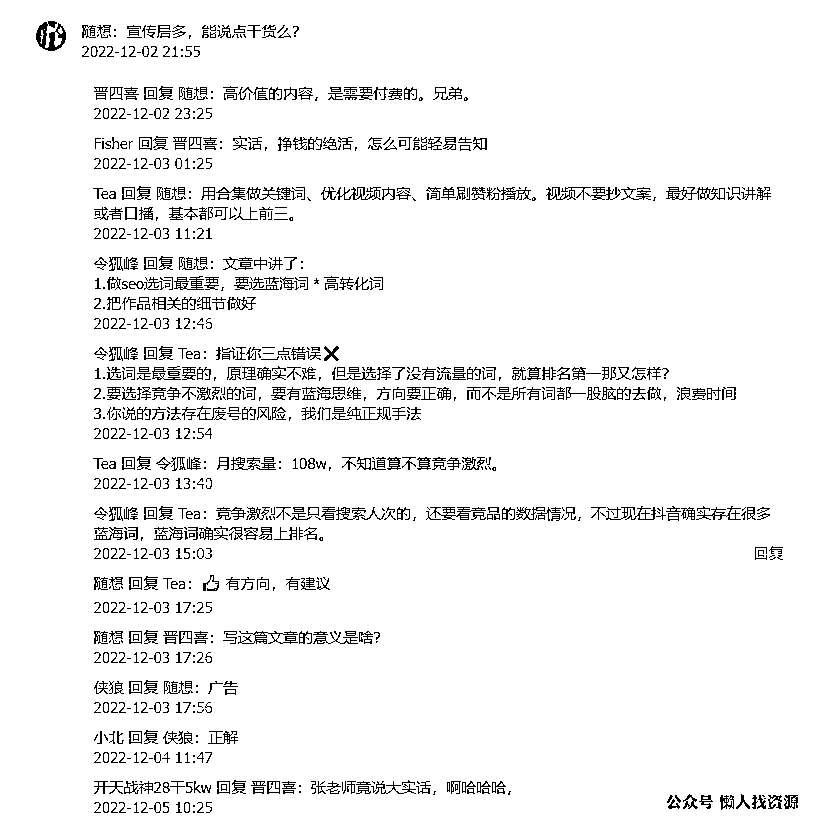  <ne-h2 id="3f5dd048" data-lake-id="3f5dd048"><ne-heading-ext><ne-heading-anchor></ne-heading-anchor><ne-heading-fold></ne-heading-fold></ne-heading-ext><ne-heading-content><ne-text id="ub2ad861a">（43 赞）《抖音团购—业务全流程复盘》</ne-text></ne-heading-content></ne-h2> <ne-p id="u8099098d" data-lake-id="u8099098d"><ne-text id="u1016c72b">记得当时做抖音团购的时候，来生财搜索过好几次，发现没有人在做，只好自己摸索。最近看到这个业务又火了起来，又翻看了一下当时的复盘，分享给大家，希望有所帮助。</ne-text></ne-p> <ne-p id="u63a1f72a" data-lake-id="u63a1f72a"><ne-text id="uc6191c98">一段时间以来，我都不想说这段经历，有很多不愿面对的地方。最近对唯心有些新感悟（当然依然困惑），也就看得开了。</ne-text></ne-p> <ne-p id="u7db173f4" data-lake-id="u7db173f4">[<ne-text id="u6a9cee2c">https://q6rpgbg9y1.feishu.cn/docs/doccnawF1QDc9BxaTstViQhi2ud</ne-text>](https://q6rpgbg9y1.feishu.cn/docs/doccnawF1QDc9BxaTstViQhi2ud)</ne-p> <ne-h2 id="44d1a812" data-lake-id="44d1a812"><ne-heading-ext><ne-heading-anchor></ne-heading-anchor><ne-heading-fold></ne-heading-fold></ne-heading-ext><ne-heading-content><ne-text id="u19abf1c0">（108 赞）《「硅基主播」试用体验》</ne-text></ne-heading-content></ne-h2> <ne-p id="ua6b570d0" data-lake-id="ua6b570d0"><ne-text id="u12eee3c7">两周前，我咨询了刘润老师他用“数字人”制作短视频的那家供应商硅基智能，然后就对接一下看是否能试用。因为出差耽搁了一段时间，昨天刚出了一段数字人模拟的短视频。</ne-text></ne-p> <ne-p id="u51015156" data-lake-id="u51015156"><ne-text id="ubee79f66">制作过程是这样的，先是给他们几段我过去拍摄的短视频原始素材，他们来捕捉表情和动作。然后再让我录制一段音频，他们训练数字人模拟对口型个表情手势。</ne-text></ne-p> <ne-p id="u1110deb3" data-lake-id="u1110deb3"><ne-text id="u43dd5349">再之后，就是再拍一段视频，让他们训练整体效果。</ne-text></ne-p> <ne-p id="u37dbb94b" data-lake-id="u37dbb94b"><ne-text id="u41801f0b">我因为隔离在家，目前还没有拍摄再训练的视频，但是第二阶段的模拟视频已经出来了，下面这段视频就是根据我早期的视频和发过去的音频模拟出来的。</ne-text></ne-p> <ne-p id="u852669db" data-lake-id="u852669db"><ne-text id="ue83912d9">这样模拟出数字人后，不需要再化妆、背台本、拍摄，只需要输入一段文本就可以输出一段以假乱真的短视频了。</ne-text></ne-p> <ne-p id="u787c0af4" data-lake-id="u787c0af4"><ne-text id="u51308c2b">我录一段 3 分钟左右的短视频，如果加上后期剪辑，至少也要 2 个小时。训练完成后，我以后拍短视频只需要打出文字即可，这就将大大节省了我的个人时间。</ne-text></ne-p> <ne-p id="uaae64164" data-lake-id="uaae64164"><ne-text id="u922a2c5b">刘润是工作效率化的先锋，李笑来也是，他们两个是我认识的提升个人时间效率的天花板。我跟在后面学一学，也能改进不少。</ne-text></ne-p> <ne-p id="u90a1a8b0" data-lake-id="u90a1a8b0"><ne-text id="u908f70fe">这个数字人技术也用在了带货主播的直播间，当然还有别的应用。</ne-text></ne-p> <ne-h2 id="b1b7282f" data-lake-id="b1b7282f"><ne-heading-ext><ne-heading-anchor></ne-heading-anchor><ne-heading-fold></ne-heading-fold></ne-heading-ext><ne-heading-content><ne-text id="u3f69016c">（98 赞）《抖音引流卖教辅资料，单人单日 500+，虚拟产品私域玩法实战分享》</ne-text></ne-heading-content></ne-h2> <ne-p id="ue5136683" data-lake-id="ue5136683"><ne-text id="u3c8bfaaf" style="color: rgb(0, 0, 0);">大家好，我是小许，一个靠流量生存了三年的工作室，本文章 3700 字，阅读时间大约 10 分钟</ne-text></ne-p> <ne-p id="u9811dbe8" data-lake-id="u9811dbe8"><ne-text id="u7c641494" style="color: rgb(0, 0, 0);">今天给大家主要分享一个目前突然火起来的赛道 “抖音引流+私域卖教辅资料”全攻略，小白也能全复制的教程，如果用心去看这篇文章足够赚回这个社群的门票费！</ne-text></ne-p> <ne-p id="uf6d50ccc" data-lake-id="uf6d50ccc"><ne-text id="uf7329c9b" style="color: rgb(0, 0, 0);">看似简单但真正的实操起来还是需要时间的，以下是我们实操过程的经历和技巧，也希望可以帮忙到疫情下正处于迷茫的生财圈友。</ne-text></ne-p> <ne-p id="u87e30f0f" data-lake-id="u87e30f0f"><ne-text id="ue650f84c" style="color: rgb(0, 0, 0);">目录：</ne-text></ne-p> <ne-p id="ue49b2787" data-lake-id="ue49b2787"><ne-text id="ufe586809" style="color: rgb(0, 0, 0);">自我介绍</ne-text></ne-p> <ne-p id="ud0fa8220" data-lake-id="ud0fa8220"><ne-text id="ua887b056" style="color: rgb(0, 0, 0);">目前战绩</ne-text></ne-p> <ne-p id="u17ff8ac5" data-lake-id="u17ff8ac5"><ne-text id="ud98f5c63" style="color: rgb(0, 0, 0);">项目拆解</ne-text></ne-p> <ne-p id="ucca714ea" data-lake-id="ucca714ea"><ne-text id="ud4c658c5" style="color: rgb(247, 150, 70);">一：自我介绍</ne-text></ne-p> <ne-p id="ub5dbf05d" data-lake-id="ub5dbf05d"><ne-text id="ue6510102" style="color: rgb(0, 0, 0);">这个怎么写目前还没想好，标签有很多，大学时期的班长还是大学时期的省优秀毕业生，还是毕业后的新媒体总监或者说曾经的短视频培训老师以及现在的工作室领头人？</ne-text></ne-p> <ne-p id="u59a96f50" data-lake-id="u59a96f50"><ne-text id="ue918ce04" style="color: rgb(0, 0, 0);">相信我的经历一开始和大家都和相符只不过这一路运气较好，2018 年作为省优秀毕业生成功毕业，毕业之后开始从事互联网相关工作，先后接触到微信小程序，字节跳动工作，抖音培训行业，感触最深的还是在从事培训行业之后，从一个懵懂无知的应届毕业生蜕变成可以给上百位企业家讲课的培训老师。</ne-text></ne-p> <ne-p id="u389782d6" data-lake-id="u389782d6"><ne-card data-card-name="image" data-card-type="inline" id="APIgT" data-event-boundary="card">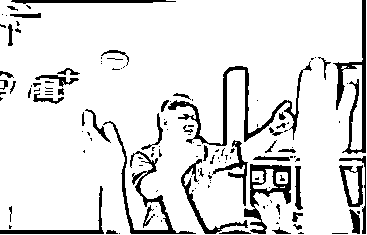<ne-card data-card-name="image" data-card-type="inline" id="UEw0G" data-event-boundary="card">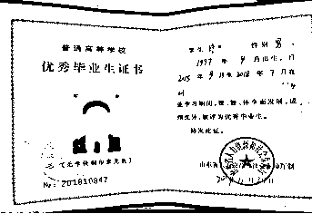  <ne-p id="u841fd2cf" data-lake-id="u841fd2cf"><ne-text id="u8e0d65bd" style="color: rgb(227, 108, 9);">一次偶然的机会</ne-text></ne-p> <ne-p id="u7f6b9905" data-lake-id="u7f6b9905"><ne-text id="ubf625380" style="color: rgb(0, 0, 0);">一次基于长期积累的偶然机会选择了创业之路，由于工作原因我会经常去刷抖音各大知识博主和卖项目的老师，长期积累下来加了很多的业务微信，通过朋友圈影响萌发了创业的念头，直到一天早上看到一个老乡也在推项目，果断的信用卡透支 3000 付了学费，也正是这次的决定才有了后面我的第一个项目男粉引流（两年变现 300 万），是我第一个项目也是我一直深耕到至今的项目，同样也是这次选择真正的改变了之前生活现状，一年时间还清了百万房贷，并且也从大众换成了宝马，并且手里还有了一定的积蓄创业初更多的是考虑如何活下去目前已经有了活下去的底气所以我们重新改变了出发点，如何做的更长久？</ne-text><ne-text id="ua5c41e1f" style="color: rgb(0, 0, 0); background-color: rgb(255, 0, 0);">我一直坚信任何项目只要逻辑行得通并且有成功案例我们的差距则不在于一个项目而是深度</ne-text><ne-text id="u8332e92e" style="color: rgb(0, 0, 0);">，正是这样一个观点经历了几次的项目起伏都坚持了下来，而今年为了顺应后续可以走的更长久我们切换了赛道，经过大概半年的犹豫和徘徊最终去开始寻找新的赛道，直到 2022 年 10 月份在新的赛道我们正式拿到了结果——教辅资料</ne-text></ne-p> <ne-p id="uf5ded387" data-lake-id="uf5ded387"><ne-text id="u5c3e36fb" style="color: rgb(247, 150, 70);">二：目前战绩.</ne-text></ne-p> <ne-p id="u65dbfb20" data-lake-id="u65dbfb20"><ne-text id="u9be7941e">团队从教辅项目零基础开始做，10 月份初开始上号，包装产品，包装承接流量微信朋友圈，十月底开启了正式变现，到目前位置前期测试+后续稳定大约两个月时间三个人总共获利 45610 元。相对于之前男粉项目一天几千块钱虽然利润不是很理想，但还是开心的，第一证明这个路是可以走的，第二这个赛道可以长期积累，第三纯绿色平台风控轻</ne-text></ne-p> <ne-p id="u6f874e2f" data-lake-id="u6f874e2f"><ne-text id="ud30ea47d">这两个月时间共加好友接近 3000 人，客单价 39.9，成交 1000+人，转化率 30%左右，毕竟来的客户都是比较精准的，并且我们为了不错过每一个流量全是手打字一个个和客户去聊的加上朋友圈的影响和后续的刺激成交，成交率我们还是比较满意的，而且 39.9 这个客单价本身不高，如果买纸制的试卷一份大概就要十几到几十块钱不等，所以这个项目是一个非常简单而暴力的赚钱项目</ne-text></ne-p> <ne-p id="u7d3d36f1" data-lake-id="u7d3d36f1"><ne-text id="u0ab9a50b">同样也是一个可复制可持续复购的项目，我们卖的 1-6 年级的学习资料，一个年级只需要 39.9，和做年费社群一个道理，只要你有足够的价值明年用户一样会付费，后面玩法有很多，家长朋友圈裂变，嫁接淘客去卖产品，对接机构去推课程等等。</ne-text></ne-p> <ne-p id="u81b45edc" data-lake-id="u81b45edc"><ne-card data-card-name="image" data-card-type="inline" id="JxNUi" data-event-boundary="card"><ne-card data-card-name="image" data-card-type="inline" id="EwMDP" data-event-boundary="card"><ne-card data-card-name="image" data-card-type="inline" id="tRy6h" data-event-boundary="card">  <ne-p id="uc8c5c42f" data-lake-id="uc8c5c42f"><ne-text id="uf97ce4be" style="color: rgb(247, 150, 70);">三：项目拆解</ne-text></ne-p> <ne-p id="u58ca0953" data-lake-id="u58ca0953"><ne-text id="u7f48208a" style="color: rgb(0, 0, 0);">（一）任何项目离不开流量和变现，我们就简单来拆解一下我们的流量在哪？我们的变现通过什么产品？</ne-text></ne-p> <ne-p id="u48439ac5" data-lake-id="u48439ac5"><ne-text id="u404774ff" style="color: rgb(0, 0, 0);">1：众所周知流量在哪生意在哪，而今天显而易见大把的流量在短视频平台，从过去我们离不开微信，到今天我们一样离不开短视频，如果认真去看你会发现我们现在看短视频的时间已经远远超过了大部分 app，那么我们的项目也顺理成章的是通过短视频平台解决我们的流量问题。</ne-text></ne-p> <ne-p id="ufa1490fa" data-lake-id="ufa1490fa"><ne-text id="u9461aad6" style="color: rgb(0, 0, 0);">2：关于变现产品这个是我们做了很多功课才去决定的一件事情，对于个人以及小的工作室来讲，或者站在可复制的问题上面考虑，实物产品首先我们要抛开，第一并不是每个人都可以解决物流问题，第二并不是每个人都可以清楚的了解产品，所以在这里我们选择的是虚拟产品，小学教育学习资料（电子版）无需物流发货。</ne-text></ne-p> <ne-p id="uc2431906" data-lake-id="uc2431906"><ne-text id="u6a288a85" style="color: rgb(0, 0, 0);">总结：我们目前通过抖音和小红书图文形式去发布内容引流 1-6 年级家长到微信，通过微信成交 1-6 年级的学习资料，内容形式可复制小白即可剪辑上手无需电脑。</ne-text></ne-p> <ne-p id="u26f8d3df" data-lake-id="u26f8d3df"><ne-text id="u1965714a" style="color: rgb(0, 0, 0);">（二）实操教程</ne-text></ne-p> <ne-p id="ud6c101b5" data-lake-id="ud6c101b5"><ne-text id="u81175f8b" style="color: rgb(0, 0, 0);">先在抖音去翻阅同行（小红书也可以做但目前我们小红书上结果比较少就不做分享无实战不分享）</ne-text></ne-p> <ne-p id="u4ebc750f" data-lake-id="u4ebc750f"><ne-text id="u3d04b552" style="color: rgb(0, 0, 0);">第一步：确定人群</ne-text></ne-p> <ne-p id="uc6f4d7ff" data-lake-id="uc6f4d7ff"><ne-text id="u6975b3b9" style="color: rgb(0, 0, 0);">1：这里我们需要确定的人群需要细化，比如我们主做一年级还是二年级？  我们实战反馈一年级 三年级的家长更容易转化，所以我们建议是作这两个年级的人群。</ne-text></ne-p> <ne-p id="ub33a4d4e" data-lake-id="ub33a4d4e"><ne-text id="u9c693f23" style="color: rgb(255, 102, 112);">第一步：同行账号学习</ne-text></ne-p> <ne-p id="u2f7c89ee" data-lake-id="u2f7c89ee"><ne-card data-card-name="image" data-card-type="inline" id="EvUbW" data-event-boundary="card">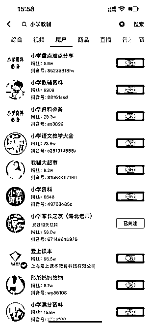<ne-card data-card-name="image" data-card-type="inline" id="cpKAT" data-event-boundary="card">  <ne-p id="u0c5726d1" data-lake-id="u0c5726d1"><ne-text id="u8e6fb280" style="color: rgb(0, 0, 0);">直接搜索关键词就可以，小学教辅 小学资料 小学三年级等，我们可以打开看一下其实内容难度并不是复杂，大部分是小学试卷，我们可以看到每个作品收藏点赞比例都很高，证明了家长是有这个需求的，点赞收藏的触发一半是感觉有用方便后续查看所以才会很容易触发收藏的动作。</ne-text></ne-p> <ne-p id="u634eb382" data-lake-id="u634eb382"><ne-text id="u9cf3fc3f" style="color: rgb(255, 102, 112);">第二步：账号准备</ne-text></ne-p> <ne-p id="uf6d9ff5e" data-lake-id="uf6d9ff5e"><ne-text id="uad35af36">1：这里我感觉有几个重点，首先我们先对标自己，是个人玩家还是矩阵工作室，如果是个人我们建议用自己实卡去做，首先这类账号并不会高频率封号，可以往大号进行培养，如果是工作室矩阵，需要接码，毕竟我们自己的手机卡还是有限的，接码建议找可以留号的，如果我们账号起色比较好可以在换绑到我们个人手机</ne-text></ne-p> <ne-p id="u451efd56" data-lake-id="u451efd56"><ne-text id="u4791afaf">2：个人操作账号建议 5-8 个账号，不需要担心会不会做的过来，其实难度还是比较低的。</ne-text></ne-p> <ne-p id="uc40e1eac" data-lake-id="uc40e1eac"><ne-text id="ua33392e9" style="color: rgb(255, 102, 112);">第三步：账号搭建</ne-text></ne-p> <ne-p id="u6cfd8111" data-lake-id="u6cfd8111"><ne-text id="uae093941">1：养号：我们实战做了大约三年的流量，经历过一夜战损一百多号，这个养号说实话我们感觉并不是很重要，矩阵号我们一般养号 2-3 个小时就开始使用，养号过程主要是模拟一下正常用户操作即可，刷刷视频 点点赞 关注 评论即可，建议去互动同行账号，不要互动无关领域，这样我们的账号推送人群后期会准确一些，1-2 天即可不需要太久，账号最终的权限和养号多久关系不大</ne-text></ne-p> <ne-p id="u39fa2907" data-lake-id="u39fa2907"><ne-text id="ua5505255">2：测流：这个步骤我看很多博主没有写过，我们一般是养号结束之后，准备发布作品之前会先进行账号流量测试一下看看账号是否正常，方式为登录账号直接通过抖音 app 里面的拍摄进行实拍可以是风景可以是人物，随意拍摄一个 7-15 秒视频，配上正常音乐和文案发布，24 个小时内看一下作品播放，大于 200 我们则正常使用，低于 200 我们会在养几天放一下，其次看一下是否可以投＋（因为很多账号明明无违规，但既不可投流也没播放）</ne-text></ne-p> <ne-p id="u30854d8c" data-lake-id="u30854d8c"><ne-text id="u350f7143">3：包装：测流无误之后开始包装账号，这里主要是背景图，头像，签名，网名;</ne-text></ne-p> <ne-p id="u4dcd386b" data-lake-id="u4dcd386b"><ne-text id="u55dd4d6b">背景图：1：可以说教室的场景图片 2：可以是引导关注的图片 3：可以是说明账号内容的图片（如 每天更新三年级数学重点内容） 主要起到介绍的作用，前期不建议做引流动作</ne-text></ne-p> <ne-p id="ue3ab3690" data-lake-id="ue3ab3690"><ne-text id="u171da280">头像：1：真人头像自拍 2：文字头像（如三年级资料）</ne-text></ne-p> <ne-p id="uf719dddf" data-lake-id="uf719dddf"><ne-text id="u701f8c19">签名：如：三年级班主任，每天分享三年级资料，感谢家长关注，（前期一样不建议引流）</ne-text></ne-p> <ne-p id="uaedc0217" data-lake-id="uaedc0217"><ne-card data-card-name="image" data-card-type="inline" id="anOli" data-event-boundary="card">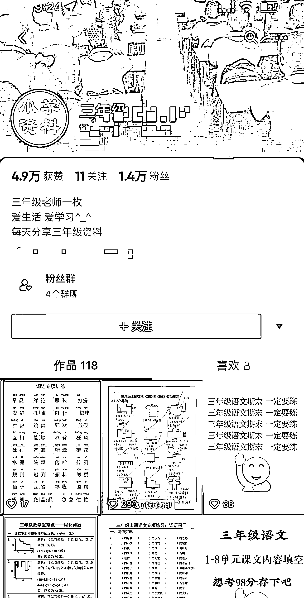<ne-text id="ud51e2732">     如果不会操作的可以按这个去包装</ne-text>  <ne-p id="ucefaf94b" data-lake-id="ucefaf94b"><ne-text id="u2190f10d">以上动作基本就可以解决账号和账号搭建问题了，接下来就是更新作品以及引流和变现。</ne-text></ne-p> <ne-p id="uec3eebe2" data-lake-id="uec3eebe2"><ne-text id="u274b42b6" style="color: rgb(255, 102, 112);">第四步：引流方式</ne-text></ne-p> <ne-p id="u588cd43b" data-lake-id="u588cd43b"><ne-text id="u50824368" style="color: rgb(0, 0, 0);">1：内容视频中下勾子（提示家长我们有电子版可以打印）如下图所示</ne-text></ne-p> <ne-p id="ue3ea7751" data-lake-id="ue3ea7751"><ne-card data-card-name="image" data-card-type="inline" id="fMCM2" data-event-boundary="card">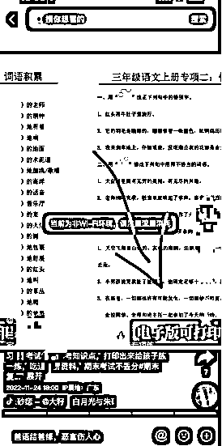  <ne-p id="u9cb268e9" data-lake-id="u9cb268e9"><ne-text id="ua5be369f" style="color: rgb(0, 0, 0);">2：背景图引流（建议粉丝过千之后）如下图所示</ne-text></ne-p> <ne-p id="uc5581be4" data-lake-id="uc5581be4"><ne-card data-card-name="image" data-card-type="inline" id="epyQw" data-event-boundary="card">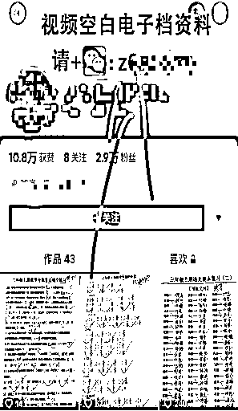  <ne-p id="u2e1281a5" data-lake-id="u2e1281a5"><ne-text id="u7c037840" style="color: rgb(0, 0, 0);">3：私信引流（因为我们面对是家长群体，所以会有很多即使你留了联系方式仍然不知道怎么加你，这个时候私信是最有效的）话术：拿电子版＋V   需注意的一定不要说领电子版 因为领给人第一感觉就是免费的，白嫖会比较多</ne-text></ne-p> <ne-p id="udc14be2f" data-lake-id="udc14be2f"><ne-text id="ue1070d08" style="color: rgb(0, 0, 0);">4：群聊引流（大号之后可以开通群聊然后引流）倒流粉丝群，用小号在群内引导家长去添加微信</ne-text></ne-p> <ne-p id="uef6b3658" data-lake-id="uef6b3658"><ne-text id="u39f8c07b" style="color: rgb(255, 102, 112);">第五步：转化话术</ne-text></ne-p> <ne-p id="u34411510" data-lake-id="u34411510"><ne-text id="u82040175" style="color: rgb(0, 0, 0);">非常简单明了，这个没有太多技术可言就不做多分享，加十个同行你自然可以找到适自己的话术和操作模式</ne-text></ne-p> <ne-p id="u2ef20a13" data-lake-id="u2ef20a13"><ne-card data-card-name="image" data-card-type="inline" id="mErXv" data-event-boundary="card">  <ne-p id="u8b43c565" data-lake-id="u8b43c565"><ne-text id="u7c42647f">这里提一嘴收款问题：</ne-text> <ne-text id="ub043b7a1" style="color: rgb(247, 150, 70);">建议不要使用个人微信收款，时间久了会有风险提示影响转化，可使用快团团或者支付宝</ne-text></ne-p> <ne-p id="u85338aa3" data-lake-id="u85338aa3"><ne-text id="u1894290e" style="color: rgb(236, 40, 52);">第六步：包装产品</ne-text></ne-p> <ne-p id="u9fc205c3" data-lake-id="u9fc205c3"><ne-text id="ufebb5317" style="color: rgb(0, 0, 0);">1：产品一般是资料包，每个年级一个资料包，最简单的方式去拼夕夕直接搜索一年级学习资料二年级学习资料把 1-6 年级资料全部购买一共花费不超过一百元，购买之后把资料简单整理一下即可。</ne-text></ne-p> <ne-p id="ucebd8094" data-lake-id="ucebd8094"><ne-text id="ud82fc9d7" style="color: rgb(0, 0, 0);">2：朋友圈转化小技巧，这里就要学习微商的朋友了，有了私域之后个人运营的情况直接影响到私域的价值，这里我们建议是一天十条朋友圈按内容划分比例，生活类 20% 成交类 50% 反馈类 30%偶尔可以在发一些类似于督促去学习的文字或者图片，这样家长更愿意去多关注你的朋友圈时间长了也会更利于成交</ne-text></ne-p> <ne-p id="ucb76ea60" data-lake-id="ucb76ea60"><ne-text id="ue8beca75" style="color: rgb(0, 0, 0);">3：设置标签，建议每个家长都做标签便于后期维护，是否成交 几号加的我们，几年级的群体，这样我们可以后续进行跟单和维护，私域的优势就是可以多次触达，多次营销，所以这个我们一定要做好。</ne-text></ne-p> <ne-p id="uf156936f" data-lake-id="uf156936f"><ne-text id="u891bbb12" style="color: rgb(0, 0, 0);">总结：掌握前端流量之后转化话术和产品之后这个我们更需要的就是实操了，同行是最好的老师，多看高播放同行作品，复制套用内容形式即可。</ne-text></ne-p> <ne-p id="u62c20eed" data-lake-id="u62c20eed"><ne-text id="u68078f5e" style="color: rgb(0, 0, 0);">还有很多细节下次有时间在出第二篇分享，打字真的是手酸的一批，滋滋——</ne-text></ne-p> <ne-p id="u22164414" data-lake-id="u22164414"><ne-text id="u3af406f3" style="color: rgb(0, 0, 0);">非常感谢生财这个平台，虽然进来时间不长，但提供了很多好的思路比如之前分享的私域运营我们感觉就和我们目前的事情非常匹配，文章仅是分享希望不喜勿喷。感谢大佬留情，第一次知识星球分享文章排版有点烂 害</ne-text></ne-p> <ne-h2 id="ffa090a4" data-lake-id="ffa090a4"><ne-heading-ext><ne-heading-anchor></ne-heading-anchor><ne-heading-fold></ne-heading-fold></ne-heading-ext><ne-heading-content><ne-text id="uf52c4d96">（54 赞）《关于我抖音新账号，第四条视频上了小热门，300 播放量，一天涨到 6 万+</ne-text></ne-heading-content></ne-h2> <ne-p id="u869ebb60" data-lake-id="u869ebb60"><ne-text id="u14d21f1d" ne-bold="true">过来报喜啦！</ne-text><ne-text id="u71815551">🎉</ne-text></ne-p> <ne-p id="u357a56bd" data-lake-id="u357a56bd"><ne-text id="ube36cb76">顺便给刚做抖音，或者做了一段时间抖音，没起量的圈友们打个气</ne-text><ne-text id="ub2811720" style="color: rgb(38, 38, 38);">！</ne-text><ne-text id="ue8d71ae5" ne-bold="true">ヾ(◍°∇°◍)ﾉﾞ</ne-text></ne-p> <ne-p id="u3b3b9a6c" data-lake-id="u3b3b9a6c"><ne-text id="u0aeaba2d">· 我的抖音新号第四条视频，从昨晚 300 播放量停住，到现在爆了 6 万+播放量。晚上还会直播，尝试今天破 10 万（10 万播放量，只是个小数哈，百万、千万，那是真无敌哈~）；</ne-text></ne-p> <ne-p id="uc3da4e68" data-lake-id="uc3da4e68"><ne-text id="u9c9cd34d">· 账号运营不到一周，第四天 17 个粉丝，今天是第五天，目前 456 个粉丝。</ne-text></ne-p> <ne-p id="u539e050c" data-lake-id="u539e050c"><ne-text id="u88cae4d2" ne-bold="true">一、事情前因：</ne-text></ne-p> <ne-p id="u0ab3f81e" data-lake-id="u0ab3f81e"><ne-text id="u4452a570">我 20 年 2 月做抖音，取得了一些小成绩，目前 24 万+粉丝，运营知识区。新手做抖音第二个月收入 17 万+。这中间的曲折故事，想了解的圈友们，可以点直达电梯：</ne-text></ne-p> <ne-p id="ucf989bae" data-lake-id="ucf989bae">[<ne-text id="ucbdb3e88">https://articles.zsxq.com/id_idv32zqkrpul.html</ne-text>](https://articles.zsxq.com/id_idv32zqkrpul.html)</ne-p> <ne-p id="u95c409e5" data-lake-id="u95c409e5"><ne-text id="ufa1069f3">刚报名了 11 月航海，我报了三个，抖音、小红书、B 站</ne-text></ne-p> <ne-p id="uf0805254" data-lake-id="uf0805254"><ne-text id="uab56b14a">因为之前的账号，内容主要是以抖音为主，介绍抖音的功能居多，所以不适合全网发布。想着做点啥内容，能适用全网。</ne-text></ne-p> <ne-p id="u0403d3a8" data-lake-id="u0403d3a8"><ne-text id="u30151435">新起一个领域？不是我擅长，起步可能有点慢。</ne-text></ne-p> <ne-p id="u8b20e330" data-lake-id="u8b20e330"><ne-text id="ud72fd23d">我不是怕慢，也有心一天天慢慢成长。</ne-text><ne-text id="uf0f58776" ne-bold="true">但是奈何想暴富的心，等不了！！</ne-text></ne-p> <ne-p id="uf621a48c" data-lake-id="uf621a48c"><ne-text id="uaffc9df8" ne-bold="true">跟了上两期航海总结的经验：想进入一个全新领域，从自己喜欢、擅长、有资源、能阶段性长久做找。</ne-text></ne-p> <ne-p id="u8d1bed96" data-lake-id="u8d1bed96"><ne-text id="u357e5402">想了半天，我的优势是啥？</ne-text></ne-p> <ne-p id="u4909a224" data-lake-id="u4909a224"><ne-text id="u23d74f16">看很多精华帖，圈友们分享，新手做好物分享，做 AI、做本地团购、做海外......成绩都还不错，有点心动。但是又不想放弃自己现有的优势——带新手做自媒体（直播、短视频，新手定位）</ne-text></ne-p> <ne-p id="ua28c0cdf" data-lake-id="ua28c0cdf"><ne-text id="u2f88d963">好吧，这事，喜欢，才能做的长远。那就做自己喜欢的。</ne-text></ne-p> <ne-p id="ubba52436" data-lake-id="ubba52436"><ne-text id="u22b4e7e5">咋找适合我，又能全网发的内容呢？</ne-text></ne-p> <ne-p id="u52476b27" data-lake-id="u52476b27"><ne-text id="uf1e7a2ea">我找了一张空白 A4 纸，写了我每天都会做的事：</ne-text></ne-p> <ne-p id="ud3c9c971" data-lake-id="ud3c9c971"><ne-text id="u416ec84b">睁眼，先看一下自己昨天的账号数据——看全网数据（蝉妈妈）搜爆款视频选题，进素材库——看“人人都是产品经理”找话题——看 VC 情报（投资界），关注热门板块——根据昨天的账号数据表现，先开直播还是先做视频——还有时间，就更公众号去.......</ne-text></ne-p> <ne-p id="ube1a5306" data-lake-id="ube1a5306"><ne-text id="u77c1babf">基本上每天都会重复这些事情。大概的内容，就是一个人做自媒体~</ne-text></ne-p> <ne-p id="u1c3c8e08" data-lake-id="u1c3c8e08"><ne-text id="uc8b147b0">好，那我就做一个，从 0 开始，做知识分享型博主的 VLOG</ne-text></ne-p> <ne-p id="ub31a1f05" data-lake-id="ub31a1f05"><ne-text id="u0559e9c1" ne-bold="true">二、新手怎么快速找到，自己的优势账号定位？</ne-text></ne-p> <ne-p id="uabc85f61" data-lake-id="uabc85f61"><ne-text id="ue30c68ad">看上两期航海，有些新手圈友们，也是卡在账号定位上。</ne-text></ne-p> <ne-p id="u3722f6c7" data-lake-id="u3722f6c7"><ne-text id="ud77d0aa1" ne-bold="true">路一这里给新手圈友们一个炒鸡简单、又高效的办法：</ne-text><ne-text id="uaeb87ccf">找一张空白 A4 纸，写你每天都会做的事。</ne-text></ne-p> <ne-p id="u471103d7" data-lake-id="u471103d7"><ne-text id="ua56a0176" ne-bold="true">在职的圈友：</ne-text></ne-p> <ne-p id="u0880d721" data-lake-id="u0880d721"><ne-text id="ub8b09332">你梳理自己一天做的事情，可能是：起床——自己做早饭——坐地铁上班——上班，做报表——中午午睡——下午审核其他部门上报数据——下班回家，给自己做完饭</ne-text></ne-p> <ne-p id="uc4a97aac" data-lake-id="uc4a97aac"><ne-text id="u1abeb473">这条时间线，起码能找到 3 个账号定位：坐地铁、给自己做饭、做报表</ne-text></ne-p> <ne-p id="uc540e19b" data-lake-id="uc540e19b"><ne-text id="u6434eb55">你可以分享的内容：</ne-text></ne-p> <ne-p id="u9f6a49a3" data-lake-id="u9f6a49a3"><ne-text id="u211b976e">地铁：分享搭乘地铁歌单、地铁每日一画、地铁每日趣事、地铁历史....</ne-text></ne-p> <ne-p id="u6857b86a" data-lake-id="u6857b86a"><ne-text id="u6bb164e0">做饭：5 分钟速成早餐、上班族减脂餐、每日电饭煲一餐、每天一只鸡....</ne-text></ne-p> <ne-p id="uf25d5c8d" data-lake-id="uf25d5c8d"><ne-text id="ua8c5d9dd">报表：工具推荐、每日工具功能键使用、报表每日一错整改、报表每日技巧.....</ne-text></ne-p> <ne-p id="u252e7803" data-lake-id="u252e7803"><ne-text id="u519e7dd1" ne-bold="true">女生圈友：</ne-text></ne-p> <ne-p id="u100e334c" data-lake-id="u100e334c"><ne-text id="ub18f26a8">一天的时间线，可能是：起床——洗漱——化妆——穿搭——上班，咖啡间分享穿搭好物、首饰、美妆、内部八卦——下班约会妆、酒吧妆——约会小技巧——瑜伽时间、健身时间——护肤时间——睡前追剧时间.....</ne-text></ne-p> <ne-p id="uf33e8f12" data-lake-id="uf33e8f12"><ne-text id="u2c563bbd">这条时间线，起码能找到的定位：</ne-text></ne-p> <ne-p id="u260b91d2" data-lake-id="u260b91d2"><ne-text id="u22c7cadf">3 分钟上班妆、矮个子工作装、显瘦穿搭、首饰分享、各种场合妆容打造、男女生约会心得、上班族瑜伽、健身、混油皮肌肤护理、好剧推荐.......</ne-text></ne-p> <ne-p id="u9eccc59e" data-lake-id="u9eccc59e"><ne-text id="u6bab2904" ne-bold="true">待业在家的圈友们：</ne-text></ne-p> <ne-p id="u544d6fc0" data-lake-id="u544d6fc0"><ne-text id="u5bad7b72">比如宝妈，怎么找一天的时间线呢？</ne-text></ne-p> <ne-p id="u8424895d" data-lake-id="u8424895d"><ne-text id="u7af3d84c">你都说了，你是宝妈，那你一天的时间，花费最多精力的地方是啥？照顾宝宝呀~</ne-text></ne-p> <ne-p id="uc22b85d1" data-lake-id="uc22b85d1"><ne-text id="u6bb1c5ef">你可以分享：宝贝辅食、家有高考生每日营养早餐、家居收纳、育儿经验、夫妻/婆媳相处之道、益智互动游戏、绘本故事、边带娃边考博、边带娃边瘦身、边带娃边出书......</ne-text></ne-p> <ne-p id="u93c79dec" data-lake-id="u93c79dec"><ne-text id="u05ee6bd4">只要能写出来，你一天的时间线，就能找到不止一个定位。</ne-text></ne-p> <ne-p id="u24ff8c65" data-lake-id="u24ff8c65"><ne-text id="ua900f546" ne-bold="true">那这么多定位，做哪个更合适呢？</ne-text></ne-p> <ne-p id="u745695ef" data-lake-id="u745695ef"><ne-text id="u38212c84">做你最喜欢的！！这句话，很重要。</ne-text></ne-p> <ne-p id="u7025ce9b" data-lake-id="u7025ce9b"><ne-text id="u9d39d387">因为喜欢，才能长久的做；</ne-text></ne-p> <ne-p id="uf509d901" data-lake-id="uf509d901"><ne-text id="ucb69b338">能长久的做，就有可能找到属于你，最擅长发挥的细分领域，把这做到顶级；</ne-text></ne-p> <ne-p id="u901d8027" data-lake-id="u901d8027"><ne-text id="u3ac97f24">做到顶级，啥都好解决了。包括收入、认知、圈层。</ne-text></ne-p> <ne-p id="u7fe9de44" data-lake-id="u7fe9de44"><ne-text id="ue62630ea" ne-bold="true">总结一下，找适合自己的优势定位：在你每天都会做的事情里面，挑一个你最喜欢的。</ne-text></ne-p> <ne-p id="u12bbba78" data-lake-id="u12bbba78"><ne-text id="u18fd7c19">好了，找到自己的优势定位了，你就已经成功了 70%！</ne-text></ne-p> <ne-p id="ud45d61aa" data-lake-id="ud45d61aa"><ne-text id="u280bd185">剩下的就看执行力。</ne-text></ne-p> <ne-p id="ufaee7045" data-lake-id="ufaee7045"><ne-text id="u8ffaec1e" ne-bold="true">三、我的新账号第四条视频小热门，是咋做的？</ne-text></ne-p> <ne-p id="u8cb00c0a" data-lake-id="u8cb00c0a"><ne-text id="u916a6076">第一条视频发出后，就 300+播放量，第二条 400 播放量，第三条 200 播放量，第四条视频昨天下午发的，到晚上睡觉的时候看一了眼，停在了 300 多播放量。</ne-text></ne-p> <ne-p id="u12d65506" data-lake-id="u12d65506"><ne-text id="uc81df6a7">我给自己的时间是，一个月的时间，把账号数据做起来，起码有条视频，要破万播放量（纯自然流量）</ne-text></ne-p> <ne-p id="u9876d66f" data-lake-id="u9876d66f"><ne-text id="u76341aef">本来以为，也就这样了，想着下午再看看人家爆款选题，学习一下。</ne-text></ne-p> <ne-p id="u954d1621" data-lake-id="u954d1621"><ne-text id="uded4f5eb">没想到，一看消息页，38 条消息！34 个粉丝了（昨天 17 个粉丝）</ne-text></ne-p> <ne-p id="u0ad75e49" data-lake-id="u0ad75e49"><ne-text id="u121d9199">发了 3 条视频，一共涨了 17 个粉丝，还有 5 个，是大号直播的时候，引过来的。</ne-text></ne-p> <ne-p id="u371c1d62" data-lake-id="u371c1d62"><ne-text id="uaff7b50c">没想到，这条视频，从昨晚 300 多的播放量，到今天中午 12 点半，一下子涨到了 4000！（写这篇稿子的时候，是晚 7 点多，播放量 6.2 万了）</ne-text></ne-p> <ne-p id="uae2e7719" data-lake-id="uae2e7719"><ne-text id="u2240d9ed">我刷新一下，涨几十个播放量，刷新一下，涨 1~2 个粉丝！</ne-text></ne-p> <ne-p id="u0a1d4061" data-lake-id="u0a1d4061"><ne-text id="u110341ab" ne-bold="true">这不就是流量来了吗！！！立马开播！</ne-text></ne-p> <ne-p id="u0fad3ab5" data-lake-id="u0fad3ab5"><ne-text id="ue540f965">直播聊什么？</ne-text></ne-p> <ne-p id="ud7c02076" data-lake-id="ud7c02076"><ne-text id="ubb98e2fe">就聊，我昨天 17 个粉丝，今天涨了十几个粉丝。发了 4 个视频，一晚上从 300 个播放量，涨到现在 4000 了。</ne-text></ne-p> <ne-p id="u19097683" data-lake-id="u19097683"><ne-text id="u5ffc9390">开播 2 个半小时直播（手机过热保护，被迫下播了）</ne-text></ne-p> <ne-p id="ud8adec88" data-lake-id="ud8adec88"><ne-text id="uc974117f">这场直播的一点数据：</ne-text></ne-p> <ne-p id="u55a13a73" data-lake-id="u55a13a73"><ne-text id="u80783fea">观众人数：4000+</ne-text></ne-p> <ne-p id="u37ae9199" data-lake-id="u37ae9199"><ne-text id="uf1d1b4ed">直播新增粉丝：97</ne-text></ne-p> <ne-p id="uc7015f63" data-lake-id="uc7015f63"><ne-text id="uc4ed5073">点赞次数：1.4 万</ne-text></ne-p> <ne-p id="uc1b3f1a3" data-lake-id="uc1b3f1a3"><ne-text id="u88a15c67">开播时间：12:48-15:07</ne-text></ne-p> <ne-p id="u3159bae5" data-lake-id="u3159bae5"><ne-text id="u21532561">最高在线 81 人</ne-text></ne-p> <ne-p id="u8aa75449" data-lake-id="u8aa75449"><ne-text id="ue1534bb7">因为新账号不到 1000 粉丝，没开通橱窗。有观众想跟着学，我只能再引到大号的橱窗里，直播的时候，成交了一单 268 新手短视频课。</ne-text></ne-p> <ne-p id="u6b2010ae" data-lake-id="u6b2010ae"><ne-text id="u9500edcd">争取今晚上就能开通橱窗。</ne-text></ne-p> <ne-p id="u4a19ccb2" data-lake-id="u4a19ccb2"><ne-text id="ua46ae175">我新号发的视频内容，就是新手，从 0 开始做自媒体。虽然这个范围太广了。</ne-text></ne-p> <ne-p id="ue24aac69" data-lake-id="ue24aac69"><ne-text id="u089cbec7">这是因为需要全平台发布：抖音、B 站、小红书、知乎。所以只能选这么做选题了。</ne-text></ne-p> <ne-p id="u7abfb575" data-lake-id="u7abfb575"><ne-text id="u0ebb75ee">也是为了在其他平台变现做准备。比如小红书的变现方式，是以后主要接广告，比如做视频的自媒体工具、网站；拍视频的工具；写文案的书籍...</ne-text></ne-p> <ne-p id="u60585515" data-lake-id="u60585515"><ne-text id="u055aeef2" ne-bold="true">这条视频能曝的因素：</ne-text></ne-p> <ne-p id="u9419fda7" data-lake-id="u9419fda7"><ne-text id="u74915762">1.有收藏价值（新手做视频用到的工具汇总）贴在后面了；</ne-text></ne-p> <ne-p id="u1a177f5f" data-lake-id="u1a177f5f"><ne-text id="u22ee556c">2.在爆款选题里找的开头 3 秒抛出：“现在做自媒体晚不晚？还赚钱吗？”是大家比较关心的话题，所以会看下去；</ne-text></ne-p> <ne-p id="ud2650b5b" data-lake-id="ud2650b5b"><ne-text id="u30165d5d">3.内容带上了一部分在家待业的自媒体同行，在家不赚钱，要不要出去找工作。</ne-text></ne-p> <ne-p id="u532b8b52" data-lake-id="u532b8b52"><ne-card data-card-name="image" data-card-type="inline" id="EmNUw" data-event-boundary="card">  <ne-p id="u07b0754c" data-lake-id="u07b0754c"><ne-text id="u5003a0c9" style="color: rgb(89, 89, 89);">(文案工具类，网站版多哈）</ne-text></ne-p> <ne-p id="u1e89c942" data-lake-id="u1e89c942"><ne-text id="u20d942aa" ne-bold="true">四、简单总结一下本文重点：</ne-text></ne-p> <ne-p id="uc66f806e" data-lake-id="uc66f806e"><ne-text id="u6188a1d8">因为太激动了，这篇分享写的有点眉飞色舞，时间有点赶，等下还要去直播，做视频~回头这个新账号再有啥，很亮点的收获，再详细写过来哈~</ne-text></ne-p> <ne-p id="ue2d7a152" data-lake-id="ue2d7a152"><ne-text id="u4d069c0f" ne-bold="true">1、做的视频，能全网，就全网发。东边不亮，西边亮</ne-text></ne-p> <ne-p id="uac9e83f4" data-lake-id="uac9e83f4"><ne-text id="u14971a11">我同样的这四条视频，小红书，只收获 1 个粉丝，2 个赞（小红书的粉丝 1 千粉丝，赶上抖音 2 万粉丝价值）；</ne-text></ne-p> <ne-p id="u1675ae32" data-lake-id="u1675ae32"><ne-text id="u4a5d79aa">B 站，只通过了一条发布成功，申诉不通过（可能是参加了 B 站的星计划，审核严）；</ne-text></ne-p> <ne-p id="u0265eba3" data-lake-id="u0265eba3"><ne-text id="u235d6f4f">知乎，四条视频播放量加起来，才 500，没有涨粉。</ne-text></ne-p> <ne-p id="uc4c34802" data-lake-id="uc4c34802"><ne-text id="u681ce125" ne-bold="true">2、新号确实比断更的老号，好运营</ne-text></ne-p> <ne-p id="u03d652e0" data-lake-id="u03d652e0"><ne-text id="u56bb81a1">因为账号标签是新的、暂时没有维护铁粉数据、抖音喜欢有新鲜、好的血液进入，拉用户在线时长。</ne-text></ne-p> <ne-p id="uc2edc8b0" data-lake-id="uc2edc8b0"><ne-text id="u97116441">这里不是建议大家都是注册个新号哈。有啥号，用啥号。先做好一个账号（这里说的是做好一个账号，是你要做 IP，个人品牌，就先运营好一个账号。像中视频计划、好物分享、书单号啥的，还是以量取胜哈~）</ne-text></ne-p> <ne-p id="u2f66e003" data-lake-id="u2f66e003"><ne-text id="u9b50836c" ne-bold="true">3、有流量了，能直播，就直播</ne-text></ne-p> <ne-p id="u29a74cb2" data-lake-id="u29a74cb2"><ne-text id="ua3396fb4">这个精华帖里更多大佬的详细例子，啥都没准备好，不知道播什么，聊什么，也开播！这是黄金时间，把握好。要不等你准备好了，明天后天再开播，黄花菜都快凉了，这波流量，就算不睡觉，也要把握喽！！！</ne-text></ne-p> <ne-p id="u124efcc6" data-lake-id="u124efcc6"><ne-text id="uc1224f81">直播，能给视频推荐流量；视频有流量了，也会带动直播间人数。</ne-text></ne-p> <ne-p id="uacea69e1" data-lake-id="uacea69e1"><ne-text id="ub8bf1c38">好嘞，回头这个新号再有啥好成绩，再回来报喜哈~虽然不是啥很震惊的数据，但是对于新手刚开始做，能打个“鸡血”也不错哈，起码方向是对的！努力不会白费哈~</ne-text></ne-p> <ne-p id="uea15f4ac" data-lake-id="uea15f4ac"><ne-text id="uf2d639c0">圈友们，我们共同努力，一起加油！！！生财有术~~~！ヾ(◍°∇°◍)ﾉﾞ</ne-text></ne-p> <ne-h2 id="1c78583b" data-lake-id="1c78583b"><ne-heading-ext><ne-heading-anchor></ne-heading-anchor><ne-heading-fold></ne-heading-fold></ne-heading-ext><ne-heading-content><ne-text id="u5269e6f5">（66 赞）《我对从 0 到 1 搭建短视频团队的一些理解》</ne-text></ne-heading-content></ne-h2> <ne-p id="u3011ac61" data-lake-id="u3011ac61"><ne-text id="u78a46e2f">短视频还能不能搞？ 我用了 8 个月从 0 搭建短视频团队，做了以下结果回答这个问题： - 两个月，高考志愿号精准涨粉 10 万+，私信爆满。 - 一条讲抗衰的视频，给后端导流 300 个干细胞客户。 - 千粉同城号变现六位数。 - ... 我把我从 0-1 搭建短视频团队的经验整理了出来，将从五个部分来讲讲： 1.变现产品怎么选？ 2.团队的人员和职责 3\. 打造从零到赚钱的 IP 具体流程 4.我看好的短视频赛道 5.20 条我的抖音心得 大概 5000 字，比较长，希望能给你带来启发：</ne-text></ne-p> <ne-p id="u19cc3658" data-lake-id="u19cc3658">[<ne-text id="ub7c7e12a">https://heatwave.feishu.cn/docx/MXPcd58gSoEsTlxFhUVcJ5X7npc</ne-text>](https://heatwave.feishu.cn/docx/MXPcd58gSoEsTlxFhUVcJ5X7npc)</ne-p> <ne-h2 id="c71f2487" data-lake-id="c71f2487"><ne-heading-ext><ne-heading-anchor></ne-heading-anchor><ne-heading-fold></ne-heading-fold></ne-heading-ext><ne-heading-content><ne-text id="uccd79b82">（10 赞）《直播新玩法：收礼物自动打印送礼物人的头像，且自动播报「感谢某某的小心心」》</ne-text></ne-heading-content></ne-h2> <ne-p id="u7c98de25" data-lake-id="u7c98de25"><ne-text id="ub0279a2c">#风向标#  直播收礼物自动打印送礼物人的头像且自动播报“感谢某某的小心心”。这个打印机器有意思啊，实时获取直播间里送礼物的人的头像并打印出来，1 个小心心 1 毛钱，盯了几分钟，送礼物的人就没停，还看着主播换了一卷打印纸。</ne-text></ne-p> <ne-p id="u6752f32f" data-lake-id="u6752f32f"><ne-card data-card-name="image" data-card-type="inline" id="JHCS7" data-event-boundary="card">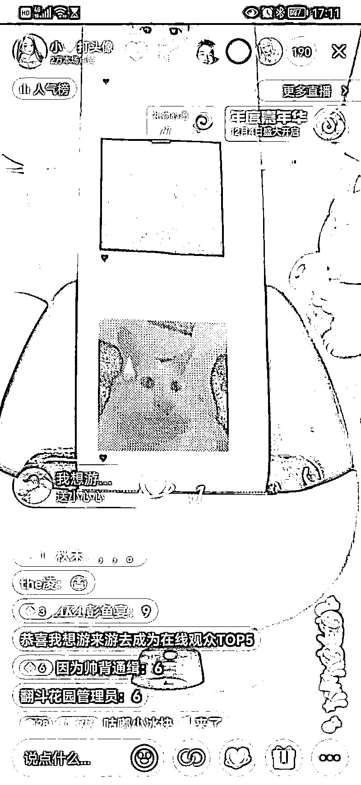  <ne-h3 id="f66cf48e" data-lake-id="f66cf48e"><ne-heading-ext><ne-heading-anchor></ne-heading-anchor><ne-heading-fold></ne-heading-fold></ne-heading-ext><ne-heading-content><ne-text id="u1ae4c638">2、国内平台 - 腾讯系</ne-text></ne-heading-content></ne-h3> <ne-h2 id="c781e914" data-lake-id="c781e914"><ne-heading-ext><ne-heading-anchor></ne-heading-anchor><ne-heading-fold></ne-heading-fold></ne-heading-ext><ne-heading-content><ne-text id="u62abc733">（27 赞）《抖音、视频号上如何利用天时地利人和来赚钱》</ne-text></ne-heading-content></ne-h2> <ne-p id="u0ee54e88" data-lake-id="u0ee54e88"><ne-text id="u8500d3f3">我超级喜欢历史，因此对历史上的战争了解也比较多，发现决定战争的胜败的主要三大因素就是天时地利人和。</ne-text></ne-p> <ne-p id="u7c1b0d5a" data-lake-id="u7c1b0d5a"><ne-text id="u635e694a">同样我们在视频号、抖音、快手、小红书等平台上，能否拿到赚钱结果，最主要的因素也是天时地利人和这三个因素。</ne-text></ne-p> <ne-p id="ub9f5af9e" data-lake-id="ub9f5af9e"><ne-text id="u3dd1b10e" ne-bold="true">那抖音、视频号上如何利用天时地利人和来赚钱？</ne-text></ne-p> <ne-p id="u817ed7be" data-lake-id="u817ed7be"><ne-text id="ucb5d1b22" ne-bold="true">1、天时：</ne-text></ne-p> <ne-p id="u19a52ec0" data-lake-id="u19a52ec0"><ne-text id="u88769d5f">天时，指适合作战的时令、气候。</ne-text></ne-p> <ne-p id="u9323ac42" data-lake-id="u9323ac42"><ne-text id="u976efaf7" ne-bold="true">我记得我大学在服装店打寒假工时，那个老板就每天会看天气预报，因为冬天一看到有寒潮从北方下来，他就抓紧备货，备羽绒服等。</ne-text></ne-p> <ne-p id="u789bc711" data-lake-id="u789bc711"><ne-text id="ua9163171">这是实体服装店利用天时的应用，那怎么理解天时在抖音和视频号上的应用呢？</ne-text></ne-p> <ne-p id="uc74daf75" data-lake-id="uc74daf75"><ne-text id="ua46d2e4d" ne-bold="true">短视频上的天时是天气、季节、节日。</ne-text></ne-p> <ne-p id="u93edce85" data-lake-id="u93edce85"><ne-text id="u05c5ed65" ne-bold="true">A、天气：</ne-text><ne-text id="u6fe5d1a0">这两天冷空气南下，天气突然变冷，这个时候就是卖保暖和取暖的好时候；像天气热的时候，防晒等产品特别好卖，防晒衣、防晒霜等等</ne-text></ne-p> <ne-p id="ue0e903e1" data-lake-id="ue0e903e1"><ne-text id="u3d95300a" ne-bold="true">B、季节：</ne-text><ne-text id="ub742b7ca">春天夏天，种子卖的很好，夏季秋季钓鱼相关产品卖得很好，冬天羽绒服等卖的很好</ne-text></ne-p> <ne-p id="ub5c5d972" data-lake-id="ub5c5d972"><ne-text id="ubb6c4292" ne-bold="true">C、节日：</ne-text><ne-text id="u7a4c1c9b">比如最近刚过去的双十一，双十一这个大电商节日，这个时候很多伙伴会发现双十一节点，视频和直播流量好了很多，就是因为平台对带货视频和直播进行流量倾斜。</ne-text></ne-p> <ne-p id="u615bcde4" data-lake-id="u615bcde4"><ne-text id="u24f83ec1" ne-bold="true">利用好天时，就可以帮我们提前预判，提前做好准备，更好得赚钱！</ne-text></ne-p> <ne-p id="u23a93c03" data-lake-id="u23a93c03"><ne-text id="uc23f878b" ne-bold="true">2、地利：</ne-text></ne-p> <ne-p id="uc701ce6b" data-lake-id="uc701ce6b"><ne-text id="ud2a4fc53">地利，指有利于作战的地形。</ne-text></ne-p> <ne-p id="u109d332e" data-lake-id="u109d332e"><ne-text id="udfefe368">在视频号、抖音中的地利，最主要指的是平台的政策，平台设置的用户购买流程，像抖音一开始是只能跳转到淘宝那边成交，那么就相当于用户成交要多跨越一座山，地利条件差，用户转化率就低，后来抖音自己做了电商，直接在平台里面成交，路径不用跳转很顺畅，这就为抖音电商打胜仗做好了地利准备。</ne-text></ne-p> <ne-p id="ucd4ff5ad" data-lake-id="ucd4ff5ad"><ne-text id="u06ab232d">视频号上，一开始没有橱窗，用户无法通过橱窗购买，转化率低很多，等到视频开通橱窗功能后，成交立马就上来，这就是在视频号和抖音中，地利对赚钱的影响。</ne-text></ne-p> <ne-p id="u0fe5884c" data-lake-id="u0fe5884c"><ne-text id="u07f4fc39" ne-bold="true">3、人和：</ne-text></ne-p> <ne-p id="uc9128a35" data-lake-id="uc9128a35"><ne-text id="u165857d1">“人和”是指得人心，上下团结。</ne-text></ne-p> <ne-p id="u736cc711" data-lake-id="u736cc711"><ne-text id="u851223a7" ne-bold="true">视频号、抖音上的人和，我个人觉得人心团结外真的超级重要，最近对这个感觉特别明显，尤其是对比去年的遭遇和结果，所以一开始组建团队就需要筛选，宁缺毋滥。</ne-text></ne-p> <ne-p id="u1fd53962" data-lake-id="u1fd53962"><ne-text id="ub0038cab">另外我觉得人和这个因素还包括人/团队的擅长点，有些团队擅长直播，那么直播在视频号上、抖音上对他来说就是人和，有些团队擅长视频，那么视频在视频号上、抖音上对他来说就是人和，有些团队擅长投放，那么投放在视频号上、抖音上对他来说就是人和。</ne-text></ne-p> <ne-p id="ud247bbd0" data-lake-id="ud247bbd0"><ne-text id="u5c2b123c" ne-bold="true">决定一场战争的成败就是天时地利人和，同理决定我们能否在视频号、抖音上赚钱也是一样。</ne-text></ne-p> <ne-p id="uefb3a37b" data-lake-id="uefb3a37b"><ne-text id="ua47cbe75">所以想要在短视频赛道上拿到结果，我们就要充分利用天时地利人和这三个关键要素，做好这三个要素的准备，为我们赚钱增加胜算！</ne-text></ne-p> <ne-h2 id="700900ed" data-lake-id="700900ed"><ne-heading-ext><ne-heading-anchor></ne-heading-anchor><ne-heading-fold></ne-heading-fold></ne-heading-ext><ne-heading-content><ne-text id="u8bc8ae7b" style="color: rgb(47, 48, 52); background-color: rgb(255, 255, 255);">（精华帖）（128 赞）《视频号小店店群，大量铺货月入 10 万+的实操分享》</ne-text></ne-heading-content></ne-h2> <ne-p id="u78ac9957" data-lake-id="u78ac9957"><ne-text id="u45ee7b91" style="color: rgb(47, 48, 52); background-color: rgb(255, 255, 255);">视频号后端能挣钱的根本原因是因为后端商品的缺乏，视频号选品库整体依旧还是不够多不够丰富的，达人想带什么品在选品中心搜不到很正常。</ne-text></ne-p> <ne-p id="u8ce6d194" data-lake-id="u8ce6d194"><ne-text id="u5013a9c6" style="color: rgb(47, 48, 52); background-color: rgb(255, 255, 255);">所以即使现在去做暴力铺品依旧能出单，而且一定要做店群，去多做店，数量越多越好，越多越稳定，最起码要做 5 个以上的店铺，要用矩阵思维来对抗不确定性！</ne-text></ne-p> <ne-p id="u01abfe39" data-lake-id="u01abfe39"><ne-text id="u88dfa695" style="color: rgb(47, 48, 52); background-color: rgb(255, 255, 255);">我干无货源后端没多长时间，也就 8 个多月，总收入 100 多 w，到年底应该会超 200 没什么问题，主要干的还是视频号后端。</ne-text></ne-p> <ne-p id="uf835a78b" data-lake-id="uf835a78b"><ne-text id="u6787ed06" style="color: rgb(47, 48, 52); background-color: rgb(255, 255, 255);">视频号无货源店群关键操作有：开店，入优选联盟，选品上架，拍单发货。真的是从 0 开始的，有结果后再一步步放大的。</ne-text></ne-p> <ne-p id="uf89c853b" data-lake-id="uf89c853b"><ne-text id="u0e15bbda" style="color: rgb(47, 48, 52); background-color: rgb(255, 255, 255);">好多年之前虽然就知道无货源项目但是一直没去做，今年初的时候在前端失败后才去试了下后端，可能时机恰好，选的平台可能也恰好正确，又恰好很快的得到了正反馈，所以才能够一直坚定的走下来，在碰到困难也会去想方设法的去解决着，去随着平台的规则去研究并更新玩法。</ne-text></ne-p> <ne-p id="udc70d002" data-lake-id="udc70d002"><ne-text id="u9b689d9b" style="color: rgb(47, 48, 52); background-color: rgb(255, 255, 255);">感叹几句，我干过的大大小小的项目太多了，出身普通家庭所以一直想赚钱，从读大学时就开始搞副业了，之前一直顺风顺水，想要的都能得到。</ne-text></ne-p> <ne-p id="uc75720ee" data-lake-id="uc75720ee"><ne-text id="udae41687" style="color: rgb(47, 48, 52); background-color: rgb(255, 255, 255);">很多经历成绩在身边人看来可能比较走运，比如本科卡着线进去，考研时依旧卡着线被录取，当年很多同学都羡慕我天天泡棋牌室打麻将的都能考得上，再比如走特招军官路线入伍，入伍即上尉正连，快速干到少校又能轻而易举的转业到地方公务员，再比如很早就靠副业买车买房，给父母买房等等，都是我的高光时刻，我一直分心同时干着很多事。</ne-text></ne-p> <ne-p id="uc8f5a602" data-lake-id="uc8f5a602"><ne-text id="u76b39da2" style="color: rgb(47, 48, 52); background-color: rgb(255, 255, 255);">之前顺利的有些过分，太浮躁了，早晚会跌跟头，还好经过了疫情的痛打，遇到了很多不顺的事，亏了不少的钱，前几天晚上我交了个作业，写了个会员日的亏钱贴，其实还有不少亏钱经验不大方便写，做项目的哪有不亏钱的，感兴趣的可以看看</ne-text></ne-p> <ne-p id="u4328acc1" data-lake-id="u4328acc1">[<ne-text id="u468a26f7" style="color: rgb(47, 48, 52); background-color: rgb(255, 255, 255);">https://wx.zsxq.com/dweb2/index/topic_detail/584255885542584</ne-text>](https://wx.zsxq.com/dweb2/index/topic_detail/584255885542584)</ne-p> <ne-p id="u5bbf7825" data-lake-id="u5bbf7825"><ne-text id="u759bc865" style="color: rgb(47, 48, 52); background-color: rgb(255, 255, 255);">经过疫情这三年，自我感觉自身磨了很多棱角，让我对未来更加有信心。我把它看作收获。</ne-text></ne-p> <ne-p id="u6ce3cb97" data-lake-id="u6ce3cb97"><ne-text id="u2940b7e5" style="color: rgb(47, 48, 52); background-color: rgb(255, 255, 255);">除了些特定的无货源电商社群，其他创业副业社群我观察了不少，对无货源分享的经验贴都非常有限，连在生财讲无货源后端的都比分享前端做账号或者直播的少太多太多了。</ne-text></ne-p> <ne-p id="u9ccfa88c" data-lake-id="u9ccfa88c"><ne-text id="u78a93c40" style="color: rgb(47, 48, 52); background-color: rgb(255, 255, 255);">但是我知道做这行的大佬太多了，比我高明挣得比我多的比比皆是，我甚至排不上号，但并没有多少人来真诚分享，更多的或是留着钩子等人联系去带培训。</ne-text></ne-p> <ne-p id="u785ebf4c" data-lake-id="u785ebf4c"><ne-text id="uaff80b0f" style="color: rgb(47, 48, 52); background-color: rgb(255, 255, 255);">所以 10 月份我在生财简单写过一个关于视频号后端的帖子，告诉大家可以去做：</ne-text></ne-p> <ne-p id="u47fd3722" data-lake-id="u47fd3722">[<ne-text id="ua7819e6c" style="color: rgb(47, 48, 52); background-color: rgb(255, 255, 255);">https://wx.zsxq.com/dweb2/index/topic_detail/212212844888241</ne-text>](https://wx.zsxq.com/dweb2/index/topic_detail/212212844888241)</ne-p> <ne-p id="ub368b41f" data-lake-id="ub368b41f"><ne-text id="ub6e7d9c2" style="color: rgb(47, 48, 52); background-color: rgb(255, 255, 255);">然而视频号又更新了规则，优选联盟规则颁布了，那个帖子很多内容已经差点时效性了，只剩下一个观点一直有效：就是视频号后端还可以做。</ne-text></ne-p> <ne-p id="u94ef2e47" data-lake-id="u94ef2e47"><ne-text id="u51ebe89b" style="color: rgb(47, 48, 52); background-color: rgb(255, 255, 255);">本文主要通过视频号后端来讲，因为我目前最熟悉视频号，而且确信肯定可以挣钱，新手愿意做的话现在也可以从 0 到 1 开始，来得及。</ne-text></ne-p> <ne-p id="u378a4e87" data-lake-id="u378a4e87"><ne-text id="uf80a712e" style="color: rgb(47, 48, 52); background-color: rgb(255, 255, 255);">大概分为以下几个板块：</ne-text></ne-p> <ne-p id="u27533b83" data-lake-id="u27533b83"><ne-text id="u73ce21df" style="color: rgb(47, 48, 52); background-color: rgb(255, 255, 255);">1.是什么？</ne-text></ne-p> <ne-p id="u6bf1b622" data-lake-id="u6bf1b622"><ne-text id="u10628da6" style="color: rgb(47, 48, 52); background-color: rgb(255, 255, 255);">2.能挣钱？</ne-text></ne-p> <ne-p id="ube999fd2" data-lake-id="ube999fd2"><ne-text id="u2b026c8f" style="color: rgb(47, 48, 52); background-color: rgb(255, 255, 255);">3.怎么做？</ne-text></ne-p> <ne-p id="u80695325" data-lake-id="u80695325"><ne-text id="ua95bfb36" style="color: rgb(47, 48, 52); background-color: rgb(255, 255, 255);">4.其他关键点</ne-text></ne-p> <ne-p id="u85b828c4" data-lake-id="u85b828c4"><ne-text id="u4545007a" ne-bold="true" style="color: rgb(47, 48, 52); background-color: rgb(255, 255, 255);">一、是什么？</ne-text></ne-p> <ne-p id="u70605c1d" data-lake-id="u70605c1d"><ne-text id="u862ca837" style="color: rgb(47, 48, 52); background-color: rgb(255, 255, 255);">无货源搬运已经出来这么多年了，基本概念就不用我讲了，所有自己不发货代发的都是无货源。</ne-text></ne-p> <ne-p id="u92cbbbcf" data-lake-id="u92cbbbcf"><ne-text id="u26dbfff4" style="color: rgb(47, 48, 52); background-color: rgb(255, 255, 255);">而且所有电商平台都存在着无货源，不用怀疑。</ne-text></ne-p> <ne-p id="ufe70fc55" data-lake-id="ufe70fc55"><ne-text id="u6021337d" style="color: rgb(47, 48, 52); background-color: rgb(255, 255, 255);">先给大家说几个问题，这么多年，我想大概也就是今年行业震动最为频繁。</ne-text></ne-p> <ne-p id="u35b62b48" data-lake-id="u35b62b48"><ne-text id="u984c6431" style="color: rgb(47, 48, 52); background-color: rgb(255, 255, 255);">1\. 拼多多，淘宝，抖音都出了买家虚拟号，保护买家隐私，虽然拍单还能拍，但是买家收不到取货码短信，虚拟号也是有时间限制的，碰到意外情况过时间了根本联系不上买家；</ne-text></ne-p> <ne-p id="u24acf2e3" data-lake-id="u24acf2e3"><ne-text id="uf5a40a33" style="color: rgb(47, 48, 52); background-color: rgb(255, 255, 255);">2\. 7，8 月拼多多、抖店拍单都出了限制，拼多多限拍风控退款，抖店直接封橱窗；</ne-text></ne-p> <ne-p id="u4b418245" data-lake-id="u4b418245"><ne-text id="u4bdee855" style="color: rgb(47, 48, 52); background-color: rgb(255, 255, 255);">3\. 拍单软件基本上都没法玩了，大大增加了的原先没有的成本；</ne-text></ne-p> <ne-p id="u9efb3180" data-lake-id="u9efb3180"><ne-text id="udd66684a" style="color: rgb(47, 48, 52); background-color: rgb(255, 255, 255);">4\. 而且拼多多现在所有单子都会给收件人发短信提醒，表明立场让不要被赚差价，直接就导致了拼多多货源的退货率直线上升，多出来太多麻烦；</ne-text></ne-p> <ne-p id="ue44a98a2" data-lake-id="ue44a98a2"><ne-text id="uac5a70a7" style="color: rgb(47, 48, 52); background-color: rgb(255, 255, 255);">5\. 几个平台对无货源打压太严，比如抖店，明确出了规则禁止无货源，动则违规罚保证金封店。</ne-text></ne-p> <ne-p id="ueb6145cd" data-lake-id="ueb6145cd"><ne-text id="u5feddc2c" style="color: rgb(47, 48, 52); background-color: rgb(255, 255, 255);">以上问题我会穿插在文章内讨论，大家看完帖子也就知道答案了。</ne-text></ne-p> <ne-p id="u4ed7f51e" data-lake-id="u4ed7f51e"><ne-text id="u1aa6135f" style="color: rgb(47, 48, 52); background-color: rgb(255, 255, 255);">视频号无货源店群关键操作有：开店，入优选联盟，选品上架，到拍单发货，在下文我会挨个详细的给大家说。</ne-text></ne-p> <ne-p id="u6ac71d95" data-lake-id="u6ac71d95"><ne-text id="uc7513c41" ne-bold="true" style="color: rgb(47, 48, 52); background-color: rgb(255, 255, 255);">二、能挣钱吗？</ne-text></ne-p> <ne-p id="ue2e70ff3" data-lake-id="ue2e70ff3"><ne-text id="ub0e336ee" ne-bold="true" style="color: rgb(47, 48, 52); background-color: rgb(255, 255, 255);">1\. 能挣多少钱</ne-text></ne-p> <ne-p id="u207fc880" data-lake-id="u207fc880"><ne-text id="u59bf0df3" style="color: rgb(47, 48, 52); background-color: rgb(255, 255, 255);">先来看看我几个店 11.23 的数据。</ne-text></ne-p> <ne-p id="u725d2aaa" data-lake-id="u725d2aaa"><ne-card data-card-name="image" data-card-type="inline" id="FR32f" data-event-boundary="card" style="color: rgb(47, 48, 52);">  <ne-p id="u3b5d7cc2" data-lake-id="u3b5d7cc2"><ne-card data-card-name="image" data-card-type="inline" id="wrest" data-event-boundary="card" style="color: rgb(47, 48, 52);">  <ne-p id="u213c8c19" data-lake-id="u213c8c19"><ne-card data-card-name="image" data-card-type="inline" id="aDBHS" data-event-boundary="card" style="color: rgb(47, 48, 52);">  <ne-p id="uce92da7d" data-lake-id="uce92da7d"><ne-text id="u49a2ea1d" style="color: rgb(47, 48, 52); background-color: rgb(255, 255, 255);">这是我现在家里手头微信能登的 7 个店的数据，有 0 单的，有几单的，有几十单的。不过只要你优化到位，0 单的情况现在很少出现了，那个 0 单的店是很久没再维护了，卖的东西也有点特殊。</ne-text></ne-p> <ne-p id="ud3074870" data-lake-id="ud3074870"><ne-text id="u40d8847f" style="color: rgb(47, 48, 52); background-color: rgb(255, 255, 255);">今天这 7 个店营业额加起来 7858，平均到单店营业额就是 1122，正常毛利在 30%左右，单店一天的利润也就 3，400 左右。</ne-text></ne-p> <ne-p id="u4e921ce3" data-lake-id="u4e921ce3"><ne-text id="uc3fef679" style="color: rgb(47, 48, 52); background-color: rgb(255, 255, 255);">大家也可以去对比我上次发的贴子里面的数据，下面还有灰色的昨日业绩，也可以加一下看看。平均数跟我们平时算的一直差不多。</ne-text></ne-p> <ne-p id="ueec3c34a" data-lake-id="ueec3c34a"><ne-text id="u71c6d80b" style="color: rgb(47, 48, 52); background-color: rgb(255, 255, 255);">综上来说，多起一些店，再精细点做，平均一个店能做到月利润 1W 左右，做 10 个店就是 10W 了！</ne-text></ne-p> <ne-p id="u3a5d1ab2" data-lake-id="u3a5d1ab2"><ne-text id="u1fc7dcab" style="color: rgb(47, 48, 52); background-color: rgb(255, 255, 255);">但是，注意我说的是多店，不能保证每个店每个月都是 1 万，你看上面存在的 0 单和几单。</ne-text></ne-p> <ne-p id="udc1c0044" data-lake-id="udc1c0044"><ne-text id="uccdba7dd" style="color: rgb(47, 48, 52); background-color: rgb(255, 255, 255);">所以有人做了一两个店，铺了一些品就等着出单，等着躺赚，等着发财，哪有那么容易的，然后不出单这部分人就会觉得这个项目不行，就打退堂鼓了，最后还是退出，还有部分人唱衰是另有目的着。</ne-text></ne-p> <ne-p id="u84d68b53" data-lake-id="u84d68b53"><ne-text id="u8988e1f3" style="color: rgb(47, 48, 52); background-color: rgb(255, 255, 255);">一定要做店群，去多做店，数量越多越好，越多越稳定，最起码要做 5 个以上的店铺，要用矩阵思维来对抗不确定性！</ne-text></ne-p> <ne-p id="ud89d3390" data-lake-id="ud89d3390"><ne-text id="u565bed43" style="color: rgb(47, 48, 52); background-color: rgb(255, 255, 255);">以上只是一般情况，并没有考虑到爆单。要知道短视频和直播都有爆的时候！达人每爆一次都是加餐，每个爆的利润都会有几万。我们每个月也都会碰到几次。</ne-text></ne-p> <ne-p id="udb5197a8" data-lake-id="udb5197a8"><ne-card data-card-name="image" data-card-type="inline" id="wUFKx" data-event-boundary="card" style="color: rgb(47, 48, 52);">  <ne-p id="u7dc1d173" data-lake-id="u7dc1d173"><ne-text id="u46d1da7f" ne-bold="true" style="color: rgb(47, 48, 52); background-color: rgb(255, 255, 255);">2\. 为什么能挣钱</ne-text></ne-p> <ne-p id="uc3fd6f26" data-lake-id="uc3fd6f26"><ne-text id="u581ac889" style="color: rgb(47, 48, 52); background-color: rgb(255, 255, 255);">视频号后端为什么能挣钱，最根本的原因还是因为后端商品的缺乏。</ne-text></ne-p> <ne-p id="ub3804f59" data-lake-id="ub3804f59"><ne-text id="u3c640467" style="color: rgb(47, 48, 52); background-color: rgb(255, 255, 255);">是的，别看这半年进场这么多人，你以为卷了，其实还早呢，抖音都卷成这样了还能做无货源。视频号选品库整体依旧还是不够多不够丰富的，达人想带什么品在选品中心搜不到很正常。所以即使现在去做暴力铺品依旧能出单，不信你随便问个做过的人，出单多少的区别而已。</ne-text></ne-p> <ne-p id="u42fa83da" data-lake-id="u42fa83da"><ne-text id="u24629fd5" style="color: rgb(47, 48, 52); background-color: rgb(255, 255, 255);">假如你现在进场，就去走暴力铺品就行，把量先铺上去，在做着的过程中再去优化。尤其是 30 号后只剩下小店了，商品内容最起码会减少一半以上，已经很保守的数据了。有打算做的要趁早进场了。</ne-text></ne-p> <ne-p id="uf570e8bb" data-lake-id="uf570e8bb"><ne-text id="ua0874a61" style="color: rgb(47, 48, 52); background-color: rgb(255, 255, 255);">当然了，开视频号小店纯做后端的话，不自己带货的话，是必须要进优选联盟的，不然根本没有入口进店，自然也就没有任何流量了。只能通过优选联盟去展示自己的商品去通过达人获取流量。</ne-text></ne-p> <ne-p id="uf805af61" data-lake-id="uf805af61"><ne-text id="ub6025cc7" style="color: rgb(47, 48, 52); background-color: rgb(255, 255, 255);">然后想长期做就去走精细化运营，要给自己店铺运营，包括从选品的角度，选取适合视频号生态的品，去找一手货源谈下来价格优势，再去优化你的商品，给自己留完利润后去优化售价和开给达人的佣金，售价越低越好佣金越高越好，这就需要自己平衡了。</ne-text></ne-p> <ne-p id="u7e58de02" data-lake-id="u7e58de02"><ne-text id="udfe7dab3" style="color: rgb(47, 48, 52); background-color: rgb(255, 255, 255);">再进一步拓展的话，就是去主动邀约达人了，去洽谈并走专属计划建立长期合作，感情联络好了有些达人会宁愿带你低点佣的也不会去带别人高点佣的，差的太多甚至达人就会主动给你说，你可以再具体优化。视频号这边关于邀约达人现在也没有什么工具，你只能人工手动去刷对应的达人账号，挨个发私信主页有联系方式的就去加，很费人工。</ne-text></ne-p> <ne-p id="u27a44c95" data-lake-id="u27a44c95"><ne-text id="u79386122" style="color: rgb(47, 48, 52); background-color: rgb(255, 255, 255);">但是现在的视频号情况还没需要到后边这两步，前端后端都没有到开始卷的时候。做后端就选定想铺的品类去大量的铺货，暂时就够了，就能拿到正反馈了，大量是一定能出奇迹的。</ne-text></ne-p> <ne-p id="u28e0d362" data-lake-id="u28e0d362"><ne-text id="u320d6605" ne-bold="true" style="color: rgb(47, 48, 52); background-color: rgb(255, 255, 255);">三、怎么做？</ne-text></ne-p> <ne-p id="uba70fe31" data-lake-id="uba70fe31"><ne-text id="uf1033259" ne-bold="true" style="color: rgb(47, 48, 52); background-color: rgb(255, 255, 255);">1\. 开店</ne-text></ne-p> <ne-p id="u636ddca0" data-lake-id="u636ddca0"><ne-text id="uf3385eab" style="color: rgb(47, 48, 52); background-color: rgb(255, 255, 255);">由于到 30 号以后只能用视频号小店带货，所以我们只能开小店。其他的方式都不行，带小商店的品现在已经要交到 3w 保证金了，第三方渠道月底也都会关掉。所以要抓紧时间入驻小店。</ne-text></ne-p> <ne-p id="u86a5c665" data-lake-id="u86a5c665"><ne-text id="u4d23cc8c" style="color: rgb(47, 48, 52); background-color: rgb(255, 255, 255);">入驻视频号小店限制了必须企业，个体户进不了优选联盟。</ne-text></ne-p> <ne-p id="u6ae4ad62" data-lake-id="u6ae4ad62"><ne-text id="u916ff349" style="color: rgb(47, 48, 52); background-color: rgb(255, 255, 255);">然后小店进选品池的的门槛也比较高，</ne-text></ne-p> <ne-p id="u9f8e05b1" data-lake-id="u9f8e05b1"><ne-text id="u36e82527" style="color: rgb(47, 48, 52); background-color: rgb(255, 255, 255);">【11.25 刚出的最新规则，12.3 生效，改动了一部分，整体来说就是放宽了很多】</ne-text></ne-p> <ne-p id="uaf0df40b" data-lake-id="uaf0df40b"><ne-text id="u8d40ce46" style="color: rgb(47, 48, 52); background-color: rgb(255, 255, 255);">具体规则见官方链接：</ne-text></ne-p> <ne-p id="u6e8546ce" data-lake-id="u6e8546ce"><ne-text id="u3e724b0c" style="color: rgb(47, 48, 52); background-color: rgb(255, 255, 255);">优选联盟准入以及清退规则：</ne-text></ne-p> <ne-p id="u3ecf2a7d" data-lake-id="u3ecf2a7d">[<ne-text id="ub28330ea" style="color: rgb(47, 48, 52); background-color: rgb(255, 255, 255);">https://channels.weixin.qq.com/shop/frame/common/announce?key=1666801254&version=9</ne-text>](https://channels.weixin.qq.com/shop/frame/common/announce?key=1666801254&version=9)</ne-p> <ne-p id="uc6c39522" data-lake-id="uc6c39522"><ne-text id="u07700ea7" style="color: rgb(47, 48, 52); background-color: rgb(255, 255, 255);">优选联盟开放类目表：</ne-text></ne-p> <ne-p id="u35980120" data-lake-id="u35980120">[<ne-text id="u75e61233" style="color: rgb(47, 48, 52); background-color: rgb(255, 255, 255);">https://docs.qq.com/sheet/DWndpbWVqSlVGSUlD?tab=BB08J2</ne-text>](https://docs.qq.com/sheet/DWndpbWVqSlVGSUlD?tab=BB08J2)</ne-p> <ne-p id="u3cffedb6" data-lake-id="u3cffedb6"><ne-text id="u2ed4ec8f" style="color: rgb(47, 48, 52); background-color: rgb(255, 255, 255);">目前开店进池主要有两种方式：一是去买商标授权去开旗舰店，二是开普通店然后刷进池子。</ne-text></ne-p> <ne-p id="ub23755d8" data-lake-id="ub23755d8"><ne-text id="u9b4a2449" style="color: rgb(47, 48, 52); background-color: rgb(255, 255, 255);">两个方式都可以，外边很多代操作的一般收费都是一两千以上，我前段时间加了些这些人摸了下收费价格，生财圈友也有个做的收费 1900，就不说谁了，我都报圈友了还收我这么高，哈哈。</ne-text></ne-p> <ne-p id="u4c80291c" data-lake-id="u4c80291c"><ne-text id="u84ac93d1" style="color: rgb(47, 48, 52); background-color: rgb(255, 255, 255);">其实一点技术含量都没有，希望看了这个贴子的同学没有已经付费了的，下边我挨个说下。</ne-text></ne-p> <ne-p id="u0836b87a" data-lake-id="u0836b87a"><ne-text id="ub8148c1a" ne-bold="true" style="color: rgb(47, 48, 52); background-color: rgb(255, 255, 255);">1）开旗舰店</ne-text></ne-p> <ne-p id="u66ee1bb0" data-lake-id="u66ee1bb0"><ne-text id="ueb46c168" style="color: rgb(47, 48, 52); background-color: rgb(255, 255, 255);">你想做哪个类目还要去结合着看优选联盟的开放类目，很多类目不开放的，或者指定了店铺类型才可以进联盟。</ne-text></ne-p> <ne-p id="u7de3a43d" data-lake-id="u7de3a43d"><ne-text id="uacf22d52" style="color: rgb(47, 48, 52); background-color: rgb(255, 255, 255);">比如我做的图书类目，就只有官方旗舰店和旗舰店两种店铺类型才可以进优选联盟，所以我书店只能去开旗舰店。</ne-text></ne-p> <ne-p id="ud2a1a859" data-lake-id="ud2a1a859"><ne-text id="u1cd9a789" style="color: rgb(47, 48, 52); background-color: rgb(255, 255, 255);">先去买对应的商标授权，比如图书类目就去买 16 类的商标授权。哪里买？淘宝拼多多都行，一年授权 300 以内，高的记得还价，不让价你就让一家，换一家，太多做的了。不知道自己要做的类目是哪类的可以直接报给卖家，他们会告诉你的类目需要几类的。</ne-text></ne-p> <ne-p id="ua9b395cc" data-lake-id="ua9b395cc"><ne-text id="uda054347" style="color: rgb(47, 48, 52); background-color: rgb(255, 255, 255);">注意一点就是只买已经在天猫或者京东开过旗舰店的商标授权，因为入驻视频号小店旗舰店必须要在天猫京东有同名的旗舰店！</ne-text></ne-p> <ne-p id="uf1093cd2" data-lake-id="uf1093cd2"><ne-text id="u7fe879ee" style="color: rgb(47, 48, 52); background-color: rgb(255, 255, 255);">注意了大家！</ne-text></ne-p> <ne-p id="u3fd48d0c" data-lake-id="u3fd48d0c"><ne-text id="u0352fcaa" style="color: rgb(47, 48, 52); background-color: rgb(255, 255, 255);">别踩坑，开店的时候平台是不会提前告诉你的，最后审核会驳回的！要是买的那家不支持退款就损失了。这是我最开始踩的坑，有一家没给我退款，也懒得跟他们折腾了，希望大家避过。</ne-text></ne-p> <ne-p id="u34139b31" data-lake-id="u34139b31"><ne-card data-card-name="image" data-card-type="inline" id="QB3hz" data-event-boundary="card" style="color: rgb(47, 48, 52);">  <ne-p id="u9383b571" data-lake-id="u9383b571"><ne-text id="u7680fb01" style="color: rgb(47, 48, 52); background-color: rgb(255, 255, 255);">视频号小店旗舰店的名字是必须跟天猫或者京东的同名，但是可以不同的主体！</ne-text></ne-p> <ne-p id="uc04298a1" data-lake-id="uc04298a1"><ne-text id="u26890d26" style="color: rgb(47, 48, 52); background-color: rgb(255, 255, 255);">其实 30 号后有赞微店等第三方的口子也没有完全堵死，可以用品牌升级接入交易组件 3.0，但是他们都是要求的主体必须一致！</ne-text></ne-p> <ne-p id="u2ce5b614" data-lake-id="u2ce5b614"><ne-card data-card-name="image" data-card-type="inline" id="fkh6x" data-event-boundary="card" style="color: rgb(47, 48, 52);">  <ne-p id="ud84b4ebe" data-lake-id="ud84b4ebe"><ne-text id="ub6b399b9" style="color: rgb(47, 48, 52); background-color: rgb(255, 255, 255);">所以，基本上来说到 30 号之后，无货源的还是只能玩视频号小店。</ne-text></ne-p> <ne-p id="u059f7730" data-lake-id="u059f7730"><ne-text id="udb8d5437" ne-bold="true" style="color: rgb(47, 48, 52); background-color: rgb(255, 255, 255);">2）开普通店刷进联盟</ne-text></ne-p> <ne-p id="ud7d246cf" data-lake-id="ud7d246cf"><ne-text id="ub989978b" style="color: rgb(47, 48, 52); background-color: rgb(255, 255, 255);">条件就是官方字面意思。市面上也有不用垫资代操作的。</ne-text></ne-p> <ne-p id="ud88cd448" data-lake-id="ud88cd448"><ne-text id="u2dbd2590" style="color: rgb(47, 48, 52); background-color: rgb(255, 255, 255);">当个刷子吧，1000 单，100 万，其实没那么难，别被吓住了，上高客单慢慢刷，一个订单算一单，不按微信人头，我这边圈子暂时没听说风控的。视频号小店要满 30 天就行。完全没有必要去找三方。</ne-text></ne-p> <ne-p id="u7e999c02" data-lake-id="u7e999c02"><ne-text id="u1cc669c0" style="color: rgb(47, 48, 52); background-color: rgb(255, 255, 255);">【*最新规则 100 单，10 万，满 15 天就可以了，更简单了】</ne-text></ne-p> <ne-p id="ue39ce6ea" data-lake-id="ue39ce6ea"><ne-text id="uc6a3140b" style="color: rgb(47, 48, 52); background-color: rgb(255, 255, 255);">但是品退率和纠纷率要小于一倍平均，做无货源的搞不好就会超，就会被清退。而旗舰店的两倍就安全多了，别小看了只差了 1 倍，这 1 倍不那么过分一般不会超的。</ne-text></ne-p> <ne-p id="uad4287c9" data-lake-id="uad4287c9"><ne-text id="u71612c51" style="color: rgb(47, 48, 52); background-color: rgb(255, 255, 255);">所以能开旗舰店的我还是建议开旗舰店。</ne-text></ne-p> <ne-p id="u15fa0294" data-lake-id="u15fa0294"><ne-text id="u046d7468" ne-bold="true" style="color: rgb(47, 48, 52); background-color: rgb(255, 255, 255);">3）具体开旗舰店流程</ne-text></ne-p> <ne-p id="u788cf88e" data-lake-id="u788cf88e"><ne-text id="ud1765fa9" style="color: rgb(47, 48, 52); background-color: rgb(255, 255, 255);">新手看，知道的略过。</ne-text></ne-p> <ne-p id="u026f3b38" data-lake-id="u026f3b38"><ne-text id="u24956068" style="color: rgb(47, 48, 52); background-color: rgb(255, 255, 255);">准备材料：</ne-text></ne-p> <ne-p id="u87084ae9" data-lake-id="u87084ae9"><ne-text id="u3ffba15d" style="color: rgb(47, 48, 52); background-color: rgb(255, 255, 255);">（1）企业营业执照（个体户不行）</ne-text></ne-p> <ne-p id="uf6b0d1bd" data-lake-id="uf6b0d1bd"><ne-text id="uadb1f4f2" style="color: rgb(47, 48, 52); background-color: rgb(255, 255, 255);">（2）法人正反身份证</ne-text></ne-p> <ne-p id="u2b696d08" data-lake-id="u2b696d08"><ne-text id="u3ce0c584" style="color: rgb(47, 48, 52); background-color: rgb(255, 255, 255);">（3）商标注册证</ne-text></ne-p> <ne-p id="ua0996cff" data-lake-id="ua0996cff"><ne-text id="u244ad8a0" style="color: rgb(47, 48, 52); background-color: rgb(255, 255, 255);">（4）旗舰店独占授权</ne-text></ne-p> <ne-p id="u8f59ef00" data-lake-id="u8f59ef00"><ne-text id="uf043d5a1" style="color: rgb(47, 48, 52); background-color: rgb(255, 255, 255);">（3、4 淘宝买授权对方会给你提供）</ne-text></ne-p> <ne-p id="u191c1078" data-lake-id="u191c1078"><ne-text id="u6a860d74" style="color: rgb(47, 48, 52); background-color: rgb(255, 255, 255);">授权模板：</ne-text>[<ne-text id="u8236e9c8" style="color: rgb(47, 48, 52); background-color: rgb(255, 255, 255);">https://cms.wxqcloud.qq.com/cms-image-storage/53a2cd3aa41037f900ab99e9998bb847/%E6%97%97%E8%88%B0%E5%BA%97%E6%8E%88%E6%9D%83%E6%A8%A1%E6%9D%BF.pdf</ne-text>](https://cms.wxqcloud.qq.com/cms-image-storage/53a2cd3aa41037f900ab99e9998bb847/%E6%97%97%E8%88%B0%E5%BA%97%E6%8E%88%E6%9D%83%E6%A8%A1%E6%9D%BF.pdf)</ne-p> <ne-p id="ucfc80c25" data-lake-id="ucfc80c25"><ne-text id="u24c8dd69" style="color: rgb(47, 48, 52); background-color: rgb(255, 255, 255);">（5）经办人正反身份证和业务办理授权函（微信实名不是法人的话需要）</ne-text></ne-p> <ne-p id="u17413b43" data-lake-id="u17413b43"><ne-text id="u39d74d5f" style="color: rgb(47, 48, 52); background-color: rgb(255, 255, 255);">业务办理函：</ne-text>[<ne-text id="u72a4ce0d" style="color: rgb(47, 48, 52); background-color: rgb(255, 255, 255);">https://kf.qq.com/faq/220509Y3Yvym220509fQvYR7.html</ne-text>](https://kf.qq.com/faq/220509Y3Yvym220509fQvYR7.html)</ne-p> <ne-p id="u65edcfe9" data-lake-id="u65edcfe9"><ne-text id="ub316e41f" style="color: rgb(47, 48, 52); background-color: rgb(255, 255, 255);">步骤：</ne-text></ne-p> <ne-p id="u0ad33694" data-lake-id="u0ad33694"><ne-text id="uf29e2c90" style="color: rgb(47, 48, 52); background-color: rgb(255, 255, 255);">视频号创作者中心——带货中心——视频号小店去开店，按要求和顺序正确填写以下内容。</ne-text></ne-p> <ne-p id="u6acb66e2" data-lake-id="u6acb66e2"><ne-card data-card-name="image" data-card-type="inline" id="dILvj" data-event-boundary="card" style="color: rgb(47, 48, 52);">  <ne-p id="u0acdd161" data-lake-id="u0acdd161"><ne-text id="u28101a2d" style="color: rgb(47, 48, 52); background-color: rgb(255, 255, 255);">店铺名称直接起名旗舰店，起的名字必须已经在天猫或者京东已开店。</ne-text></ne-p> <ne-p id="uedef7863" data-lake-id="uedef7863"><ne-text id="u77e0e127" style="color: rgb(47, 48, 52); background-color: rgb(255, 255, 255);">商标和品牌授权书如下图，说句题外话，大家不要觉得商标啊品牌啊旗舰店啊 ICP 备案啊之类的比较高大上离自己很远玩不动，很多项目碰到一些门槛就退缩了，其实就是 300 块钱一年的事。</ne-text></ne-p> <ne-p id="ub3bbfff9" data-lake-id="ub3bbfff9"><ne-card data-card-name="image" data-card-type="inline" id="tTlEJ" data-event-boundary="card" style="color: rgb(47, 48, 52);">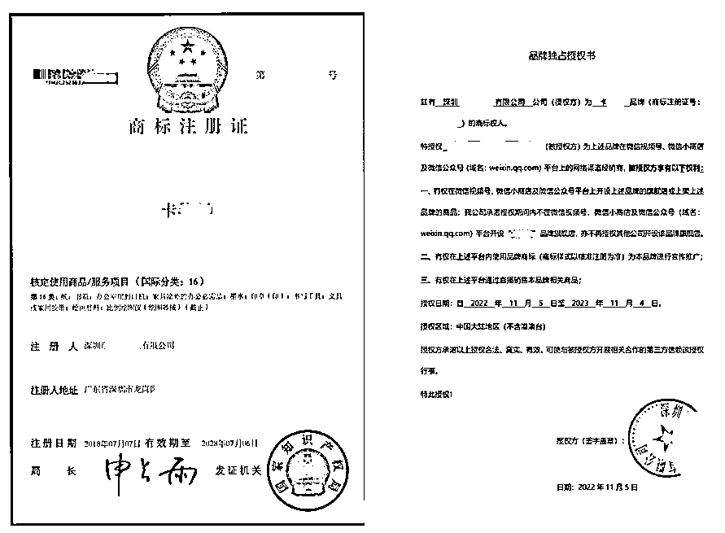  <ne-p id="u59577d01" data-lake-id="u59577d01"><ne-text id="u7712ce5c" style="color: rgb(47, 48, 52); background-color: rgb(255, 255, 255);">然后提交后还有个第 2 项资金账户审核，微信是法人的话没事直接确认就行，不是的话需要法人的微信扫码确认一下。</ne-text></ne-p> <ne-p id="ucd21f9f3" data-lake-id="ucd21f9f3"><ne-text id="u531ef64d" style="color: rgb(47, 48, 52); background-color: rgb(255, 255, 255);">提交完说是等 3-7 个工作日审核完，最近是比较慢，入驻的人多，每天去点开看一下即可。</ne-text></ne-p> <ne-p id="u0863829f" data-lake-id="u0863829f"><ne-text id="ub31854d8" style="color: rgb(47, 48, 52); background-color: rgb(255, 255, 255);">审核通过后就用电脑后端操作，扫码登陆：</ne-text>[<ne-text id="uc7cf14cd" style="color: rgb(47, 48, 52); background-color: rgb(255, 255, 255);">https://channels.weixin.qq.com/shop/home/</ne-text>](https://channels.weixin.qq.com/shop/home)</ne-p> <ne-p id="u97f4fc7a" data-lake-id="u97f4fc7a"><ne-text id="u2dfe1305" style="color: rgb(47, 48, 52); background-color: rgb(255, 255, 255);">进入后的页面跟微信小商店很雷同，缩减版的。</ne-text></ne-p> <ne-p id="ue6dd27ef" data-lake-id="ue6dd27ef"><ne-text id="ubfc9d005" style="color: rgb(47, 48, 52); background-color: rgb(255, 255, 255);">看你准备做什么类目，需要资质的话还得去申请下类目管理，店铺管理——类目管理，去传对应的资质。还有些不用资质的类目也需要去这申请一下，你上架商品的时候会有提醒。</ne-text></ne-p> <ne-p id="ube2fab47" data-lake-id="ube2fab47"><ne-card data-card-name="image" data-card-type="inline" id="LfM8s" data-event-boundary="card" style="color: rgb(47, 48, 52);">  <ne-p id="uf4ceda9a" data-lake-id="uf4ceda9a"><ne-text id="u42a2b6bf" style="color: rgb(47, 48, 52); background-color: rgb(255, 255, 255);">保证金是等你上架第一个商品时会提醒你交。要注意的是保证金交后要满 60 天后才可以提现，不确定干不要急着交。</ne-text></ne-p> <ne-p id="u8f8988c1" data-lake-id="u8f8988c1"><ne-text id="u1edf27d8" style="color: rgb(47, 48, 52); background-color: rgb(255, 255, 255);">到这店就开好了。</ne-text></ne-p> <ne-p id="u872e0b27" data-lake-id="u872e0b27"><ne-text id="u7a28320a" ne-bold="true" style="color: rgb(47, 48, 52); background-color: rgb(255, 255, 255);">2\. 选品上架</ne-text></ne-p> <ne-p id="ub8c83113" data-lake-id="ub8c83113"><ne-text id="u315c3878" style="color: rgb(47, 48, 52); background-color: rgb(255, 255, 255);">从你干之前就应该想好去开什么类目的店，想好卖什么。</ne-text></ne-p> <ne-p id="u77b320eb" data-lake-id="u77b320eb"><ne-text id="ufcd0bc49" style="color: rgb(47, 48, 52); background-color: rgb(255, 255, 255);">我的建议对于新手来说，先不用去考虑精细选品了，先去大量铺货，铺你营业执照上能铺的。</ne-text></ne-p> <ne-p id="u85de7084" data-lake-id="u85de7084"><ne-text id="u96f1ccc9" style="color: rgb(47, 48, 52); background-color: rgb(255, 255, 255);">假如没有新出视频号小店，我肯定建议去做一些有门槛需要资质的品类，比如图书、食品等等，有很多类目的品都需要资质，有些资质都是很容易搞的。我上个帖子也说了，去加一道筛选路径，提高一些壁垒，再过滤一遍竞争。</ne-text></ne-p> <ne-p id="u0af8231c" data-lake-id="u0af8231c"><ne-text id="ud047c1a6" style="color: rgb(47, 48, 52); background-color: rgb(255, 255, 255);">但是现在视频号小店刚出，入池门槛对于普通人来说又比较高，所以比较好操作的其他类目现在也是可以做的，比如大多数好物都是百货，就看谁的速度快，抢先吃肉了。我预计到年底应该能一直红利，还不会那么卷。</ne-text></ne-p> <ne-p id="u2af6c5a5" data-lake-id="u2af6c5a5"><ne-text id="u2657039e" style="color: rgb(47, 48, 52); background-color: rgb(255, 255, 255);">当然做有门槛的品类更好，尤其是本身就有资质的。</ne-text></ne-p> <ne-p id="u94c4e3ce" data-lake-id="u94c4e3ce"><ne-text id="ub2dfa1a0" style="color: rgb(47, 48, 52); background-color: rgb(255, 255, 255);">比如我，现在已经开了 5 个图书店 5 个食品店了，最近一直在忙着继续开店铺货。打个广告，若是有只做前端的找不到品的圈友可以找我合作上架，也有不少圈友一直在合作，总利润很透明，生财圈友来合作 37 分，我 3 你 7。</ne-text></ne-p> <ne-p id="u20f6eb16" data-lake-id="u20f6eb16"><ne-text id="u4830c9e7" style="color: rgb(47, 48, 52); background-color: rgb(255, 255, 255);">选品的方法有很多种，从拼多多、淘宝、阿里巴巴、抖音采集的都有。很多大佬都有开选品课。</ne-text></ne-p> <ne-p id="u0825170a" data-lake-id="u0825170a"><ne-text id="u61b1b194" style="color: rgb(47, 48, 52); background-color: rgb(255, 255, 255);">但是咱们做的是无货源，低买高卖，价格最便宜利润最高的品大多在拼多多。</ne-text></ne-p> <ne-p id="ud70f13b7" data-lake-id="ud70f13b7"><ne-text id="u9e54a430" style="color: rgb(47, 48, 52); background-color: rgb(255, 255, 255);">采集的时候就要计算好你加价多少，准备给达人开多少佣金，自己大概剩多少利润。</ne-text></ne-p> <ne-p id="u9c343e9c" data-lake-id="u9c343e9c"><ne-text id="u89bba74c" style="color: rgb(47, 48, 52); background-color: rgb(255, 255, 255);">这个自己决定，取决你想留多少利润。开达人佣金一般 20-50%都有，太低了不行没人给你带的。</ne-text></ne-p> <ne-p id="ue70ef881" data-lake-id="ue70ef881"><ne-text id="u14624b53" style="color: rgb(47, 48, 52); background-color: rgb(255, 255, 255);">然后店铺数量多了，可以做不同的品也可以做相同的品去霸屏，同一个品差异化的去做 3 个以上的链接，不同的价格不同的佣金，达人选哪个都是你的店。</ne-text></ne-p> <ne-p id="u62453c68" data-lake-id="u62453c68"><ne-text id="u7a546a38" style="color: rgb(47, 48, 52); background-color: rgb(255, 255, 255);">我也建议大家去这样多做链接，因为达人的想法都不一样，有些人就想带佣金高的不管价格，有些人会特别注意商品价格不想伤粉佣金稍微低点可以。</ne-text></ne-p> <ne-p id="u23063299" data-lake-id="u23063299"><ne-text id="uf6a74431" style="color: rgb(47, 48, 52); background-color: rgb(255, 255, 255);">对于稍微有些电商经验的，也可以稍微选一选品，选适合视频号生态的，适合中老年人群的品，可以去多刷一刷同行，点进同行店里，按销量排行，视频号后端的品一般是不需要刷销量的，大多数人也都没刷。</ne-text></ne-p> <ne-p id="u54c2b26b" data-lake-id="u54c2b26b"><ne-text id="u746b6cd0" style="color: rgb(47, 48, 52); background-color: rgb(255, 255, 255);">我做了几十个店除了刷入池外没有刷一个，而且刷销量的品也都能看得出来，所以看销量排行一般都是真实销量。然后看看同行店里哪些出单的，出单的品你都可以去找链接搬到自己的店里，然后多做几条链接，设置高中低佣金高中低价格的去打他。</ne-text></ne-p> <ne-p id="uedf85b03" data-lake-id="uedf85b03"><ne-text id="u798a2572" style="color: rgb(47, 48, 52); background-color: rgb(255, 255, 255);">说下具体采集上架吧。</ne-text></ne-p> <ne-p id="udcb59556" data-lake-id="udcb59556"><ne-text id="uafce026a" ne-bold="true" style="color: rgb(47, 48, 52); background-color: rgb(255, 255, 255);">1）先说采集拼多多，都是用软件。</ne-text></ne-p> <ne-p id="u9105b78c" data-lake-id="u9105b78c"><ne-text id="u71a3e2b9" style="color: rgb(47, 48, 52); background-color: rgb(255, 255, 255);">采集链接我们一般是用的至尊宝插件，其他插件也可以，采集网页版拼多多，批量导出商品链接。</ne-text></ne-p> <ne-p id="ub8dd7bb8" data-lake-id="ub8dd7bb8"><ne-text id="u56d715e5" style="color: rgb(47, 48, 52); background-color: rgb(255, 255, 255);">然后上架我们一直用的是服务市场的稿定商品，也就是原来的欢乐逛来搬家。</ne-text></ne-p> <ne-p id="u6b969d03" data-lake-id="u6b969d03"><ne-text id="ud3cd337e" style="color: rgb(47, 48, 52); background-color: rgb(255, 255, 255);">之前干无货源的最起码有一半同行采集的是拼多多，上各个平台，所以在拼多多出限拍风控退款后，圈内一片哀嚎。</ne-text></ne-p> <ne-p id="ubbc8870f" data-lake-id="ubbc8870f"><ne-text id="ueca78ecb" style="color: rgb(47, 48, 52); background-color: rgb(255, 255, 255);">原先，我们爆一个品，用软件从拼多多 1 个小时拍 1000 单没什么问题，太轻松了。所以现在软件用不了，拍多了会退款，就有很多人觉得玩不下去了，也确实退出了一部分人转型改行了。</ne-text></ne-p> <ne-p id="u822ceb4f" data-lake-id="u822ceb4f"><ne-text id="u3d9deb18" ne-bold="true" style="color: rgb(47, 48, 52); background-color: rgb(255, 255, 255);">2）还有不少人是采集的抖音爆款。</ne-text></ne-p> <ne-p id="u3bb5d2da" data-lake-id="u3bb5d2da"><ne-text id="u698d8632" style="color: rgb(47, 48, 52); background-color: rgb(255, 255, 255);">爆款链接可以手动去精选联盟采集，选品类按销量排行，全部手动采集抠链接，比较准。能采多少采多少，哪款出单真不一定的，往往你特意选的品可能没什么反应，无意随手上的个链接可能都一直会出单。但是要相信大量出奇迹。</ne-text></ne-p> <ne-p id="u83a6a117" data-lake-id="u83a6a117"><ne-text id="ua4f3321b" style="color: rgb(47, 48, 52); background-color: rgb(255, 255, 255);">想省事也可以用第三方工具来导链接，考古加、蝉妈妈、飞瓜都可以，不过都是付费的。</ne-text></ne-p> <ne-p id="uc4111344" data-lake-id="uc4111344"><ne-text id="u5c2e7cef" style="color: rgb(47, 48, 52); background-color: rgb(255, 255, 255);">然后有了商品链接来上架还是用稿定商品。</ne-text></ne-p> <ne-p id="u37adf144" data-lake-id="u37adf144"><ne-text id="ub94cb525" ne-bold="true" style="color: rgb(47, 48, 52); background-color: rgb(255, 255, 255);">3\. 拍单发货</ne-text></ne-p> <ne-p id="u419ce131" data-lake-id="u419ce131"><ne-text id="ua8626080" ne-bold="true" style="color: rgb(47, 48, 52); background-color: rgb(255, 255, 255);">1）拼多多拍单</ne-text></ne-p> <ne-p id="u4130e9c9" data-lake-id="u4130e9c9"><ne-text id="u5b3e86fb" style="color: rgb(47, 48, 52); background-color: rgb(255, 255, 255);">拼多多的风控退款没有办法避免。</ne-text></ne-p> <ne-p id="u5b85fbd1" data-lake-id="u5b85fbd1"><ne-text id="u22e68470" style="color: rgb(47, 48, 52); background-color: rgb(255, 255, 255);">目前还在做拼多多货源的主要采用两个方式，一是联系卖家微信走线下发货，这种适合绝大多数有单量的情况，是可以避免风控退款和平台短信的方式；二是找代拍的资源去代拍，要让出一单 2，3 块的利润。</ne-text></ne-p> <ne-p id="uee282c63" data-lake-id="uee282c63"><ne-text id="ub56493f9" style="color: rgb(47, 48, 52); background-color: rgb(255, 255, 255);">其实自己多准备些号也行，拼多多号太容易整了，微信一个号 qq 一个号手机号一个号，一个手机能整 3 个号。我们测试的一个号一天拍 10 单以内不会被退，当然不是连续批量拍，需要岔开时间，然后价格 30 以上的品一般不会被退。</ne-text></ne-p> <ne-p id="uae71223d" data-lake-id="uae71223d"><ne-text id="ubec6d3d6" style="color: rgb(47, 48, 52); background-color: rgb(255, 255, 255);">所以单子少自己拍，单量大就联系卖家走线下，基本差不多是够用的。</ne-text></ne-p> <ne-p id="ud7ca51e0" data-lake-id="ud7ca51e0"><ne-text id="u45f8a03e" style="color: rgb(47, 48, 52); background-color: rgb(255, 255, 255);">然后关于拼多多佣金，有些品会开多多进宝，假如自己拍单的话还可以吃点佣金可以走，但是要注意不要比价，不要代购（一个号 N 个地址）。</ne-text></ne-p> <ne-p id="u76678a86" data-lake-id="u76678a86"><ne-text id="u9b110a6d" style="color: rgb(47, 48, 52); background-color: rgb(255, 255, 255);">我有几万的佣金提不出来，如果有代提技术能提的可以喊我。所以想吃佣金只能走第三方，淘客平台太多了，不做具体推荐。</ne-text></ne-p> <ne-p id="u7b74acee" data-lake-id="u7b74acee"><ne-text id="ud1e85072" style="color: rgb(47, 48, 52); background-color: rgb(255, 255, 255);">然后关于拼多多现在恶心的给用户发短信，你也拒绝不了，我们做视频号后端的还好，很多大龄买家也不会找过来，太多人拍完单后甚至都找不到订单在哪，即使找过来就说我们拼多多也有店，用的拼多多系统打的单，系统自动发的短信，一般就没事了。</ne-text></ne-p> <ne-p id="uf6e6514d" data-lake-id="uf6e6514d"><ne-text id="ub83f8441" style="color: rgb(47, 48, 52); background-color: rgb(255, 255, 255);">我们还碰到过被买家投诉，然后我们处理完了后买家一直道歉，找不到撤诉的地方，也教不明白，我们最后说没关系不用撤了，对我们也没啥影响，但是不行，她非得自己要去撤诉。</ne-text></ne-p> <ne-p id="ueedb4fcb" data-lake-id="ueedb4fcb"><ne-text id="u96bb1cc7" style="color: rgb(47, 48, 52); background-color: rgb(255, 255, 255);">从这几点来看视频号电商简直太香了，买家大多比较诚实好说话，还没被其他电商平台教育。</ne-text></ne-p> <ne-p id="ue08f646e" data-lake-id="ue08f646e"><ne-text id="u001ad51c" style="color: rgb(47, 48, 52); background-color: rgb(255, 255, 255);">还有我们平时的客服量也是很少的，我们算过数据，客服量大概是订单量的 5%左右。</ne-text></ne-p> <ne-p id="u9f6f4d42" data-lake-id="u9f6f4d42"><ne-text id="u0e72082c" ne-bold="true" style="color: rgb(47, 48, 52); background-color: rgb(255, 255, 255);">2）抖店拍单</ne-text></ne-p> <ne-p id="ua20dae41" data-lake-id="ua20dae41"><ne-text id="u7a967d1c" style="color: rgb(47, 48, 52); background-color: rgb(255, 255, 255);">假如你采集的抖音链接，那只能去抖店拍，而且你采集的时候肯定也是根据精选联盟佣金来计算加价和利润的，所以必须要拿佣金。</ne-text></ne-p> <ne-p id="u4cd08a45" data-lake-id="u4cd08a45"><ne-text id="u4ab57b5d" ne-bold="true" style="color: rgb(47, 48, 52); background-color: rgb(255, 255, 255);">（1）自己开橱窗</ne-text></ne-p> <ne-p id="ua55b1eb0" data-lake-id="ua55b1eb0"><ne-text id="u56082f5a" style="color: rgb(47, 48, 52); background-color: rgb(255, 255, 255);">小号去自己橱窗里拍。直接淘宝找 0 粉代开橱窗的就行，不过据说最近限制了暂时开不了了，也可以刷 1000 粉自己开，我们后边一直是刷的千粉。</ne-text></ne-p> <ne-p id="u8b820e0f" data-lake-id="u8b820e0f"><ne-text id="uf6a364c1" style="color: rgb(47, 48, 52); background-color: rgb(255, 255, 255);">刷粉有个好处就是能开通团购带货，假如做无货源本地生活品的只能刷粉了，我只说这一句，万物皆可无货源倒卖。懂的大家自己去重视下这个无货源方向的蓝海。</ne-text></ne-p> <ne-p id="uc4ccde2f" data-lake-id="uc4ccde2f"><ne-text id="u8ab6621b" style="color: rgb(47, 48, 52); background-color: rgb(255, 255, 255);">自己拍自己的橱窗，从 8 月开始就会风控了。你不可能一单一个号，所以多拍了会封橱窗，平均一个橱窗大概存活 3-5 天，封后佣金提完大概要等 1 个多月后，也就是 1 个多月后才能注销再开。</ne-text></ne-p> <ne-p id="u08c10b29" data-lake-id="u08c10b29"><ne-text id="ud54a290d" style="color: rgb(47, 48, 52); background-color: rgb(255, 255, 255);">所以就要很多橱窗来倒开时间操作，每个橱窗都是一个实名，有这个能力的就自己搞，我们搞了 20 来个橱窗。</ne-text></ne-p> <ne-p id="u8c8922c6" data-lake-id="u8c8922c6"><ne-text id="udc10d97d" ne-bold="true" style="color: rgb(47, 48, 52); background-color: rgb(255, 255, 255);">（2）第三方</ne-text></ne-p> <ne-p id="ufa4b7d0e" data-lake-id="ufa4b7d0e"><ne-text id="u72c7c726" style="color: rgb(47, 48, 52); background-color: rgb(255, 255, 255);">橱窗数量不够的也没关系，那就走第三方，让出点利润。</ne-text></ne-p> <ne-p id="ufaf49bcf" data-lake-id="ufaf49bcf"><ne-text id="ua4e50a77" style="color: rgb(47, 48, 52); background-color: rgb(255, 255, 255);">反正拍单的小号又不用实名。</ne-text></ne-p> <ne-p id="ued8aee1a" data-lake-id="ued8aee1a"><ne-text id="u421733f3" style="color: rgb(47, 48, 52); background-color: rgb(255, 255, 255);">同理多多进宝。</ne-text></ne-p> <ne-p id="ubc12fca3" data-lake-id="ubc12fca3"><ne-text id="u67050a5c" ne-bold="true" style="color: rgb(47, 48, 52); background-color: rgb(255, 255, 255);">3）其他平台拍单</ne-text></ne-p> <ne-p id="ube889846" data-lake-id="ube889846"><ne-text id="uf11ccc95" style="color: rgb(47, 48, 52); background-color: rgb(255, 255, 255);">其他平台随意拍，货源价格合适就没什么风控。我们拍的不多，一般出现采集链接价格或者佣金变动我们才会到处找货。</ne-text></ne-p> <ne-p id="uc0005a07" data-lake-id="uc0005a07"><ne-text id="u4391b756" ne-bold="true" style="color: rgb(47, 48, 52); background-color: rgb(255, 255, 255);">四、其他关键点</ne-text></ne-p> <ne-p id="u2dec8d41" data-lake-id="u2dec8d41"><ne-text id="ubd71c1cc" style="color: rgb(47, 48, 52); background-color: rgb(255, 255, 255);">先再补充几个关键点：</ne-text></ne-p> <ne-p id="u2c2d090d" data-lake-id="u2c2d090d"><ne-text id="u71d7166b" style="color: rgb(47, 48, 52); background-color: rgb(255, 255, 255);">1\. 每个店铺上架 1000 个就行了，因为优选联盟只能进 1000 个。</ne-text></ne-p> <ne-p id="uc0bacd6b" data-lake-id="uc0bacd6b"><ne-text id="uc5427723" style="color: rgb(47, 48, 52); background-color: rgb(255, 255, 255);">2\. 一个企业可以开 5 个小店，一个微信只可开一个。</ne-text></ne-p> <ne-p id="ud38b867e" data-lake-id="ud38b867e"><ne-text id="ub2e5b4a2" style="color: rgb(47, 48, 52); background-color: rgb(255, 255, 255);">3\. 一个人工可以负责 5-10 个店，从客服到拍单发货，从上品到维护优化，特别熟练也可以负责 10+，因为我这边给员工们按业绩提成，所以给他们按人头包的店。</ne-text></ne-p> <ne-p id="u49ef32fa" data-lake-id="u49ef32fa"><ne-text id="u0993db90" style="color: rgb(47, 48, 52); background-color: rgb(255, 255, 255);">4\. 小店开完后暂不支持退店注销，开成功之前可以注销。开店成功后想注销只能去注销视频号，小店也会随之注销。</ne-text></ne-p> <ne-p id="u01fe438d" data-lake-id="u01fe438d"><ne-text id="u933a72d7" style="color: rgb(47, 48, 52); background-color: rgb(255, 255, 255);">5\. 小店客服只能是企业微信，一个企业微信可以绑 N 个小店。但是正常的询单看不到买家信息，可以服务市场买个客服工具。</ne-text></ne-p> <ne-p id="u5452e984" data-lake-id="u5452e984"><ne-text id="ua92ddbd6" style="color: rgb(47, 48, 52); background-color: rgb(255, 255, 255);">6\. 小店延迟发货可以选择最下边的报备，但是最近报备没什么用，忙不过来审核。</ne-text></ne-p> <ne-p id="u23d2126d" data-lake-id="u23d2126d"><ne-text id="uac17e10f" style="color: rgb(47, 48, 52); background-color: rgb(255, 255, 255);">7\. 小店暂时不支持运费险，估计后边会加。现在想要运费险只能去服务市场看看相关工具，据说可以，我没用，无货源的运费险是鸡肋。</ne-text></ne-p> <ne-p id="u15f7872f" data-lake-id="u15f7872f"><ne-text id="u78233baa" style="color: rgb(47, 48, 52); background-color: rgb(255, 255, 255);">8\. 目前无法无物流发货，必须上传单号。</ne-text></ne-p> <ne-p id="ud28ab9de" data-lake-id="ud28ab9de"><ne-text id="ue1781b65" style="color: rgb(47, 48, 52); background-color: rgb(255, 255, 255);">以上大概就是视频号后端无货源店群的玩法，也是今年我这边主要的收入。</ne-text></ne-p> <ne-p id="u8fad689b" data-lake-id="u8fad689b"><ne-text id="u3c00c3f4" style="color: rgb(47, 48, 52); background-color: rgb(255, 255, 255);">但是无货源远不止视频号，所有的电商平台都能玩。</ne-text></ne-p> <ne-p id="ue7c7b6eb" data-lake-id="ue7c7b6eb"><ne-text id="ud64be81d" style="color: rgb(47, 48, 52); background-color: rgb(255, 255, 255);">即使难度最大的抖店也还是有在玩的，做精细化运营，在 99%的同行退出了抖店，我相信还在抖店坚持无货源的现在一定做的很滋润了。</ne-text></ne-p> <ne-p id="uf6429b86" data-lake-id="uf6429b86"><ne-text id="ud3726c20" style="color: rgb(47, 48, 52); background-color: rgb(255, 255, 255);">当然了，想都去做的话是忙不过来的，我们目前手上还在做的有美团电商和小红书。</ne-text></ne-p> <ne-p id="u04c09741" data-lake-id="u04c09741"><ne-text id="u06ce14ea" style="color: rgb(47, 48, 52); background-color: rgb(255, 255, 255);">美团电商是看前段时间我们青岛的圈友刘家齐分享的帖子去测试的，暂时还没取得成绩，刚开始。</ne-text></ne-p> <ne-p id="u3107e4b8" data-lake-id="u3107e4b8"><ne-text id="u7f05bfe1" style="color: rgb(47, 48, 52); background-color: rgb(255, 255, 255);">小红书的后端，给我的感觉太像今年年初的视频号后端了，我有理由相信这里边存在红利，我刚开了个店交了 2 万保证金还没开始弄，这是下一步紧接着的计划，等有进展我再来汇报。最近全在忙视频号小店了。</ne-text></ne-p> <ne-p id="u897e464b" data-lake-id="u897e464b"><ne-text id="ue2c25353" style="color: rgb(47, 48, 52); background-color: rgb(255, 255, 255);">另外还有 qq 小世界的后端，一个被大家忽略的地方。我其实已经测试了一个店，但是一些意外被三级违规了，所以暂时不准备通过第三方去了。我会保持关注等 qq 自己的小世界店铺出来再进场。</ne-text></ne-p> <ne-p id="u1830c6b1" data-lake-id="u1830c6b1"><ne-text id="udea6e3a0" style="color: rgb(47, 48, 52); background-color: rgb(255, 255, 255);">大家有问题不用加我，我不带培训也不卖课，可以直接评论区讨论，让其他圈友也看看，应该会有重复问题省的我重复答疑。</ne-text></ne-p> <ne-p id="u0ecf5b97" data-lake-id="u0ecf5b97"><ne-text id="ub5a532a4" style="color: rgb(47, 48, 52); background-color: rgb(255, 255, 255);">有需要合作的可以联系我，有更深的交流也可以喊我，相互学习使人进步。</ne-text></ne-p> <ne-p id="u75b8a534" data-lake-id="u75b8a534"><ne-text id="u1c694921" style="color: rgb(47, 48, 52); background-color: rgb(255, 255, 255);">完。</ne-text></ne-p> <ne-h2 id="abc705eb" data-lake-id="abc705eb"><ne-heading-ext><ne-heading-anchor></ne-heading-anchor><ne-heading-fold></ne-heading-fold></ne-heading-ext><ne-heading-content><ne-text id="u803afb8a" style="color: rgb(47, 48, 52); background-color: rgb(255, 255, 255);">（71 赞）《10 天时间，视频号从 0 到变现 6000+，到场观过万，我做了什么》</ne-text></ne-heading-content></ne-h2> <ne-p id="u53a8d3b3" data-lake-id="u53a8d3b3"><ne-text id="u64bef3f0" style="color: rgb(47, 48, 52); background-color: rgb(255, 255, 255);">hello，我是姚麻。很久没在生财正儿八经写过分享了，最近刚脱坑了多多视频，于是就开始测视频号，是从 15 号开始有这个想法了，17 号开始发的第一条视频，截止到昨天晚上，也就是 27 号，变现正好 6201 块，最高播放 310W。然后昨天晚上的直播，也正好是第一次场观破万。趁着今天发什么视频都是 0 播，直播也不进人，又正好接到通知上船了，想着来个新的开始，就和大家一起来聊聊这十天里，我到底做了什么，以及关于遇到的一些问题的思考。</ne-text></ne-p> <ne-p id="u0ef786ab" data-lake-id="u0ef786ab"><ne-text id="u198de65b" style="color: rgb(47, 48, 52); background-color: rgb(255, 255, 255);">对了，这里要先特别特别感谢李诚老师，李诚老师给我解答了非常多的疑问，尽管上期航海我并没有上船，但李诚老师还是坦然的面对了我的“骚扰”，真的特别感谢，等佣金到手了高低先给老师来个大红包哈哈哈。</ne-text></ne-p> <ne-p id="u4eec0528" data-lake-id="u4eec0528"><ne-text id="ud748ee5a" style="color: rgb(47, 48, 52); background-color: rgb(255, 255, 255);">因为前面就是在星球写的，前面写完直接发了一次，但是被直接删了，估计触发了什么敏感词，所以我给移到飞书去了，就麻烦点链接查看吧</ne-text></ne-p> <ne-p id="u0067afed" data-lake-id="u0067afed">[<ne-text id="u4f29813d" style="color: rgb(47, 48, 52); background-color: rgb(255, 255, 255);">https://fgsd3oxjki.feishu.cn/docx/Lg2vd5GWHoqhBbxuT5LcThEpncb</ne-text>](https://fgsd3oxjki.feishu.cn/docx/Lg2vd5GWHoqhBbxuT5LcThEpncb)</ne-p> <ne-h2 id="a2fd77f5" data-lake-id="a2fd77f5"><ne-heading-ext><ne-heading-anchor></ne-heading-anchor><ne-heading-fold></ne-heading-fold></ne-heading-ext><ne-heading-content><ne-text id="u88ff22ff" style="color: rgb(47, 48, 52); background-color: rgb(255, 255, 255);">（33 赞）《动员 80 万宝妈，一起做童书社群分销，点击或购买即可参与，保证供应链强度，2 年成为行业头部的打法经验分享》</ne-text></ne-heading-content></ne-h2> <ne-p id="u0223a593" data-lake-id="u0223a593"><ne-text id="u8c949136" style="color: rgb(47, 48, 52); background-color: rgb(255, 255, 255);">宝妈一直都是商家最想争夺的人群，社群分销大家普遍感觉增长很猛但是比较重，比较复杂。</ne-text></ne-p> <ne-p id="u8d1afb04" data-lake-id="u8d1afb04"><ne-text id="u82fc3826" style="color: rgb(47, 48, 52); background-color: rgb(255, 255, 255);">行业里很少有人出来讲社群分销，一来是这个打法太猛，头部的厉害的都在埋头挣钱，动不动就是百亿 GMV（比如蜂享家）出来分享没有任何动力。</ne-text></ne-p> <ne-p id="u85e8bc89" data-lake-id="u85e8bc89"><ne-text id="uff1d50e8" style="color: rgb(47, 48, 52); background-color: rgb(255, 255, 255);">二来，小的那些，很多设计不正规，也不敢公开宣传。所以我自己在学习摸索的过程中，很少在外部发现相关内容的干货。</ne-text></ne-p> <ne-p id="ud4bd9265" data-lake-id="ud4bd9265"><ne-text id="u9ef9b837" style="color: rgb(47, 48, 52); background-color: rgb(255, 255, 255);">而且大家现在都关注短视频、直播这些流量风口，社群这块属于平稳发展，关注点不多。</ne-text></ne-p> <ne-p id="u92f68ecd" data-lake-id="u92f68ecd"><ne-text id="u33a7c0bd" style="color: rgb(47, 48, 52); background-color: rgb(255, 255, 255);">生财圈友好，我是新人陈欢，书里有品联合创始人，14 年商业顾问，《新零售进化论》作者。</ne-text></ne-p> <ne-p id="u82314aec" data-lake-id="u82314aec"><ne-text id="u4a681b99" style="color: rgb(47, 48, 52); background-color: rgb(255, 255, 255);">书里有品属于童书社群分销平台，2020 年 4 月上线，第一个月没有花一分钱投放，进来 10 万宝妈和老师做分销员。</ne-text></ne-p> <ne-p id="u38e97bd2" data-lake-id="u38e97bd2"><ne-text id="u244ee729" style="color: rgb(47, 48, 52); background-color: rgb(255, 255, 255);">目前是行业头部的童书分销平台，80 万+的分销员（我们称为阅读推广人），200 多家出版社入驻直发，1.5 亿销售额，4 轮融资（掌阅集团等图书产业上下游）。今年开始给蜂享家，万物心选，云货优选、喜马拉雅供货。</ne-text></ne-p> <ne-p id="ud6e08516" data-lake-id="ud6e08516"><ne-text id="udbabe4ab" style="color: rgb(47, 48, 52); background-color: rgb(255, 255, 255);">接下来我会毫无保留的把书里有品，0 预算单月 10 万分销员，30 人组织 80 万+宝妈卖书 2 年内成为行业头部的打法经验分享给大家，希望能有帮助和启发。</ne-text></ne-p> <ne-p id="u1e6de34f" data-lake-id="u1e6de34f"><ne-card data-card-name="image" data-card-type="inline" id="juvsF" data-event-boundary="card" style="color: rgb(47, 48, 52);">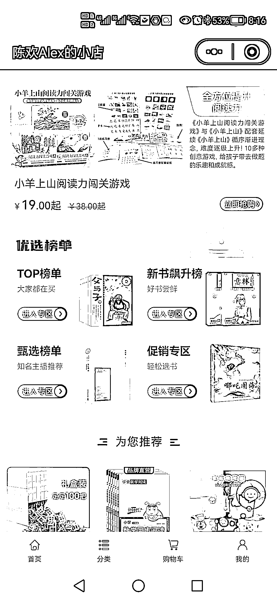  <ne-p id="ub18ff9e1" data-lake-id="ub18ff9e1"><ne-card data-card-name="image" data-card-type="inline" id="EQi2a" data-event-boundary="card" style="color: rgb(47, 48, 52);">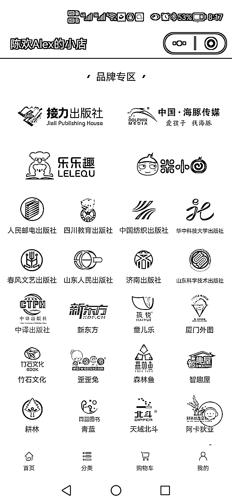  <ne-p id="u1313ea4e" data-lake-id="u1313ea4e"><ne-text id="u693028bb" style="color: rgb(47, 48, 52); background-color: rgb(255, 255, 255);">这块的内容可能对三类人有些许帮助，你可以对照下：</ne-text></ne-p> <ne-p id="u231e54f7" data-lake-id="u231e54f7"><ne-text id="uf7dfcc1e" style="color: rgb(47, 48, 52); background-color: rgb(255, 255, 255);">第一类人：做女性、宝妈生意的人，几乎是脱不开社群，那么，宝妈的业务如何设计和组织？</ne-text></ne-p> <ne-p id="ucac345f5" data-lake-id="ucac345f5"><ne-text id="ud18b3464" style="color: rgb(47, 48, 52); background-color: rgb(255, 255, 255);">第二类人：有私域流量的人，你的生意如何嫁接社群分销杠杆快速放大？由自己卖变成大家卖。</ne-text></ne-p> <ne-p id="uec87a051" data-lake-id="uec87a051"><ne-text id="u8747a61c" style="color: rgb(47, 48, 52); background-color: rgb(255, 255, 255);">第三类人：有优质货源的人，以什么样的姿势跟社群分销生态做生意，能快速起飞远超同行？</ne-text></ne-p> <ne-p id="u4a528ec1" data-lake-id="u4a528ec1"><ne-text id="u02bbdea4" style="color: rgb(47, 48, 52); background-color: rgb(255, 255, 255);">老实说，社群分销这块，我们也踩过很多大坑，交了几百上千万的“学费”，甚至差点全军覆没。</ne-text></ne-p> <ne-p id="ue8b67759" data-lake-id="ue8b67759"><ne-text id="u91e06ac9" style="color: rgb(47, 48, 52); background-color: rgb(255, 255, 255);">有些我之前看过的分享说得天花乱坠的内容，实际操作中完全没效果，甚至还埋了很多雷，但是听着逻辑上很顺。</ne-text></ne-p> <ne-p id="u4a874b06" data-lake-id="u4a874b06"><ne-text id="ub120bf6c" style="color: rgb(47, 48, 52); background-color: rgb(255, 255, 255);">我的内容有些和主流说法不同，请自己批判性甄别。仅为个人观点，不接受理论上的掰扯。</ne-text></ne-p> <ne-p id="u63f8c4bd" data-lake-id="u63f8c4bd"><ne-text id="u35a5c67e" style="color: rgb(47, 48, 52); background-color: rgb(255, 255, 255);">另外分享中的成绩仰仗合伙人靠谱，团队给力，我仅作为代表发言而已。</ne-text></ne-p> <ne-p id="u1af24698" data-lake-id="u1af24698"><ne-text id="udc64fb4e" style="color: rgb(47, 48, 52); background-color: rgb(255, 255, 255);">为了方便大家，这是全文的目录：</ne-text></ne-p> <ne-p id="ucb0cc294" data-lake-id="ucb0cc294"><ne-text id="u3a072b78" ne-bold="true" style="color: rgb(47, 48, 52); background-color: rgb(255, 255, 255);">1、冷启动怎么做：0 预算一个月进来 10 万分销员，怎么做到的</ne-text></ne-p> <ne-p id="ua5b067f8" data-lake-id="ua5b067f8"><ne-text id="u6a1b7ea8" ne-bold="true" style="color: rgb(47, 48, 52); background-color: rgb(255, 255, 255);">2、社群分销如何设计：核心增长公式</ne-text></ne-p> <ne-p id="ua5f150e1" data-lake-id="ua5f150e1"><ne-text id="u53235601" ne-bold="true" style="color: rgb(47, 48, 52); background-color: rgb(255, 255, 255);">3、去哪里找分销员和团长？</ne-text></ne-p> <ne-p id="ua2633642" data-lake-id="ua2633642"><ne-text id="u99c45841" ne-bold="true" style="color: rgb(47, 48, 52); background-color: rgb(255, 255, 255);">4、如何调动团长的积极性？</ne-text></ne-p> <ne-p id="u1c9b9450" data-lake-id="u1c9b9450"><ne-text id="u966a6c68" ne-bold="true" style="color: rgb(47, 48, 52); background-color: rgb(255, 255, 255);">5、快速增长期如何把握关键？</ne-text></ne-p> <ne-p id="uca5205b3" data-lake-id="uca5205b3"><ne-text id="u8770ba75" ne-bold="true" style="color: rgb(47, 48, 52); background-color: rgb(255, 255, 255);">6、你的业务如何嫁接社群分销？</ne-text></ne-p> <ne-p id="udf6ad657" data-lake-id="udf6ad657"><ne-text id="u90aab06f" style="color: rgb(47, 48, 52); background-color: rgb(255, 255, 255);">*名词解释</ne-text></ne-p> <ne-p id="ua82fd63c" data-lake-id="ua82fd63c"><ne-text id="u9baab3b6" style="color: rgb(47, 48, 52); background-color: rgb(255, 255, 255);">分销员：以分销作为副业的用户；</ne-text></ne-p> <ne-p id="ud17826a4" data-lake-id="ud17826a4"><ne-text id="uc10b90ff" style="color: rgb(47, 48, 52); background-color: rgb(255, 255, 255);">团长：组织分销活动的团队负责人，分销员达到一定业绩升级成为团长。</ne-text></ne-p> <ne-h1 id="90b6bd47" data-lake-id="90b6bd47"><ne-heading-ext><ne-heading-anchor></ne-heading-anchor><ne-heading-fold></ne-heading-fold></ne-heading-ext><ne-heading-content><ne-text id="u632c6dbb" style="color: rgb(47, 48, 52); background-color: rgb(255, 255, 255);">一、冷启动怎么做：0 预算一个月进来 10 万分销员，怎么做到的</ne-text></ne-heading-content></ne-h1> <ne-p id="u4b44c685" data-lake-id="u4b44c685"><ne-text id="ua74f1fea" style="color: rgb(47, 48, 52); background-color: rgb(255, 255, 255);">书里有品是 2020 年 4 月上线，正值疫情期间，当时公司只有 4 个全职员工，两位合伙人，一位有多年的图书行业经验和供应链资源，另外一位来自阿里多年有电商运营经验。</ne-text></ne-p> <ne-p id="u66ccecbe" data-lake-id="u66ccecbe"><ne-text id="ubcbca1cc" style="color: rgb(47, 48, 52); background-color: rgb(255, 255, 255);">最开始找到一些性价比很好的图书货源，通过有赞平台自带的分销体系，4 个员工发朋友圈，很快有几个专门做图书的群主也跟着发，1 个月不到就进来 10 万分销员（那时人人都是分销员）。</ne-text></ne-p> <ne-p id="uf520156e" data-lake-id="uf520156e"><ne-text id="u9c156c63" style="color: rgb(47, 48, 52); background-color: rgb(255, 255, 255);">这就是社群分销的特点。只要触达到了一两个核心节点，应该是将会引起指数级裂变。</ne-text></ne-p> <ne-p id="ubf20d59f" data-lake-id="ubf20d59f"><ne-text id="u39a04ad6" style="color: rgb(47, 48, 52); background-color: rgb(255, 255, 255);">当时疫情很多线下的绘本馆没有生意，老板正愁着如何养员工，突然发现可以在线上卖书，毫不犹豫地加入，带来了第一批优质用户。</ne-text></ne-p> <ne-p id="u8eafc1bb" data-lake-id="u8eafc1bb"><ne-text id="u4abbce38" style="color: rgb(47, 48, 52); background-color: rgb(255, 255, 255);">通过复盘分析，10 万人里大部分都没有做过其他分销副业，属于儿童教育赛道内的意见领袖。比如南京有一位知名的作文老师，这个发了一条朋友圈后续带来了过万的用户。</ne-text></ne-p> <ne-p id="ue60adc59" data-lake-id="ue60adc59"><ne-text id="ude1cf677" style="color: rgb(47, 48, 52); background-color: rgb(255, 255, 255);">回过头来复盘社群分销冷启动的关键：</ne-text></ne-p> <ne-h2 id="2f7b6a3d" data-lake-id="2f7b6a3d"><ne-heading-ext><ne-heading-anchor></ne-heading-anchor><ne-heading-fold></ne-heading-fold></ne-heading-ext><ne-heading-content><ne-text id="u4b6bd41c" ne-bold="true" style="color: rgb(47, 48, 52); background-color: rgb(255, 255, 255);">1.1 社群分销最重要的不是运营，而是产品，是供应链的强度和差异化</ne-text></ne-heading-content></ne-h2> <ne-p id="ud6857078" data-lake-id="ud6857078"><ne-text id="u92f1288c" style="color: rgb(47, 48, 52); background-color: rgb(255, 255, 255);">冷启动阶段一定要选择标品，大家奔着性价比进来，明显的优惠无需解释。</ne-text></ne-p> <ne-p id="u79cfca92" data-lake-id="u79cfca92"><ne-text id="ufe4d7076" style="color: rgb(47, 48, 52); background-color: rgb(255, 255, 255);">如果你选择的是需要教育客户的高客单产品，分销这把火很难点起来。我们选择的儿童图书这个赛道，有一定差异化，没有巨头。</ne-text></ne-p> <ne-p id="uab631944" data-lake-id="uab631944"><ne-text id="ud14c350d" style="color: rgb(47, 48, 52); background-color: rgb(255, 255, 255);">试想一下，如果你卖的是百货、水果等产品，市面上已经有大量相关的平台，但是如果是这样子，大家只会购买，并不愿意加入成为推广员。</ne-text></ne-p> <ne-h2 id="1c18569f" data-lake-id="1c18569f"><ne-heading-ext><ne-heading-anchor></ne-heading-anchor><ne-heading-fold></ne-heading-fold></ne-heading-ext><ne-heading-content><ne-text id="ue225f846" ne-bold="true" style="color: rgb(47, 48, 52); background-color: rgb(255, 255, 255);">1.2 要做社交形象加分的产品，让用户发朋友圈私聊没有压力</ne-text></ne-heading-content></ne-h2> <ne-p id="u08149fd3" data-lake-id="u08149fd3"><ne-text id="u10a55812" style="color: rgb(47, 48, 52); background-color: rgb(255, 255, 255);">发圈动力=佣金/设计交压力。</ne-text></ne-p> <ne-p id="u0daae5ac" data-lake-id="u0daae5ac"><ne-text id="uc1324872" style="color: rgb(47, 48, 52); background-color: rgb(255, 255, 255);">社群分销主要依赖推广员发朋友圈、发社群和私聊。挖掘产品的社交货币价值。</ne-text></ne-p> <ne-p id="uba18939f" data-lake-id="uba18939f"><ne-text id="u36360ffd" style="color: rgb(47, 48, 52); background-color: rgb(255, 255, 255);">发朋友圈介绍好书，展示出的是爱阅读爱学习爱教育的好妈妈形象，正向价值观，所以大家都疯狂发圈。</ne-text></ne-p> <ne-p id="ud2db8b26" data-lake-id="ud2db8b26"><ne-text id="u52bc4c02" style="color: rgb(47, 48, 52); background-color: rgb(255, 255, 255);">如果你的产品是服装、美妆、食品等品类，也可以尝试从健康生活方式的角度挖掘，而不是单纯发产品。</ne-text></ne-p> <ne-h2 id="9f669728" data-lake-id="9f669728"><ne-heading-ext><ne-heading-anchor></ne-heading-anchor><ne-heading-fold></ne-heading-fold></ne-heading-ext><ne-heading-content><ne-text id="ud915f0eb" ne-bold="true" style="color: rgb(47, 48, 52); background-color: rgb(255, 255, 255);">1.3 初始流量要求并不高，关键是找到核心人群的传播节点</ne-text></ne-heading-content></ne-h2> <ne-p id="u80ae0052" data-lake-id="u80ae0052"><ne-text id="u54c97041" style="color: rgb(47, 48, 52); background-color: rgb(255, 255, 255);">很多人以为社群分销需要有很高的私域流量积累。事实上。最关键的是找到那么几个意见领袖作为传播节点。</ne-text></ne-p> <ne-p id="u4d14cb36" data-lake-id="u4d14cb36"><ne-text id="u06d4b460" style="color: rgb(47, 48, 52); background-color: rgb(255, 255, 255);">我们尝试过把同样的模式复制给其他有私域流量的社群，效果相差很大。</ne-text></ne-p> <ne-p id="u8624bccb" data-lake-id="u8624bccb"><ne-text id="u119b884d" style="color: rgb(47, 48, 52); background-color: rgb(255, 255, 255);">有一些社群人数多，但全都是普通消费者，只有购买转化，没有裂变传播。</ne-text></ne-p> <ne-p id="uedf7407b" data-lake-id="uedf7407b"><ne-text id="u22a9076d" style="color: rgb(47, 48, 52); background-color: rgb(255, 255, 255);">而有一些社群虽然人不多，但能够筛选出意见领袖，裂变效果就很好。</ne-text></ne-p> <ne-h1 id="1ac0460a" data-lake-id="1ac0460a"><ne-heading-ext><ne-heading-anchor></ne-heading-anchor><ne-heading-fold></ne-heading-fold></ne-heading-ext><ne-heading-content><ne-text id="u6779ef5a" ne-bold="true" style="color: rgb(47, 48, 52); background-color: rgb(255, 255, 255);">二、社群分销如何设计：核心增长公式</ne-text></ne-heading-content></ne-h1> <ne-h2 id="28672dc4" data-lake-id="28672dc4"><ne-heading-ext><ne-heading-anchor></ne-heading-anchor><ne-heading-fold></ne-heading-fold></ne-heading-ext><ne-heading-content><ne-text id="u0d846636" ne-bold="true" style="color: rgb(47, 48, 52); background-color: rgb(255, 255, 255);">2.1 收入增长=供应链强度 X 顶层设计 X 动员能力</ne-text></ne-heading-content></ne-h2> <ne-p id="ucb85c184" data-lake-id="ucb85c184"><ne-text id="udf19e5b6" style="color: rgb(47, 48, 52); background-color: rgb(255, 255, 255);">供应链强度：你的产品是否有优势。标准品=更低的价格。非标准品=发圈转化率（同样是发一条朋友圈，有多少人看完以后愿意购买）</ne-text></ne-p> <ne-p id="uf1fdf90f" data-lake-id="uf1fdf90f"><ne-text id="uc3c666f3" style="color: rgb(47, 48, 52); background-color: rgb(255, 255, 255);">顶层设计：如何确认关系绑定，商品销售的流程，佣金分配机制，分销员升级机制等。</ne-text></ne-p> <ne-p id="u028e7c4e" data-lake-id="u028e7c4e"><ne-text id="u758e79eb" style="color: rgb(47, 48, 52); background-color: rgb(255, 255, 255);">动员能力：你对分销员团队的影响力。在群里发一条信息，有多少人会做动作。</ne-text></ne-p> <ne-p id="u208dedcf" data-lake-id="u208dedcf"><ne-text id="u5e575411" style="color: rgb(47, 48, 52); background-color: rgb(255, 255, 255);">我结合书里有品的案例，具体来拆解。</ne-text></ne-p> <ne-h2 id="8a935476" data-lake-id="8a935476"><ne-heading-ext><ne-heading-anchor></ne-heading-anchor><ne-heading-fold></ne-heading-fold></ne-heading-ext><ne-heading-content><ne-text id="ubcc935cd" ne-bold="true" style="color: rgb(47, 48, 52); background-color: rgb(255, 255, 255);">2.2 供应链强度</ne-text></ne-heading-content></ne-h2> <ne-p id="ua01ff0b1" data-lake-id="ua01ff0b1"><ne-text id="u37673cc8" style="color: rgb(47, 48, 52); background-color: rgb(255, 255, 255);">供应链强度没什么好说的。先有鸡先有蛋的问题。销售能力不强，没人愿意给低价，拿不到低价，无法吸引分销员。</ne-text></ne-p> <ne-p id="u941b20ac" data-lake-id="u941b20ac"><ne-text id="u50d7a853" style="color: rgb(47, 48, 52); background-color: rgb(255, 255, 255);">怎么办呢？</ne-text></ne-p> <ne-p id="u74bd3a38" data-lake-id="u74bd3a38"><ne-text id="ucf946530" style="color: rgb(47, 48, 52); background-color: rgb(255, 255, 255);">我们的做法是通过集中力量卖爆品，向供应链证明实力。</ne-text></ne-p> <ne-p id="ub8e25363" data-lake-id="ub8e25363"><ne-text id="uaf2da928" style="color: rgb(47, 48, 52); background-color: rgb(255, 255, 255);">前期假设一个月可以卖 100 万，如果分配在 100 个单品上，每个产品只能卖 1 万，供应商没啥反应。</ne-text></ne-p> <ne-p id="ue981ea12" data-lake-id="ue981ea12"><ne-text id="u7bdc586e" style="color: rgb(47, 48, 52); background-color: rgb(255, 255, 255);">但是如果你把其中 80 万的销量集中在 8 个产品，每个产品有 10 万的销量，虽然总销售额没有变化，但供应商马上愿意给更好的价格政策。大家都需要做爆品。</ne-text></ne-p> <ne-p id="u11d4d5b0" data-lake-id="u11d4d5b0"><ne-text id="ued5d4618" style="color: rgb(47, 48, 52); background-color: rgb(255, 255, 255);">怎样找出爆品？</ne-text></ne-p> <ne-p id="u00feda1a" data-lake-id="u00feda1a"><ne-text id="ud9933ea9" style="color: rgb(47, 48, 52); background-color: rgb(255, 255, 255);">发掘爆品需要对行业 对用户的深度洞察。</ne-text></ne-p> <ne-p id="u66b46026" data-lake-id="u66b46026"><ne-text id="u82539395" style="color: rgb(47, 48, 52); background-color: rgb(255, 255, 255);">如果是复杂品，需要讲故事。</ne-text></ne-p> <ne-p id="u25a3868f" data-lake-id="u25a3868f"><ne-text id="ufea419d0" style="color: rgb(47, 48, 52); background-color: rgb(255, 255, 255);">比如课程、保健品、不够出名的美妆个护。这个故事一般不需要分销平台来讲。但你需要鉴别出，这个故事消费者是否买账。</ne-text></ne-p> <ne-p id="uc8dc9589" data-lake-id="uc8dc9589"><ne-text id="u18589487" style="color: rgb(47, 48, 52); background-color: rgb(255, 255, 255);">举例来说，东奥会前夕，我们卖一套冬奥主题收藏邮票，这个故事就很应景，销量不错，押中了爆品。</ne-text></ne-p> <ne-p id="u7ebf071c" data-lake-id="u7ebf071c"><ne-text id="ub4ca7720" style="color: rgb(47, 48, 52); background-color: rgb(255, 255, 255);">如果是简单品，也是消费者一眼能看懂的超高性价比产品，比如 15 元对标市面 49 元的积木，根据心理价位和实际价格的价差，越大越爆。</ne-text></ne-p> <ne-p id="ub12032ed" data-lake-id="ub12032ed"><ne-text id="u43ca4c92" style="color: rgb(47, 48, 52); background-color: rgb(255, 255, 255);">另外我们会提供低价买样和免费送样的机会给大团长，看看反馈。</ne-text></ne-p> <ne-p id="u39987f34" data-lake-id="u39987f34"><ne-text id="uebf99ec9" style="color: rgb(47, 48, 52); background-color: rgb(255, 255, 255);">当然，更省事的做法是，从市面上已经爆过一次的产品中，第一时间谈回来 ，效果非常好。这种需要靠销量和平台实力才能拿得到好价格。</ne-text></ne-p> <ne-h2 id="1fd0c0b7" data-lake-id="1fd0c0b7"><ne-heading-ext><ne-heading-anchor></ne-heading-anchor><ne-heading-fold></ne-heading-fold></ne-heading-ext><ne-heading-content><ne-text id="udd17a680" ne-bold="true" style="color: rgb(47, 48, 52); background-color: rgb(255, 255, 255);">2.3 顶层设计</ne-text></ne-heading-content></ne-h2> <ne-p id="ua1f8b74a" data-lake-id="ua1f8b74a"><ne-text id="ufb1e8413" ne-bold="true" style="color: rgb(47, 48, 52); background-color: rgb(255, 255, 255);">1）关系确认机制</ne-text></ne-p> <ne-p id="u928a1146" data-lake-id="u928a1146"><ne-text id="ua30e1904" style="color: rgb(47, 48, 52); background-color: rgb(255, 255, 255);">关系是分销的基础。一般都设计为一旦绑定，永久绑定，且无法解绑，这样分销员才有动力去拓展客户。</ne-text></ne-p> <ne-p id="u8f881536" data-lake-id="u8f881536"><ne-text id="u5f8e4ccb" style="color: rgb(47, 48, 52); background-color: rgb(255, 255, 255);">绑定形式有两种：</ne-text></ne-p> <ne-p id="u4d915cf4" data-lake-id="u4d915cf4"><ne-text id="u201122ef" style="color: rgb(47, 48, 52); background-color: rgb(255, 255, 255);">一种是</ne-text><ne-text id="u8878751f" ne-bold="true" style="color: rgb(47, 48, 52); background-color: rgb(255, 255, 255);">点击绑定</ne-text><ne-text id="uf8d55ce6" style="color: rgb(47, 48, 52); background-color: rgb(255, 255, 255);">，另一种是</ne-text><ne-text id="u89024239" ne-bold="true" style="color: rgb(47, 48, 52); background-color: rgb(255, 255, 255);">购买绑定</ne-text><ne-text id="ufa3f7bef" style="color: rgb(47, 48, 52); background-color: rgb(255, 255, 255);">。</ne-text></ne-p> <ne-p id="u58c2e7d4" data-lake-id="u58c2e7d4"><ne-text id="ub6261385" style="color: rgb(47, 48, 52); background-color: rgb(255, 255, 255);">建议选择购买绑定，更公平。目前技术上可以实现，用户最后一次点击的谁的链接下单之后就会绑定谁。不管隔多久再哪里下单，都会绑定。</ne-text></ne-p> <ne-p id="u30aa438e" data-lake-id="u30aa438e"><ne-text id="ua5a33e45" style="color: rgb(47, 48, 52); background-color: rgb(255, 255, 255);">为了防止滥用绑定机制，平台最便宜的产品也在 9 块 9 以上。避免推广员用超低价产品批量地去绑定客户。</ne-text></ne-p> <ne-p id="uacadd1a3" data-lake-id="uacadd1a3"><ne-text id="ucda48075" ne-bold="true" style="color: rgb(47, 48, 52); background-color: rgb(255, 255, 255);">2）商品销售机制</ne-text></ne-p> <ne-p id="u056056ca" data-lake-id="u056056ca"><ne-text id="ud23cdbbc" style="color: rgb(47, 48, 52); background-color: rgb(255, 255, 255);">一件代发，每销售一件结算佣金，平台解决所有售后问题。</ne-text></ne-p> <ne-p id="u44e0acae" data-lake-id="u44e0acae"><ne-text id="u2e1dcae5" ne-bold="true" style="color: rgb(47, 48, 52); background-color: rgb(255, 255, 255);">3）佣金分配机制</ne-text></ne-p> <ne-p id="u8b85f464" data-lake-id="u8b85f464"><ne-text id="u5516ed67" style="color: rgb(47, 48, 52); background-color: rgb(255, 255, 255);">想要采用分销模式产品利润至少要在 25%上。</ne-text></ne-p> <ne-p id="u1fe98880" data-lake-id="u1fe98880"><ne-text id="u2c6f0eb0" style="color: rgb(47, 48, 52); background-color: rgb(255, 255, 255);">国家法律规定不能超过三级分销。只有一级佣金和二级佣金。</ne-text></ne-p> <ne-p id="u1baabaa9" data-lake-id="u1baabaa9"><ne-text id="ub6d4d1a2" style="color: rgb(47, 48, 52); background-color: rgb(255, 255, 255);">一级佣金就是推广员直接销售的佣金。二级佣金是运营管理团队的佣金。一般来说一级佣金要比二级佣金高。另外还需要留一定的营销费用。</ne-text></ne-p> <ne-p id="u4cf2ac4b" data-lake-id="u4cf2ac4b"><ne-text id="ubaf1c223" style="color: rgb(47, 48, 52); background-color: rgb(255, 255, 255);">我们自己采用的比例大约是一级佣金：二级佣金：营销费用=5:3:2</ne-text></ne-p> <ne-p id="u2d1efcf8" data-lake-id="u2d1efcf8"><ne-text id="u194c4e04" style="color: rgb(47, 48, 52); background-color: rgb(255, 255, 255);">对这种市面上其他社群分销平台，佣金比例大同小异，说明这个比例相对比较平衡兼顾。</ne-text></ne-p> <ne-p id="u54f4f4e9" data-lake-id="u54f4f4e9"><ne-text id="uca45eb03" style="color: rgb(47, 48, 52); background-color: rgb(255, 255, 255);">底层设计逻辑：</ne-text></ne-p> <ne-p id="u517e8035" data-lake-id="u517e8035"><ne-text id="u4341c744" style="color: rgb(47, 48, 52); background-color: rgb(255, 255, 255);">一级佣金高，普通分销员卖货的意愿强，但是很难吸引到大的团长。</ne-text></ne-p> <ne-p id="ua0e8a93d" data-lake-id="ua0e8a93d"><ne-text id="u7a3c7b93" style="color: rgb(47, 48, 52); background-color: rgb(255, 255, 255);">二级佣金高，团长很积极招商和拓展团队，但普通分销员带货的意愿不足。</ne-text></ne-p> <ne-p id="ubb1101c3" data-lake-id="ubb1101c3"><ne-text id="u1299f96c" style="color: rgb(47, 48, 52); background-color: rgb(255, 255, 255);">也有一些平台把一级佣金设计得比较低，吸引分销员升级团长。具体看平台的发展。</ne-text></ne-p> <ne-p id="u8aaf500a" data-lake-id="u8aaf500a"><ne-text id="uf6f6a2b5" style="color: rgb(47, 48, 52); background-color: rgb(255, 255, 255);">一般来说，调高二级佣金，招商裂变更快。调高一级佣金，平台发展更稳健。</ne-text></ne-p> <ne-p id="u07754148" data-lake-id="u07754148"><ne-text id="uc1c35332" style="color: rgb(47, 48, 52); background-color: rgb(255, 255, 255);">除了一级佣金、二级佣金以及平台本身的利润，还需要留一定的营销费用。用来推爆品。给予额外的激励。这些激励是一次性的，不与关系绑定，一般是奖品，积分等。</ne-text></ne-p> <ne-p id="u94eb2c84" data-lake-id="u94eb2c84"><ne-text id="u14c0f8c6" ne-bold="true" style="color: rgb(47, 48, 52); background-color: rgb(255, 255, 255);">4）升级机制</ne-text></ne-p> <ne-p id="ud5b49164" data-lake-id="ud5b49164"><ne-text id="ua4fb0e11" style="color: rgb(47, 48, 52); background-color: rgb(255, 255, 255);">什么情况下从消费者能够升级为分销员。</ne-text></ne-p> <ne-p id="u060c37b5" data-lake-id="u060c37b5"><ne-text id="u9c290ff9" style="color: rgb(47, 48, 52); background-color: rgb(255, 255, 255);">我们设计的机制是自购满 99 元升级，且不能自动升级，需要就是主动申请开通。</ne-text></ne-p> <ne-p id="uaddc27e9" data-lake-id="uaddc27e9"><ne-text id="u907d66da" style="color: rgb(47, 48, 52); background-color: rgb(255, 255, 255);">背后的逻辑是</ne-text></ne-p> <ne-p id="u7e9b9d12" data-lake-id="u7e9b9d12"><ne-text id="u995f3297" style="color: rgb(47, 48, 52); background-color: rgb(255, 255, 255);">1、满 99 元，提高新用户的 ARPU 值</ne-text></ne-p> <ne-p id="u0fe70654" data-lake-id="u0fe70654"><ne-text id="u7410d5aa" style="color: rgb(47, 48, 52); background-color: rgb(255, 255, 255);">2、主动申请开通，提高了推广员身份的门槛。来之不易的身份，更加珍惜。</ne-text></ne-p> <ne-p id="ue5fe9c67" data-lake-id="ue5fe9c67"><ne-text id="u29f0652a" ne-bold="true" style="color: rgb(47, 48, 52); background-color: rgb(255, 255, 255);">5）提现完税</ne-text></ne-p> <ne-p id="ud30f0e68" data-lake-id="ud30f0e68"><ne-text id="u6da4ccee" style="color: rgb(47, 48, 52); background-color: rgb(255, 255, 255);">佣金是按月提现，平台需要帮忙完税。</ne-text></ne-p> <ne-p id="u971847e0" data-lake-id="u971847e0"><ne-text id="u0a61415a" style="color: rgb(47, 48, 52); background-color: rgb(255, 255, 255);">小细节，不要从分销员到手的佣金里扣税，而要先扣税，再结算佣金。</ne-text></ne-p> <ne-p id="u7dd1e063" data-lake-id="u7dd1e063"><ne-text id="u3b02281e" style="color: rgb(47, 48, 52); background-color: rgb(255, 255, 255);">分销员非常反感到手的钱还需要打折扣，哪怕只有 1%，都会引发不快。</ne-text></ne-p> <ne-p id="u666c8d13" data-lake-id="u666c8d13"><ne-text id="u0e3a2998" style="color: rgb(47, 48, 52); background-color: rgb(255, 255, 255);">因此在计算佣金时，已经提前预留好税务成本。</ne-text></ne-p> <ne-p id="u4ae58403" data-lake-id="u4ae58403"><ne-text id="u4115d3eb" ne-bold="true" style="color: rgb(47, 48, 52); background-color: rgb(255, 255, 255);">6）开店礼包</ne-text></ne-p> <ne-p id="u36ae8c9a" data-lake-id="u36ae8c9a"><ne-text id="u14da6ed9" style="color: rgb(47, 48, 52); background-color: rgb(255, 255, 255);">平台为了方便推广员招商，会打包一系列产品，购买后可以自动升级为推广员。</ne-text></ne-p> <ne-p id="uf48c559e" data-lake-id="uf48c559e"><ne-text id="u35ea5086" style="color: rgb(47, 48, 52); background-color: rgb(255, 255, 255);">开店礼包一定要谨慎。有一些平台为了提高利润率和招商动力，设置了价格虚高的开店礼包。</ne-text></ne-p> <ne-p id="u5236445b" data-lake-id="u5236445b"><ne-text id="u195c43a5" style="color: rgb(47, 48, 52); background-color: rgb(255, 255, 255);">导致业务空心化，所有人都去卖开店礼包。结果，变成了卖空气币。平台很快崩塌。</ne-text></ne-p> <ne-p id="u5342320f" data-lake-id="u5342320f"><ne-text id="u0cc9566c" ne-bold="true" style="color: rgb(47, 48, 52); background-color: rgb(255, 255, 255);">7）其他很重要的机制</ne-text></ne-p> <ne-p id="ubeec9e70" data-lake-id="ubeec9e70"><ne-text id="u58dde41a" style="color: rgb(47, 48, 52); background-color: rgb(255, 255, 255);">1\. 复杂的佣金机制建议不要碰，容易踩线，不好理解。如果激励不够，统统用营销活动来解决。</ne-text></ne-p> <ne-p id="u4e67f916" data-lake-id="u4e67f916"><ne-text id="u2aa3af9a" style="color: rgb(47, 48, 52); background-color: rgb(255, 255, 255);">2\. 顶层设计要想清楚，定了以后中途千万不能改，会动摇推广员的信心。</ne-text></ne-p> <ne-h2 id="95846262" data-lake-id="95846262"><ne-heading-ext><ne-heading-anchor></ne-heading-anchor><ne-heading-fold></ne-heading-fold></ne-heading-ext><ne-heading-content><ne-text id="uee2b218f" style="color: rgb(47, 48, 52); background-color: rgb(255, 255, 255);">2.4 动员能力</ne-text></ne-heading-content></ne-h2> <ne-p id="u51168456" data-lake-id="u51168456"><ne-text id="ue062ea50" style="color: rgb(47, 48, 52); background-color: rgb(255, 255, 255);">参考下图，下文具体展开</ne-text></ne-p> <ne-p id="u1aa283f8" data-lake-id="u1aa283f8"><ne-text id="ude51beb0" style="color: rgb(47, 48, 52); background-color: rgb(255, 255, 255);">(模式参考图，实际操作需定制）</ne-text></ne-p> <ne-p id="ud4b1bfa3" data-lake-id="ud4b1bfa3"><ne-card data-card-name="image" data-card-type="inline" id="Ln1gP" data-event-boundary="card" style="color: rgb(47, 48, 52);">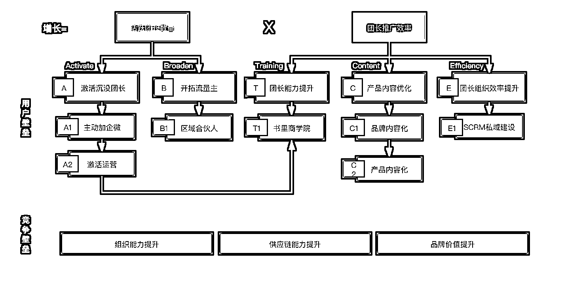  <ne-h1 id="058283bb" data-lake-id="058283bb"><ne-heading-ext><ne-heading-anchor></ne-heading-anchor><ne-heading-fold></ne-heading-fold></ne-heading-ext><ne-heading-content><ne-text id="uee70db23" ne-bold="true" style="color: rgb(47, 48, 52); background-color: rgb(255, 255, 255);">三、去哪里找分销员和团长？</ne-text></ne-heading-content></ne-h1> <ne-h2 id="40467f81" data-lake-id="40467f81"><ne-heading-ext><ne-heading-anchor></ne-heading-anchor><ne-heading-fold></ne-heading-fold></ne-heading-ext><ne-heading-content><ne-text id="u173a0dd9" ne-bold="true" style="color: rgb(47, 48, 52); background-color: rgb(255, 255, 255);">3.1 总体思路</ne-text></ne-heading-content></ne-h2> <ne-p id="ud3743484" data-lake-id="ud3743484"><ne-text id="u61ed7e25" style="color: rgb(47, 48, 52); background-color: rgb(255, 255, 255);">流量池本身一个一个的私域小水洼，分销要做的事情是把水洼串联起来，百川汇海。</ne-text></ne-p> <ne-p id="uca5713df" data-lake-id="uca5713df"><ne-text id="u94fe1efa" style="color: rgb(47, 48, 52); background-color: rgb(255, 255, 255);">不要妄想从头培养团长。我们试过效率实在太低了。</ne-text></ne-p> <ne-p id="u24275204" data-lake-id="u24275204"><ne-text id="ua41d823b" style="color: rgb(47, 48, 52); background-color: rgb(255, 255, 255);">我们尝试过各种培训方式，最终发现没有做过社群分销的普通推广员成长为优质团长的比例太低。大部分优秀的团长都有两年以上的社群运营分销的经验。</ne-text></ne-p> <ne-p id="ua5db9f95" data-lake-id="ua5db9f95"><ne-text id="u1445825a" style="color: rgb(47, 48, 52); background-color: rgb(255, 255, 255);">做好团长的画像。比如我们书里有品团长的画像是无外乎就是读书教育类的群主，教培机构的老师，做过其他消费品社群团社区群分销业务的团长。</ne-text></ne-p> <ne-p id="uea7f5206" data-lake-id="uea7f5206"><ne-text id="ud5e3fba6" style="color: rgb(47, 48, 52); background-color: rgb(255, 255, 255);">一般大团长都会活跃在各个学习社群。通过合伙人下场找人，多做分享，很容易找到。</ne-text></ne-p> <ne-p id="ub930da38" data-lake-id="ub930da38"><ne-text id="u28dd6923" style="color: rgb(47, 48, 52); background-color: rgb(255, 255, 255);">团长都在一个社交圈里，彼此渗透。一起物色好项目。只要产品有优势和顶层设计合理，几个团长能铺开整条业务线。</ne-text></ne-p> <ne-p id="u490786d4" data-lake-id="u490786d4"><ne-text id="u6ce87a8f" style="color: rgb(47, 48, 52); background-color: rgb(255, 255, 255);">去年我们有一条产品线前期就私聊了 4 个团长，一个月裂变了几千人，卖了大几百万。</ne-text></ne-p> <ne-h2 id="5d987121" data-lake-id="5d987121"><ne-heading-ext><ne-heading-anchor></ne-heading-anchor><ne-heading-fold></ne-heading-fold></ne-heading-ext><ne-heading-content><ne-text id="u48053122" ne-bold="true" style="color: rgb(47, 48, 52); background-color: rgb(255, 255, 255);">3.2 如何吸引优质团长？</ne-text></ne-heading-content></ne-h2> <ne-p id="uba8bef9e" data-lake-id="uba8bef9e"><ne-text id="ud1d4f3cf" ne-bold="true" style="color: rgb(47, 48, 52); background-color: rgb(255, 255, 255);">1）躺赚机制</ne-text></ne-p> <ne-p id="u1037fa24" data-lake-id="u1037fa24"><ne-text id="ufee9c5d0" style="color: rgb(47, 48, 52); background-color: rgb(255, 255, 255);">鼓励普通分销员找大团长。团长完成制定销售业绩后，给予一次性奖励。分销员只需要拉群联络，平台提供专人讲解转化。</ne-text></ne-p> <ne-p id="u27bc380a" data-lake-id="u27bc380a"><ne-text id="u8c8093cb" ne-bold="true" style="color: rgb(47, 48, 52); background-color: rgb(255, 255, 255);">2）平移机制</ne-text></ne-p> <ne-p id="u497e512e" data-lake-id="u497e512e"><ne-text id="u4b19b4ae" style="color: rgb(47, 48, 52); background-color: rgb(255, 255, 255);">有资源的团队长，满足一定条件，直接提交团队信息，平台后台配置好，直接整个团队平移过来。</ne-text></ne-p> <ne-h2 id="3618f0f5" data-lake-id="3618f0f5"><ne-heading-ext><ne-heading-anchor></ne-heading-anchor><ne-heading-fold></ne-heading-fold></ne-heading-ext><ne-heading-content><ne-text id="u06006295" ne-bold="true" style="color: rgb(47, 48, 52); background-color: rgb(255, 255, 255);">3.3 如何说服团长加入？</ne-text></ne-heading-content></ne-h2> <ne-p id="ua8c39643" data-lake-id="ua8c39643"><ne-text id="u65d6955c" style="color: rgb(47, 48, 52); background-color: rgb(255, 255, 255);">把握团长最关心的问题</ne-text></ne-p> <ne-p id="ue4bc6628" data-lake-id="ue4bc6628"><ne-text id="u8b9f2d6b" style="color: rgb(47, 48, 52); background-color: rgb(255, 255, 255);">①产品是否正规，比如我们的书是不是正版；</ne-text></ne-p> <ne-p id="u56f58e9c" data-lake-id="u56f58e9c"><ne-text id="u263ac7fa" style="color: rgb(47, 48, 52); background-color: rgb(255, 255, 255);">②产品有没有优势，比如我们的书价格是否有优势；</ne-text></ne-p> <ne-p id="u56e4c67d" data-lake-id="u56e4c67d"><ne-text id="ue61fd3c1" style="color: rgb(47, 48, 52); background-color: rgb(255, 255, 255);">③挣不挣钱，需要告知和她类似团队规模的团长，目前的收入情况；</ne-text></ne-p> <ne-p id="u4c96ab4a" data-lake-id="u4c96ab4a"><ne-text id="u9ca9a3e7" style="color: rgb(47, 48, 52); background-color: rgb(255, 255, 255);">④麻不麻烦，所有团长都想躺赚。需要告知有专门的素材提供，有新人培训，售后客服不用管；</ne-text></ne-p> <ne-p id="ucac22e96" data-lake-id="ucac22e96"><ne-text id="u349248cf" style="color: rgb(47, 48, 52); background-color: rgb(255, 255, 255);">⑤和自己的主业是否冲突。鼓励团长会把图书作为引流品，增值业务。如果你的产品可以成为所有其他平台团长的辅助产品线，推广效率非常高。</ne-text></ne-p> <ne-h1 id="575cecdb" data-lake-id="575cecdb"><ne-heading-ext><ne-heading-anchor></ne-heading-anchor><ne-heading-fold></ne-heading-fold></ne-heading-ext><ne-heading-content><ne-text id="ub4ef05ba" ne-bold="true" style="color: rgb(47, 48, 52); background-color: rgb(255, 255, 255);">四、如何调动团长的积极性？</ne-text></ne-heading-content></ne-h1> <ne-p id="uc0ed4d56" data-lake-id="uc0ed4d56"><ne-text id="u2b9278d1" style="color: rgb(47, 48, 52); background-color: rgb(255, 255, 255);">这点上，我们走了弯路。</ne-text></ne-p> <ne-p id="uf7573348" data-lake-id="uf7573348"><ne-text id="u48510a2b" style="color: rgb(47, 48, 52); background-color: rgb(255, 255, 255);">我们以为</ne-text></ne-p> <ne-p id="ue2ad8b64" data-lake-id="ue2ad8b64"><ne-text id="u5abc5073" style="color: rgb(47, 48, 52); background-color: rgb(255, 255, 255);">1）需要给团长大力赋能，减小他们运营社群的难度。</ne-text></ne-p> <ne-p id="uf6881715" data-lake-id="uf6881715"><ne-text id="u41a99038" style="color: rgb(47, 48, 52); background-color: rgb(255, 255, 255);">2）需要通过培训提高团队凝聚力，设计丰富的活动提供附加价值。（因为书的佣金对比其他赛道佣金不算太高，希望通过额外的附加价值留住用户）</ne-text></ne-p> <ne-p id="u9ae15d83" data-lake-id="u9ae15d83"><ne-text id="u03b6009d" style="color: rgb(47, 48, 52); background-color: rgb(255, 255, 255);">所以我们从 2020-2021 年，一、扩充社群运营团队。二、做了大量阅读专业类的培训。</ne-text></ne-p> <ne-p id="u1ad8b43c" data-lake-id="u1ad8b43c"><ne-text id="uebf1b1ac" style="color: rgb(47, 48, 52); background-color: rgb(255, 255, 255);">结果增长在放缓，数据下滑。</ne-text></ne-p> <ne-p id="u785f46b8" data-lake-id="u785f46b8"><ne-text id="ud269ed73" ne-bold="true" style="color: rgb(47, 48, 52); background-color: rgb(255, 255, 255);">复盘</ne-text></ne-p> <ne-p id="uf41d4429" data-lake-id="uf41d4429"><ne-text id="u0e1e41ac" ne-bold="true" style="color: rgb(47, 48, 52); background-color: rgb(255, 255, 255);">1\. 不要“赋能”太过。团长运营只需要管头部的就可以了。</ne-text></ne-p> <ne-p id="u9e8b749b" data-lake-id="u9e8b749b"><ne-text id="uc3f6ca04" style="color: rgb(47, 48, 52); background-color: rgb(255, 255, 255);">团长有矛盾的心理，一方面出于保护资源不希望平台企业微信加人，另一方面自己忙不过来，希望平台进入社群帮忙运营。</ne-text></ne-p> <ne-p id="u6647b484" data-lake-id="u6647b484"><ne-text id="uec5e0031" style="color: rgb(47, 48, 52); background-color: rgb(255, 255, 255);">后来拉了大大小小的团长群，团队群，找了很多社群运营岗，运营压力很大，但收效甚微。</ne-text></ne-p> <ne-p id="u58606b79" data-lake-id="u58606b79"><ne-text id="u9b17462a" ne-bold="true" style="color: rgb(47, 48, 52); background-color: rgb(255, 255, 255);">2\. 团长的注意力是有限的，所有消耗团长注意力的活动不要组织。</ne-text></ne-p> <ne-p id="ue7cbff59" data-lake-id="ue7cbff59"><ne-text id="u611c3d58" style="color: rgb(47, 48, 52); background-color: rgb(255, 255, 255);">很多活动初衷是提供附加价值，提高认同感。最后大家注意力都分散了，把握不好容易带货组织变成学习组织。</ne-text></ne-p> <ne-p id="u47c6b999" data-lake-id="u47c6b999"><ne-text id="uff9b6a55" style="color: rgb(47, 48, 52); background-color: rgb(255, 255, 255);">我们组织的读书会，反馈很好，但是精力占用过多。</ne-text></ne-p> <ne-p id="u72c57ae9" data-lake-id="u72c57ae9"><ne-text id="uc8228bd1" style="color: rgb(47, 48, 52); background-color: rgb(255, 255, 255);">后来吸取教训，改为每周五组织直播连线作者，既可以推广新书，又可以方便推广员发展新用户，还节约时间。</ne-text></ne-p> <ne-p id="u7a65a663" data-lake-id="u7a65a663"><ne-text id="u31daf4e2" ne-bold="true" style="color: rgb(47, 48, 52); background-color: rgb(255, 255, 255);">3\. 扛住团长的压力，不要增加盲目 SKU。</ne-text></ne-p> <ne-p id="uff39e7d6" data-lake-id="uff39e7d6"><ne-text id="u0150d723" style="color: rgb(47, 48, 52); background-color: rgb(255, 255, 255);">团长经常抱怨说产品不够丰富，其实是产品不够挣钱。我们听到最多的抱怨就是，“有些书没有，所以招不来客户。” 于是平台上架了更多的书。结果书越多，销售越差。</ne-text></ne-p> <ne-p id="u052a924d" data-lake-id="u052a924d"><ne-text id="u45b8dba8" style="color: rgb(47, 48, 52); background-color: rgb(255, 255, 255);">平台主要靠爆品挣钱，严格服从二八定律，20%的产品贡献 80%的利润。产品多了，优势不明显，大家各自为政。没发形成声浪。转化效果差。因为挣不到钱，错误归因成书不够多。</ne-text></ne-p> <ne-p id="u8c676f53" data-lake-id="u8c676f53"><ne-text id="ua558ceaa" style="color: rgb(47, 48, 52); background-color: rgb(255, 255, 255);">后来调整成 爆品+长尾模式。由每天推 4-5 个品，改为一个爆品推几天。转化率大大提高。一个品能带来过百万的销售额。</ne-text></ne-p> <ne-p id="u1c016081" data-lake-id="u1c016081"><ne-text id="u3f6136ba" style="color: rgb(47, 48, 52); background-color: rgb(255, 255, 255);">团长一天躺赚 1 千多。动力满满，愿意跟着平台干。</ne-text></ne-p> <ne-p id="u5bc665bc" data-lake-id="u5bc665bc"><ne-card data-card-name="image" data-card-type="inline" id="NGl7X" data-event-boundary="card" style="color: rgb(47, 48, 52);">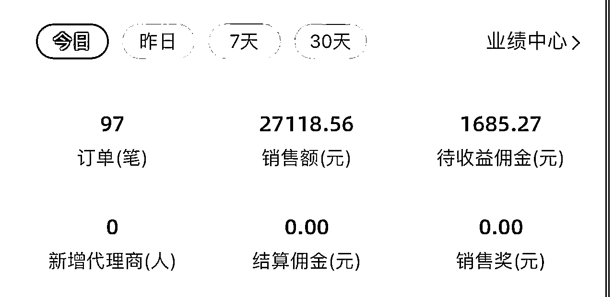  <ne-h1 id="7bdc695b" data-lake-id="7bdc695b"><ne-heading-ext><ne-heading-anchor></ne-heading-anchor><ne-heading-fold></ne-heading-fold></ne-heading-ext><ne-heading-content><ne-text id="u7865ec7a" style="color: rgb(47, 48, 52); background-color: rgb(255, 255, 255);">五、快速增长期如何把握关键？</ne-text></ne-heading-content></ne-h1> <ne-p id="u44133d1f" data-lake-id="u44133d1f"><ne-text id="uc34013ae" style="color: rgb(47, 48, 52); background-color: rgb(255, 255, 255);">如果供应链给力，顶层设计合理，分销业务会进入快速增长期。</ne-text></ne-p> <ne-p id="u71a52c85" data-lake-id="u71a52c85"><ne-text id="udde1ef93" style="color: rgb(47, 48, 52); background-color: rgb(255, 255, 255);">需要重点关注。</ne-text></ne-p> <ne-p id="u71fae479" data-lake-id="u71fae479"><ne-text id="ufbaa3f9e" ne-bold="true" style="color: rgb(47, 48, 52); background-color: rgb(255, 255, 255);">1\. 动力是没有办法通过培训提升的。</ne-text></ne-p> <ne-p id="u793f58a5" data-lake-id="u793f58a5"><ne-text id="u02a5b3a2" style="color: rgb(47, 48, 52); background-color: rgb(255, 255, 255);">打鸡血效果长期来看没效果。真正有效果的扶持致富典型。让一部分团长先富起来。</ne-text></ne-p> <ne-p id="u0af71006" data-lake-id="u0af71006"><ne-text id="u4c2842f8" style="color: rgb(47, 48, 52); background-color: rgb(255, 255, 255);">基础的新人培训需要提供。制作知识库，定期开展培训。</ne-text></ne-p> <ne-p id="uc6bdd445" data-lake-id="uc6bdd445"><ne-text id="u72bf8199" style="color: rgb(47, 48, 52); background-color: rgb(255, 255, 255);">再往上走，培训的效果不大。经常沟通更重要。在沟通中介绍先进典型，分享方法，提供各个团队的战斗力。</ne-text></ne-p> <ne-p id="u1490df58" data-lake-id="u1490df58"><ne-text id="ub5f0f949" style="color: rgb(47, 48, 52); background-color: rgb(255, 255, 255);">真正对团长激励最大的，是爆品带来的佣金反馈。</ne-text></ne-p> <ne-p id="uf5f68aaf" data-lake-id="uf5f68aaf"><ne-text id="ubb89ecc8" ne-bold="true" style="color: rgb(47, 48, 52); background-color: rgb(255, 255, 255);">2\. 只抓大团长。</ne-text></ne-p> <ne-p id="udacc92dd" data-lake-id="udacc92dd"><ne-text id="ub341f5e3" style="color: rgb(47, 48, 52); background-color: rgb(255, 255, 255);">核心大团长拉群放在一起，老板亲自带着推爆品，晒收入，效果最好。</ne-text></ne-p> <ne-p id="u036b0f96" data-lake-id="u036b0f96"><ne-card data-card-name="image" data-card-type="inline" id="G1onG" data-event-boundary="card" style="color: rgb(47, 48, 52);">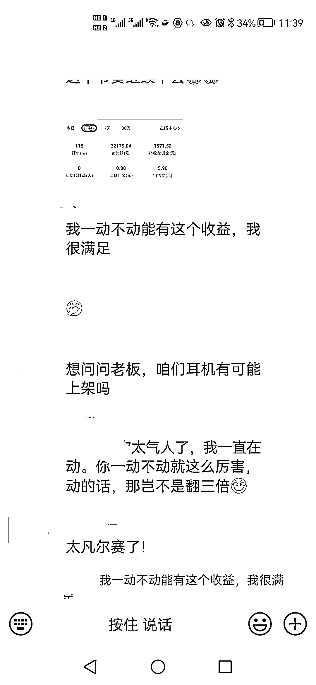  <ne-p id="u729bc998" data-lake-id="u729bc998"><ne-text id="udc6e2fa0" style="color: rgb(47, 48, 52); background-color: rgb(255, 255, 255);">为什么不花精力管理分销员呢？</ne-text></ne-p> <ne-p id="u8f9967c7" data-lake-id="u8f9967c7"><ne-text id="u7a277381" style="color: rgb(47, 48, 52); background-color: rgb(255, 255, 255);">很多人都疑惑，平台应该要多花时间推动分销员成长成为团长。是的，我们也是这样想。</ne-text></ne-p> <ne-p id="u882b2c55" data-lake-id="u882b2c55"><ne-text id="u6a7fbc0c" style="color: rgb(47, 48, 52); background-color: rgb(255, 255, 255);">但经过一两年的试错之后，我们发现，平台放花很多精力管理运营普通分销员，其他他们成为团长，效果不佳，原因如下：</ne-text></ne-p> <ne-p id="uf06a2fab" data-lake-id="uf06a2fab"><ne-text id="u46da27db" style="color: rgb(47, 48, 52); background-color: rgb(255, 255, 255);">1）团长最清楚团队里谁有潜力。团长有动力，自然能带好核心骨干成长。</ne-text></ne-p> <ne-p id="uc97e24bb" data-lake-id="uc97e24bb"><ne-text id="uba821fc5" style="color: rgb(47, 48, 52); background-color: rgb(255, 255, 255);">2）平台花精力亲自下场做分销员的成长活动，大团长就躺平，适得其反。</ne-text></ne-p> <ne-p id="u47d74c7e" data-lake-id="u47d74c7e"><ne-text id="u6723d8e6" style="color: rgb(47, 48, 52); background-color: rgb(255, 255, 255);">3）投产比不高。平台花精力建立好中台和激励机制，多和大团长互动，四两拨千斤。</ne-text></ne-p> <ne-p id="u16243748" data-lake-id="u16243748"><ne-text id="u6336f78f" ne-bold="true" style="color: rgb(47, 48, 52); background-color: rgb(255, 255, 255);">3\. 机构也需要分销，机构流量是隐藏的蓝海市场。</ne-text></ne-p> <ne-p id="u6fbc19d0" data-lake-id="u6fbc19d0"><ne-text id="u8ab48bac" style="color: rgb(47, 48, 52); background-color: rgb(255, 255, 255);">偶然一个机会，有一个千万级用户体量的大公众号，但是找过来希望通过图书引流，然后在帮他把公众号上的用户加到企业微信上。</ne-text></ne-p> <ne-p id="u4b71f5fc" data-lake-id="u4b71f5fc"><ne-text id="u7bb6f310" style="color: rgb(47, 48, 52); background-color: rgb(255, 255, 255);">最终用来销售他们自己的课程。双方一起设计引流方案，跑通运营 SOP ，最后公众号，每个月能走一百多万的货。</ne-text></ne-p> <ne-p id="u8b0e7a13" data-lake-id="u8b0e7a13"><ne-text id="u62e8d76c" style="color: rgb(47, 48, 52); background-color: rgb(255, 255, 255);">如果你的产品也能通过分销起到引流的作用，公众号是很好的流量池。</ne-text></ne-p> <ne-p id="u378c42ca" data-lake-id="u378c42ca"><ne-text id="u6780c9ef" style="color: rgb(47, 48, 52); background-color: rgb(255, 255, 255);">后来，我们的思路打得更开了，直接把供应链提供给其他分销平台，挣供应链服务的钱。</ne-text></ne-p> <ne-p id="u47965591" data-lake-id="u47965591"><ne-text id="uddd1d708" ne-bold="true" style="color: rgb(47, 48, 52); background-color: rgb(255, 255, 255);">当你通过分销把市场打开了之后，供应链才是核心竞争力。</ne-text></ne-p> <ne-p id="u0b4d6020" data-lake-id="u0b4d6020"><ne-text id="u8dff445d" style="color: rgb(47, 48, 52); background-color: rgb(255, 255, 255);">目前已经在和蜂享家，万物心选，云货优选等百亿体量的社交电商平台合作。供应链的收入快赶上超过分销业务的收入了。</ne-text></ne-p> <ne-h1 id="c92857e8" data-lake-id="c92857e8"><ne-heading-ext><ne-heading-anchor></ne-heading-anchor><ne-heading-fold></ne-heading-fold></ne-heading-ext><ne-heading-content><ne-text id="u99316013" ne-bold="true" style="color: rgb(47, 48, 52); background-color: rgb(255, 255, 255);">六、你的业务如何嫁接社群分销？</ne-text></ne-heading-content></ne-h1> <ne-p id="u6b51b5d9" data-lake-id="u6b51b5d9"><ne-text id="ua46c6a25" ne-bold="true" style="color: rgb(47, 48, 52); background-color: rgb(255, 255, 255);">如果你的客户是宝妈，也想采用分销模式，</ne-text></ne-p> <ne-p id="u8280777a" data-lake-id="u8280777a"><ne-text id="ua2935ed4" style="color: rgb(47, 48, 52); background-color: rgb(255, 255, 255);">一定要把分销设计成副业身份，而不是行为。需要有一个完整的概念。</ne-text></ne-p> <ne-p id="u0577fbc6" data-lake-id="u0577fbc6"><ne-text id="u031e1c83" style="color: rgb(47, 48, 52); background-color: rgb(255, 255, 255);">比如我们说的是开一个线上书店。而不是说卖某本书能挣多少钱。只有变成副业身份，才能大规模招商，偶尔为之的行为没发形成自组织的。</ne-text></ne-p> <ne-p id="u009a5bb5" data-lake-id="u009a5bb5"><ne-text id="u299bb778" style="color: rgb(47, 48, 52); background-color: rgb(255, 255, 255);">尽量把产品设计百搭副业，在做其他副业的团长都可以增加你产品作为补充产品线。</ne-text></ne-p> <ne-p id="uba13f3a7" data-lake-id="uba13f3a7"><ne-text id="u4907726d" style="color: rgb(47, 48, 52); background-color: rgb(255, 255, 255);">比如，很多主做其他产品分销（比如课程、美妆个护）的团长，喜欢拿我们的图书做补充产品线。引流+活跃社群。</ne-text></ne-p> <ne-p id="u7aa94f14" data-lake-id="u7aa94f14"><ne-text id="uffb2942b" ne-bold="true" style="color: rgb(47, 48, 52); background-color: rgb(255, 255, 255);">如果你本身有很好的私域流量基础，</ne-text></ne-p> <ne-p id="u499fd336" data-lake-id="u499fd336"><ne-text id="u12103dcc" style="color: rgb(47, 48, 52); background-color: rgb(255, 255, 255);">先做好产品规划和顶层设计，</ne-text></ne-p> <ne-p id="u6bffe54b" data-lake-id="u6bffe54b"><ne-text id="u4da6e8fa" style="color: rgb(47, 48, 52); background-color: rgb(255, 255, 255);">然后通过推文或者是直播，发布团长招募信息，有分销经验的团长筛选出来。</ne-text></ne-p> <ne-p id="ud09020ed" data-lake-id="ud09020ed"><ne-text id="u5957b24f" style="color: rgb(47, 48, 52); background-color: rgb(255, 255, 255);">发动团长对外招商，介绍其他团长，拓展团队，自然流量进来的小团长交给有经验的大团长管，作为额外的福利。</ne-text></ne-p> <ne-p id="uba6a90b0" data-lake-id="uba6a90b0"><ne-text id="u63ea00e9" style="color: rgb(47, 48, 52); background-color: rgb(255, 255, 255);">你不需要投入太多的人力物力，但是就可以把原来中心化的流量转化为网格化的流量。</ne-text></ne-p> <ne-p id="u38f4e86d" data-lake-id="u38f4e86d"><ne-text id="uae8d792c" ne-bold="true" style="color: rgb(47, 48, 52); background-color: rgb(255, 255, 255);">如果你是供应商，有优质的货源，</ne-text></ne-p> <ne-p id="ua98d5da9" data-lake-id="ua98d5da9"><ne-text id="u4db3d680" style="color: rgb(47, 48, 52); background-color: rgb(255, 255, 255);">在理解以上分销基础知识的基础上，积极接触大团长，通过他们找到平台，选择利润率在 25% 以上，销量转化没问题的少量爆品给与平台合作。（最近我们刚刚把一款学习机在两天内卖了 100 万）</ne-text></ne-p> <ne-p id="uc5106765" data-lake-id="uc5106765"><ne-card data-card-name="image" data-card-type="inline" id="CiUXb" data-event-boundary="card" style="color: rgb(47, 48, 52);">  <ne-p id="ucfea96ec" data-lake-id="ucfea96ec"><ne-text id="u177a01ce" style="color: rgb(47, 48, 52); background-color: rgb(255, 255, 255);">另外还有一个小诀窍，十分好用。</ne-text></ne-p> <ne-p id="u968adc8a" data-lake-id="u968adc8a"><ne-text id="ub0daf160" style="color: rgb(47, 48, 52); background-color: rgb(255, 255, 255);">分销平台的团长大多是女性，品牌方创始人或者老板娘亲自下场，自己成为团长，和其他的团长打成一片，搞好关系。这样，团长甚至会主动要求平台上架你的产品。</ne-text></ne-p> <ne-p id="u850e79ae" data-lake-id="u850e79ae"><ne-text id="uf4a24b60" style="color: rgb(47, 48, 52); background-color: rgb(255, 255, 255);">不知不觉写了 6000 字，还有一些细节没法展开，补充一张用户体验流程图+核心指标。</ne-text></ne-p> <ne-p id="uac6a95ce" data-lake-id="uac6a95ce"><ne-card data-card-name="image" data-card-type="inline" id="RMJ9d" data-event-boundary="card" style="color: rgb(47, 48, 52);">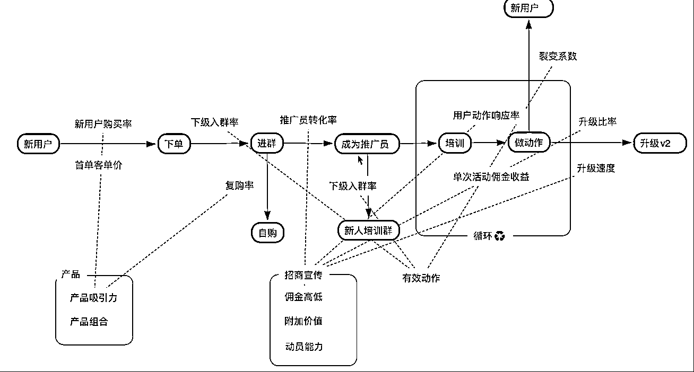  <ne-p id="u5c62b707" data-lake-id="u5c62b707"><ne-text id="u725d8dca" style="color: rgb(47, 48, 52); background-color: rgb(255, 255, 255);">第一次在生财发文，感谢大家的点赞鼓励，希望这篇文章对你有启发。</ne-text></ne-p> <ne-h2 id="5a0169fd" data-lake-id="5a0169fd"><ne-heading-ext><ne-heading-anchor></ne-heading-anchor><ne-heading-fold></ne-heading-fold></ne-heading-ext><ne-heading-content><ne-text id="ue7600193" style="color: rgb(47, 48, 52); background-color: rgb(255, 255, 255);">（11 赞）《视频号直播，孩子成长和教育的生意》</ne-text></ne-heading-content></ne-h2> <ne-p id="u0ca2a86f" data-lake-id="u0ca2a86f"><ne-text id="uc189bdcb" style="color: rgb(47, 48, 52); background-color: rgb(255, 255, 255);">#风向标# 视频号直播，孩子成长和教育的生意 1、兴趣班避坑指南，10w+场观，带趣味编程创作礼包 2、5-13 岁学业及特长规划，实体书精准引流，评论区很多家长想要</ne-text></ne-p> <ne-p id="u4c229a4d" data-lake-id="u4c229a4d"><ne-card data-card-name="image" data-card-type="inline" id="fLG8t" data-event-boundary="card" style="color: rgb(47, 48, 52);">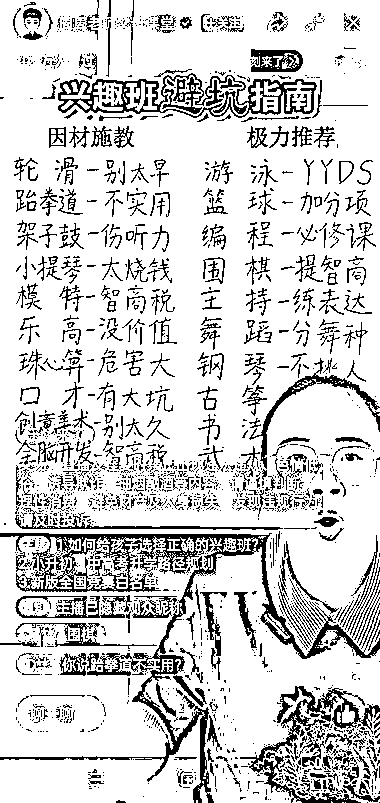  <ne-p id="u6b91622f" data-lake-id="u6b91622f"><ne-card data-card-name="image" data-card-type="inline" id="dUc0B" data-event-boundary="card" style="color: rgb(47, 48, 52);">  <ne-p id="u06151e4a" data-lake-id="u06151e4a"><ne-card data-card-name="image" data-card-type="inline" id="PFMGA" data-event-boundary="card" style="color: rgb(47, 48, 52);">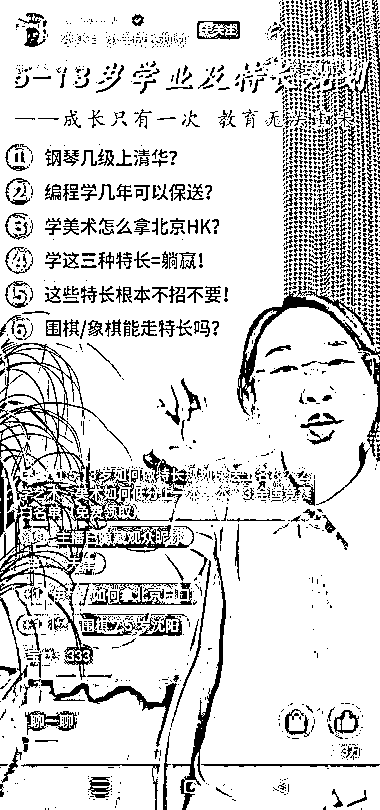  <ne-p id="u77efe742" data-lake-id="u77efe742"><ne-card data-card-name="image" data-card-type="inline" id="Scdfj" data-event-boundary="card" style="color: rgb(47, 48, 52);">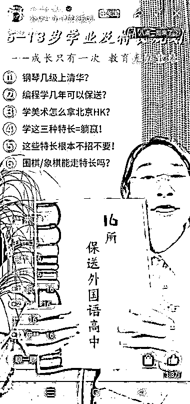  <ne-h3 id="671499ec" data-lake-id="671499ec"><ne-heading-ext><ne-heading-anchor></ne-heading-anchor><ne-heading-fold></ne-heading-fold></ne-heading-ext><ne-heading-content><ne-text id="u1d0a518f" style="color: rgb(47, 48, 52); background-color: rgb(255, 255, 255);">3、国内平台 - 小红书</ne-text></ne-heading-content></ne-h3> <ne-h2 id="2c27fa79" data-lake-id="2c27fa79"><ne-heading-ext><ne-heading-anchor></ne-heading-anchor><ne-heading-fold></ne-heading-fold></ne-heading-ext><ne-heading-content><ne-text id="u9eca9bf6" style="color: rgb(47, 48, 52); background-color: rgb(255, 255, 255);">（104 赞）《小红书资料引流虚拟电商工具库大全》</ne-text></ne-heading-content></ne-h2> <ne-p id="u5b53af88" data-lake-id="u5b53af88"><ne-text id="u6f163aa6" style="color: rgb(47, 48, 52); background-color: rgb(255, 255, 255);">很荣幸入选这次小红书资料引流的教练</ne-text></ne-p> <ne-p id="ub072e889" data-lake-id="ub072e889"><ne-text id="ua40ba196" ne-bold="true" style="color: rgb(47, 48, 52); background-color: rgb(255, 255, 255);">工欲善其事必先利其器</ne-text><ne-text id="u417e8278" style="color: rgb(47, 48, 52); background-color: rgb(255, 255, 255);">，本次帖子</ne-text></ne-p> <ne-p id="ueb1ad313" data-lake-id="ueb1ad313"><ne-text id="u78538457" style="color: rgb(38, 38, 38); background-color: rgb(255, 255, 255);">我把做小红书所需要用到的工具打了个包，分享给大家</ne-text></ne-p> <ne-h4 id="0e712dfb" data-lake-id="0e712dfb"><ne-heading-ext><ne-heading-anchor></ne-heading-anchor><ne-heading-fold></ne-heading-fold></ne-heading-ext><ne-heading-content><ne-text id="u20653b23">1、千瓜数据</ne-text> [<ne-text id="u7e338efc">http://www.qian-gua.com/</ne-text>](http://www.qian-gua.com)</ne-heading-content></ne-h4> <ne-h4 id="5d39ceb6" data-lake-id="5d39ceb6"><ne-heading-ext><ne-heading-anchor></ne-heading-anchor><ne-heading-fold></ne-heading-fold></ne-heading-ext><ne-heading-content><ne-text id="u3cc3cf61">2、新红</ne-text> [<ne-text id="ua1249645">https://xh.newrank.cn/</ne-text>](https://xh.newrank.cn)</ne-heading-content></ne-h4> <ne-h4 id="18604ef2" data-lake-id="18604ef2"><ne-heading-ext><ne-heading-anchor></ne-heading-anchor><ne-heading-fold></ne-heading-fold></ne-heading-ext><ne-heading-content><ne-text id="ud9e0fbdf">3、灰豚数据：</ne-text>[<ne-text id="u6ac4d57b">https://xhs.huitun.com/</ne-text>](https://xhs.huitun.com)</ne-heading-content></ne-h4> <ne-p id="u8bc84596" data-lake-id="u8bc84596"><ne-text id="ue217d0cd" ne-bold="true">二、做图工具推荐（熟练掌握一个即可，建议 PPT）</ne-text></ne-p> <ne-p id="udaa3aba1" data-lake-id="udaa3aba1"><ne-text id="ua8592e68">作图工具主要有以下九种方式，</ne-text><ne-text id="u3643e0db" ne-bold="true">美图秀秀、黄油相机、创可贴都有简单实例操作步骤，可展开 ，</ne-text><ne-text id="u8df3ade8">批量化的话建议 PPT，操作简单 ，也是不错的方式。</ne-text></ne-p> <ne-h4 id="fa4e7a54" data-lake-id="fa4e7a54"><ne-heading-ext><ne-heading-anchor></ne-heading-anchor><ne-heading-fold></ne-heading-fold></ne-heading-ext><ne-heading-content><ne-text id="u22ef9d34">1、醒图 APP</ne-text></ne-heading-content></ne-h4> <ne-h4 id="1913f169" data-lake-id="1913f169"><ne-heading-ext><ne-heading-anchor></ne-heading-anchor><ne-heading-fold></ne-heading-fold></ne-heading-ext><ne-heading-content><ne-text id="uc2eb12b8">2、美图秀秀</ne-text></ne-heading-content></ne-h4> <ne-p id="u562b38d0" data-lake-id="u562b38d0"><ne-text id="u56c7f2de">下面说一下美图秀秀如何制作图文笔记，下面方法仅供参考，给大家简单操作一下。也可看同行账号看他们的封面，按照自己的想法来设计封面</ne-text></ne-p> <ne-p id="uc814643c" data-lake-id="uc814643c"><ne-text id="ua7ef04e9">首先，会给大家纯色背景模板，手机打开美图秀秀软件---选择图片美化，选择刚刚保存好的纯色背景图片。</ne-text></ne-p> <ne-p id="u34175b55" data-lake-id="u34175b55"><ne-card data-card-name="image" data-card-type="inline" id="UhMAP" data-event-boundary="card">  <ne-p id="u64f2c22d" data-lake-id="u64f2c22d"><ne-text id="ud6d35e5f">选择“编辑”---选择“裁剪”下的 3：4 比例---点击右上角“√”，然后选择文字</ne-text></ne-p> <ne-p id="u7b460a94" data-lake-id="u7b460a94"><ne-text id="u5bb8db12">添加“贴纸”，增加封面视觉效果（注意：贴纸按照自己的喜欢搭配就可以）</ne-text></ne-p> <ne-p id="u5e7d9ef9" data-lake-id="u5e7d9ef9"><ne-card data-card-name="image" data-card-type="inline" id="j6D4c" data-event-boundary="card">  <ne-p id="uc229cebe" data-lake-id="uc229cebe"><ne-text id="u7d420eda">最后存为模板，方便下次使用，存为模板后，下次可直接改名字就可以，点截图内我框选出来的图标可存为模板！</ne-text></ne-p> <ne-p id="u7f25658c" data-lake-id="u7f25658c"><ne-text id="u4549e809" ne-bold="true">一定要存为模板</ne-text></ne-p> <ne-p id="u79475915" data-lake-id="u79475915"><ne-text id="u9ed23b19">另外记得做好的封面记得点“保存”</ne-text></ne-p> <ne-p id="ud15ab30e" data-lake-id="ud15ab30e"><ne-text id="uc3593f8a" ne-bold="true">此外小红书封面美图秀秀也有模板，可以参考</ne-text></ne-p> <ne-p id="u4c9ac2c9" data-lake-id="u4c9ac2c9"><ne-text id="u0079b777">进入美图秀秀，点击海报模板，下滑选择小红书封面，很多小红书封面可以参考</ne-text></ne-p> <ne-p id="ueff617ab" data-lake-id="ueff617ab"><ne-card data-card-name="image" data-card-type="inline" id="YIOnm" data-event-boundary="card">  <ne-h4 id="74e963f4" data-lake-id="74e963f4"><ne-heading-ext><ne-heading-anchor></ne-heading-anchor><ne-heading-fold></ne-heading-fold></ne-heading-ext><ne-heading-content><ne-text id="u5d61db61">3、黄油相机 APP</ne-text></ne-heading-content></ne-h4> <ne-p id="ua43eca96" data-lake-id="ua43eca96"><ne-text id="u62655da2" ne-bold="true">黄油相机使用方法和美图秀秀差不多，这里简说</ne-text></ne-p> <ne-p id="u17e7f841" data-lake-id="u17e7f841"><ne-text id="ud026c793" ne-bold="true">1.点击中间的图标，选择背景图</ne-text></ne-p> <ne-p id="ud9b65b04" data-lake-id="ud9b65b04"><ne-card data-card-name="image" data-card-type="inline" id="iPmqG" data-event-boundary="card">  <ne-p id="u17f842e0" data-lake-id="u17f842e0"><ne-text id="ub3e7be70" ne-bold="true">2.选择”布局“---”画布比“---”3：4“---”√“</ne-text></ne-p> <ne-p id="u840aa5b4" data-lake-id="u840aa5b4"><ne-card data-card-name="image" data-card-type="inline" id="IBT1S" data-event-boundary="card">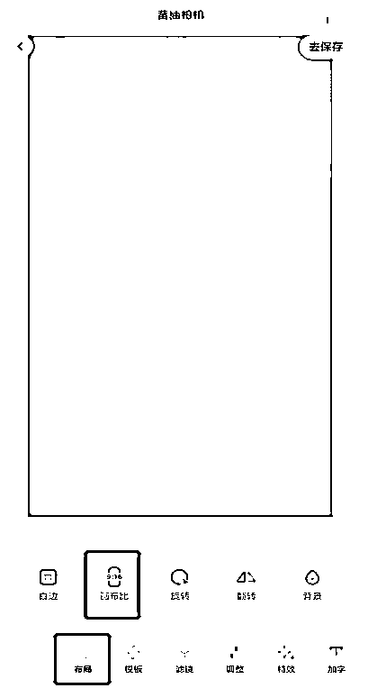  <ne-p id="ua9902549" data-lake-id="ua9902549"><ne-text id="ua79a6b48" ne-bold="true">3.点击”文字“---”输入文字“</ne-text></ne-p> <ne-p id="u278a0315" data-lake-id="u278a0315"><ne-card data-card-name="image" data-card-type="inline" id="iP2qW" data-event-boundary="card">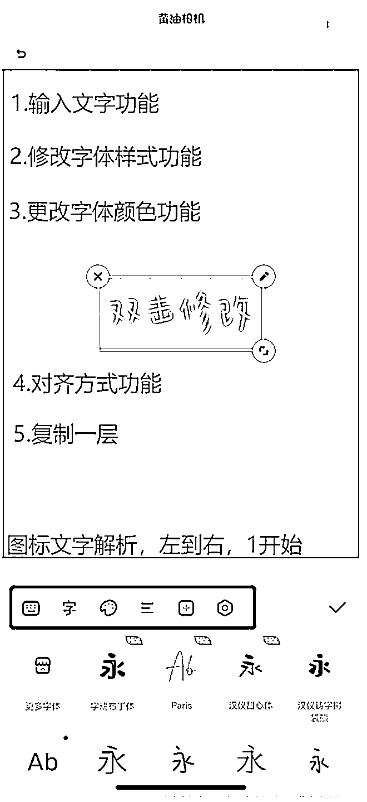  <ne-p id="u86bac3b7" data-lake-id="u86bac3b7"><ne-text id="u72edbc8a" ne-bold="true">4.添加”贴纸“</ne-text></ne-p> <ne-p id="ub9775a3a" data-lake-id="ub9775a3a"><ne-card data-card-name="image" data-card-type="inline" id="GUyqP" data-event-boundary="card">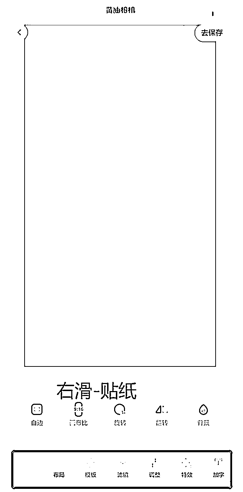  <ne-p id="u03ec2b71" data-lake-id="u03ec2b71"><ne-text id="u4859c82a" ne-bold="true">5.制作好的封面怎样保存？怎样存为模板？</ne-text></ne-p> <ne-p id="u3c021c3a" data-lake-id="u3c021c3a"><ne-text id="u462131b5" ne-bold="true">（1）点击”去保存“</ne-text></ne-p> <ne-p id="uca43e9bb" data-lake-id="uca43e9bb"><ne-card data-card-name="image" data-card-type="inline" id="uTyxN" data-event-boundary="card">  <ne-p id="uad80ff09" data-lake-id="uad80ff09"><ne-text id="u736ec4dc" ne-bold="true">（2）左下角”保存到相册“可把制作的封面存为图片，右上角”存草稿”可存为模板</ne-text></ne-p> <ne-p id="ude72bf8a" data-lake-id="ude72bf8a"><ne-card data-card-name="image" data-card-type="inline" id="QK0qN" data-event-boundary="card">  <ne-p id="u21877dfd" data-lake-id="u21877dfd"><ne-text id="u6305971f" ne-bold="true">（3）右下角“我的”---“草稿箱”---"选择上次存为的模板"---选择“编辑”即可使用上次存为的模板</ne-text></ne-p> <ne-p id="u03af40d6" data-lake-id="u03af40d6"><ne-card data-card-name="image" data-card-type="inline" id="oNr4e" data-event-boundary="card">  <ne-h4 id="8fdcebfe" data-lake-id="8fdcebfe"><ne-heading-ext><ne-heading-anchor></ne-heading-anchor><ne-heading-fold></ne-heading-fold></ne-heading-ext><ne-heading-content><ne-text id="uc32d4e78">4、创客贴</ne-text></ne-heading-content></ne-h4> <ne-h4 id="c8d6c2a4" data-lake-id="c8d6c2a4"><ne-heading-ext><ne-heading-anchor></ne-heading-anchor><ne-heading-fold></ne-heading-fold></ne-heading-ext><ne-heading-content><ne-text id="u5571f0b4">（</ne-text> [<ne-text id="u28696114">https://www.chuangkit.com/</ne-text>](https://www.chuangkit.com/) <ne-text id="u9341fad1">）</ne-text></ne-heading-content></ne-h4> <ne-p id="ub7badda0" data-lake-id="ub7badda0"><ne-text id="u6088d911">点击-开始“免费作图”或者右上角“登录”，登录一下</ne-text></ne-p> <ne-p id="u7e0a922f" data-lake-id="u7e0a922f"><ne-card data-card-name="image" data-card-type="inline" id="UXosw" data-event-boundary="card">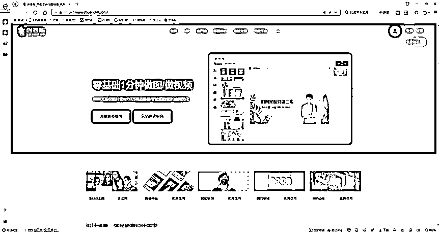  <ne-p id="u1565dbb2" data-lake-id="u1565dbb2"><ne-text id="u39b5f43f">选择“新媒体”---选择“小红书封面配图”---选择“免费”</ne-text></ne-p> <ne-p id="ude413aa6" data-lake-id="ude413aa6"><ne-card data-card-name="image" data-card-type="inline" id="tTd2L" data-event-boundary="card">  <ne-p id="u569956c3" data-lake-id="u569956c3"><ne-text id="ue3f2a78f" ne-bold="true">选择一个模板，点进去编辑</ne-text></ne-p> <ne-p id="udf2ad7d7" data-lake-id="udf2ad7d7"><ne-card data-card-name="image" data-card-type="inline" id="HmPN9" data-event-boundary="card">  <ne-p id="u95863b28" data-lake-id="u95863b28"><ne-card data-card-name="image" data-card-type="inline" id="M5aIz" data-event-boundary="card">  <ne-p id="u6865aa46" data-lake-id="u6865aa46"><ne-card data-card-name="image" data-card-type="inline" id="aivdI" data-event-boundary="card">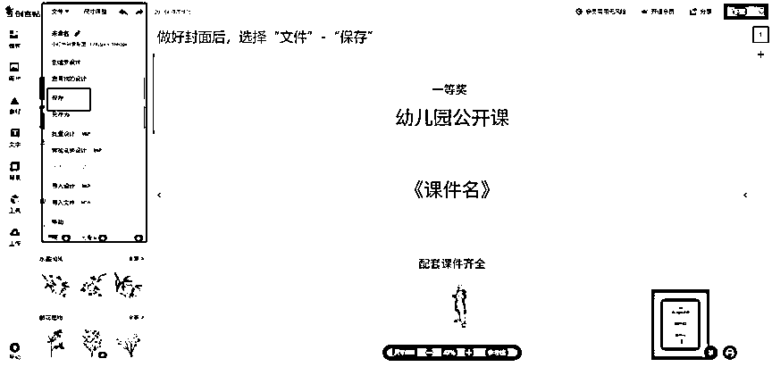  <ne-p id="u3b6eb412" data-lake-id="u3b6eb412"><ne-card data-card-name="image" data-card-type="inline" id="H39f4" data-event-boundary="card">  <ne-p id="u0fb518ff" data-lake-id="u0fb518ff"><ne-text id="ua86d2dae" ne-bold="true">存为的模板哪里可以找到？怎样再次编辑使用？</ne-text></ne-p> <ne-p id="u0e62ece1" data-lake-id="u0e62ece1"><ne-text id="ub6feac0e">选择“我的设计”---选择保存好的封面</ne-text></ne-p> <ne-p id="u147e4c21" data-lake-id="u147e4c21"><ne-card data-card-name="image" data-card-type="inline" id="MOBUJ" data-event-boundary="card">  <ne-h4 id="5db9eaeb" data-lake-id="5db9eaeb"><ne-heading-ext><ne-heading-anchor></ne-heading-anchor><ne-heading-fold></ne-heading-fold></ne-heading-ext><ne-heading-content><ne-text id="ud49e1035">5、Canva 可画 APP</ne-text></ne-heading-content></ne-h4> <ne-h4 id="22fcedbd" data-lake-id="22fcedbd"><ne-heading-ext><ne-heading-anchor></ne-heading-anchor><ne-heading-fold></ne-heading-fold></ne-heading-ext><ne-heading-content><ne-text id="ue710a1fe">6、Picsart APP</ne-text></ne-heading-content></ne-h4> <ne-h4 id="34d8f72b" data-lake-id="34d8f72b"><ne-heading-ext><ne-heading-anchor></ne-heading-anchor><ne-heading-fold></ne-heading-fold></ne-heading-ext><ne-heading-content><ne-text id="ufaee9f94">7、稿定设计</ne-text></ne-heading-content></ne-h4> <ne-h4 id="feac4d8e" data-lake-id="feac4d8e"><ne-heading-ext><ne-heading-anchor></ne-heading-anchor><ne-heading-fold></ne-heading-fold></ne-heading-ext><ne-heading-content><ne-text id="u40d5abb7">（</ne-text>[<ne-text id="u5ccc6892">https://www.gaoding.com/</ne-text>](https://www.gaoding.com)<ne-text id="u29e13d2c">）</ne-text></ne-heading-content></ne-h4> <ne-h4 id="b642f05e" data-lake-id="b642f05e"><ne-heading-ext><ne-heading-anchor></ne-heading-anchor><ne-heading-fold></ne-heading-fold></ne-heading-ext><ne-heading-content><ne-text id="ud3bb82f6">8、图司机</ne-text></ne-heading-content></ne-h4> <ne-h4 id="c99093c5" data-lake-id="c99093c5"><ne-heading-ext><ne-heading-anchor></ne-heading-anchor><ne-heading-fold></ne-heading-fold></ne-heading-ext><ne-heading-content><ne-text id="u29daebb7">（</ne-text> [<ne-text id="u7d3f4a81">https://www.tusij.com/</ne-text>](https://www.tusij.com)<ne-text id="u110a4fcf">）</ne-text></ne-heading-content></ne-h4> <ne-h4 id="28eddd75" data-lake-id="28eddd75"><ne-heading-ext><ne-heading-anchor></ne-heading-anchor><ne-heading-fold></ne-heading-fold></ne-heading-ext><ne-heading-content><ne-text id="ub295a3f9">9、PPT</ne-text></ne-heading-content></ne-h4> <ne-p id="u51b77e5d" data-lake-id="u51b77e5d"><ne-text id="uabd28fee" ne-bold="true">三、免费图片素材工具推荐</ne-text></ne-p> <ne-p id="u606e4cdb" data-lake-id="u606e4cdb"><ne-text id="uf09ec82b">1、Unsplash（</ne-text>[<ne-text id="u54417673">https://unsplash.com</ne-text>](https://unsplash.com)<ne-text id="u87e06fd3">）</ne-text></ne-p> <ne-p id="u48797ee8" data-lake-id="u48797ee8"><ne-text id="u7c3d75db">备注:最知名的无版权图片网站，以风景为主</ne-text></ne-p> <ne-p id="u4573653a" data-lake-id="u4573653a"><ne-text id="uf640f2c6">2、Lifeofpix （</ne-text>[<ne-text id="u25bd7d2a">www.lifeofpix.com</ne-text>](http://www.lifeofpix.com)<ne-text id="ub4cc3f3c">）</ne-text></ne-p> <ne-p id="u3e029b6b" data-lake-id="u3e029b6b"><ne-text id="u6fcf3a57">备注:建筑以及风景为主，色调偏小清新</ne-text></ne-p> <ne-p id="u225befc4" data-lake-id="u225befc4"><ne-text id="uf1c42f64">3、Freejpg （</ne-text>[<ne-text id="uaf80e517">http://en.freejpg.com.ar/</ne-text>](http://en.freejpg.com.ar)<ne-text id="u0678f771">）</ne-text></ne-p> <ne-p id="u9b300f2a" data-lake-id="u9b300f2a"><ne-text id="u1e9faa1c">备注:有部分动物图片的网站，也是能用颜色搜索的</ne-text></ne-p> <ne-p id="u196bde09" data-lake-id="u196bde09"><ne-text id="u48df60e4">4、别样网 （</ne-text>[<ne-text id="uef0d5c89">https://www.ssyer.com</ne-text>](https://www.ssyer.com)<ne-text id="uc5706280">）</ne-text></ne-p> <ne-p id="u2674460e" data-lake-id="u2674460e"><ne-text id="u8b5e66f4">备注:中国网站，支持中文搜索</ne-text></ne-p> <ne-p id="ua4295a78" data-lake-id="ua4295a78"><ne-text id="u9102bad1" ne-bold="true">四、小红书内容工具</ne-text></ne-p> <ne-h4 id="02105b59" data-lake-id="02105b59"><ne-heading-ext><ne-heading-anchor></ne-heading-anchor><ne-heading-fold></ne-heading-fold></ne-heading-ext><ne-heading-content><ne-text id="u02a90746">4.1 小红图</ne-text> [<ne-text id="u103ec96b">http://www.xiaohongtu.cn/</ne-text>](http://www.xiaohongtu.cn/)</ne-heading-content></ne-h4> <ne-p id="ufa980122" data-lake-id="ufa980122"><ne-text id="u28652c15">主要是用来抓取小红书里面内容素材，复制笔记链接，即可导出别人的使用的小红书图片(微信小程序搜“小红图”也可使用)，</ne-text></ne-p> <ne-h4 id="2eb83c35" data-lake-id="2eb83c35"><ne-heading-ext><ne-heading-anchor></ne-heading-anchor><ne-heading-fold></ne-heading-fold></ne-heading-ext><ne-heading-content><ne-text id="u9695469f">4.2 小红书违禁词查询</ne-text></ne-heading-content></ne-h4> <ne-p id="udf7a9334" data-lake-id="udf7a9334"><ne-text id="uecc24cb1">违禁词检查工具有许多，前三个会比较好用，4~6 当然也可以参考使用</ne-text></ne-p> <ne-p id="u67edb602" data-lake-id="u67edb602"><ne-text id="u45f5cdc7" ne-bold="true">4.2.1 零克查词</ne-text> [<ne-text id="u7df601aa" ne-bold="true">http://ci.lingke.pro/</ne-text>](http://ci.lingke.pro)</ne-p> <ne-p id="u5cbcbf23" data-lake-id="u5cbcbf23"><ne-text id="ucaeb8aa6">专业的小红书敏感词检测工具，将文字直接复制到左边，一键查询即可，敏感词和违禁词都可以直接看到</ne-text></ne-p> <ne-p id="u9960051f" data-lake-id="u9960051f"><ne-card data-card-name="image" data-card-type="inline" id="MnO1o" data-event-boundary="card">  <ne-p id="u0c359e46" data-lake-id="u0c359e46"><ne-text id="ua5646dde" ne-bold="true">4.2.2 句无忧（</ne-text>[<ne-text id="u1773d3f3" ne-bold="true">https://www.check51.com/</ne-text>](https://www.check51.com/)<ne-text id="u0253c029" ne-bold="true">）</ne-text></ne-p> <ne-p id="u1074f5a7" data-lake-id="u1074f5a7"><ne-text id="u9fbecfe2">句无忧是通用一些的，这个提示会更加详细，也会提示不能使用的违禁词，也是非常好用</ne-text></ne-p> <ne-p id="u3308df35" data-lake-id="u3308df35"><ne-card data-card-name="image" data-card-type="inline" id="pDXiJ" data-event-boundary="card">  <ne-p id="ua766b420" data-lake-id="ua766b420"><ne-text id="u4fde3e8d" ne-bold="true">4.2.3 易撰（</ne-text>[<ne-text id="uee1d59d9" ne-bold="true">https://www.yizhuan5.com/work.html#1-4</ne-text>](https://www.yizhuan5.com/work.html#1-4)<ne-text id="u4cb540ec" ne-bold="true">）</ne-text></ne-p> <ne-p id="u7686406a" data-lake-id="u7686406a"><ne-text id="ue2b5b7e3">易撰这个工具可以不仅可以进行爆文标题，文章质量检测可以大致检测文章情况</ne-text></ne-p> <ne-p id="u5b73df88" data-lake-id="u5b73df88"><ne-card data-card-name="image" data-card-type="inline" id="gSoz3" data-event-boundary="card">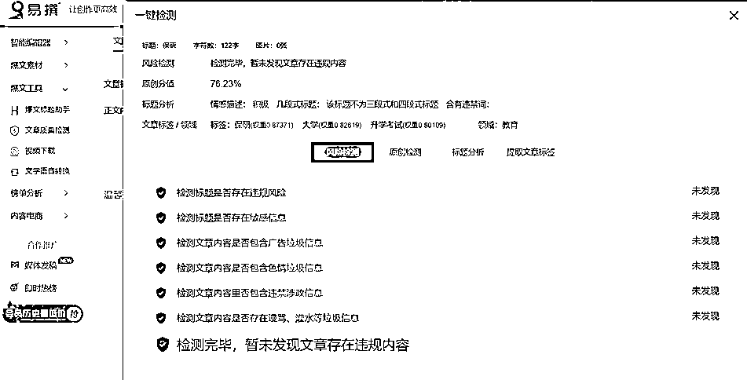  <ne-p id="uaba9c7ba" data-lake-id="uaba9c7ba"><ne-text id="ua9199bff" ne-bold="true">4.2.4  禁用词查询(</ne-text>[<ne-text id="u381c4cb4" ne-bold="true">https://www.jinyongci.com/</ne-text>](https://www.jinyongci.com/)<ne-text id="ufb7b5ad0" ne-bold="true">)</ne-text></ne-p> <ne-p id="u3957feaa" data-lake-id="u3957feaa"><ne-text id="ucf8cbc06" ne-bold="true">4.2.5  句易网（</ne-text>[<ne-text id="u3ad106c4" ne-bold="true">http://www.ju1.cn/</ne-text>](http://www.ju1.cn/)<ne-text id="ud121e0ca" ne-bold="true">）</ne-text></ne-p> <ne-p id="u8a40c6fc" data-lake-id="u8a40c6fc"><ne-text id="ub5c7b912" ne-bold="true">4.2.6  词爪（</ne-text>[<ne-text id="u1ef92269" ne-bold="true">https://www.cizhua.com/</ne-text>](https://www.cizhua.com/)<ne-text id="uda3803d1" ne-bold="true">）</ne-text></ne-p> <ne-p id="uf4cdb0e7" data-lake-id="uf4cdb0e7"><ne-text id="ua45e6f5b" ne-bold="true">五、标题采集工具</ne-text></ne-p> <ne-h4 id="a5c151e1" data-lake-id="a5c151e1"><ne-heading-ext><ne-heading-anchor></ne-heading-anchor><ne-heading-fold></ne-heading-fold></ne-heading-ext><ne-heading-content><ne-text id="u57fea540">1、新红（付费）</ne-text></ne-heading-content></ne-h4> <ne-h4 id="8d8eda57" data-lake-id="8d8eda57"><ne-heading-ext><ne-heading-anchor></ne-heading-anchor><ne-heading-fold></ne-heading-fold></ne-heading-ext><ne-heading-content><ne-text id="u9aa6d3d3">2、后羿采集器（免费）下载地址：</ne-text>[<ne-text id="u1163ff94">https://www.houyicaiji.com/</ne-text>](https://www.houyicaiji.com)</ne-heading-content></ne-h4> <ne-p id="u2e923c2e" data-lake-id="u2e923c2e"><ne-text id="ufb2f9c91">首先将收集的链接复制到采集器网址框中，然后点击智能采集</ne-text></ne-p> <ne-p id="u8022b351" data-lake-id="u8022b351"><ne-card data-card-name="image" data-card-type="inline" id="ED0nY" data-event-boundary="card">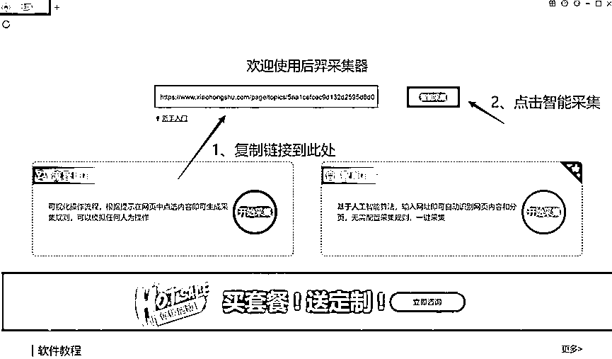  <ne-p id="ue44197b3" data-lake-id="ue44197b3"><ne-text id="ub5497e43">采集器会自动识别话题网页端，采集内容生成下列的表格</ne-text></ne-p> <ne-p id="u451b6e0b" data-lake-id="u451b6e0b"><ne-text id="uc995a3df">第三步我们点击标题链接列的任一链接（这里标题链接其实是用户主页链接，自动生成有时出现名称错误）</ne-text></ne-p> <ne-p id="uab53b649" data-lake-id="uab53b649"><ne-card data-card-name="image" data-card-type="inline" id="SLvEF" data-event-boundary="card">  <ne-p id="ue88e4c0f" data-lake-id="ue88e4c0f"><ne-text id="u0285fa36">点击后会自动跳转到二级主页页面采集，首先我们先点击清空所有，最后一步添加字段</ne-text></ne-p> <ne-p id="u8775d52d" data-lake-id="u8775d52d"><ne-text id="ucec75b74">按个添加需要采集用户的简介名称、标签、介绍、地址</ne-text></ne-p> <ne-p id="udecdeaa3" data-lake-id="udecdeaa3"><ne-card data-card-name="image" data-card-type="inline" id="GBuFc" data-event-boundary="card">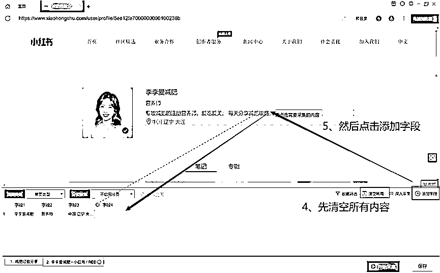  <ne-p id="ucc7d3452" data-lake-id="ucc7d3452"><ne-text id="u997e8365">重点：采集导出 excel 表格形式后，对数据进行清晰</ne-text></ne-p> <ne-p id="u65b10d01" data-lake-id="u65b10d01"><ne-text id="u7c4d0993">无关杂乱信息删掉可以整理到飞书表格，方便自己同步对标分析</ne-text></ne-p> <ne-h4 id="14e061c7" data-lake-id="14e061c7"><ne-heading-ext><ne-heading-anchor></ne-heading-anchor><ne-heading-fold></ne-heading-fold></ne-heading-ext><ne-heading-content><ne-text id="u72dc046f" style="color: rgb(255, 153, 51);">（49 赞）《小红书资料引流爆款封面分享，使用 xmind 对知识点进行总结和制作》</ne-text><ne-text id="u41ba9f63" style="color: rgb(255, 153, 51);">小红书资料引流爆款封面分享，使用 xmind 对知识点进行总结和制作。数据相当好#风向标# #小红书#</ne-text><ne-card data-card-name="image" data-card-type="inline" id="nbQs9" data-event-boundary="card" style="color: rgb(255, 153, 51);"><ne-card data-card-name="image" data-card-type="inline" id="vAM2W" data-event-boundary="card" style="color: rgb(255, 153, 51);">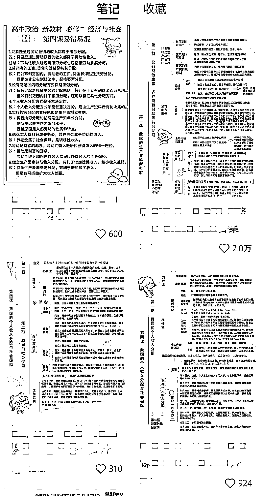<ne-text id="ue36a20ee" style="color: rgb(255, 153, 51);">#风向标# 小红书资料引流#小红书# ，用 ipad 做的这种手写笔记特别特别特别容易爆，基本都是千赞和万赞</ne-text><ne-card data-card-name="image" data-card-type="inline" id="xkHeh" data-event-boundary="card" style="color: rgb(255, 153, 51);">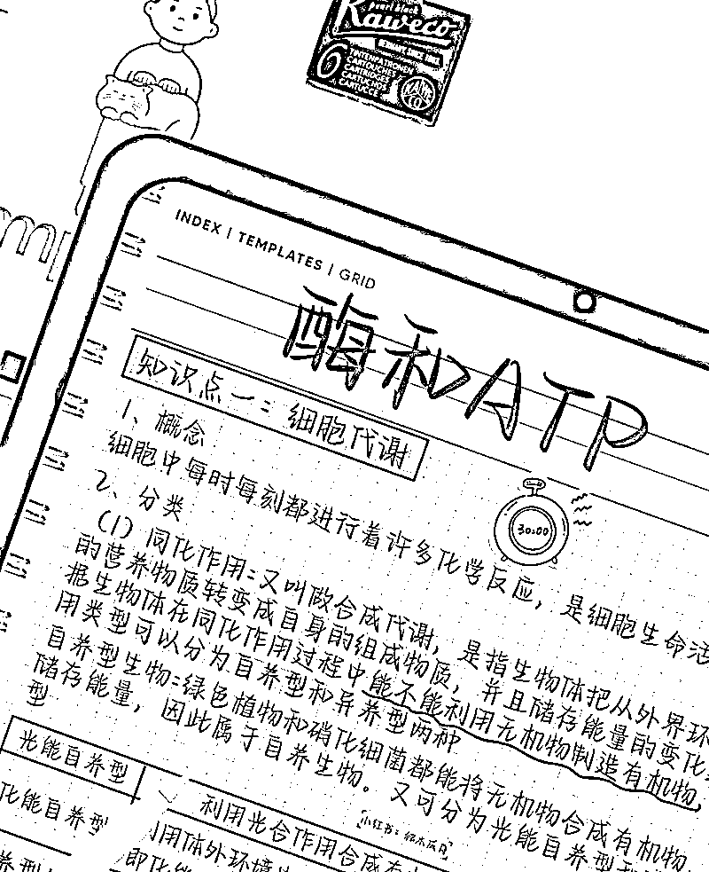<ne-card data-card-name="image" data-card-type="inline" id="AIkB0" data-event-boundary="card" style="color: rgb(255, 153, 51);"><ne-text id="u8ebaafd1" style="color: rgb(255, 153, 51);">4、国内平台 - 其他</ne-text> <ne-text id="uaea967d2" style="color: rgb(255, 153, 51);">（10 赞）《游戏初始号生意》</ne-text><ne-text id="ud4e1a70a" style="color: rgb(255, 153, 51);">#风向标#</ne-text><ne-text id="u41104d4a" style="color: rgb(255, 153, 51);">给大家介绍个，游戏初始号的生意。</ne-text><ne-card data-card-name="image" data-card-type="inline" id="GDJEy" data-event-boundary="card" style="color: rgb(255, 153, 51);">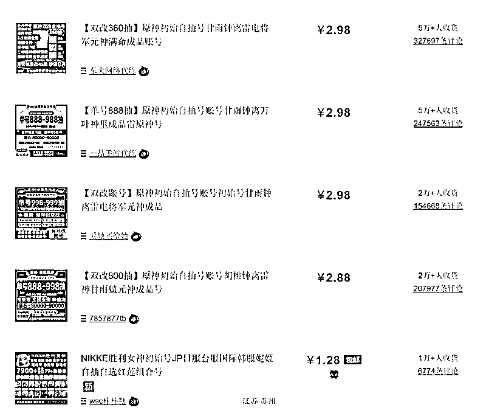<ne-card data-card-name="image" data-card-type="inline" id="kYOJm" data-event-boundary="card" style="color: rgb(255, 153, 51);">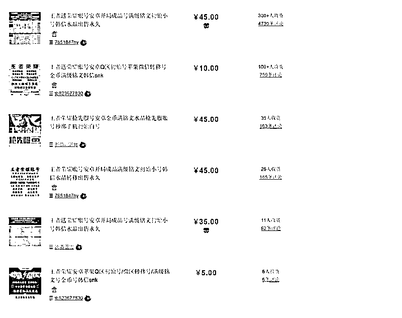<ne-text id="uf767fd1d" style="color: rgb(255, 153, 51);">5、海外项目</ne-text> <ne-text id="u34da3f77" style="color: rgb(255, 153, 51);">（22 赞）《独立站爆品模式实操 TikTok ads+Shopify》</ne-text><ne-text id="u74c7b887" ne-bold="true" style="color: rgb(255, 153, 51);">tiktok + shopify 的模式还能玩吗？</ne-text><ne-text id="ucb56ff1a" ne-bold="true" style="color: rgb(255, 153, 51);"><ne-text id="u45124dc1" style="color: rgb(34, 34, 34);">这是一个很多人都会问到的问题，其实对比于过去的 Facebook 来说，tiktok 更新当然平台的受众肯定也没有老牌厂商这么丰富。</ne-text><ne-text id="u5298ae7d" style="color: rgb(34, 34, 34);"><ne-text id="ua080a14e" style="color: rgb(34, 34, 34);">对于新平台来说流量便宜，平台目前也是在鼓励各大流量主入驻，官方态度来说这个是他们的核心产品，他们自己想赚到钱商家肯定也需要有一部分可以赚到钱，这个游戏才可以一直持续下去的。</ne-text><ne-text id="u59bb0470" style="color: rgb(34, 34, 34);"><ne-card data-card-name="image" data-card-type="inline" id="TkdNv" data-event-boundary="card" style="color: rgb(255, 153, 51);">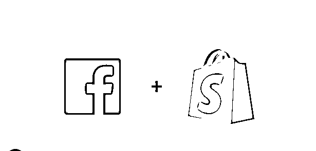<ne-text id="u70b6f81a" ne-bold="true" style="color: rgb(255, 153, 51);">Facebook ads 面临存量竞争</ne-text><ne-text id="u2cf8a9f8" ne-bold="true" style="color: rgb(255, 153, 51);"><ne-text id="u399cb284" style="color: rgb(34, 34, 34);">Facebook 目前对账户风控这块不友好，面临更多的同行竞争，流量越来越贵这个是不争的事情，从身边朋友来看 Facebook 目前还是有不少跑的好的商家一直很稳定的产出，也活的不错只是利润低了一点而已。</ne-text><ne-text id="uc38f705f" style="color: rgb(34, 34, 34);"><ne-text id="u5b1cf669" style="color: rgb(34, 34, 34);">但是不会出现前几年那种 ROI 十几二十倍的事情了，因为平台面临的是用户留存问题，而不是用户增长的问题了，这二个关键点导致平台的战略也是不一样的。</ne-text><ne-text id="u4cfa4cc1" ne-bold="true" style="color: rgb(255, 153, 51);">不同时期不同打法</ne-text><ne-text id="u70e2ea38" ne-bold="true" style="color: rgb(255, 153, 51);"><ne-text id="u968d25d3" style="color: rgb(34, 34, 34);">在任何一个平台做生意，当你感觉不好做的时候，一定要马上去跟进平台的步伐调整，不然等你没做的时候，那会就是你被平台淘汰了而已。用户和需求还是在那里，这个生意照常有人做的好好的。</ne-text><ne-text id="u0ac61827" style="color: rgb(34, 34, 34);"><ne-text id="ubdac1d8d" style="color: rgb(34, 34, 34);">增长期平台希望各方面资源，各方面服务都快速拉去来，以到达用户数的高点，那争取更好的竞争力。</ne-text><ne-text id="u4a6c19f0" style="color: rgb(34, 34, 34);"><ne-text id="u6657b25d" style="color: rgb(34, 34, 34);">没有增长期平台更希望用户各方面服务和信息，能够更好干净绿色，所以平台宁愿不赚眼前的钱也要把服务和生态建设好，用户留存的更久，用户的用户终身价值才会更好更好看。</ne-text><ne-text id="u583c7ded" style="color: rgb(34, 34, 34);"><ne-card data-card-name="image" data-card-type="inline" id="KV4b7" data-event-boundary="card" style="color: rgb(255, 153, 51);"><ne-text id="u71d7073d" style="color: rgb(34, 34, 34);">所以很多之前 Facebook+shopify 为主的公司，都会遇到平台很严格的审查，动不动就是广告账户出问题，到这个阶段了想要避免这个问题，真的就是要从自身找原因了。</ne-text><ne-text id="u08d3a583" style="color: rgb(34, 34, 34);"><ne-text id="u466887c5" style="color: rgb(34, 34, 34);">比如自己的网站各方面条款都合规，素材方面有没有盗用或者混剪别人的素材，产品方面是否合规，发货时效是否能达到好的用户体验。</ne-text><ne-text id="ue18b7697" style="color: rgb(34, 34, 34);"><ne-text id="u849d8464" style="color: rgb(34, 34, 34);">存量市场面临的都是以提高用户为核心竞争力，这个规则，适用于任何中后期平台</ne-text><ne-card data-card-name="image" data-card-type="inline" id="NnM91" data-event-boundary="card" style="color: rgb(255, 153, 51);"><ne-text id="u6203bb9f" ne-bold="true" style="color: rgb(255, 153, 51);">TIktok+shopify 属于早期阶段</ne-text><ne-text id="ud77f0b20" ne-bold="true" style="color: rgb(255, 153, 51);"><ne-text id="ub92ffbba" style="color: rgb(34, 34, 34);">Tiktok+shopify 跨境电商模式，其中主要运用的商业模式就是 Dropshipping，也叫做直销，简单点就是一件代发模式，这个模式在国外是存在很久了。</ne-text><ne-text id="u34f7f945" style="color: rgb(34, 34, 34);"><ne-text id="u74d8d66c" style="color: rgb(34, 34, 34);">最早兴起就是国外，其实老外玩 Dropshipping 比我们国人，在营销技巧和品牌打造方面是更胜一筹的，最近常泡在 YouTube 上面学习这些老外的营销 技巧。</ne-text><ne-text id="u957527d3" style="color: rgb(34, 34, 34);"><ne-text id="u4d8acc72" style="color: rgb(34, 34, 34);">有朋友在运气好+选品正确的情况下，打对了爆款产品，2 月卖了几十万美金，馆长当然没这么多。</ne-text><ne-text id="uc3f444a4" style="color: rgb(34, 34, 34);"><ne-text id="u8d5250f3" style="color: rgb(34, 34, 34);">当然在爆的时候卖的什么产品，大家也不会去问，但是在爆完之后大家还是愿意分享产品方面的一些思路的。</ne-text><ne-text id="u9a70312d" style="color: rgb(34, 34, 34);"><ne-text id="u554f0183" style="color: rgb(34, 34, 34);">这里有个点他们基本都是走的爆款模式，前期就是最多 100 元的 CBO 广告费去测试，根据过往经验来看，只要产品和素材是潜力爆款基本前期的数据就会很好。</ne-text><ne-text id="ub10d86cc" style="color: rgb(34, 34, 34);"><ne-text id="ua1e97767" style="color: rgb(34, 34, 34);">这种产品可能只是一时的热度几个月就过去了，我们只能学习他们的思路和营销手法，在结合自己的策略来进行优化。</ne-text><ne-text id="uf1dc406f" ne-bold="true" style="color: rgb(255, 153, 51);">01\. Dropshipping 模式</ne-text><ne-text id="udb61ac65" ne-bold="true" style="color: rgb(255, 153, 51);"><ne-text id="uf03f9797" style="color: rgb(34, 34, 34);">其实通过下面这张就很容易理解了，客户在 Dropshipping 运营的网站上面下单，运营者在把订单分发给产品的供应商或者工厂，然后从中来赚取差价！</ne-text><ne-text id="udd4dd5a3" style="color: rgb(34, 34, 34);"><ne-text id="ueb046c2f" style="color: rgb(34, 34, 34);">就是这么简单，其实国内这个模式也非常常见，也许你在抖音、淘宝看到的买到的东西，都是来自于 1688 或者拼多多。</ne-text><ne-text id="u01249f4a" style="color: rgb(34, 34, 34);">你在店铺上面下单后，店主在把你的订单分发给供应商。</ne-text><ne-text id="u931cd738" style="color: rgb(34, 34, 34);"><ne-text id="u3b0e6a2c" style="color: rgb(34, 34, 34);">换在了 tiktok 上面只是换了平台而已。</ne-text><ne-text id="ua607d98f" style="color: rgb(34, 34, 34);"><ne-card data-card-name="image" data-card-type="inline" id="B56KH" data-event-boundary="card" style="color: rgb(255, 153, 51);"><ne-text id="ua254cc00" style="color: rgb(34, 34, 34);">所以如果想在海外操作 Dropshipping 的话首先你需要选定一个平台，行业里面最常见的就是 Facebook+shopify，到现在的新兴平台 tiktok+shopify。</ne-text><ne-text id="uea3cd91c" style="color: rgb(34, 34, 34);"><ne-text id="u8cc0d00d" style="color: rgb(34, 34, 34);">Facebook、tiktok、pinterest 它们本质上就是一个引流平台而已，然后你通过 shopify 来承接从这些平台引过来的流量从而变现。</ne-text><ne-text id="u5cc8174e" style="color: rgb(34, 34, 34);"><ne-text id="ua2da5345" style="color: rgb(34, 34, 34);">今天我们主要说 tiktok+shopify 这种模式如何做，首先我们需要准备一个独立站，推荐直接使用 shopify 就好了，目前有活动原价 29 美金一个月现在只要 1 美元。</ne-text><ne-text id="ub1fd61ee" ne-bold="true" style="color: rgb(255, 153, 51);">02\. shopify 建站</ne-text><ne-text id="u774c97de" ne-bold="true" style="color: rgb(255, 153, 51);"><ne-text id="u22ab4bbd" style="color: rgb(34, 34, 34);">shopify 是目前市面上占有率最高的独立站 SaaS 公司，所以我们可以直接选择 shopify 来搭建我们的独立站点。</ne-text><ne-text id="u0d9fdf84" style="color: rgb(34, 34, 34);"><ne-text id="u4a58baab" ne-bold="true" style="color: rgb(255, 153, 51);">官方网站 </ne-text>[<ne-text id="ue3ded4c6" ne-bold="true" style="color: rgb(255, 153, 51);">shopify.com</ne-text>](http://shopify.com)<ne-card data-card-name="image" data-card-type="inline" id="DVi4l" data-event-boundary="card" style="color: rgb(255, 153, 51);"><ne-text id="u130da804" style="color: rgb(34, 34, 34);">输入一个邮箱号开始进入注册流程</ne-text><ne-text id="ue204339d" style="color: rgb(34, 34, 34);"><ne-text id="ubd3459ba" ne-bold="true" style="color: rgb(255, 153, 51);">a、选择你的业务销售方式</ne-text><ne-card data-card-name="image" data-card-type="inline" id="RonLR" data-event-boundary="card" style="color: rgb(255, 153, 51);">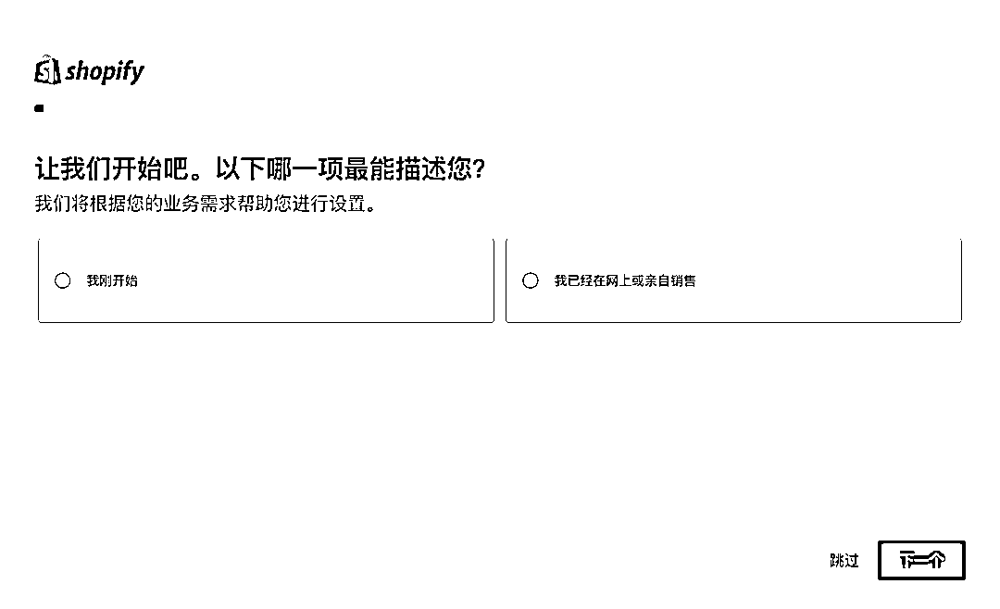<ne-text id="u6a23aaea" ne-bold="true" style="color: rgb(255, 153, 51);">b、默认选择网上商店</ne-text><ne-card data-card-name="image" data-card-type="inline" id="r2s64" data-event-boundary="card" style="color: rgb(255, 153, 51);">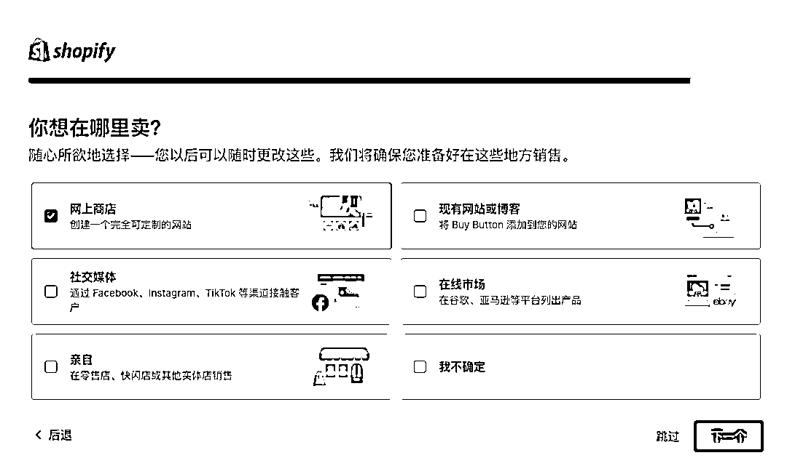<ne-text id="uc64ecb4d" ne-bold="true" style="color: rgb(255, 153, 51);">c、选择无</ne-text><ne-card data-card-name="image" data-card-type="inline" id="Wo6mz" data-event-boundary="card" style="color: rgb(255, 153, 51);"><ne-text id="u99343cd6" ne-bold="true" style="color: rgb(255, 153, 51);">d、这里填写你的商品名字</ne-text><ne-text id="u761a6e7b" ne-bold="true" style="color: rgb(255, 153, 51);"><ne-card data-card-name="image" data-card-type="inline" id="cH2qZ" data-event-boundary="card" style="color: rgb(255, 153, 51);"><ne-text id="ud66b5751" ne-bold="true" style="color: rgb(255, 153, 51);">e、选择商店的国家</ne-text><ne-text id="u051513fd" ne-bold="true" style="color: rgb(255, 153, 51);"><ne-card data-card-name="image" data-card-type="inline" id="fNMhv" data-event-boundary="card" style="color: rgb(255, 153, 51);"><ne-text id="uaaa7636c" ne-bold="true" style="color: rgb(255, 153, 51);">f、输入邮箱和密码</ne-text><ne-text id="u5cee9b80" ne-bold="true" style="color: rgb(255, 153, 51);"><ne-card data-card-name="image" data-card-type="inline" id="JIb7J" data-event-boundary="card" style="color: rgb(255, 153, 51);">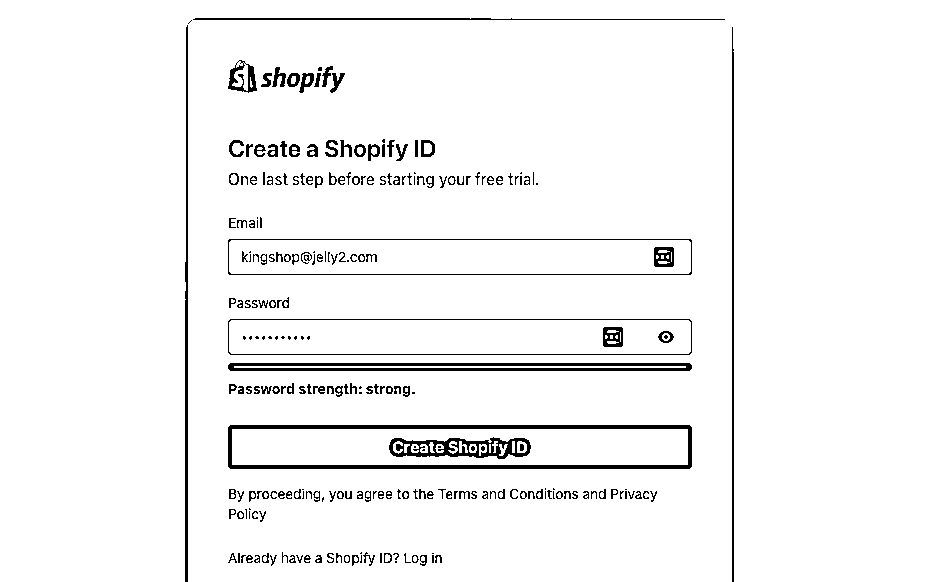<ne-text id="u9fc5da41" ne-bold="true" style="color: rgb(255, 153, 51);">g、注册成功后选择$1 美金的套餐试用 3 个月</ne-text><ne-text id="udfac30eb" ne-bold="true" style="color: rgb(255, 153, 51);"><ne-card data-card-name="image" data-card-type="inline" id="Pss5i" data-event-boundary="card" style="color: rgb(255, 153, 51);"><ne-text id="uc51f1fe9" ne-bold="true" style="color: rgb(255, 153, 51);">03\. Tiktok ads 开户</ne-text><ne-text id="ue3ed3fba" ne-bold="true" style="color: rgb(255, 153, 51);"><ne-text id="u345229c6" ne-bold="true" style="color: rgb(255, 153, 51);">目前开户有三种方式</ne-text><ne-text id="u8533c378" ne-bold="true" style="color: rgb(255, 153, 51);"><ne-text id="u2cc94109" ne-bold="true" style="color: rgb(255, 153, 51);">1、国内代理商户</ne-text><ne-text id="ub829a1dc" style="color: rgb(34, 34, 34);"> （新手村，欧美需报白，安全性高，有返点）</ne-text><ne-text id="u6bacf293" ne-bold="true" style="color: rgb(255, 153, 51);">2、海外代理商户</ne-text><ne-text id="u268131a8" style="color: rgb(34, 34, 34);">（无新手村、无需报白，安全性高，无返点）</ne-text><ne-text id="u31cd0ede" ne-bold="true" style="color: rgb(255, 153, 51);">3、海外个人户</ne-text><ne-text id="uc9eb90fb" style="color: rgb(34, 34, 34);">（无新手村、无需报白，安全性低）</ne-text><ne-text id="u52f81f80" style="color: rgb(34, 34, 34);"><ne-text id="udbebf5cc" ne-bold="true" style="color: rgb(255, 153, 51);">新手村</ne-text><ne-text id="u6c460bca" style="color: rgb(34, 34, 34);">是指有消耗额度的限制，需要超过了这个额度后才会可以正常消耗。</ne-text><ne-text id="ue254f0aa" style="color: rgb(34, 34, 34);"><ne-text id="uc40891b5" style="color: rgb(34, 34, 34);">安全性主要指如果你的广告户被封禁后的资金问题，如果你不是跑偏门的产品的话，为了节约时间可以直接使用海外个人户去投，后面在慢慢申请国内代理账户。</ne-text><ne-text id="udfac0a8f" style="color: rgb(34, 34, 34);"><ne-text id="uda75e779" style="color: rgb(34, 34, 34);">如需开户相关资源的可以在文末联系馆长</ne-text><ne-text id="udddc0806" style="color: rgb(34, 34, 34);"><ne-text id="u0872f1d8" style="color: rgb(34, 34, 34);">我们这里以海外个人户为例，快速开个户</ne-text><ne-text id="ufda486ce" style="color: rgb(34, 34, 34);">[<ne-text id="ueca05a07" ne-bold="true" style="color: rgb(255, 153, 51);">https://www.tiktok.com/business/en-US</ne-text>](https://www.tiktok.com/business/en-US)<ne-card data-card-name="image" data-card-type="inline" id="czULs" data-event-boundary="card" style="color: rgb(255, 153, 51);"><ne-text id="u723abfb8" style="color: rgb(34, 34, 34);">点击</ne-text><ne-text id="ub79213d0" ne-bold="true" style="color: rgb(255, 153, 51);">Create Now</ne-text><ne-text id="u4d2f677f" style="color: rgb(34, 34, 34);">填写自己的邮箱和密码即可完成注册</ne-text><ne-text id="u9eb4b6bc" style="color: rgb(34, 34, 34);"><ne-card data-card-name="image" data-card-type="inline" id="asJ7F" data-event-boundary="card" style="color: rgb(255, 153, 51);"><ne-text id="ufd65ad10" style="color: rgb(34, 34, 34);">完成后就可以看到 tiktok ads 广告后台概览了</ne-text><ne-text id="u2170282f" style="color: rgb(34, 34, 34);"><ne-card data-card-name="image" data-card-type="inline" id="CoYty" data-event-boundary="card" style="color: rgb(255, 153, 51);">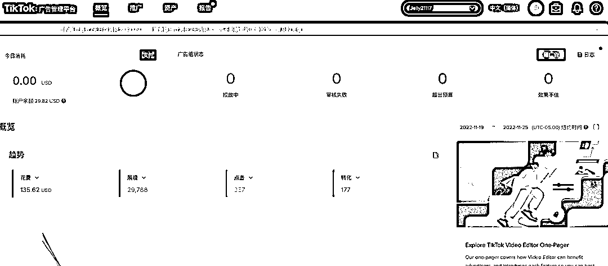<ne-text id="u1f4bad30" style="color: rgb(34, 34, 34);">个人户支持使用 VASA 卡充值，这点的好处就是快，缺点就是如果产品数据很多，广告费你只能用 vasa 充值，可能广告费预算会不够。</ne-text><ne-text id="uf5d205a3" style="color: rgb(34, 34, 34);"><ne-text id="u35b1eeb0" ne-bold="true" style="color: rgb(255, 153, 51);">绑定 Tiktok pixel</ne-text><ne-text id="uff587111" ne-bold="true" style="color: rgb(255, 153, 51);"><ne-card data-card-name="image" data-card-type="inline" id="Cveux" data-event-boundary="card" style="color: rgb(255, 153, 51);"><ne-text id="ue262c72f" style="color: rgb(34, 34, 34);">pixel 像素是广告平台用来追踪用户，在我们独立站的一系列行为的，比如流量、加购、结账、付款这些操作，通过优化这些转化广告可以为我们更好的找到精准客户</ne-text><ne-text id="ube3fa124" style="color: rgb(34, 34, 34);"><ne-text id="u2523db7c" ne-bold="true" style="color: rgb(255, 153, 51);">选择网站事件</ne-text><ne-text id="u7d509223" ne-bold="true" style="color: rgb(255, 153, 51);"><ne-card data-card-name="image" data-card-type="inline" id="SZU7r" data-event-boundary="card" style="color: rgb(255, 153, 51);">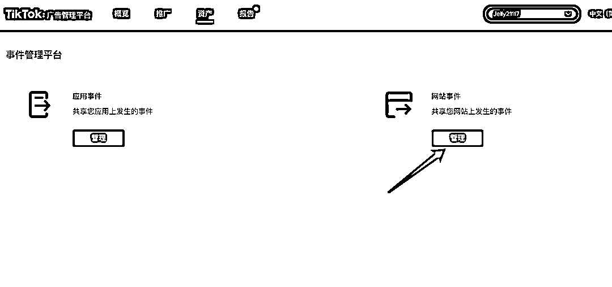<ne-text id="ua4bbeef1" style="color: rgb(34, 34, 34);">输入像素的名称，然后选择 Tiktok Pixel 选项</ne-text><ne-text id="ue08aba78" style="color: rgb(34, 34, 34);"><ne-card data-card-name="image" data-card-type="inline" id="KF81F" data-event-boundary="card" style="color: rgb(255, 153, 51);">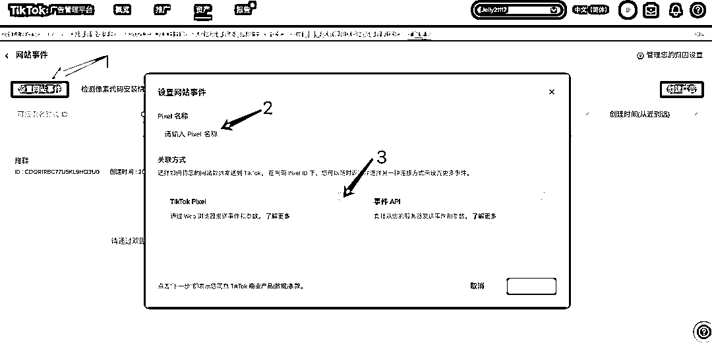<ne-text id="u6f8b0406" style="color: rgb(34, 34, 34);">这选择通过合作伙伴自动设置像素，我们需要在 shopify 里面安装一个 Tiktok 的应用。</ne-text><ne-text id="uc2382341" style="color: rgb(34, 34, 34);"><ne-card data-card-name="image" data-card-type="inline" id="KCGlv" data-event-boundary="card" style="color: rgb(255, 153, 51);"><ne-text id="uac63296e" style="color: rgb(34, 34, 34);">这里选择对应的平台 shopify</ne-text><ne-text id="u4c821db0" style="color: rgb(34, 34, 34);"><ne-card data-card-name="image" data-card-type="inline" id="Bq24D" data-event-boundary="card" style="color: rgb(255, 153, 51);"><ne-text id="u129c200a" style="color: rgb(34, 34, 34);">在 shopify 的 tiktok 输入自己的广告账户，然后就可以选择刚刚创建的像素了</ne-text><ne-text id="ua3592e04" style="color: rgb(34, 34, 34);"><ne-card data-card-name="image" data-card-type="inline" id="EWk6x" data-event-boundary="card" style="color: rgb(255, 153, 51);">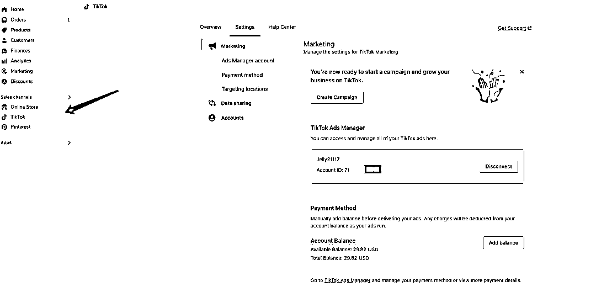<ne-text id="u5665d3df" style="color: rgb(34, 34, 34);">到了这一步就完成了 Tiktok 到 shopify 的设置了，通过刚刚安装的像素广告平台就可以追踪用户进站的数据了，从而进行广告受众的优化。</ne-text><ne-text id="u68634f25" style="color: rgb(34, 34, 34);"><ne-text id="u8fe4d06c" style="color: rgb(34, 34, 34);">当然站点还需要多多进行一系列的优化，提高网站的信任度，不要让客户进来一看网站就像一个骗子网站。</ne-text><ne-text id="ub132f2a8" style="color: rgb(34, 34, 34);"><ne-text id="uae77c749" ne-bold="true" style="color: rgb(255, 153, 51);">落地页打造</ne-text><ne-text id="u5993772b" ne-bold="true" style="color: rgb(255, 153, 51);"><ne-text id="u5adbdce9" style="color: rgb(34, 34, 34);">落地页是提升我转化率的关键，客户进去看起来是像一个品牌站还是杂货铺，有以下几点关键。</ne-text><ne-text id="u8f0ba1a5" style="color: rgb(34, 34, 34);"><ne-text id="u3a811b9a" ne-bold="true" style="color: rgb(255, 153, 51);">1、页面干净</ne-text><ne-text id="u9c762a64" ne-bold="true" style="color: rgb(255, 153, 51);"><ne-text id="ufad4ad5e" style="color: rgb(34, 34, 34);">页面没有多余的元素</ne-text><ne-text id="u380421de" style="color: rgb(34, 34, 34);">标题+评分+选项+购买按钮</ne-text><ne-text id="ua5b757f8" style="color: rgb(34, 34, 34);"><ne-card data-card-name="image" data-card-type="inline" id="WfBru" data-event-boundary="card" style="color: rgb(255, 153, 51);"><ne-text id="u4efb8e54" ne-bold="true" style="color: rgb(255, 153, 51);">详情页</ne-text><ne-text id="ud8deaadc" ne-bold="true" style="color: rgb(255, 153, 51);"><ne-text id="u2902c338" style="color: rgb(34, 34, 34);">核心公式：标题+描述+GIF 图</ne-text><ne-text id="ueee94e60" style="color: rgb(34, 34, 34);"><ne-text id="ua3575a12" style="color: rgb(34, 34, 34);">你去哪些爆款站看基本都是参照这个公式来的，因为用户不管是从文字还是动图都可以很好的了解你这个产品。</ne-text><ne-text id="u4d6f4510" style="color: rgb(34, 34, 34);"><ne-card data-card-name="image" data-card-type="inline" id="rrZcg" data-event-boundary="card" style="color: rgb(255, 153, 51);">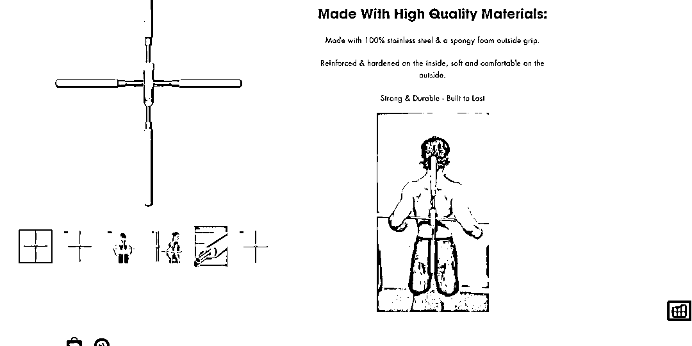<ne-text id="u1c1a3d8f" ne-bold="true" style="color: rgb(255, 153, 51);">04\. 如何进行选品</ne-text><ne-text id="u660456f1" ne-bold="true" style="color: rgb(255, 153, 51);"><ne-text id="u1889c82e" style="color: rgb(34, 34, 34);">选品决定了产品一大半的成功概率，选的方式太多了今天只分享一些经过实验不错的方法。</ne-text><ne-text id="ubdfe872e" style="color: rgb(34, 34, 34);"><ne-text id="u1cb49624" ne-bold="true" style="color: rgb(255, 153, 51);">选品的核心几点</ne-text><ne-text id="u7b91e98c" ne-bold="true" style="color: rgb(255, 153, 51);"><ne-text id="u4642e43f" ne-bold="true" style="color: rgb(255, 153, 51);">1、高价格感知</ne-text><ne-text id="u8e0597b1" style="color: rgb(0, 0, 0);">这个其实很好理解，你的这个产品具不具备高大上的特点，因为你想你投放一个产品成本其实不低的，所以你的产品要么具备以下特点</ne-text><ne-text id="u8e93f9c3" style="color: rgb(0, 0, 0);"><ne-text id="u7d3262c7" ne-bold="true" style="color: rgb(255, 153, 51);">情感营销</ne-text><ne-text id="ub161374a" ne-bold="true" style="color: rgb(255, 153, 51);"><ne-text id="uef09ccc6" style="color: rgb(0, 0, 0);">我知道一些定制类的产品，这些产品更多打的是感情牌，比如给自己宠物、爱人、家人为抓手去定义这些元素，这种可能不好用钱去衡量。</ne-text><ne-text id="uf4745570" style="color: rgb(0, 0, 0);"><ne-text id="ub4babf81" ne-bold="true" style="color: rgb(255, 153, 51);">价值营销</ne-text><ne-text id="u1d5e9556" ne-bold="true" style="color: rgb(255, 153, 51);"><ne-text id="u81b7ca7e" style="color: rgb(34, 34, 34);">如果你的产品打的是功能性的东西，这个产品从外观来看是不是感觉很贵，一样看起来就不会什么几美金的东西，这点也很重要，包括他的功能性决定的问题大不大？</ne-text><ne-text id="u51d967bf" style="color: rgb(34, 34, 34);"><ne-text id="ua7a27572" style="color: rgb(34, 34, 34);">还是只是一些不痛不痒的伪需求，这点要考察清楚，因为这些会决定你的产品定价和用户购买的动机强不强。</ne-text><ne-text id="u4d009e7e" style="color: rgb(34, 34, 34);"><ne-text id="u7ebd6df8" ne-bold="true" style="color: rgb(255, 153, 51);">2、价格能 x3 倍</ne-text><ne-text id="u1e95c466" ne-bold="true" style="color: rgb(255, 153, 51);"><ne-card data-card-name="image" data-card-type="inline" id="OGvld" data-event-boundary="card" style="color: rgb(255, 153, 51);"><ne-text id="u9b7adedc" style="color: rgb(0, 0, 0);">价格方面首先从选品来看，当然不能直接从价格上来定义，你比如选了一个 1 美金的东西那你买 3 美金肯定是不合适的。</ne-text><ne-text id="uef8d3097" style="color: rgb(0, 0, 0);"><ne-text id="u135bf105" style="color: rgb(34, 34, 34);">我们最终的售价是由于多个方面来决定的，产品价格+包装费+运费+广告+佣金+其他费用</ne-text><ne-text id="u57139e31" style="color: rgb(34, 34, 34);"><ne-text id="u84b948d5" style="color: rgb(34, 34, 34);">最后你的售价需要扣除你所有的成本后，才是你的盈利，所以你的产品定价能否支撑这些成本，要需要注意</ne-text><ne-text id="u07ea5bd4" style="color: rgb(34, 34, 34);"><ne-text id="u1e0023ad" ne-bold="true" style="color: rgb(255, 153, 51);">3、新鲜度</ne-text><ne-text id="u3917a3d9" ne-bold="true" style="color: rgb(255, 153, 51);"><ne-text id="u6a0a6a1d" style="color: rgb(0, 0, 0);">你的产品是不是一些被营销过剩的产品，这点很重要因为你可能通过数据看到了某一个产品的销售都非常好。</ne-text><ne-text id="u1ae01f2e" style="color: rgb(0, 0, 0);">但是你可能不知道这个产品在平台被很多人已经营销过了，不管是免费流量还是付费，用户其实都已经看过的东西了，已经不具备新鲜感了。</ne-text><ne-text id="uad88442a" style="color: rgb(0, 0, 0);"><ne-text id="u8b864d3d" style="color: rgb(0, 0, 0);">这种产品大概率你的数据不会很好，</ne-text><ne-text id="u2aa970cb" ne-bold="true" style="color: rgb(255, 153, 51);">新奇特</ne-text><ne-text id="u15c47454" style="color: rgb(0, 0, 0);">是做短视频营销的核心。</ne-text><ne-text id="u87d1f234" style="color: rgb(0, 0, 0);"><ne-text id="u07327173" style="color: rgb(34, 34, 34);">所以产品一定是能在视频中展出出来的，而且要足够的吸引人才行。</ne-text><ne-text id="u44a1d733" style="color: rgb(34, 34, 34);"><ne-text id="uc8cdffc0" ne-bold="true" style="color: rgb(255, 153, 51);">4、有购买痛点的产品</ne-text><ne-text id="u62cd7a58" ne-bold="true" style="color: rgb(255, 153, 51);"><ne-text id="ua97a7cdf" style="color: rgb(34, 34, 34);">产品一定是需要能解决痛点的，你会发现很多播放高的视频，其实是一些非产品内容具备争议性，最好的办法就是看评论区是否有很多问，如何买？怎么买之类的问题</ne-text><ne-text id="u014bb611" style="color: rgb(34, 34, 34);"><ne-text id="u0aed386e" ne-bold="true" style="color: rgb(255, 153, 51);">5、在竞品基础上有改进空间</ne-text><ne-text id="ud36a3f2d" ne-bold="true" style="color: rgb(255, 153, 51);"><ne-text id="uc64677e4" style="color: rgb(0, 0, 0);">这个改进空间可以从多个维度来看，产品的定价、产品的素材、产品的落地页，只要有一项你能吊打对手符合标准的情况下，你就完成可以尝试。</ne-text><ne-text id="u745c73d8" style="color: rgb(0, 0, 0);"><ne-text id="ubfc49611" style="color: rgb(34, 34, 34);">但是如果你的对手已经把各方面都优化的很到位了，这个时间杀进去其实很多去竞争的。</ne-text><ne-text id="u040f2d07" style="color: rgb(34, 34, 34);"><ne-text id="u1abc76fc" style="color: rgb(34, 34, 34);">所以挑选比自己弱的对手这个点很重要。</ne-text><ne-text id="ud0bc707a" style="color: rgb(34, 34, 34);"><ne-text id="ubf2a99f2" ne-bold="true" style="color: rgb(255, 153, 51);">站内选品关键词选品</ne-text><ne-text id="u2d57fa0a" ne-bold="true" style="color: rgb(255, 153, 51);"><ne-text id="u0bef03f8" style="color: rgb(255, 76, 0);">#tiktok made me buy it</ne-text><ne-text id="u311f3838" style="color: rgb(255, 76, 0);">#musthave</ne-text><ne-text id="u7877999f" style="color: rgb(255, 76, 0);">#I want a refund</ne-text><ne-text id="ua67e8225" style="color: rgb(255, 76, 0);">#50% off</ne-text><ne-text id="u7959b831" style="color: rgb(255, 76, 0);"><ne-text id="ua84a697d" style="color: rgb(34, 34, 34);">通过关键词可以找到很多有趣播放还很高的产品，可以多多利用这几个关键词去筛选符合标准的准备。</ne-text><ne-text id="u8b3dce15" style="color: rgb(34, 34, 34);"><ne-card data-card-name="image" data-card-type="inline" id="AIc19" data-event-boundary="card" style="color: rgb(255, 153, 51);"><ne-text id="ua4ae4fc8" ne-bold="true" style="color: rgb(255, 153, 51);">Facebook ads 选品</ne-text><ne-text id="u50e53729" ne-bold="true" style="color: rgb(255, 153, 51);"><ne-text id="u3e933687" style="color: rgb(34, 34, 34);">这个主要利用 Facebook 的广告工具进行筛选，里面有大量可以提供参考的产品，也可以利用这个查看对手是否已经在 Facebook 打上广告了</ne-text><ne-text id="u4ab1a9e3" style="color: rgb(34, 34, 34);"><ne-card data-card-name="image" data-card-type="inline" id="lAAQf" data-event-boundary="card" style="color: rgb(255, 153, 51);">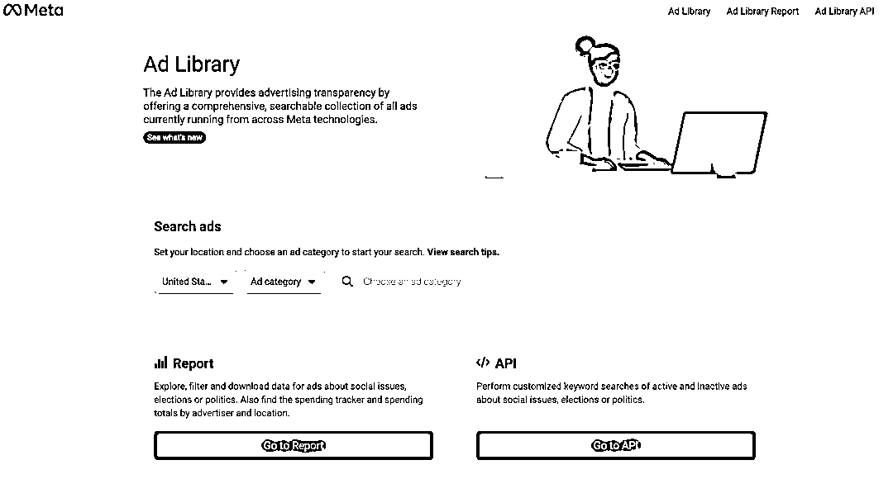<ne-text id="ud638fdc9" ne-bold="true" style="color: rgb(255, 153, 51);">利用系统推荐</ne-text><ne-text id="u8ac2d9d2" ne-bold="true" style="color: rgb(255, 153, 51);"><ne-text id="u75c21a3c" style="color: rgb(34, 34, 34);">我知道字节系的产品都有推荐功能，只要你多对一些卖货视频多点赞，看到广告了多点开落地页去加购，基本一会功夫后面全部都是这种素材推荐过来。</ne-text><ne-text id="u20b634de" style="color: rgb(34, 34, 34);"><ne-text id="uacaa3cc9" style="color: rgb(34, 34, 34);">利用系统的推荐算法是一个不错的选品方法。</ne-text><ne-text id="u6b3026dd" style="color: rgb(34, 34, 34);"><ne-card data-card-name="image" data-card-type="inline" id="eO1rS" data-event-boundary="card" style="color: rgb(255, 153, 51);"><ne-text id="ud5c0f876" ne-bold="true" style="color: rgb(255, 153, 51);">亚马逊最近热榜</ne-text><ne-text id="ueeba223f" ne-bold="true" style="color: rgb(255, 153, 51);"><ne-text id="u931929d0" style="color: rgb(34, 34, 34); background-color: rgb(255, 255, 255);">通过亚马逊最近的一小时热</ne-text><ne-text id="u91ad0336" style="color: rgb(34, 34, 34);">榜</ne-text><ne-text id="ue26e9d5f" style="color: rgb(34, 34, 34); background-color: rgb(255, 255, 255);">，我们可以发现不少销量飙升的产品</ne-text><ne-text id="ubc56075d" style="color: rgb(34, 34, 34); background-color: rgb(255, 255, 255);"><ne-card data-card-name="image" data-card-type="inline" id="WStqU" data-event-boundary="card" style="color: rgb(255, 153, 51);"><ne-text id="udea1a8a5" ne-bold="true" style="color: rgb(255, 153, 51);">tiktok 创意营销中心</ne-text><ne-text id="u56377bd6" ne-bold="true" style="color: rgb(255, 153, 51);"><ne-text id="u94de9b1a" style="color: rgb(34, 34, 34);">创意营销中心是官方的平台，里面的广告都是广告主目前的投放数据，通过这个平台也能发现一些不错的产品，</ne-text><ne-text id="u9433e6bb" style="color: rgb(34, 34, 34);"><ne-card data-card-name="image" data-card-type="inline" id="npsJN" data-event-boundary="card" style="color: rgb(255, 153, 51);"><ne-text id="u52c6fc79" style="color: rgb(34, 34, 34);">并且我们还能发现广告的完整数据比如 CTR、CVR 这些，推荐大家去使用</ne-text><ne-text id="u191d4afc" style="color: rgb(34, 34, 34);"><ne-card data-card-name="image" data-card-type="inline" id="QnaXs" data-event-boundary="card" style="color: rgb(255, 153, 51);">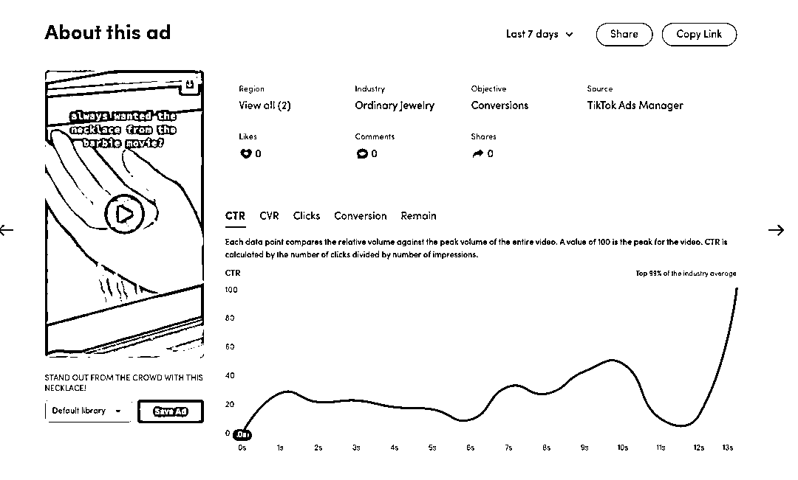<ne-text id="u32f83b02" ne-bold="true" style="color: rgb(255, 153, 51);">付费工具</ne-text><ne-text id="u3e0a3e7f" ne-bold="true" style="color: rgb(255, 153, 51);"><ne-text id="u6bcef48f" style="color: rgb(34, 34, 34);">付费工具很多，比如 adspy、pipiads、利用关键词可以搜索到很多平台，利用这种工具的核心就是，减少我们的试错成本，找到市场上已经验证过的产品，提高我们的投资回报率。</ne-text><ne-text id="u0784043a" style="color: rgb(34, 34, 34);"><ne-text id="uf51cf9e1" style="color: rgb(34, 34, 34);"><ne-text id="ufc5c80ff" style="color: rgb(34, 34, 34);">我们这里以 pipiads 为例。</ne-text><ne-text id="ubf564c76" style="color: rgb(34, 34, 34);"><ne-card data-card-name="image" data-card-type="inline" id="yW72f" data-event-boundary="card" style="color: rgb(255, 153, 51);"><ne-text id="u5ade9393" ne-bold="true" style="color: rgb(255, 153, 51);">pipiads 广告间谍工具</ne-text><ne-text id="u060fbd0a" ne-bold="true" style="color: rgb(255, 153, 51);"><ne-text id="ub53e7643" style="color: rgb(34, 34, 34);">可以看到我的几个筛选项，定位国家=美国、按钮=shop now、不是品牌广告、点赞>400，更多的筛选可以自己多去体验下。</ne-text><ne-text id="u87d47ec0" style="color: rgb(34, 34, 34);"><ne-text id="u2311e904" style="color: rgb(34, 34, 34);">通过这个设置看到很多目前在跑的广告主，通过这些数据我们就是站在巨人的肩膀上了，哪些广告跑的好跑的差，包括他的落地页我们都非常清楚了。</ne-text><ne-text id="uf5642f28" style="color: rgb(34, 34, 34);"><ne-text id="u3022f64e" style="color: rgb(34, 34, 34);">所以当你选定一个产品的时候也可以通过这种方式，去找到你的同行看是否具备竞争力，以及产品是否已经被清洗完了。</ne-text><ne-text id="u02638272" style="color: rgb(34, 34, 34);"><ne-card data-card-name="image" data-card-type="inline" id="LJAnV" data-event-boundary="card" style="color: rgb(255, 153, 51);">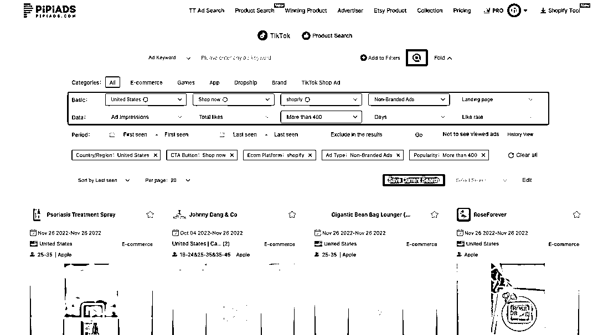<ne-text id="ud9bcb504" style="color: rgb(34, 34, 34);">点击广告还可以查看广告主的投放主页，查看它的全部再投素材</ne-text><ne-text id="ue830fea5" style="color: rgb(34, 34, 34);"><ne-card data-card-name="image" data-card-type="inline" id="XOsLP" data-event-boundary="card" style="color: rgb(255, 153, 51);">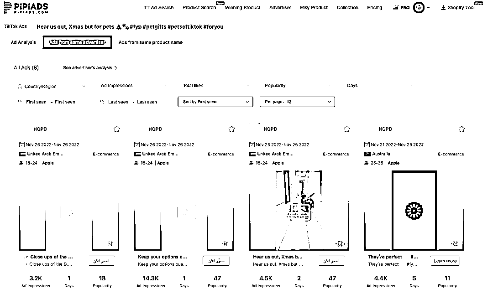<ne-text id="u8de02ce7" ne-bold="true" style="color: rgb(255, 153, 51);">最近的爆款筛选</ne-text><ne-text id="u39489213" ne-bold="true" style="color: rgb(255, 153, 51);"><ne-text id="ubb088ec9" style="color: rgb(34, 34, 34);">工具有一个功能可以看到最近那个广告主在大量的扩充素材，这个前期只有一个它的产品一定是数据很好，跑爆了对于跟爆品来说，这个功能确实非常不错。</ne-text><ne-text id="uf0eb3da3" style="color: rgb(34, 34, 34);"><ne-card data-card-name="image" data-card-type="inline" id="WQWqf" data-event-boundary="card" style="color: rgb(255, 153, 51);"><ne-text id="u58acfc80" ne-bold="true" style="color: rgb(255, 153, 51);">谷歌趋势</ne-text><ne-text id="ud02834f6" ne-bold="true" style="color: rgb(255, 153, 51);"><ne-text id="ua226ce64" style="color: rgb(34, 34, 34);">在确定一个产品之后我们还可以看下谷歌趋势如何，通过谷歌趋势可以大致宏观的判断一个产品的走势情况，如果处理上升阶段那么代表这个产品，确实是一个利好的产品。</ne-text><ne-text id="ufaab545b" style="color: rgb(34, 34, 34);"><ne-text id="ucb98455f" style="color: rgb(34, 34, 34);">比如最近的世界杯，肯定是一个飙升的指数，如果去找世界杯周边相关的产品，一定是个不错的选择。</ne-text><ne-text id="uaec81846" style="color: rgb(34, 34, 34);"><ne-text id="u2af09957" style="color: rgb(34, 34, 34);">通过趋势来判断我们产品大致的一个走向。</ne-text><ne-text id="u5a337283" style="color: rgb(34, 34, 34);"><ne-card data-card-name="image" data-card-type="inline" id="CHZEz" data-event-boundary="card" style="color: rgb(255, 153, 51);"><ne-text id="u4b455f43" ne-bold="true" style="color: rgb(255, 153, 51);">谷歌关键词研究</ne-text><ne-text id="ud31ca1d1" ne-bold="true" style="color: rgb(255, 153, 51);"><ne-text id="uc54b0731" style="color: rgb(34, 34, 34);">通过谷歌的工具我们可以更加精准判断某一个关键词的搜索量，搜索量越大代表需求越大。</ne-text><ne-text id="ub8372093" style="color: rgb(34, 34, 34);"><ne-card data-card-name="image" data-card-type="inline" id="ZPswZ" data-event-boundary="card" style="color: rgb(255, 153, 51);"><ne-text id="u3c0a6cc4" ne-bold="true" style="color: rgb(255, 153, 51);">05\. 广告投放</ne-text><ne-text id="u9a92a185" ne-bold="true" style="color: rgb(255, 153, 51);"><ne-text id="u5b4cd2d9" style="color: rgb(34, 34, 34);">我们需要先创建一个广告系列，选自定义模式</ne-text><ne-text id="uf8f8bab6" style="color: rgb(34, 34, 34);"><ne-card data-card-name="image" data-card-type="inline" id="ifYCz" data-event-boundary="card" style="color: rgb(255, 153, 51);"><ne-text id="u82ac64c4" ne-bold="true" style="color: rgb(255, 153, 51);">创建广告系列</ne-text><ne-text id="ufdc29fe0" ne-bold="true" style="color: rgb(255, 153, 51);"><ne-text id="u1bc576ee" style="color: rgb(34, 34, 34);">可以看到这里有很多推广目标，对于电商来说我们首选当然是转化率优先了。</ne-text><ne-text id="u4a6b5415" style="color: rgb(34, 34, 34);"><ne-card data-card-name="image" data-card-type="inline" id="oqIQh" data-event-boundary="card" style="color: rgb(255, 153, 51);"><ne-text id="ua2f0eb24" ne-bold="true" style="color: rgb(255, 153, 51);">创建广告组 CBO 50-100 美金</ne-text><ne-text id="ubdad7619" ne-bold="true" style="color: rgb(255, 153, 51);"><ne-text id="uc0f28798" style="color: rgb(34, 34, 34);">这里的推荐使用 CBO 的方式去投，50-100 美金预算都可以，广告会根据每个广告组的数据情况来，自动分配预算，这也是利用系统的学习算法。</ne-text><ne-text id="u1ecb1c27" style="color: rgb(34, 34, 34);"><ne-card data-card-name="image" data-card-type="inline" id="itSEH" data-event-boundary="card" style="color: rgb(255, 153, 51);">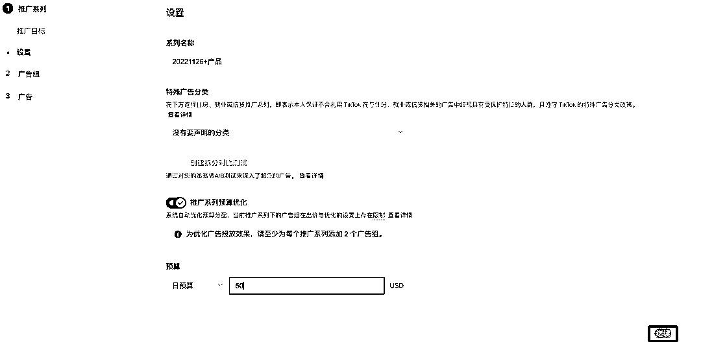<ne-text id="uc8356a16" ne-bold="true" style="color: rgb(255, 153, 51);">Tiktok 版位</ne-text><ne-text id="u326db4ca" ne-bold="true" style="color: rgb(255, 153, 51);"><ne-text id="u1b574b25" style="color: rgb(34, 34, 34);">这里的版位我们只选 Titkok 就行了，其他版本用不到。</ne-text><ne-text id="u807cc141" style="color: rgb(34, 34, 34);"><ne-text id="u6f12b370" ne-bold="true" style="color: rgb(255, 153, 51);">优化方式：支付完成</ne-text><ne-text id="u1931f3e6" ne-bold="true" style="color: rgb(255, 153, 51);">地域：美国 加拿大</ne-text><ne-text id="ua51ea932" ne-bold="true" style="color: rgb(255, 153, 51);">语言：不限</ne-text><ne-text id="udc07029a" ne-bold="true" style="color: rgb(255, 153, 51);">性别：不限</ne-text><ne-text id="udb2397d4" ne-bold="true" style="color: rgb(255, 153, 51);">年龄：18-55+</ne-text><ne-text id="u91c01465" ne-bold="true" style="color: rgb(255, 153, 51);"><ne-text id="u8bcfe498" style="color: rgb(34, 34, 34);">其他兴趣都不选，为什么这样做呢，因为前面说了目前 TK 的受众人群问题，就算你选定了一个兴趣可能这个人的兴趣有多个，那么这多个兴趣的入群也会被包括进去。</ne-text><ne-text id="u164278fd" style="color: rgb(34, 34, 34);"><ne-text id="u8bab4ecb" style="color: rgb(34, 34, 34);">所以导致兴趣可能不会很精准</ne-text><ne-text id="uf5cefb2b" style="color: rgb(34, 34, 34);">除非你是一些特别有经验的产品，了解产品的受众人群。</ne-text><ne-text id="u638813aa" style="color: rgb(34, 34, 34);"><ne-text id="ufb339613" style="color: rgb(34, 34, 34);">不然我们就通投的方式去跑，让希望去帮助在我们找受众，因为系统是清楚你的产品是谁需求的。</ne-text><ne-text id="ua2cec212" style="color: rgb(34, 34, 34);">广告系统不会给你乱花钱，系统更多的是帮助去找到更多精准受众</ne-text><ne-text id="u7d379cfd" style="color: rgb(34, 34, 34);"><ne-card data-card-name="image" data-card-type="inline" id="cnMPF" data-event-boundary="card" style="color: rgb(255, 153, 51);">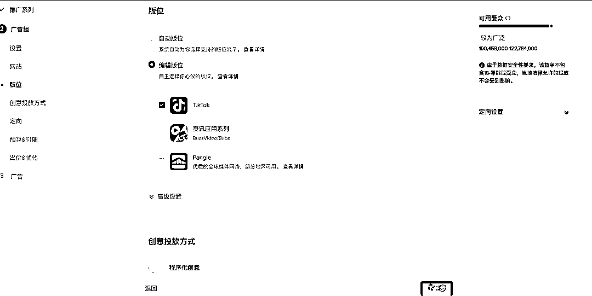<ne-text id="u5ea3df88" ne-bold="true" style="color: rgb(255, 153, 51);">创建广告素材</ne-text><ne-text id="u777a1fb8" ne-bold="true" style="color: rgb(255, 153, 51);"><ne-text id="ue21f8dfb" style="color: rgb(255, 76, 0);">广告文案：</ne-text><ne-text id="uf55ffe58" style="color: rgb(34, 34, 34);">Get yours on sale today</ne-text><ne-text id="uadf33188" style="color: rgb(34, 34, 34);">13 Units Left - Get yuors Now</ne-text><ne-text id="u24788406" style="color: rgb(34, 34, 34);">50% off sale ending soon</ne-text><ne-text id="uc7a9eab6" style="color: rgb(34, 34, 34);">Free shipping this week only</ne-text><ne-text id="u7a3ea8a3" style="color: rgb(34, 34, 34);">Get yours FREE Today!</ne-text><ne-text id="ua333cafa" style="color: rgb(34, 34, 34);">On sale now!</ne-text><ne-text id="u29d7877a" style="color: rgb(34, 34, 34);">Almost SOLD OUT! Get yours now! </ne-text><ne-text id="u979d61ec" style="color: rgb(34, 34, 34);"><ne-text id="u166afef8" style="color: rgb(255, 76, 0);">行动文案：shop now</ne-text><ne-text id="u846dc4e9" style="color: rgb(255, 76, 0);"><ne-text id="uef2dd8a2" ne-bold="true" style="color: rgb(255, 153, 51);">重点：</ne-text><ne-text id="u83f7229d" style="color: rgb(217, 33, 66);">我们这里创建原始广告组后，可以复制 6-10 组，广告组越多系统受众找的越多，后续系统也会根据广告的表现来分配预算。</ne-text><ne-text id="u80b85fdc" style="color: rgb(217, 33, 66);"><ne-text id="uae161212" ne-bold="true" style="color: rgb(255, 153, 51);">数据跟踪</ne-text><ne-text id="uec91c4f8" ne-bold="true" style="color: rgb(255, 153, 51);"><ne-text id="ud1eb0cfc" style="color: rgb(0, 0, 0);">广告创建好后，现在平台审核很多块，基本 10 几分钟就会过审核。后续我们重点关注几个指标</ne-text><ne-text id="u1f69c682" ne-bold="true" style="color: rgb(255, 153, 51);">1、CTR</ne-text><ne-text id="ue6ec3c27" style="color: rgb(0, 0, 0);">如果组的 CTR 低于 0.5%这个时候需要排查原因</ne-text><ne-text id="u2004ae43" ne-bold="true" style="color: rgb(255, 153, 51);">2、CPC</ne-text><ne-text id="u6936aa3e" style="color: rgb(0, 0, 0);">组的 CPC 高于 1 美金，并且没有出单需要排查原因，考虑是否需要关闭组</ne-text><ne-text id="ua8568cc4" ne-bold="true" style="color: rgb(255, 153, 51);">3、消耗</ne-text><ne-text id="u985d93ee" ne-bold="true" style="color: rgb(255, 153, 51);"><ne-text id="u31aef86b" style="color: rgb(0, 0, 0);">整个系列如果>20 美金没有出单考虑是否需要直接关闭系列。</ne-text><ne-text id="u701ad974" style="color: rgb(0, 0, 0);"><ne-text id="u56a51eec" style="color: rgb(0, 0, 0);">这些都是后续优化层面的事情，当广告投放出去以后，基本都需要 1 小时看一次数据，当然平台有提供一些自动规则。</ne-text><ne-text id="u169ebaac" style="color: rgb(0, 0, 0);"><ne-text id="u73e49bee" style="color: rgb(0, 0, 0);">利用平台的自动规则可以降低投放人员的工作量，我们自己也有一些自动规则经过了大量的数据得出来的，也是通过这个工具去进行的。</ne-text><ne-text id="u6fd454ef" style="color: rgb(0, 0, 0);"><ne-card data-card-name="image" data-card-type="inline" id="kApjC" data-event-boundary="card" style="color: rgb(255, 153, 51);">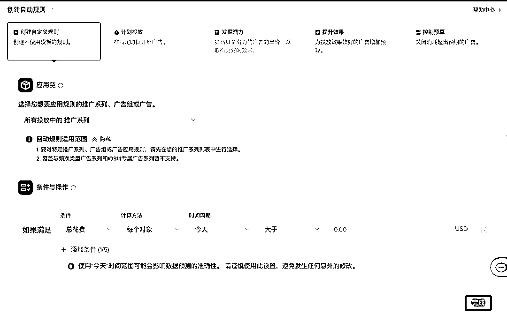<ne-text id="u0cdffce2" style="color: rgb(34, 34, 34);">由于篇幅有限今天的内容就到这，如果需要完整的理解这个过程，还需要自己亲自去实操才行。</ne-text><ne-text id="u5436667a" style="color: rgb(255, 153, 51);">有在做这块的朋友可以一起交流学习。</ne-text> <ne-text id="ub9124404" style="color: rgb(255, 153, 51);">（30 赞）《不同类型卖家在亚马逊打造品牌，铺货、精铺或者精品模式的避坑经验分享》</ne-text><ne-text id="ua4ed304a" style="color: rgb(255, 153, 51);">大家好，我是胖海豚 Arron，创业第八年，营收做到了过亿，自认为也赚了一些小钱，也有一些做跨境电商的心得体会，但这绝不是我能斗胆分享的原因，这点自知之明我还是有的。</ne-text><ne-text id="u45bf3c5d" style="color: rgb(255, 153, 51);">为什么写这篇分享？正所谓成功的经验各不同，失败的教训多相似。我自认为如果能把实实在在花钱踩过的坑分享出来还是挺有意义的一件事儿。</ne-text><ne-text id="uda3ff1d7" style="color: rgb(255, 153, 51);">我是本科国际贸易专业出身，毕业后到一家上市公司做了北美区销售经理，工作几年之后再看看周围同事的工作和生活状态，我意识到如果继续待下去我已经看到了自己的未来，索性找了个借口离职。</ne-text><ne-text id="u86f8ca8e" style="color: rgb(255, 153, 51);">当然我也非常感恩有这段宝贵的工作机会，让我在职业生涯起步阶段就能有很多国外出差的经历、同世界知名的客户谈判、合作等，同时我也明白我只是有个很好的舞台刚好站上去可以跳舞、发光而已。</ne-text><ne-text id="u965eed1c" style="color: rgb(255, 153, 51);">辞职之后进入跨境电商行业，也是偶然中的必然，如果有机会再聊这个话题。</ne-text><ne-text id="udaff0bd8" style="color: rgb(255, 153, 51);">我更愿意把自己定义为一个在路上的创业者，因为在我的意识里赋予了“创业者”很多标签。</ne-text><ne-text id="u7d4c28b2" style="color: rgb(255, 153, 51);">比如持续学习、积极分享、经常面对各种挑战和起伏高低、时常会体验到喜悦、欢笑、希望、无奈、泪水……是的，这种体验跟你我的人生没有太多的差别。</ne-text><ne-text id="u93219fb4" style="color: rgb(255, 153, 51);">今天我分享的框架如下：</ne-text><ne-text id="u17964ad8" style="color: rgb(255, 153, 51);">一、有哪些跨境平台可以选择？</ne-text><ne-text id="u9e7894ee" style="color: rgb(255, 153, 51);">二、亚马逊平台的现状，是否还有机会入局？</ne-text><ne-text id="u01bf947a" style="color: rgb(255, 153, 51);">三、入局亚马逊平台选择什么模式以及对应的坑在哪里？</ne-text><ne-text id="u72899287" style="color: rgb(255, 153, 51);">四、亚马逊平台经验分享</ne-text><ne-text id="ua04bd7f5" style="color: rgb(255, 153, 51);">五、品牌出海</ne-text><ne-text id="uaaa4d625" style="color: rgb(255, 153, 51);">一、跨境平台的选择</ne-text><ne-text id="ucda12cdd" style="color: rgb(255, 153, 51);">其实我们团队创业至今也就做过 Aliexpress, Lazada, eBay, Newegg, Mercadolibre, Walmart 和 Amazon 这几个平台。</ne-text><ne-text id="u452c4f73" style="color: rgb(255, 153, 51);">大家想要了解全球知名的跨境电商平台可以在网上看看（</ne-text> [<ne-text id="ufad3631a" style="color: rgb(255, 153, 51);">https://www.amz123.com/</ne-text>](https://www.amz123.com/)<ne-text id="u0c491f62" style="color: rgb(255, 153, 51);">中的“平台大全”栏目），超过 100 个不同的平台，哪个平台都有做得好的人，也都能做出结果，跟平台没有太大的关系，跟“你”有关系。</ne-text><ne-text id="u63d55aca" style="color: rgb(255, 153, 51);">平台没有绝对的优劣，关键是你手中有什么牌可以选择从哪个平台入手！做过这么多平台，我选择用脚投票——用资金和人才投入来选择亚马逊。</ne-text><ne-text id="ubb9cee93" style="color: rgb(255, 153, 51);">在我的理解里，亚马逊是一个容纳不同类型卖家的平台，不管是个人卖家、小团队还是高举高打的成熟团队，都可以根据自身的目的来经营，比如卖货赚钱、打造品牌、做值钱的团队等。</ne-text><ne-text id="u4c02fdee" style="color: rgb(255, 153, 51);">个人卖家可以从一个产品入手、也可以从一个站点开始，从 0 开始做到有不错的营收。</ne-text><ne-text id="u51a40611" style="color: rgb(255, 153, 51);">小团队，如果有过结果甚至有团队的复制能力，做起来相对比较容易。</ne-text><ne-text id="uc9f694a5" style="color: rgb(255, 153, 51);">成熟团队，如果有外部资金的支持或者供应商的深度合作关系也适合。</ne-text><ne-text id="ue4763edf" style="color: rgb(255, 153, 51);">二、亚马逊平台的现状，是否还有机会入局？</ne-text><ne-text id="u05fabe0b" style="color: rgb(255, 153, 51);">经历了几年的野蛮生长，尤其是 2021 年大规模封号事件后，个人认为是当下就是介入亚马逊的好时机，好时机的意思是在风险可控的情况下可以达成属于“你”的结果，这个结果可能是赚钱、可能是做品牌积累的一个窗口、也可能是磨练团队的试金石。</ne-text><ne-text id="udbb7c910" style="color: rgb(255, 153, 51);">想要达成属于自己的结果，需要看看你的目标是什么、你手里有什么牌可以打、你需要通过亚马逊平台实现什么属于你的价值。把这些先确定，再加上有了足够的意愿，自然会去找各种方法去实现。</ne-text><ne-text id="u61ed77fc" ne-bold="true" style="color: rgb(255, 153, 51);">如何评估你手上有什么牌？</ne-text><ne-text id="ufef668ce" style="color: rgb(255, 153, 51);">大多数人总是喜欢讲别人的故事，市面上大卖的发家史和故事如数家珍，其实你知道再多也没用，跟你没关系，重要的是你要进入这个行业、实实在在做的话，你要评估你手上有什么牌可以实现属于“你”的目标。</ne-text><ne-text id="ue554bb61" style="color: rgb(255, 153, 51);">我认为大概率成事的三张牌是资金、团队和资源，通俗点说就是钱、人才（团队）和方向，前两点好理解，我把资源约等于方向。</ne-text><ne-text id="u8c6ae5e1" style="color: rgb(255, 153, 51);">在亚马逊上生存模式无外乎三种，铺货、精铺和精品模式，手中的牌就决定了选择什么模式，如果都没有，还是不要介入为好。</ne-text><ne-text id="ucbe29647" ne-bold="true" style="color: rgb(255, 153, 51);">1）铺货模式</ne-text><ne-text id="ude541410" style="color: rgb(255, 153, 51);">顾名思义就是多产品、多店铺、多平台，把相同的产品以最快的速度上架到不同的平台和国家去销售。</ne-text><ne-text id="udc15cec7" style="color: rgb(255, 153, 51);">这种模式基本不需要懂太深入的产品知识、取胜关键是会用各种软件获取当下最热卖或者最有竞争力的产品信息、通过 ERP 软件快速上架，出单后有足够的能力把多 SKU 的订单采购回来再顺利发出去直到回款，这是一个大致的闭环流程。</ne-text><ne-text id="u8164be3b" style="color: rgb(255, 153, 51);">这种模式对资金和资源的要求不太高，比如不太需要足够的人手来操作采集产品信息、备货包货发货等，等有了订单后再按需配备人手，适合低风险的从零起步的创业者，属于轻资产创业里面较好的一个模式。</ne-text><ne-text id="u7a2fbc47" ne-bold="true" style="color: rgb(255, 153, 51);">2）精铺模式</ne-text><ne-text id="u6f7e6b1d" style="color: rgb(255, 153, 51);">是对比“铺货模式”的一种叫法。</ne-text><ne-text id="u9c653a3b" style="color: rgb(255, 153, 51);">精铺属于 SKU（可以理解为产品数量）相对较多，但远比铺货模式的 SKU 少，平台类型或账号不需要太多，比如可以专注在某一个平台通过少量精品 SKU 经营，也可以把自己有优势的一些品类在某一两个品类经营。</ne-text><ne-text id="u8940fb9b" style="color: rgb(255, 153, 51);">对于资金和人才的要求相对高，相较于铺货模式，起码需要知道平台的流量分发和转化逻辑，后端的供应链也需要非常配合，比如品质和发货时效的保证。</ne-text><ne-text id="u5070ece8" style="color: rgb(255, 153, 51);">这种模式的难点在于要不停的淘汰和寻找下一个新产品，人才培养和梯队复制能力也尤为重要。</ne-text><ne-text id="u05a85ab5" style="color: rgb(255, 153, 51);">精铺模式我举一个我们自己的案例吧，我们是 2014 年开始做跨境电商，起步阶段我们涉足的平台就只有 Aliexpress，大概半年之后，我们就涉足 Lazada, 再过了半年之后，我们涉足了 eBay，这对当时经验不足的我们来说确实是个挑战。</ne-text><ne-text id="u461c828b" style="color: rgb(255, 153, 51);">因为这种模式其实就是属于铺货模式了，多平台多 SKU，我们当时又没什么经验，加上各种平台又不是很完善，幺蛾子又多，总是疲于奔命，这样的状态持续了很短时间，有个契机是我了解到几个熟悉的卖家朋友开始砍掉 eBay 团队转战亚马逊。</ne-text><ne-text id="u55e07b62" style="color: rgb(255, 153, 51);">当时我们团队和业绩都很小，所以选择相信他们的判断，毕竟他们的经验更足，对市场和平台的感知力更强，我们马上处理掉仓库的库存，关停这些平台，转战亚马逊。</ne-text><ne-text id="uc7551f7d" style="color: rgb(255, 153, 51);">初入亚马逊时，当时我们也是一头雾水，不知道开发什么产品，就秉承做熟不做生的思路，从做过的品类入手，只是升级了产品质量标准，毕竟之前平台的目标客户多是新兴市场或者低收入人群，在亚马逊上的客户人群基本都是属于中产，他们对产品的品质要求更高。</ne-text><ne-text id="u32454901" style="color: rgb(255, 153, 51);">直到现在，八年过去了，我依然认为我们公司是属于精铺模式的团队，只是选择了专注在亚马逊平台上精铺，基本思路就是多店铺多站点多品类。</ne-text><ne-text id="u6a969894" style="color: rgb(255, 153, 51);">我们选择亚马逊的原因是我们认为亚马逊目前为止还是平台电商中最好的，平台操作简单、相对公平、客户人群的购买力强、平台流量相对更大，在一个足够大的“蛋糕”上去想办法分一点市场份额也更有可能性。</ne-text><ne-text id="u589f71e7" style="color: rgb(255, 153, 51);">我个人认为这个模式比较难的资金、人才和资源都需要很充足才能做好，但是如果不经过“精铺模式”的磨练，又很难直接从“铺货模式”转变到下面要讲的“精品模式”。</ne-text><ne-text id="u38b16dc4" style="color: rgb(255, 153, 51);">可以说“精铺模式”是一个练兵场，从产品开发到运营、品控和供应链管理、从单兵作战到团队搭建和管理，每个模块从做到能满足业务要求到精细化运营都需要时间来打磨，同时也不可避免的需要付出一些代价来踩坑。</ne-text><ne-text id="u232f6497" ne-bold="true" style="color: rgb(255, 153, 51);">那么如何能节省时间和避免踩坑呢？</ne-text><ne-text id="u02b0dec2" style="color: rgb(255, 153, 51);">我的观点很明确：找到有结果有经验的人加入团队！</ne-text><ne-text id="ud235d7a5" style="color: rgb(255, 153, 51);">至于怎么找到这样的人，就属于另外的一个范畴了。如果不沿着这个路径去做，也不是没有成事的概率，无非是花一些时间去摸索、多花一些钱去付出代价而已。</ne-text><ne-text id="ubda91b36" style="color: rgb(255, 153, 51);">如果摸索的时间太长，也可能错过时间窗口，有时时间会更重要。</ne-text><ne-text id="u83444fb6" style="color: rgb(255, 153, 51);">如果是个人创业者从零开始，没有很多预算，避免不了学习和摸索的过程，可能走得会相对难一点，也有很大的可能性做好。</ne-text><ne-text id="udf481c4d" ne-bold="true" style="color: rgb(255, 153, 51);">3）精品模式</ne-text><ne-text id="u88824838" style="color: rgb(255, 153, 51);">SKU 少，账号相对需要最少。</ne-text><ne-text id="u73778f8d" style="color: rgb(255, 153, 51);">对于人才和产品的要求最高。我熟识的做得非常好的精品卖家，大部分是两种类型：单店铺死磕少 SKU 和多店铺打造少 SKU，这两种模式对人的要求非常高，基本上没有在这种模式上拿到过结果对人是很难打造爆款的。</ne-text><ne-text id="u451c8402" style="color: rgb(255, 153, 51);">当然，能够选择这种模式去玩的产品，一定要在销售前做足功课，大概率的能经受住市场的考验和消费者的挑剔。</ne-text><ne-text id="u8c78000d" style="color: rgb(255, 153, 51);">其次，精品模式，非常考验的人的宏观把控能力和应变能力，比如对库存周转的计划、销售计划的调整、对推广的把控等。</ne-text><ne-text id="u56288938" style="color: rgb(255, 153, 51);">从结果来看，我身边熟悉的一些年销售额在 5-10 亿这个规模的卖家，没有人直接做亚马逊就是做精品开始，也没有人从零开始几何倍数的增长到几个亿的规模，大概率至少要尝试过铺货模式或者精铺模式，然后再转型做精品模式。</ne-text><ne-text id="u64dd501d" ne-bold="true" style="color: rgb(255, 153, 51);">那么，新入局者是否有机会呢？</ne-text><ne-text id="u6811b936" style="color: rgb(255, 153, 51);">很宏观的评估，我的观点是：如果有资金在手，人和方向的问题可以用钱来解决，接下来就是打造一个适合团队的模式即可；</ne-text><ne-text id="u8912643d" style="color: rgb(255, 153, 51);">如果是没有资金加持，团队和方向选择就尤为重要，先评估下自身适合什么模式冷启动，低风险创业，边做边学习。</ne-text><ne-text id="uab0d2bf9" style="color: rgb(255, 153, 51);">三、入局亚马逊平台选择什么模式以及对应的坑在哪里？</ne-text><ne-text id="u9f609e34" ne-bold="true" style="color: rgb(255, 153, 51);">1）铺货模式</ne-text><ne-text id="u498a9f84" style="color: rgb(255, 153, 51);">最大的坑是多站点多品类，多点开花。</ne-text><ne-text id="u153d5813" style="color: rgb(255, 153, 51);">人的精力都是有限的，做到面面俱到真的很难。人都是愿意看到自己想看到的结果，每一个平台每一种模式都有做得很好的卖家，当人只看到这一面的时候，就特别容易盲目自信，想到别人能做到的我也能做到，从而消耗心力，疲于应付，可能最后哪个平台都没有做好。</ne-text><ne-text id="u1bac0d52" style="color: rgb(255, 153, 51);">除此之外，在下场走铺货模式这条路之前，就会产生很多隐形但必须花销的成本，这是很多创业者或者小卖家难以承受的，但又是必须花大量精力去准备的。</ne-text><ne-text id="ub2b885ee" style="color: rgb(255, 153, 51);">举个例子，计划在亚马逊上做 50 个店铺，如果是用正规的公司去注册，一年维护 50 家公司的费用就至少 15 万了，加上可能产生的 ERP（管理订单、进销存、核算利润等的系统）年费、选品软件、目标市场（英国、欧洲国家）税号注册费和申报费、网络费、各种产品合规费用，至少要 20 万的开支，然而这时都还没有开始销售。</ne-text><ne-text id="u90cabda2" style="color: rgb(255, 153, 51);">如果是去购买店铺，单单 50 个北美店铺都要 15 万，其他该花的成本也差不多，但是潜在的风险更大，比如亚马逊的二次审核或者产品链接遭遇审核但无法申诉回来造成的连带损失。</ne-text><ne-text id="u2f9da2cb" style="color: rgb(255, 153, 51);">当下场开始实际运营之后，最大的成本就是决策成本了，即选择什么品类、订多少货、谁来销售、订单产生之后多久开始交付、走什么渠道的物流等，每一个环节都重要，任何决策失误都会到来连锁反应，最后可能危及到店铺关闭这个最基本的但是又至关重要的资源。</ne-text><ne-text id="u53839951" style="color: rgb(255, 153, 51);">这种模式对创业者的要求非常高，整个链条的各个环节都是紧密关联，非常考验综合素质，链条的一个“卡扣”产生风险点可能导致崩盘，所以不太建议无经验的创业者涉足。</ne-text><ne-text id="u413744bb" ne-bold="true" style="color: rgb(255, 153, 51);">2）精铺模式</ne-text><ne-text id="u486ac3d7" style="color: rgb(255, 153, 51);">没有想清楚自己能在市场上胜出的关键是什么，追求完美是大忌。</ne-text><ne-text id="ud5a27d16" style="color: rgb(255, 153, 51);">精铺会遇到测款，多 SKU 的问题，当每个 SKU 每个站点都备库存后，又想着节省运费从而走长周期的普船，这时一旦外部市场变化或者平台推广受阻，在库存多、仓租压力以及回款慢的重压下，可能导致崩盘。</ne-text><ne-text id="u4fc44304" style="color: rgb(255, 153, 51);">同时，这种模式也有个天然的优点就是试错成本低或者说可以快速试错，控制好单个 SKU 的备货量，风险就骤降很多。</ne-text><ne-text id="ua33f16fa" style="color: rgb(255, 153, 51);">我们公司也在这条路上煎熬过，犯过最大的失误就是在 SKU 很多的情况下备货太猛，很多货在还没有拿到手的情况下在意念中已经卖掉了，当市场环境变化的时候，就会冲击到公司的现金流，导致给供应商和物流商的回款速度偏慢，同时这也会反过来影响到备货的时效性，恶性循环。</ne-text><ne-text id="u2c87d501" style="color: rgb(255, 153, 51);">好消息是，这条路不太需要创始人的各种能力都很强，只要发挥自己某一方面的优势，都有很大的概率成事，比如供应链优势、产品开发的预测和分析能力强、遇到水平很不错的运营、财务在备货发货上的把控能力强等。</ne-text><ne-text id="u97925fc8" ne-bold="true" style="color: rgb(255, 153, 51);">3）精品模式</ne-text><ne-text id="u9bec11a7" style="color: rgb(255, 153, 51);">这是一条很难的路，不仅仅是喊个口号“我要做精品”或者我意念中在做精品，但是实际模式又不是精品。</ne-text><ne-text id="u78f50e36" style="color: rgb(255, 153, 51);">如果没有找到有结果的人来操盘，很难有好的结果，这就好比你要爬珠峰，但带领你上山的人都没有到达过珠峰，成功的概率必然不大。</ne-text><ne-text id="ud77b14a9" style="color: rgb(255, 153, 51);">我身边几个操盘手都是走这条路线的，坦白来讲，我自己都觉得难以复制，因为我自己知道但做不到。</ne-text><ne-text id="u70e3280c" style="color: rgb(255, 153, 51);">这种模式跟前两种最大的不同是非常考验领头羊的全局思维能力甚至体力，比如确定做一个产品之前需要经过大量的数据调研，订好要把产品做到什么排名、需要备多少货、这些货细致到每周通过什么渠道发多少、预演整个产品生命周期中可能存在的亏损、盈利时间节点等等。</ne-text><ne-text id="uf99a4623" style="color: rgb(255, 153, 51);">四、亚马逊平台经验分享</ne-text><ne-text id="u8a5d395e" ne-bold="true" style="color: rgb(255, 153, 51);">1）跳出平台看平台：这个平台的属性和政策导向决定了我们的未来在哪里。</ne-text><ne-text id="u77711a52" style="color: rgb(255, 153, 51);">个人认为亚马逊是一个很包容的平台 ，你可以选择卖货赚钱、可以选择以推广品牌为目的（是否能赚钱另当别论）、可以做销售流水加持公司增值等等，先弄清楚“你”的目的和目标，找准对标店铺或者同行，先模仿再超越。</ne-text><ne-text id="u69c6316d" ne-bold="true" style="color: rgb(255, 153, 51);">2）想明白在亚马逊平台最大的成本是什么。</ne-text><ne-text id="u327a3aa6" style="color: rgb(255, 153, 51);">我个人认为是时间成本和决策失误的成本。没有想清楚目标就直接下场，陷在细节里面从而忘了初心，失去了最宝贵的时间得不偿失；决策的失误，可能导致整个盘子崩掉，这里的决策包括选择的模式、备货的方式、选品、团队的搭建等。</ne-text><ne-text id="u96b647f4" ne-bold="true" style="color: rgb(255, 153, 51);">3）找钱、找人、找方向，顺序不能错。</ne-text><ne-text id="u1e6f1776" style="color: rgb(255, 153, 51);">有了资金，后面的团队和方向可以轻松解决。资金直接决定了选择的平台模式。</ne-text><ne-text id="ua0806420" ne-bold="true" style="color: rgb(255, 153, 51);">4）保持初心，不忘目标。</ne-text><ne-text id="udb2c8843" style="color: rgb(255, 153, 51);">如果想长期经营，一定要做好护城河，这些在产品投向市场之前，甚至开店前就要做好，比如域名、品牌、专利等花钱不多但是长期值钱的资产。如果选择快速试错的方式，就不要计较一时得失，快速试错再转换。</ne-text><ne-text id="u92cbd232" ne-bold="true" style="color: rgb(255, 153, 51);">5）</ne-text><ne-text id="u04e9b0d3" style="color: rgb(255, 153, 51);">找准头部行业标杆公司学习，以结果为导向分析他们如何控制风险、稳步增长并且长期在市场中不掉队。</ne-text><ne-text id="u80ff5343" ne-bold="true" style="color: rgb(255, 153, 51);">6）</ne-text><ne-text id="udf47784d" style="color: rgb(255, 153, 51);">重视 HR 和财务部门。HR 是打开公司人才流量的入口，让财务参与公司决策，用数据来指导销售。</ne-text><ne-text id="u4721fa9f" style="color: rgb(255, 153, 51);">五、品牌出海</ne-text><ne-text id="uc6d18504" style="color: rgb(255, 153, 51);">能在亚马逊上做成一个知名的品牌出来是很多人的梦想，一如亚马逊官方在各种场合明示或者暗示的那样：亚马逊平台是可以助力到各类商家品牌出海的。</ne-text><ne-text id="u7a685233" style="color: rgb(255, 153, 51);">我在创业之前也经历过实实在在的品牌出海，当时的老东家选择了五个国家建立分公司，派遣我们这批总部 sales 常驻到当地国家，帮助客户做本土化的渠道销售建设，包括赋能经销商开拓代理、本土化的社媒广播电视传播等，几年下来每个国家的分公司都花销了千万级的费用，最终还是铩羽而归。</ne-text><ne-text id="u931b8b45" style="color: rgb(255, 153, 51);">当前 Tiktok、facebook 等短视频和社媒平台的迅猛发展，加速了亚马逊商家品牌出海的一种可能性和速度，但是在我看来一定要先赚到钱，再用利润的一部分来投入到品牌建设中，不然在不赚钱的状态下持续投入会消耗掉团队的信心和心力。</ne-text><ne-text id="ubdaa15af" style="color: rgb(255, 153, 51);">因为品牌建设是一条长期的路并且短时间内很难看到效果，它需要持续的投入和一颗坚定不移的信心。</ne-text><ne-text id="u11363925" style="color: rgb(255, 153, 51);">以上是我的一些拙见！</ne-text><ne-text id="u899772f9" style="color: rgb(255, 153, 51);">这是我第一次公开分享，欢迎评论区交流~</ne-text> <ne-text id="udec9305f" style="color: rgb(255, 153, 51);">（38 赞）《传统金融转型 Web3，聊聊我的经历》</ne-text><ne-text id="ua7354c8c" style="color: rgb(255, 153, 51);">各位生财圈友们大家好，我是久富，曾是一名十年金融分析师，2021 年转型 Web3 创业。</ne-text><ne-text id="ufd15f529" style="color: rgb(255, 153, 51);">第一次在生财上分享内容，请各位多多指教！接下来我会分背景、探索、展望未来三个方面，来聊聊我眼中的 Web3。</ne-text><ne-text id="u6bf5af63" style="color: rgb(255, 153, 51);">去年 6 月，我从十年金融分析师开始转型，正式开启了我的 Web3 创业。那时候中概股还没完全暴跌，，日元汇率更没跌回 30 年前的水平，而元宇宙概念也还糊不清，NFT 更未成为年度热词。</ne-text><ne-text id="u6961a214" style="color: rgb(255, 153, 51);">温馨提醒：文章可能涉及到一些 Web3 专业名词，但均不构成任何投资建议。同时希望能够和各位圈友共同交流，互相学习！</ne-text><ne-text id="u20968ee8" style="color: rgb(255, 153, 51);">一、 背景</ne-text><ne-text id="u4f7a68f9" style="color: rgb(255, 153, 51);">我之前的公司是从事金融、风投以及前沿科技领域的创业，但是 2020 年疫情开始业务夭折下滑，因为市场的不景气，客户对整个市场流动性并不抱有很大信心，他们宁愿掌握现金流在手上，也不想把真金白银抛入熊市中。</ne-text><ne-text id="ubcea643e" style="color: rgb(255, 153, 51);">但是也正因为我有金融、科技不同领域的经验，2021 年上半年开始，我对市场上的风向标和热度词也特别敏锐，时刻留意研报中各行各业市场的需求性:</ne-text><ne-text id="ua448480d" style="color: rgb(47, 48, 52); background-color: rgb(255, 255, 255);">接下来，会跟大家分享一下我转型 Web3 的心路历程，希望给大家一点帮助！</ne-text><ne-text id="u098d6e72" style="color: rgb(47, 48, 52); background-color: rgb(255, 255, 255);">详情移步飞书文档🔗链接：</ne-text>[<ne-text id="u21abd5eb" style="color: rgb(255, 153, 51);">https://otnh7rfhg0.feishu.cn/docx/T1Jad4VhIoPc2hxKJxwcUFPOnTc</ne-text>](https://otnh7rfhg0.feishu.cn/docx/T1Jad4VhIoPc2hxKJxwcUFPOnTc) <ne-text id="u649fecf0" style="color: rgb(255, 153, 51);">6、实体/其他项目</ne-text> <ne-text id="u5c0d1e12" style="color: rgb(255, 153, 51);">（20 赞）《复合型销售拉新：公众号引流，超市线下售卖，微信承接流量》</ne-text><ne-text id="ue6ad2733" style="color: rgb(255, 153, 51);">     前两年分享过一篇公众号白酒营销的玩法，那时候是享受到公众号的红利，做的最好的一场在贵州单天销售 36w。现在公众号流量下滑的比较严重，只能在营销方面下功夫，通过公众聚焦点的转移，让客户感受到的是在“薅羊毛”“占便宜”，从而促成产品的成交。</ne-text><ne-text id="u35f62cf9" style="color: rgb(255, 153, 51);">如果在成交方面，能结合着其他液态一起，转移营销的成本，做到双重利润点的保障，岂不美哉!</ne-text><ne-text id="uf42e33a8" style="color: rgb(255, 153, 51);"><ne-text id="udec83312" style="color: rgb(255, 153, 51);">         详情请移步飞书</ne-text>[<ne-text id="ua069108f" style="color: rgb(255, 153, 51);">https://dgn5bj6u14.feishu.cn/docx/B1R3d4JJnoV9R1x7iDLcaJ8unCb</ne-text>](https://dgn5bj6u14.feishu.cn/docx/B1R3d4JJnoV9R1x7iDLcaJ8unCb) <ne-text id="ud11d5b56" style="color: rgb(255, 153, 51);">（6 赞）《地推三部曲：理论、学习与案例篇》</ne-text><ne-text id="u7456e49f" style="color: rgb(73, 73, 73);">大家好，我是昱龙，一个 97 年的自由职业者，很久的状态是只看，没分享了，</ne-text><ne-text id="u95c4000a" style="color: rgb(73, 73, 73);">我把一些地推旧文重新整理了一下，地推拉新是一门古老的行业，</ne-text><ne-text id="u2d0664a3" style="color: rgb(73, 73, 73);">随着 yq 影响，互联网行业红利消失——以前盲目追求扩张，赢家通吃。</ne-text><ne-text id="u3e7c1e09" style="color: rgb(73, 73, 73);">目前的政策反对无序扩张，大厂的方向也变得收缩而缩小地盘，不敢违背上面指挥。</ne-text><ne-text id="ud37d3fec" style="color: rgb(73, 73, 73);">拉新红利大不如去年是必然，从去年几百万团队入场拉新的热闹场面，到今年各种拉新群里稀疏的消息动态，市场疲势可见一斑。</ne-text><ne-text id="u5c531103" style="color: rgb(73, 73, 73);">但地推这个现金流项目仍有一些团队在夹缝生存，</ne-text><ne-text id="u4ce5b191" style="color: rgb(73, 73, 73);">但更多考虑的是怎么在这个行业长期积淀，</ne-text><ne-text id="u3f518ada" style="color: rgb(73, 73, 73);">红利散去，还能留下点什么东西。</ne-text><ne-text id="ua63f1e33" style="color: rgb(73, 73, 73);">地推三部曲，是一个地推小白探索，学习和实践的过程，大佬们轻拍！</ne-text><ne-text id="udef8f349" style="color: rgb(73, 73, 73);">地推三部曲框架：</ne-text><ne-text id="u7fde306c" ne-bold="true" style="color: rgb(255, 153, 51);">（一）.地推拉新生意的逻辑（理论篇）</ne-text><ne-text id="u0b7d2a5e" style="color: rgb(47, 48, 52);">讲到了地推拉新入门的一些基础知识，赚钱逻辑，和一些简单的实操方法。</ne-text><ne-text id="u04c1574c" ne-bold="true" style="color: rgb(255, 153, 51);">（二）地推长期短期应该关注什么（学习篇）</ne-text><ne-text id="uc2139e9d" style="color: rgb(73, 73, 73);">讲的是，经过我的实操和到处取经，我当面请教地推前辈做的好的高手（比如去年单月佣金 50 万的阿锋团队），他们一些内在逻辑，逐一拆解，并借助高人涛哥指点，知道了地推长期短期应该关注的方向。</ne-text><ne-text id="u7f41c0a9" ne-bold="true" style="color: rgb(255, 153, 51);">（三）地推拉新如何爆点？（案例篇）</ne-text><ne-text id="u833587e9" style="color: rgb(73, 73, 73);">我也曾失落暗淡，独自摸索两个月没爆点位，</ne-text><ne-text id="u4ed27473" style="color: rgb(73, 73, 73);">这篇我将实操的爆点方法，美团单点位 150 单靠上，连续数十天，做到全城单量第一的方法，</ne-text><ne-text id="u131db989" style="color: rgb(73, 73, 73);">和盘托出，如果你已经尝试过地推，始终不知道如何爆点，没有找到爆点的手感，请把这篇看多几遍。</ne-text><ne-text id="u2ec2091e" style="color: rgb(255, 153, 51);">——————————</ne-text><ne-text id="u1a8ed438" style="color: rgb(255, 153, 51);">为方便查看，完整无广告排版，请移步石墨文档。《地推拉新三部曲》，可复制链接后用石墨文档 App 打开</ne-text>[<ne-text id="u969e0837" style="color: rgb(255, 153, 51);">https://shimo.im/docs/pmkxQnQxO5uE5ZAN/</ne-text>](https://shimo.im/docs/pmkxQnQxO5uE5ZAN/) <ne-text id="u7c2b7d76" style="color: rgb(255, 153, 51);">（31 赞）《站群版的「音乐 U 盘」项目》</ne-text><ne-text id="ub6a9aee5" style="color: rgb(255, 153, 51);">站群版的“音乐 U 盘”项目。 这是找小品的时候发现的，里面还有戏曲、二人转、相声，都是单独的站点。 之前还看见过国学资料、医学资料、佛学资料卖硬盘的，更贵。 为中老年提供便利，省去一个个下载的烦恼，很不错的生意。#风向标#</ne-text><ne-card data-card-name="image" data-card-type="inline" id="V1vIz" data-event-boundary="card" style="color: rgb(255, 153, 51);">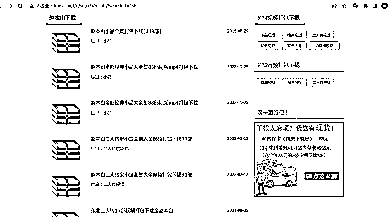<ne-card data-card-name="image" data-card-type="inline" id="fIyY8" data-event-boundary="card" style="color: rgb(255, 153, 51);">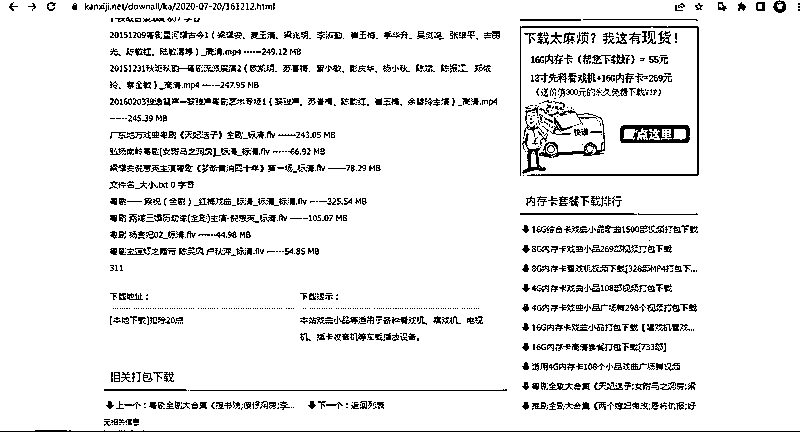<ne-text id="u6c4053ed" style="color: rgb(255, 153, 51);">7、AI 绘画</ne-text> <ne-text id="u0dc6b7d3" style="color: rgb(255, 153, 51);">（51 赞）《追逐风口，AI 绘画目前收益 5 万+》</ne-text><ne-text id="u3a0eaef0" style="color: rgb(255, 153, 51);">原文链接如下：</ne-text><ne-text id="u82ce1c38" style="color: rgb(255, 153, 51);">《追逐风口，AI 绘画目前收益 5W+》：</ne-text>[<ne-text id="ue3d4a6e0" style="color: rgb(255, 153, 51);">https://ovyhcgsmdu.feishu.cn/docx/Zjr6dgbHIoxcp0x2...</ne-text>](https://ovyhcgsmdu.feishu.cn/docx/Zjr6dgbHIoxcp0x21SVcrwlqn8d)<ne-text id="ud7d4219d" style="color: rgb(255, 153, 51);">《素材去水印的微信小程序，情侣头像类的 QQ 小程序，2 年多分别获得百万+收益的项目复盘过程》：</ne-text>[<ne-text id="ue492a953" style="color: rgb(255, 153, 51);">https://wx.zsxq.com/mweb/views/topicdetail/topicde...</ne-text>](https://wx.zsxq.com/mweb/views/topicdetail/topicdetail.html?topic_id=181244485884552&inviter_id=48811448144418&share_from=ShareToWechat&keyword=08zvBmfKM)<ne-text id="u2d47360f" style="color: rgb(255, 153, 51);">本人实操经验严重不足，本贴适用于小白参考，大佬可自行忽略。</ne-text><ne-text id="ua1bbd708" style="color: rgb(255, 153, 51);">相信很多圈友看完文章后都觉得通过小程序赚钱实现起来貌似不难，但实际操作起来其实困难重重。我把我遇到的问题和困难分享给大家，大家可根据自己实力量力而行。</ne-text><ne-text id="u7354c2b7" style="color: rgb(255, 153, 51);">我的初步想法很简单，本来自己就一直在关注 AI 绘画，也报名了本次的航海。结合意间 AI 的爆火，从文章找中看到了很多平台都提供了 API 接口，我就想按照文章中的方式尝试一下，也制作一个自己的小程序或者制作一个网站。</ne-text><ne-text id="ud786228d" style="color: rgb(255, 153, 51);">之前总有很多想法，但是都没落地，这次决定说干就干。开始之前想法如下</ne-text><ne-text id="uf0940ab2" style="color: rgb(255, 153, 51);">1.趁着意间 AI 绘画大火，薅一波搜索的流量羊毛，免去引流麻烦</ne-text> <ne-text id="u956519a9" style="color: rgb(255, 153, 51);">2.既然第三方提供了接口/建立网站，做最简单的小程序，预算 500 元，工期 1-2 天做出来</ne-text> <ne-text id="uce100909" style="color: rgb(255, 153, 51);">3.上线立马开通流量主，通过广告挣钱</ne-text><ne-text id="ubbee2531" style="color: rgb(255, 153, 51);">首先我去咨询了一下第三方 api 接口，我咨询的是 nolibox 画宇宙公司的产品，他们生成一张 512*512 的图要 0.0625~0.125 元不等，具体协议如下，大家可以参考。</ne-text>[<ne-text id="uda1e2da0" style="color: rgb(255, 153, 51);">https://f8y4v1rln8.feishu.cn/docx/HD2SdKerkoUesVxD...</ne-text>](https://f8y4v1rln8.feishu.cn/docx/HD2SdKerkoUesVxD4ARc9GGsnIv)<ne-text id="ue36eb519" style="color: rgb(255, 153, 51);">了解了一下成本后立刻打电话给学计算机专业的同学进行询问，但是问了一圈都表示没做过，于是还是决定找专业人士，直接打开淘宝联系客服。</ne-text><ne-text id="u354836f5" style="color: rgb(255, 153, 51);">连着问了十个淘宝客服，部分淘宝客服直接回复我说做不了，后来了解了一下，这部分商家只做有模板的，比如饭店点菜一类的，我这属于定制，他们直接不接这种单子。</ne-text><ne-text id="u464af6b3" style="color: rgb(255, 153, 51);">后来我就将搜索词改成了定制，店家肯接单了。</ne-text><ne-text id="ufd82fff0" style="color: rgb(255, 153, 51);">我只提了最简单的要求，能够上传图片，导入广告，生成图片。我以为如此简单的需求应该很便宜，但最终的店家给我报价让我大吃一惊。</ne-text><ne-text id="uc8cb2055" style="color: rgb(255, 153, 51);">最低的 3000 元，最高的到了 15 万，是的没看错，不是 1.5 万，是 15 万。个人感觉这方面市场还是有点乱，定价不透明。圈友们选择的时候还是要多对比一下。</ne-text><ne-text id="u18543110" style="color: rgb(255, 153, 51);">但这还不算完，还有很多麻烦的事情：</ne-text><ne-text id="ueb416e01" style="color: rgb(255, 153, 51);">1.小程序制作好之后还需要有服务器，第三方仅仅提供接口不提供服务器，小程序制作者可提供，客服跟我说预估一年 1000 左右（但是当时没问对方显卡配置和访问量上线，后面看了下腾讯的服务器的价格可能配置达到要求远远不够）</ne-text> <ne-text id="u53588156" style="color: rgb(255, 153, 51);">2.小程序正式上线需要工商证明，要么有个体的执照，要么有公司的执照.如果是个体的需要有线下实体店照片（我两者都没有）</ne-text> <ne-text id="ucdb1f3dd" style="color: rgb(255, 153, 51);">3.各个平台小程序并不通用，每一个平台即便功能相同也是另外的价格，抖音的会更贵一些。</ne-text><ne-text id="ua83c386e" style="color: rgb(255, 153, 51);">最终我放弃了，原因如下：</ne-text> <ne-text id="ue04d1711" style="color: rgb(255, 153, 51);">1.预算远远超出了预期，收我 3000 块的商家我很难相信他们的质量，超过 1W 的觉得成本太高了，我可能最终收益都达不到。</ne-text> <ne-text id="u090b05f1" style="color: rgb(255, 153, 51);">2.没有个体和公司执照，现在封控在家，没法办理。</ne-text> <ne-text id="u2a2ee333" style="color: rgb(255, 153, 51);">3.工期在 15-20 天左右，对于热点来说，这个时间怕是早就凉透了。</ne-text> <ne-text id="u46313e3d" style="color: rgb(255, 153, 51);">4.最为关键的一点，虽然微信搜索指数 AI 绘画出现了异常值，但这次的流量 99%来自于公众号，也就是说，想通过搜一搜来达到小程序被动推广，那无异于痴人说梦。还是得靠各种引流，而我没有任何引流经验，也没有资本，注定失败。</ne-text><ne-text id="u5937f95a" style="color: rgb(255, 153, 51);">在这次实践中，虽然没有成功，但我认为在这个过程中，小程序的供应商很重要。主要基于以下四点考虑。</ne-text><ne-text id="ud15f75b9" style="color: rgb(255, 153, 51);">1.究竟能做成什么东西出来（质量能否过关）</ne-text> <ne-text id="u9eaf0778" style="color: rgb(255, 153, 51);">2.后续的跟踪服务（升级/优化）</ne-text> <ne-text id="u88e8277c" style="color: rgb(255, 153, 51);">3.后台维护/服务器租用（费用不定）</ne-text> <ne-text id="u727efd32" style="color: rgb(255, 153, 51);">4.工期（半个月左右）</ne-text><ne-text id="u9347b7f9" style="color: rgb(255, 153, 51);">除此之外，想成功还需要一些其他的配套技能：</ne-text><ne-text id="u8b120036" style="color: rgb(255, 153, 51);">1.引流，小程序如果想不通过充值盈利，引流是必备的，要么站在风口，要么主动引流。</ne-text><ne-text id="u955a8d68" style="color: rgb(255, 153, 51);">2.小程序的设计思路（是否需要充值？积分兑换？还是纯粹的流量主？）</ne-text><ne-text id="u7d776bef" style="color: rgb(255, 153, 51);">以上是我的实操经历，望各位圈友多多指点！</ne-text> <ne-text id="ub9d9ff06" style="color: rgb(255, 153, 51);">（81 赞）《揭开 AI 绘画神秘的面纱，它没有你想象中那么难！》</ne-text><ne-text id="u486a8ccf" style="color: rgb(255, 153, 51);">哈喽，大家好，我是木木，11 月 5 日因为亦仁的一句话，开始进行 AI 绘画探索，这二十多天的探索过程中，被好多圈友帮助，让我学习到了很多技能，也让我跑通了 AI 绘画这个项目，形成了一个小闭环，截止到 12 月 1 日变现了 1000 块钱，虽然钱不多，但是这是自己第一个跑通的项目，一样很开心。</ne-text><ne-text id="ue34ffc68" style="color: rgb(255, 153, 51);">我不是设计师，不是程序员，只是一个普通的办公室工作者，11 月 5 日之前我都不知道什么是 AI 绘画，今天以一个小白的理解，想和大家聊聊，因为非专业人员，以下表述都是基于我自己的理解，不会有特别多专业的名词，请大佬们手下留情。</ne-text><ne-text id="u26fff355" ne-bold="true" style="color: rgb(255, 153, 51);">本文主要围绕以下 4 点来和大家聊聊：</ne-text><ne-text id="u006c3454" ne-bold="true" style="color: rgb(255, 153, 51);"><ne-text id="u490acede" ne-bold="true" style="color: rgb(255, 153, 51);">一、什么是 AI 绘画</ne-text><ne-text id="u1987baa6" ne-bold="true" style="color: rgb(255, 153, 51);">二、该如何选择工具</ne-text><ne-text id="u1f0c551c" ne-bold="true" style="color: rgb(255, 153, 51);">三、关键词如何使用</ne-text><ne-text id="uf4ef2b36" ne-bold="true" style="color: rgb(255, 153, 51);">四、为什么轻松复制很容易，还要大开脑洞去创作</ne-text><ne-text id="uee3aa2a1" style="color: rgb(255, 153, 51);">一、AI 绘画：一个文字唤醒设备</ne-text><ne-text id="ue999607b" style="color: rgb(255, 153, 51);">小爱同学，播放“孤勇者”。</ne-text><ne-text id="u48c2a6fd" style="color: rgb(255, 153, 51);">小度小度，打开“爱奇艺”。</ne-text><ne-text id="uce78dc68" style="color: rgb(255, 153, 51);">嗨，Siri ，拨打电话 13112341234。</ne-text><ne-text id="u8b2fc6a2" style="color: rgb(255, 153, 51);">对于这些指令，相信大家都不陌生。它们都通过语音唤醒设备，说出指令，达到你想要的目的。</ne-text><ne-text id="u3d972aeb" style="color: rgb(255, 153, 51);">而 AI 绘画，也是一个“唤醒设备”，不过从语音唤醒，变成了文字（关键词）唤醒。</ne-text><ne-text id="ubcf1c142" style="color: rgb(255, 153, 51);">二、工具的选择</ne-text><ne-text id="u0a2a7373" style="color: rgb(255, 153, 51);">1、综合多元风格</ne-text><ne-text id="uc68161aa" ne-bold="true" style="color: rgb(255, 153, 51);"><ne-text id="ua8f0879f" ne-bold="true" style="color: rgb(255, 153, 51);">国外的工具：“Mj ”（全称 Midjourney</ne-text><ne-text id="u2bcb809e" style="color: rgb(255, 153, 51);">），是国外绘画的一个工具，出来的画风是综合的。</ne-text><ne-text id="u77fc6671" style="color: rgb(255, 153, 51);">只要你输入对应的词，例如：二次元，动漫，古风，现代，超现代，照片等等，各种艺术家的风格，它都可以画出来，可以理解为“它是全能的”。</ne-text>  <ne-h2 id="d41d8cd9" data-lake-id="d41d8cd9"><ne-heading-ext><ne-heading-anchor></ne-heading-anchor><ne-heading-fold></ne-heading-fold></ne-heading-ext> <ne-heading-content></ne-heading-content></ne-h2> <ne-h3 id="d41d8cd9-1" data-lake-id="d41d8cd9-1"><ne-heading-ext><ne-heading-anchor></ne-heading-anchor><ne-heading-fold></ne-heading-fold></ne-heading-ext> <ne-heading-content></ne-heading-content></ne-h3> <ne-h2 id="d41d8cd9-2" data-lake-id="d41d8cd9-2"><ne-heading-ext><ne-heading-anchor></ne-heading-anchor><ne-heading-fold></ne-heading-fold></ne-heading-ext> <ne-heading-content></ne-heading-content></ne-h2> <ne-oli><ne-oli-i>1</ne-oli-i><ne-oli-c class="ne-oli-content" id="u55c79f81" data-lake-id="u55c79f81"><ne-text id="ue377a004" style="color: rgb(255, 153, 51);">初始号是什么意思呢？正常来说我们去玩游戏，都是用自己的邮箱手机注册新的账号，新建角色，进入游戏后，除了官方的新手礼包，什么都没有，一个人一条狗正常开局。</ne-text></ne-oli-c></ne-oli> <ne-oli><ne-oli-i>2</ne-oli-i><ne-oli-c class="ne-oli-content" id="u89207b98" data-lake-id="u89207b98"><ne-text id="u7244e7b3" style="color: rgb(255, 153, 51);">很多游戏，特别是手游，都有抽卡的机制。游戏内的组合搭配不是特别平衡，个别角色或者组合特别强。所以抽到对应的角色就很关键。那怎么抽到想要的角色呢？运气+氪金。</ne-text></ne-oli-c></ne-oli> <ne-oli><ne-oli-i>3</ne-oli-i><ne-oli-c class="ne-oli-content" id="uaa9376c5" data-lake-id="uaa9376c5"><ne-text id="ubfefbb7a" style="color: rgb(255, 153, 51);">运气在游戏算法的加持下，一般都是虚的，百分之零点几的抽卡率，卡池很深（能抽到的卡有很多）。所以氪就很重要。有钱人直接刷卡就完事。有钱人毕竟少数，对于大部分玩家，还有什么选择呢？</ne-text></ne-oli-c></ne-oli> <ne-oli><ne-oli-i>4</ne-oli-i><ne-oli-c class="ne-oli-content" id="ubede34a9" data-lake-id="ubede34a9"><ne-text id="uea26d822" style="color: rgb(255, 153, 51);">那自然就是我们开头提到的初始号了。初始号有什么特别之处呢？游戏为了做玩家留存，一般都会在前期的新手任务中，奖励抽卡道具，一般会送 10-20 抽。有人就用这个做生意了。批量注册一堆邮箱，然后用这些邮箱注册游戏账号，用模拟器或真机群控，脚本挂机，完成新手任务（一般很简单，点点点就够了，脚本很好弄）。然后再将这些账号挂到 taobao 等平台销售，少则几元，多则上百元（指定的角色、阵容，其实就是卖号的把卡抽了，转移买家抽不中的风险，所以相对更贵）。</ne-text></ne-oli-c></ne-oli> <ne-oli><ne-oli-i>5</ne-oli-i><ne-oli-c class="ne-oli-content" id="uf85597ad" data-lake-id="uf85597ad"><ne-text id="ubdc931f4" style="color: rgb(255, 153, 51);">上面都是理论，这里列些具体的。</ne-text> <ne-text id="u7190f400" style="color: rgb(255, 153, 51);">图 1 是原神的初始号，原神有很多角色要靠抽卡获得，这种大热门的游戏，可以看到销量很高。</ne-text> <ne-text id="ucb6db48c" style="color: rgb(255, 153, 51);">图 2 是王者荣耀初始号，也叫转移号。提供一些初始的英雄和一堆金币+铭文碎片。资源越多，卖的越贵。王者荣耀初始号机制比较特殊，因为王者的账号角色是按游戏区服分的，初始号可以游客身份挂脚本刷。用户买号后，可以直接将这个区服的角色和资源，绑定（转移）到自己的号上，很方便。</ne-text></ne-oli-c></ne-oli> <ne-oli><ne-oli-i>6</ne-oli-i><ne-oli-c class="ne-oli-content" id="u6db2f37a" data-lake-id="u6db2f37a"><ne-text id="u7bf75dd8" style="color: rgb(255, 153, 51);">举例的只是两款热门游戏，另外大大小小的游戏还有很多，比如暗黑 2 新赛季，一件装备可以卖到几十几百；暗黑 3 新赛季，带人速升 70 级，一个人头 5-10 元，新开赛季当天，半小时可以带 12 个人左右。比如阴阳师、崩坏三、炉石传说等等。还有一些叫不上名的 IP 游戏，一般就是抽卡模式的游戏，换个皮就上了。收割一波 IP 粉。这种游戏的初始号，销量也很不错。</ne-text></ne-oli-c></ne-oli> <ne-oli><ne-oli-i>7</ne-oli-i><ne-oli-c class="ne-oli-content" id="u5a47c743" data-lake-id="u5a47c743"><ne-text id="u7f2cc12f" style="color: rgb(255, 153, 51);">写了很多，不一定都对。月底了，希望能中个标！</ne-text></ne-oli-c></ne-oli> <ne-h3 id="d41d8cd9-3" data-lake-id="d41d8cd9-3"><ne-heading-ext><ne-heading-anchor></ne-heading-anchor><ne-heading-fold></ne-heading-fold></ne-heading-ext> <ne-heading-content></ne-heading-content></ne-h3> <ne-h2 id="d41d8cd9-4" data-lake-id="d41d8cd9-4"><ne-heading-ext><ne-heading-anchor></ne-heading-anchor><ne-heading-fold></ne-heading-fold></ne-heading-ext> <ne-heading-content></ne-heading-content></ne-h2> <ne-h2 id="d41d8cd9-5" data-lake-id="d41d8cd9-5"><ne-heading-ext><ne-heading-anchor></ne-heading-anchor><ne-heading-fold></ne-heading-fold></ne-heading-ext> <ne-heading-content></ne-heading-content></ne-h2> <ne-h1 id="d41d8cd9-6" data-lake-id="d41d8cd9-6"><ne-heading-ext><ne-heading-anchor></ne-heading-anchor><ne-heading-fold></ne-heading-fold></ne-heading-ext> <ne-heading-content></ne-heading-content></ne-h1> <ne-h1 id="d41d8cd9-7" data-lake-id="d41d8cd9-7"><ne-heading-ext><ne-heading-anchor></ne-heading-anchor><ne-heading-fold></ne-heading-fold></ne-heading-ext> <ne-heading-content></ne-heading-content></ne-h1> <ne-h1 id="d41d8cd9-8" data-lake-id="d41d8cd9-8"><ne-heading-ext><ne-heading-anchor></ne-heading-anchor><ne-heading-fold></ne-heading-fold></ne-heading-ext> <ne-heading-content></ne-heading-content></ne-h1> <ne-h1 id="d41d8cd9-9" data-lake-id="d41d8cd9-9"><ne-heading-ext><ne-heading-anchor></ne-heading-anchor><ne-heading-fold></ne-heading-fold></ne-heading-ext> <ne-heading-content></ne-heading-content></ne-h1> <ne-h1 id="d41d8cd9-10" data-lake-id="d41d8cd9-10"><ne-heading-ext><ne-heading-anchor></ne-heading-anchor><ne-heading-fold></ne-heading-fold></ne-heading-ext> <ne-heading-content></ne-heading-content></ne-h1> <ne-h2 id="d41d8cd9-11" data-lake-id="d41d8cd9-11"><ne-heading-ext><ne-heading-anchor></ne-heading-anchor><ne-heading-fold></ne-heading-fold></ne-heading-ext> <ne-heading-content></ne-heading-content></ne-h2> <ne-h1 id="d41d8cd9-12" data-lake-id="d41d8cd9-12"><ne-heading-ext><ne-heading-anchor></ne-heading-anchor><ne-heading-fold></ne-heading-fold></ne-heading-ext> <ne-heading-content></ne-heading-content></ne-h1> <ne-h3 id="d41d8cd9-13" data-lake-id="d41d8cd9-13"><ne-heading-ext><ne-heading-anchor></ne-heading-anchor><ne-heading-fold></ne-heading-fold></ne-heading-ext> <ne-heading-content></ne-heading-content></ne-h3> <ne-h2 id="d41d8cd9-14" data-lake-id="d41d8cd9-14"><ne-heading-ext><ne-heading-anchor></ne-heading-anchor><ne-heading-fold></ne-heading-fold></ne-heading-ext> <ne-heading-content></ne-heading-content></ne-h2> <ne-h2 id="d41d8cd9-15" data-lake-id="d41d8cd9-15"><ne-heading-ext><ne-heading-anchor></ne-heading-anchor><ne-heading-fold></ne-heading-fold></ne-heading-ext> <ne-heading-content></ne-heading-content></ne-h2> <ne-h1 id="d41d8cd9-16" data-lake-id="d41d8cd9-16"><ne-heading-ext><ne-heading-anchor></ne-heading-anchor><ne-heading-fold></ne-heading-fold></ne-heading-ext> <ne-heading-content></ne-heading-content></ne-h1> <ne-h2 id="d41d8cd9-17" data-lake-id="d41d8cd9-17"><ne-heading-ext><ne-heading-anchor></ne-heading-anchor><ne-heading-fold></ne-heading-fold></ne-heading-ext> <ne-heading-content></ne-heading-content></ne-h2> <ne-h3 id="d41d8cd9-18" data-lake-id="d41d8cd9-18"><ne-heading-ext><ne-heading-anchor></ne-heading-anchor><ne-heading-fold></ne-heading-fold></ne-heading-ext> <ne-heading-content></ne-heading-content></ne-h3> <ne-h2 id="d41d8cd9-19" data-lake-id="d41d8cd9-19"><ne-heading-ext><ne-heading-anchor></ne-heading-anchor><ne-heading-fold></ne-heading-fold></ne-heading-ext> <ne-heading-content></ne-heading-content></ne-h2> <ne-h2 id="d41d8cd9-20" data-lake-id="d41d8cd9-20"><ne-heading-ext><ne-heading-anchor></ne-heading-anchor><ne-heading-fold></ne-heading-fold></ne-heading-ext> <ne-heading-content></ne-heading-content></ne-h2> <ne-h2 id="d41d8cd9-21" data-lake-id="d41d8cd9-21"><ne-heading-ext><ne-heading-anchor></ne-heading-anchor><ne-heading-fold></ne-heading-fold></ne-heading-ext> <ne-heading-content></ne-heading-content></ne-h2> <ne-h2 id="d41d8cd9-22" data-lake-id="d41d8cd9-22"><ne-heading-ext><ne-heading-anchor></ne-heading-anchor><ne-heading-fold></ne-heading-fold></ne-heading-ext> <ne-heading-content></ne-heading-content></ne-h2> <ne-h2 id="d41d8cd9-23" data-lake-id="d41d8cd9-23"><ne-heading-ext><ne-heading-anchor></ne-heading-anchor><ne-heading-fold></ne-heading-fold></ne-heading-ext> <ne-heading-content></ne-heading-content></ne-h2> <ne-h3 id="d41d8cd9-24" data-lake-id="d41d8cd9-24"><ne-heading-ext><ne-heading-anchor></ne-heading-anchor><ne-heading-fold></ne-heading-fold></ne-heading-ext> <ne-heading-content></ne-heading-content></ne-h3> <ne-quote id="u71457888" data-lake-id="u71457888"><ne-h4 id="Kd1SU" data-lake-id="Kd1SU"><ne-heading-ext><ne-heading-anchor></ne-heading-anchor><ne-heading-fold></ne-heading-fold></ne-heading-ext><ne-heading-content><ne-card data-card-name="image" data-card-type="inline" id="bYT5A" data-event-boundary="card" style="color: rgb(255, 153, 51);">图片加载失败<ne-card data-card-name="image" data-card-type="inline" id="ADq30" data-event-boundary="card" style="color: rgb(255, 153, 51);"><ne-text id="u716b8bd6" ne-bold="true" style="color: rgb(255, 153, 51);">国内的工具：“AI 画了个画”</ne-text><ne-text id="uf4290bc1" style="color: rgb(255, 153, 51);">，是对标的 MJ，咱们圈友研发的，目前出品的效果也很棒，我们有小伙伴变现也是用它来出图的。</ne-text><ne-card data-card-name="image" data-card-type="inline" id="SrO8c" data-event-boundary="card" style="color: rgb(255, 153, 51);">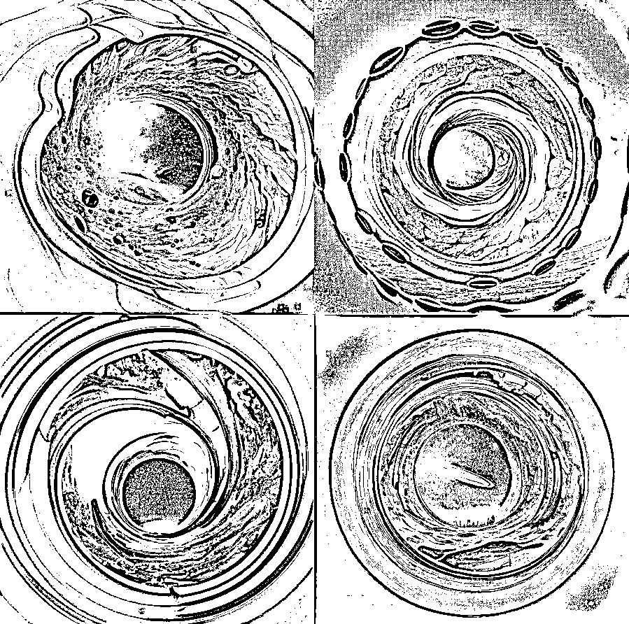<ne-text id="ue7567027" style="color: rgb(255, 153, 51);">2、二次元风格</ne-text><ne-text id="uea73fa3e" ne-bold="true" style="color: rgb(255, 153, 51);">国外的工具：Novel AI</ne-text><ne-text id="u26802b4d" style="color: rgb(255, 153, 51);">。这是一个适合二次元绘画的工具，它的关键词，画师们俗称“咒语”，是不是很酷。</ne-text><ne-text id="u00bb51e2" style="color: rgb(255, 153, 51);">这个工具和 MJ 相比，多了一个地方，就是分正反词，还有加权重。举个栗子：</ne-text><ne-card data-card-name="image" data-card-type="inline" id="GIjIH" data-event-boundary="card" style="color: rgb(255, 153, 51);"><ne-text id="uead8741c" style="color: rgb(255, 153, 51);">@饼公子 作品</ne-text><ne-text id="ua9405d11" style="color: rgb(255, 153, 51);">正面，代表着“想要”在你的图里出现的元素，或者可以说细节；</ne-text><ne-text id="u6b14234b" style="color: rgb(255, 153, 51);">反面，代表着“不要”出现的元素或细节；{}代表着强调突出这个主体，{}叠加的越多，代表着重点突出。</ne-text><ne-text id="u26773ed4" ne-bold="true" style="color: rgb(255, 153, 51);"><ne-text id="ud2484a06" ne-bold="true" style="color: rgb(255, 153, 51);">国内平替 Novel AI 的是“意间 AI 绘画”</ne-text><ne-text id="u848f113d" style="color: rgb(255, 153, 51);">，不过由于绘画等待出图的时间过长，心急的小伙伴使用起来可能会跳脚。</ne-text><ne-text id="u5bbce853" style="color: rgb(255, 153, 51);">三、关键词如何使用</ne-text><ne-text id="u6ba31b92" style="color: rgb(255, 153, 51);">木木在之前说过，AI 绘画是要用一个文字唤醒的设备，给它输入一条文字指令，它就可以给你出一幅画。</ne-text><ne-text id="ucdd30869" style="color: rgb(255, 153, 51);">经过这段时间，绘画师们给 AI 各种喂词，它现在已经很智能了，在木木玩的时候，还需要大量的描述词才能出来看得过去的效果图，现在已经不需要那么麻烦，简单的描述也可以出来非常棒的关键词。</ne-text><ne-text id="u92f7b798" style="color: rgb(255, 153, 51);">而对于关键词，相信不少圈友手上也有很多很多了，木木也有非常多，但是该怎么用呢？</ne-text><ne-text id="u9aa7d898" ne-bold="true" style="color: rgb(255, 153, 51);"><ne-text id="u8c9c2eea" ne-bold="true" style="color: rgb(255, 153, 51);">木</ne-text><ne-text id="ue9a416e4" ne-bold="true" style="color: rgb(255, 153, 51);">木经历了三个阶段：</ne-text><ne-text id="u842e6d54" style="color: rgb(255, 153, 51);">第一个阶段非常暴力：抄！就是直接复制关键词，粘贴到 AI 画了个画出图；</ne-text><ne-text id="u3b2a99fb" style="color: rgb(255, 153, 51);">第二个阶段也不太温柔：混改！就是把关键词中的某一个关键词，比如非常火的十二生肖，把生肖兔改成生肖牛，接着无限出图（俗称抽卡），博几率出好看的图；</ne-text><ne-text id="uc38aedd6" style="color: rgb(255, 153, 51);">现在的阶段：创作！我称之为衍生扩句，以一个词无限衍生来出图。以虫洞为例：</ne-text><ne-text id="u0a577c34" style="color: rgb(255, 153, 51);">输入：“虫洞 --v 4”，就可以出来下图</ne-text><ne-card data-card-name="image" data-card-type="inline" id="i9rN4" data-event-boundary="card" style="color: rgb(255, 153, 51);"><ne-text id="ua9e1988a" style="color: rgb(255, 153, 51);">在虫洞的基础上，无限加词，发挥你的想象力，可以衍生无数个图，下面这些都是根据这个思路衍生出的图：</ne-text><ne-card data-card-name="image" data-card-type="inline" id="n5S82" data-event-boundary="card" style="color: rgb(255, 153, 51);">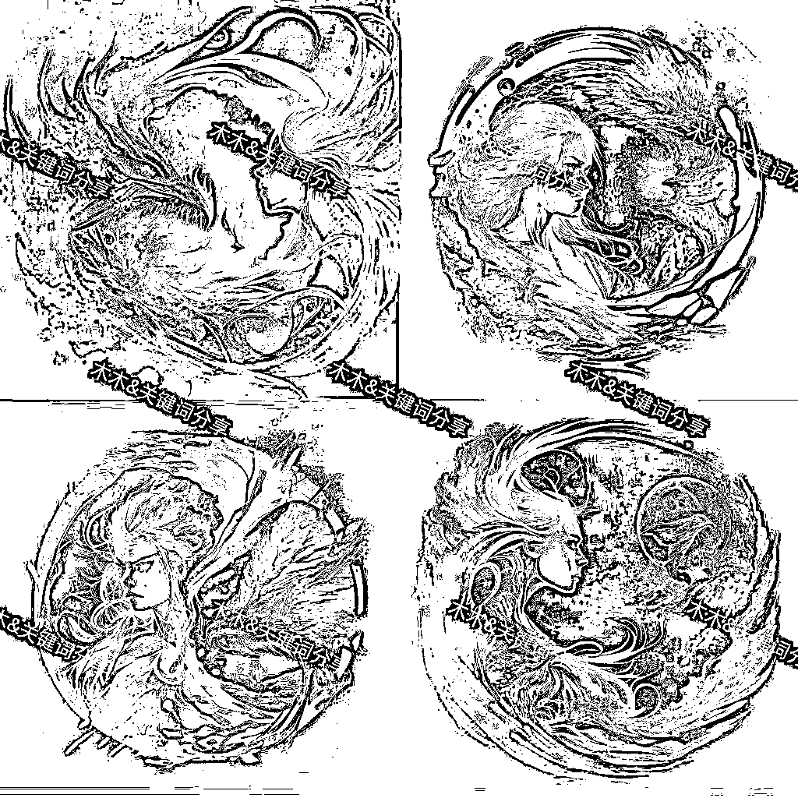<ne-text id="udf08d081" style="color: rgb(255, 153, 51);">@伟祺 作品</ne-text><ne-card data-card-name="image" data-card-type="inline" id="F2oEp" data-event-boundary="card" style="color: rgb(255, 153, 51);"><ne-text id="u8f79f72e" style="color: rgb(255, 153, 51);">@梨云 作品</ne-text><ne-card data-card-name="image" data-card-type="inline" id="pKbU5" data-event-boundary="card" style="color: rgb(255, 153, 51);"><ne-text id="u1064ea4c" style="color: rgb(255, 153, 51);">@Bingo 作品</ne-text><ne-card data-card-name="image" data-card-type="inline" id="N0SjQ" data-event-boundary="card" style="color: rgb(255, 153, 51);"><ne-text id="u5d0f86fd" style="color: rgb(255, 153, 51);">@招财武  作品</ne-text><ne-text id="u5184232b" style="color: rgb(255, 153, 51);">会扩句就会写关键词</ne-text><ne-text id="ue53674ef" style="color: rgb(255, 153, 51);">关于关键词怎么写，有小伙伴说</ne-text><ne-card data-card-name="image" data-card-type="inline" id="mmRDF" data-event-boundary="card" style="color: rgb(255, 153, 51);"><ne-text id="ua68c4419" style="color: rgb(255, 153, 51);">再打开抖音看到是这样教的：为什么别人可以作出好看的图，而你不行，你只要知道以下这些关键词，就可以作出很漂亮的图了</ne-text><ne-card data-card-name="image" data-card-type="inline" id="UOO0p" data-event-boundary="card" style="color: rgb(255, 153, 51);">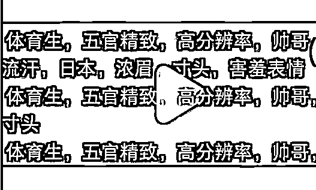<ne-text id="u70b5ef90" ne-bold="true" style="color: rgb(255, 153, 51);">那如果不想做人物呢，这些有啥用？</ne-text><ne-text id="u2353f602" style="color: rgb(255, 153, 51);">不知道大家有没有拆分过，关键词的组成。</ne-text><ne-text id="u7a71f356" style="color: rgb(255, 153, 51);">我个人感觉，关键词就是在扩句。而扩句的逻辑是：</ne-text><ne-text id="u7ffd6bbe" style="color: rgb(255, 153, 51);">形容词，人/物，风格，滤镜</ne-text><ne-text id="ucfc75c89" style="color: rgb(255, 153, 51);">以下图为例：</ne-text><ne-card data-card-name="image" data-card-type="inline" id="WGyyn" data-event-boundary="card" style="color: rgb(255, 153, 51);">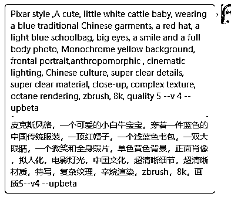<ne-text id="u0c92bc64" style="color: rgb(255, 153, 51);">形容词：可爱的 ，穿着蓝色的服装，帽子，书包等等</ne-text><ne-text id="ue288243f" style="color: rgb(255, 153, 51);">物：牛宝宝，唯一的主体，所有的词都是围绕着它描写</ne-text><ne-text id="u889b8a89" style="color: rgb(255, 153, 51);">风格：皮克斯风格</ne-text><ne-text id="u230a3ebc" style="color: rgb(255, 153, 51);">滤镜：电影灯光，中国文化，超清晰细节，超清晰材质，特写，复杂纹理，辛烷渲染，zbrush，8k，画质 5--v4 --upbeta</ne-text><ne-text id="u02f6e059" style="color: rgb(255, 153, 51);">知道了关键词的组成，那么我们就可以来玩了，举个栗子：</ne-text><ne-card data-card-name="image" data-card-type="inline" id="LIJO7" data-event-boundary="card" style="color: rgb(255, 153, 51);"><ne-text id="u9aa08646" style="color: rgb(255, 153, 51);">原图</ne-text><ne-card data-card-name="image" data-card-type="inline" id="zoybl" data-event-boundary="card" style="color: rgb(255, 153, 51);"><ne-text id="u34b67734" style="color: rgb(255, 153, 51);">衍生图 @饼公子</ne-text><ne-text id="ud61c9214" style="color: rgb(255, 153, 51);">这里先说一下，MJ 出图，一般都是出 4 张图，而这个原图，看起来是 8 张图，它的关键词就是“分屏”，使得一个图左右对称，看起来像 8 张图，实际上是一张图左右对称。但是它的对称是不规则的，左边和右边不是一个主体，那么该如何达到让画面左右对称这个效果呢？</ne-text><ne-text id="u9a594088" style="color: rgb(255, 153, 51);">在这里我使用了一个词语，“mirror image”，中文为“镜像”。</ne-text><ne-text id="uf6c639b4" style="color: rgb(255, 153, 51);">根据牛津词典的释义，镜像是可以让你的画面左右对称，这个应用还可以做为延伸，加到你其他图片的关键词中去，达到“对称”的效果。</ne-text><ne-text id="u37f3640c" style="color: rgb(255, 153, 51);">这样，就形成了上述“衍生图”的关键词：mirror image,above water is a tall pirate ship, below the water is a large octopus, sunrise, photographic, cinematic lighting, creative --ar 2:3 --v 4</ne-text><ne-card data-card-name="image" data-card-type="inline" id="XKQjX" data-event-boundary="card" style="color: rgb(255, 153, 51);">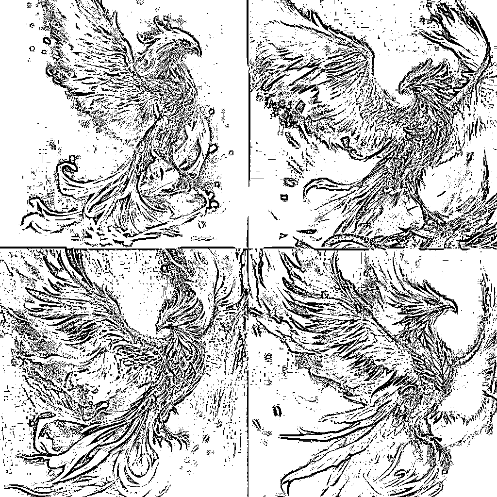<ne-text id="ud5b5d92a" style="color: rgb(255, 153, 51);">@饼公子</ne-text><ne-text id="u7f6dac49" style="color: rgb(255, 153, 51);">添加镜像以后见下图</ne-text><ne-card data-card-name="image" data-card-type="inline" id="gMCw2" data-event-boundary="card" style="color: rgb(255, 153, 51);"><ne-text id="ucbf2c1df" style="color: rgb(255, 153, 51);">@饼公子</ne-text><ne-text id="u0dd8cd12" style="color: rgb(255, 153, 51);">再来一张 12 岁小姑娘的根据我们的思路，做出的镜像作品：</ne-text><ne-card data-card-name="image" data-card-type="inline" id="tqyrz" data-event-boundary="card" style="color: rgb(255, 153, 51);">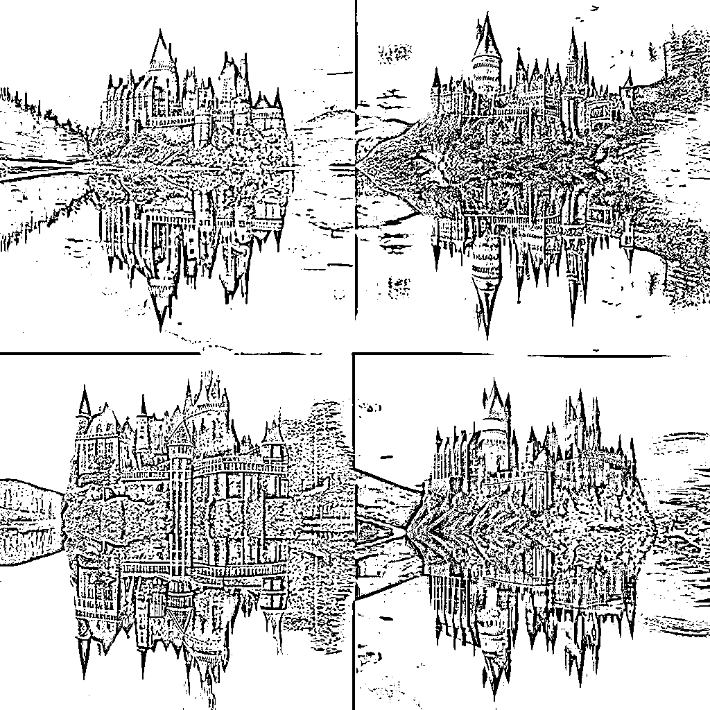<ne-text id="u8e70d6db" style="color: rgb(255, 153, 51);">@饕餮仙子 作品 霍格沃茨城堡</ne-text><ne-text id="u96c9632d" style="color: rgb(255, 153, 51);">当然，同样的玩法，还有很多，木木就不一一列举啦，欢迎大家一起来探索。</ne-text><ne-text id="ufe464b04" style="color: rgb(255, 153, 51);">四、为什么轻松复制很容易，还要大开脑洞去创作</ne-text><ne-text id="ue0bfb7f1" style="color: rgb(255, 153, 51);">就如短视频搬运一样，轻轻松松就可以赚到钱了，为什么还要自己去创作？</ne-text><ne-text id="ue7ae2588" style="color: rgb(255, 153, 51);">第一，就不用说了，不符合平台规则，虽然每次出图的效果都不一样，但是大的方向还是在的，属于二改，容易被人举报抄袭。</ne-text><ne-text id="uc04e722a" style="color: rgb(255, 153, 51);">第二，对于原创作者，比如我们做视频带货、小红书的，可以通过关键词描述去做出你想要的图，用什么有什么；而不是受别人的牵制，只能有什么用什么。自己通过关键词描述做出来的图才是最适合自己的。</ne-text><ne-text id="ud1ba00bd" style="color: rgb(255, 153, 51);">第三，AI 绘画和设计一样，我们想要的是用它来画出自己想要的世界，就像我们 12 岁的小姑娘，她用 AI 绘画，画出了她的“霍格沃茨城堡”,画出了她的卢娜。而且她说还有一个意外的收获，就是在 AI 绘画的探索中，学习关键词的使用，对她的英语写作能力和对细节的描述都有了很大的提升。</ne-text><ne-text id="ud2267e67" style="color: rgb(255, 153, 51);">第四，有自己的作品是令人快乐的一件事，而创作带来的成就感，可能就只有创作的人才能体会到了。而我，希望你也可以感受到这个成就感。</ne-text><ne-text id="ud69ce8a0" style="color: rgb(255, 153, 51);">最后祝大家都可以早点学会魔法，让 AI 给我们打工，早日变现。</ne-text> <ne-text id="u8bff5b2b" style="color: rgb(255, 153, 51);">（55 赞）《N 卡、A 卡都不用！免费运行，再烂电脑也能跑！竟然有这样好事？》</ne-text><ne-text id="u26999d6b" style="color: rgb(255, 153, 51);">最近看到很多小伙伴对 AI 绘画很感兴趣，摩拳擦掌准备大干一番，但是往往还没入门就被迫放弃，最主要的原因就是，电脑实在不行，要配置没配置，要性能没性能，网上的安装包往往执行几步就没有然后了。。。</ne-text><ne-text id="uf67a0d17" style="color: rgb(255, 153, 51);">正好此次小航海也有 AI 绘画，应该也有很多小伙伴会遇到这个问题，所以我将之前一直使用的免费在线绘画方法花了一些时间整理了一下，分享给大家，希望对大家有所帮助。</ne-text><ne-text id="u438db58a" style="color: rgb(255, 153, 51);">文章内容请见以下飞书链接：</ne-text>[<ne-text id="ufa8c6bfc" style="color: rgb(255, 153, 51);">https://sg0n3b2id7.feishu.cn/docx/KomqdeUMloO1CkxrgADcqGvDnIe</ne-text>](https://sg0n3b2id7.feishu.cn/docx/KomqdeUMloO1CkxrgADcqGvDnIe)<ne-text id="u8ea1618c" style="color: rgb(255, 153, 51);">这里随便贴张图</ne-text><ne-card data-card-name="image" data-card-type="inline" id="U8trB" data-event-boundary="card" style="color: rgb(255, 153, 51);">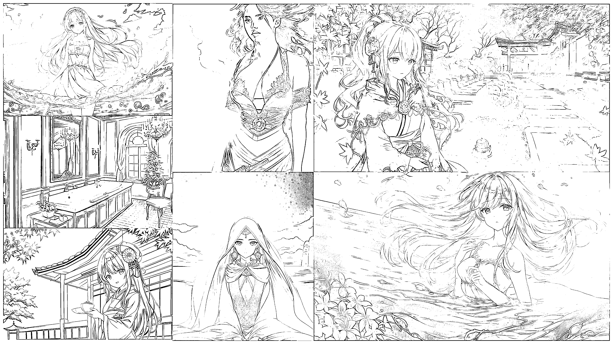<ne-text id="u2b775bbf" style="color: rgb(255, 153, 51);">（26 赞）《适合个人或小团队低成本运作：AI 生成红包封面》</ne-text><ne-text id="u3420e3a2" style="color: rgb(255, 153, 51);">过年风口项目，适合个人或小团队低成本运作。 Ai 生成红包封面，谁生成的版权就是谁的，不再为了封面版权发愁。让客户也能自己申请喜欢的红包封面。自动对接申请红包封面的接口，给企业或个人卖专属红包封面，也可以生成独特封面售卖激活码！#风向标#</ne-text><ne-card data-card-name="image" data-card-type="inline" id="uiJEZ" data-event-boundary="card" style="color: rgb(255, 153, 51);"><ne-text id="ud23ff9e8" style="color: rgb(255, 153, 51);">总结</ne-text><ne-text id="u2cc44906" style="color: rgb(255, 153, 51);">以上就是本周的生财周报合计 8.4W 字。</ne-text><ne-text id="ua57d6eb8" style="color: rgb(255, 153, 51);">除了离线版，小懒也会整理到在线版合集里，方便大家检索和手机上查看。</ne-text><ne-text id="u92d00ed5" style="color: rgb(255, 153, 51);">更多内容，见咱们</ne-text><ne-text id="ub27c453a" ne-italic="true" style="color: rgb(255, 153, 51);">懒人专属群</ne-text><ne-text id="u6eb071dc" style="color: rgb(255, 153, 51);">的群文件和群公告！</ne-text><ne-card data-card-name="image" data-card-type="inline" id="deGXt" data-event-boundary="card" style="color: rgb(255, 153, 51);">  <ne-h3 id="d41d8cd9-25" data-lake-id="d41d8cd9-25"><ne-heading-ext><ne-heading-anchor></ne-heading-anchor><ne-heading-fold></ne-heading-fold></ne-heading-ext> <ne-heading-content></ne-heading-content></ne-h3> <ne-h4 id="d41d8cd9-26" data-lake-id="d41d8cd9-26"><ne-heading-ext><ne-heading-anchor></ne-heading-anchor><ne-heading-fold></ne-heading-fold></ne-heading-ext> <ne-heading-content></ne-heading-content></ne-h4> <ne-h2 id="d41d8cd9-27" data-lake-id="d41d8cd9-27"><ne-heading-ext><ne-heading-anchor></ne-heading-anchor><ne-heading-fold></ne-heading-fold></ne-heading-ext> <ne-heading-content></ne-heading-content></ne-h2> <ne-h3 id="d41d8cd9-28" data-lake-id="d41d8cd9-28"><ne-heading-ext><ne-heading-anchor></ne-heading-anchor><ne-heading-fold></ne-heading-fold></ne-heading-ext> <ne-heading-content></ne-heading-content></ne-h3> <ne-h3 id="d41d8cd9-29" data-lake-id="d41d8cd9-29"><ne-heading-ext><ne-heading-anchor></ne-heading-anchor><ne-heading-fold></ne-heading-fold></ne-heading-ext> <ne-heading-content></ne-heading-content></ne-h3> <ne-h2 id="d41d8cd9-30" data-lake-id="d41d8cd9-30"><ne-heading-ext><ne-heading-anchor></ne-heading-anchor><ne-heading-fold></ne-heading-fold></ne-heading-ext> <ne-heading-content></ne-heading-content></ne-h2> <ne-h2 id="d41d8cd9-31" data-lake-id="d41d8cd9-31"><ne-heading-ext><ne-heading-anchor></ne-heading-anchor><ne-heading-fold></ne-heading-fold></ne-heading-ext> <ne-heading-content></ne-heading-content></ne-h2> <ne-h2 id="d41d8cd9-32" data-lake-id="d41d8cd9-32"><ne-heading-ext><ne-heading-anchor></ne-heading-anchor><ne-heading-fold></ne-heading-fold></ne-heading-ext> <ne-heading-content></ne-heading-content></ne-h2> <ne-h2 id="d41d8cd9-33" data-lake-id="d41d8cd9-33"><ne-heading-ext><ne-heading-anchor></ne-heading-anchor><ne-heading-fold></ne-heading-fold></ne-heading-ext> <ne-heading-content></ne-heading-content></ne-h2> <ne-h1 id="d41d8cd9-34" data-lake-id="d41d8cd9-34"><ne-heading-ext><ne-heading-anchor></ne-heading-anchor><ne-heading-fold></ne-heading-fold></ne-heading-ext> <ne-heading-content></ne-heading-content></ne-h1></ne-card></ne-card></ne-card></ne-card></ne-card></ne-card></ne-card></ne-card></ne-card></ne-card></ne-card></ne-card></ne-card></ne-card></ne-card></ne-card></ne-text></ne-text></ne-card></ne-card></ne-card></ne-card></ne-heading-content></ne-h4></ne-quote></ne-text></ne-text></ne-card></ne-card></ne-text></ne-card></ne-text></ne-text></ne-text></ne-text></ne-text></ne-text></ne-text></ne-text></ne-text></ne-card></ne-text></ne-text></ne-text></ne-text></ne-text></ne-text></ne-card></ne-text></ne-text></ne-card></ne-text></ne-text></ne-card></ne-text></ne-text></ne-card></ne-text></ne-text></ne-card></ne-text></ne-text></ne-text></ne-text></ne-card></ne-text></ne-text></ne-card></ne-text></ne-card></ne-text></ne-text></ne-text></ne-text></ne-card></ne-text></ne-text></ne-text></ne-text></ne-card></ne-text></ne-card></ne-text></ne-text></ne-card></ne-text></ne-text></ne-card></ne-text></ne-text></ne-text></ne-card></ne-text></ne-text></ne-card></ne-text></ne-text></ne-text></ne-text></ne-text></ne-text></ne-text></ne-text></ne-text></ne-text></ne-text></ne-text></ne-text></ne-text></ne-text></ne-text></ne-card></ne-text></ne-text></ne-text></ne-text></ne-text></ne-text></ne-text></ne-text></ne-text></ne-text></ne-card></ne-text></ne-text></ne-text></ne-card></ne-text></ne-text></ne-text></ne-text></ne-text></ne-text></ne-card></ne-text></ne-card></ne-text></ne-card></ne-text></ne-card></ne-text></ne-card></ne-text></ne-text></ne-card></ne-text></ne-text></ne-card></ne-text></ne-card></ne-text></ne-card></ne-text></ne-text></ne-text></ne-text></ne-text></ne-text></ne-text></ne-card></ne-text></ne-card></ne-text></ne-card></ne-text></ne-card></ne-text></ne-card></ne-card></ne-card></ne-text></ne-card></ne-text></ne-text></ne-text></ne-text></ne-card></ne-text></ne-text></ne-text></ne-text></ne-text></ne-text></ne-text></ne-text></ne-text></ne-text></ne-card></ne-text></ne-text></ne-card></ne-text></ne-text></ne-text></ne-text></ne-text></ne-text></ne-card></ne-text></ne-text></ne-text></ne-card></ne-card></ne-card></ne-card></ne-card></ne-card></ne-heading-content></ne-h4></ne-card></ne-p></ne-card></ne-p></ne-card></ne-p></ne-card></ne-p></ne-card></ne-p></ne-card></ne-p></ne-card></ne-p></ne-card></ne-p></ne-card></ne-p></ne-card></ne-p></ne-card></ne-p></ne-card></ne-p></ne-card></ne-p></ne-card></ne-p></ne-card></ne-p></ne-card></ne-p></ne-card></ne-p></ne-card></ne-p></ne-card></ne-p></ne-card></ne-p></ne-card></ne-p></ne-card></ne-p></ne-card></ne-p></ne-card></ne-p></ne-card></ne-p></ne-card></ne-p></ne-card></ne-p></ne-card></ne-p></ne-card></ne-p></ne-card></ne-p></ne-card></ne-p></ne-card></ne-p></ne-card></ne-p></ne-card></ne-p></ne-card></ne-p></ne-card></ne-p></ne-card></ne-p></ne-card></ne-p></ne-card></ne-p></ne-card></ne-p></ne-card></ne-p></ne-card></ne-p></ne-card></ne-p></ne-card></ne-p></ne-card></ne-p></ne-card></ne-p></ne-card></ne-p></ne-card></ne-p></ne-card></ne-p></ne-card></ne-card></ne-p></ne-card></ne-card></ne-card></ne-p></ne-card></ne-card></ne-p></ne-card></ne-p></ne-card></ne-p></ne-card></ne-p></ne-card></ne-p></ne-card></ne-p></ne-card></ne-p></ne-card></ne-p></ne-card></ne-p></ne-card></ne-p></ne-card></ne-p></ne-card></ne-p></ne-card></ne-p></ne-quote></ne-card></ne-p></ne-card></ne-p></ne-card></ne-p></ne-card></ne-p></ne-card></ne-p></ne-card></ne-p></ne-card></ne-p></ne-card></ne-p></ne-card></ne-p></ne-card></ne-p></ne-card></ne-p></ne-card></ne-p></ne-card></ne-p></ne-card></ne-p></ne-card></ne-p></ne-card></ne-p>