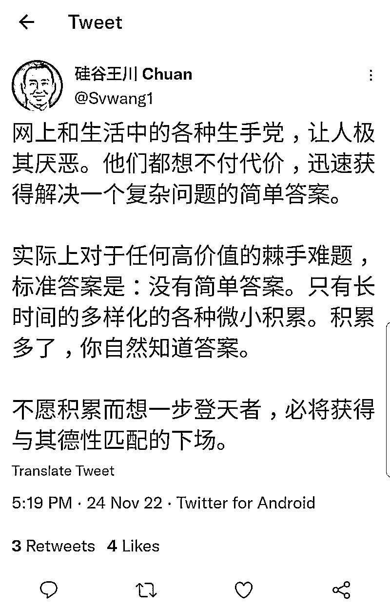

# 221129 懒人生财周报

> 原文：[`www.yuque.com/for_lazy/money/iszlecw099n35qic`](https://www.yuque.com/for_lazy/money/iszlecw099n35qic)

<ne-h1 id="b77b7823" data-lake-id="b77b7823"><ne-heading-ext><ne-heading-anchor></ne-heading-anchor><ne-heading-fold></ne-heading-fold></ne-heading-ext><ne-heading-content><ne-text id="u456e34cd">懒人生财周报</ne-text></ne-heading-content></ne-h1> <ne-p id="uba56dbba" data-lake-id="uba56dbba"><ne-text id="u7fc17c65">整理日期：2022 年 11 月 29 号</ne-text></ne-p> <ne-p id="u1ba36fc6" data-lake-id="u1ba36fc6"><ne-text id="u07ef5562">专属群的群友大家好。小懒继续给大家带来生财周报～</ne-text></ne-p> <ne-p id="u7c429cf2" data-lake-id="u7c429cf2"><ne-text id="u2269eb81">本文档为</ne-text><ne-text id="u20789204" ne-italic="true">懒人专属群</ne-text><ne-text id="u7e30cd5e">内部分享，懒人手动整理。</ne-text></ne-p> <ne-p id="u71445d03" data-lake-id="u71445d03"><ne-text id="u7b3f1762">一些帖子跳转飞书查阅，如需破解复制权限，见这篇文章：</ne-text></ne-p> <ne-p id="ueb6e13c2" data-lake-id="ueb6e13c2">[<ne-text id="u1b8e87a1">解除复制限制！</ne-text>](https://mp.weixin.qq.com/s?__biz=MzI1NjAxOTI0Ng==&mid=2647895304&idx=1&sn=df7e3e36c3bf503a2513f8b4c6636d3d&chksm=f20a1349c57d9a5fccaa92c5068cb3e492ba9e3ebb178584d018892c0211214dc9d112c1f73c&token=37691864&lang=zh_CN#rd)</ne-p> <ne-p id="u82fe03e4" data-lake-id="u82fe03e4"><ne-text id="ubf9c6f47">往期的生财周报和精华，见专属群 Q 群文件和群公告。</ne-text></ne-p> <ne-p id="u27c3aecf" data-lake-id="u27c3aecf"><ne-text id="u91d0ee63">希望大家有收获~</ne-text></ne-p> <ne-p id="ud8e74e86" data-lake-id="ud8e74e86"><ne-card data-card-name="image" data-card-type="inline" id="m2nAH" data-event-boundary="card"></ne-card></ne-p> <ne-p id="u8aafbd7e" data-lake-id="u8aafbd7e"><ne-text id="ua13b70ae">标题加了(精华)的表示精华贴，前面为截至今日的点赞数。</ne-text></ne-p> <ne-p id="u6b40073e" data-lake-id="u6b40073e"><ne-text id="u542d504e">以下是目录，内容有些多。大家可以挑兴趣的内容阅读。</ne-text></ne-p> <ne-p id="u8fbbfaba" data-lake-id="u8fbbfaba">[<ne-text id="ue510281d">懒人专属群更新记录（点此跳转）</ne-text>](https://lazybook.netlify.app/#/blog/record2)</ne-p> <ne-h1 id="4b94dae3" data-lake-id="4b94dae3"><ne-heading-ext><ne-heading-anchor></ne-heading-anchor><ne-heading-fold></ne-heading-fold></ne-heading-ext><ne-heading-content><ne-text id="u5f2eb976">【目录】</ne-text></ne-heading-content></ne-h1> <ne-p id="uce69d82c" data-lake-id="uce69d82c"><ne-text id="u0e20e49d">在线版目录见左侧大纲</ne-text></ne-p> <ne-h1 id="6cadaaf2" data-lake-id="6cadaaf2"><ne-heading-ext><ne-heading-anchor></ne-heading-anchor><ne-heading-fold></ne-heading-fold></ne-heading-ext><ne-heading-content><ne-text id="u0bd4803b">一、生财认知&技能</ne-text></ne-heading-content></ne-h1> <ne-h2 id="f2254453" data-lake-id="f2254453"><ne-heading-ext><ne-heading-anchor></ne-heading-anchor><ne-heading-fold></ne-heading-fold></ne-heading-ext><ne-heading-content><ne-text id="ubb7d568e">（93 赞）《微小中创业如何合法筹划财税》</ne-text></ne-heading-content></ne-h2> <ne-p id="u361e7298" data-lake-id="u361e7298"><ne-text id="u6728a3a2">#法财税人，创富兵器库# 微小中创业如何合法筹划财税？ 大家好，这篇文章是我的法财税人团队+律师团队合写。本该由@财爷 发布，为引起关注与重视，我越俎代庖先发出来，以飨读者。</ne-text></ne-p> <ne-p id="u6b2bc639" data-lake-id="u6b2bc639"><ne-text id="ucb502e07">【腾讯文档】时间捐赠局分享·微小中创业如何合法财税规划（以短视频玩家为例）V1.0 ：</ne-text></ne-p> <ne-p id="u76263d96" data-lake-id="u76263d96">[<ne-text id="u50d08a05">https://docs.qq.com/doc/DSlRHYmZyamdTQ3Na</ne-text>](https://docs.qq.com/doc/DSlRHYmZyamdTQ3Na)</ne-p> <ne-h2 id="a96545d4" data-lake-id="a96545d4"><ne-heading-ext><ne-heading-anchor></ne-heading-anchor><ne-heading-fold></ne-heading-fold></ne-heading-ext><ne-heading-content><ne-text id="u42fa3ce7">(102 赞)《日更写作 565 天，我如何通过写作，打造自己的人生复利系统》</ne-text></ne-heading-content></ne-h2> <ne-p id="ua82eff0f" data-lake-id="ua82eff0f"><ne-text id="u4038c40f">各位圈友好，我是唐夕，从 2021 年 4 月 25 日开始日更公众号，到今天 565 天，就这样靠着日更公众号从 0-1 打通了自己的写作变现闭环。</ne-text></ne-p> <ne-p id="ub5a5694e" data-lake-id="ub5a5694e"><ne-text id="u69802fe8">一年多的时间，因为日更写作这件事，出了自己的课程，做了自己的付费社群，也接了不少的个人咨询，可谓是真正从零开始有了一点属于自己的积累，更有了直接与市场交易的底气。</ne-text></ne-p> <ne-p id="u343572d4" data-lake-id="u343572d4"><ne-text id="u14494fad">但求输出，不问结果，果随因来，一切的惊喜和红利都会随着你越来越多的表达而奔你而来。</ne-text></ne-p> <ne-p id="ub7754def" data-lake-id="ub7754def"><ne-text id="u9e843dfa" ne-bold="true">今天的内容主要从以下 4 个方面展开：</ne-text></ne-p> <ne-p id="ua64de38d" data-lake-id="ua64de38d"><ne-text id="uee996860">1 为什么一定要打造持续输出力？</ne-text></ne-p> <ne-p id="u00b75427" data-lake-id="u00b75427"><ne-text id="ub4f7cd77">2 持续日更写作过程中会遇到哪些问题，该如何解决？</ne-text></ne-p> <ne-p id="ub47a9058" data-lake-id="ub47a9058"><ne-text id="ua9a7c390">3 没有正反馈，该如何坚持下去？</ne-text></ne-p> <ne-p id="u87fd84db" data-lake-id="u87fd84db"><ne-text id="ub238591e">4 普通人如何系统提升自己的输出表达力？</ne-text></ne-p> <ne-p id="u8beea759" data-lake-id="u8beea759"><ne-text id="u446b9d59" ne-bold="true">1 为什么一定要打造持续输出力</ne-text></ne-p> <ne-p id="ue4b7b46e" data-lake-id="ue4b7b46e"><ne-text id="u3b1675ec">先分享一下我的经历，为什么会选择日更公众号这件事，为什么会坚持提升自己的写作输出力，我的动机和坚持的动力来自于哪？</ne-text></ne-p> <ne-p id="u81c63eb3" data-lake-id="u81c63eb3"><ne-text id="uea44b3f3">2021 年春节前，我所在的公司因为各种原因倒闭了，突然我就失业了。失业后的我，因为从广州回到兰州就一直在准备公务员的考试，倒也没有多在意，毕竟也有一定的积蓄，可以让自己慢慢找工作。</ne-text></ne-p> <ne-p id="u8613d921" data-lake-id="u8613d921"><ne-text id="u07902699">但考完试后，一段时间内都没有找到合适的工作，我就开始很焦虑了，又因为我比较喜欢读书，空闲的时候，就去附近的书店读书，也正是那段时间的大量阅读，让我又燃起了想要写作的心。</ne-text></ne-p> <ne-p id="u4ef2837c" data-lake-id="u4ef2837c"><ne-text id="u8721ef57">这就应了一句话：</ne-text><ne-text id="uc87db839" ne-bold="true">读书不写作的人，不存在的；写作不读书的人，也是不存在的。</ne-text></ne-p> <ne-p id="u61e803a5" data-lake-id="u61e803a5"><ne-text id="ua3024fb0">也由此，我开始借这次焦虑，认真思考自己未来的人生。</ne-text></ne-p> <ne-p id="ufa621271" data-lake-id="ufa621271"><ne-text id="u0d1a355e">我开始意识到，</ne-text><ne-text id="ue97c7074" ne-bold="true">仅仅只靠在公司内打工是一件比较危险的事，公司会倒闭，会裁员，而如果自己没有任何直接与市场交易的能力，在现在的职场环境下，会越来越被动。</ne-text></ne-p> <ne-p id="u5dd2aa16" data-lake-id="u5dd2aa16"><ne-text id="u841a88f2">我也认真分析了自己过去几年的经验和积累，过去几年，断断续续写过不少的文章，也有几篇阅读量到了 6 万+的，在豆瓣积累了 3000 多粉丝，我又一直在企业做新媒体运营，对各大平台都很熟悉。</ne-text></ne-p> <ne-p id="ue6206cae" data-lake-id="ue6206cae"><ne-text id="u5b16a06b">于是，我下了一个决心，</ne-text><ne-text id="ub94c18f8" ne-bold="true">日更公众号，先从坚持做到这件事，给自己积累和沉淀开始改变自己。</ne-text></ne-p> <ne-p id="u21ddaabe" data-lake-id="u21ddaabe"><ne-text id="ubbd4d357" ne-bold="true">把期望放低，不关注赚钱，也不关注能获得什么，就先坚持写，提升自己的写作能力，让自己有点拿得出手的东西，让自己靠自己先做成一件事。</ne-text></ne-p> <ne-p id="u5f6c266e" data-lake-id="u5f6c266e"><ne-text id="ua93243f6">我是在 500 多天的持续输出中，才逐渐深刻认知到了表达输出的重要性，也享受到了表达输出的红利。</ne-text></ne-p> <ne-p id="u9ae7586d" data-lake-id="u9ae7586d"><ne-text id="uebbf9896" ne-bold="true">01 一旦开始了输出，你就是 1%的人了。</ne-text></ne-p> <ne-p id="u52cfa68d" data-lake-id="u52cfa68d"><ne-text id="uab9b7ecf">这是一个信息大爆炸的时代，互联网上每天会涌现无数的信息，但真正创造内容的仅仅只有 1%的人，其他 10%的人会点赞，评论和转发，而剩余 89%的人只是浏览。</ne-text></ne-p> <ne-p id="u457f0497" data-lake-id="u457f0497"><ne-text id="u900b95c7">这就是为什么说，</ne-text><ne-text id="u5ff85e45" ne-bold="true">现在是一个优秀创作者和表达者享尽红利的时代，因为真正在创造内容，尤其是好内容的人太少太少了。</ne-text></ne-p> <ne-p id="ucee9706c" data-lake-id="ucee9706c"><ne-text id="u49430f42">既然如此，那我们为什么不做个创造者，而要做个被动的消费者呢，消耗自己的时间和注意力这么宝贵的资源。</ne-text></ne-p> <ne-p id="u6b3f224e" data-lake-id="u6b3f224e"><ne-text id="u90e5235d" ne-bold="true">所以，开始输出吧，成为那 1%的人。</ne-text></ne-p> <ne-p id="u207e2bcd" data-lake-id="u207e2bcd"><ne-text id="u0b527125" ne-bold="true">02 输出是倒逼自己输入，以及帮助自己思考最好的方式；</ne-text></ne-p> <ne-p id="uf228aa2c" data-lake-id="uf228aa2c"><ne-text id="u29e1aecc">如果不是因为日更写作这件事，我不会做到去年一年读 100 本书，也不会加入生财，玩赚等这些很有价值的社群，开眼，破圈，持续学习，精进自己的各方面能力。我的能量，耐心，勇气和坚持力也不会大幅提升。</ne-text></ne-p> <ne-p id="u41c9a53d" data-lake-id="u41c9a53d"><ne-text id="ub4c25217" ne-bold="true">写作也是检验自己有没有把一件事，思考清楚最佳的方式。</ne-text></ne-p> <ne-p id="u3433282b" data-lake-id="u3433282b"><ne-text id="u8c6ef8d4" ne-bold="true">因为写作本质上是思考的外化，它会像一个钩子一样，挂住我们每天冒出来的念头和灵感并把我们导向更深入的思考。</ne-text></ne-p> <ne-p id="u04dd49dd" data-lake-id="u04dd49dd"><ne-text id="u2ac4e6be" ne-bold="true">03 内容是这个时代普通人最容易建立的复利杠杆；</ne-text></ne-p> <ne-p id="ufc2e287a" data-lake-id="ufc2e287a"><ne-text id="udc469e15">《纳瓦尔宝典》一书中提到要最大限度的利用杠杆，而对于普通人来说，最容易触手可及的就是“内容”，它的复制边际成本为零，可以重复利用，多平台推广，放大价值。</ne-text></ne-p> <ne-p id="u00a67730" data-lake-id="u00a67730"><ne-text id="ue5d514bd">而这个杠杆</ne-text><ne-text id="u1f6cf1f4" ne-bold="true">，不需要你投入什么资金，只需要花时间把自己的思考和经验总结出来，分享，只需要有个电脑甚至手机就足够了。</ne-text></ne-p> <ne-p id="ub17a5718" data-lake-id="ub17a5718"><ne-text id="u44efcbef">无论你是在休闲的时候，还是在睡觉的时候，它都在帮你传播，只要有人在看你的内容，就可以带来源源不断的被动收入。</ne-text></ne-p> <ne-p id="u44e49b1b" data-lake-id="u44e49b1b"><ne-text id="u4b6074b5">可以说，</ne-text><ne-text id="u6b43aa21" ne-bold="true">创造内容，做好自媒体，就是帮自己打造了一个赚钱机器。</ne-text></ne-p> <ne-p id="u15545b43" data-lake-id="u15545b43"><ne-text id="u36aaa418" ne-bold="true">04 写作是世界上最好的社交活动</ne-text></ne-p> <ne-p id="uc5d320f0" data-lake-id="uc5d320f0"><ne-text id="ubb51eb56">因为写作输出这件事，我的微信好友数增加了 6 倍，而且吸引的都是比较同频的人。</ne-text></ne-p> <ne-p id="u969dda95" data-lake-id="u969dda95"><ne-text id="u16c58787">现实生活中，</ne-text><ne-text id="u0f45fd5b" ne-bold="true">我是一个比较内容和不太喜欢社交的人，但靠着自己持续的产出内容，分享自己的思考，每天都被不少人加微信，而且不用刻意介绍自己，因为多数人都是看过文章来的，对我极度认可。</ne-text></ne-p> <ne-p id="ua9cb9a94" data-lake-id="ua9cb9a94"><ne-text id="u0a1becbe" ne-bold="true">我开始意识到靠内内容创作是可以破圈的，是不需要自己去刻意社交，想办法是证明我是谁，我有什么价值。</ne-text></ne-p> <ne-p id="u724531ba" data-lake-id="u724531ba"><ne-text id="u021d6d31">慢慢地，我开始坚信一个真理：写作就是最好的社交活动，是你最好的“身份证”，因为你的思考，经历，价值观都在你的文章中一一展现，喜欢你的人就是喜欢，不喜欢的人也就不喜欢，你写出来的内容就是最好的筛选器。</ne-text></ne-p> <ne-p id="u23b6673b" data-lake-id="u23b6673b"><ne-text id="ubf8e88bd" ne-bold="true">2 持续日更写作过程中会遇到哪些问题，该如何解决？</ne-text></ne-p> <ne-p id="u32de9f1b" data-lake-id="u32de9f1b"><ne-text id="u1696b7b9" ne-bold="true">01 不知道写什么，无从下笔；</ne-text></ne-p> <ne-p id="u340e7c70" data-lake-id="u340e7c70"><ne-text id="u4f556804">我自己最开始日更的前 10 天，还没有这种感觉，因为读书的过程中积累了不少选题可以支撑。</ne-text></ne-p> <ne-p id="u81bea502" data-lake-id="u81bea502"><ne-text id="ud34f1989">但是差不多 10 天过后，就不知道写什么了，也很痛苦，经常不知道写什么。</ne-text></ne-p> <ne-p id="udfe1a75a" data-lake-id="udfe1a75a"><ne-text id="uedce26a5">那我的解决方式就是，平常有意识的积累选题，以及问题库，观察生活，留意和别人的对话。平常看书，看文章遇到好的素材，就记录在 flomo，常常翻看。</ne-text></ne-p> <ne-p id="u900fed21" data-lake-id="u900fed21"><ne-text id="ua50ef228">我还有一个绝佳的方式就是，</ne-text><ne-text id="uee109825" ne-bold="true">如果我实在不知道写什么，会找一个朋友聊天，问他，你最近有什么困惑吗？就和他聊一聊，帮他解决困惑，基本聊完，一篇文章就出来了。</ne-text></ne-p> <ne-p id="u8c52637c" data-lake-id="u8c52637c"><ne-text id="u165ffc63" ne-bold="true">对于写作，有一个公式就是：文章=问题+回答；</ne-text></ne-p> <ne-p id="u0e64a07d" data-lake-id="u0e64a07d"><ne-text id="u262a1a22">所以不知道写什么，就找自己遇到的问题，身边朋友的问题，知乎上别人提的问题，这都是自己的“灵感”和写作的楔子。</ne-text></ne-p> <ne-p id="u55ed2381" data-lake-id="u55ed2381"><ne-text id="u73018c2e" ne-bold="true">02 完美心态太重，总觉得自己写的不够好，没什么价值；</ne-text></ne-p> <ne-p id="uccb7bb16" data-lake-id="uccb7bb16"><ne-text id="u5dc7c1ad">我观察过不少想写作的人，几乎都有这个问题，觉得自己写的不够好，没价值，不好意思发出来，我有时候也会这样。</ne-text></ne-p> <ne-p id="u42ddd011" data-lake-id="u42ddd011"><ne-text id="u70a3463a">我的解决方案就是：</ne-text><ne-text id="u78d593a4" ne-bold="true">把自己是个成长型心态的人，这个道理内化在自己的大脑里；也把完成大于完美，这个道理内化在自己的大脑里。</ne-text></ne-p> <ne-p id="ub944b084" data-lake-id="ub944b084"><ne-text id="u8a1d8056">一篇两篇写不好，没关系，只要自己持续写下去，自己的知识，能力不断提升，就会越写越好，也会提供更多的价值。况且，其实每个人的经历，思考，感悟都是独一无二的，只要你在真诚表达，就能带给别人感触和价值。</ne-text></ne-p> <ne-p id="u7b4d6c77" data-lake-id="u7b4d6c77"><ne-text id="udbb083df" ne-bold="true">03 害怕自己写的是错误的；</ne-text></ne-p> <ne-p id="ua0dd4735" data-lake-id="ua0dd4735"><ne-text id="u6754a7bb">我之前听少楠老师的一期播客，他有一句话：如果你没有观点，你就不值得被关注。</ne-text></ne-p> <ne-p id="ua4d66de2" data-lake-id="ua4d66de2"><ne-text id="u8283cdce">真实的世界，不是像我们年少时的考试，会有标准答案，没有绝对的正确和错误，每个写作者实际上，都是在输出自己的“偏见”，因为我们都活在自己“局部”的世界里。</ne-text></ne-p> <ne-p id="u802a0584" data-lake-id="u802a0584"><ne-text id="u70215691">表达输出本质上就是通过自己的内容，吸引同频的人，所以放心输出吧。</ne-text></ne-p> <ne-p id="u914801d5" data-lake-id="u914801d5"><ne-text id="ub37f6c5c">虽说被误解是表达者的宿命，但正向来看，更多的我们是在享受表达的红利。</ne-text></ne-p> <ne-p id="u88197c35" data-lake-id="u88197c35"><ne-text id="uef7df049" ne-bold="true">04 写几天，数据不好就觉得是自己不行；</ne-text></ne-p> <ne-p id="u0f2f4af3" data-lake-id="u0f2f4af3"><ne-text id="u562a333e">我自己前几年之所以写几天就放弃，觉得是自己不行，就是因为没有认清事物发展的基本规律。</ne-text><ne-text id="ucd6d2a57" ne-bold="true">写作本就是个指数技能，在到达向上的拐点之前，需要持续的坚持，和极大地耐心。</ne-text></ne-p> <ne-p id="u165ebac1" data-lake-id="u165ebac1"><ne-text id="u700cabb8" ne-bold="true">换个角度来说，我们在自媒体上公开表达自己，就是站在聚光灯下成长，而人们真正爱看的，都不是你已经很好。</ne-text></ne-p> <ne-p id="ub703cc94" data-lake-id="ub703cc94"><ne-text id="uf3e475e5" ne-bold="true">而是想看，你持续变好的这个过程，因为过程给人力量。</ne-text></ne-p> <ne-p id="uc27d480c" data-lake-id="uc27d480c"><ne-text id="u851660dd" ne-bold="true">因为这份坚持，这份持续变好的行动过程比之文字更有说服力、更有能量。</ne-text></ne-p> <ne-p id="uf8bf6dfe" data-lake-id="uf8bf6dfe"><ne-text id="ua7dcdc6b" ne-bold="true">05 工作比较忙，时间要怎么安排？</ne-text></ne-p> <ne-p id="uc3196e02" data-lake-id="uc3196e02"><ne-text id="u776176d6">最好的解决方法是让自己每天早起，利用早起的时间来写。</ne-text></ne-p> <ne-p id="ubfd6e482" data-lake-id="ubfd6e482"><ne-text id="u60cd30e6">我现在就是这样，每天早上一早先完成日更，把它当成每天最重要的一件事。</ne-text></ne-p> <ne-p id="ubebc66d7" data-lake-id="ubebc66d7"><ne-text id="u9f191c85">第二个解决方案是，充分利用好自己的碎片化时间，比如：上班路上、下班路上、等开会、睡觉前等等，</ne-text><ne-text id="u4764808e" ne-bold="true">我们都可以把这些时间利用起来或者读书输入或者记录灵感和感想素材。</ne-text></ne-p> <ne-p id="u6d5a1e73" data-lake-id="u6d5a1e73"><ne-text id="u8805a48b">使用这种写作方法我们需要养成 3 个关键习惯。</ne-text></ne-p> <ne-p id="udae26fb0" data-lake-id="udae26fb0"><ne-text id="u08d6682f">01 一有灵感马上记录，否则很容易忘记；</ne-text></ne-p> <ne-p id="u4266d4e7" data-lake-id="u4266d4e7"><ne-text id="u522b993f">02 要马上抽时间搜集相关的素材；</ne-text></ne-p> <ne-p id="uf6428c4d" data-lake-id="uf6428c4d"><ne-text id="udd525ff9">03 平时有意识地积累各种写作框架。</ne-text></ne-p> <ne-p id="u7dd1bd05" data-lake-id="u7dd1bd05"><ne-text id="u627a3721" ne-bold="true">3 没有正反馈，该如何坚持下去？</ne-text></ne-p> <ne-p id="u335e7539" data-lake-id="u335e7539"><ne-text id="u39252e1d" ne-bold="true">01 做公开承诺，这个方法真的无敌了</ne-text></ne-p> <ne-p id="uc4f4e023" data-lake-id="uc4f4e023"><ne-text id="u4742c03a">用涛哥的话来说就是，自绝于江湖。我自己并不是一个能坚持的人，也因为之前有过失败的经历，所以，这一次发布的第一篇文章，我就做了公开承诺，说我以后会日更。</ne-text></ne-p> <ne-p id="ud920f431" data-lake-id="ud920f431"><ne-text id="ufc64fa94">如果做不到，自己就失信了，那这个公开承诺就会让我度过前期那个习惯没有养成的时期。</ne-text></ne-p> <ne-p id="ue01dd3d6" data-lake-id="ue01dd3d6"><ne-text id="u171a4086" ne-bold="true">02 把写作简单化</ne-text></ne-p> <ne-p id="u1453659f" data-lake-id="u1453659f"><ne-text id="ubac35731">在开始日更前，我就想清楚了，并不要求自己每篇文章都写两三千字，哪怕几百字，甚至 100 字，只要开始写，表达出自己的观点就好了。</ne-text></ne-p> <ne-p id="u3af6f330" data-lake-id="u3af6f330"><ne-text id="u4f39e26b">写一段时间，发现 100～300 字很轻松。</ne-text></ne-p> <ne-p id="uf38192da" data-lake-id="uf38192da"><ne-text id="ubeb5841f">到了后期，800～1000 字也能写出来。</ne-text></ne-p> <ne-p id="u8ce53bf0" data-lake-id="u8ce53bf0"><ne-text id="uff00ac64" ne-bold="true">这样一步步过渡，让自己的写作不那么费力，就会更容易写下去。</ne-text></ne-p> <ne-p id="u8281456d" data-lake-id="u8281456d"><ne-text id="u11d9ebad">到这里我想跟你们分享的一句话就是：只要写作对你足够重要，它就变得极其简单。</ne-text></ne-p> <ne-p id="u68429387" data-lake-id="u68429387"><ne-text id="u5d4ee21f" ne-bold="true">03 找到自己的精神能量来源</ne-text></ne-p> <ne-p id="ud9e0f578" data-lake-id="ud9e0f578"><ne-text id="u1599c083">一开始，我们的信念会比较坚定，但写着写着，数据不好，没反馈，就没信心了，就需要能量的注入和支撑。</ne-text></ne-p> <ne-p id="ud4f3c364" data-lake-id="ud4f3c364"><ne-text id="u9e39fe1b" ne-bold="true">所谓精神能量来源就是，在这件事上做到了，并且做出成果的人，看他们的书，看他们的文章，从中获取坚持下去的动力和能量。</ne-text></ne-p> <ne-p id="u093934ff" data-lake-id="u093934ff"><ne-text id="u77858d63">当我信念不坚定，想放弃的时候，就会去看看辉哥和明白老师的文章，以及 S 老师的《持续行动》这本书。</ne-text></ne-p> <ne-p id="ua62998ad" data-lake-id="ua62998ad"><ne-text id="ucd4f0f7c" ne-bold="true">04 加入写作的社群和圈子，从中获取正反馈</ne-text></ne-p> <ne-p id="u37d4edd6" data-lake-id="u37d4edd6"><ne-text id="u0a930b9c">获得反馈是我们愿意持续把一件事做下去，很重要的一部分。</ne-text></ne-p> <ne-p id="u6213e614" data-lake-id="u6213e614"><ne-text id="ub10aebff">一开始我们没有赚钱的正反馈，但加入写作的社群和圈子，和志同道合的伙伴一起写，会互相激励和鼓励，因为都知道写作的重要性和意义，更知道这实属不容易，更会毫不吝啬自己的夸赞，这样你会多很多的动力。</ne-text></ne-p> <ne-p id="u31fd860d" data-lake-id="u31fd860d"><ne-text id="u5d4407e7" ne-bold="true">4 普通人如何系统提升自己的写作表达力？</ne-text></ne-p> <ne-p id="u294e2dea" data-lake-id="u294e2dea"><ne-text id="u92629ac8">我们把写作拆解一下，可以拆解为这样一个系统--</ne-text></ne-p> <ne-p id="u8fc894a9" data-lake-id="u8fc894a9"><ne-text id="u498f68b4" ne-bold="true">输入+思考+输出~</ne-text></ne-p> <ne-p id="ub73eb90f" data-lake-id="ub73eb90f"><ne-text id="uc1a401fd">我们看书、看文章、和别人聊天、看电影等等这些信息，这是输入；</ne-text></ne-p> <ne-p id="u583ef6cb" data-lake-id="u583ef6cb"><ne-text id="uec378550">经由输入的信息，我们做了思考和其它信息的连接，这是大脑的思考；</ne-text></ne-p> <ne-p id="u3bdaaa0a" data-lake-id="u3bdaaa0a"><ne-text id="u02a30272">通过文字把这些思考结构化表达出来，这是输出。</ne-text></ne-p> <ne-p id="u49421a69" data-lake-id="u49421a69"><ne-text id="u09aeb57c">由此，提升自己的写作表达力，首先从“入口维度”，提升自己输入的广度与深度；</ne-text></ne-p> <ne-p id="u7d404d4c" data-lake-id="u7d404d4c"><ne-text id="u779a131c">其次，提升自己的思考力，有一句话说，写作者 80%的时间在思考，20%的时间在写作，这句话是真理。</ne-text></ne-p> <ne-p id="u35eb45d9" data-lake-id="u35eb45d9"><ne-text id="u5f9fd37a">最后，出口思维，提升输出力，只有不断多写多练，持续输出，不仅能锻炼我们的坚持力，耐受力和，更能在过程中升级我们的认知和思维。</ne-text></ne-p> <ne-p id="ud97a1e8e" data-lake-id="ud97a1e8e"><ne-text id="uabed2f3f" ne-bold="true">写作输出是个复利技能，是我们能力和价值的放大器，但很多时候它更是一个能量棒，让我们认识自己，内化学到的知识，记录自己的成长，帮我们对外链接人和资源。</ne-text></ne-p> <ne-p id="u56759153" data-lake-id="u56759153"><ne-text id="u7f460661">最后，想跟你们分享的一句话是：你不缺写作的能力，缺的只是每天 10 分钟的执行力。</ne-text></ne-p> <ne-p id="ud7b0fffa" data-lake-id="ud7b0fffa"><ne-text id="ua376db53">结尾推荐关于写作的 5 本书：</ne-text></ne-p> <ne-p id="uf09050a5" data-lake-id="uf09050a5"><ne-text id="u8eed81a8">《表达力》作者：贺嘉</ne-text></ne-p> <ne-p id="ud5f4faa5" data-lake-id="ud5f4faa5"><ne-text id="ua2e2e109">《写作是门手艺》作者：刘军强</ne-text></ne-p> <ne-p id="u3c68b705" data-lake-id="u3c68b705"><ne-text id="u9d25e930">《李诞脱口秀工作手册》作者：李诞</ne-text></ne-p> <ne-p id="u0915c0b2" data-lake-id="u0915c0b2"><ne-text id="u9ac0caf4">《学会写作》作者：粥佐罗</ne-text></ne-p> <ne-p id="ubb861ec8" data-lake-id="ubb861ec8"><ne-text id="u55a29487">《写出我心：普通人如何通过写作表达自己》作者：娜塔莉</ne-text></ne-p> <ne-h2 id="d5bb6fc3" data-lake-id="d5bb6fc3"><ne-heading-ext><ne-heading-anchor></ne-heading-anchor><ne-heading-fold></ne-heading-fold></ne-heading-ext><ne-heading-content><ne-text id="u6d324e7b">（297 赞） 《「不愿积累，而想一步登天者」，救不了》</ne-text></ne-heading-content></ne-h2> <ne-p id="u45706f13" data-lake-id="u45706f13"><ne-text id="uce44b54d">坏消息是，赚钱就是这么一个复杂问题。 哪怕是我的好朋友，问我怎么赚钱，我也都很难回答。 要给项目，要有认知，要给情绪，要有行动，要给反馈，要帮迭代，最后发现，还得我自己下场干。 所以，大多数情况下，我都是给对方一篇精华帖，说：你先看下这个帖子，有什么问题再问我。 结果是，大多数人也不会去看，更不会有问题了。</ne-text></ne-p> <ne-p id="u10f2042c" data-lake-id="u10f2042c"><ne-card data-card-name="image" data-card-type="inline" id="hDI26" data-event-boundary="card"></ne-card></ne-p> <ne-h2 id="62931b98" data-lake-id="62931b98"><ne-heading-ext><ne-heading-anchor></ne-heading-anchor><ne-heading-fold></ne-heading-fold></ne-heading-ext><ne-heading-content><ne-text id="u5eec63e7">《赚钱就像爱，不要说要做》</ne-text></ne-heading-content></ne-h2> <ne-p id="ufb25bda0" data-lake-id="ufb25bda0"><ne-text id="u81921bef">这是咱们星球嘉宾，半佛仙人 第 1000 篇原创，很真诚的一篇建议。</ne-text></ne-p> <ne-p id="u7a54d656" data-lake-id="u7a54d656"><ne-text id="u0e6604f6">赚钱就像爱，不要说要做：</ne-text></ne-p> <ne-p id="u82a6ab0d" data-lake-id="u82a6ab0d">[<ne-text id="u2df81530">https://mp.weixin.qq.com/s/-YyzT1ECn5TKVfTYEsBFpQ</ne-text>](https://mp.weixin.qq.com/s/-YyzT1ECn5TKVfTYEsBFpQ)</ne-p> <ne-h2 id="d4f604d7" data-lake-id="d4f604d7"><ne-heading-ext><ne-heading-anchor></ne-heading-anchor><ne-heading-fold></ne-heading-fold></ne-heading-ext><ne-heading-content><ne-text id="u1f78d29a">（118 赞）《从赔 100 万，到在生财里找到项目赚回 300 万，我都经历了什么》</ne-text></ne-heading-content></ne-h2> <ne-p id="u17037ed8" data-lake-id="u17037ed8"><ne-text id="u63b903f2">大家好，可以叫我老罗，96 年</ne-text></ne-p> <ne-p id="u70052ec5" data-lake-id="u70052ec5"><ne-text id="uf3b01d2d">前几天看生财很多朋友写自己的亏钱经历，发现大家亏钱的路径其实都差不多：贸然入行、合伙生意、盲目 all in、最终遗憾离场。更有甚者循环往复，一直亏钱。</ne-text></ne-p> <ne-p id="uc5edc0fc" data-lake-id="uc5edc0fc"><ne-text id="u22e2f107">我也经历过这样一个时期，做过公众号、小商店、抖音、B 站、小游戏、小红书、今日头条等等，合计亏损超过 100 多万，所以痛定思痛，通过思考，我总结了一套成功的方法（需要结合生财使用），帮助我扭转局面，3 个月赚了 100 万，总利润超过 300w，具体如下：</ne-text></ne-p> <ne-p id="u1378b5c3" data-lake-id="u1378b5c3"><ne-text id="uf18cf492" ne-bold="true">1.外卖 cps</ne-text><ne-text id="u23d2357b">：第一天就实现盈利 100 块钱+、2 个月盈利做到 10w/月、第 3 个月盈利突破 20w/月，总盈利超过 200 万+，去年 8 月停止增粉，至今每个月仍然营收 5w+</ne-text></ne-p> <ne-p id="ude222940" data-lake-id="ude222940"><ne-text id="ue73e2cff" ne-bold="true">2.副业课程：</ne-text><ne-text id="u08281650">3 个月盈利 100w+</ne-text></ne-p> <ne-p id="udf378505" data-lake-id="udf378505"><ne-text id="u9167440b">今天我就结合自己的经历，讲一下这套方法，以及是怎么结合生财使用的。</ne-text></ne-p> <ne-h3 id="34176d02" data-lake-id="34176d02"><ne-heading-ext><ne-heading-anchor></ne-heading-anchor><ne-heading-fold></ne-heading-fold></ne-heading-ext><ne-heading-content><ne-text id="ue1efc9cd">一、结合自身资源做项目</ne-text></ne-heading-content></ne-h3> <ne-p id="u69044979" data-lake-id="u69044979"><ne-text id="uc9c06cbd">很多人都有一个误区，那就是严重低估已有项目，同时过分高估新的项目，项目做到一定程度的时候，总喜欢完全抛开现有的东西，重新起一个新的盘子，但我认为这不是一个明智之举。</ne-text></ne-p> <ne-p id="u16e45ad9" data-lake-id="u16e45ad9"><ne-text id="ubb90750d">人的精力是有限的，生财的老板们都很聪明，可以做一个项目、成功一个项目，可一旦这个项目交到员工手里，立刻就失去了增长空间，导致老板们精力很分散，哪头都想顾，但哪个都没办法赚到很多钱。</ne-text></ne-p> <ne-p id="u0b91c4d5" data-lake-id="u0b91c4d5"><ne-text id="ufeeca468">当然我承认有老板做了很多业务也都赚到钱了，可无一例外都是在自身主业务的基础上延展出来的，是为了服务/让主业务更好变现才去操作的。如果每个项目都毫不相关，那会非常分散精力，而且都做的不好。</ne-text></ne-p> <ne-p id="ub47f2014" data-lake-id="ub47f2014"><ne-text id="u720ec477">所以我认为应该结合自身的资源，梳理新项目的资源和自己资源的匹配度，再决定重新做哪个项目，把能利用的都尽可能利用起来，才能快速的赚到更多的钱。</ne-text></ne-p> <ne-h4 id="13cd50e6" data-lake-id="13cd50e6"><ne-heading-ext><ne-heading-anchor></ne-heading-anchor><ne-heading-fold></ne-heading-fold></ne-heading-ext><ne-heading-content><ne-text id="u4c4f3bdf" ne-bold="true">第一步：盘点自己手里有哪些资源</ne-text></ne-heading-content></ne-h4> <ne-p id="u968fd959" data-lake-id="u968fd959"><ne-text id="u04a524f1">我在这里以自己举例</ne-text></ne-p> <ne-p id="u730a8c57" data-lake-id="u730a8c57"><ne-text id="u3e654539">我当时手里的资源有：35 万 ip 粉公众号粉丝+350 万垃圾粉公众号（公众号运营经验+提供流量来源）、公众号涨粉方法（提供流量）、生财有术星球（有很多项目）、一堆员工（有人）</ne-text></ne-p> <ne-p id="ua77798cf" data-lake-id="ua77798cf"><ne-text id="u232ca09b" ne-bold="true">那么我的资源就是：</ne-text><ne-text id="u80b8c989">公众号经验+流量+人+项目=找到适合公众号变现的方法就可以直接开始</ne-text></ne-p> <ne-h4 id="bfc721d9" data-lake-id="bfc721d9"><ne-heading-ext><ne-heading-anchor></ne-heading-anchor><ne-heading-fold></ne-heading-fold></ne-heading-ext><ne-heading-content><ne-text id="ue25519d0" ne-bold="true">第二步：拆解项目需要的资源</ne-text></ne-heading-content></ne-h4> <ne-p id="ue70519d7" data-lake-id="ue70519d7"><ne-text id="uc4ecafbd">那时候生财还不像现在有很多的航海，需要自己看大量的精华帖，精华帖的位置如图。</ne-text></ne-p> <ne-p id="u8e4ef7c4" data-lake-id="u8e4ef7c4"><ne-text id="u19267ee2">当然也可以直接用精华帖索引工具 1.0，</ne-text>[<ne-text id="u8122acce">http://search.shengcaiyoushu.com/?digested=true&page=1</ne-text>](http://search.shengcaiyoushu.com/?digested=true&page=1)<ne-text id="ub1d83e4d">这里面很详细的罗列了生财有术目前收集了哪些项目。</ne-text></ne-p>  <ne-p id="u015ac08b" data-lake-id="u015ac08b"><ne-card data-card-name="image" data-card-type="inline" id="K3Y8w" data-event-boundary="card"><ne-p id="uc4fa899d" data-lake-id="uc4fa899d"><ne-text id="u9eab5ad9" ne-bold="true">关于拆解项目需要的资源我在这里举例说明</ne-text></ne-p> <ne-p id="ua269e9da" data-lake-id="ua269e9da"><ne-text id="u48b8b10a">我当时看到的是黄海老师关于外卖 cps 的帖子</ne-text> [<ne-text id="ufea58f60">https://t.zsxq.com/07w4YPX9t</ne-text>](https://t.zsxq.com/07w4YPX9t)</ne-p> <ne-p id="u092a582e" data-lake-id="u092a582e"><ne-text id="u866752c3">需要的资源包括：搭建外卖 cps 公众号（我熟悉公众号）、对接美团联盟和饿了么分销（精华帖提供了地址）、给公众号引流（我也有资源）</ne-text></ne-p> <ne-p id="uc4610139" data-lake-id="uc4610139"><ne-text id="ua445d8b2">那么关于第二点 “对接美团联盟和饿了么分销”，黄海老师的帖子当中也提到了可以直接使用“云瞻平台”</ne-text></ne-p> <ne-p id="u97dd0bd3" data-lake-id="u97dd0bd3"><ne-text id="u53943af2">所以对我来说这个项目和我匹配程度就是 100%，因为：公众号经验、美团饿了么平台、导流方法，我都有。</ne-text></ne-p>  <ne-p id="udd4b18ea" data-lake-id="udd4b18ea"><ne-card data-card-name="image" data-card-type="inline" id="x3kYB" data-event-boundary="card"><ne-p id="u6139ec63" data-lake-id="u6139ec63"><ne-text id="uad41825c">可能有人不知道怎么拆解项目需要的资源，那我举几个例子：</ne-text></ne-p></ne-card></ne-p></ne-card></ne-p>