# 221115 懒人生财周报

> 原文：[`www.yuque.com/for_lazy/money/sozorpg5b97td5gy`](https://www.yuque.com/for_lazy/money/sozorpg5b97td5gy)

# 懒人生财周报 

整理日期：2022 年 11 月 15 号 

专属群的群友大家好。小懒继续给大家带来生财周报～ 

本文档为懒人专属群内部分享，懒人手动整理。 

一些帖子跳转飞书查阅，如需破解复制权限，见这篇文章： 

[解除复制限制！](https://mp.weixin.qq.com/s?__biz=MzI1NjAxOTI0Ng==&mid=2647895304&idx=1&sn=df7e3e36c3bf503a2513f8b4c6636d3d&chksm=f20a1349c57d9a5fccaa92c5068cb3e492ba9e3ebb178584d018892c0211214dc9d112c1f73c&token=37691864&lang=zh_CN#rd) 

往期的生财周报和精华，见专属群 Q 群文件和群公告。 

希望大家有收获~ 

  

标题加了(精华)的表示精华贴，前面为截至今日的点赞数。 

以下是目录，内容有些多。大家可以挑兴趣的内容阅读。 

[懒人专属群更新记录（点此跳转）](https://lazybook.netlify.app/#/blog/record2) 

# 【目录】 

[TOC] 

# 一、生财认知&技能 

##　（４９点赞）《超垂直个人知识 IP 获取精准客户的一个有效策略》 

我在一些付费社群里，有看到很多立志于做垂直知识 IP 的人在交流，她们总是不断地去研究和迎合平台的规则，去抄袭模仿搬运各种爆款文章和内容，力图让自己快速涨粉，从而变现！ 

这个当然是有效的办法！ 

其实，如果你选的是超垂直的细分领域，你如果坚持的是长期主义变现，那么还有一种流量比迎合平台推荐更有价值： 

那就是精准搜索的流量 

如果你真的坚持过 3 年以上的垂直知识 IP，或者说你长期都是 1-2 个人创业，那么你会发现一点： 

你的时间是最宝贵的资源，如果你想越做越好，势必要在以下 3 点花掉你 80%的时间： 

1：你势必要产品（服务）的交付上付出大量的心血（40%的时间） 

你在产品和交付上付出的越多，你建立的壁垒和护城河才会月神，这样你才有持续正向的客户见证和好的口碑，你才能做一个真正轻松的垂直知识 IP。 

2：你还要兼顾 1-2 个基础的会员群，这样你才会有持续的储备高端客源（占据 20%的时间） 

你总要不断的维护一些基础会员群，哪怕收费不高，但是你要通过持续的输出价值去影响他们，你才会有源源不断的后端收入。 

3：你要不断的学习和输出内容（20%的时间） 

所谓输出倒逼输入，你要不断的写写写，拍怕怕，播播播，同时还要不断的去学习，去钻研你行当的知识 

最后剩下的一点可怜的时间，就要留给自己和家人（锻炼，旅行，陪家人等等） 

你会发现，你还有时间吗？ 

你真的有那么多时间常年累月的去研究各种平台新出的各种规则，去钻研漏洞获取流量吗？你还有那么多时间去追风吗？ 

你会发现，你把越多的时间放在这里，那么你前面的 1/2/3 点肯定做不好！ 

你的长期收入会受影响，很多人要不了 2-3 年就换一个服务人群，要么就换一个服务的产品，这还是超垂直知识 IP 吗？ 

所以我们可以换种思路去做流量，我在我的免费的【东山垂直个人知识 IP 交流】星球里写过这么一段话： 

长期主义者，大部分都用 SEO 思维在做流量， 

而追风者往往是用爆款思维组流量 

彻底理解这一点，起码受益 10 年 

因为我自己一直践行超垂直知识 IP 的道路，我只有 2 个人，我只能把时间用在交付上，而把非常花时间的“引流和成交”的时间大幅度的压缩。 

要做到这一点，就需要筛选最精准的客户群体主动来找我，这样我三言两语就能成交她，这时候我是筛选客户，而不用费尽心思的去说服他。 

你想想，一个用户愿意通过各种关键词找到你的信息，进而添加到你的私域里。这样来的 1 个人会比你平台推荐来的 100 个人更有价值。她是有意愿的，她是了解我的，我成交肯定容易很多，尤其成交 99 元或者 199 元这种会员群，只要主张还可以，几乎不费什么力气。 

那要做到每天都有精准客户主动上门来，怎么做到呢？ 

用 SEO 的思维去做就可以了，分为 4 个小步骤： 

1：先辛苦一阵子，根据你的切割的细分领域，用心布局 300-500 个长尾关键词。 

2：每个关键词写一个解决方案，写成各种指南或者攻略，写成 600-1000 字的千字文，拍成 3 分钟左右的短视频。 

3：把这些内容一天 1-2 篇的频率丢到抖音，小红书和各大自媒体。注意好布局关键字，大标题，小标题，第一段，最后一段，图篇描述等都要有同样的关键词。 

4：大概 1 个月后，你就会发现你每天都有人添加你，你还发愁没生意做吗？ 

我在我的抖音和小红书里，就发了不到 200 篇内容，现在每天打开小红书和抖音，都有人主动的咨询。我们试过有大半个月一条内容都不更新，也是每天都有人过来咨询。 

这就是用前端用 SEO 的思维去做流量，会让自己在后端更轻松，而且用 SEO 思维去发布的内容，那怕 3 年 5 年你依然可以享受到这个内容的福利。 

今天就分享这么多，希望对你有所启发，也可以关注我，经常交流交流。 

## (222 点赞)《如何获得产品 idea》 

大家好，我是刘小排，好久不见。 

我是一名机器人从业者，在一家头部的服务机器人创业公司担任产品总监。同时，周末的时候，我偶尔会手痒，会变身独立开发者，折腾一些小产品。 

这是一篇写给独立开发者、创业者的文章。 

在我看来，一个高成功率的产品 idea，需要满足三个条件。 

1.有真实需求存在 

2.你是这个领域的专家，即便是直面竞争，你也能比对手做得好 

3.你能坚持下去，尤其是早期缺乏正反馈的时候 

我们按照这三个条件，来构思寻找产品 idea 的方法。 

我一共总结了五种常见的方法，他们的成功概率递减。（我的个人观点） 

它们分别是 

展开讲讲。 

一、原生 idea 

英文原名“organic idea”。这是硅谷创业界最推崇的方式，被众多科技界创投界大佬认可。 

“organic idea”的意思是—— 解决你自己遇到的问题，你自己就是它的用户，你会每天使用自己的产品。 

这个词似乎最早出现在硅谷创业教父 Paul Graham 的文章中。 

他说， 

构思产品 idea 的动词，应该是“注意到”，而不是“想到”。 

“我注意到，有这么一个问题，可以这么来解决”  而不是 “我想到了一个创业 idea”。 

原文链接 [http://paulgraham.com/startupideas.html](http://paulgraham.com/startupideas.html) 

其他版本的表述还包括—— 

硅谷科技创业圈最著名的话：eat your own dog food， 吃自己的狗粮。（意思是，你需要是你自己产品的用户）。这句话在过去 50 年的时间内，被无数公司无数大牛引用。 

世界最顶尖的独立开发者 Peter Levels 在自己的著作《Make》中说：The most important thing is to find ideas from solving your own problems .   在书中，他还建议大家每天记录 3 个自己遇到的问题，这样的话，一周以后，你就有 21 个产品 idea 了。 

世界上有很多创业成功的公司，是这套方法论的产物。 

苹果公司，起家于组装个人电脑，给谁用？给自己用。这是沃兹的个人爱好。 

Facebook，最初是小扎自己想用的一个小网站，给学校女生打分的用的，产品名叫"hot-or-not" 

AirBnB，最初是创始人没钱交房租，开始做租床位的生意，提供租空气床垫(Air Bed)和早餐(Breakfast)的服务，这也是 AirBnB 名字的由来 —— Air Bed and Breakfast 

BuiltWith，对，就是最近挺火、全公司只有 1 个人、每年收入 1400 万美元那个产品。最初也是来自于创始人自己的需求。创始人经常看到别人的产品，想知道这个产品是用什么技术栈做出来的，然后就自己做了个产品来解决这个问题。 

说一个更近的。生财有术，最初是亦仁想找一个供创业者交流的社区，发现并不存在这样的社区，于是自己建了一个。 

再说一个接地气的，[nomadlist.com](http://nomadlist.com) ，Peter Levels 自己是个数字游民，想知道全世界有哪些城市适合数字游民居住，所以自己做了一个 Excel 表格。Peter 偶尔发现，自己的表格被有很多人传阅，才决定把它产品化。 后来，世界上出现了无数创业公司，拿着更多的钱、更多的资源、更多的人，想要山寨它，但都没有人能打败它。 因为 Peter 本人才是最懂数字游民需求的人，这个产品，解决的是他自己的需求。 

这套方法论为什么成功率会高呢？因为它完全符合我们刚才说的三个条件 

1.有真实需求存在。这个需求，它就是来自于你自己。 

2.你是这个领域的专家。你自己有痛点，花了很多时间去研究，发现市面上其他方案都不能满足你，你最懂你需要什么。 如果有一天，别人觊觎你的成功，想要山寨你，你作为专家，你也并不怕。 

3.你能坚持下去。 为什么能坚持？因为你自己就是它的用户，你自己由衷地希望把它变得更好。 

当然，这套方法论也有问题。它最大的问题是： 你怎么知道，你自己的需求，别人也需要呢？ 

这个问题是无解的，并不存在成功率为 100%的创业方法。 我们只能说，用这个方法，创业成功率会别其他方法高一些。 

二、抄成功竞品，然后做出差异化的价值点 

对于大部分生财有术圈友来说，这是我最推荐的方法。 

它的优势在于： 成功的竞品，已经帮你验证过，市场一定存在、这条路一定能走通。 

生财有术是一个创业案例宝库，其中有大量的实操经验，大家都完全可以从模仿开始，然后不断去优化、去做出差异点。 

“抄”，听上去好像不怎么高端。不高端又怎么样，实用就行。 

我们举一些成功公司的案例。 

Google 怎么来的？Google 是世界上第 11 个搜索引擎，它先抄了别的搜索引擎，然后引入了 PageRank 算法，让搜索结果排序更加合理，从而提供了差异化的价值。 

百度是怎么来的？抄的 Google，然后做出了差异化的价值，比如最早百度主打的是“更懂中文”。 

腾讯怎么来的？它抄了一款在当时颇为成功的聊天软件 ICQ，改名叫做 OICQ（再后来改名为 QQ）。QQ 比 ICQ 提供的差异化的价值，那可多了去了，产品体验比原版 ICQ 好很多，大家可以自行搜索。 后来，腾讯又做了微信，嗯，大家应该知道，微信这个 idea，也并不是原创的。 

再比如，优酷、滴滴、微博、淘宝、抖音……他们都是从“抄”开始、再做出差异化的价值，进而获得成功。例子太多了，不一而足。 

这套方法论的优势非常明显。 

它的劣势也很明显，至少包括以下两点，请大家注意 

1.你的差异化价值是什么？ (这是最容易被忽略的部分） 

2.你抄原版，你能否比原版更懂用户需求呢？你能像 QQ 一样，做出来比原版 ICQ 更好的用户体验和流量渠道吗？ 

三、分析搜索关键词，找到尚未被满足的需求 

排名第三的方法，是分析搜索关键词，找到尚未被满足的需求。 

这个世界上，每天有 30 亿次搜索，其中，20%的搜索词组，是昨天没有出现过的。 

那就意味着，每天都有新的机会。就看你能不能发现了。 

通过分析搜索关键词发现需求，这套方法生财有术的三林老师有详细分享，我就不再赘述了。 

原文 [https://t.zsxq.com/07kJf0JJ2](https://t.zsxq.com/07kJf0JJ2) 

使用这套方法论的成功公司包括[Veed.io](http://Veed.io) ，他的创始人有一个金句“Make something people search for”。 

[Veed.io](http://Veed.io)的确也是这么实践的，它每月网站流量有 2100 万，其中 63%都是来自于搜索引擎。 

  

我自己也是这套方法论的实践者。 

在生财有术今年 9 月的海外工具小航海中，我偶然发现了一个不错的关键词，用了一个周末（准确地说是半个周末，一天）的时间做了个简简单单的 MVP，目前每天已经可以躺赚 50 美元的广告费收入了。 

而这仅仅只是开始，因为我可能会花更多时间，把 MVP 产品变成一个更好的产品，变现方式也将从广告变成付费。平时我太忙了，没时间搞，现在我怀着激动的心情再等待下一个周末的来临。 

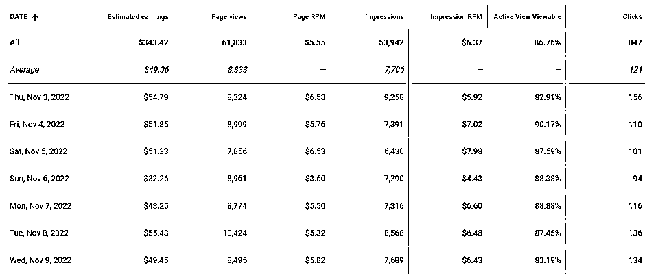  

这套方法论的问题是：词，可真不好找。 

怎么办呢？只能多去尝试。试的时候，降低试错门槛。如果你总能以每天 1 个 MVP 的速度来试，那一个月就能试 30 个产品 idea，到时候看数据，哪个 MVP 的数据好、就再次投入做哪个。 

（关于怎么用一天时间做出 MVP，下周我会分享，并拆解一个我真实的案例。） 

四、有人愿意预付费找你定制某个需求，然后你将它产品化 

这是非常好的模式。 

码叔在生财有术做过分享，这正是他的方法。 他从 6 月自学 Google 插件开发以来，半年时间已经变现了好几十万，他的方法可以复制。他总是从定制需求开始，从来不自己生造一个 idea。 

某人有个需求，知道码叔会编程，就付费让码叔定制开发。然后，码叔就想办法把它产品化，卖给更多的人。 

十年前，我在一家软件外包公司工作。这家公司主业是接欧美软件外包，但是高明的老板，从一早就意识到了这套思路。既然有客户愿意花钱让我们做，那我们何不试试把它标准化，卖给其他客户呢？    他们也时不时推出一些小型的 SaaS 产品，有些也取得了小成。 

（这家公司叫重庆诺怀软件科技有限公司，到今天也还在运转，我是它的一个小股东） 

国际上更著名的案例是 Typeform 和 Basecamp，他们最初都是软件外包公司，然后从客户的需求中，找到了共性需求，再将之产品化。以下是创始人的原话。 

  

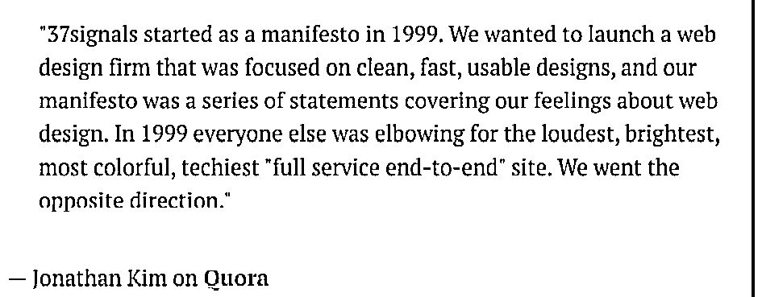  

生财有术有很多独立开发者，经常会接到付费定制开发的需求。  大家完全可以组织起来，去发掘其中产品化的机会。 

五、生造的 idea 

这不是一个好的方法论，通过生造 idea 获得成功的公司，屈指可数。 

把它列到这里，是希望跟大家提个醒。 

下次，当你脑海里冒出一个天外飞仙的想法“我想到一个绝妙的点子”的时候，多问问自己，用户在哪里？谁愿意付费？ 

最好骗的人，是你自己。我们很容易被自己的生造 idea 搞得很嗨。千万别轻易爱上自己的想法。 

六、整体建议 

1\. 想做出长期价值，请总是优先考虑原生 idea，它的成功率最高，你做的时候，也会更有激情。甚至，还会产生一种使命感。 

2\. 如果短期内想快速出成果，考虑第 2 种方法，先取得正反馈。它是见效最快、弯路最少的方法。生财有术的圈友要尤其重视这套方法，不要坐拥金山却浑然不觉。 

3\. 第三种和第四种方法，你需要的是一套“系统”。如何构造一套系统，让你快速找到关键词、快速找到 MVP？ 如何构建一套系统，让你能持续接到有人愿意付费定制的需求？ 

欢迎大家与我讨论。 

今天在生财的时间捐赠群分享了这个主题，我花了 8000 字，结合我亲自做过 3 个项目起盘的经验，讲一讲我们普通人如何在没有资源没有资金支持的情况下，如何搞定冷启动流量难题的，希望对大家有帮助： 

本次分享主要是从以下三个部分展开的： 一、重新理解微信好友 二、无资源无资本，如何从 0 开始积攒第一批客户 三、如何通过撬动 10 个铁杆粉丝获取 1000 个客户 

详细可直达飞书： 

[https://uuy7p3hra0.feishu.cn/docx/VAA8dQLTZolMlJx1jxrcKaPrnzd](https://uuy7p3hra0.feishu.cn/docx/VAA8dQLTZolMlJx1jxrcKaPrnzd) 

# 二、生财项目 

### 1、国内平台 - 字节系 

## （52 赞）《抖音情感中视频项目， 单视频变现 100-200+ 收益，全过程实操复盘大解析》 

大家好，我是黄岛主！ 

今天分享的这篇复盘文章，是我们最近实操的中视频副业项目，发布平台主要以抖音为主，所以也可以叫它抖音中视频项目。那么，我们所做的是赛道是情感赛道，账号起来之后收益还是不错的，作为副业还是非常满足的。 

我一说情感，肯定很多人了解过，而抖音情感属于对话故事，赛道也很细分。例如：婆媳、公媳、男女朋友、夫妻之间的对话内容，让人看完之后，很容易产生共鸣，所以热门上也是非常不错的。 

情感中视频的变现方式，也很简单，主要通过发布视频，根据播放量去算的收益，所以根本不需要其他操作，平时就是做视频发视频，然后坐等播放量上涨并获取收益，对于我们来说可以说是没什么门槛，有执行了就行。 

如图所示，我们其中一个号： 

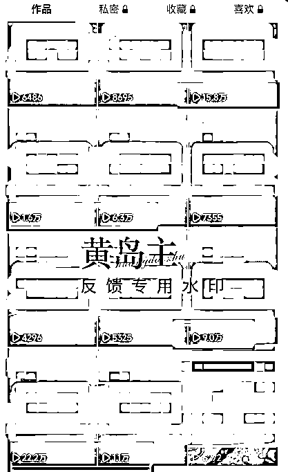  

看下其中视频的变现收益图： 

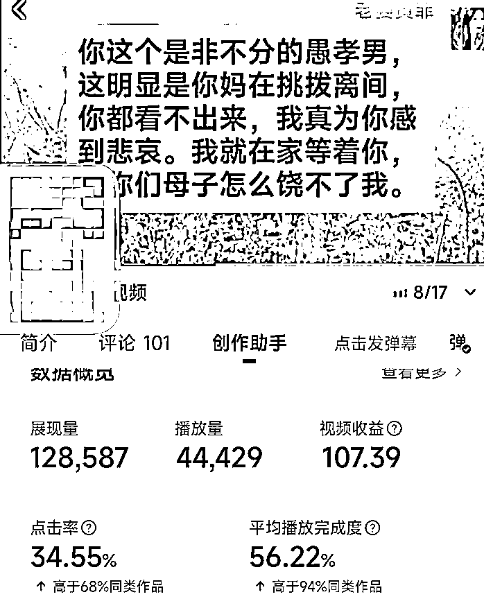  

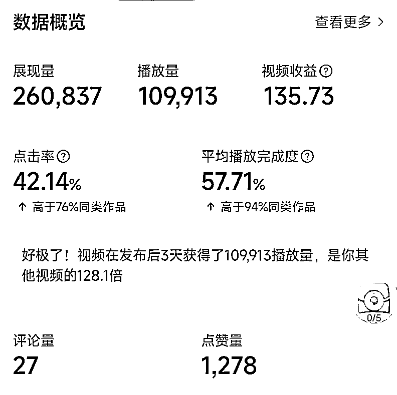  

  

来看下文章这次的主要内容，涵盖：注册账号、过中视频计划、养号、找素材、制作视频、发布、变现 

具体复盘内容如下： 

一、注册账号 

账号注册前的建议： 

1、我建议大家新开账号，从 0-1 会更顺畅，不会有那么多的烦心事，而且新号和老号的数据差距很大 

2、如果你是老帐号，譬如做了一段时间其他赛道的账号，再拿来做现在的情感赛道，我建议重新养号，但是可能做的效果不是太好，因为之前赛道的标签定死了，垂直度不是那么的号。 

老账号里的视频处理方法：可以隐藏视频，但不要删除，删除会降权，后期在刷领域垂直。如果已经发几百个了也可以隐藏起来，后期刷垂直去测试。 

3、有注册过抖音号、西瓜号，从来没做过视频，只是随便刷刷视频的，这个就没大碍，可以拿来直接用。 

手机号的注册和环境的建议： 

账号注册环境： 

要一机一卡一号，要在 4G/5G 环境下注册，不要在无线网环境下注册哈！（切记） 

细节注意： 

1、如果你所在的位置，通用抖音号的人特别多，超过五个以上，尽量不要在家里或公司注册，离你家走出一公里以外去注册，比较空间的地方最好！ 

2、很多人用 WiFi 注册，有可能会导致账号流量减少、限流、风控。 

3、给抖音和西瓜设置仅使用流量，防止误用无线网！（仅限安卓） 

  

手机卡注册建议： 

0、推荐用实名注册的卡，不要用虚拟卡、接码的号、物联卡等。 

1、有手机号，跳过 

2、没有手机号或重新在注册个手机号，去营业厅办理就行，然后再开个大流量套餐 

上述完善后，开始注册抖音账号+西瓜视频账号： 

先去注册抖音账号： 

先去下载个抖音 APP，然后手机号直接去注册并登陆抖音！ 

注意事项： 

1、注册完别填写任何资料，也别发视频！（养号的售后在填写） 

也就是，注册完，打开抖音登录后，会跳出一个界面让你写名称、昵称、更改头像，这个时候跳过去，跳过之后不要弄。 

2、老账号的话，原来关注的账号，都取关，防止影响标签垂直度 

3、抖音会提示你手机通讯录，记得打开 

4、粉丝也移除掉，不然会降低单价 

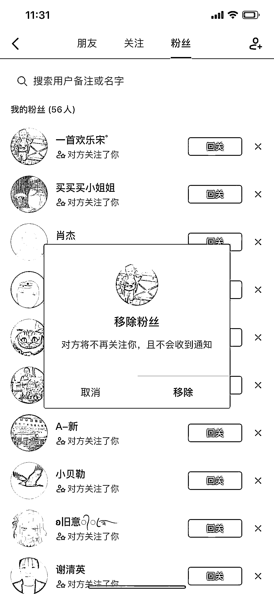  

再去注册西瓜账号： 

手机下载西瓜视频 APP，然后用注册抖音的手机号登录下西瓜视频 APP，等于两个平台共用一个手机哈！ 

切记：先不用实名（什么时候提现什么时候实名和绑银行卡） 

注册完了，我们看下一步！ 

二、开中视频计划 

先领取中视频任务： 

1、会提示你同步抖音，这个时候同步，如果没提示同步，要手动在西瓜视频的设置里 设置同步，后期发布的售后， 也可以点同步发布抖音！ 

另外，西瓜会提示你 同步资料，点同步资料就行了！ 

2、去西瓜视频 APP，顶部搜索框里，搜索：“中视频伙伴计划入口”，点击红圆圈里的，进入后加入中视频任务。（现在就可以领取了，后面再发视频） 

  

3、加完会提示，让你发 3 个视频，并达标 17000 播放量，这个时候我们要去做播放量 17000 的任务了。 

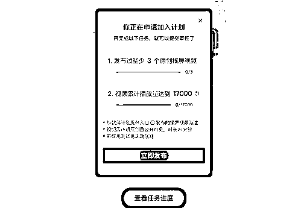  

过计划要发的视频，跟大家说下： 

我们主要以做菜为主，也就是做菜的全过程讲解。 

说白了，就是从洗菜，切菜，做菜，成品菜，全过程 用通俗的语音讲解出来，边做边讲边拍，不需要露脸，然后拍摄出来。 

摄方法跟大家说下： 

一定要横着拍才可以，边讲解  边拍，可以用三脚架固定手机拍摄，或者找个人拿着手机帮你拍。 

注意：要拍三个不同的视频哈，不能重复用！ 

发布方法跟大家说下： 

西瓜发布的时候，一定要同步到抖音，不要单独去发抖音，而是发西瓜的时候同步到抖音！ 

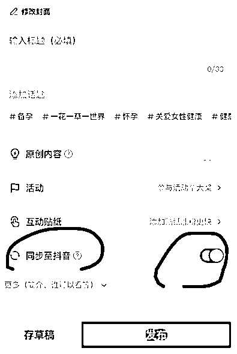  

播放量这么达到 17000？基本上我们都是投豆荚！ 

投抖加的方法 

注意：一天内 分三个时间段发完三个视频，发完之后，针对其中一个视频去投抖加，默认投放就行。 

投的细节看下： 

可以三个视频里，去选择两个视频投放，也就是两个视频 投 98 元，然后看下哪个视频播放量跑的好？ 

然后去选择那个播放量好的视频，继续投 68 元 

98 投完会显示一个 68 的，前提是 30 的用户专享不要用 

总结：也就是 98+98+68=264 元！ 

以上是正常的投放方法！下面是平台给的优惠券等活动，可以看下： 

赠送优惠券： 

10 块的优惠券，大家投完一两个后可以进抖加的页面看看有没有，有就用着 

头条和西瓜都有训练营，这个训练营完成了会有加油包奖励，具体操作如下： 

补充说明： 

注意这两个活动都是只有新号才能够参加，所以看第一个 8000-1 万，第二个 6000 左右，这样加起来就有 15000 左右的播放量了，剩下就只有一、两千播放，随便发几个作品或投豆荚就能达到了。当然了，如果训练营的已经结束了，就没了。 

1、西瓜视频（训练营如果已结束，就等下期） 

怎么样拿到西瓜平台的流量扶持，首先打开西瓜视频，在右下角我的里边，找到我的创作点进去，点进去之后会看到有创作训练营的入口，再点进去会看到顶部有提示，西瓜创作者训练营多少期，训练营一直都在举办。 

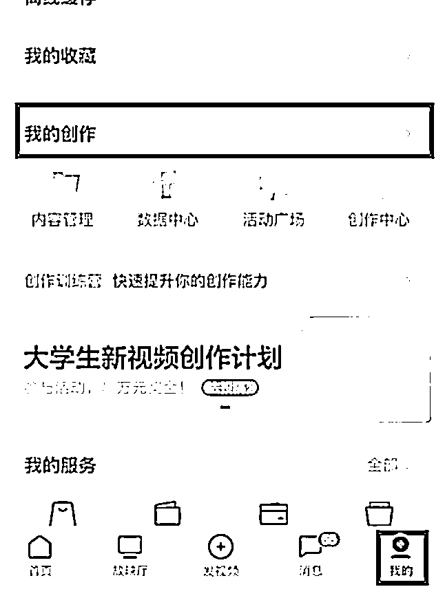  

  

  

只要按照训练营里边的要求提交作业去学习，学完之后就能够至少得到 8000 到 1 万的播放量扶持，这个扶持是一个加油包，发作品的时候就可以直接用上，这是西瓜官方提供给每一个新手的流量扶持，只要你参与就一定能拿到。 

2、头条加油包 

在右下角我的里边找到创作中心，点进去之后就能够看到有一个新作者成长攻略，点这个海报进去，会要求你提交相关的信息，只要提交成功之后，就能够给你发放最高 6000 的播放量加油包，这个加油包也可以用在你发布的视频上面。 

  

  

注意：不同的活动，都有奖励，如图： 

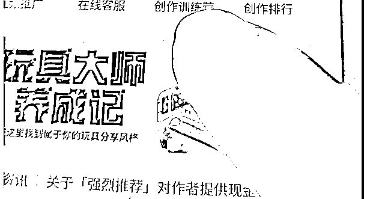  

播放量达标后，会自动审核，基本上我们等 3-5 天差不多就行了。 

如果不想自己过计划，也可以买，我这都有渠道。如果是买的账号，要记得隐藏原有视频，这个要记住，如图： 

  

三、养号刷垂直度 

养号的细节： 

1、要点赞！把账号打开，刷短视频界面，记住找点赞几十万、上百万的，去点赞，点赞很重要，抖音识别到你是活跃的用户，喜欢这样的作品。 

2、看对标要完播！完播就是把作品从头到尾看完，抖音就会识别到账号是真人操作，做了点赞之后，抖音很确定是真人，每天点赞最少 20 条以上。 

3、要去评论！评论很关键，评论的时候如何增加账号的权重，最重要的就是别人给你的评论进行回复，会增加账号的权重，新号就会增加权重，如果别人通过你的点赞、评论给你点关注，对你的账号权重增加非常大。 

那怎么能让别人给我们的评论进行点赞？ 

你可以把别人的点赞复制，复制该评论点击粘贴，一定不要完全复制，给它进行修改，不修改的话发不上去的，这是复制别人的，随便点几个之后发上去之后，有可能别人就会给你的评论点赞，点赞之后就会增加账号权重。 

4、每天账号短视频界面活跃最低一小时，时间越长越好，评论每天最少五条以上，一小时的时间就可以，一小时以上进行收藏。 

5、要去关注！看到自己喜欢的作品就点关注，每天点 5-10 个就行 

6、活跃账号最少 3-5 天左右！ 

7、刷短视频+直播间 一起进行 

注意：以上这都是在养号，让抖音识别出是正常用户在使用账号，这一点非常关键。 

具体养号的方法如下 

我们分为5 天养号时间，目的就是为了养权重 刷垂直度，这样后期热门率能做到最大化。 

细节：养号期间不要做任何动作，不要发作品，删作品。 

老号的细节说下：因为老号的程度不同，如果没违规账号，除了正常养号，还要把所有关注的取关、把作品全部隐藏，每天在私密里删 除原始作品 1-2 个（有视频的情况下）。最后，重新养号！以免标签错乱。 

怎么定义养号成功？ 

等你账号里推荐的基本上都是我们刷的领域的视频了，就差不多养号成功。 

来，看下面的养号具体的操作： 

第一天： 

打开抖音，正常刷刷视频（可以长按视频，找到倍速播放，设置 2 倍），每个视频都要刷完播率，无论给你推荐什么作品都不要管，只需要看完就行了。 

建议刷 1 个小时以上，次数不限，时间长一点的话，2 个小时更好，可以分早中晚三个时间段去刷。 

第一天推送什么就看什么，不看没事，但要等播放完，再换下一个视频。 

注意：这个目的是为了新人玩抖音更自然，不然很容易判断营销性质。 

细节：大家注意了，如果注册过一段时间的号，经常刷视频，可以直接做第二天的养号，如果没刷过是空白，就得从第一天开始做养号。 

第二天： 

这个时候，我们要做垂直标签了！ 

请手动在搜索框里搜索“情感故事聊天记录、情感故事馆、情感故事、”，搜情感故事，会出很多下拉框，都是我们要搜的关键词。 

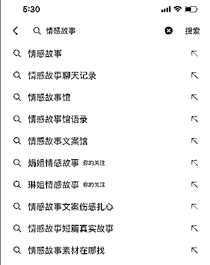  

搜完之后，这个时候，刷这类短视频，重复第一天的操作，适当的每个视频点赞。 

此时，你可以点击视频的主页，对这个账号里的视频进行点赞，但不要直接关注，你可以先刷几个视频再去关注这个。 

建议关注 1 万粉丝以上的对标账号，如果进入主页后看有几百、几千粉丝就不要关注了。 

第三天： 

延续第二天，正常点赞、关注！ 

顺便看看推荐的视频有情感对话类的视频，如果有也对推荐里的进行正常的点赞与关注等操作。 

注意细节：每次刷新下会出现对标视频，往下滑可能不会出现过多，所以你可以每次刷新下看看，然后再往下刷，看看会不会也出现对标，你遇到非对标，长按视频，点击不感兴趣就行。 

另外，要适当的评论，大概 5 个点赞率评论 1 个，要做到 5：1 的比例。 

评论的时候，尽量去相关视频里找热评，评论火的、回复量很高的、点赞量较高的评论，然后直接复制评论内容，修改下，去评论就好了。 

第四天： 

重复第三天的操作！ 

第五天： 

上午继续重复，下午可以考虑安排发视频了。 

注意：养号 5 天，喜欢列表里差不多 300 个喜欢的作品，推荐的出来的都说同类的，基本上算是养成功了 

我会提前两天时间，教大家做视频，到时候群里通知。 

第 6 天： 

之后，每天养成养号刷视频的习惯，才能保持标签持续垂直。 

直播间活跃养号的方法 

找到一个直播间进入之后，让抖音识别出我们是活跃的粉丝账号，是正常用户在使用账号。 

第一步：首先进入直播间之后停留三、五秒钟点赞，点赞数量几十个就可以，如果说你是做直播的就点 200 个赞，如果是做短视频的，让抖音识别到在直播间点赞就可以了，几十、上百就可以。 

第二步：评论，每个直播间进去之后三个评论，最好是评论主播会回复，这个抖音会识别到。 

第三步：关注，如果喜欢这个主播就点关注，如果你的账号有抖币，最好是做一个付费，因为抖音是商业平台，你给它做付费之后，抖音就认为是非常活跃的账号，因为你给抖音做贡献了，加入粉丝团花一毛钱，对账号流量权重影响很大。 

每天趴 3-10 个直播间最少，进三个直播间，每个直播间待一小时以上，做完了之后就放在那不用管，注册的时候用 4G，但是看短视频、进直播间活跃用 WiFi 就够了。 

怎么确定账号养号成功 

做好一个视频，发抖音，如果抖音推荐了，代表就可以了，一定要用 4G 网络进行发布。 

如果作品播放量三个小时后或者第二天在 500 左右，账号就是正常的，如果说拿到 1000 的，这个账号很有可能会很牛。 

如果账号播放量第二天只有几十个，那再等一等，第三天再看一下。如果没有增长，账号很有可能还处于风控状态。 

养号 5 天结束后，可以填写下资料： 

1、头像，可以参考同行，可以看看人家怎么做的，这个不固定。 

2、签名，参考对标，这个也不固定。（后期变现的时候会有单独的签名给大家） 

3、背景墙，也是参考 对标，可以手动点击童话的背景墙下载图片 

4、昵称，也是参考对标，例如：黄姐情感故事 

找对标帐号的爆款视频和下载方案 

1、找对标视频的方法 

找对标视频，可以在抖音搜索框里搜索：“情感故事聊天记录、情感故事馆、情感故事” 

当然，你养号的时候（还没开始养号），已经收藏了很多对标爆款视频以及关注了对标帐号，我们可以直接用。 

另外，你搜情感故事，会出很多下拉框，都是我们要搜的关键词。根据这个找到对标视频即可！ 

  

2、找对标账号里以前爆过的视频 

看一下同行以前爆过的视频，把这些视频拿过来用！ 

第一点：看转发量高、评论量高、点赞量高的视频 

第二点：视频的点赞，最少要 3000-5000 点赞以上，过完点赞更好！这个就说明作品大家都是认可的！ 

细节要注意：找素材要垂直 

爆款作品一定要找同类目的，不能今天找搞笑发，明天找情感的发，后天找撩妹的发，找好一个类目，比如婆媳、夫妻、公公等之间的家事，那就都找这类的！ 

3、把对方的视频下载下来，下载方法看下 

移动端：微信搜索下“去水印用轻抖”，打开后，把抖音里的那个视频地址复制到轻抖里，直接下载 

步骤看下： 

先复制抖音的链接 

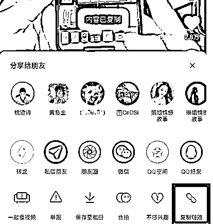  

微信搜索“去水印用轻抖” 

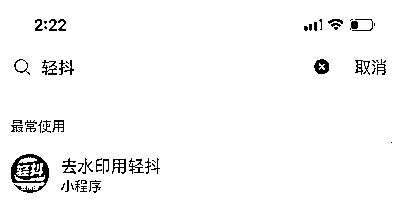  

到首页之后，点击去水印 

  

然后输入地址，点击一键去水印 

  

成功去水印，保存相册，视频就出来了 

  

4、把文案扒拉下来的方法 

轻抖生成文字，免费的方法 

微信搜索“轻抖去水印”，点击文案提取 

  

打开文案提取，输入抖音那个视频的链接 

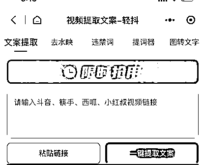  

文案提取出来了，但文案提出的比较乱，没付费的效果好 

  

然后我们去修改文案，要二改： 

一定不要把别人爆款拿过来不要一字不改的发出去，因为你发的同时，肯定有其他人也这么做，都发一样的文案，爆款就低，而且单价也不高！所以，我们孵化的售后可以重新创作它！ 

首先，内容大纲不要动，重新给它加一些元素在上面，重新把作品二次加工，二次创作，这样容易会再爆。 

其次，改内容很简单，两个方案，大家去孵化测试 

第一个：全改 

第二个：开头、结尾必须要改，中间不改，或简单修改 

看下二改的方法：很简单，按照自己的话写出来 

原文：妈，最近想和小婷离婚了，我们昨天去医院检查了，结果是小婷不能怀孕。 

二改：妈，我最近和小婷去医院检查身体，结果是小婷有可能这辈子都不能怀孕了，我想和她离婚。 

四、视频制作方法 

先看下视频大概样子，就是聊天对话模式： 

  

具体看下步骤，我给分好步骤， 按部就班的从第一步看操作 

制作软件，我们用的美册，我这有便宜的版本，需要的找我就行。 

第一步、做聊天记录有两个功能 

打开美册，做视频的时候点开聊天视频，常规对话没有配音，配音对话有配音 

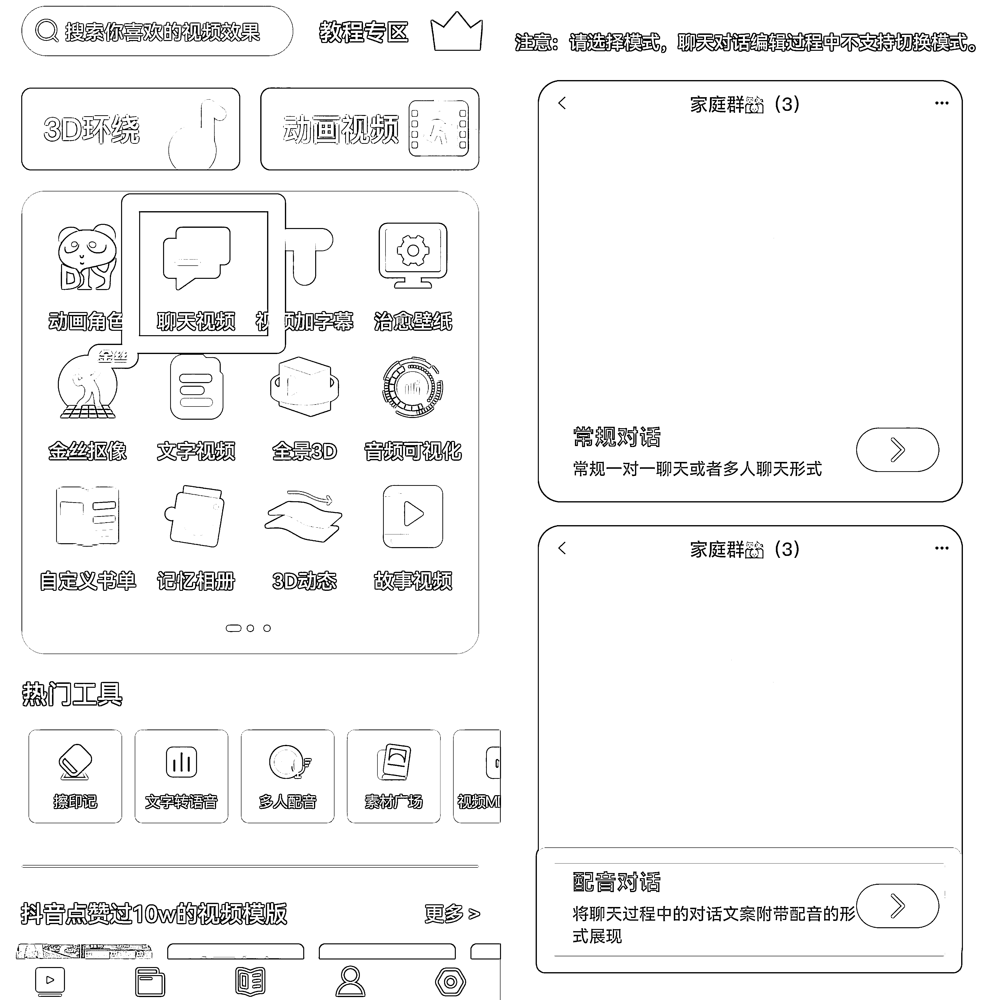  

第二步、调整比例 

点开配音对话，做中视频一定是横屏视频，改成 16 : 9 

  

第三步、功能设置 

把对方昵称、我方昵称全部点开，顶部昵称看要不要写一个标题，如果要写标题的话，上面顶部昵称就可以保留，不写标题可以去掉。 

消息间隔，两个对话当中间隔多长时间，建议调成 0.2-0.4 秒，一般调成 0.3 秒就可以。 

布局调整，最重要的就是布局聊天框间距，调成到 40-50 就可以，一定要调整。 

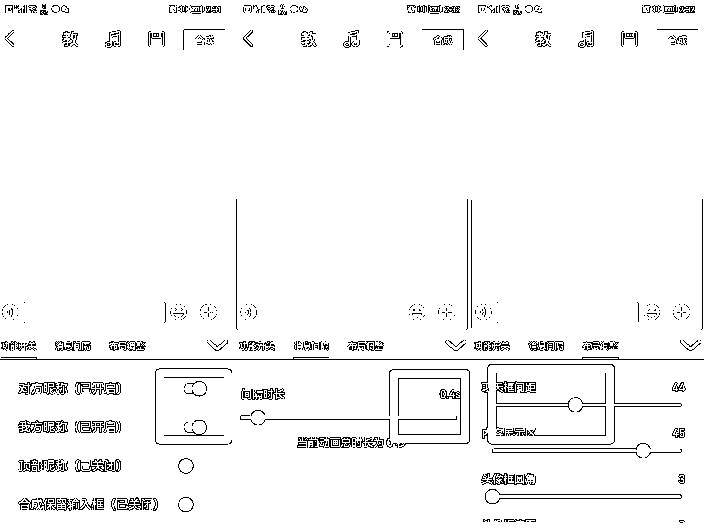  

第四步、字体设置 

一、角色昵称字体，选择 B 加粗，颜色选择红色，文字大小调整 20-25 左右，描边大小 3-6 左右，文字间距稍微调整一下就可以，按照自己合适的程度来调整。 

二、对话文案字体，文字颜色黑色，别的文字看不清，描边大小稍微拉一点，文字间距稍微拉大一点就可以，根据情况选择。 

三、系统消息字体，文字颜色红色或者粉红色，文字大小稍稍调整一下，描边调整一下，文字间距调整一下。 

  

第五步、配音设置 

系统提示，选择声优，在热门里面找喜欢的声音或者适合的声音，点进去之后有试听，如果选择了这个声音觉得好用就点选择使用，应用配置，下面有调整语速，根据情况选择，可以调整到 1.2，一般正常就可以，选择应用配置，主角色、副角色的声音都调一下。 

  

第六步、设置背景 

美册软件里边自带背景可以选择，也可以选择自己喜欢的图做为背景，把它添加进去就可以，或者在其他视频网站上找视频放到自己手机里面作为背景也可以。 

建议自己制作背景！下面有具体的制作方法！ 

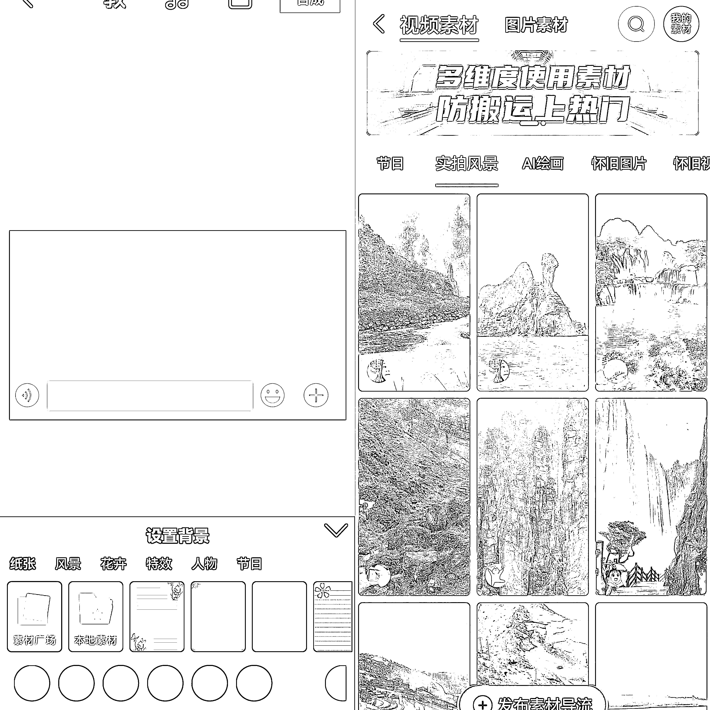  

背景孵化的细节跟大家说下： 

就是刚发作品的时候，选择一个背景先发，看流量怎么样？如果流量不好再继续换背景，连续换两、三个背景之后，看哪个背景跑的流量大，最后固定一个流量大的背景发！ 

比如其他的背景跑了几千，突然有一个背景跑了几万，记住这个背景就不换了，就用这一个背景，一换背景一定会影响流量，但背景只是一方面，跟作品还是有关系的，但背景一定影响流量，这个需要大家测试下得出结论！ 

第七步、系统提示 

系统提示选择插入就可以，打出字之后，聊天记录做好之后，想要系统提示想要说什么，就相当于旁白，在这里面打出自己想要的文字就可以了，再选择配音，声音太小就调大一点。 

  

第八步、切换角色 

主角色、副角色一，副角色二，主角色只有一个，副角色可以增加很多，怎么增加副角色，长按头像，点击添加副角色二就出来了，依次把聊天内容输入进去之后就可以点击右上角的合成。 

  

文字填写到美册里的技巧： 

1、手机安装个搜狗输入法 

2、用语音识别文字功能，口述识别出来，就不用手打文字了，具体如图 

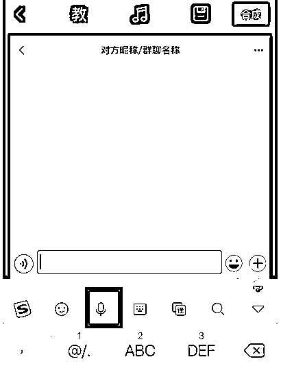  

  

好了，按照以上的图文步骤去制作视频，基本上没问题！ 

五、发布方法 

发布的话，按照我下面讲的去操作下！ 

1、打开抖音，点击发布视频，选择做好的视频发布 

2、写标题的时候，标题内容伪原创下对标的内容，别一模一样的抄袭 

  

3、写标签的时候，多分析同行的标签，看下对方怎么写的，我们就怎么写 

  

4、位置不要添加 

5、作品同步，要把“原创内容”勾选了，勾选了，才有收益 

  

6、高级同步 ，这个里面选择高清发布 ，其它默认 

7、最后发布出去就行了 

8、发布出去后，自己点赞 评论 收藏 完播一下 

9、发布时间，分 早、晚 时间段 自选下，前期每一天发 2 个 测试，先看看整体效果 ，要测试出来看看 

六、变现方法 

发布之后，坐等播放量，根据一个月发布的综合数据做调整，看看收益在多少，其他就没啥了。 

写在最后： 

好了，写到这里，大家可以按照我教的步骤去实操下，看看整体效果，如果有问题，可以找我交流沟通。 

## （47 点赞）《抖音卖钥匙扣利润 78 万? 我们来尝试拆解一下》 

抖音直播镭雕工艺刻钥匙扣车牌号码，好多观众见单价十几块也不贵就下单了 

她的话术还有一个痛点 

（如果车钥匙掉了，可能是几百，几千块。对比起来 10 来块号码钥匙扣就是毛毛雨。且她针对是有车的人群，消费力也不会太低。） 

直播间目测就是 2 个人一个后台，一个前台（不需要露面，只需要做美甲就好了） 

场观我看了 10 多分钟维持 800 多人，有些客户在线等待还增加了在线时长。对直播间数据更好 

大家先记住这几个数字： 

员工 2 名，场观 800 多，中号钥匙扣 15.9 元  雕刻机 1k 

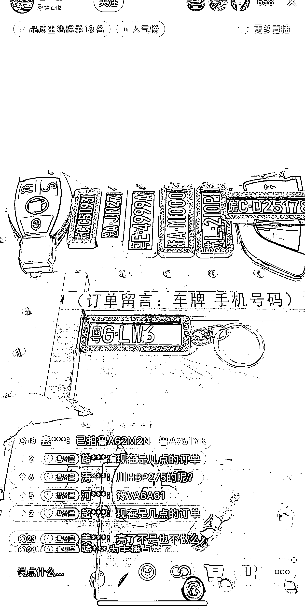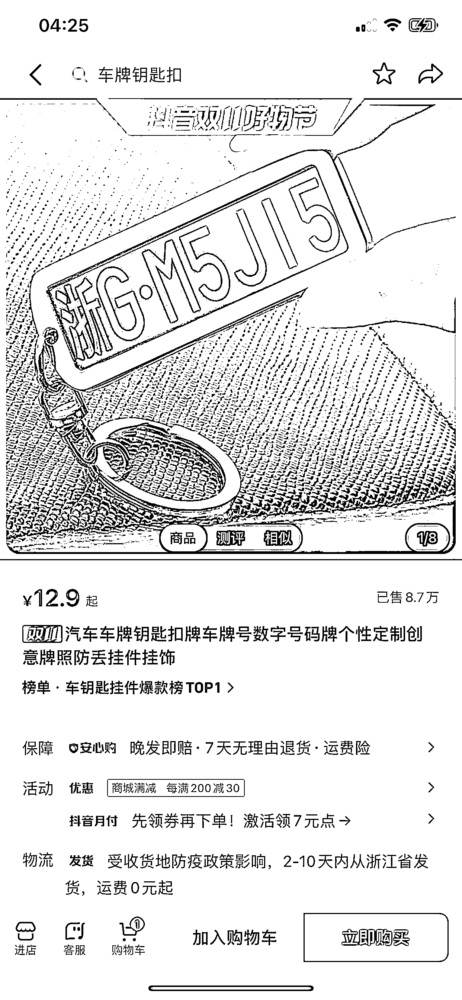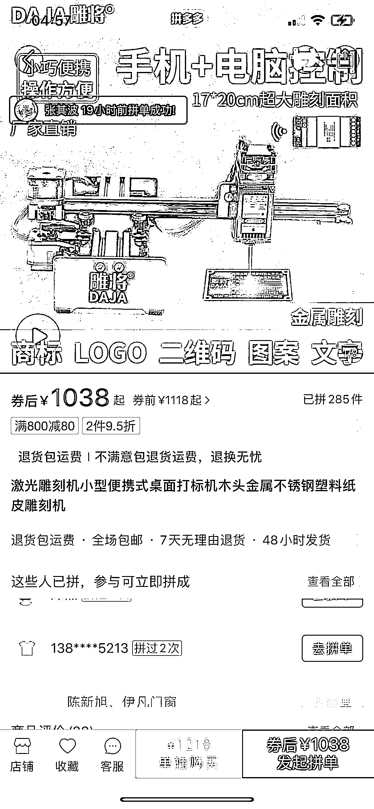  

我去拼多多查了一下，卖中号钥匙的卖 6.88。抖音直播间卖 15.9。 

15.9-6.88=9 元（差价） 

再用差价*直播商品列表页显示已售 8.7w 

9（差价）*8.7w（已售）=78.3W（利润） 

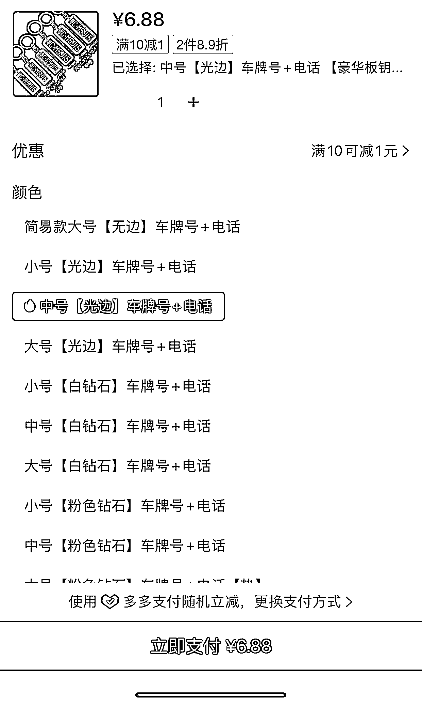  

OK 

你可能觉得 8.7w 未必真实 

我们用商品评价数 1.1w 来计算 

1.1w*9 元=9.9w 

也是 6 位数的生意。 

且 6.88 也不是成本价。利润可能更深 

（拼多多能卖 6.88，证明还有利润） 

再者直播时候，量太大。刻不过来，直接找拼多多代发。甚至后端那一 part 也不用管了 

就发发直播刻好的。 

你觉得大致思路有错吗？我们来探讨一下 

延伸出去 

有制作工艺的老板们，也可以开直播。利用人的好奇心，看看能不能增加销量。 

## （35 点赞）《小杨哥授权，官方免费，自行申请，做直播切片带货的可以去申请》 

小杨哥授权，官方免费，自行申请，做直播切片带货的可以去申请个 

[三只羊直播视频剪辑](https://www.sanzhiyang.cn/h5/) 

#直播切片# #抖音# #小杨哥# #风向标# 

## （33 赞）《台词本学英语账号，可以近乎无限生产内容，并快速变现》 

#风向标# 

我很喜欢看《老友记》 之前在淘宝也买过老友记的台词本来学英语 刷抖音发现了这一个账号 感觉做的既简单又有效 

好处 1、视频内容可以近乎无限生产，不缺素材 2、视频制作简单，上下两个画面，上面是原镜头，下面是手机录的铅笔指对应台词。一天可以批量做许多条内容 3、转化快，视频内容本身就是广告，卖什么就拍什么，没有弯弯绕绕。主页签名也提示了下单路径 

坏处： 1、壁垒弱，容易被模仿 

执行建议 1、可以增加一些真人出镜镜头，增强信任，做出差异点，有独特差异，非标更有利润保障 2、可以适当从豆瓣老友记小组挑选一些热门讨论话题，适当做些内容。这样能破圈播放。粉丝粘性也会更强，会觉得你懂我，更感同身受，而不是把你当做无情的卖书机器 3、产品可以更多元化一些，推出一个更贵的产品，拉高利润。比如老友记 1v1 陪读，或者共读群。 4、私域积累了比较多的英语学习类粉丝后，可以私域销售一些其他产品，或者偶尔接一些广告 

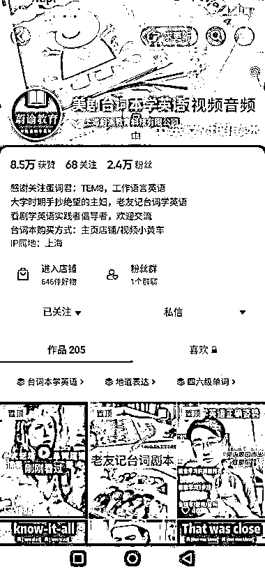  

## （24 赞）《抖音/视频号引流，通过售卖叶雕定制照片进行变现》 

#风向标#  叶雕定制照片，抖音/视频号引流，淘宝目前相关产品销量还没有那么高 

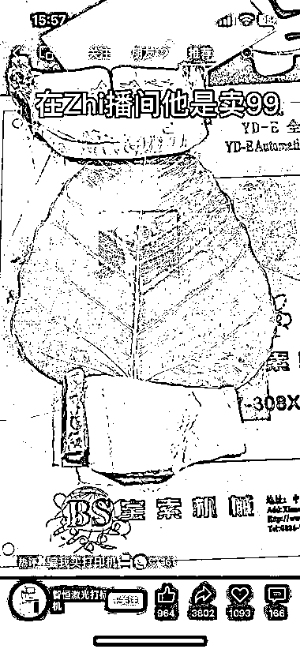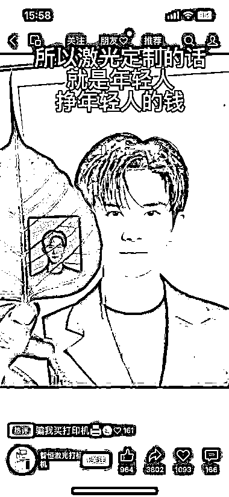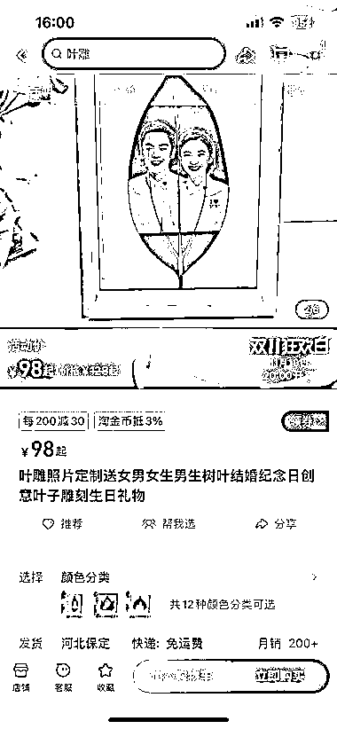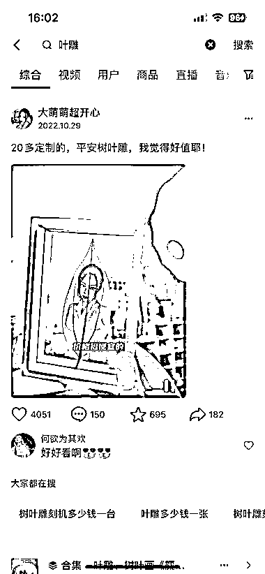  

## （21 点赞）《通过抖音、线下蛋糕店引流小程序，通过售卖小朋友奥特曼祝福视频变现》 

#风向标# 小朋友奥特曼祝福视频，引流渠道，抖音，线下蛋糕店皆可，进阶版：小程序自助下单发货》1、选择主题视频 A（例：奥特曼）主题视频 B 主题视频 C 等---》输入 小朋友姓名》祝福语。（通过设定好自动剪辑生成） 完成发货。微信小程序、抖音小程序。希望有能力的代码小哥哥，开发一套，共享下咯，服务器自己租  

  

  

  

## （17 赞）《抖音变现玩法：售卖合同模板》 

#风向标# 好夸张，抖音上面卖合同居然销量这么好，不仅仅是房屋买卖合同，租房合同、招聘合同等各类合同，应该需求量都挺大。 

  

懒人备注： 

小懒之前在群里分享过很多合同模版了，这里自取： 

[https://www.aliyundrive.com/s/ZfFF6QG2Hj5](https://www.aliyundrive.com/s/ZfFF6QG2Hj5) 

## （15 赞）《抖音二创小说短剧，导流微信售卖变现》 

#风向标#  最近抖音上这种小说改编的《小说短剧》很火，每个剧只能免费看几集，剩下的要付费看，（看一个剧要几百块），8 月 7 号我搬运一个剧《回档 1990》9.9 一个，从抖音往微信导流，转化率接近 90%以上，当天撸了 3000 多，除了搬运，还可以正规分销这种剧！搬运的话比较费号，另外这种剧免费的在抖音上更新的并不时时，比如最近几天的《刁民王小二》，免费的全集并没有！ 

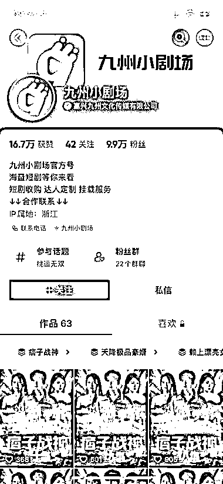  

  

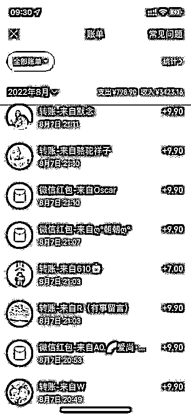  

## （45 赞）《矩阵做纯带货视频，3 个月净赚 20 多万》 

#风向标# 

重点来了， 号才 3000 粉，从未开过直播，纯靠视频带货。 9 月 13 号开始发带货视频（应该是满 1000 粉刚开通橱窗的时间）， 而且所有视频均是拼接剪辑的， 每天就发 5 条带货视频（满 3000 粉之前，一天是才发 2 条带货视频的） 

在保证视频质量的前提下，量怼的越多，爆单的概率肯定就越大， 我大概数了一下，从开始带货到现在，点赞超过 500 的视频就 10 个，超过 100 赞的也没几个。 剩下的都是个位数点赞，甚至 0 点赞。 

也就意味着绝大多数视频都是没什么流量的，就靠那几个爆款视频爆的单。 就这样纯靠怼量，把这个抖音号做起来了。 

后来我又挑了 2 个品，也有类似这样做，且做起来的账号。比如发饰，我就找到一个号，纯靠发带货视频，不开直播，累计带货 10 万+。 

因为考虑到这些号可能就是生财圈友做的，为造成不必要的麻烦，抖音名就码起来啦。 

  

  

### 2、国内平台 - 腾讯系 

## （73 赞）《围观船员视频号带货，如何 7 天 10 万粉变现 5 万+》 

[https://v9rbaf0m5d.feishu.cn/docx/VsjCdIDNJoNRvlxo4OWcJ7bDnO5](https://v9rbaf0m5d.feishu.cn/docx/VsjCdIDNJoNRvlxo4OWcJ7bDnO5) 

## （127 赞）《如何从 0 到 1 打造一个高质量交付的训练营》 

【保姆级教程】从零到一打造一个高质量交付的训练营 ----- 

今天，我把做训练营的思路，尽可能详细的写在这篇帖子里。 希望能帮更多有成功经验，想做好交付的圈友，打造出自己的训练营产品。 也希望能借此，间接帮到更多想做项目的圈友，成功跨出搞钱第一步。  ---- 为了排版方便，正文请看飞书文档： 

[https://y2mt3o47i3.feishu.cn/docx/MUfLdmUlTosj0NxPhlfcjRPHnff](https://y2mt3o47i3.feishu.cn/docx/MUfLdmUlTosj0NxPhlfcjRPHnff) 

## （31 赞）《视频号新手 IP、操盘手必看干货：如何从 0 到 1 操盘一场视频号大型直播活动》 

大家好，我是车纯纯，NOW 主义创始人兼 CEO，目标管理&时间管理专家，3000+学员的高效能教练。 2 月 4 号开始尝试在视频号直播，截至 8 月做了三次视频号直播活动，分别是： 

1）514 大咖 8 小时连麦，GMV 破 16 万； 2）618 学员 7 小时连麦，场观过 1.2 万，GMV2 万； 3）7 月连续 5 日大咖连麦活动，平均场观 2300+，涨粉 300+。 

没有全职人员，第一次活动时甚至没有助理，所有从策划到细节落地均是一手经验，大到整个活动框架，小到海报设计细节及话术细节，全文 9000 字，在我的公众号需付费 8 元阅读全文，在这里免费分享给生财的朋友们。 

本文适合想要在视频号发展，通过营销活动破圈的新手 IP 或操盘手，全部数据属实。 

具体详情请走：《如何从 0 到 1 操盘一场视频号大型直播活动》： 

[https://shimo.im/docs/wV3VVVo1KyCave3y/read](https://shimo.im/docs/wV3VVVo1KyCave3y/read) 

## （33 赞）《知识 IP 如何通过一呼百应裂变式发售做到业绩倍增？》 

2022 年我做了两场影响力百万发售，都是通过私域+直播的方式达成的。通过发售，我们现在已经累计招募了 500 名收费 8900 元的菁凌合伙人，30 名收费 29800 元的私董。 

今年的年营收倍增，影响力也实现了大升级。如果没有大事件，我们是无法做到的。 

今天就给生财的各位圈友，分享我是如何做一场一呼百应的大事件，我将以八月份的百万发售，从这次的成果——人员统筹——群发售 14 大细节，给大家做一个详细的拆解。相信看完之后，你马上就可以用，也可以实现影响力和营收的大升级。 

[https://shimo.im/docs/fuDML6YkMuca2wQg/read](https://shimo.im/docs/fuDML6YkMuca2wQg/read) 

## （14 赞）《代购群活跃玩法：定期放出中小样售卖》 

#风向标#  

### 3、国内平台 - 小红书 

## （133 赞）《爬取小红书航海百万字聊天，筛选出 1000+ 提问，发现了新人最关注的 12 个高频问题》 

生财的圈友们好，我是梨云，一个内容创业的广告人。 

上周，9 月航海结束，有复盘好习惯的圈友，都写了不少高质量总结，我可不能掉队！（话说我刚打开星球看到 11 月航海出了……） 

总结什么好呢，看着还在互动的小红书航海群，突然灵机一动，握着一手资料，哪有不用的道理？ 

说干就干，我爬取了小红书航海中近百万字聊天，筛选出了上千条问题，进行归纳整理，得出了新人下场小红书最关心的 12 个问题。 

目录 

数据收集与分析 

12 个高频的问题 

 1.怎么引流量 

 2.怎么搞笔记 

 3.怎么来变现 

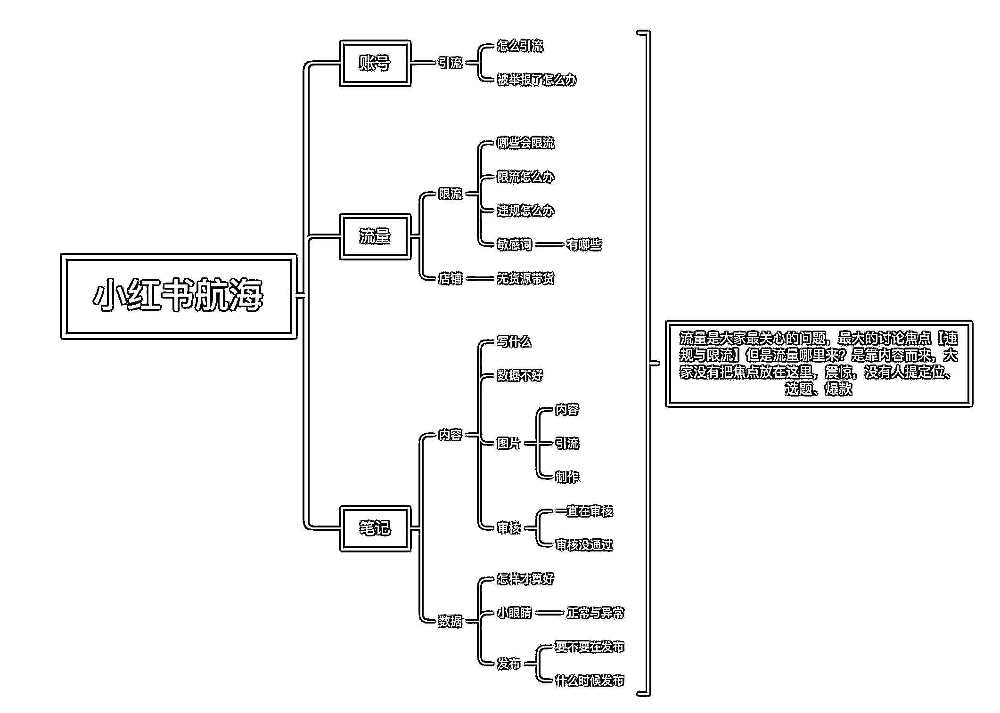  

## 数据收集与分析 

做数据分析，第一步是明确目标，然后围绕它展开一系列推进，我这次的目标就是：9 月小红书航海中，挖掘大家最迫切的需求。 

接着，去哪里收集？生财帖子？评论区？百问百答？它们没有入选，因为我考虑到了一个很重要的因素：时效性！ 

那么，最终目标就锁定在了航海群！一个及时提问，就能即刻获得反馈的地方，我时常感慨航海教练真的太能秒回了，很难不怀疑这直接是住群里了？ 

现在，我需要把航海群的聊天记录，全部导出来，于是，百万文本到手了…… 

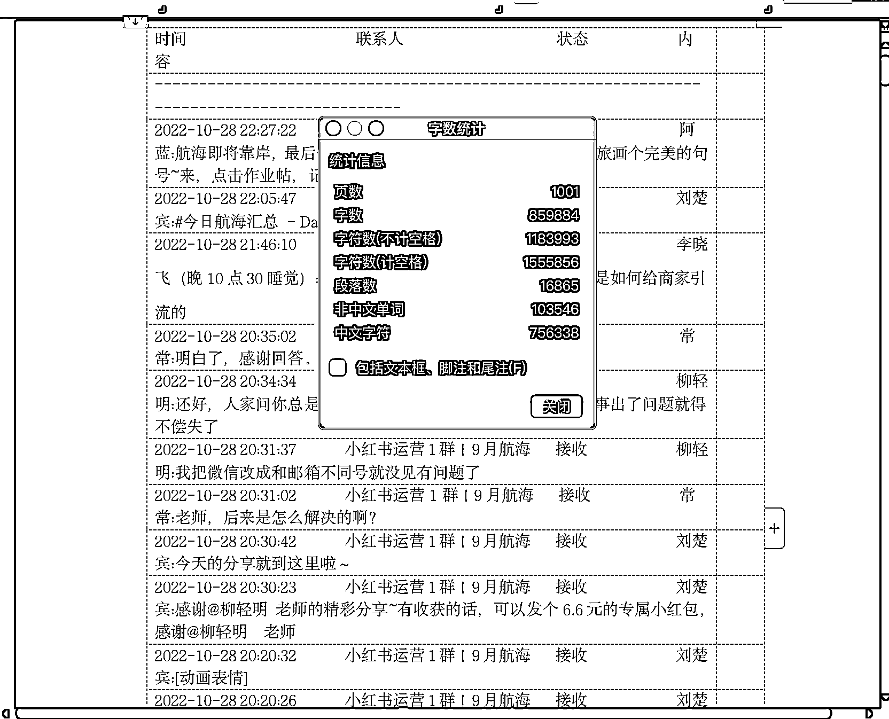  

海量数据，只取一瓢，这时候，筛选就变得尤为重要了，于是，我将其导入表格，就在琢磨取什么关键词的时候，突然想起航海有一个规则：#举手 

这个设定真的是太棒了！瞬间从 1.6w 条聊天记录里面，筛选出了 1 千 7 条提问。 

如果没有这个设定，那么筛选思路是这样的：筛掉带有分享者名字的（因为他们一次分享会占据很多行）-筛掉带有这些关键词的句子（因为这是分享引导句）：分享、提问、感谢 

然后，筛出带有这些疑问词的句子：请问、呢？、吗？、么？、呀？、把？什么、怎么、为什么、问题、是不是、有没有、？、怎么办 

这些词怎么来的，通过解析大量提问句式和用词习惯，提炼出来的，这个过程就不详细赘述啦，上面常用疑问词可以直接收集起来~ 

用表格做了一个筛选器，这么一顿操作，得到的结果有 400 多条，有七成带有#举手的提问，还是得赞一句，举手设定牛逼！ 

  

直达链接：[小红书航海群聊筛选器](https://lvcj32c4z9.feishu.cn/sheets/shtcnNbtHQBHBbh5CuPSkg0ggRd) 

有效数据筛选出来了，接下来就是进行可视化的词频分析，让我们一起看看，在 21 天的小红书航海中，大家讨论最多的是什么~ 

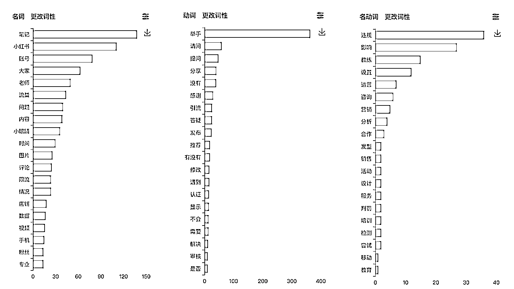  

你以为这样就结束了？不！这些数据是具有迷惑性的！ 

比如，笔记出现那么高频，大家在讨论笔记的什么呢？是否存在两个词经常伴随出现，从而拉高了出现频率呢？ 

所以，除了看到出现的词频之外，还要进一步确认，这些词，都和哪些词一同出现，以此来具体高频词背后对应的需求。 

就拿“笔记”这个词来说，和它一同出现的词，特别的杂，有小眼睛、有违规、流量、发布等等，所以，这样的词，不能具体体现需求的词，可以直接 pass 掉，虽然它高频出现排在第二位。 

  

我们再挑一个“流量”来看看，这个词背后体现的需求就很明确的，关注流量的多少，再具体一些，就是影响流量的因素有哪些，我们如何满足或者避免这些因素，从而获得更多的流量。 

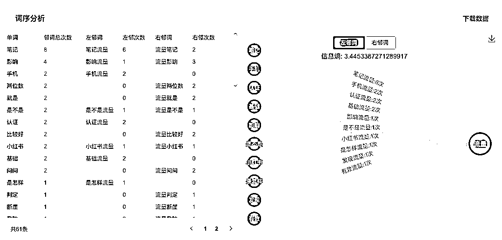  

按照这样的思路梳理一遍，我得到了 12 个大家特别关注的问题。 

先说一下结论： 

流量是大家最关心的问题，最大的讨论焦点“违规与限流”但是流量哪里来？其实是靠内容而来，但大家并没有把焦点放在这里，同时，让我比较意外的是，几乎没有人提到定位、选题、爆款。 

## 12 个高频的问题 

这些问题，可以分为流量、笔记、变现这 3 个板块，它们之间的关系也很好理解，通过笔记获得流量，于是共同产生了一个核心需求：什么样的笔记可以引来更多的流量。 

所有动作的目的，都是为了变现。 

对于流量板块，又下分引流和限流，它们之间的关系是这样的：引流不被平台鼓励，因此动作太大就会被限流，于是有了更具体的需求：怎样引流能降低限流概率。 

对于笔记板块，同样分两类问题，内容和数据，内容的状态被数据描述，我们如何通过数据反馈优化内容。 

对于变现板块，根据玩法的不同，分为光广告变现、带货变现和引流变现。 

这是统揽 12 个问题的上帝视角，接下来，我们一个个详细解决。 

  

### 流量模块 

#### 01 怎么引流 

我想带你从需求的视角，来回答这个问题，首先思考，引流方法的需求是怎么产生的？ 

对于我们来说，只有把流量沉淀到私域，才能成为自己的资产，亦或绕过平台的交易机制，追求效率与性价比。 

对于平台来说，引流就是强盗行为，自己辛辛苦苦挖池子养起来的鱼，被别人钓走了，还是不给钱的那种。 

于是，出于对自己流量的保护，平台对引流行为做出了诸多限制，最常见的，是设立违禁词检测机制，在任何可以出现文字的地方，把引流的字眼都过滤掉，并且重视引流举报的处理。 

上有政策，下有对策，我们引流的思路，便是基于账号、笔记、对话框这三大场景，通过花式表达，绕过检测机制，实现传递引流信息的目的。 

这三个场景并非各自独立，而是环环相扣，打出一套效果叠加的组合拳。 

①账号引流 

账号引流，就是在装修账号的每个要素中，留下引流的信号。 

名字上：账号全网同名。 

简介上：谐音公主号、公粽号、卫星号、邮箱，如果你是做个人 IP 号，则建议 5000 粉以上只留邮箱比较安全。 

小打卡：每个视频放一个打字，使得在主页以单字拼凑成一句话。 

②笔记引流 

内容上：一般用资料引流，可下暗示，如：图片只放 7 页但强调资料有 30 页、我帮大家整理了全部必背内容、可以打印出来背。 

评论区：一般通过引导+小号呼应话术，让用户以私聊或进群的方式，给到微信联系。 

博主的置顶话术： 

点❤＋收⭐＋关🐷 厚台踢我分享！ 

厚台 si 哈 不要轻易相信陌生人 

👍赞关🐷一下后台 T🤩我 

在求分享下回复： 

okk 踢踢踢我啦 

防同行私信截流： 

无小号❗请勿相信任何 si 信的 ren❗ 

小号带节奏话术： 

已三连，求分享！ 

已三连，求资源！ 

在评论区粘贴小红书的群码，引导他们进群，进行下一步的引流。 

ps：小红书群属于内测功能，天生的，有就有，没有就没有，那么不能建群怎么办？一个方法：移花接木。 

找个能建群的老铁，让他建群，拉你进群，然后他退群，这样群主就是你了。 

③对话框引流 

引流话术： 

y110*******，麻烦加一下 v 哦，小红书发不过去 

私聊 y110******* 

加 wx 

y110******* 

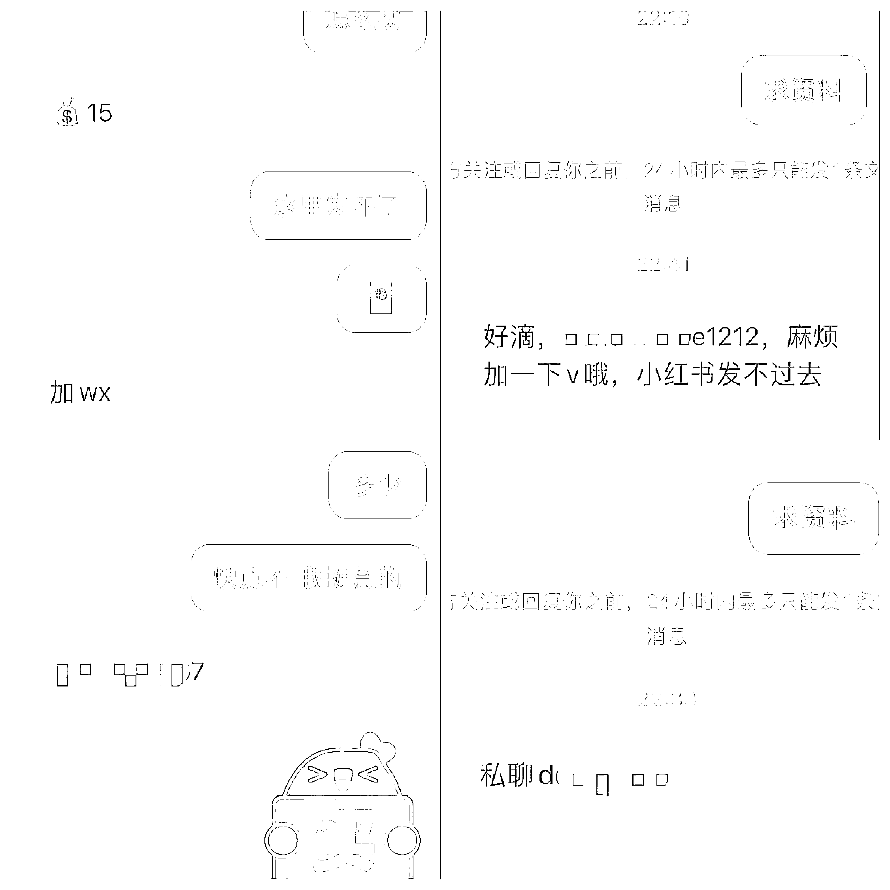  

引流图片： 

除了文字引流，还有图片引流，纵向排列微信号，放在一个非纯色图片上。 

  

看下来，还是蛮简单粗暴的，对吧~ 

私聊和群聊引流的区别在于，群聊，可以拿小号当枪使，以保护大号。 

群里的另一个细节是，当有用户进来后，直接艾特新进来的用户，然后话术跟上。 

我后来起的矩阵号，用的就是群引流，以送资料的形式，用小号直接发二维码。 

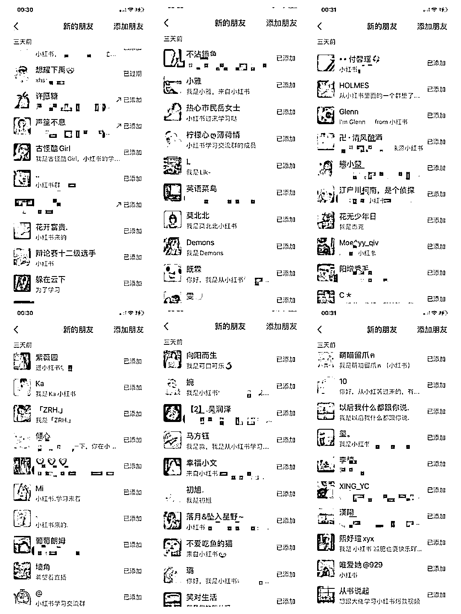  

#### 02 限流词有哪些 

小红书违禁词检测系统识别到这些词，会屏蔽、限流。 

引流词：微信号、手机号、链接、天猫、京东、APP 名称 

诱导词：点赞、收藏、关注、评论、私信 

营销词：最好、最强、独一无二、顶级、万能、绝对、永久、回购无数、下单、活动福利、相当于不要钱 

玄学词：算命、算卦、保佑、玉皇大帝、鬼怪、如来、化解小人 

辱骂词：装 X、撕 X、傻 X，绿茶婊 

可能有朋友会发现一些例外，这里存在几种影响因素：不同时期严格程度不同（早期的小红书是可以直接笔记里面带二维码的）、系统违禁词词库的更新、系统本身也并非十全十美，会有漏网之鱼。 

#### 03 哪些行为会限流 

相信大多数人都没有认真看过小红书的社区规范，里面详细写了哪些违规行为，会受到哪些处罚。 

为了节省大家时间，我根据实战经验和收集到的数据，挑了一些常见的。 

7 个高频限流规范，和对应策略： 

①弘扬科学精神、普及科学知识（做玄学、医药方面的朋友要做好心理准备，因为这个定位就不被平台提倡） 

②发布具有营销倾向的内容，如代购、转卖、拼单等（用谐音） 

③发布导流到个人的联系方式，如手机号、微信号、邮箱、地址等（在笔记内容和私信聊天中，用谐音、小号） 

④发布导流到其他平台的联系方式，如网址链接、二维码、水印（不发网址&二维码、去水印） 

⑤恶意注册账号。如批量注册等（避免同一个 wifi 下多个手机号集中注册） 

⑥非正常模式地发布笔记，如批量发布，高频发布、机器发布等（一个账号一天发 1 篇笔记为妙，发 3 篇笔记为佳，发 5 篇笔记为限） 

⑦未经他人授权，发布内容侵犯他人著作权权益，如视频、照片、图片等（不要原图原文原视频直接发） 

小红书是如何判定违规的？任意中以下一条： 

1、人工排查发现的 

2、小红书算法系统对一定周期内的数据进行排查后，抓取到异常数据的（包括但不限于赞藏评、进群人数速度、发言频率等） 

小红书会给到哪些处罚？ 

它分为单独对笔记，和对整体账号两种处罚。 

对单独笔记，违规了会禁止展示，也就是别人看不到了，但这并不意味着整个账号受到影响。 

对整个账号，会禁言账号、会全部笔记限流，最严重就是封号。 

#### 04 限流/违规了怎么办 

如果你单篇笔记数据很差，疑似限流/收到违规通知，先按照 02、03 进行自查，有则改之，不行删除。 

如果你连续发 7 篇数据很差，那么有可能是此前的违规行为，导致整个账号被限流了，要么等十天半个月流量恢复，要么注销账号重头来过。 

如果不确定限流、违规原因，或者认为自己被误伤想要申诉，那就去私聊找人工客服，响应速度还是很快的，我当时大号篇篇爆款，数据太炸裂，有一个星期天天进入机器审核，每次都要我和客服沟通。 

这是路径： 

  

  

### 笔记模块 

#### 05 不知道要写什么 

每天不知道要发什么内容，本质上就是没有做好内容规划，因此，我们需要一个选题库。 

怎么搭建呢，用数据平台，以需求为核心快速搭建一条赛道的选题库。 

在新红数据找到话题类型，其实就是赛道分类，选中后导出其结果。 

  

导出结果之后，我们用思维导图进行一个梳理，把标签按照侧重点分为稳定型标签，和热点型标签。 

稳定型标签下的内容，是你日常可以输出的，热点型标题，是你可以蹭热点出爆款的。 

  

是不是很熟悉，我曾经在《大数据定位》一篇文章中提过这个方法，它既可以做定位，又可以做选题，这就是底层逻辑的魅力。 

原文直达：[https://t.zsxq.com/07Ts3wF1s](https://t.zsxq.com/07Ts3wF1s) 

06 图片怎么制作 

很多人做小红书，都会问一个问题，做图文好，还是做视频好。 

这里，我先把两者的利弊，都摆出来，然后你可以根据自己的情况，来做选择。 

#### 06 图片怎么做 

如果你用手机，推荐作图 app：美图秀秀、黄油相机 

如果你用电脑，推荐搞定设计、WPS 

我个人比较推荐用电脑，更加灵活，尤其是对于套用 ppt 模板，手机不好操作。 

如果觉得用 ppt 套模板也不熟悉，可以了解下我和圈友一起做的小红书自动排版工具：[https://t.zsxq.com/07aVCLRfS](https://t.zsxq.com/07aVCLRfS) 

如果你想要通过模仿，提高排版自主性，可以看下我在小红书航海中的分享：[https://t.zsxq.com/07xcmeEUs](https://t.zsxq.com/07xcmeEUs) 

哎呀，一不小心，好像快把小红书图文排版的体系给搭建起来了！ 

ps：再补一个回答，很多人都会问，在小红书，做图片好，还是做视频好，我把利弊都摆出来，你可以结合自己的实际情况，选择合适的。 

客观方面： 

虽然在小红书，图文比例依然占大头，但是视频红利更大。 

一来是短视频趋势正在“教育”每一个用户，让他们越来越难以静下来看文字，视频带来的感官刺激是图文难以比拟的。 

二来是小红书的流量对视频有倾斜，存在各种完成任务就有流量卷的奖励，这是图文笔记没有的福利，如果你的视频质量不行，达不到指标，也是拿不到奖励的。 

同时，视频的制造成本，必然比笔记高。 

主观方面： 

正因为视频的制作成本比图文高，所以需要考虑： 

①是否有视频制作基础，可以快速上手，没有基础是否能快速学习掌握 

②批量做视频和批量做笔记相比，时间成本会更多，是否能保证投入，因为一旦开始更新，就要保持更新频率，更新频率太低权重就下来了，推荐流量会减少 

③对于做 IP 视频的博主，除了内容，还需要提升表达力、表演力、拍摄剪辑等能力，是否有足够的时间来试错迭代 

#### 07 笔记什么时候发布 

选发布时间，有三个段位：分别是青铜的官方流量时间、黄金的赛道特点时间，王者的动态迭代时间。 

青铜，不管三七二十一，只看官方流量时间： 

早上 6：00-8：30，上班前的玩手机时间。 

中午 11：30-13：00，休息时的午饭时间。 

晚上 20：00-22：00，睡觉前的玩手机时间。 

但是，这有一个问题，只抓住了大部分用户的共性，忽略了赛道特性。 

黄金，以不同赛道用户的共性，总结出了流量最高峰： 

娱乐类:07:00-08:00、18:00-22:00 

母婴类:09:00-10:00、21:00-23:00 

学习类:11:00-12:00、20:00-22:00 

…… 

但当你真正去落地的时候，又发现问题了，这里给的是时间段，而你发布的那个瞬间，是时间点！怎么更加精确呢？ 

王者，根据账号实际数据反馈，总结适合自己的发布时间： 

一个三步模型，分享给你。 

①确定用户 

确定你的笔记是发给哪个用户群体的，注意，是一个，不是多个，而且越精准越好，写女生看的、看 20 岁后的女生看的、给新手妈妈看的。 

以上，依次精准，只有越准确，你才能越好把握她们的有空时间。 

②分析用户 

确定人群之后，就要去分析出宝妈什么时候有空。 

方法有很多，我简单举几个：第一是观察、询问身边人、第二是做调研，比如可以去网上看宝妈的评论时间、第三是网上检索相关的调查数据，第四是看同样为宝妈群体的博主账号，发布时间是什么时候…… 

③测试迭代 

上面两步，走的还是共性时间，第三步，就是通过你自己发笔记，才调整发现自己的最佳时间。 

就拿我自己在教育赛道做学习号来说，我就反复测试了三个时间段，分别是晚上的八点、八点半和九点。 

每个时间段三次，最后是八点半的数据表现最好。 

一段时间后，我通过粉丝评论时间，检测到最活跃的时间是晚上 9 点，于是我又改了发布时间。 

后来，又经历了几次系统延迟发布，短则卡 20 分钟才发，长则 90 分钟，于是我又提前到 8 点半，结果又给我秒过！太气人了！ 

最后我折中，20：45 分左右发，由此确定往后的发布时间。 

所以你看，我的最佳发布时间，从来不是在谁那里看来的，而是自己实践，反复测试得出来的。 

如果你同样做学习号，20：45 也不一定是你的最佳时间点。 

小红书笔记什么时候发布最好？具体问题具体分析。 

没有最好的时间，只有最适合你的时间。 

#### 08 数据怎样才算好 

很多人在发布笔记之后，会特别关注数据的变化，并且时常发出这样的疑问：我这个数据正常吗？这样的数据算好吗？ 

这里，我给大家总结了 7 个常见的数据参考。 

①爆款比例=小眼睛：赞=10:1 

②长尾增长=20 倍赞＞小眼睛 

③24 小时后小眼睛未破 500：要么违规、要么内容不行、要么内容优质，但这一天比你优质的更多，被比下去了。 

④连续一周笔记的小眼睛都不破 500：要么整个账号限流，要么内容不行。 

⑤数据起飞后突然涨停：系统捕捉到了异常值，并进行了一定的曝光限制，啥时候解除，随缘。 

⑥一篇爆款之后，大概率后面连续几篇数据都会低于平均值，这是我根据大家反馈，总结的一个现象。 

⑦一般来说，是赞>藏>评，赞是藏的两倍，如果藏逼近赞，或者藏>赞，说明笔记很干货，如果是引流笔记，评>赞、藏，是一个比较好的数据。 

不爆是常态，爆款是意外，篇篇爆款是意外 plus。 

#### 09 数据不好怎么办 

我们发笔记，就是为了做数据，因为只有数据上去了，我们才能获得曝光，用户只有看到我们，才有被吸引的可能。 

数据不好怎么办，是一个非常空洞的问题，我们需要细化到不同的数据，采取不同的优化方案。 

点开你的笔记，选择右上角三个点，选择数据分析，便可来到该笔记的数据后台。 

  

小红书已经给出了笔记诊断，我们针对这三个数据，进行分析。 

①互动 

互动，是赞藏评的总和，从诊断数据来看，表现特别好。 

那么，如果低于同类作者 60%，那么就要思考优化了，赞，即你写的不错，认同你，藏，即你写的有干货，有价值，评，即你写的有争议，亦或引发了共鸣。 

从内容创作的角度来说： 

要提升赞，可以抖段子，可以写大白话，可以多用有趣的比喻 

要提升藏，要多写方法论，要多用清单体罗列 

要提升评，可以写金句、问句、有争议的观点 

从引流私域的角度来说： 

在评论区进行赞藏评引导，才分享资料，具体可上翻【01 怎么引流】的内容。 

②笔记涨粉 

很多人会去争，说涨粉有没有意义，其实这是相对的，以引流私域为目的，涨粉一点都不重要，关键是能够加到多少人。 

因此，笔记涨粉的重要性，更多是针对于内容创作者来说的，因为粉丝量也是衡量一个自媒体人影响力的要素。 

那么，作为一个想要通过内容打造 IP 的自媒体人，该如何提升涨粉呢？这是一个环环相扣的设计。 

首先单篇笔记，要引导读者进入主页，因此，可以在文末和评论区写上：更多干货，尽在主页。 

接着，你需要写好你的简介，有这样一个公式：展现你的成绩+你的牛逼能给读者提供什么价值。 

最后，是你的每一篇笔记，在封面和内容上，足够垂直，以统一给人建立专业的印象，如此，才能完成整个涨粉闭环，这是我 3 个月涨粉 18w 粉的秘诀。 

用我常说的一句话来概括就是：刷到了你笔记的现在，看到了你优质的过去，因为不想错过你精彩的未来，所以我关注了你。 

③点击率 

基于小红书双瀑布流的推荐页面，封面对转化点击率至关重要，这个在【06 图片怎么做】有详细的回答。 

### 变现模块 

利用内容来引流，最后的目的都是变现，这一块讨论的比较少，但丝毫不影响它的重要性，因为我们就是围绕变现来展开一系列动作的，所以我专门拎出这个模块，来讲 3 点。 

#### 10 广告变现 

广告变现是小红书的独特商业生态，通过帮助品牌链接用户和博主，打造品牌影响力。 

也是 kol/koc 博主在小红书的主要变现方式之一，蒲公英平台的存在，就是为了帮助内容创作者更好的获得收益。 

这是你在平台积累影响力，并且实现收益的双赢打法。 

它因为符合种草的调性，而备受平台推崇，你看，最近小红书又有新动作了，而且力度还很大，一而再再而三的放宽品牌合作人的要求。 

  

从以前的 5000 粉才能开通，到后来的 3000 粉，再到现在 1000 粉，门槛一次次放低，这是为什么？因为平台需要同时面对内外压力。 

于内，它需要吸收新鲜血液，同时素人创作者因为得不到变现满足而出现了流失问题。 

于外，抖音快手知乎等平台，也纷纷入局，瓜分图文市场。 

小红书平台越来越欢迎以优质内容来变现的创作者，那么，你要如何抓住这波红利呢？ 

我曾经分享了自己起号到广告变现的全过程：[https://t.zsxq.com/071j7QDH5](https://t.zsxq.com/071j7QDH5) 

这次再补充一些广告变现的细节。 

如何让合作发生 

让广告主找到你的方法有两种，要么你出了几千上万赞的爆款，被 pr 刷到，通过你简介挂的邮箱，或者留言评论区 or 私信联系到你，要么是别人帮你链接 pr 资源。 

pr，就是媒体公关，也叫商务，其中一个工作是对接品牌方和博主的中间人，pr 可以是第三方广告公司的，也可以是品牌自家的。 

如何与 pr 议价 

看粉丝：一般来说，报价是粉丝量的 10% 

看形式：视频可以在图文的基础上，在高 10%-20%。 

看赛道：如果是热门赛道或冷门赛道，数据表现优秀，有抬价优势。 

看数据：如果你最近 7 篇数据都特别好，可以抬价，反之数据不好，就会被压价。 

看底线：pr 都会砍价，你可以先报高一些，但要设定自己的底线价格。 

看经验：如果是第一次接广告，pr 会以没有成功案例压价，我的建议是第一次再低都接，有经验有案例，为以后抬价做积累。 

看返点：一般是广告公司的 pr 要求中间抽的油水，你可以理解为你愿意少赚多少钱，一般 10%-20%。 

如何完成商业合作 

整个流程是这样的： 

pr 给你发邮件-你通过邮件加到 pr 微信-pr 给你发 bf（合作内容）-你给 pr 报价-进行报价博弈-敲定价格-敲定档期-在档期前两天给到稿子-改稿定稿-档期当天发布-收钱（需要等 10-15 个工作日） 

一切都是线上进行，一般来说，他们不会跑路的，而且数据表现好，是会长期合作的。 

如果你特别担心，也有方法，就是让他们走蒲公英平台下单，当然整个合作流程会繁琐加倍。 

#### 11 带货变现 

种草的底色，使得小红书既要重视电商发展，又要重视内容生态，“号店一体”展现的就是小红书在内容之间取的平衡。 

小红书怎么开店 

右上角三条杠——创作中心——更多服务——开通专业号——开店类型选择，个人就选个人，企业就选企业——实名认证之后——选择商品经营类目，就开店完成了。 

带货的方式有三种，笔记内容引流、笔记内容挂链接、直播带货，后面两种是目前主流趋势，因为引流平台会限制。 

带货和接广的逻辑有何不同 

带货笔记不看重粉丝量，0 粉也能变现。 

带货笔记不看重整体互动数据，关键看评论区有多少有效留言，如：怎么拿、怎么买，私信咨询人数。 

不管是图片还是视频形式，都要提升自己的拍图质量。 

为什么要用企业号 

官方不仅会放宽限流要求，并且会鼓励你做营销动作。 

检索权重提升，在小红书的检索结果中，企业号的排序，会优先于个人号。 

企业号可以设置快捷自动回复，及时引流到微信，减少客户流失。 

带货变现现在还好不好做？在这次小红书航海，我们圈友卖橘子直接卖断货！ 

  

#### 12 引流变现 

引流变现在流量模块已经讲的很详细，这里就不再赘述了。 

这里想和大家说一下两种引流方式，一种是需求欲引流，一种是影响力引流， 

我们经常用的，通过送资料、优惠价引流到私域的这种方法，就是用的需求欲引流，它的特点是门槛低，时间短，核心竞争力在于速度要快，因为门槛低谁都能做，竞争自然激烈。 

而且这些粉丝是冲着产品来的，满足了，他们的注意力就会离开。 

而影响力引流怎么理解呢？你会看到两个有趣的现象，一个是大 V 的号，无论在哪个平台，粉丝数量都不会太少，另一个是大 V 往哪个平台跑，他的粉丝就跟到哪个平台。 

比如今天亦仁说要去小红书日更，绝对第一天账号粉丝量暴涨 10w+。 

你只要在一个平台构建起影响力，浅浅透露一下微信号，就会有大批粉丝蜂拥而至，不会像需求欲引流那样小心翼翼，那么辛苦。 

当然，它的特点是门槛高，时间长，核心竞争力在于长期持久，而广告变现，就是在支持这样一个大 V 的诞生。 

没有哪一种变现方式，就一定比另一种优越，这是两种不同的玩法，一个是闪电战，一个是持久战。 

不管选择哪一个战场，全力以赴的下场，就是最好的交代。 

今天的分享就到这里，有帮助的话，记得点个赞哦~     

## (76 赞)《非技术背景的中年姐姐，也能 2 周赚回 3 年星球门票钱》 

今天签好了合同，每个月帮客户公司出 3-4 条短视频，先签了 1 年。报酬么，就是半个月就赚回我这 3 年的门票钱。这回是真的自食其力了！ 

关于我：非技术背景的中年姐姐，主业凉了 3 年即将第 4 年，和主业相关的副业一直在尝试，奈何今年大环境。。。。 

现实： -      主业是展览会主办（凉了再凉）， -      副业是公务机包机（太高端，今年国内市场也凉透了）， -      又副业，做关于公务机的自媒体账号，陆陆续续做半年，目前小红书 1300 粉 4100 赞藏，视频号、抖音也同步。 以上，很惨淡很无奈，也没亮点吧，对，很真实。 

结果： 被同行公司看中了，邀我帮他们做视频，我开价对方竟然都没还价就直接拉了工作群开干了，简直怀疑我报低了。咳，同行余粮也不多，我还是差不多就行了。 

我需要做的是：每月 3-4 条短视频，时长 1.5 分钟以内，选题文案脚本分镜剪辑制作一条龙。 

同时，小红书账号的关注数据里， 性别：男性比例几乎占 80%； 年龄段：30 岁以上年龄段，总占比将近 70%； 看地域的话，海外占比 15%，北上广深港 37%。 

（我自己很满意~为此，我都延伸出新的项目，打算要启动了。） 

我的案例对谁会有参考意义呢？ -      没有高能互联网技术背景的； -      处于比较传统行业的； -      大行业里的小个体 -      自认为还吃不了很多苦的。 

如果你也觉得和我背景类似，我来给你讲讲我的经历做个参考。 

一、没有高能互联网技术背景的 我一个做展览会组织的，除了脑子还算有逻辑，什么互联网技术都不会（过两天启动我另一个新项目的时候我要来求助技术大拿），但是，短视频可以学着做啊！我能学会，每一个你都可以。 

最早，2020 年夏天我参加过一次视频号大航海，前后做了 5 个月吧，虽然没有变现，但我可以站在镜头前口播了，我也会用剪映的很多操作了。 

今年人在上海，乖乖待在家里的将近 90 天，除了团吃的，我基本都泡在“如何做账号”这件事情上了。重新开始口播，开始剪辑，这些技能就像骑自行车一样，一旦学会，隔很久再拾起也很容易。 

这一段我想说，做视频，真的人人都可以，只要你能沉下心来给自己一段时间做这个事。 

二、处于比较传统行业的 

这不是劣势，其实是优势。--只要你懂的差异化竞争找到自己的合理定位，身处传统行业，如果能引入新渠道，这就是你新的优势。 

最近抽空拜读了生财一些精彩分享，印象特别深刻的其中一篇，是一个牛羊饲料搅拌机的抖音打法 @厚猫。这产品够传统吧！（这篇分享，我至少读了三遍还和一个朋友详细介绍了）我这个展览业背景的飞机行业，也很传统吧。 

越是传统，从业人员尤其老板们常常习惯了传统的渠道和打法，他们对新媒体的理解大概率还是很浅的----那这就是我们的机会啊！ 

再说我自己的例子。2020 年夏天我做了一个关于飞机的号，在视频号上。因为微信里同行多，很快各家公司也都纷纷开始做视频号。后来，我没坚持下来，今年再看那些号，有的也没了，有的还在。而去年到今年，小红书、抖音上出了好几个业内相关的号。 

因此，刚开始我很没底，我就一人一机，从零开始，怎么跟他们那几个 xhs 几千甚至上万粉的号拼啊。但是心里没底也要上啊。 

那怎么干？找差异化定位！ 

我把那些我认为做的不错的业内账号搜集起来，做了个表格，统计他们的起号时间，发布内容数量，阶段性挑选比对了解更新频率，选出高赞作品，再自己写备注，高赞的可能原因，是否值得抄。 

做完这个表，加上自己对这个行业各家公司的基本盘了解，心中就会有个大概方向了。        心中有大的 picture，才可能找到适合自己的点位，这部分后面再详说。 

Note： 这里我说的行业是公务航空圈，公司数量本来就很少，我们展览会所有展商公司也才 150 多家公司。适合面向可能的 C 端市场的公司数量就更少了，而只有这些公司才会有做自媒体账号的需求或动力。 

如果你所在的行业有很庞大的公司数量，你可以先做一个分类筛选，以防自己落入迷宫。 

三、大行业里的小个体 

这一点，上一段已经提到了一些。有一点很重要，我清楚牢记：短期内我还是个体（即便招兼职招助理，也还只是一个超级个体）。这是事实，那么如何在大行业里让自己这个小个体崛起呢？ -  做真人 IP，这是大资金、大公司都很难模仿你、超越你的。 

就说我吧，一个人一台手机，长得普通，年纪一大把，和我们圈子里一抓一大把的空姐比起来，我啥优势都没有啊！ 

然而，我有过鸟瞰纵观这个行业的过往经历呀，虽然不是什么特别重要的位置，但就是赶巧经历过，这是那些美丽空姐们没有的； 

我还会去国外同行那里找素材找资料。其实那些都是很公开的资料，非常容易就能拿到，无非需要一点心思，把他们揉捏成有话题的故事。 

举个例子，最近一篇讲马云要卖了他自己的飞机。就是我看到国外同行的飞机挂牌提到一句现任机主是 jack Ma。于是我就去翻找这架飞机注册号核对，是他。那就要更多图片，更多全面的视频画面。做这种有故事性的视频内容，就像下厨做饭，先要搜罗各种原材料和配料，然后思考一下，怎么整怎么拼，才能出炉好菜品（作品）。 

以上这些，是需要时间和精力还有心思的，我敢打保票业内没有空乘有这心思做内容。她们更擅长做美妆和 Vlog。---挺好啊，大家各有所长，吸引来的群体也就不同咯。 

四、自认为还吃不了很多苦的 

如果你也和我一样，自认为比较懒、也吃不了很多苦的，也没问题。 

首先接纳自己就是这样的，哈哈哈哈。 

然后，多观察多动脑，寻找自己能力范围内可以撬动的杠杆。我最近两个多月请了兼职的剪辑姑娘 X，每条片子根据时长不同，100-200 不等。我真觉得好便宜啊啊啊啊，有了她的帮助，我简直轻松了一多半。 

另外，我还请了一个小助理 Y，最近还在培养磨合阶段。这是受到生财另一位大咖的精华贴启发，虽然我还没时间精力搞大批量的兼职（接下来想搞的）。帮我收集 xhs 上圈定的账号汇总，或是我找的一些合集收藏夹让他再帮我打散了重新汇总。 

这里，运用的就是纳瓦尔说的，给自己设定一个时薪价格。凡是外包价格比你自己价格便宜的，尽量外包。 

小结： 

文章还没写完，客户刚才已经把这个预付款 6000 打过来了，，，开心一下下。 

-      不懂技术，就真的可以做短视频； -      怎么做好？找到最最适合自己和所在小圈子的差异化定位； -      还想让自己轻松一点？杠杆用上，外包走起。 

我就是很纯粹的想来做个反馈，也尽力回馈生财！感谢好多大咖的无私分享，我略尽绵薄之力！ 

  

## （37 赞）《小红书引流先要建立你的爆款引流库》 

小 M 是一个做了几年的淘客，最近接触到了小红书引流，希望通过小红书来给社群涨粉。 

于是通过朋友圈和现有社群等渠道聚笼了大约 200 个兼职人员，根据以往收集的一些同行的款式和自己认为比较好的商品，再整理了一些文案，就开始发布了。 

每天 200 篇，大约每天投入 200-300 元，连续发了半个月以后，发现没有引到几个粉丝，实在承担不下去这个投入，放弃了。 

我看了一下他的商品，发现商品很单一，基本上就几个款在轮流着发。文案内容大同小异，图片使用技术手段批量生成的原创图。 

我不太了解这个模式是不是可行，小 M 或许是从别的渠道学来的这种做法，应该是有成功案例在先的。 

所以没有评价这种方式的经验和能力。 

只是通过这么久的发文引流投入，自己也走过很多弯路，用不同的方式去选款，道听途说的拿一些宠物或者美妆的品牌名称，就想当然的弄一些文案来发布。最后的结局现在看来几乎也是可以预料的。 

至少引流的事我感觉刚开始不能太着急，一定要有效果了再慢慢放大，必须先测款再放大。 

如果一开始就搞比较大的量，可能款还没测出来，自己先吃不消了。 

后面我自己通过近 3 万条笔记的尝试，慢慢摸索和发现一些适合自己的选款方式。我现在正按照这种模式在慢慢积累这些爆款数据。 

  

从开始弄小书的夏天到秋天再到现在的冬天，爆款一直在变化。我一直按照相同的方式来选款，也总能找到一些好款。 

比如最近佣金最多的一款商品，一个月内出单 131 单，佣金 1.2 万元，光这一款的利润收入就可以覆盖掉整月用于小红书兼职发布笔记的费用。 

而对于这个商品本身的数据来说，其实发笔记除了引流，竟然还能赚钱。ROI 甚至可以达到 36。也就是平均花 1 元发一条笔记，能赚回来 36 元。 

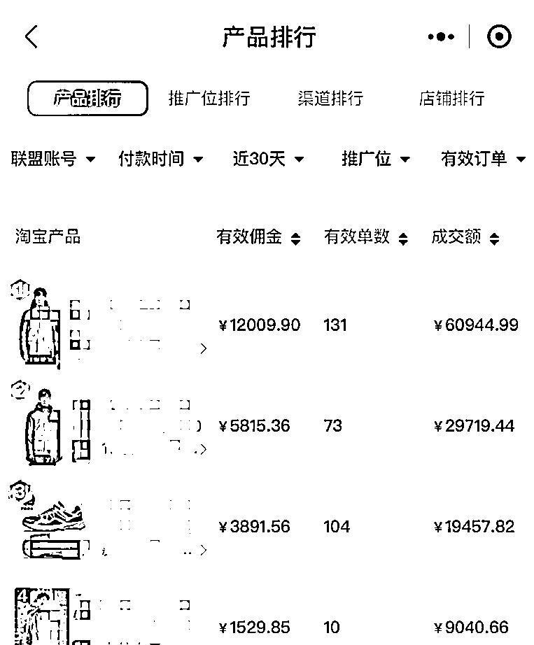  

这样的商品是不是可以给你再来一打？ 

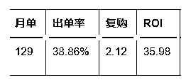  

当然爆款并不是想要多少就有多少的，但是只有掌握了选款、测款的规则，那么有一款就可以有多款，其中必然会有一些可以遵循的规律可以寻找。 

那么怎么找爆款？以下几个方法可以借鉴一下： 

第一，利用 100-10-1 聚焦法，建立专属于你的爆款选款库。 

著名的“二八定律”，是指在任何一组事务中，最重要的只占 20%，其余 80%尽管是多数，却是次要的。 

所以我们没有必要道听途说的来选款，你听也听不到多少款。与其漫无目的瞎猜一些款，并充满期待的等这些款有产出。还不如老老实实的自己先找出 100 款来，每一款发上 3-5 条笔记，并沉淀几天再看有没有出单。 

这样经过一段时间的测试，基本就能选出 10 个左右能出单的款，然后再进一步优化这 10 款的文案和图片，并加大这 10 款的商品的发文投入，这样大概率就可以发现一些能相对稳定出单的款。 

然后日积月累，慢慢就会发现有个别极少数的款，会随着你发布的笔记越来越多，订单也越来越多。这种款就是最终我们要找的爆款了。 

第二，利用第三方工具找爆款，尽量缩短测款路径。 

选款还有一些方式可以增加成功率，比如千瓜数据里面有一个品牌品类榜，还有知乎好物种草榜等。 

千瓜数据里面，每天都会刷新一些当天的品牌品类词，我们用这些词去搜索目标商品就可以了。 

然后将这些商品纳入你的文案商品库，并一一进行测款，进行挑选和淘汰。 

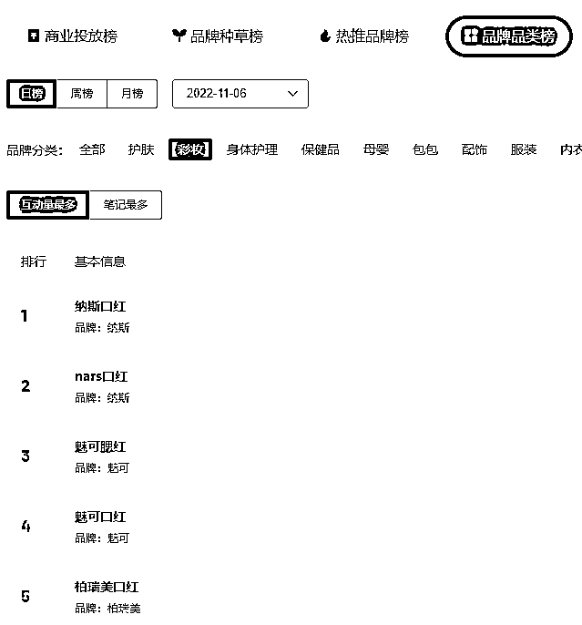  

这个网站需要看到更多的排名是需要付费的，免费榜每个类目只能看 5 个品牌品类数据。 

其实用这个就足够了，因为这上面的数据每天都会变化，榜单上面的品牌品类名称总是会上下起伏波动，只要你每天观察和记录一下。有半个月时间基本也可以积累很多数据。这些数据离真正的整个榜单也差不了太远了。 

实际上，你也没有那么多精力和预算去测试整个榜单词对应的淘宝商品。 

第三，利用同类同品牌找爆款，效果基本上差不多。 

这种方式也是经常采用的，毕竟大家最容易想到这一点。比如八月十五前后，发现有一款月饼不错，你完全可以类推一些其他的爆款品牌并纳入你的文案库。 

还有你可能发现同品牌之下，会有一系列的商品，适合春夏秋冬。有些品牌的泳衣在夏天卖得可以，那么现在推广他们的秋衣，羽绒服就显得更加顺理成章了，也确实有很多用户群体在购买。 

实际上母婴类的品牌也大部分在一年四季都有对应爆款商品，就算没有，经过这么多年，他们也一定会打造一些应季爆款出来，毕竟店铺不可能一年只开几个月。 

第四，爆款不要想当然，一定要测款，用数据说话。 

之前我是踩过很多坑的，以为大淘客上面榜单的商品一定好，天天发榜单发现佣金比例没几天就降了；以为便宜的东西下单转化高，实际上便宜的东西别人不值得去搜索，直接就买了；以为宠物类的好引流，实际上佣金相当低，不好承接粉丝；以为 NASA 类的衣服比较热门，实际上没有几个人关注这种货；以为 A 货好价格便宜好引流，实际上变化太快，粉还没来，商品链接就不见了。 

好了，今天就简单分享一下自己的这些小红书引流选款经验。希望通过这些文章能结交一些同频的朋友们多多深入交流，共同提升。 

## （49 点赞）《通过小红书笔记，快速建立垂直领域的群聊并引流》 

#风向标# 

具体操作和效果，看图就能明白。没有什么高超的技巧，很淳朴直接说出来求群 or 拉群 

如果大家要实操一下的话，要注意这几个点： 1、是以求群的方式，让大家拉你，如果没人有，就顺势评论「那我建一个群」。而不是说，我有一个 xx 群，想进的来私聊我。这里面转化差别很大，你应该能明白中间用户的心理差别在哪里 

2、好的封面。直导主题，白底 + 文字就 ok，下图的特斯拉车友群就是很好的例子 

3、好的文案。简单介绍一下，自己是谁，想要什么样的群，进去想要获得什么。（这个是介绍自己吗？这个是给读者暗示，他们进群的好处是什么） 

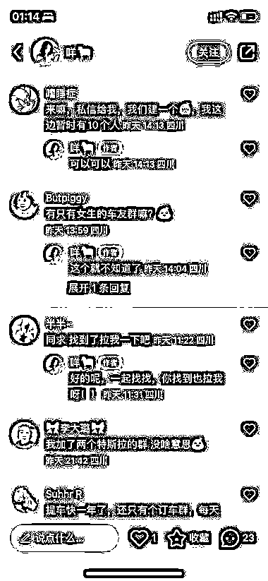  

## (149 赞)《93 年女孩做线上美业，不到 2 万成本到变现过百万》 

对比很多大佬的成绩，这只是小儿科，但我只跟自己比，跟昨天的自己比，有没有更聪明些，认知有没有更宽阔些，有没有更沉稳些，有没有更有钱------ 

毕竟属于大学毕业后第一次做生意，没有亏，反而挣了，是条稳稳的现金流。我把相关的重要经验分享给有缘人，希望能给到大家一些启发。 

分享目录如下： 一：我是个皮肤病患者，所以选择从医 一：毕业后，放弃不喜欢的工作 二：做生意，从一单 2 块开始 三：店铺被封，差点放弃 四：1 万到 5 万的利润，我做了这件事 五：从 5 万到 10 万+的利润，我做了这件事 六：未来展望 全文链接： 

[https://ancab4z106.feishu.cn/docx/E1WGd70YLoaHGfxAYJTc4WoFnsd](https://ancab4z106.feishu.cn/docx/E1WGd70YLoaHGfxAYJTc4WoFnsd) 

## (19 赞)《培训机构如何快速引流？》 

培训机构如何快速引流？ 刚考完试，针对考生急着对答案的心理，培训机构在小红书上发帖宣称有全部真题的答案，（其实只有 30 道，而且错漏百出）需要的话可以私聊领取。 私聊引流到私域，引导考生注册小程序，这样考生的信息就有了。 后续在朋友圈宣传押题命中率，给考生卖课就很容易了。#风向标# 

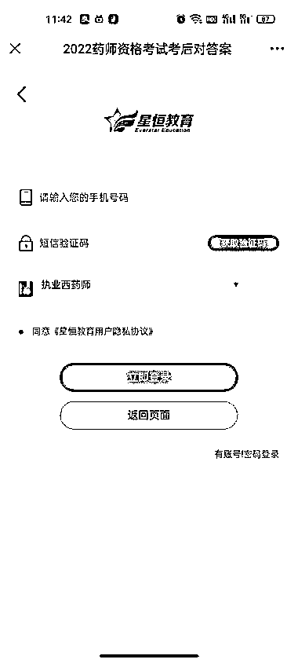  

### 4、国内平台 - 其他 

## （78 赞）《同行一句话让我抓住美团电商红利狂开 30 家店》 

大家好，我叫刘家齐，齐家治国平天下的家齐，过往在美团有接近八年的销售及管理经验。 

刚刚过去的几个月，我们的淘宝店群业务从上半年高速增长进入了低谷期，开多少店，补多少单，团队状态拉多满，这种战术上的勤奋然而仅仅是止住颓势，连续的加班让淘宝合伙人小 Z 和团队状态非常的低迷，我也很清晰不尽快恢复增长，我们的裁员也只是时间问题。从第三季度开始淘宝对于店群的打压是空前的，行业内哀嚎遍野，面试了很多同行业裁员离职的姑娘，很多群内也是满满的负能量，这在上半年利好的环境很难遇到的。 

一个人走在深夜加班回家的路上，点了些青岛啤酒和烧烤，坐在马路边看着过往的车辆，零星的路人，那段时间交流了一圈老板，之前的玩法在近几个月市面上已经没有成功案例，像一艘没有灯塔指引的船，令人绝望。 

转折点出现在八月末，从发现到入局不到两个月的时间，美团电商成长为团队的第二曲线，类目不同单店月利润 6k-12k（零运营未优化），扭转了我们的淘宝店群的颓势。本篇文章全流程复盘我如何通过淘宝同行老板一句话透露出的商机落地一个项目，希望能给各行业搞钱路上的朋友一点点启发。从发现项目、跑通最小 MVP、梳理流程团队入场、从平台历史中找共性以及项目的总结复盘，全文共计五部分。 

一、发现成功案例，做有心人 

所有生意的开始都来源于一个信息，去年离职后跟美团的一位领导朋友侃大山聊到了美团通过优选业务对于电商行业的布局，电话挂断后看了下彼时的团好货（美团电商前身），基本是自营和招商属性，没有大面积开放 POP 三方入驻，而且产品真的是做到了物美价廉，这让我想起了那年春天的拼多多，此时的平台对于我们无货源玩家真的不是很友好。 

年后开春团队淘宝业务迎来了快速的增长，每天的业绩增速喜人，在一次淘宝业务的探讨中再次提到美团电商，可能是美团八年职业生涯对老东家的一丝执念，再次打开了美团电商快速的浏览了五分钟，不出意外随着一生叹息退出了 APP。 

时间眨眼间来到了八月末的一个晚上，合伙人小 Z 认识一些开发软件的程序猿朋友，一位淘宝店群的老板找到小 Z 托人开发一款美团电商的拍单软件。办公桌对面的我听到这再次打开了美团，机会来了！并不仅仅是这位老板托小 Z 找人开发软件，更重要的是此时的美团多个类目已经出现了无货源同行的“成功案例”： 

1.  店铺宝贝数量超 300+； 

2.  淘宝/多多以图搜款溢价基本在 1.7 倍以上； 

3.  几乎没有任何运营痕迹，0 评价无动销等； 

符合我选项目的逻辑，手里只有三个钢镚，没有成功案例纯粹自嗨的项目是坚决不碰的。我在上一篇“[管理破局红海项目：淘宝店群月利润 10w+复盘](https://wx.zsxq.com/dweb2/index/topic_detail/212225245518841) ”中结合自身长短板总结了选项目的三个核心要素，成功案例、轻资产投多少赚多少、简单可复制。兜兜转转，美团像是一个绕不开的话题，又好像冥冥之中自有定数。 

二、八十块跑通项目最小 MVP 

1、逢山开路 遇水搭桥 

做项目的第一手，全网搜集相关资料迅速形成基本知识框架，从抖音、知乎到知识星球再到代入驻三方的交流，可能是项目太新，也可能是自身检索能力不够，并没有找到太多相关的资料，当然这并不影响我们入局。当晚告知我现在的美团店群合伙人 L 君，第二天 L 君就拉着会计去工商大厅变更经营类目，自此开始了我们“漫长”的入驻流程，清晰的记得光驳回就接近十次，从主体注册资本不达标、到经营类目不符、再到商标类别不匹配，店铺信息录入不符合平台规范等等，而且非常傲娇的是平台也只有工作日才审核，我们不断穿梭于工商大厅和平台，终于在 9 月中旬成功入驻第一家店铺。 

任何的门槛都是在给我们的项目增加护城河，记得抖音上有个叫无羁的电商博主说了一句话，一个百十来块钱的食品经营许可证就拦住了 98.7%的人；可能发现美团电商的人有很多，但淘宝上两百块就能拿到的一个商标授权，就劝退了 80%的人。美团店铺经营范围类似天猫只能做单类目，迅速的做了入驻总结复盘，后来接近 30 家店铺几乎覆盖了除医药和食品外的所有一二级类目，入驻基本是一把过，任何的迭代升级一定是勤于复盘的结果。 

2、弄脏手动起来就成功了 80% 

搞定了入驻马上按部就班的开始淘系秋冬四件套，选词、选品、上货、拍单售后，惊讶的是淘宝的标题和图片铺上去没做任何干预就开始陆续出单，记得上传的第二天 10 个访客就出了两单，一度以为 L 君补单了；进行了简单的优化，仅仅三四百条连接，除去平台扣点及退款每天卖六七百就有两三百的利润，巴适得很。（客户以为外卖闪送所以未发货仅退款比较多） 

截止到此时，上货软件 50 元、拍单软件 30 元，“白嫖”了之前视频号后端供应链赞助的商标授权，第一家店跑通最小 MVP 仅仅花费了 80 元。与其说跑通了最小 MVP，不如说是蓝海平台自然长出来的结果，截止到 10 月美团电商全类目商家仅 2000 多家，我们应该是百货类目入驻的全国前 300 名，这在今天淘系充分竞争的市场环境里估计会笑醒吧。 

3、来呀，算算账 

美团店铺因为必须是公司主体不能是个人，主要的成本来自于代理记账和工商执照收购费用，百十块钱的上货拍单软件费可以忽略不计了。除了必须是公司主体外，最重要的就是注册一年以上，所以没有公司执照只能收购不能新注册，这里对收购公司执照的小伙伴提个醒，一定要签署双方免责协议避免之前公司的纠纷和三角债等，做好风险把控；国庆假期在老家的几天时间，联系了当地的几家代理记账公司收购市面上倒闭的公司执照，只要是注销的公司价格合适直接出手，为后面的狂开店狂铺货做准备。基本都是不要钱或者一千以内转让费就搞定了，原因是目前青岛市面上公司注销的代办费是 1500 左右，过户给我们是双赢的合作，其他增资、经营类目调整在工商大厅当天免费完成。一张执照平台规则理论上在每个一级类目下可以开三家店，有多少个一级类目可以开三倍数量的店铺，但实际上美团对于每张执照的总数量有隐形的限制，我们有的开了四五家，最高的开了八九家，我把这类官方规则里面没有提到的统称为玄学，所以平均到每家店铺即使再加上三方商标授权成本也不过是几百块，完全符合我选项目三要素中的财务逻辑。 

三、梳理流程  团队入场 

1、在平台上搞钱一定要注意吃相 

1）新平台，没有前人经验借鉴，最重要的不是选品运营，而是了解平台规则，很多人不喜欢这种枯燥无趣的文字，花了大概两天的时间，把美团电商的所有规则仔细研读了一遍，对于平台有了一个大致的了解，记得之前刷到的抖音强势文化图文号里面有句话非常好，平台规则内的事情大胆放心干，规则外的事情计算好投产往死里干；举个小例子，譬如平台的超时发货订单只有 30%进行处罚剩下 70%警告，在没有做特殊履约报备的情况下最高的一家店一个月只处罚了 210 元，在当下的店铺单产和操作难度下，你品。 

2）划重点，做美团一定要关注新航路评分；这是一个类似淘系灯塔的评分体系，不过美团的处罚更苛刻，连续低于三分的店铺 3-6 个月会被清退。从三分钟回复率、到发货时效、再到售后完结、平台介入率等等，各平台大同小异，换汤不换药，像极了那年暑假匐在案首抄同学作业的我。 

2、赚钱的生意一定要尽快流程化 

十月小长假结束之后，恰临双 11 淘系搜索算法不更新，除了和 L 君招聘组建新的团队，我把 80%的精力用来梳理团队流程，从前端选品上货到后端售后处理，甚至到文件夹摆放位置、谷歌分身命名像淘系一样都做了统一要求，其中最耗时的是草稿箱提审效率问题，我们还专门找三方定制开发了浏览器拓展程序插件来提高团队的效率，一切为团队效率让路，通过团队的杠杆来加快业务的放大。 

淘宝合伙人小 Z 也带着团队投入到了美团电商当中，这些淘宝运营老 baby 来到了新平台真是妥妥的降维啊。我清醒的知晓，所有的蓝海市场随着时间的推移最终一定会走向充分竞争，这个时间并不会太久，在山东有句话叫做“关键时刻要瞪起眼来”，所有的动作要围绕团队效率来展开。且看今天内卷的淘宝、知乎好物、抖音、抖店、视频号搬运... 

3、线上协同  高效联动 

目前市面的上货拍单软件跟成熟的淘系比是相当的不成熟，跟软件方提了好多次产品需求。与淘系抖系不同的是，美团的宝贝需要一条条小二审核后方可上架，其中草稿箱的修改审核通过工作是一项即耗费时间又没有任何含金量的工作，这让在青岛市区交着五险一金的正规军团队干这个实在是一种资源浪费。二十多家店同时开铺，我把这部分工作选择了大学生兼职和四五小县城相对高性价比的劳动力；录制了飞书视频，所有的动作全部流水线模块化，每天通过飞书会议结合过程管理表格（所有人能看到自己在团队的实时进度），有一种十块花出了五十的感觉，非常喜欢这种协同多人高效工作的状态，这也是为什么我在美团做销售管理八年的原因，确实是因为对于这份工作的喜欢。这里分享一个最初几天踩得非常结实的效率坑，因为不熟悉新平台的后台无法做出量化的指标，线上协同只能靠大家报目标，效率真的是一塌糊涂，经历过的老板应该深有体会。 

管理是我见过很多的电商老板的痛点，不需要学习教条的管理概念，分享一个我用了多年非常简单实用的过程管理小心得，过程管理只要有了“量化的目标”和“明确的时间节点”，团队效率至少提升 50%；这些年接触了很多新晋升的管理者喜欢发脾气，底层原因是缺乏掌控感，对于团队的进度和发展没有那种一切尽在计划之中的从容感。譬如淘宝业务合伙人小 Z 之前是美团销售部青岛一个区的经理，来到了电商行业依然坚持每天的早启动、晚复盘，每日 todo 全部量化数据，月初专场对齐月度目标等等，来过我们办公室的老板很多，夸的小伙子都不好意思了。 

四、以史为鉴 历史在不断重演 

从平台电商的历史出发，我把美团的发展分为了四个周期：铺货、动销、精细化、玩趋势。 

四个周期是我结合淘系对于美团业务当下的认知，回想从淘宝店群到抖音小店，再从抖音到视频号，上门拜访了在青岛有 160 家淘系食品店铺的刘总，请教了淘宝年利润两三百万的钟总，作为后辈聆听过去几年淘系的发展和各路的骚操作，聪明的人应该想到了，老套路新平台，在美团我们也要足够的骚。 

所有平台演变的底层逻辑是相通的，刚过去的视频号，三月份无需混剪搬运就产出爆炸，再到后来的视频号无人直播，与抖音的历史进程何其相似。美团电商与淘系的发展也将大相径庭，从平台清理铺货玩家，到补单稽查，后续这些一样都不会少，只是历史进程的推进将更加迅速。 

五、项目复盘 

1、执行力是成功第一因 

必须给我美团合伙人 L 君打 call，在发现成功案例准备测试的第二天大早就拉着会计去做系列的工商变更，身体力行的诠释了什么叫完成比完美更重要。就像当下美团电商处在红利期把货铺上去就出单一样，相信很多人也会不为所动，像极了三四月份视频号日赚四五千的 L 君每天电话让抓紧下场而不为所动的我。相信原因有很多，没做过电商，没有一年以上的执照，联系记账公司又麻烦，缺少一份保姆级的操作流程，总之，得等等。 

2、商业英雄只是时代的产物 

在红利期来临的时刻，连睡觉都是一种浪费，快，再快一点，把赚钱的动作不断的重复，不断的收购公司执照，不断入驻，不断复制粘贴，过了这个村在下个店努力的价值将大打折扣。这个世界并不存在天选之子，商业英雄只是平台以及市场红利的产物。今天所有的大佬，都是在某一个时间，抓到了某一个市场红利，再匹以执行力，就赚到了第一桶金。下半年在淘宝我们付出了远高于上半年的精力和补单费用，但收效甚微；以前总以为自己足够努力赚的是实力的钱，经历了上半年几个月淘系红利期，看过了暴力的视频号，再到美团电商两个月时间超过了淘宝店群一年多的努力，才明白我们赚的钱都是红利的钱，这是今年最大的感悟之一。 

3、边干边学边输出 

这是我特别喜欢的一句话，这句话涵盖了做好一个互联网项目的两个核心要素： 

1）完成比完美更重要，不需要全部搞懂，先动起来，哪怕只有 60 分。 

2）多分享多输出，太阳底下没有新鲜事，认为自己的某一项技术和骚操作市场独一份是一种非常愚蠢的行为；输出可以让我们像店铺链接一样获得更多曝光，这种真诚的交流获得的信息密度能让我们在赚钱的路上发生基因突变。讨喜的是在上月淘宝业务也找到了新的成功案例，过往一年多的交流和分享，这位老板毫无保留的把自己付费近十万的新玩法分享给了给我们甚至还给我们做了飞书会议培训。 

4、不断强化网感 

发现美团电商项目红利，更多是基于过去一年的积累。之前几年对于很多圈子的精华帖仅仅是停留在了刷的层面，而最近的一年我开始每天写读后感，拆解互联网项目和日常业务心得感悟复盘，这种不断的刻意训练，商业敏感度有了明显的提升。更意想不到的是，一年下来线下很多老板朋友加入了打卡，我们一起把断更的小惩罚作为我们小圈子聚会的小金库，我们几乎每个月都聚一次分享业务新知，创业路上并不孤单。 

历史在不断重演，不管是在商业还是其他领域，抓住转动的历史车轮，我们一起加油，做时代的弄潮 er~ 

补充一下评论区： 

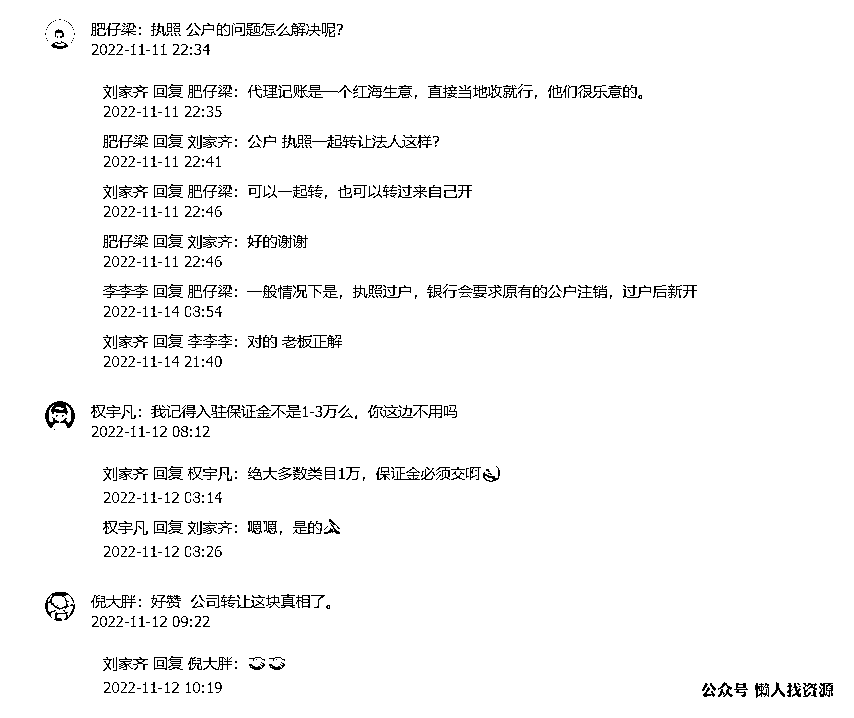  

## （52 赞）《快手无人直播一年的一些经验分享》 

大家好，我是无妨，从去年通过@盗坤坤哥分享的中老年女装无人直播，12 月起号后，到现在一直做着快手无人直播，今天分享一点经验给大家。 

快手无人直播适合个人当副业来做，下面是我最近做的一个品其中几个号的收益，不过已经不好做了，得继续换品。 

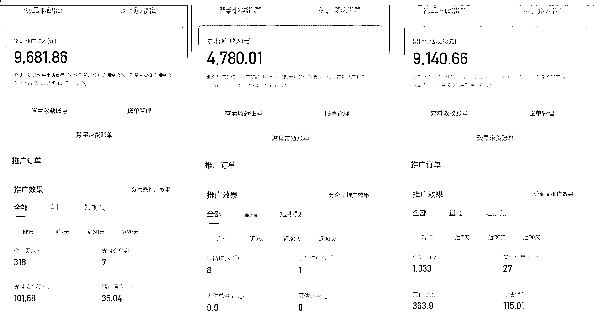  

优点 

门槛低，投入少，只带货开通快手小店不需要押金，不考虑提高转化的话，可以起号后直播挂着不用管（直播间回复问题会提高一定的转化）。 

缺点 

对抗平台的事，平台也一直知道无人直播的存在，只是没有怎么管，目前做了一年了，还能做多久不知道。收入没有那么高，不过选到合适的品，起几个号，一个月上万还是不难的。一个款式或者品类做到后面就会有很多人跟上了，竞争大赚钱少了，所以得隔一段时间就换，然后也得注销账号，重新起号等等。 

快手无人直播:选品>素材的去重>起号 

选品 

我不会选品，生财有很多相关文章，可以去看看，无人直播只有中老年群体才能接受这种粗糙的直播间，所以围绕中老年去选品就行。也可以去刷那些做无人直播或者绿幕+真人出镜的，然后跟他们的品。 

找对标账号 

通过一个对标账号主页右下方的“V”，点开能找到很多类似账号，从中筛选出合适的对标账号。 

  

起号 

1.新注册一个账号，不做其他动作，只刷对标账号，点赞+关注，两三天就行。 

2.然后模仿对标账号去修改昵称和简介，接着开始发视频，前两天建议一到两个视频，不要发太多，第三天的时候开始投粉条。选择相似粉丝，输入你找好的对标账号，推广时间 12 小时就行，有个 500-1000 粉，就选择智能投放。 

3.起号前可以多视频投放，哪个数据好，第二天继续投，后期多视频随意投最近播放高的就行。 

4.如果是一个竞争大的品，起号会比较慢，前期可以把不精准的粉丝移出，可以通过粉丝的动态（点赞和关注等等），判断这个粉丝是否是目标粉，如果看不出来，也可以移出（涨粉会比较慢，一两百粉丝之内都可以把不精准的移出掉），竞争小的品，很快就爆了，涨粉很快，这个就不用管了。 

起号的速度取决于你选的品的竞争大小。比如我之前做的女装，因为选的款式竞争大，同质化严重，最长一个月才起号。后面选的一个品，竞争小，发视频两三天就破万播放了，二十多个粉丝就开直播出单了。这也是坤哥说的生态位补充，竞争小的，平台相似内容不多，就容易给你更多的流量。 

如何判断一个品的竞争大小 

1.最直观的就是用关键词去搜索，看有多少人在做。 

2.前面步骤做好了，发视频很快就过万，大概率是你做的这个竞争比较小，视频破万播放就可以直接无人直播了。 

注：快手粉条比较便宜，最低 8 块，可以一直投到不做这个号为止。 

素材 

基本上是从其他平台搬运，然后混剪去重，也可以直接搬运快手的，生财也很多关于去重的帖子，这里不再展开说了。主要说一下搬运快手的，一定要用小号去刷去下载素材，做的这个号要把原创账号拉黑，避免被原创刷到你的视频，然后举报你（我被举报了两个号，限流一个月）。也不要搬运带有水印的，这种大概率会申请原创保护。 

实名然后开店 

1.先在快手实名，然后下载一个快手小店商家版，按照提示来就行（这里注意要选择“我是主播，我可以推广商品赚钱”）。开好小店，就可以在常用应用下面的“选品中心”搜索你想要上架的商品或者商家了，然后点击：查看更多-店铺管理-店铺装修-立即展示，这样别人就能在你首页看到快手小店了。 

2.数据查看：手机上的快手小店可以查看，电脑上搜索快手小店，登录也可以查看。 

 这里主要说一下网页版常用的 ，登录过后，左边的栏目找到生意通，里面可以看到实时的具体数据。然后还有一个是营销工具，里面可以自己设置一些优惠券等等（针对高客单高佣金可以试试），只做达人带货的话，只有少量的营销工具可以用，这个可以自己去尝试。 

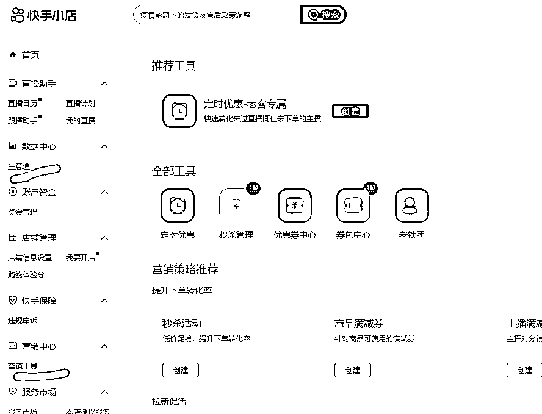  

3.第一次直播需要人脸验证的，如果是别人实名，就得实名的时候让他一起验证了。打开快手-找到语音直播-然后点“赚钱”，挂小黄车需要考试，考试答案固定的：①（A,B,C），②（B），③（A,B,C），④（C），⑤（C），⑥（A,B,C），⑦（这个答案截图不完整，自己看题选择），⑧（D），⑨（B），⑩（A），这个可以保存起来，下次实名新号用得着，通过后点开始语音直播，接着把直播关掉就行，下一次需要人脸验证就是一个月以后了。 

无人直播（分为语音直播，和绿幕直播） 

1.录音：录制同行的话术，整理后自己录一段音频，或者同行的话术不错，也可以直接用录制好的同行音频。 

2.语音直播：一个手机就行，适合客单价高的，佣金高的，一天 24 小时直播，哪怕就出几单，利润也不错。 

3.绿幕直播：高低客单都可以，两个手机，一个手机用直播加加放视频和录音，一个手机挂小黄车和回复问题。直播间加加这个软件里面有详细的使用教程，花一点时间看一遍就会了。 

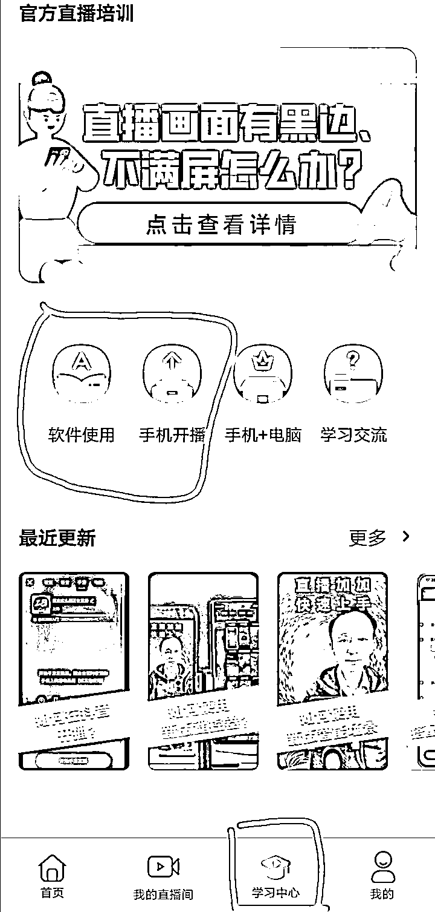  

4.直播时长：目前我都是播 24 小时左右，然后下播，等一会再继续直播。 

注：这里播放录音用的是网易云音乐，设置好单曲循环就行(其他音乐播放器没有尝试过)。 

是否要挂车 

我没有怎么挂，无人直播一天 24 小时挂着，有流量都可以通过直播间来转化。 

注：快手出于对新用户的保护，一个月内是看不到别人挂的小黄车的。 

矩阵 

无人直播主要是靠矩阵才能把收益放大，一个人可以实名两个号，如果是找家人或者朋友实名，得用自己的手机登录实名，不然直播的时候会一直让你人脸验证。快手一个月后会让你再次人脸一次，不然不能直播，如果实名的人在异地，就只能把手机寄给他人脸。 

标签 

这里主要说一下手机标签，快手对手机也是会打标签的。具体表现为：之前做的什么领域的，把快手卸载过后，如果不重置手机，再重新安装快手，发现页还是会给你推一些之前领域相关的视频。所以建议做矩阵的话，用已经起号的手机，继续起新号，会相对快一些。 

处罚（分为平台检测的处罚和被举报） 

1.如果去重没有做好，被平台判雷同太多，大概率会被罚，限流一个月。 

2.被原创举报搬运，限流一个月。 

3.新号发了几天视频粉条投不出，官方给出的理由是视频或者账号违规，遇到这种我都是直接注销（小概率事件）。 

4.被判录播，一般是让你重新考试，或者罚 100-200（大概率是被人举报录播）。 

5．批量做号（大概意思）,罚 2-3 千（这个不知道是被举报还是平台自己检测到然后处罚的），具体看你账号的收益要不要交罚款。只做达人带货赚佣金，不交罚款，佣金也是能提出来的。 

注：只要把去重做好，搬运不被原创看到，被处罚的概率也不大。 

账号注销 

1.一万粉以下，可以直接注销，一周后释放。 

2.一万粉以上，需要人工在工作日打电话审核，确认你是否要注销，再加上确认后的一周释放时间，周期为 10-15 天（这期间注意快手官方电话，不要漏接，不然时间就得延迟了）。 

能做一年的快手无人直播，得益于坤哥真诚的分享，很感激！手里不宽裕，等宽裕了再加入坤哥的内训社! 

加入生财也一年多了，有进步，但很慢。不过只要一直在进步，应该就是好的吧！ 

以上就是我的分享，希望能给想要做快手的圈友一点小的帮助。 

感谢阅读！ 

## （73 赞）《算好价格的安全边际，前端验证好市场需求，关键词找到低价好货，后端通过闲鱼快速卖货的经验分享》 

大家好，我是柯北，前段时间基于对闲鱼玩法的好奇探索，根据自己对平台特性的熟悉，做了一回倒爷，通过闲鱼购入 72 个欧普台灯，期间进行了多次尝试，过程中虽有波折，但从闲鱼全部顺利卖出，实现低买高卖套利。 

虽然这是一个信息差套利项目玩法，但希望大家能够透过现象看本质，试着理解商业的本质以及人心的洞察，希望能给大家提供一些脑洞和巧思。 

全篇内容的结构为：商业底层的逻辑确认-市场调研需求的方法-找低价好货的方法-闲鱼出售的过程经验和新人进入门槛的分享。 

为了让大家可以更好地了解实战过程，理解实操思路，会有较多相关截图（敬请理解），本人保证每一张截图都是真实记录，力图利用数据思维带着大家大胆假设，小心求证最大化还原整个项目过程。 

尝试一： 

低买高卖 5 台飞利浦音响，总价 1400 购入，2250 卖出。 

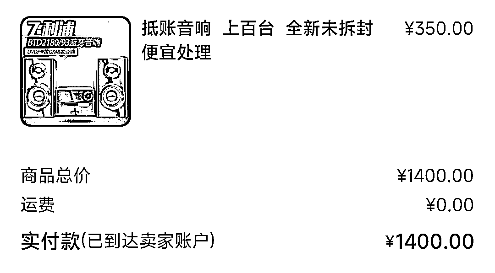  

280 元 1 台，共 5 台 

尝试二： 

低买高卖 20 个 360U 盘，总价 300 购入，550 卖出。 

  

64G 内存 360U 盘 1 个 15 元，共 20 个 

但最值得一提的还是 72 个欧普台灯的实操过程。 

项目截图如下： 

  

实际是 72 台欧普，共 6480 元，在我收到货后卖家退了我 720 元 

  

  

欧普闲鱼出货截图 

经验小结： 

飞利浦音响属于知名品牌的小众产品，销量比较少，但消费者品牌认知还是有的，且这款音响同款京东售价 1799，所以不怕卖不出去，而是销售得比较慢，前前后后花了半个月的时间全部卖出。 

  

同款飞利浦音响京东实时售价 

360U 盘属于知名品牌，但问题在于整个 U 盘市场一直在下行，尤其在闲鱼平台，无论是金士顿还是闪迪，所有品牌都在贱卖，好在此次进价足够低，有足够的回旋余地，后续我的策略是慢慢卖，找到机会就批量出掉，最后，一位新疆的手机店主把我剩下的 15 个 U 盘全部买走。 

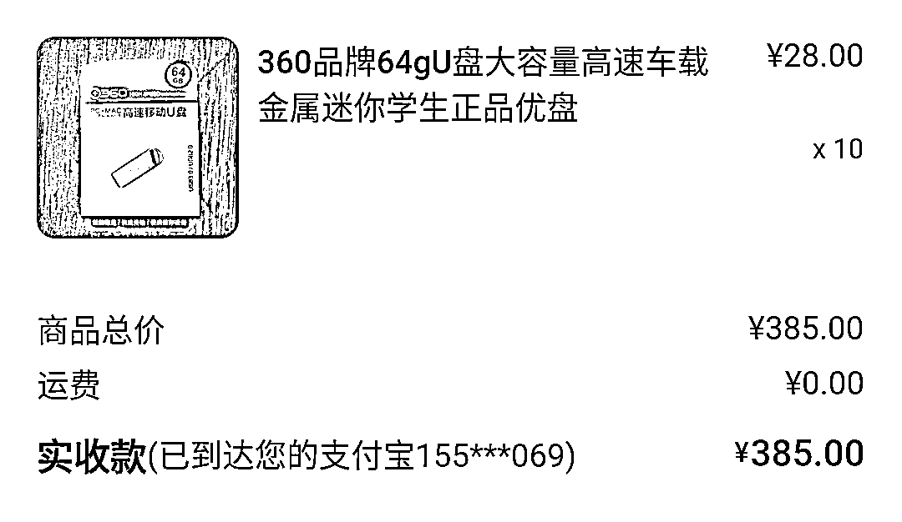  

15 个 U 盘每个 25 元（含邮费 10 元） 

在卖货的过程中，问的最多的问题就是怎么售后，其实实际情况是即使是全新未拆封，因为不是正常渠道销售，所以不能进行官方售后。 

但我每次碰到这个问题，我都会避重就轻回答找官方售后，如果对方再追问怎么找官方售后，我就回答这个就不知道了，我这是全新未拆封，不会出问题。 

货只要是全新未拆封，我就有底气确认货没有问题，霸气卖货。 

一、商业的底层逻辑 

1\. 最基本的商业逻辑——低买高卖 

只要卖价高于进价，一般情况下就被认为是赚的，拆解我单个台灯的成本架构——成交价格 90 元+进货邮费 5 元+出货邮费 7 元=总成本 102 元。 

因此只要卖价高于 102 元，我就能赚钱，这个价格已经很低了，低到了我不管是 160，140，甚至 120，我都不亏，所以低买高卖逻辑成立。 

2\. 最安全的经济学逻辑——价格要有足够的安全边际 

102 元，到底是多么安全的价格边际呢？对比官方旗舰店同款，日常均价 279，大促底价 189，所以是绝对的价格洼地。 

对比闲鱼同行同款，微瑕已拆封底价 160，而我全新未拆封拥有绝对话语权，只要我价格低于 160，无论是成色还是价格，都是对对手的绝对碾压，所以价格要有足够的安全边际逻辑成立。 

3\. 最底层的电商逻辑——标品看价格 

毋庸置疑，欧普台灯是绝对的标品，国民品牌国民品质，在淘宝上同款系列月付款人数 1w+，因此官旗的价格就是商品价值的锚，所有场景下的交易价格都是锚定官旗价格，闲鱼就是受其波动影响最大的平台。 

当碰到标品时，价格就是王道，所以标品看价格逻辑成立。 

4\. 最合适的选品逻辑——选爆品 

不是所有的标品都是爆品，判断是不是爆品最简单最有效的方法就是看销量。 

销量高意味着什么？证明市场需求足够大，需求大就证明只要合理操作就能轻松卖出去。 

书接上文，欧普台灯同款系列月销人数 1w+，事实证明就是爆品，所以选爆品逻辑成立。 

5\. 最简单的生意逻辑——合作思维 

在与上家达成交易前，在沟通中运用合作思维，释放如下信号：我是诚心买，价格合适我全要，如果我全要的话您不用一件一件地卖，您可以节省很多精力和糟心事，我是在帮您资金回笼。 

采用合作思维，我和他不是对立关系，而是合作共赢，即利他思维，利他即利己，所以合作思维逻辑成立。 

二、如何进行前期的市场调研 

1\. 基本原则 

1.1 品牌货最优先，品牌产品词就是核心竞争力，品牌是消费者最情愿支付溢价的因素 

什么是品牌，比如打开手机淘宝，点击天猫新品，里面都是品牌。 

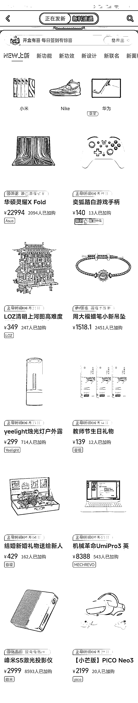  

上图所示所有产品在闲鱼都是硬通货 

品牌不分大小，只要有消费者认你，就是品牌，比如小米有品里的众多品牌，小米系品牌的产品在闲鱼也是香饽饽。 

1.2 标品优先 

像知名的服饰鞋包品牌就不行，因为不管真假或者限量与否，风险收益比都是不划算的。 

为什么这么说呢？比如在淘宝搜索 aj1，除了官方旗舰店，其他店真伪存疑。 

  

即使是鞋圈老司机，在淘宝买球鞋也有翻车时刻，更何况是普通消费者。 

若是在闲鱼搜索 aj1，我敢说大部分球鞋基本都是假的，闲鱼十双球鞋九双假。 

1.3 销量大优先 

有些品牌确实知名但销量小，需要慎重考虑，还有就是某些大品牌的某些类目产品（偏冷门）也得谨慎。 

销量大怎么理解? 

以欧普台灯为例，所有系列仅在官旗的月销售人数至少 3w+人付款，因此保守估计我所持有的元悦系列台灯月付款人数至少 3000+人付款，这就是绝对意义上的销量大。 

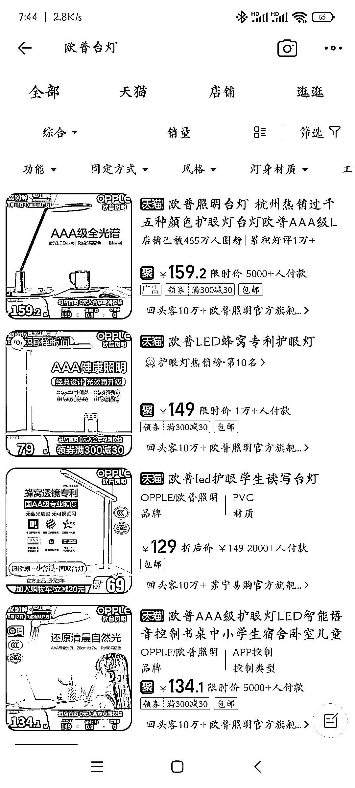  

欧普台灯淘宝实时截图 

知名但销量小怎么理解？ 

以飞利浦音响为例，淘宝单个宝贝月销售人数最多 100+人付款，但确实有市场。 

  

飞利浦音响淘宝实时截图 

1.4 销量小看竞争 

比如淘宝搜索 cubi 时间管理器，所有店月付款人数加起来最多 700，但在时间管理器这个领域它是龙头。 

  

cubi 时间管理器淘宝实时截图 

再看闲鱼的情况，所有宝贝一屏到底就没了，竞争确实很小，只要有货轻轻松松卖出去。 

  

cubi 时间管理器闲鱼实时截图 

1.5 一般要好卖且有利可图，候选品官方价格一般至少需要 150 元以上（这点很关键，关系到最终盈利） 

比如最生活毛巾销量虽然大，但价格不符要求，利润也很少，还打不过闲鱼的职业卖家，没有足够的安全边际。 

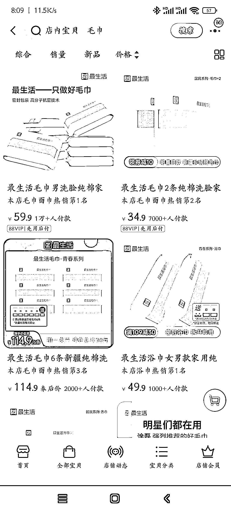  

最生活毛巾淘宝官方旗舰店实时截图 

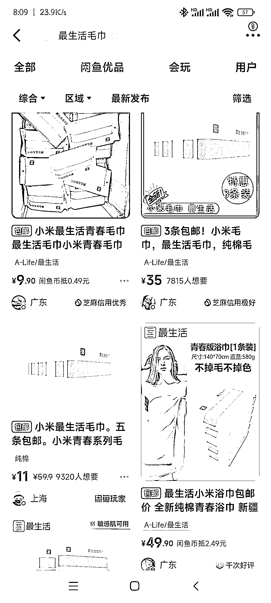  

最生活毛巾闲鱼实时截图 

1.6 避开劝退类目（包括大品牌） 

常见的就是健身器材，小家电，大件商品，因为上述三类闲置卖家太多，都是用了一两次就弃坑了，最后在闲鱼骨折转让（而且不好出手）。 

比如米家跑步机，闲置回血价打骨折（至少五折以下）。 

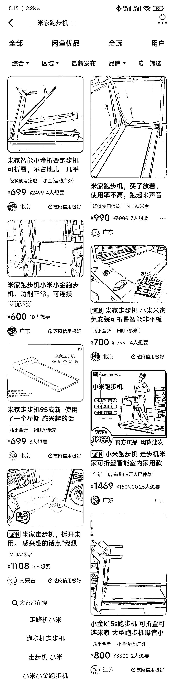  

米家跑步机闲鱼实时截图 

2\. 按图索骥 

在理清基本原则后，就开始“照方抓药”了，在我 all in 欧普前，我初筛了几个品（以下列举产品及淘汰理由）。 

美的智能网关（非标、销量小，价值过低） 

  

美的智能网关闲鱼实时截图 

公牛插座（价值过低） 

  

抵债公牛插座（被毙掉的候选品之一） 

多喜爱蚕丝被（非标，销量存疑，且闲鱼屏蔽关键词） 

  

多喜爱淘宝实时截图 

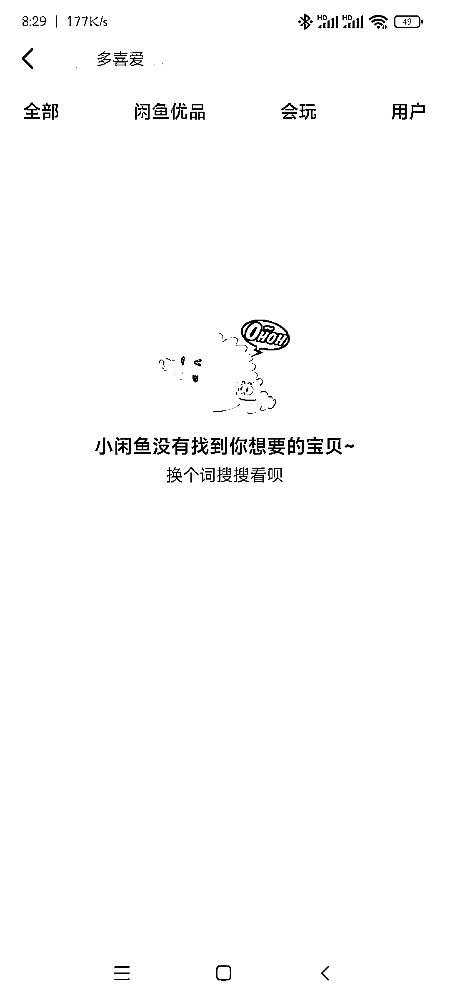  

多喜爱闲鱼实时截图（关键词被屏蔽） 

铁木筷（非品牌，非标，价值过低） 

  

抵账铁木筷（被毙掉的候选品之一，已下架证明卖家没卖出去） 

家用厨余垃圾处理器（非品牌，非标，劝退类目） 

  

抵账家用厨余垃圾处理器（被毙掉的候选品之一，已下架证明卖家没卖出去） 

3\. 市场需求 

当我敲定欧普台灯的时候，我采取的策略是根据对方提供的信息，进行信息及需求验证。 

信息验证，策略就是根据对方提供的商品规格参数，初步确定台灯的型号，这样才能确定商品价值的合理区间，最终我确定了是元悦型号，是欧普台灯系列中高端产品，因此信息验证成功。 

需求验证，首先欧普在国民认知里属于大品牌，但我不确定它的台灯是否热销，so，用最简单有效的方式——淘宝搜索欧普台灯，看到官方单链接月销售人数 1w+，因此需求验证成功。 

4\. 安全边际 

标准不在官旗，而在闲鱼，因为我是在闲鱼卖，因此同行价格是安全边际的锚。 

最有威胁的同行是微瑕已拆封 150-160 元包邮，而上家全新未拆封初定价 120 元一个，因此产品已经具有足够的安全边际。 

既然安全边际已经确立，自然是越低越好。接下来就是采用合作思维跟对方进行议价。 

三、如何找到低价好货 

1\. 定向关键词搜索 

其实我也不是电子眼，只是利用 seo 思维去找货，我会定期在闲鱼搜索如下关键词：抵账、抵债、顶债、顶账、批量出。 

从关键词反向找需求，因为这些词代表着一个心态，就是急出回血，所以只要你表现得干脆爽快，“屠龙刀”也不是不可能。 

2\. 善用筛选功能 

如何提高效率，就是利用好筛选功能，最有效率的两个按钮就是价格筛选和最新发布。 

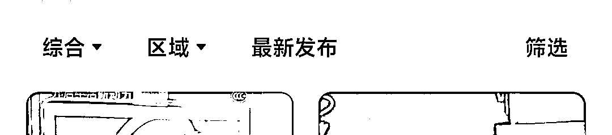  

最新发布 

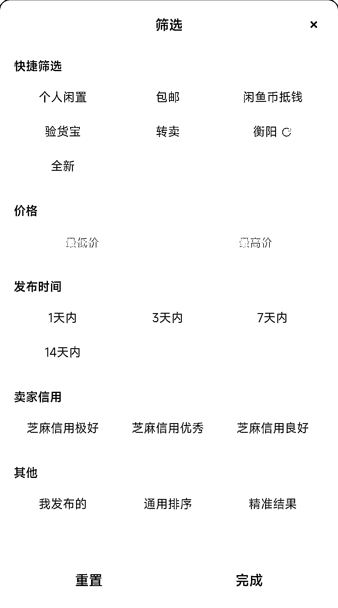  

价格设置（筛选） 

价格筛选的意义在于过滤大部分无效冗余的信息，比如当你在关键词批量出下选择价格 100 以上，就能过滤很多低价值和不相关的信息。 

最新发布的意义在于快人一步，当一批好货出来的时候，最新发布是最快展示的，当市场没有反映过来，卖家也不知道自己报价低了的时候，你上来就秒拍，兵贵神速，对手还没看到的时候战斗已结束。 

3\. 不要执着于砍价 

当这批货价格已经到了安全边际，你的最优策略是尽可能快地完成交易，最好的方式就是闲鱼聊天直接要到对方的电话号码，然后打过去。 

目的是尽可能把价格砍下来，真诚沟通，不卑不亢，如果报价方案 OK，结束前你说我考虑一下，可以的话等下马上拍，这个环节是给双方一个缓冲，你有时间再最后确认，对方也不会觉得你非要不可，片刻之后，决定好了就去秒拍，不要磨叽。 

四、如何在闲鱼上卖货 

1\. 如何定价 

首次定价可以定高一点。 

初定价 169，但恰逢 618 大促，期间只卖了一单，经过理性分析后，我决定采用控制变量法进行测试。 

策略就是在大促结束后保持 169 价格 3 天左右，结果是有询单，但没有成交。 

2\. 如何调整策略 

卖不动就阶梯降价。 

因此我开始阶梯降价，降到 159，可似乎还是不够狠。 

在我犹豫之际，我意识到两个关键点——个人的时间成本和产品的库存周转率。 

于是乎一咬牙一跺脚直接干到 149 包邮，这个价格是我与对手博弈的最优解，因为对手 150 微瑕，而我 149 全新，精准拿捏尺度。 

3\. 时效性的需求共振 

避开大促（618 和双 11），通过生意参谋和百度指数辅助决策。 

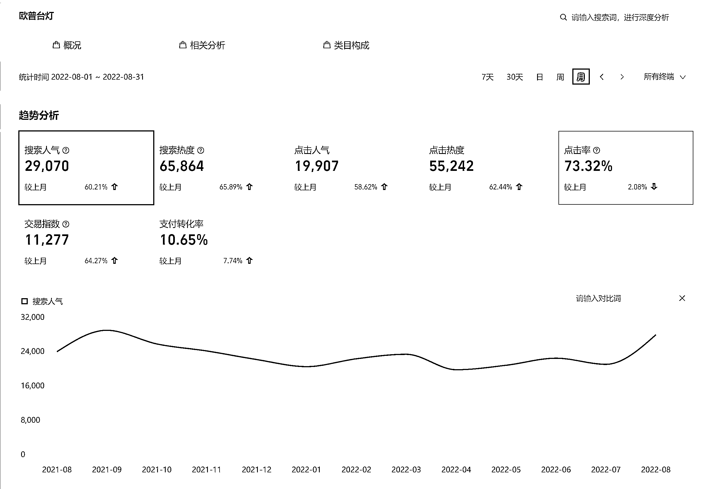  

欧普台灯需求旺盛 

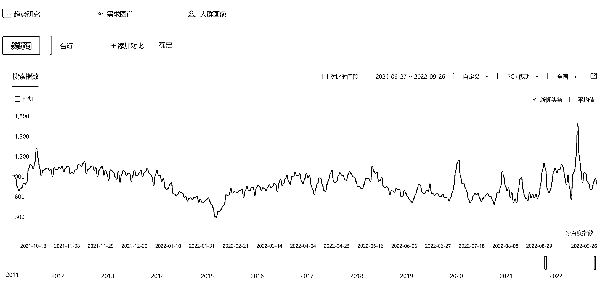  

搜索指数证明 7 月份是小高峰 

  

资讯指数证明全年 7 月份小高峰，8 月份最高峰 

如上所示，我通过往年的台灯数据以及生活的经验，预测 6 月底之后会迎来台灯的小旺季。 

因为学生们都放暑假了，家长就有需求给孩子配置一个台灯，所以说需求会释放。 

果不其然，迎来旺季，7 月单日最高峰卖出 9 个台灯。 

五、过程中的经验分享 

1\. 价格只要足够低，客服很省事 

当货足够硬，价格足够低，很多客户会直接秒拍，过程中难免有砍价的，我可以很傲娇地跟他说，卖完了就没有了，所有台灯我都是原价卖的，即使是几台一起买的，所以客服很省事。 

  

闲鱼聊天截图一 

  

闲鱼聊天截图二 

  

闲鱼聊天截图三 

  

闲鱼聊天截图四 

2\. 了解市场比一切都重要 

不管是什么货，只要确定有市场，能比较高效地卖出去就是好货，如果卖不出去，价格再低也是垃圾。 

3\. 全新未拆封是最好的溢价 

同样是一个产品，全新未拆封能溢价 20%左右，因此除非是特别有优势的货，一般只收全新未拆封产品。 

六、新人想做会有一些什么样的门槛 

1\. 需要囤货且占用资金 

一批货一般需要动用上千乃至大几千以上的资金，新手小白得慎重。 

2\. 以为买到好货，实则是坑 

新手最常犯的错误是信心满满收了一批货，以为捡漏了，结果卖不出去，一定要做好充分市场调查才能出手。 

3\. 没有把握，宁愿错过 

如果没有把握，宁愿错过，也不要冒着风险买进，错过至少不亏钱。 

## 《创业三年，两年获得天使投资，月入 15 万+，看我们怎么玩转「0」中介费房屋分享平台》 

各位生财圈友们大家好，我是秋冬，来自于十三朝古都洛阳。 

加入生财也有两年的时间了，之前一直在默默关注生财里的信息，最近我将这几年我们做的一个项目拆解分享给大家，本篇文章也是在生财首发，全文将近 8000 字，还请大家耐心阅读，多提宝贵的意见： 

[https://v0ln6e97jg.feishu.cn/docx/PglAdRMiIoVTRyxc4Q3cw8hvnWf](https://v0ln6e97jg.feishu.cn/docx/PglAdRMiIoVTRyxc4Q3cw8hvnWf) 

## （34 赞）《微头条自媒体副业项目，单篇 1000-2000+ 收益写作玩法，全程复盘大解析》 

大家好，我是黄岛主！ 

今天分享的复盘文章是微头条写作类的自媒体项目，目前这个项目我们是工作室运营，批量操作后，整体效果还是不错的。只是容易把员工写跑了，毕竟写东西是比较枯燥乏味的，但是这个项目确实是不错的自媒体项目，运气好的话，单篇文章 1-2 天能赚个 2000+收益。 

我简单说下微头条是什么，这个是今日头条下的微头条模块，类似于微博这种，可以发 2000 字以内的短文。只要开通微头条收益就可以获取收益，开通门槛也很简单，需要 100 个粉丝。 

当然，除了微头条，还有悟空问答模块，这个收益的单价要比微头条高。而今天的话，我只分享微头条的复盘实操经验。以后有时间，我在慢慢分享问答方面的玩法。 

我们来简单的看下收益图： 

  

  

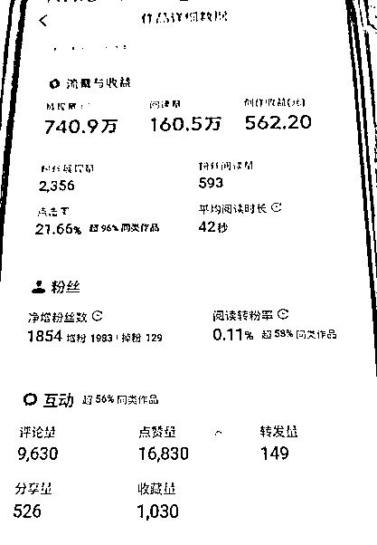  

我们需要先去注册个账号： 

手机端：商城下载今日头条 APP，手机号直接注册登录。 

电脑端：打开[www.toutiao.com](http://www.toutiao.com) 点击登录，手机号注册，如果不能注册，可以手机端注册。 

注意：注册完，不要实名，什么时候提现了，什么时候在实名，不然会浪费实名账号！ 

做这个项目之前，需要 100 粉丝开通微头条收益，方法也很简单： 

第一步：今日头条搜索自媒体学习人小组和自媒体创业人小组，加入，给每个发动态的人评论：新手小白，先关位敬。（可以换字眼，比如，我是小白，你懂的，但是不要出现明显互关的字眼。） 

第二步：评论 30 个左右，休息一会，模拟真人，刷刷文章，再评论，评论 100 个，他们回关，就过百粉了。 

好，账号有了，粉丝也有了，下面我详细复盘下细节要点： 

赛道的选择： 

我建议大家去选择社会类的新闻事件以及法律类的故事情节，这个很好理解，例如社会类的包含：小偷去别人家偷东西，被发现之后逃走的时候从窗户跌落到楼下摔死了，然后被新闻或网上爆出来了。 

如图，这类其实很好热门的： 

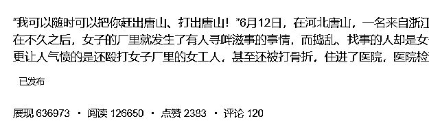  

而法律类的和社会类的正好一样，比如摔死之后，两家人开始打官司，也就是故事情节加上法律条文。这类比较有共鸣感，所以热门的也比较快。其他的赛道都可以测试，我给的这两个目前收益还是不错的。如果你想做，仅限参考。 

来，我们了解下头条的规则，了解这个才能深入发展微头条： 

要知道一点，所有的账号都是有权重的，有些账号保持长期的权重，有些账号短期的权重，自己写长期、写优质文也可以提高权重，但是它比较慢，因为账号一开始就有权重，那你的账号如果从零开始做的话，就意味着需要很长时间才有权重。所以，刚开始能不能坚持下来，全靠自己的执行力和耐力！ 

看下写文章平台推送的规则，有两种： 

第一种、按点击率 

写一篇文章就算没有粉丝的情况下，平台也会给你推，比方推 500、1000 人，很多时候文章有 1000 阅读量，虽然粉丝不多，但是这 1000 人展现必须超过 10%点击率，才有机会再进入下一轮的推送流量池，10%是随机的标准。 

还有一项参考的要求是达到 3%的互动，就是 1000 人展现要有 30 个互动，点赞和评论，如果这两项达不到的话就不会再推送了，这是推荐的机制。 

那么，我们怎么提高点击率？ 

开头写的比较吸引人，写一篇文章别人不可能一下子看完，他只能看到前面那一部分，那一部分写的很吸引人就很容易点进去，很容易达到 10%，那么怎么让用户互动，有些时候你就留一个光明的尾巴，经常会看到一些文章最后一句话是你怎么看？ 你有什么看法，对此你怎么看？很容易让人留下说两句的感觉，留一个大家讨论的空间，就会有互动率，互动率和点击率就解决了。 

第二种、写文有“争议、共鸣” 

那么，什么样的文章比较容易爆，其实没有限制非要写哪一类文章才能爆，要掌握四个字“争议、共鸣”，就是这件事本身具有争议性，有讨论的空间，大家比较关心，跟自身有关，如果写一个什么不关心的事，比如你说我家的房子被人强拆了，这种事平台也敏感，不会给你推，首先要明确什么事是大家都在乎的。 

比方我在网上买了什么东西，然后有假一赔十，这种比较吸引眼球，也比较有争议性，要么就是那种很正能量的共鸣，所以不一定非得限制题材是哪一类型，跟文体有关系，跟写作手法有关系。 

而题材选择争议和共鸣，要么就写非常感人的，要么就写争议的，一看就很恼火，或者挺有意思，很吸引人的，就是有共同点，不要写一个很陌生，大家基本上都不知道，又是平台敏感的话题，首先排除敏感的，政治的，色情的，宗教的，医疗的等等。 

如果平台不让写的，就先排除掉，除非题材一定是非常奇特，非常有趣，非常有意思，非常有争议的，比如网上现在比较火的法律文，这种比较有争议的东西，所以选题要从爆文里找，才能出爆文。 

因为爆过的说明平台或者作者已经验证了这个东西比较火，所以你再写这个东西还比较容易火，不要去写冷门的，别人大号发抖没火，小号再写能肯定火的几率更小，但也不是绝对的，也不是没有这种可能，可能是 1%， 

但是爆过的内容再去发爆的可能性是 99%，因为已经验证过了，别人写的你也可以再写，但是不能全抄，头条不能重复，但是爆文你知道了，把这个事忘记，然后重新用你的思路去写。 

大概就分为几个层次： 

去描述事情发生的经过，如果这个东西没法判定它的真实性，首先真实性也很重要，就标注一下，看看来自于哪个媒体，有媒体报道，首先这个事情不能歪曲，保证真实性。 

段落我们可以分为：第一段、描述事情，第二段、描述过程，第三段、描述你的观点。 

如果有些事情你不太好有观点的时候可以用网友的观点，一个爆文下边会有很多评论、点赞，可以采用网友的观点，然后结合自己的话把它写出来。 

正常的都是三段，有些时候也可以写更多，比方说你有观点了，观点比如牵扯到法律的事情，想支撑这个东西，肯定要引用法律第几条规定，两段或三段也是可以的，总之就是不要和别人引用的法律观点一样，即使引用法律观点是一样的， 

但是你的观点和论述前面事情的描述不一样也行，因为头条超过 30%就算是雷同稿，雷同稿是不给留的，未必是发长的，比方这个东西很难看，那你可以说就是，另外一个说法就简直没法看，换了一个说法就可以用，短的也可以，前提条件就是要找爆文，要判断文章题材，文章的结构。 

说下 30%的重复率怎么判断：写了 100 个字有 30 个字的重复，1000 个字不超过 300 字，也不用一个字一个字去查，一共写五段，每段字数差不多，两段是一样的，有一段一样就没事不，超过 30%，20%就没事。 

最重要的还是文章的题材，题材有几个判断标准，第一、是爆文，在网上必须很火，尤其是和你一样的作者很火，但是不能看司马南，他的粉丝太多了，他影响力大，发什么事情都会火，但你发不会火，要找一个就针对你这个账号相似的，别的账号哪篇爆了， 

比方说你是 3000 粉丝，他也 3000 粉丝，你是写教育的，他也写教育的，那这个题材就可以重新再写一遍，说明大家认可这个事情，还有一些比较火的事件，正能量事件，当下最热的， 

比方唐山事件，感人的那种龙马子，你写你也火，因为大家的感受是一样的，不管损失多少，前期的要一个比例，比例达到了以后还会再推荐。 

账号有粉丝也是有用的，因为有保障，比如我一个账号一、两百万粉丝，首先有一部分粉丝就会来看我，没有粉丝是没有的，但是平台会给你基础流量，比方给你 300，300 能达到 30 个人的点击，还照样会在网上推荐，比方推荐两、三千，3000 再达到 300 的流量还会在往上推荐，最重要的还是取决于文章本身。 

头条比较火的大概分为几类： 

事件性，社会性，观点性，社会性+观点性，有一个号是 M2 孙宁，他完全是写感受观点，比如超生不是热点，但大部分时候不是热点， 

比如放假了、教育，他就谈比较独特的观点视角，还有社会实践的，比方国际资讯，比较有意思、有争端的， 

比如安 倍死了，后面要上小台 湾了，然后又把要支持中国，天然气也不给美 国供了，就很容易带动情绪，另外一种生活化的、有争议的趣事，大概就是方向性的。 

不管做法律还是社会都是一个标准，法律首先得给人家介绍清楚是怎么回事，然后引用法律条文，有观点也得有法律条文，这样才能写出爆文。 

爆文的数据以上面为标准： 

对于平台来说推荐 10 万+阅读量就算爆文，10 万点击收入基本上能达到一、两百，价格是根据点击率、互动率、停留时长，三者相加，整出来一篇文章是三毛还是三块，最高的可以达到 1000 点击 10 块钱。 

那么，新号一般写多长时间能起来： 

看每天写多少，优质程度，没有标准，看每天能产生多少爆文，所谓的爆文也就看你能产生多少优质文章，优质的文章按照我的要求能达到一天 4、5 篇，一个月就起来了，先写一篇太少了， 

比如：一开始的时候写五篇有可能爆两篇，过两天又增粉丝又增量，它就形成一个良性循环。现在不可能写的每篇都爆，有些时候我虽然能达到 90%，也不敢保证每篇都是大文爆，我写的也有几百万、几十万的。大部分会有几万，几乎没有几万。 

在写的过程中总感觉下不了手，怎么更好去写它： 

写在哪里、时间、某某某、发生了什么事情、结果是什么，比方 2022 年 11 月 7 日，黄岛主从徐州给北京的某某打了一个电话，主要是聊新媒体的事，最后某某没听懂，下次再打电话。我们主要去描述就行。 

我们要要遵守五个标准就是：什么时间、什么地点、什么人物、发生什么事，什么结果，主要才能去下手写出内容。 

找同行爆文的方法，我说下： 

我们可以找几个比较厉害的，经常发的，比较适合你口味的，和你的很像的，经常点这几个人平台都会推，要是想找快的话，可以搜关键词，比如法律故事，能看到很对标内容， 

比如其中一个账号每天发 4、5 篇，从这几篇里边再找一篇比较好的，作为我们的对标。你要是关注了十个人，一个人选一篇就十篇，十个题材，十个题材再选五个题材就是很简单了。 

因为头条不太喜欢推旧文，所谓旧文就是旧的新闻，这件事已经发生很早了，不会这件事又有新的变化，比方前天发生的事情，现在才出结果的可以把它拿出来说一说，这个事情非常有看点的，最好是今天的，刚刚发生的。 

这个东西是集合制，它成功的元素就是时间、文笔、思路、观点，你要是写去年的也行，观点非常厉害也可以。主要是你有没有新的观点出来，能不能得到网友的认同，但是要写去年的肯定在时间上减了一分，本身可以写个满分作文的，但是因为时间的问题最多能得九分，也不是不能写，但是在时间上就扣分了。 

像我今天写的题材是六月份的，整体效果还是不错的。虽然内容写的很好，但在时间上扣分了，而在题材上加分了，这个东西就跟找对象一样，虽然对象长得不好看，但非常有钱，都希望找对象有钱，身材也好，长得也漂亮，家庭也好，学习也好，那实在找不到，或者有这样的又未必能看上你，未必能遇到，选的时候首先拿一个标准，长得好看。 

还有就是题材好、时间、争议、公平这些元素标准，选择一下，最起码要达到几项，比方六项有三项是可以的。 

如果你有钱，我建议收一个还没有绑定的粉丝多的账号： 

这样的账号已经有了粉丝基础，有了权重，不是说不能从零开始做，但是账号的基础很重要，账号可能几千、几万，运气好的花 2000 块钱能收几万的账号，几万块钱就能收几十万的账号，头条的身份证不能改，要收的话只能收不带身份证的，没有绑定的，拿走以后可以绑定成你的，要是弄一个绑定的改不成自己的。 

金 V 比较贵，只要不是金 V 基本上都不会太贵，按道理来说头条一个粉一块钱，实际上都达不到，不是金 V 的话大部分的时候看账号的数据好坏，还有活跃性，正常价格一般都二、三十万粉丝账号就得花两、三万块，虽然成本有付出，但是缩短了很长的时间，这样有很大信心能做下去。 

其实这块很多人容易放弃，因为现在做一个新号有流量，每天能达到一、二十万，但是觉得你的精力投入和你的收入完全不成正比，比方一个月收入 800 块钱，每天用好几个小时在上，觉得比较亏， 

比方你的账号就算是我来经营的话，我一个月也就是收入一、两千块钱，因为权重比较低，没那么多粉丝量，那我经营的号一、两千，我经营我的号一个月就是几十万，同样一个人经营不一样的东西价值不一样，就是为了节约时间。 

比方有个一年多把微博粉丝做到 100 多万，另外一个直接花 2 万块钱买了 100 万的粉丝账号，比较快速，前期的时候我不太建议收号，因为这样子变懒了，体现不到付出和回报的感觉，但是后来我就鼓励了，原因是因为有很多不是大学生，不光是来学习的，目的非常明显，挣不到钱就撤了。 

那我就给他快速的方法，按我这个方法就很容易，比方说你从零开始做，好好做，同样的付出一个月能挣 800 到 1000，如果 10 万的账号一个月收入 4000 到 5000，如果 30 万的账号，一个月可能收入个 1 万到 2 万，付出是一样，但是回报不一样。 

我之前带了个学生学了一年，现在有些爆文，很多时候他的流量比我还高，某一阶段我们俩写同一篇文章，他有可能都比我高，因为除了确定性，还有很多东西是偶然性的，包括时间、精力、认识、工作性能、选题等各个方面，虽然我知道这些规律，但是我未必每天都有那么多的时间和机会。 

头条确实的有点枯燥，如果你想做，可以先用我说的方法试试： 

去写 500 字左右，事件写太短描述不清楚，除非只写观点型，比方当下发生的事情事大家都很熟悉，只写观点，发生这件事大家都知道，没必要说来说去，只写观点型的，如果这件事想描述清楚， 

最好不要低于 500 字，1000 字都可以，不要写太长，要不然就很容易写出废话，写出东西要有力度，如果废话偏多是不行的，因为头条上大部分都是老百姓，偶尔有点废话还行，但写太多都是废话没人看。 

好了，以上是我的复盘总结，有问题可以一起交流希望能帮助到圈友！ 

## 77 点赞（《微头条新玩法：反向发帖，通过挨骂涨热度》 

#风向标#  最近做微头条的，总结一下套路： 挨骂 流派，流量的尽头是吵架 别人都在骂 李少莉，社区女干部， 我们就去表扬她 结果，不出意外，账号被网友喷成了🐶 不到 300 字的微头条，含着眼泪赚了 400 多块 

  

# 5、海外项目 

## （50 点赞）《Telegram 自动引流工具，几十个号，加了几万个群，探讨如何更好的变现》 

大家好，我是 Insight ，今天主要和大家介绍 Telegram 的技术原理以及实现引流方法，分享一些坑，和自己的一些运营思考。 

Telegram 是跨平台的即时通讯软件，其客户端是自由及开放源代码软件，代码是开源的，而且官方帮我们封装好了一个库，叫做 TDLib 。 

任何人都能基于 TDLib 去开发 Telegram 的客户端。 

1\. TDLib 的特点 

① 跨平台 

② 多语言（ C#，Java 都可以） 

③ 易用，不需要考虑很多细节，只需要关注业务 

④ 高性能，测试每个实例可以处理超过 24000 个机器人 

⑤ 完好的文档（但是是全英文的） 

⑥ 一致性 

⑦ 安全 

⑧ 完全异步 

参考文档：[https://core.telegram.org/tdlib/getting-started](https://core.telegram.org/tdlib/getting-started) 

2\. 具体技术实现 

客户端 

可以用自己熟悉的语言封装，基于已有的接口考虑怎么实现业务。 

我倾向使用 C# 做客户端，因为开发图形界面比较简单，只需要拖拽就行。 

服务端 

用 Java Spring 写的，只需要写几个简单的 API 就行。 

3\. 具体业务引流逻辑 

1）基于 TDLib 可以完全使用 Telegram 的所有功能，包括加好友，加群，发消息，接收消息。 

2）我们开发一个机器人，首先添加几个“搜索群”。所谓的搜索群，有点像 Telegram 里面的搜索引擎，输入关键词可以返回相关的群。 

3）通过搜索群，我们可以获得一些“种子群”。为什么叫种子群呢？因为我们可以通过扫描这些群里面的人发送过的消息，看看有没有包含群链接。如果包含群链接，我们就自动加入下一个群。 

4）如此反复，以“种子群”为中心，我们通过机器人，加入越来越多的群。这有点像一个网络一样，可以一直往外扩展。 

5）在实现上，为了提高效率，往往需要安排很多机器人同步工作。这就有一个怎么协同的问题。我的做法是用一个服务器来协作，步骤如下： 

① 把所有机器人监控到的群链接传到服务器上，如果是新的群，那么记录下来。如果是加过的群，那么丢弃掉（这样保证不同的机器人不会重复加群）。 

② 每个机器人从数据库中取一个没有加过的群，然后去添加。添加之后自动监控群里发的消息有没有群链接。 

③ 一旦有群链接，重复步骤 1 。 

这样下来，所有的机器人可以同时工作，提高效率，而且各自不会加入重复的群。 

另外，可以通过接口获取一个群的所有成员 ID 。 

如果数据量大了之后，可以通过成员 ID 反查这个人都加了哪些群。有点挖人关系圈的感觉。 

4\. 主要用户群体 

1）华人，需要是币圈的，黑灰产业。 

2）海外的话，主要是伊朗，俄罗斯。 

3）当然还有很多其他的国家，我的样本量不大。如果号足够多的话，通过程序应该是能扩展到各个角落。 

5\. 存在的坑 

1）加入的群多了之后，内存占用高。 

2）人群标签比较乱。 

3）有的群有加群验证，需要通过一些方法绕过。 

4）卖成人用品的尝试。 

有试过打擦边球引流到微信卖成人用品，引流成功率高。 

但是撩骚的很多，需要耗费时间去聊天，而且不一定成交。 

5） 关于伊朗。 

我观察到伊朗流量好像比较多。伊朗这个国家对 telegram 也是有管制的，但是在上面的伊朗人特别活跃。 

但是由于语言不通，不知道他们在聊什么。 

之前调研这个国家的电商发展比较弱，没什么电子支付方式，国际资金来往也不方便，就没有继续研究下去。 

6\. 个人思考的其他变现方式 

1）游戏 

因为流量比较杂的特点，做电商的话物流可能会比较麻烦，所以有考虑过做游戏推广变现。 

2）小说 

把国内的玩法复制到国外，先给一段很吸引人的情节，要看下去需要付费。但是这块没有找到能承载业务的软件系统。 

3） 交友平台 

我观察下来有许多饥渴的男性，给交友平台引流或许是一个出路。 

4） 继续细分人群 

因为不同的群什么国家的人都有，特别杂。 

我观察到 google 有语言检测的 api ，就是说输入一段语言文字，可以告诉你是什么国家的语言。 

这样的话可以把流量按照国家来细分，再去考虑针对性的运营策略。 

评论区： 

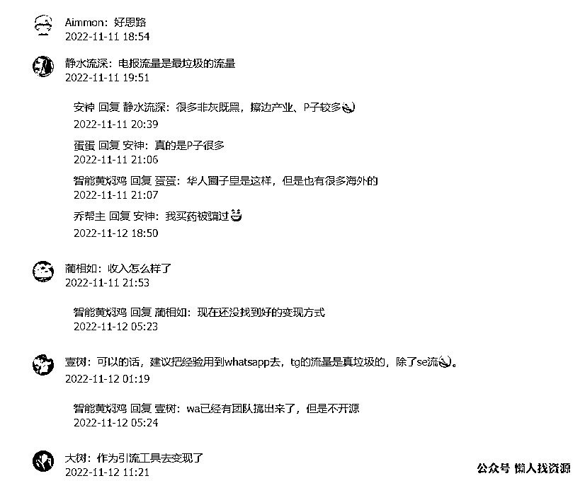  

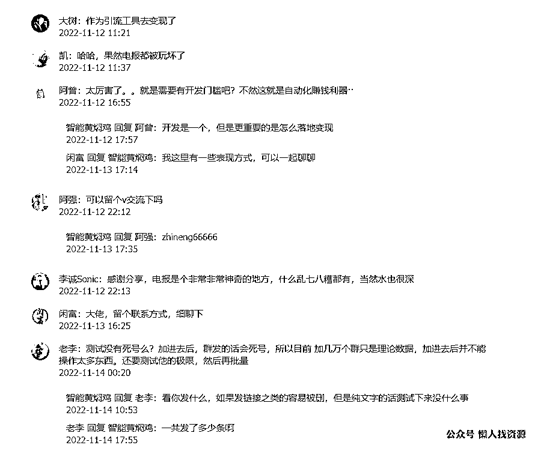  

## （36 赞）《亚马逊 OA「保姆级」入门手册》 

大家好，我是施小施，之前在生财比较少活跃，但是我发了一个关于自己的自我介绍，也在圈子里回答了一些关于亚马逊 OA 的问题，于是有很多圈友私下问我相关问题。有很多人问的问题都是重复的，所以我就想干脆写一篇文章，来统一回答一下。 

其实文章酝酿很久了，但是因为自己文笔太差，所以一直写得比较慢，请了生财里面的几个熟悉的朋友帮忙看过后才敢发出来。这篇文章，只是从事亚马逊 OA 到现在，积累的一些经验和方法，能帮助大家系统了解亚马逊 OA 这个项目。如果有问题，欢迎指正。 

以下将从几个方面来介绍： 

1. 亚马逊 OA 到底是什么？怎么赚钱的 

2. 亚马逊 OA 和亚马逊精品或其他模式有什么不同 

3. OA 怎么选品 

4. OA 一年可以赚多少 

5. 投入资金要准备多少 

6. 大概多久能赚到钱 

7. 如何解决 OA 痛点 

以下的文章链接：亚马逊 OA“保姆级”入门手册 [https://kdocs.cn/l/cbHq2LJwzg5K](https://kdocs.cn/l/cbHq2LJwzg5K) 

希望能看完能解决各位的问题~ 

## （23 赞）《单视频 Ins 涨粉 8 万+，TikTok 7 万+，变现却遇到难题》 

先自我介绍一下，我之前 19 年-20 年一直短视频带货，主要是国内的抖音，做过自然矩阵也搞过投流，去年开始才拿回老本行，搞绘画课通过短视频+直播卖课。 

新的 tiktok 账号是今年 7 月底注册的，意图就是把国内的设计定制业务通过 tiktok 接触海外的流量，所以我是顺便把我小红书上的短视频直接就发上去了，我的视频内容主要是以画画为主，自己画，然后搭配有节奏的音乐，视频是原创，但是制作成本不高。 

起初通过手机端发几个，播放量一直没破 0，少许有个位数的，处于放弃的边缘，后来请教了我一个在 tiktok 上班的朋友，他建议我可以用网页端试试，过了挺久我用网页端发了第一个视频，确实流量好很多，所以我才陆续把之前的老视频挪到 tiktok 上，在发了第 10 个的时候，有波小流量，大概几十万播放吧，时间差不多是八月底，其实评论区主要问的是我用的是什么绘画软件，我当时使用 iPad 绘画+做一些小动画，所以视频内容算是有一点技巧分享的。 

在视频上了小热门之后，我也是开始研究了用什么平台承载我的设计定制服务，帮喜欢我画风的粉丝画画宠物或者一些卡通头像（这些业务我现在是外包给合作的画师设计），我主力搞流量+卖课，通过研究我的同行大号，我挖到 gumroad.com 这个国外专门卖虚拟商品的平台，注册不难，上架也简单，付款可以是 paypal+信用卡，所以很快我就上架了自己的定制服务商品，然后通过 direct.com 做中转站（类似的还有 linktree.com）挂到自己的主页上，因为考虑到我可能到时候还会卖别的，如果你是单品变现的话，也可以不需要中转站，直接挂商品链接，以上这些工具使用都是免费的，而且中转站平台是可以看到访问数据的，方便研究哪个区域的受众对你的产品感兴趣。 

上架后，通过视频评论区评论引导置顶，但是转化率奇差，跟我在小红书同样播放量引流成交的转化率差了 10 倍不止，我后来分析了一些原因，可能是价格偏高（客单价 38-68$）,因为考虑到沟通成本+平台扣点，价格是比我在国内卖翻了一倍左右；另一个转化不好的原因，我感觉到美区的客户可能是对我的这个业务不感兴趣，或者受众付费能力差，不过我后来仔细研究了中转站的点击数据，很多人还是感兴趣的，就是点击到成交转化率很低。 

考虑到这个定制业务转化比较难，我又迅速上架了另一个虚拟商品，卖笔刷（iPad 绘画中的一些工具，辅助提高绘画效率），客单价 4.8$,可能是客单价低的缘故，笔刷的出单率要略好，然后我又把我之前国内的课程，摘了一个小课翻译了一下也给上架了，反响比我预期的要差，但是也能少许出单。以上这三个虚拟类商品都是通过 gumroad 平台上架成交的， 

自从小爆了第一个视频之后，后面发视频流量就基本不错了，后来爆了一个五百多万播放视频，tiktok 的粉丝量从几千涨到了 7W+，我把同样的视频发到 ins 上也上了热门，断断续续运营好几年的 ins 粉丝没超过 200 粉，一个视频现在涨粉了 8W+（图 1），不过现在也是转化奇差，下一步准备继续测试课程变现+实体商品售卖，现在在拟物料当中，这里再顺便推荐一个挖到的平台 redbubble.com(按需列印平台，就是你可以上传你设计的图案，然后平台帮助制作周边，比如衣服，手机壳，马克杯，贴纸帮你售卖，然后你拿分成)，我还没测试，不过有可能会自己发货的模式。 

总结：海外流量通过虚拟商品变现确实省去很多麻烦，某一些虚拟类的商品售卖有时候觉得甚至比卖课程体验好很多，大家如果有卖过微信红包封面爆单的经历就比较能感受，完全零售后，而且边际成本就是 0，真真正正的一本万利，不像课程还需要答疑。 

截止目前，从开始变现到今天大概两个月，在 gumroad 上的截图（图 3），另外加上另一个平台 co-fi.com （也是一个虚拟商品成交平台）以及一些直接转账 paypal 的单子，大概消售额 3000左右，除去平台扣点跟外包成本利润 2500+。 不过这个流量转化相较于小红书还是差很多，正在寻求更多样的变现方式，希望大家可以多多交流 

工具总结： 

1.  gumroad.com （虚拟商品售卖平台，可以卖设计类，图书类，影像类，视频课程类，大家可以上去看看，挖掘一些自己可以卖的商品） 

2.  co-fi.com(虚拟商品售卖平台，可卖定制类商品，绘画类商品，可以设置会员机制，比如会员可以优先看到你的朋友圈之类的，也有打赏捐赠机制) 

3.  direct.com / linktree.com(中转站工具，可以上面挂很多链接，然后把主链接放在你的 tiktok 或 ins 主页，实现多产品售卖) 

4.  redbubble.com(按需列印平台，帮助你制作你的设计类实物商品周边，并帮你售卖发货，你提供设计跟赚提成，可自定产品价格) 

  

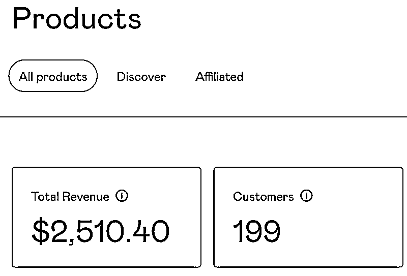  

## （53 赞）《如何在 TEMU 上打造一个爆款》 

拼多多的跨境业务 TEMU，只需要商家寄送样品给平台，产品被平台选中后，销售、推广、发货环节都是平台来负责完成的，模式比较简单，平台没有扣点，适合本身在做跨境业务或者拼多多店铺的玩家。 

大家好，我叫通路，做拼多多将近 4 年了，操盘过厂牌、白牌、贴牌、品牌等大大小小的生意池子，其中最高取得年销售 7000 万的业绩，目前在杭州某行业一家头部的品牌公司负责拼多多这块运营业务。 

今年都说国内电商越来越不好做了，拼多多亦如此，所以我时不时的想看看有没有机会做做跨境电商。 

刚好 8 月份的时候就传出消息拼多多要开始做跨境了，而且这个新项目是跟多多买菜一样重点的级别，想着按照拼多多的体量和打法，先入局进去肯定能吃到一波红利，加上本身我们团队就是专门做拼多多的，有着先天优势。 

我们在 9 月初拼多多新的跨境平台 TEMU 一上线，就作为第一批商家入驻了，目前最高日销售额近 5 万，一单将近 100 的利润，一天出了 100 多单。 

下面是写稿的时候去店铺后台截的图，可以提现的钱又有 6.8w 啦～ 

  

一、Temu 介绍 

名字：Temu，取自“Team Up，Price Down”，直译后可以理解为“拼着买，更便宜”，与拼多多在国内的定位异曲同工，在这里可以看出 Temu 主打的也是低价路线。 

模式：与拼多多国内不同，Temu 商家只需要提供产品，在产品被平台选中后，拼多多会安排快递上门取件，把货送到拼多多自己在国内的仓库，然后销售、推广、发货都由平台决定，商家只是给平台供货，类似于平台自营，商家只要提供竞争力的产品，对应的售价、物流、客服、仓储都由 Temu 承担。 

目前入驻不用交保证金，但是后续在货款中会扣押 1000 块当作店铺保证金，平台没有扣点，供货价按照人民币结算，模式比较简单，费用的话除了寄样外基本上没有什么额外费用。 

流量：目前 Temu 在北美持续推广投流，据说每月广告预算达 10 亿，新客获取渠道很丰富，之前看到一篇报道说大概 Instagram 占到 30%，Facebook 30%，Google 20%左右，剩下比如 Tiktok、Youtube 等占大概 20%。 

此外，Temu 还为新用户提供 30%的折扣力度，而且前三单免邮费，三单后购满 99 美元可免邮费，90 天内免费退货，还有很多商品首单只要不到 1 美元甚至 1 美分，新人福利很大。 

而且最近貌似还推出了“砍一刀”的功能，用户可以通过 WhatsApp、Messenger、Facebook 向朋友分享链接并获得相应奖励。 

在此之前，Temu 就已经上线了“Give 40%，Get 40%”的活动，用户可以通过分享折扣码得到六折券。之前有一段时间在 App Store 上购物 app 类的排名甚至都超过了亚马逊，流量是比较大的。 

团队：从这 2 个月跟他们小二的接触来看，Temu 团队类似拼多多国内团队的工作模式，感觉有点 12127【上午 12 点上班，晚上 12 点下班，一周工作 7 天】，小二经常凌晨还在对接群发消息，甚至是私聊我们明天的事项，周六日也是照常工作，我记得国庆的时候有个小二跟我说他只休息一天。 

二、如何把产品上架到 Temu 

1\. 如何开店 

如果有拼多多店铺的，可以在拼多多后台一键开店，对接招商那里最好填写哦，不然对接的会慢一点，可以直接填你们类目的小二，并私下跟他打个招呼。 

  

没有的话，可以去 Temu 的登陆页面申请注册，目前只开放企业普通店和个人店的注册，没有专卖店和旗舰店，页面有详细的流程，这里就不介绍了，网址：[kuajing.pinduoduo.com](http://kuajing.pinduoduo.com) 

  

2\. 如何与小二联系 

店铺开通后，后台可以下载一个 Knock 的软件，然后通过给自己开通 Knock 账号，使用这个账号就可以登陆 Knock 了。 

登陆后一般类目小二会把你的账号拉近商家群里，这样就可以看到小二平时发的一些消息，也可以在群里跟其他商家交流。 

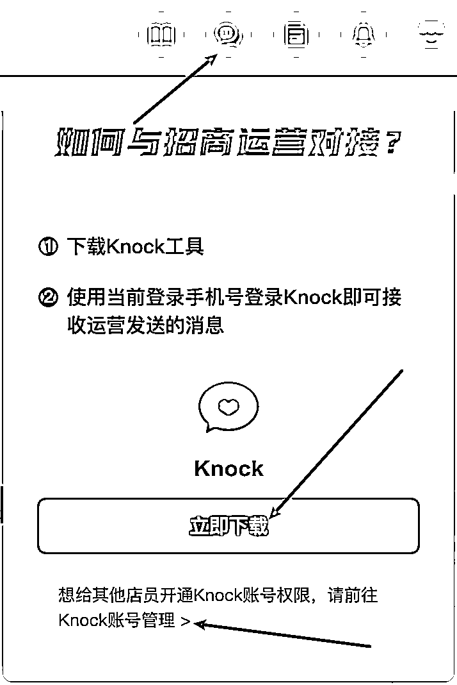  

3\. 如何上架商品并开始销售 

店铺开好后，就可以上架产品了，目前系统做的比较简单，如下： 

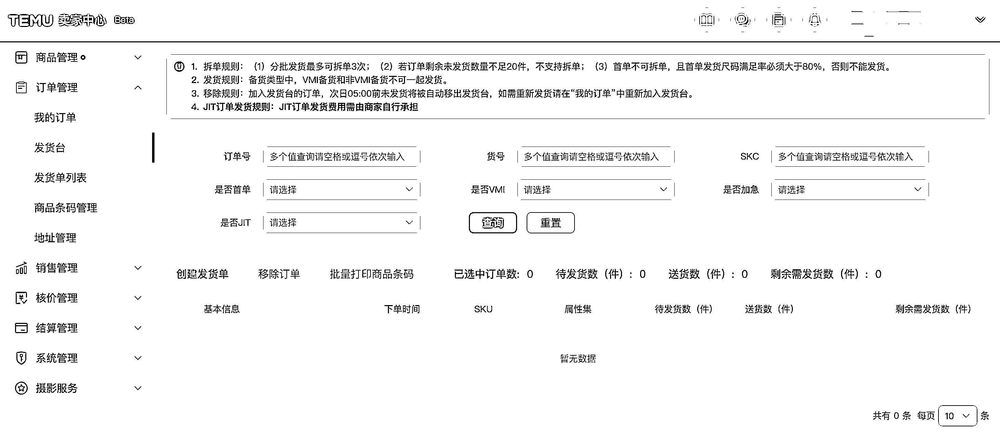  

产品上架需要经过几个流程，整个上架流程大致如下： 

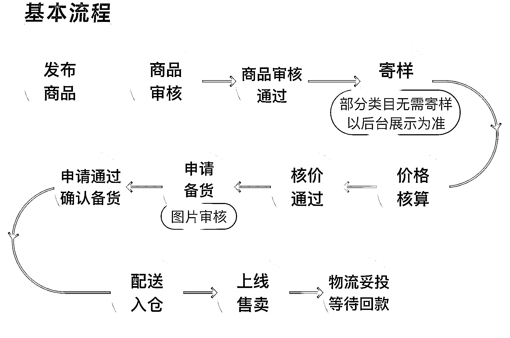  

1）发布商品：目前类目比较杂，发布商品的时候最好先跟小二确认好类目再发布，这里信息最好是一次性填准确，包括图片、标题、供货价、商品长宽高以及毛重等，否则等商品审核过后就无法修改调整了，只能重新上架或者找小二帮忙改。 

填写商品标题的时候建议直接参考亚马逊上的产品，该商品类目的主要英文引流词一定要都加进去，然后用翻译软件把取好的英文标题翻译成中文，中英文标题都填上。 

不然如果没有英文标题，拼多多那边的小二在上架产品时，可能会随便取，导致商品核心词缺失，流量很少，Temu 现在个性化推荐很弱的，大部分流量靠系统推荐的热销商品和搜关键词。 

发布商品界面如下图所示： 

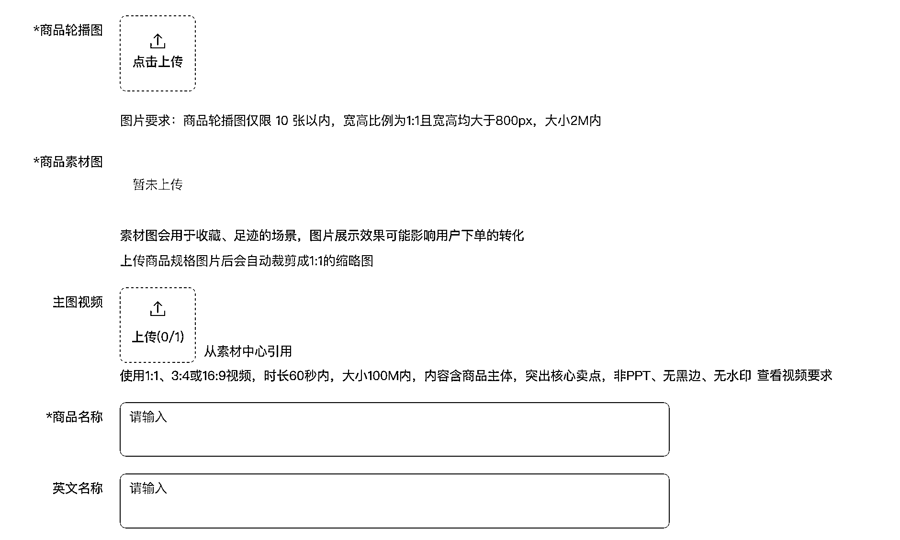  

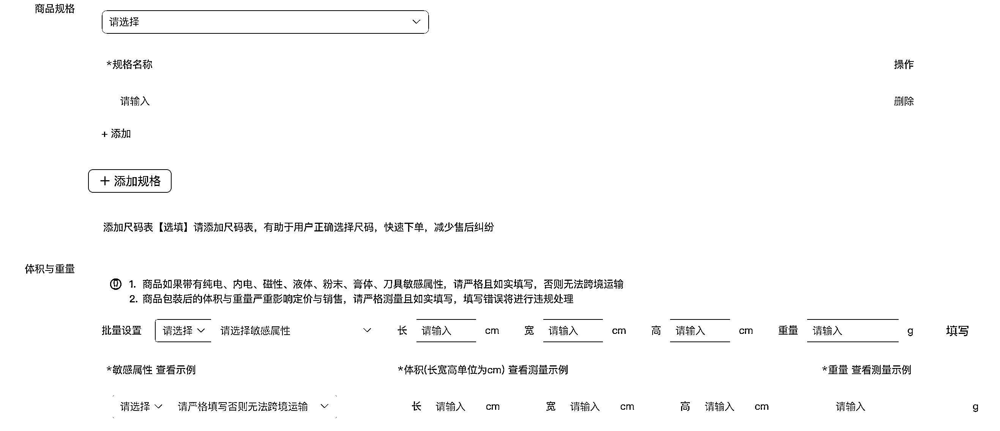  

  

2）商品审核：发布成功后商品进入选品池，等待小二审核，急的话可以直接把 SKC 发给小二催审。 

3）寄样：商品审核通过后，需要把实物寄给小二看，有时候会改成后台直接上传实物视频与图片，这个主要看小二和类目要求，如果小二太忙没时间看样品，也可能会免寄样的。 

如收到寄样要求，可以直接在后台样品管理里按要求操作就好。 

  

4）核价：小二主要会参考同款商品以及亚马逊的价格，看在商家的供货价的基础上加上运费，能否比亚马逊热销款的价格低，如果小二觉得价格高了，会议价的，到时系统后台会收到议价消息。 

5）图片审核：Temu 目前是最少 5 张最多 10 张主图+详情+sku 图+可上传主图视频的形式，主图和 sku 图要求尽量不要有牛皮癣，我们主图基本放的都是干净的场景图，把商品介绍尽量放到详情里，然后图片里不能出现亚裔面孔，文字要求是英文的，计量单位要求必须有美制，可同时展示国际计量单位，如长度需用 inch feet yard mile，重量需用 pound oz，体积用 gallon，温度用 F 等。 

6）申请备货：一般首批备货每个 SPU 申请个 20-50 个就行了，等商品卖起来后，如果动销好，后面申请备货的时候在多申请一点，这样比较稳妥，防止因为动销过差导致商品被平台下架。 

下架后商品会被退回给商家，运费需要由商家自己承担，这是一个风险点，一定要注意！目前应该是产品连续 7 天无真实销售，会被清退。 

7）产品包装要求：刚开始的时候要求包装和说明书不能是纯中文，一定要有英文，后面可能是为了加快商家上品节奏，调整成了包装接受纯中文，非复杂操作的产品说明书也接受纯中文（需小二审核），所以，如果是日常使用的家居百货产品，国内中文版的货现在也都能直接上架。 

但是我不太建议，毕竟后面平台正规化后，肯定还是会要求纯英文化的。另外像纺织品水洗唛、产品操作页面、产品操作提示音等影响消费者正常使用的位置的文字必须是英文的。 

8）配货入仓：按照自己申请的数量进行备货，然后在 Temu 后台中创建发货单，发货时填写好收货地址和收货信息，可以在后台直接预约快递上门取件，目前听说是一箱的由中通取件，超过一箱的是顺丰取件，邮费由拼多多承担。 

注意事项： 

① 每个单品都需要贴商品标签【在商品条码里可以下载商品对应的商品标签】。 

② 以 sku 维度打包，作为一个包裹，贴商品打包标签【在发货单列表里可以下载每批货的打包标签】。 

③ 商品打包标签，要和包裹内的商品一一对应，否则仓库无法收货。 

④ 多个贴好打包标签的 sku 包裹，可以让顺丰合箱发货，外箱只贴物流面单。 

⑤ 用袋子打包的商品，如袋子大小超过婴儿头部，需要有警示语，袋子本身没有警示语的，可以用热敏标签纸打印以下标语： 

WARNING：This bag is not a toy. 

To avoid danger of suffocation,keep this bag away from child under three. 

Don't use in cribs,carriages or playpens. 

大件商品袋子（大于 15cm）必须包含警示语并保留两个透气孔。 

⑥ 一定不能带干燥剂。 

⑦ 没寄样的商品，如果有吊牌/标签，一定要纯英文/中英文对照。 

⑧ 不能带有任何导流性质的卡片或者标签等，如网址、二维码、社交平台等，拼多多对引流管的是非常严的，千万不要触碰这一条。 

  

9）上线销售：货品被快递取走后，后台能看到走件信息和入仓记录，一般入仓的第二天，平台小二就会把产品上架到 Temu 北美站了，想要看自己店铺和平台商品的，可以直接从店铺后台进入，手机上目前是无法正常下载 Temu 这个 app，就算下载了，也打不开，需要科学上网才行。 

一般产品售出后，买家确认收货后的第二天，货款会被打入账户，目前拼多多走的是空运，一般 5-10 天就能配送到买家手里。 

  

Temu 首页界面如下图所示： 

  

4\. 相关注意事项 

1）关于售后：目前我们做了 2 个多月了，还没有遇到过，问过几次小二，他们也没有明确的规则，只是说：非商品质量问题导致的售后损失，全部由平台承担。 

那么相应的，如果是质量问题导致的损失，就是都由商家承担了。所以，一定要抓好品控，否则后面可能会出现较多的售后，导致较大的损失，而且目前 Temu 还支持 90 天内免费退货。 

2）关于供货价：目前平台是可以随时调整供货价的，如果商家不同意平台的议价，可能会被清退。 

随着某个产品的类目的商家越来越多，会导致该相关产品的供货价也越来越低，毕竟你不报低了，总会有人往低报，这样产品的利润会越来越少，尤其是标品类的，太好比价了。 

所以我们的重心是放在非标类的商品上，目前来看，非标类的议价会比较少，首次供货价审核过了后就都基本没议价过。 

三、如何打造出爆品 

从上线到现在 2 个多月过去，Temu 入驻的商家已多达几万个，sku 数量也高达几十万个，而 Temu 又是供货的模式，这意味着平台上已经上了的款式，还想要高价给平台供货，是绝对不可能的。 

之前我也跟小二聊过，他们会给商家预留 10%左右的利润空间，对商家中报价超过 1688 同款比较多的，直接视为没有诚意，会减少跟这类商家的合作，就算选中，也会把供货价压到跟 1688 价格差不多甚至更低。 

所以如果本身没有外贸产品，想要依靠去 1688 低价进货然后高价给 Temu 供货这种模式，会比较难，但并不意味着不能做，毕竟 1688 的价格都还可以谈，而且如果是稀缺商品，小二对价格把控的不会很严，很可能报一个相对 1688 较高的价格也能被选上。 

此外，还有一些可以定制的类目，甚至是材质不一样的商品，小二都不太好比较价格。综上，想要在 Temu 上赚钱，选品将会成为重中之重，品的好坏直接决定了它会不会成为爆品。 

那我们是如何打出一个最高日销近 5w 的爆品的呢？ 

首先，基于我们现有供应链体系，把所有有海外资质的厂家都筛选一遍，然后在有资质的厂家中，把所有有现成英文版包材的商品在筛选出来，在这些商品中优先选择： 

1）工厂有现成直接能用的英文图片的商品，保证产品转化率以及最快的上品速度； 

2）对起订量要求比较少，每个款式第一批只要拿货 50/100 个的，减少后续库存风险； 

3）客单中上，且产品价格相较于亚马逊的热卖价格带还有很大空间，意味着产品售价会有优势且利润会相对较高； 

4）Temu 上相关产品比较少，亚马逊上销量又不错的商品，意味着平台稀缺，供货价要求会没那么严，而且又有市场，前期只要选上可以躺着赚钱； 

5）在北美有热度的品类，这个需要自己去搜索查资料。举个例子：比如最近马上要开始的世界杯，那相关周边产品会不会好卖？再比如假设是欧洲市场的话，是不是可以想到最近的能源危机，那冬天保暖类的产品会不会好卖？ 

把产品筛选出来后，我们前期报的供货价一般是成本的 1.2～1.3 倍，保证毛利率平均下来能有个 25%左右，因为我们选的品基本是平台上相关产品比较少的，所以报价一般都能通过，如果是平台上已经铺了很多的产品，想要有这么高毛利率肯定是不太可能的。 

到目前为止我们已经大概上了 30 来个产品。如果能基于这套方法，铺上 10 个以上的产品，那么大概率会出现 1-2 个卖的还好的小爆品的。 

目前来看，Temu 更倾向于与源头工厂，或者有稳定低价渠道的贸易商合作，以及本身就在做国外市场的跨境电商玩家，相对而言没任何优势的纯小白商家在 Temu 上会比较难生存，最后总结一下现阶段的 Temu 适合哪些人： 

1）本身就在做跨境，有跨境产品直接拿来就可以上架卖的。 

2）本身有跨境供应链，只需要稍微整合一下，就可以上架卖的。 

3）平时时间充足，可以自己去 1688/阿里国际站上不断找相关商品和厂家的。 

4）本身在做拼多多店铺的，现在平台对商品外包装并没有做强制英文要求，可以把自己的产品图稍微翻译一下就可以上架了。 

## （59 赞）《YouTube 航海三个月后，我突破了 4000 小时观看，成功加入官方 YPP 盈利》 

大家好，我是华生。曾经在互联网圈打滚 6 年，打工与创业，横跨多个行业，遍历产品、市场、运营不同岗位，也曾在一家知名创投机构做过 2 年投后管理。19 年底辞职和老婆一起到澳洲边工作边旅行 2 年。如今两人都在台北做着不受地域限制的工作，构建自己的多元杠杆收入。 

（之前做过一次关于人生杠杆的分享：[《我如何从 1 到 N 构建多元收入，核心方法首次公开》](https://t.zsxq.com/072RJiy7a)） 

目录 

一、参加航海至今取得的成绩 

二、那么多航海，我为什么偏偏选 YouTube？ 

三、我在航行中遇到的挑战和回报 

1.  沟通挑战 

2.  定位挑战 

3.  YouTube 运营心得 

四、航海能提供的价值 

## 一、航海成绩报告 

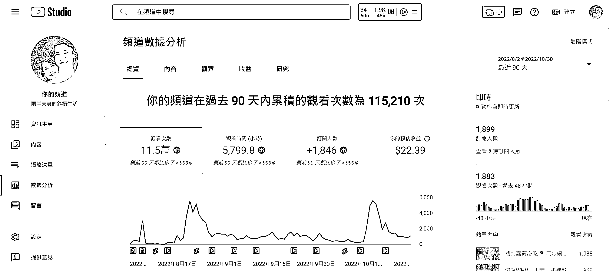  

我原本其实是一个视频新手，在参加 YouTube 的航海后至今 3 个多月时间，YouTube 频道已有 1900+粉丝，5000+观看小时数，超过开通官方广告盈利标准（1000 粉丝+近 12 个月内累计 4000 小时观看时长），目前收益还很少，十几天 30 美金。除此之外通过内容引流，还养成了 1800+粉 instagram 垂类账号，提前谈好了合作，所以起号期间也能获得一些澳洲合作方给的内容运营和客户转化收入。 

上面的粉丝数据如果是在国内的视频平台上，可能根本就是小透明，更别说和那些盈利能力超群的大佬比。但在 YouTube 这个平台上，新手要在三个月内开通盈利依然也是小概率事件。 

我在一开始并没有报这样的期望，也没有很确切的内容方向，如果没有参加航海，都不知道什么时候能真正开始录视频。所以不得不说，航海的确是新人从 0 到 1、无中生有的最佳舞台。 

## 二、我是如何决定航行方向 

在刚开始我也遇到了方向选择的问题。看过不少文章的观点说视频号、小红书还有流量红利，普通人成功的几率更大。海外的话 TikTok 也依然有些机会。但个人精力有限，是不可能报太多条线的。而且我也只想选择一条最适合自己的作为启动，所以在选方向的阶段我就犹豫了几天。 

主流的航海报名思路就是找风口和热点，所以热门赛道的报名数特别高。记得 6 月那一期总共 8000 多位船员报名（后来筛选减到 7200 多），「视频号带货」的船报名人数有 2825，而「YouTube 视频创作」只有 218，是所有船上船员最少的一个。 

从表面看，航海从 YouTube 启动要面临不少挑战，不论是从启动门槛（账号申请、网络环境、版权等），还是起号难度（广告盈利门槛、用户体量、算法规则等）来说，都要比其他国内平台高出不少。多数人选其他船似乎是理所当然的。 

但我是认为，选择航海方向最应该「从内出发」。挖掘自身具备的差异性，结合相配的外部杠杆，找到自己的最优起跑点。 

拿我自己来说，在 YouTube 这个方向上我找到三个显著的差异性： 

一是因为老婆是台湾人，我们目前住在台北，所以使用外网和后续提取收益是比较方便的。 

二是这个平台创作者的盈利规则整体上是偏长期性的，需要缓慢积累，比较适合我的价值观和风险偏好。 

三是曾经有两年在澳洲生活的经历，以及长期处于跨文化思维碰撞中，我对不同市场的差异和共通点感知更敏锐。 

基于这些考虑，我就选择了当下的最优解，放弃了其他“风口机会”。 

当然以上有些是个体差异，不容易参考。如果你也在考虑方向问题，我根据 YouTube 这个平台的特点总结了一些基本要素。符合这几个情况我认为会比较适合做 YouTube： 

1、如果你的内容方向偏流量类，比如娱乐搞笑、主流游戏、整蛊猎奇等等，后续的盈利转化比较难。或者你本就是想要吸引更多人看，依靠观看量获得主要收益。那你就比较适合 YouTube。 

因为 YouTube 的创作者广告收入比 B 站高出 5-20 倍（估算值，恰饭收入不计算在内），例如有一个或多个 10 分钟左右的视频，总共获得 100 万次观看，收入大概是 2000-4000 美金不等。当然具体还和用户的观看时长等数据相关。 

2、如果你想做的是相对小众的生活类内容，并且针对的用户年龄层在 40 岁以上，那做 YouTube 成功的概率或许比 B 站高。 

因为 Y 平台的整体用户年龄层比 B 站要高，风格偏好的差别也很大。并且推荐算法侧重点不同。例如 B 站主页推的大多是新视频，火过之后凉了就凉了。而 YouTube 的内容还会根据反馈数据的变化重新开始推荐，因此优质的老视频可能获得更持久的回报。 

3、如果你做的内容在 B 站上会因为一些特色原因频繁遭到审核拒播（不是指黄赌毒，也不是版权问题，这些在 Youtube 也不行），但是内容是优质的，就可以考虑试试 YouTube。因为两个平台内容监管的方向不太一样。 

## 三、我在航行中遇到的挑战和回报 

### 沟通挑战 

做内容最大的挑战莫过于“定位”。 

但更难的，就是要和老婆一起确定内容定位。 

因为账号是两人一起经营，但我们对内容和运营的认知很不一样，性格特点也相差很大。她喜欢快，我偏向稳。她想要有趣和精致，我关注价值和实用。 

当我们对一个选题策划意见不统一时，从讨论大纲到对逐字稿，从现场录制对台词到后期剪辑，每一个环节都可能面临争论甚至争吵。 

这些如果你是一个人做内容，是不一定会遇到。但等发展到一定程度，只要涉及到团队协作，都会需要在沟通上耗费不少时间精力。毕竟最容易搞定的是事，最难搞定的是人。 

而且在伴侣关系里，以前掌握的那些企业管理方法，到了夫妻之间多半都不管用。你要一根筋乱用方法论，反而容易引发负面循环（血泪教训）。 

拿几个例子来说，像是我觉得某一类的选题比较好，也符合我们的定位，但她会觉得不符合，怎么说都说不通。 

因为在沟通的过程中，讨论很难在同一个层面上进行。只要一个词用得不对，就容易延展到另外的事情，然后就逐渐变成了某人的态度问题（有过对象的人应该都懂）。 

那怎么办呢？我的解决方法就是要先动之以情，了解她真正关心的是什么。如果她说的有道理，那就先接受，然后表示之后会这样做。顺着她的思路先让整个对话的情绪平缓下来。再找机会晓之以理，争取她的支持。 

像有时她定了一些主题可能不会和我商量，直接写好了文稿和分工让我准备讲。那这时候即使我判断这个选题不行，也不好直接否定。于是只能调整好心态，接纳这些不确定，心甘情愿投入时间、精力去试错。 

毕竟夫妻之间的感情更重要，偶尔做一些超出控制的事情也是有意义的。 

另外，做内容要定期更新总会让人产生焦虑。产出不顺畅的时候，人就容易怀疑当初的目标和方式方法，让两个人的分歧变得更多。 

那我们解决这个问题的方法，就是尝试借助第三方专业人士的力量。比如找专门做 OKR 的朋友来帮我们梳理共同目标和关键成果。 

虽然我自己也能做，但和伴侣往往是道理讲不清的。请第三方来代为表述就可以避免内耗，也能更快拉齐认知，提高效率。 

这个方法也可能适用于亲密关系中的其他事。 

### 定位挑战 

沟通更顺畅了，还得回头来解决内容方向的问题。 

我们刚开始是确定做「伴侣共同成长」相关的口播视频，分享两性沟通、学习成长，还有两岸文化差异相关的内容。但做了几期发现成效并不好。而且常常不知道下一期能做什么选题，没有连贯性。 

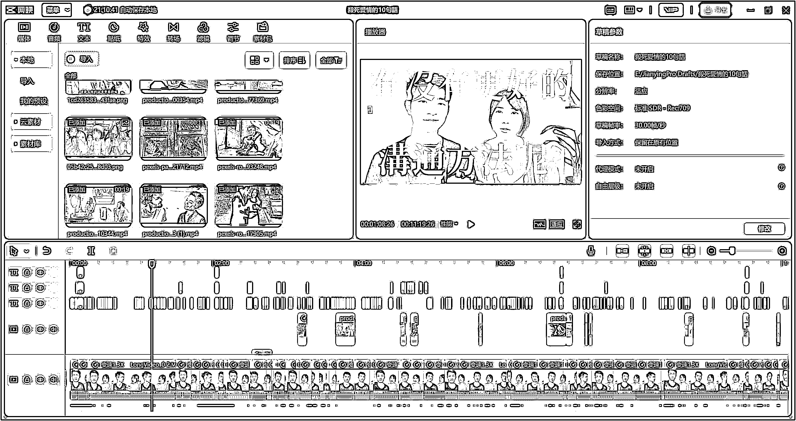  

（第二支剪辑的影片，花了 10 小时以上，到现在观看数也只有几百） 

后来我发现，其实很多人都是在「对定位足够满意」和「能持续产出相应内容」之间找不到平衡——定位太高做不出内容，定位太低觉得没价值不想做。 

在那时我们先分析了当前首要目标：主要是先实现第一个里程碑积累 1000 个粉丝和 4000 小时观看时长。 

所以我们需要做能产生大量播放的中长视频，必须先扩大内容范围： 

1、看一下市场上比较容易起量的「通货型内容」是什么，做这些用来积累观看时长。 

2、另外找找我们能做的，而且可以比市场上内容做得更好的有哪些，这些主要用来积累粉丝数。 

因此我们就策划了后来成为主要数据支柱的两类内容——1 是台湾各地美食 Vlog，2 是澳洲打工度假干货。 

  

（开局一个多月后，第一支观看破万的影片） 

到后面就相对顺利了，随着第一支观看破万的视频诞生，粉丝数和观看小时数的增长就开始加速。9 月 1 日粉丝数到 500；9 月 8 日到 666；9 月 19 日 888；9 月 24 日破 1000…… 

  

增长说不上快，但是以我们目前只能周更的条件下，已经超过我们预期了。而且粉丝粘性和互动率还比较高，引流转化率也不错。 

  

（光是 8 月先后发布的两个视频就贡献了 3000 多小时观看时长和 1000 个订阅） 

上面这两个定位看起来相互关联不大，但面向的人群其实有很大重叠。随后我们也针对这个人群做了下一阶段的内容策划，计划一边扩大内容覆盖范围，一边强化观众对我们个人 IP 的认知。 

所以总体来说对于定位问题，我的建议是先尽自己所能做出内容，再去优化定位。 

在航海群里我发现很多船员伙伴也会卡在「内容定位」这个环节。实际上对刚入门的新手来说，定位并没有那么重要。 

绝大多数素人创作者，都是发了很长一段时间内容之后才慢慢有一个所谓的“定位”，而且随着环境和发展阶段不同，还会不断修正。 

YouTube 上有一亿多粉丝的绝对顶流 MrBeast，他的定位也调整过很多次（而且他 2012 年一开始做的那些视频也没有删，感兴趣可以去看看）。 

  

其实做自媒体任何要素的重要性都可以无限放大，因为这件事本身就是一个复杂系统。 

即使你花一百万请人给你分析出一个定位，运作过程也会受到天时、地利、人和，还有黑天鹅的影响。还不如你自己在实战中摸索出来的方向，往往才是最具备反脆弱性的。 

### YouTube 运营三个月，有哪些不得不分享的心得？ 

开始时我并不觉得 YouTube 运营有多特别，之前也看了很多相关的文章、视频，总觉得应该很了解这个过程了。但是到实际做的时候才发觉，很多细节我自己还是无法判断。 

标题长度最好少于多少字、封面缩图文字怎么放、关键词要设置多少个…很多问题我都从生财为我们准备的航海手册中得到了答案。 

除此之外也发现了很多手册上没有的问题，像是灯光、录音这类器材配备，还有剪辑所需要的 Broll 素材、音乐版权，以及更重要的选题和剪辑风格等等。这些都是真实的「用户需求」（也是潜在的商业机会），都要靠实战才能发现。 

我花了大量时间去搜寻学习，最终一个个搞清楚了。过程中踩过一些坑，也收获了不少经验。 

以下是我认为比较关键的两个坑，希望大家能绕过去： 

1\. 一开始我觉得要做别人都没做过的内容才有价值，但做的时候遇到很多阻碍其实证明了自己还没有这个能力。 

基本功都不牢靠还想自创武功，有点太自以为是了。 

充分学习一个成熟的作品，最终像模像样地拍出来、剪出来，这个过程就是建立自己内容创作的能力根基。有了“肌肉记忆”之后，再去做自己想要的创新，会更加游刃有余。 

分享一些我筛选过优质 YouTube 运营账号和视频供大家参考： 

1.  How To Vlog and Be a Better Storyteller（英文）：[https://youtu.be/KdsWzPMCv7w](https://youtu.be/KdsWzPMCv7w) 

1.  创造超过 50 亿次视频观看量的 Hillier Smith 分享火爆视频的生产秘籍（中文）：[https://youtu.be/acOHhoZXqio](https://youtu.be/acOHhoZXqio) 

1.  DO THIS For Epic YouTube Views In 2023（英文）：[https://youtu.be/ePrFTUC3Ibo](https://youtu.be/ePrFTUC3Ibo) 

1.  Lighting for YouTube Videos - Make Your Videos STAND OUT!（英文）：[https://youtu.be/IXe3rEWrDVg](https://youtu.be/IXe3rEWrDVg) 

2\. 还有一个坑是，中间我花了很多时间在 SEO 关键词优化、分析怎样提高已推送视频的表现，后来才发觉这些对于一个 YouTube 视频能起到的作用很小。 

  

其实视频表现不是单一因素能左右的，而是有很复杂的因素影响。 

例如视频选题在内容市场上的受众量级、封面和标题的设定、推送的时间节点上发生了什么事情、观众的观看习惯、和你同类的内容他们的数据表现情况等等，很多因素会影响一个视频数据的波动，相对来说是混沌的状态。 

而且 YouTube 上的视频有很强的长尾效应，好的内容可能几周后，几个月后才开始被算法大量推送。平时我们也能看到很多三四年之后还在不断被推荐的视频。所以总体来说，不用太执着于“技术分析”。 

此外还有一些，我认为刚开始经营 YouTube 很需要知道的经验，同样想开始做视频内容的也可以参考看看。 

#### （一）器材怎么准备？ 

1、有能拍 1080P 的手机就先用手机拍，尽量用后置摄像头。虽然画质和单反有差距，但是便捷而且上手门槛低。这就可以覆盖很多缺点。 

2、如果你是拍室内口播类视频，拍摄地固定的情况下，可以优先投资灯光。不用花很多，基础的一个侧面斜上方约 45 度主光源（200 左右），一个辅助轮廓辅助（100 左右），再一个氛围灯要不要无所谓（100 左右）。500 以内入门足以。 

3、如果你的拍摄地不固定，那就先解决收音。手机或单反自带的收音在嘈杂环境下不太行。安静环境下也不如最便宜的指向性麦。如果拍摄环境复杂，又想突出人声、避免干扰，配无线麦是最方便。预算够可以上大疆或罗德，预算不多直接 T 宝 J 东买直连手机的基本款凑合用，300 以下大多是无牌差别不大。省点比价时间，早点赚到钱直接升级换代。 

#### （二）剪辑有哪些重点？ 

1、有经验的就用常用软件，没经验的建议直接用剪映开始做。不要花时间去学 PR/AE/达芬奇。虽然效果有差别，但那是 80 分以上的差距。开始阶段更需要解决的是选题、视角、故事结构这些内核。 

2、素材一定要用没有版权隐患的可商用素材。YouTube 版权监测挺严格的，B 站这类之后预计也会逐步收紧。 

网上不用付费的好素材是不多，音乐类 YouTube 有官方免版权音乐库，选择不多勉强凑活。其他 SoundCloud 这类网站也可以，但使用范围要看清楚。另外要是你的视频非常需要配乐，那也可以考虑在 EpidemicSound 这类网站买一些歌曲长期用。 

图片视频素材像是 Pexels、Pixabay 这类网站风格都偏西式。要是没有合适的，那就发挥自己的创意，想办法自己拍吧。其实看起来很“劣质”的 5 毛钱素材，有时候更受观众喜爱。 

3、前 30 秒的留存率很重要。在冷启动阶段不要学那些十万、百万粉的大号弄超过 5 秒的片头，也不要设计大段大段的开场介绍。开始就要抓住人留下来，因为撑过前 30 秒继续留下来的几率会大大增加。 

但好东西也不要都留在片尾，特别是视频长度 5 分钟以上的。如果你的重头戏确实就在最后，那就想办法提前展现悬念，或设计好故事结构。毕竟 YouTube 上能坚持把视频看完的观众很少，通常只有两三成。 

#### （三）想优化视频有哪些需要注意的地方？ 

1、封面缩图和标题是点击率的关键，并且封面>标题。 

封面和标题在发布后也是可以改的。我亲身测试过并不会出现改了之后 YouTube 明显限流的问题。甚至有不少我把封面/标题重新优化后，数据出现明显上升的情况。所以你可以多测试不同风格，根据数据反馈来优化。 

2、自己后期加的标签关键词不太重要，重要的是标题、CC 字幕和你视频里的真实内容「关键词」。 

AI 算法已经很厉害，它会从你的视频里识别出你讲的内容，用来和观众的标签属性匹配。所以人为设定大量的无关关键词并不能起到引流作用。而且我也看过很多账号的热门内容完全不设置标签这一项，依然能获得大量推荐。花太多时间在这里不值得。 

3、其实视频发出之后除非为了测试和分析，否则就不要执着于旧视频的数据表现了。 

一个视频即使你觉得很好，但它就是没有火。那只用找出你对可能原因的假设，之后把关注点放在怎么拍好下一支，尽力在新的视频中去验证。毕竟这就是这个战场上的游戏规则。 

## 四、航海能提供什么价值——行动的三要素 

最后，报名参加航海的意义又是什么呢？如果都决定要做了，直接开始不就好了吗？ 

现实情况是并非所有人都能想到就做，特别对于那些思维审慎、习惯了三思后行的人来说（像我自己就是），有一些因素总会来阻扰我们的行动。 

简单来说一个人要开始做一件事，通常需要脑、心、手三者合一。 

这对应的就是「认知、愿力与能力」（也可以用「动机、动力与方法」来理解，模型不同，本质类似）。 

当初我是忙于自己的主要工作，但有个认知，知道做 YouTube 视频是我们商业模式中必须要突破的一环，所以一直准备做视频，也都在关注和学习技能，具备内容制作、剪辑的能力，但就是无法走出自己拍视频的第一步。 

在 6 月份新生财年第一次航海开启的时候，我觉得不能再拖了，所以解决方式就是立刻报名交了押金，同时在之前经营的 ins 上预告我们要开 YouTube。 

用时间压力+粉丝压力，先把「恐惧感」拉起来。这件事的优先级就自动排到了前面。 

然后抓紧时间学习，想办法做出些内容获得反馈，这样「愉悦感」也能提起来。慢慢一来二去就创造了正向的增强回路。 

所以如果你也同样还没跨出自己的第一步，需要一些「愿力加成」，那参加航海可能会给你一个非常有力的“推进器”。更多惊喜和感动我就不剧透了，相信你在过程中会有更深刻的体会。 

以上就是我这次总结的全部内容了。航海靠岸也并非是结束，而是标志着自己小船的远航正式开始。 

最后的最后，特别感谢自己的老婆！感谢本期航海我的组长阿喂、志愿者 yh 的无私付出！还有感谢鼓励我写出这篇分享的静伟哥和肉松，以及众位 YouTube 视频创作航海的船员伙伴们！包括看到这里的你！多谢鼓励！海上再见！ 

## （26 赞）《分享一下关于 TikTok 新手几种变现相对容易的方式，以及市场上比较火的无人直播的几种玩法和问题》 

我是 20 年 10 月份在抖音上刷到 tiktok，当时觉得这个方向挺好的，便到深圳花钱学习，当时学的是下载、剪辑和注册，之后半年主要是做短视频带货，也做了培训，但是那个时候各个国家都还没有小黄车，变现途径只能依靠爆款视频，视频不爆就没有变现，很不稳定，所以只是关注这条线，并没有投入太多精力 回到威海后就接触到 coupang，因为 coupang 是去年刚对中国卖家开放，当时效果非常好，出单比较快，利润也比较不错，我们就投入很大去做 coupang，招商、培训和自运营都有做 但是到了今年，coupang 和亚马逊一样，也要求有一定的备货，难度提升，我们就相应地弱化了培训，业务大部分都集中到自营方面 

21 年的时候，tiktok 在全球的小店陆续开放了，能直播带货了，我们就开始做 tiktok，先是做了一个短视频带货团队，后来又搭了一个韩国直播间，上个月看到深圳有人做无人直播，我们自己也做测试，并且跑通了 我觉得，目前市场上 tiktok 比较主流的变现方式有六种：1\. 短视频带货 2\. 直播 3\. 私域聊单 4\. cpa cps 5\. 公会 6\. 店群 （小店） 

短视频的操作方式主要三种，一种是精细化剪辑，二是通过软件批量操作，比如说 PR 裂变这种模板，或者其他一些自动化剪辑的软件，这两种的区别是，前一种视频效果更好，更容易出爆款，而且能做评论区维护、视频引导等，后一种更多是靠批量做流量，很难去做精细化操作。第三种是通过硬改设备操作，这种做法可以大大降低人工成本。 

短视频的链路，也就是它主要的转化方向：一种是引流到独立站，一种是引流到小店，三是引流到平台，四是引流到私域。目前效果最好的是小店，像是东南亚，通过 MCN 开的有电商权限的零粉丝账号，基本上视频播放量在几百到一千左右就能出单 

无人直播这种方式，现在不管是视频号、抖音还是快手，都还有人在做，而 tiktok 现在是处于无人直播的早期阶段，所以说我们把国内的一些玩法拿过来的话，它是可以做的 

目前市场上无人直播主要有三种形式，一种是用 4K 屏，你可以理解成手机对着 4K 屏直接播。为什么要用 4K 屏？因为正常电脑屏幕有波浪纹，它的像素很不清晰，效果不好还是其次，关键是很容易看出来是录播的，会被判成录播违规，用 4K 屏的话就会稍微好一些，但也还是存在被识别录播风险 

第二种是直播手机，现在市场上很多在卖 tiktok 无人直播手机，目前主流的有小米 8、谷歌 3 以及 VIVO 这么几种机型，这几个机型我们都测试过，时间短的仅仅十分钟，直播间就不见人了，慢的话跑个十天半个月的也就不行了。其实这种卖手机的，做的就是一锤子的买卖，因为他卖的是硬件，而 tiktok 的规则虽然还没有那么成熟，但他的风控团队能力还是有的，技术底层是有的，他能很容易就识别出你的手机是如何去改的，从而把你给揪出来 

第三种方式就是我们这种方式，就是 obs 推流，obs 推流的前提是你要有一个 mcn，mcn 的作用在于两个方面，第一零粉丝零作品的账号可以直接帮你开购物车，这样的话你的零作品的账号就可以直接开启电商权限，也就是发视频或者直播的时候，左下角有小黄车，而且你也可以从精选联盟里面去带货，第二我们会跟官方对接，开启 obs 权限，这样就可以用电脑进行推流，然后我们就可以把录制好的素材推送到手机上，挂上小黄车，去精选联盟里面找货，这样的话你不用囤货也不用发货，你去带别人的货拿佣金就可以了，退换货也没有损耗，需要的只是一部手机一台电脑，而且你白天找视频素材，晚上挂机开播，都不用管， 

目前我们基本一个员工 2-3 个号，电脑二手的 成本在 1500 上下，手机是苹果的二手的，600-800 一部。 这个方式就跟目前国内多数做无人直播的团队的底层逻辑是一样的。现在国内无人直播多数也是用 obs 推流，但是国内抖音规则比较成熟、死号率比较高，再加上国内抖音想开小黄车需要交保证金，所以挺难做。目前 tiktok 也会有一些违规情况，常见的就是录播，停止直播间 10 分钟，下电商权限（被你搬运的博主举报，官方给你下了）。整体管控还不算很严，但官方调整速度是很快的，所以要不断测试新的玩法。 

成本方面，无人直播手机的出厂成本在 600 块左右，市场价能卖到 1000 到 2000，但是正如前面所说，tiktok 的风控比较严格，一旦风控，直播间大概率就会不进人了，直播不进人，这个手机就废掉了，而卖手机的也不会去给你做售后，这种情况非常普遍，所以说硬改设备我不建议尝试，我有个朋友，买了五六十部谷歌 3 手机，刚开始没有问题，后来风控，直播间进不去，卖手机的也不给解决，这个事情最后也就不了了之 

此外，做无人直播对网络的要求很高，直播间一旦卡顿，在线人数很快就下去了，再想拉回来就难了。 

网络取决于两点，一是当地的 WIFI，也就是咱们说说的电信线路，第二就是节点，在节点的选择上，我们也是测过很多，最后找到一个相对比较稳定的节点，没有特别好的方法，只能去测 

对应的门槛就是提现，因为它的提现要通过小店或者 MCN，包括账号的权限，都需要通过官方，所以它需要有一定的官方资源才可以做。当然市场上也会有一些服务商，提供代开 MCN，代开各种账号等服务 

其实现在 tiktok 在培训圈基本就三种，一种是教短视频的，这个说白了，视频不爆就很难有理想的预期，第二种教店群，主要是通过软件去邀约达人，这种方式我觉得还比较长久，它跟国内的路线也差不多，但目前遇到的问题是，大家都在做店群，它的门槛提高了，现在做店群就需要交保证金了，此外只要做过电商的都知道，做店群是必死的，早早晚晚的事儿。tiktok 发展的特别快，现在跨境店已经要交保证金了，而且经常封店，所以店群是玩不久的。再就是所有人都在邀约达人，这些达人都已经被邀约得疲了，以致于现在达人的效果也比较差。 

公会我不是特别了解，但是我根据从朋友那里得到的信息，我感觉今年比去年的门槛提升了很多，之前做中东确实很赚钱，我郑州一个朋友做公会，10 多个人团队，一个月净利润 100+ 

直播的情况，咱们生财里面很多做这方面的朋友我也都认识，我们自己也有直播间，现在直播的问题英国就不用讲了，东南亚还好，东南亚是有利润的，但是如果你不能飞去东南亚，不能在本土做，你在国内的话问题就很大，主要是东南亚的主播很难招，而且即使你招到了，他也没有在本地的竞争力大，也就是说在国内的运营和在本土的运营差别还是蛮大的，而且人工工资也是一个大头，我有个朋友在菲律宾现在直播间一天卖一万多，他的主播工资一天才 90，国内是没法比的。我们目前韩国，日本，美国三个卖货直播间，说实话没什么利润，走独立站积累私域做长线，因为都是做正品。 

总结一下，我觉得，如果新手去做，无人直播和店群，再加上短视频，这三种方式算是目前 tiktok 能看到效果的而且落地比较简单的。私域的打法适合黑五和 F 牌，有资源的可以玩，市场上也有无人直播结合聊单卖 F 的。 希望能和 tk 有官方资源的，海外货盘的，以及一线实战的朋友多沟通交流。 

## （22 赞）《单直播间日进 800 美金-小时均 100 美金，价值 8800 可矩阵的 TikTok 娱乐直播项目》 

不卖关子，目前国内 tiktok 娱乐直播业界大火的睡播是我 6 月份开发的。 

最近有朋友告诉我，有人在卖这套方案，价格 8800。就这？8800？有点实在看不下去了。遂公开，大家不要被骗，因为你可能买来也不一定赚钱。 

从 7 月底被我合伙人一不小心公开项目，到目前为止，我周边朋友和各种渠道加入的直播间差不多 20-30 个，加上被中国人带了节奏的某些国家（比如日本拉美）的老外，也加入了进来 10 个左右，不过玩法都还没有突破我早期开发的样板，尽管这样，大多直播间都能小时 50-100 美金，在线峰值最高达 4 万，常态在线数据数千，比起长达 1.5 个月回款期峰值几十数百的带货直播间，下播即时到账，一场 1000 粉丝，可以批量复制的娱乐直播，凭什么不值得做呢？ 

详情请移步飞书 

[https://sbu67xqbm4.feishu.cn/docx/FCiidWBeJoLOT1xreYnc9Se4nOf](https://sbu67xqbm4.feishu.cn/docx/FCiidWBeJoLOT1xreYnc9Se4nOf) 

提醒： 

1、以下一些碎碎念，时间紧的同学可以直接跳到第二章。 

2、本次分享很多是我自己的观点，欢迎讨论，不喜勿喷。 

3、这篇分享的目的不是睡播，而是让更多圈友看到娱乐直播在 tiktok 上的价值，并不是只有苦哈哈的带货。 

## （17 赞）《卖 Notion 模版全攻略》 

#风向标# 卖 Notion 模版全攻略 分享一个 Notion 模版创作的 Roadmap，据说该作者靠 Notion 模版，年入$10W，而且才 19 岁。 

[https://easlo.notion.site/Notion-Template-Creator-Roadmap-c34c1a3f5d264258bbe2182df3466140#39dcb180892d416dbceaa286652418dc](https://easlo.notion.site/Notion-Template-Creator-Roadmap-c34c1a3f5d264258bbe2182df3466140#39dcb180892d416dbceaa286652418dc) 

  

### 6、实体/其他项目 

## （精华帖）（116 赞）《黄焖鸡米饭全国操盘手：从 0 到 1 做招商（基础扫盲篇） 》 

哈喽，各位生财有术的圈友们，我叫张昭，餐饮行业 16 年、招商加盟 10 年从业经验。 

招商加盟在我个人看来，是规模化增长非常有效的方法之一，这一点国内外有很多品牌都验证过了（包括线上线下，传统生意或者互联网）。 

我有很多身份，其中最具代表性的是：黄焖鸡米饭全国操盘手。没错，就是大家都熟知的黄焖鸡米饭，那个项目是我们从济南一手推向全国的。 

生财有术的圈友们在做完了最初期的单元模型测试之后，势必会走到规模化增长这一步，希望我的分享可以帮助大家构建一个可以自行运转的、越做越轻松的赚钱系统。 

现在我们正在操作的项目是帮地方政府做特色餐饮区域公用品牌产业化的事情，比方说襄阳牛肉面这个项目，就是我们正在操作的。后续还会去操作津市牛肉米粉、遵义羊肉粉之类的项目。 

从 2012 年入行做招商加盟，到今年已有 10 年时间，除了自己亲自操盘过的项目 200+以上，每年还会给不少于 200+的项目提供招商加盟方面的咨询，所以累积下来接触的项目超过了 2500+。 

今天的分享包括 5 个方面： 

1\. 招商加盟的分类，帮助大家快速了解都有哪些玩法，建立一个比较全面的认知； 

2\. 招商加盟模式的区别，帮助大家搞清楚各种模式其中的差别，选一种更适合自己的模式切进去，避免走到后期发现超出了自己的能力边界，变得力不从心； 

3\. 各种模式从 0 到 1 需要的准备工作，帮助有兴趣去尝试入行的各位圈友，尽快搞清楚各种模式的细枝末节，避免有遗漏，对后期执行造成不必要的麻烦； 

4\. 入行友情提示，算是老司机对新手小白的一个劝告和提醒，模式虽好，可不能贪得无厌； 

5\. 项目推进时间表，是我一直在使用的表格，有点类似于进度导航，按照上面的时间节奏推进各项工作，基本上可以做到得心应手。 

一、招商加盟的分类 

从严格意义上来讲，招商加盟不能算是一个行业，只能算是一种增长模式。 

这主要是区别于直营来讲。我认为的直营是用自己的钱、自己的人、干自己的事情，这些算是真正意义上的直营，其他方式都应该算作是加盟，其中包括：联营、托管、代运营等等。 

那么加盟是怎么分类的呢？ 

按照品牌方操作的难度，加盟模式一共分为四个级别六种类型：轻量级、中量级、重量级和魔鬼级。 

1\. 轻量级加盟 

轻量级加盟一般分为两种：卖技术和卖料包。这种加盟级别，一般都比较轻，对品牌方基本上没什么要求，只要你的核心技术或者料包过关，这种方式还是比较容易入行的。 

卖技术的一般都没什么品牌，手里有个技术，自己开着店，能卖一个是一个，赚的都是利润。 

不过，这种方式的弊端也很明显，就是教会徒弟饿死师傅，这在无形之中就给自己培养了很多竞争对手，所以，一般都是收割一波就换个技术继续做。没有任何行业积累。 

比方说现在抖音上很多餐饮门店、抖音大 V 都开始下场搞技术培训，甚至于比尔盖南搞起了餐饮技术培训学校，都属于卖技术的范畴。 

为了规避白热化竞争，再此基础上，有些聪明人就开始动脑子，不再传授核心技术，而选择采用“核心料包+操作手法”的方式。 

这种方式有点食品工业化的味道，但因为受限于自己的销量问题，一般都是自己弄个小作坊进行“核心料包”的生产，基本上是不符合相关生产标准的。 

这种加盟方式的投入稍微大一些，可能会增加一些非常基础的料包加工设备（电子秤、包装物料、灌装设备等），增加了部分售后服务环节，好处是可以稍微和加盟商有一定的黏性和关联度。 

既挣到了源源不断的料包分润，又能在自己升级换代了新产品后，能够让加盟商持续不断地回头学习，算是形成了一部分私域吧。 

卖料包的话，一般是你已经有店或者有明确选品目标了，才会采用的方式。 

只要你开着店，就时不时会有人上门跟你说我这儿有同类产品、甚至于同一个品牌代工厂出来的料包，比你现在用的还便宜，要不要换货试试。基本上抖音、淘宝、拼多多上面都有这样的卖料包的店铺。甚至于有时候外卖店铺的老板也会接到类似卖料包的销售电话。 

2\. 中量级加盟 

中量级加盟一般也分为两种：卖设备和卖服务。这种加盟级别，对品牌方开始有一些要求，至少看起来得像个公司的样子，否则加盟商会认为你是皮包公司，缺少信任感而不敢加盟。这时候，需要品牌方稍微有点正规运营的经验。 

卖设备的品牌方一般有两种路径： 

一种是由卖技术的品牌方进化而来，他们不再局限于做一锤子买卖，希望可以稍微升级，这时候一般会选择小吃车、多功能车的方式提供给加盟商； 

另一种是设备厂商演变而来，他们本来就擅长制作各种设备，然后从市面上找到某种品类，定向开发出设备之后，连带设备和技术一起卖给加盟商。 

这种加盟方式对品牌方的要求就慢慢开始增加，不光需要提供技术、还需要提供设备以及设备售后维护。 

一般的设备说白了，都没什么核心竞争力，从本地市场都能采购到，甚至于自己画个草图、找人也可以加工出来。 

但品牌方卖给加盟商的时候，属于捆绑销售，把技术和设备一块卖给加盟商，并用一定的话术来引导（这是公司特定研发的设备，可以确保出品的口味和稳定性）。 

事实上，真有这么多技术含量么？那可未必。比方说我们经常在路边看到的各种简易的多功能小吃车、棉花糖机，稍微上点档次的，就是一个小的面包车改造一下或者集装箱改造成档口的形式。 

卖服务的加盟模式属于一种轻资产、重经验的加盟模式。有点类似于在行或者得到的线下版本。 

一般加盟完，学完技术之后，肯定要实战。要么摆摊、要么开店。但是，很多人之前没有实际的开店经验，有点两眼一抹黑，无从下手。 

这时候，这种服务模式就上线了：不知道怎么选址，我帮你选；不知道怎么采购，我带你去；不知道怎么安排动线，我给你梳理；不知道怎么做外卖，我给你做代运营......只要你需要这样的服务，总有一些行业里面的熟手可以帮你。 

在这样的需求之下，精细化分工越来越明显，慢慢延伸出了一批细分的商业服务公司：商业选址公司、采购师、门店管理团队、外卖代运营.....比方说抖音上有专门选址的、带人卖货的、做门店促销的、运营策划的，还有各种跟经营相关的细分服务。 

中量级的加盟模式开始慢慢上难度了，对品牌方的要求也越来越高，除了前期的基础服务之外，后续的持续服务能力成了一定的壁垒。 

卖设备的品牌方会非常考量故障率，如果卖出去的设备动不动就出问题，会严重影响加盟商的收入，加盟商后续会找品牌方扯皮。 

卖服务的品牌方因为提供的是无形知识产权服务，是很难界定双方的责任边界的。比方说选址服务，一般的商业选址公司只会提供相关的数据和预估营收，当加盟商确定了该位置，事后生意不好的时候，也会产生扯皮。 

虽然双方可以在合同上进行权责利的界定，但架不住有些人不按合同办事去堵门，那就很头疼了。我见过不少这样的案例。选址方因为要出业绩，说铺面很好，结果加盟方接手之后，亏得惨不忍睹。这样的案例在这个行业比比皆是。 

3\. 重量级加盟 

重量级的加盟主要是卖品牌。但品牌和品牌之间还是有差别的，要不加盟费也不会有这么大的差距。 

按照品牌知名度划分，可以分为小微品牌、中品牌和大品牌。其中具体的划分，需要关注的维度很多，比方说：成立年限、门店数量、总部规模、融资情况、闭店率等等，就不一一列举了。 

这种加盟模式，是一个系统性工程，一般都会满足“两店一年”的基本要求，单就这一点，就会把很多所谓的品牌加盟挡在门外。 

因为，很多所谓的品牌方不具备行业经验，没办法把门店做成盈利，更何况是两家直营店和一年时间要盈利。这个难度是很大的。 

其实，两店一年这个要求，是从国外引进来的标准，距今已有 40 多年的历史了，从严格意义上来讲，这个标准早已经过时了。因为制定标准的时候，谁也不会想到我们现在的商业环境会这么的错综复杂。 

因此，我们提出了一个最新的标准： 

1）各种门店模型要测算到位（包括：商超、写字楼、街边、社区、地铁站等等）； 

2）单店模型的财务模型要健康； 

3）要实现一定范围内的区域模型验证； 

4）该区域模型的复制性和财务模型要达标。 

如果按照这个最新的标准来对标的话，国内 95%以上的品牌是无法实现的。这也正是为什么投资机构从去年开始，疯狂的关注线下连锁的原因。 

整个市场上，每年层出不穷的小品牌有很多，不胜枚举。动不动就会冒出一些新兴品牌，这里就不详细列举了。 

中品牌的话，炸串这个品类最近很多，像夸父和喜姐这两个品牌还在狂奔过程中，没有分出个大小王。大品牌的话，最近老乡鸡开始开放加盟了，不过仅限于部分地区。 

这里面必须要提醒一点：千万不要太过迷信所谓的品牌背书、明星代言、知名投资机构加持这些东西。这些东西有用吗？有用，但仅限于营销层面，对实际的门店经营来讲，帮助是有限的。 

4\. 魔鬼级加盟 

魔鬼级的加盟是最难实现的一种，我称之为卖特许权。 

说白了，就是加盟了某个品牌之后，这个品牌的特许权是可以作为资产进行转移和继承的。从这个角度来讲，就需要品牌方的品牌在公开市场具有一定的资本价值，这样的话，才有被继承的意义，否则就是白纸一张。 

有些品牌方会把特许权授权给某个大型的集团公司或者家族企业，由加盟方来负责整个市场的拓展，这种加盟不仅仅属于业务层面的合作，更多的属于股权、资本或者战略合作。当某个外资品牌想进入国内或者国内品牌需要出海，一般都会采用这种方式。 

这种方式对品牌方的要求，除了基本的业务层面以外，还需要扩充国际化视野、资本运作能力、理解文化差异等综合素质。 

比方说肯德基、麦当劳、汉堡王这些国际知名品牌，进入国内，和国内品牌做招商加盟的路径不一样。他们会找比较合适的合作伙伴，直接把国内的特许经营权一次性授权多少年。在这段时间里，由该合作伙伴进行品牌推广和市场运作，达标之后，继续合作，不达标，终止合作。 

二、模式区别对比 

上面提到的六种加盟方式，按照以下维度进行了详细对比，可以根据实际情况对号入座，看选择哪个方式更加容易上手。 

其中最核心的差别在于： 

1\. 能不能收到钱； 

2\. 能收多少钱； 

3\. 能不能持续收到钱； 

4\. 能不能越来越轻松的收到钱。 

具体展开说就是： 

1\. 有些技术/品牌有人愿意花钱去学习或者加盟，但有些技术/品牌白送都没人要； 

2\. 有些只能收个几百上千块钱，而且还是买三送一，但有些可以收到几万、几十万； 

3\. 有些就是一锤子买卖，卖一次就完了，但有些可以长期持续的收钱，只要加盟商一直在，就一直有收入； 

4\. 有些需要品牌方一直长期不断的持续服务，但有些就可以做到依赖系统和标准，慢慢做成甩手掌柜，挣钱放松两不误。 

  

三、从 0 到 1 准备工作清单 

不同的加盟模式，对品牌方的要求不同，那么总部需要提前做的准备工作也略有不同，下面就具体说说每种加盟模式，对品牌方的要求是怎么样的。 

1\. 卖技术的这种方式，是整个加盟模式里面最轻的。基本上不用太多的准备工作，只要做好以下事项即可： 

1） 核心技术 SOP 

2） 客户试吃标准 

3） 定好教学标准 

4） 定好收费标准 

5） 定好教学场地 

6） 解决获客问题 

执行路径是：加盟商通过广告或者其他途径找到品牌方，试吃产品，觉得不错，谈个价钱，如果双方都能接受，就留下学习。 

技术方面的培训时长，主要看教学难度。这个和新东方烹饪学校的培训有很大不同。新东方属于职业教育范畴，培训专业厨师，有较为系统的教学培训和实训体系，这种加盟性质的技术培训，基本上就是按照 SOP 标准去操作即可。 

培训结束后，加盟商顺利结业，至于回家之后是自己开店还是摆摊之类的，跟品牌方没有任何关系。 

好一点的技术培训，是有实体门店的，可以在店里进行实地培训和学习，还有的技术培训没有门店，就在某个教学场地下稍微培训，能做出那种味道就行。 

很多刚毕业的大学生、下岗再就业的人，一般会选择这种方式，因为门槛低、投资小，他们会通过抖音或者其他方式，找到某个技术，然后和对方确认是否能够学习。 

双方确认之后，加盟商就去当地学习，直到学成为止。一般这种方式，都会打着：实体店教学、手把手传授、包教包会的口号。 

2\. 卖料包的这种方式，也比较简单，只是需要解决料包批量化生产的事情，其他的都差不多。基本上只需要增加两个部分：料包批量生产+ 发货售后问题，即可解决。 

执行路径是：加盟商联系到品牌方→试吃产品→谈个价钱→达成合作→技术培训（只教料包使用方法）→回去开店→持续进货→品牌方发货→解决售后问题。 

这种方式一般是加盟商把店开起来之后，其他竞品为了切品牌方的市场，给加盟商提供料包或者食材的替代品。加盟商为了降低成本，或者以次充好会选择这种方式。 

还有一种是，加盟商的主营业务已经稳定或者下滑了，需要其他品类来提高营收，这时候就会从其他地方购买料包，来解决新品研发的问题。 

现在预制菜市场这么火热，从某种程度上也抢占了一部分卖料包的市场。 

3\. 卖设备和卖服务的这两种方式，基本上和第 2 种方式需要准备的工作差不多，额外增加的部分是： 设备供应链、 售后服务标准、服务交付标准、相关合同或者法律文书。 

这里面需要注意的事情是需要逐步提高法律风控意识。 

假如品牌方给加盟商提供的设备出现了意外情况，该如何规避风险？假如在提供服务的时候，双方没有界定清楚最终的交付标准，导致双方不断纠缠，这种情况下该如何解决？ 

执行路径参照上述标准执行即可，随着品牌方和加盟商之间的合作越来越深入，不可避免的会出现各种纠纷，这时候，提前做好风险把控就显得尤为重要。 

比方说大家可能都听过的一路飘香小吃车，这个卖设备的品牌做了很多年，各种多功能的小吃车都有，主要还是看用起来顺不顺手、故障率怎么样。 

如果用起来不顺手，总是出故障，那就非常影响赚钱效率了。另外，卖服务的，比方说抖音上有很多**选铺的账号，这些都算是卖细分服务的代表吧。 

卖品牌和卖特许权在需要做的准备工作上，除了某些特别需要注意的事项外，基本上一样，所以把两者放到一块说。 

接下来会从产品、获客、招商、运营、供应链、人力、财务、法务八个方面进行简单的介绍。招商加盟是一个非常严密且庞大的体系，而直营则是这个体系里面，非常小的一部分。 

1）产品 

我们说的产品，是指整个招商加盟的项目，而不是某个具体的类别。打个简单的比方：黄焖鸡米饭加盟项目是我们的产品，而那个砂锅鸡+米饭的组合只是这个项目里面一个套餐组合而已。 

打造一个好的产品，需要先解决单店模型的问题，等到单店模型跑通之后，再开始批量化复制，实现规模化增长。 

执行路径是：想个好点子（选个好的品类）→起个好名字（品牌命名）→编个好故事（品牌故事）→建个好模子（LOGO&VIS）→找个好铺子（选址模型）→开个好店子（单店模型）。 

想个好点子，不是让你拍脑袋闭门造车，而应该时刻关注市场发展动态，根据实际调研，确定下场的方向。 

比方说最近肥肠这个品类市场反响不错，觉得是有一定的机会可以做起来，就着手调研市场。调研的维度有一般包括：用户需求、消费场景、潜在加盟商、竞争对手、供应链、市场环境、行业规模、未来走势、投资风向等等，确保整个商业逻辑闭环的完整性。 

俗话说：好的开始是成功的一半。好的名字，甚至可以直接决定一个项目的生死。这句话该怎么理解呢？ 

无论是用户还是加盟商，知道一个项目，大概率是从项目名字开始的。当听说了某个项目名字之后，是否有足够的冲动去尝试，尝试之后口口相传的时候，是不是很麻烦，就决定了能否形成裂变。 

所以，好的名字，听得懂、记得住、好理解、易传播，就比较容易扩散并形成一定的口碑，反之，如果一个名字特别拗口、记不住，那传播起来就会比较麻烦，至少在市场推广方面，比较费钱。 

因此形成了一个公式：好的名字=低触达成本+低理解成本+低记忆成本+好体验理由+低传播成本+好的延展空间。 

举例说明：今天某个地方引入了一个新的项目，这时候品牌方会做第一波广告，来触达用户。如果项目名字比较容易理解，那么相应的广告成本就会降低，触达用户的成本也会同步降低。 

比方说，西贝莜面村这个品牌，其实就有点难度。我们如果只是听的话，很可能会把“莜面”等同成“油面”，顺便也就理解成了“油泼面”，这样的话，就直接把整个品类给搞混了。 

另外，“莜面”这个字在有些地方不常见，有些人不认识这个字，所以为了触达用户，一般都在视频广告上加一个汉语拼音，这在无形之中就增加了触达成本。（因为广告投放渠道中，车载广播的投放成本就会增加） 

用户对一个品牌名称的理解是这样的过程：先听到名字，然后调用自己的现存的知识体系来映照这个名字，如果能够理解并形成比较鲜明的类比关系，那么就会很容易认同这个品牌，如果形成理解有难度，那对品牌的认同感就会下降。这就是无形之中的理解成本。 

有些品牌起的特别内涵，特别文艺，看到了之后，总也不知道具体提供的产品或者服务是什么，这时候就会劝退一部分用户。比方说川炎鼎这个品牌，你的第一反应是做什么的？可能是做川菜的，因为有川，可能是做火锅的，因为有鼎。结果它是做针灸和推拿按摩的。这理解起来就太困难了。 

好的品牌名字是要在用户心智里面占有一席之地的，让用户记得越牢越好。没两天忘记了，那前期的成本就白付出了。 

所以，这个名字一定要好记，或者尽量简短有力。能用两个字的就别三个字，每多一个字，就会抢占用户的记忆内存。 

我们有时候会出现这种情况，上次我们去的什么什么地方来着？挺好吃的、挺好玩儿的，就是记不住。这就是因为名字不好记，结果只记住了体验，没记住品牌，后续传播的时候，就打折扣了。 

好的体验理由主要是让用户自己说服自己，去突破第一次试错的心理防线。对新生事物，任何人都是有恐惧心理的，只是大小的区别罢了。 

这时候，一个好的名字就会让用户从众多选择里面，更有倾向性的去选择。比方说，同样都是做牛蛙这个项目，一个品牌叫顶呱呱香辣牛蛙，另一个叫辣的跳跳高牛蛙，你选择哪个品牌的概率更大？ 

当用户对一个品牌有了认知，有强烈的分享欲望，这时候如果品牌名字很难被解读给别人听的话，用户就会失去分享欲望。 

比方说：我昨天吃了一个拿破仑蛋糕，非常好吃，但那个店的名字我记不住了，真的特别好吃。要不下次我带你去吧。结果，我忙忘记了，这个事就没有下次了。 

好的名字只是项目营销的起点，一定要尽可能的给后续的各项工作预留好接口：slogan 好不好写、LOGO 设计的丰富度是否足够、品牌故事是否方便打造、VIS 是否能够设计的和品牌调性相关，总之，后续的工作在品牌命名定下的那一刻开始，就基本上已经定型了，所以，好的品牌名要有足够的开放性。 

综上所述，好的名字需要满足以下基本条件： 

① 最好有品类属性，直接告诉别人你是干嘛的； 

② 名字越短越好； 

③ 不要使用生僻字或不常见的字； 

④ 名字最好和品类属性有关联度，有一定的文化积淀的关联度，便于联想和记忆； 

⑤ 给用户去体验的理由； 

⑥ 最好有点押韵，读起来朗朗上口； 

⑦ 方便后续二次延展创作。上面的条件能够同时满足的比较少，能够满足 5 条以上的，基本上就算是个好的品牌名字了。 

比方说最近非常这个品类不错，所以想做个烤肥肠的品牌，品牌名字就叫：肥肠不可。 

起这个名字主要是三个考虑： 

① 做的就是烤肥肠； 

② 名字很短； 

③ 全都是常见字； 

④ 和“非尝不可”是谐音，告诉用户不得不消费的理由； 

⑤ 有点像常见的成语，非常容易反复记忆； 

⑥ 给后续营销留下口子：非常肥肠，非吃不可。 

接下来就是打造品牌故事： 

① 某某地方的特色美食； 

② 传了多少代的配方； 

③ 精选哪个品种的猪、哪个部位的食材； 

④ 用了什么制作工艺加工而成...... 

之前给襄阳当地的一个公司做项目咨询，该公司准备做一个锅盔类的地方特色小吃。因为锅盔这个品类是个比较常见的品类，且没有特别明确的发源地属性。 

这时候，品牌故事的打造就非常关键了，甚至有可能在用户心智中埋下一个种子：这个品类就是在这个地方起源的，其他地方都是后来者。 

所以，这时候追根溯源、发掘历史关联度就很重要了。 

最后大概的思路是：襄阳建城 2800 多年，一直都是兵家必争之地，锅盔这种食物在古代是行军打仗必备的军粮。所以，起源的时间是很早的。经过多年的传承，一个火头军把这个产品流传了下来。后来经过不断的改良，成为了今天的网红美食——大饼小匠精肉锅盔。 

然后是 LOGO 和 VIS 设计。为了贴近现在的年轻消费群体，当下基本上都是采用国潮风的设计，这个有专业的公司可以提供全套服务，就不展开说了。 

剩下的就是开个样板店，然后通过真的假的（假的方式有很多：线下雇人排队、霸王餐、抖音团购等等，线上就是通过刷单、满减、免配送等等做成 10000+单店）方式，把生意炒做起来，就可以开始筹划招商了。 

单店模型跑通，只是完成了产品打造的第一步，接下来要构建区域模型，等到满足了“两店一年”的要求之后，才可以正式开启加盟。 

在时间方面等不及的品牌方会采用规避加盟字眼，以提供技术培训、品牌使用等方式给加盟商提供服务。这种方式在之前还是有效，但现在法律也开始逐步完善，不再单独看法律条款的描述，而看双方合作的事实究竟是什么，到最后也会有被判定为招商加盟的可能性。 

在开放加盟之前，需要从直营的视角转换成加盟的视角，对产品进一步升级：我把项目卖给加盟商，招商政策是怎么制定的？双方的权责利怎么划分？如何管控？加盟商的投入产出怎样？回报率如何... 

这一切都需要在开放加盟之前确定清楚。否则，加盟商上门之后，品牌方会破绽百出，让加盟商失去信任，从而错失合作的机会。 

2）获客方式 

当产品打磨完成，正式推向市场，就需要开始解决获客问题。一般的获客方式有自然流量、付费推广、转介绍、数据共享等。 

① 自然流量包括终端消费者转化、400 电话、品牌官网等等； 

② 付费推广包括新媒体（两微一抖一红书）、达人项目分享、创业电视解决、搜索引擎、联展平台、电视广告、报纸广告、58 赶集、本地生活网等； 

③ 转介绍包括成交客户转介绍、未成交客户转介绍、其他转介绍等。 

④ 数据共享包括买客户数据、代招商公司数据清洗等。 

3）招商 

招商环节可以分为电销、会销、地推等方式。不同的行业适用的招商方式是不同的。 

比方说餐饮行业一般采用电销，可以有效解决客户时效性的问题。 

教育、酒水等单笔成交金额较大的行业，一般采用会销的方式，需要营造一个场域，把加盟商说的上头了，才能冲动性成交；互联网行业一般采用地推的方式，这和行业属性、产品特性以及擅长的打法有关。 

在招商环节，需要解决四个方面的问题：招商话术、合作政策、业务流程、销售打法。 

① 招商话术一般有 5 部分组成：开场白、产品介绍、挖掘需求、异议处理、促邀约/成交。 

② 合作政策一般分为长期政策和短期政策。长期政策是以年为单位制定的合作政策，短期政策一般是为了促进加盟商成交而另行制定的短时有效的销售政策。 

③ 业务流程一般是指招商内部的运作流程、各部门间的协同配合，目的是规避内耗、提高客户流转速度、提高成交率； 

④ 促邀约/成交是为了确保客户可以在兴趣期内能够更深入的了解项目，加深印象，直到最终成交为止。 

招商环节可以理解成是销售环节，这个环节直接决定了项目的 ROI 指标，上述只是进行了简单拆解，事实上要比这个复杂很多倍。 

4）运营 

到了运营环节，意味着加盟商已经成交了。这个环节的工作质量直接决定了加盟商是否能够挣到钱、公司能否从供应链上源源不断的挣到钱以及闭店率这个最重要的指标。 

运营按照服务阶段分为前中后三个部分： 

前期：选址、评估、测量、设计、装修、设备、动线、培训、试营业、达标...... 

中期：业务推进、员工考核、标准落实、数据分析、客情维护、打造社群、市场开发...... 

后期：定期巡店、标准监控、业绩奖惩、产品更新、营销升级、流程优化、市场反馈...... 

5）供应链 

供应链在当下的招商加盟中扮演的角色越来越重要，这是实现对加盟商管控中，最直接有效的部分（整个加盟商管控体系是一个综合的事情，需要从各个方面去设计，只是供应链这个部分最直接、最有效，所以占的权重比较大）。 

供应链部分从前到后可能牵扯到的环节包括：装修材料、软装设计、营销物料、锅碗瓢盆、烹调设备、桌椅板凳、收银系统、核心料包、原料食材、一次性用品、外卖推广...... 

只要是能够想到的部分，只要品牌方有能力，这些都可以划归到供应链板块。 

供应链一方面可以加强对加盟商的管控，另一方面可以提高品牌方的盈利水平，所以品牌方对这个部分看的很重。但供应链的部分，事实上也会存在一些问题：食品安全、设备售后、数据安全、门店营收水平...... 

这个世界的原则是：硬币是有两面的，当品牌方想挣钱的时候，就要承担相应的责任和风险。 

6）人力 

在人力方面，需要按照上述提到的职能去严格规划组织架构，确保每个版块都有专门的部分负责，避免出现业务忙去。 

其中，整个团队的核心组成部分是招商部和运营部，这两个部门的人员能够占到整个公司的 70-80%左右。 

另外，还要看品牌方对自身品牌的发展规划，是想做短线还是想做长期，招商部和运营部的人员配比从 3:1-1:1.5 不等，这一点完全取决于是否想让这个品牌长期存活下来。 

7）财务 

在财务方面，按照一般的业务处理即可，最主要看品牌方是否有严格的财务规划。 

一般来说，招商和运营板块是需要财务独立核算。招商主要核算广告投产比，后端主要核算加盟商进货贡献。除了这个部分需要注意外，还要看品牌方怎么处理加盟商的保证金。 

原则上，保证金是需要有独立账户的。这部分钱是需要在双方合作终止之后，无息返还给加盟商的。但有些品牌从一开始就没打算退还，所以，这一部分费用就直接计入利润了。 

因为有些品牌方有上市的需求，所以，会要求加盟商的门店经营流水从总部账户过，一般会设计一个到账日期，从 T+1 到 T+60 不等。这样的话，就需要品牌方关注资金使用效率、是否有被挪用风险等问题。 

除此之外，如果品牌方有上市需求，那么财务处理上要严格按照一定财务标准进行，把直营、联营、托管、加盟等等财务数据类型拆分开，避免后期工作量巨大。 

8）法务 

法务是整个体系最后一道关卡，也是一道非常重要的防线。一般有三个方面需要关注：品牌方与加盟商、品牌方与竞对、品牌方自身。 

品牌方与加盟商最集中的法律纠纷在于双方合作不顺利之后，双方的权责利如何界定的问题。每年都有很多加盟商因为生意倒闭去状告品牌方、在媒体曝光、甚至于出现堵门、跳楼等社会事件，最近最火的例子就是贤合庄事件。 

品牌方与竞对之间的纠纷，一般集中在品牌营销方面的互相抄袭上。有些品牌确实知名度不够，招商有难度，这时候就会选择抱大腿、蹭流量的方式，比方说今日油条、小放牛都是这类的代表。 

品牌方自身的风险，一般集中在经营不善、需要破产倒闭清算，加盟商、供应商如何处理。有些品牌在经营过程中，虽然开拓了部分市场，但整体仍呈现亏损状态，想选择关门，但加盟商自己投了钱，肯定不希望自己受影响，这时候处理起来比较麻烦。比方说咖啡陪你。 

以上提到的每个部分都是一个独立的课题，如果想要做好，都需要完全展开详细拆解。 

四、入行友情提醒 

最后，以我 10 年的从业经历，想给后续入行的各位提个醒，记住下面 4 点，会让你在这条路上走的更加稳健： 

1\. 发心要正。 

很多想入这行的人，初心是有问题的，看到别人靠着这种模式挣得盆满钵满，就想快点起盘搞个项目，一心想着要割韭菜，不管加盟商的死活。这个想法极其的危险，会把你带到沟里去。最近闹得沸沸扬扬的贤合庄事件，就是这样。 

一开始，贤合庄是没有搞起来的，但被操盘手看到了之后，经过重新包装，又推向了市场。利用明星效应，确实撸到了一波钱，但这个事件背后，是各方都输了：加盟商赔的底儿掉，明星代言人失去了商业价值，操盘手自身的品牌也受到了波及和牵连。这件事情还在进一步发酵中，我们持续关注最终的结果。 

2\. 不踩红线。 

这一点尤为重要。法律是整个社会运转的最后一道防线，如果不断的去践踏，那最终后悔的一定是自己。最典型的案例是茶芝兰。这个案子出来之后，在很长的一段时间里，对江浙沪一带的招商加盟公司产生了地震般的影响。 

茶芝兰事件涉案金额达 7 个亿，最主要的方式就是挂羊头卖狗肉，打着其他知名品牌的旗号，去大肆招商，快速拓店，结果后续承诺完全没有兑现、造成加盟商大面积关店，最终该团队以触犯法律的代价被抓捕，而品牌形象代言人马伊琍也受到了不小的牵连。 

3\. 稳扎稳打。 

事实上，做招商加盟，从某种角度来讲，是产品+成功经验的复制和输出。但，很多从业人员实际上是没有相关行业的深刻积累的。 

他们跨界而来，不管是靠炒作、还是刷单，把样板店做的风生水起、热闹非凡，然后立刻开始招商加盟。他们凭着运气，在一段时间里，吃到了市场红利，开了一些门店。 

但事实上，他们跑得越快，就会发现遇到的问题越多，以他们的能力根本无法驾驭，这时候，只剩下众多门店倒闭、一地鸡毛。最近最火的就是某膳荷事件。 

一开始，本来没多少门店，再加上个人能力有瓶颈，一直发展的不温不火，后来有了大流量的加持，在一段时间里，确实发展的突飞猛进。 

但是，随着事件推移，加盟商发现，总部的实力是无法承接住这么大的流量，对加盟商的维护和发展以及赋能不成体系，只有少数的几个人在维持，这样的情况就可想而知了。 

所以，建议入行的人要在取得了好的开局之后，回归理性，慢慢的在行业内进行沉淀，别一直浮在面上，这样的话，无法长久持续。 

4\. 细水长流。 

现在绝大部分品牌方都有一个误区，总想着一下子就把前期投入的钱都挣回来，所以对加盟商不是很友好，总想能割多少算多少，结果给加盟商造成了很大的前期负担。 

本来还可以健康良性有序发展的，一下子就被压垮了。现在的商业环境已经发生了巨大的变化，无论是品牌方还是加盟商都不要想着让谁单方面承担风险，而应该风险共担、联手把品牌做起来，共享品牌发展红利。 

所以，品牌在设计招商政策的时候，要充分考虑各方的利益关系，不贪一时收益，以实现共同富裕为己任，通过招商加盟的方式造福更多的人。 

五、项目推进时间表 

最后附上项目推进时间表，帮助各位更好的把控项目推进的节奏。 

因为操作的项目比较多，一般一个项目上线需要 30-35 天左右，但对新入行的人来说，难度比较大，一般需要 3-6 个月，主要看前期是否有相应的资源积累。 

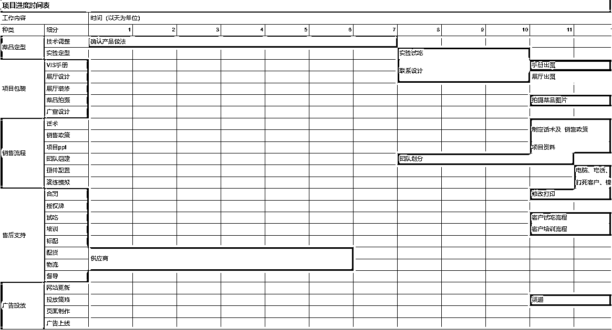  

## （73 赞）《要不要加盟一家喜茶？喜茶为什么要开放加盟？》 

喜茶为什么要开放加盟？ 

我不知道，但我知道的是，在奶茶行业，走直营模式非常非常难。 

对比即将上市的蜜雪冰城和已经上市的奈雪的茶（21 年 19 亿利润 VS 亏损 1.5 亿），大概能代表加盟模式和直营模式的现状（虽然不能只用两家来对比整个行业），但就我对奶茶这个行业的了解来说，加盟品牌的利润能力要比直营品牌高非常非常多。 

奶茶直营的典型代表是喜茶、奈雪、茶颜悦色，大家也知道，喜茶和茶颜悦色今年经营状况并不好，都爆出了裁员、关店的新闻。奈雪是上市公司，它 2022 年的中报依然是亏损的。 加盟品牌中，蜜雪冰城以 23000 家门店居首位，去年利润接近 20 亿。古茗、茶百道、甜啦啦等品牌经营状况也非常好。 

这些低调的加盟品牌与那些高调的直营品牌对比，很有意思地阐释了两个常用词语：闷声发大财和赔钱赚吆喝。 所以喜茶要开放加盟这件事，想想也没啥奇怪的，因为奶茶行业真的不适合做直营。 

当然我并不是说直营亏损，改加盟就是为了割韭菜。 

至于说茶饮为什么不太适合做直营，我就不细说了，改天我可以专门写一篇文章。 

如果你想要加盟喜茶，我这里跟聊聊我看到的一些细节。 

1、如果你从来没有做过奶茶，先说一个残酷的真相：从整个奶茶市场来看，奶茶店的经营是很艰难的，据说有一半的奶茶店在开店两年内就关店了。 

2、奶茶行业在过去十多年的时间里，许多杂牌在不断割韭菜，而且有大量快招公司假冒知名品牌在招商，不信你可以百度一下喜茶、古茗、蜜雪等等品牌，有一段时间，古茗的搜索结果长期被骗子公司占据首页。 这类骗子公司行话叫快招公司，我不展开讲了，你可以参考我之前的一篇文章：《说好不哭》和一些奶茶店的真相，如果你想做奶茶店，一定要看这篇。 

3、为什奶茶店关店率高？很大一部分是因为快招公司的存在，他们只管招商，不管加盟商的死活。所以你也别害怕，正规的奶茶品牌，开店还是没那么容易倒闭的，比如古茗。 

4、喜茶自己都经营不好，那加盟就能赚钱吗？这个也真不能这么想。因为我说过了，奶茶不适合直营，但是如果建立完备的加盟体系，反倒有可能是喜茶和它的加盟商都能赚钱。 

因为直营奶茶店的管理效率太低，做加盟就是让大量的加盟店主自己管店，这个积极性一下子就发挥出来，品牌降低了管理成本，提升了各个门店的执行效率，店主则借助品牌能获得经营优势。 

5、从喜茶官方的招商文件来看，这次它并不是想快速扩张，因为它对加盟商的要求还是很严格的，估计 90% 上意向加盟者会被各种条件筛选掉。 

对了，如果一个加盟品牌对加盟的条件要求很苛刻（比如选址、加盟条件筛选、培训周期等），至少说明这个品牌在主观意愿上不是在割韭菜。 

快招公司则是交钱就行，至于选址，门口有一条狗走过去，他们就觉得选址没问题。 

6、那我是鼓励你加盟喜茶吗？也不是。因为经营一家奶茶店实在是很苦，很累，很闹心。如果你没做过奶茶行业，我建议你再谨慎一点。如果你过去是一个白领，我建议你压根不要考虑开奶茶店的事，你吃不了那个苦。 

7、你也不能用今天喜茶门店的营业状况去推算未来加盟门店的营业状况，因为今天喜茶的开店位置以一线和新一线 + 二线城市为主，而且都在城市的核心商圈。 

包括未来门店数增加后，会不会稀释喜茶的品牌号召力，都是未知数。 

总体来说，奶茶行业品牌的忠诚度是不高的。 

8、有报道说喜茶只开放现有员工加盟，这个并不准确。我去喜茶公众号亲自申请了一下加盟，填完了所有表格，看起来还是挺严格的，不过他们是对全社会开放加盟的，只是需要筛选加盟者。 

但如果被选中，你还是要在喜茶实习 3 个月，在喜茶的公告中，这个被描述为需要完成 2 个月直营门店各岗位全职工作考核，以及 1 个月管理进阶、商圈分析、门店选址等考核。 

我估计很多人在 2 个月实习期就会大退堂鼓，不过喜茶招商说明中已经明确，只接受有经商经验或者管理经验的人士，小白领没啥机会。 

如果真是这样，我觉得这是喜茶很正确的决定。 

9、不要只计算一年的收益，还要把你自己的工资算上，你才能真实地算出你经营奶茶店获得的回报。 

比如你在大厂一年 50 万工资，那你开一家奶茶店至少一年赚 100 万才是划算的。 

因为你自己做老板，一天至少要满负荷工作 12 个小时以上，全年无休，还不能摸鱼。你在大厂一天的有效工作时间不会超过 4 小时，相信我。 

所以开一间奶茶店的有效工作时长是大厂的 3-4 倍。 

10、喜茶不接受财务投资开店。 

就是说你只投钱，但不打算自己经营店铺，至少在喜茶的招商说明里是不允许的。 这也是非常正确的一个决定，因为只管投资不管经营的老板，一般都会把店干黄。 喜茶也会干黄吗？相信我，会的。 

11、没有点人脉和资源，开不了店。 

喜茶的招商说明中也讲到了，申请者需要过去三年中在意向合伙地区有工作经历或者经商经历，熟悉当地市场，有优质的商业资源。 

翻译过来潜台词就是：有商业经验，有人脉，有资源。 

因为选址、经商，不是那么容易的。你要应付各种同行的明争暗斗，工商税务防火食安的检查，还要能找到优质的门店地址，这在任何地方都是稀缺资源。 

12、不要用仅有的积蓄去赌。 

喜茶对加盟者资金的要求，首先是 40 万开店费用，以及 100 万以上资金或可变现资产储备。 

但你最好不要把身家都押上，因为开奶茶店并没有稳赚不赔的事，即使是开一家喜茶。 

如果你把 40 万开店非和 100 万现金都赔进去，也不会伤筋动骨，我觉得你可以开。但话又说回来，赔掉 200 万又不心疼的人，他好像也不会自己去管店的。 

喜茶这个规定，似乎有些矛盾。 

13、人在决定做一件事之前，一般会把它所有的美好都想象一遍，眼里看到的都是美好的未来，却选择性忽略或者没有看到潜在的风险，结果一进去，才发现事情不是想象的那样。 

开奶茶店就属于这种类型。 

如果你要去应聘做一个保安，那么你去做保安前和真正做保安之后，他的工作跟你想象的不会有太大差别。 

如果你要去开一家奶茶店，那在你开店之前和开店之后的感受和想象，是完全不同的，因为你并不了解开一家奶茶背后的种种经营难题。 

所以我还是建议你谨慎一点为好，至少观察观察，不要那么心急火燎地凑热闹。 

14、你可能会说，我不着急，万一以后没机会加盟喜茶了怎么办？ 

没机会就没机会嘛，如果喜茶加盟很紧俏，第一轮大概率也轮不到你。如果喜茶加盟不紧俏，那你日后要开，应该也不会那么难。 

尤其是在今天这个节点上，稳住，意味着一切。 

如果你还有对奶茶行业想了解的，那么欢迎预约本周四晚八点，我与古茗创始人王云安的对谈直播。 

古茗是中价位段奶茶品牌的王者，你关注奶茶的话，不应该忽略古茗。 

## （16 赞）《为个体工商户提供地图标注服务》 

起因：在淘宝小镇上注册了个体工商户。 接到“地图标注”的电话#风向标# 一次 80 元。 看了下朋友圈 8 月份开始做的，月入 1W 没多大问题 

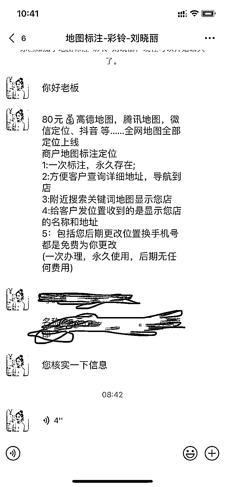  

## （16 赞）《行业风口：不良资产、破产企业处置》 

#风向标#  最近这几年受到疫情、经济大环境的影响，破产的企业数量剧增，尤其是房地产行业，朋友抓住了这个风口，开启了一波不良资产处置、破产企业处置的生意，这两年是一个很好的风口，这行切入需要人脉和资源 项目周期可能会比较久，但是回报颇丰，近期做的一单耗时 7 个月，公司进账 800 万 有人脉资源、专业的小伙伴可以切入这个行业风口。 

## （16 赞）《分享一下陪诊师的工作内容和玩法》 

工作内容：陪伴老人、孕妇、社恐人士等到医院看病。 陪诊完成，会把当天陪诊的检查结果，还有医生说的话及之后的用药和注意事项。用纸记录下来。 包括 ta 下一次要过来做什么检查，做什么车等等。 

目标群体:1.子女不在家的老人，2.异地就医，3.孕妇和宝妈，4.社恐人士。 

初期困难:会被误解为医托或者黄牛。 

解决方法：可以从做同城号开始，坚持拍摄陪诊视频（注意先询问顾客，且保护用户隐私）。 前面的视频，可以找自己人配合拍摄，把流程和服务展示出来。 

可以团队做，可以复制。同时积累私域用户，做好维护，比如事后关心之类，后面可以私域做其他产品。 

#风向标# 

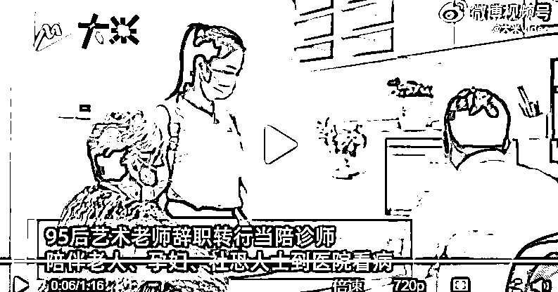  

# 总结 

本周的内容比之前的稍微少一点，虽然字数上也快十万了 

还有很多风向标也都上榜，个别没太多价值的被小懒过滤掉了 

当然，这么多帖子小懒也没办法一一查阅，大家自取吧~ 

除了离线版，小懒也会整理到在线版合集里，方便大家检索和手机上查看。 

更多内容，见咱们懒人专属群的群文件和群公告！ 

