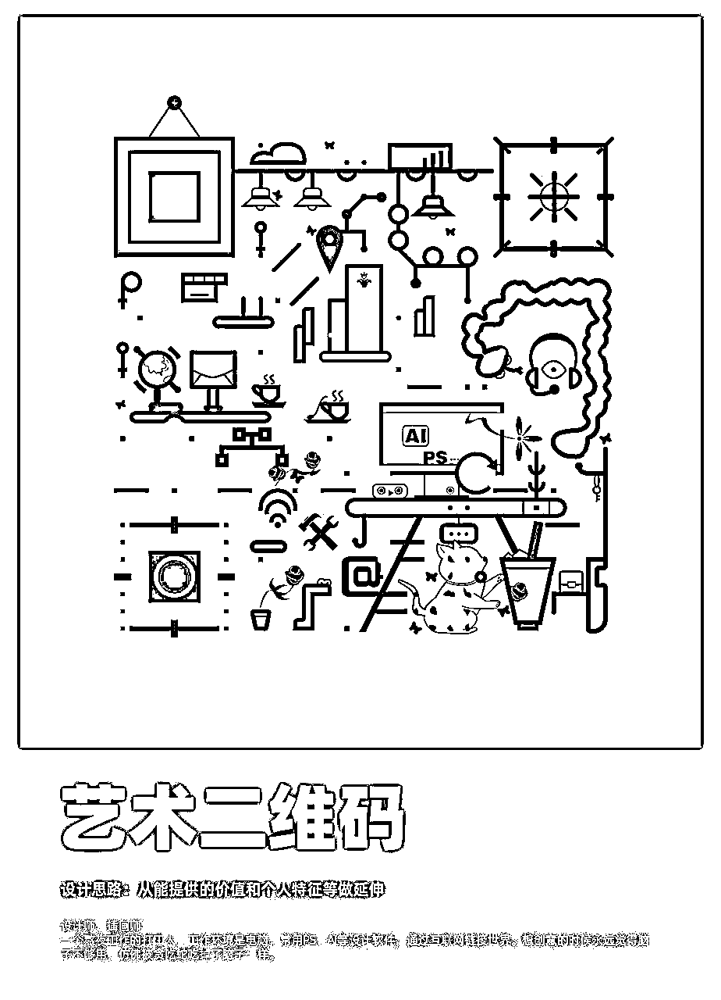
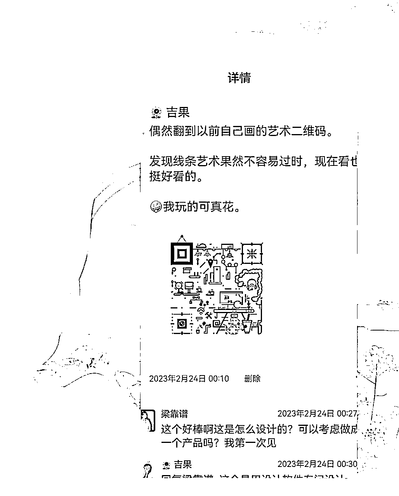
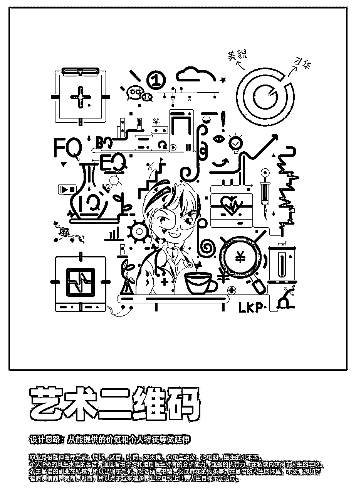
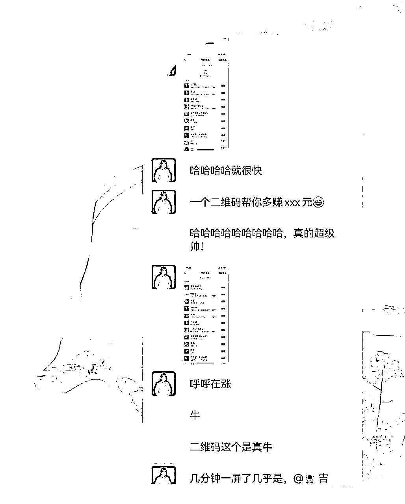
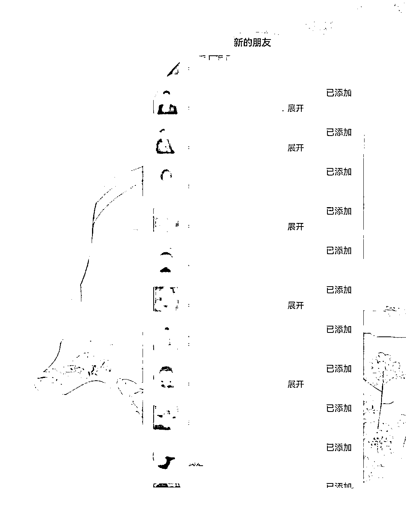
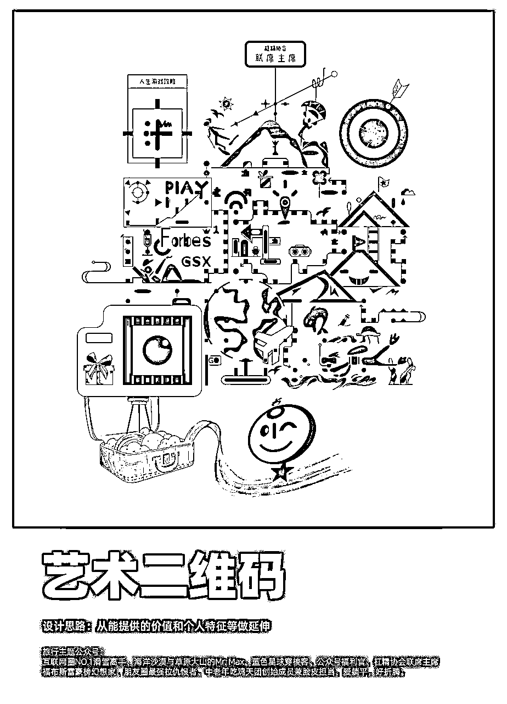
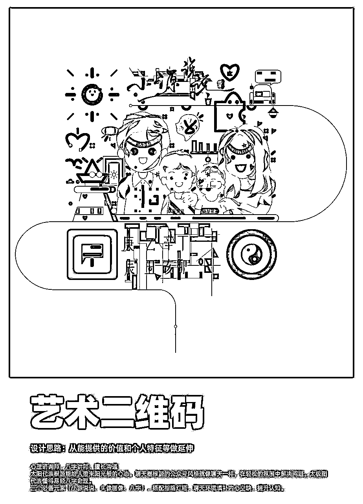
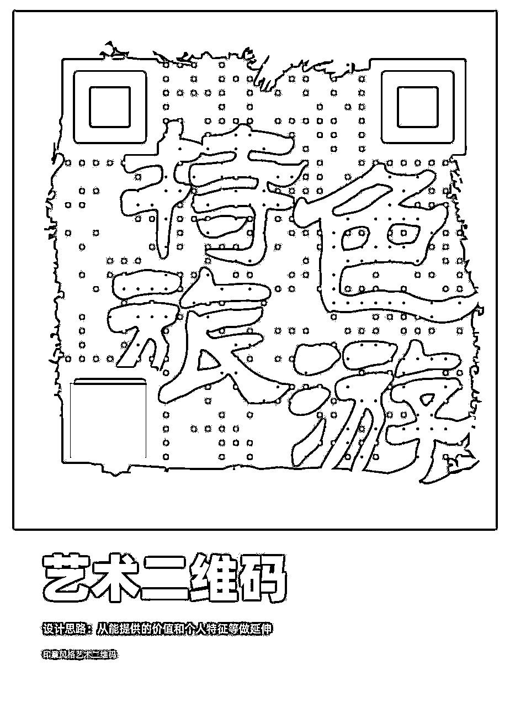
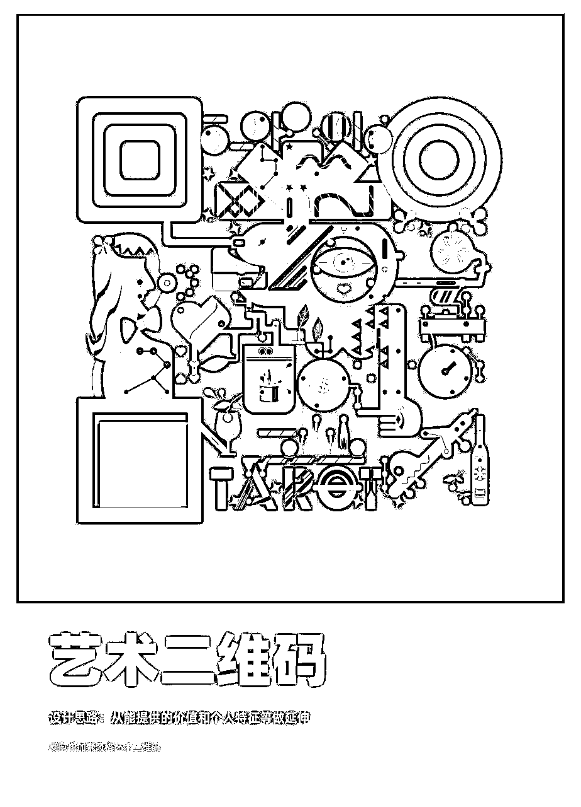
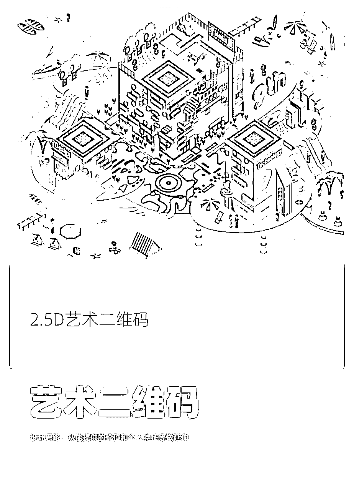

# 我是如何用一枚二维码引爆IP流量的？——艺术二维码

> 来源：[https://tgxl0sxo7f.feishu.cn/docx/AoT0dlRipo0RN6xDSo3cdckpnyf](https://tgxl0sxo7f.feishu.cn/docx/AoT0dlRipo0RN6xDSo3cdckpnyf)

大家好我是吉果，一个插画师，生财透明人。最近新增加了一个标签，艺术二维码设计师。

增加这个标签的起因是我整理图片翻出了以前给自己设计的艺术二维码，当天的朋友圈不知道发什么，就把艺术二维码的图片发出去了。

然后这张艺术二维码，让我见识到了什么叫著名圈友梁靠谱的影响力，什么叫表达者红利，什么叫一键引流，什么叫圈层的重要性，什么叫我被大佬加微信的慌张。

一个小小的二维码，也能玩出花样帮助引流。

本文除了介绍艺术二维码的引流功能，也会分析购买使用艺术二维码的优缺点。因为这也是我在做艺术二维码经历中的真实感受，分享给大家做个参考。

## 一、什么是艺术二维码？

1、首先，会在互联网翱翔的大家都知道二维码吧？

你的微信二维码、收付款二维码、公众号二维码、公域平台IP二维码，到处都能看到它的身影，它经常以一堆黑色小方块的样式出现在我们眼前帮助我们识别信息。

那什么是艺术二维码呢？

艺术二维码就是把二维码的小黑方块，换成图案、文字、小插画、2.5D图案等等形式，让它不再是单调的黑色块。

在保有基本信息的基础上，变的更好看和独特。

例如这样（我个人的艺术二维码）：

艺术二维码的艺术性，就体现在这些个性化设计的图案。

2、其次，什么样的二维码可以做成这样经过美化的艺术二维码呢？

其实所有二维码都可以。

但是！！划重点！！

【有时效限制的二维码不可以！】

原因在于，原创的艺术二维码本身设计需要时间，如果7天后用于做设计的原始二维码失效了，那么甲方爸爸可以和设计师一起哭了。

而且一旦提供出二维码做设计，就不能再更换原始二维码。例如微信二维码下面有个【换个样式】按钮，从此你就可以跟它说拜拜了。

所以只要一直使用、不做更改的二维码，都可以拿来做设计。

## 二、艺术二维码如何帮助自媒体IP引流？

我会写这篇介绍艺术二维码的文章，就是因为被我们的著名圈友梁靠谱发现了艺术二维码的引流功能。

因为发了朋友圈，我吸引到了私域流量大户梁靠谱医生。

此时第一波引流功能+表达者红利出现了：在我无聊的发了自己的艺术二维码后，这位私域奇才和我说她没见过这种独特的二维码。那我不得让你见见专属于梁靠谱的艺术二维码呀！

此时信息壁垒出现了：我以为很多人知道有这个东西，但是很多人其实没见过这种艺术二维码。

这说明，艺术二维码是有宣传空间的。

几天后，专属于梁靠谱的艺术二维码出炉，上面是一系列的专属元素+靠谱的卡通形象。靠谱开心的放到自己的星球和群里展示。

此时第二波引流功能出现了：在靠谱展示出艺术二维码的几分钟后，来加靠谱好友的人数已经堆满一屏幕。群里好友马上提示，不要一天之内加太多人，会被限制。星球里也有人在问。

此时第三波引流功能出现了：突然很多大佬来加我，大家很好奇艺术二维码是怎么做的？短短几分钟好多人来加，尤其有很多是常常看到，但我一直不好意思链接的大佬，我真实的慌了。

如果是外部引流的话，无论做不做艺术二维码，沉淀下来的流量，是否会在未来的某天成为你的付费用户呢？

最后，在前面我为什么提到圈层的重要性？

我接触艺术二维码也很久了，也尝试做过宣传。但一直做不起来。

因为艺术二维码的原创性，导致价格并不亲民。而这种审美性质，在马斯洛需求层次理论中，属于最上层的需求。它的审美价值、引流价值、商业宣传价值，叠加毛爷爷价值，不是所有人都能接受。

此时圈层的重要性出现了：有两位甲方爸爸下单了。

在知识付费领域、自媒体IP领域，大家更注重自己的差异性和账号的审美包装。

定位和圈层对了，结果也就对了。

## 三、艺术二维码的商业价值

看到这里，我来总结一下艺术二维码的整体商业价值。

新奇性：艺术二维码可以为自媒体IP提供更多的展示和推广机会。自媒体IP可以在自己的文章、视频等内容中嵌入艺术二维码，通过全方位视觉锤的包装和创造新奇有趣的用户体验，让观众可以通过扫码获取更多的信息，如作者个人微信、相关作品推荐等，提高自媒体IP的记忆点、影响力和知名度。

信息展示：原创艺术二维码可以量身设计与IP个人强关联性的元素。将IP的特点展示在艺术二维码上，可以快速的让观众对个人或者IP有初步的认识，如作者的身份、职业、爱好、部分性格特点、产品内容、品牌调性，缩短认知成本。

艺术二维码销售：艺术二维码可以将自媒体IP的内容与艺术融合，推出艺术二维码并进行销售，从而实现艺术与商业的有机结合。

广告变现：艺术二维码可以通过植入广告或者与商业品牌合作，实现品牌推广。

数字化衍生品：艺术二维码还可以作为数字化衍生品，推出相关的产品，例如手机壳、T恤、水杯等等，在宣传IP品牌的同时拓宽变现空间。

艺术二维码的变现手段主要包括收取二维码制作费用、通过艺术品销售等方式获得收益等。

艺术二维码衍生品：好看的艺术二维码，本身就是一幅独特的艺术作品。可以做成衍生品，达到宣传的效果。

艺术二维码的价值来自于它承载的IP价值和创意价值。它不仅仅是一个身份识别的图案，还是一件包含设计艺术价值在内的艺术产品。设计师是在有限的空间内，绘制了一幅有丰富想象力的图画。同时还要保证二维码的可识别性。所以艺术二维码是一件客单价很高的产品。

不同的设计风格和设计内容，也让艺术二维码的价格有非常大的区间变化。

例如最简单的换个颜色，或用非常简单且单一的元素替换全部黑方块，可以便宜到两位数。

用3-5个原创图案覆盖信息点的艺术二维码价格在三位数。

而像我个人的艺术二维码，以及给靠谱和其他两位大佬设计的艺术二维码，能在二维码的图案中有明确的图案以及能放入大量的个人专属信息的艺术二维码，就已经来到1-2千元。

这样的二维码如果配合整体的海报设计，价值在3-5千元。

还有包含设计理念和颜色的艺术二维码、2.5D绘画的艺术二维码，价格可以达到五位数。

目前听说过的最贵的艺术二维码，大概3万元左右。

制作一个艺术二维码需要多长时间呢？

根据设计要求，图案内容的复杂程度，设计周期从几个小时到一个月不等。

例如两位数的二维码，我只需要把信息点都覆盖住，保证识别性就够了，可能几个小时就完成了。

我和靠谱的二维码，线性风格和简单图案的，制作周期在5-7天左右。

毕加索风格的二维码，可能需要一到两周。2.5D风格的二维码，需要时间更长。

为什么需要这么久？

除了设计画面，艺术二维码最重要的设计需求是保证二维码的可识别性。我画出来的二维码，得能让你扫出信息才行呀。

所以为了保证识别性，在绘制的过程中，要不断地测试。

简单来说，我加了一个花，二维码扫的出来吗？测一下。再加个草呢？再测测。

一个完美的艺术二维码，必须让你扫也扫的出来，长按也能按的出来。安卓鸿蒙的能识别，IOS也得能识别。

一两个点的绘制错误，就会导致二维码的不识别。我得保证二维码上所有信息点都是正确的，它才能被识别出来。

所以每个动作都需要时间，甲方爸爸，咱这东西真催不来。

艺术二维码的目标用户，主要是自媒体大IP。

原因一：价格不亲民。

原创艺术二维码动辄一两千的设计价格，普通人接受不了。设计难度导致越是个性化、越是专属性强，价格一定是越高的。普通人只是为了好看和独特，一两千买个图片，他是不愿意的。

原因二：引流功能

普通人不需要引流，体会不到流量的价值。但自媒体IP需要引流，尤其是那些全方位包装自己的大IP更需要引流。

自媒体时代，流量最贵。每一个独特的点，都可能成为你吸引流量的奇招。

海报上看似是个画的图片，居然是能扫的二维码？这人有趣呀，我得加一加。

那么普通人在这里完全没有存在的必要么？

并不是。免费和低价的模板二维码，还是可以带来一些不一样。毕竟不知道艺术二维码存在的人，只会用黑方块的二维码，而模板二维码会好看一点点。

①常规的使用场景多是线上，例如微信群，公众号，朋友圈引流。

②可以搭配宣传海报，用于线上宣传。

③视频号内可以发布视频。

④如果尺寸适合，可以打印出来，做线下活动的推广。微信扫一扫可以识别。

## 四、目前市场上艺术二维码的主要变现方式

这也是艺术二维码最主要的变现手段。根据风格、元素制作难易程度，制作费用从几百到几万。

品牌的商业价值越高，艺术二维码所承载的价值就越高。

目前市场上有一些做模板艺术二维码的小程序、网站、APP，他们的盈利方式是收取会员费、推广费。

这种模板艺术二维码，可以一键换模板，但是没有专属元素，缺少独特性和商业价值。

这些小程序也是需要模板的更新，可以通过学习做简单的艺术二维码元素替换，加上整体的平面设计，为小程序和APP供稿。

市场上会制作原创艺术二维码的设计师，数量很少，大概只有几千人。如果艺术二维码的商业价值被认可，那么教授制作艺术二维码，会是非常有潜力的课程。

## 五、学习制作艺术二维码

艺术二维码的设计原理并不难，关键点就在于信息点的覆盖。用线条、图像合理覆盖，保证信息可识别。难点在于设计思维和想象力。

一些学习门槛出现了。想要学习艺术二维码，先要学会设计软件Adobe illustrator，至少要会基础的操作。

所以最好是有设计基础，或者愿意先学习一些软件的操作。

当你了解了设计原理，后面可以随意玩出花样。

## 六、艺术二维码为什么发展缓慢？

从我刚接触艺术二维码到如今已经6年了，艺术二维码并没有发展到人尽皆知。艺术二维码发展缓慢的原因也是多方面的。

1、艺术二维码的传播性

相较于其他传统宣传产品，艺术二维码本身是无法把满屏大字写上去的。这一点就把很多急于展示产品的甲方爸爸劝退了。

小商业体本身预算有限，又不能大面积展示内容，可能是限制艺术二维码的一点。

2、市场营销能力不足

艺术二维码的设计和营销需要专业知识，而设计师们可能不具备营销能力，导致艺术二维码无法被充分推广和市场化。

3、互联网商业的需求性

6年前还是大品牌霸屏的年代，个人IP和知识付费刚刚萌芽，野蛮生长的时代对上层审美的需求很有限。当年也主要是一些大品牌做过艺术二维码，如滴滴、纪念碑谷、丰田、交通银行、宝马车主俱乐部等等。多数也只用在公众号中使用，使用场景单一化，没有成体系的营销案列。

而在个人IP品牌发展起来后，当初那些研究艺术二维码的设计师们，已经出走了很多。

随着公众号的没落，导致如今看到的艺术二维码更多的是模板化二维码，真正的原创艺术二维码少之又少。

4、使用场景受限

设计一款二维码付出很多，但是无法跨平台使用。例如微信的二维码不能发到小红书或者抖音。会被判定引流。微信生态内可以使用，视频号能够发微信艺术二维码的视频。

当然好的艺术二维码，完全可以打印出来线下使用。

## 七、除了原创艺术二维码，还有其他便宜但不那么呆板的选择吗？

有的。

艺术二维码的本质，是用其他元素覆盖信息点。除了高价值的原创个性化的艺术二维码，市面上还有可以简单替换信息点的模板艺术二维码。

这种二维码的优势在于便宜，甚至免费。可以用很低廉的价格，得到一个简单美化过的二维码。

它的劣势是，模板有限，重复使用率高。替换信息点的元素单一，没有个性化设计，体现不出IP账号的特点。而且可识别性不稳定，没人给你售后。喜欢的样式如果不识别，只能换个样式。

如果只是自己玩玩，这种倒也足够了。

## 结尾

作为一个营销小白，一个艺术二维码的设计者，在这个项目的发展过程中，我从狭小的视野中看到了很多鸡肋的发展因素，似乎没有很大的商业价值，也一直怀疑艺术二维码真的有市场吗？

但是我相信有商业眼光的梁靠谱医生，她说有市场，那一定是我的认识不足。

至少目前，对于日渐强盛的个性化审美包装发展需求来说，艺术二维码的确是一个很空白的市场。

有了新奇的物和好奇的人，大概只缺推广需求的人了吧。各位商业大佬，你们觉得呢？