# 「从零开始」使用 Fine Tunes训练一段对话

> 来源：[https://hc1llseyv9.feishu.cn/docx/DodLdyghqoJL3MxogYjcXQKlnPh](https://hc1llseyv9.feishu.cn/docx/DodLdyghqoJL3MxogYjcXQKlnPh)

聊天机器人在人工智能领域中占据了重要地位，它们能够像人类一样进行对话、回答问题，解决用户的疑惑。为了让聊天机器人更加智能，我们可以利用 Fine-Tuning 技术对其进行训练。

# 什么是 Fine-Tuning？

Fine-Tuning 是指对一个预训练好的模型进行微调，以提高其在特定任务上的准确性和性能。在聊天机器人中，我们可以利用 Fine-Tuning 方法训练模型，使其更好地理解和回答用户的问题。

# 如何利用 Fine-Tuning 训练聊天机器人？

以下是一个简单的步骤：

# 训练说明

在进行 Fine-Tuning 训练之前，您需要具备一定的 Python 编程基础、熟悉 PyTorch 库、了解自然语言处理技术、以及掌握 OpenAI API 的使用方法等。具备这些知识和经验，您将能够更好地理解 ChatGPT 模型的训练步骤和流程。

# 最终效果


# 开始训练

## 训练数据

### 命令拆解

#### 设置环境变量

在你的OpenAI找到 API Key，注意使用你自己的确保额度够用

```
export OPENAI_API_KEY="使用你自己的 openaikey，注意需要有 api 额度"
```

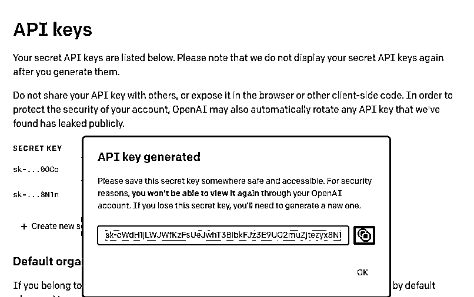

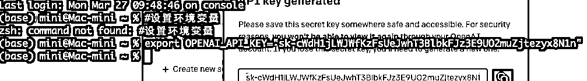

#### 使用 python 安装 openai

请安装 python，在安装 openai 第三方库

```
pip install openai
```

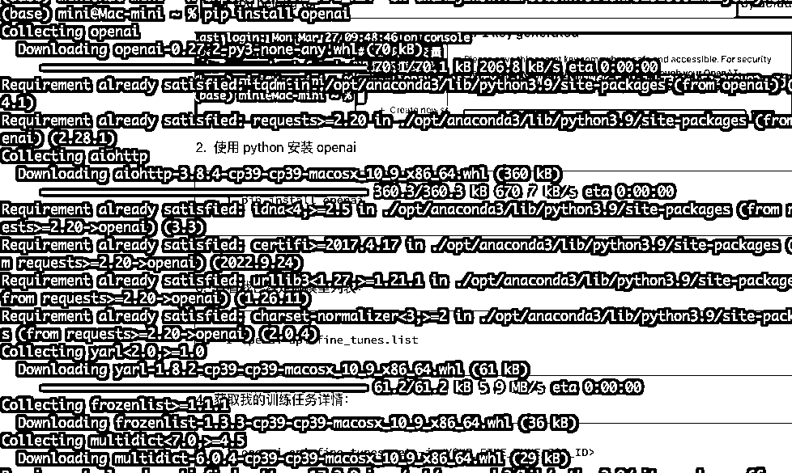

#### 查看我已经训练过的模型列表

如果你没有训练过,不会有响应数据

```
openai api fine_tunes.list
```

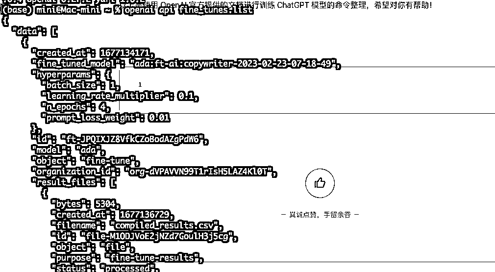

#### 将数据转换成官网需要的格式

```
openai tools fine_tunes.prepare_data -f content.xlsx
```

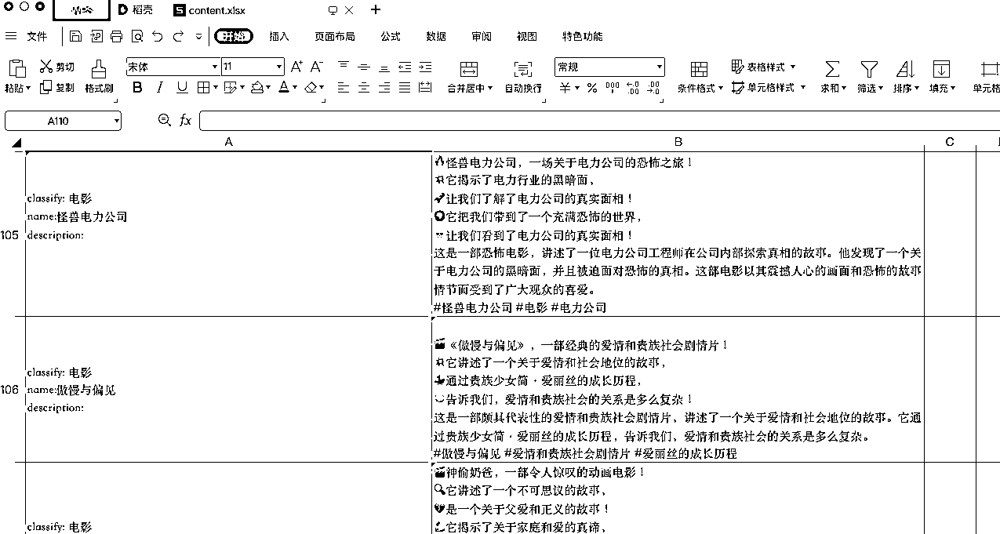

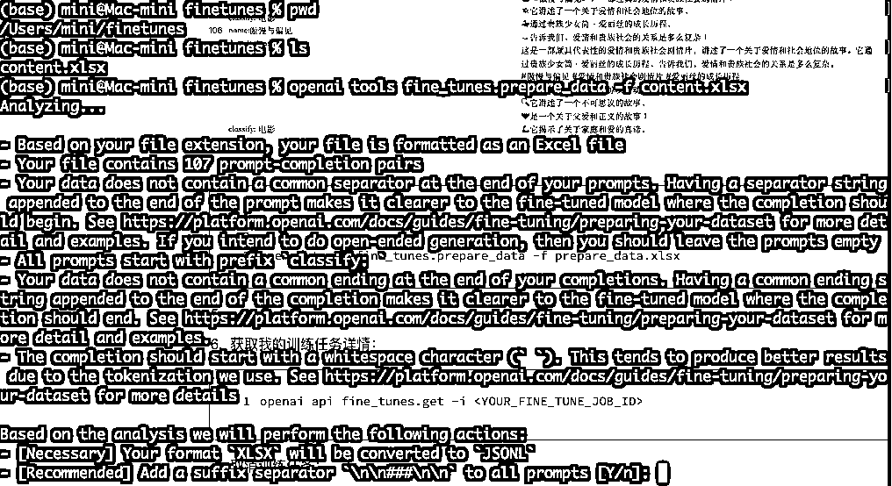

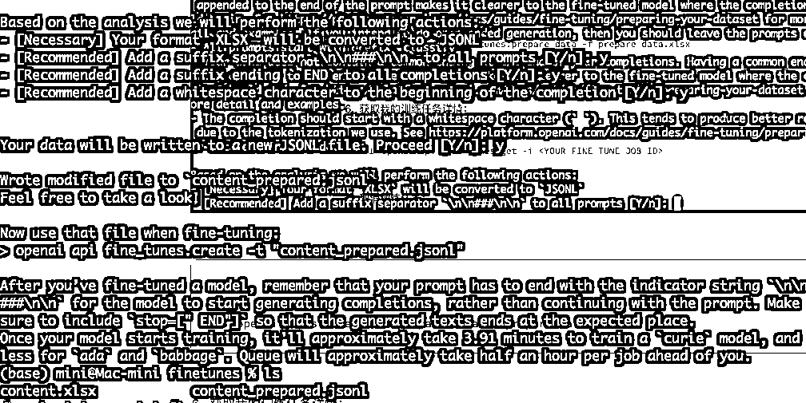

#### 创建训练任务

```
#使用davinci模型
openai api fine_tunes.create -t content_prepared.jsonl -m davinci --suffix "content"

#使用 ada 模型
openai api fine_tunes.create -t content_prepared.jsonl -m ada --suffix "content"
```

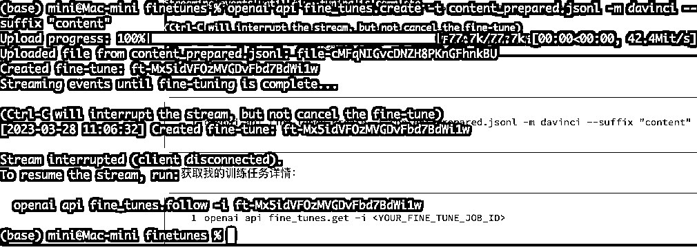

#### 跟踪我的训练任务详情

```
openai api fine_tunes.follow -i ft-Mx5idVFOzMVGDvFbd7BdWi1w
```

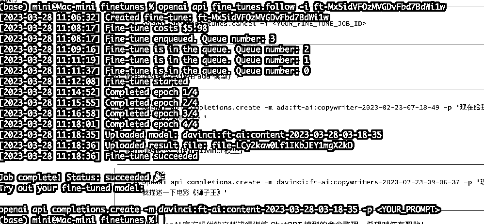

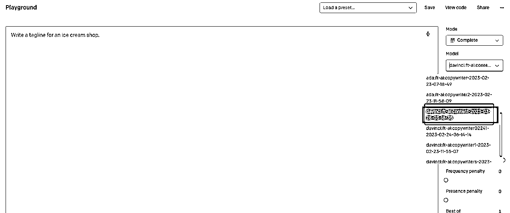

#### 如何取消训练任务

```
#创建任务
openai api fine_tunes.create -t content_prepared.jsonl -m davinci --suffix "test"
#取消任务
openai api fine_tunes.cancel -i ft-g1resYmUT8ImMAREfjcFZJPn
#跟踪任务
openai api fine_tunes.follow -i ft-g1resYmUT8ImMAREfjcFZJPn
```

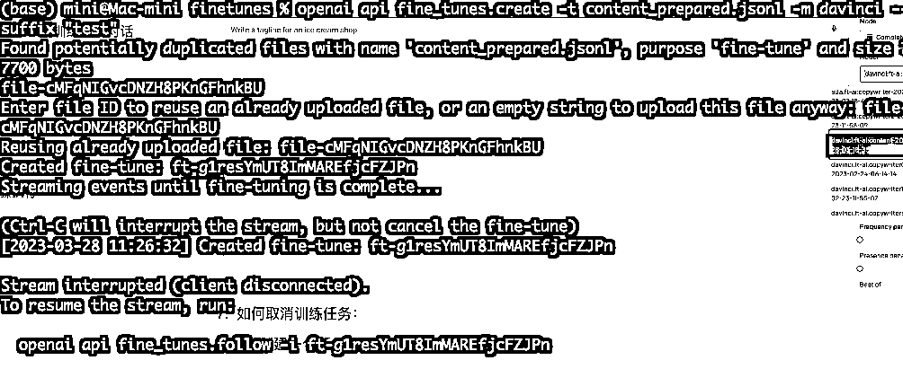

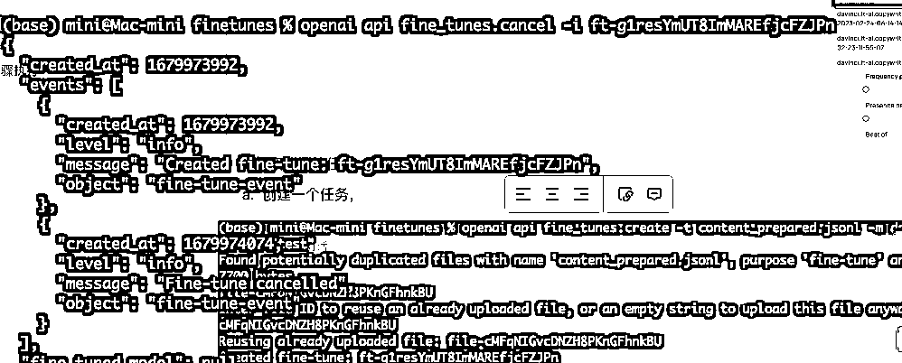

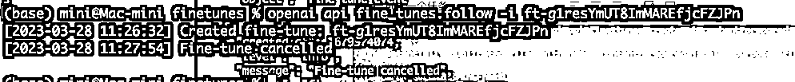

#### 使用训练好的模型

在 playground 上使用该模型生成内容

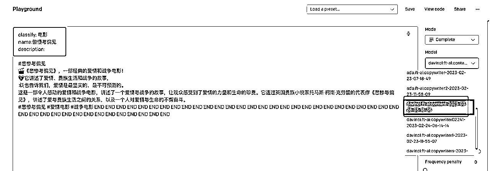

### 完整命令

```
#设置 OpenAI API key，需要替换成自己的
export OPENAI_API_KEY="使用你自己的 openaikey，注意需要有 api 额度"

#安装 OpenAI Python SDK
pip install openai

#查看 Fine-tuning 模型列表
openai api fine_tunes.list

#准备数据，-f 参数指定输入的数据文件名
openai tools fine_tunes.prepare_data -f content.xlsx

#使用 davinci 模型创建 Fine-tuning 模型，--suffix 参数指定模型名称的后缀
openai api fine_tunes.create -t content_prepared.jsonl -m davinci --suffix "content"

#开始 Fine-tuning 过程，-i 参数指定 Fine-tuning 模型的 ID
openai api fine_tunes.follow -i ft-Mx5idVFOzMVGDvFbd7BdWi1w
```

# 总结

随着人工智能技术的不断发展，聊天机器人已经成为现代人类生活的重要组成部分。借助 Fine-Tuning 方法对聊天机器人进行训练，我们可以使其更好地理解用户需求，为用户提供高质量的回答和解决方案。这种不断追求进步的精神正是推动人工智能领域不断创新的动力源泉。在未来，我们有理由相信，通过更先进的技术与方法，聊天机器人将会变得越来越智能，为人类生活带来更多便利与价值。

# 训练附件