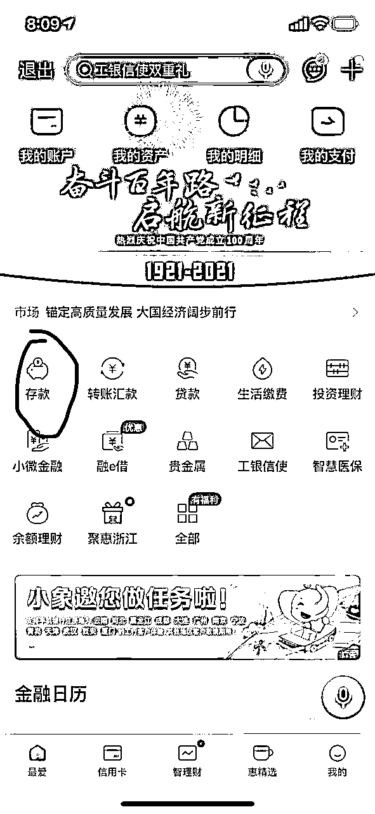
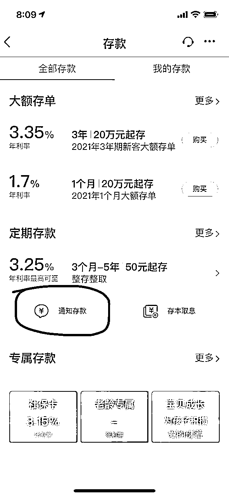
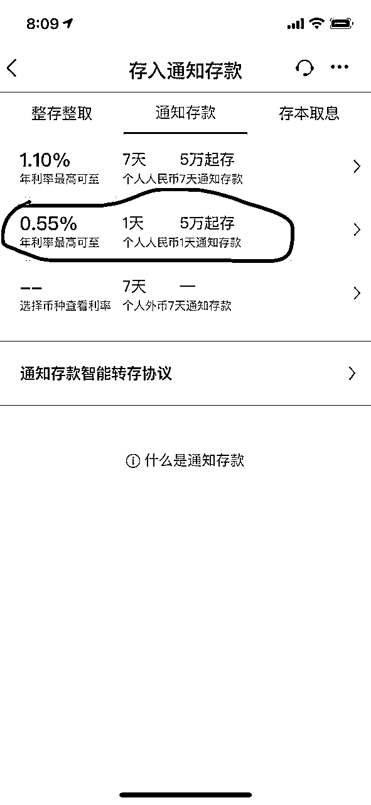
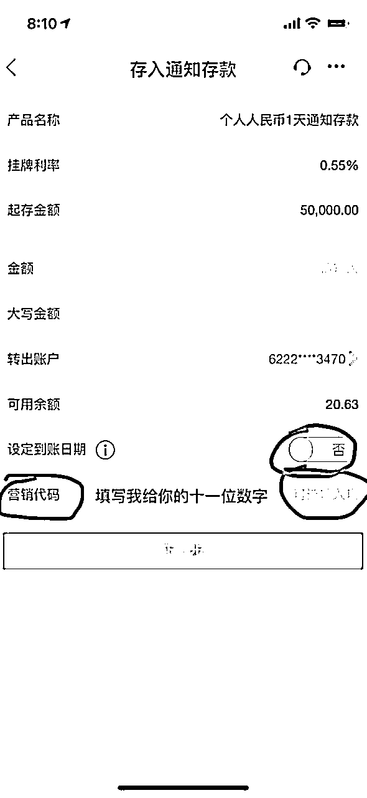
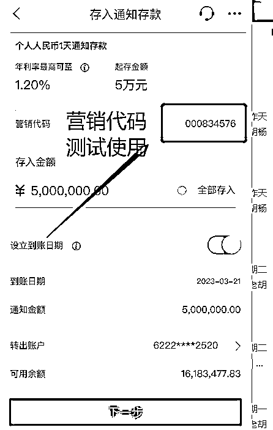

# 四大行月末存款无风险套利;

> 来源：[https://shengcaiyoushu01.feishu.cn/docx/FXPZdOCdwodVhix7joJcifnKn0g](https://shengcaiyoushu01.feishu.cn/docx/FXPZdOCdwodVhix7joJcifnKn0g)

背景需求：

每个银行到了月末或者季度末都有一个存款任务指标，有的银行行长指标无法完成就需要找同行之间拆借，当然这个拆借是有以下特点：

1\. 安全

所有资金都是在自己名下银行卡内互转，不用对外转给其他人，所以无风险。

2\. 短期

通常都是月末几天时间

3\. 高息

以3月份为例

50W 一天 利息 500元

100W 一天 利息 1000元

资金越大，可以溢价空间越大。

4\. 是否可以自己做？

可以，如果你有这银行渠道愿意配合的可以自己去操作。

但是，有可能无法长期给你口子，我们是一个圈子，资源信息每个月都有。

5\. 优缺点

优点：安全，高息，便捷

缺点：需要的资金量有要求

6\. 利息怎么返还？

根据步骤操作后，截图发给我，然后资金保留24小时候，我们会即时把返利打到个人账号上面。

在利息这一块不用担心，都是正规银行操作，我们这里可以承保。

7\. 操作步骤

以农行为例子：

工行的操作：

建行的

优先推荐用农行的去操作，因为农行的简单，只要1元就可以体验整个流程。

可以根据这步骤自己去操作下，那个推荐码找我拿，因为推荐码是不固定的。

有不明白的，可以群里咨询，也可以私信我。

祝大家，每日生财！