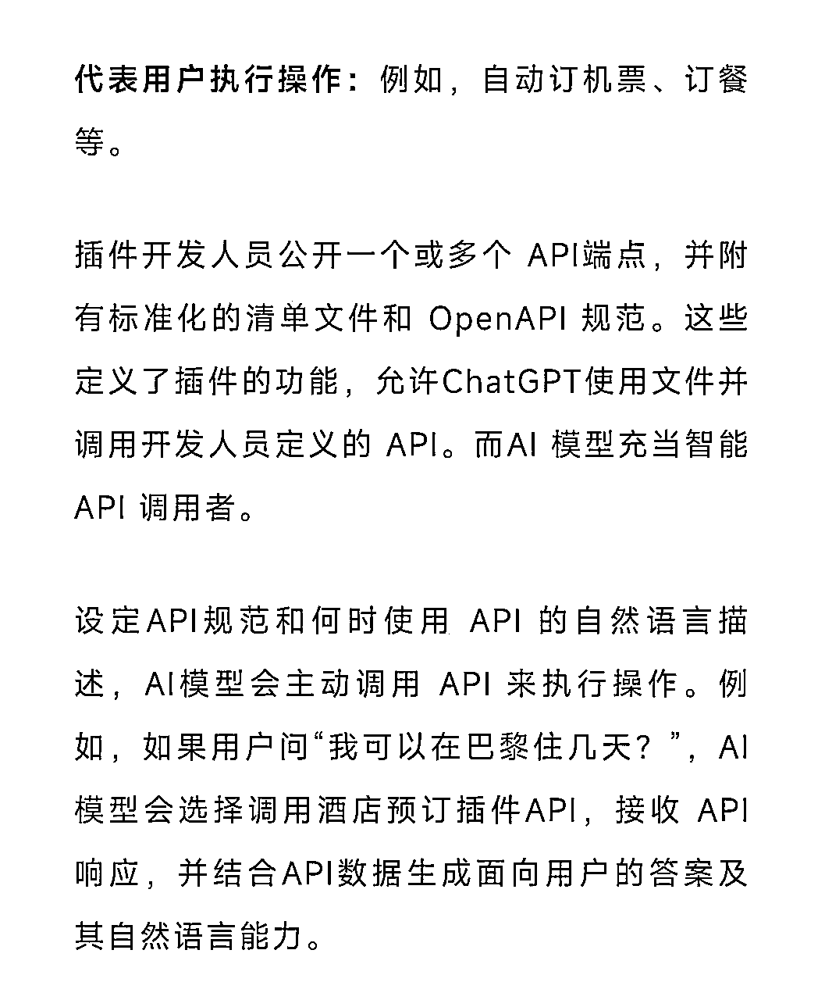
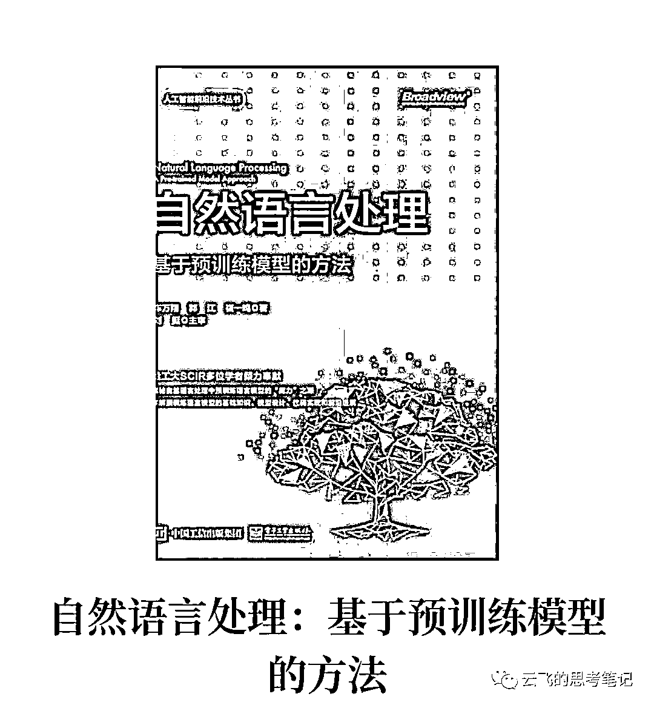

# 【洞察】ChatGPT或将出现大量SEO机会

> 来源：[https://c8xa9g10gh.feishu.cn/docx/IkKOdu4oloVj41xpQ60c333qnoh](https://c8xa9g10gh.feishu.cn/docx/IkKOdu4oloVj41xpQ60c333qnoh)

大家好，我是云飞。今早起床看到朋友圈大量关于ChatGPT出插件的帖子。

认真读了一下，其中的一条信息引起了我的关注。

这意味着什么呢？从商业逻辑来讲，这背后意味着将会出现更多的品牌营销机会。

### 一、为什么说这是机会？

目前，抖音/TikTok算是做“个性化推荐”非常成功的平台，它们实现个性化推荐的原理分析用户在TikTok上的观看、点赞、评论等行为，以及用户在购物平台上的浏览、购买等行为，根据用户和商品之间的相似性来推荐相应的商品。分析商品的描述、用户的搜索关键词、评论内容等文本信息，以此为基础来推断用户的需求和偏好，从而推荐相关的商品。

有没有发现什么？

在抖音/TikTok中，平台和用户的交互行为有滑动、点赞、评论、分享、关注、私信、搜索等。

说白了，平台通过“兴趣推荐”和“用户搜索”来实现个性化商品的推荐。

而反观ChatGPT，ChatGPT和用户的交互行为有什么？搜索！搜索！搜索！！！

(或许有一天它也会出兴趣推荐的机制，毕竟这实现起来并不难。New bing 已经实现了）

搜索意味着精准，精准意味着高转化，顺着互联网流量的逻辑，大家就知道后续了。相比而言，我认为它是升级版的抖音/TikTok，具有更强的个性化推荐能力。

所以，不妨思考一个问题：

当人们面对ChatGPT感慨‘它会让更多人失业’时，人们到底在感慨什么？

人们在感慨自己将对ChatGPT产生极强的依赖。

因为只有了解和体验过的人才会发出这样的感慨嘛，也才会争先恐后的想尽办法去使用它，依赖它。

依赖的结果就是对平台产生信任，而信任是商业的开始。

好，接下来分三个角度来探讨商业可行性：

从技术角度来看，ChatGPT可以通过开放插件为用户提供相关购物推荐。这些链接可以与用户的提问和聊天内容相匹配，以提高点击率和购买率。在这种情况下，商家可以利用ChatGPT来实现更精准的营销策略，从而提高销售额和用户满意度。

从用户体验角度来看，ChatGPT可以为用户提供更加便捷和智能化的购物体验。用户可以在与ChatGPT的聊天过程中获得推荐商品和服务的链接，从而节省时间和精力。此外，ChatGPT可以基于用户的历史购买记录和偏好，为用户提供个性化的推荐，这有助于提高用户的购买意愿和忠诚度。

从商家角度来看，ChatGPT可以帮助商家实现更高效的营销和推销。通过与ChatGPT的整合，商家可以获取更多的用户数据和购买历史，从而更好地了解用户的需求和偏好。基于这些数据，商家可以制定更具针对性的营销策略，并优化广告投放和推广效果，从而提高销售额和用户满意度。

不过，这种类型的个性化推荐也存在一些潜在的隐私和安全问题。例如，如果ChatGPT在回答问题时提供了购物链接，那么它可能需要访问用户的购物历史记录和其他个人信息。

这可能会引起一些用户的隐私担忧，并可能导致一些用户对ChatGPT的使用不舒服。因此，在实现这种类型的个性化推荐时，需要谨慎处理用户数据，并采取适当的措施来保护用户和商家的利益。

### 二、如何实现？

那对于想要提前布局的商家朋友，该如何去实现这一目标呢？

ChatGPT的数据库是通过数据标注来训练实现的，这与搜索引擎SEO收录的原理不一样，所以更准确的讲我更愿意用“类SEO”的表述去表达ChatGPT的这种数据优化方式。

虽然，它的数据库没有开放，不过它收录数据的方式是有迹可循的。逆向推，还是能够尽早抓住一些机会的。因为前几天，在和一个朋友聊实现这种营销的方法，所以今天就简单分享一下。给大家推荐一本书吧，如果有更好的资料，也欢迎推荐啊。

比如，我最近因为查看了很多资料，尤其是一些期刊，了解了GPT处理自然语言的方式。通过这种方式更加清晰它处理自然语言的规则以及过滤方法后，就可以反向的推导出输入什么样的prompt，可以让它更好的输出我们想要的答案。知道它处理自然语言的规则以及过滤方法，自然也就明白它的收录原理了。

这个过程就有点像解析黑盒子的感觉。虽然GPT与我而言依然是个黑盒子，只不过逐渐清晰对它的作用机制后，就可以反向操作了。

也有一种可能就是联网后，ChatGPT直接从现有的互联网爬数据，这样的话原先搜索引擎SEO那一套能继续奏效了。

这部分就不展开说了，因为我自己也不是专业的，就是最近在研究这个主题时找到一些新发现而已。有兴趣的可以自行研究一下。

### 三、我的期望

其实，从理性的商业逻辑来讲，这种商业进化是合理的，毕竟有足够的盈利能力才能保证ChatGPT 更好地发展和进化，更早地实现多模态处理。

从感性的角度来讲，我内心是不太希望自己喜欢的ChatGPT（经过训练，它现在已经成为我的个人助理）变成非常商业化的东西，我非常希望我以上的观点是错误的。

不过，从目前迫于资本而提前宣发GPT4、宣发Plus、Pro产品等等一系列行为来讲，似乎这种商业化进程不可逆。

奈何？交给时间吧！