# 地表最强的小红书无货源电商【保姆级教程】，小白也可以月入2w+

> 来源：[https://n28vbku1px.feishu.cn/docx/JJQ0dfe6ho2qh7xalBXc3AG6nAb](https://n28vbku1px.feishu.cn/docx/JJQ0dfe6ho2qh7xalBXc3AG6nAb)

小红书无货源电商项目，目前属于蓝海中的蓝海，小红书跟抖音不一样，本身是种草平台，种草行为本身就附带电商属性。

另外小红书的算法机制极为优质，它的去中心化算法，可以说是互联网平台里的翘楚，一篇笔记爆了之后，可以吃长尾流量。

最关键的是全程不用刷单，也不需要开车，全部都是自然免费流量。

可以说是除了保证金外和发货的成本，其他全部都是不用花钱，总的来说开店成本不高，投入低。

其次，小红书平台的人群较为优质，付费意识强，转化高。

平台90%用户是女性，30岁左右人群占比高达83%，都市女白领和职场女精英是主要群体。

从蓝狐第一次接触小红薯平台，就一直认为小红书平台，绝对是最适合普通人操作的。

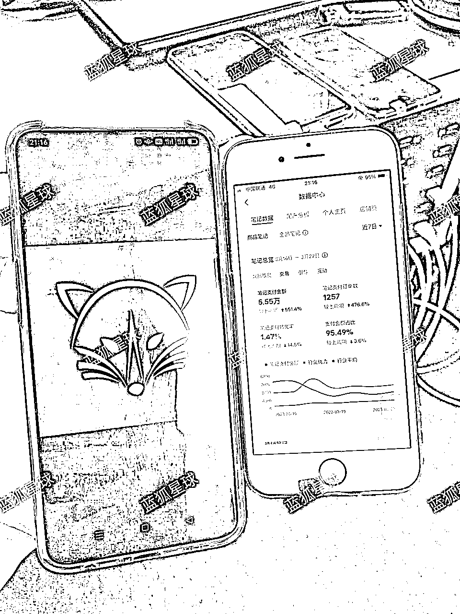

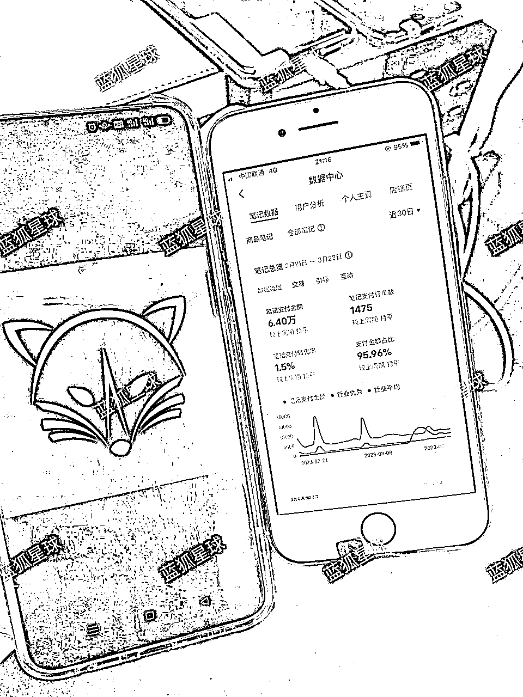

它对新手非常友好，适合学生党，宝妈，所有的互联网小白，简单可复制，收益无上限！

今天蓝狐就对项目的实操步骤进行详细的拆解，干货满满，即便你是互联网小白，没有任何无货源经验，也能够看得懂。那我们开始吧！（长文警告）

# 1、小红书电商无货源优势

1、成本是非常的低。相对于传统电商来说，它不需要开付费推广，也不需要怎么去补单。

2、操作相对于比较简单。前期只要选好了品，每天就是批量铺货，发笔记，坚持下去，不断优化细节，内容，标题，封面等等。

也不用去刷朋友圈，只要爆了笔记，流量是很惊人的，还有长尾流量。

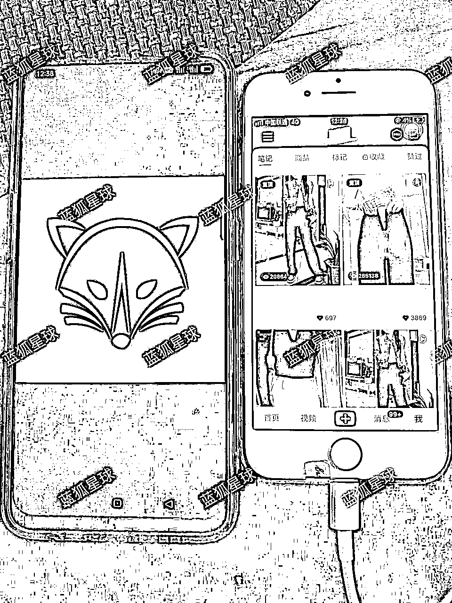

3、不需要去囤货。这个是相对于来说非常好的，不要去压太多的资金，出一单卖一单，也没有啥风险，一件代发。

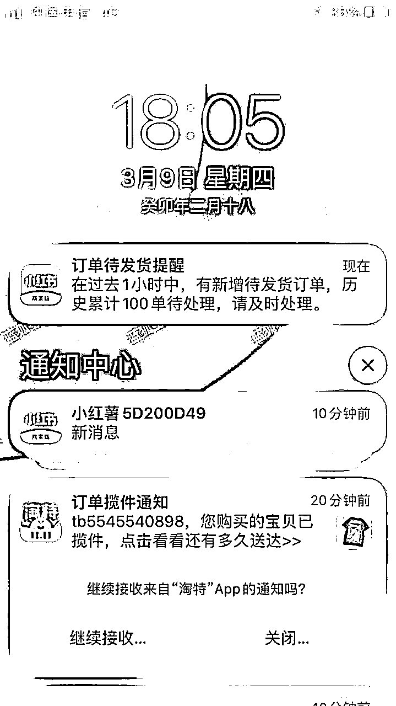

4、0粉丝也可以出单。不是说非要多少粉丝怎么样怎么样，我们是为了卖货，前期粉丝数量多少不重要，慢慢积累就行。

5、起量特别快。只要找对方法，不断摸索，今天可能是20单，明天就有可能100单，这个也非常容易得到正向反馈，也是我们坚持做下去的原因。

就拿我们一个新店铺来说，18天卖了2630单，平均一天150单左右。

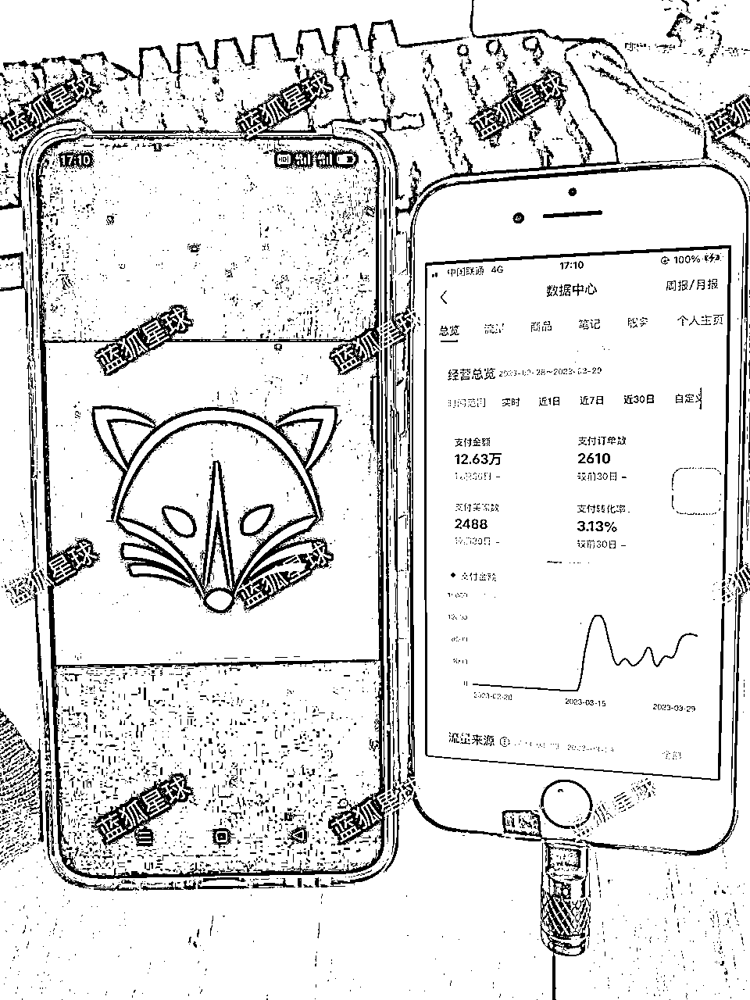

6、利润较高。小红书因为粉丝质量比较高，所以利润可以在50%以上。以上数据，18天营业额在12.63w，利润在6w多。

注意：上面数据做个说明，小红书自定义时间只能是查询单天数据，不能自定义查询哪天到哪天的数据，从3月13日开始出了第一单，之前是未出单。

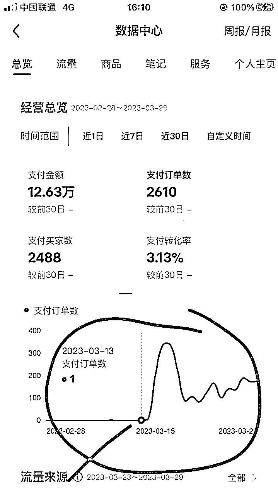

# 2、开店准备

操作小红书无货源，需要准备一台手机，一台电脑即可。

首先是小红书账号，一机一号，没有小红书的去注册一个。

名称：名称不要过长，切忌使用繁体字或生僻字，越简单越好，便于搜索，也利于传播。

这里要注意，小红书是7天内只允许改一次名字，所以改名之前要考虑到时效。

头像：在头像选择上可以根据自己的产品类目来制定选择符合自身店铺定位形象的图片，或者用自己的账号名称作为头像。

一定要干净整洁，切忌花里胡哨。

# 3、开店流程

开通店铺是非常简单的，小红书分为个人店和企业店。

蓝狐建议小白先开通个人店去做，个人店只需要缴纳1000的保证金就可以。

账号主页“创作中心”→更多服务→开通专业号，根据自身需求来进行验证。

开店无需粉丝，个人号免费认证，而企业号需要缴纳600元的年费。

不过开通专业号后，可以获得更多的推广和营销工具，如橱窗、广告等。

缴纳保证金：个人、个体工商户只需缴纳1000元保证金，企业店、品牌店则须缴纳2-5万保证金，上传营业执照等资料即可开通。

这里也可以先不缴纳，等提现的时候缴纳。

不过不缴纳保证金的话，商品开通不了运费险，小红书上很多买家看重这个，很多都会在商品笔记的评论区询问。

所以蓝狐这边建议是直接缴纳，反正也可以退。

# 4、店铺基础设置

完善店铺信息，电脑端网页搜索小红书商家后台。

或者打开链接：https://customer.xiaohongshu.com/login?service=https://ark.xiaohongshu.com/app-system/home，完成店铺的基本信息的填写。

登录后，点击交易→物流工具→地址库管理。

在这边设置一下发货地址和退货地址，发货地址随便填一个就行，要注意填写我们的退货地址，因为平台会有极速退货。

系统会自动发送我们的默认地址过去的我们做的是无货源每个品的退货地址都是不同的，所以我们的地址不能统一所以我们的地址就需要改成（此地址错误请联系客服确认地址）这样我们避免客户退货，把货物给寄错了，要让退货形成一种审核来帮他改这个地址。

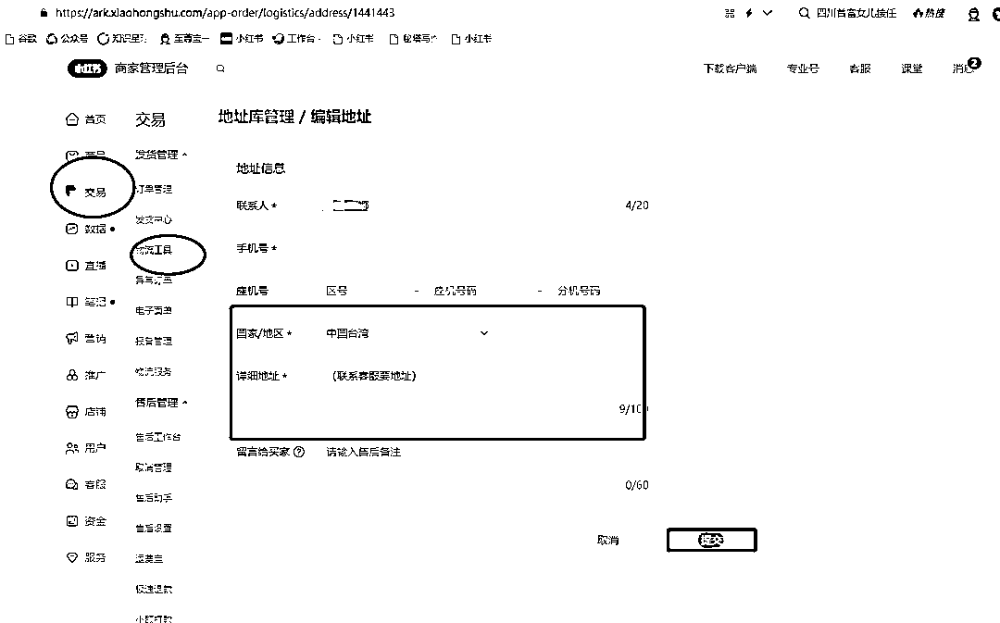

然后点开售后设置，选择商家自主提供退货服务，然后保存设置。

还有就是运费宝，建议开通，很多客户都比较纠结这个问题，同时也会影响转化率。

最后设置一下微信收款和支付宝收款，在首页资金那个分类里，这里需要注意，版本更新过后不交保证金是没办法开通收款的。

# 5、选品（重点）

不管做什么无货源，选品都是重中之重，选品是至关重要的，首先我们做的平台是小红书，我们要搞懂平台的男女用户比率。

在小红书上女性居多，所以我们在选品上最好选择跟女性有关的商品，这种商品在小红书上才能更好做。

小红书热门的领域非常多，像饰品，服装，家居，美妆，护肤等等，这些大的赛道下面还能细分出非常多的垂直领域。

选品时要选更为细分的领域，要垂直领域去选品上架，不要服饰和首饰这些混着一起卖，卖内衣就卖内衣。

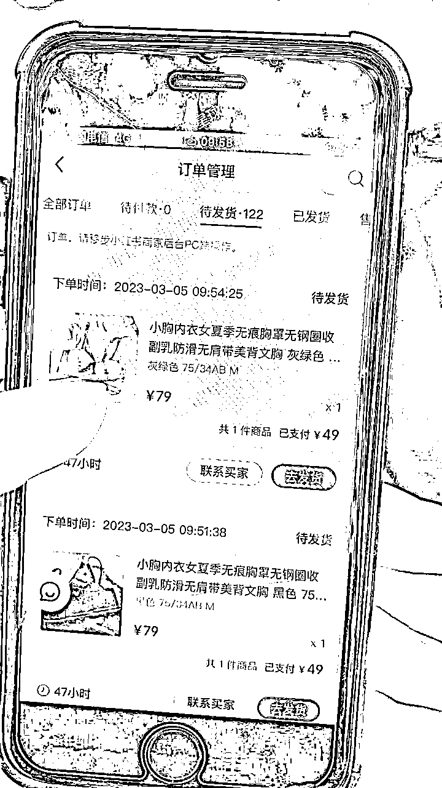

也可以把一些某音上的爆火的产品，直接拿到小红书这边来上架，提前是热门火爆的产品。

还有可以选当下热点商品，节假日的热门商品等等。

定下来我们要做的垂直领域之后，我们就找这个领域的细分产品去上架。

蓝狐拿女装来举例，女装分上衣T恤，还有裙子连衣裙，还有裤子牛仔裤等。

我们要做细分垂直的领域商品，还要看季节来选择，比如春天来了，天气也就慢慢开始热了。

气温上升很多女生就喜欢穿小裙子出门，那么我们就可以做裙子，但是裙子又分出来，西装连衣裙，半身裙，大码连衣裙等。

还可以在小红书找同行的爆款商品，模仿搬运也可以，我们选品要找到我们的细分领域去做，这样我们可以精准化去运营店铺。

选品的时候建议不卖品牌的产品，因为那样就不会有各种的罚款和各种的违规。

小红书的人群也是相对比较高端的，只要我们的产品质量不是很差，那么退货退款问题就很少很少。

小红书，目前有违规风险的只有视频板块，而且大部分视频，违规最多是给你监控，直接删除就行，但是不会降权你的账号。反观一下抖音号，没有对比就没有伤害。

这边推荐一下我们团队在用的一款选品工具，灰豚，用这个工具可以直观清晰的观看行业爆款产品，产品热度，小红书爆款笔记，等等，链接：https://xhs.huitun.com/#/home

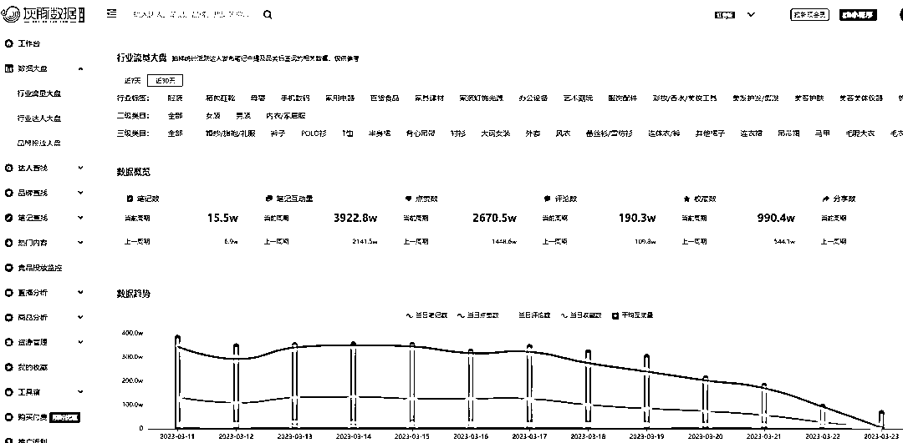

利用好工具可以让你更高效的选出爆款商品。

# 6、养号

对，你没看错，为什么养号要在选品之后进行呢？因为我们要有目的性，要把账号打上标签，所以不能一开始就盲目养号，乱刷笔记数据，在选好品之后，比如你确定要做连衣裙，那么你就在小红书搜连衣裙，刷和这相关的笔记、视频，关注评论点赞，切忌不要刷太快，不要像个机器人一样去操作。

这个养号不单纯是为了应付差事，养号的过程中有一项非常重要的任务，那就是找到对标账号。

观察同行：观察他的爆款笔记形式，他是以图文还是视频，用到什么特别的点才爆，分析他的标题，文案，可以用表格记录下来，以后你自己发的时候也借鉴他的内容。

跟踪同行：关注他的动态，看他最近在上什么品，最近他什么品爆了

那么问题来了，怎样才能找到带货牛逼的笔记，需要明确一个观念——粉丝量和笔记数据方面表现不错，也不一定能带来良好的销售数据。

明确这点之后，我们应该如何去找呢？很简单，只需要仔细观察评论区即可，看是否出现了许多“怎么买”、“在哪下单”等关键词。

不要小瞧这些关键词，这些词往往是高转化的评论区的典型特征。我们还必须拥有倒推的能力，用这些关键词来推出热销产品。你以为会很难吗？

不，这只需要我们善用工具的力量。还是上文提到的灰豚数据，可以用它快速找出爆款笔记

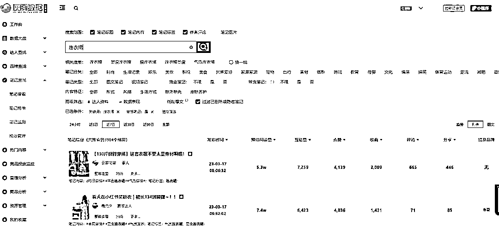

也可以用蝉小红的“评论搜索”功能。

首先，在蝉小红平台上选择“评论搜索”功能，然后输入关键词，例如“在哪下单”等，以找到相关的评论。

接着，选择产品类目，这有助于缩小搜索范围和精准定位目标产品。然后，勾选“带货笔记”选项，以筛选出那些成功带货的笔记。

最后，导出相关的表格数据，以便对这些热销产品进行更深入的分析和研究。

通过这样的方式，就可以快速地找到那些在小红书上销售火爆、受欢迎的产品。

养号是十分重要的，和你发作品的流量相关，小红书的账号权重表现：

发布一条内容，50~60播放量，就是基础播放。

如果一发基础100~600播放量，就是账号打上标签了。

# 7、找货源

做无货源老生常谈的几个拿货渠道：拼多多，淘特，1688，京喜等。

找货源的方式就是“图片搜索”功能，用你找好的品截图，去上述软件搜索，就能找到货源，对比一下价格。

还有就是评价很重要，评价是客户的直观感受，差评多的品就不要去上了，否则总是退货处理售后就够忙叨人了，何况差评还会大大影响你店铺的流量和转化率。

这里说一下拼多多，拼多多是这几个拿货渠道里最便宜的，也是利润最大的，但是他有一些缺点，新手小白不懂的话很容易掉坑。

1.面单问题

面单就是收货后快递上写有拼多多字样，顾客看到这样的面单有的会选择退货，因为我明明是在小红书买的怎么拼多多给我发。

处理这类问题，直接在找货源的时候就问商家，能不能无痕发货。

2.拼多多短信

拼多多短信是从去年开始，当时一出现这个问题无货源圈里都炸了，客户频频退货，真的是有够恶心，就是拼多多官方给顾客发短信

针对这个问题，我们可以用工具解决，用逸淘拍单软件下单就可以了，他会让客户自动屏蔽拼多多短信，不过这个也不是百分之百，只能说尽可能避免。

3.产品质量差

拼多多的价格便宜，但是产品质量较差，针对这个问题，就回到上文说到的看产品评论，找到差评较少的，瑕疵少的品。

新手建议如果利润可观的话建议从1688拿货，质量比拼多多更好一点，售后问题也少，比较省心，1688上全都是工厂，需要你挑选销量高的，靠谱的店，有的标记1688严选店，那种是十分可靠的。

后期你自己店铺销量起来了，每天有稳定的单量，你可以通过上面的软件直接联系商家，问他能不能线下打单，就是绕过平台，省下了平台中间费，同时你单量大，也拥有了谈价格的资本。

# 8、店铺上品

上品的话，在小红书商家后台，点服务→服务市场，选择一款铺货软件，我这边用的是蚂蚁搬家，那里面的铺货软件都差不多，选一个免费的就行，有试用期的试用也行，到期了换一个用就完事。

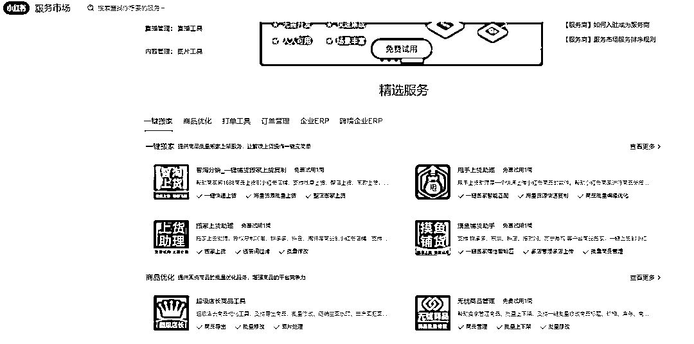

上品的时候信息尽量完善，商品参数参考商家，能填就填，注意图片不要有别的平台的水印，否则会被判违规。

商品标题的话需要注意一下，因为用户在商城中可以通过关键词找到你的品，所以标题要好好设置一下，还是参考同行，用他的关键词，参考同行的和你拿货商家的一结合，就变成你自己的了。

价格设置的话，这里面也有细节，你上品时候的价格是要高一点的。

因为后期你可以设置营销策略来降价销售，比如优惠券之类，上品时的价格也就是原价。

建议参考同行，比他的原价贵一点，然后后期你的优惠力度大一点，这也是出单的小细节，很多很多的细节叠加在一起，就决定了你比别人更容易爆文。

# 9、商品笔记发布

店铺有了商品之后，就要不断的去给商品做引流做曝光，曝光越高，出单就越多。

商品曝光的方式有两种，一种是商城自带的曝光流量产品上架后主图不错的话，用户在商城是可以搜到你的产品从而达成交易，这种是商城的自带流量。

另一种是笔记流量笔记，流量可以细分为首页推荐流量跟用户关键词搜索流量，想要做好首页的推荐流量，就要不断的去找对标账号，挖掘他们的爆款笔记，然后进行拆解借用爆款笔记模板，持续的发布笔记给商品引流。

商城流量是很低的，小红书的用户是不习惯在小红书商城买东西，更多的是搜索笔记，所以笔记流量是我们转化引流的重点。

笔记封面

首先我们知道，我们在小红书刷到笔记，第一眼能看到的就是封面和标题封面的内容直接吸引粉丝是否直接决定。

点击我们的笔记进来其实做笔记封面的技巧也非常简单，封面就是要将整个笔记的关键词。

给提取精华的内容给写到封面上坚持三大原则

①竖屏3:4，竖屏方式可以更多的展现封面图吸引用户注意力。

②调性一致，调性干净一致的封面，系统在识别时更快速，更利于做快速分发，保持统一调性。

③突出重点，当用户在发现页浏览时，是茫然的，此时需要确保图片有焦点，让用户有点击的冲动。

单图纯色+文字；单图+文字；双图对比+文字；多图展示+文字。

比如：高颜值单图，图片拼贴抠图拼贴，海报大片，对比图，纯文字图，图片上写补充文案，视觉冲击力图片等。

产品素材

我们的产品素材可以直接从拼多多选品链接直接拿商家的图片。

也可以在淘宝里面用拍图找商品的功能去搜出来对比两个平台的照片是否相同。

还有就是在平台的评价中看评价图，找到5张左右的图片，然后利用醒图去修改尺寸，滤镜，和镜像，给我们的图片做二次剪辑。

这是比较繁琐的方法，同样也可以利用软件减轻工作量，用至尊宝一键搜图，就能找到这款商品所有平台的素材，视频和图片都有，我们把这些素材保存下来。

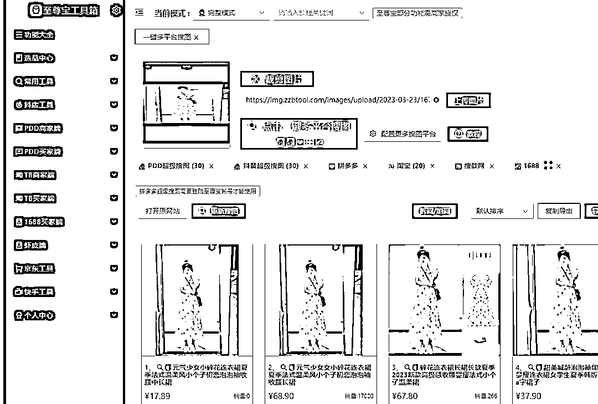

素材搞定之后，接下来我们就需要把素材剪辑做成视频去发布笔记。

因为我们要做的是视频笔记，目前我们测试是视频笔记较为好，流量推流曝光曝光多些

视频制作就直接利用小红书里面的模板去制作，或者在剪咉上面的模板去直接套用直接做出了视频就行

视频制作的方法除了用纯图片，还可以用视频+图片组合去制作，这里可以对素材进行不同的排版，套用不同的模板，加不同的特效，就能制作出很多视频作品，就可以长期发了。

标题+笔记+话题

从热点入手，找准对标内容，进行定向搜索，找到小红书热门笔记的博主并关注，积累对标榜样。

学习他们的选题和内容，突出个人差异化。针对和你差不多粉丝博主，相互借鉴，取长补短。

还有就是从商品评论或者商品笔记下方的用户提问中提炼购买需求关键词。看同类目下的爆文话题，发布笔记的时候新增话题提升笔记热度。

1、标题控制在20个字以内，不能太短也不能太长，16-18个字 之间最佳，因为太长的标题会被隐藏，太短又难以表达文章亮点。

2、标题适当增加一些表情符号，表情符号颜色和形式多，可以帮助你的笔记脱颖而出。

3、标题适当加上数字会更受欢迎，比方说“7天香港旅行攻略"“3天痘痘肌修复攻略”“30块就能买到”等等。

标题公式：巨大反差+犀利观点，亮点+设置悬念，提问+解答，压迫感，数字冲击，名人案例+背书，紧跟热点，灵魂发问+分类整理，我和单品的故事+单品亮点+具体内容+适合人群。

内容排版：小红书文案排版很精美完全是靠小表情支撑的，另外就是该空行的空行，该分隔段落的分开展示。

表情的用途大致有3个：排版分隔、替代文字、划重点。

所以我们可以充分利用这些小表情表达当下心情，起到美化排版的作用。

正文内容要紧扣封面和标题，一篇笔记中不要堆砌太多热门要点，语言要通俗易懂，让大家get到产品的亮点和种草安利点，没有营养价值的话少说。

这边也可以利用人工智能工具写标题文案，如密塔写作猫：https://xiezuocat.com/#/?redirect=recent

# 10、产品优化

首先是利用小红书营销工具，打开小红书商家后台，点营销→商家活动，参加活动可以获得平台扶持流量。

还有商品促销，选择店铺要促销的产品，选择优惠金额，可以增加用户购买的冲动，提高转化率，还有薯券运营中心，可以设置店铺满减，这些都是营销策略，优化出单的细节。

关于客服方面，打开小红书商家后台，点击客服→智能客服，可以设置欢迎语、关键词、商品卡片、跟单助手等，可以大大提升客服回复的效率

手机端下载一个小红书商家版，可以在那里回复客户消息。