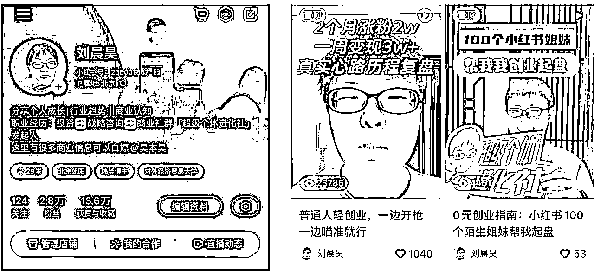

# 小红书从0到1，起盘我0元成立一个社群，单月变现8w+的经验

> 来源：[https://wxqp5aw3pm.feishu.cn/docx/K4zfd2djsoEAdWxTaXrceSf9nLf](https://wxqp5aw3pm.feishu.cn/docx/K4zfd2djsoEAdWxTaXrceSf9nLf)

# 小红书0-1涨粉

## 定位迭代过程

心态准备/鸡汤开头：

建议大家可以去看一下我置顶的两个视频，分享了一些我的起号和变现的框架

这些，都帮我精准的吸引到了投资、投行、咨询这一批小众精英粉丝，那段时间，我的帖子几乎都在投行、咨询热搜第一，很有利于我把粉丝数快速干到1w

这些，都帮我进一步破圈，吸引到了圈外那些对我感兴趣的人

这个时候，我的人设可能已经无形中变成了一小部分人的引领者，想关注赚钱机会和从大厂跑路的应该都会去注意我的内容了

总结一下，我的经验就是：

我也一直在思考，她们关注刘晨昊，到底在关注什么，我觉得是在关注未来自己的投射，说起来抽象了点，具体来说就是刘晨昊在做她们想做的事、说她们想表达没表达出来的话

当然，欢迎你告诉我你为什么关注我，因为我也在探索抖音，由图文为主转纯视频，有很多的不适应，在有商业模式和产品的现在，我更应该思考我的定位到底是什么。我目前自己想到的关键词有：30岁，北漂7年，普通人，职场跑路的希望。欢迎你来点醒我没想到的，非常感谢～～～

## 真实数据复盘：选题参考

## 内容分类和文案结构

### 案例拆解类

### 行业研究类

### 情绪抒发类

## 变现设计

### 商业模式类别

### 给你的小tips

# 如何0元打造一个你的付费社群，我的经验

## 私域引流和避坑

## 为什么朋友圈IP如此重要

## 素人起盘社群，朋友圈预售你会做吗？

tips：初创社群，快速拉一个100个人的盘子，比赚钱本身更重要，所以价格不能太高。那种没有公域、纯私域的高价格圈子，注定做不大（当然了，有的人本身做圈子只是顺带，和我专门想做圈子的目的是不一样的）

## 如何进一步放大，我的探索方向

合作需求：如果你懂抖音懂内容制作，欢迎给我建议，也欢迎你和我合作，我需要做抖音，我要做视频IP

# 附录：小红书相关的报告供参考，加油～

# 其他经验分享

https://mp.weixin.qq.com/s/W5eIDGAkIt5mBPRyQoInqw