# 如何通过小程序，一年躺赚x万

> 来源：[https://uijqsqplvs.feishu.cn/docx/L8sxdC6wYorZO1xVgNbc39L4nvf](https://uijqsqplvs.feishu.cn/docx/L8sxdC6wYorZO1xVgNbc39L4nvf)

大家好，我是 一米七大个，今天跟大家分享一下思路，我是如何在一年，利用业余时间，开发了十几款小程序，累计10万+用户，变现5万+的。

跟圈中大佬相比，这点睡后收入还不值一提，但第一块钱的收入很重要，因此在这里跟大家分享下我的一些变现过程。

先来晒一下睡后收入：

支付宝账号1：

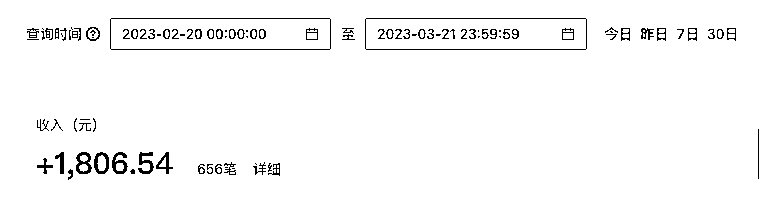

支付宝账号2：

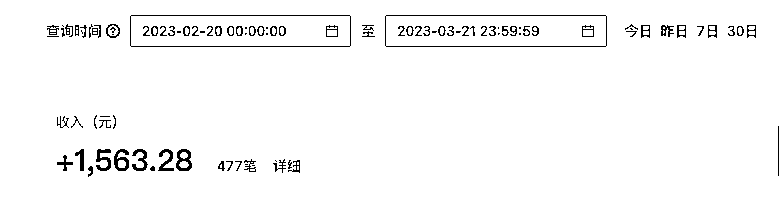

微信账号：

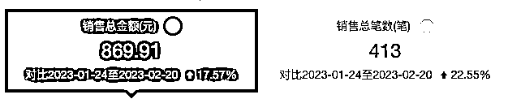

3个账号，睡后收入，在4k/月左右，加个🍗还是够了。

哎？为什么没有百度、qq、快手、字节小程序呢？

因为....你猜（因为做的少，收入不够截图的）

咦？为什么有这么多支付账号？

因为每个支付宝账号只能创建10个小程序，所以需要多个支付宝账号怼量；微信，一个支付账号就够了（但小程序不止1个，不要搞混了）。

好了，接下来从如下几个角度介绍下，如何开始做小程序？

# 1.为什么是小程序？

## 1.无需做复杂的SEO

在做小程序前，尝试做过一些独立站。但由于独立站建成以后，发现没有流量。于是找了一些做SEO优化的公司，结论就是：SEO优化太贵，优不起。充值1万起步，大概能用3个月。

网站优化，基本是黑帽和白帽两种。

白帽就是增加一些外链，给你的网站增加一些权重，相应的价格会贵一些，基本是按照每天来收费，比如排入百度非广告第二页多少钱，前10页多少钱等，价格不定。是按照词/天/第几页 收费。

黑帽的特点是：（chatGPT给的答案）：

黑帽SEO是指使用不道德、欺诈或违反搜索引擎规则的技术，以获得更高的排名和流量，但这些技术可能会导致网站受到搜索引擎的惩罚，甚至被完全禁止。

虽然网站没用上，但底层服务还是可以用的，于是考虑到了小程序。

## 2.微信、支付宝，小程序都能直达，入口流量很大

微信、支付宝，在搜索框中，都可以直接展示小程序入口，依托平台优势，能有一定流量，这些在网站就很难实现。

百度小程序，也可以在百度APP上直达进入，也是一个入口。

# 2.做了哪些小程序，为什么做这些？

目前为止，做了十几款，基本都是工具类，图片压缩、图片格式转换、图片增大、图片修复、图片转PDF等。

我将这些功能做了一个聚合页，并且进行分类，截图如下：

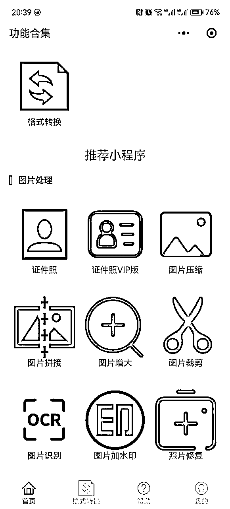

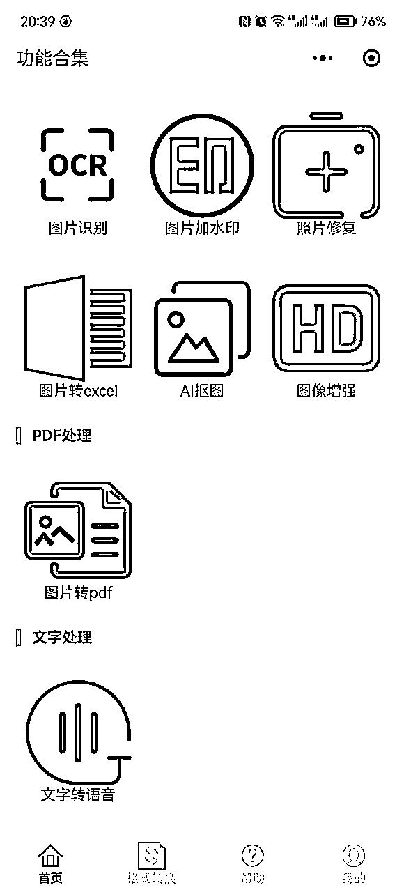

基本每个工具，就是一个关键词。

# 3.如何发掘需求

## 微信指数小程序

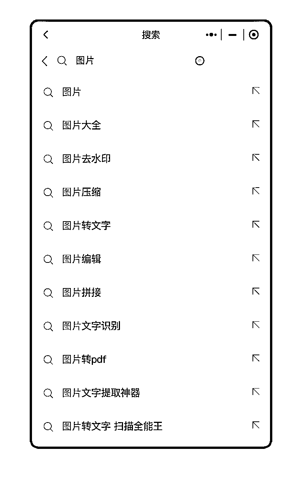

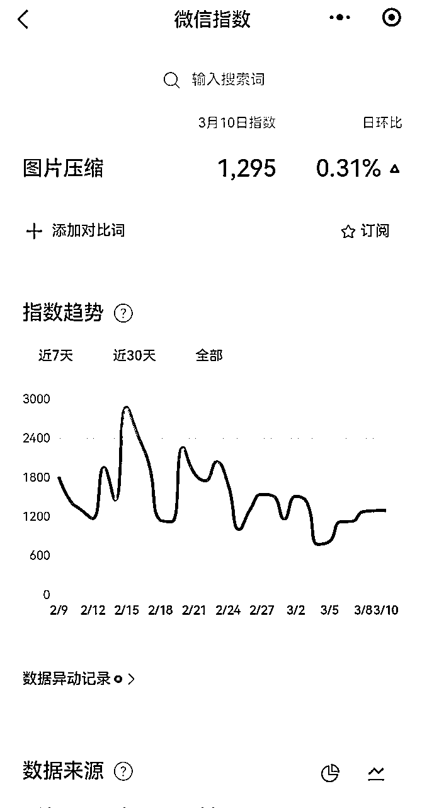

## 5118关键词检索

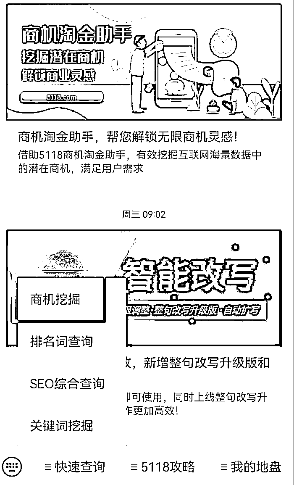

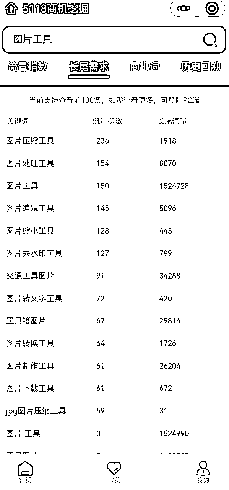

## 3.不同平台迁移

比如，将微信小程序中很火的功能，迁移到支付宝、百度、QQ，就是机会，而且大概率会成功。

## 4.寻找搜索词高，小程序少的产品

直接找这种小程序，估计会比较难。我们换一种方式：

假如在平台中，某个小程序的使用量特别大，而此时并没有其他小程序跟进，或者只有很少的小程序跟进的时候，你的机会就来了。因为，此时竞争还很小，用户的需求还旺盛，小程序很容易起量。

# 4.小程序生态对比（请重点关注）

微信从2017年发布小程序以来，各种平台基本都发布了自己的小程序。比如支付宝、百度、快手、抖音、QQ、京东，等。发布时间不同，也各有各的特点。

下面对各种小程序平台，做一个简单的总结：

## 1.微信小程序

生态：完善，接口很多，自定义程度高；

客服：较差，一般没有技术支持回复；

审核：审核较宽松，有一次小程序弹窗报错，都能审核通过。

合规：如果有图片处理、文字处理，需要接入内容审核平台，否则可能由于不合规/投诉而下架。

审核时效：很快，除节假日外，最快1小时就能审核通过。

支付：只能对安卓进行虚拟产品支付，IOS不能发起支付，只能走流量变现，重要！！

特点：竞争大，有很多免费小程序（当然大部分需要看视频广告）

变现：直接支付或者流量主（1000用户以上开通）

流量优化几种方式：

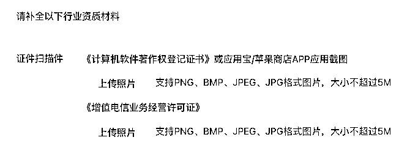

## 2.支付宝小程序

生态：完善，论坛提问题，会有官方人员回复，不像微信、QQ，跟没人维护一样。

客服：响应很快

审核：目前审核趋势，越来严格，但只要功能完备，接入内容审查（图片+文本审核），都可以上架。

合规：同微信，需要接入内容审核接口；

审核时效：相比微信慢一些，一般1个工作日左右。

支付：无限制，安卓、ios都可以发起支付。（估计以后会有变化）

特点：竞争小一些，用户付费意愿更强。

变现：直接支付，暂时没看到流量主。

流量优化：提到支付宝的流量优化，有几个点必须要做。

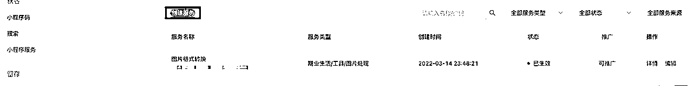

## 3.百度小程序

生态：相比微信、支付宝差很多，

客服：客服入口比较难找，而且工作时间很短，因此联系客服，比较困难。

审核：百度的审核，是这些小程序里最“事儿”的，遇到过几个问题：

合规：需要接入文本、图片审核

审核时效：一般1-3个工作日

支付：有坑

流量优化

变现：直接支付或者流量主（1000用户以上开通）

## 4.QQ小程序

生态：最不完善的小程序平台，有多不完善呢？之前的小程序声明，都是让你自己写好，挂到小程序页面的。

客服：没有，不知道如何找客服。

审核：审核一般都能通过，没有遇到审核拒绝。

合规：对接图片审核、文本审核。

审核时效：1-3个工作日，速度一般；

支付：

特点：小程序商家有红利期；

变现：直接支付或者流量主。

## 5.快手小程序

快手只上架过一个小程序，这里的特点是：

## 6.字节小程序

抖音也只上架过一个小程序，了解不多：

# 5.一些运营上的建议

# 6.成本如何

这里的成本主要包括几方面：资金成本和时间成本；

## 1.资金成本

以上几项，一年的成本，不超过5000块。

## 2.时间成本

# 7.一些开发建议

## 1.这么多平台，需要单独开发吗？

当然不需要，使用uniapp开发一次即可，uniapp还有插件市场，插件可以直接导入使用。对了，他还可以直接发布h5。

## 2.没接触过uniapp，怎么办？

没办法，从零开始，学习。看视频（建议B站），多练习。

## 3.开发顺序有什么建议吗？

当然，建议使用微信开发调试，之后再简单验证其他平台。为什么？因为好用，试试你就知道了。

# 8.项目总结以及经验分享

### 1.工具类项目特点

### 2.如何才能坚持下去