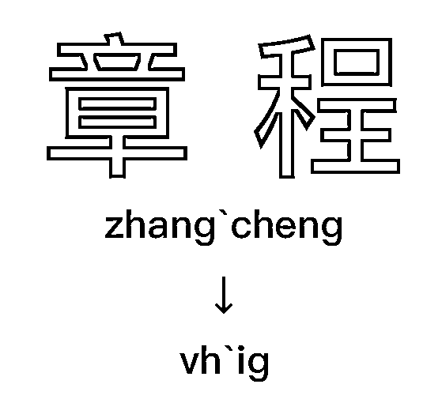
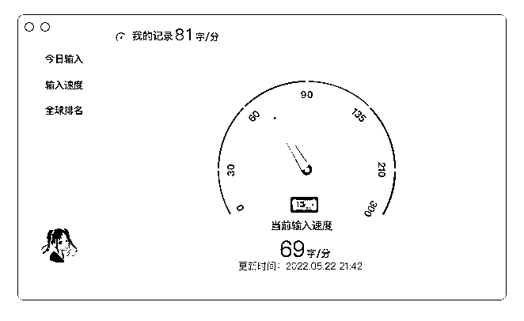
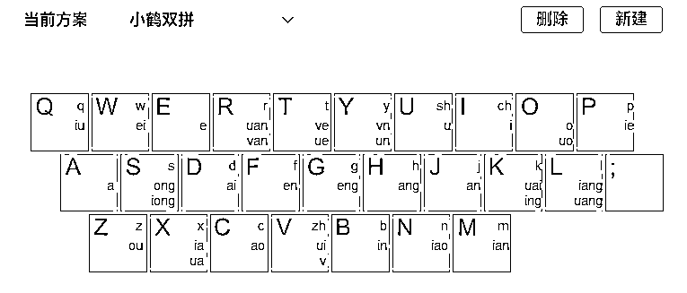
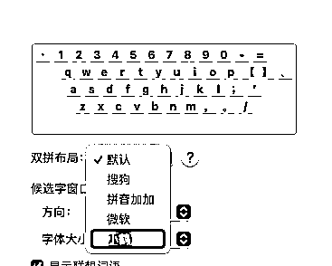
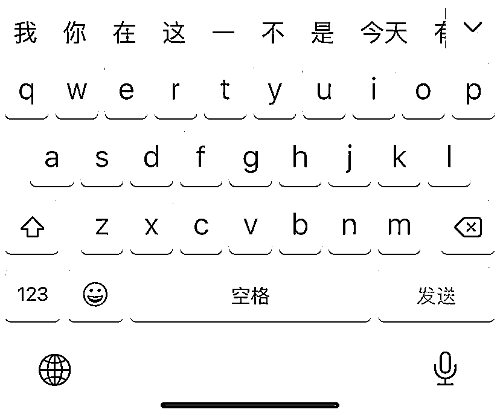
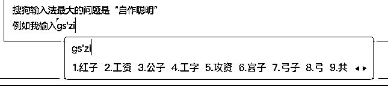
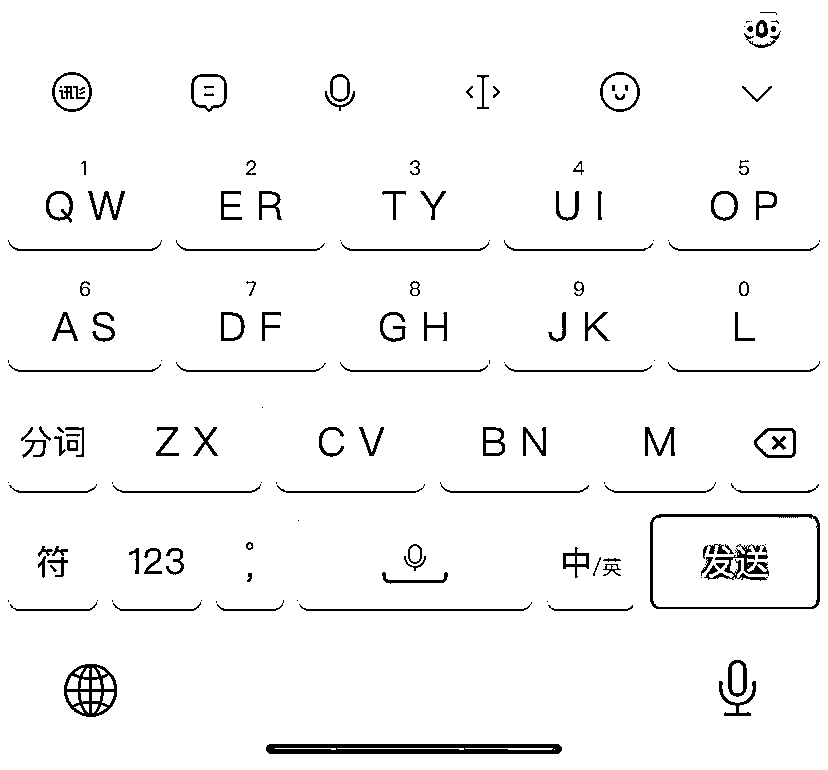
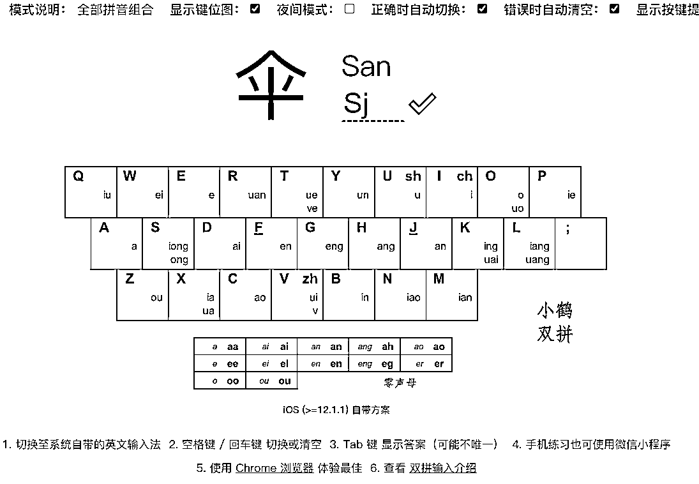

# 在这个追求效率的时代，我推荐你试试「双拼」

> 来源：[https://yqst.feishu.cn/docx/ODcddHpnqoogiuxw7WqcMbv1nJb](https://yqst.feishu.cn/docx/ODcddHpnqoogiuxw7WqcMbv1nJb)

「 输入法也可以更有效率吗？」

输入法在云猫心目中只是基本的输入工具，只要会拼音就会打字。

大部分输入法也都这种实现方式：

安装完成就能开始打字，虽然简单方便，但跟「高效」还是有一段距离。

当云猫听说在基础不过的打字能使用「双拼」提高效率的时候，疑问在脑中出现：

「双拼」如何提升效率？是否上手很麻烦？有什么输入软件可以支持？

## 一、 简化的敲击次数，让效率有提升

双拼输入法比起全拼输入法的优势，在于「敲击次数」上。

和全拼相比，双拼把一个字的「声母」和「韵母」拆分开来；

把每个字的声母韵母分别对应到一个特定的按键上；

使得所有字的拼音只需要「敲击两个字母」就能达到全拼的效果。

如上图所示：全拼输入「zhang`cheng」共敲击 10 次，而双拼只需输入「vh`ig」共敲击 4 次。

相比起全拼，每个词可以「节省 2-6」次的敲击次数，可以让输入更节省时间。

云猫在基本熟练后，打字速度基本在 60 字/分钟保底。

在思路清晰的情况下，80 字/分钟 是完全可以达到的。

## 二、 合适的双拼方案，让输入更顺手

在众多双拼方案中，云猫比较推荐「小鹤双拼」

主要原因有以下几点：

#### 1、系统级输入法支持

早年 iOS/macOS 系统小鹤双拼的缺失是一大遗憾。但随着系统的更新，苹果也加入了对小鹤双拼的支持。

所以现在的小鹤双拼达成了「全平台兼容」：Windows 各家输入法、Android 搜狗、百度、Gboard 以及各家手机厂商内置的输入法，都有很好的支持。

#### 2、不占用标点键

如微软双拼、搜狗双拼，都占用了「；」键作为韵母「ing」的按键。

↑ 失踪的「；」，并没有把需要的「；」键显示在第一页

电脑端 86 键的键盘也不会去省略「；」键；

但到了手机端，屏幕的捉襟见肘就会导致「；」键位置移动或者当场失踪（显示在标点栏里）。

这样会导致无法形成良好的肌肉记忆还额外增加操作步骤。

#### 3、不采用固定零声母，更符合直觉

在微软双拼中「o」作为固定的零声母，所以「昂」拼写「o」为「oh」，「啊」拼写为「oa」。

小鹤双拼将零声母字的「第一个字母」定义为韵母的首字母。

「昂」拼写则为「ah」，「啊」拼写为「aa」，更符合拼音的直觉，也降低上手的难度。

## 三、 好用的输入软件，让打字不糟心

#### 1、搜狗输入法

这算是国民级软件了，但搜狗输入法最大的问题是「自作聪明」

例如云猫输入「工资（gs`zi）」，它的默认候选词一定是「红子（hs`zi）」

不管你是把工资这个候选字置顶，或者把红子删除掉都无济于事。

用几个月又会变为红子，从我开始用双拼的时候这个问题就存在。

这么多年云猫也跟搜狗反馈过很多次，问题依然没有解决。

所以使用搜狗的时候要记得，有时候不是你敲的不对，而是它本身有 bug。

#### 2、百度输入法

百度输入法也有搜狗输入法的这种问题，但把候选字删除后就没再发生过这种情况。

#### 3、讯飞输入法

讯飞输入法是云猫比较推荐的输入法。

在拼写方面没有自作聪明的现象，只是词库有点少，有些词需要手动选字。

并且手机端的输入法支持「双键位」模式，可以极大降低全键盘的误触，但会增加重词率。

PS.不过不太建议一开始就用双键的皮肤，会导致键位记忆错乱。

PPS.搜狗输入法作为第三方使用率最高的输入软件，基础联想词等输入相比讯飞更加优秀。只要注意到错的不是我们而是它，用搜狗也并没有太大问题。总之，用你最顺手的输入法先跑起来再说。

## 小结

1、 我们一起探索了双拼的使用方法，发现一个字只需要敲击两个字母，输入效率会有较大的提升。

2、 我们一起寻找了合适的双拼方案，发现小鹤方案全平台兼容、不占用「；」键，作为了我们的首选。

3、 我们一起测试了好用的输入软件，发现讯飞不会出 bug、支持双键位模式，作为了我们优先推荐。

## 四、 下定决心，就要说换就换

如果你有整段的时间

那基本「一下午」就能记住大部分的键位，「一至两周」基本熟悉，「一至两月」完全熟练。

如果你只有零散的时间

完全可以最近一段时间，把键位表设为桌面背景、聊天背景；

随时打字，随时查看，基本两周左右你的肌肉就能记住大部分键位。

如果你决定要用双拼要换就当场换掉。

千万不要一会儿用全拼，一会儿用双拼，这样只会导致快速的放弃。

云猫当时就跟身边的人说：

「我最近换了输入法还在适应，打字有点慢，谅解下，如果着急我可以先给你发语音。」

大家也都表示理解，不要有太大的压力。

所以，换上双拼后一定、一定、一定不要再换回全拼！

跳出舒适圈，只需要很小的代价，你就能获得输入效率的提升。

## 五、 手握利器，更要勤于练习

如果你打算来会一会双拼，看看它有几把刷子，那必要的练习也是不可或缺的。

原本小鹤双拼官网有一系列的练习工具，但是用下来有些许不方便。

云猫在这里推荐 BlueSky 开发的双拼练习网站，电脑手机均有支持。

云猫在学习双拼时，使用的是郝海龙老师推荐的「打歌词」方法。

因为大部分歌词都是比较押韵的，你可以选一些你喜欢的歌词来做打字练习。

## 总结

在这里我们思考一个问题：

未来几年甚至十几年你都花较多的时间在打字上。如果不提升效率，会浪费多少时间在单纯打字上面？

如果现在花不到一个月的零散时间投资到双拼上，未来打出的每一个字都会节省一点时间；

短时间可能感觉不出什么，那么我们把视角拉到以年为单位的时间下；

可以看到积少成多，这一点点的时间投资，将带来非常可观的收益。

尽管双拼输入需要一点点时间来练习，但也远比五笔输入「方便易学」。

双拼输入法是显而易见「提升效率」的工具，并且不像其他效率工具一样，容易使用一段时间就荒废。

双拼输入法你学会了，绝对是一项用了就回不去的「真香」技能。

在这个事事都追求效率的时代，不妨你也换用一下双拼，来体验一下畅快打字的感觉。

* * *

以下是生财星球引言，不需要看啦~

在这个追求效率的时代，我推荐你试试「双拼」

各位大佬好，我是云猫，一个划水的小透明。

每天在星球围观的时候，发现星球中对于提升效率的文章少之又少。

常言，时间就是金钱。提升效率=节约时间=节约金钱，所以提升效率也是生财之路嘛~

生财的大部分球友都从事自媒体工作，写作可谓是每天必不可少的一项事情。

在这里我们思考一个问题：

未来几年甚至十几年你都花较多的时间在打字上。如果不提升效率，会浪费多少时间在单纯打字上面？

文章目录如下：

一、 简化的敲击次数，让效率有提升

二、 合适的双拼方案，让输入更顺手

三、 好用的输入软件，让打字不糟心

四、 下定决心，就要说换就换

五、 手握利器，更要勤于练习

详细内容，移步飞书阅读