# 通过床品+表白墙半年利润10w+，我是如何从0到1的?

> 来源：[https://k97wti947e.feishu.cn/docx/Qb1ldkXAkoQSbpxr6M8cWibDnXg](https://k97wti947e.feishu.cn/docx/Qb1ldkXAkoQSbpxr6M8cWibDnXg)

## 前言

如果在看的是个大学生，你也可以借鉴我的经验通过校园业务去变现；

如果屏幕前的大家做项目遇到瓶颈，可以来文章中找找灵感，希望可以帮到迷茫中的大家；

如果是有幸各位行业大佬看到，也请多多指教。

我也知道赚到的这点钱在这里对大家来说都不值一提，也没啥值得炫耀的，。

写下此文是对自己到目前赚钱经历的拆解，复盘，记录，也希望可以帮助到一些的迷茫中的大学生。

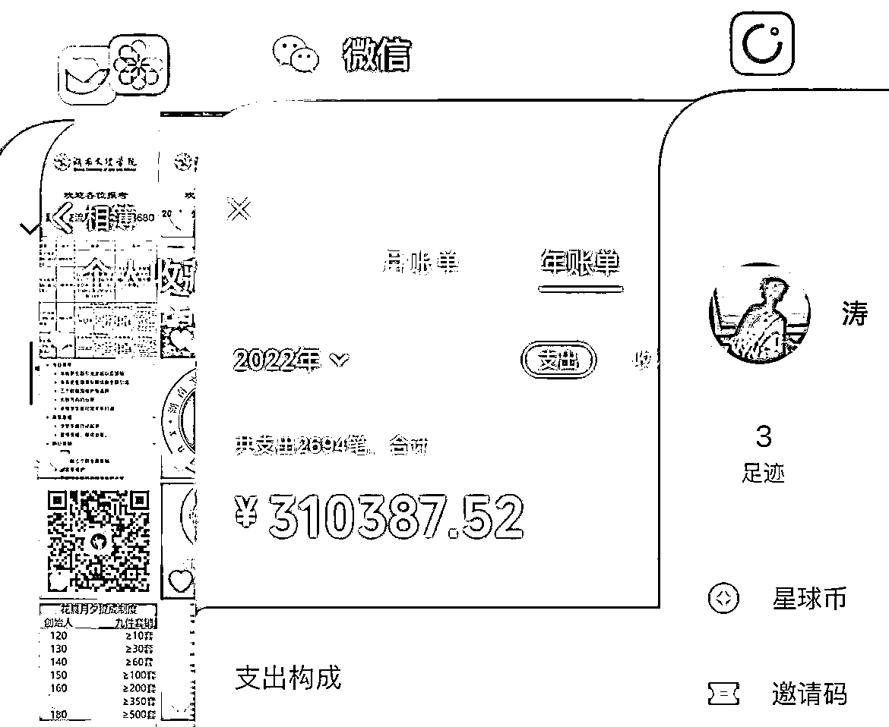

## 目录:

1.做项目搞钱历程

2.针对新生季如何引流 选品 营销 变现拆解

3.校园墙从0—1起号历程以及后期变现

4.个人发展方向规划

* * *

## 一、做项目搞钱历程

### 高中·浅尝闲鱼

高三上半学期的时候，因为疫情在家上网课，自己没钱花了，也不想和家里要钱，偶然间就下载上了咸鱼，把一个亲戚送的一个阿迪鞋子和衣服挂上去卖，没过一周就卖了出去。

然后自己有钱花了，发现咸鱼真的是个新大陆，现在想当时还挺有意思，梦想长大了当一个美妆博主，所以那段时间经常在家里研究护肤品，在闲鱼上卖自己的闲置护肤品，卖了几个几乎没利润，价格太贵卖不出去。

但是我发现其他的卖家卖的很便宜，了解到了咸鱼上面卖护肤品是暴利，因为当时平台管理不够严格，很多人卖的都是J的护肤品！

几百块的护肤品，成本竟然只有二三十，立马开干，找到货源（说是和正的原料一样），卖了几单赚了差不多一千块，后来被买家发现了。

自己也觉得做这个良心过意不去就不做了，这也算是自己第一次在网上赚钱做小生意了，也是因为咸鱼打开了我这个“咸鱼”搞钱的欲望和视野。

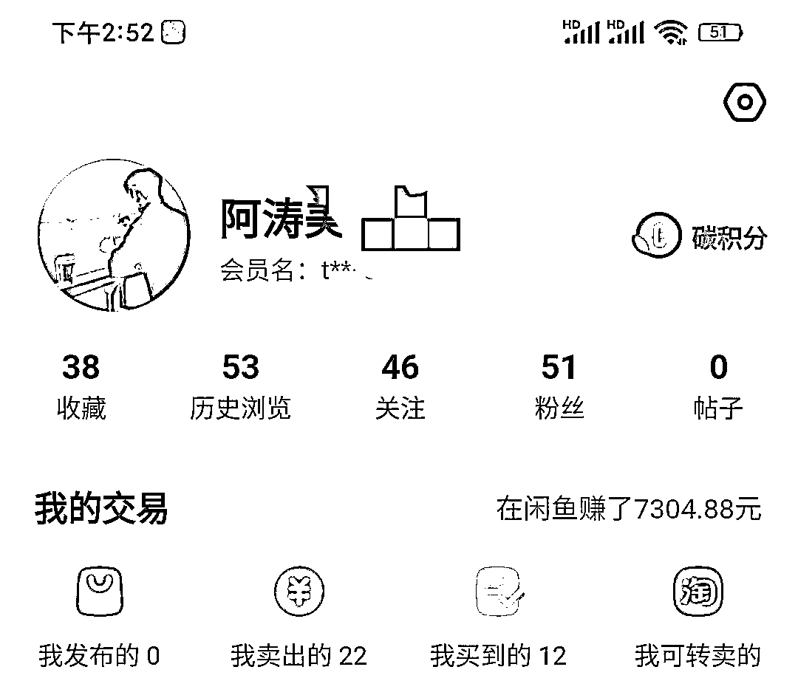

### 高中·网拍下单

在互联网上赚钱是做网拍，当时是高三，上半学期在培训机构学舞蹈艺考，下半学期去学校上文化课了。

在学校真的学不进去，家里给的钱不够用，看到朋友圈有人发网拍晒单截图就开始299入会了，这个也就是帮淘宝的商家s单。

当时坐在第一排，每天上课下课都在拿着手机接单赚钱，搞了四五个淘宝号，一单七块，有时候忙的手忙脚乱，一天下来也能赚一百多块钱，当时赚的钱都去买护肤品了，买了一大床哈哈哈。

但是也因为S单微信号被封了一个月，后来知道这个有些wf也没搞了。

高考完的暑假考了个驾照，在快手上拜师找了个十万粉丝的师傅学习剪辑励志文案，做了一个多月一百多个粉丝没啥起色，坚持不下去就放弃了。

短视频师傅后来做到了一百多万粉丝把号卖了，了解到他是在厂里一边流水线打工，一边靠做这个剪辑副业赚钱，当时真的很激励我。

虽然短视频上没学到什么，但是他把他的经历告诉了我，再加上这段时间看了很多励志的文案，我的心里也萌生了这辈子也不想进厂打工的想法，一定要有自己的一番事业。

### 大学·学习演讲做地推

#### 学习演讲

我是来自山西的一个小村庄里面的，家里条件也一般，就想着走出去多看看，一定不报考本地学校，要报考南方的学校，通过艺考考上了一个湖南的二本大学，果然运气好，第一志愿就被录取了。

我从小是那种性格内向的三好学生，可是在初三某老师的原因差点辍学（老师每天打人，不打人手痒痒的那种，我把自己的座位从讲台旁边搬到后面黑板的垃圾桶旁边）。

上了高中后就变得不爱学习，一边结交交狐朋狗友，一边结交一些好学生，两个圈子都混，性格也外向了很多，但是口才还是一般，当时已经感受到了口才的重要性。

通过上大学前在百度贴吧搜索加的大学迎新QQ群，到认识群主买她代理的被子，再到当她的小代理卖了十几套被子给同学，我也与被子结下了缘分。

也是通过这个学姐，刚刚入学加入了一个在本校招生的培训大学生演讲口才的机构，刚刚开始自己的普通话很不标准，吐字不清，通过不断地在个个宿舍 ，操场，演讲台，大街上练习。

让同学给我录自己的视频，不断挑战自己，自己的胆子和普通话都提升了很多，也在五十多个学员中脱颖而出。

从小学到高中都是私立学校，学习一直以来对我来说都是被迫的事情，上大学了自己的价值观开始逐步的形成，也有了自己想要全力以赴去做的事情，现在回想起来这段经历，也是第一件让我感到有成就感的事情。

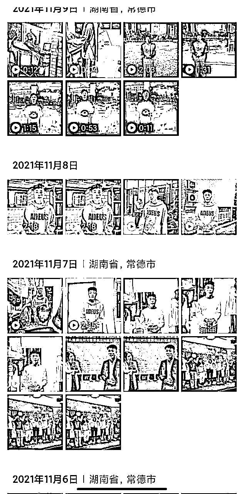

因为上学期的表现还不错，演讲团队的老板和讲师对自己也很看好，大一下加入了他们的内部团队帮忙招生。

开课后拿起相机担任了第二期演讲培训团队的摄影摄像师，因为自己想着之后会往互联网这方面发展，摄影这方面也要学习，在此期间也在学习主持，把大部分时间花在了提升自己上。

#### 美团地推

有一天我们在宿舍里坐着，有人敲门进来，来我们宿舍地推，帮助他们在美团上下单蛋糕，然后把钱还给我们，还送一瓶饮料。

我就试了一下，并软磨硬泡问出了他当时一单的利润，还说我们也想做，我就顺势联系到了他当时的老板，快速的把我们宿舍以及几个同学组建了一个地推团队，告诉老板我们有团队，可以每天去地推。

老板来我们宿舍一番交谈很信任我们，一天一百多单给到我们，一单利润除去礼品5块，带着几个同学当时一个月能赚两千多够生活费了，每单我抽一块。

为了赚钱面子什么的都又有啥，我们在食堂，路上，各个寝室楼地推，每天各种事情忙的上课都是卡点到教室，特别忙，但是进步很大的一个学期，通过做地推也开始经济独立了。

在当时，用地推赚的钱入了淘金之内的几个付费的知识星球，还买了台苹果13。

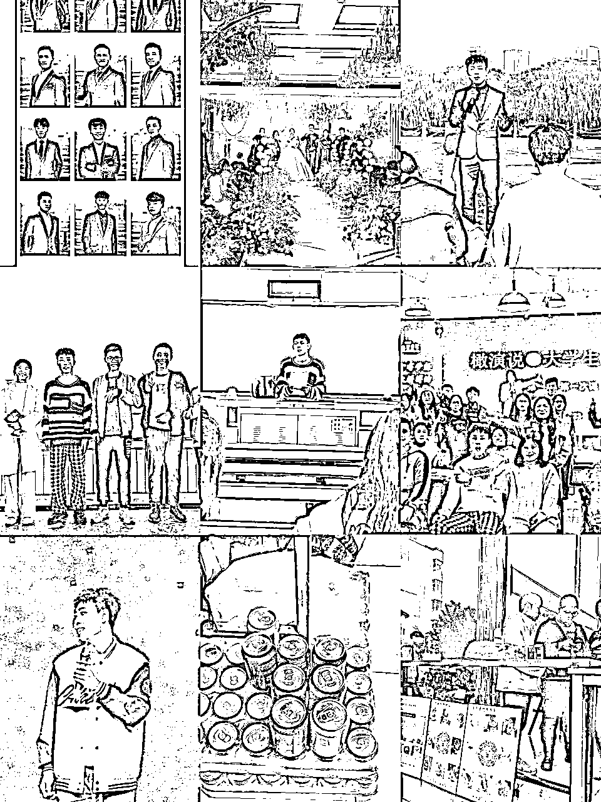

* * *

## 二、新生季如何引流 选品 营销 变现拆解

### 1.卖校园床品的原因

1.听说了卖校园床品很赚钱，去年那个学姐暑假赚了一万多（对大学生来说已经很多了）；

2.在抖音上看大学生创业博主加了微信:业务内容包括这个板块，利润高，以及包括在大学可以做的的各类业务，朋友圈每天都在晒线下学员反馈，自己在做地推赚钱后就交了5000定金想去线下学习，当时没想太多。

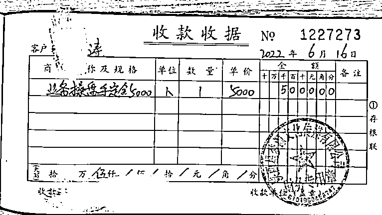

一放暑假就去了线下公司，是专门做大学生的各类业务的。

床品是线下的互联网公司去对接的棉被商的货源，从零开始做小程序去选品，去做床品类目的小程序，也是在我去了线下，我建议去做的

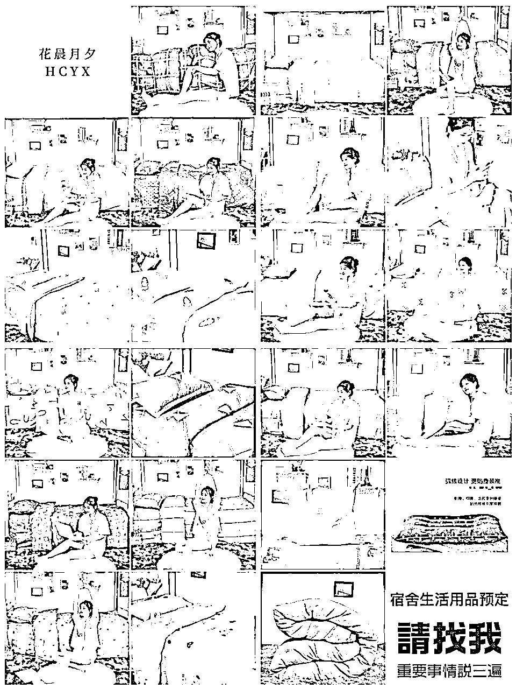

做校园市场，在新生开学之前卖床品，最重要的还是如何去引流新生流量，如何提前布局。

我们这一点做的还是不错的，在刚刚高考完，六月底左右。我就和去年卖我床品的学姐一起合作，让她当我的合伙人，今年也一起来卖校园床品，她还叫了一个朋友，我们三个人基本就包揽了这次床品的引流和营销推广。

我们前期计划我负责引流到群聊，他们来负责成交销售，接下来分享一下我是我是如何做引流的

### 2.全渠道seo引流

这个意思也就是不放过任何一个渠道的流量。

在大家都关注，可能会去搜索的平台（QQ群排名、百度贴吧、微博、小红书、抖音、哔哩哔哩、知乎、今日头条等都留下我们的引流文案和钩子，接下来就是我操作的具体细节了，内容非常干！

现在先看一下百度搜索去年新生群

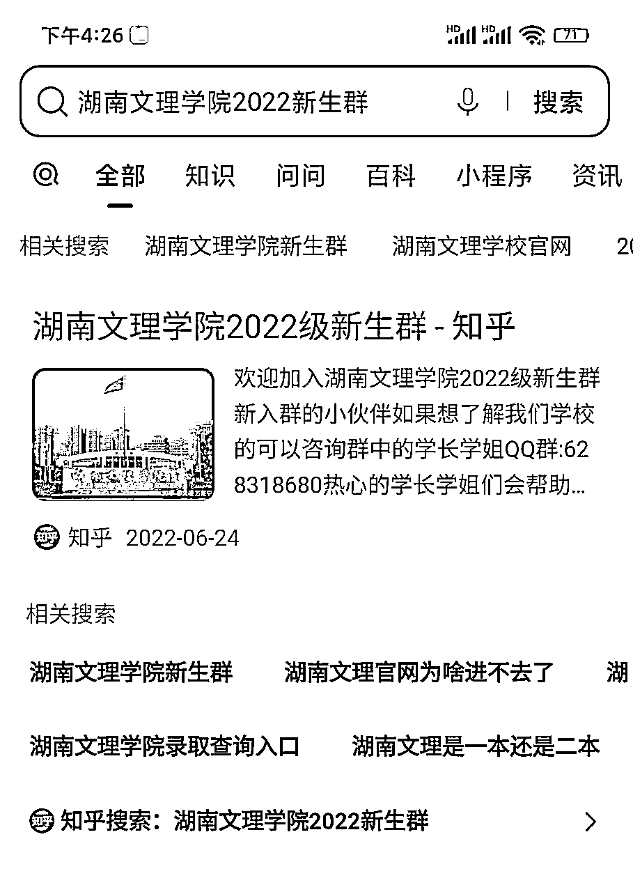

#### 2.1百度贴吧引流

是通过在本校的贴吧内发布关于学校介绍的帖子，图片上附上本校的QQ新生交流群。

同行在搞新生群的有十个左右，我当时由于和贴吧吧主在之前打好了关系，刚刚开始十几天的时候同行发帖子我就给他们删除了，真的是霸道了哈哈哈。

但是吧主很快就发现了我这样子做，他为人很正直，不愿意去参与这些利益的纠纷，觉得只要是在贴吧发布有用内容的帖子都是对新生好，我这样子做有点恶性竞争了，后来就把我这个小吧主给撤销了。

之后的大量同行的帖子发布，并且也在不断的评论区顶帖，顶贴的目的是为了把自己的帖排名冲到本吧前面并且在百度首页有展示。

#### 2.2QQ群排名引流

还没进入大学之前，高中生玩的QQ会比较多，经常会用QQ搜索群。

如何创建自己学校的QQ新生群，并提升排名呢?

有这么三个需要去注意的点:

1.设置好QQ群的名字和资料，从学生的心理出发，揣摩他们搜索的关键词一般是某某学校新生群2022；

2.群管理还有群主以及群内活跃人数占比，每天都要在群里说话，刷等级，这样子对群排名的等级；

3.群资料要引起重视，要把学校的各种信息都填充到群资料里。

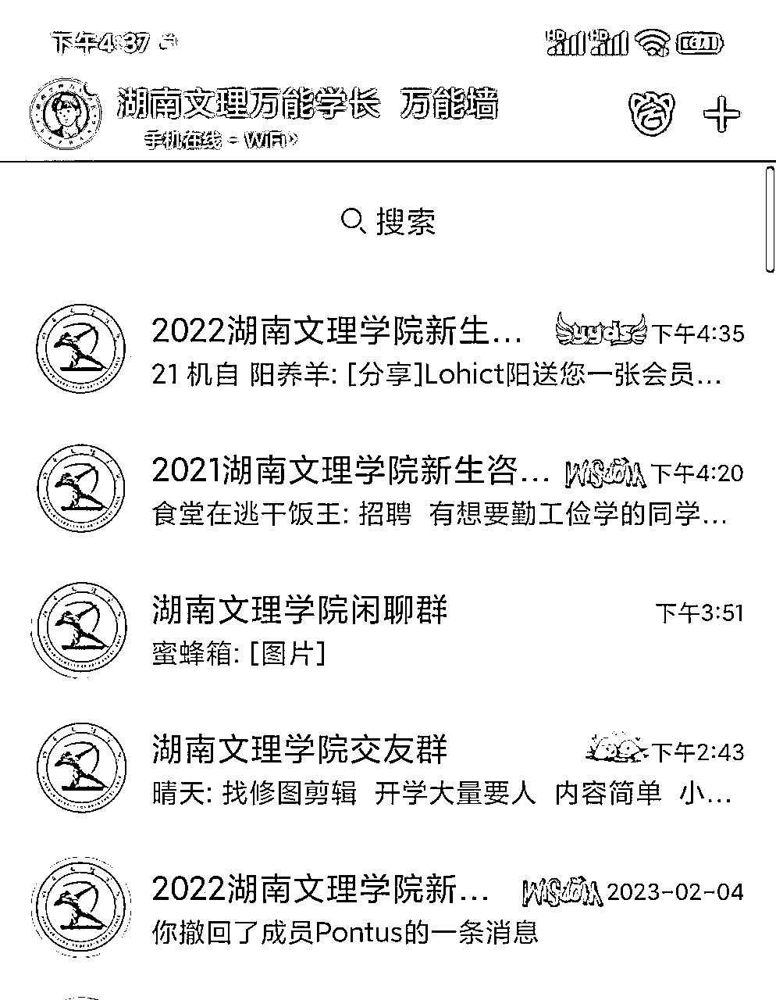

在七月中旬的时候，经历了一波流量高峰期，每天大概进群两三百个，群聊人数加起来有3000多。

这时候也决定快速起号做本校校园墙，利用群里的流量发布群公告，让他们添加本校的校园墙。

#### 2.3小红书引流

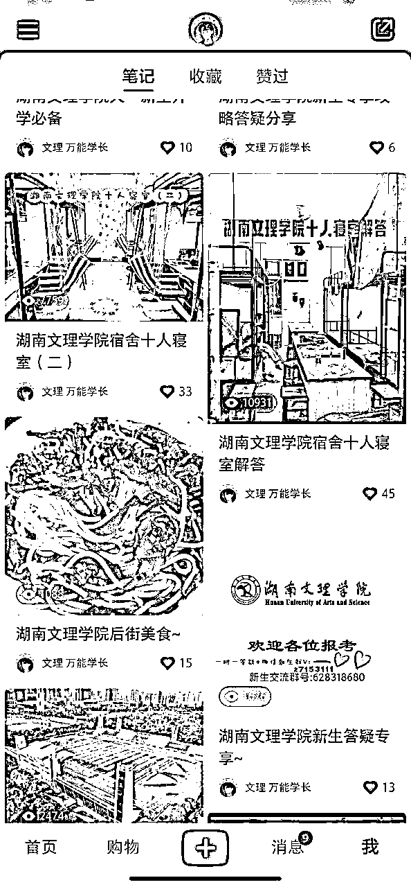

通过图文的形式，给同学们介绍本校近年来的录取分数线，宿舍各个学院是几人寝室，本校的风景，美食等等来引导大家加群，并告诉大家群资料内有他们想要的所有内容。

#### 2.4微博引流

一般关注微博的女同学很多，我们就把在百度贴吧内发的帖子，图片以及新生可能会遇到的问题，重新在微博里复制粘贴一遍。

由于竞争对手很多，我通过不断的顶帖，使我们发布的内容以及群二维码能够在本校微博的最前面，最先让同学看到。所以当时每天不是在顶帖就是在顶贴的路上。

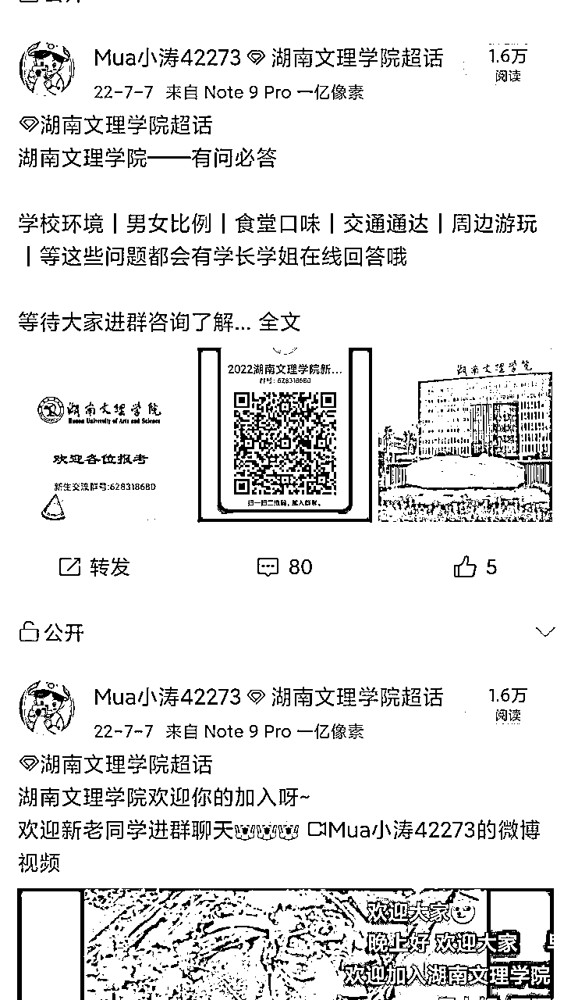

通过上面的引流步骤，只要是在每个平台去搜索关于我们学校相关信息的，都会看到我们发布的帖子，想了解更多信息的就会进入到我们的QQ新生群。

### 3.如何销售床品变成

那我们又是如何去通过新生群来获取进群同学们的信任，进而销售床品呢?

首先我的合伙人学姐还有另外一个兼职的同学，把他们设置为管理员，有进入群聊的消息就在群通知列表，先添加好友，然后再同意进群。

自我介绍一下自己是学长学姐，以一个热心学长学姐的身份来帮助同学解答疑惑。

这样做的确帮助了同学们去了解学校的情况，帮助参考他们的分数是否能报考我们学校，同时也获取了同学们的信任，一举两得。

有时候一天号加200个，被限制了解除限制继续加，一边加好友，一边在群里欢迎新进群的同学，帮助同学们在群里答疑解惑。

等大家都确定了被我们学校录取之后，就开始在朋友圈和空间表面学着学习，也是在做一个卖床品的兼职赚取生活费。

刚刚开始的十几天效果非常差，那时候离开学还有一个多月，很多同学都不着急买，当时已经到七月中旬，来到线下一个多月，也是第一次体验到了每天不赚钱，但是还有房租、生活成本的压力。

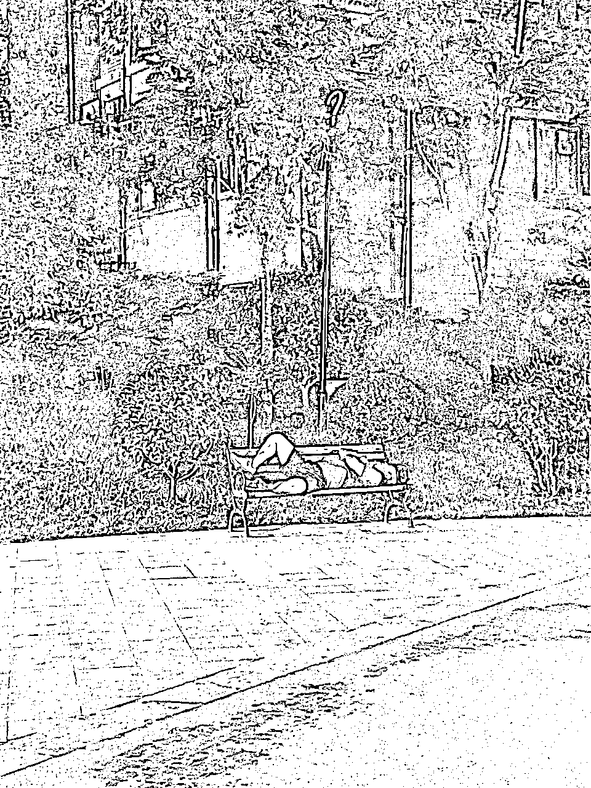

西安的夏天很热，就这么在公司里几乎每天重复着重顶贴，发帖，收集本校资料，帮助同学解答疑惑。

在线下公司吹着空调，对接到了货源，见识到了更多赚钱的模式，认识了几个志同道合的朋友，但是关于自己做的新生群以及床品销售方面并没有学到什么。

都是自己一步一个脚印，一点一点积累，一个一个问题回答，一个又一个困难解决，一个坑一个坑踩出来的。

每天都是最晚下班，最早到公司，可也是最焦虑，就像上面这张图片上的老人，当时晚上12点多来小区睡觉前拍下的，自己一个人怀揣着梦想，来到陌生的城市闯荡，快一个月了，还没什么名堂。

和路灯下的老人又有何两样呢，那一晚我记得很清楚，回到住的地方彻夜难眠。

到八月份的时候，迎来了第一波的小高峰，那时候一天他们能出十单左右，产品有449的六件套和598的九件套，一单利润180左右，每天的朋友圈宣传，主动去问，连续稳定每天十单一个周左右。

接下来也有陆陆续续出单，在这期间我带着在淘金星球认识的一个志同道合的大学生@一卒兄弟，讲述了我新生群引流的方法。

兄弟的执行力也很强，迅速起了两个学校的新生群，十几天都做到了两千人，同时也在运营我们附属学校还有湖北一所学校的新生群。

一个不是自己学校的新生群，在运营到五六百人的时被他们学校人发现了群主不是本校的，然后被举报了，但是招了一个本校有点影响力的代理卖了三十单，附属学校卖了十几单。

离开学十天前左右，当时大概两百单了一共，利润也是靠单量去抬起来的，单量三百单以上单价更高，我也从公司回到家了。

他们两个也做了一段时间都找理由不想做了最后，我也就开始自己每天在QQ群发公告，发动态，发朋友圈，主动私聊去卖被子了，同时也组建了校园墙的团队给自己账号去打广告。

十天时间卖了接近一百单，每天忙着收钱到支付宝，微信全部被限制了。当时最牛的一天买了二十单。纯利润接近四千了，当时真的很激动。

后来还让公司多发三十套到线下去卖，一共三百多套。

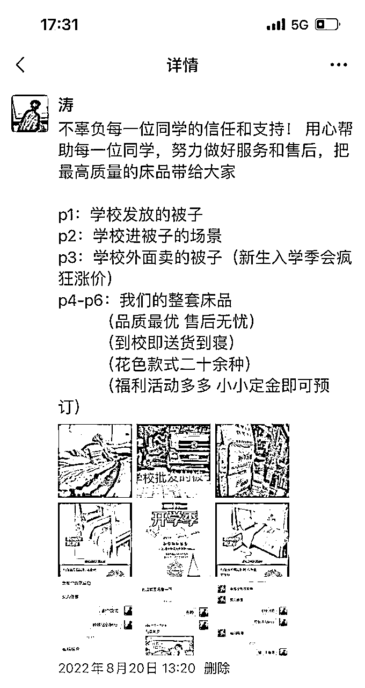

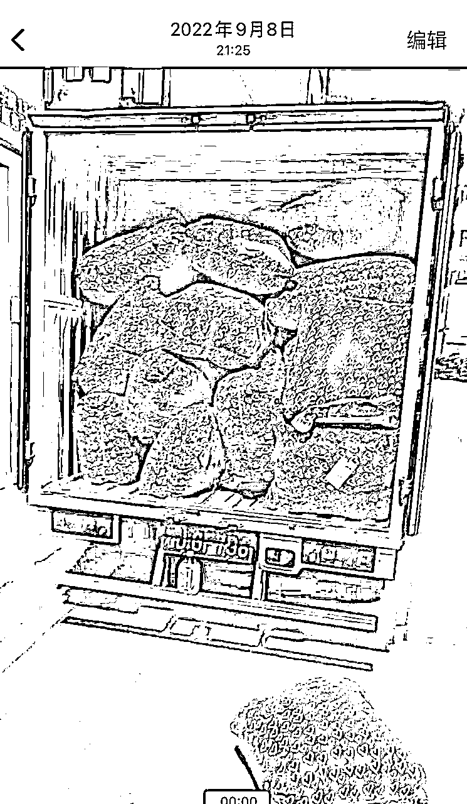

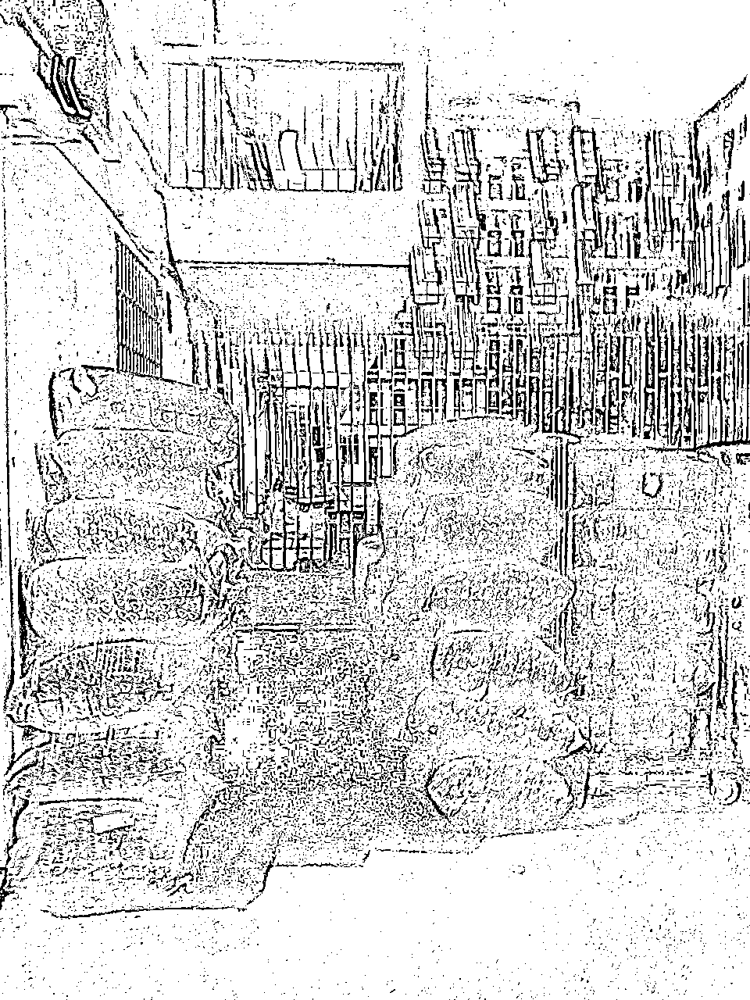

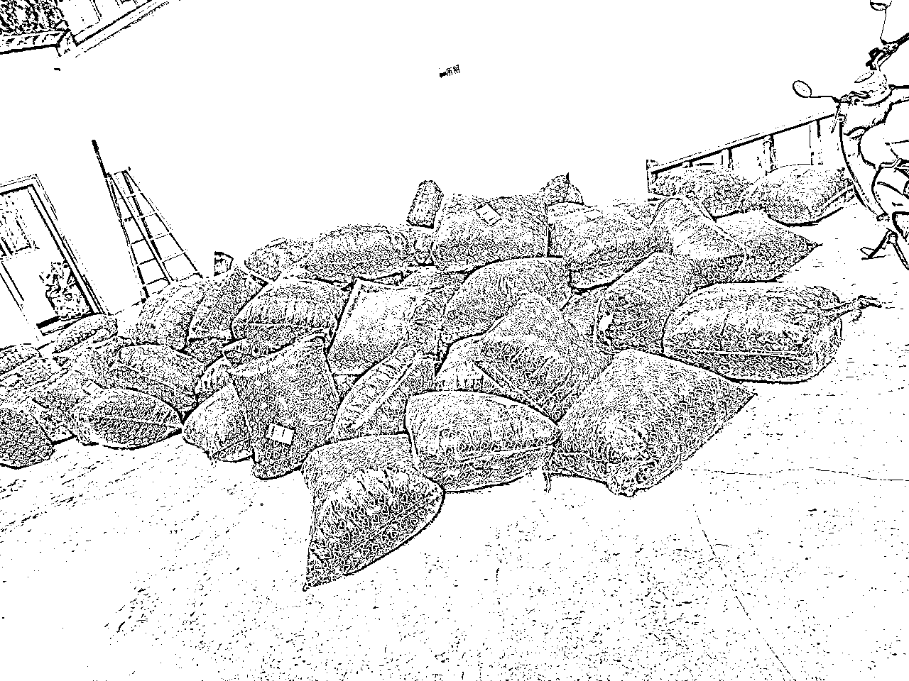

### 4.如何对接学校快递站

300来套被子，在暑假中就提前联系了学校的个个快递站，校内有顺丰和邮政还有一个菜鸟，顺丰单个要三十五元以上，邮政老板店里已经放不下了（马上开学很多同学行李都邮寄学校），菜鸟的老板也说他们那里满了，放不下。

但是那个哥看我这样子也挺不容易的，于是答应帮我，开着大车和我一起去快递中转站搬了四大车的被子，上面只是一部分，还有很多分布在各个宿舍。

大学就是小社会了，我也是不会白白让哥帮忙，经常会去给哥带好吃的，买烟，还有带帮助过我的同学们吃饭，喝奶茶。

雇人一个一个的骑电动车把被子送到大家的宿舍开学当天，当时找的送被子团队不靠谱，送了几套太热了没人送了，自己顶着大太阳送了一天，没有吃饭，差不多晚上的时候带着舍友送到晚上十点多。

看到送完的被子整个人都轻松了！

分给合伙人的钱:

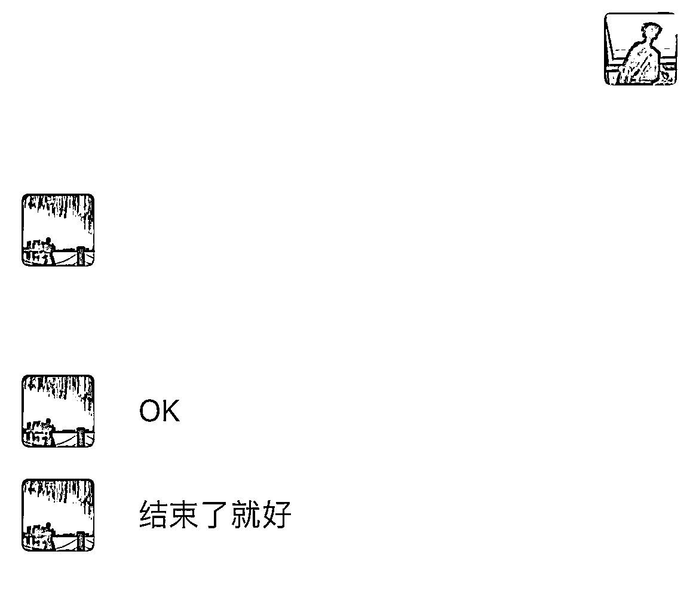

* * *

## 三、校园墙的起号历程

因为自己在做新生群，但是流量都在群里，我就想过了暑假就没有什么价值了，群也不会经常看，于是想到了把人都引到私域里面，就想到了这个做校园墙的方法。

通过在QQ群里设置校园墙管理员，@全体成员加好友，把人引流到了QQ墙，但是微信的私域价值更大，我就想到了通过建微信的新生群，然后通过校园墙QQ发公告引导建个个学院的新生加我微信然后拉他们进自己学院的微信群

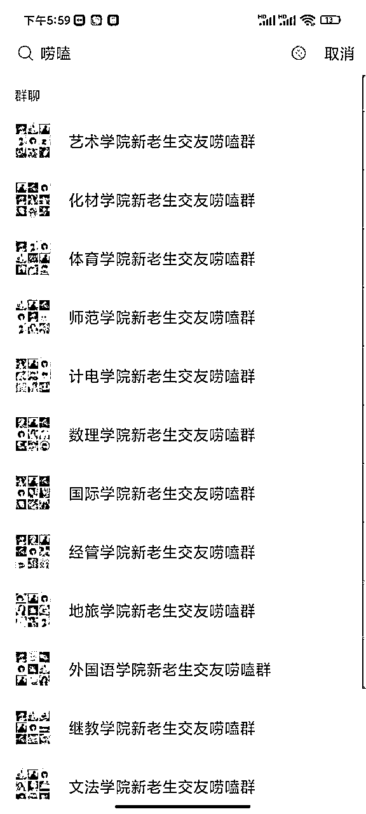

两个总的微信新生群+个个学院分群，都是我这个墙号是群主，影响力直接有了，接下来就是通过举办活动来引流了。

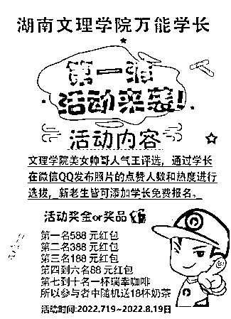

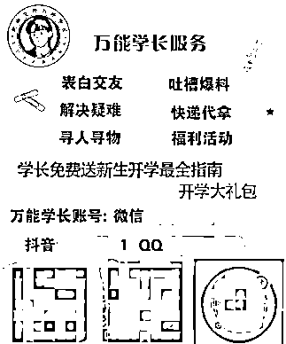

通过一波活动，邀请了一百多位同学参加，刚刚开始有人投稿，毕竟是金钱的魅力，但是没过2天，大家就没那么多新鲜感了。

我就在抖音上面一个个的私信，让本校的美女帅哥邀请大家参加，果然是主动才会有故事，通过这次的活动，万能墙号的投稿量就起来了。

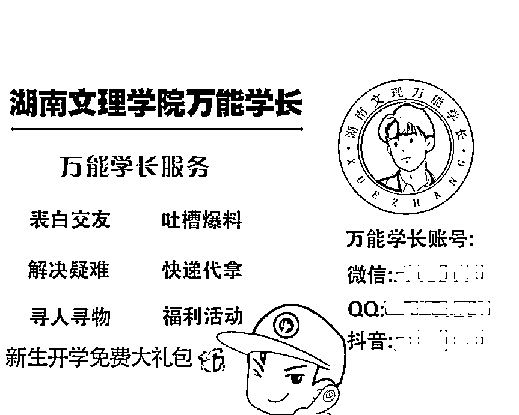

然后不断的发大家的投稿，帮助大家回答问题，对于后期变现还是比较苦恼。

但是很快就接到一个关于投票活动的推广，通过朋友圈，个个微信群，QQ空间，QQ群宣传，十天左右的时间，浏览量达到了十几万，广告费都估计一万多了。

同学们通过刷礼物的钱，我大致算了一下有近3万，这个小程序开发商是我们学院主席给我推的，说靠谱，最后礼品邮寄了前七名的礼品（不到两千块的东西），我们一分钱没拿到。

当时承诺十票以上的同学都发一下智能手环，最后啥都没给，发消息说放假了，最后都不回了，那个主席也自掏腰包买了一百多个手环，为他们盈利了四万多，真的是不能不说一句网上的骗子真的很多。又成功入坑了。

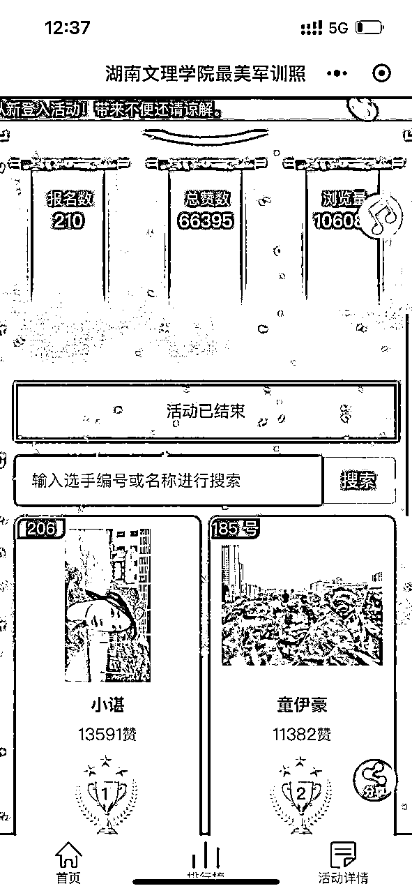

如今的话，账号一个学期，学校的各种老乡群，快递代拿群，洗衣群，唠嗑交友群都是我们团队在运营，校园墙人数也做到了微信5000+，QQ2500+。

平时就接一些靠谱的商家推广，每个月大概接十条，一条单微信收费是128加QQ一起，共168/条，平时帮朋友推广一下驾校和校园卡业务，持续至今至今七个月。

自己也慢慢放手交给团队去运营账号。

* * *

## 四、个人发展方向规划

读万卷书，行万里路，阅人无数，名师指路。

虽然自己也凭借着自己的努力赚到一些小钱，但这段经历也让自己成长很多，让我看到了自己的很多不足。

接下来就是多读书，多思考复盘，多交益友，成长的路上虽然遍地荆棘，有时候会走的慢，但是我永远不会停。

下学期在校规划:在学校多读书，多思考，做一下小红书电商

暑假希望有机会去杭州闯一闯 希望有机会接触到更多优秀的人和公司，有老板公司可以实习的可以联系我，包吃住就可以了，绝对嘎嘎努力

非常感谢生财这个平台，虽然进来的时间不到一年，但是看很多大佬的分享，提供了很多的思路和方法，都让我运用到了自己的项目中，希望2023年和生财圈友一起搞钱，冲冲冲！