# 《小红书创作利器，ChatGPT！》

> 来源：[https://aogot4f9us.feishu.cn/docx/TQMkd13LIos5sexxqWZcBHMUnif](https://aogot4f9us.feishu.cn/docx/TQMkd13LIos5sexxqWZcBHMUnif)

大家好，我是大家生财路上的同路人常常，非常感谢生财的邀请，今天来和大家做些ChatGPT实践方面的分享。

分享内容主要是“如何使用ChatGPT辅助小红书笔记创作”。

为什么会是我来和大家做这个分享呢？

我觉得主要是考虑2个点，一是我是小红书IP航海实战群的领队，也在去年10月份航海中，通过100天，实现账号涨粉14万+的成绩，在笔记创作方面有比较丰富的经验；

二是从12月份以来我就一直在探索ChatGPT的新技术应用，翻译过一本国外的提示词艺术书籍，也做了一份88个实践案例的小册子，积累了比较丰富的ChatGPT实用经验。

一个是我擅长的平台，一个是我熟练地技能，ChatGPT+小红书究竟能够做到什么，不光大家好奇，我也十分的好奇，所以在一直摸索，寻找合适的模式，并且希望能把我最近的探索和实践分享给到大家，希望能和大家一起共同交流，相互启发。

我相信，在过去21天的航海实践中，通过教练的分享，阅读航海实战手册，以及大家之间相互的学习交流探讨，大家已经对ChatGPT有了初步了解，那我就以这个基础为前提，节省大家的时间，开门见山，直奔分享的主题。

本次分享主要解决2个问题，顺带更新最近一些新的ChatGPT使用思考：

（1）好不容易拿到 ChatGPT 账号，不知道如何提问？这五种ChatGPT提示关键词可以快速帮你找到优化提示的思路；

（2）创作小红书笔记，不知道如何提问，文章中以小红书笔记创作为例，给你具体使用案例。

（3）新的ChatGPT使用思考。

本次分享内容大纲图示：

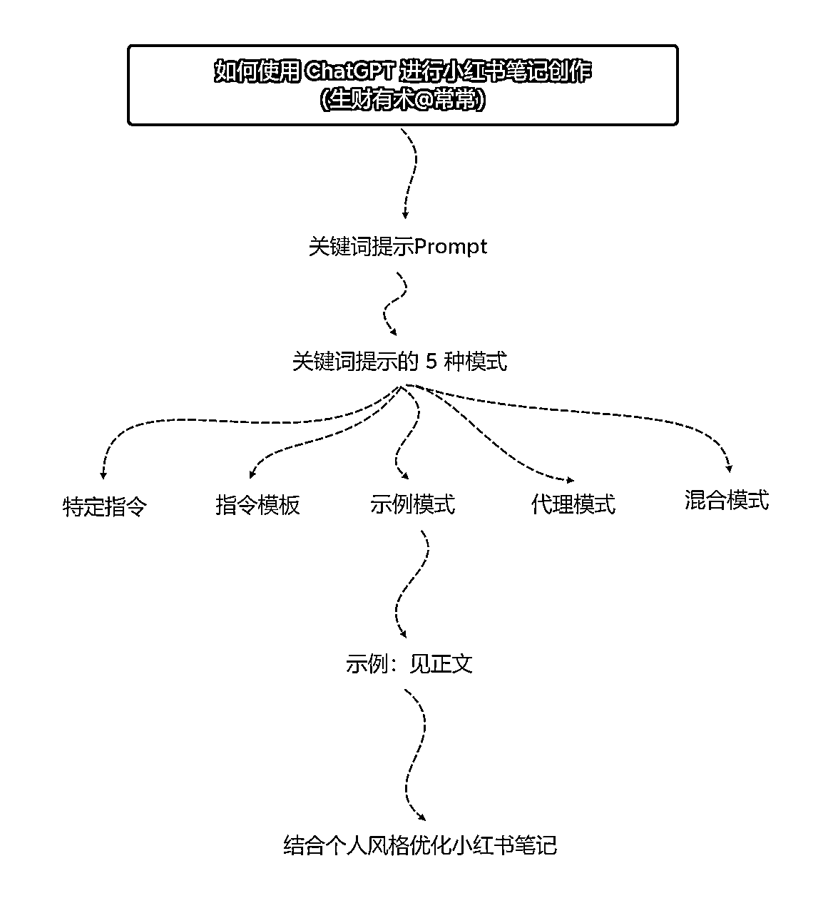

大家应该有感觉，与ChatGPT中GPT-3、GPT3.5这个自然语言处理模型打交道，最重要的就是Prompt提示关键词，一个好的提问能够让你快速得到想要的答案。

在我帮助朋友、圈友使用ChatGPT的过程中发现，一个好的提问决定了这个人是否能够长时间使用ChatGPT。

因为好的提问，会让ChatGPT直接给出你想要的答案，让你直呼“牛X，这是改变未来的科技，我一定要探索，不能错过”；不好的提问，会让ChatGPT搞不清楚状况，让你觉得ChatGPT被吹嘘过度，不过尔尔，从此放在一边，直到很久以后反思时，说一句：

很多时候不是我们没有机会，而是机会从我们身边溜过，但不被识别和执行。

好的提问决定你的ChatGPT使用体验，而好的提问需要好的提示关键词Prompt。

## 什么是Prompt提示关键词？

大家有想过这个问题吗？什么是Prompt提示关键词？这么多行业成千上万个Prompt提示关键词，需要我们去挨个记忆吗？它们有没有什么类型特征？

什么是Prompt提示关键词？规范的定义是

prompt 通常指的是一个输入的文本段落或短语，作为生成模型输出的起点或引导。prompt 可以是一个问题、一段文字描述、一段对话或任何形式的文本输入，模型会基于 prompt 所提供的上下文和语义信息，生成相应的输出文本。

直白点说，就是你在输入对话框中输入的任何文本信息，都是Prompt提示关键词。去除那些无关的话语，输入的Prompt提示关键词，可以归类为4种常见的基础模式：

分别是：特定指令、指令模板、示例模式、代理模式。

四种不同的模式有着不同的特征，适用不同的场景应用，就像专业的事交给专业的人来做一样，合适的模式在合适的场景下，会提高获得想要答案的效率。

接下来，常常会以“推荐使用ChatGPT制作简历”为主题，对4种基础模式进行示例，既方便大家对于4种基础模式的理解，也在示例中为大家清晰演示，4种模式下，使用ChatGPT协助创作小红书笔记的过程以及各自展示的效果。

## 一、特定指令

这种模式下，我们会给模型提供一些特定信息，例如问题或者关键词，模型会根据这些信息，生成与这些信息相关的文本。这种模式通常用于生成答案、解释或者推荐等。

比如，在我们有了一个想法，想要进行一篇小红书笔记创作的时候，但是又不知道如何写，没有头绪，我们的提问“你知道小红书这个软件吗？”就是特定指令。

这种指令出现在探索一个新领域，或者一个刚刚接触ChatGPT不久的新手中，如果可以类比的话，这个时候的ChatGPT就像是供小孩子拿来查阅的百科全书，真正的价值远远没有被发挥。

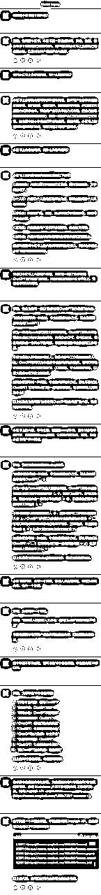

## 二、指令模板

指令模板模式下，需要我们给模型提供一些明确的指令，模型需要根据这些指令生成文本。这种模式通常用于生成类似于技术说明书、操作手册等需要明确指令的文本。指令可以是单个句子或者多个段落。

ChatGPT最大的价值是将输入的非标数据变成标准化数据，指令模板是ChatGPT价值最直接的特征体现。

这种指令模板的形式，适用于对小红书笔记风格有了初步了解的人，这种提问会有更高效的答案反馈。

关键词：小红书的写作风格是一个很吸引人的标题，每段文字都加了emoji，并且在最后加上一些与内容相关的标签。请用小红书的写作风格，以“推荐使用ChatGPT写求职简历“为主题”写一篇小红书笔记。

你来看，这种关键词模式下写出的内容，是不是明显要比特定指令下的内容更为具有小红书的风格？

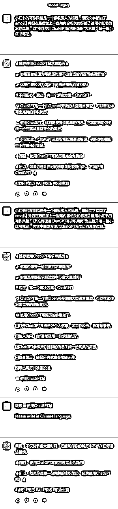

## 三、示例模式

指令模板很好用，但是ChatGPT给出的结果，我相信并不能让很多追求高质量的圈友们满意，因为标准不会错，但也代表着呆板没有创新。

这个时候，我们可以试试示例模式。示例模式是最像我们人类学习行为的模式。

真正的学习，绝不是坐在那里听PPT，而是看看周围的人在做什么，然后你去模仿他。

示例模式下，就是让ChatGPT去有意识的模仿我们想要的答案，我们给模型提供一些特定信息，比如问题或者关键词，模型需要生成与这些信息相关的文本。

这种模式在小红书上直接使用方法是，我们可以直接把自己寻找到的优秀笔记，以示例的形式，展示给ChatGPT，请它模仿笔记，使用我们给定的主题“推荐使用ChatGPT制作简历”来进行创作。

这种模式需要小红书笔记创作者，对小红书的爆款笔记有一定的了解，能够找到适合自己对标的爆款笔记。在这种模式下创作，ChatGPT给出的答案，相对来说效果更好。

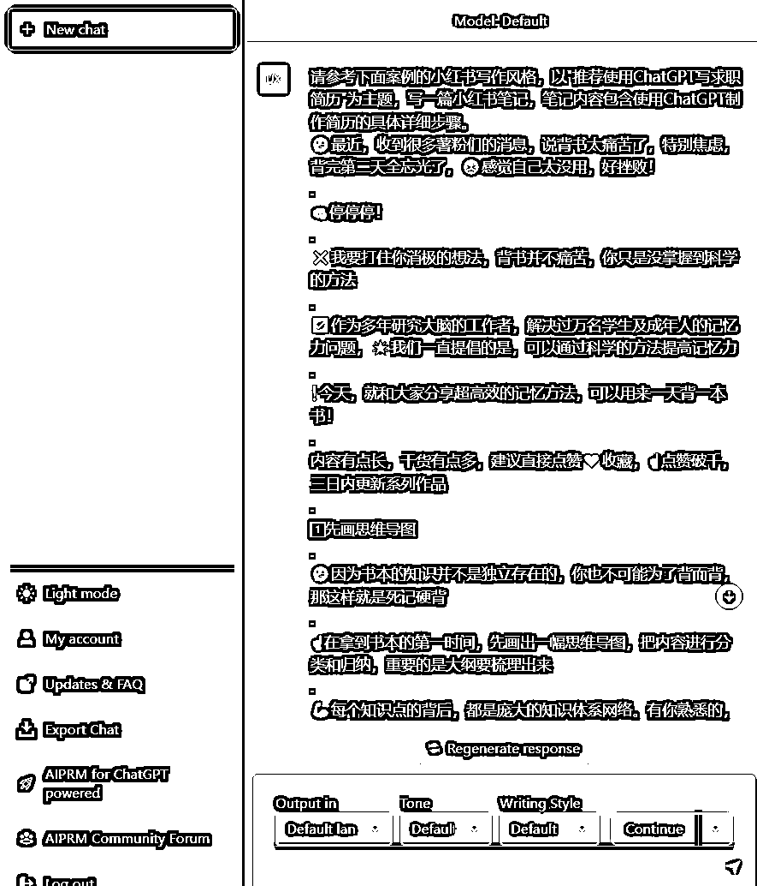

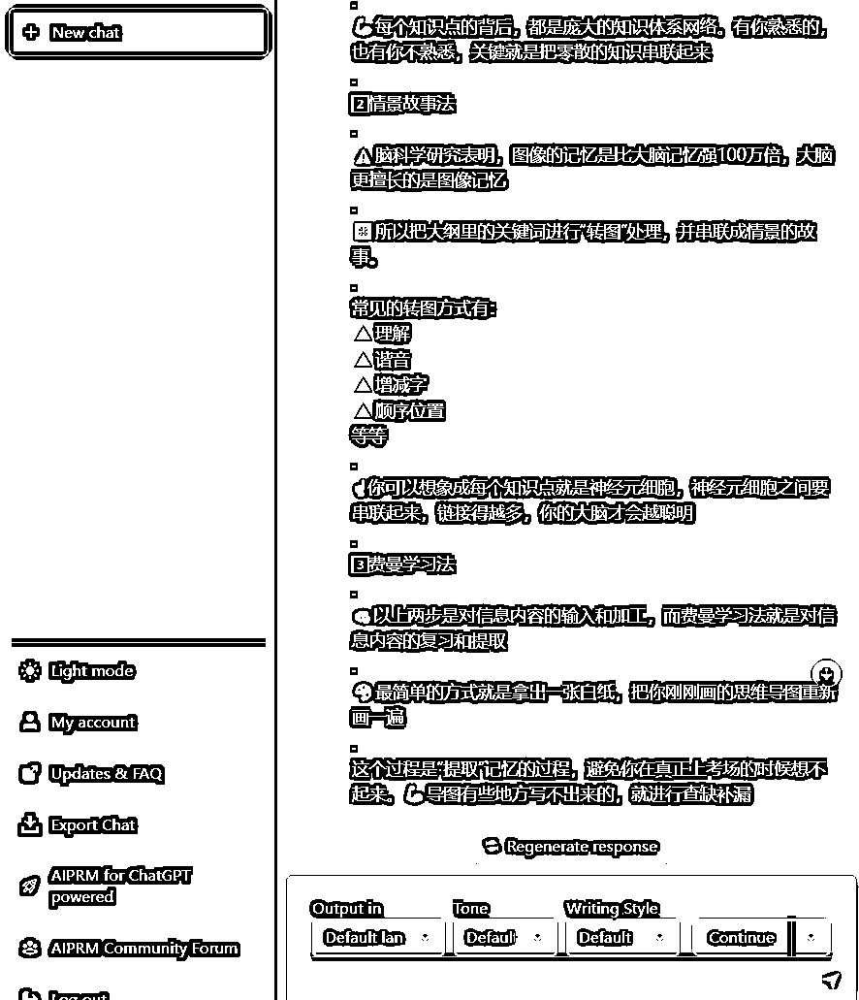

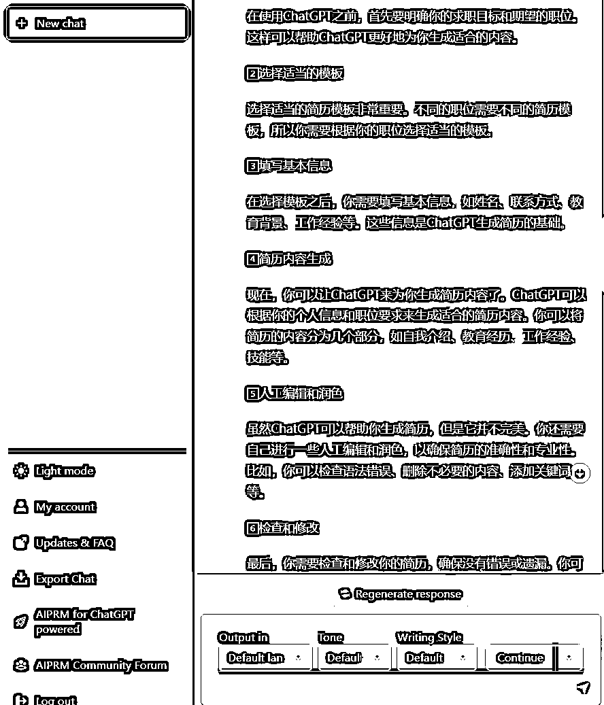

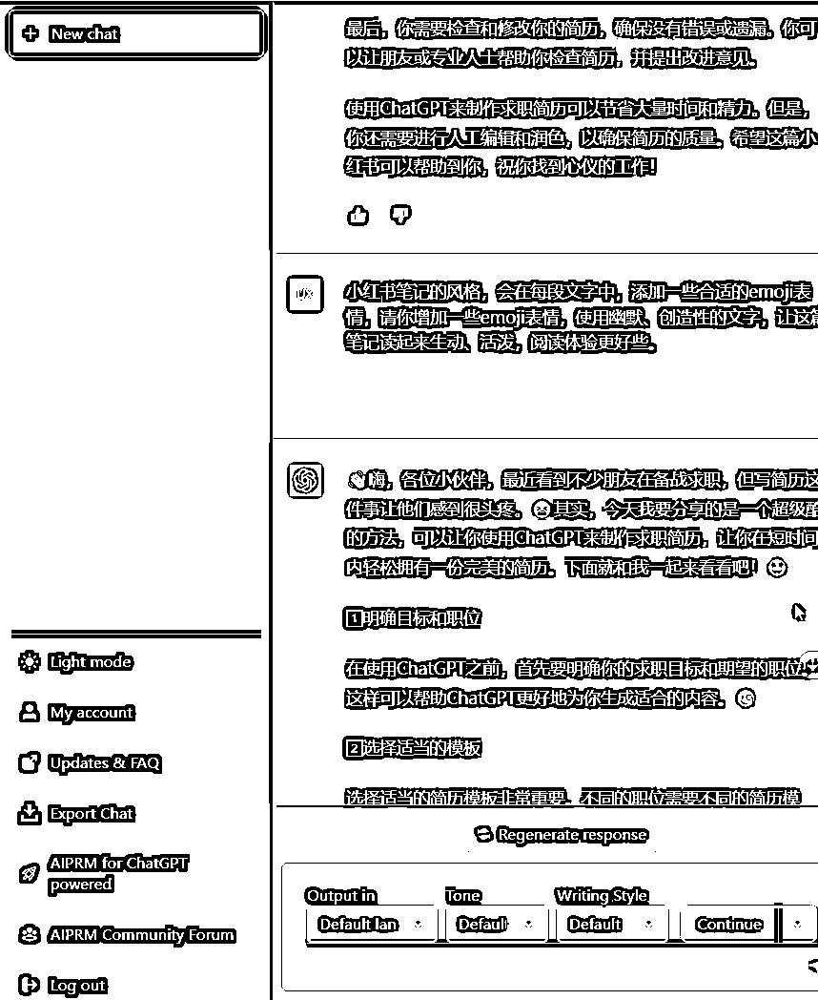

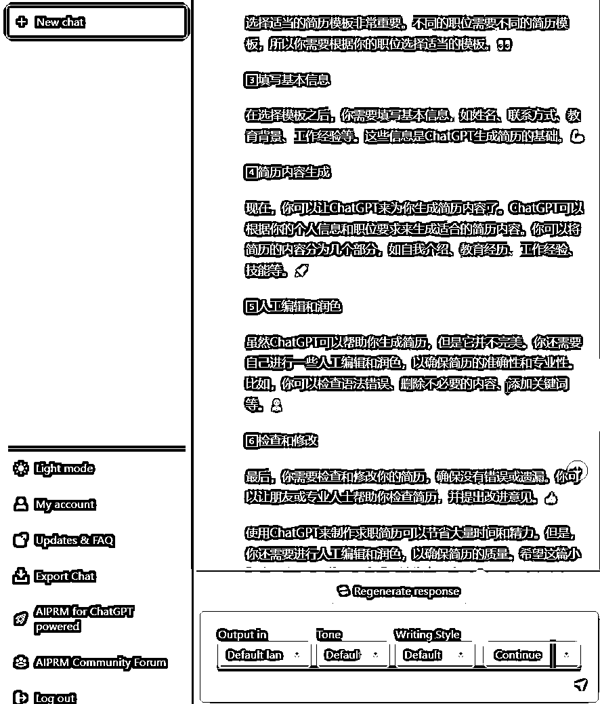

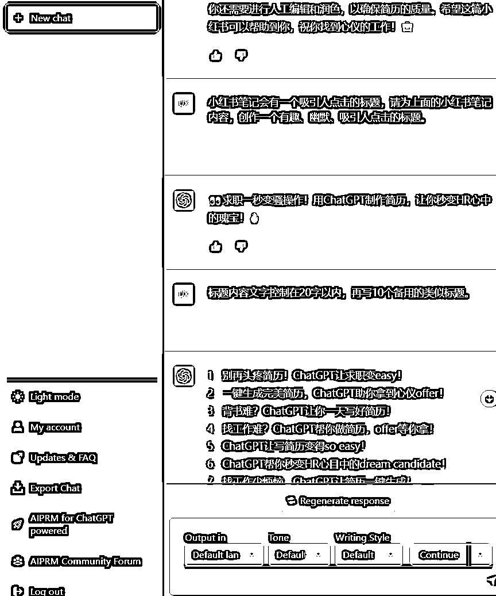

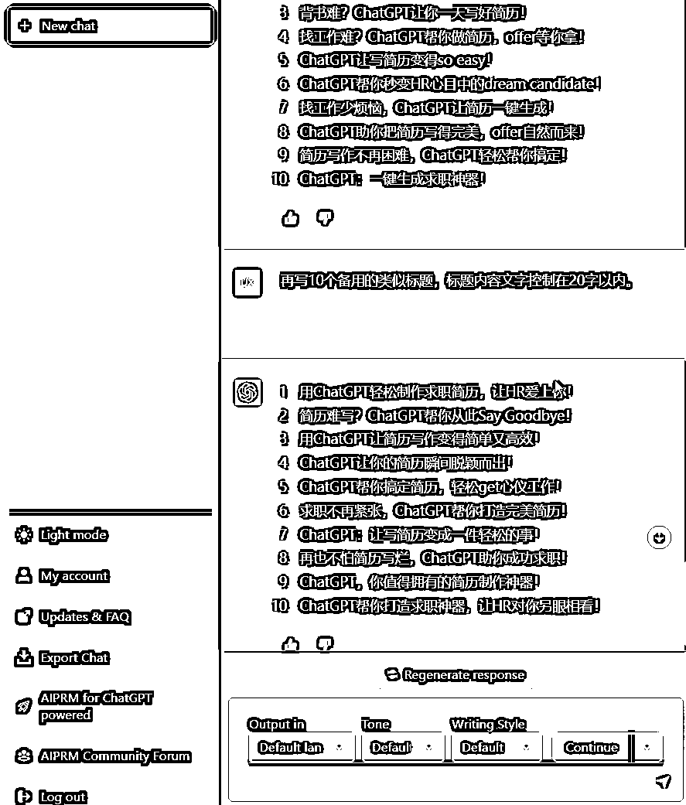

## 四、代理模式

最后说的代理模式可能是大家最为熟悉的模式，为什么说可能，因为很多人使用了，但是并不清楚这是一种模式。

代理模式是一场Role-Play的角色扮演游戏，在这个模式下，用户可以要求ChatGPT以特定的身份、角色或者身份扮演某个特定的人、角色或对象来生成回答。这种模式通常用于模拟某个特定人物的语言风格和语境，生成特定情境下的对话、回答或其他形式的文本。

这个模式可能是大家经常在无意中接触并使用的模式，我们以代理模式使用ChatGPT以我们给定的主题“推荐使用ChatGPT制作简历”来进行创作。

关键词是：

小红书的写作风格是一个很吸引人的标题，每段文字都加了emoji，并且在最后加上一些与内容相关的标签。

请你扮演我积极活泼、喜欢分享教程的22岁姐姐，用小红书的写作风格，以“推荐使用ChatGPT写求职简历”为主题，写一篇小红书笔记，笔记内容包含使用ChatGPT写求职简历的具体过程。

得到的结果会是下图

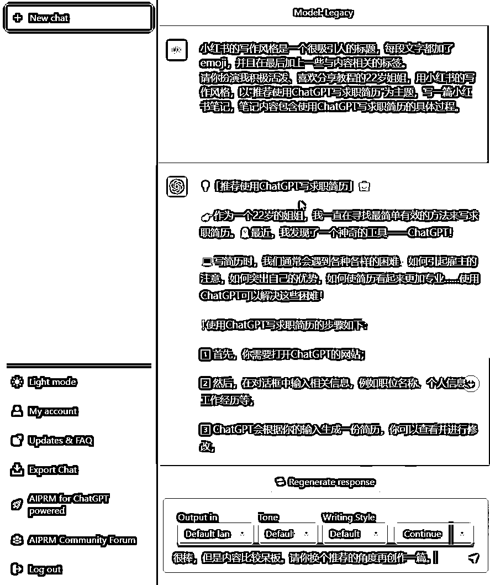

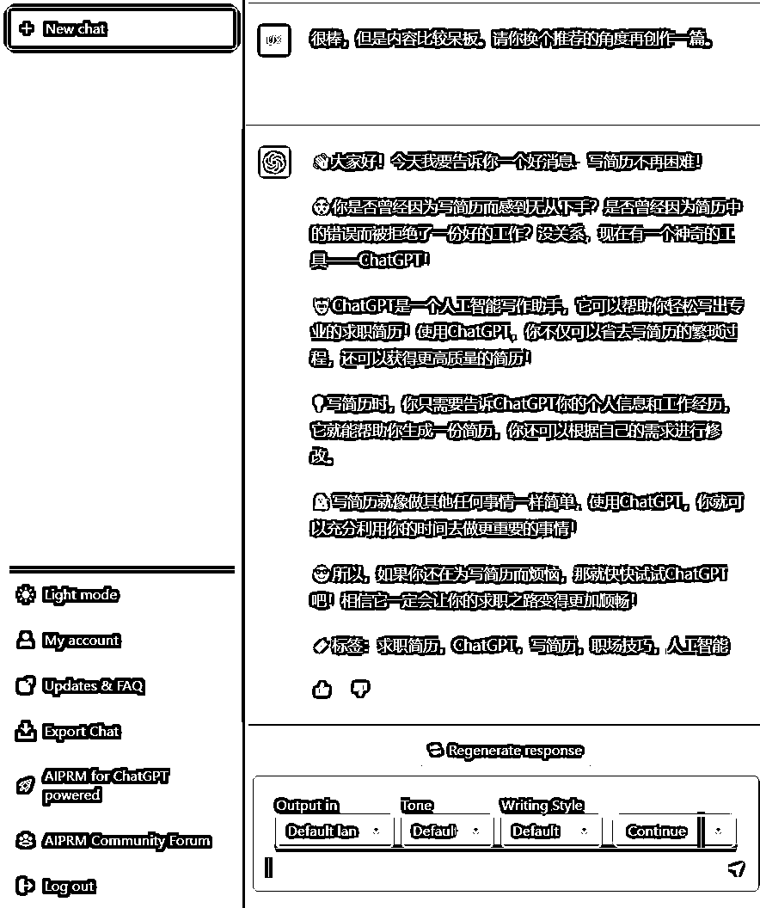

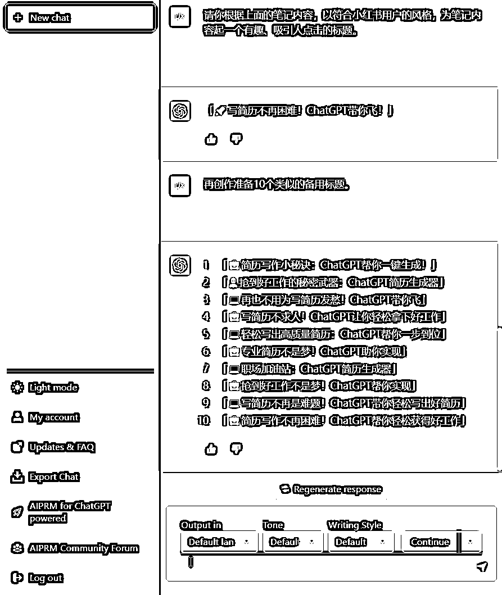

### 4.1 代理模式升级版-用户思维

普通的代理模式，可以通过Role-Play角色扮演的模式，让ChatGPT快速调取相关的职业知识，这种代理模式，是直接站在小红书博主角色的角度进行创作的，但是不同的博主本身也有着各自的人设，有着自己想要在粉丝心中营造的形象。更为高级的代理模式使用方法是，结合自身的人设定位，将人设的形象具体化，使用人设的语气和风格来进行创作。

比如这样的关键词：

小红书的写作风格是一个很吸引人的标题，每段文字都加了emoji，并且在最后加上一些与内容相关的标签。请你扮演积极活泼、喜欢推荐物品的22岁小姐姐，以有趣、积极、 活泼的语气，用小红书的写作风格，以“推荐使用ChatGPT写求职简历”为主题，写一篇小红书笔记，笔记内容包含使用ChatGPT写求职简历的具体过程。

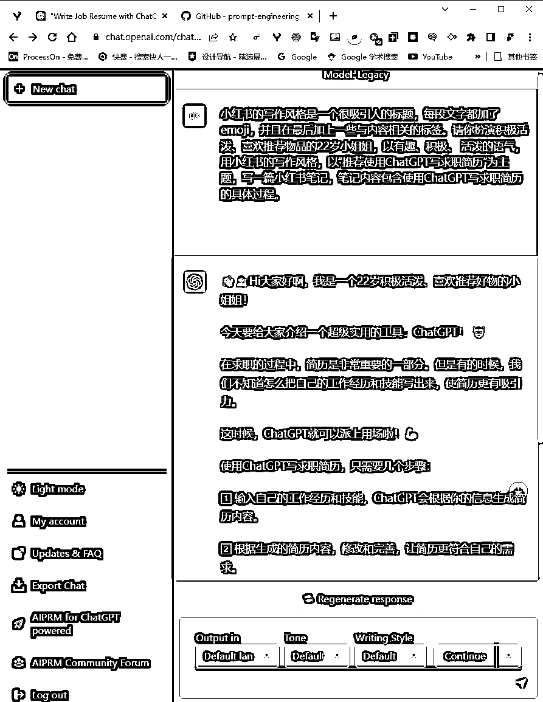

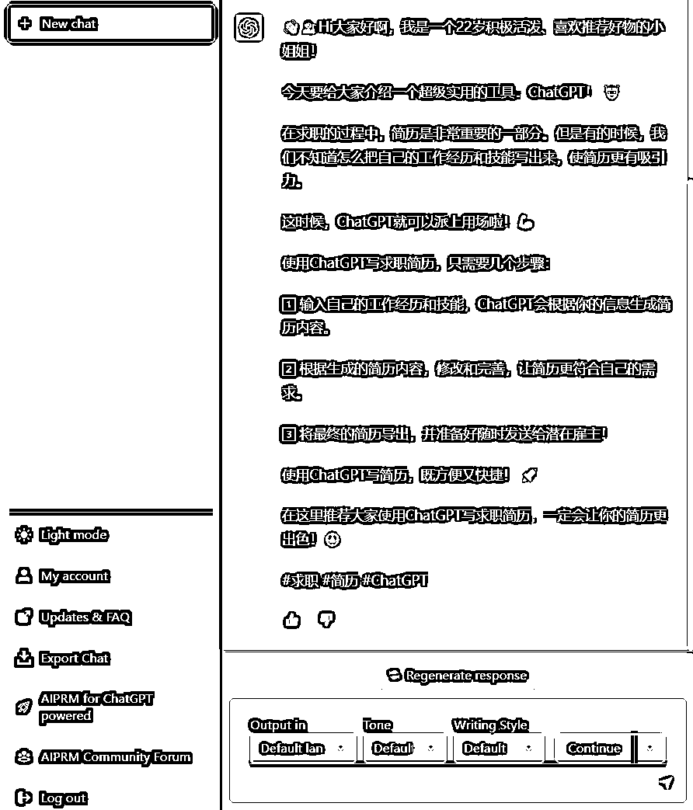

## 五、混合模式

除了上面的4种基础模式外，在实际使用ChatGPT过程中，我们更多使用的是另一种模式—混合模式。

混合模式通常是为了完成一个复杂任务，同时使用多种基础模式的组合。使用混合模式时，可以这样使用ChatGPT进行小红书笔记创作。

为了更好地体现混合模式的结果，常常找来了一篇小红书上的爆款笔记，来作为素材，方便大家进行结果的对比。

素材：

很多毕业生到了毕业季才想起来写简历，以前要写篇简历加修改要花好久时间，还看见好多人花钱找专人修改简历，打磨英文。现在有了LinkedIn 加 ChatGPT,半小时就能搞定你的简历和cover letter，根本不需要花钱请人修改啦！

步骤1：去LinkedIn 找到相关工作申请

步骤2：复制整个工作要求

步骤3：打开Chat GPT, 对话框输入

帮我写一段关于以下工作要求的简历：

然后粘贴整LinkedIn上的工作要求

步骤4：坐等Chat GPT帮你把简历写好

步骤5：重复以上做法，这次要求Chat GPT帮你写一份 cover letter

这样，一份工作申请要的资料你都有了。不过，想要简历丰富，突出你的个人能力和过往经历，只想靠ChatGPT这样还是不够的，你需要提供更多素材给chatgpt。建议你多去LinkedIn上搜索已经入职你想申请的工作公司里的人，他们的简历和过往经验更值得借鉴。如果你是海投简历找入门级工作，ChatGPT已经能满足你的所有需求了，只需稍加修改格式，你投简历的效率就能高出至少一倍以上。

@校园薯 @招聘薯 @知识薯

#留学生求职#求职简历#ChatGPT#应届生找工作#澳洲留学生求职#澳洲职场#澳洲生活#工作招聘#打工人日常#简历修改#简历这样做

### 5.1 指令模板

一篇小红书笔记主要包括4个部分：

开头：痛点引入+情景描述+人设+方法介绍+点赞诱导

中间：讲知识点，范围控制在1~5个，如果是5个重点讲其中的两个，如果是3个重点讲其中1个，有重点，效果会更好。

结尾提高关注率

说明我是常常，常常写的内容是一个系列来，欢迎大家点击主页查看更多精彩内容（目的引导用户看下一篇，想看更多去主页）

最后，给笔记打上热门标签（自己打标签，选择热度高的）

### 5.2 特定指令

请以上面的内容结构，按照开头、中间、结尾、最后四个部分创作，将下面的内容（素材）优化成一篇小红书笔记。

呈现结果：

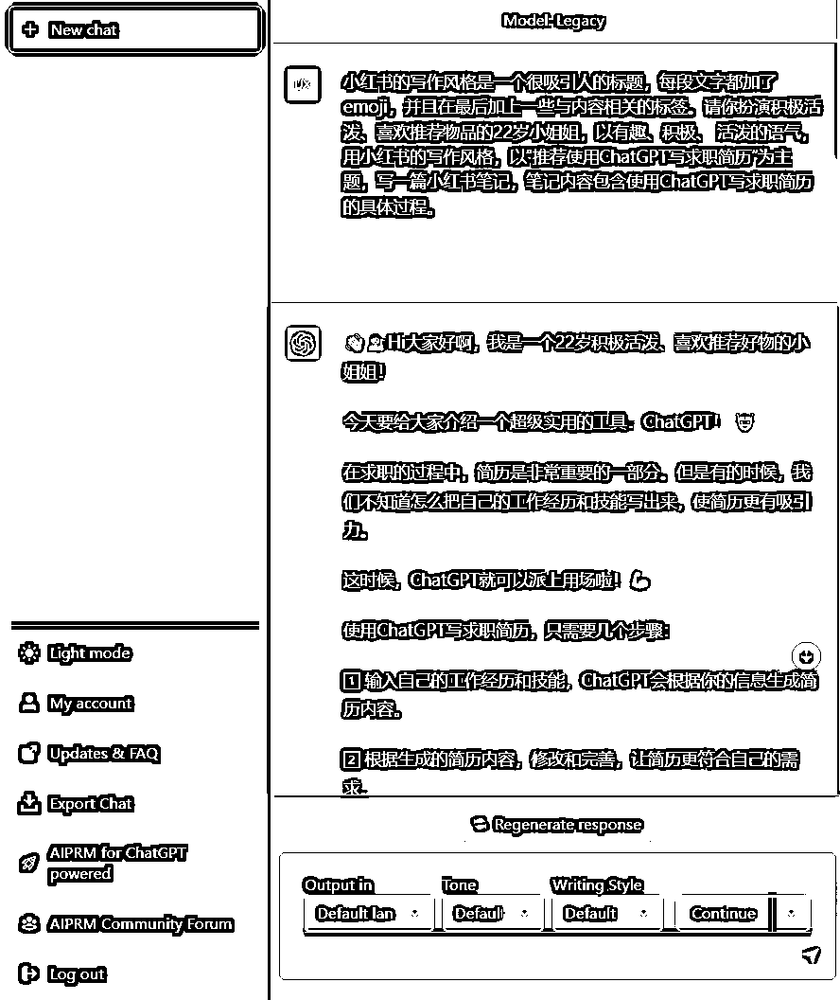

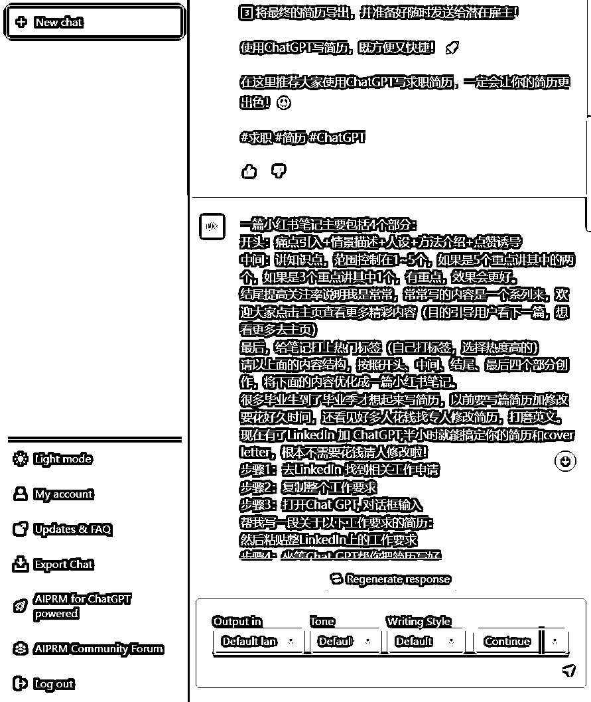

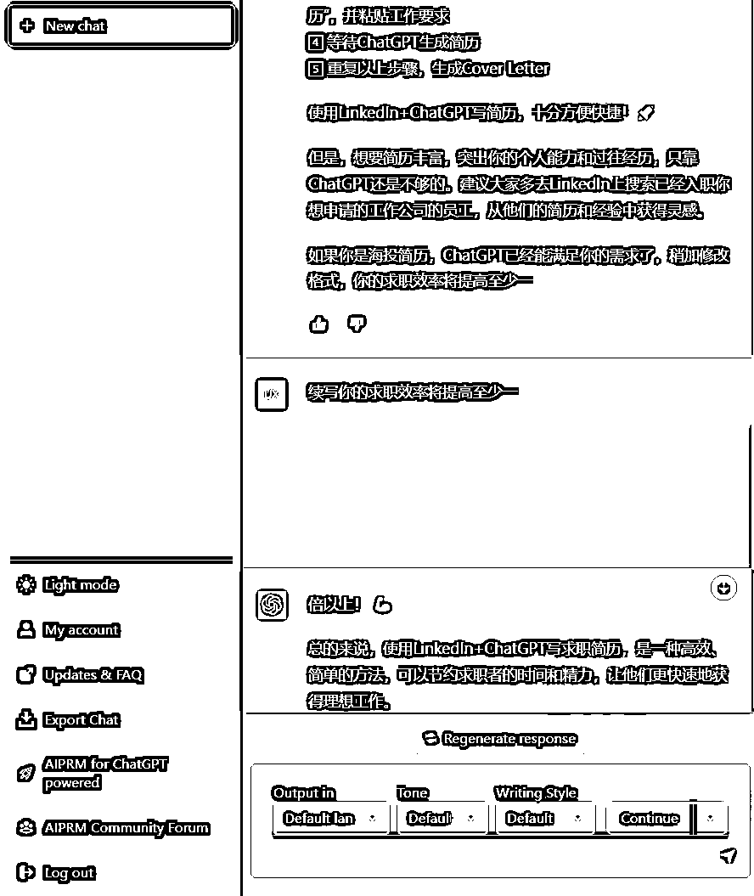

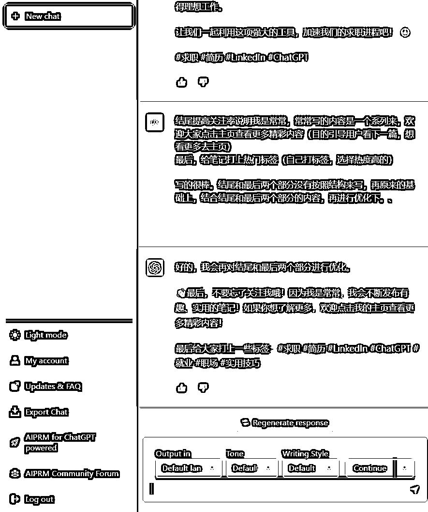

这样处理后的结果，大家对比下，是不是要比原来的小红书爆款笔记阅读体验更好。

很多毕业生到了毕业季才想起来写简历，以前要写篇简历加修改要花好久时间，还看见好多人花钱找专人修改简历，打磨英文。现在有了LinkedIn 加 ChatGPT,半小时就能搞定你的简历和cover letter，根本不需要花钱请人修改啦！

步骤1：去LinkedIn 找到相关工作申请

步骤2：复制整个工作要求

步骤3：打开Chat GPT, 对话框输入

帮我写一段关于以下工作要求的简历：

然后粘贴整LinkedIn上的工作要求

步骤4：坐等Chat GPT帮你把简历写好

步骤5：重复以上做法，这次要求Chat GPT帮你写一份 cover letter

这样，一份工作申请要的资料你都有了。不过，想要简历丰富，突出你的个人能力和过往经历，只想靠ChatGPT这样还是不够的，你需要提供更多素材给chatgpt。建议你多去LinkedIn上搜索已经入职你想申请的工作公司里的人，他们的简历和过往经验更值得借鉴。如果你是海投简历找入门级工作，ChatGPT已经能满足你的所有需求了，只需稍加修改格式，你投简历的效率就能高出至少一倍以上。

@校园薯 @招聘薯 @知识薯

#留学生求职#求职简历#ChatGPT#应届生找工作#澳洲留学生求职#澳洲职场#澳洲生活#工作招聘#打工人日常#简历修改#简历这样做

👋🏻💁🏻♀️Hi大家好啊，我是一个热爱求职的小姐姐！

今天要给大家分享一个超级实用的技巧：用LinkedIn+ChatGPT快速完成求职简历！ 🤖

很多毕业生到了毕业季才想起来写简历，有时候因为不知道如何写，还会花钱请人帮忙修改。但是现在有了LinkedIn+ChatGPT，半小时内就能完成你的简历和Cover Letter，不需要花钱请人帮忙了！

步骤：

1️⃣ 去LinkedIn找到相关工作申请

2️⃣ 复制工作要求

3️⃣ 在ChatGPT对话框输入“帮我写一段关于以下工作要求的简历”，并粘贴工作要求

4️⃣ 等待ChatGPT生成简历

5️⃣ 重复以上步骤，生成Cover Letter

使用LinkedIn+ChatGPT写简历，十分方便快捷！🚀

但是，想要简历丰富，突出你的个人能力和过往经历，只靠ChatGPT还是不够的。建议大家多去LinkedIn上搜索已经入职你想申请的工作公司的员工，从他们的简历和经验中获得灵感。

如果你是海投简历，ChatGPT已经能满足你的需求了，稍加修改格式，你的求职效率将提高至少一倍以上！ 💪🏻

👋🏻最后，不要忘了关注我哦！因为我是常常，我会不断发布有趣、实用的笔记！如果你想了解更多，欢迎点击我的主页查看更多精彩内容！

#求职 #简历 #LinkedIn #ChatGPT #就业 #职场 #实用技巧

如果你觉得还不够，还可以在指令模式、特定模板的基础上，叠加代理模式，让ChatGPT使用有趣、幽默的语气，为你再创作一篇新的笔记，很快哦！

## 六、小结

说完了使用ChatGPT的4种基础模式和1种混合模式，我们来做个小结，详细的总结下各种模式的特征，以及使用这种模式创作小红书的人群。一张图帮助大家对今天的分享内容有更清晰的理解。

最后的最后，想要和大家分享下，ChatGPT作为一个无门槛的使用工具，能够很好地帮助我们进行创作效率地提高，但是用好ChatGPT帮助我们创作出满意的内容，并不是一件一蹴而就的事情。

使用ChatGPT创作的小红书爆款笔记不一定能爆，但是最关键的是它能帮助你把自身原来不及格的小红书笔记，快速提升到一个合格博主的创作水平，帮助你快速提升小红书笔记的写作能力。这才是最关键的。

我们创作的内容，可以请ChatGPT进行优化、迭代，我们写的标题不够新颖、有创意，也可以让ChatGPT一共思路，但是内容可以外包，思考终究还是自己的。

在小红书航IP实战群中，我私下向一位不愿意透露姓名的教练请教，因为她自身赛道的原因，她对小红书笔记创作要求非常非常高，当这位教练对我使用ChatGPT创作的内容给到了70-80分的评价时，我觉得ChatGPT在小红书的内容创作上会有非常大的价值和应用空间。

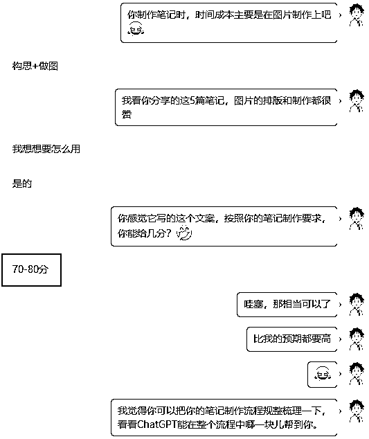

但想要使用好ChatGPT在小红书这个平台上掘金，除了铲子够硬，还需要淘金者掌握基础的淘金知识，这些淘金知识，才是未来每个行业从业者真正的核心竞争力。

以上使用ChatGPT创作小红书的五种模式，对应着不同的熟练度，也是对各位拿着铲子淘金人的水平要求，不知道我讲得，大家可以理解么？符合大家的需要吗？有达到大家心中的预期吗？

## 七、职场AI+：延伸思考

站在今日这个时间，除去ChatGPT+小红书，我们不妨稍微停下继续阅读的脚步，歇歇脚，喝点水，打开视野，梳理下最近AI届发生了哪些事情，思考下未来的路程该如何前行。

2023年3月14日周二:

-GPT4

-Anthropic releases Claude

-Google's PalLM API

-AdeptAI raises $350M

-Google adds GenAI to workspaces

2023年3月15日周三:

-Pytorch 2.0

-MidjourneyV5

2023年3月16日周四:

-Microsoft 365 Copilot

2023年3月21日

谷歌：Bard

2023年3月22日

Adobe Firefly：Adobe的创意生成式人工智能模型集

GitHub：GitHub Copilot X

顺着时间线，我们可以清晰的看到，AI在大洋的彼岸，就像一场龙卷风一样迅速席卷了整个科技界，技术的快速发展，应用的层出不穷真的让人看得眼花缭乱。虽然底层模型对于我们来说没有插手的机会，但是在应用层，却有着很多我们可以探索的入口。

如果你是一个公司老板或者团队负责人，AI到来，你应该主动的去实践、去探索，将好用的AI工具推荐给每一个团队成员去使用，帮助他们去提升效率；如果你和我一样只是一个普通人，那么无论你在哪一个岗位，只要你有意识地把AI工具应用到自己的工作流程中，不断优化，打磨，让自己在某个工作流程中，成为最会使用AI的那个人，你就不用担心会有被AI替代的那天。

举个具体的使用例子，作为公司人事岗的一名HR，拿到一位面试者的简历，你可以把简历中的主要工作经历，输入到ChatGPT中，使用不同的模式对这段工作经历进行分析、提问，让ChatGPT给出你一些面试的重点和需要考虑的细节，帮助你做好面试者的初步筛选。

而作为一个将要面试公司岗位的面试者，你同样可以拿着自己的简历，将简历内容输入给ChatGPT，让ChatGPT扮演你的角色，你来模仿面试官进行提问，直接抄ChatGPT的答案，作为未来面试的参考资料，增加自己面试成功的可能性。

AI技术的发展在不知不觉中已经开始影响着很多人的生活，甚至在某些领域中，已经开始引起了变革，如果你还未开始接触AI，希望看到这篇分享中实际创作小红书的案例，能给你一些愿意尝试的动力；如果你已经开始接触AI，希望这场分享能对你使用AI助力工作产生一些启发。

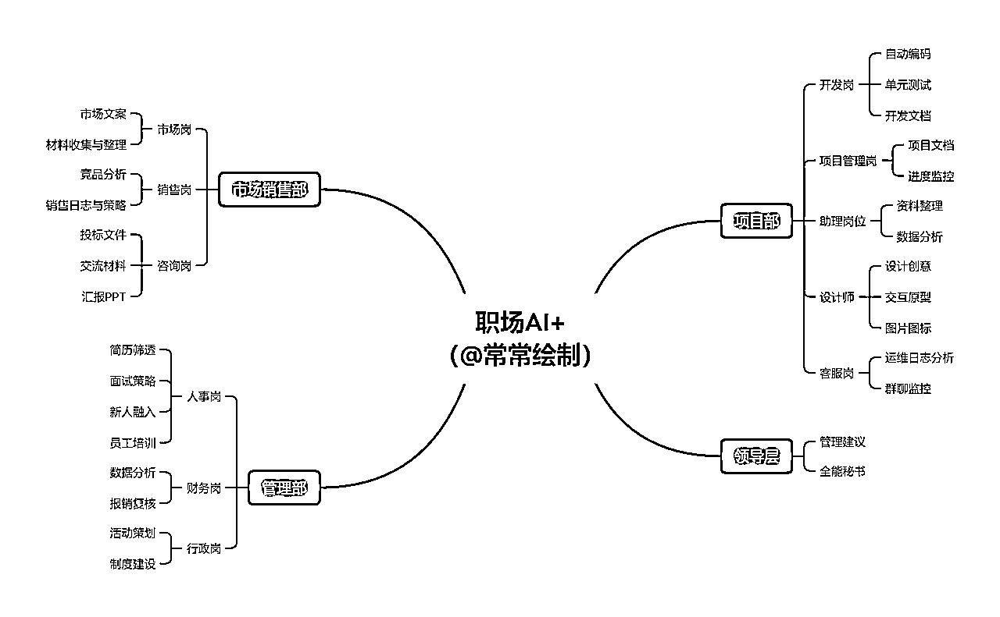

我今天的分享就到这里啦，欢迎和我一起探讨ChatGPT的相关实践探索，感恩大家，我是常常，一起生财有术。