# 通过组合创新，在小红书做研报账号，3周达到5000粉，引流私域600+

> 来源：[https://yujiguohou.feishu.cn/docx/UzSUdLrruodXSAxMlRtc0PSsnLb](https://yujiguohou.feishu.cn/docx/UzSUdLrruodXSAxMlRtc0PSsnLb)

大家好，我是田不脱，之前分享过精华帖《沪牌代拍月入 5W+，如何开拓线上流量渠道精准引流》的项目。现在给大家分享一个去年在小红书起的研报账号。

先说下成绩，每天工作时长10分钟左右，第一篇文章就成了爆款，3周达到了5000粉，小红书群聊满了两个群，达到1000+，引流到私域600+（刚开始没有意识到，后期才想起引流，浪费了很多流量）。按照这个起号思路，完全可以做到低成本和可复制的快速起号。

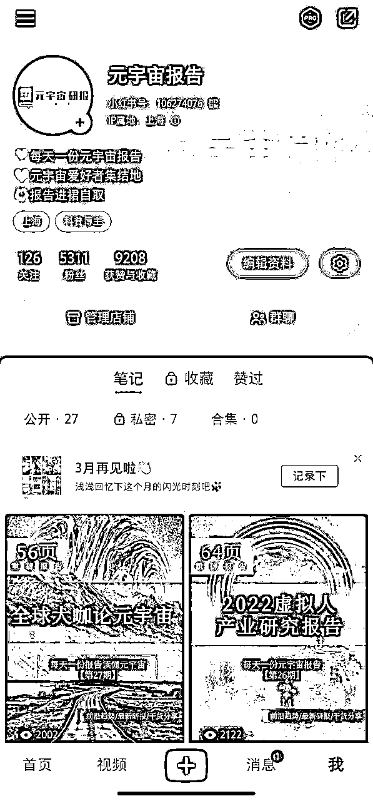

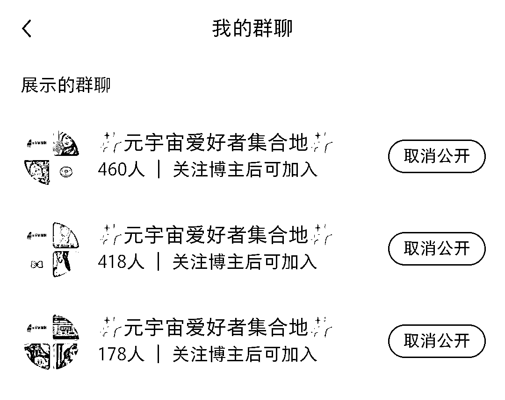

### 一、搭建项目库，选择对标项目

当时刚开始接触小红书，不太清楚自己能够做什么样的账号。于是自己做了一个项目库，把观察到一些可复制或者有特色的账号都记录到onenote，里面大部分都是小红书和抖音平台的案例，总共记录了100多个项目。（现在看起来有点像生财的风向标）

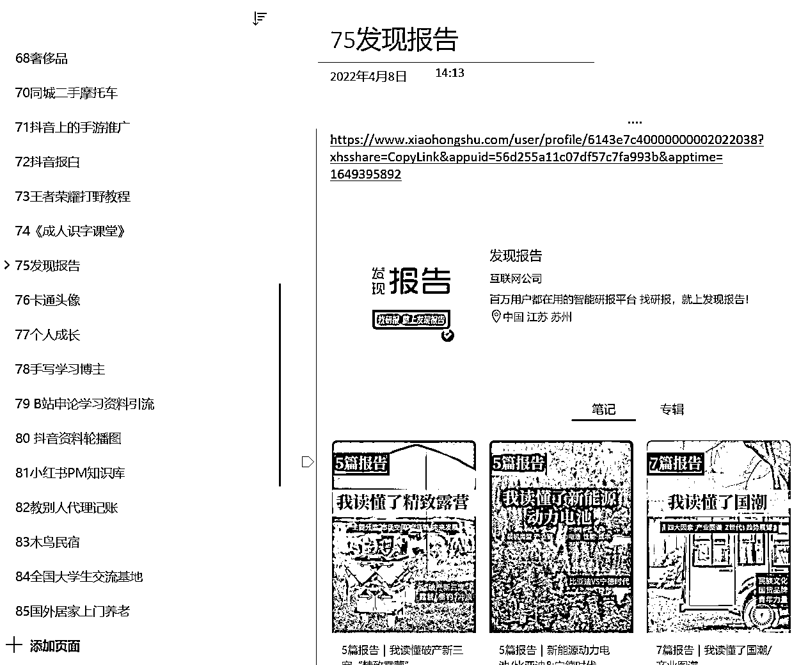

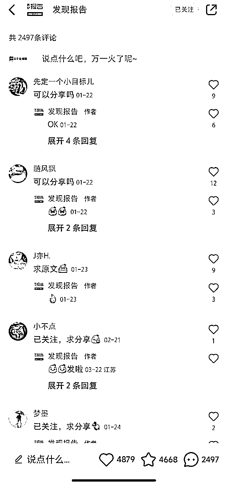

（左图是自己的记录的账号案例库，右图是对标账号的留言截图）

其中有个报告类的账号叫做“发现报告”，收藏与评论都特别的高，于是决定做这个类型的账号试试。

### 二、像素级拆解对标案例

分析这个账号的成功之处：

1、报告是可以提供价值，大家乐于去“求分享”。

2、封面好看，吸睛。有同类型的账号，封面不好看的，数据也不行。

3、选题新颖，国潮、新能源、露营都是当下最火的选题。

由于对手做了很久，又大而全。于是自己决定做一个细分的账号，选了当时较火的元宇宙。

### 三、按照对标元素重新进行素材组合

把对标账号拆解以后，按照上面的分析，我们发现其实要解决的是两个问题：

1、报告

2、封面图

如何找到报告来源，如何做出吸睛又可复制的封面图，是这个项目成功的关键。我们要做的事情分别是找到报告来源、找到炫酷的图片、制作封面模板。下面分开来讲下步骤：

#### 1、报告下载：

报告的来源我是使用的慧博，注册会送一个月的会员，送的一个月的会员过期后，每天可下载一个报告。对于我们，前期多下载一些，后面每天下载一个也足够了。

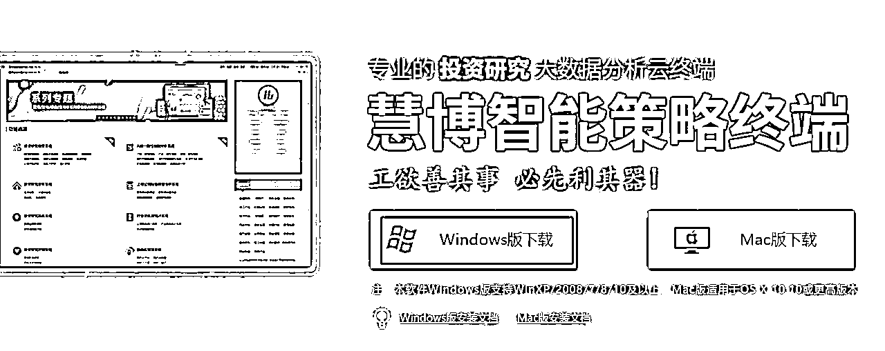

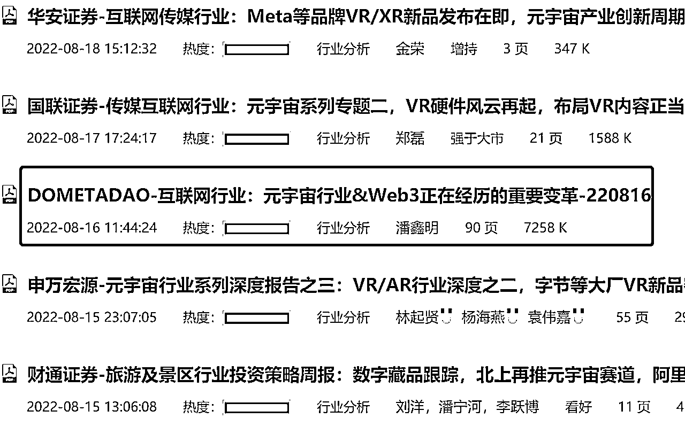

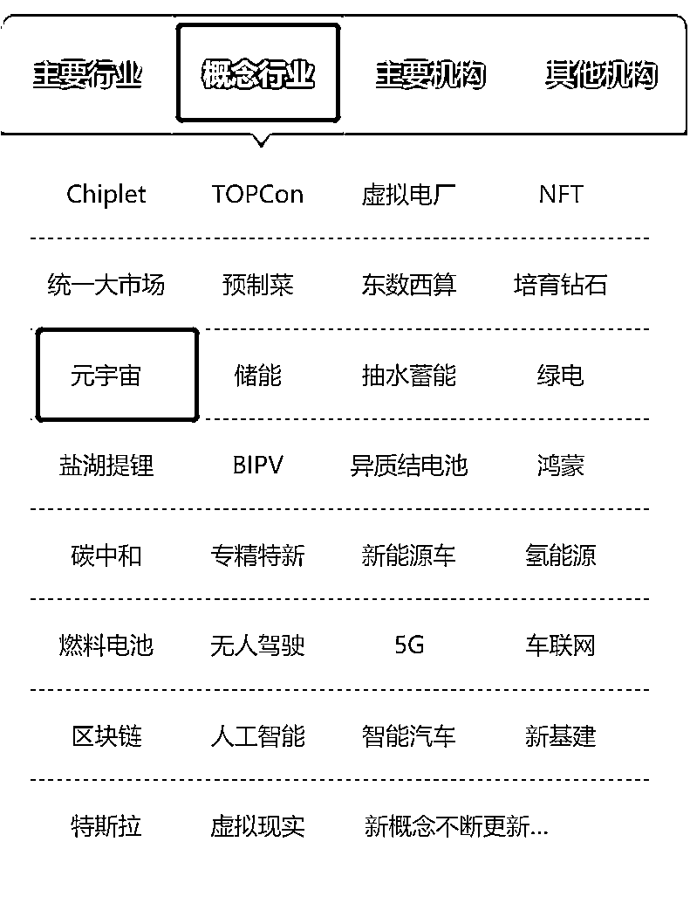

#### 2、图片素材：

图片的素材，因为元宇宙要非常的酷炫，当时想到的是A站（www.artstation.com），很多人可能不知道，但是在插画师中很有名。我找了元宇宙的标签，一口气下载了几十张，每天一张，够两三个月用的。

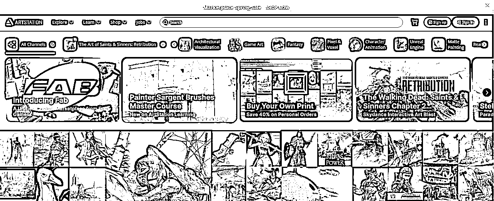

#### 3、制作封面图：

有了报告和图片素材，下一步就是要把封面图与研报的内容结合起来，我是通过稿定设计来制作模板，定稿以后，每天只需要改下图和字即可。在封面的文字上，写了“每天一份元宇宙报告”，会给读者一个可持续的感觉，更可能让他关注。

下面是成品图，第一篇文章点赞、收藏就都超过了200个。

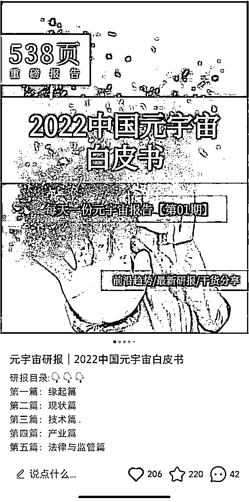

### 四、引流与变现

#### 1、引流方面：

当时在小红书的元宇宙的群聊，两个群很快就满了。因为很多人都来要报告，都加个人微信太累了，所以直接在群公告里，引流到公众号。这个操作已经比较晚了，所以浪费了很多流量，后来引流到私域600+

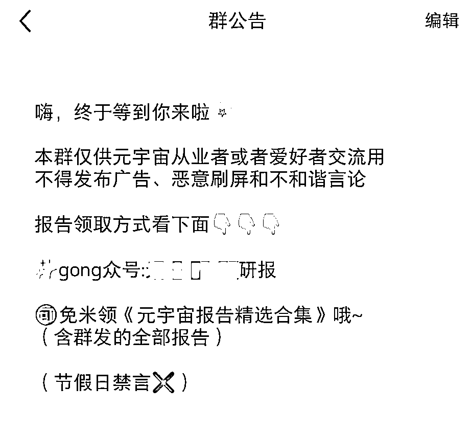

#### 2、变现方面：

1）直接变卖报告：

这些报告，我都打了公众号的水印，一是可以通过用户的二次传播来增加关注，二是可以出售不加水印的报告。实际上，有很多用户都乐意付费买不加水印的报告。

2）商务合作：

这个账号当时接到了好几个商务合作，有的会给到费用，有的给到nft。

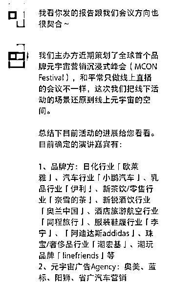

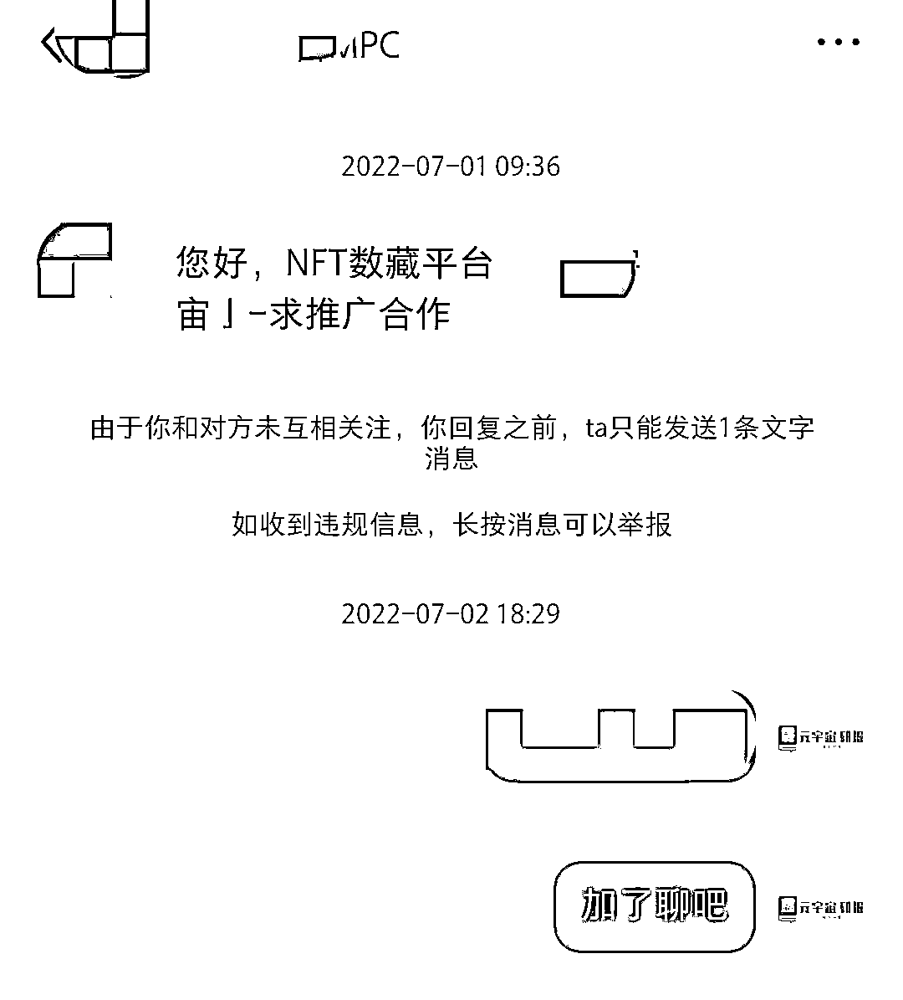

### 五、总结复盘：

这个账号只做了三周，因为后面有变现快的项目，直接去做其他项目了。现在复盘下来，总结以下几点：

第一点，做账号前最好就规划好变现模式，高客单与高利润的优先选择。元宇宙概念太虚，一直没有实际的应用，如果换成更容易变现的行业会更好。

第二点，所有的平台都可以进行组合创新，太阳底下没有新鲜事，小红书以及其他平台的爆款文章，我们都可以按照上面的思路进行拆解，然后再进行元素的组合。

第三点，操千曲而后晓声，多看别人成功的案例，在别人成功案例的基础上进行创新，可以让我们更容易成功。现在生财有了风向标，真的极大的丰富了我们的视野。我建议也搭建属于自己的项目库，把自己感兴趣的账号都记录一下，信息的获取量决定输出的质量。

最后，欢迎大家和我交流小红书的IP与引流。

VX:Txinyi0215