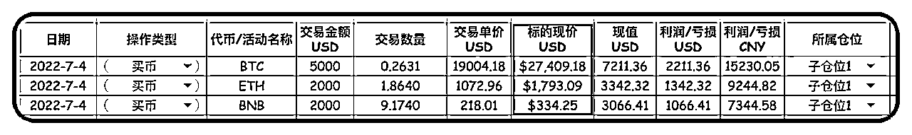
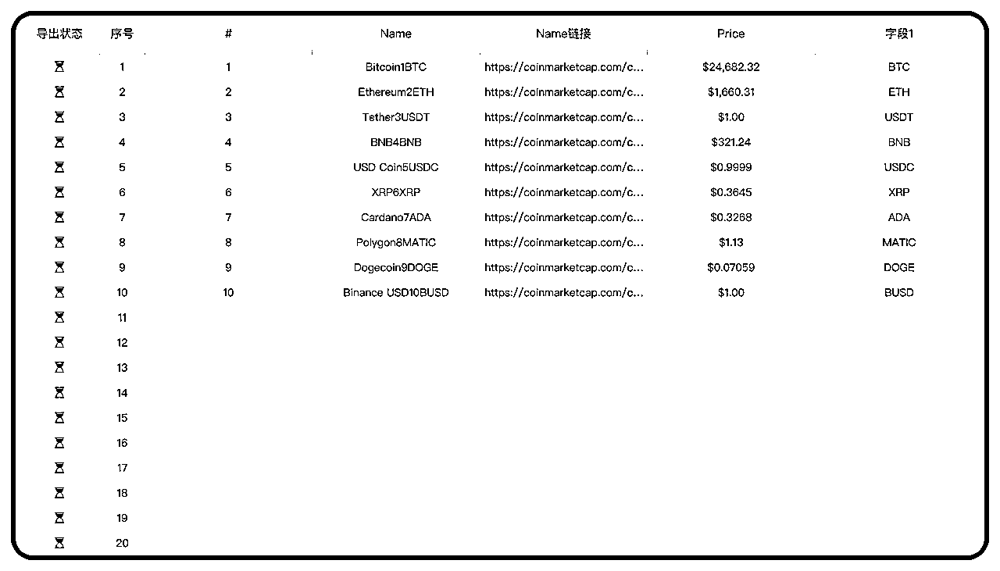
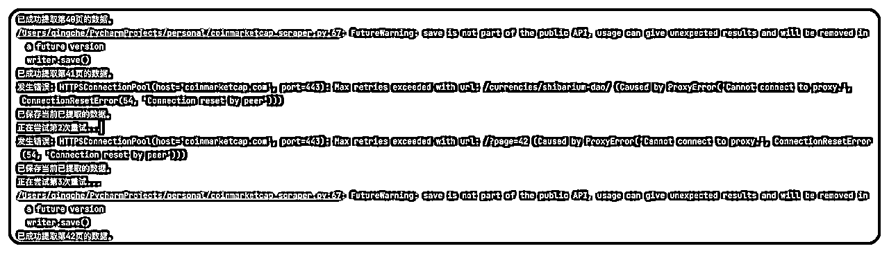
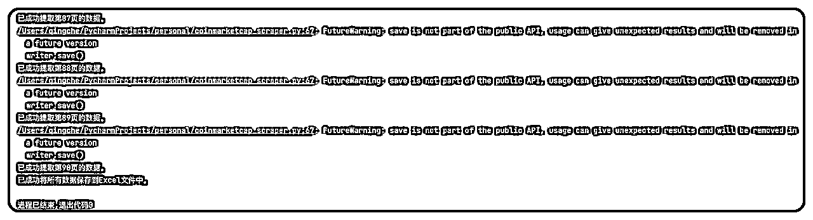

# Python小白如何调教ChatGPT写爬虫

> 来源：[https://c5b5kd78s1.feishu.cn/docx/W9bkdxL8Iouy7PxPFBMcSP9qnLh](https://c5b5kd78s1.feishu.cn/docx/W9bkdxL8Iouy7PxPFBMcSP9qnLh)

# 〇、写在前面

这次前后花了两天半，除了吃喝基本没做其它事情，不停地捣鼓ChatGPT，让它帮我写了一段Python代码，成功爬取到自己想要的数据。

先简单介绍一下自己的Python 水平，懂一点基础元素和 For、IF等常见语句，进阶的基本不懂，自己写基本什么都写不出来那种小白水平。

因此，基于本次实现过程做一个复盘和分享，相信也有情况跟我类似的朋友有此需求，希望能对大家有所启发。

读完这篇文章，至少可以让你学会以下几个技能：

* * *

# 一、为什么让ChatGPT帮忙写爬虫？

因为个人参与了web3的投资，最近基于谷歌表格，做了一个仓位管理的工具（以下是部分截图）

其中的标的现价，是结合谷歌表格的Importhtml函数自动获取的，代币的数据源https://coinmarketcap.com/网站（下文简称CMC网站），数量9000多个。

为了充分提取这些数据，于是我想到了爬虫，一开始没想着写爬虫的，毕竟市面上有现成的工具，比如某羿采集器，但是研究了大半天，取出来的数据像下图这样，很大一部分都有缺失（多半是我自己的问题）。

之前就得知ChatGPT可以帮忙写代码，我就决定调整思路，尝试“调教”一下。

* * *

# 二、如何调教ChatGPT并实现抓取？

整个实现过程并不是想象中的一帆风顺，远比想象复杂，经过了很多次失败和调试，为了提供更多有效信息，我会把提问过程进行简化，并把整理后的对话文档放到2.2的最后。

## 2.1 关键信息

整理一下对话的关键信息：

## 2.2 聊天内容

接下来直接进入主题，因为之前我聊的那个版本内容太多太杂（简称V1版），我就重新聊了一次（简称V2版），以下是我重新聊的V2版本中我发送的主要内容（比V1版本更简洁，GTP-4回复内容见2.2附件）

附：V2版聊天（对话）完整过程

* * *

# 三、Prompt梳理

在这部分内容，我会梳理聊天过程中的问题、一些待完善的点和需求总结。

## 3.1 聊天问题梳理

梳理V1版本的聊天过程中遇到的一系列问题，包括但不限于安装第三方库、如何定位Class元素及提取、Cmc网站设置了诸多反爬机制等，接下来把这些问题做一个梳理：

附：定位Class元素演示视频

简要说明：

Ps：我也不知道如何告诉ChatGPT关于Class的有效信息，我就把两个数据的整行Class 都发给他了，再次运行更新后的代码终于可以到我想要的代币名称和简称

* * *

## 3.2 Prompt完善

在我先前聊的V1版本中，在3.1的基础上，还进行了以下几个方面的完善

因为按上面提到的第2点进行完善后，会生成90个Excel文件，手动合并这些表格太废手了，新建了一个「Chat」，继续帮我写代码，聊天内容如下：

* * *

## 3.3 需求总结

以下是V1版聊天的需求总结（会比V2演示版的总结得更好）：

您需要爬取CoinMarketCap网站前90页的加密货币数据，包括加密货币的全名、简称和详细页面的URL。这些数据对应的HTML class特征如下：

爬取过程中需遵循以下要求：

* * *

# 四、复盘总结

通过这次聊天，除了让我实现了需求外和学会一些新的知识，我认为还有一些值得提炼的内容：

* * *

# 五、写在最后

借这个机会，我想感谢一下生财，在2020年加入时，就通过知乎好物赚到了百倍的门票。这是我加入的第一个真正意义上的付费社群，后面陆续又加各种付费社群~但如果只保留一个，我会毫不犹豫地选择生财。

我进生财马上3年了（换过微信），没发过什么内容，基本都在潜水，也一度因为“忙”很少看帖，但我打心里真的非常喜欢这个社区，社群内容质量高，而且特别认可生财团队的交付水平，这也是我终于愿意写这篇文章的原因，这算是在生财第一次认真的输出，以后也会继续。

前两天已经续费生财，并加入了ChatGPT探索家Club，希望2023继续多赚钱吧~

Ps：如果你也想动起来，需要自己先搞定 Python 和 Pycharm （可以是其他）的安装，也欢迎留言讨论。输出不易，如果内容对你有所帮助，希望获得你的点赞支持，也欢迎大神对代码或思路给予指点，谢谢！(v:qingchejun)

ChatGPT使用攻略之飞书文章合集，欢迎讨论（微信：qingchejun）