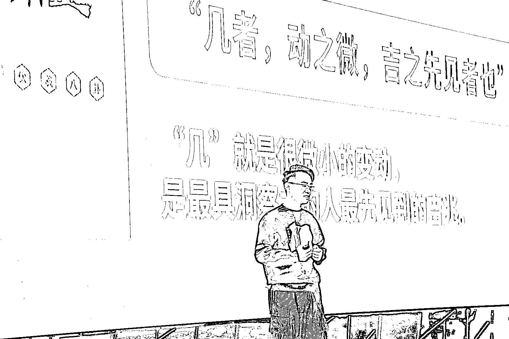
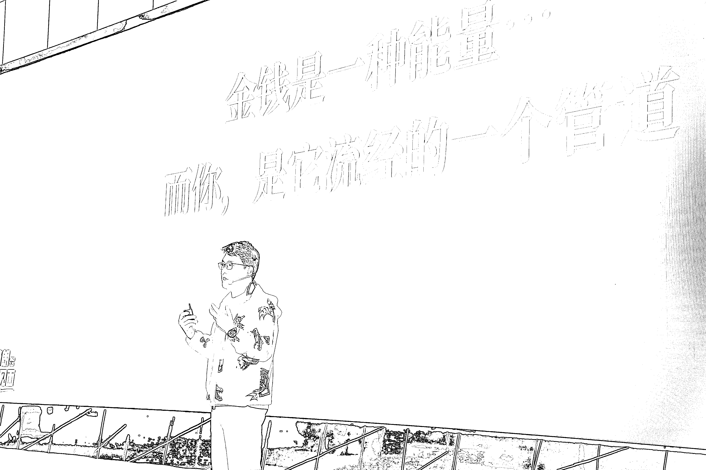
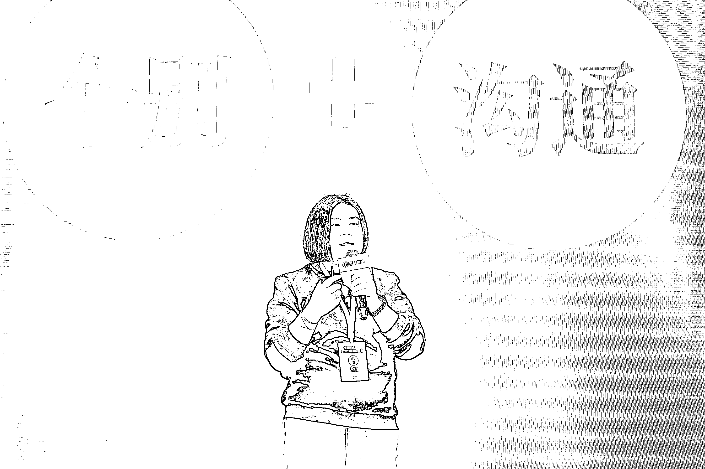
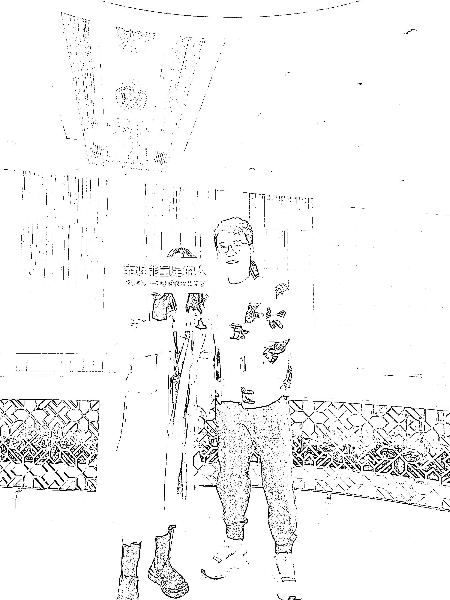

# 《参加完上周六生财全国见面会的感受》

> 原文：[`www.yuque.com/for_lazy/thfiu8/zs8oz0qoh0fg0ud3`](https://www.yuque.com/for_lazy/thfiu8/zs8oz0qoh0fg0ud3)

## (56 赞)《参加完上周六生财全国见面会的感受》 

作者： 欧阳思｜Youth 在* 

日期：2023-03-29 

分享《参加完上周六生财全国见面会的感受》 

感恩生财、亦仁老师、张潇雨老师和参加上周六身心灵/向内求局的 14 个小伙伴让我体验到「顺应生命之流，带着无我利他舍和感受能量去做事，不需要去抓取任何，就会体验到惊喜」。 

感恩生财，让我从最近一次参加生财龙珠见面会活动参与者身份变成组局者并让我有荣幸组我使命领域的局，并打破了我对生财只搞钱的偏见 。 

让我超级荣幸拿到了心心念念的张潇雨老师签名&微信，他人真的好好哇！张老师的播客，给我人生中带来了很多笃定，尤其刚走上这条路时的怀疑，并前段时间还陪我成功度过了辟谷，感恩张老师。 让我开眼了，有荣幸听到各位嘉宾们分享和结识到了各个领域优秀同频高能量的人，如生财&花爷团队相关负责人们、年营收几百万创业者们、心理学以及各个领域大佬们和刚进入这个身心灵/向内求的老师们等等。 

感恩 14 位小伙伴们，因我第一次组局，有很多地方没做好，但大家对我很包容和提供各种帮助，如因人数超了一起临时找新场地和提建议的克寒小哥哥和 Amy 小姐姐；如觉察大家的疲惫带我们冥想的董硕小哥哥；如一直在服务大家的雅芳小姐姐等等。 

并从 ta 们身上让我学到很多（以下顺序按照坐顺序来的） 

从雅芳学到了体贴和谦虚，她说服务用户要向家人一样对待。 

从七米学到了她的目标感和表达。 

从董硕 学到觉察和贴心能力，觉得大家有点累，带我们进行了冥想放松。 

从恋尧的小星球💫 学到她想帮助人的发心，给我们分享她最近向内求的心得。 

从敏敏 学到了时间管理和做事高效和为人处事能力，忙完当天全国见面会还抽空来参加，简直了！并还送了花给我，被惊喜到了！ 

从兰卡🦌 那学到了对自己的真诚和不断给大家发出爱的反馈，这几天大家也都在分享，而她不断在反馈说你们说得真好等等。 

从克寒 学到了他的影响力，把兰卡、敏敏、澜澜吸引过来了和提出的让大家给感受，这个点真的很棒！让整个场域能量变高了！ 

从小 z  学到了勇气和大胆，就算很害羞但一直在真诚分享他经验和干货，要是我就说不下去了。 

从🔅  看到她身上那份自信，是我需要学习的！ 

从周聪 让我看到走上身心灵/向内求另外一条路径，让我对这部分群体有了更多的了解。 

从玉兰 学到了总结能力和贴心：给我们各种提醒。 

从 Amy 分享她最近的「心想事成」事和各种干货内容，让我更加学会顺应生命之流。 

从 CRAZY 身上学到了很坚信这条路的愿力。 

从澜澜身上学到 感受和直觉能力，太值得理性的我学习了！ 

再次感恩 ta 们的分享和创造的高能量场域给了我很多继续前行和笃定的力量，而接下来我能做的唯有继续感恩万物并向万物学习+听话照做交托+修/爱/做自己+再不断把爱送出去，让自己成为一个管道 。 

看到这，或许你有个疑惑，身心灵/向内求的路到底是什么，这也是很多人在问我的 我也一直不知如何去说， 今天我脑海里突然冒出这句话 ta 是「 让你成为你，让我成为我，在这个大千世界里找到自己的使命 和在茫茫人海中找到彼此 」的路，希望你成和做了你自己同时过上了内心丰盈，有闲有钱的人生🌷🥰💕 

以上，感恩你宝贵的时间。 在「自然生长」的欧阳思 | Youth 2023.3.29 玛雅流日：Kin55 红天行者波电力的蓝鹰+蓝风暴 

 

 

 

评论区： 

卿安澜 : 谢谢阳思的组局，最好的遇见和礼物🎁，让我加入到这个高能量的队伍里，被大家滋养着，不断找寻到真实的自我，再次感恩生财有术，感恩大家~ 卿安澜 : 必须单独感恩敏敏，带着我去这个局，让我有机会遇见~ 欧阳思｜Youth 在* : 感恩生财和大家一起创造这个高能量的场域，继续一起前行🌷🥰💕 恋尧🔆 : 接下来我们可以更加坚定的～为这个世界，为自己，去做些什么了～～✨ 倪克寒｜心力教练 : 谢谢阳思给我们提供了相聚和链接的机会[鼓掌] 董硕 : 谢谢思思，好认真啊，认真对待每个人，认真对待生命的每分每秒，小小的身体大大的能量。向你学习，多多感恩 小 Z : 谢谢阳思，当初没有报上名后来线下加入来到这个小聚，无法想象能够找到联结面见到那么多同频的人，感受彼此能量在彼此之间的流动。不管任何时候，都能创造出那些好的感受，谢谢阳思组局能够与大家相聚的机会，和优秀同频的一群人共同成长是一件幸运而有能量的事。心诚者灵，心有所望，好事就会发生，能与大家相遇是这次线下见面的发生一大好事🥳 周先生 : 思思太棒了