# 《如何使用 ChatGPT 帮助你在 TikTok 变现？》

> 原文：[`www.yuque.com/for_lazy/thfiu8/lmgkmcv0wvxn2gq2`](https://www.yuque.com/for_lazy/thfiu8/lmgkmcv0wvxn2gq2)

## (84 赞)《如何使用 ChatGPT 帮助你在 TikTok 变现？》 

作者： A   😇路途 

日期：2023-03-29 

  

大家好，我是路途，星球编号是 35110 

chatgpt 真的是太太太太火了！ 

不会吧不会吧，不会还有人没被它刷屏吧哈哈。 

我反正是被刷屏有一个月了，有些人担心自己被 AI 取代，而咱们社群的小伙伴只关心如何搞钱，优秀~~值得表扬哈哈 

  

这不，刚从杭州参加生财见面会回来，就马不停蹄的码字写文章，搞钱是我们的唯一动力哈哈。 

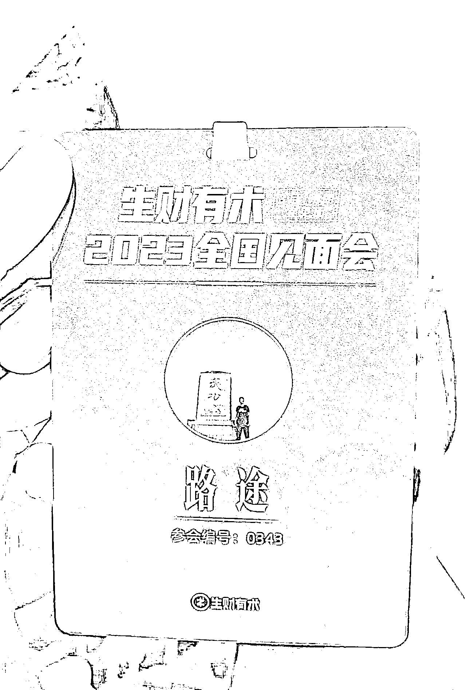 

别的领域我不擅长，咱们今天就来聊聊，在 TIKTOK 这个赛道或者战场，我们如何利用 chatgpt 帮助我们搞钱。 

正文开始： 

Chatgpt 是什么大家应该都知道了吧，是 OPEN AI 开发的一款语言模型，也可以说是一个聊天机器人 

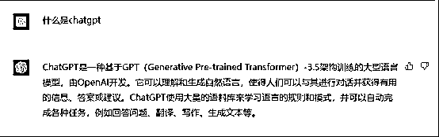  

开始之前，想请大家先思考一个问题，在你目前的认知中，你觉得应该如何使用 chatgpt，换句话说可以用来做什么？ 

1、向它提问，让它来回答问题？ 

2、还是对它发号施令，让它替你完成某些事情？ 

这两句话看似类似，其实不一样，第一句话是你并不知道答案，你想通过提问，获得答案，就好像学生问老师，而老师授业解惑。而第二句话，更像是一个助理或者手下，你已经知道了你想要的结果，你只是需要有人去完成它。 

没事，不忙着回答，咱们先来问 chatgpt 几个问题试试。 

问题 1：如何提高 tiktok 上的视频播放量 

  

问题 2：如何在 TIKTOK 上赚钱？ 

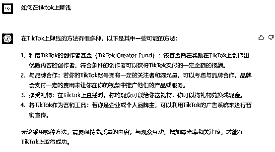  

这两个问题，就是我上面说的，向它提问，我们来看看它的回答。 

第一个我问的是如何提高视频的播放量，这些说辞也很官方，说的都对，但总觉得它在跟我讲大道理哈哈。怎么说呢还不错了。 

第二个我问的是变现方法，其实 tiktok 的变现方法很多，chatgpt 会列出一些官方渠道的变现方式，这个可以理解，但你有没有发现，TIKTOKShop 小黄车带货貌似它没有提到，这是为什么？因为 chatgpt 他的数据储备只到 2021 年，而小黄车大面积可以普及是 2022 年的事情了。 

那假设我问一下不存在的事情呢？ 

  

比如我问：你怎么看历史上的路路通社群事件。 

你看，他就开始胡说八道了。虽然这个问题到了 gpt3.5，gpt4.0 已经开始改善了，但是我们很明显的能感觉到，当你向 chatgpt 提问的时候，他的回答有很明显的几个特征。1、套路化，从前面几个问题可以看出，chatgpt 的回答都是有一套公式的，特别喜欢用总分总的模式来写，他的训练师一定是一位优秀的中国语文老师哈哈，充满了应试教育的味道。 

2、 知识储备有限，chatgpt 其实你不要把它理解成一个机器，理解成一个人更加合适。他有一套完整的套路，给自己建立了一套知识框架和逻辑框架，所有的回答他都会按照这个框架来回答，但是能不能给出好的答案，完全取决于它的知识储备。而且它对不知道的事情还会编故事胡说八道。 

那么，如果我们不向它提问，而是改做发号施令呢？比如说下面这个问题 

请按要求给我写 5 个标题 

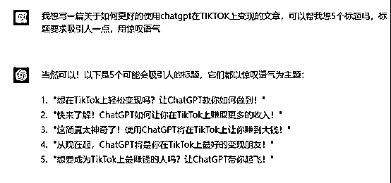  

怎么样，写的还不错把。虽然有股英文味儿，但是你可以让他再换几个说法很快就能得到很多很好的标题。 

那么回收一开始的问题：我们应该如何使用 chatgpt？ 

答案就是，我们要学会向它发号施令，做它的主人，而不是做他的学生。之所以要在一开始跟大家讨论这个问题，是因为我看到好多人像是把它奉若“神明”一般。 

比如你说，做 TIKTOK 有没有前途，是不是最好的时机它说是的，难道我们不去研究就要盲目冲进场吗。它说不是难道我们就不做了吗？有点像求神一样。而且提问的答案其实对我们并没有什么太大的帮助。 

所以总结一下，chatgpt 并不是万能和无所不知的，我们要做的就是，知道自己准备做什么，然后让 chatgpt 来帮助我们提升效率，或者直接帮我们完成任务，这才是我们应该做的。 

 

今日卦象一视频必上热门 

“好的好的，知道了，你太啰嗦了，我已经懂了，现在快教我怎么用 chatgpt 更好的在 tiktok 上搞钱吧” 

哈哈哈，好的。前面废话了那么多，大家已经知道了，我们向 chatgpt 提问其实是没什么用的，我们要知道做什么，然后发号施令让他来帮我们完成。 

所以呢，放到 tiktok 变现，我们首先要有项目方法论，换句话说，就是你要知道要做什么项目，这个项目的是怎么实操的，项目要点在哪里，以及我们变现的整个闭环和路径。之后把难点拆解，逐一的扔给 chatgpt 去给我们完成。 

OK，那么接下来，我假设说我们来做影视解说这个项目，我们来思考两个问题 

1、 影视解说如何变现 

2、 影视解说项目的难点在哪，我们如何利用 chatgpt 来帮我们解决问题。 

问题 1：变现 

目前主流的方式是通过创作者基金，通过内容来奖励创作者。因为影视剪辑的内容非常受欢迎，因此通常能获得很不错的流量。 

 

计算规则是，10W 播放大约获得 5 美金左右的一个奖励，视频爆的时候一天可以获得几百美金，或者几百欧元的一个奖励，而且会持续的挖坟。群里的大佬每天晒收益我都看麻了哈哈。 

问题 2：这个项目的难点在哪呢？ 

做影视项目，特别是影视解说，有一个很大的难点，那就是非常耗时。我先给你说说看要做一个这样的视频得有多麻烦吧。 

简单的来说，你得先有一个解说文案吧，然后翻译成外国语言。之后再做一个配音，配音结束以后你还需要做一个外文字幕。之后再剪辑视频，全部做下来，真的想想都头皮发麻。 

 

以上面这个这个为例，我们一般会试用取巧的方法，拿现成的中文解说作品，然后它修改剪辑成国外配音，比如说英语，具体怎么做呢？ 

第一步：提取文案 

首先，我们会需要把这个视频的字幕提取出来，这个我们一般使用剪映就可以了 

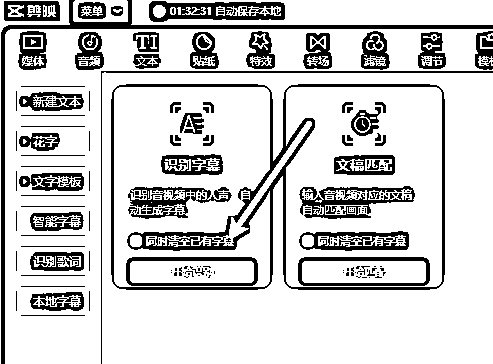 

第二步：翻译文案，提取出来以后呢，我得用翻译网站给他做一个翻译。 

之后呢，第三步，我们再把上面的文案拿去配音 

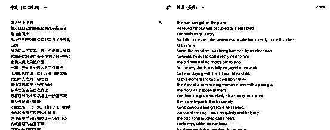 

第四步，把得到的全新的英文字幕，还有配音插入到剪辑作品里去。 

 

结果呢，忙活了半天，你会发现，配音的内容和原来的画面一点都对不上。因为不同的语言在翻译上，他的读音长度也不同。这就坏了，因为配音了你还听不懂，特别难调整，只能一小段一小段的配音才能解决。 

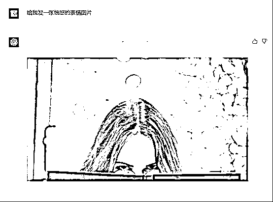 

此刻的心情正如上图，准备摔键盘的冲动了。老子不干了！！！整个视频搞完，新手慢一点的可能最少也要 2 小时以上了。而且效果也不怎么样，如果你看过 TIKTOK 的解说视频，你就会发现，普遍的语速都是非常的快，这就是因为配音和画面的差距太大了，只能通过提高语速来完整解说，观感是非常差劲的。 

但别急，有了 chatgpt，这事儿就非常简单了，上面的整个过程，在 3 分钟之内就能完成。 

 

首先，在先把字幕提取出来，之后呢，直接让 chatgpt 帮你完整的翻译出来。 

 

可以看到，翻译出来的内容，和原文的长度基本是一致的。 

 

之后呢，我们可以直接配音，也可以直接使用现在最新的 AI 数字人配音，输入文案，自动生成动态的数字人配音作品。网站。[https://studio.d-id.com/editor](https://studio.d-id.com/editor) 

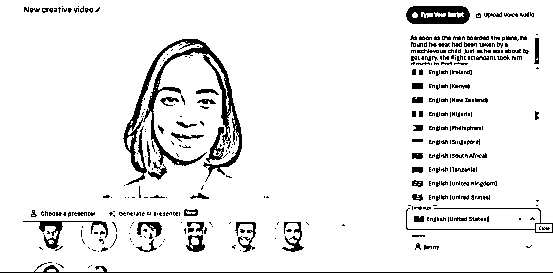 

然后呢，把字幕和配音好的数字人直接一起拖拽到剪辑软件中就完成了。怎么样，简单吧。别人生产一条视频的时间，你已经可以做 20 条了。而且质量也是非常高，整体的语速也很柔和，你甚至不需要去矫正画面和字幕，基本就是匹配的了。 

 

上面我只是举例一个影视解说的流程。 

更可怕的是，这整个流程，你甚至可以通过训练 chatgpt，让整个流程实现自动化。 

比如说，你看，通过训练 chatgpt，我可以让它回答出任何我想要的答案。上面我举例子是直接用的现成的解说文案。那么假如说你想要自己写呢？只要你把同一个风格的解说文案，不停的投喂 chatgpt，他就能很轻松的写出你想要的风格了。 

 

可以想得到的玩法还有非常非常多。比如说现在国内教大家玩 chatgpt 的内容，是不是非常多呢？同样的，你完全可以用大家的文案，做成自己的内容，再配音放到 titkok 上，不仅可以获得流量，还可以吸引外国人到自己的私域变现。 

再比如大家非常头疼的原创内容，也可以通过 AI 生成，都是独一无二的内容。直接文字转视频。比如下面这样的 

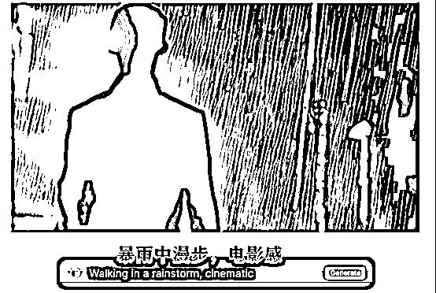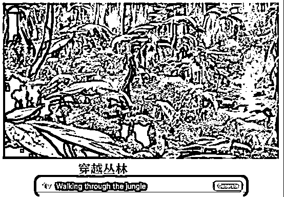 

还有大家都在做的前篇一律的带货视频，你是不是也可以使用数字人给大家讲解产品，绝对是眼前一亮。而这些都非常简单，就是向各种 AI 软件发号施令就行了。 

再比如一些定制化的需求，通过 AI 作图，你可以在 tiktok 上或者其他平台，提供这一类定制化的服务，比如说头像、logo 等。 

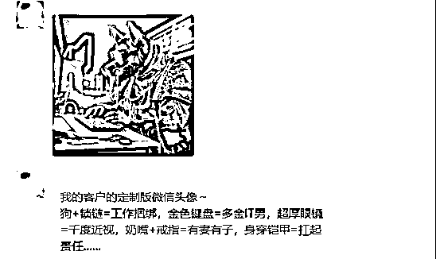 

目前已经有不少人在做了，开设店铺，通过自己生成的图片产品赚钱，几乎没有成本啊。真的吊打一切原来的高成本定制作画产品。 

 

甚至还有通过这个项目开始卖书的。简直可以说，遍地是商机。 

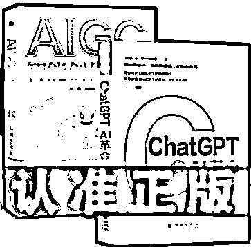 

怎么样，听我说完，是不是顿时感觉自己胸有成竹了？哈哈哈 

 

说真的，chatgpt 项目的出现，极大的缩短了新手和老手之间的差距。就拿我举例子的影视剪辑来说，原本新手需要花好几个小时才能做好一个视频，现在，几分钟就可以完成了，而且质量还更高。 

所以大家真的不能错过这一次技术革命，真的是新手逆袭的最佳机会。 

但，chatgpt 正如我前面跟大家描述的，你是需要掌握一定的技巧和方法，学会如何对它发号施令，让它去完成我们的任务。 

大家有什么想法，都阔以一起交流哈 

评论区： 

芷蓝 : 牛 Murstin : 大佬这思路很开阔啊 A   😇路途 : Ai 很强大，强大到十八般武艺，样样精通，但他始终是机器，我们要利用它给我们提高生产力，解放双手[呲牙] Murstin : [强] 冯驰 : 大佬有没有 mac 的科学上网 app 推荐了 A   😇路途 : 自己去油管找，这个不能教，教了下半辈子吃喝不愁，缝纫机都会踩断[撇嘴] UlyssesChe* : 油罐找是啥意思😂 A   😇路途 : youtube