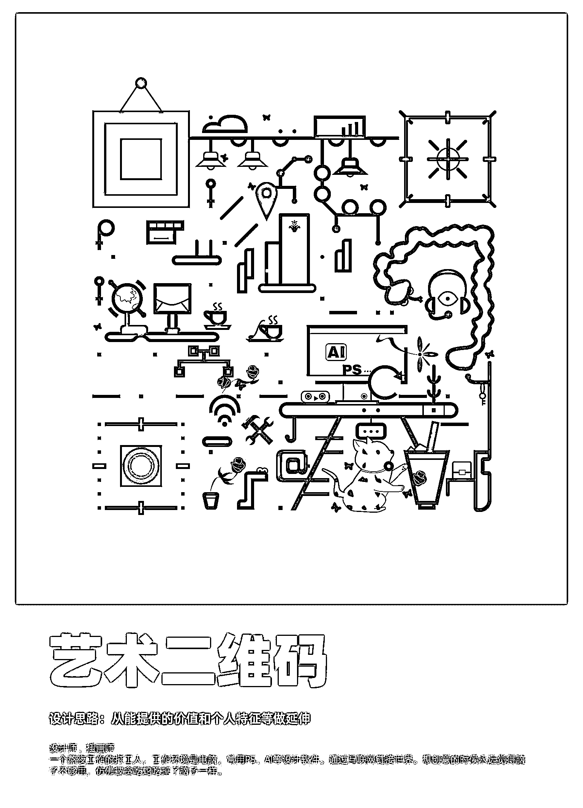

# 《我是如何用一枚二维码引爆 IP 流量的？》

> 原文：[`www.yuque.com/for_lazy/thfiu8/lvpxqhrt8wvlgbpb`](https://www.yuque.com/for_lazy/thfiu8/lvpxqhrt8wvlgbpb)

## (82 赞)《我是如何用一枚二维码引爆 IP 流量的？》 

作者：  吉果 

日期：2023-03-20 

我是如何用一枚二维码引爆 IP 流量的？——艺术二维码 

大家好我是吉果，一个插画师，生财透明人。最近新增加了一个标签，艺术二维码设计师。 

增加这个标签的起因是我整理图片翻出了以前给自己设计的艺术二维码，当天的朋友圈不知道发什么，就把艺术二维码的图片发出去了。 然后这张艺术二维码，让我见识到了什么叫著名圈友梁靠谱的影响力，什么叫表达者红利，什么叫一键引流，什么叫圈层的重要性，什么叫我被大佬加微信的慌张。 一个小小的二维码，也能玩出花样帮助引流。 

本文除了介绍艺术二维码的引流功能，也会分析购买使用艺术二维码的优缺点。因为这也是我在做艺术二维码经历中的真实感受，分享给大家做个参考。 [https://tgxl0sxo7f.feishu.cn/docx/AoT0dlRipo0RN6xDSo3cdckpnyf?from=from_copylink](https://tgxl0sxo7f.feishu.cn/docx/AoT0dlRipo0RN6xDSo3cdckpnyf?from=from_copylink) 

 

评论区： 

wz 斌 : 很怀念～很多年前学 ai 有做过，当时只是爱好，那一段时间在设计圈应该挺火的，后来不怎么看到了 有志 : 会不会出现一些艺术二维码，扫一扫识别不了 兵兵 : 是我看不了还是就这样，只有标题[嘘]  吉果 : 扫不出来是制作有问题。好的艺术二维码都是可扫可长按的。  吉果 : 商业价值和引流价值可能都没有发展明白吧。 Sarah : 挺有意思的，应该可以开课，知识付费  吉果 : 标题可以点开看的。  吉果 : 如果有商业价值是可以做成课的。