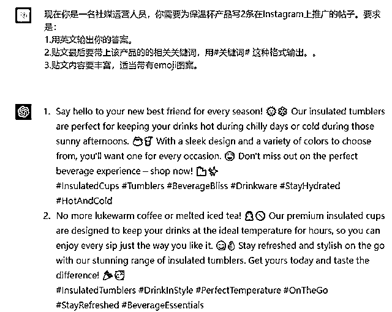
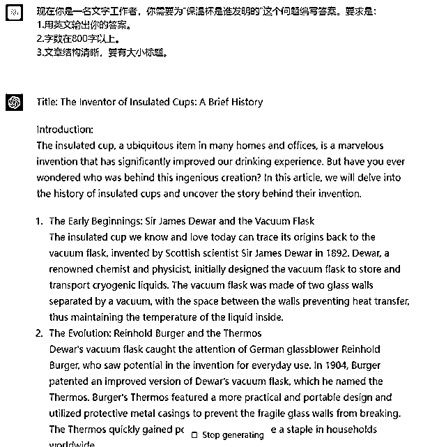
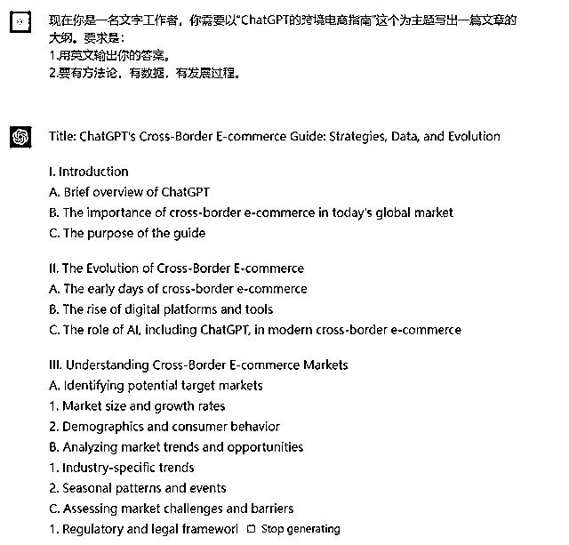
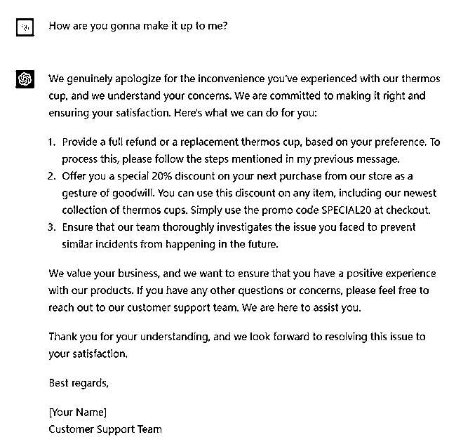
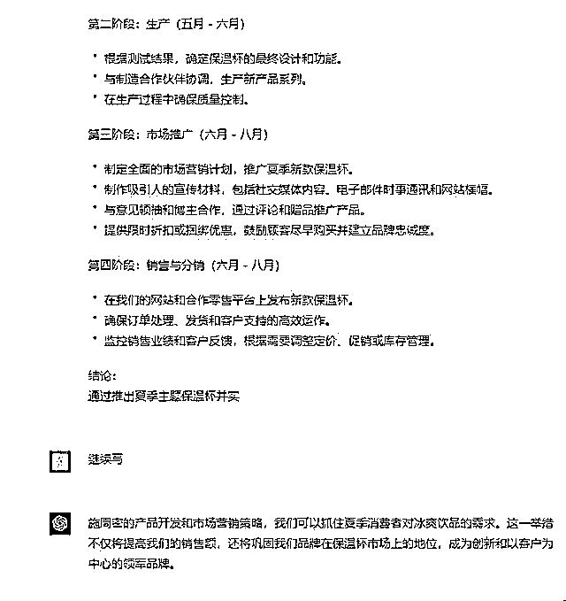

# 《跨境电商领域的 ChatGPT 应用指南 v1.0 》

> 原文：[`www.yuque.com/for_lazy/thfiu8/fxitvvex94xpryr4`](https://www.yuque.com/for_lazy/thfiu8/fxitvvex94xpryr4)

## (58 赞)《跨境电商领域的 ChatGPT 应用指南 v1.0 》 

作者： 希声。 

日期：2023-03-23 

这是一篇随性写的文章，因为还没做系统的整理，想到哪写到哪，作为第一个版本先发布，如果大家喜欢，后续会继续更新。 

# 1.写谷歌广告词。 

提示词： 

现在你是一名谷歌广告的编写人员，你需要为 xxx 产品写 10 条谷歌广告标题和谷歌广告描述。要求是： 

1.用英文输出你的答案。 

2.广告的标题和广告描述的字数等要符合谷歌的标准。 

3.广告要引人入胜，让人有下单的欲望。 

 

# 2.写 facebook 广告词 

提示词： 

现在你是一名 facebook 广告的编写人员，你需要为 xxx 产品写 10 条 facebook 广告标题和广告描述。要求是： 

1.用英文输出你的答案。 

2.广告的标题和广告描述的字数等要符合 facebook 的标准。 

3.广告要引人入胜，让人有下单的欲望。 

 

# 3.写贴文 

提示词： 

现在你是一名社媒运营人员，你需要为 xxx 产品写 5 条在 Instagram 上推广的帖子。要求是： 

1.用英文输出你的答案。 

2.贴文最后要带上该产品的的相关关键词，用#关键词# 这种格式输出。。 

3.贴文内容要丰富，适当带有 emoji 图案。 

 

# 4.回答 Quora 问题 

提示词： 

现在你是一名文字工作者，你需要为“xxxx”这个问题编写答案。要求是： 

1.用英文输出你的答案。 

2.字数在 800 字以上。 

3.文章结构清晰，要有大小标题。 

 

# 5.写文章框架 

现在你是一名文字工作者，你需要以“xxxx”这个为主题写出一篇文章的大纲。要求是： 

1.用英文输出你的答案。 

2.要有方法论，有数据，有发展过程。 

 

# 6.写亚马逊的产品描述 

现在你是一名亚马逊的电商运营，你需要为“xxxx”这个产品写出一篇适用于亚马逊平台的产品描述。要求是： 

1.用英文输出你的答案。 

2.想出 5 个独一无二的卖点，要在产品描述中提现出来。 

 

# 7.回复邮件 

现在你是一名客服人员，你需要写一封刺激客户再次购买我们 xx 产品的邮件。要求是： 

1.用英文输出你的答案。 

2.为客户提供一个合理的折扣。 

 

# 8.客服的常用回复知识库 

现在你是一名客服，你需要回答客户的问题，并做到以下要求： 

1.用英文输出你的答案。 

2.我会在接下来的对话直接引用客户的问题，你不需要解释，提问，要像一名客服一样直接回答问题。 

3.你要安抚客户让客户感受到温暖，并在适当的时机推销我们的 xx 产品。 

 

 

# 9.选品建议、产品规划 

现在你是一名网站的运营负责人员，我们公司的主营产品是 xxx，夏天马上要到了，你需要做一个报告，要求是： 

1.用中文输出你的答案。 

2.告诉我在夏天要推出什么样的产品来进一步提高我们的产品销量。 

3.写一份产品开发和推广的计划表。 

 

 

暂时先写这些了。 

不知道对你有没有启发和帮助？ 

评论区： 

Cora : [呲牙]我也是用它来帮忙写谷歌广告语 秋刀鱼哥 : 有用 希声。 : 666[呲牙] 希声。 : [太阳] shijinzhan : 强啊 Adam : 居然还会选品，6 永哥 : 很棒！ Adam : [强]