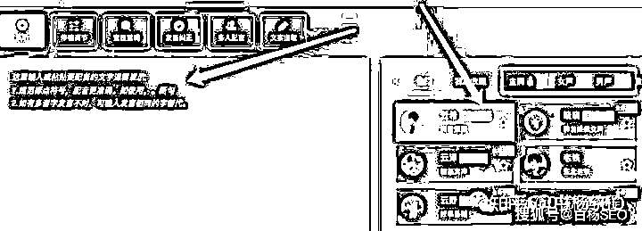
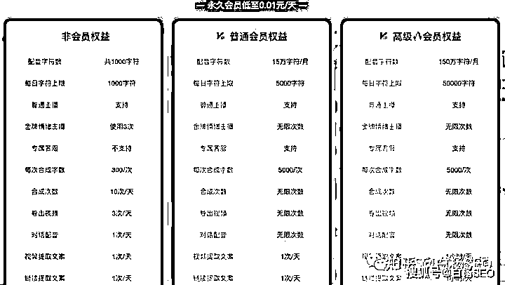
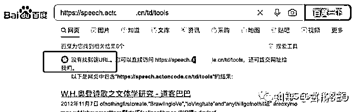
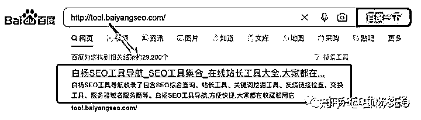
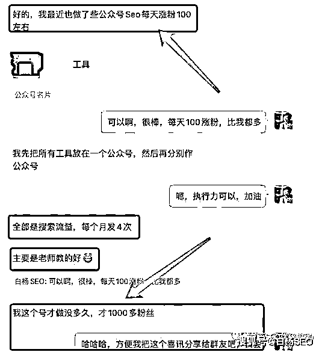
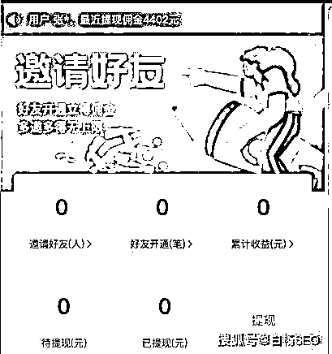
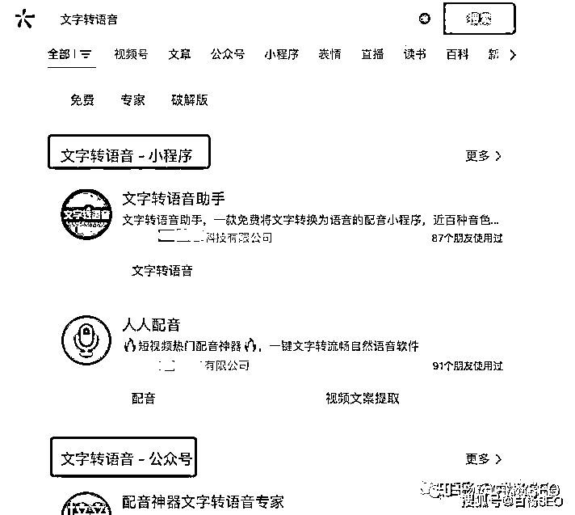

# 《简单拆解文字转语音这类 AI 配音工具产品怎么推广和变现的？ 》

> 原文：[`www.yuque.com/for_lazy/thfiu8/akzpku895qqowzp6`](https://www.yuque.com/for_lazy/thfiu8/akzpku895qqowzp6)

## (24 赞)《简单拆解文字转语音这类 AI 配音工具产品怎么推广和变现的？ 》 

作者： 白杨 SEO 

日期：2023-03-23 

  

本文大纲： 

1、文字转语音的 AI 配音项目是什么？ 

2、AI 配音为什么是刚需？产品形式有哪些？ 

3、AI 配音项目一般如何推广？ 

4、AI 配音项目一般变现方式有哪些？ 

文字转语音的 AI 配音项目是什么？ 

文字转语音的 AI 配音项目是什么呢？简单理解就是一个可以输入文字转变成语音的工具（如下图），而这个工具当有人需要时，就产生了商业价值，也就可以理解成是一个项目了。 

  

AI 配音为什么是刚需？它的产品形式有哪些？ 

AI 配音为什么是刚需？在白杨 SEO 看来主要有三个原因： 

1、因为 AI 配音其实是属于 2C（个人消费）业务，人口基数大，市场就大； 

2、AI 配音类的工具解决了很多人认为自己声音不好听的缺点，但又想以配音来发祝福或者做推广； 

3、AI 配音本身不只有 AI 配音功能，还包含其它一起功能，所以他可能是为了视频提取文字或者去图片或视频水印会使用，举例某 AI 配音搭配。如图： 

  

你可能会说，AI 配音或者图片视频提取文案之类不是免费的吗？是有一些免费的工具，但免费没有付费体验好。或者免费都是有数量限制，参考如图： 

  

AI 配音类产品形式有哪些？ 

AI 配配音类产品形式，最主要就是小程序 和 网站网页。小程序呢，主要是微信小程序（当然也有人去做百度小程序、支付宝小程序 QQ 小程序和抖音小程序等工具产品）。 

为什么用小程序、尤其微信小程序最多呢？因为用户在微信上是最多的，也最方便用的。现在人在电脑面前，除了上班，其余时间都在手机上，在手机上，除了抖音就是微信为主。 

AI 配音项目一般如何推广？ 

上面我们说完了 AI 配音项目的工具一般形式就是小程序或网站，那么如何推广小程序或者网站呢？ 

先说大家知道白杨 SEO 做了 13 年还在做的百度 SEO 的网站 SEO 推广方式。 

如果是网站的话，现在推广比较难了，尤其工具类网站。因为工具类的网站本身内容不够多，所以想要靠内容提高权重从而提升排名获取流量很难，但还是有一些方法。 

1、工具网站先要基础 SEO 完成，让网站被百度收录。比如我这个学员的没有收录，我的另一个 SEO 工具导航收录，如图： 

  

  

2、给工具网站更丰富内容规划，其实是可以布局更多的内容的，比如工具相关使用文档与技巧，都能有大量内容，实在不行，还可以借用 CHATGPT 来生成内容呢。 

3、给工具网站进行外链建设，主要就是换一些友情链接以及做一些外推。 

  

微信小程序怎么推广呢？ 

微信小程序推广，我在之前这篇《白杨 SEO：一文告诉你 16 条微信小程序推广渠道大全，实操举例【干货】》里写了 16 种方法，没看过可以再去搜索看看，这里再简单说下 3 个方式： 

1、小程序名字矩阵。大家知道，现在微信小程序里的内容很难在搜一搜里收录，早期除外。所以现在你要去获取微信搜一搜的流量，主要就是账号排名，唯一能做的就是做多个小程序，用名字来获取流量。 

多个，你以为注册 10 个算多吗？昨天跟一个朋友聊，他们小程序有几百上千个，日活近 100 万。你呢，至少要准备三五十个，积少成多，懂得都懂，小程序可以导小程序流量。 

2、公众号推广。这个同学，技术出身的，学会了选关键词注册公众号，以及布局长尾关键词在文章里获取搜一搜的精准搜索流量，如图： 

  

很多人其实忽略了搜一搜的里精准搜索流量，只要你能找到好的词，或者蓝海词，用账号名字方式也能获取搜索流量。再比如，也可以发公众号文章获取搜索流量的方式来推广小程序。 

其实除了公众号推广外，还可以用视频号推广小程序。方法就是把小程序放在公众号文章里，视频号挂公众号链接即可。 

3、小程序本身裂变。其实这种工具本身一般都会设计邀请返现，这样让用户邀请用户的方式，这是所有工具都在用的方法（套路），很正常的，你要推是不是也可以用呢？ 

  

AI 配音项目一般变现方式有哪些？ 

AI 配音工具项目本身变现方式最主要就是售卖会员模式，无非就是会员分普通用户和高级用户。如下图： 

  

  

当然，在微信小程序上，只要这个小程序用户多了，其实还可以有其它项目，因为这个同学是技术出身，有团队做这个，所以他们产品蛮多的，还有 AI 写作，AI 伪原创等等，如图： 

  

你可能会说：白杨 SEO，这个工具好像没什么难的，我也可以做？ 

是啊，如果说技术，这真不是高精尖，不然现在也不会有这么多竞争了。难点是你懂不懂推广呢？或者你能不能找到 0-1 种子用户呢？你找不找得到你这个产品在搜一搜的蓝海词呢？ 

  

这个截图来自腾讯广告官方后台搜一搜数据  

关于腾讯广告搜一搜这个文章我之前在生财分享过一篇，不过目前必要开户才能用搜一搜功能，我的是我一个学员账号借我用的，他们都是在之前注册的，个人可以免费用，所以拿到搜一搜官方数据很重要。 

作者简介： 

白杨 SEO，专注 SEO 十年，SEO 流量实战派，对全网精准搜索流量有深入研究。 

评论区： 

施霖终生学习者-链接 : 我有几个终身软件，APP，小程序都有，确实丝滑，还能快速配音，文字转语音，双向切换 白杨 SEO : 嗯 执着的启明星 : 对于个人来说，注册好几十公众号，太难，现在一个手机号只能管理知道公众号 皇冠一刻钟 : 这类小程序 有没有开放接口之类的 分佣返现 或者卖系统的 白杨 SEO : 分佣返现有，至于系统不太清楚，应该也有吧