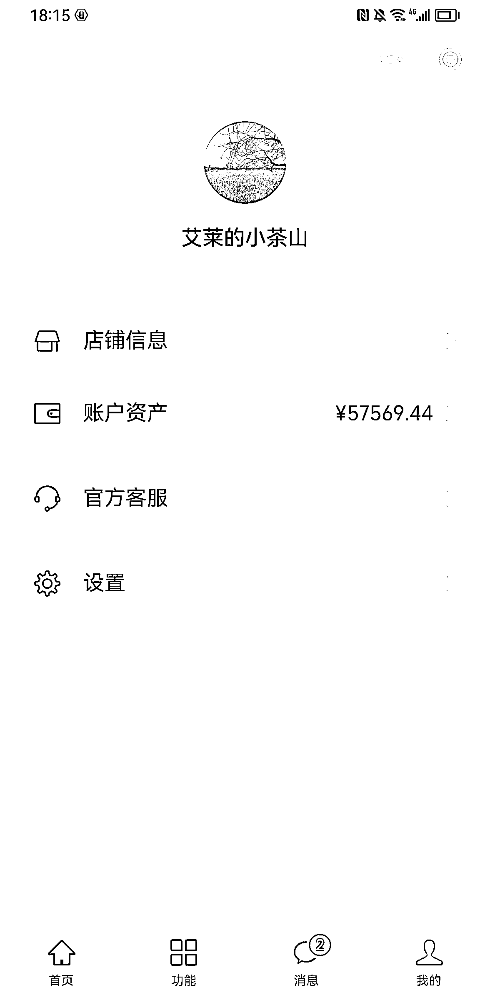
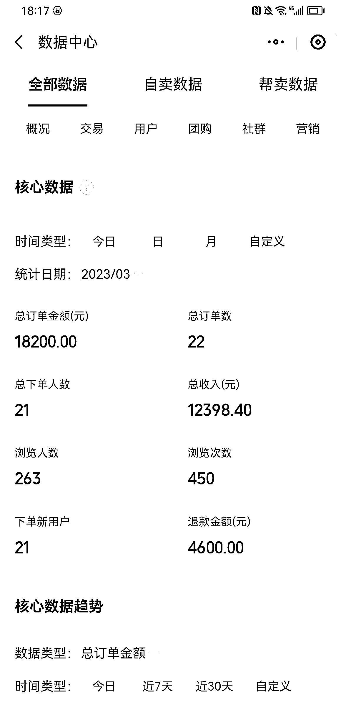

# 《私域副业卖春茶，一个月可以 500 斤龙井月入 40w 》

> 原文：[`www.yuque.com/for_lazy/thfiu8/fh9fhndh9ougt48f`](https://www.yuque.com/for_lazy/thfiu8/fh9fhndh9ougt48f)

## (72 赞)《私域副业卖春茶，一个月可以 500 斤龙井月入 40w 》 

作者： smldy 

日期：2023-03-20 

今年从 3 月 1 日预售，到 20 日已经卖了 20 几万，几个平台数据如下，副业卖茶 7 年 

  

1、为什么选择茶叶 

①自己老家是绍兴新昌，是龙井茶的大产区，全国 30%左右的龙井出自新昌，自己家也有茶园，对茶叶比较了解，解决了供应链的问题 

②茶叶本身的利润比较可观，茶叶目前没有标准的定价，也没有大的品牌，从 50 一斤到 5000 一斤的都有，有可操作的空间，解决了利润空间的问题 

2、怎么做出跟别人的差别 

①产品从工艺上升级，一般从市面上买到的茶叶，并不是很香，我们从加工工艺上提升香味，给人好的第一印象 

②产品分等级，除了品牌的茶叶，一般的茶叶特级，一级，我们的茶从采摘时间上分头采，第二批优质茶，第三批口粮茶。 

③茶种选择上，龙井茶在我们老家有 10 几个品种的茶树，我只挑选了明前茶（龙井 43），跟西湖龙井的同一个品种，属于口感最好的品种，不给客户别的选择，选择太多等于没有选择，其他的就是雨前茶（群体款），龙井白茶（女士款） 

3、如何去卖茶叶 

①打擦边，茶叶突出跟西湖龙井同一品种，给人亲近感和好感，毕竟西湖龙井都听过 

②私域运营，我个人有 1 万多个好友，通过线下活动和一些圈子加了一些高质量的人群，容易变成客户 

③做人设，我一开始卖茶的时候，就打的是丈母娘的茶园，打造好女婿的人设（事实上确实也是丈母娘家的茶园） 

④突出自家茶园，无农药，无公害，保证产品质量 

4、营销上如何做 

①除了分销尽量不选择快团团，快团团我今年也是第一次做，分销要找准人，一般微商带不了什么茶叶，最好找大公司的员工，内网内部群发一下就能有订单 

②用自己的平台，我用的是微信小商店，快团团给人的感觉可能货源不是你自己的，所以最好有自己的小程序，这样给人感觉真实货源 

③人群分类，根据原有的消费，做人群分类，做好老客户营销 

④打出差价，我的店铺里上架了狮峰龙井（4500 一斤），不是为了卖，是为了做对比，感受的我的茶叶的性价比 

5、注意的点 

①保证茶叶的品质，茶叶里面有很多道道，自己的茶叶做到保真，做好品质 

②不要找大的博主带货，一般的博主不是很勤奋做的，发一两次基本上带不来什么订单，被用户看到只能让用户觉得你的茶利润很高（跟让微商带货一个道理） 

③图片尽量用自己拍的图，不要做效果，手机拍的就行，给人感觉实在，诚实，做出茶农的本分感 

④自己要懂茶，很多常识性问题的问题要练习 

补充一些龙井的常识 

龙井茶的源头就不说了，大家都知道西湖龙井，西湖龙井也是十大名茶之一，一般来说绿茶之首，西湖龙井原先最核心的产区就是狮龙云虎，狮峰、龙井、云栖、虎跑，后来七八十年代的时候因为周总理来梅家坞，变成了狮龙云虎梅，西湖龙井原来其实也很乱，什么地方都龙井茶都用西湖龙井的包装，2020 年的时候政府统一标识，只要西湖龙井产区的才能用西湖龙井的商标，别的都不能用了，抓住一个罚 10 万，所以现在基本上也只有淘宝偶尔可以买到这种包装了，一般的都是龙井茶的包装，所以现在你去看茶叶是不是正宗西湖龙井，只要看包装上有没有连起来“西湖龙井”四个字，就是西湖牌的龙井，他也是要标识西湖牌“西湖龙井”，外地的茶只能标识明前龙井，雨前龙井，龙井茶这些。 

龙井茶价格受产地、批次、时间等很多方面的影响，就像简单说同样的西湖龙井，狮峰龙井 4500 一斤，梅家坞 3500 一斤，到龙坞只要 1500 一斤，整体距离不超过 5 公里，外地的龙井更是几百到一千多都有。西湖龙井政府都会给茶农或者茶企每年定量的发茶农标（茶企标），一般是根据茶园的面积，这个标识可以溯源到哪家产的，包括加工的机器这些都是政府统一的，产出的数量都是有记录的，所以现在还是相对来讲比较靠谱的，虽然有一些渠道可以买到一些茶农标，这种暗里都有，毕竟利润高。 

这些不说了，还是来说说自己的茶叶，我家的茶叶呢，属于越州龙井，龙井的产地出了杭州就主要分为两个部分，一部分是往西走，千岛湖富阳的方向，属于钱塘龙井，一部分往东走，主要是绍兴方向，属于越州龙井。钱塘龙井主要是原来一些杭州的茶企的茶叶基地，越州龙井主要的产地就是我的老家新昌，新昌属于山地丘陵，也弄了一个自己的商标，叫大佛龙井，因为新昌有个大佛寺，新昌的龙井茶一年的产量可以占到全国的 30%-40%，而且因为主要是山地，天气，土质都比较适合产茶，一般的茶叶质量会比其他的地方好，高山云雾茶一般都感觉比较好的样子，而且还有一个呢，新昌的茶机水平研发水准应该比其他地方高一到两代，炒茶工艺比较好。 

一般去过西湖边或者龙井这些地方的，会看到门口放一口锅在炒茶，基本上这种都是做做样子，摆摆样式的，现在的龙井基本上都是茶机炒的，手工茶一般都买不到，我们那边也有做手工茶的，最便宜的基本上人工费 200 一两，加上本身的价格，最便宜的也要 3000 左右，一个老师傅，一天认真的炒，也炒不出三斤干茶，没办法，人工太贵了。我初中的时候也学过手工炒茶，那时候我们那都是这样的，炒的满手都是水泡，然后用针穿根线把脓水流掉，皮不掉，继续炒，确实很辛苦。 

再讲讲大家比较关心的茶叶价格，我的茶叶明前茶头采 1200 一斤，第二批 800 一斤，很多都会觉得贵，抖音淘宝上一堆都是几百块的。这个呢有好几方面的原因，第一个，你看到茶叶不是今年的，是陈茶，现在很多都有冷库，茶叶产量也高，一般很多商家都有陈茶，有些会掺着新茶卖。第二个，你看到不是本地的茶叶，比方很多 2 月份就在卖新茶的，那都是四川贵州的龙井，那是浙江政府的定向扶贫项目，然后再晚一点就是丽水松阳的，温州永嘉的茶叶，这些基本上打时间差，等这边龙井上市的时候来当好的茶叶。第三个，茶叶有很多树种，比方出的最早的乌牛早，很多都说这个是假冒龙井，其实依我来说，龙井在我眼里是一种炒作工艺，只是用了不同的茶树叶，我们那茶树我数数估计都有十几种，这种怎么样掺合一下或者当别的品种卖，一般人也分别不出来，但价格就相差很大。第四个，一般的茶农会炒茶的时候，会特意把茶叶炒的不那么干，所以颜色会稍微绿一些，不要小看这一点点，重量整体下来会相差很大，就像三斤半青叶炒一斤干茶跟四斤炒一斤，这就差别很大了。 

说说另外一个，茶树品种，一般说正宗的龙井，一般以前都是群体种，就是老茶树，传承下来的，一般在清明前后出产，所以那时候有明前茶贵如金的说法，那时候是真的少。还有一个品种呢就是龙井 43，这个是农科院培育出来的，这个品种口感很好，出产日期短，基本上就只有两周，但是在清明前，现在的明前茶基本上就是这个品种。别的茶种还比较好喝的就是平阳早。其他的会相对差一些。 

最后说一下我自己的茶叶，我的明前茶都是用的龙井 43，只卖这一种，就怕选择太多就是没选择，所以我就卖我觉得最好的，这种茶叶，头采的时候茶青都要 150 一斤，加上人工什么的，其实整体肯定是不会便宜的。第二个，我们炒茶的时候，会比别人多一两道工序，把茶叶做的更拢更细更干，相当于一般专业说的榨香，所以一般人喝我的茶的时候会觉得很香，这步其实很重要。 

基本上结束了，比较随意，最后欢迎做私域的朋友，做茶叶，喜欢喝茶的朋友，一起交流学习。虽然躺赚的感觉是不错，但是对比认识更多圈友，这算不得什么。（我的微信：smldy98） 

评论区： 

老牛（深圳➕云南） : 圈友放个微信，我想买点试试[偷笑] smldy : 忘记放微信了吗[捂脸][捂脸]我的微信 smldy98，我去文章后面加一下，欢迎找我买茶交流 卢志敏 : 2000 块一斤的茶跟 5000 一斤有啥主要区别呢？ smldy : 产地不一样，越靠近西湖核心产区越贵，产地，批次，时间，土壤，天气都可能导致口感不一样 嘉达 : 牛，我前两年也直播卖茶和私域，交流一下[玫瑰] 芷蓝 : 是今年的新茶叶吗？ smldy : 是的，欢迎找我买茶[偷笑][偷笑] smldy : 欢迎交流