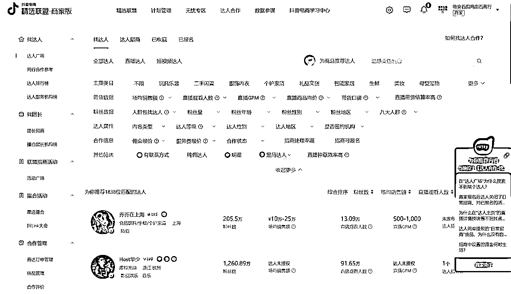
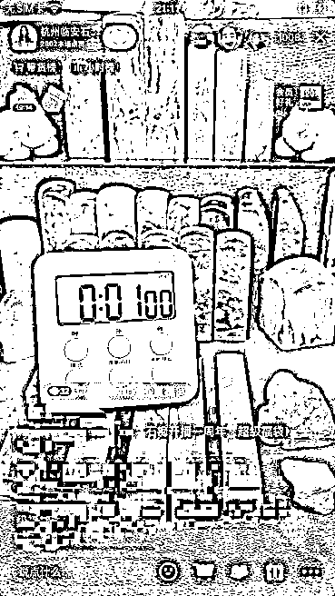

# 《抖音小众类目——鸡血石直播变现百万的经验分享》

> 原文：[`www.yuque.com/for_lazy/thfiu8/xldhb1i88s70pyvw`](https://www.yuque.com/for_lazy/thfiu8/xldhb1i88s70pyvw)

## (31 赞)《抖音小众类目——鸡血石直播变现百万的经验分享》 

作者： 时易 

日期：2023-03-22 

抖音直播起步会遇到很多问题：比如资金不足，设备不行，场景没有差异化，流量瓶颈没有人气，成交困难等等，想做直播都会遇到类似得问题。 

一开始做 鸡血石直播，我们觉得选了个小众蓝海，但现实是，有利润就避免不了这样的问题。 

和大家一样，这一年我们经历了账号不起眼转型设立 IP，没有用户就送福利积累，流量低就花钱投流，直播间没有趣味性就打造场景......见招拆招不断尝试、迭代，达到现在持续稳定变现的效果。 

如果圈友有做文玩类目或者高客单的,或许我的经验可以帮助到大家,我将以抖音鸡血石直播这个项目为例，从以下几个方面给大家讲讲如何做小众高客单直播： 

一、什么是鸡血石 

二、为什么选择鸡血石 

三、 鸡血石直播的几个阶段 

1.  前期准备：设备和入驻基地事宜 

2.  第一阶段：随便发发，几十个作品，粉丝 1000+ 

3.  第二阶段：转型人设 IP 账号，确定手播形式 

4.  第三阶段：实打实送福利，积累忠实用户 

5.  第四阶段：流量瓶颈，开始进入千川投流 

6.  第五阶段：增加趣味性，开始推出拍卖形式 

7.  第六阶段：增强人设，打造场景，从手播到真人出镜 

四、关于用户如何承接进入私域实现复购 

五、新人想做的门槛和建议 

六、关于抖音鸡血石直播的经验分享 

各位圈友好，我是时易，是一名 95 后运营，2020 年末加入的生财，看到了很多优秀的圈友和项目，让我拥有了想从事自由职业的心态，感谢生财，也希望接下来的分享能给大家带来收获。 

# 一、什么是鸡血石 

可能很多圈友是第一次听说鸡血石，郭郭的《玩低客单价是对抖音红利的浪费》一文中有过介绍，我这里也简单再介绍一下什么是鸡血石。 

鸡血石是中国稀有特种矿产资源，因颜色鲜红，色如鸡血而得名，产地在浙江昌化和内蒙古赤峰巴林一带。昌化鸡血石作为中国四大国石之一，更是和寿山田黄石、青田灯光冻誉为“印石三宝”。 

千百年来，古人一直把鸡血石当作富贵以及财富的象征，非常受达观贵人的追捧，他们认为鸡血石能带来吉祥，给人感觉一块鸡血石能让人前程步步高升。 

清代康熙、乾隆、嘉庆、咸丰、同治等皇帝和慈溪等历朝后妃均选昌化鸡血石作为宝玺。在现代，很多伟人亦选昌化鸡血石治印或作为国礼馈赠外宾。 

明清篆刻家和现代文化名流郭沫若、吴昌硕、齐白石、徐悲鸿等都有一段与昌化鸡血石结缘的故事。昌化鸡血石的足迹也遍布五大洲，尤其在日本、韩国、新加坡等东亚国家及世界华人界更享盛誉。 

  

  

# 二、为什么选择鸡血石 

我的老家就是在盛产昌化鸡血石的原产地玉岩山脚下，父辈做 鸡血石生意也几十年了，但一直都是在传统线下，有着一定的资源积累。 

当时 21 年鸡血石的行情并不好，父亲线下生意惨淡，而 21 年抖音兴趣电商刚刚兴起，一切生意似乎都能在抖音上做。有先见之明的两个同行在抖音上开播 2 个月了，成绩非常不错，恰好证明了鸡血石这么小众的类目在抖音也是有一定的市场的。 

于是，结合父辈有鸡血石的资源和已有同行做出成绩这两点，是我女朋友当机立断，立马停掉当时还没有产生利润的抖音短视频创业，自己尝试做主播。 

还有一个点不得不提，就是当时第一时间加入了尹晨俱乐部，认识了尹晨，在参加他的第一次线下课的时候更加深刻了解抖音电商的巨大前景和坚定了做 鸡血石直播带货的信念，女朋友到现在也一直说尹晨就如一盏明灯在指引着我们。 

一旦做了选择，就要坚持的去执行。另外，好的圈子会是会更加赋能的，比如生财，比如尹晨俱乐部。 

# 三、鸡血石直播的几个阶段 

## （1）前期准备：设备和入驻基地事宜 

鸡血石在抖音属于特殊类目，是需要报白的，需要营业执照，如果你是做文玩类目，基本上都要向抖音官方基地报白质检，如何报白大家去抖音官网查看就好了。 

鸡血石属于石雕类目，我们入驻的是抖音青田石雕基地，大家做文玩我这边建议是要选择适合的基地去报白，像鸡血石这类小众品很多人不了解，市场上也有冒充品假鸡血，客户询问的较多问题就是有没有证书，怎么保证是真品，而经抖音基地质检通过后是会出一张证书的，也是买卖双方做了一个保证，这是基地最大的好处。 

以前刚开始我们作为商家觉得很麻烦，不是自己直接发货给客户的，还要交基地一笔质检费用，没有什么用处，基地一开始质检也比较随意， 

但现在我们有清楚的感觉到基地质检也严格起来了，对于一些不符合类目要求的都会驳回，所以还是建议文玩高客单价的东西走基地为好，双方保证，等自己有了一定的影响力或者信誉度了，可以考虑和基地协商自己发货。 

设备方面非常简单，大家一开始做直播带货不用想着要多少多少专业的直播设备，我们就是两盏灯，一台手机，在一个不到 15 平米的小房间里就开始直播了。 

圈友刚做直播，要学会成本的控制，看到朋友圈说，一个人想做直播创业，如果没开始前就先租了写字楼，看似高大上，大概率的结果是失败的。 

## （2）第一阶段：随便发发，几十个作品，粉丝 1000+ 

一开始做的时候，我们没有新建抖音账号，用的是我父亲的账号，因为他之前有发过关于鸡血石产品的视频几十个，但粉丝仅仅只有 1000 个，也大多都是好友，刚刚满足当时开播 1000 粉丝的要求。 

这里，我建议大家起号还是需要有作品的，要养号，至少让新粉丝知道这个账号是干什么的，知道我们是谁。在有一次账号触犯了抖音社区规则之后，我们改用了小号直播，小号没有作品也没有权重，开播后就没有自然流量。 

## （3）第二阶段：转型人设 IP 账号，确定手播形式 

我们正式开播前，我和女朋友对账号重新进行了定位，确立了账号名称，修改了账号简介，想做女朋友的人设，也明确了分工。 

我父亲是石痴鸡血石的掌柜，负责鸡血石的选品和定价；我女朋友是主播，是石痴掌柜的徒弟，作为新一代年轻人，负责宣传家乡美石和印石文化； 

而我作为运营，主要负责发货以及客服售后等问题。之前抖音账号全是鸡血石产品视频，后面由女朋友真人出镜，拍摄了几个她讲解鸡血石历史文化和收藏价值的视频，确立了女朋友的人设。 

当时看到很多珠宝类直播都是采用手播的模式，我们也采用手播模式，好处在于直播不用真人出镜，降低了女朋友作为新手主播的心理压力，一台手机两台灯光，我们以极低的设备成本在 21 年 8 月 2 日正式开播了。 

## （4）第三阶段：实打实送福利，积累忠实用户 

在 21 年  8 月 2 号开播后，其实对于直播我们都是新手，并不会做很多分析，就是平播，按主播的话说，就是硬播。 

女朋友对鸡血石本身就是不了解的，我父亲也只是简单介绍了鸡血石，她自己呢，在开播前买了市场上所有关于鸡血石介绍的书籍，阅读吸收，并在第一场直播做了写了满满一页的鸡血石介绍，鸡血石的品种很多，每一方印章也都是非标品，都需要做独立的讲解介绍。 

在这点上，新手主播一定是要对自家产品很熟悉，做好一定的准备上播。当时因为鸡血石类目的小众性，抖音给的自然流量很多， 

印象很深的是，第一天我们没有出单，但第二天就有客户下了一单 4000 多的鸡血石 印章，后面接连几天都有客户入几千甚至上万的鸡血石 印章。 

我们运气不错，当时也就更加坚定了小众品在抖音直播是有用户群体的。鸡血石平播近半年，我们的场观都有 3000 多人，平均在线人数在 30 多人。 

说下我们一开始的玩法，很简单，就是开播截屏送一枚昌化石 印章，吸引第一波人气，中途再送一枚，下播前再送一枚，一场直播送三枚昌化石 印章，其实成本很高，当时一枚昌化石 印章的成本就在 200 元 - 300 元，实实在在送，这样下来积累了我们第一批忠实粉丝，很多粉丝就天天来直播间参与活动，增加了直播间的人气。 

直播过程中，我们抖币福袋一直都在发，也起到了稳定人气的作用。新手直播间人气很重要，特别是我们高客单价的，在平播过程中，讲解一枚印章需要 5 到 10 分钟，但很容易造成人气的流失。 

鸡血石印章其实很看眼缘的，一旦用户进入直播间看到的是他不喜欢的品类，就划走了，看到喜欢的会留下多看几眼，再者，看到一个直播间人数在线就几个人，很难让他驻足观看（停留），更别说后续成交了。 

直播间想要成交，一定是先想着怎么去留人，当时做的实打实送福利的决策是对的，让我们直播间有了第一波人气，每天开播进来的流量比较稳定，让直播间的权重也得到了提升，也就是进来的人群更为精准。 

到 21 年年末，我们的直播还是比较顺利的，在别人都已经付费投流的时候，我们还是享受着官方的自然流量。 

这就是我们第一阶段的直播玩法，也是起号方法，我们对待用户怀抱真诚，实打实做福利，新直播间最重要的还是人气，有人气才会有更多机会成交。 

## （5）第四阶段：流量瓶颈，开始进入千川投流 

在后来由于成本太高，每天送三枚 印章的活动坚持了 6 个月后就暂停了，是 22 年年初那段时间，我们遇到了流量瓶颈。 

系统推的自然流量越来越少，老粉占比过高，成交的数据很不稳定，场观从 3000 变成 1000 多，平均在线人数从 30 多变成 10 几个，有时候连着 10 天都成不了单，无疑大大增加了我们的焦虑。 

在 22 年 2 月底尹晨和郭郭来我们直播间参观指导后，我们尝试着做出改变，开始尝试千川付费，也改变了活动玩法。 

我把送昌化石印章的成本变成千川投流，第一条计划投的是极速推，进入直播间，稳定人气用；第二条第三条计划投达人相似，增加精准人群的进入； 

好在之前直播间流量模型不错，系统进来的免费流量相对比较精准，配合千川，我们的直播变成更加稳定，每天都能出单。 

千川投流方面我们比较特殊，因为鸡血石特别小众，每天成交在 1w 到 2w，好的时候能上 5w，所以每天的投流预算在也只能控制在 1000 左右，不像很多大的直播间预算可以几十万这样。 

投的千川计划达人相似比较多，寻找相似达人可以运用蝉妈妈工具，也可以在小店后台精选联盟里面找（图 1 ），找到属于文玩类目或者相对应的达人，以下是我们近 7 天的投流数据（图 2 ）。 

 

图 1 

  

图 2 

## （6）第五阶段：增加趣味性，开始推出拍卖形式 

由于平播的难度太高，高客单价成交频率非常低，我们在直播玩法上也做出了改变，采用的是拍卖形式。 

区别于之前的平播，拍卖即价高者得，鸡血石印章属于非标品，每一枚印章都不一样，所以很适合拍卖，公平公正，现在很多石雕或者印章类直播间也大多采用了拍卖的形式。 

拍卖的品的价值一般都是 1000 左右，这里的利润不高，属薄利多销。 

拍卖结束后我们正常讲品，讲一些鸡血石的高货，价值几万不等。 

展开讲一下我们直播间拍卖活动，一般有人竞得都是秒拍秒付，这里细节在于拍卖设不设小号当托的问题，我们觉得活动要真实有效，鸡血石本来就小众，要推广要成交，取得客户信任是第一位。 

所以我们一致决定是不设托，这样才会有客户愿意出价，愿意经常来出价，有时候最终出价远不到我们的卖价，我们也得发购买链接给客户。 

很多直播间学我们拍卖，但都会设托，不到合理的出手价就会用自己小号拍下，我们觉得这样活动就没有了意义，有舍才有得，格局要放大。 

所以很多客人会来复购的原因就是低价竞得印章后，收到货满意喜欢还会来参与第二次，我们直播间复购率相对同行来说还是比较高的，也有客户会在拍卖结束后入高货，我们相信客户也不傻，超出预期价格也不会再出价了。 

如果圈友觉得对于拍卖的规则比较适用自己的品，可以搜索一下我们直播“石痴鸡血石”观看一次就更清楚了。 

其次是平播卖章，这里成交是最容易也是最难的。最难的就是鸡血石是非标品，拿出的每一枚印章都有自己的特点，只能一枚一枚展示，所以客户进入直播间的第一眼看到的不是自己喜欢的就划走了，听到价格高也一下子划走了。 

容易的点在于我们说鸡血石遇有缘人，客户看到喜欢的直接就会下单了，这类客户很少，基本上是有钱人，看中了就下单了，往往也不还价，很直爽，但属一次性客户。 

遇到犹豫不觉的客户，我们会发一个低于直播间报价的价格，都是客户能接受的价格，也就是进行逼单，主打的点还是在于单品的特殊性，错过这枚就没有了，一般客户真的喜欢也会直接下单。 

还有就是，鸡血石作为小众高端文玩，特别适合送礼，“一方鸡血石，千古帝王诗”，很多客户买鸡血石就是拿去送礼的。 

在成交方面我们还有很大的学习进步空间。但推出了拍卖 + 讲品的模式后，在 22 年 9 月份，我们有幸做到了抖音石雕类目的第一。 

其实任何产品，再小众的品，只要满足一定人群的需求，就一定会有成交。 

 

## （7）第六阶段：增强人设，打造场景，从手播到真人出镜 

在 21 年 8 月播到 22 年年底，我们采用的是手播，现在很多玉石文玩的直播还是采用的手播，手播的好处在于不用真人出镜，设备成本低，一台手机就够，是能够满足直播的基本需求。 

但我们也浏览了很多优秀的直播间，特别是紫砂壶的直播间，珽珽紫砂，达观说器等等，大多都用了摄像机直播，真人出镜可能会更加拉近与用户的距离，产品展示也会更高清些，实物还原度要更高些，只是主播需要克服直播真人出镜的心理压力。 

我们核算了成本，考虑再三，还是觉得原有的手播场景有做升级的必要，于是在 2023 年初装修了一个新的店面，专门弄了一个房间作为新的直播间，也请了专业人员重新打造了一下场景，购买了专业的直播设备，从手播到真人出镜，增强了主播的人设。 

目前来说效果还不错，也是鸡血石同行直播间的首家摄像机直播间。直播就是人货场，我们也是尽力在完善，还有很多进步的空间。 

在有成本预算的情况下，有一定的成果的前提下，要敢于做出改变，打造新的直播场景，与同行之间形成差异化，会更加吸引用户的眼球，增加停留时长，增大成交几率。 

 

 

手播场景 

 

 

真人出镜及产品展示 

# 四、关于用户如何承接进入私域实现复购 

在私域这方面我们做的远远不够，不能够给到圈友更多的经验，但私域的重要性不言而喻，特别是高客单价的产品。 

我们直播间下单过的客户基本上没有引到私域，都是客户看到直播或者抖音号主动加我们的，我们团队仅有 3 个人，时间和精力很不够，没有多余的时间去产生内容运营朋友圈，但加了微信的客户都是非常精准的。 

大多数是来入鸡血石高货 印章的，价格也都在几万不等，这全都是由我父亲去做成交的，这些客户一旦产生信任，收到货满意会来购买第二次。 

私域成交的威力巨大，经我父亲微信成交的生意有上百万之多。在今年我们尽量抽出时间，学习私域方面并开始运营。 

现在在线下也开了全新的实体店，在杭州临安，石痴鸡血石艺术馆，主要也是为了增强线上客户的信任感，特别高客单价的鸡血石还是需要来线下实体看实物做当面交易的。 

如果杭州的圈友有时间也欢迎来玩来交流。我们认为，好的实体，一定是线上线下相互赋能的。 

# 五、新人想做的门槛和建议 

鸡血石是属于蓝海的，我们综合利润来说，是 30% 左右，没有想象中那么高，但也不算低，能够养活我和女朋友目前的生活。 

真正的利润空间其实是赌石，跟玉石翡翠一样，这个就不展开来说了。 

但就门槛来说还是比较高的，因为鸡血石是我们当地的矿产资源，政策原因封矿好多年了，之前是父辈线下做这个生意几十年了，有这个资源积累。 

其次难度最大在于选品，鸡血石是非标品，每一枚印章有每一枚的价，鸡血石有很多不同的品类，且都需要做独立的介绍，我们想要真正了解和评判鸡血石的价值并不容易，到现在其实我和女朋友对于鸡血石印章价格的认知还是处于初步阶段，选品及售卖价格全是经父亲把控的。 

好在现在印石类类直播间很多，不单是鸡血石，还有寿山石，青田石和各种奇石，印石篆刻等都属于同个类目，且属于文玩类目，圈友有类似资源都可以尝试去做的。 

如果圈友有意向，我自家有一批冻石资源，一直想拿来做文创但没有精力去开发，如果有机会可以合作开发。 

# 六、关于抖音鸡血石直播的经验分享 

做鸡血石这类高客单的抖音直播有近一年半，但我们也还一直摸索学习中，直播方面经验其实真没有多少，按女朋友的话来说就是硬播，等熟悉了之后，对直播间会产生感知力，会有意识去抓住那些最有购买意向的用户，女朋友说播多了就会知道的。 

我们能告诉圈友的是不管做哪类产品，做直播就尽早去开播，不要到了开播还犹犹豫豫，做太多准备也不好，走出第一步先，每播一场积累一场的经验。 

我们刚起步阶段充满了不确定性，因为鸡血石线下行情真的不是很好，也不知道线上直播到底怎么样。 

但总是做了才知道，就像上述直播每一个阶段我们都遇到了困难，资金不足，设备不行，场景没有差异化，一连几天没有卖出过一件，流量瓶颈没有人气，成交困难，鸡血石成本变高利润变小等等，但我们遇到问题都是想着怎么去解决。 

还有就是告诉圈友更重要的是坚持，相信相信的力量，就因为我们相信抖音平台能赋予我们机会，小众品也能有成交，我们一直坚持到了现在。 

我们现在也还在路上，要学习的东西更多，一起努力，生财有术。 

评论区： 

嘉达 : 对，坚持，相信相信的力量。抖音其实有一项重要的考核指标，就是勤奋度[呲牙] 轩 : 不错！我也是直播玉石的，加油吧。前程似锦 高翔 : 有没考虑做紫砂直播？ 时易 : 暂时还不考虑，紫砂行业太倦啦[憨笑] 时易 : 一起加油[愉快] 时易 : 是的，越努力越幸运[加油]