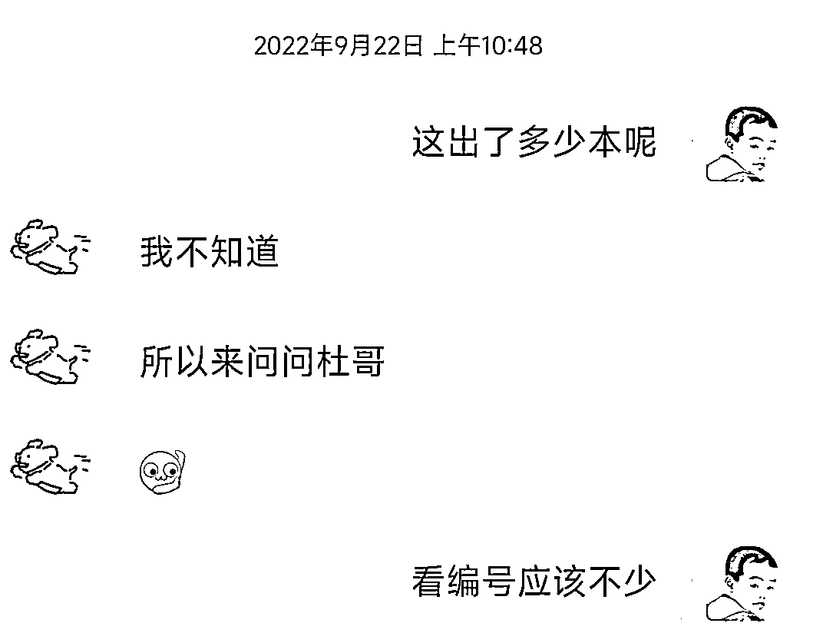
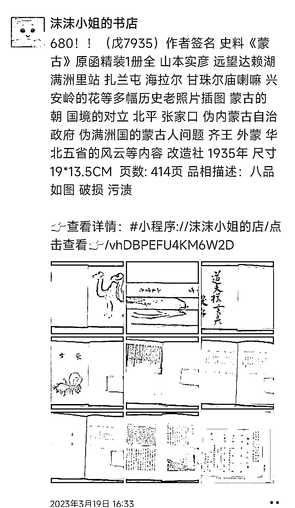
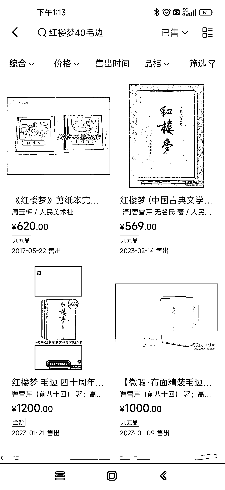
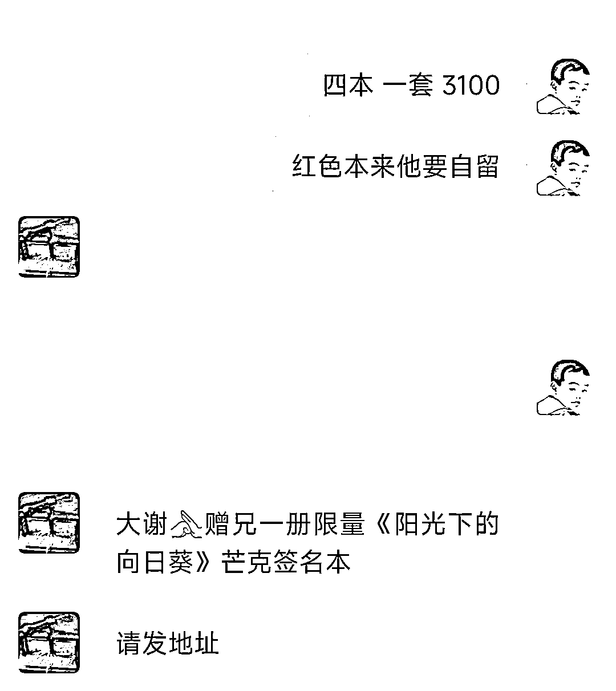
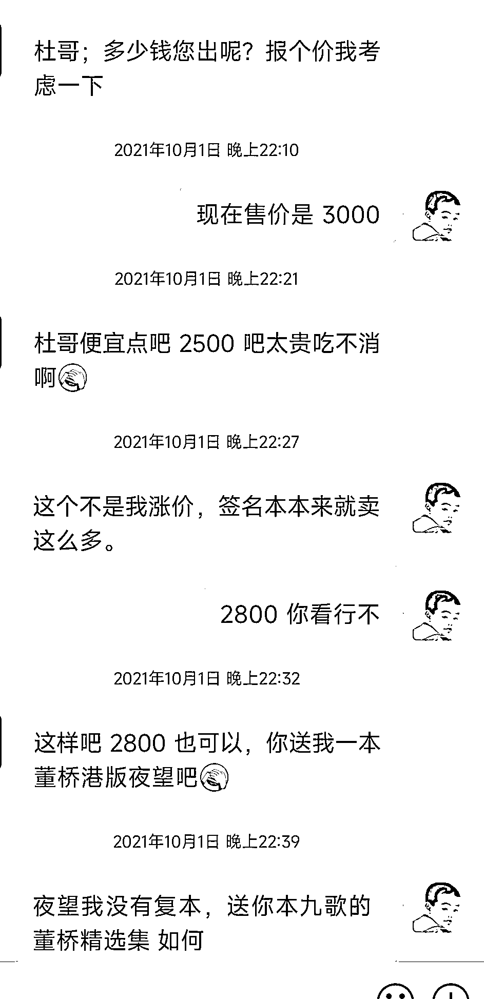

# 《普通人买卖旧书的赚钱机会分享——二十年淘书经验分享》

> 原文：[`www.yuque.com/for_lazy/thfiu8/mnho5y476f9pq4vf`](https://www.yuque.com/for_lazy/thfiu8/mnho5y476f9pq4vf)

## (57 赞)《普通人买卖旧书的赚钱机会分享——二十年淘书经验分享》 

作者： 杜永旺 

日期：2023-03-21 

填坑。之前在线下见面会和一些朋友聊过我的个人兴趣是收藏书，偶尔也卖卖，分享过一些小故事，也想过写一篇文章，拖延症比较严重，脑子里面构思了无数遍，没动笔。前几天发了一个风向标说要写五千字，逼自己一下，今天来交稿。 

我真正自觉的去收藏书是从认识高中时在学校门口摆摊儿卖书的一个大爷开始的，他书摊上经常会摆一些七八十年代的竖排繁体书，以古典文学类的为主，也有些特殊年代的书，比如鲁迅作品单行本，红本本之类，也是第一次在他那儿见到线装书，他手里有本清前期石印的书，说是孤本（后来给我复印几十本，我自己手工装订成线状），于是我去网上去查相关的资料，之后便在 2004 年注册了孔夫子旧书网。在孔网泡论坛认识了不少买书的书友，之后接触了出版行业的，开书店的，各种同好交流，算是慢慢入了这个圈儿。 

一、先说说二手书从何而来（其实我更倾向于叫旧书） 

如果你想在网上开一个二手书店或者倒腾一下旧书，可以从以下几个渠道收书： 

1.  上门回收（广撒网）：关于上门收书，孔网有这个功能，但相当简陋，信息也比较少。之前的旧书店一般都会挂回收旧书的招牌，量大店主会上门收。老一辈的版本学家很多都是从书店当学徒上门收书开始的，他们通过收书积累了不少版本知识。我们最常见的一类可能就是走门窜巷收旧货的顺便收书，这种人大多不见得多么懂书，收到的书大多会流转到书摊或废品回收站。 

2.  书摊（买好书，要起早）：上个世纪的书摊是非常热闹的，近些年因为一些大家都懂的原因，大街上不让摆摊，流动书摊基本不见了。08 年之前，我还经常逛书摊，后来网上买的多，逛的也少了。现在大部分城市都改为集中摆摊，一般一个城市只保留一个这种旧书市场，大都只有六日开放（比如北京潘家园，南京朝天宫）。书摊上的书往往价格比较实惠，来源一般是上门回收的人自己摆摊，或者有人去废品回收站里面收回来，周六日集中去摆摊，也有旧书店开不下去的，把存书从书摊上出一些。业内的人都知道在书摊上买书要赶早，凌晨四五点，才能买到好书，稍微晚一些就被别人抢走了，至于大白天还没有被人买走的要不是价格太高，要不就是大路货。 

3.  废品回收站（斗智斗勇）：废品回收站里面的书，一般就是收旧货的人倒腾过去的，早些年经常可以捡到宝，我 2004 年的时候还从废品收购站里面淘到一些特殊时期的邮票，废品收购站的优点是价钱便宜，按斤称如果里面有老板不懂的好东西就超值，如果碰见识货的老板就得斗智斗勇了。 

4.  网络平台（网上难捡漏）：网络难捡漏也不是不可捡漏（后面再细说），主要是网上活动多，很多店主都在双十一等节点以低价在网络平台采购书正价出售，比在正常从出版社进货的渠道价都低。 

5.  新书店和出版社库存（慧眼才能识珠）：可以通过与一些新书店合作，购买他们库存中的二手书籍，比如品相不好的，滞销的。出版社库存往往更多好书，这就起码需要你有正常的出版社的发行渠道资源。 

6.  图书馆更新（人脉大于一切）：一些图书馆会选择将旧书出售给二手书店或其他机构，以获取一些回收费用。出售旧书的价格通常比较便宜，因为这些书已经使用过一段时间，有些甚至已经破损。另外就是有些图书馆本身裁减掉，肯定要处理书。 

需要注意的是，在收购旧书时需要注意书籍的品质和品种，以确保书籍的质量能够满足顾客的需求。同时，也需要考虑收购的成本，以便在出售时能够获得合理的利润。 

对传统旧书业而言一般教材教辅不收，新杂志不收。但是现在也有很多店铺在做教材教辅，看到有人发过类似内容我就不说了。 

二、决定二手书价格的几个因素 

二手书籍的价格通常由以下几个因素决定： 

1.  版本和印数： 版本和印数是决定二手书籍价格的重要因素之一。通常情况下，稀缺的版本和印数会比较珍贵，因为这些书籍数量较少，很难找到，因此价格也较高。书面上流传一种绝版书的说法，我感觉这种说法其实并不准确，因为任何一种书的版本都是绝版，只有那些印量少，市面上看不到的且本身价值比较高的书才有收藏价值，卖二手也卖的高，有些书即使绝版即使印量几百本，也可能豪不值钱。 

2.  品相：书籍的品相也是影响二手书价格的重要因素之一。如果书籍的封面、页边、页角等地方有明显磨损、撕裂、污渍等损伤，价格会相应下降。相反，如果书籍保存较好，页边、页角完好无损，价格会更高。对于收藏爱好者而言通常不仅仅是为了阅读，更多的是为了收藏和展示。他们希望自己的藏书品相完好，能够展示出精美的版式、完整的内容和独特的价值。他们更注重书籍的完整性和原汁原味（十品，全新，未拆封），对于品相不好的书籍会觉得失去了它们所代表的历史和文化价值。另一个非常重要的点就是藏书的投资价值，对于藏书爱好者来说，书不仅仅是书，更是一种有潜在投资价值的资产。好的品相和保存状态可以保证书籍价值的稳定和增值，因此他们更加注重书籍的品相。一般而言一本全品相的书价值甚至是普通品相的 N 倍。如果买到品相不合意的书，对品相苛求的藏书者会要求直接退货。 

3.  稀缺性（市场流通率）： 稀缺性本身是市场流通率在某一书籍市场供需上的体现。如果市场上某一书籍供大于求，那么这本书的价格可能会相应下降；如果市场上供小于求，那么这本书的价格可能会相应上涨。但于书籍而言，有些书有其独特性，比如存世极少的孤本，不可公开发售的版本（内部发行），特殊渠道供应的（比如六七十年代只供毛 zx 和部级干部阅读的大字本），还有就是之前公开出版之后被封禁的，不许再次印刷的，特装版本等等。 

4.  附加值： 附加值是指书籍中可能包含的附加物品或附加价值，如作者签名（尤其是名家签名、名家赠名家）、藏书票、毛边本等等。如果书籍中包含这些附加值，往往会对书籍的价格产生积极影响。关于签名版，特装书，藏书票可以单独写一篇来说。 

三、普通人搬砖是否有利可图（差价从何处来） 

（一）地域搬砖 

1 港台到内地 

港台有相当一部分内地无法出版的书，有一些可以通关，有一些可以带过来。内地做港台书的大的商家就那么两三家，而许多个性化的需求他们都无法满足，这就给了个人书商一些空间。 

 

  

人肉搬砖，去港台书店淘书运回内地，因为地理便利的条件，广州深圳做这个的多一些。和对岸出版社预定定制特装书，搞库存书，这方面除了孔网，做的好的有几个人，就是在微信群销售。 

2 日本到内地 

日本丰富的二手书业，神保町古书店街，世田谷书店街，新宿旧书街，等知名的书店街。中日的历史渊源造就许多中国的古籍，书画在日本都有丰富的印刷出版。比较知名的比如二玄社的书法法帖。 

日本可淘的书籍种类非常丰富，比如有人专门做侵华史料，在日本可以找到许多稀缺的书籍，第一手资料。 

孔网有一家沫沫小姐的书店是一家主要以从日本淘书回国销售为主的二手书店，她经常前往日本各个地方淘书，挑选优质的二手书回国销售，感兴趣大家可以搜索一下相关的文章。 

 

3 欧美到内地 

在欧洲，尤其是西欧，真皮装帧书曾经非常流行。这种装帧方式使用真皮（通常是牛皮）覆盖书壳，使书籍看起来更加高档和精美。真皮装帧书在欧洲的历史可以追溯到中世纪，但在 19 世纪和 20 世纪初期达到了巅峰，这时候欧洲的印刷技术和装帧技术都得到了很大的发展。真皮装帧书的价格相对较高，因为它们需要使用高质量的真皮和精美的装帧工艺。欧洲的真皮书装帧工艺因为杨小洲，俞晓群和王强的推动，现在已经步入中国市场，大家可以关注一下草鹭（新发布的真皮书价格一般 680 元左右）。我前些年在网上买的欧美真皮书 300 左右一本，现在价格也已经翻倍了。 

欧美的旧书市集和知名旧书店都有旧书珍本出售，贩回国内，加价出售即可。 

（二）平台搬砖（平台搬砖指南） 

在不同平台的差价上买卖二手书籍是一种常见的赚钱方式，但并不是一定能够赚钱的方法。 

首先，这种方式需要具备一定的市场敏锐度，需要及时了解市场行情，找到有差价的平台。同时，也需要了解书籍的价值，以便在低价购买时，能够判断书籍是否有升值的潜力，以及能够确定合理的出售价格。 

了解了以上信息，自己多在各平台看看，基本可以尝试买卖了，就目前主流的一些售书平台信息，给大家指几条路。赚不赚钱，看各人悟性，即使不赚钱也不亏，起码有些好书收藏起来，送人也好，自己读也好，还是蛮有价值的，欢迎尝试欢迎交流。 

1.孔网买孔网卖 

孔网新书广场经常上新一些签名书，感觉自己喜欢的就拿下，有些大名家需要抢，一般的也可以卖完，你看卖的差不多的下一两单，然后在孔网卖完之后上架到自己的孔网店铺。另外孔网在节庆节日会搞一些礼包，打包的平均价格都比较低，可入手。 

孔网标价低的书，有些书可能店主不了解价值，也可能想早出手，关注新上架的低于正常价的书，买下再上架到自己店铺即可。 

孔网拍卖捡漏，因为现在的平台很多，购书渠道多，孔网的大众拍卖关注的人不太多了，所有竞价不是很激烈，很多人随手拍了忘记结拍时间，认真关注还是有不少捡漏机会的。不懂的就买点二三百块以内的书只要低于以往销售价就行。 

2.中图网（或其他平台）-孔网（小红书等其他平台同）   

虽然中图网在孔网也有店，别忘了，有些书是售出一本少一本，中图网淘书团里面个别好书的价格不贵，但是好书比较少需要慧眼识珠。 

 

像去年红楼梦毛边本，598 抢到直接在闲鱼或孔网加价 300 到 500，秒抢。 

3.孔网-（闲鱼-微店-小红书） 

孔网买的部分港台书在孔网是没法上架的，可以自己弄个微店或者闲鱼上搞点小技巧上架。去年开始偶尔在小红书晒书，现在 300 来个粉丝，卖了几十本。 

4.ebay 到孔网 

国外平台买回外文书在孔网上架卖，没错，不让上港台书，外文书可以。至于利润空间上面欧美到内地一节说了。 

5.多抓鱼-孔网（鱼的价值变动，预定的价格变动，但是有小机会） 

多抓鱼预定稀缺书在孔网卖，很多卖绝版书的搞这个培训都是误人子弟，多抓鱼的稀缺书标准和价格基本都是扫的孔网的数据，而孔网的数据里面尤其是售价很多标的虚高，所以光看两个平台的价差是存在很大问题的。 

多抓鱼预定一本书时显示的预定价，和实际结算的时候的价格差很多，比如一本特殊的紧缺书预定的时候 200，两年后到货了，可能得付 400 来买，平台总是比你聪明的多，中间的利润没有想象的那么多。 

多抓鱼的鱼的价值和得到鱼所需要的成本这个也需要计算，早期我卖一本新书未拆封的就给几条鱼，现在为了推新书，买他们的新书给奖励鱼，但是也是越奖越少，把你卖书亏损（和孔网比）的额度，和买新书的成本综合计算的话，预定书再出售的收益不见得有多少。 

多抓鱼的包装必须吐槽。你幸幸苦苦等了几年预定了一本稀缺书，很有可能寄回来就损坏了或者品相不完美，这种书，虽说和孔网价格有价差，但是因为品相不好，实际的利润会少很多。 

那么在多抓鱼搬砖就没机会了吗？也不是，这就要看你能不能找到平台没有注意到的稀缺书，以较低的成本（不需要鱼或少量鱼）买到以合理的利润售出。另外就是即使是在平台预定稀缺书也要挑那种价差极大的，普通的搬砖赚个几十块的差价真的不如工地搬砖。 

6.个人手里买，朋友圈卖。 

五六年前我从网上找到一个香港作家港版书的渠道，当时以 100 多入手，加价 50 左右出，后来这些书辗转加价，现在有的价格都破千了。对于某些想买买不到的书，有时候加价买很正常，有些事情，外人很难理解。搞收藏的有可能为了一只花瓶卖掉一套房子，也有可能花几个月的工资买一本书。有个温州的朋友就靠左手买右手卖，上班之余，副业搞的不错，兴趣赚钱两不误。 

 

7.给书店供货。 

 

8.网上找货，视频号拍卖。 

手里有好书，可以在线拍卖。感兴趣的可以关注一下布衣书局、鱼书房二手书店、悠小鱼等。 

以上都适用从渠道上进货，也都适合私域卖。 

 

（三）修复再出售 

有人做古籍修复赚钱，那如果会一点简单的修复是不是可以把品相一般的书买回来，修复一下，再出售呢？答案是可以。尤其是 90 年代，2000 年左右出的书，其实修复不难。 

四、注意事项： 

总之搞二手书一定要懂版本知识。 

搬砖这种方式需要考虑到其他成本的因素。在购买书籍时，需要考虑到邮费和手续费用综合计算成本，了解出售时需要支付的平台佣金和税费等成本，这些因素会对最终的收益产生影响。 

所谓绝版书，靠扫平台差价靠不靠谱？因为市场行情和书籍的价值都具有一定的波动性，可能会导致在购买时估价过高或者在出售时价格过低或者压根卖不出去，从而导致亏损的风险。 

至于无货源能不能做，其实主要考验的并不是对书的理解，挺多人发过类似的帖子，就不展开说了。 

五、必须有资质吗？ 

年销售额在 5 万以下不需要，如果多平台的话，每个平台卖几万是不是也很省事。再说在平台引流，微信卖不也很好吗？个税的问题，看平台规则。至于注册个体工商户也是需要正规纳税的，这个一定要注意。 

要想正规的经营，我鼓励大家合规经营，至于自己业余简简单单搬砖赚个万把块钱，大可不必。你们看到的因为没有出版物经营许可证被查大都是因为卖了不该卖的书，如此而已。 

评论区： 

一游 : 我非常详细 emily : 请问微信多少啊？ 杜永旺 : 私 emily : 什么意思啊？你有星球吗？ 杜永旺 : 看私信