# 零基础也能批量产出高质量带货视频，超强视频批量剪辑软件！

> 来源：[https://bh5pm72xfy.feishu.cn/docx/BOnrd0uMWoINRrx9BcCcJEh5nRg](https://bh5pm72xfy.feishu.cn/docx/BOnrd0uMWoINRrx9BcCcJEh5nRg)

# 前言

## 个人简单介绍

圈内一般都叫我“铲哥”，认识我的朋友应该都知道，我之前是做视频批量剪辑软件的，并带领一些学员做出不错的成绩。

下面这几款软件，相信很多圈友应该都用过，铲子哥的称呼也是由此而来，寓意：为掘金者提供铲子

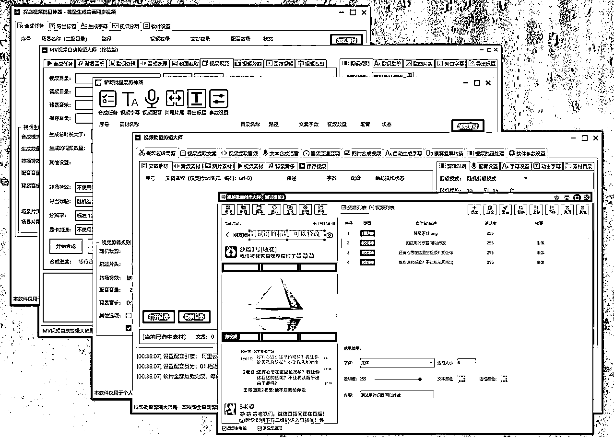

## 批量剪辑软件的优势

大多数的人做带货，第一想法就是做搬运，但是现在各个平台的查重系统都相当强大，与其天天去研究各个平台的查重规则和平台去对抗，我们不如直接批量做原创视频。

无论做任何平台，做不起来的无非就一种情况，那就是发的内容太少了，妄‮靠想‬三五个作品‮立就‬竿见影，那多少有点痴心妄想。

你花了一整天的时间才做了几个视频，怎么可能比得过人家多账号，一天上百个视频的矩阵。一天1个视频，你的爆文概率为1，一天100个视频，你的爆文概率就是1的100倍！

作品是否能上热门，我们确实控制不了，但是我们可以提高上热门的概率，只要按照爆款视频模板，批量产出原创内容，上热门也只是数量的问题，爆过的内容一定是可以再爆的！

不要总去研究什么平台规则，靠‮取量‬胜，不论是‮佬大‬还是普通人，这都是必‮之经‬路。

大道至简，越简单的方法，往往越有效果。

## 用户喜欢的内容才是好内容

无论做哪个短视频平台，我们一定要明白一个道理：做工精美并不等于优质内容！

批量不代表低质量，软件制作的视频，虽然比不上专业团队制作出来的精美，但是也和普通人做出来的不相上下，而且再优质的内容，平台不给你推，你也照样没流量。

何不折中选择，在保证作品一定质量的同时，批量产出原创内容。

用户喜欢的内容，才算是真正的好内容，哪怕你的视频能做到好莱坞级，用户完播互动率低，平台也不会给你推荐流量。

不信你可以现在打开任意一个短视频平台，那些几十万赞的视频，很少有做工特别复杂的，但是为什么能火呢？因为用户喜欢看，就是这么简单！

# 铲哥批量剪辑神器

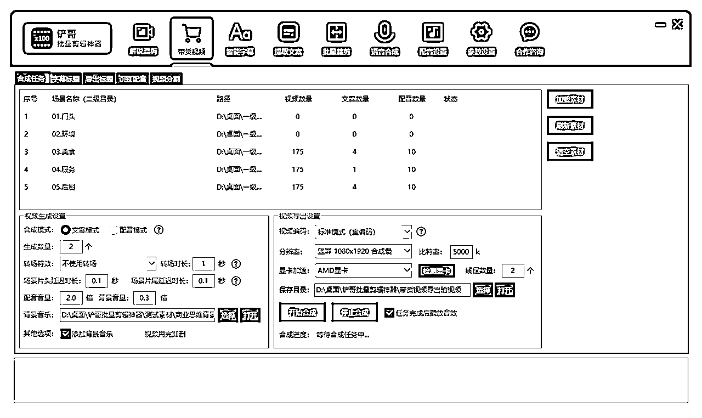

学以致用！能落地的内容才能算是真正学会了，所以这次不讲什么大道理，直接上干货！（软件下载地址和激活码，在文章最后）

这款“铲哥批量剪辑软件”，集合了之前所有比较实用的功能，并升级了一些重磅新功能，能做的项目实在是太多了！绝对是快速做视频的神兵利器，下面我会逐个讲解软件的功能，以及实战应用。

## 两大主要功能

### 1.解说混剪

#### 功能介绍

解说混剪的功能和字面意思一致，所有以文案为主，视频画面不需要太强关联的解说视频，均可批量制作，极大提高视频创作效率！

只需要导入文案和相关视频素材，软件就会按照你的设置，先给文案自动配音，然后随机抽取指定秒数的视频素材（智能算法：单个视频不会抽取到重复片段），最后给视频添加上字幕和背景音乐，生成一个完整的视频。

#### 操作教程

首先需要按照下面的素材导入格式，把文案素材和视频素材整理好，最后选择导入一级目录到软件中即可。

解说混剪导入格式：

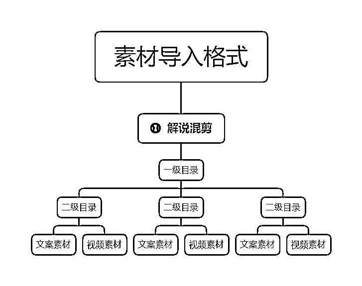

操作演示：

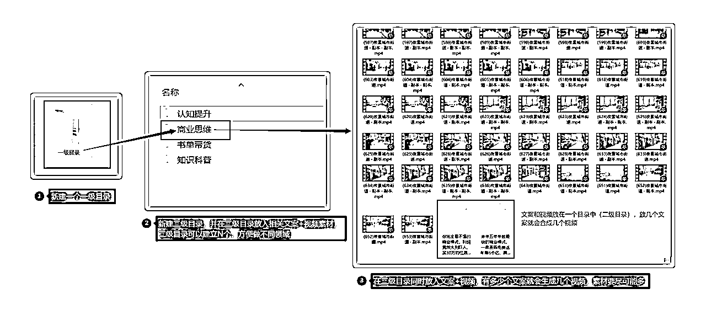

软件演示：

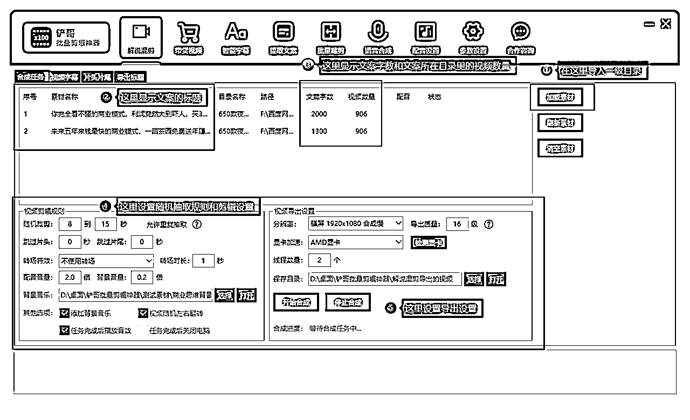

#### 实战应用

##### 1.小说推文

这个就算是小白，基本都可以闭着眼批量创作，文案也不用自己写，渠道方会给你提供，只需要找一些相关的视频素材即可，但是缺点也很明显，基本无任何壁垒。

##### 2.知识科普（书单类）

知识科普类的视频很适合【解说混剪】这个功能，既可以做自媒体，也可以做短视频带货。

##### 3.书单带货

比如励志书籍，人生哲学书籍，思维认知书籍，人情世故书籍等，所有以解说为主的视频，基本都可以做，图书的每一个分类都可以是一个项目，统称为书单号。

无非就是不同的文案和不同的视频素材，可以直接去找销量好的书籍，然后看看别人怎么做的，直接先模仿后优化即可！

以上几个案例，看起来是不同的玩法，实际上只是把文案和视频素材换了一下而已，我们要做的就是把合适的内容，用合适的形式展示出来，最后用户得到“价值”，我们得到变现。

内容创作核心：合适的文案+合适的素材+合适的配音+合适的背景音乐=高质量原创视频

#### 视频二次优化

做出来的视频没有达到自己想要的效果怎么办？

不要指望着靠一个软件就可以实现自己的所有需求，软件是为了提高产出效率，并不是完全替代人工。

我们可以把成品视频导入到剪映，然后识别字幕，再根据自己的需求二次优化视频，比如在合适的地方插入产品实拍或者相关素材，添加视频背景模板和标题等等，一番操作下来，一个质量还不错的作品就完成了！

插入相关素材：

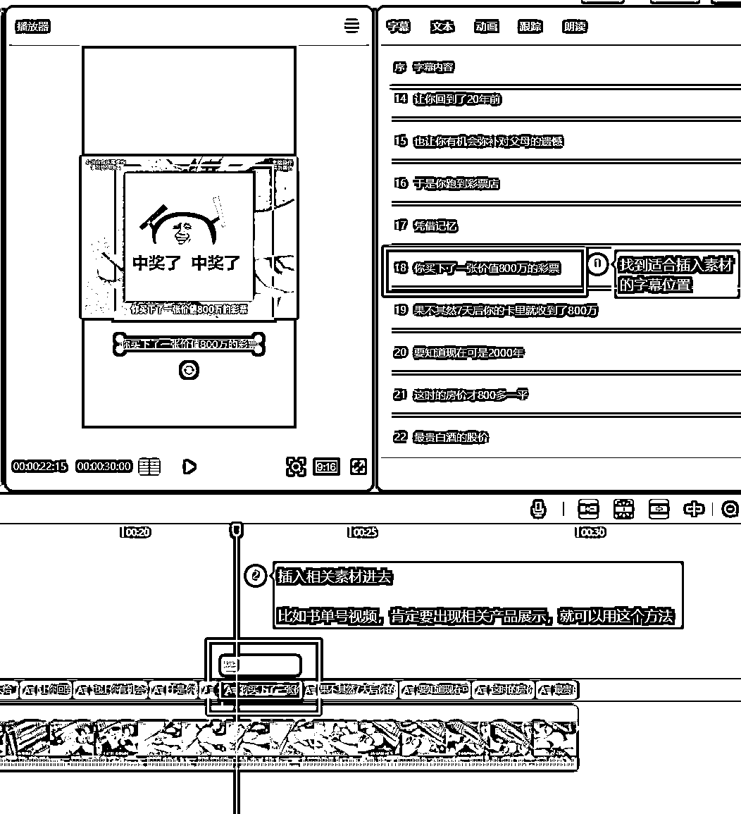

添加视频背景模板和标题等：

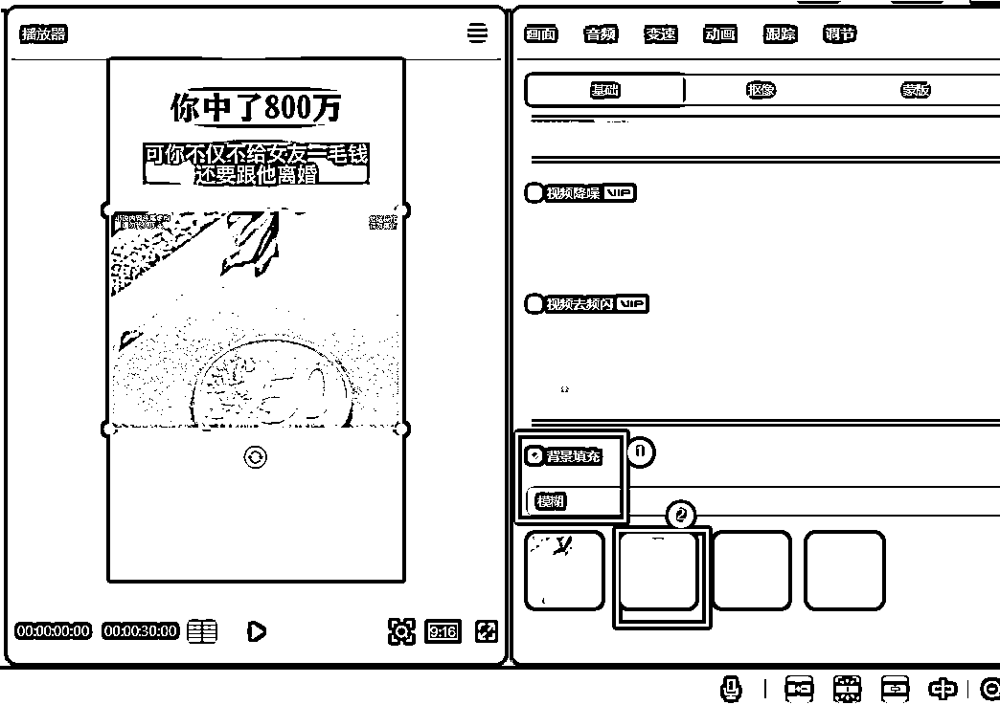

剪映的具体操作方法，官方有很详细的教程，可以在电脑版的剪映右上角找到教程链接，这里只是提供一个视频二次优化的思路，不做剪映功能讲解。

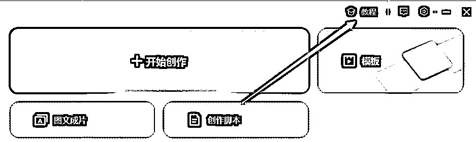

### 2.带货视频

#### 功能介绍

带货视频功能的应用场景非常多，几乎所有满足流程化的带货视频，均可批量产出原创视频，并且可以实现音画同步。

软件会随机抽取文案目录中的一个文案，然后从抽取到的文案中，随机抽取一行文本合成配音，最后根据配音时长来抽取场景视频。

#### 操作教程

首先需要按照下面的素材导入格式，把文案素材（或者配音素材）和视频素材整理好，最后选择导入一级目录到软件中即可。

带货视频导入格式：

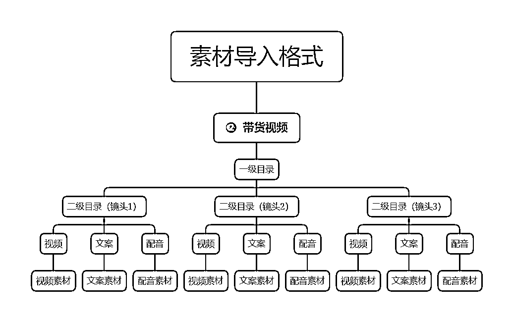

操作演示：

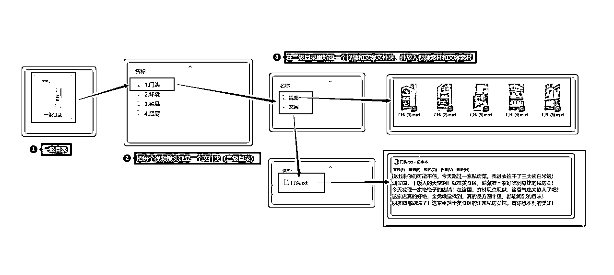

软件演示：

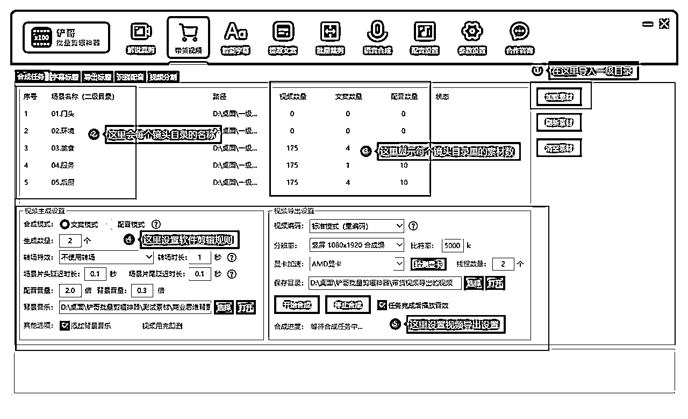

#### 实战应用

##### 1.带货视频

比如下面这个书单带货视频，产品素材是自己按照文案中的镜头实拍的，每个镜头拍它百十个，软件会随机抽取，原创度肯定没问题。

##### 2.好物分享

下面这个视频是先用软件自动剪辑，最后再用剪映二次人工优化，比如：添加合适的标题，字幕，音效等。

##### 3.盘点解说

不要限制自己的思维，除了以上几个案例，所有满足镜头化的视频，大都可以用【带货视频】功能实现，我们要做的就是搞定文案和相关的视频素材。

比如影视盘点，搞笑盘点，景区推荐等，除此之外也可以做探店视频

## 其他实用功能

以下是一些比较实用的小功能，使用方式比较简单，导入相应的素材即可使用，我会用图解的方式讲解功能用法。

### 3.智能字幕

这个功能主要是给没有字幕的视频，批量添加字幕，如果有大量视频需要添加字幕，这个功能就可以帮助到你。

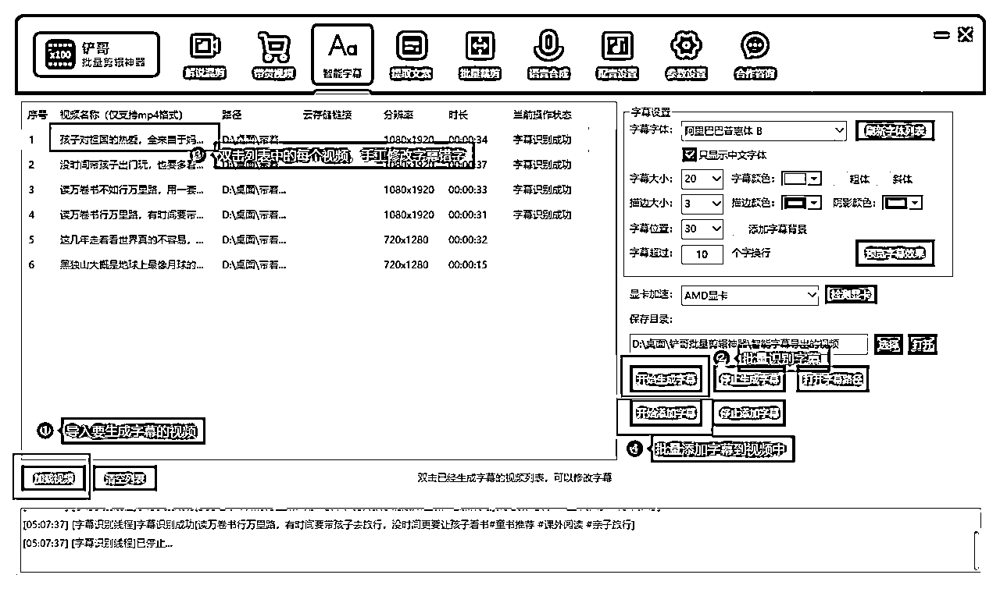

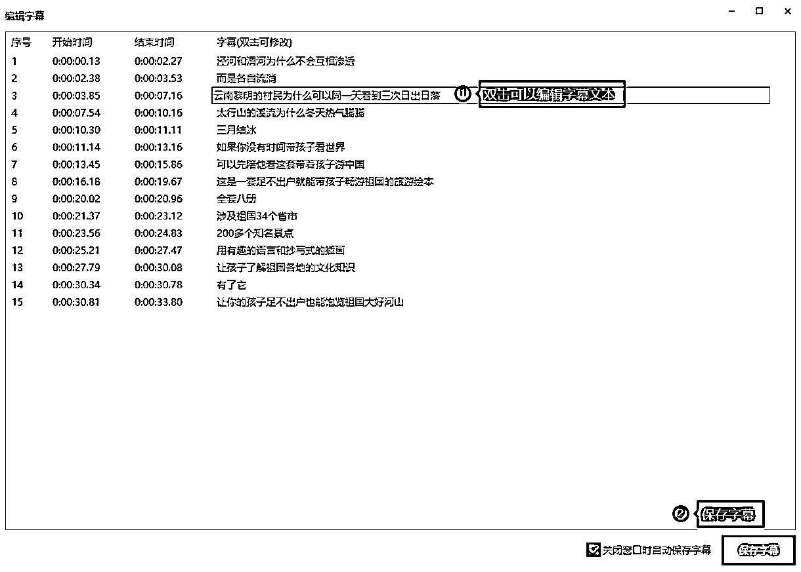

### 4.提取文案

有的时候，我们需要学习别人的文案思路，但是视频又不够直观。这个时候，批量提取文案功能就可以帮大忙了，只需要导入视频，选择保存目录，就可以一键提取所有视频的文案了。

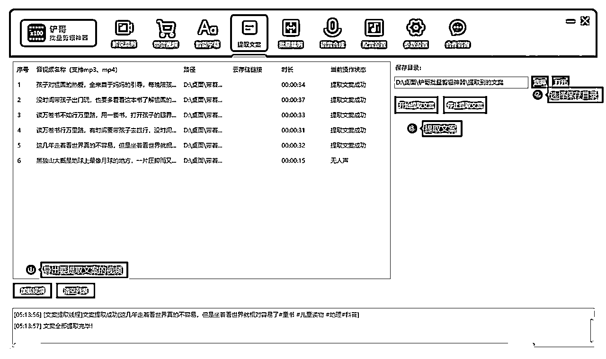

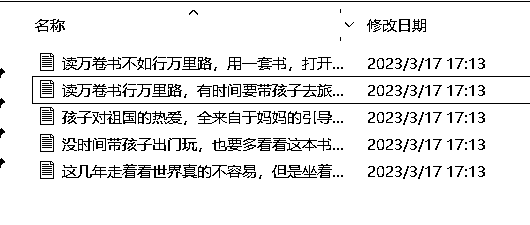

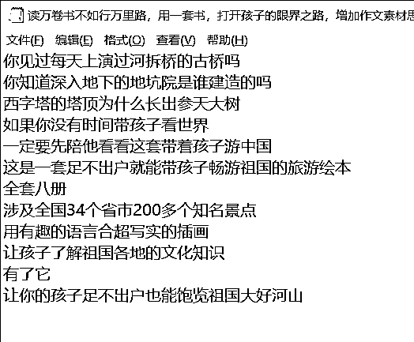

### 5.批量裁剪

很多时候，我们整理的视频素材并不符合自己的要求，比如竖屏的视频，我们只需要中间的部分，这个时候就可以用批量裁剪功能来快速处理。

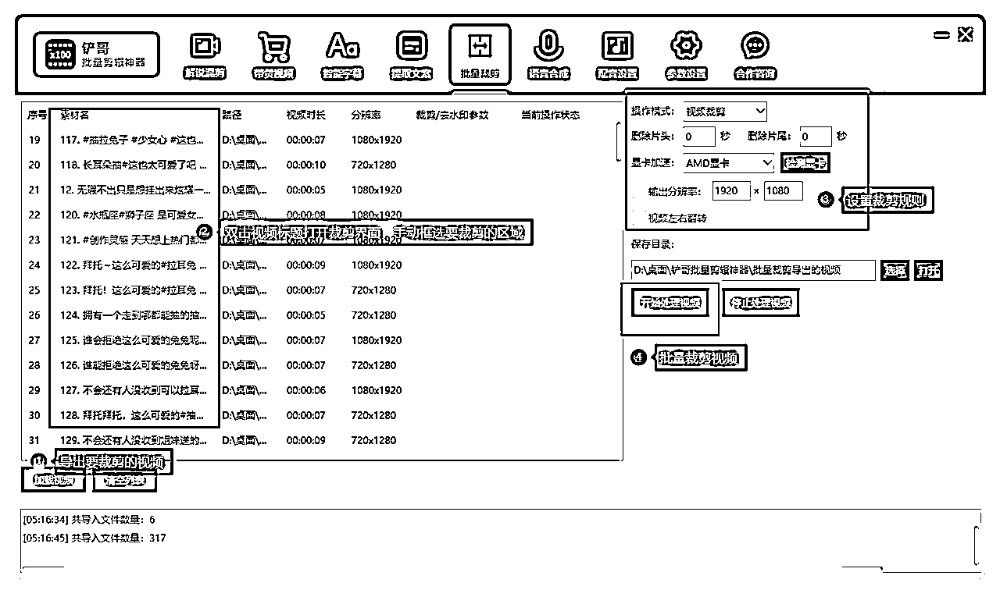

导入视频后，可以手工框选自己想要的视频区域，然后在左下角点击应用。

如果导入的所有视频分辨率一样，可以点击左下角的应用全部，就可以一次性搞定了，不需要一个一个手工框选，但如果导入的视频分辨率不同，如上图所示，那就需要挨个手工框选了。

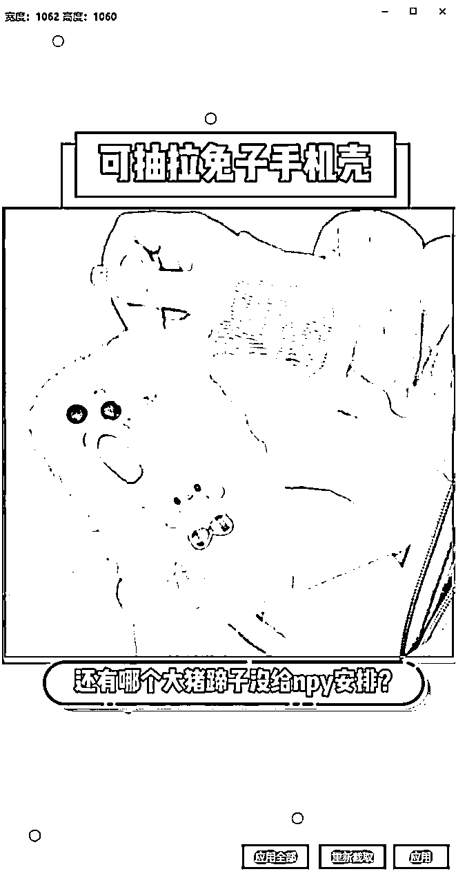

### 6.语音合成

软件虽然可以完成自动化剪辑，但是有的时候，我们可能只需要给文案合成配音，然后导入其他软件使用，这个时候就可以用到语音批量合成功能。

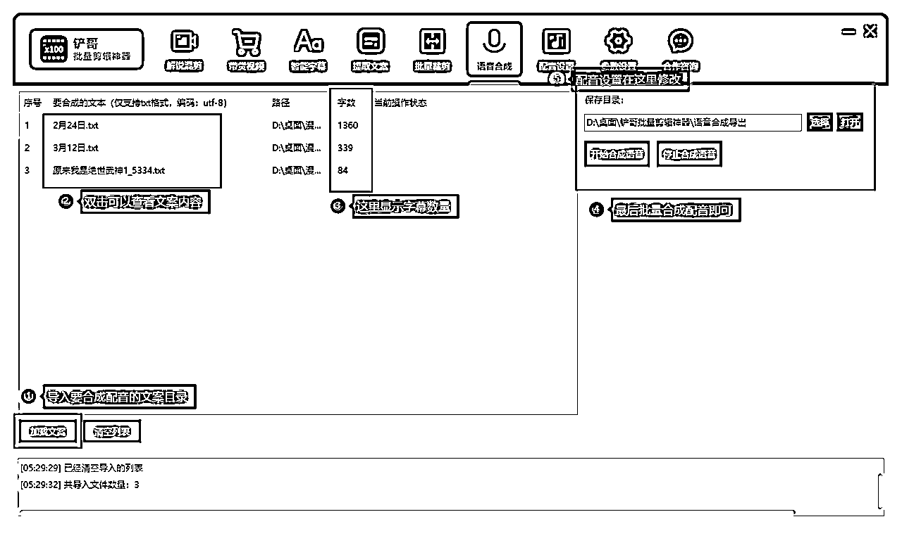

### 7.配音设置

配音设置主要是设置全局使用的配音效果，其中微软云的效果最好，市面上很多语音合成提供商，大多数都是调用的微软Api，然后自己再做一些调音优化。

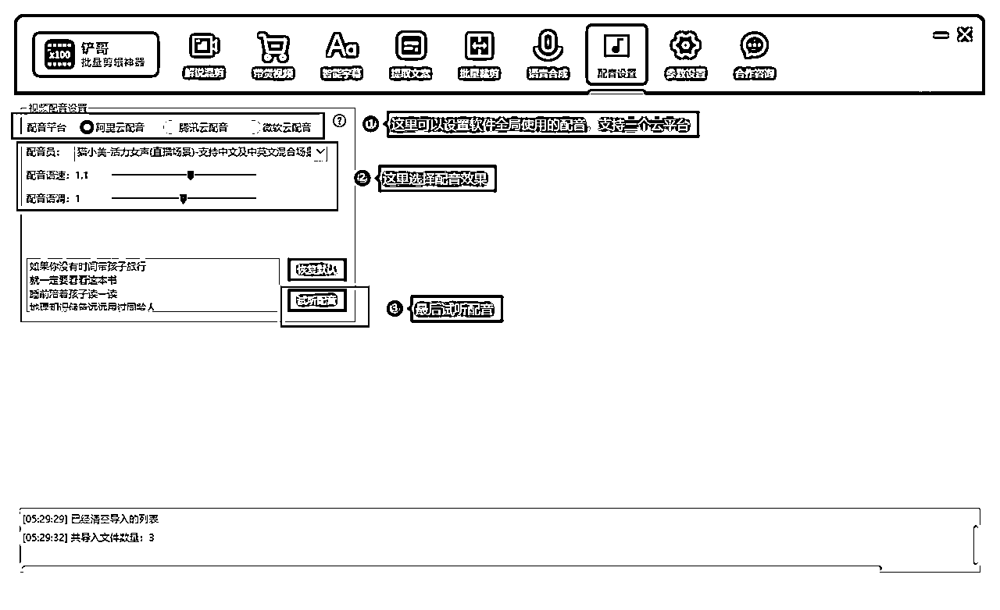

### 8.参数设置

这个界面主要设置调用云平台API的参数，注意：参数相当于帐号的密码，切勿泄漏给任何人！

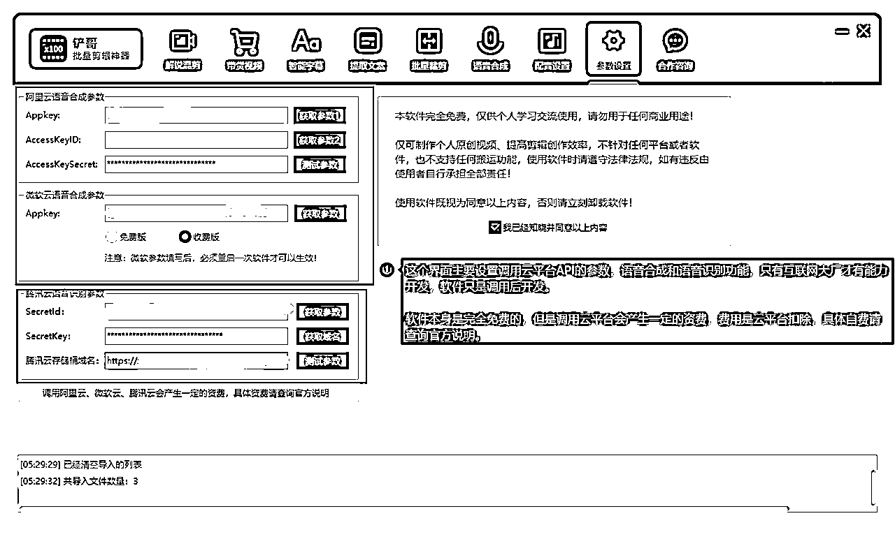

# 下载地址

以上任何一个玩法，在外面至少能卖到几千，如果是线下培训，少说也要上万。但是在铲哥这里，全部免费，而且还帮你把掘金的“铲子”造好了，不为别的，交个朋友。

铲哥批量剪辑神器，下载地址：

飞书链接：

已取消绑定，并修复了bug，优化了软件稳定性和功能，下载即可直接使用，软件运行效率提高N倍。