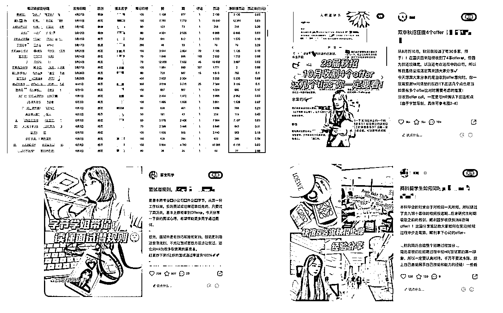
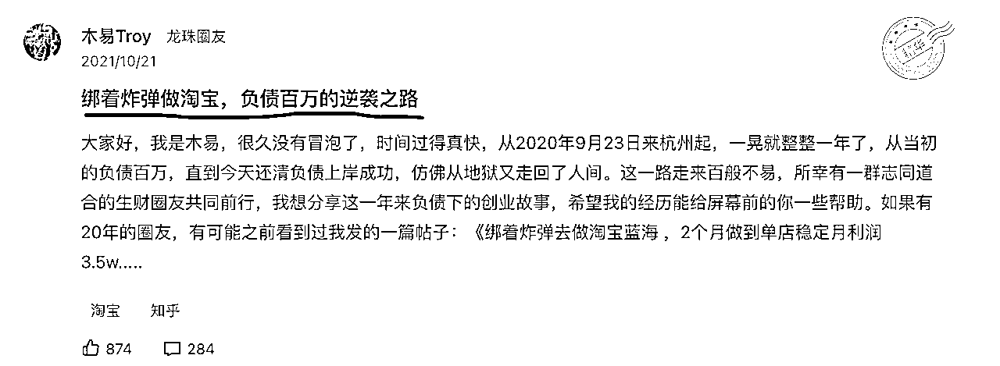
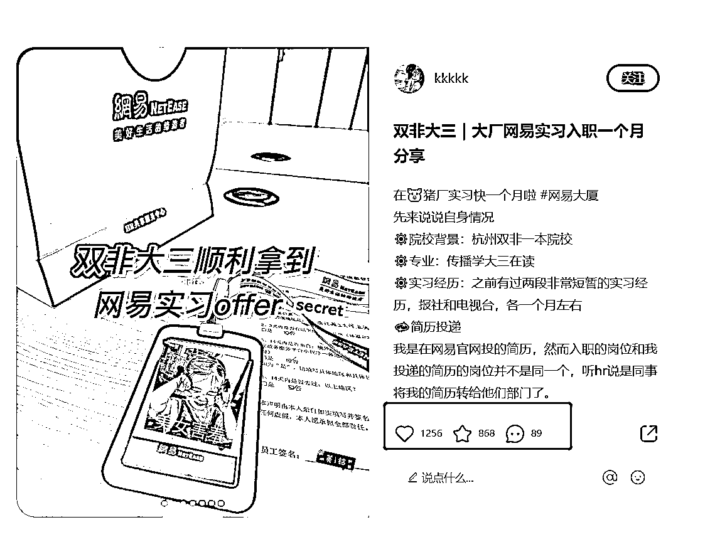
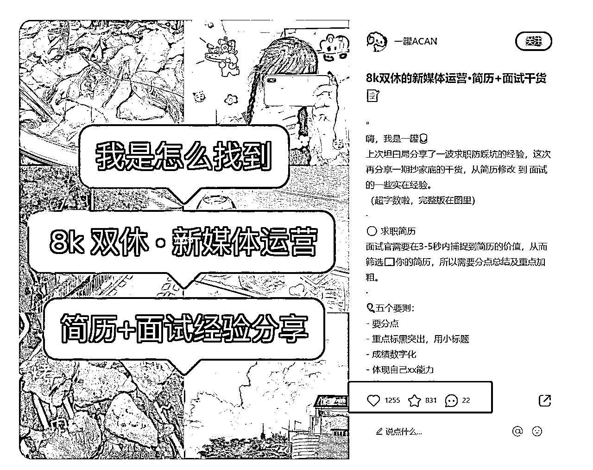
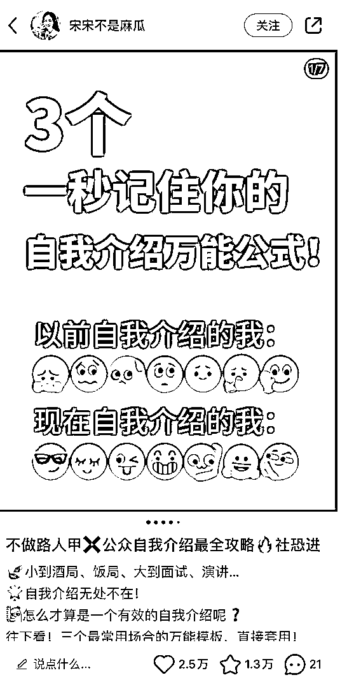
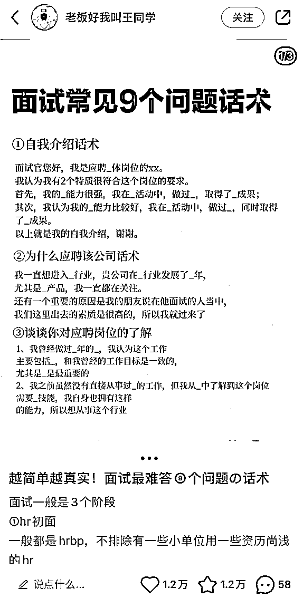
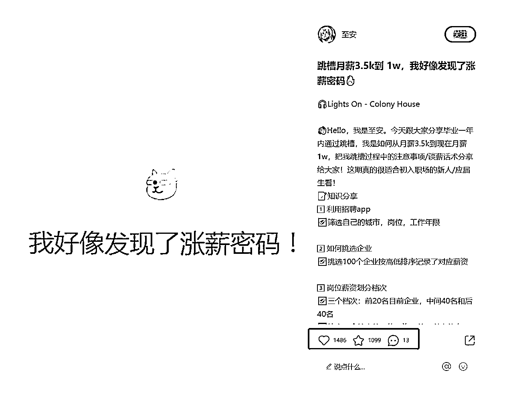
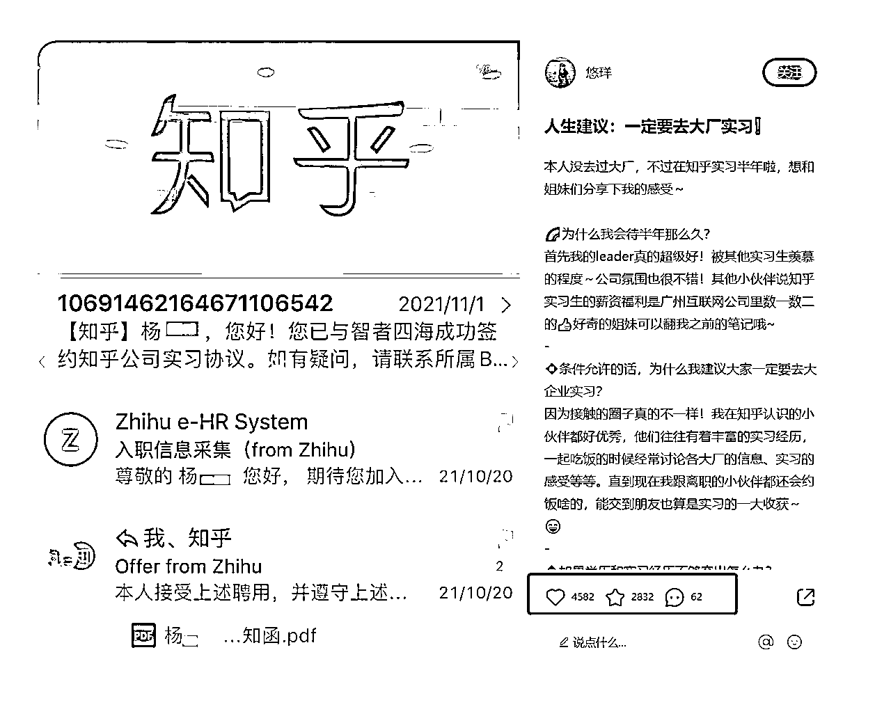
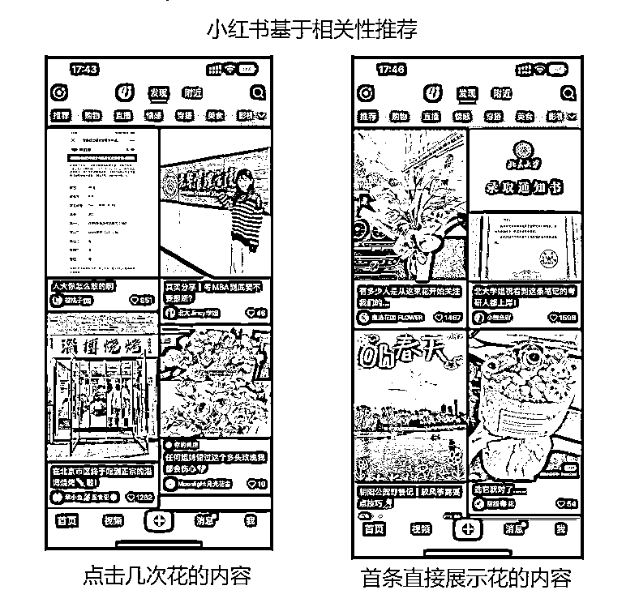
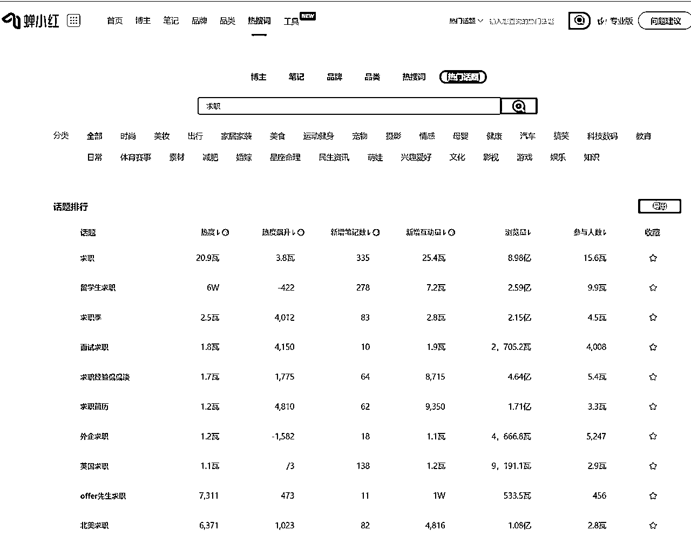

# 从投放亏损500w，到深耕小红书内容营销以20w撬动30w流量增长，我是如何做的？

> 来源：[https://ffssdmg6oi.feishu.cn/docx/HZ2RdrAmXoYDl5xT3l2c8wD8nPg](https://ffssdmg6oi.feishu.cn/docx/HZ2RdrAmXoYDl5xT3l2c8wD8nPg)

大家好，我是祥哥，目前在做品牌内容营销。之前在字节做整合营销，后来独立在创业公司做增长负责人，搭建了小红书、抖音、知乎的内容获客体系。这是此前关于知乎的精华帖

直入正题，这篇文章主要讲讲小红书的内容获客：我是如何在公司做品牌活动亏损500w的情况下，通过内容营销获客，在小红书用20W元获客30W人，帮助公司摸索出了一条正确的增长之路。我也因此晋升、工资翻倍、获得6位数期权、8个月年终奖，这段经历既是公司发展的转折，也是我个人收入大幅提高的开始，希望能对大家有一些启发。

老样子，先看下我上一家公司（产品是的一个招聘APP）当时的内容营销数据：2月投放279个小红书博主，花费4.7w元，互动量59w，获客7.2w，平均获客成本0.65元/人。

*   投放的笔记数据情况

3月4月两个投放小红书279个博主，一共花了大概4.7w元，投放的笔记带来的收藏和点赞59w，预计阅读量500w，相当于只花了10块钱，在小红书被阅读了1000次，阅读成本是小红书官方的笔记加热工具薯条的1/15。

*   部分投放案例

千赞定义为爆款的话，爆款率达到20%以上，一个点赞或收藏的成本在0.05元左右。

*   营销带来的获客量

2个月注册用户约40w，其中小红书渠道而来的占比18%，也就是小红书投放花了4.7w，带来的用户约7.2w，平均单个用户的拉新成本0.65元。我们其他渠道成本最低的时候是20元一个，小红书渠道的成本是原来的1/60。

部分内容涉及到原公司机密数据，所以数据也做了一定程度的放大或缩小处理。数据统计方式为抽样调查

在投放1000+博主，小红书的获客30w，并利用我的总结的方法论和操盘经验，帮助了数10家公司在小红书获客后。我越来越笃定：小红书内容营销是绝大部分品牌，低成本获客的最好的方式。

我花了一个月的的时间，总结了这篇小红书内容营销心得分享给家，接下来是本文大纲：

1.公司500w做品牌打水漂，给我的带来的思考

2.为什么选择小红书内容营销？

3.在小红书做什么的内容才能爆？

4.从小红书的推荐算法来看，我们如何更好的拿到小红书的流量？

5.如何提高营销/种草/转化的效果？

6.小红书内容营销的具体执行策略

7.内容营销效果如何统计？

如果你也想通过小红书，实现业务的高流量、高获客、高转化，无论你是博主、职场人还是公司老板，建议你一定要认真看完。

# 一、公司500w做品牌打水漂，给我的带来的思考

我之前所在的A公司是个创业公司，增长体系还非常不完善，几乎只靠口碑获客。但是公司那会融到资了，有点钱。当时有钱到什么程度，老板心心念念的从大厂挖了一个做品牌的高层，搭建了品牌部门，当时甚至还想花几千万请明星给产品代言。

虽然最后并没有直接请明星代言，但是策划了一场直播活动，请了明星，很多B站UP主、抖音网红，并通过微博营销号、新闻媒体、线下地推这些劣质渠道进行宣传。让人无奈的是，明星上了热搜，但是没有任何的产品露出。

结果可想而知，毫无吸引力的活动，直播场观只有1w人，其中8000人，还是供应商用金钱的大手按着水军的头看的！最后，用500w，收获了少得可怜的2000个注册用户，平均获客成本在2500，这败家，谁顶得住...

公司管理层需要承担很大责任，最后策划这场活动的品牌老大，也离职了。这件事已经过去，但给我留下了一些的思考：

1.  怎么做出用户喜欢的内容活动？

1.  现在哪些平台获客更合适？

1.  怎么种草效率比较高？

1.  如何降低投放成本，少花冤枉钱，增加效果？

# 二、为什么要选择小红书内容营销？

“小红书种草这么多品牌都投完了，我们这种新行业还有机会吗”

“我们这种行业适合在小红书上营销吗”

罗振宇有一个观点：未来的交易入口，不是流量，是社交，是人格。传统广告生硬的介绍卖点的方式，效率一定是很低的。

究其原因就是现在各大APP都是个性化的分发方式，用户只愿意看到自己喜欢的内容，借助他们喜欢的内容宣传产品，才更有可能吸引并圈粉他们。

内容营销对于引流、激活、唤醒都有非常重要的作用，某小程序游戏愿意在知乎和抖音上做内容投放，不是为了引流、而是为了唤醒老用户充值。这也说明了内容确实是一种触达用户的高效方式。

而小红书和其他平台比上做内容营销，我认为有2大优势：

1、小红书的人群、用户量、种草属性

小红书的用户增速非常快，22年实现用户翻倍。小红书有1亿日活、2亿月活中，70%以上是女生，一二线城市用户占到一半。

“年轻、精致、消费能力强”是她们的共同标签，这和美妆、潮牌、服饰、箱包、珠宝、奢侈品、教育等行业的用户画像完美契合。

2、 还有大批品牌没有入局，空间很足，现阶段流量成本还在可接受的范围

前几年新消费大火，圈内有一套公认的品牌打造公式：

5000篇小红书+1000篇知乎问答+大主播带货 = 一个新品牌

随着小红书用户越多，小红书的商业价值也越大，但是已经有很多新消费的品牌在小红书上种草过了，新品牌还能入局吗？

我的答案是入局小红书做品牌的会越来越多，很多人以为大量的品牌都来过了，其实只不过是新消费品牌来过了，新消费品牌能占消费品牌总量的多少？也就是几百分之一吧。这代表着接下来的几年还有数倍于现在的品牌方来小红书做营销。

不过要知道，流量价值是由竞争决定的。

马上竞争的人会越多越贵，从现在来看，每一天都比明天要贵，如果有营销的打算还是越早花这个钱，越值得。

所以对品牌方来说，现在的小红书营销仍然是最划算的。

既然流量那么贵，那有没有一些方法能够在小红书上稳定获取流量呢？还真有，往下看。

# 三、在小红书做什么样的内容才能爆？

#### 

获客是漏斗逻辑，需要先在平台这个大池子上通过内容吸引他们，然后转而把他们吸引进你的小池子里，如果笔记不能爆，看到的人都少，获客更是扯淡。

很多品牌方来找我，他们说无论是自己做内容还是投放内容都很难把笔记做爆。虽然也知道模仿同行、找爆款笔记类型，但尝试了几次数据都不好。其实究其原因因为市面上总结的所谓笔记类型太浅显，缺少对用户心理的洞察，只画其皮，没画其骨。

什么是好的内容？李笑来老师给了两个词: 有趣和有用。有趣又有用排第一，只有用排第二，只有趣排第三。

于是我通过大量的分析、阅读。我终于总结了2套既有趣又有用的内容模板，按着做，一定能爆。这个方法，不仅仅适合APP，同样适合有产品有服务的行业，如电商、家居、培训等等。

### 1、爆款内容模板一：用户故事（有趣又有用）

小红书的Slogn是“标记我的生活”，生活背后是一个鲜活的用户，是一个个真实的故事，而人天然是喜欢听故事的。

木易大佬这篇精华帖800+赞，几乎是生财非官方、非嘉宾写的点赞排行第一的帖子，就是一个典型的逆袭故事。

那故事型的写法是不是同样可以迁移到小红书？接下来，我们看看该怎么描述一个故事。

而一个打动人心的故事，往往有一套清晰的套路，来看看电影里的英雄逆袭之路：

那就是一个背景很菜的主人公会遇到一个困难，然后一位“贵人”出现了，给主人公提出了一个解决问题的“武功秘籍”，并给予主人公鼓励，帮助他从失败走向成功。

如果这个主人公是用户自己，这个武功秘籍是你的“产品或服务”，那你这本武功秘籍肯定很多人来买。

很多品牌方，确实按照以上做了，讲了很多产品故事、品牌故事，除了能满足个别用户的猎奇心理，跟用户有什么关系呢？用户真正关心的是自己的生活。所以故事的主人公，必须是用户，不是你的产品和品牌！

逻辑讲完了，给大家直接上我用了常用爆款模板。这个模板丢给博主，在我们不进行二次沟通的情况下爆款率（1k赞藏）是21%，讲述模板时以脉脉这个职场APP为例，但其实大部分IP、电商品牌也都适用可以迁移。

内容详细模板明细：用户故事

整体任务说明：围绕校招/实习求职等与求职相关的人物故事来撰写小红书笔记，采用图文共存的模式，在笔记中适合插入脉脉APP功能的位置提及脉脉。

#### 一、人设

围绕求职/实习/校招（给出经历例子参考，可自行带入寻找）:

1.  大神经历

eg：本硕985，拿了XX大厂/头部企业offer……

1.  草根反转

eg：二本本科，秋招拿到XX大厂/头部企业offer……

1.  咸鱼翻身

eg：0实习，秋招拿到XX大厂/头部企业offer……k

1.  某方面突出

①实习特别多（≥3份）

②拿到的实习或秋招offer岗位类型多样（岗位类型＞2）

③拿到的实习或秋招offer所在企业的行业多样（行业＞2，如同时在互联网/金融）

1.  固有印象冲突

eg：顶尖高校/背景（如C9高校、TOP2高校等），秋招/实习0offer

#### 二、标题

1.  字数

标题字数不超过20个字

1.  关键词（可选其一或更多）

年龄/行业/公司/岗位/薪资

0经验/转行/入职/实习/找工作

1.  举例（仅作参考使用，请和人设标签对应寻找）

①大神经历

eg：本硕985，秋招上岸腾讯/华为等10家大厂

②草根反转

eg：普通二本，我是如何拿到月薪2W+的offer

eg：普通二本l我是怎样通过腾讯的秋招面试的

③咸鱼翻身

eg：导师不让离校，我是如何0实习拿到腾讯offer

④某方面突出

eg：我是如何同时拿到金融/互联网头部企业offer

⑤固有印象冲突

eg：TOP2高校，秋招0offer，我还能做什么

⑥校招面试官

eg：面试官告诉你，这些错误你犯了没？

#### 三、正文内容：

1.  字数：控制在700字左右（用腾讯文档）

字数+表情用腾讯文档识别700+

1.  文字内容

①个人介绍

给自己起个代号，并全篇应用代号称呼自己

介绍院校背景、专业背景以及跟标签有关的信息

②列点式分享

阐述思路：在你的故事中问题是什么，有哪些-产生这些问题的原因是什么-解决问题的错误做法是什么-正确做法是什么/可以做什么改善问题

问题是什么：问题具体描述，这样的问题不解决会有什么后果

产生原因：为什么会出现这样的问题

错误/正确做法：分条列点陈述

③总结

### 2、爆款内容模板二：经验分享（有用又有趣）

这个模板对用来说 有用的比重是远远大于有趣，以专业输出为主，但是也有自己鲜明的人设。

他们的标题往往是：经历/人设+心得。

*   面试了200个运营，我总结了2个误区，99%人都有

*   拿下字节月薪2w+运营offer，我总结了2个面试经验

这类模板非常适合让素人和kol去安利你的产品或服务。 记住重点是讲清楚人设+你的经验心得！！

篇幅原因，这个就不展示详细模板了，给大家展示投放的爆款截图。

PS：细心的圈友一定会发现，我本篇内容的写法，其实也是人设+经验输出的框架。

# 四、从小红书的推荐算法来看，如何更多的拿到小红书流量

其实上文讲到”用户故事”和“经验分享”这两种爆文方式，其实本质上也是为了寻找一种内容范式和模板，来提高出爆款的概率。

但是如果你只知道模板，而不知道覆盖更多的标签和关键词，那么你的流量将会严重受限。

想在小红书里获取流量，就一定得大致了解小红书的推荐和分发机制。先给大家简单的讲解下，目前主流的内容社区，用户被推荐看到一篇笔记的背后，笔记是都会经历哪些过程;

小红书的推荐算法——基于相似性推荐

首先小红书是一个双瀑布流+ 用户主动点击的流量分发形态，和抖音的完全由算法推荐沉浸式下滑的分发形态有着非常大的不同。

小红书决定给你推什么内容，主要是基于内容的相似性，相似性的主要判断依据是你历史点击和搜索行为，然后给你推荐同类标签的内容。

小红书现有的推荐算法对用户点击互动过的内容标签进行实时反馈推荐，即现在点赞了一个鲜花的笔记，接下来会立刻出现相关内容。

小红书推荐内容是用内容的标签去和用户的兴趣特征去做匹配的。如果用户对花感兴趣，小红书就推花的内容给用户，可用户一旦点击和搜索考研的内容，那小红书就会推考研的内容。 而用户兴趣是多种多样的，你产品的使用场景、所满足的需求也是比较宽泛的。

所以为了让小红书更多更广泛的推荐投放的内容，必须尽可能覆盖和我的产品相关的关键词。

这也是我为什么在两个内容爆款模板中，在标题里列了很多关键词的原因。

首先是为了让平台更好的读懂我的内容，知道我的内容应该属于哪些标签。

其次就是为了让标签更加多元，避免所有内容只局限在1-2个标签赛道。

我的做法是，投放前先列出我的产品所有能蹭的标签。然后对关键词进行流量分层，优先把高流量的标签，用以上的内容模板产出内容，优先投放。

| 流量分层 | 产品关键词 | 投放笔记类型 |
| 高热流量区 | 内推、群面、面经、面试、SQL刷题、笔试、数据分析、数字营销 | 原创的用户故事+经验分享 |
| 中等流量区 | 简历、实习、求职、秋招、春招、校招、找工作 | 原创的用户故事+经验分享+营销笔记 |
| 尾部流量区 | 四六级英语、考证、谈薪资、查薪资、大学生必备app | 营销笔记+修改笔记 |

接下来教大家如何查看小红书不同关键词的流量

从蝉妈妈上看热搜词，直接搜索关键词即可知道关键词的大致的热度。

传送门：https://www.chanxiaohong.com/topicLib

小红书的长尾流量效果如何？

21年9月投放的一波笔记，3个月后的总赞藏是35w，一年后的总赞藏变成了63w。也就是说内容发布了一年后，依旧有70%的长尾的互动增长，阅读量自然也是按比例增长的。

那如果已经非常爆的内容，如果通过修改博主的笔记植入我们的内容，是不是我们就可以蹭他们的流量？

事实证明，确实如此，通过修改已经爆款的笔记，借助他的长尾流量获得曝光，这种方式是目前性价比最高的方式之一。目前修改笔记的这种植入方式，已经成为帮我们获取超过50%的流量的投放方式。

# 五、如何提高营销/种草/转化的效果？

笔记爆了。流量关注度上来了，这时的重点关注营销转化的效果！营销转化的目的：某些场景下，我得让用户第一个想到要使用我。

对人而言，我们的日常生活空间，是由一个个场景组成的。从每天早上睁开眼睛起，洗漱场景，用餐场景，通勤场景，办公场景，学习场景，休闲场景，聚会场景……构成了我们一天的生活。我们在场景下思考，也在场景下行动，场景决定我们的需求和欲望。一句话，人无往而不在场景之中。

如果品牌不通过场景提醒，他也很难联想到自己是真需要，你的产品很好，但我不需要。 所以营销必须得结合场景，告诉或者暗示用户，什么时候需要你。

当年我在抖音的市场部门的时候，抖音直播策划的每一个活动，都是为了传递和教育 “在什么场景下可以使用抖音的”的认知给用户。

*   20年“罗永浩”，其实抖音想传达的是淘宝商家快来抖音上直播带货，大家快来抖音上买东西。

*   20/21年“口罩厂云监工”，别去什么百度、支付宝上看了信息了，想看疫情的动态来抖音。

*   22年“刘畊宏”，跟着抖音直播间来健身，疫情期间想健身，来抖音看直播就行。

再举一些生活的中的例子。

过年考虑送什么礼物时总有那句“今年过节不收礼，收礼只收脑白金”的广告语。

当挤地铁看到旁人满头头皮屑，会想起“去头屑，就用海飞丝”。

大学生去网吧上网通宵，大概率会想到“困了累了喝红牛”。

这些都是将场景和产品进行记忆捆绑的广告，并对使用场景进行描述，也变相的提醒受众你会在什么场景使用它，给他什么类型的购买理由。这就是为什么我们营销一个产品的时候，要先谈场景的原因。

接下来，简单的几招，分享一下如何设计提高转化效果的。

如何种草：

1.  博主本身也是作为过来人的安利和分享，天然的种草属性

1.  通过对比，成为用户唯一选择，现在竞品非常多，多说自身优势。

1.  植入时的安利语还原场景（xx时候，可以去用），多场景多价值点的植入。

如何拔草：

1.  产品端要露出logo、品牌

1.  小号矩阵引导互动

以上是概念，具体要体现在对博主的要求上：

#### 1、配图上要有品牌露出

图片比例一律为3：4，共需要4-6张图片

1.  封面：实拍图，简洁美观（2-4张）

实拍图指你的offer图、工牌、学校标志图等证实你标签的图片

1.  产品露出

在故事中可使用的脉脉功能截图（1-2张）

需要露出脉脉APP的标识

#### 2、卖点融入

1.  脉脉卖点（任选可与你故事结合的功能）

1.  卖点融入方法

文字：在正文描述“正确做法是什么及可以做什么改善问题”时可以带入脉脉的功能以更明确地阐述该如何做、去哪做。

图片：带有XX标识的图片放在配图的第3张之后，截图需对应你在文字部分描述使用的功能。

# 六、小红书内容营销的具体执行策略

当内容能不能爆、如何种草的问题解决了。接下来，就是具体的投放细节：投谁、怎么投、谁来投。

经过了一年多的各种成本优化、效率优化，我们总结出了一套成本非常低、效率非常高、效果非常好的投放模式。

先说结论：

*   达人合作上：只合作的高性价比的尾部达人，基本粉丝量在1w以下，笔记报价在300以下博主。

*   笔记类型上：笔记20%以原创用户故事为主，20%以原创经验分享为主，10%是纯介绍产品的营销笔记，剩余50%是修改别人笔记获得流量。

*   投放平台上：目前只保持15%的笔记走的蒲公英的官方平台，其余都是走私下和博主合作。

*   投放团队上： 培养一批兼职投放同学，按照要求进行达人筛选，并按照SOP和内容模板去和博主进行建联、沟通笔记、支付、汇总数据。

### 1、达人选择上：不要轻易投放大博主，小博主的流量不比大博主差

除了超大品牌和对客户信任背书要求的高的如护肤品行业，其他品牌做营销和投放我不推荐找粉丝量太高的博主。

这是小红书的流量分配的比例情况，可以看到关注的流量只占小红书流量的1%。这也就解释了很多大博主的疑问，为何几十万粉丝，有的内容只有四五十个赞。其实不是被限流了，只是小红书的推荐机制就是以内容质量为主，说明他的内容没有被大规模推荐，阅读你这篇笔记的主要都是你的粉丝通过关注入口点击的。

所以我们的整体投放逻辑才是通过优质的内容模板原创+修改笔记去获取推荐流量，而粉丝量所带来收益和我们付出几十甚至几百倍的投放成本是不匹配不划算的。我投放的90%的博主都是低于1w粉的小博主，平均单篇笔记也就100元。 有一些小博主甚至几十元他们也能接受。

### 2、笔记类型上：保持15%的报备率，多用修改笔记扩充关键词

不要和平台对着干，要学会帮平台创造价值。于是我不再暴力的铺低质量内容，小红书需要故事我投放的都是高质量、强人设的故事，这对于平台来说，他一定是鼓励我所投放的内容的。

小红书需要商业化，作为品牌方支持就完事了。但是公司成本有限，以及小红书目前对于私下和博主合作的笔记并无太多的监管。 还是大部分的合作还是私下和博主合作能更好的控制成本，建议控制总投放量的15%的比例，尤其是高质量的原创内容走蒲公英，给小红书官方报备下保平安。

### 3、投放团队建设上：建立高效的SOP和兼职投放

在具体投放过程中，对结果影响最大的，更多的需要思考内容策略。

后续需要花时间的部分主要集中在筛选合适达人、建联、沟通内容细节、下单、统计数据五个环节，因此可以通过高效的SOP来统一筛选标准、沟通话术、内容模板等。

我整理好了部分，大家自取即可。

# 七、内容营销的效果如何统计？如何证明价值

1.  以获客和转化为导向，统计最终的获客量/销量/注册量/加微量

不同的情况，有不同的统计方案：

*   渠道单一或者虽然有多渠道但是时间错开的时候。

就可以和历史数据做判断进行同比环比。

以我的《我要大学答案》小程序为例，2021年我批量铺了100+知乎内容的时候， 小程序通过微信搜索来的用户环比2个月前增加300%，这时候判断有效。APP、网站、加微信、还是店里购买也是同样的道理。

*   渠道很多，营销时间也没有错开。

这里我最推荐，对用户做抽样调查/问卷，主动询问和收集来源渠道。

1.  预估我们的所有动作，带来的阅读量，以及阅读量的阅读价值

如果我们以品牌声量为目标，我们直接计算各个渠道的阅读价值。

尽量不要用曝光量来统计效果！ 微博10w 曝光，真实看的人数500都没有。

以下是各平台单个阅读的价值计算方式：

如何通过互动量判断小红书的阅读量，根据过往数据反馈和第三方数据新红平台预估，互动和阅读关系在1：（8-16）左右，我们平均保守取值，一个互动约等于是10个阅读量。

# 八、最后想说的话

写到这里，终于完稿了，2023年 3月23日 3:46分，我坐在电脑前，不知怎么的，思绪万千。

本篇文章其实从构思到完成已经足足有1个月了，还是有很多点觉得可以讲的再细一点但是又怕太啰嗦，简单的文字，来来回回改了很多次。说实话，我对于输出内容，一直有着非常高的敬畏之心。

上一篇我写的知乎获客的文章，我看到了大概有30多个圈友认真读完并写了笔记，也有不少圈友真的很焦急的问我他们公司的业务怎么获客。

读了这篇文章的人，可能是职场人、可能是老板，也可能是刚刚起步的小红书博主，都是一群努力吸取经验、想着解决问题、追求美好生活的人。

想想4年前还没毕业的我，孤身一人来到北京实习，跌跌撞撞。所幸，一路上遇到了无数多人的帮助。

所以希望我今天的内容也能帮到你，也愿星光不负赶路人。

* * *