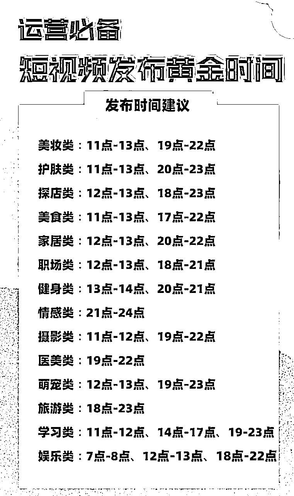

# 《如何在视频号平台高效做带货》@李诚Sonic

> 来源：[https://xunyue66.feishu.cn/docx/LXNmdLtO6oOP3dx7l9GcsVfPnSb](https://xunyue66.feishu.cn/docx/LXNmdLtO6oOP3dx7l9GcsVfPnSb)

感谢生财，很高兴能和这么多优秀的小伙伴一起参与视频号航海，看到很多熟悉的小伙伴。

今天想和大家分享的是《如何在视频号平台高效做带货》

视频号商业化已经1年多，迭代了上百次功能，各项功能也不断地完善，如何跟着平台的方向打深，打透，获得长短期的综合利润，当然发展的同时平台也有一定的不完善，容易引起限流，封号，无法提现等情况，所以今天和大家分享一下微信视频号运营的一些经验和感受。

# 1.先做个自我介绍，欢迎链接

【自我介绍】食材供应链及电商团队；龙珠圈友/航海教练

【坐标】广州天河

【现有资源】

1.华南食品工厂供应链资源（肉类、熟食、半成品菜），供港、盒马、朴朴等渠道。

2.店铺40+、带货账号120+、月销200w+

【目前需求】抖、快、微信小店资源圈

【可分享的主题】传统食品企业电商运营经验、垂类抖店精细化运营

精华文章

【抖音小店精细化运营】https://t.zsxq.com/YVNfAIy

【视频号运营复盘分享】https://t.zsxq.com/02fimq7qf

首先来分享一下我对视频号生态的理解

# 2.视频号生态

微信视频号从2020年1月开始内测，2022年初开始逐步提高在微信内的权重和释放流量，主要因为2021年底的政策调整，把流量分发机制从MCN那里收回并做成普惠制，新用户注册就给流量支持，这样创作者才愿意来做视频。

去年年初刚结束抖音小店短视频带货的航海，我发现视频号开始放大流量，便猛扎进视频号的赛道里折腾，22年后半年大家都在入局视频号，视频号相对于抖音快手有一定的信息差和红利期，虽然从生财开始带着全网卷视频号赛道也半年多时间了，目前的红利一样有，只是对于内容的要求更高和更快。

我带着团队从22年初开始测试视频号，前端账号矩阵和后端店群上货，跟着平台更新和升级迭代玩法，前端矩阵以跑爆款当季产品为主，追求高毛利，不稳定但相对抖音空间大很多，后端店群微信小商店、有赞、爱逛、魔筷、微店官方和第三方的陆陆续续开了三十来个，从铺货模式到精细化运营。

去年12月1日开始，视频号清退了所有老微信小商店和第三方店铺，只留下了视频号小店，目前，我也还有20多个视频号小店和部分旗舰店跟上官方的玩法推进。

今年年初，视频号也上线了店铺评分体系和达人橱窗评分体系，进一步完善带货机制和生态。

晒几张图，部分视频号和店铺的数据图，主要是想提醒大家，流量红利，依然是低成本入局的好时机。

## 2.1 视频号迭代和市场环境

2022年1月18日，链接功能上线。

主播可以在直播间内推送多种类型的链接气泡，主要包括：直播预告、公众号文章、红包封面链接、企业微信名片、微信广告气泡，同一时段内，主播只能推送一个链接，但可自由切换。

2022年1月24日，第一场付费直播上线。

腾讯NBA自2020年2月10日开号入驻以来，已直播123场。从2021-2022赛季开始播出，至今已经近两年。这也是在视频号上实践了第一场付费直播。近500万人通过“腾讯NBA”的视频号直播共同见证了2021-2022赛季NBA总决赛的夺冠时刻。

2022年3月初，蓝V账号可在视频号主页添加服务菜单。

企业营销来说，这是继PC端官网、公众号菜单栏、小程序等服务载体后又一官网形式的平台。

2022年3月中旬，直播PC端功能更新。直播中控台数据详情页上新，支持查看直播实时数据趋势，包括实时在线、观看人数、次数、点赞、评论、分享、送礼、商品成交等等。实时指标每5秒更新，数据趋势每分钟更新，若开播身份为公众号身份，新增关注人数是公众号关注数。

2022年7月18日，视频号正式上线原生信息流广告。依托于微信生态，视频号原生信息流广告可帮助商家在短视频中，插入多种跳转链接，引导用户前往“品牌小程序”、“原生推广页或 H5”，以及“商品下单页面”三种落地页。

2022年7月21日，“视频号小店”上线。“视频号小店”将会成为视频号橱窗上架的主要载体，全方位支持商家在视频号场景内开店经营，而原来的“微信小商店”即将退出视频号橱窗舞台。

2022年8月初，“帮上热门”功能上线。类似小红书“薯条”和抖音 “DOU+” 的身影。

2022年8月17日，“视频号小任务”上线。微信广告宣布上线面向视频号作者的现金任务撮合产品“视频号小任务”。小任务连接广告主推广与创作者变现需求，以视频号活动为载体，鼓励创作者投稿参与，并以视频效果结算收益。

2022年8月下旬，微信豆采买流量券能力全量开放。单独扫码或者开播后在开播页面的“更多”选项里面有"创作者流量包"按钮都可以打开。

2022年11月2日，上线视频号优选联盟，类似于抖音小店的精选联盟，商家可以把货放在上面，设置佣金，然后找达人带货。门槛还是比较高的，只允许企业执照开的店铺才有机会加入，个体类型的店铺暂时无缘。

2022年12月1日，视频号仅支持带货优选联盟（视频号小店）的产品，第三方店铺退出历史舞台。

视频号目前市场环境：

## 2.2 从运营者角度的角度总结

2022年3-5月，随便搬运就可以爆视频，可以无人直播，半无人直播，店铺店群铺货模式。

2022年6-8月，简单混剪还可以爆视频，严打无人直播，半无人经常吃低质量。店铺开始打击刷量、重复铺货。

2022年8月份之后，搬运和混剪就更考验速度和技巧了。店铺需要达到一定要求才能入池。

2022年11月，新号扶持时间缩短，后端店铺开始清理微信小商店第三方后端店铺（有赞、爱逛、魔筷、微盟、微店等）

2022年12月1日，视频号仅支持带货优选联盟（视频号小店）的产品。

2023年1月，店铺评分系统和达人橱窗评分系统上线，后期评分会影响带货流量和选品机制

2023年2月，对产品要求更严格，审核时间增长，对视频内容的原创度提高审核和扶持

2023年3月，生财视频号航海再次起航

## 2.3 前端视频带货角度

选品上，要更快更新，你是第一个搬的，你就是原创，当然要规避侵权问题。

混剪上，素材打乱组合发布，抖音上可行，视频号的审核大概率不过，要更多的素材内容和混入实拍的内容会好一些。

最近我们测试实拍素材+高赞标题的模式效果还不错，有能力的同学建议从仿拍到原创。

## 2.4 直播带货角度

直播方面，我的团队更多的是后端店群+带货矩阵号，一开始视频带货为主，视频爆了开播引导成交。

这种模式是比较好的一种转化形式，同步也在启动0作品直播，靠人货场和少量投流起号。

直播起号，投流起号对于我的团队实力和视频号的投流精准度来说，并不稳定。

平台的变化也比较快，建议视频+直播相互配合，小额多次测素材再放大。

## 2.5 后端店群角度

后端店铺和店群更加正规化。

1.个体商户不能入优选联盟

2.企业商户门槛保证金都比较高

3.提现是企业对公账户，记账报税的成本高一些

4.品退和投诉率门槛提高，低于标准当天被清退。

# 3.视频号的变现渠道

接下来进入实际玩法的分享，视频号的变现渠道，航海手册里面分享的非常详细，我再贴个简单的图片，除了带货视频号更有价值的是私域的沉淀。

有些圈友利用视频号做中高端客单价的产品，反而效果比带货利润更高。

## 选品核心是需求，且选品是比运营重要的核心

品对人，男人要成功，女人要美丽，老人要健康，孩子要聪明。

亘古不变的四大需求点。

我们要做的是确定细分类目，满足需求，测试匹配度

建议大家每天一定要有1小时的选品（刷视频），把你的账号设置为你的目标客户，比如是中老年人的产品，那么就设置为50岁，去点赞一些50岁人会看的视频，然后持续的刷，看系统推荐什么内容给你，觉得不错的就记录下来，我是要求团队小伙伴每天浏览记录10个以上的账号做分析。

不要单纯在一个平台刷，视频号、抖音、快手、小红书、多多视频都可以去刷，因为每个平台有自己的推荐算法和标签算法，人群用户也有差异，多参考比较好

https://docs.qq.com/sheet/DSWhMaUFnWG1oWWZB?tab=BB08J2

大家可以看下我上面发的选品表，已经1000多个账号，其实已经筛选起码2000个以上的账号了，因为很多账号是重复的或者一个团队的，当你觉得这个产品不错，就去留意他发了多少视频，发布频率是怎么样，是不是认证账号，是否开播等因素再去参考是否拿一两个账号去测试。

## 善用数据工具

另外建议大家善用数据工具：

百度指数、巨量算数、微信指数

这三个工具基本上覆盖了全网的指数，可以查看产品每天的活跃度、搜索量等数据，值得同步参考和借鉴。

以前我们店群60%都是达人出单，40%自己的矩阵号或者圈友合作出单，绝大多数达人是自己上架我们产品，出单了我们才知道，联系他想设置高佣，很多都不理会，可能是视频爆了私信太多

有部分达人是我们从抖音达人邀约过来的，同样的视频，换个平台发，还是带我们的货，保证金也比较低，只要100元，视频号每个人可以开5个微信，等于5个视频号，一共保证金是500元。

相比后端的售前客服、拍单、供应链、压款、税务、售后问题、打假问题，还是后端的压力更大，需要的人力和资金更多。

关于选品，之前的航海资料有几个教练分享的选品思路都可以作为参考，比如晓文、唐僧肉的直播课建议大家有空移步资料库查看。

这里给大家一些直达链接：

《视频号视频带货选品思路分享@一盘唐僧肉》：https://i.shengcaiyoushu.com/t/z27Vzept

《视频号视频带货选品思路分享@郭晓文》：https://i.shengcaiyoushu.com/t/z27VzvQt

关于快速剪辑教程，我也有次专门直播分享也有专门讲解这一块的内容，《0810如何快速制作带货视频@李诚Sonic》：https://i.shengcaiyoushu.com/t/z27VzqNS

关于发布时间可以参考下图

短视频带货几条核心建议

1.  认真选品、认真选品、认真选品。定人群、定需求、定利润是最重要的核心点

1.  多账号测试，每个人可以实名5个微信=5个视频号，5个账号可以轮流测品，交互测品，千万不要一个账号只做一个产品，非常浪费精力。

1.  先抄再超再仿，先剪辑去重，再混剪超越，有能力的模仿跟拍。

# 4.直播相关带货

真人直播，半无人直播，纯无人直播

三种主要类型有可以分成很多细分的玩法

比如半无人直播有视频+真人音频、真人出镜+音频、视频+真人出镜+音频等玩法

几种方式我们都有测试，没有一招通吃的方法

不同产品、不同人群以及你可投入的成本决定玩法

如果不是熟练的团队，不推荐无人和半无人，抖音可以半无人，但是视频号管理的非常非常非常严格。

而且对账号的打击是不可逆的，抖音快手的惩罚只要不封号，慢慢把分涨起来大概率可以正常使用。

而视频号一旦违规，虽然明面上说是3天或者7天限流，这个号大概率过了处罚期，流量都会减少。只能换绑或者注销重来。

所以建议不要走什么捷径，目前比较好的模式就是视频爆了，开播引导成交，话术也非常简单，可以参考其他圈友的分享。

# 5.投放相关

再来聊聊投放，感兴趣的圈友可以生财里搜一下关键词【视频号 投放】会有不少圈友的文章，非常干，非常实用。

总结几点投放相关的内容

1.视频号投放不稳定，会有跑不出，易跑飞的情况，赔付机制较弱。

2.部分账号容易出现不能投和完全0消耗的现象。

3.投放标签不够精准，不能大额放量

4.适合起号用，配合内容刷账号标签，可以锦上添花，不能雪中送炭，要本身人货场承接住流量可以转化，投放才有倍增的效果。

当然我们对于投放的经验和一些圈友相比还是有差距，投放量和类目及玩法都不同，投放相关的建议可以多看航海和星球关于投放的内容，我们更多是视频测品，通过视频导入直播间的流量是转化率目前最高的。

咱们生财圈友也有做了投放监控相关的工具，市面上也有很多类似的，可以监控多账号投放效果，自动关闭和跟投，有做投放的小伙伴可以试试类似的工具，提效非常明显。

# 6.实操案例＆案例拆解

视频号最重要的是接地气，很少看到抖音大主播那种大团队超大直播间

更多的是个人中小商家和农户销售，博得用户的同理心。

他们想要便宜想要货源发货，想要好的品质，那么就要从场景上做一些内容

不要觉得low，好用最重要

这里举个例子

这个账号的基础信息：

赛道：家具百货

案例（账号名称）：好物推荐丽姐

案例链接（如主页）：账号主页图/产品图

账号属性：蓝v企业认证

归属地：河南

【流量怎么来】

内容形式：居家好物视频混剪+热门视频引流

渠道：平台自然流量

方法：账号名称及介绍突出标签，介绍资料有引导用户去橱窗购买

特点：蓝v认证、添加了企业微信客服和添加微信两个引导

【变现产品是什么】

形式：直接卖货

品类：3D墙纸

货源/渠道：卖第三方的货，第三方合作店铺（微信小商店、魔筷、有赞店铺都有）

价格：客单价30-59.9+，佣金30%+，定制化产品佣金偏高

过年期间我们跑一些保暖相关的定制产品，佣金也都是40%左右，需求和空间都挺大。

以上是找一个案例进行拆解分析，大家可以参照类似的模板去拆解自己的对标账号来做内容分析。

目前我们跑的比较好的类目是食品、绿植、户外、百货、居家百货。

相对其他平台视频号的价格基本上都要再翻一倍，因为客户的接受度够高。

他们对比的并不是抖音淘宝拼多多，他们对比的是线下的店铺，所以仍然有很大的利润空间。

这次航海也准备了一些账号拆解案例库，大家可以查看文档【群公告】找到【航海手册】可以查看案例拆解

# 7.视频号目前的感触

总结一下视频号目前的感触

1.流量红利，没有抖音标签准和稳，但起号起流量还是相对容易。

2.利润红利，抖音大部分行业比较卷，视频号普遍价格比抖音高1-3倍。

3.人群红利，三四线城市和中老年触网少，信任度高，退换货较少。

上次航海有个圈友做的是护肤品，成本20左右卖99，最高一个客户一次性拍了50份，也就是将近5000元，一定不要小看视频号的潜力。

最近我这边合作达人爆的一个产品，偏定制化，成本10-20，销售50-120，前后端都有利润空间而且有复购，这样的品不可多得，要多测试才能找到可以长期跑的产品。

4.最重要的一点，私域。视频号非常非常非常容易引私域，私域为王，一定要把私域重视起来，其他平台大部分都是一次性生意，如果你能把私域做起来，那么你的利润是5倍10倍的指数型增长。

有个圈友年前口罩期间每天能够进私域粉1w人，多给力的变现模式。

近期我们视频号带货矩阵、后端店群，也逐步延伸做了一些引流私域的动作测试，引流给本地or相关项目导流，效果非常的不错，建议大家多刷同行账号，多测试玩法，存在即合理。

# 8.2023年视频号运营建议

1.  内容运营

1.  短视频+直播相结合

1.  从搬运到混剪，从混剪到仿拍，从仿拍到实拍

1.  私域运营

1.  借用涛哥的名言，互联网的尽头是微信，视频号有着引流微信的天时地利

1.  私域的重要高于内容建设，有运营能力的建议把私域重点放大

1.  投流放大

1.  目前视频号投流系统不稳定、投不出、不精准，但系统也在飞速的成长

1.  投流是最快的试错方法，建议少量多次，优化投流模型

以上就是关于视频号玩法和进度分享，希望对大家有一些帮助，看了下群里的信息，有些是视频号的新人，有些已经是视频号有一定结果的圈友了，很多熟悉的面孔，希望大家这一次的航海，多实操，多爆单。

视频号百宝书（450+问答，2.8万字）

https://docs.qq.com/doc/DSU10dE9pdHdtWnNn

视频号选品表（视频号账号拆解1000+）

https://docs.qq.com/sheet/DSWhMaUFnWG1oWWZB?tab=BB08J2

最后一定要多看生财的航海手册，基本涵盖了绝大部分实操问题，立马实操，先赚到第一块钱，再陆续放大。

一起航海，一起爆单，欢迎大家链接！

我的微信号 95644261 欢迎链接，多交流，多爆单。