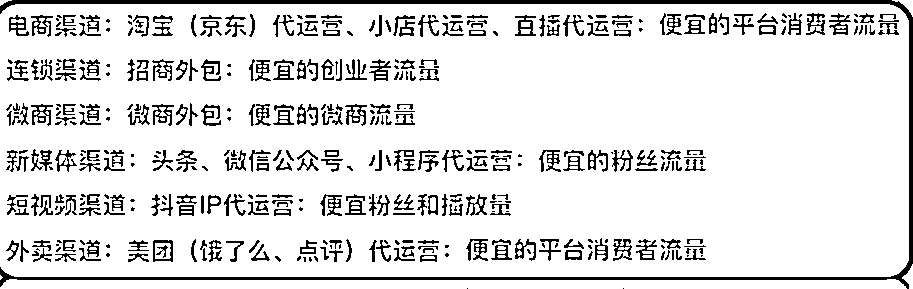

# 进生财8个月，翻遍了所有的精华帖，盘点拆解生财的赚钱方法！

> 来源：[https://yqqb1l50gj.feishu.cn/docx/NQrwdjKZ4oOEFpxGD1Hcjc9wnwf](https://yqqb1l50gj.feishu.cn/docx/NQrwdjKZ4oOEFpxGD1Hcjc9wnwf)

大家好，我是杨洋。从2014年起就在做一件事，医药圈职业教育培训，从业务做到招商经理，再到公司合伙人，最终因为公司业务线下滑离开这个行业。

去年7月份加入生财。在教育培训这行业里边，基本上把成人学历的模式和会遇到的坑都了解，独立策划了健康管理师证书项目，从证书立项，到分发代理，收学员资料上报，完成报名，拿到证书的整个环节均有参与。有证书项目上的问题可以随时交流。

同时教育培训行业网课项目，从课程录制，到技术搭建，小程序，APP制作，课程分销模式的搭建，代理合作招商模式，OEM招商逻辑，出品自己的网课品牌整个流程及具体实操办法都可以交流。

我们的网课搭建从18年做了OEM模式合作，18年营业额700万，19年营业额1200万，20年营业额1500万。而这个业绩的来源仅仅是新增了OEM 的合作方案。

从进入生财开始，到现在参加了5次航海，尤其2月份的航海收益最大，参加了ChatGPT+AI绘画航海，摸透了ChatGPT+数字人的直播模式，还遇到了现在项目的合作伙伴，同时在不断的拆解生财的生财模式的时候，更是发现了大宝藏，市面上培训课程培训的内容都涵盖在了生财里边，如果不想在做韭菜，那就好好的把生财里边的内容仔细琢磨研究透彻，当你把生财的内容研究明白了，自此再也不被割韭菜！

接下来就把这两天拆解的赚钱逻辑奉献给大家。把包裹在厚厚内容下的骨架展现给大家。如果你现在还没有拿到大结果，看看自己是哪个环节没到位，一起学习，一起生财有术！

### 一、案例拆解实操办法----原文转自@亦仁https://mp.weixin.qq.com/s/X0zyS3aEFTL7Jlvu2w291A

1.  为什么拆解？（能操作，利润高，项目优点）

1.  赚钱逻辑是什么?(目标收入=利润*单价*转化率5%*曝光人数,)

1.  客户为什么付费？（内容，工具，服务【实效+专业】）

1.  搞定产品和推广（优质产品+新用户引流【免费流量获取新用户】+老用户留存）

1.  营销最好的方法：找竞争对手的足迹，然后复制。最聪明的做法是，做别人做过的东西，学习最佳案例，然后再超越。

1.  在效率和质量上，先保证优质，在固提高效率。

1.  【研究 模仿 超越】通过挖掘出痛点研究市场上解决这种痛点的对手 查清楚对手的注册时间、收录情况、以及最重要的是他的主要流量是怎么来的、盈利情况接下来就是模仿 模仿 模仿 学会取舍，在模仿的路途中创新

### 案例拆解二--小红书卖AI绘画的材料包---原文转自@清华https://wx.zsxq.com/dweb2/index/topic_detail/214848181521581

1.  为什么拆解这个案例?

整体来说这个操作简单，而且好执行落地。

一份材料包卖168，中间的利润至少有60%左右，利润度还可以

而且好吸引人，教会别人卖材料包还能收学费+直播训练营费用+中间差价

2.赚钱逻辑如下：

用AI 绘画画出成品图，找到供应链生产，然后上快团团链接上架，卖材料包。

先通过AI绘画，画出好看想要的刺绣图，展示在小红书上，进行引流。与工厂合作生产刺绣材料，培养自己的达人，进行电商平台售卖。

1.  客户为什么付费？

客户会因为通过手工做新奇特的产品进行直播售卖而创业赚钱，卖直播训练营，带达人，卖产品赚差价。

1.  搞定产品，自己绘制刺绣图片，找到厂家进行定制合作，然后联系达人进行直播培训，线上销售刺绣包。

1.  做小红书电商培训+产品供应，培训费+产品打包出售，微商模式。

1.  对标账号：小红书 怎么复制这个案例？进行AI刺绣绘画设计发布小红书，用ChatGPT生成文案进行销售。同时开启私域。

### 案例拆解三 ---抖音卖婴儿奶粉---原文转自@生财笔记https://articles.zsxq.com/id_pbc0fxpn045a.html

1.  为什么拆解这个案例？

6个月婴儿奶粉，获得85万利润。

1.  赚钱逻辑如下：

免费领全套胎教音乐为诱饵，吸引粉丝进群，设置钩子“加好友进孕妈福利群/羊毛群” 进入私域。

每天引流100+宝妈到微信，一个月能卖8000箱。高复购，高利润。

1.  客户为什么付费？

奶粉是硬通产品，只要有孩子出生就要喝奶粉。属于刚需产品。

1.  搞定产品和推广。 产品有供货商；

推广方法一：直接用软件做好引流视频，奶粉罐子+价格直接标注在视频里，评论引流到微信或者创立一个粉丝群，每天在群里发布育儿知识建立信任。

推广方法二：制作胎教音乐引流，直播间不间断播放胎教音乐，同样的建立粉丝群“免费领全套胎教音乐”，引流到微信。每天引流100+宝妈到交流群。

推广方法三： 黑科技软件主动加粉，加大量宝妈群，用软件把宝妈一键导出来，一个微信可以加50-60人，一天可以加300人。

推广方法四： 私域朋友圈运营，不断发朋友圈，引导新用户下单。

1.  变现方法：

一： 做社群淘客。

二：招代理变现。

499门槛费，每买一箱减100元。

988代理，一箱奶粉赚100-300不等。

2888合伙人，给价格表，视频制作训练营。

### 案例拆解四---机票代理人---@迟婧

### https://articles.zsxq.com/id_fjrtpmfq6p5u.html

1.  为什么拆解这个案例？

2023年，旅游业迎来一个非常大的转机和机会。尤其是国际机票有一波机会流量。

2.赚钱逻辑：

熟悉机票预订，改签，退票业务。 有一手机票产品。拓客： 小红书平台的散户和留学生，引流私域变现。

### 案例拆解五---护肤祛斑赛道直播（需要水军配合，需要付一些费，需要自营小店）@卓斯基

前言： 直播带货红海：女装，美妆，减肥，茶叶，零食，男装，手表，鞋子，家居都是大红海。

1.  为什么拆解这个案例？

祛斑属于小蓝海，综合退货率30%左右，比较低，产品粘性强，适合做私域。

停留模型决定了推流速度，成交模型决定了推流模型。拉高在线人数来实现直播间在线人数增多。----憋单

1.  赚钱逻辑

开通抖音小店，交5000的保证金，两个水军号，投抖币，投流操作。

直播人货场，搭配产品讲祛斑原理和方法，边讲边操作演示，解答问题。

排品： 引流9.9元，爆品（利润品）299元，正价附属（修复液）99元，正价附属品（点斑水）59.8.

直播围绕以下内容做： 停留时长，关注，加灯牌，互动，成交。

中控设置好水军配合。

1.  客户有痛点就会为痛点付费。而且持续的长期的付费。

1.  搞定产品+推广：

产品直接一件代发模式即可。

推广：1.付费+短视频方式： 第七场的时候开始付费，投小店随心推，基本上200元就够了。前期吃自然流，以短视频+自然流为主。

2.提高直播运营和直播能力：懂运营+做直播。

会操盘，会算账，会选品，会选主播，会培训。

先有人（免费流量+付费流量+短视频流量+产品流量）四频共振

再留人(利用引流品讲福利留人)

人多的时候拿爆品出来做成交密度打成交模型，矫正模型，在讲利润品赚钱。

自然流量直播间，经常发现一个品最多爆半个月就卖不动了，是因为账号过于精准，同类的人已经被同行洗过了，如果还想做好这个品就需要拓宽人群，投千川是可以拓人群的。

### 案例拆解六---公考（专业能力壁垒高）@哆啦

### https://articles.zsxq.com/id_evldml0v96ql.html

1.  为什么拆解？（能操作，利润高，项目优点）、

一年1-2次的公考，数以万计的考生，我之前一直做职业教育的优势，教育付费的高利润硬刚需，对接B端的优势。都说明了公考是一个可持续做的知识付费赛道，

1.  赚钱逻辑是什么?

知识付费变现模式：

一、卖别人的产品，销售权，定价权，所有权都在对方手里，收益有限。

二、先通过学习，掌握并进行运用，验证，整理总结经验，在传授给更多的客户。

制作时间比较长，适合长期做。

第二个时间长，但是长期做有优势。

1.  客户为什么付费？（内容，工具，服务【实效+专业】）

1.  搞定产品和推广

推广变现闭环： 变现（公考面试培训）---引流(有面试需求的粉丝)---差异化（不断优化笔记）---转化（话术建立信任并成交）

小红书引流： 起号（发真题，评论区解答+真题解析）

1.  营销最好的方法：小红书引流+私域成交。

### 案例拆解七---代运营

1.  操盘手： 从品牌IP的定位，内容制作和引流，客户的转化和成交产品的打造和交付以及售后风险的把控，具备一个全局的思维。打工：50万-100万年薪。创业和项目进行深度绑定，收入无上限。

代运营： 服务外包行业的板块。

信息技术外包 (ITO)：技术APP开发， 网站建站，商务的技能调查，异地市场的调研，供需配对的平台，

商业流程外包(BPO)：注册管理，办公室租赁，电话异地转接，会计报税，

知识流程外包(KPO) ：策划服务，知识产权，培训服务，企业搭建的人力资源规划，

招聘流程外包 (RPO)：招聘流程的咨询和培训，企业的招聘外包和专业项目的人才招聘，普通人力代招。

电商代运营

流量端：建站建店

营销端： 引流，做推广，品宣

转化端：客户转化和私域供应链，仓储和物流

狭义电商代运营： 产品、价格、渠道、整合营销

1.  参与渠道的创建和运营，产品价格和整合营销促销环节不参与

渠道的意义就在于人家想买的时候就能够买到你。

当客户产生一个需求的时候，产生购买动作，从而寻找，搜索，发现，研究产品价格，性价比，质量，口味，服务，是否可以满足，可以去购买他。当他觉得你各方面都OK的时候就会下进行购买。

客户的需求通过一系列的动作得到满足，而渠道就是联通品牌和消费者之间的管道。

实体的渠道是通过门店来链接商家和顾客。

微商的渠道是通过 微信和朋友圈，还有裂变政策联系了商家和代理。

IP是通过短视频链接了品牌的价值，就是品牌和粉丝的价值。

1.  渠道代运营的底层逻辑是获得流量，有了流量才会有其他的。

1.  代运营交付： ①招商裂变 ②知识付费 ③创始人IP ④垂类引流

1.  代运营转化：

① 电话/微信邀约 ②沙龙：集中邀约，分享干货，资源共享，体验。

关键点： ①快，在客户产生需求的时候，就第一时间首先联系。②主场优势。③高频的逼单。

【代运营转化的关键点，是电话联系邀约，见面才有成交率】

1.  签约交付：

交付的是我们的目标和起步中间的整个过程是交付的内容。

目标，

第一步做什么，第二部做什么，第三步做什么？

抖＋付费预算

做策划，更新周期是什么样的

项目对外呈现方式是什么样的

推广预算是什么样的？

策划的预算

人力成本的预算

三、客户要方案怎么办？

只作流量端的前端代运营：给案例手册+口头思路。【案例牛+经历牛+成果牛】

前端后端都做的全案代运营：细节多，没有方案很难讲清楚，阐述清楚专业能力和服务价值。有案例，有逻辑有落地的方案。需要收策划费或者定金来做门槛。

价值体现，前期价值体现越大，就越要出方案。

我的诚意是把方案做好，你的诚意是出一部分定金。

### 案例拆解八--小红书无货源电商@曜文

### https://articles.zsxq.com/id_2wgrfwzxivlt.html

今年小红书重点布局电商业务，流量有扶持，同时很多人都在布局小红书，现在做是个普通人的机会

无货源，直接在小红书上发笔记，从其他平台发货，赚差价。

提高笔记曝光，1\. 首页推荐 2\. 关键词搜索

关键点： 吸引人的图片+文案的引导

布局长尾关键词，得到持续的流量

找到优质的货源来做。

选品技巧：1.其他平台火过的

2\. 热点周边（比如电视剧周边）

3.细分垂直领域（比如卖一个单品）

4.热门赛道：饰品服饰，家居家装，美妆护肤，食品

小红书开店账号垂直很重要，（开店上架发内容）

查找对标账号像素级模仿，一帧一帧的比对，一模一样的图片展示引发流量。持续去做。

### 案例拆解九--小红书引流+私域卖货@小野

### https://articles.zsxq.com/id_0ojpkedc4w0c.html

公域引流+私域变现，已经成为了当下最容易成单的模式，未来也会存在；

利用写公众号的文案能力优势，在小红书上进行分享，把内容加工成对别人有价值的内容。吸粉600人，引流私域1000-2000人。（释放价值，留一半存一半）

1.  营销最好的方法：找竞争对手的足迹，然后复制。最聪明的做法是，做别人做过的东西，学习最佳案例，然后再超越。

建立社群，引流到本地孕产妇交流群，引流500+

微信私域打标签，精准推送消息。标记客户情况。

### 案例拆解十---流量生意@李自然@@令狐峰@盗坤 @龙共火火huohu

拆解原因：

所有的好生意都是流量生意

流量--转化--成交--交付---复购，老客户留存，新客户增长。这就是一个好生意的来源。

那在这些环节中，最重要的就是流量问题。打开流量，拉新是所有生意变好的开始。

接下来拆解流量：

### 一、如何用流量思维赚钱，怎么获得水下流量，最大化流量价值？

很多成功的产品背后都有着不为人知的流量手段。先有流量再有生意。

#### 如何能获得流量？

1.  紧盯正在崛起的大平台，在大平台的成长期都会释放大量的红利期。

比如： 邮箱时代，当时发邮件不花钱。电脑24小时发，等着收订单。

百度SEO时代，竞价排名，一块钱就能买一个想加盟的客户 。

阿里开店，腾讯公众号，不管是开店还是踏踏实实做几个公众号，都有发大财的机会。

拼多多初期，一个一个身份证可以开很多店，开了店之后就靠自然搜索量，之后接拼多多代营运，一个月躺赚几十万。

美团点评，把店铺搞到好评第一，接到大量互联网流量，就可以把店做起来了。

这样的机会，每一两年就会出现一次，需要的就是速度和执行力。

现在就是视频号和小红书两个大平台。

1.  挖掘小平台

新闻上，应用商店排行榜上，短时间也会有可观的流量涌入。

小平台资源有限，系统漏洞多，技术对抗弱，可以薅羊毛。

1.  培养敏锐的嗅觉

有流量的平台+有流量的品+快速的执行力=赚到钱。

等你看到别人分享出来详细的内容的时候，说明这个事已经提高门槛或者已经过时了。但是他们的方法是可以迁移到下一个流量池的。

#### 如何最大化流量的价值？

1.  空手套白狼

如果你是流量高手，产品为0，卖别人的产品。等红利期过去，啥也没留下。那流量就是快钱，赚不下去了，最好的策略就是拿钱走人。

1.  平台上的稳健生意

如果自己有产品，能承载住客户，平台又欢迎的做法，就寄生在平台，成为稳健的生意。

1.  伟大的公司

把流量好过来，按到自己的平台上。流量方知识助力方，用良好的口碑获客，这样就可以造就伟大的公司。

#### 二、到底怎么做流量？

所有课程买是白买，学了也白学。为什么小白会买呢？小白觉得这个事太难了，觉得越复杂越好，还有就是想走捷径。

但是真正获得流量的，要么是花钱买，要么是苦哈哈干出来。

#### 获得流量有用的几句话！6个方法论

1.  留好诱饵，好的东西外面留一半，剩下一半找你来拿。

1.  留好钩子，持续的装逼，持续的装逼造势，持续的吹牛。

1.  共情，拿到认同，这时候的流量是最精准的流量。

1.  量变质，持续的苦干！绝对相信时间的力量，绝对相信长尾效应。

1.  持续的打磨自己，人厉害了，作品有了，影响力有了，流量问题就解决了。

1.  做好后端服务，增强复购和裂变。

#### 3个渠道：

音频：喜马拉雅

视频：抖音、快手、视频号、哔哩哔哩，小红书

文章：知乎、公众号

做好六个方法论+3个渠道，搞不来流量就没天理了。

#### 最精准的流量怎么做？

做内容，输出的价值吸引到了你，帮你解决了问题。

做知识付费就是自己录制课程，标价1999，找点课程贩子卖9.9，看盗版的多了，流量就来了。所有的课程都是诱饵！

#### 怎么做内容？

1.  抄

1.  杂交

1.  原创

做流量要输出价值，谁输出的价值多，谁搞流量就简单点。

谁输出的价值少，谁搞的流量就少点。所以我们要习惯性的收集素材。

卖点锁定了，跟卖点有关的素材都收集起来。收集的素材多了，赚钱就是捡钱，捡钱就是赚钱。

所有的流量都来自于优质的内容。

优质的内容就是实实在在解决问题的。

做流量的时候多想想：

1.  你写的内容有价值吗？

1.  自己录制的视频有价值吗？

1.  自己做的音频有价值吗？

如果有价值，流量就会自动循环，如果没价值，就继续充电继续释放。

一年搞不到流量就两年，赚钱是锁定一个点打持久战。不是四处打游击战。

少做一锤子买卖，少做一锤子流量，产品做好，服务做好。二次裂变以及内容自传播，带来的粉丝效应是巨大的。

#### 三、流量获客感悟--48条

1.  大平台的流量便宜，量大，优质，提供优质产品，内容，服务，技术

1.  产生优质内容跟平台换流量，产生内容的能力决定了流量成本的高低。

1.  火过的内容还会在火，重复拍10遍打底

1.  稳定的输出爆款，就要提前准备10000条行业选题，100条爆过的。

1.  爆款内容三要素： 让用户看下去，解决需求，打造获得感。

1.  小红书爆款套路： 测评报告，心得攻略，产品教程，避坑指南，知识科普，教程合集

1.  视频比图文效率高，出镜比不出镜信任高，信任是转化的关键，这个是IP火的原因

1.  替某类群体发声，最好还能赚钱，挖掘他们的痛点。（共情）

1.  直播：话术和产品比主播重要

1.  做视频要靠数量和矩阵对抗平台的不确定性

1.  提升单个关键词seo排名，用心写标题，认真做内容

1.  流量的尽头是微信私域

1.  私域管理：培育，激活，转化，关怀，复购

1.  最简单的成交方式是做客户的引领者

1.  ip崛起的三个阶段：自说，他说，传说

1.  提炼卖点是做流量的第一步

#### 四、关于流量的认知误区

1.  内容永远是撬动流量最好的杠杆，好内容没有标准，取决于用户审美的进步速率。比如之前抖音火的内容很low，是因为当时平台的增长速度远远低于产出内容。

1.  红海不取决于平台本身，而是用户头脑中的拥挤程度。公众号难做了不是平台不行了，是因为好的内容难做了，对用户来说，好的内容上瘾了，在回去就难了。

#### 五、视频号引流的五频共振

1.  第一步，做大批量的账号（30-60），靠低成本的搬运视频模式，用视频获得流量，然后再直播间转化。用最快的效率去测试流程和产品【这一步主要是测品】

1.  第二步，针对这批账号跑的流量比较持久的账号，做直播间的升级。更好的主播，更好的话术，更好的场景来打爆直播间数据，从而获得更多的流量，也就是直播广场流量。

1.  第三步，恒久稳定的付费流量，不断提升付费流量的占比。

1.  第四步，做微信私域的积累，把粉丝加到微信里，这样以后做新号不用冷启动，直接微信朋友圈冷启动，老账号通过私域提高复购。

1.  第五步，做产品升级，让用户转发视频号账号，视频，直播间，实现裂变。转发朋友圈送优惠券。