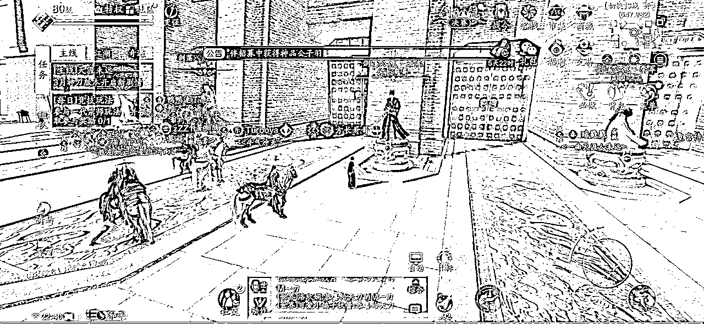
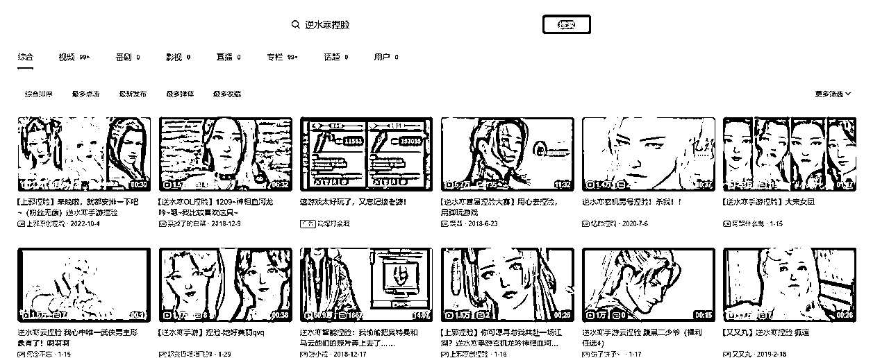

# 如何从现象级mmorpg类游戏中挖掘变现机会

> 来源：[https://fgsd3oxjki.feishu.cn/docx/OZ53d6t4vovziPxkUyZc8qrNnjc](https://fgsd3oxjki.feishu.cn/docx/OZ53d6t4vovziPxkUyZc8qrNnjc)

大家好，我是姚麻。好久没有在生财分享啦，寻思着马上杭州见面会了，高低也得刷刷存在感。

索性今天就跟大家简单聊一下，当市面上出现了现象级mmorpg（大型多人在线角色扮演类）游戏，以即将公测的逆水寒手游为例，看看有哪些切入点可以去做变现。

先跟不怎么玩游戏的圈友解释一下，所谓mmorpg游戏，可以理解为就是【玩一个角色，打怪、升级、升属性的养成之路，可以和其他玩家交流、下副本、PK等等】。

从最初的魔兽世界、问道、征途、天龙八部，到后面的天涯明月刀、剑灵、九阴真经、龙之谷、逆水寒等等，这些都算是mmorpg类型。

熟一点的朋友都知道，我人生的第一桶金，就是大学时期玩天涯明月刀（端游）来的，20年出手游的时候，又整了小几十个。

而到了6月30号的时候，逆水寒的手游会开启全面公测，在我看来这是个还不错的机会，虽然我肯定是没有时间和精力再去整这些了，但我相信咱们生财圈友肯定有人有兴趣，就用这篇分享来给大家捋捋。

# 一、底层逻辑

其实底层逻辑真的很简单，说白了就是一句话：需求+流量+交付=变现。

先说流量吧，逆水寒手游公测的时候流量和热度，肯定是一顶一的，这个不用想。逆水寒端游刚出的时候热度就已经是拉满的，天刀手游刚出的那大半年也是拉满，包括逆水寒手游上一次的内测，也是在游戏圈里关注度极高。

这三点结合得出的结论就是，这个盘子很大、玩家很多，只要你愿意去做，多的是流量和机会。

什么叫现象级？逆水寒手游出来绝对是现象级（非托非软文），至于能现象多久，那就不知道了。

同时呢，针对国产mmorpg类游戏的特性【重肝重氪但又很上头，沉没成本很高】，培养出来的玩家，有很大一部分都属于那种，对游戏内的数值有一定追求，但自己又懒得做或者说是做不好。

那么咋办呢？能充钱解决的充钱，充钱解决不了的，就花钱找人搞定。

就拿天刀和逆水寒来举例，能稳定玩一段时间的玩家，自己充的钱加七七八八用的钱，算下来大几千上万很正常，最多算个平民玩家。充十几万几十万的，可以算个小氪了，基本也是遍地走。

玩着玩着花几百万上千万的，也是挺常见的，开区大几个月一年，基本上每个区榜前几都是这个数。

总结一下就是：需求多+付费意愿强+客单价高。就这么三个特点，懂得都懂好吧。

然后是需求和交付，大家都知道，只要用户有需求，而你可以满足，那你就能收费。去年我在视频号的航海里分享选品思路的时候说过一句【选品就是找需求】，不知道这句话有没有人记得哈哈哈。

那么下面的内容呢，我会结合具体的游戏内容、玩法，给大家总结一些玩家比较常见的需求，针对这些需求，又是以何种方式方法去做交付，以及如何去获取流量，尽量都会聊。

不同的需求，对于我们自身的要求也是不一样的，大家看完如果有兴趣，可以根据自己的具体情况再去判断和选择。我自己做过的或者比较了解的，就聊多一点，不是很熟的就简单讲讲，大家也别见怪。

对了，关于流量补充一下。就是基本上我说的所有玩法，都是基于将玩家引流到微信之后，再去进行沟通、收费的。

无论你是从游戏本身，还是第三方平台获取的流量，最终还是要到微信去，毕竟项目的终点是私域嘛哈哈哈。

# 二、具体玩法

## 1.日常代练、代肝、托管

现在mmorpg类游戏，基本都有很多固定的日常任务/副本、周常任务/副本、剧情主线任务、支线任务、成就等等。

特别是网易的游戏，传统就是肝起来要老命。刚开服的时候，可能大家还都会自己做做，随着时间的推移，很多人对这种，重复且枯燥的任务/副本，直接就有心理阴影了，是真的打心底的抵触。

但是又不得不做，不做就会比别人落后呀，没办法，那花钱找个代练给我做呗。

可以说是门槛最低的一个方向了，基本上是个正常玩家，愿意花时间去做的，都可以做。缺点就是累，然后天花板不高。

一般来说，接一个号包月的日常代练也就几百块钱，如果按天算30-50差差不多，刚开服可能能高一些，100/天也能有生意的。主要还得是靠量取胜，如果能稳定接一批号，一个月肝下来大几千上万还是不难的。

还有一种相对来说高端一点的，也就是接大号的托管，遇着大方的大佬，一个月就是几千起步，而且玩的很爽，等于就是大佬负责充钱你负责玩了。要是能抓住几个大号，混的风生水起一点都没问题。

不过和接普通玩家的日常，还是区别很大的。这种需要你把这个游戏玩精，不能让大佬花太多冤枉钱，钱充进去了我得看见我的功力/战力在涨。总不能同样是充了20W，人家哪哪都比我强，这还找个鬼的代练哦。

还得比普通号更肝，每天该做的能做的都要给做完做好，号主上线了一看，根本没有红点这回事儿，想找个正经事儿做都难。这样才能牢牢的抱住大佬的腿，才好意思开口要高价，还能让大佬给介绍更多的号。

流量怎么搞呢？比较基础哈，要么在游戏内的公共频道刷广告，要么去贴吧/论坛这样的地方发广告。也可以从群入手，帮派群啊吃瓜群啊组队群啊这些，多混点游戏群然后改个备注，告诉别人你接日常托管，没事聊聊天刷刷存在感，总会有生意找上门的。

## 2.搬砖工作室

因为游戏机制的原因，每个玩家通过正常玩法，能获取到的流通金和材料都是有限的。在资源获取上限相同的情况下，如果说你想比别人厉害，那没办法就只能靠钞能力了。

要么直接往游戏里充元宝，用元宝换流通金，再用流通金去买你想要的材料/装备/物品。要么就从其他玩家手上花钱买流通金，但正常玩家大家都差不多，自己用都不太够，哪还有多余的卖给你呢？

这个时候，工作室就应运而生了。搬砖工作室一般就是通过多开+脚本，用很多的小号不停的做日常任务，来赚铜钱（逆水寒里的流通货币）和材料，然后把铜钱/材料卖给玩家换取rmb。简单点来说就是，打金。

假设一个普通玩家一天，撑死了就是能弄到50金。我用多开器和脚本挂着刷任务，一台电脑同时挂10个号，五台电脑同时就是50个号，一轮号挂完是3个小时，一天挂满是8轮。也就是我一天就可以产2W金，然后往藏宝阁（网易官方交易平台）一挂，就坐等收米。

还有一种走线下的，商城元宝兑金是1块钱10金是吧，藏宝阁1块钱15金是吧，你找我买金，不通过藏宝阁，我直接交易给你，你直接转账给我，1块钱20金，怎么样心动不心动？

当然了，这里的举例数值都是我随便说的，我也没自己去整过工作室，一个成熟且稳定的工作室要弄多少号，一天可以做多少产值，又能卖多少钱，这些我都不是很了解。

包括金价这玩意，也都不是固定的，得看市场供需关系来走，不过越往游戏后期金价越低这个是一定的。

这个玩法呢相对来说，门槛还是有一点点高的。有设备要求、软件要求、账号要求。设备和软件还好说，直接去买就好了，花钱就能解决。

倒是账号这块我还真是不太懂路子，因为猪场的手游基本上都是网易账号登陆，不绑定手机号好像还用不了，按一个号可以注册5个角色来算，最少也得备大几十个号。不过我觉得哈，应该网上还是有批量注册游戏账号的渠道，找不找得到就不归我管啦。

如果要走线下卖金的话，引流方式大差不差，就是到处刷广告。主动去排行榜上私聊大佬，问他们需不需要收金也挺好，要的量大不说，还基本都能做回头生意这种。

## 3.看号、教学主播

在游戏刚开的阶段，大部分玩家都还玩不明白。无论是对不同职业的属性、装备、技能搭配，还是剧情、副本怎么过，还是充了钱怎么花买什么礼包，还是有什么隐藏的成就可以加属性等等等等，这些全部都是玩家迫切需要的东西。

这个时候看号教学主播就很吃香了，可以理解为萌新导师，用自己领先的理解和经验来教学，从而达到变现的目的。

那么有人问了，我也是小白呀，我又没经验怎么去教别人呢？

其实很简单的，首先是4月28日逆水寒手游会开启二测，有条件的可以到时候去买一个测试资格号，大几百块钱一千多的样子，提前去玩个内测，到了公测不就是老玩家啦？

不想花这个钱的，就等428二测的时候，多去斗鱼虎牙看看直播，尽可能的提前了解游戏机制和玩法，再多去抖音B站上搜一搜别人发的各种攻略，把他们都整理起来。

从每个职业的特性连招属性搭配发展，到各种剧情副本攻略，再到各种资源点、成就点汇总，再到氪金小tips，再到各类杂七杂八的小技巧。整出一份这样的文档，并且自己心里有一定的理解，就可以去直播啦，用这份文档做引流，粉丝群就是咔咔上人。

实在想偷懒的，就等到公测了，边玩边看同行直播，学习同行的东西，拿同行的教学文档，修修改改拿过来用，再自己好好看个几天学个几天，无非就是少赚几天钱嘛。

当然了，也有可能就是因为这么几天，热度就会一直落后于同行了，毕竟别人有积累呀。

说一下看号、教学主播的收入途径。主要是直播礼物哈，拿斗鱼虎牙来说，一般是办卡（6块）看号、飞机（100块）插队。

看号是什么意思呢，就是观众把让主播上他的号，主播去看一下，这个号有没有什么地方是错误的，或者是遗漏的，给出一定的建议，该换什么装备用什么技能呀，该买什么礼包用什么心法之类的，一般一个号看下来也就是几分钟，一天8-10个小时看下来，几十个号随便看的，排队的人还贼多，插队的也不少。

教学主播的话主要是卖教学文档，说粉丝群里有全职业副本攻略呀，办张卡就能进群获取攻略，或者直接弄个收费的粉丝群，一样的也是嘎嘎进人。还可以穿插收徒、1v1教学这样高客单价一点的服务。

一般来说，只要直播间有一定的热度，做的起来的话，看号、教学、日常托管这三项是可以同步进行的。以看号为前期主要直播内容，在看号的时候根据账号目前的充值情况，大概判断号主的充值预期（经济实力），同时进行各种玩法的讲解和教学，顺势引导观众进粉丝群/加微信。

判断经济实力可以的号主，可以多留意一下多聊一聊，看能不能聊好一个稳定的托管/账号打造。如果能接到那种想冲榜一的大佬号，直播标题和效果也能拉的很好。

抖音到时候不确定能不能播，按道理来说网易的游戏在抖音应该是可以播的。如果在抖音播的话，就不能像在斗鱼虎牙一样明目张胆挂QQ群和微信了，就得先引导进抖音粉丝群，然后通过粉丝群再引导到QQ群/微信了。

在抖音播来的流量相对来说会比斗鱼虎牙高，但是用户质量（大佬数量）可能会差一点。

还有就是如果在抖音播的话，一定要配合短视频的发布，不用很刻意的去做什么视频内容，只需要把自己每天的直播内容都录下来，然后抽空挑点有意思的片段，简单剪辑一下，加个片头字幕啥的，做直播切片发布就行了。

看号主播刚开服那段时间是很吃香的，前一个月吧差不多，可以吃的盆满钵满，但是越往后面越不行，因为大家都会玩了，用不着你看了。所以千万不能做单纯的看号主播，一定要注意做教学、导师这样的ip人设，能接托管/账号打造一定要接，这样才能做的长久。

## 4.职业代打

mmorpg类游戏都是有pk的，也就是竞技场。逆水寒有1v1竞技，也有3v3竞技，都是有段位和排行榜的。不同的段位会给不同的奖励和属性加成，排行榜则是装逼的利器。

代打顾名思义，就是代替号主打游戏，这里指的是打竞技场，和LOL、王者荣耀代练上分一个意思。

有两种人群是很需要找代打的，第一种是平民手残玩家/妹子，自己根本玩不转pk，但是又想达到最高奖励的段位，就只能找代打。

还有一种就是大佬，充的钱多号也猛，但自己根本都不怎么玩，更别说让他去打pk了，又觉得我充这么多钱连个排行榜都上不去，太没面子了，所以需要找代打帮他冲榜。

代打的收入主要来自这么几种：

1.代打段位。

一般是按需要打的段位数量收钱。拿天刀手游举例，论剑段位大体可以分为1-9段数字段、试剑-造极段、武痴-求败这么三个区间。数字段基本都是人机/小朋友，可能就随便收点或者让号主自己玩，如果接个1段到试剑的单子，撑死了五十一百块了。

试剑-造极充斥着各种普通玩家，收费稍微正常一点，游戏前期可以收到50-100一个段位。武痴-求败这个区间，前期肯定需要一些技术才能上去了，可以收到100-300一个段位。

我们算一下总账，如果说遇着有人想要你从1段打到求败，一共是24个段位，打包收个2000-3000算是比较正常了。但也仅限于游戏前期哈，到了后面基本上普通玩家都能自己上求败，能收个500-800算高价了。

2.清币收费。

每周都会有关于竞技场的周常任务，需要完成多少场pk/拿到多少胜场，才能拿满对应的奖励币，而奖励币又可以换资源材料。所以就有了这种清币收费的模式，给玩家把每周的奖励币拿满，一共要打多少把上多少的段位是主播的事。

一般是一周100-200/包月500-800这样，还有包赛季清币的，一般一个赛季也就4-6个月，收个几千块钱差不多。

3.按时收费。

就是规定时间段给某个号打竞技场，比如说一个飞机礼物（100块）打半小时，火箭（500块）插队2小时这样。或者也可以通过微信直接转账，说话多少价格打多久。

4.代打冲榜。

一般就是针对大佬玩家的了，因为普通玩家普通号战力不行，技术再好也很难冲到榜单前面。这种收费不固定，看当时的行情以及和号主聊的怎么样，如果遇着大方的，一个小区赛季前十/第一收五位数也正常，大区赛季前十收大五位数这样。

这种就得尽可能多的打大号，维持自己的领先。不过也有好处，一个是高端局可以保持并提升自己的技术，还有就是直播效果好，观众也喜欢看大号看顶尖局。

5.赛事代打。每个赛季都是会有官方竞技场赛事的，逆水寒手游会不会开我不太确定，按之前天刀的经历来说，每个赛季的大钱都是从这里来的。

天刀每个赛季有个全民论剑赛事，叫做剑荡八荒。每一个玩家都可以参与海选，海选选出大区64强打小组赛，最终角逐冠亚军。天刀手游里的设定是，16强可以拿到一个专属配饰-银剑，4强可以拿到金剑，而冠军则是冰剑。

最终的结果会全大区通报，并给到同区玩家奖励，算是一个很大的荣耀了，所以价钱都开的很高。天刀端游的线上赛大区冠亚军，还会组织tga的线下赛，而且线下赛的名次是有官方奖金的，但是到了手游就并没有这个了。

逆水寒端游也有线下赛，至于手游有没有就不知道了。

（大家可以猜一下就这一身装扮，要多少钱）

（这是逆水寒的各种赛事，比天刀要齐全的多）

说回价格哈，还是一样的越早的成绩越值钱。在天刀手游头两个赛季的时候，基本是火区16强5000-1W，4强2-5W，冠军10W这样差不多，人少的郊区价格基本砍半。

第一个赛季的时候，我个人是拿了一个火区4强一个火区亚军+一个郊区冠军，到手好像是18W吧我记得。然后我们剑荡时候，基本都是几个之前端游的主播朋友约着线下一起打，我们8个人加起来好像拿了十几个冠军。

第二个赛季的话就更牛逼了，当时也是接了一堆的大号，然后郊区号丢给小弟打，我和另外两个朋友打的是同一个大区的三个大号，在我们的精密操盘之下，最终全部都进入四强（下面有图，除了菜园小菡不是我们的号，其他三个都是，一路乱杀），然后包揽冠亚军。

那个赛季因为几个老板都是同一个区的，恰好又有一定的矛盾，所以价格抬得很高，同时有个老板是上个赛季的【给你M一刀】（饮恨亚军，这次就想要冠军），所以冠军给了20W亚军给了13W，四强那个给了7W。

再说一下我觉得做代打，如果想赚赛事的大钱核心点在哪里吧。

第一点肯定是技术了，没有技术给你再猛的号也一样会翻车，所以一定要多练多学多打，我们之前一个赛季加起来打几万场是很正常的事，不然凭什么能比别人厉害呢。

第二点是要有实力足够到位的老板和号，怎么找大号呢，其实也很简单，要么做好直播等着大佬主动找上门。

要么就自己多开点小号主动去各个区的排行榜私聊，没有固定代打的就问需不需要实力代打，有固定代打的就问问想不想换一个，赛季免费代打都行，只要赛事的奖金聊的好就行。

第三点就是尽可能和厉害的人一起玩，组成一个高端的代打小圈子。一个是大家可以互相切磋研究提升技术，还有一个是资源互通、争取市场定价权。甚至还可以线下约着一起打，看多接一些号，尝试操盘赛事。

就像我们第二赛季的时候一样，四强有三个是自己人，而且另外一个随便虐，那这样冠亚军不就是我们自己说了算嘛，想给谁不给谁就看出价咯。

逆水寒和天刀有一个不一样的点在于，天刀最火热的是1v1，但逆水寒的3v3、6v6比1v1要吃香一些，能否找到靠谱的队友也是很重要的，所以上面说的小圈子就很必要了。

## 5.帮派管理、指挥

在mmorpg游戏里，帮派/公会玩法是永远也绕不过的一个核心点，这直接关联到每一个正常玩家的游戏体验和资源分配，大佬们也想自己的帮派越做越强，索性就把开公司那一套搬过来用。

给核心管理层和指挥官发工资，给帮众定KPI发福利，甚至还能有hr（挖人的），挖一个人过来给多少钱，挖一个大号过来又给多少这样。

作为管理的话，其实说实话没有太多的技术含量，说白了就是你得先找到一个确定是大佬在烧钱玩的帮派，然后去和大佬处好关系，把大佬舔好了，别的什么都好说。

至于真正需要管理些什么，无非就是去套用一些其他游戏公会的规章制度，然后协调好平时帮众之间的关系，安排组织好各种活动，其实就差不多了。每天游戏在正常玩着，手底下管着一帮子的人，还能弄一份月薪几千甚至上万的工资，岂不是美滋滋？

甚至还有心黑的，直接在KPI福利上动手脚，可能大佬一个月拿出5W来发福利，能被管理扣2W走。

另外一个核心的职位就是指挥了，这个指挥主要是指平时野外群架、宣战、帮战等活动的指挥官，可以是一个人，也可以是很多人，看具体的个人能力以及分配了。

正常来说是主战场一个主指挥一个副指挥，副战场又一个指挥，一个帮派一共是三个指挥，有的大佬可能还会专门请一个野外的指挥，这个不一定。

指挥怎么当呢？其实也很简单，还是那句话多看多学多操作。B站上可以搜到很多帮战原声视频，多去看看别人是怎么指挥的，尽可能理解各种打法和游戏机制，然后上实战整个一段时间就可以到60分了。

那怎么才能到90分呢？这个可能就需要真的用心了，不仅需要配合管理磨练帮众的凝聚力和执行力，还需要自己不停的做复盘，找到问题和优点，查漏补缺扬长避短，才能不断的进步。

如果说你已经是一个成熟的指挥了，不妨多往抖音发点帮战高光剪辑，往B站发点完整复盘，运气好可能能钓到新大佬，运气不好也能拉个指挥交流群，然后付费收点徒弟啥的。

指挥怎么收费呢？要么是按月发工资，说好了一个月多少钱就多少钱，要么就是按场次来，指挥一场多少钱。拿天刀来举例，游戏前中期一个普通帮战指挥差不多要价是200块/场，一周3场一个月12场就是2400，包月可能是1500-3000，看怎么聊的。

厉害一些的指挥，或者说知名度高一些的指挥，可以做到500-800一场，包月2W的我也见过。到了游戏后期，基本就是市场价100/场，包月1000-1500这样了。

我那时候说实话，也确实是在正儿八经的玩天刀手游，所以还自己弄了个帮派，因为请不起指挥只能自己上，一帮的平民也没有什么大佬支持，愣是靠着执行力一路低打高走到最高分组，还拿过一些冠军，现在想起来还真是，很感动当时大家一起的努力哈哈哈，都是青春啊！

到了后面在指挥圈子里，还有了一点点小名气，我手上打PK的老板都老想让我去他们那里指挥，甚至最高的给我开过1000一场来着。

（接手指挥后第一次打到最高分组，并拿到第三，让大家的帮派标有了个小框框）

（第一次正面击败敌对帮派，拿到冠军，头顶大金框啦）

（顶峰相见后，必然是少不了大合影啦）

## 6.代打团

这里说的代打，不是上面说的代打竞技场PK，而是代打副本的团队。

游戏厂商为了增加游戏的趣味性，现在很少会开发“数值本”（难度在于怪物/boss的数值，玩家需要达到一定数值要求才能打过），而是更多的在推出“机制本”（数值不是很重要，考验的是玩家对机制的理解和彼此之间的配合）。

在达到数值碾压之前，想要顺利通关，需要玩家有一定的操作和团队意识，这对于很多玩家是个大难题，甚至连开荒都能卡好几天，所以就有了代打团。代替团队里所有/大部分玩家上号，给他们打副本通关。

还有的是大佬想要拿首通记录，但奈何自己确实是操作不来，就会找经验丰富、配合默契的代打团队来，给他们刷一个首通/速刷记录。

怎么收费呢？拿逆水寒经典12人团本舞阳城举例，一般是一个号50-100，一车坐满就是600-1200，要是出了流通的好货还得另算加钱。

按照手游团本惯例来算，老手速通一般是15-30分钟，就按20分钟算吧。在单子足够多的情况下，一天下来一个团开个15-20车没啥问题，匀下来每个人一天也是大几百上千的收入了。

至于如何才能成为一个合格的代打团，也没什么巧的，先找好固定的小伙伴组成团队，最少6个人最多可以弄个15人，然后多看别人的视频、学习攻略，自己多磨合多打，肝个几天基本就没问题了。

接着就只需要考虑接单的问题了，还是很基础的玩法，游戏内各个频道刷广告，多进群刷广告，能直播的就直播，抖音B站多发点视频。

## 7.手绘头像/壁纸、宣传视频

画师是个很吃香的行当，主要是指根据玩家具体要求/游戏角色形象，画出满意的头像/壁纸。之前相对来说还有点门槛，起码你得会自己画吧，然后画风啥的还得齐全一点。

但是现在不用这么麻烦了，直接上AI绘画就好啦，反正这种客户又不需要给PSD源文件，只要出图够快够好看就行。

收费的话没有什么很固定的标准，之前都是手绘的阶段，见过最低30一张的，也见过500一张的，还得先预约排队。

流量这一块，可以多去小红书发一点自己的作品，因为大多数愿意花钱画头像的，都是女玩家。抖音也可以多发发，万一爆了视频，单子接到手软。

宣传视频的话，就是指“导演”上号录制一些游戏内的视频画面（可以在抖音/B站搜云小叠看一下类似视频），然后通过调整滤镜、剪辑踩点、加特效等等等等一系列的操作，做成一个几十秒到几分钟不等的短视频。

一般是帮派宣传视频、情侣纪念视频、金兰（好友）纪念视频。

收费基本上是按秒/分钟来计算的，也有按直接按一口价算的。因为我接触的“导演”不多，就和一个人比较熟，而她又是混的比较好（全网加起来有几十万粉了）的那种，所以我简单说一下她的收费标准，但不代表市场价格，大家仅供参考。

1分钟以下的视频是按30/秒算，或者直接是一口价1500一条。1分钟以上的按分钟算，2000-5000一分钟不等，根据客户的要求而定。

如果对于剪辑后期这一块比较熟悉的，可以去尝试一下这个，很赚钱的！！！！

对于画师和导演来说，一般还能接点主播的“小活”，就是做定制的直播底板图/直播封面，一般就是通过游戏内截了帅图美图，然后扣成透明底的，再加上主播的名字和联系方式之类的，这样一张图一般要收个一两百不过分。

## 8.捏脸、家园、搭配

还是恰女玩家的钱为主，试问哪个小仙女不想自己的女儿脸也好看穿的也好看呢，谁不想自己经常拍照的家园也处处都好看呢！但奈何自己是真弄不出来啊，那就花钱呗！

这里其实有两种玩法，一种是走原创路线，自己去琢磨这些东西，把它变成自己的技能，然后多往公共平台上分发自己的作品引流，再去卖定制化高客单的产品。

还有一种就是收集整理市面上常见的相关资源，打包一起去卖，卖个几块钱十几块钱一份很好卖，只要量起的来。

## 9.做群

这个玩法和游戏具体内容其实没有太强的关联性，无非就是蹭游戏的热度，以及把游戏当做一个引流平台，以各种群形式做引流，然后考虑变现。

比如说游戏交流群、吃瓜群、cp群这样的，开放群成员拉人的权限，稍微做点引导，就能很快拉满很多个群。

至于后续是根据粉丝画像（18-30岁年轻人）再去做其他产品变现，还是围绕游戏这一块去做变现，就根据自己的想法来定的。以防有人看不懂，我再举例说明一下吧。

第一种就是，假设我是个卖复刻产品的微商，恰好我所需要的用户，粉丝画像和游戏玩家差不多，所以我就以游戏的名义把这个游戏的玩家先引流到群里，然后都加上好友，后续通过朋友圈慢慢去洗。

第二种就是，我后续还是保持初心，围绕游戏去变现。比如说在群的基础之上，再推出高端付费游戏群，收个288的门槛费，群内会定期举行各种游戏的小内战小比赛，还会组织各种各样的小活动，总而言之就是让愿意付费的玩家有一个更好的游戏圈子。

也可以和其他做游戏变现的人合作，就这篇分享里说的任意一种玩法的人都可以，反正你总需要流量吧？我这里有，我们合作，我允许你在我的群里面打广告引流，只要不是太过分太伤群就可以，然后聊好怎么分钱就行了。

同理可得，不管你是选择哪一种玩法去做，你都可以用做群的方式去引流，最起码来的都是这个游戏的玩家，或多或少总能洗出来付费用户。

## 10.主持818（扒一扒）

每个mmorpg游戏都是一个微型社会，那么就避免不了各种的爱恨情仇，避免不了各种冲突。今天这个渣男把妹子搞怀了就消失啦，明天那个被爆已婚带俩娃还处cp啦，后天这个榜一大佬被爆是借钱充游戏啦，大后天又知道了这个帮派往那个帮派派卧底等等等等等等.......

我就问一句，你们有见过一个YY频道/直播间不挂水军有几万人吗？全是真实吃瓜群众！大家每天都在吃瓜，大家每天都想吃瓜！

看看我！专业主持818！只要你愿意给钱，我就给你提供平台让你尽情对线，还帮你肆意宣传，让更多的人来围观。

形式其实很简单，就是找个固定的YY频道/直播间，然后拉上对线双方，安排好发言顺序，做好控场，最后结束了再给大家来个总结就可以了。平时没专场的时候，就多发发抖音，开个瓜墙抖音号，多建点吃瓜群。

怎么收费呢！首先是要求做818的人，收你个500块钱主持费不过分吧？

然后我YY频道里的黄马（管理员），你可以随意上麦，可以随意拉人，还能建立自己的小房间，卖个188也不过分吧？我整个频道的冠名权，动不动几千号人上万人，一天1000不过分吧？

换成直播间的话，那就更简单了，只要直播间里人数起得来，还怕没得赚？收小礼物都收到手软！

在我看来就两个难点，第一个是如何在整个818的过程中，尽可能的不掺杂个人情绪和倾向，保持好中立态度，只是做好自己该做的事。第二个就是如何在有大瓜的时候，发动更多的真实玩家去游戏内、各种群帮你宣传。

## 11.各种小软件

因为我不懂技术这一块，所以就只简单讲一下我印象比较深的两种。

首先是各种脚本，例如前面搬砖工作室讲过的，自动挂机刷任务的脚本，这种不管是卖给工作室还是卖给普通玩家，都是有市场的。

还有一种就是类似连点器一样的脚本，因为游戏内某些活动可能会产生限量的材料，这都是需要去抢的，但是抢的人太多手速不够咋办？就用脚本呗，一抢一个准！

拿天刀举例，每周日晚上帮派活动结束之后，世界拍卖行会出现一定数量的稀有道具“陨炎之铁”，这是制作高级武器的材料。

假设现在榜前十的大佬们都想做这个高级武器，但每周一共产出就20个，完全不够分！你这时候就可以带着代抢的脚本去找大佬啦，我帮你抢，抢到一个给我加价200块不过分吧？

然后就是上号器了，腾讯系的游戏都是QQ登陆微信登录，ios系统想要扫码上别人的号，就得借助各种上号器生成的二维码，原理好像是模拟成ipad吧。

这种一般是用公众号作为载体，上号链接放在文章的原文，变现就以上号页面的广告以及公众号为主。

不过这个可能是个伪需求哈，网易的游戏可能不用这么麻烦，直接给账号密码就行了，或者可以直接提供扫码，我也忘了，网易的手游很久没有接触过了。

## 12.做直播公会

这个就不用我多说了吧？还是那句话，只要游戏有热度，那主播肯定是少不了的，趁着人多弄个直播公会，能拉多少主播拉多少主播，等着吃礼物钱就好了

## 13.账号买卖和租赁

只能说，尽管网易有自己的交易平台藏宝阁，但还是有很多人会选择第三方平台去交易账号，至于租赁账号就更加了，官方哪会支持租号这一说，不充钱的穷鬼这辈子都别想体验大佬的拉满号！

租赁这块我不是很懂，但是账号买卖的话，有实力的可以考虑入局做第三方帐号买卖平台，赚的是手续费，但也要提供后续账号被找回的追责服务。流量的话，一般就是找游戏主播在直播间挂广告了，可以参考【盼之】。

# 三、总结

最后给大家总结一下，我个人心目中比较推荐的几种玩法，基本上是没有什么门槛好上手，但是可持续性、可复制性和收入上限都很不错，是值得去尝试一下的方向。

1.看号、教学主播

2.通过AI绘画做画师

3.做群

当然了，具体怎么选择，归根结底还得是，根据自己的实际情况来做决定，每个人的想法、能力以及资源都不一样，能玩的东西也绝对不止我说的这么一点点，我相信以咱们生财人的鬼点子属性，绝对能玩出很多新花样来。

但是不管选择哪一种，在现在这个时代，我都建议尽可能的去多平台分发内容，不需要多么精心策划，哪怕只是日常的录屏、截图稍作剪辑，也有可能会带来惊喜。

如果做的方向和具体游戏内容直接挂钩，能直播就一定要去直播，把直播录像到处发，引流到直播间，再从直播间引流到微信。

只要能在抖音/B站做起一定的粉丝，哪怕就几千几万，直播间的人数都不会少。而且这种自带外站流量的主播，是很容易官方签约的。

如果和具体游戏内容关联不大，就记住游戏内、各种群、抖音、B站、小红书这么几个平台，疯狂从平台引流就完事儿了。

关于“技术”类的，也就是PK代打和指挥这两种，可以多关注一下游戏官方赛事，以及斗鱼虎牙抖音这几个平台，时不时也会办比赛，能报名就去报名。

实力差一点也别怂，就当做是见世面涨技术了。实力强的更不用说了，要是拿个好名次，露个大脸，这就是应了那句”问君何不乘风起，扶摇直上九万里“！！！

最后的最后，再说明一下哈，以上所有内容，都是以我个人天刀端游+逆水寒端游+天刀手游的经历为基础，结合这几年做互联网的一些东西，从而得出的对逆水寒手游变现的一些展望，还参杂了一点碎碎念和回忆杀。

大家看完有兴趣的，就可以多看看，提前做点准备，有什么问题也可以找我聊。没兴趣的就权当看个乐子啦