# 10 天时间，成为视频号 ChatGPT 类头部账号，我做了什么？

> 来源：[https://t1s1gqtac2.feishu.cn/docx/PEaud24YioXVx3xe09rcXJVMnjb](https://t1s1gqtac2.feishu.cn/docx/PEaud24YioXVx3xe09rcXJVMnjb)

大家好，我是轻松学长，2 月 8 号入局 ChatGPT ，10天时间，成为视频号 ChatGPT 的头部账号。截止目前，视频号涨粉 9W+，单场直播场观破 20W+，引流私域企业微信/个人微信 8k+，直接变现 2w+。

今天学长给大家分享一下我做 ChatGPT 这一个多月的踩坑经历及运营经验。

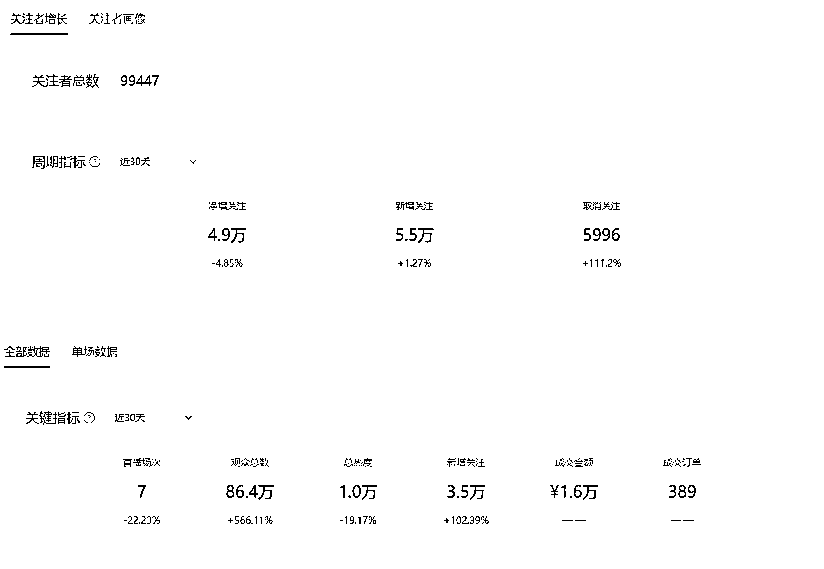

目录：

一、ChatGPT 准备工作

二、ChatGPT 快速起号

三、ChatGPT 高效直播

四、ChatGPT 变现路径

五、ChatGPT 踩坑经验

六、ChatGPT 未来展望

# 一、ChatGPT 准备工作

## 一）基本知识

ChatGPT 这个新事物刚出来不久，很多人在问 ChatGPT 如何注册，如何使用，是否需要下载等高频的问题。

故要做 ChatGPT 类账号，就有必要掌握 ChatGPT 基本知识，了解注册、使用流程，常见的问题答疑处理，可以分别写出一份文字教程，提供给有需要的粉丝朋友。

如果自己不写教程，那也要善于收集资料，收集网络上的公开教程提供给粉丝，做到对粉丝的这类基础问题有问必答，建立与粉丝之间的信任感。

## 二）引流链路

在抖音、快手等除视频号以外的短视频平台，想要引流到个人微信，各路大神可谓尽显神通，将个人微信通过图片、键盘、藏头诗等方式发给粉丝，在官方的规则打压下小心翼翼，如履薄冰。

但，在视频号，不但可以直接在主页留微信号（虽然也违规，但官方睁一只眼闭一只眼），还可以通过和企业微信联动，搭建一套自动化引流闭环链路。

如何搭建引流闭环？需要视频号结合企业微信，完成从视频号 -> 微信客服 -> 企业微信 -> 个人微信的自动化引流链路，学长跟大家一步一步往下说。

### 1、注册企业微信

首先，得需要有一个企业微信账号，没有的话注册一个即可，个人也可以注册企业微信，只是在功能上有一些限制。

操作流程：安装企业微信移动客户端 -> 选择微信登录 -> 进行登录授权 -> 输入管理员的手机号码及邮箱帐号 -> 填写公司名称及管理员真实姓名 -> 创建成功，开始体验企业微信

### 2、认证企业微信

因为未认证的企业微信只能添加 200 个客户，而在认证通过后，可以添加的好友数上限为 5w，所以认证企业微信是非常有必要的。

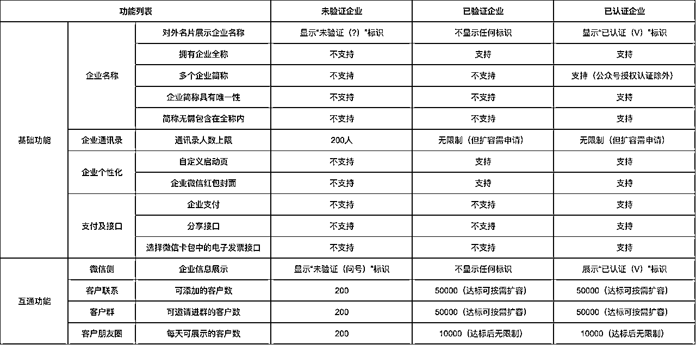

认证的要求就是必须要有营业执照，个体户或公司的营业执照都可以，认证费用 300/年。

操作流程：手机端企业微信 -> 工作台 -> 管理企业 -> 企业信息 -> 前往认证，按要求填写资料，提交后企业微信官方会审核资料，若未认证通过，按整改意见重新提交资料就可以。

### 3、绑定企业微信

视频号绑定企业微信，被绑定的视频号暂无要求要与企业微信主体一致，一个企业可绑定1000个视频号；一个视频号仅支持被一个企业绑定。

操作流程：手机端企业微信 -> 进入工作台 -> 选择视频号 -> 绑定视频号 -> 输入需要绑定的视频号 -> 视频号管理员扫码确认或点击下方我是管理员，去微信授权确认。

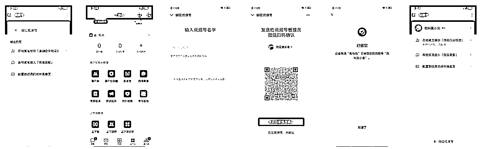

### 4、开启微信客服

视频号绑定企业微信之后，可以将视频号主页的私信升级为客服。

视频号接入微信客服后，可以在视频号的主页、直播间商品列表页、商品橱窗、视频号小店中接入客服。客户点击[客服] 即可发起咨询，同时还有以下优势：

*   工具拿起急用，有机器人、欢迎语等，配置客服自动回复，就实现视频号自动回复的功能。

*   可以在手机端/电脑端回复，更方便及时

*   可邀请客户添加企业微信

*   可在多个视频号同时接入后一起回复

在企业微信后台设置欢迎语及关键词，就可以做到私信客服自动答复。

操作流程：手机端企业微信 -> 工作台 -> 视频号 -> 选择在视频号接入[微信客服] -> 开始接入 -> 选择视频号，选择客服（除默认的这个客服账号，可以创建其他的客服，自定义名称和头像）-> 接入完成。

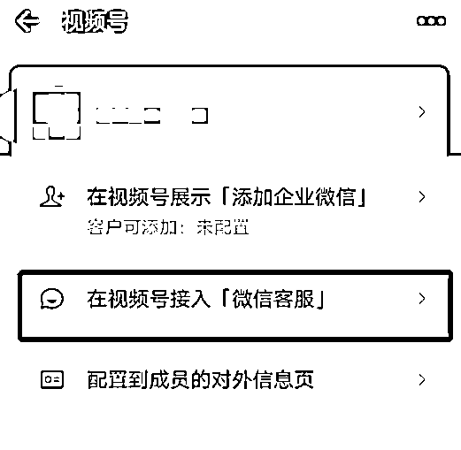

### 5、设置自动回复

设置微信客服的自动问答，即配置客服关键词自动回复功能。

操作流程：手机端企业微信 -> 进入工作台 -> 微信客服 -> 选择机器人（设置自动回复）-> 录入知识库 -> 添加问答（即自动回复的关键词及回答内容）-> 完成配置。

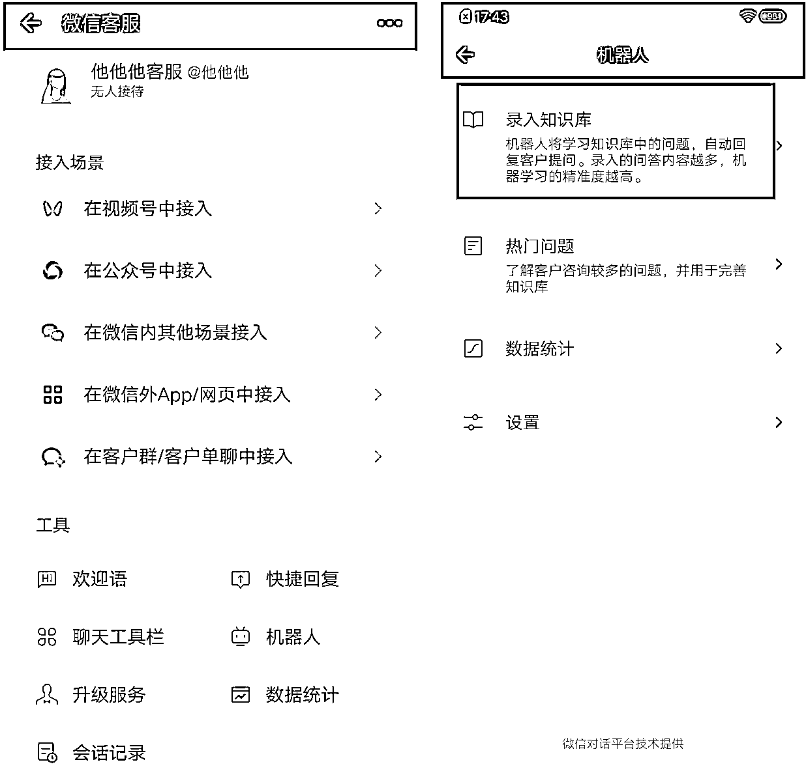

配置完成后，只要私信客服的消息包含关键词，即会触发机器人自动回复，比如直播时私信客服，回复进群，弹出群聊二维码，相比直播间直接展示群聊二维码更为安全有效。

配置的时候，除了问题关键词，还有必要添加一些相似的问法，保证在私信客服时只要沾边关键词都能触发关键词自动回复。

### 6、设置客服欢迎语

在设置客服欢迎语之前，需要在自动回复处配置一个含企业微信二维码的关键词自动回复，然后再设置客服欢迎语。

关键词的问题可以参考学长我的：点我添加客服微信，回答就是包含企业微信二维码的引导语。

操作流程：手机端企业微信 -> 工作台 -> 微信客服 -> 设置欢迎语。欢迎语内容就引导添加企业微信。注意在添加客户咨询较多的问题处添加设置好的 点我添加客服微信 的关键词回复。

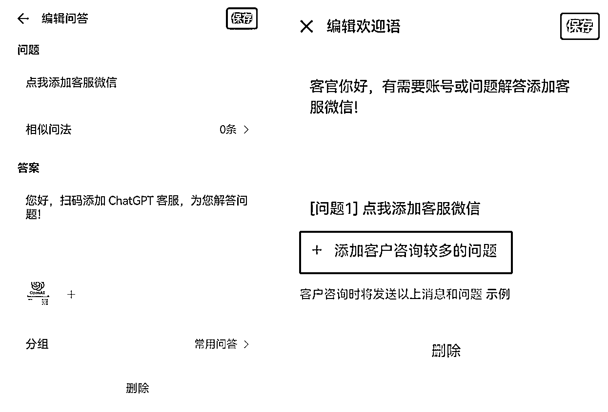

### 7、企业微信欢迎语

通过设置微信客服的欢迎语，引导通过客服的自动回复添加企业微信，企业微信这边，也需要设置欢迎语。设置欢迎语，在粉丝添加企业微信为好友时，会自动发送欢迎语。

操作流程：手机端企业微信 -> 工作台 -> 客户联系 -> 欢迎语处设置，主要将自己的产品介绍清楚，注意内容不超过手机的一页大小。

同时，最后留下微信二维码，附加说明：有问题请留言哈，或者加下方微信，消息太多，回复不及时，引导粉丝当企业微信回复不及时，可以添加个人微信得到更快的回复。

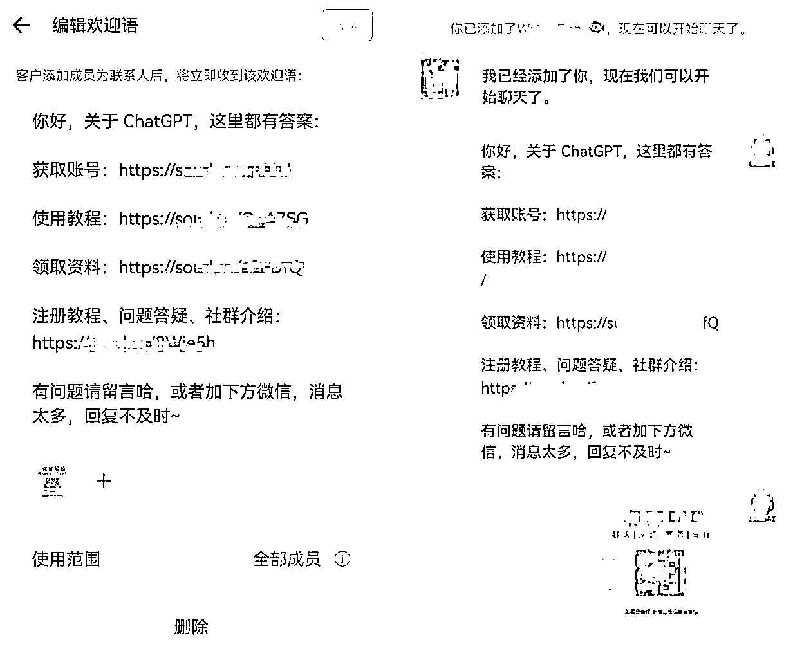

通过以上步骤，就搭建了一套视频号私信客服到企业微信及微信的自动引流链路，当企业微信的消息太多时可以不做回复，主要回复个人微信的消息，接待好每一个加到个人微信的客户。

## 三）短视频工具

### 1、剪辑工具

推荐剪映，剪辑视频时使用，网上教程很多，自行学习即可。

### 2、录屏工具

推荐 EV录屏，下载对应版本，安装完成即可，制作视频时使用。

使用方法：打开软件界面，第一步，选择选区录制，选择需要录制的区域；第二步，点击图标开始，视频录制完成，点击结束。

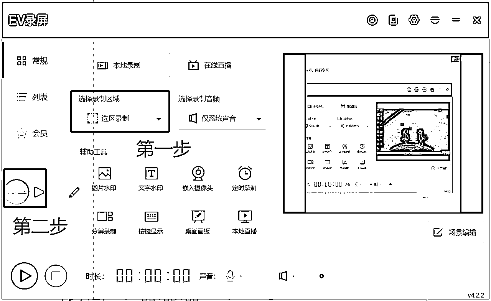

工具使用很简单，多尝试几次就熟练啦。

### 3、OCR工具

截图智能识别文字工具，推荐 Quicker，下载对应版本，安装完成。

使用方法：打开 Quicker ，按下鼠标滚轮或键盘 Ctal 键，就会弹出 Quicker 快捷界面，选择截图OCR。（若没有，可以在动作库里面搜索添加）

截取选择需要识别文字的区域，鼠标左键拖动选择，松开即可看到识别后的文字，复制使用即可。

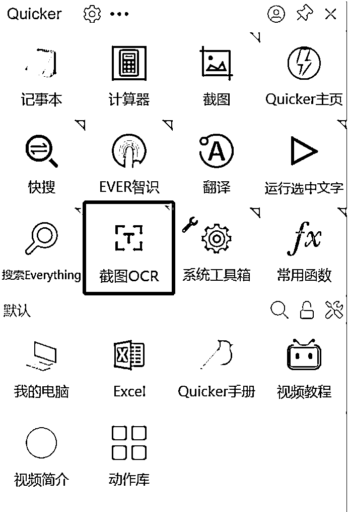

# 二、ChatGPT 快速起号

## 一）账号相关

### 1、名字

因视频号已经不允许新改名的视频号带有ChatGPT的关键字，所以大家可以选择 Chat/GPT 加其他的名字。沾边即可。

比如 Chat聊天助手，GPTAI智能机器人等，自己自行发挥，或者让 ChatGPT 给起一个名字。

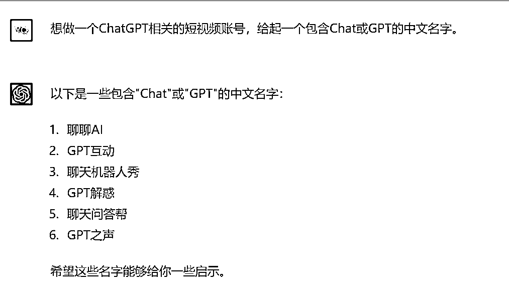

### 2、头像

头像参考同行，基本都是 OpenAI 或 ChatGPT 的图片，不再展开说明。

### 3、简介

简介部分可以留微信号，方便粉丝或商业合作找到你，然后大概介绍一下这个账号是要干嘛的。

主要尽可能的多堆加一些 ChatGPT 的关键词，可以提高账号搜索权重，多参考同行。

## 二）短视频创作

根据学长的经验，ChatGPT 主流的短视频类型有两种：图片截图类和录屏问答类，其中录屏问答类又是占绝大部分。

### 1、图片截图类（经测试一段时间，现阶段不推荐做）

制作过程：截图完整的 ChatGPT 问答的过程，然后加上标题、背景音乐、贴纸，丰富一下视频的内容。

注意图片截图类视频的时间保持在 10s 之内，别太长。学长我一般是 7s 多一点，时间短，观众看一遍看不完，得看第二遍，可以提高短视频的完播率。

制作短视频模板：将背景音乐、贴纸等元素固定后，后续每个视频只需要替换片段，选择新的截图图片，更改标题就可以，熟悉之后制作一个视频，只需要一分钟即可。

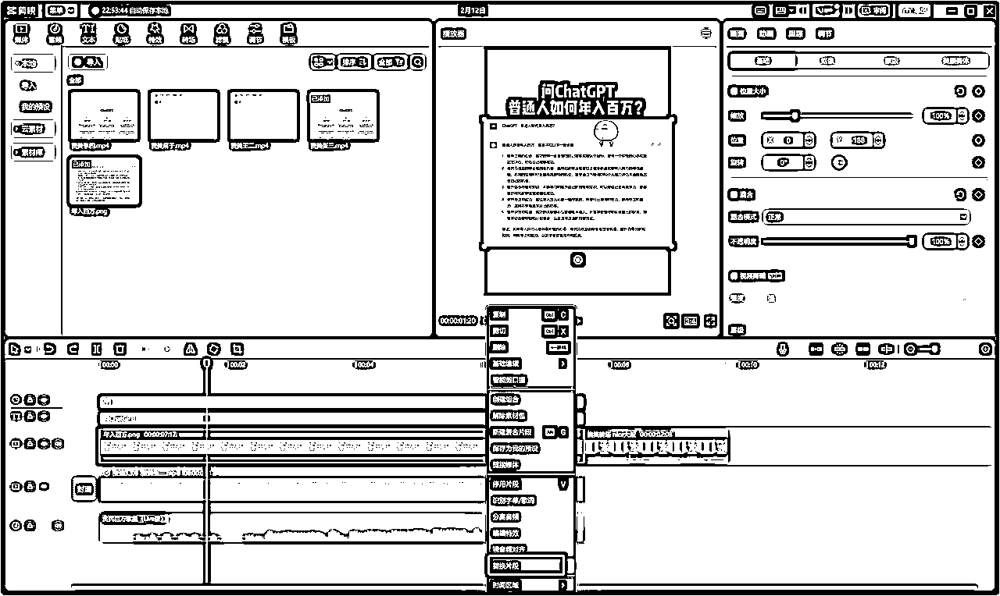

最新测试结果：视频号对于图片截图的短视频不友好，故图片截图类大家别做了，做录屏问答类。

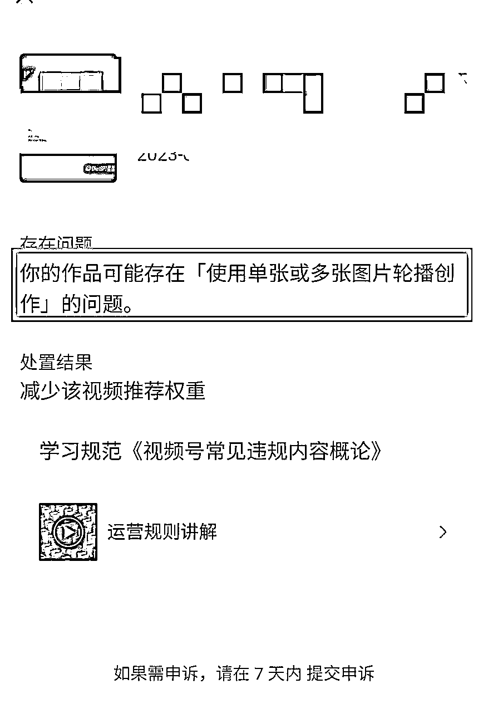

### 2、录屏问答类

制作过程：录制 ChatGPT 回答问题的整个过程，将录制的原视频导入剪映，掐头去尾，且通过视频变速将短视频的时长调整到 30s 内，最后再加标题、背景音乐、音效、贴纸，丰富一下短视频内容。

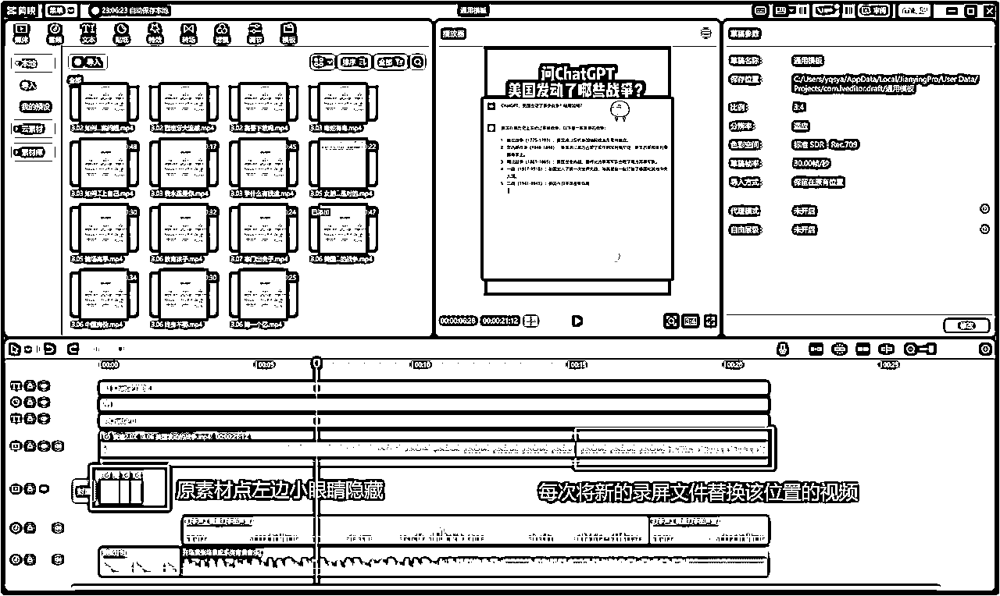

制作短视频模板：录屏问答类的视频也是可以将背景音乐、音效、贴纸等元素固定制作成模版，把模板的素材点左边小眼睛隐藏，然后每次新的录屏视频就放在模板素材上方进行剪辑就可以。

剪辑时注意调整短视频的大小，通过裁剪，将原录屏文件调整到合适大小，保证用户的观看体验，学长我做的是横屏，选择的是 3:4 的视频比例。

### 3、关键要素

短视频的制作都很简单，主要是选题，选择能引起共鸣、共情或争论的话题，一般浏览量都不错，比如挣钱、写情

书、写旅游攻略、可能被取代的职业等。

如果自己实在想不到合适的选题，那多刷一刷同行的视频，就知道该做什么问答的视频了。

还有一点就是要做出自己的视频风格，最基本的标题、排版要统一风格，短视频选题都已经很相近了，如果没有一点自己的风格，那粉丝是不是也就区分不了你与同类账号，粉丝粘性不高。

## 三）承接流量

### 1、引导转化

账号简介处要挂联系方式，方便别人有账号需要或问题解答的时候可以加到你。

有精力可以维护好评论区，每条视频下面做好评论引导，且对粉丝的提问做好引导回答，一般是问得多的就是如何

下载，如何使用这类的问题。

### 2、直播预约

一句话：账号主页保证至少有一条直播预约。

挂直播预约是为了在短视频爆了的时候承接短视频的流量，因为我们不知道哪条短视频会爆，所以提前挂直播预约，避免浪费了爆的短视频流量。

可以一周一个直播预约，可以挂个每周五 20:30 的直播预约，每个周四晚上就开下周五的直播预约。

如果挂直播预约后，直播预约的人不多，而且自己也不想播的话，取消预约就可以。

比如我这个直播预约，挂上之后，别人刷到我的短视频时就会弹出直播预约的窗口。

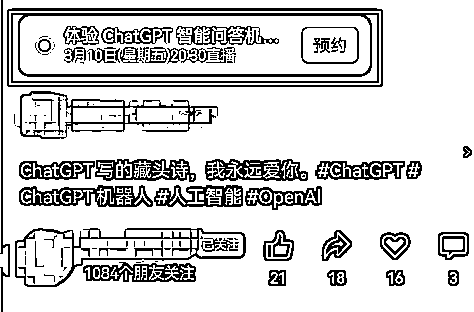

直播预约如何设置，看下图：

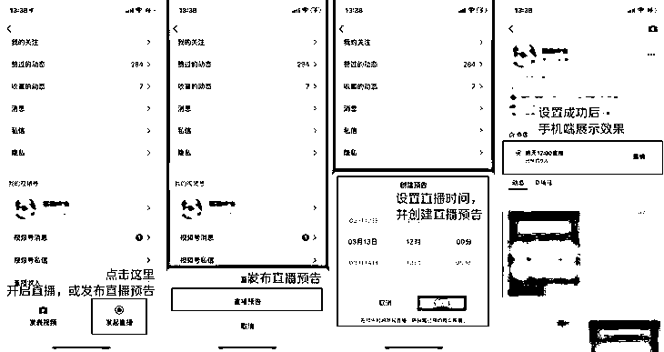

# 三、ChatGPT 高效直播

做自媒体一定要直播，短视频爆了后，一定要直播，直播才是转化流量最有效的途径。

在此之前，学长也并未直播过几次，经验并不丰富，但在短视频流量爆了之后，赶紧挂了个直播预约，赶鸭子上轿，开启了直播 ChatGPT 问答之路。

学长总共直播场次 9 场，其中一场还因为误操作刚开播就下了，有效直播 8 次，场观 62.5w，直播涨粉 3.3w，单次场观破 20w+。。

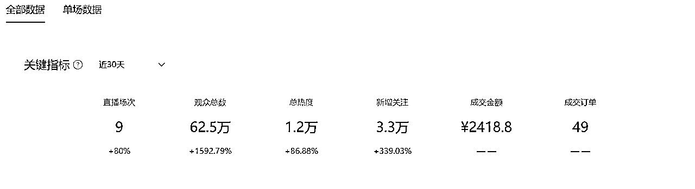

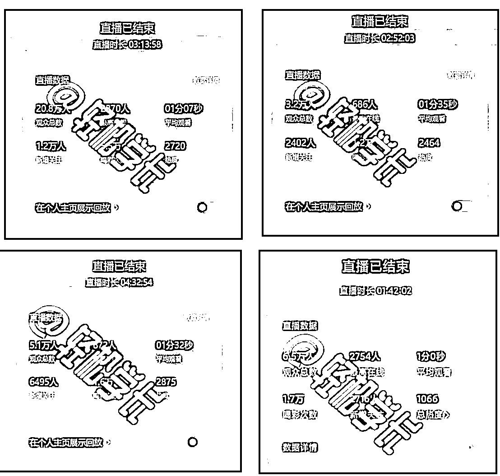

## 一）直播封面

直播封面简洁明了，直接说明直播间的主题，观众进入你的直播间能收获什么。

学长用的直播封面如下，比较简单粗暴：

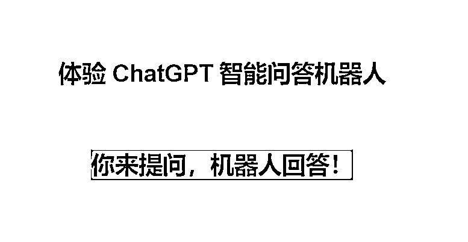

## 二）直播工具

直播工具不用其他第三方的，PC 端微信就可以，在 PC 端微信左下角三条杠，可以看到有一个视频号直播工具，用这个做 ChatGPT 直播问答就可以。

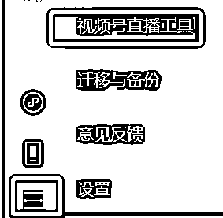

### 1、选择画面源

直播 ChatGPT 问答的话，在浏览器登录打开 ChatGPT，然后在视频号直播工具添加画面源时选择ChatGPT所在浏览器的窗口。

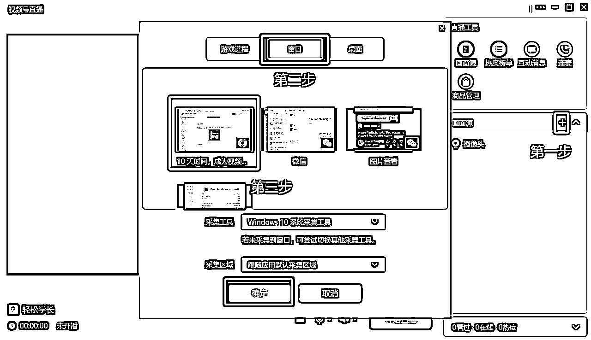

设置好 ChatGPT 的窗口作为画面源后，如下图所示，白框区域就是直播间展示界面

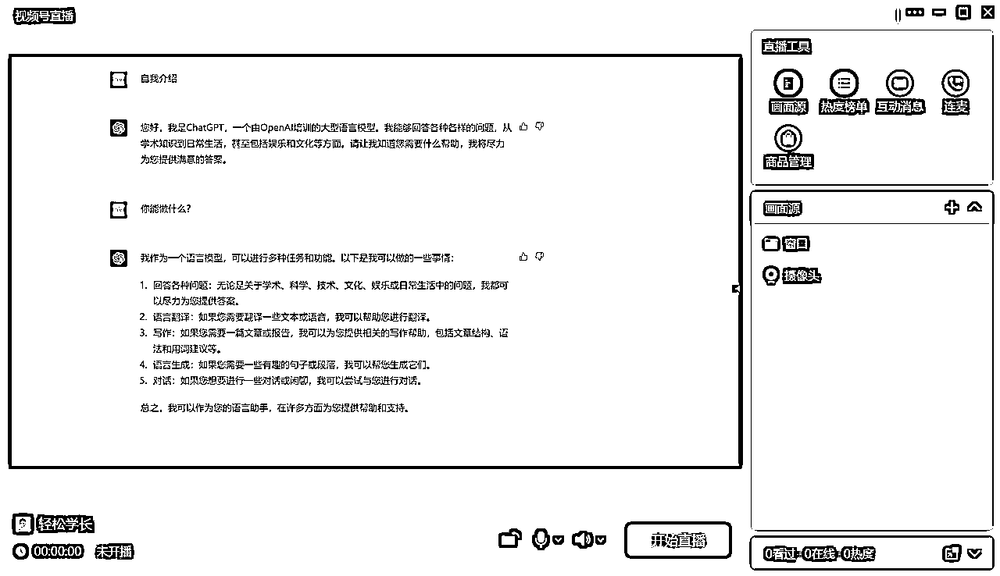

可以拖拽移动画面以展示不同的区域，也可以放大或缩小浏览器比例，让直播时文字大小适中，回答文字别太小，太小观众看着很费劲，也别太大，太大可能直播界面不能完整展示一个回答的过程。

注意：电脑直接登录 ChatGPT 直播问答是 3 月之前学长的直播玩法，3 月之后，为了安全起见，需要做好网络隔离。

直播 ChatGPT的话建议使用两台电脑，一台电脑登录 ChatGPT ，一台电脑直播。

直播的电脑通过远程控制软件（向日葵/Todesk）远程控制登录 ChatGPT 的电脑进行直播问答，直播界面就展示远程电脑 ChatGPT 界面的窗口。

进入 4 月份，已不建议大家播 ChatGPT，根据同行测试反馈，只要直播 ChatGPT 就会违规扣分，现阶段播文心一言挺好，把控好不回答敏感话题，就没有违规风险。

### 2、调整浮窗最大化

为了方便查看评论区消息及热度榜单，需要将互动消息和热度榜单的窗口浮窗最大化。

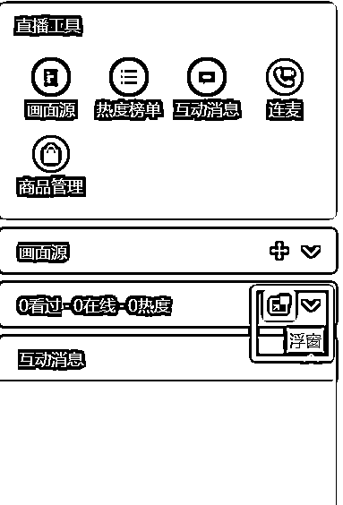

热度榜单浮窗放左边，互动消息浮窗放右边，效果如下：

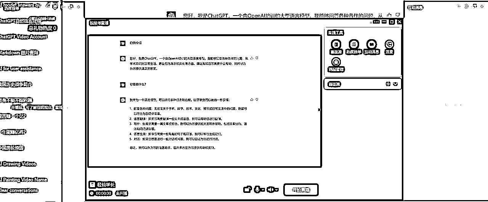

## 三）直播内容

### 1、直播内容

直播 ChatGPT 机器人回答评论区问题，引导观众在评论区提问问题，然后把问题通过截屏 OCR 工具识别成文字，复制问题到ChatGPT界面让机器人回答。

### 2、回答机制

刚起号，观众不多时，只要评论区有问题就让机器人回答，总比一个人在直播间自嗨好。

当有流量，直播间人多时，评论区的问题 ChatGPT 的速度已经回答不过来时。就要加一个回答机制：只回答粉丝

团成员的问题，粉丝团没问题的时候在随机回答评论区的问题。

除了基本的回答机制，还可以引入插队机制：粉丝团成员如果不想排队等待，可以刷一个稍微贵重一点的礼物，然后插队让机器人先回答他的问题。

问答和插队的机制，需要在直播过程中时不时的提起做引导，避免新进入直播间的观众不知道直播间的问答机制。

### 3、直播安全

直播时候特别要注意千万不能说到直播敏感词汇，这个大家网上搜一下直播违禁词，也可以看下视频号直播规

范，在直播规范内也都有说明。

经常评论区会出现的医疗、股市类问题千万不能回答，不然就是违规、扣分以及强制下播。

想要做直播，特别是做 ChatGPT 问答的直播，一定要明确什么能说，什么不能说，因为评论区提的问题有些很有

可能是违规的，作为主播，自己得做好筛查，别让评论区问题给自己挖坑。

同时，在 PC 端视频号助手 -> 直播 -> 直播管理 -> 敏感词处设置直播间敏感词，添加敏感词后，包含敏感词的评论不会出现在你的直播间。

## 四）直播气氛

### 1、聊天

复制问题让 ChatGPT 回答后，到问题回答完成，中间会有一段空闲时间，这段时间就可以跟观众闲聊，或者推广自己的产品。

比如正在回答如何学习英语，就可以聊一聊自己学英语相关的；在回答工作相关的，就跟观众聊一聊自己的工作，

总之，别让自己的嘴停下来，多和观众聊天，可以拉近双方的距离。

### 2、背景音乐

直播的时候，背景音乐也是必须的，挑选一些舒缓的音乐作为背景音乐挺不错。

直播间播放背景音乐，主要是避免当主播不说话时，直播间突然安静下来的尴尬场景，最怕空气突然安静。

### 3、问题提示

直播问答过程中可以跟观众提示现在正在回答的是什么问题，接下来回答的是什么问题，同时，可以将正在回答和

接下来回答的问题上墙。

当直播间人比较多时，即使是粉丝团成员的问题，可能也需要排队几分钟甚至更多，所以就有必要提示观众在提问之后耐心等待，一会儿就回答你的问题，再说一下目前有多少条评论信息在等着自己查看，预计等待时间。

同时也引入插队机制，不想等待的可以刷礼物插队。

### 4、提醒截屏

当 ChatGPT 回答完问题之后，提醒提问的观众截屏，留几秒的截屏时间，再提问下一个问题。

当然，也不是每一个问题都需要提醒截屏，可自行判断问题是否有价值，有价值需要的截屏的才提醒观众。

### 5、福袋抽奖

福袋抽奖，是为了留住刚进直播间的人，也给一直待在直播间的粉丝一些福利。

一般抽账号或者现金红包对于观众比较有吸引力，设置15分钟后开奖，要参与抽奖，就得在直播间多停留一段时间。

抽奖的条件看个人怎么设置，学长是设置关注主播才能抽奖或粉丝团成员参与抽奖。

挂福袋之后要随时引导参与抽奖，特别是针对刚进入直播间的观众，不做引导的话，可能很多人并不知道有福袋抽

奖这回事。

### 6、群发红包

直播间向微信私域粉丝发放红包，给私域粉丝发福利，吸引直播间观众加群。

*   开播前，设置指定微信群派发红包

*   主播引导观众加入指定微信群，设置直播间红包派发

*   入群观众成功领取红包

*   未入群观众无法领取，我们通过展示群二维码（短暂几秒）、私信客服回复进群等形式引导入群后领取。

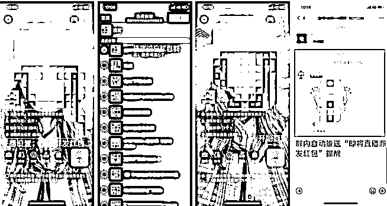

### 7、挂直播预约

视频号直播间可以推送直播预约，直播的时候一定要推送直播预约，然后做一些引导，给下场直播带来一定的初始流量。

# 四、ChatGPT 变现路径

变现路途学长就只说我实践过的，可行的方法路径，其他的大家可以自行探索。

## 一）代注册

虽然有提供注册教程，但有客户嫌麻烦或者不会注册，这就产生了赚钱的机会。

对于客户，代注册的好处就是有自己邮箱的 ChatGPT 账号，而且省去注册的时间，花钱买服务。

客户提供邮箱账号，密码，我们负责给客户注册 ChatGPT 账号，赚取一定的辛苦服务费用。

但代注册的这个业务人工成本也比较高，前期流量小的时候可以做一做，后期都是建议客户直接购买账号，或者高价代注册。

## 二）售卖账号

售卖账号是一个做 ChatGPT 账号最基本最常见的变现方式，从上游供应商那里拿货，有流量赚个差价。

ChatGPT 官网的账号价格已经很透明，批量拿 100 个起的话 1.5~2.0/个，零售价格不等。

而国内版本，学长这边是找了一个星球的球友给开发的，不需要找上游供应商，以月卡的模式，29.9/月，国内版本的优点是无网络限制条件，大众也可以使用。

在市面上各类网站、小程序版国内 ChatGPT，价格就不一了，有高有低，使用体验也各不相同。

售卖账号过程中，最主要的是要搭建自动发货的流程，减少人工成本，提高效率。学长这边主要经过两个阶段：淘

宝自动发货和发卡平台发货。

### 1、淘宝自动售卖

淘宝自动发货使用的是阿奇索自动发货软件，解决发货难题，可以做到24小时秒发不漏单不重发，15 块一个月。

目前走淘宝自动发货已经不能玩了，因为 ChatGPT 在淘宝是严禁上架的，虽然不写 ChatGPT 的关键词，但只要被淘宝检测到，就会违规扣分，补交保证金。如果再次上架就可能会扣保证金或封店等。

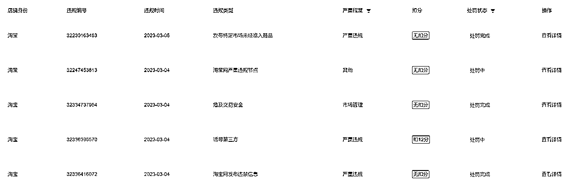

现在已经不建议在淘宝上架，风险太高。但如果淘宝店多，不担心违规问题的话（毕竟第一次违规没有扣保证金），也是可以继续在淘宝上做，毕竟大众对于淘宝商品有天然的信任感。

### 2、发卡平台售卖

发卡平台实际上便是一个平台交易了，你也可以把它看作是一个中小型的淘宝网，我们在发卡平台注册帐号以后便会有着归属于自身的店面。

在店面内就可以出售账号，给顾客提供一个便捷提交订单选购的服务平台，后台可以上传 ChatGPT 的账号密码，客户通过发卡平台下单后，发卡平台会自动将账号密码发给客户。

使用发卡平台代替淘宝+阿奇索自动发货的全自动发货链路，避免因在淘宝上架ChatGPT账号带来的风险。

发卡平台会收取3%~5%的服务费，这个是使用发卡平台的费用。

市面上的发卡平台很多，学长用的是多彩生活自助发卡网，大家可自行选择，主要是选择一个靠谱的，大一点的就行。

## 三）升级 Plus

普通账号与Plus账号的差别：

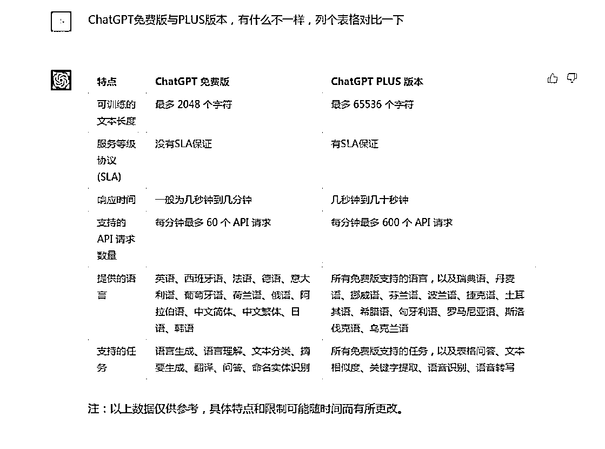

在 GPT-4.0 发布之后，PLUS 账号可以使用 GPT-4.0 模型，这也是升级 GPT-4.0 的一个卖点。

升级 Plus 账号官网是 20 刀，但国内常用的微信、支付宝不能支付，于是就有了升级 Plus 账号的业务，给客户升级 Plus 账号，收取一定的服务费。

## 四）售卖课程

ChatGPT 的火爆，于是就诞生的相关的 ChatGPT 的课程，售卖课程可以分两种：分销课程和自己做课程。

学长由于是兼职做的自媒体，所以前期选择分销别人的课程，但市面上的课程良莠不齐，带课程的时候要注意甑别。学长主要就带了一个玩赚ChatGPT的课程，因为参加过第一期，认可社群的价值。

售卖课程主要在微信/企业微信的私域内进行，在通过直播或短视频引导粉丝添加微信/企业微信，然后在朋友圈发社群相关资料，引导下单成交。

对于朋友圈私域运营这一块，学长不太擅长，就不展开说明了。

最近学长在筹备弄自己的付费课程，策划通过文字手册 + 直播课 + 群内答疑的方式，提供手把手指导在视频号做 ChatGPT 类账号及直播的服务。

## 五）付费咨询

付费咨询也是一种变现方式，没有精力做课程，但可以通过付费咨询的方式提供服务，为客户解答 ChatGPT 相关的问题。

这个在账号做大之后，有了账号做背书，自然就有客户找上门，比如学长就提供 199/小时，超出按 100/小时的付费咨询服务，也成交了一些。

付费咨询时要注意做好客户的交付预期，客户下单前先跟客户确定好想要咨询的问题，也提前做个准备。如果是不擅长的领域或者不知道的问题，最好是不接单或者咨询之前做好准备工作。

## 六）付费写稿

付费写稿需求量很大，学长在产品介绍页并没有挂付费写稿的服务，但也有一些有写稿需求的小伙伴添加学长微信问付费写稿的服务。

接稿时，先跟客户聊好需求，非毕业论文或重要性较高的内容就接，然后是字数要求以及是否有特殊需求。主要是根据字数收费，这个自己根据自身情况定价。

交付论文时，将 ChatGPT 写好的稿子汇总放到飞书文档，发给客户，满意就付款，不满意可以再修改，建议写稿加优化的时间不超过半小时，半小时后客户还不满意直接放弃这一单。

付费写稿接单时要注意毕业论文和重要性较高的论文不接，毕竟是使用 ChatGPT 写的文章，要是达不到要求，影响别人毕业那就罪过大了。

接一些短的小论文，演讲稿，发言稿这类，不需要查重，要求也相对简单，风险低，赚点小钱也可以。

这里学长给大家提供一个做 ChatGPT 账号付费写稿的的思路及变现模式，短视频账号展示 ChatGPT 问答，问答的内容就是写各种稿子，比如上面提到的演讲稿、发言稿、小论文等。

视频号主页介绍提供的服务，留下微信号，且客服做好引导加微信，自然会有客户找上门，适合时间比较充裕的小伙伴去做，因为就算是用 ChatGPT 写稿也是需要时间的。

## 七）广告合作

当账号有流量之后，寻求商务广告合作的就很多了，基本都是广告方主动找上门谈合作，比如带课程，带国内 ChatGPT 网站，带书等。

这个就根据自己的情况跟合作方谈价格了，也算是比较常规的一种变现方式。

# 五、ChatGPT 踩坑经验

在学长做 ChatGPT 账号这一个月的时间内，也踩了不少的坑，给大家分享下主要的几个点。

## 一）团队合作

当账号做大之后，一个人肯定是忙不过来的，就必须得找人一起团队合作，团队合作很重要，做好明确分工，可以提高效率。

学长的视频号流量爆了之后，学长就在星球找了两位小伙伴一起组成了一个线上团队，三个人各司其职，专注做自己的事就可以了。

学长我负责搞流量，做短视频、直播。一位小伙伴负责账号相关的问题，包含售前售后，升级 Plus 业务等。还有一位小伙伴负责中文版网址的开发工作。

## 二）提高效率

### 1、在线文档

产品介绍要使用在线文档。

在线文档的优点：一是方便共享和协作，在线文档可以轻松地与其他人共享和协作，无论他们在哪里。多人可以同时编辑同一文档，而不必担心版本控制问题。

二是可以多设备实时更新，学长可以在手机或电脑实时更新文档内容，粉丝随时随地查看到最新版本的文档。

随着产品或提供服务的增多，若全在企业微信欢迎语处展示产品信息的话文字太多，已经超过手机查看的一页大小，对于观看体验非常不友好。

这时候就有必要用到在线文档，将所有的产品及提供的服务都汇总到在线文档内，欢迎语处只保留关键信息。

学长企业微信欢迎语及微信的回复语中，都会带在线文档链接，如下所示

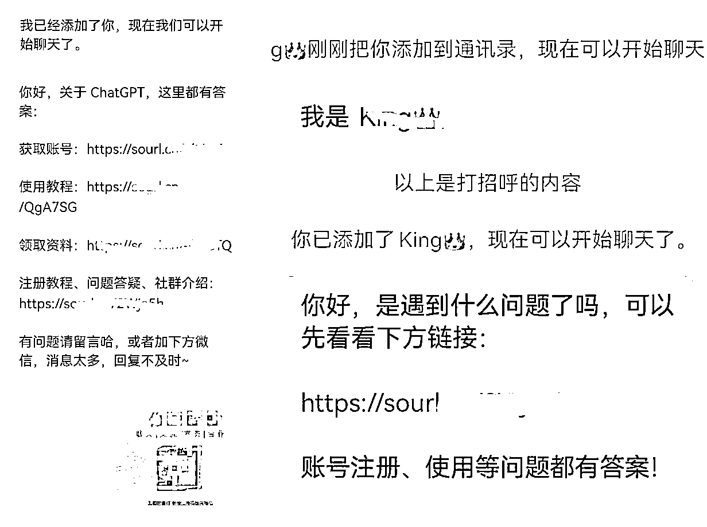

链接内都是在线文档，学长经过不断迭代的两版在线文档框架如下

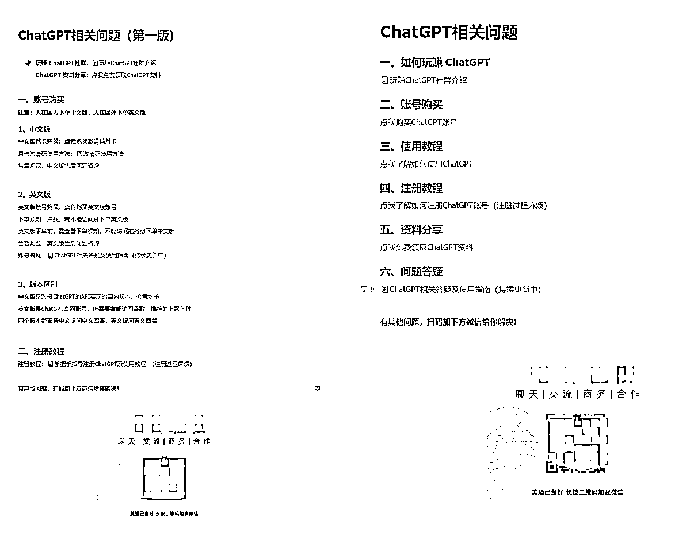

这是总的产品介绍目录，然后再引导点击相关内容部分文档，文档的内容都可以根据实际情况做出调整，在线文档展示的就是最新的产品介绍内容。

而且，在每个页面都需要留下自己的个人微信，做好引导，方便粉丝在观看文档时候想联系你时随地可以找到联系方式。

### 2、短链工具

分享链接要使用短链工具，将长链接转化为短链接。

短链工具有以下优点：

*   简洁美观：短链接占用的空间更小，使得链接更加简洁、易于分享。

*   跟踪统计：长链转短链工具通常提供跟踪统计功能，可以了解链接的点击量、来源和用户行为等信息，有助于分析营销活动的效果并改进营销策略。

*   方便：使用短链接还可以方便地进行更改、管理和更新，尤其是在需要更改链接目标时，只需更改短链接的指向即可，无需更新所有使用该链接的位置。

下面两张图分别是初期使用长链接的企业微信欢迎语和现在优化过后使用短链接的欢迎语，效果一目了然。

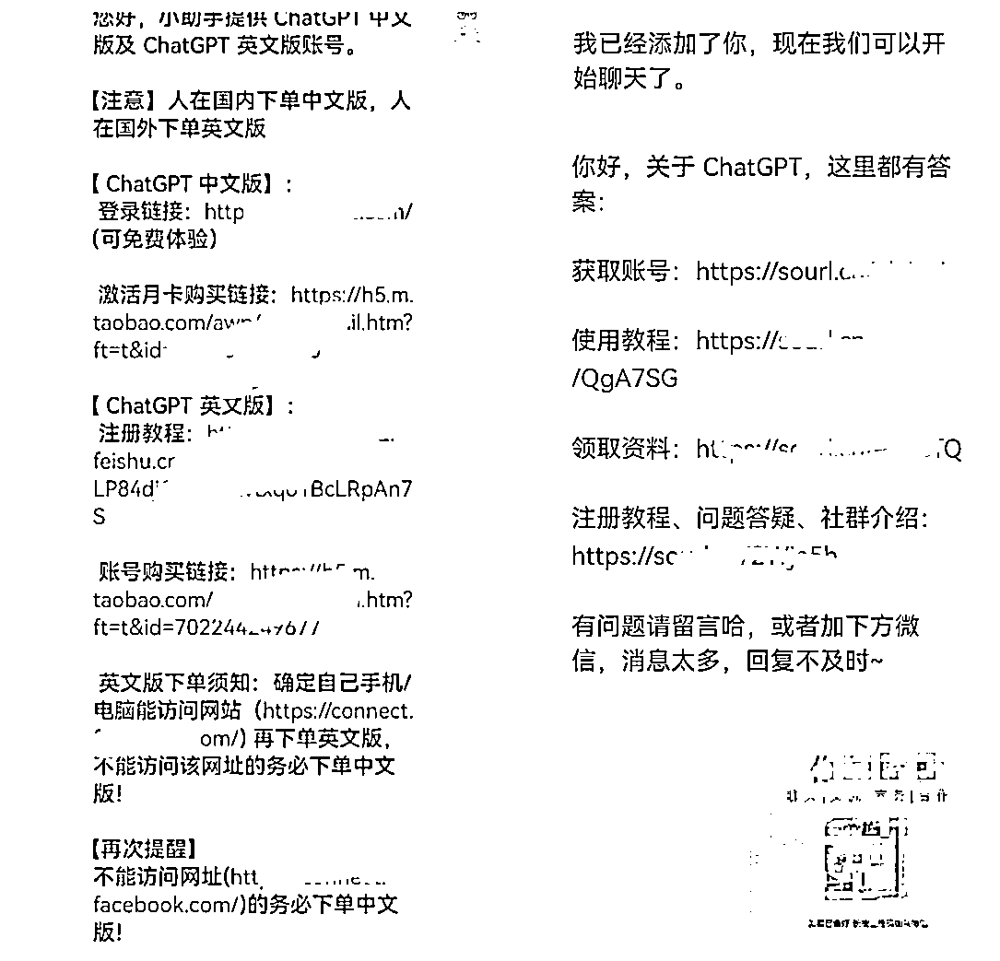

### 3、自动发货

自动发货主要就是为了节省人力，在售卖账号的部分有讲到，主要是两个阶段。

第一个阶段是淘宝售卖账号（属于淘宝违规商品，可能随时被下架），使用自动发货插件阿奇索完成自动发货流程。

第二阶段是使用发卡平台售卖账号，发卡平台有自动发货的功能，将账号录入系统，顾客下单后，自动将账号发货。

### 4、区别回复

对于加到个人微信的粉丝群体，要服务好客户，根据客户的不同来源做好区别回复，别一套回复语通用。回复语都是事先准备好，收藏使用。

学长我在视频号主页有留微信号，在产品介绍的文档内是留的微信二维码，在别人添加学长我为好友的时候，可以根据添加来源做不同的答复。

通过扫一扫添加，说明已经看过企业微信的欢迎语，即产品介绍，说明是有其他的问题，发一个问题提示指南作为回复语。

通过搜索账号添加好友，说明没有看过企业微信欢迎语，直接把企业微信的欢迎语作为回复发给客户。

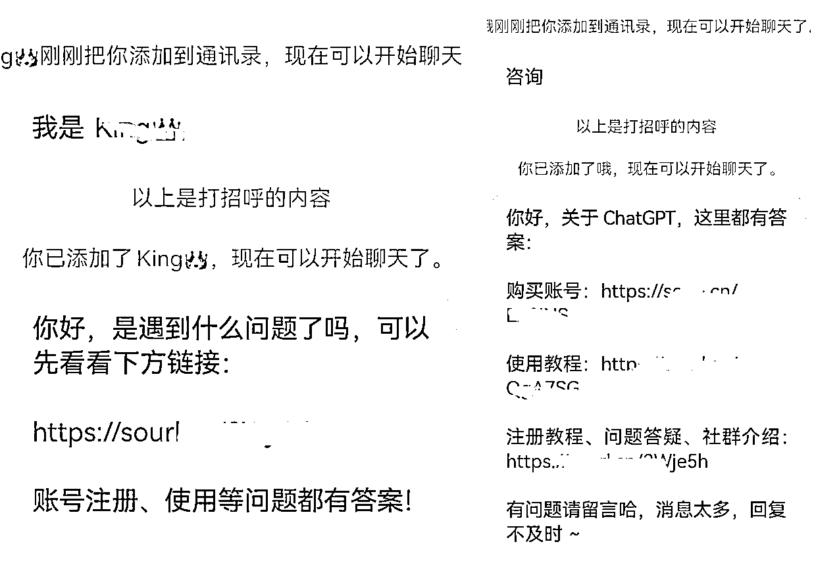

还有的直接备注是购买账号的，那就直接回复购买账号的链接，及引导的话术。

核心就一点，做到从用户角度出发，根据不同的人群需求发不同的消息答复。

## 三）防搬运

账号做大之后，难免会被别人抄袭、搬运，这不可避免。

但我们可以通过加水印提高直接搬运视频使用的难度，视频申明原创获得视频号对视频的原创保护权益。

### 1、加水印

在使用剪映剪辑视频的时候，可以添加文字水印，选择文本 -> 文字模板，可以找到一个 [这是水印] 的文字模板

把这是水印的几个字更换为你想要加的水印文字就可以啦，学长直接是加的视频号账号名称。

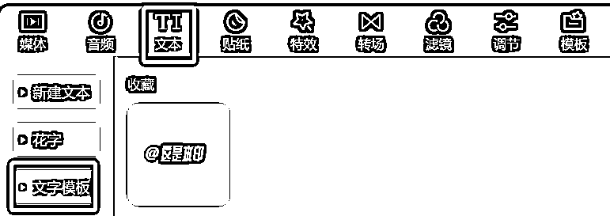

### 2、申明原创

视频号针对已认证或参加原创计划的账号，该账号在视频号内首发的内容将会得到保护，后发的相同内容被系统识别后将不会被推荐。

申请原创计划后，平台将保护原创作者的权益，打击搬运内容。若别人搬运你的短视频在视频号上发布的话，平台会自动维权了，判定内容为搬运内容。

如果是原创作品，在发表视号动态时勾选原创申明即可。

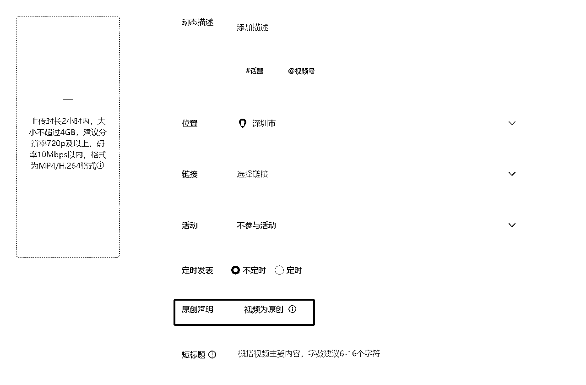

可以在 PC 端视频号助手 -> 扩展功能 -> 原创保护记录界面查看原创保护详情。

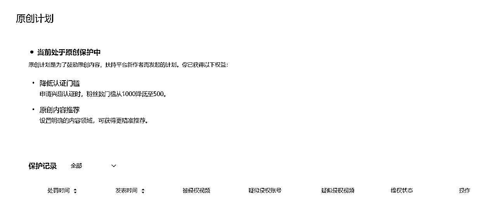

现在视频号内已经没有了原创计划的入口，这里附上原创计划的入口：https://channels.weixin.qq.com/mobile/original_plan.html#/（复制到微信内打开）

## 四）安全意识

做自媒体，一定要有安全意识，做之前或者做的过程中多看几遍官方的规则，避免出现违规、限流。

### 1、短视频安全

看视频号官方文档：微信视频号运营规范及视频号常见违规内容概览。

仔细看一下做哪些内容是违规的，避免出现违规的短视频内容造成违规限流。

### 2、直播安全

直播安全看视频号官方文档：微信视频号直播行为规范及微信视频号禁止发布的营销信息列表

直播时候别提到相关的直播违禁词，直播违禁词可以网上搜一下，各大平台的基本都一致。

同时，在 PC 端视频号助手设置好直播敏感词，直播时，包含敏感词的评论将不会出现在你的直播间。

### 3、风控意识

这里的风控指的是企业微信或个人微信的风控。

大量异地收款会被风控：从2022年3月1号开始，个人收款码不能用于经营收款，其中一个重要的点就是，收款二维码不能用于远程异地收款，当有大量异地收款时就会被风控，轻则减少收款笔数，重则冻结资金。

短时间添加好友过多：企业微信或个人微信短时间添加好友数太多，是可能被官方认为有诈骗嫌疑，学长的两个企业微信号就因为被风控，限制私信、群聊及添加好友功能。一个三天恢复，一个十天才恢复。

但收款多少笔或添加短时间好友多少会被风控，这个没有官方说明，按目前大家的猜测，是与账号的权重有关，平时多备几个账号，养号，以便流量到来时候可以承接。

# 六、ChatGPT 未来展望

作为 2023 年互联网的新贵，现在入局 ChatGPT 并不晚，人工智能是时代的大趋势。

就学长观点，ChatGPT 这个项目主要看平台政策，跟随平台的政策，更新项目的玩法，但引流链路、短视频及直播的玩法不会过时。

搭建视频号 + 企业微信 + 个人微信这一套引流成交链路，锻炼制作短视频及直播的能力，当下一个风口来临，是不是也可以小赚一笔，比如国内百度的文言一心。

玩法分享给大家，主要是看执行力，执行力强，跟着教程走，发视频，做直播，在 ChatGPT 的风口，起飞并不是难事。

学长祝大家都能在 ChatGPT 的风口小赚一笔！