# 陪诊行业的变现方式

> 来源：[https://oen722req0.feishu.cn/docx/ScDWdhjkHolKzAxyHpjclEDsnMg](https://oen722req0.feishu.cn/docx/ScDWdhjkHolKzAxyHpjclEDsnMg)

陪诊行业的变现方式都有哪些呢？

大家好，我是静水，生财4期的老圈友。从事陪诊行业近一年，最近这个职业特别火，也有一些圈友进入了这个行业。这次给大家分享我接触和了解到的陪诊变现方式。

1、给入行陪诊的圈友带来一些思考和启发。

2、广州作为华南地区医疗中心，我把近一年跑医院的经验分享出来，希望对来广州就医的圈友有所帮助。(见附件)

3、去医院就诊如果挂不到号，可以尝试的办法，详细可点击(新兴行业陪诊师如何入行)链接查看彩蛋环节

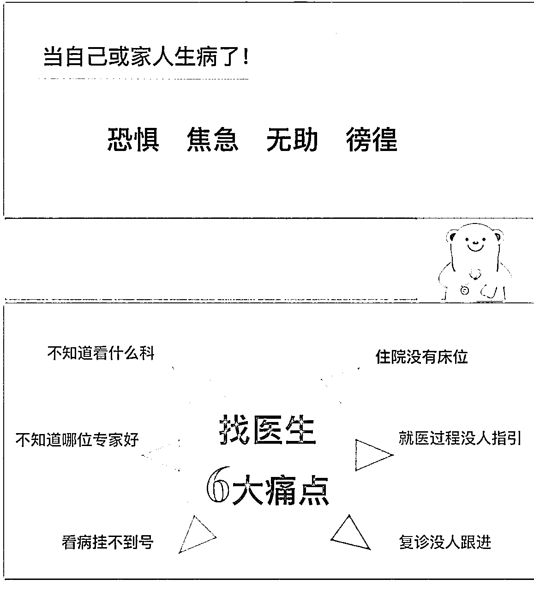

# 一：自己跑单

就医陪诊，代问诊 ，代开药 ， 办理出入院手续 ， 代取报告等

我目前的最高记录是跑5单，并不是每天都能跑5单，平均下来一天一单左右。一线城市半天收费标准是300元。

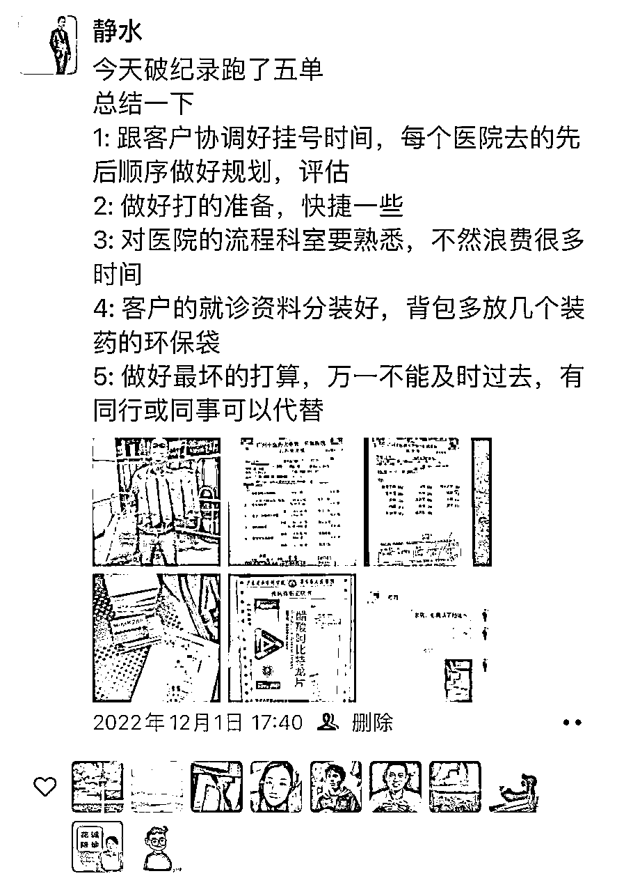

# 二：试管陪诊

试管婴儿一个周期需要去医院15次左右，我目前跟了11个周期，试管陪诊是行业的“护城河产品”。　做试管婴儿很多人不懂得流程，有人指导会节省很多时间，交通费，住宿费。

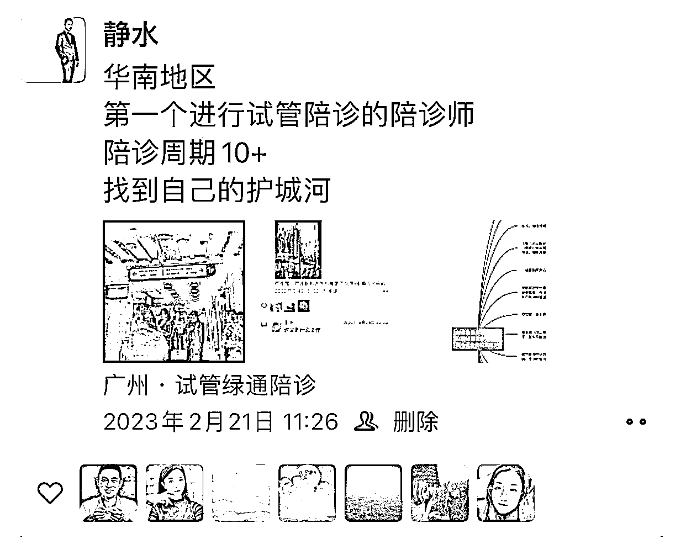

# 三：派单分成

获取流量后转派给同行分成，自己得3成，接单者分7成。美团可以上架陪诊的业务，最大的免费流量平台是抖音，陪诊行业不能投抖＋都是自然流量。

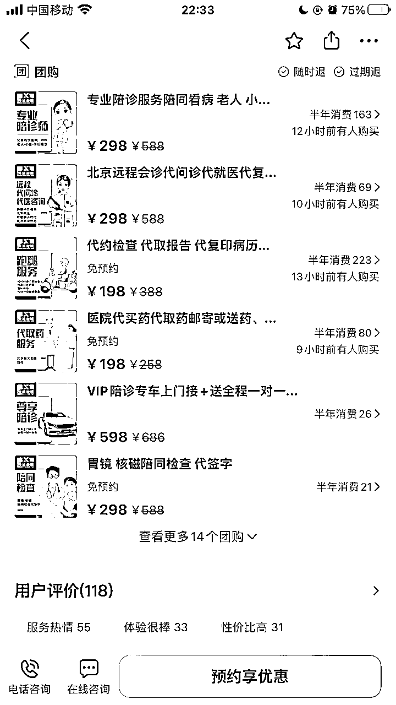

# 四：代购院内制剂

我爆过一个中医院制剂的视频(开胃醒脾饮)，收益2Ｗ＋，现在还不断有复购的。

院内制剂是指：医院自己研制的制剂，这种制剂在市场上缺乏替代品，且一般是独特配方，质量合格，长期使用证明有效，只在自己的医院内销售的

# 五：陪诊教学招收学员

目前陪诊课程从50-3000元这个范围的都有。我线下带过几个学员，因为没有录课程教人的时间成本太高，太耗时间，后期没有招学员了。想做陪诊教学的一定要先录好课程。抖音直播挂链接卖课程。

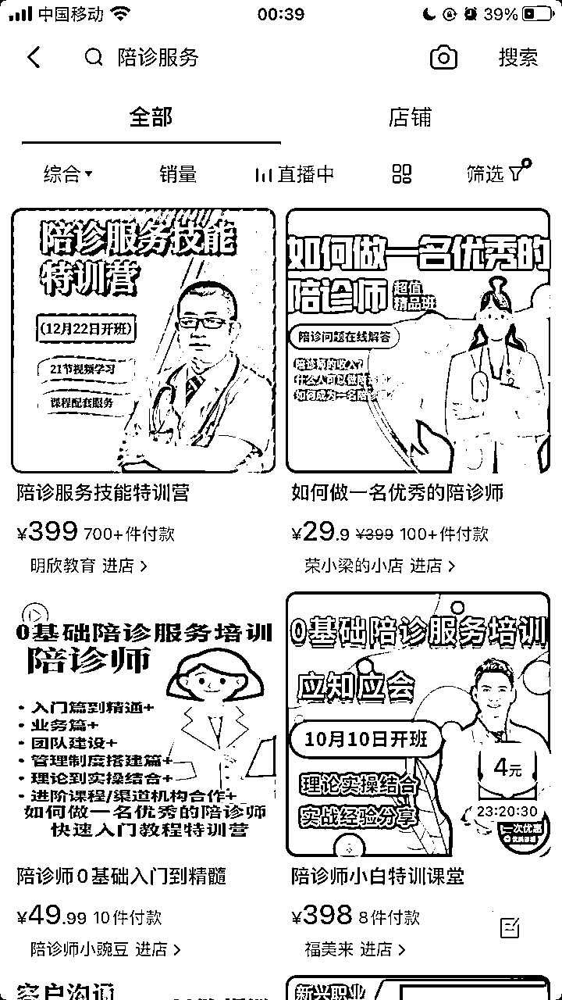

# 六：搭建公司体系招加盟商

收加盟费及加盟分成，一个加盟商5万-10万，另外还参与分公司的营业额分成。行业内目前优德医招加盟商是5万元，陪诊无忧是10万元，来自一名圈友的交流分享。

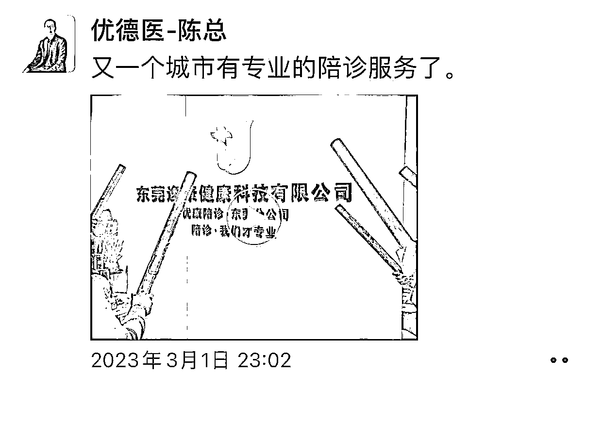

# 七：快速入院手术（就医绿通）

简单来说就是花钱买时间，大医院的话等一个床位做手术要1-2个月。走绿通一般能在7天内安排入院，快的话2-3天。绿通费用在5000-20000不等。我有个客户等候手术排了二个多月还没轮到。(中山大学附属第一医院全国综合实力第五）

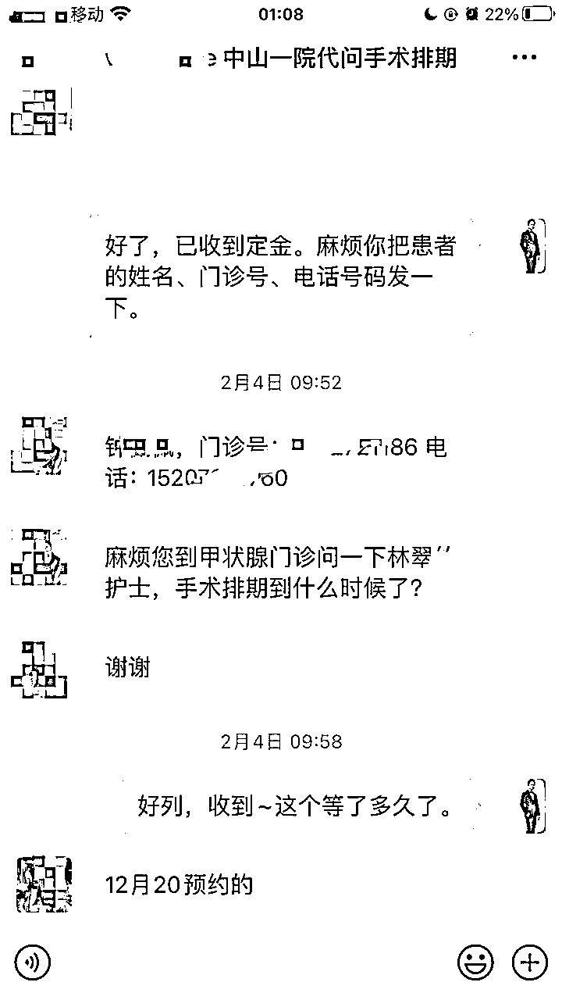

# 八： 代约九价疫苗，代购减肥产品等

全国四九价疫苗代约，代购司美格鲁肽注射液(诺和泰)等。

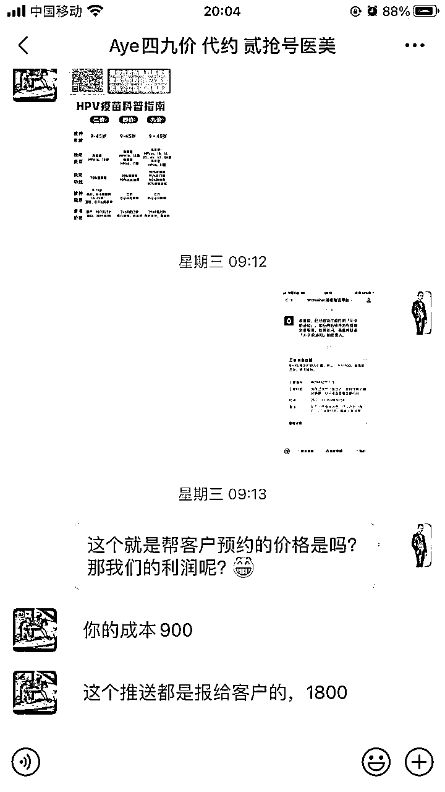

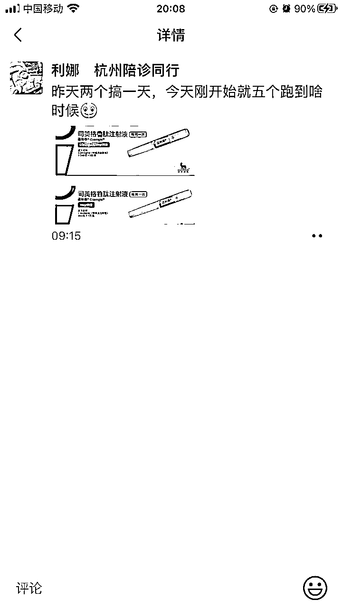

# 九：介绍药品及医疗器械进驻医院

有熟悉的医院科室资源，可以介绍药品及医疗器械进院分润。

# 十：介绍客户到大型私立医院，做检查治疗

PET-CT检查，女性子宫肌瘤，腺肌瘤无创磁波刀的治疗，伽玛刀治疗。

比如PET-CT，大医院做检查预约要一周以上，客户急需的话私立医院当天就能安排，费用7000元左右和公立医院差不多，佣金2000+。

备注:前海人寿广州总医院是前海人寿投资建设运营的第一家三级综合医院，总投资约60亿元。

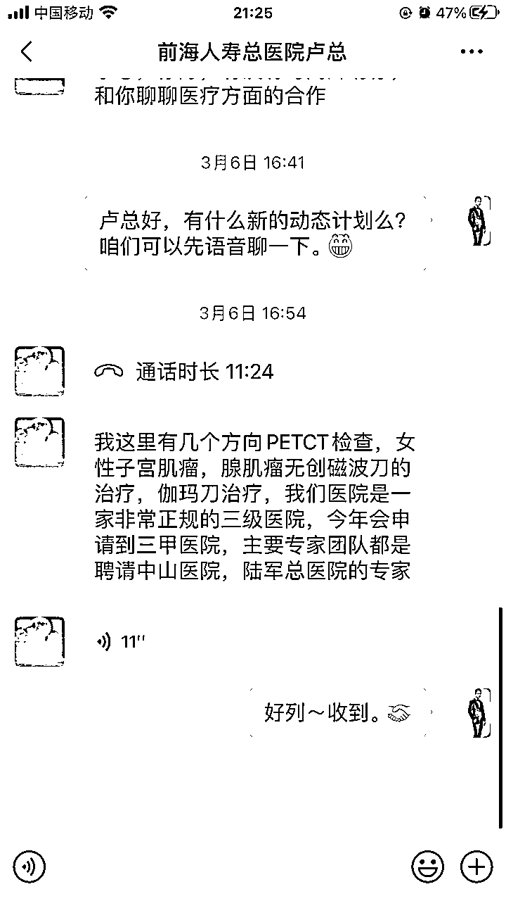

# 十一：介绍客户海外就医

中外癌症5年生存率，中国40.5%，英国54.3%，日本65.8%，美国67.1%。返实收金额的8-20%

# 十二：基因检测推广

很多大病需要做基因检测才能判断病情，再进行下一步的诊治。而这个检查，一般都是要到外面的机构做，医院里边没得做。找到机构合作推广，一单佣金在1000-3000之间。

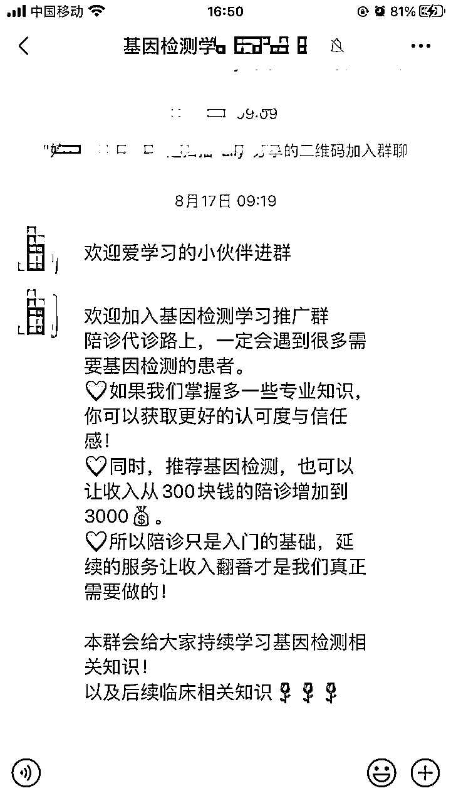

# 十三：帮忙挂号

自从做了陪诊，每天都有客户咨询能不能帮忙挂号。遇到一些老客户有需要就会联系牛牛帮他们挂，没有资源的话，一些热门的医生真的很难挂上，一单佣金50-100。

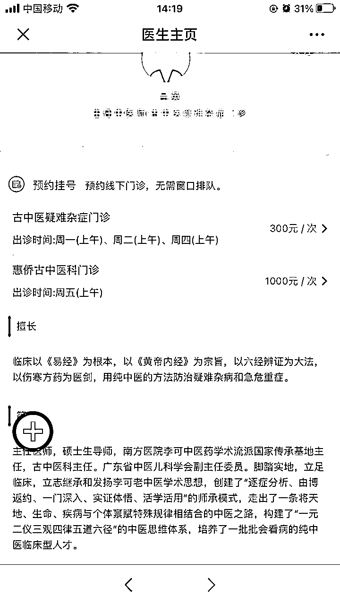

以上13点就是我目前了解和接触到的变现方式。在做的过程中会有各种各样的人来找你谈合作，要自己筛选判断合作项目机构的真实性及合法性。